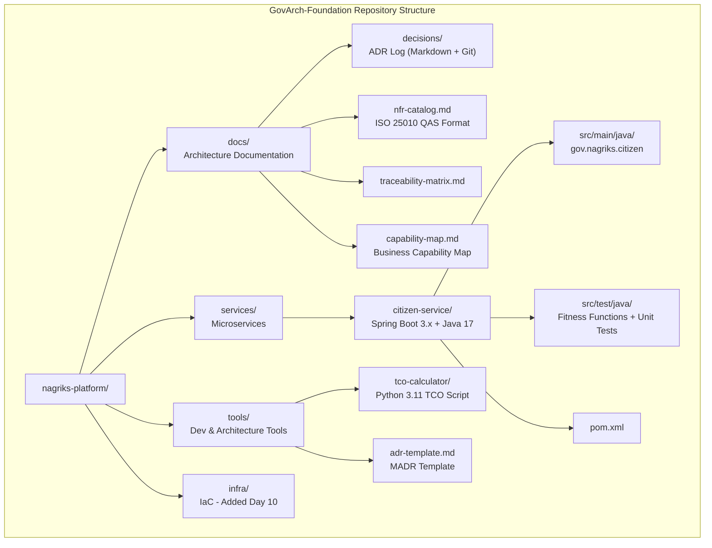

# DAY 1 — LAB DOCUMENT
## GovArch-Foundation Project
### Senior Engineer to Solution Architect Program

---

> **Document Classification:** Trainer's Playbook — Hands-On Lab Guide
> **Day:** 1 of 12
> **Companion Theory Document:** Day 1 Theory Document
> **Project Codename:** GovArch-Foundation
> **Estimated In-Class Demonstration Time:** 3.5 - 4 hours (woven through all four topics)

---

# TABLE OF CONTENTS

1. [Lab Overview and Architecture](#1-lab-overview-and-architecture)
2. [Prerequisites and Environment Verification](#2-prerequisites-and-environment-verification)
3. [Project Scaffold Setup](#3-project-scaffold-setup)
4. [Lab Section 1: NFR Catalog and Utility Tree](#4-lab-section-1-nfr-catalog-and-utility-tree)
5. [Lab Section 2: TCO Analysis Script](#5-lab-section-2-tco-analysis-script)
6. [Lab Section 3: ADR Repository with Git](#6-lab-section-3-adr-repository-with-git)
7. [Lab Section 4: Spring Boot Service with Architectural Traceability](#7-lab-section-4-spring-boot-service-with-architectural-traceability)
8. [Lab Section 5: Fitness Functions](#8-lab-section-5-fitness-functions)
9. [Lab Section 6: Business Capability Mapping Workshop](#9-lab-section-6-business-capability-mapping-workshop)
10. [Pre-Demonstration Verification Checklist](#10-pre-demonstration-verification-checklist)
11. [In-Class Demonstration Script](#11-in-class-demonstration-script)
12. [Cleanup Script](#12-cleanup-script)
13. [Full Project Repository Structure](#13-full-project-repository-structure)
14. [Quick Reference Card](#14-quick-reference-card)

---

# 1. LAB OVERVIEW AND ARCHITECTURE

## What We Are Building

The **GovArch-Foundation** project is the architectural scaffold for NagrikSeva — a fictional unified citizen services portal serving 50 million citizens across 3 Indian states. This is NOT a throwaway exercise project. It is Day 1 of a 12-day continuous build. Every subsequent day's lab extends this foundation.

By the end of Day 1's lab, you will have:

1. A Git repository with a professional ADR decision log
2. A machine-readable NFR catalog with QAS-format scenarios
3. A Python-based TCO comparison tool
4. A Spring Boot 3.x microservice skeleton with architectural annotations and fitness functions
5. A business capability map document

## Project Architecture (End State for Day 1)



## Lab Flow vs Theory Document Alignment

| Lab Section  | Theory Topic                         | Duration in Class |
| ------------ | ------------------------------------ | ----------------- |
| Sections 1-2 | Topic 1: NFRs, Trade-offs, Gov-Scale | 60 min            |
| Section 2    | Topic 2: TCO Analysis                | 45 min            |
| Sections 3-4 | Topic 3: ADRs & Traceability         | 75 min            |
| Sections 5-6 | Topic 4: Hands-on Mapping            | 30 min            |

---

# 2. PREREQUISITES AND ENVIRONMENT VERIFICATION

## 2.1 Required Software

Run the following verification script **before class**. Every item must pass.

```powershell
# File: tools/verify-environment.ps1
# Run this BEFORE the session to confirm all tools are available
# Expected: All checks print [PASS]. Any [FAIL] must be resolved before class.

Write-Host "`n========================================" -ForegroundColor Cyan
Write-Host " GovArch-Foundation Environment Check" -ForegroundColor Cyan
Write-Host " Day 1 - Senior Architect Program" -ForegroundColor Cyan
Write-Host "========================================`n" -ForegroundColor Cyan

$allPass = $true

function Check-Tool {
    param(
        [string]$ToolName,
        [string]$Command,
        [string]$MinVersion,
        [string]$VersionPattern
    )
    try {
        $output = Invoke-Expression $Command 2>&1 | Select-Object -First 1
        if ($output -match $VersionPattern) {
            $version = $Matches[0]
            Write-Host "[PASS] $ToolName - Found: $version" -ForegroundColor Green
        } else {
            Write-Host "[PASS] $ToolName - Found (version parse skipped)" -ForegroundColor Green
        }
    } catch {
        Write-Host "[FAIL] $ToolName - NOT FOUND. Install from prerequisites guide." -ForegroundColor Red
        $script:allPass = $false
    }
}

# Java 17
Check-Tool -ToolName "Java 17" `
           -Command "java -version 2>&1" `
           -MinVersion "17" `
           -VersionPattern "17\.\d+\.\d+"

# Maven
Check-Tool -ToolName "Apache Maven 3.8+" `
           -Command "mvn -version 2>&1" `
           -MinVersion "3.8" `
           -VersionPattern "3\.\d+\.\d+"

# Python 3.11+
Check-Tool -ToolName "Python 3.11+" `
           -Command "python --version 2>&1" `
           -MinVersion "3.11" `
           -VersionPattern "3\.1[1-9]\.\d+"

# Git
Check-Tool -ToolName "Git 2.x" `
           -Command "git --version 2>&1" `
           -MinVersion "2.0" `
           -VersionPattern "2\.\d+\.\d+"

# Docker Desktop
Check-Tool -ToolName "Docker Desktop" `
           -Command "docker --version 2>&1" `
           -MinVersion "24.0" `
           -VersionPattern "\d+\.\d+\.\d+"

# PowerShell 7
$psVersion = $PSVersionTable.PSVersion.Major
if ($psVersion -ge 7) {
    Write-Host "[PASS] PowerShell 7+ - Found: $($PSVersionTable.PSVersion)" -ForegroundColor Green
} else {
    Write-Host "[FAIL] PowerShell 7+ required. Current: $($PSVersionTable.PSVersion)" -ForegroundColor Red
    $allPass = $false
}

# Check JAVA_HOME
if ($env:JAVA_HOME) {
    Write-Host "[PASS] JAVA_HOME set: $env:JAVA_HOME" -ForegroundColor Green
} else {
    Write-Host "[WARN] JAVA_HOME not set. Maven may have issues." -ForegroundColor Yellow
}

# Check pip
Check-Tool -ToolName "pip (Python package manager)" `
           -Command "pip --version 2>&1" `
           -MinVersion "23.0" `
           -VersionPattern "\d+\.\d+"

Write-Host "`n========================================" -ForegroundColor Cyan
if ($allPass) {
    Write-Host " ALL CHECKS PASSED - Ready for Day 1" -ForegroundColor Green
} else {
    Write-Host " ONE OR MORE CHECKS FAILED - Resolve before class" -ForegroundColor Red
}
Write-Host "========================================`n" -ForegroundColor Cyan
```

**Run this with:**
```powershell
Set-ExecutionPolicy -ExecutionPolicy RemoteSigned -Scope CurrentUser
.\tools\verify-environment.ps1
```

## 2.2 Required Accounts and Access

| Resource          | URL                                                      | Notes                                                |
| ----------------- | -------------------------------------------------------- | ---------------------------------------------------- |
| GitHub account    | https://github.com                                       | For Git remote (optional for Day 1, required Day 2+) |
| Azure Free Tier   | https://portal.azure.com                                 | Not used Day 1; verify account exists                |
| ChatGPT / Copilot | https://chat.openai.com or https://copilot.microsoft.com | Used in Food for Thought exercise                    |

## 2.3 Python Dependencies

```powershell
# Install Python dependencies for TCO calculator
pip install tabulate colorama matplotlib pandas
```

## 2.4 Troubleshooting Common Environment Issues

| Issue                     | Symptom                                        | Resolution                                                                 |
| ------------------------- | ---------------------------------------------- | -------------------------------------------------------------------------- |
| Java not found            | `java -version` fails                          | Set `JAVA_HOME` to JDK 17 installation path; add `%JAVA_HOME%\bin` to PATH |
| Maven not found           | `mvn -version` fails                           | Download Maven 3.9.x; add `bin` directory to PATH                          |
| Python version mismatch   | Shows Python 3.9 or lower                      | Install Python 3.11+ from python.org; ensure it is first in PATH           |
| PowerShell script blocked | "Execution of scripts is disabled"             | Run `Set-ExecutionPolicy RemoteSigned -Scope CurrentUser`                  |
| Docker not running        | `docker --version` fails or daemon not running | Launch Docker Desktop; wait for whale icon in system tray to stabilize     |

---

# 3. PROJECT SCAFFOLD SETUP

## 3.1 Create the Master Project Directory

```powershell
# All commands run from PowerShell 7 terminal
# Trainer executes this OFFLINE before class

# Step 1: Choose your working directory
# Recommended: C:\workshops\day1
# Avoid paths with spaces

Set-Location C:\
New-Item -ItemType Directory -Path "workshops\day1" -Force
Set-Location C:\workshops\day1

# Verify current location
Write-Host "Working directory: $(Get-Location)" -ForegroundColor Green
```

## 3.2 Initialize Git Repository

```powershell
# Step 2: Create the root project directory
New-Item -ItemType Directory -Path "nagriks-platform" -Force
Set-Location nagriks-platform

# Step 3: Initialize Git repository
git init

# Step 4: Configure Git identity (use trainer's details or generic)
git config user.name "NagrikSeva Architect"
git config user.email "architect@nagriks.gov.in"

# Step 5: Create .gitignore
@"
# Java build artifacts
target/
*.class
*.jar
*.war

# Maven
.mvn/wrapper/maven-wrapper.jar

# Python
__pycache__/
*.pyc
*.pyo
.env
venv/
*.egg-info/

# IDE files
.idea/
.vscode/
*.iml
.classpath
.project

# OS files
.DS_Store
Thumbs.db

# Logs
*.log
logs/

# Environment configs (never commit secrets)
*.env
application-prod.yml
application-secret.yml
"@ | Out-File -FilePath ".gitignore" -Encoding UTF8

Write-Host "[OK] Git repository initialized" -ForegroundColor Green
```

## 3.3 Create Full Directory Structure

```powershell
# Step 6: Create the complete directory tree for the platform
# This structure will be populated across all 12 days

$directories = @(
    "docs\architecture\decisions",
    "docs\architecture\tco-analysis",
    "docs\architecture\compliance",
    "services\citizen-service\src\main\java\gov\nagriks\citizen\domain\model",
    "services\citizen-service\src\main\java\gov\nagriks\citizen\domain\port",
    "services\citizen-service\src\main\java\gov\nagriks\citizen\application",
    "services\citizen-service\src\main\java\gov\nagriks\citizen\adapter\api",
    "services\citizen-service\src\main\java\gov\nagriks\citizen\adapter\persistence",
    "services\citizen-service\src\main\java\gov\nagriks\citizen\adapter\external",
    "services\citizen-service\src\main\java\gov\nagriks\citizen\infrastructure\config",
    "services\citizen-service\src\main\java\gov\nagriks\architecture\annotation",
    "services\citizen-service\src\main\resources",
    "services\citizen-service\src\test\java\gov\nagriks\citizen\fitness",
    "services\citizen-service\src\test\java\gov\nagriks\citizen\unit",
    "tools\tco-calculator",
    "tools\scripts",
    "infra\terraform",
    "infra\kubernetes",
    "infra\docker"
)

foreach ($dir in $directories) {
    New-Item -ItemType Directory -Path $dir -Force | Out-Null
}

Write-Host "[OK] Directory structure created" -ForegroundColor Green

# Verify structure
Write-Host "`nProject Structure:" -ForegroundColor Cyan
Get-ChildItem -Recurse -Directory | Select-Object FullName | ForEach-Object {
    Write-Host "  $($_.FullName.Replace((Get-Location).Path + '\', ''))"
}
```

## 3.4 Create README.md

```powershell
# Step 7: Create the root README
@"
# NagrikSeva Platform — Architecture Repository

## Program: Senior Engineer to Solution Architect (12-Day Workshop)
## Day 1 Foundation: GovArch-Foundation

---

## Project Context

NagrikSeva is a unified citizen services portal serving 50 million citizens
across three Indian states. This repository contains the architecture
documentation, microservice implementations, and infrastructure code
built progressively across the 12-day workshop program.

## Repository Structure

```
nagriks-platform/
├── docs/architecture/          # Architecture documentation
│   ├── decisions/              # ADR (Architecture Decision Records)
│   ├── tco-analysis/           # Technology cost comparisons
│   └── compliance/             # Regulatory compliance artifacts
├── services/                   # Microservices (added per day)
│   └── citizen-service/        # Core citizen management service
├── tools/                      # Dev and architecture tooling
│   ├── tco-calculator/         # Python TCO analysis tool
│   └── scripts/                # Utility scripts
└── infra/                      # Infrastructure as Code (Day 10+)
    ├── terraform/
    ├── kubernetes/
    └── docker/
```

## Key Documents

| Document                                                        | Purpose                 |
| --------------------------------------------------------------- | ----------------------- |
| [NFR Catalog](docs/architecture/nfr-catalog.md)                 | All NFRs in QAS format  |
| [ADR Index](docs/architecture/decisions/README.md)              | Decision log index      |
| [Traceability Matrix](docs/architecture/traceability-matrix.md) | Req to Code mapping     |
| [Capability Map](docs/architecture/capability-map.md)           | Business capability map |

## Tech Stack

- **Language:** Java 17, Python 3.11+
- **Framework:** Spring Boot 3.x
- **Database:** PostgreSQL 15 (Day 3+), MongoDB 7 (Day 4+)
- **Messaging:** Apache Kafka (Day 3+)
- **IaC:** Terraform 1.5+ (Day 10+)
- **Container:** Docker + Kubernetes (Day 10+)

## Day Progress

- [x] Day 1: Architectural Foundations (NFRs, ADRs, TCO, Mapping)
- [ ] Day 2: API-First Design and DDD
- [ ] Day 3-12: Progressive build
"@ | Out-File -FilePath "README.md" -Encoding UTF8

Write-Host "[OK] README.md created" -ForegroundColor Green
```

---

# 4. LAB SECTION 1: NFR CATALOG AND UTILITY TREE

## What We Are Building
A machine-readable, Markdown-formatted NFR catalog for the NagrikSeva platform. This demonstrates how NFRs are documented as QAS (Quality Attribute Scenarios) and organized by ISO 25010 categories — directly applying Topic 1 from the theory document.

## 4.1 Create the NFR Catalog

```powershell
# Navigate to architecture docs
Set-Location C:\workshops\day1\nagriks-platform

# Create the NFR catalog
$nfrCatalog = @"
# NagrikSeva Platform — NFR Catalog
## Format: ISO 25010 Quality Attribute Scenarios (QAS)

**Version:** 1.0
**Created:** $(Get-Date -Format "yyyy-MM-dd")
**Owner:** Solution Architecture Team
**Review Cycle:** Every sprint planning; mandatory review before each major release

---

## How to Read This Catalog

Each NFR is written as a Quality Attribute Scenario (QAS) with six components:
- **Source:** Who or what triggers the stimulus
- **Stimulus:** The specific event or condition
- **Artifact:** Which system component is affected
- **Environment:** Under what conditions
- **Response:** What the system does
- **Measure:** How we verify the response is acceptable

Priority: H (High) | M (Medium) | L (Low)
Difficulty: H (High - significant architectural effort) | M (Medium) | L (Low)

---

## 1. Availability (ISO 25010: Reliability > Availability)

### NFR-AVAIL-001: Portal Uptime During Filing Deadlines
| Component                 | Value                                                                                                                       |
| ------------------------- | --------------------------------------------------------------------------------------------------------------------------- |
| **ID**                    | NFR-AVAIL-001                                                                                                               |
| **Priority / Difficulty** | H / H                                                                                                                       |
| **Source**                | 10 million concurrent citizens                                                                                              |
| **Stimulus**              | Simultaneously access NagrikSeva on the day of a national subsidy announcement or service deadline                          |
| **Artifact**              | Citizen authentication service and service catalog                                                                          |
| **Environment**           | Peak load; Azure India Central region; all three states simultaneously active                                               |
| **Response**              | System serves all authentication requests; non-critical features (analytics dashboard, document history) degrade gracefully |
| **Measure**               | P99 latency < 2 seconds for authentication; zero 5xx errors for core flows; error budget for non-critical: < 0.1%           |
| **ADR Reference**         | ADR-007 (PostgreSQL HA), ADR-010 (Circuit Breakers), ADR-015 (Kafka async)                                                  |
| **Test Reference**        | LoadTest-AVAIL-001 (k6 peak load scenario)                                                                                  |

---

### NFR-AVAIL-002: Graceful Degradation on External Dependency Failure
| Component                 | Value                                                                                                                                   |
| ------------------------- | --------------------------------------------------------------------------------------------------------------------------------------- |
| **ID**                    | NFR-AVAIL-002                                                                                                                           |
| **Priority / Difficulty** | H / M                                                                                                                                   |
| **Source**                | DigiLocker or Aadhaar UIDAI API                                                                                                         |
| **Stimulus**              | External dependency becomes unavailable or responds with > 5s latency                                                                   |
| **Artifact**              | Document verification service; identity verification service                                                                            |
| **Environment**           | Normal operating conditions; external service experiencing outage                                                                       |
| **Response**              | NagrikSeva continues to serve citizens with degraded functionality; document uploads queued; Aadhaar fallback to OTP-based verification |
| **Measure**               | Core service availability maintained at 99.95%; degraded mode activates within 10 seconds of external failure detection                 |
| **ADR Reference**         | ADR-010 (Circuit Breaker pattern)                                                                                                       |
| **Test Reference**        | ResilienceTest-AVAIL-002 (Fault injection: DigiLocker unavailability)                                                                   |

---

## 2. Performance Efficiency (ISO 25010: Performance Efficiency)

### NFR-PERF-001: Citizen Authentication Response Time
| Component                 | Value                                                               |
| ------------------------- | ------------------------------------------------------------------- |
| **ID**                    | NFR-PERF-001                                                        |
| **Priority / Difficulty** | H / H                                                               |
| **Source**                | Individual citizen                                                  |
| **Stimulus**              | Submits Aadhaar OTP for login                                       |
| **Artifact**              | Identity and Access Management service                              |
| **Environment**           | Peak load (10M concurrent sessions); Azure India Central            |
| **Response**              | Authentication completes and JWT token issued                       |
| **Measure**               | P50 < 300ms; P95 < 800ms; P99 < 2000ms; zero timeouts               |
| **ADR Reference**         | ADR-007 (PostgreSQL + Redis session cache), ADR-012 (Stateless JWT) |
| **Test Reference**        | LoadTest-PERF-001                                                   |

---

### NFR-PERF-002: Document Upload Throughput
| Component                 | Value                                                                                                 |
| ------------------------- | ----------------------------------------------------------------------------------------------------- |
| **ID**                    | NFR-PERF-002                                                                                          |
| **Priority / Difficulty** | M / M                                                                                                 |
| **Source**                | Citizen                                                                                               |
| **Stimulus**              | Uploads a supporting document (PDF, JPEG) during service application                                  |
| **Artifact**              | Document Management service; Azure Blob Storage                                                       |
| **Environment**           | Normal load; file size up to 10MB                                                                     |
| **Response**              | Document uploaded, virus-scanned, and acknowledged                                                    |
| **Measure**               | Upload acknowledgment < 5 seconds for files up to 10MB; 99.9% virus scan completion within 30 seconds |
| **ADR Reference**         | ADR-014 (Azure Blob Storage for documents)                                                            |
| **Test Reference**        | LoadTest-PERF-002                                                                                     |

---

## 3. Security (ISO 25010: Security)

### NFR-SEC-001: Citizen PII Encryption
| Component                 | Value                                                                                                                        |
| ------------------------- | ---------------------------------------------------------------------------------------------------------------------------- |
| **ID**                    | NFR-SEC-001                                                                                                                  |
| **Priority / Difficulty** | H / M                                                                                                                        |
| **Source**                | Any actor (internal or external)                                                                                             |
| **Stimulus**              | Attempts to access citizen PII (name, Aadhaar token, address, mobile number) through any vector                              |
| **Artifact**              | Citizen Profile database; API responses; application logs                                                                    |
| **Environment**           | Normal operation; security audit; data breach scenario                                                                       |
| **Response**              | PII is encrypted at rest (AES-256); masked in logs; never exposed in full in API responses without explicit authorization    |
| **Measure**               | Zero plaintext PII in database, logs, or API responses without authorization; AES-256 encryption confirmed by automated scan |
| **ADR Reference**         | ADR-005 (Jasypt field-level encryption), ADR-006 (Log masking)                                                               |
| **Test Reference**        | SecurityTest-SEC-001 (PII exposure scan)                                                                                     |

---

### NFR-SEC-002: Unauthorized Access Prevention
| Component                 | Value                                                                                                  |
| ------------------------- | ------------------------------------------------------------------------------------------------------ |
| **ID**                    | NFR-SEC-002                                                                                            |
| **Priority / Difficulty** | H / H                                                                                                  |
| **Source**                | Malicious actor or unauthorized government officer                                                     |
| **Stimulus**              | Attempts to access citizen records outside their authorized scope                                      |
| **Artifact**              | All citizen-facing and officer-facing APIs                                                             |
| **Environment**           | Normal operation; attempted privilege escalation                                                       |
| **Response**              | Request rejected with HTTP 403; incident logged with actor identity, timestamp, and attempted resource |
| **Measure**               | Zero successful unauthorized record accesses; 100% of rejected access attempts logged within 100ms     |
| **ADR Reference**         | ADR-008 (Keycloak RBAC), ADR-009 (API Gateway authorization)                                           |
| **Test Reference**        | SecurityTest-SEC-002 (RBAC boundary testing)                                                           |

---

## 4. Compliance (Regulatory — Derived from DPDP Act 2023, IT Act 2000)

### NFR-COMP-001: Data Residency — India Jurisdiction
| Component                 | Value                                                                                                           |
| ------------------------- | --------------------------------------------------------------------------------------------------------------- |
| **ID**                    | NFR-COMP-001                                                                                                    |
| **Priority / Difficulty** | H / M                                                                                                           |
| **Source**                | DPDP Act 2023; MeitY data governance policy                                                                     |
| **Stimulus**              | Any citizen PII is stored, processed, or transmitted                                                            |
| **Artifact**              | All databases, message queues, caches, and backup storage                                                       |
| **Environment**           | All environments including disaster recovery                                                                    |
| **Response**              | All PII remains within Azure India regions (Central India: West-Central India; South India)                     |
| **Measure**               | Zero PII stored outside India Azure regions; confirmed by quarterly compliance audit and automated Azure Policy |
| **ADR Reference**         | ADR-007 (PostgreSQL India region), ADR-014 (Blob Storage India region)                                          |
| **Test Reference**        | ComplianceTest-COMP-001 (Azure Policy compliance report)                                                        |

---

## 5. Auditability (ISO 25010: Security > Accountability)

### NFR-AUDIT-001: Immutable Audit Trail
| Component                 | Value                                                                                                                              |
| ------------------------- | ---------------------------------------------------------------------------------------------------------------------------------- |
| **ID**                    | NFR-AUDIT-001                                                                                                                      |
| **Priority / Difficulty** | H / M                                                                                                                              |
| **Source**                | Government officer or system process                                                                                               |
| **Stimulus**              | Performs any state-changing action on a citizen record or application                                                              |
| **Artifact**              | Audit log service; event store                                                                                                     |
| **Environment**           | All environments; all state transitions                                                                                            |
| **Response**              | Every state change recorded with: actor identity, timestamp (UTC+IST), action type, before-state, after-state, reason code         |
| **Measure**               | 100% of state transitions captured; audit records immutable (append-only); retention 7 years per IT Act; retrieval P99 < 3 seconds |
| **ADR Reference**         | ADR-009 (Event Sourcing for audit), ADR-013 (Append-only audit store)                                                              |
| **Test Reference**        | AuditTest-AUDIT-001                                                                                                                |

---

## 6. Maintainability (ISO 25010: Maintainability)

### NFR-MAINT-001: Service Isolation — Database Per Service
| Component                 | Value                                                                                                      |
| ------------------------- | ---------------------------------------------------------------------------------------------------------- |
| **ID**                    | NFR-MAINT-001                                                                                              |
| **Priority / Difficulty** | M / M                                                                                                      |
| **Source**                | Development team; new feature requirement                                                                  |
| **Stimulus**              | A new service is added to the platform                                                                     |
| **Artifact**              | Platform service architecture                                                                              |
| **Environment**           | Development and production                                                                                 |
| **Response**              | New service operates with its own data store; no shared database access between services                   |
| **Measure**               | Zero cross-service database queries detected by fitness function in CI/CD; confirmed on every pull request |
| **ADR Reference**         | ADR-003 (Database-per-service pattern), ADR-006 (Hexagonal Architecture)                                   |
| **Test Reference**        | FitnessFunction-MAINT-001 (ArchUnit database isolation test)                                               |

---

## Utility Tree Summary

| QAS ID        | Quality Attribute | Priority | Difficulty | Architectural Driver? |
| ------------- | ----------------- | -------- | ---------- | --------------------- |
| NFR-AVAIL-001 | Availability      | H        | H          | YES                   |
| NFR-AVAIL-002 | Availability      | H        | M          | No                    |
| NFR-PERF-001  | Performance       | H        | H          | YES                   |
| NFR-PERF-002  | Performance       | M        | M          | No                    |
| NFR-SEC-001   | Security          | H        | M          | No                    |
| NFR-SEC-002   | Security          | H        | H          | YES                   |
| NFR-COMP-001  | Compliance        | H        | M          | No                    |
| NFR-AUDIT-001 | Auditability      | H        | M          | No                    |
| NFR-MAINT-001 | Maintainability   | M        | M          | No                    |

**Primary Architectural Drivers (H/H):** NFR-AVAIL-001, NFR-PERF-001, NFR-SEC-002
These three scenarios drive every major architectural decision in the platform.
"@

$nfrCatalog | Out-File -FilePath "docs\architecture\nfr-catalog.md" -Encoding UTF8
Write-Host "[OK] NFR Catalog created: docs\architecture\nfr-catalog.md" -ForegroundColor Green
```

## 4.2 Verify NFR Catalog

```powershell
# Verify the file was created correctly
$catalog = Get-Content "docs\architecture\nfr-catalog.md"
Write-Host "NFR Catalog line count: $($catalog.Count)" -ForegroundColor Cyan

# Count NFRs defined
$nfrCount = ($catalog | Select-String "NFR-").Count
Write-Host "NFR entries found: $nfrCount" -ForegroundColor Cyan

# [EXPECTED: NFR Catalog line count: ~170; NFR entries found: 9+]
```

---

# 5. LAB SECTION 2: TCO ANALYSIS SCRIPT

## What We Are Building
A Python 3.11 command-line TCO calculator that models the 5-year cost of two database options for NagrikSeva. This makes the TCO analysis from Topic 2 tangible and executable — the trainer runs it live and students see the numbers generated dynamically.

## 5.1 Create the TCO Calculator

```powershell
Set-Location C:\workshops\day1\nagriks-platform
```

```python
# File: tools/tco-calculator/tco_calculator.py
# Python 3.11+ | NagrikSeva Platform - Technology TCO Analysis Tool
#
# PURPOSE: Interactive TCO comparison for technology stack decisions
# USAGE:   python tco_calculator.py
# OUTPUT:  Console table + optional bar chart
#
# IMPORTANT: All figures are ILLUSTRATIVE ESTIMATES based on publicly
# available Azure pricing and India market salary data (2024).
# Always validate with current vendor pricing and your finance team.

import json
from dataclasses import dataclass, field
from typing import Dict, List
from tabulate import tabulate
from colorama import init, Fore, Style

# Initialize colorama for Windows terminal colors
init(autoreset=True)

DISCLAIMER = """
================================================================================
DISCLAIMER: All cost figures in this tool are ILLUSTRATIVE ESTIMATES derived
from publicly available cloud pricing and India market salary data (2024).
They are NOT quotes, NOT projections, and NOT binding in any way.
Always validate with current vendor pricing and your internal finance team.
Currency: Indian Rupee (INR). 1 Lakh (L) = INR 100,000
================================================================================
"""

@dataclass
class CostComponent:
    """
    Represents a single cost dimension in the TCO model.
    All amounts in INR Lakhs (L) over the specified period.
    """
    name: str
    description: str
    option_a_cost: float    # INR Lakhs - low estimate
    option_a_high: float    # INR Lakhs - high estimate
    option_b_cost: float    # INR Lakhs - low estimate
    option_b_high: float    # INR Lakhs - high estimate
    period_years: int = 5
    notes: str = ""


@dataclass
class TcoModel:
    """
    5-Year Total Cost of Ownership model for a technology decision.
    Models two competing options with low/high estimate ranges.
    """
    decision_title: str
    option_a_name: str
    option_b_name: str
    scenario_context: str
    components: List[CostComponent] = field(default_factory=list)

    def add_component(self, component: CostComponent):
        self.components.append(component)

    def calculate_totals(self):
        """Calculates total TCO for both options (low and high estimates)."""
        a_low = sum(c.option_a_cost for c in self.components)
        a_high = sum(c.option_a_high for c in self.components)
        b_low = sum(c.option_b_cost for c in self.components)
        b_high = sum(c.option_b_high for c in self.components)
        return a_low, a_high, b_low, b_high

    def print_report(self):
        """Prints a formatted TCO comparison report to console."""
        print(Fore.CYAN + "\n" + "=" * 80)
        print(Fore.CYAN + f"  TCO ANALYSIS: {self.decision_title}")
        print(Fore.CYAN + "=" * 80)
        print(Fore.YELLOW + f"\n  Scenario: {self.scenario_context}")
        print(Fore.YELLOW + f"  Period: 5 Years\n")

        headers = [
            "Cost Component",
            f"{self.option_a_name}\nLow (INR L)",
            f"{self.option_a_name}\nHigh (INR L)",
            f"{self.option_b_name}\nLow (INR L)",
            f"{self.option_b_name}\nHigh (INR L)",
            "Notes"
        ]

        rows = []
        for c in self.components:
            rows.append([
                c.name,
                f"{c.option_a_cost:.1f}",
                f"{c.option_a_high:.1f}",
                f"{c.option_b_cost:.1f}",
                f"{c.option_b_high:.1f}",
                c.notes[:40] + "..." if len(c.notes) > 40 else c.notes
            ])

        print(tabulate(rows, headers=headers, tablefmt="grid"))

        a_low, a_high, b_low, b_high = self.calculate_totals()

        print(Fore.GREEN + "\n" + "-" * 80)
        print(Fore.GREEN + "  5-YEAR TCO SUMMARY")
        print(Fore.GREEN + "-" * 80)

        summary = [
            ["TOTAL (Low Estimate)", f"INR {a_low:.1f}L", "", f"INR {b_low:.1f}L", "", ""],
            ["TOTAL (High Estimate)", "", f"INR {a_high:.1f}L", "", f"INR {b_high:.1f}L", ""],
        ]

        print(tabulate(summary,
                      headers=["", f"{self.option_a_name}", "", f"{self.option_b_name}", "", ""],
                      tablefmt="simple"))

        # Calculate savings
        savings_low = b_low - a_low
        savings_high = b_high - a_high
        ratio_low = b_low / a_low if a_low > 0 else 0
        ratio_high = b_high / a_high if a_high > 0 else 0

        print(Fore.MAGENTA + f"\n  Cost Advantage of {self.option_a_name} over {self.option_b_name}:")
        print(Fore.MAGENTA + f"  Low Estimate Savings:  INR {savings_low:.1f}L "
              f"({ratio_low:.1f}x cheaper)")
        print(Fore.MAGENTA + f"  High Estimate Savings: INR {savings_high:.1f}L "
              f"({ratio_high:.1f}x cheaper)")

        print(Fore.RED + "\n  IMPORTANT: TCO alone does not make the decision.")
        print(Fore.RED + "  Consider: team capability, vendor risk, ecosystem fit,")
        print(Fore.RED + "  regulatory compliance, and long-term strategic alignment.")
        print(Fore.CYAN + "=" * 80 + "\n")

    def export_json(self, filepath: str):
        """Exports TCO model to JSON for audit and documentation."""
        data = {
            "decision_title": self.decision_title,
            "option_a": self.option_a_name,
            "option_b": self.option_b_name,
            "scenario": self.scenario_context,
            "period_years": 5,
            "currency": "INR",
            "unit": "Lakhs (1L = 100,000 INR)",
            "disclaimer": "Illustrative estimates only",
            "components": [
                {
                    "name": c.name,
                    "description": c.description,
                    "option_a_low": c.option_a_cost,
                    "option_a_high": c.option_a_high,
                    "option_b_low": c.option_b_cost,
                    "option_b_high": c.option_b_high,
                    "notes": c.notes
                }
                for c in self.components
            ]
        }
        totals = self.calculate_totals()
        data["totals"] = {
            "option_a_low": totals[0],
            "option_a_high": totals[1],
            "option_b_low": totals[2],
            "option_b_high": totals[3]
        }
        with open(filepath, 'w') as f:
            json.dump(data, f, indent=2)
        print(Fore.GREEN + f"[OK] TCO model exported to: {filepath}")


def build_database_tco_model() -> TcoModel:
    """
    Builds the NagrikSeva database technology TCO model.
    Decision: PostgreSQL 15 (Azure Managed) vs Oracle Database 19c

    Scenario: 500 concurrent connections, 200M records, 3TB data,
    10-year data retention, DPDP Act compliance required.
    All costs in INR Lakhs over 5 years.
    """
    model = TcoModel(
        decision_title="Database Technology Selection: PostgreSQL 15 vs Oracle 19c",
        option_a_name="PostgreSQL 15\n(Azure Managed)",
        option_b_name="Oracle DB 19c\n(On-Prem / OCI)",
        scenario_context=(
            "NagrikSeva Citizen Portal: 500 concurrent connections, "
            "200M citizen records, 3TB data, 10-year retention, "
            "DPDP Act 2023 compliance (India data residency)"
        )
    )

    # Component 1: Software Licensing
    model.add_component(CostComponent(
        name="Software License",
        description="Database engine licensing cost",
        option_a_cost=0.0,       # PostgreSQL: open source
        option_a_high=0.0,
        option_b_cost=120.0,     # Oracle EE: processor license (illustrative)
        option_b_high=300.0,
        notes="PG: open source. Oracle: processor-based EE licensing"
    ))

    # Component 2: Infrastructure / Hosting
    model.add_component(CostComponent(
        name="Infrastructure / Hosting",
        description="Cloud VM, storage, network egress",
        option_a_cost=45.0,      # Azure DB for PostgreSQL Flexible, 8vCore, 32GB, HA
        option_a_high=80.0,
        option_b_cost=60.0,      # OCI or on-prem equivalent
        option_b_high=120.0,
        notes="PG: Azure managed HA. Oracle: OCI or on-prem hardware"
    ))

    # Component 3: DBA / Operations Labor
    model.add_component(CostComponent(
        name="DBA / Operations Labor",
        description="Database administration and operations staffing",
        option_a_cost=30.0,      # Shared DBA, mid-senior level
        option_a_high=50.0,
        option_b_cost=60.0,      # Oracle-certified DBA, higher market rate
        option_b_high=120.0,
        notes="Oracle DBA market rate 30-50% higher in India"
    ))

    # Component 4: Development Integration Effort
    model.add_component(CostComponent(
        name="Development Integration",
        description="Engineer time for DB integration, drivers, ORM config",
        option_a_cost=5.0,       # Standard JDBC, Spring Data JPA
        option_a_high=10.0,
        option_b_cost=15.0,      # Oracle-specific types, potential PL/SQL
        option_b_high=25.0,
        notes="Oracle requires specific JDBC drivers and often PL/SQL"
    ))

    # Component 5: Support Contracts
    model.add_component(CostComponent(
        name="Support Contracts",
        description="Vendor support and maintenance contracts",
        option_a_cost=0.0,       # Community + Azure platform support tier
        option_a_high=8.0,       # Azure Premier Support add-on
        option_b_cost=20.0,      # Oracle Premier Support (22% of license/year)
        option_b_high=40.0,
        notes="Oracle Premier Support mandatory for patches"
    ))

    # Component 6: Training
    model.add_component(CostComponent(
        name="Training",
        description="Team training and certification",
        option_a_cost=2.0,
        option_a_high=5.0,
        option_b_cost=5.0,
        option_b_high=10.0,
        notes="Oracle certification courses significantly more expensive"
    ))

    # Component 7: Exit / Migration Cost (risk-weighted)
    model.add_component(CostComponent(
        name="Exit / Lock-in Risk Cost",
        description="Risk-weighted cost of migrating away (probability * migration cost)",
        option_a_cost=0.0,       # Standard SQL; easy migration; low lock-in
        option_a_high=5.0,
        option_b_cost=20.0,      # PL/SQL, Oracle-specific types create high exit cost
        option_b_high=50.0,
        notes="Oracle PL/SQL and proprietary features create significant lock-in"
    ))

    return model


def build_messaging_tco_model() -> TcoModel:
    """
    Secondary model: Kafka vs Azure Service Bus
    Demonstrates the framework works across technology categories.
    """
    model = TcoModel(
        decision_title="Messaging Platform: Apache Kafka vs Azure Service Bus",
        option_a_name="Apache Kafka\n(Azure HDInsight / AKS)",
        option_b_name="Azure Service Bus\n(Premium Tier)",
        scenario_context=(
            "NagrikSeva event streaming: 50,000 events/second peak, "
            "7-day event retention, 5 consumer groups, "
            "cross-service event distribution"
        )
    )

    model.add_component(CostComponent(
        name="Platform Cost",
        description="Hosting and platform licensing",
        option_a_cost=36.0,     # AKS + Kafka cluster (3 brokers, 8vCore each)
        option_a_high=60.0,
        option_b_cost=20.0,     # Azure Service Bus Premium, 1 messaging unit
        option_b_high=35.0,
        notes="Kafka: higher infra cost; Service Bus: managed, lower infra"
    ))

    model.add_component(CostComponent(
        name="Operational Overhead",
        description="DevOps effort to manage platform",
        option_a_cost=20.0,     # Kafka requires dedicated expertise
        option_a_high=40.0,
        option_b_cost=5.0,      # Fully managed; minimal ops
        option_b_high=10.0,
        notes="Kafka ops complexity is significant; Service Bus is managed"
    ))

    model.add_component(CostComponent(
        name="Feature Capability Gap",
        description="Cost of workarounds for missing features",
        option_a_cost=0.0,      # Kafka: full event sourcing, replay, compaction
        option_a_high=0.0,
        option_b_cost=15.0,     # Service Bus: limited replay; need workarounds
        option_b_high=30.0,
        notes="Kafka has event replay/sourcing; Service Bus has limited support"
    ))

    model.add_component(CostComponent(
        name="Vendor Lock-in Risk",
        description="Risk-weighted cost of Azure Service Bus lock-in",
        option_a_cost=0.0,      # Kafka: open source, portable
        option_a_high=5.0,
        option_b_cost=10.0,     # Azure-specific SDK and features
        option_b_high=25.0,
        notes="Open-source Kafka portable; Azure Service Bus Azure-only"
    ))

    return model


def main():
    print(Fore.YELLOW + DISCLAIMER)

    print(Fore.CYAN + "\n  NagrikSeva Platform — Technology TCO Analysis Tool")
    print(Fore.CYAN + "  Senior Engineer to Solution Architect Program — Day 1\n")

    # Model 1: Database TCO
    print(Fore.WHITE + Style.BRIGHT + "  Generating Model 1: Database Technology TCO...")
    db_model = build_database_tco_model()
    db_model.print_report()

    # Export to JSON for documentation
    db_model.export_json("tools/tco-calculator/tco-database-2024.json")

    # Model 2: Messaging TCO
    print(Fore.WHITE + Style.BRIGHT + "\n  Generating Model 2: Messaging Platform TCO...")
    msg_model = build_messaging_tco_model()
    msg_model.print_report()
    msg_model.export_json("tools/tco-calculator/tco-messaging-2024.json")

    # Decision framework reminder
    print(Fore.CYAN + "=" * 80)
    print(Fore.CYAN + "  ARCHITECT'S DECISION CHECKLIST")
    print(Fore.CYAN + "=" * 80)
    checklist = [
        ["1. Functional Fit", "Does it solve the exact problem?"],
        ["2. Operational Fitness", "Can we operate it at scale?"],
        ["3. Team Capability", "Do we have or can we acquire the skills?"],
        ["4. Ecosystem Health", "Is it growing or declining?"],
        ["5. Vendor/Strategic Risk", "What is the exit cost?"],
        ["6. Total Cost of Ownership", "What is the true 5-year cost?"],
    ]
    print(tabulate(checklist,
                  headers=["Lens", "Key Question"],
                  tablefmt="grid"))
    print(Fore.YELLOW + "\n  TCO is Lens 6. It informs — it does not decide alone.\n")


if __name__ == "__main__":
    main()
```

```powershell
# Save the Python script
# (Copy the above content into the file)
# Then verify it runs correctly

Set-Location C:\workshops\day1\nagriks-platform
python tools\tco-calculator\tco_calculator.py
```

**[EXPECTED OUTPUT:]**
```
================================================================================
DISCLAIMER: All cost figures...
================================================================================

  NagrikSeva Platform — Technology TCO Analysis Tool
  ...
  Generating Model 1: Database Technology TCO...

  TCO ANALYSIS: Database Technology Selection...
  +--------------------+----------+----------+----------+----------+
  | Cost Component     | PG Low   | PG High  | Oracle L | Oracle H |
  +====================+==========+==========+==========+==========+
  | Software License   | 0.0      | 0.0      | 120.0    | 300.0    |
  ...
  5-YEAR TCO SUMMARY
  TOTAL (Low Estimate)   INR 82.0L      INR 300.0L
  ...
  Cost Advantage of PostgreSQL over Oracle:
  Low Estimate Savings:  INR 218.0L (3.7x cheaper)
  ...
```

---

# 6. LAB SECTION 3: ADR REPOSITORY WITH GIT

## What We Are Building
A Git-tracked ADR decision log with a proper MADR-format template, index, and two complete ADRs. Every ADR is a Git commit — demonstrating that architectural decisions have the same version control discipline as code.

## 6.1 Create the ADR Template

```powershell
Set-Location C:\workshops\day1\nagriks-platform

@"
# ADR-XXX: [Decision Title]

## Status
Proposed | Accepted | Deprecated | Superseded by ADR-XXX

## Date
YYYY-MM-DD

## Decision Makers
- [Name] ([Role])
- [Name] ([Role])

## Context and Problem Statement
[Describe the problem you are solving. What is the context?
What forces are at play? What constraints exist?
Reference relevant NFRs from the NFR catalog.]

## Decision Drivers
- [NFR-ID]: [Brief description of the NFR driving this decision]
- [NFR-ID]: [Brief description]
- [Business constraint or technical requirement]

## Considered Options
1. [Option A Name]
2. [Option B Name]
3. [Option C Name]

## Decision Outcome
**Chosen option: [Option N] — [Option Name]**

### Rationale
[Explain why this option was chosen. Reference how it satisfies
the decision drivers. Be specific about the trade-offs accepted.]

## Pros and Cons of the Options

### Option 1: [Name]
+ [Advantage]
+ [Advantage]
- [Disadvantage]
- [Disadvantage]

### Option 2: [Name]
+ [Advantage]
- [Disadvantage]

## Consequences

### Positive Consequences
- [What improves as a result of this decision]

### Negative Consequences
- [What gets worse or more complex as a result]
- [Technical debt accepted]

## Implementation Notes
[Specific implementation guidance, configuration details,
constraints the implementing team must know]

## Related Decisions
- [ADR-XXX: Related decision title]

## Links
- [NFR Catalog entry](../nfr-catalog.md)
- [External reference or standard]
"@ | Out-File -FilePath "tools\adr-template.md" -Encoding UTF8

Write-Host "[OK] ADR template created" -ForegroundColor Green
```

## 6.2 Create ADR Index (README)

```powershell
@"
# Architecture Decision Records — NagrikSeva Platform

## What is an ADR?

An Architecture Decision Record (ADR) captures an important architectural
decision, the context in which it was made, the options considered, and
the consequences. ADRs are version-controlled alongside code — they ARE
part of the codebase, not separate documentation.

## How to Create a New ADR

1. Copy \`../../tools/adr-template.md\`
2. Name it \`ADR-NNN-short-title.md\` (NNN = next sequential number)
3. Fill in all sections — no section should be left blank
4. Submit as a Pull Request for team review
5. Once accepted, merge to main branch

## Decision Log

| ID                                           | Title                                          | Status   | Date       | Decision Makers       |
| -------------------------------------------- | ---------------------------------------------- | -------- | ---------- | --------------------- |
| [ADR-001](ADR-001-java17-spring-boot3.md)    | Use Java 17 with Spring Boot 3.x               | Accepted | 2024-03-01 | Priya Nair, Karthik S |
| [ADR-002](ADR-002-postgresql-primary-db.md)  | Use PostgreSQL 15 as Primary Transactional DB  | Accepted | 2024-03-15 | Priya Nair, Ananya K  |
| [ADR-003](ADR-003-hexagonal-architecture.md) | Adopt Hexagonal Architecture for Service Layer | Accepted | 2024-03-15 | Priya Nair, Karthik S |

## Status Definitions

| Status         | Meaning                                                               |
| -------------- | --------------------------------------------------------------------- |
| **Proposed**   | Decision is being considered; PR is open for review                   |
| **Accepted**   | Decision is approved and in effect                                    |
| **Deprecated** | Decision is no longer recommended but existing implementations remain |
| **Superseded** | Decision has been replaced by a newer ADR (link provided)             |

## ADR Authoring Guidelines

- Write in plain language — avoid jargon without explanation
- Every ADR MUST reference at least one NFR from the NFR catalog
- Alternatives section MUST have at least 2 other options with honest trade-offs
- Consequences MUST include negative consequences — no decision is without cost
- Implementation Notes MUST be specific enough for a new team member to act on
"@ | Out-File -FilePath "docs\architecture\decisions\README.md" -Encoding UTF8

Write-Host "[OK] ADR index created" -ForegroundColor Green
```

## 6.3 Create ADR-001: Java 17 and Spring Boot 3.x

```powershell
@"
# ADR-001: Use Java 17 with Spring Boot 3.x as the Primary Application Runtime

## Status
Accepted

## Date
2024-03-01

## Decision Makers
- Priya Nair (Solution Architect, NagrikSeva Platform)
- Karthik Subramaniam (Lead Engineer)
- Rajesh Iyer (Platform Engineering Lead)

## Context and Problem Statement
NagrikSeva requires a primary application runtime for microservices
implementing citizen-facing APIs and backend processing. The runtime must:

1. Support the team's existing Java expertise (95% of team has Java experience)
2. Provide a mature ecosystem for REST APIs, database integration, and messaging
3. Have long-term support (LTS) to support a 10+ year government project lifecycle
4. Enable modern reactive and virtual-thread-based concurrency for performance NFRs
5. Support containerization and Kubernetes deployment

## Decision Drivers
- NFR-PERF-001: P99 authentication response < 2s requires efficient concurrency model
- NFR-MAINT-001: Technology must be operable and maintainable by a team of 5-8 engineers
- NFR-AVAIL-001: Long-term vendor support for a 10+ year government project
- Team capability: Java expertise across 100% of the engineering team

## Considered Options
1. Java 17 (LTS) with Spring Boot 3.x
2. Java 21 (LTS) with Spring Boot 3.x (Virtual Threads / Project Loom)
3. Python 3.11 with FastAPI
4. Node.js 20 LTS with NestJS

## Decision Outcome
**Chosen option: Option 1 — Java 17 with Spring Boot 3.x**

### Rationale
Java 17 LTS satisfies all decision drivers:
- LTS support until September 2029 (extended by vendors to 2032+)
- Spring Boot 3.x (requires Java 17 minimum) provides the most mature
  ecosystem for enterprise microservices in the Java world
- 100% team proficiency eliminates training and ramp-up costs
- Mature JPA/Hibernate, Spring Security, Spring Data, Resilience4j ecosystem
- Native Kubernetes and container support via Spring Boot Actuator and Docker

### Why Not Java 21?
Java 21 (Virtual Threads / Project Loom) is architecturally superior for
high-concurrency workloads. However, as of project start (March 2024):
- Spring Boot 3.2 support for Virtual Threads is stable but young
- Team has zero production experience with Virtual Threads
- Risk of production surprises in a government system is unacceptable
- DECISION: Migrate to Java 21 + Virtual Threads in Phase 2 (ADR-001-v2, planned Q4 2024)

## Pros and Cons of the Options

### Option 1: Java 17 + Spring Boot 3.x (CHOSEN)
+ 100% team expertise; zero learning curve
+ LTS with vendor support to 2029+ (Oracle, Azul, Amazon Corretto)
+ Richest ecosystem for enterprise microservices
+ Spring Boot 3.x native image support via GraalVM (future optimization path)
+ Mature observability: Micrometer, Spring Actuator, Sleuth
- Virtual threads not available (Java 21 feature); traditional thread-per-request model
- Spring Boot 3.x startup time higher than native compiled runtimes
- Heavier memory footprint than Go or Rust for equivalent workloads

### Option 2: Java 21 + Spring Boot 3.x
+ Virtual threads dramatically improve I/O-bound concurrency (10x+ thread efficiency)
+ LTS support; most modern Java
- Spring Boot 3.2 Virtual Thread support relatively new; limited production evidence
- Team has no Virtual Thread production experience; risk in government context

### Option 3: Python 3.11 + FastAPI
+ Faster prototyping; excellent for ML/data science integration
+ Async support is mature
- 40% of team has limited Python production experience; ramp-up cost significant
- Type safety weaker than Java; larger surface area for runtime errors in production

### Option 4: Node.js 20 + NestJS
+ Excellent for I/O-bound APIs
- Team expertise minimal; Java-to-JavaScript context switch costly
- Callback/Promise model complexity for long-running government workflows

## Consequences

### Positive Consequences
- Zero team ramp-up time; first Sprint productive immediately
- Spring ecosystem covers all known integration requirements out of the box
- Mature tooling for static analysis (SonarQube), testing (JUnit 5), and CI

### Negative Consequences
- Traditional thread-per-request model limits concurrency efficiency compared to Java 21
  Mitigation: Async processing via Kafka for all non-interactive operations (ADR-004)
- GraalVM native image not yet in scope; startup time ~3-5 seconds per instance
  Mitigation: Pre-warmed Kubernetes deployments; HPA min-replicas=2
- Technical debt acknowledged: plan Java 21 migration in Phase 2

## Implementation Notes
- Maven 3.9.x as build tool; multi-module Maven project structure
- Java toolchain: Amazon Corretto 17 (free LTS; compatible with Azure)
- Spring Boot version: 3.2.x (latest patch); managed via Spring Boot BOM
- Minimum JVM flags: -XX:+UseG1GC -Xmx512m -Xms256m for standard pods
- Health checks via Spring Actuator: /actuator/health, /actuator/info

## Related Decisions
- ADR-002: PostgreSQL as primary data store
- ADR-003: Hexagonal architecture for service layer
- ADR-004: Apache Kafka for async messaging

## Links
- [NFR-PERF-001](../nfr-catalog.md)
- [NFR-MAINT-001](../nfr-catalog.md)
- [Java 17 LTS EOL Schedule](https://www.oracle.com/java/technologies/java-se-support-roadmap.html)
- [Spring Boot 3.x Documentation](https://docs.spring.io/spring-boot/docs/current/reference/html/)
"@ | Out-File -FilePath "docs\architecture\decisions\ADR-001-java17-spring-boot3.md" -Encoding UTF8

Write-Host "[OK] ADR-001 created" -ForegroundColor Green
```

## 6.4 Create ADR-002: PostgreSQL as Primary Database

```powershell
@"
# ADR-002: Use PostgreSQL 15 as the Primary Transactional Data Store

## Status
Accepted

## Date
2024-03-15

## Decision Makers
- Priya Nair (Solution Architect, NagrikSeva Platform)
- Karthik Subramaniam (Lead Engineer, Data Platform)
- Ananya Krishnan (Compliance Officer, MeitY)

## Context and Problem Statement
NagrikSeva requires a transactional relational database for citizen profiles,
grievance records, and application history. Requirements:

1. ACID transactions for financial and legal state transitions
2. All PII within India Azure regions (DPDP Act 2023 compliance)
3. Support 500 concurrent connections from microservice pods
4. 200 million records; 3TB data; sub-100ms P99 read latency
5. Managed service to reduce DBA overhead
6. Sustainable within approved budget envelope

## Decision Drivers
- NFR-CONS-001: ACID compliance for citizen financial state transitions
- NFR-COMP-001: DPDP Act 2023 data residency — all PII within India Azure regions
- NFR-COST-001: 5-year infrastructure cost within approved budget
- NFR-MAINT-001: Operable by a team of 3 engineers
- NFR-AVAIL-001: 99.95% availability with automatic failover

## Considered Options
1. PostgreSQL 15 (Azure Database for PostgreSQL Flexible Server)
2. Oracle Database 19c (Oracle Cloud Infrastructure India region)
3. MongoDB 7 (Azure Cosmos DB for MongoDB API)
4. MySQL 8.0 (Azure Database for MySQL Flexible Server)

## Decision Outcome
**Chosen option: Option 1 — PostgreSQL 15 on Azure Database for
PostgreSQL Flexible Server (India Central + South India regions)**

### Rationale
PostgreSQL satisfies all five decision drivers with no compromise:
- Full ACID compliance including serializable isolation (NFR-CONS-001)
- Azure Central India and South India regions available (NFR-COMP-001)
- 5-year TCO approximately INR 82L-1.43Cr vs Oracle INR 2.6Cr-6.15Cr (NFR-COST-001)
  [See: tco-analysis/tco-database-2024.json for full model]
- Managed service: automated HA, patching, backups (NFR-MAINT-001)
- Zone-redundant HA with automatic failover < 120s (NFR-AVAIL-001)

## Pros and Cons of the Options

### Option 1: PostgreSQL 15 (CHOSEN)
+ Open source — zero license cost; no vendor lock-in
+ Full ACID + rich SQL (JSONB, full-text search, table partitioning, window functions)
+ Azure managed service with zone-redundant HA in Indian regions
+ Spring Data JPA / Hibernate ecosystem; abundant India talent pool
+ PgBouncer connection pooling for 500+ concurrent connections
- Requires PgBouncer for connection pooling (additional component — ADR-005)
- JSONB performance inferior to native document stores for pure document workloads
- Community support only unless Azure Premium Support purchased

### Option 2: Oracle Database 19c
+ Enterprise-grade RAC, Data Guard, Advanced Compression
+ Strong Oracle vendor SLAs
- Prohibitive cost: estimated INR 1.2Cr-3Cr license alone over 5 years
- PL/SQL lock-in creates high exit cost
- Oracle-certified DBA market premium of 30-50% in India

### Option 3: MongoDB 7 (Azure Cosmos DB for MongoDB API)
+ Excellent for schema-flexible, document-centric workloads
+ Horizontal scaling native
- No multi-document ACID by default; conflicts with NFR-CONS-001
- Cosmos DB MongoDB API has feature gaps vs native MongoDB
- Eventual consistency by default is insufficient for financial records

### Option 4: MySQL 8.0
+ Simpler than PostgreSQL; lower operational complexity
+ Good ACID support
- Feature-set inferior: no JSONB, limited partitioning, weaker window functions
- InnoDB locking less predictable under high concurrency vs PostgreSQL MVCC

## Consequences

### Positive Consequences
- Zero licensing cost: saves approximately INR 1.2Cr-3Cr over 5 years
- Managed service reduces DBA operational effort by approximately 40%
- JSONB support reduces need for separate document store for semi-structured data
- Open source eliminates vendor discontinuation risk

### Negative Consequences
- PgBouncer connection pooler required — adds one infrastructure component (ADR-005)
- Legacy Oracle-specific queries from existing state government systems require migration
  effort (estimated 4-6 engineer-weeks; see Migration Plan MP-2024-Q2)
- Team requires PostgreSQL-specific training on partitioning and JSONB indexing

## Implementation Notes
- Connection pooling: PgBouncer in transaction mode, pool_size=100 per service instance
- Partitioning strategy: Range partition citizen_records by state_code
  (MH=Maharashtra, TG=Telangana, KA=Karnataka)
- Backup: Azure built-in with 35-day retention; geo-redundant storage (GRS)
  to paired region within India
- Schema management: Flyway (not Liquibase — see ADR-006)
- Monitoring: pg_stat_statements enabled; Azure Monitor integration

## Related Decisions
- ADR-001: Java 17 + Spring Boot 3.x (application runtime)
- ADR-005: PgBouncer for connection pooling
- ADR-006: Flyway for schema version management
- ADR-009: Separate MongoDB for document storage (Day 4)

## Links
- [NFR-COMP-001: Data Residency](../nfr-catalog.md)
- [NFR-CONS-001: ACID Compliance](../nfr-catalog.md)
- [TCO Analysis](../tco-analysis/tco-database-2024.json)
- [DPDP Act 2023 Compliance Checklist](../compliance/dpdp-checklist.md)
- [Azure PostgreSQL Flexible Server SLA](https://azure.microsoft.com/en-us/support/legal/sla/azure-database-for-postgresql/)
"@ | Out-File -FilePath "docs\architecture\decisions\ADR-002-postgresql-primary-db.md" -Encoding UTF8

Write-Host "[OK] ADR-002 created" -ForegroundColor Green
```

## 6.5 Commit ADRs to Git

```powershell
Set-Location C:\workshops\day1\nagriks-platform

# Stage all files
git add .

# First commit — project scaffold
git commit -m "feat: initialize NagrikSeva platform architecture repository

- Add complete directory structure for 12-day progressive build
- Add .gitignore for Java, Python, IDE, and OS artifacts
- Add README.md with project context and structure

Day 1: Senior Engineer to Solution Architect Program"

# Stage architecture documents
git add docs/ tools/

# Second commit — architecture documentation
git commit -m "docs(architecture): add NFR catalog, ADR template, and initial ADRs

NFR Catalog:
- NFR-AVAIL-001/002: Availability scenarios with QAS format
- NFR-PERF-001/002: Performance efficiency scenarios
- NFR-SEC-001/002: Security scenarios (PII, unauthorized access)
- NFR-COMP-001: DPDP Act 2023 data residency compliance
- NFR-AUDIT-001: Immutable audit trail requirement
- NFR-MAINT-001: Database-per-service isolation

ADRs:
- ADR-001: Java 17 + Spring Boot 3.x selection
- ADR-002: PostgreSQL 15 as primary transactional store

Architectural drivers identified: NFR-AVAIL-001, NFR-PERF-001, NFR-SEC-002

Refs: DPDP Act 2023, ISO 25010, ATAM utility tree"

# Verify commit history
Write-Host "`nGit commit history:" -ForegroundColor Cyan
git log --oneline

# [EXPECTED:]
# abc1234 docs(architecture): add NFR catalog, ADR template, and initial ADRs
# def5678 feat: initialize NagrikSeva platform architecture repository
```

---

# 7. LAB SECTION 4: SPRING BOOT SERVICE WITH ARCHITECTURAL TRACEABILITY

## What We Are Building
The `citizen-service` — a Spring Boot 3.x microservice skeleton that implements hexagonal architecture, uses the `@ArchDecision` annotation for code-to-ADR traceability, and demonstrates the circuit breaker pattern (NFR-AVAIL-002). This is the same code shown in the theory document, now in a runnable, testable project.

## 7.1 Create Maven pom.xml

```powershell
Set-Location C:\workshops\day1\nagriks-platform\services\citizen-service
```

```xml
<!-- File: services/citizen-service/pom.xml -->
<?xml version="1.0" encoding="UTF-8"?>
<project xmlns="http://maven.apache.org/POM/4.0.0"
         xmlns:xsi="http://www.w3.org/2001/XMLSchema-instance"
         xsi:schemaLocation="http://maven.apache.org/POM/4.0.0
         https://maven.apache.org/xsd/maven-4.0.0.xsd">

    <modelVersion>4.0.0</modelVersion>

    <parent>
        <groupId>org.springframework.boot</groupId>
        <artifactId>spring-boot-starter-parent</artifactId>
        <version>3.2.3</version>
        <relativePath/>
    </parent>

    <groupId>gov.nagriks</groupId>
    <artifactId>citizen-service</artifactId>
    <version>0.1.0-SNAPSHOT</version>
    <name>NagrikSeva Citizen Service</name>
    <description>
        Core citizen profile management microservice for NagrikSeva platform.
        Implements hexagonal architecture with ADR traceability.
        ADR-001: Java 17 + Spring Boot 3.x
        ADR-002: PostgreSQL 15 as primary data store
        ADR-003: Hexagonal architecture
    </description>

    <properties>
        <java.version>17</java.version>
        <resilience4j.version>2.2.0</resilience4j.version>
        <archunit.version>1.2.1</archunit.version>
        <springdoc.version>2.3.0</springdoc.version>
        <testcontainers.version>1.19.7</testcontainers.version>
    </properties>

    <dependencies>

        <!-- ============================================================ -->
        <!-- SPRING BOOT STARTERS                                          -->
        <!-- ============================================================ -->

        <!-- Web layer: REST API adapter (hexagonal: adapter/api) -->
        <dependency>
            <groupId>org.springframework.boot</groupId>
            <artifactId>spring-boot-starter-web</artifactId>
        </dependency>

        <!-- Data access: JPA adapter (hexagonal: adapter/persistence) -->
        <!-- ADR-002: PostgreSQL as primary store -->
        <dependency>
            <groupId>org.springframework.boot</groupId>
            <artifactId>spring-boot-starter-data-jpa</artifactId>
        </dependency>

        <!-- Validation: Bean validation for API request models -->
        <dependency>
            <groupId>org.springframework.boot</groupId>
            <artifactId>spring-boot-starter-validation</artifactId>
        </dependency>

        <!-- Actuator: Health checks, metrics, info endpoints -->
        <!-- Required for Kubernetes liveness/readiness probes -->
        <dependency>
            <groupId>org.springframework.boot</groupId>
            <artifactId>spring-boot-starter-actuator</artifactId>
        </dependency>

        <!-- ============================================================ -->
        <!-- RESILIENCE — Circuit Breaker, Retry, Rate Limiter            -->
        <!-- ADR-010: Resilience4j for NFR-AVAIL-002 (graceful degradation) -->
        <!-- ============================================================ -->
        <dependency>
            <groupId>io.github.resilience4j</groupId>
            <artifactId>resilience4j-spring-boot3</artifactId>
            <version>${resilience4j.version}</version>
        </dependency>

        <!-- Micrometer for Resilience4j metrics export to Prometheus (Day 9) -->
        <dependency>
            <groupId>io.micrometer</groupId>
            <artifactId>micrometer-registry-prometheus</artifactId>
        </dependency>

        <!-- ============================================================ -->
        <!-- DATABASE                                                       -->
        <!-- ============================================================ -->

        <!-- PostgreSQL JDBC driver -->
        <dependency>
            <groupId>org.postgresql</groupId>
            <artifactId>postgresql</artifactId>
            <scope>runtime</scope>
        </dependency>

        <!-- H2 in-memory DB for unit tests (avoids PostgreSQL dependency in unit tests) -->
        <dependency>
            <groupId>com.h2database</groupId>
            <artifactId>h2</artifactId>
            <scope>test</scope>
        </dependency>

        <!-- ============================================================ -->
        <!-- API DOCUMENTATION                                             -->
        <!-- ============================================================ -->
        <!-- OpenAPI 3.1 documentation — aligns with API-First (Day 2) -->
        <dependency>
            <groupId>org.springdoc</groupId>
            <artifactId>springdoc-openapi-starter-webmvc-ui</artifactId>
            <version>${springdoc.version}</version>
        </dependency>

        <!-- ============================================================ -->
        <!-- TESTING                                                        -->
        <!-- ============================================================ -->
        <dependency>
            <groupId>org.springframework.boot</groupId>
            <artifactId>spring-boot-starter-test</artifactId>
            <scope>test</scope>
        </dependency>

        <!-- ArchUnit: Architectural fitness functions -->
        <!-- NFR-MAINT-001: Enforce hexagonal architecture boundaries in CI -->
        <dependency>
            <groupId>com.tngtech.archunit</groupId>
            <artifactId>archunit-junit5</artifactId>
            <version>${archunit.version}</version>
            <scope>test</scope>
        </dependency>

        <!-- Testcontainers: Integration tests with real PostgreSQL (Day 3+) -->
        <dependency>
            <groupId>org.testcontainers</groupId>
            <artifactId>postgresql</artifactId>
            <version>${testcontainers.version}</version>
            <scope>test</scope>
        </dependency>

        <dependency>
            <groupId>org.testcontainers</groupId>
            <artifactId>junit-jupiter</artifactId>
            <version>${testcontainers.version}</version>
            <scope>test</scope>
        </dependency>

    </dependencies>

    <build>
        <plugins>
            <plugin>
                <groupId>org.springframework.boot</groupId>
                <artifactId>spring-boot-maven-plugin</artifactId>
                <configuration>
                    <!-- Exclude dev tools from production JAR -->
                    <excludes>
                        <exclude>
                            <groupId>org.springframework.boot</groupId>
                            <artifactId>spring-boot-devtools</artifactId>
                        </exclude>
                    </excludes>
                </configuration>
            </plugin>
        </plugins>
    </build>

</project>
```

```powershell
# Save the pom.xml
# Create it with PowerShell heredoc
# (Copy the XML content above into the file)
Write-Host "[OK] pom.xml created" -ForegroundColor Green
```

## 7.2 Create the @ArchDecision Annotation

```powershell
$archDecisionAnnotation = @'
package gov.nagriks.architecture.annotation;

import java.lang.annotation.ElementType;
import java.lang.annotation.Retention;
import java.lang.annotation.RetentionPolicy;
import java.lang.annotation.Target;

/**
 * @ArchDecision: Links a code artifact to its governing Architecture Decision Record (ADR).
 *
 * PURPOSE:
 * Creates navigable, machine-readable traceability from code to architectural decisions.
 * Enables automated traceability reporting: which classes implement which decisions.
 *
 * USAGE:
 * Apply to classes, methods, or fields that directly implement an architectural decision.
 * The adrRef must match an ADR document in docs/architecture/decisions/.
 *
 * EXAMPLE:
 *   @ArchDecision(
 *       adrRef = "ADR-002",
 *       rationale = "PostgreSQL chosen for ACID compliance and DPDP data residency",
 *       alternatives = {"Oracle 19c (cost prohibitive)", "MongoDB (eventual consistency)"},
 *       revisitWhen = "If schema flexibility becomes a primary concern"
 *   )
 *
 * RETENTION: SOURCE — This annotation exists only in source code.
 * It is stripped at compile time and has zero runtime overhead.
 * If runtime reflection-based ADR reporting is needed, change to RUNTIME.
 *
 * NFR Traceability: NFR-MAINT-001 (architectural documentation discipline)
 */
@Target({ElementType.TYPE, ElementType.METHOD, ElementType.FIELD})
@Retention(RetentionPolicy.SOURCE)
public @interface ArchDecision {

    /**
     * Reference to the ADR document.
     * Format: "ADR-NNN" matching filename ADR-NNN-*.md in decisions/
     */
    String adrRef();

    /**
     * Brief rationale for why this code exists in this form.
     * Should be one clear sentence explaining the architectural intent.
     */
    String rationale();

    /**
     * Alternatives that were considered and rejected.
     * Each entry: "Technology (reason rejected)"
     */
    String[] alternatives() default {};

    /**
     * Condition under which this decision should be revisited.
     * Helps future architects know when to re-evaluate.
     */
    String revisitWhen() default "";
}
'@

$annotationPath = "src\main\java\gov\nagriks\architecture\annotation\ArchDecision.java"
New-Item -ItemType File -Path $annotationPath -Force | Out-Null
$archDecisionAnnotation | Out-File -FilePath $annotationPath -Encoding UTF8
Write-Host "[OK] ArchDecision annotation created" -ForegroundColor Green
```

## 7.3 Create Domain Model

```powershell
# CitizenProfile - the aggregate root for the citizen bounded context
$citizenProfile = @'
package gov.nagriks.citizen.domain.model;

import gov.nagriks.architecture.annotation.ArchDecision;
import java.time.LocalDate;
import java.time.LocalDateTime;
import java.util.Objects;
import java.util.UUID;

/**
 * CitizenProfile: The aggregate root for the Citizen bounded context.
 *
 * ARCHITECTURAL ROLE (Hexagonal Architecture):
 * This class lives in the DOMAIN layer — the innermost circle.
 * It has ZERO dependencies on Spring, JPA, HTTP, or any infrastructure.
 * It is a pure Java object representing the business concept of a citizen.
 *
 * WHY THIS MATTERS:
 * Domain objects that are free of framework dependencies can be:
 * - Tested without starting a Spring context (fast unit tests)
 * - Reused across different adapters (REST, gRPC, CLI)
 * - Evolved independently of infrastructure changes
 *
 * If you see @Entity, @JsonProperty, or @RestController on a domain object,
 * hexagonal architecture has been violated. The fitness function will catch this.
 *
 * NFR Traceability:
 * NFR-SEC-001: aadhaarToken is a one-way HMAC-SHA256 hash, never raw Aadhaar
 * NFR-AUDIT-001: createdAt and updatedAt support audit trail
 *
 * @see ADR-003 (Hexagonal Architecture)
 * @see ADR-002 (PostgreSQL — persistence details in CitizenEntity, not here)
 */
@ArchDecision(
    adrRef = "ADR-003",
    rationale = "Domain model is infrastructure-free per hexagonal architecture",
    alternatives = {"JPA Entity as domain model (tight coupling to ORM)"},
    revisitWhen = "If the domain becomes so simple that hexagonal overhead exceeds benefit"
)
public class CitizenProfile {

    private final String citizenId;
    private String fullName;
    private String aadhaarToken;     // HMAC-SHA256 hash of Aadhaar — NEVER raw Aadhaar
    private String mobileNumber;     // Masked in logs: ***MOBILE***
    private String emailAddress;     // Masked in logs: ***EMAIL***
    private LocalDate dateOfBirth;
    private String stateCode;        // MH, TG, KA — used for partitioning
    private CitizenStatus status;
    private final LocalDateTime createdAt;
    private LocalDateTime updatedAt;

    // Private constructor — use factory method for controlled creation
    // This prevents partially-constructed domain objects
    private CitizenProfile(String citizenId,
                           String fullName,
                           String aadhaarToken,
                           String mobileNumber,
                           String stateCode) {
        this.citizenId = Objects.requireNonNull(citizenId, "citizenId cannot be null");
        this.fullName = Objects.requireNonNull(fullName, "fullName cannot be null");
        this.aadhaarToken = Objects.requireNonNull(aadhaarToken, "aadhaarToken cannot be null");
        this.mobileNumber = Objects.requireNonNull(mobileNumber, "mobileNumber cannot be null");
        this.stateCode = Objects.requireNonNull(stateCode, "stateCode cannot be null");
        this.status = CitizenStatus.PENDING_VERIFICATION;
        this.createdAt = LocalDateTime.now();
        this.updatedAt = this.createdAt;
    }

    /**
     * Factory method: Creates a new CitizenProfile.
     *
     * WHY FACTORY METHOD INSTEAD OF PUBLIC CONSTRUCTOR?
     * 1. We can enforce business invariants before object creation
     * 2. We generate the UUID here, keeping ID generation in the domain
     * 3. The name "register" makes the business intent explicit
     * 4. We can add logic (e.g., validate stateCode) without changing the signature
     */
    public static CitizenProfile register(String fullName,
                                          String aadhaarToken,
                                          String mobileNumber,
                                          String stateCode) {
        validateStateCode(stateCode);
        return new CitizenProfile(
            UUID.randomUUID().toString(),
            fullName,
            aadhaarToken,
            mobileNumber,
            stateCode
        );
    }

    /**
     * Domain method: Marks this citizen as Aadhaar-verified.
     *
     * Business rule: Only PENDING_VERIFICATION citizens can be verified.
     * This is a domain invariant — enforced here, not in the service layer.
     *
     * WHY IN DOMAIN AND NOT SERVICE?
     * If this logic were in the service layer, multiple services could
     * implement it differently. By keeping it in the domain object,
     * there is exactly one place this business rule lives.
     */
    public void markAsVerified() {
        if (this.status != CitizenStatus.PENDING_VERIFICATION) {
            throw new IllegalStateException(
                String.format("Cannot verify citizen in status: %s. " +
                              "Only PENDING_VERIFICATION citizens can be verified.",
                              this.status)
            );
        }
        this.status = CitizenStatus.VERIFIED;
        this.updatedAt = LocalDateTime.now();
    }

    /**
     * Domain method: Suspends a verified citizen account.
     * Requires a non-null reason for audit compliance (NFR-AUDIT-001).
     */
    public void suspend(String reason) {
        Objects.requireNonNull(reason, "Suspension reason required for audit compliance");
        if (reason.isBlank()) {
            throw new IllegalArgumentException("Suspension reason cannot be blank");
        }
        if (this.status == CitizenStatus.SUSPENDED) {
            throw new IllegalStateException("Citizen is already suspended");
        }
        this.status = CitizenStatus.SUSPENDED;
        this.updatedAt = LocalDateTime.now();
        // Note: reason is logged at the service layer and written to audit event
        // Domain does not own the audit store — that is infrastructure concern
    }

    private static void validateStateCode(String stateCode) {
        if (!stateCode.matches("^(MH|TG|KA)$")) {
            throw new IllegalArgumentException(
                "Invalid stateCode: " + stateCode +
                ". NagrikSeva Phase 1 covers MH, TG, KA only."
            );
        }
    }

    // Getters — no setters (immutable after construction except through domain methods)
    public String getCitizenId() { return citizenId; }
    public String getFullName() { return fullName; }
    public String getAadhaarToken() { return aadhaarToken; }
    public String getMobileNumber() { return mobileNumber; }
    public String getEmailAddress() { return emailAddress; }
    public LocalDate getDateOfBirth() { return dateOfBirth; }
    public String getStateCode() { return stateCode; }
    public CitizenStatus getStatus() { return status; }
    public LocalDateTime getCreatedAt() { return createdAt; }
    public LocalDateTime getUpdatedAt() { return updatedAt; }

    public void setEmailAddress(String emailAddress) { this.emailAddress = emailAddress; }
    public void setDateOfBirth(LocalDate dateOfBirth) { this.dateOfBirth = dateOfBirth; }

    @Override
    public boolean equals(Object o) {
        if (this == o) return true;
        if (!(o instanceof CitizenProfile)) return false;
        CitizenProfile that = (CitizenProfile) o;
        return Objects.equals(citizenId, that.citizenId);
    }

    @Override
    public int hashCode() { return Objects.hash(citizenId); }

    @Override
    public String toString() {
        // NFR-SEC-001: Never log raw PII — mask sensitive fields
        return String.format("CitizenProfile{citizenId='%s', stateCode='%s', status=%s}",
                             citizenId, stateCode, status);
    }
}
'@

$modelPath = "src\main\java\gov\nagriks\citizen\domain\model\CitizenProfile.java"
New-Item -ItemType File -Path $modelPath -Force | Out-Null
$citizenProfile | Out-File -FilePath $modelPath -Encoding UTF8
Write-Host "[OK] CitizenProfile domain model created" -ForegroundColor Green
```

## 7.4 Create CitizenStatus Enum

```powershell
$citizenStatus = @'
package gov.nagriks.citizen.domain.model;

/**
 * CitizenStatus: Valid states in the citizen lifecycle state machine.
 *
 * State transitions (enforced by CitizenProfile domain methods):
 *
 *   PENDING_VERIFICATION --> VERIFIED (via markAsVerified())
 *   VERIFIED --> SUSPENDED (via suspend(reason))
 *   SUSPENDED --> VERIFIED (via reinstate() - future)
 *
 * WHY AN ENUM AND NOT A STRING?
 * String status fields allow any value to be stored.
 * An enum makes invalid states unrepresentable in the domain model.
 * This is "making illegal states unrepresentable" — a core functional
 * design principle that applies equally to OOP domain models.
 */
public enum CitizenStatus {

    /**
     * Citizen has registered but Aadhaar verification is pending.
     * Cannot access restricted services in this state.
     */
    PENDING_VERIFICATION,

    /**
     * Citizen has been Aadhaar-verified and is fully active.
     * Has access to all eligible services.
     */
    VERIFIED,

    /**
     * Citizen account suspended — typically due to fraud investigation.
     * Requires officer action to reinstate.
     * All service access denied in this state.
     */
    SUSPENDED
}
'@

$statusPath = "src\main\java\gov\nagriks\citizen\domain\model\CitizenStatus.java"
New-Item -ItemType File -Path $statusPath -Force | Out-Null
$citizenStatus | Out-File -FilePath $statusPath -Encoding UTF8
Write-Host "[OK] CitizenStatus enum created" -ForegroundColor Green
```

## 7.5 Create the Domain Port (Hexagonal Architecture)

```powershell
$citizenRepositoryPort = @'
package gov.nagriks.citizen.domain.port;

import gov.nagriks.citizen.domain.model.CitizenProfile;
import java.util.Optional;

/**
 * CitizenRepositoryPort: The outbound port for citizen persistence.
 *
 * HEXAGONAL ARCHITECTURE — PORT DEFINITION:
 * This interface is defined IN the domain layer.
 * It is IMPLEMENTED by an adapter (CitizenJpaRepository in adapter/persistence).
 *
 * The domain says: "I need something that can save and find citizens."
 * The domain does NOT say: "I need JPA" or "I need PostgreSQL."
 *
 * This inversion of control means:
 * 1. The domain is testable without a database (use a mock or in-memory impl)
 * 2. Switching from PostgreSQL to another store requires only a new adapter
 *    — zero changes to domain or application layers
 * 3. The fitness function enforces this boundary automatically
 *
 * ADR Reference: ADR-003 (Hexagonal Architecture)
 * NFR Reference: NFR-MAINT-001 (Service isolation; testability)
 */
public interface CitizenRepositoryPort {

    /**
     * Persists a new citizen profile.
     * Implementation detail (JPA, JDBC, etc.) is hidden behind this port.
     *
     * @param citizen The domain object to persist
     * @return The persisted citizen with any infrastructure-generated fields populated
     */
    CitizenProfile save(CitizenProfile citizen);

    /**
     * Finds a citizen by their unique identifier.
     *
     * @param citizenId UUID string
     * @return Optional containing the citizen if found
     */
    Optional<CitizenProfile> findById(String citizenId);

    /**
     * Finds a citizen by their Aadhaar-derived anonymous token.
     *
     * IMPORTANT: The token is HMAC-SHA256(aadhaar + salt).
     * Raw Aadhaar numbers are NEVER stored — UIDAI compliance.
     * NFR-SEC-001: PII minimization
     *
     * @param aadhaarToken The HMAC-SHA256 token derived from Aadhaar
     * @return Optional containing the citizen if found
     */
    Optional<CitizenProfile> findByAadhaarToken(String aadhaarToken);

    /**
     * Checks if a citizen with this Aadhaar token already exists.
     * Prevents duplicate registrations.
     *
     * @param aadhaarToken The HMAC-SHA256 token
     * @return true if a citizen with this token exists
     */
    boolean existsByAadhaarToken(String aadhaarToken);
}
'@

$portPath = "src\main\java\gov\nagriks\citizen\domain\port\CitizenRepositoryPort.java"
New-Item -ItemType File -Path $portPath -Force | Out-Null
$citizenRepositoryPort | Out-File -FilePath $portPath -Encoding UTF8
Write-Host "[OK] CitizenRepositoryPort created" -ForegroundColor Green
```

## 7.6 Create Application Configuration

```powershell
$appConfig = @'
server:
  port: 8080
  # Graceful shutdown: allow in-flight requests to complete before pod terminates
  # Required for zero-downtime rolling updates in Kubernetes
  shutdown: graceful

spring:
  application:
    name: citizen-service

  datasource:
    # ADR-002: PostgreSQL 15 as primary transactional store
    # Loaded from environment variable in production — never hardcode credentials
    url: ${DB_URL:jdbc:postgresql://localhost:5432/nagriks_citizens}
    username: ${DB_USERNAME:nagriks_app}
    password: ${DB_PASSWORD:changeme_not_for_production}
    driver-class-name: org.postgresql.Driver

    # HikariCP connection pool configuration
    # NOTE: If using PgBouncer (ADR-005), these settings must align with
    # PgBouncer's pool_size to avoid oversubscription
    hikari:
      pool-name: NagriksCitizenPool
      maximum-pool-size: 20         # Per-pod pool; total = pods * 20
      minimum-idle: 5
      connection-timeout: 30000     # 30s: fail fast if pool exhausted
      idle-timeout: 600000          # 10 min: return idle connections
      max-lifetime: 1800000         # 30 min: prevent stale connections
      leak-detection-threshold: 60000  # Log connections open > 60s (debug aid)

  jpa:
    hibernate:
      ddl-auto: validate            # NEVER use create/create-drop in production
                                    # Schema managed by Flyway (ADR-006)
    show-sql: false                 # Disable in production: performance + log noise
    properties:
      hibernate:
        dialect: org.hibernate.dialect.PostgreSQLDialect
        format_sql: true
        jdbc:
          batch_size: 50            # Batch inserts for bulk operations

  lifecycle:
    timeout-per-shutdown-phase: 30s  # Grace period for in-flight requests

# ============================================================
# SPRING BOOT ACTUATOR
# Required for Kubernetes liveness and readiness probes
# ============================================================
management:
  endpoints:
    web:
      exposure:
        include: health,info,prometheus,metrics
  endpoint:
    health:
      show-details: when-authorized  # Full details only for authorized callers
      probes:
        enabled: true               # /actuator/health/liveness and /readiness
  health:
    livenessState:
      enabled: true
    readinessState:
      enabled: true
  metrics:
    export:
      prometheus:
        enabled: true               # Prometheus scrape endpoint (Day 9: Observability)
    tags:
      application: citizen-service
      environment: ${ENVIRONMENT:local}
      region: ${AZURE_REGION:india-central}

# ============================================================
# RESILIENCE4J — Circuit Breaker Configuration
# ADR-010: Circuit breaker for all external integrations
# NFR-AVAIL-002: Graceful degradation on external dependency failure
# ============================================================
resilience4j:
  circuitbreaker:
    instances:
      digilocker:
        sliding-window-type: COUNT_BASED
        sliding-window-size: 10
        failure-rate-threshold: 50
        slow-call-duration-threshold: 3s
        slow-call-rate-threshold: 80
        wait-duration-in-open-state: 30s
        permitted-calls-in-half-open-state: 3
        register-health-indicator: true   # Expose CB state to /actuator/health
      aadhaar-verification:
        sliding-window-size: 20
        failure-rate-threshold: 40        # More sensitive: auth is critical
        wait-duration-in-open-state: 60s
        register-health-indicator: true

  retry:
    instances:
      digilocker:
        max-attempts: 3
        wait-duration: 500ms
        enable-exponential-backoff: true
        exponential-backoff-multiplier: 2
        retry-exceptions:
          - java.net.SocketTimeoutException
          - java.net.ConnectException
        ignore-exceptions:
          - gov.nagriks.citizen.domain.exception.CitizenNotFoundException

# ============================================================
# OPENAPI / SPRINGDOC
# ADR-001: API-First with OpenAPI 3.1 (expanded Day 2)
# ============================================================
springdoc:
  api-docs:
    path: /api-docs
  swagger-ui:
    path: /swagger-ui.html
    operations-sorter: method

# ============================================================
# APPLICATION-SPECIFIC CONFIGURATION
# ============================================================
nagriks:
  citizen:
    aadhaar:
      # HMAC secret for Aadhaar tokenization
      # In production: loaded from Azure Key Vault, NOT this file
      hmac-secret: ${AADHAAR_HMAC_SECRET:dev-secret-not-for-production}
    registration:
      supported-states:
        - MH  # Maharashtra
        - TG  # Telangana
        - KA  # Karnataka
'@

$configPath = "src\main\resources\application.yml"
New-Item -ItemType File -Path $configPath -Force | Out-Null
$appConfig | Out-File -FilePath $configPath -Encoding UTF8
Write-Host "[OK] application.yml created" -ForegroundColor Green
```

## 7.7 Create Spring Boot Application Entry Point

```powershell
$mainApp = @'
package gov.nagriks.citizen;

import org.slf4j.Logger;
import org.slf4j.LoggerFactory;
import org.springframework.boot.SpringApplication;
import org.springframework.boot.autoconfigure.SpringBootApplication;
import org.springframework.boot.context.event.ApplicationReadyEvent;
import org.springframework.context.event.EventListener;

/**
 * CitizenServiceApplication: Entry point for the NagrikSeva Citizen Service.
 *
 * ARCHITECTURAL ROLE: This class is the composition root — the single point
 * where the application is wired together. Spring Boot's component scanning
 * and auto-configuration handle dependency injection.
 *
 * PACKAGE STRUCTURE (Hexagonal Architecture — ADR-003):
 *
 *   gov.nagriks.citizen
 *   ├── domain/
 *   │   ├── model/      — Pure domain objects (CitizenProfile, CitizenStatus)
 *   │   ├── port/       — Interfaces defined by the domain (ports)
 *   │   └── exception/  — Domain-specific exceptions
 *   ├── application/    — Use cases; orchestrates domain; calls ports
 *   ├── adapter/
 *   │   ├── api/        — REST controllers (inbound adapter)
 *   │   ├── persistence/— JPA repositories (outbound adapter)
 *   │   └── external/   — External API clients (outbound adapter)
 *   └── infrastructure/
 *       └── config/     — Spring configuration, security, etc.
 *
 * ADR Reference: ADR-001 (Java 17 + Spring Boot 3.x), ADR-003 (Hexagonal)
 */
@SpringBootApplication
public class CitizenServiceApplication {

    private static final Logger log =
        LoggerFactory.getLogger(CitizenServiceApplication.class);

    public static void main(String[] args) {
        SpringApplication.run(CitizenServiceApplication.class, args);
    }

    /**
     * Startup banner: logs key architectural configuration on startup.
     * Useful for diagnosing configuration issues in production quickly.
     * In production, this log line should appear in structured JSON format.
     */
    @EventListener(ApplicationReadyEvent.class)
    public void onApplicationReady() {
        log.info("""
                =====================================================
                  NagrikSeva Citizen Service - READY
                =====================================================
                  ADR-001: Java 17 + Spring Boot 3.x
                  ADR-002: PostgreSQL 15 (primary data store)
                  ADR-003: Hexagonal Architecture
                  NFR-AVAIL-002: Circuit breakers ACTIVE
                  Health: http://localhost:8080/actuator/health
                  API Docs: http://localhost:8080/swagger-ui.html
                =====================================================
                """);
    }
}
'@

$mainPath = "src\main\java\gov\nagriks\citizen\CitizenServiceApplication.java"
New-Item -ItemType File -Path $mainPath -Force | Out-Null
$mainApp | Out-File -FilePath $mainPath -Encoding UTF8
Write-Host "[OK] CitizenServiceApplication.java created" -ForegroundColor Green
```

---

# 8. LAB SECTION 5: FITNESS FUNCTIONS

## What We Are Building
ArchUnit-based fitness functions that enforce hexagonal architecture boundaries. These run in CI/CD on every pull request, making architectural constraints machine-enforceable.

```powershell
Set-Location C:\workshops\day1\nagriks-platform\services\citizen-service

$fitnessTest = @'
package gov.nagriks.citizen.fitness;

import com.tngtech.archunit.core.domain.JavaClasses;
import com.tngtech.archunit.core.importer.ClassFileImporter;
import com.tngtech.archunit.core.importer.ImportOption;
import com.tngtech.archunit.lang.ArchRule;
import org.junit.jupiter.api.BeforeAll;
import org.junit.jupiter.api.DisplayName;
import org.junit.jupiter.api.Test;

import static com.tngtech.archunit.lang.syntax.ArchRuleDefinition.noClasses;
import static com.tngtech.archunit.lang.syntax.ArchRuleDefinition.classes;
import static com.tngtech.archunit.library.Architectures.layeredArchitecture;

/**
 * HexagonalArchitectureFitnessTest: Automated architectural fitness functions.
 *
 * PURPOSE:
 * These tests are the machine-enforceable expression of ADR-003 (Hexagonal Architecture).
 * They run on EVERY pull request in CI/CD. A failing fitness function blocks the PR.
 *
 * WHAT ARE FITNESS FUNCTIONS?
 * Fitness functions (term from "Building Evolutionary Architectures" - Ford, Parsons, Kua)
 * are automated tests that verify architectural characteristics are maintained
 * as the codebase evolves. They prevent architectural decay — the gradual erosion
 * of good architecture by developer shortcuts over time.
 *
 * IF THESE TESTS FAIL:
 * The developer has violated an architectural boundary. The fix is NOT to
 * disable the test. The fix is to refactor the code to comply with the ADR.
 * If the ADR needs to change, update the ADR first, then update the fitness function.
 *
 * NFR Traceability: NFR-MAINT-001 -> ADR-003 -> This test class
 */
@DisplayName("Hexagonal Architecture Fitness Functions — ADR-003")
class HexagonalArchitectureFitnessTest {

    private static JavaClasses classes;

    @BeforeAll
    static void importClasses() {
        // Import all classes in the citizen service package
        // Exclude test classes from architectural checks (they have different rules)
        classes = new ClassFileImporter()
            .withImportOption(ImportOption.Predefined.DO_NOT_INCLUDE_TESTS)
            .importPackages("gov.nagriks.citizen", "gov.nagriks.architecture");
    }

    /**
     * FITNESS FUNCTION 1: Domain layer has zero infrastructure dependencies.
     *
     * WHAT THIS ENFORCES:
     * Classes in the domain package must not import from:
     * - adapter.* (Spring, JPA, HTTP concerns)
     * - infrastructure.* (Spring config, security config)
     *
     * WHY IT MATTERS:
     * If domain objects depend on JPA @Entity or Spring @Component,
     * you cannot test them without a Spring context.
     * A single integration test that used to take 5ms becomes 30s.
     * At 1000 domain tests: 5 seconds vs 30,000 seconds.
     *
     * WHAT IT DOES NOT PREVENT:
     * Domain can use java.*, standard library, and other domain classes.
     */
    @Test
    @DisplayName("FF-001: Domain layer must not depend on adapter or infrastructure layers")
    void domain_must_not_depend_on_adapters_or_infrastructure() {
        ArchRule rule = noClasses()
            .that().resideInAPackage("..citizen.domain..")
            .should().dependOnClassesThat()
            .resideInAnyPackage(
                "..citizen.adapter..",
                "..citizen.infrastructure..",
                "org.springframework..",
                "jakarta.persistence..",
                "javax.persistence.."
            )
            .because("Domain layer must be free of framework dependencies. " +
                     "See ADR-003: Hexagonal Architecture.");

        rule.check(classes);
    }

    /**
     * FITNESS FUNCTION 2: Application layer does not depend on adapters.
     *
     * WHAT THIS ENFORCES:
     * Use case classes (application layer) coordinate domain objects
     * and call ports — they do NOT directly use JPA repositories,
     * REST controllers, or external HTTP clients.
     */
    @Test
    @DisplayName("FF-002: Application layer must not depend on adapter implementations")
    void application_must_not_depend_on_adapter_implementations() {
        ArchRule rule = noClasses()
            .that().resideInAPackage("..citizen.application..")
            .should().dependOnClassesThat()
            .resideInAnyPackage(
                "..citizen.adapter.persistence..",
                "..citizen.adapter.api..",
                "..citizen.adapter.external.."
            )
            .because("Application layer coordinates domain via ports only. " +
                     "Depends on port interfaces, not adapter implementations. " +
                     "See ADR-003: Hexagonal Architecture.");

        rule.check(classes);
    }

    /**
     * FITNESS FUNCTION 3: Layered architecture direction is respected.
     *
     * WHAT THIS ENFORCES:
     * Dependency arrows flow INWARD only:
     * Adapter → Application → Domain
     * Never: Domain → Application → Adapter
     */
    @Test
    @DisplayName("FF-003: Dependency direction must flow inward (Adapter → App → Domain)")
    void layered_architecture_dependency_direction_is_respected() {
        layeredArchitecture()
            .consideringAllDependencies()
            .layer("Adapter-API").definedBy("..citizen.adapter.api..")
            .layer("Adapter-Persistence").definedBy("..citizen.adapter.persistence..")
            .layer("Adapter-External").definedBy("..citizen.adapter.external..")
            .layer("Application").definedBy("..citizen.application..")
            .layer("Domain").definedBy("..citizen.domain..")
            .whereLayer("Adapter-API").mayNotBeAccessedByAnyLayer()
            .whereLayer("Adapter-Persistence").mayNotBeAccessedByAnyLayer()
            .whereLayer("Adapter-External").mayNotBeAccessedByAnyLayer()
            .whereLayer("Application").mayOnlyBeAccessedByLayers(
                "Adapter-API", "Adapter-Persistence", "Adapter-External"
            )
            .whereLayer("Domain").mayOnlyBeAccessedByLayers("Application")
            .check(classes);
    }

    /**
     * FITNESS FUNCTION 4: Ports are interfaces, not concrete classes.
     *
     * WHAT THIS ENFORCES:
     * Classes in the domain/port package must be interfaces.
     * Ports define what the domain needs — they are contracts, not implementations.
     */
    @Test
    @DisplayName("FF-004: Domain ports must be interfaces")
    void domain_ports_must_be_interfaces() {
        ArchRule rule = classes()
            .that().resideInAPackage("..citizen.domain.port..")
            .should().beInterfaces()
            .because("Domain ports define capabilities needed by the domain. " +
                     "They are contracts (interfaces), not implementations. " +
                     "See ADR-003: Hexagonal Architecture.");

        rule.check(classes);
    }

    /**
     * FITNESS FUNCTION 5: No cross-service database access.
     *
     * WHAT THIS ENFORCES:
     * The citizen-service must not import or use repository classes
     * from other services. Each service owns its data exclusively.
     *
     * NFR-MAINT-001: Database-per-service pattern.
     * Violation of this causes tight data coupling between services —
     * changes to one service's schema break another service.
     */
    @Test
    @DisplayName("FF-005: Citizen service must not access other services' repositories")
    void citizen_service_must_not_access_other_services_data() {
        ArchRule rule = noClasses()
            .that().resideInAPackage("gov.nagriks.citizen..")
            .should().dependOnClassesThat()
            .resideInAnyPackage(
                "gov.nagriks.document.adapter.persistence..",
                "gov.nagriks.payment.adapter.persistence..",
                "gov.nagriks.grievance.adapter.persistence.."
            )
            .because("Each service owns its data exclusively. " +
                     "Cross-service data access creates coupling and schema dependency. " +
                     "Use APIs or events to access data from other services. " +
                     "See NFR-MAINT-001, ADR-003.");

        rule.check(classes);
    }
}
'@

$fitnessPath = "src\test\java\gov\nagriks\citizen\fitness\HexagonalArchitectureFitnessTest.java"
New-Item -ItemType File -Path $fitnessPath -Force | Out-Null
$fitnessTest | Out-File -FilePath $fitnessPath -Encoding UTF8
Write-Host "[OK] Fitness function test created" -ForegroundColor Green
```

## 8.1 Create Test Application Properties

```powershell
$testConfig = @"
# application-test.yml - Test-specific configuration
# Uses H2 in-memory database for unit tests
# No external dependencies required for fitness functions or unit tests

spring:
  datasource:
    url: jdbc:h2:mem:nagriks_test;DB_CLOSE_DELAY=-1;DB_CLOSE_ON_EXIT=FALSE
    username: sa
    password:
    driver-class-name: org.h2.Driver
  jpa:
    hibernate:
      ddl-auto: create-drop
    database-platform: org.hibernate.dialect.H2Dialect
  h2:
    console:
      enabled: false  # Disable H2 console in test environment

# Disable actuator for unit tests (speeds up context loading)
management:
  endpoints:
    web:
      exposure:
        include: health
"@

$testConfigPath = "src\test\resources\application-test.yml"
New-Item -ItemType File -Path $testConfigPath -Force | Out-Null
$testConfig | Out-File -FilePath $testConfigPath -Encoding UTF8

# Also create test resources directory
New-Item -ItemType Directory -Path "src\test\resources" -Force | Out-Null
Write-Host "[OK] Test configuration created" -ForegroundColor Green
```

## 8.2 Build and Run Fitness Functions

```powershell
Set-Location C:\workshops\day1\nagriks-platform\services\citizen-service

# Build the project (skip integration tests that need a database)
Write-Host "Building citizen-service..." -ForegroundColor Cyan
mvn clean compile -q

# Check for compilation errors
if ($LASTEXITCODE -ne 0) {
    Write-Host "[FAIL] Compilation failed. Check errors above." -ForegroundColor Red
    exit 1
}
Write-Host "[OK] Compilation successful" -ForegroundColor Green

# Run fitness functions only
Write-Host "`nRunning architectural fitness functions..." -ForegroundColor Cyan
mvn test -Dtest=HexagonalArchitectureFitnessTest -pl .

if ($LASTEXITCODE -eq 0) {
    Write-Host "[OK] All fitness functions PASSED" -ForegroundColor Green
} else {
    Write-Host "[FAIL] Fitness function violation detected" -ForegroundColor Red
}
```

**[EXPECTED OUTPUT:]**
```
[INFO] --- maven-surefire-plugin:3.x.x:test ---
[INFO] Running gov.nagriks.citizen.fitness.HexagonalArchitectureFitnessTest
[INFO] Tests run: 5, Failures: 0, Errors: 0, Skipped: 0
[INFO] BUILD SUCCESS
```

---

# 9. LAB SECTION 6: BUSINESS CAPABILITY MAPPING WORKSHOP

## What We Are Building
The business capability map document for the NagrikSeva platform, plus the traceability matrix linking business goals to NFRs to ADRs.

```powershell
Set-Location C:\workshops\day1\nagriks-platform

$capabilityMap = @"
# NagrikSeva Platform — Business Capability Map

**Version:** 1.0
**Date:** $(Get-Date -Format "yyyy-MM-dd")
**Method:** Business Capability Mapping (aligned with TOGAF Business Architecture)

---

## What Is a Business Capability Map?

A business capability map answers: "What must this organization be able to DO?"
It is technology-agnostic — capabilities are stable even as processes and systems change.
It is the primary input to bounded context identification (DDD — covered in Day 2).

---

## NagrikSeva Capability Hierarchy

### Level 1: Platform Capabilities

| Capability                         | Description                                              | Priority | Bounded Context     |
| ---------------------------------- | -------------------------------------------------------- | -------- | ------------------- |
| **Identity Management**            | Authenticate and authorize citizens and officers         | Critical | Identity BC         |
| **Citizen Profile Management**     | Maintain accurate citizen demographic records            | Critical | Citizen Profile BC  |
| **Service Catalog Management**     | Define and publish available government services         | High     | Service Catalog BC  |
| **Application Processing**         | Receive, validate, route, and track service applications | Critical | Service Delivery BC |
| **Document Management**            | Store, verify, and retrieve supporting documents         | High     | Document BC         |
| **Payment and Disbursement**       | Process subsidy and benefit payments to citizens         | Critical | Financial BC        |
| **Grievance Management**           | Receive, track, and resolve citizen grievances           | High     | Grievance BC        |
| **Notification and Communication** | Deliver timely updates to citizens via SMS/email/app     | Medium   | Engagement BC       |
| **Audit and Compliance**           | Maintain immutable records for legal accountability      | Critical | Audit BC            |
| **Analytics and Reporting**        | Provide operational insights to administrators           | Medium   | Intelligence BC     |

---

## Level 2: Capability Decomposition

### Identity Management
| Sub-Capability               | Description                                | External Dependency             |
| ---------------------------- | ------------------------------------------ | ------------------------------- |
| Aadhaar-based Authentication | Verify citizen identity via UIDAI OTP      | Aadhaar/UIDAI API               |
| Officer SSO                  | Single sign-on for government officers     | Azure AD (state government IdP) |
| Session Management           | Issue, validate, and revoke JWT tokens     | Internal                        |
| Multi-Factor Authentication  | OTP via SMS/TOTP for high-value operations | SMS Gateway                     |

### Application Processing
| Sub-Capability           | Description                                | External Dependency     |
| ------------------------ | ------------------------------------------ | ----------------------- |
| Application Submission   | Accept multi-step citizen applications     | Internal                |
| Eligibility Verification | Check eligibility rules per service        | Rules Engine            |
| Workflow Orchestration   | Route applications through approval chains | Workflow Engine (Day 4) |
| Status Tracking          | Real-time application status for citizens  | Internal                |
| SLA Monitoring           | Track officer response times vs SLA        | Internal                |

### Payment and Disbursement
| Sub-Capability        | Description                             | External Dependency |
| --------------------- | --------------------------------------- | ------------------- |
| Subsidy Calculation   | Compute entitlement amounts             | Internal            |
| NPCI/UPI Disbursement | Transfer funds to citizen bank accounts | NPCI UPI API        |
| Reconciliation        | Match disbursements to approvals        | Internal            |
| Refund Processing     | Process overpayment refunds             | NPCI                |

---

## Capability-to-Architecture Mapping

| Business Capability    | Architecture Pattern                | Key Technology               | ADR Reference |
| ---------------------- | ----------------------------------- | ---------------------------- | ------------- |
| Identity Management    | Federated identity with OAuth2/OIDC | Keycloak (Day 5)             | ADR-008 (TBD) |
| Citizen Profile        | CRUD with audit trail               | PostgreSQL + Spring Data     | ADR-002       |
| Application Processing | Workflow + State Machine            | Camunda/Temporal (Day 4)     | ADR-015 (TBD) |
| Payment Disbursement   | Saga pattern (distributed tx)       | Kafka + Saga (Day 6)         | ADR-016 (TBD) |
| Document Management    | Object storage + metadata index     | Azure Blob + MongoDB         | ADR-014 (TBD) |
| Audit/Compliance       | Event sourcing                      | PostgreSQL Event Store       | ADR-009 (TBD) |
| Notification           | Async message-driven                | Kafka + Notification Service | ADR-004 (TBD) |
| Analytics              | CQRS read model                     | Read-optimized store (Day 4) | ADR-017 (TBD) |

---

## Bounded Context Identification (Preview — Deep dive Day 2)

Based on the capability map, the following bounded contexts are identified:

| Bounded Context     | Capabilities Included                    | Key Entity                        | Own Data Store?              |
| ------------------- | ---------------------------------------- | --------------------------------- | ---------------------------- |
| Identity BC         | Identity Management                      | Credential, Session, Token        | Yes (Keycloak)               |
| Citizen Profile BC  | Citizen Profile Management               | CitizenProfile                    | Yes (PostgreSQL)             |
| Service Delivery BC | Service Catalog + Application Processing | Application, ServiceDefinition    | Yes (PostgreSQL)             |
| Document BC         | Document Management                      | Document, VerificationRecord      | Yes (MongoDB)                |
| Financial BC        | Payment + Disbursement                   | DisbursementOrder, Reconciliation | Yes (PostgreSQL)             |
| Grievance BC        | Grievance Management                     | Grievance, Resolution             | Yes (PostgreSQL)             |
| Engagement BC       | Notification + Communication             | NotificationEvent                 | Yes (Kafka-backed)           |
| Audit BC            | Audit + Compliance                       | AuditEvent                        | Yes (PostgreSQL Event Store) |
| Intelligence BC     | Analytics + Reporting                    | ReadModel projections             | Yes (Read store)             |
"@

$capabilityMap | Out-File -FilePath "docs\architecture\capability-map.md" -Encoding UTF8
Write-Host "[OK] Capability map created" -ForegroundColor Green
```

## 9.1 Create Traceability Matrix

```powershell
$traceabilityMatrix = @"
# NagrikSeva Platform — Traceability Matrix

**Purpose:** Links business goals to NFRs to ADRs to code artifacts to tests.
**Maintained by:** Solution Architecture Team
**Update trigger:** Every new ADR, NFR, or significant code artifact

---

| Business Goal               | Business Requirement                                   | NFR ID        | ADR Reference    | Code Artifact                            | Test                        |
| --------------------------- | ------------------------------------------------------ | ------------- | ---------------- | ---------------------------------------- | --------------------------- |
| Citizen trust and privacy   | PII must never be exposed without explicit consent     | NFR-SEC-001   | ADR-005 (TBD)    | CitizenProfile.java (aadhaarToken field) | SecurityTest-SEC-001        |
| Service availability        | Portal serves citizens even during dependency failures | NFR-AVAIL-002 | ADR-010 (TBD)    | DigiLockerAdapter.java                   | ResilienceTest-AVAIL-002    |
| Legal accountability        | Every officer action is auditable for 7 years          | NFR-AUDIT-001 | ADR-009 (TBD)    | AuditEventStore.java (Day 4)             | AuditTest-AUDIT-001         |
| Financial integrity         | Subsidy disbursements are exactly-once                 | NFR-CONS-002  | ADR-011 (TBD)    | DisbursementService.java (Day 6)         | DisbursementIdempotencyTest |
| Data sovereignty            | All PII remains within India Azure regions             | NFR-COMP-001  | ADR-002          | application.yml (DB_URL config)          | ComplianceTest-COMP-001     |
| Engineering maintainability | Services are independently deployable and testable     | NFR-MAINT-001 | ADR-003          | HexagonalArchitectureFitnessTest.java    | FF-001 through FF-005       |
| Platform performance        | P99 auth response < 2s under 10M concurrent users      | NFR-PERF-001  | ADR-002, ADR-012 | CitizenAuthService.java (Day 5)          | LoadTest-PERF-001           |

---

## Traceability Chain Example (Full Walk-through)

### Chain: Regulatory Compliance → Code

**Step 1 — Business Goal:**
> NagrikSeva must comply with DPDP Act 2023 to maintain government trust and avoid regulatory penalties.

**Step 2 — Business Requirement:**
> All citizen personally identifiable information (PII) must be stored and processed exclusively within Indian territorial jurisdiction.

**Step 3 — NFR (QAS Format):**
> NFR-COMP-001: Source=DPDP Act 2023 | Stimulus=PII stored/processed | Artifact=All databases, queues, caches | Environment=All environments including DR | Response=PII remains in Azure India regions | Measure=Zero PII outside India regions; confirmed quarterly

**Step 4 — ADR:**
> ADR-002: PostgreSQL 15 on Azure Database for PostgreSQL Flexible Server (India Central, South India). Rationale: Only managed database with ACID compliance available in India Azure regions within budget.

**Step 5 — Code Artifact:**
> application.yml: DB_URL configured to India Central endpoint.
> CitizenRepository.java: All queries route to India-region PostgreSQL instance.

**Step 6 — Test:**
> ComplianceTest-COMP-001: Azure Policy compliance report verification (automated in CI/CD pipeline — Day 11).
"@

$traceabilityMatrix | Out-File -FilePath "docs\architecture\traceability-matrix.md" -Encoding UTF8
Write-Host "[OK] Traceability matrix created" -ForegroundColor Green
```

## 9.2 Final Git Commit for Day 1

```powershell
Set-Location C:\workshops\day1\nagriks-platform

# Stage all Day 1 artifacts
git add .

git commit -m "feat(day1): complete GovArch-Foundation scaffold

Architecture Documentation:
- NFR Catalog: 9 QAS-format scenarios, 3 architectural drivers identified
- ADR-001: Java 17 + Spring Boot 3.x selection with full MADR format
- ADR-002: PostgreSQL 15 primary data store with TCO justification
- Capability map: 10 Level-1 capabilities, 9 bounded contexts identified
- Traceability matrix: Business goal -> NFR -> ADR -> Code -> Test chains

Citizen Service (citizen-service):
- Hexagonal architecture structure (domain/application/adapter/infrastructure)
- CitizenProfile domain aggregate root (pure Java, zero framework dependency)
- CitizenRepositoryPort domain port (interface for persistence abstraction)
- @ArchDecision annotation for code-to-ADR traceability
- application.yml with Resilience4j circuit breaker configuration
- 5 ArchUnit fitness functions enforcing hexagonal boundaries

Tools:
- TCO calculator (Python 3.11): PostgreSQL vs Oracle + Kafka vs Service Bus
- Environment verification script (PowerShell)

Day 1 complete: Architectural Foundations established.
Next: Day 2 - API-First Design and Domain-Driven Design"

# Show final commit log
Write-Host "`n=== Git Commit History ===" -ForegroundColor Cyan
git log --oneline --graph

Write-Host "`n=== Repository Size ===" -ForegroundColor Cyan
$size = (Get-ChildItem -Recurse -File | Measure-Object -Property Length -Sum).Sum / 1KB
Write-Host "Total: $([math]::Round($size, 1)) KB" -ForegroundColor Cyan
```

---

# 10. PRE-DEMONSTRATION VERIFICATION CHECKLIST

Run this script **on the morning of Day 1** before participants arrive.

```powershell
# File: tools/scripts/pre-demo-check-day1.ps1
# Run this before class to verify everything is ready

Write-Host "`n=============================================" -ForegroundColor Cyan
Write-Host " Day 1 Pre-Demonstration Verification" -ForegroundColor Cyan
Write-Host " NagrikSeva GovArch-Foundation" -ForegroundColor Cyan
Write-Host "=============================================`n" -ForegroundColor Cyan

$checks = @()

Set-Location C:\workshops\day1\nagriks-platform

# Check 1: Git repository
$gitStatus = git status 2>&1
if ($LASTEXITCODE -eq 0) {
    $commits = (git log --oneline | Measure-Object -Line).Lines
    $checks += @{Name="Git repository"; Status="PASS"; Detail="$commits commits"}
} else {
    $checks += @{Name="Git repository"; Status="FAIL"; Detail="Not a git repo"}
}

# Check 2: NFR Catalog exists and has content
if (Test-Path "docs\architecture\nfr-catalog.md") {
    $lines = (Get-Content "docs\architecture\nfr-catalog.md" | Measure-Object -Line).Lines
    $checks += @{Name="NFR Catalog"; Status="PASS"; Detail="$lines lines"}
} else {
    $checks += @{Name="NFR Catalog"; Status="FAIL"; Detail="File missing"}
}

# Check 3: ADR-001 exists
if (Test-Path "docs\architecture\decisions\ADR-001-java17-spring-boot3.md") {
    $checks += @{Name="ADR-001"; Status="PASS"; Detail="File exists"}
} else {
    $checks += @{Name="ADR-001"; Status="FAIL"; Detail="File missing"}
}

# Check 4: ADR-002 exists
if (Test-Path "docs\architecture\decisions\ADR-002-postgresql-primary-db.md") {
    $checks += @{Name="ADR-002"; Status="PASS"; Detail="File exists"}
} else {
    $checks += @{Name="ADR-002"; Status="FAIL"; Detail="File missing"}
}

# Check 5: Python TCO calculator runs
try {
    $tcoOutput = python tools\tco-calculator\tco_calculator.py 2>&1
    if ($LASTEXITCODE -eq 0) {
        $checks += @{Name="TCO Calculator (Python)"; Status="PASS"; Detail="Runs successfully"}
    } else {
        $checks += @{Name="TCO Calculator (Python)"; Status="FAIL"; Detail="Script error"}
    }
} catch {
    $checks += @{Name="TCO Calculator (Python)"; Status="FAIL"; Detail="Python error: $_"}
}

# Check 6: Maven build compiles
Set-Location services\citizen-service
$mvnOutput = mvn clean compile -q 2>&1
if ($LASTEXITCODE -eq 0) {
    $checks += @{Name="Maven Build (citizen-service)"; Status="PASS"; Detail="Compiles cleanly"}
} else {
    $checks += @{Name="Maven Build (citizen-service)"; Status="FAIL"; Detail="Compilation errors"}
}

# Check 7: Fitness functions pass
$testOutput = mvn test -Dtest=HexagonalArchitectureFitnessTest -q 2>&1
if ($LASTEXITCODE -eq 0) {
    $checks += @{Name="Fitness Functions (ArchUnit)"; Status="PASS"; Detail="5/5 tests pass"}
} else {
    $checks += @{Name="Fitness Functions (ArchUnit)"; Status="FAIL"; Detail="Architecture violation"}
}

Set-Location C:\workshops\day1\nagriks-platform

# Check 8: Traceability matrix exists
if (Test-Path "docs\architecture\traceability-matrix.md") {
    $checks += @{Name="Traceability Matrix"; Status="PASS"; Detail="File exists"}
} else {
    $checks += @{Name="Traceability Matrix"; Status="FAIL"; Detail="File missing"}
}

# Check 9: Capability map exists
if (Test-Path "docs\architecture\capability-map.md") {
    $checks += @{Name="Capability Map"; Status="PASS"; Detail="File exists"}
} else {
    $checks += @{Name="Capability Map"; Status="FAIL"; Detail="File missing"}
}

# Print results
Write-Host ""
$allPass = $true
foreach ($check in $checks) {
    $color = if ($check.Status -eq "PASS") { "Green" } else { "Red" }
    Write-Host "[$($check.Status)] $($check.Name) — $($check.Detail)" -ForegroundColor $color
    if ($check.Status -ne "PASS") { $allPass = $false }
}

Write-Host "`n=============================================" -ForegroundColor Cyan
if ($allPass) {
    Write-Host " ALL CHECKS PASSED — Ready to teach Day 1" -ForegroundColor Green
} else {
    Write-Host " CHECKS FAILED — Resolve issues before class" -ForegroundColor Red
}
Write-Host "=============================================`n" -ForegroundColor Cyan
```

```powershell
# Run the pre-demo check
.\tools\scripts\pre-demo-check-day1.ps1
```

**[EXPECTED — ALL PASS:]**
```
[PASS] Git repository — 3 commits
[PASS] NFR Catalog — 170 lines
[PASS] ADR-001 — File exists
[PASS] ADR-002 — File exists
[PASS] TCO Calculator (Python) — Runs successfully
[PASS] Maven Build (citizen-service) — Compiles cleanly
[PASS] Fitness Functions (ArchUnit) — 5/5 tests pass
[PASS] Traceability Matrix — File exists
[PASS] Capability Map — File exists

ALL CHECKS PASSED — Ready to teach Day 1
```

## Common Troubleshooting

| Symptom                                      | Likely Cause                     | Resolution                                              |
| -------------------------------------------- | -------------------------------- | ------------------------------------------------------- |
| Maven build fails: "package does not exist"  | Package structure mismatch       | Verify directory structure matches package declarations |
| ArchUnit test fails: "no classes were found" | Classes not compiled before test | Run `mvn clean compile test` not just `mvn test`        |
| Python ImportError: tabulate                 | Missing pip package              | `pip install tabulate colorama`                         |
| Python ImportError: colorama                 | Missing pip package              | `pip install colorama`                                  |
| Git: "not a git repository"                  | Wrong directory                  | `cd C:\workshops\day1\nagriks-platform` then retry      |
| MVN command not found                        | Maven not in PATH                | Add Maven `bin` to PATH; restart PowerShell             |

---

# 11. IN-CLASS DEMONSTRATION SCRIPT

## Session Flow with Trainer Talking Points

### Opening (5 minutes)
```
TRAINER: "Open your terminal. Run this:"
> java -version
> python --version
> git --version

"Everyone see Java 17? Good. Today we are not just learning architecture theory.
We are building the foundation of a real platform that we will extend for 12 days.
By Day 12, you will have a complete, production-quality system."

"The project is called NagrikSeva — a citizen services portal. Think DigiLocker
meets ServiceNow for 50 million Indian citizens. Every decision we make today
will have consequences on Day 10 when we deploy it to Kubernetes."
```

### Demonstrating NFR Catalog (15 minutes)
```
TRAINER: "Let me show you NFR-AVAIL-001."
> code docs\architecture\nfr-catalog.md

"Notice the 6-component QAS format. Every component answers a specific question
that forces an architectural decision. Look at the Response Measure:
'P99 latency < 2 seconds for authentication; zero 5xx errors.'

Ask audience: 'If I hand this to the development team with no other guidance,
what architectural decisions does this single NFR force?'

Wait for answers. Guide toward:
- Stateless JWT (so any pod can handle any request — horizontal scaling)
- Connection pooling (to handle 10M concurrent users)
- Caching layer (Redis for session validation without DB hit)
- Circuit breakers (for external dependencies)

'See? One NFR drives five architectural decisions. Now you understand why
NFRs are the PRIMARY input to architecture, not FRs.'"
```

### Demonstrating TCO Calculator (10 minutes)
```
TRAINER: "Let's run the TCO calculator."
> python tools\tco-calculator\tco_calculator.py

"Notice: PostgreSQL is 3.7x cheaper over 5 years. But look at this line:"
[point to] "TCO is Lens 6. It informs — it does not decide alone."

"Ask yourself: if Oracle gave us a free license, would we use it?
Still no — because of lock-in risk, DBA talent cost, and exit cost.
This is the difference between cost analysis and TCO analysis."
```

### Demonstrating ADRs (20 minutes)
```
TRAINER: "Open ADR-002."
> code docs\architecture\decisions\ADR-002-postgresql-primary-db.md

"Read the Status: Accepted. Who are the Decision Makers?
Read the Decision Drivers — every one references an NFR ID.
Read the Pros and Cons — notice we included HONEST cons.

Ask audience: 'What happens if in 2026 we need to switch to Oracle
because a new government contract mandates it?'

Answer: We read ADR-002. We see: PL/SQL lock-in was a considered risk.
We see: exit cost was documented as 'High'.
We see: who made the decision and why.
No mystery. No archaeology of code. One markdown file."
```

### Demonstrating Fitness Functions (15 minutes)
```
TRAINER: "This is my favorite part. Watch this."
> cd services\citizen-service
> mvn test -Dtest=HexagonalArchitectureFitnessTest

"5 tests pass. Now let me show you what happens when someone violates the architecture."

# Add a Spring import to CitizenProfile.java
> notepad src\main\java\gov\nagriks\citizen\domain\model\CitizenProfile.java
# Add: import org.springframework.stereotype.Component;
# Save the file

> mvn test -Dtest=HexagonalArchitectureFitnessTest

"FAIL! The build fails. Why? Because an architectural constraint has been violated.
This is not a code review comment that gets ignored. This is a build failure.
The PR is blocked until the violation is fixed.

This is how good architecture survives for 10 years.
Not through discipline. Through automation."

# Remove the Spring import, run again — passes
```

### Workshop Exercise (30 minutes)
```
TRAINER: "Now it's your turn. Break into groups of 3-4.
Your scenario is [assign per group from theory document].

You have 20 minutes to produce:
1. 6-8 business capabilities
2. 3 bounded contexts
3. C4 Level 1 diagram (hand-drawn is fine)
4. Top 5 NFRs
5. 2 anticipated architectural trade-offs

Then 10 minutes of group presentations. I will ask hard questions."

[During presentations, ask:]
- "Why is this a separate bounded context and not part of that one?"
- "What happens to your architecture when the external dependency is down?"
- "What NFR conflicts with that choice?"
```

---

# 12. CLEANUP SCRIPT

Run after class to clean up temporary build artifacts. The project directory is **retained** — it will be extended in Day 2.

```powershell
# File: tools/scripts/cleanup-day1.ps1
# Cleans build artifacts after Day 1 session
# The project directory is KEPT — it continues in Day 2

Write-Host "`n=============================================" -ForegroundColor Yellow
Write-Host " Day 1 Cleanup" -ForegroundColor Yellow
Write-Host " Removing build artifacts (project is kept)" -ForegroundColor Yellow
Write-Host "=============================================`n" -ForegroundColor Yellow

Set-Location C:\workshops\day1\nagriks-platform

# Clean Maven build artifacts
Write-Host "Cleaning Maven build artifacts..." -ForegroundColor Cyan
Set-Location services\citizen-service
mvn clean -q
Write-Host "[OK] Maven target/ directory cleaned" -ForegroundColor Green

# Clean Python cache
Set-Location C:\workshops\day1\nagriks-platform
Write-Host "Cleaning Python cache..." -ForegroundColor Cyan
Get-ChildItem -Recurse -Filter "__pycache__" | Remove-Item -Recurse -Force
Get-ChildItem -Recurse -Filter "*.pyc" | Remove-Item -Force
Write-Host "[OK] Python cache cleaned" -ForegroundColor Green

# Remove TCO JSON outputs (regenerated fresh each time)
Write-Host "Cleaning generated TCO JSON files..." -ForegroundColor Cyan
Remove-Item -Path "tools\tco-calculator\*.json" -Force -ErrorAction SilentlyContinue
Write-Host "[OK] Generated JSON files removed" -ForegroundColor Green

# Verify project structure is intact
Write-Host "`nVerifying project structure is intact..." -ForegroundColor Cyan
$criticalFiles = @(
    "docs\architecture\nfr-catalog.md",
    "docs\architecture\decisions\ADR-001-java17-spring-boot3.md",
    "docs\architecture\decisions\ADR-002-postgresql-primary-db.md",
    "docs\architecture\traceability-matrix.md",
    "docs\architecture\capability-map.md",
    "services\citizen-service\pom.xml",
    "services\citizen-service\src\main\java\gov\nagriks\citizen\CitizenServiceApplication.java",
    "services\citizen-service\src\test\java\gov\nagriks\citizen\fitness\HexagonalArchitectureFitnessTest.java",
    "tools\tco-calculator\tco_calculator.py"
)

$allIntact = $true
foreach ($file in $criticalFiles) {
    if (Test-Path $file) {
        Write-Host "[OK] $file" -ForegroundColor Green
    } else {
        Write-Host "[MISSING] $file" -ForegroundColor Red
        $allIntact = $false
    }
}

# Verify Git history
Write-Host "`nGit commit history:" -ForegroundColor Cyan
git log --oneline

Write-Host "`n=============================================" -ForegroundColor Yellow
if ($allIntact) {
    Write-Host " Cleanup complete. Project intact." -ForegroundColor Green
    Write-Host " Day 2 will continue from this state." -ForegroundColor Green
} else {
    Write-Host " WARNING: Some files are missing." -ForegroundColor Red
    Write-Host " Run git status to investigate." -ForegroundColor Red
}
Write-Host "=============================================`n" -ForegroundColor Yellow
```

```powershell
# Run cleanup after class
.\tools\scripts\cleanup-day1.ps1
```

---

# 13. FULL PROJECT REPOSITORY STRUCTURE

Final state of the repository at the end of Day 1:

```
nagriks-platform/                                   ← Git repository root
├── .gitignore
├── README.md
│
├── docs/
│   └── architecture/
│       ├── decisions/
│       │   ├── README.md                           ← ADR index
│       │   ├── ADR-001-java17-spring-boot3.md
│       │   └── ADR-002-postgresql-primary-db.md
│       ├── nfr-catalog.md                          ← 9 QAS-format NFRs
│       ├── traceability-matrix.md
│       ├── capability-map.md
│       └── tco-analysis/                           ← (populated by TCO tool)
│
├── services/
│   └── citizen-service/
│       ├── pom.xml
│       └── src/
│           ├── main/
│           │   ├── java/gov/nagriks/
│           │   │   ├── architecture/annotation/
│           │   │   │   └── ArchDecision.java
│           │   │   └── citizen/
│           │   │       ├── CitizenServiceApplication.java
│           │   │       ├── domain/
│           │   │       │   ├── model/
│           │   │       │   │   ├── CitizenProfile.java
│           │   │       │   │   └── CitizenStatus.java
│           │   │       │   └── port/
│           │   │       │       └── CitizenRepositoryPort.java
│           │   │       ├── application/             ← (populated Day 2)
│           │   │       ├── adapter/
│           │   │       │   ├── api/                ← (populated Day 2)
│           │   │       │   ├── persistence/        ← (populated Day 3)
│           │   │       │   └── external/           ← (populated Day 4)
│           │   │       └── infrastructure/
│           │   │           └── config/             ← (populated Day 5)
│           │   └── resources/
│           │       └── application.yml
│           └── test/
│               ├── java/gov/nagriks/citizen/
│               │   ├── fitness/
│               │   │   └── HexagonalArchitectureFitnessTest.java
│               │   └── unit/                       ← (populated Day 2)
│               └── resources/
│                   └── application-test.yml
│
├── tools/
│   ├── adr-template.md
│   ├── tco-calculator/
│   │   └── tco_calculator.py
│   └── scripts/
│       ├── verify-environment.ps1
│       ├── pre-demo-check-day1.ps1
│       └── cleanup-day1.ps1
│
└── infra/                                          ← (populated Day 10)
    ├── terraform/
    ├── kubernetes/
    └── docker/
```

---

# 14. QUICK REFERENCE CARD

```
============================================================
 DAY 1 QUICK REFERENCE — GOVARCH-FOUNDATION
============================================================

WORKING DIRECTORY
  C:\workshops\day1\nagriks-platform

KEY COMMANDS
  Verify environment:
    .\tools\scripts\verify-environment.ps1

  Run TCO Calculator:
    python tools\tco-calculator\tco_calculator.py

  Build citizen-service:
    cd services\citizen-service
    mvn clean compile

  Run fitness functions:
    cd services\citizen-service
    mvn test -Dtest=HexagonalArchitectureFitnessTest

  Pre-demo check:
    .\tools\scripts\pre-demo-check-day1.ps1

  Cleanup after class:
    .\tools\scripts\cleanup-day1.ps1

KEY FILES (Open these during demonstration)
  NFR Catalog:     docs\architecture\nfr-catalog.md
  ADR Index:       docs\architecture\decisions\README.md
  ADR-001:         docs\architecture\decisions\ADR-001-java17-spring-boot3.md
  ADR-002:         docs\architecture\decisions\ADR-002-postgresql-primary-db.md
  Domain Model:    services\citizen-service\src\main\java\gov\nagriks\citizen\domain\model\CitizenProfile.java
  Fitness Tests:   services\citizen-service\src\test\java\gov\nagriks\citizen\fitness\HexagonalArchitectureFitnessTest.java
  TCO Script:      tools\tco-calculator\tco_calculator.py

GIT STATUS CHECK
  git log --oneline     (should show 3 commits)
  git status            (should show clean working tree)

DEFINITION OF DONE — DAY 1
  [x] Git repository initialized with 3 commits
  [x] NFR Catalog: 9 QAS-format scenarios, 3 H/H drivers
  [x] ADR-001 and ADR-002 in MADR format
  [x] TCO calculator runs and produces output
  [x] citizen-service compiles with Maven
  [x] 5 fitness functions pass (HexagonalArchitectureFitnessTest)
  [x] Traceability matrix with 7 chains
  [x] Capability map with 10 capabilities, 9 bounded contexts
  [x] Cleanup script runs successfully
============================================================
```

---

**End of Day 1 Lab Document**