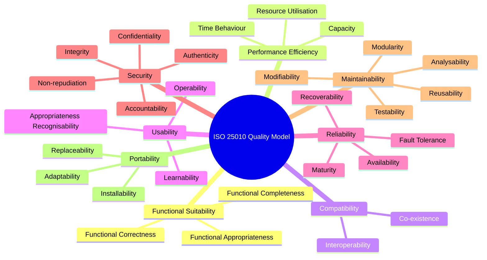
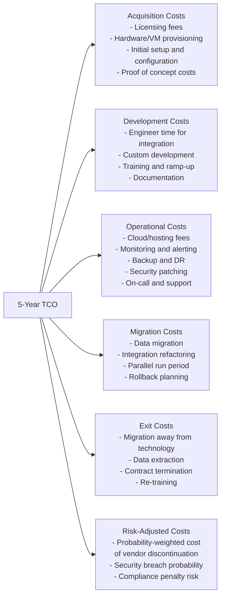
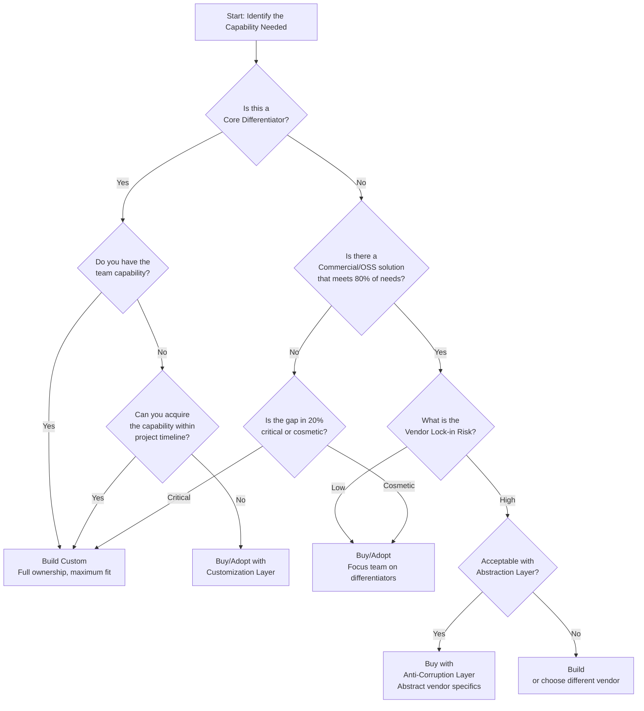
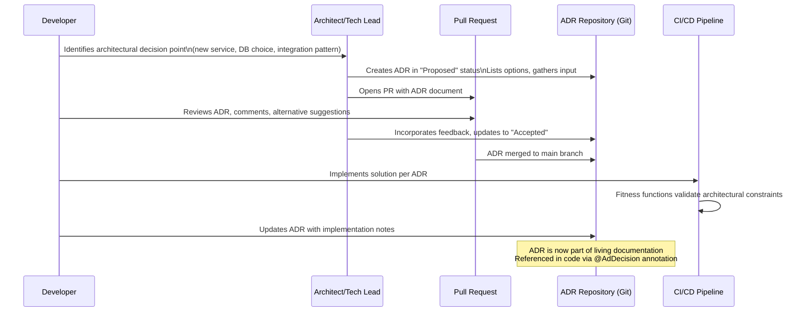
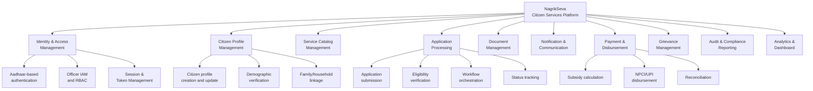
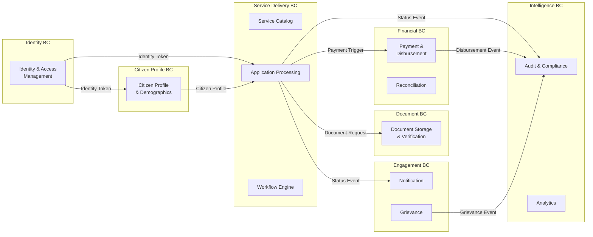
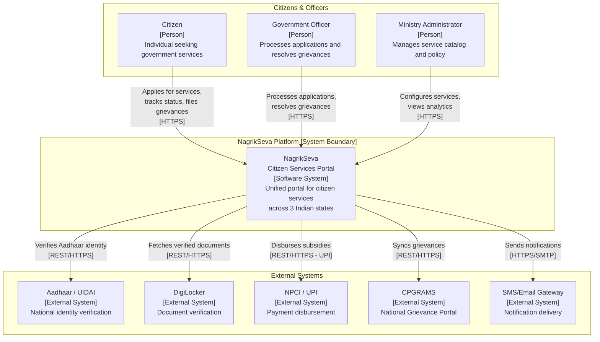
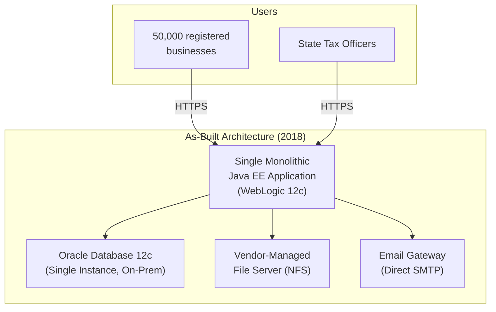
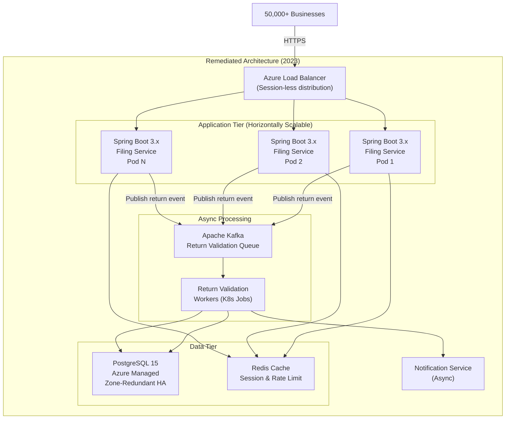

# DAY 1 — THEORY DOCUMENT
## Senior Engineer to Solution Architect Program
### Module: Architectural Foundations & Design Thinking

---

> **Document Classification:** Trainer's Master Reference
> **Day:** 1 of 12
> **Prerequisite Reading for Trainer:** None. This document is self-contained.
> **Lab Companion:** Day 1 Lab Document (GovArch-Foundation)

---

# TABLE OF CONTENTS

1. [Opening: The Architect's Lens](#1-opening-the-architects-lens)
2. [Topic 1: Coder to Architect — NFRs, Trade-offs, Gov-Scale Constraints](#2-topic-1-coder-to-architect)
3. [Topic 2: Tech Stack Selection Framework & TCO Analysis](#3-topic-2-tech-stack-selection-framework--tco-analysis)
4. [Topic 3: ADRs & Traceability — Req to Design to Code](#4-topic-3-adrs--traceability)
5. [Topic 4: Hands-on — Rapid Mapping of Business Goals to Architectural Decisions](#5-topic-4-hands-on-rapid-mapping)
6. [Day 1 Case Study: When the Architecture Collapses Under Reality](#6-day-1-case-study)
7. [Food for Thought](#7-food-for-thought)
8. [Day 1 Master Questionnaire](#8-day-1-master-questionnaire)

---

# 1. OPENING: THE ARCHITECT'S LENS

## What Changes When You Become an Architect

You have spent years mastering the craft of software engineering. You know how to design a class hierarchy, optimize a SQL query, implement a REST endpoint, wire up a CI pipeline, and ship features on deadline. You are, by most measures, an expert at building things.

Architecture is not about building things better. It is about deciding **which things to build, in what order, with what constraints, and at what cost** — before a single line of code is written.

Consider this distinction:

| Perspective      | Senior Developer                        | Solution Architect                                                  |
| ---------------- | --------------------------------------- | ------------------------------------------------------------------- |
| Primary Question | "How do I implement this feature?"      | "Should we build this, and if so, how should the system be shaped?" |
| Time Horizon     | Sprint / Quarter                        | 3-5 years                                                           |
| Primary Concern  | Correctness, performance, test coverage | Fitness for purpose, evolvability, total cost                       |
| Decision Scope   | Class, module, service                  | System, platform, enterprise                                        |
| Primary Artifact | Code, PR, unit tests                    | ADRs, HLDs, NFR catalog, architecture diagrams                      |
| Failure Mode     | Bug, regression, performance issue      | Wrong technology choice, wrong decomposition, unscalable data model |
| Key Skill        | Implementation depth                    | Trade-off reasoning                                                 |

> **Architect's Note:** The most dangerous engineer in any organization is one who has been promoted to architect but continues to think like a developer. They optimize locally while the system degrades globally. This program is designed to rewire that thinking.

The shift is not about seniority. It is about the **unit of reasoning**. A developer reasons about functions and objects. An architect reasons about systems, their interactions, their failure modes, their cost profiles, and their fitness against business goals that will evolve over time.

---

# 2. TOPIC 1: CODER TO ARCHITECT — NFRs, TRADE-OFFS, GOV-SCALE CONSTRAINTS

## Learning Objectives

By the end of this section, you will be able to:

1. **Distinguish** between functional requirements and non-functional requirements (NFRs) with architect-level precision
2. **Categorize** NFRs using the ISO 25010 software quality model
3. **Construct** an ATAM utility tree to prioritize quality attributes for a government-scale system
4. **Identify and articulate** trade-offs between competing quality attributes with concrete justification
5. **Apply** the government-scale constraint lens to translate business goals into architectural concerns

---

## 2.1 What Are NFRs and Why Do They Dominate Architecture?

**Functional Requirements (FRs)** describe what a system does. A citizen can register. A document can be uploaded. A subsidy can be disbursed. These are behaviors.

**Non-Functional Requirements (NFRs)** — also called **Quality Attribute Scenarios (QASs)** in formal architecture practice — describe how well the system performs its behaviors under specific conditions. They are not features. They are constraints and properties that cut across every feature.

Here is the critical insight: **FRs determine what you build. NFRs determine how you architect.**

You can implement the same login feature five completely different ways — a monolith with a session store, a stateless JWT-based microservice, a federated identity with OIDC, a biometric gate with a hardware token, or a delegated authentication via a national identity provider like India's Aadhaar or Singapore's Singpass. The functional behavior (citizen logs in) is the same. The architectural shape is entirely determined by NFRs: How many concurrent users? What is the acceptable latency? What are the regulatory compliance requirements? What happens if the identity provider is unavailable?

> **Anti-Pattern Warning:** Teams that write NFRs as afterthoughts — "the system should be fast, secure, and scalable" — are not writing NFRs. They are writing wishes. An NFR without a measurable threshold, a specific context, and a defined stimulus is architecturally useless.

---

## 2.2 The ISO 25010 Quality Model — A Systematic NFR Taxonomy

**ISO 25010** is the international standard for software product quality. It provides a hierarchical taxonomy of quality characteristics that every architect must internalize. This is your NFR classification framework.



For government-scale systems, the dominant quality characteristics — the ones that most frequently drive architectural decisions — are:

| Quality Characteristic             | Government Context                                                                | Example Threshold                                                                    |
| ---------------------------------- | --------------------------------------------------------------------------------- | ------------------------------------------------------------------------------------ |
| **Availability**                   | Citizen-facing services run 24x7; downtime has political consequences             | 99.95% uptime = max 4.38 hrs downtime/year                                           |
| **Security**                       | Personally Identifiable Information (PII), financial data, national security data | Zero tolerance for unauthorized data access                                          |
| **Scalability / Capacity**         | Election day, subsidy announcement, tax filing deadline cause traffic spikes      | Handle 10x normal load within 60 seconds                                             |
| **Interoperability**               | Multiple departments, legacy systems, third-party integrations                    | All APIs must conform to a national API standard                                     |
| **Auditability / Non-repudiation** | Legal accountability for every government action                                  | Every state transition must be logged with actor, timestamp, and reason              |
| **Maintainability**                | Government projects run for 10-20 years; teams change                             | A new developer must be able to understand and modify any module within 2 days       |
| **Recoverability**                 | Data loss in government systems can be catastrophic                               | RPO (Recovery Point Objective) = 1 hour; RTO (Recovery Time Objective) = 4 hours     |
| **Compliance**                     | DPDP Act (India), PDPA (Singapore), FedRAMP (US)                                  | All citizen data must be encrypted at rest and in transit; data residency in-country |

---

## 2.3 Writing Measurable NFRs: The QAS Format

A **Quality Attribute Scenario (QAS)** is a structured way to make an NFR testable and architecturally actionable. It has six components:

| Component            | Description                                                   |
| -------------------- | ------------------------------------------------------------- |
| **Source**           | Who or what initiates the stimulus                            |
| **Stimulus**         | The specific event or condition                               |
| **Artifact**         | Which part of the system is affected                          |
| **Environment**      | Under what conditions (normal load, peak load, after failure) |
| **Response**         | What the system does                                          |
| **Response Measure** | How we know the response is acceptable                        |

**Example — Bad NFR (Architecturally Useless):**
> "The system should be highly available."

**Example — Good NFR as QAS:**

| Component        | Value                                                                                                                  |
| ---------------- | ---------------------------------------------------------------------------------------------------------------------- |
| Source           | 10 million concurrent citizens                                                                                         |
| Stimulus         | Simultaneously access the NagrikSeva portal on the day of a national subsidy announcement                              |
| Artifact         | The citizen authentication and document retrieval services                                                             |
| Environment      | Peak load condition, government cloud region: Mumbai (ap-south-1)                                                      |
| Response         | The system serves all requests with no degradation in core functionality; non-critical features may degrade gracefully |
| Response Measure | P99 latency < 2 seconds; zero 5xx errors for authentication; error budget for document retrieval: < 0.1%               |

This QAS now drives real architectural decisions: stateless authentication to allow horizontal scaling, CDN for static assets, read replicas for document retrieval, circuit breakers to shed non-critical load.

---

## 2.4 The ATAM Utility Tree — Prioritizing Competing NFRs

In any real system, NFRs conflict. You cannot maximize all of them simultaneously. Security and performance trade off. Consistency and availability trade off (the CAP theorem, which you will internalize deeply in Day 4). Interoperability and security trade off. Auditability and privacy trade off.

The **ATAM (Architecture Trade-off Analysis Method)** utility tree is the instrument for making these conflicts explicit and prioritizing them based on business value and architectural risk.

**Structure of the Utility Tree:**

```
Utility (System-wide Quality)
├── Quality Attribute (ISO 25010 Category)
│   ├── Attribute Refinement (more specific concern)
│   │   └── Quality Attribute Scenario (measurable, testable)
│   │       [Priority: H/M/L] [Difficulty: H/M/L]
```

**Priority** = business importance (set by stakeholders)
**Difficulty** = architectural challenge (set by architects)

High Priority + High Difficulty scenarios are your **architectural drivers** — the scenarios that will dominate your design decisions.

**Utility Tree for NagrikSeva Citizen Portal:**

```mermaid
graph TD
    U[Utility: NagrikSeva Portal Quality]

    U --> A1[Availability]
    U --> A2[Security]
    U --> A3[Performance]
    U --> A4[Interoperability]
    U --> A5[Maintainability]

    A1 --> A1a["Portal remains accessible during\nnational events - 99.95% uptime\n[Priority: H] [Difficulty: H]"]
    A1 --> A1b["Graceful degradation when\ndependency services fail\n[Priority: H] [Difficulty: M]"]

    A2 --> A2a["Citizen PII encrypted at rest\nand in transit - AES-256, TLS 1.3\n[Priority: H] [Difficulty: M]"]
    A2 --> A2b["Zero unauthorized access to\ncitizen records - RBAC + MFA\n[Priority: H] [Difficulty: H]"]
    A2 --> A2c["Full audit trail for every\nstate change with non-repudiation\n[Priority: H] [Difficulty: M]"]

    A3 --> A3a["P99 response < 2s under\n10M concurrent users\n[Priority: H] [Difficulty: H]"]
    A3 --> A3b["Document upload < 5s\nfor files up to 10MB\n[Priority: M] [Difficulty: M]"]

    A4 --> A4a["APIs conforming to MeitY\nAPI standards - OpenAPI 3.1\n[Priority: H] [Difficulty: L]"]
    A4 --> A4b["Integration with Aadhaar,\nDigiLocker, UPI in < 500ms\n[Priority: H] [Difficulty: H]"]

    A5 --> A5a["New service onboarding\nwithout modifying core platform\n[Priority: M] [Difficulty: M]"]
    A5 --> A5b["Mean time to diagnose\nproduction issue < 30 minutes\n[Priority: M] [Difficulty: H]"]
```



**Reading the Utility Tree:**
- `[H][H]` scenarios are your primary architectural drivers. Every major design decision must be justified against them.
- `[H][M]` scenarios are table stakes — they must be satisfied but are not architecturally novel.
- `[M][H]` scenarios are risk areas — they may not be business-critical now but could become painful later.
- `[L][L]` scenarios can be deferred.

---

## 2.5 Government-Scale Constraints: The Lens That Changes Everything

Building software for a commercial startup and building software for a government system are fundamentally different exercises. Here are the constraints that make government architecture uniquely challenging:

### 2.5.1 Scale Dimensions

Government systems face scale across multiple orthogonal dimensions simultaneously:

```
User Scale:     Millions to Billions of citizens (India: 1.4B, US: 335M, Singapore: 6M)
Geographic:     Multiple states, union territories, data residency requirements
Temporal:       Spikes on announcements, elections, tax deadlines, disaster relief
Data:           Decades of records; data retention mandated by law
Integration:    Dozens of legacy systems, multiple ministries, third-party services
Regulatory:     Multiple overlapping legal frameworks
```

### 2.5.2 The Regulatory Constraint Layer

Every architectural decision in a government system must pass through a regulatory filter:

| Regulation                                                      | Jurisdiction           | Architectural Impact                                                                                        |
| --------------------------------------------------------------- | ---------------------- | ----------------------------------------------------------------------------------------------------------- |
| **DPDP Act 2023** (Digital Personal Data Protection)            | India                  | Data localization; consent management; data principal rights (right to erasure); data fiduciary obligations |
| **IT Act 2000 (amended)**                                       | India                  | Electronic signatures; cyber offences; intermediary liability                                               |
| **PDPA 2012** (Personal Data Protection Act)                    | Singapore              | Purpose limitation; retention limits; mandatory breach notification within 3 days                           |
| **IM8** (Instruction Manual 8)                                  | Singapore (Government) | Government-specific ICT security standards; cloud classification                                            |
| **FedRAMP** (Federal Risk and Authorization Management Program) | United States          | Cloud security authorization; continuous monitoring; FIPS 140-2 cryptography                                |
| **FISMA** (Federal Information Security Modernization Act)      | United States          | Risk management framework; security controls; annual assessments                                            |

> **Architect's Note:** Regulatory compliance is not a checkbox exercise performed at project end. It is a set of NFRs that must be woven into the architecture from day one. DPDP Act's "data minimization" principle, for example, directly affects your data model design, your logging strategy, and your API payload design.

### 2.5.3 The Interoperability Imperative

Government systems do not operate in isolation. Every government agency has its own systems, its own data formats, its own authentication mechanisms. The architect's job is to design systems that can federate without requiring every agency to rebuild.

This means:
- **Canonical Data Models** — a shared, agreed-upon representation of common entities (citizen, address, document, transaction)
- **API Gateways** — a single façade that translates between internal representations and external contracts
- **Event-driven integration** — decoupling systems through events rather than direct API calls
- **Identity Federation** — accepting credentials from authoritative sources (Aadhaar, Singpass, Login.gov) rather than managing identity locally

---

## 2.6 Trade-off Analysis: Making the Implicit Explicit

The defining skill of an architect is not knowing the right answer. It is knowing how to reason transparently about competing answers and making the best choice given the current constraints — while documenting the reasoning so future architects can revisit it when constraints change.

**The Trade-off Analysis Principle:**

> For every architectural decision, there is no universally correct answer. There is only the answer that best satisfies the prioritized quality attributes given the current constraints, budget, team capability, and timeline.

**Common Government Architecture Trade-offs:**

| Trade-off                    | Option A                                    | Option B                                               | How to Choose                                                                                                                                            |
| ---------------------------- | ------------------------------------------- | ------------------------------------------------------ | -------------------------------------------------------------------------------------------------------------------------------------------------------- |
| Consistency vs. Availability | Strong consistency (ACID, single DB)        | Eventual consistency (distributed, BASE)               | If correctness of data (financial, legal) trumps availability: choose A. If availability is existential: choose B with compensating controls             |
| Build vs. Buy                | Custom-built identity service               | Commercial COTS (Okta, Ping) or Open Source (Keycloak) | Buy/adopt when the problem is commoditized and customization need is low. Build when the requirement is unique and vendor lock-in risk is unacceptable   |
| Monolith vs. Microservices   | Single deployable unit                      | Independently deployable services                      | Monolith-first for new domains with unclear boundaries. Microservices when team scale, deployment independence, or technology diversity demands it       |
| Cloud vs. On-Prem            | Public cloud (Azure GovCloud, AWS GovCloud) | On-premises data centers                               | Cloud for elasticity, speed, and managed services. On-prem for data sovereignty, air-gapped security requirements, or existing infrastructure investment |
| Latency vs. Data Residency   | Serve from nearest region globally          | Serve only from in-country region                      | Data residency regulation (DPDP, PDPA) mandates residency compliance. Mitigate latency via CDN for static content, edge caching for read-heavy workloads |

---

## 2.7 Code Perspective: NFRs Manifested in Code

NFRs are not just architectural abstractions. They manifest as specific code patterns, configurations, and infrastructure choices. Here is how an availability NFR and a security NFR look in production Spring Boot 3.x code:

### 2.7.1 Availability NFR — Circuit Breaker Pattern

```java
// NagrikSeva - Citizen Document Service
// NFR: System must degrade gracefully when DigiLocker integration fails
// QAS: [Availability][H][H] - External dependency failure must not cascade

package gov.nagriks.document.adapter.external;

import io.github.resilience4j.circuitbreaker.annotation.CircuitBreaker;
import io.github.resilience4j.retry.annotation.Retry;
import org.slf4j.Logger;
import org.slf4j.LoggerFactory;
import org.springframework.stereotype.Component;

/**
 * DigiLockerAdapter: Outbound port implementation for DigiLocker integration.
 *
 * ARCHITECTURAL DECISION: We wrap all external calls in circuit breakers.
 * RATIONALE: DigiLocker is an external government service with its own SLA.
 *            Our availability NFR (99.95%) cannot be held hostage by a
 *            third-party's 99.9% SLA. The circuit breaker allows us to
 *            fail fast and return a degraded response rather than
 *            holding threads until timeout cascades through the system.
 *
 * WHAT HAPPENS WITHOUT THIS: Under DigiLocker degradation, our threads
 * block waiting for HTTP responses. Thread pool exhaustion causes our
 * entire service to stop responding - a cascade failure that transforms
 * a partial outage into a total outage.
 */
@Component
public class DigiLockerAdapter {

    private static final Logger log = LoggerFactory.getLogger(DigiLockerAdapter.class);

    private final DigiLockerHttpClient httpClient;

    public DigiLockerAdapter(DigiLockerHttpClient httpClient) {
        this.httpClient = httpClient;
    }

    /**
     * Fetches a verified document from DigiLocker for the given citizen.
     *
     * @CircuitBreaker: Opens after 5 failures in 10s window.
     *                  Half-open after 30s. Calls fallback immediately when open.
     * @Retry: Attempts up to 3 times with exponential backoff before
     *         the circuit breaker counts this as a failure.
     *
     * NFR Traceability: NFR-AVAIL-003 -> ADR-007 -> This implementation
     */
    @CircuitBreaker(name = "digilocker", fallbackMethod = "fetchDocumentFallback")
    @Retry(name = "digilocker")
    public DocumentDto fetchVerifiedDocument(String citizenId, String documentType) {
        log.info("Fetching document type={} for citizen={} from DigiLocker",
                documentType, citizenId);

        // The actual HTTP call - if this fails repeatedly, circuit opens
        return httpClient.getDocument(citizenId, documentType);
    }

    /**
     * Fallback: Called when circuit is OPEN or all retries exhausted.
     * Returns a CachedNotAvailable response - signals to the caller
     * that the document exists but cannot be verified in real-time.
     *
     * DESIGN CHOICE: We do NOT throw an exception here. We return a
     * degraded-but-valid response. This is the "graceful degradation"
     * required by QAS-AVAIL-003.
     *
     * TRADE-OFF: Citizen may proceed with a cached/unverified document.
     * This is acceptable for non-critical flows (viewing history) but
     * NOT acceptable for high-stakes flows (financial disbursement).
     * The caller (application layer) makes that distinction.
     */
    public DocumentDto fetchDocumentFallback(String citizenId,
                                              String documentType,
                                              Throwable cause) {
        log.warn("DigiLocker circuit OPEN or retries exhausted. " +
                 "Returning degraded response. citizenId={}, cause={}",
                 citizenId, cause.getMessage());

        // Structured fallback response - caller knows this is degraded
        return DocumentDto.builder()
                .citizenId(citizenId)
                .documentType(documentType)
                .status(DocumentStatus.VERIFICATION_UNAVAILABLE)
                .message("Document verification temporarily unavailable. " +
                         "Please retry in 30 minutes.")
                .build();
    }
}
```

```yaml
# application.yml - Resilience4j circuit breaker configuration
# NFR Traceability: NFR-AVAIL-003 -> ADR-007 -> This config

resilience4j:
  circuitbreaker:
    instances:
      digilocker:
        # Open circuit after 5 failures in a 10-call sliding window
        sliding-window-size: 10
        failure-rate-threshold: 50          # 50% = 5 out of 10 calls fail
        wait-duration-in-open-state: 30s    # Wait 30s before trying again
        permitted-calls-in-half-open-state: 3
        # Slow calls (> 3s) also count as failures
        slow-call-duration-threshold: 3s
        slow-call-rate-threshold: 80

  retry:
    instances:
      digilocker:
        max-attempts: 3
        wait-duration: 500ms
        # Exponential backoff: 500ms, 1000ms, 2000ms
        enable-exponential-backoff: true
        exponential-backoff-multiplier: 2
        # Only retry on transient errors, not business errors
        retry-exceptions:
          - java.net.SocketTimeoutException
          - java.net.ConnectException
          - org.springframework.web.client.ResourceAccessException
        ignore-exceptions:
          - gov.nagriks.document.exception.CitizenNotFoundException
          - gov.nagriks.document.exception.DocumentAccessDeniedException
```

> **What Happens Without This:** Without circuit breakers, a DigiLocker slowdown (from 200ms to 8000ms) causes your service's HTTP thread pool to exhaust within minutes. Every request blocks waiting for a response that may never come. Your monitoring shows 100% CPU utilization on a service that is doing zero useful work. The entire portal goes down because of a dependency failure — a cascading failure.

---

## 2.8 Assignment: NFR Exercise

**Given scenario:** The Government of Telangana (India) is launching a unified grievance redressal portal called **JanSamadhan**. Citizens can file complaints, track status, and upload supporting documents. Officers across 33 districts can view, assign, escalate, and resolve complaints. The portal is expected to serve 2 million citizens with 50,000 officers. The system must integrate with the state's existing HR system, the national payment gateway (NPCI), and the National Grievance Portal (CPGRAMS).

**Your Task:**
1. List at least 10 NFRs, one for each relevant ISO 25010 category
2. Write 3 of those NFRs as full QAS (6-component format)
3. Build a utility tree with at least 8 scenarios, each tagged with Priority and Difficulty
4. Identify the top 3 architectural drivers (H/H scenarios)
5. Identify one trade-off between two of your top NFRs and articulate how you would resolve it

---

# 3. TOPIC 2: TECH STACK SELECTION FRAMEWORK & TCO ANALYSIS

## Learning Objectives

By the end of this section, you will be able to:

1. **Apply** a multi-criteria technology evaluation framework to a real decision
2. **Construct** a 5-year TCO model for competing technology options
3. **Articulate** the build vs. buy decision framework with government-specific considerations
4. **Use** a Technology Radar and fitness functions to assess technology maturity and fit
5. **Present** a technology recommendation with structured rationale and documented trade-offs

---

## 3.1 The Technology Selection Trap

The most common mistake in technology selection is starting with a solution. A team experienced with Node.js recommends Node.js. A team that has used Kafka recommends Kafka. A vendor presents a compelling demo and the technology gets selected before the requirements are fully understood.

Architecture requires the opposite discipline: **start with the problem, derive the selection criteria, then evaluate options against criteria — not the other way around.**

> **Anti-Pattern Warning:** "We are using technology X because our last project used it" is called **technology inertia** or **golden hammer** (GoF anti-pattern). It is the fastest way to select the wrong technology for the right problem.

---

## 3.2 The Technology Evaluation Framework: Six Lenses

Evaluate any technology across six structured lenses:

### Lens 1: Functional Fit
Does the technology solve the problem it is being selected for?

- Does it support the required data models and access patterns?
- Does it have the required protocol support (REST, gRPC, MQTT, etc.)?
- Does it integrate with the surrounding technology ecosystem?
- Does it meet the performance and scalability NFRs at the required scale?

### Lens 2: Operational Fitness
Can the organization operate this technology at scale?

- What are the operational requirements (clustering, backups, patching)?
- Is managed service available (reduces operational overhead)?
- What are the monitoring and observability capabilities?
- What is the disaster recovery and backup story?

### Lens 3: Team Capability
Can the team build and maintain with this technology?

- What is the current team's expertise level?
- What is the learning curve and ramp-up time?
- Is there available talent in the hiring market (India/US/Singapore)?
- What is the quality and availability of training resources?

### Lens 4: Ecosystem and Community
Is the technology healthy and sustainable?

- Is it open source or proprietary? What is the license?
- What is the size and activity of the community?
- How frequent are security patches and releases?
- Is it on a growth trajectory or in decline?

### Lens 5: Vendor and Strategic Risk
What are the lock-in and continuity risks?

- Proprietary protocol or open standard?
- What is the exit strategy if the vendor discontinues or changes pricing?
- Is there a government-approved vendor list constraint (e.g., GovCloud authorization)?
- What is the vendor's financial stability and support commitment?

### Lens 6: Total Cost of Ownership (TCO)
What is the true 5-year cost including all dimensions?

This is the most underestimated lens and gets its own section below.

---

## 3.3 Total Cost of Ownership (TCO) Modelling

**TCO (Total Cost of Ownership)** is the complete cost of a technology choice over its operational lifetime, including costs that are not on any invoice. Architects who present only licensing or infrastructure costs are presenting an incomplete and misleading picture.

### TCO Components



### 3.3.1 TCO Model: PostgreSQL vs. Oracle Database

**Scenario:** NagrikSeva portal requires a transactional relational database for citizen records, supporting 500 concurrent connections, 200M records, 3 TB data volume, with a 10-year data retention requirement.

| Cost Category                      | PostgreSQL 15 (Azure Database for PostgreSQL Flexible Server)           | Oracle Database 19c (Managed / On-Prem)                                      |
| ---------------------------------- | ----------------------------------------------------------------------- | ---------------------------------------------------------------------------- |
| **License (5-year)**               | INR 0 (open source)                                                     | INR 1.2 Cr - 3 Cr (Enterprise Edition, approx. based on processor licensing) |
| **Infrastructure (5-year)**        | INR 45 L - 80 L (Azure managed, GP tier, 8 vCores, 32GB, multi-zone HA) | INR 60 L - 1.2 Cr (on-prem hardware or Oracle Cloud)                         |
| **DBA / Operations (5-year)**      | INR 30 L - 50 L (1 x mid-senior DBA, shared)                            | INR 60 L - 1.2 Cr (1 x Oracle-certified DBA, higher market rate)             |
| **Development effort**             | INR 5 L (standard JDBC, JPA, no special drivers)                        | INR 15 L - 25 L (Oracle-specific types, PL/SQL migration if switching)       |
| **Support contracts**              | INR 0 - 8 L (community + Azure support tier)                            | INR 20 L - 40 L (Oracle Premier Support)                                     |
| **Training**                       | INR 2 L - 5 L                                                           | INR 5 L - 10 L                                                               |
| **Exit cost (if switching later)** | Low - standard SQL, easy migration                                      | High - PL/SQL, Oracle-specific features create vendor lock-in                |
| **Estimated 5-Year TCO**           | **INR 82 L - 1.43 Cr**                                                  | **INR 2.6 Cr - 6.15 Cr**                                                     |

> **Important Disclaimer:** The above figures are illustrative estimates derived from publicly available cloud pricing and market salary data for India as of 2024. Actual costs depend on specific configurations, negotiated contracts, and organizational context. Always validate with current vendor pricing and internal finance teams.

**The TCO ratio is approximately 3:1 to 4:1 in favor of PostgreSQL.** However, TCO alone does not make the decision. Consider the risk-adjusted factors:

- If the team has deep Oracle expertise and Oracle-specific features (RAC, Data Guard, Advanced Compression) are needed, the transition cost to PostgreSQL increases
- If compliance requires on-premises deployment and the team has existing Oracle infrastructure, the incremental infrastructure cost of Oracle decreases
- If the organization has existing Oracle Enterprise Agreements covering this workload, the license cost may be zero

**The decision matrix approach:**

```
Score each option 1-5 on each criterion
Weight each criterion by importance (total weight = 100%)
Calculate weighted score = sum(score × weight)
Select highest weighted score — then validate with TCO
```

---

## 3.4 Build vs. Buy: A Structured Framework

**Build vs. Buy** is one of the most consequential decisions in enterprise architecture. The wrong choice costs years and careers.



**Government-Specific Build vs. Buy Considerations:**

| Factor            | Favors Build                                   | Favors Buy/Adopt                                               |
| ----------------- | ---------------------------------------------- | -------------------------------------------------------------- |
| Data sovereignty  | When data cannot leave jurisdiction            | When managed service is in approved region                     |
| Customization     | When process is unique to government context   | When process is commoditized                                   |
| Vendor risk       | When single vendor dependency is unacceptable  | When vendor is established with large government customer base |
| Timeline          | When long-term total cost outweighs build cost | When time-to-market is critical                                |
| Security scrutiny | When source code audit is mandated             | When vendor provides FedRAMP/IM8/CERT-In certification         |
| Maintainability   | When internal team can sustain it long-term    | When technology changes rapidly and vendor stays current       |

---

## 3.5 Technology Radar and Fitness Functions

### 3.5.1 Technology Radar

The **Technology Radar** (popularized by ThoughtWorks) is a visualization tool that plots technologies on four rings representing your organization's recommended stance:

```
ADOPT   — Proven, recommended for production use
TRIAL   — Worth pursuing; use on low-risk projects to build experience  
ASSESS  — Worth exploring; invest time in understanding implications
HOLD    — Proceed with caution; do not start new projects with this
```

Applied to the NagrikSeva project's technology landscape:

| Technology                         | Radar Position | Rationale                                                        |
| ---------------------------------- | -------------- | ---------------------------------------------------------------- |
| Spring Boot 3.x / Java 17          | ADOPT          | Mature, well-understood, vast talent pool in India/Singapore/US  |
| PostgreSQL 15                      | ADOPT          | Production-proven, open source, strong Azure managed service     |
| Apache Kafka                       | ADOPT          | Proven event streaming; strong government adoption globally      |
| Kubernetes                         | ADOPT          | De facto container orchestration standard                        |
| Terraform                          | ADOPT          | IaC standard; strong provider ecosystem                          |
| Keycloak                           | TRIAL          | Strong OSS identity; rapidly maturing; assess for production     |
| MongoDB 7                          | TRIAL          | Document model fit for specific workloads; evaluate per use case |
| Apache Cassandra                   | TRIAL          | Strong for time-series, wide-column; steep operational curve     |
| Service Mesh (Istio)               | ASSESS         | Powerful; significant operational complexity; evaluate carefully |
| AI-Generated Code (GitHub Copilot) | ASSESS         | Productivity gains proven; security review process needed        |
| Blockchain for Government          | HOLD           | Overhyped for most use cases; evaluate only specific scenarios   |

### 3.5.2 Fitness Functions

**Fitness functions** (from the book "Building Evolutionary Architectures" by Ford, Parsons, Kua) are automated tests that verify architectural characteristics are maintained as the system evolves. They are the executable version of your NFRs.

Think of them as unit tests for your architecture.

```java
// Example: Fitness function - No service should directly access another service's database
// This enforces the "database per service" NFR-MAINT-001

package gov.nagriks.architecture.fitness;

import com.tngtech.archunit.core.domain.JavaClasses;
import com.tngtech.archunit.core.importer.ClassFileImporter;
import com.tngtech.archunit.lang.ArchRule;
import org.junit.jupiter.api.Test;

import static com.tngtech.archunit.lang.syntax.ArchRuleDefinition.noClasses;
import static com.tngtech.archunit.library.Architectures.layeredArchitecture;

/**
 * Architectural Fitness Functions for NagrikSeva Platform
 *
 * These tests run in CI/CD on every pull request.
 * A failing fitness function means an architectural constraint
 * has been violated - the build fails, the PR is blocked.
 *
 * This is how architecture decisions remain enforced over time
 * rather than eroding through developer shortcuts.
 *
 * NFR Traceability: NFR-MAINT-001 -> ADR-003 -> This fitness function
 */
class ArchitectureFitnessTest {

    private final JavaClasses classes = new ClassFileImporter()
            .importPackages("gov.nagriks");

    @Test
    void domain_layer_should_not_depend_on_infrastructure() {
        // Hexagonal architecture enforcement:
        // Domain knows nothing about persistence, HTTP, or messaging
        ArchRule rule = noClasses()
                .that().resideInAPackage("..domain..")
                .should().dependOnClassesThat()
                .resideInAnyPackage("..adapter..", "..infrastructure..", "..repository..");

        rule.check(classes);
    }

    @Test
    void services_should_not_access_other_services_repositories() {
        // Database-per-service enforcement:
        // CitizenService must never directly access DocumentRepository
        ArchRule rule = noClasses()
                .that().resideInAPackage("..citizen..")
                .should().dependOnClassesThat()
                .resideInAPackage("..document..repository..");

        rule.check(classes);
    }

    @Test
    void layered_architecture_is_respected() {
        layeredArchitecture()
                .consideringAllDependencies()
                .layer("API").definedBy("..adapter.api..")
                .layer("Application").definedBy("..application..")
                .layer("Domain").definedBy("..domain..")
                .layer("Infrastructure").definedBy("..adapter.persistence..")
                // API can call Application; Application can call Domain
                // Domain CANNOT call API or Infrastructure
                .whereLayer("API").mayNotBeAccessedByAnyLayer()
                .whereLayer("Application").mayOnlyBeAccessedByLayers("API")
                .whereLayer("Domain").mayOnlyBeAccessedByLayers("Application")
                .whereLayer("Infrastructure").mayOnlyBeAccessedByLayers("Application")
                .check(classes);
    }
}
```

> **Production Insight:** Fitness functions are architectural guardrails that scale. Without them, the architectural decisions you make today erode within 6 months as new developers join and cut corners. With fitness functions in CI/CD, every pull request is an architecture review.

---

## 3.6 Assignment: TCO and Stack Selection

**Scenario:** The Ministry of Electronics and Information Technology (MeitY), India, is evaluating a tech stack for a new **Digital Identity Verification Platform** (inspired by MOSIP — Modular Open Source Identity Platform). The platform must:

- Handle 500M citizen identity records
- Support 10,000 verification requests per second at peak
- Store biometric templates securely
- Provide APIs to 200+ government departments
- Operate for minimum 15 years
- Comply with DPDP Act 2023 data residency requirements

**Option A:** Oracle Database + WebLogic + Oracle Identity Governance (OIG)
**Option B:** PostgreSQL + Spring Boot + Keycloak + Apache Kafka

**Your Task:**
1. Score both options across the six evaluation lenses (1-5 scale with weighted scoring)
2. Construct a 5-year TCO estimate (use illustrative numbers, clearly stated as estimates)
3. Apply the Technology Radar positioning for each technology in Option B
4. Define 3 fitness functions you would implement for this platform
5. Write a one-page recommendation with rationale

---

# 4. TOPIC 3: ADRs & TRACEABILITY — REQ TO DESIGN TO CODE

## Learning Objectives

By the end of this section, you will be able to:

1. **Author** a production-grade Architecture Decision Record (ADR) using the MADR template
2. **Maintain** an ADR decision log as a living architectural artifact
3. **Construct** a traceability matrix linking business requirements to NFRs to architectural decisions to code artifacts
4. **Identify** the consequences (positive and negative) of architectural decisions and document them explicitly
5. **Integrate** ADR discipline into an agile team's workflow without ceremony overhead

---

## 4.1 What Is an ADR and Why Does It Exist?

**ADR (Architecture Decision Record)** is a short document that captures an important architectural decision, the context in which it was made, the options considered, the rationale for the chosen option, and the consequences of that choice.

The reason ADRs exist is embarrassingly simple: **every architecture decays**. And the primary accelerant of architectural decay is the loss of the reasoning behind decisions.

Without ADRs, this happens:

```
Year 0: Team decides to use PostgreSQL for citizen data.
        Reason: DPDP Act requires data residency; PostgreSQL on Azure India
                Central region satisfies this; Oracle licensing too expensive.

Year 1: Original architect leaves.

Year 2: New team lead joins. Sees PostgreSQL. Thinks: "This should be MongoDB
        for better document storage." No one knows why PostgreSQL was chosen.
        Team spends 3 months migrating to MongoDB.

Year 3: Compliance audit flags MongoDB deployment. Azure Cosmos DB for MongoDB
        API is not in the same region. Data residency violation. Emergency
        migration back. 6 months lost. Relationship damage with ministry.
```

An ADR written in Year 0 would have prevented this entirely.

---

## 4.2 The MADR Template — A Production-Grade ADR Format

**MADR (Markdown Any Decision Records)** is the most practical and widely adopted ADR format in enterprise engineering. It is lightweight enough to not create bureaucratic overhead yet structured enough to capture all necessary information.

```markdown
# ADR-007: Use PostgreSQL 15 as the Primary Transactional Data Store for NagrikSeva

## Status
Accepted  
[Other valid statuses: Proposed | Accepted | Deprecated | Superseded by ADR-XXX]

## Date
2024-03-15

## Decision Makers
- Priya Nair (Solution Architect, NagrikSeva Platform)
- Karthik Subramaniam (Lead Engineer, Data Platform)
- Ananya Krishnan (Compliance Officer, MeitY)

## Context and Problem Statement
NagrikSeva requires a transactional database to store and retrieve citizen
profiles, grievance records, and application history for approximately
50 million citizens across 3 Indian states. The database must:

1. Support ACID transactions (financial and legal state transitions require
   strong consistency - see NFR-CONS-001)
2. Run within India Azure regions (Central India, South India) to comply
   with DPDP Act 2023 data residency requirements (see NFR-COMP-001)
3. Support 500 concurrent connections from microservice pods
4. Handle 200 million records with sub-100ms P99 read latency
5. Provide managed service operation to reduce DBA overhead
6. Be sustainable within the approved budget (see BUDGET-2024-Q1)

## Decision Drivers
- NFR-CONS-001: All citizen financial state transitions must be ACID-compliant
- NFR-COMP-001: All PII must reside within India Azure regions
- NFR-COST-001: 5-year infrastructure cost must not exceed approved budget
- NFR-MAINT-001: Technology must be operable by a team of 3 engineers
- NFR-AVAIL-001: 99.95% availability with automatic failover

## Considered Options
1. PostgreSQL 15 (Azure Database for PostgreSQL Flexible Server)
2. Oracle Database 19c (Oracle Cloud Infrastructure - India region)
3. MongoDB 7 (Azure Cosmos DB for MongoDB API)
4. MySQL 8.0 (Azure Database for MySQL Flexible Server)

## Decision Outcome
**Chosen option: Option 1 — PostgreSQL 15 on Azure Database for PostgreSQL
Flexible Server (India regions)**

### Rationale
PostgreSQL satisfies all decision drivers:
- Full ACID compliance with serializable isolation (NFR-CONS-001)
- Available in Azure Central India and South India regions (NFR-COMP-001)
- 5-year TCO approximately INR 82L-1.43Cr vs Oracle's INR 2.6Cr-6.15Cr (NFR-COST-001)
- Managed service with automated backups, HA, and patching (NFR-MAINT-001)
- Zone-redundant HA with <120s automatic failover (NFR-AVAIL-001)
- Rich JPA/Hibernate ecosystem for the team's Java 17 stack

## Pros and Cons of the Options

### Option 1: PostgreSQL 15 (CHOSEN)
+ Open source — no license cost, no vendor lock-in
+ Full ACID + rich SQL feature set (JSONB, full-text search, partitioning)
+ Strong Azure managed service with HA in Indian regions
+ Abundant talent pool in India; JPA/Hibernate ecosystem
+ Excellent Spring Boot integration
- Less enterprise sales and support than Oracle
- Requires careful tuning for 500+ concurrent connections (use PgBouncer)
- JSONB performance inferior to native document stores for document workloads

### Option 2: Oracle Database 19c
+ Enterprise-grade features (RAC, Data Guard, Advanced Compression)
+ Strong vendor support and SLAs
- Prohibitive licensing cost: estimated INR 1.2Cr - 3Cr over 5 years
- Proprietary PL/SQL creates lock-in; high exit cost
- Smaller managed service option in India Azure region
- Oracle Cloud certification not yet FedRAMP-equivalent for India standards

### Option 3: MongoDB 7 (Azure Cosmos DB for MongoDB API)
+ Excellent for document-centric, schema-flexible workloads
+ Horizontal scaling built-in
- No multi-document ACID transactions by default (requires careful design)
- Eventual consistency by default conflicts with NFR-CONS-001
- MongoDB API on Cosmos DB has feature gaps vs native MongoDB

### Option 4: MySQL 8.0
+ Simpler operationally; lower TCO than Oracle
+ Good ACID support
- Feature set inferior to PostgreSQL (no JSONB, limited window functions)
- Less suited for the complex reporting queries required by audit/grievance modules
- InnoDB locking behavior less predictable under high concurrency

## Consequences

### Positive Consequences
- Zero licensing cost saves approximately INR 1.2Cr - 3Cr over 5 years
- Managed service reduces DBA operational overhead by approximately 40%
- PostgreSQL JSONB allows hybrid relational/document storage,
  reducing need for a separate document store for some workloads
- Open source eliminates vendor discontinuation risk

### Negative Consequences
- PgBouncer connection pooler must be added to architecture (ADR-008)
- PostgreSQL does not natively support the Oracle-specific document
  management queries from the legacy system — a migration effort is needed
- Team requires PostgreSQL-specific training on partitioning and
  JSONB indexing strategies (see Training Plan TP-2024-Q2)

## Implementation Notes
- Connection pooling: PgBouncer in transaction mode, pool size = 100 per service
- Partitioning: Range partition citizen records by state code
- Backup: Azure built-in backup with 35-day retention, geo-redundant storage
- Migration path from legacy Oracle: Flyway for schema evolution,
  AWS Schema Conversion Tool (SCT) for initial schema migration

## Related Decisions
- ADR-006: Adopt hexagonal architecture for service layer isolation
- ADR-008: Use PgBouncer for PostgreSQL connection pooling
- ADR-012: Use Flyway for database schema versioning

## Links
- [NFR Catalog: NFR-CONS-001, NFR-COMP-001, NFR-COST-001](./nfr-catalog.md)
- [TCO Analysis: PostgreSQL vs Oracle](./tco-analysis-db-2024.xlsx)
- [DPDP Act 2023 Compliance Checklist](./compliance/dpdp-checklist.md)
- [PgBouncer Configuration Guide](./infra/pgbouncer-config.md)
```

---

## 4.3 Traceability: The Architectural Spine

**Traceability** is the ability to follow a requirement from its business origin through architectural decisions, design artifacts, and all the way down to the specific code that implements it — and back up again.

Without traceability, you cannot:
- Answer "Why does the system work this way?" six months after the original architect has left
- Perform impact analysis when a regulatory requirement changes
- Justify architectural decisions to auditors and stakeholders
- Identify which code must change when a business rule changes

### 4.3.1 The Traceability Chain

```
Business Goal
    └── Business Requirement (FR or quality constraint)
            └── NFR / QAS (measurable, scenario-based)
                    └── ADR (decision made to address the NFR)
                            └── Design Artifact (HLD, sequence diagram, data model)
                                    └── Code Artifact (class, configuration, test)
                                            └── Test Case (unit, integration, performance)
```

### 4.3.2 Traceability Matrix Example

| Business Goal             | Business Requirement                                       | NFR / QAS                                                                  | ADR                                                            | Code Artifact                                                                       | Test                                       |
| ------------------------- | ---------------------------------------------------------- | -------------------------------------------------------------------------- | -------------------------------------------------------------- | ----------------------------------------------------------------------------------- | ------------------------------------------ |
| Citizen trust and privacy | Citizen PII must never be exposed without explicit consent | NFR-SEC-001: All PII fields encrypted at rest with AES-256; masked in logs | ADR-005: Field-level encryption for PII using Jasypt           | `gov.nagriks.citizen.domain.CitizenProfile` (encrypted fields), `JasyptConfig.java` | `CitizenProfileEncryptionTest.java`        |
| Service availability      | Portal must serve citizens even during dependency failures | NFR-AVAIL-003: Graceful degradation when DigiLocker fails; P99 < 2s        | ADR-007: Circuit breaker pattern for all external integrations | `DigiLockerAdapter.java`, `application.yml` (resilience4j config)                   | `DigiLockerAdapterCircuitBreakerTest.java` |
| Legal accountability      | Every officer action must be auditable for 7 years         | NFR-AUDIT-001: Immutable audit log for all state transitions               | ADR-009: Event sourcing for grievance state machine            | `GrievanceEventStore.java`, `AuditLogProjection.java`                               | `GrievanceAuditTrailTest.java`             |
| Financial integrity       | Subsidy disbursements must be exactly-once                 | NFR-CONS-002: Idempotent disbursement processing                           | ADR-011: Idempotency key pattern for payment APIs              | `DisbursementService.java`, `IdempotencyFilter.java`                                | `DisbursementIdempotencyTest.java`         |

---

## 4.4 ADR Workflow in an Agile Team

The most common failure mode of ADRs is treating them as waterfall artifacts — written once at project start and never touched again. In an agile team, ADRs must be living documents integrated into the development workflow.

**Recommended Workflow:**



### 4.4.1 ADR in Code: Annotation-Based Traceability

```java
package gov.nagriks.citizen.adapter.persistence;

import gov.nagriks.architecture.annotation.ArchDecision;
import org.springframework.data.jpa.repository.JpaRepository;
import org.springframework.data.jpa.repository.Query;
import org.springframework.stereotype.Repository;

/**
 * CitizenRepository: JPA repository for citizen profile persistence.
 *
 * ARCHITECTURAL TRACEABILITY:
 * This class is the persistence adapter in hexagonal architecture.
 * It MUST remain in the adapter layer and MUST NOT be accessed
 * by any class outside the application layer.
 *
 * @see ADR-006 (Hexagonal Architecture)
 * @see ADR-007 (PostgreSQL as primary data store)
 * @see NFR-MAINT-001 (Database-per-service isolation)
 */
@Repository
@ArchDecision(
    adrRef = "ADR-007",
    rationale = "PostgreSQL chosen for ACID compliance and DPDP data residency",
    alternatives = {"Oracle 19c (cost prohibitive)", "MongoDB (eventual consistency conflict)"},
    revisitWhen = "If team scales beyond 1000 concurrent connections or schema flexibility required"
)
public interface CitizenRepository extends JpaRepository<CitizenEntity, String> {

    /**
     * Finds citizen by Aadhaar-derived anonymous token.
     *
     * IMPORTANT: We do NOT store raw Aadhaar numbers (UIDAI compliance).
     * We store a one-way hash (HMAC-SHA256) of the Aadhaar number.
     * This satisfies NFR-SEC-001 (PII minimization) and UIDAI guidelines.
     *
     * @see ADR-005 (PII field-level encryption)
     * @see NFR-SEC-001 (Aadhaar data minimization)
     */
    @Query("SELECT c FROM CitizenEntity c WHERE c.aadhaarToken = :aadhaarToken")
    java.util.Optional<CitizenEntity> findByAadhaarToken(String aadhaarToken);
}
```

```java
// Custom annotation for ADR traceability in code
// Place this in a shared 'architecture' module

package gov.nagriks.architecture.annotation;

import java.lang.annotation.ElementType;
import java.lang.annotation.Retention;
import java.lang.annotation.RetentionPolicy;
import java.lang.annotation.Target;

/**
 * @ArchDecision: Links code artifact to its governing ADR.
 *
 * Usage: Apply to classes, methods, or configurations that
 * directly implement an architectural decision. This enables
 * IDE navigation from code to ADR and supports automated
 * traceability reporting.
 *
 * IMPORTANT: This annotation is compile-time only (RetentionPolicy.SOURCE)
 * in production builds. Switch to RUNTIME only if you need
 * reflection-based ADR reporting at runtime.
 */
@Target({ElementType.TYPE, ElementType.METHOD, ElementType.FIELD})
@Retention(RetentionPolicy.SOURCE)
public @interface ArchDecision {
    /** Reference to the ADR document, e.g., "ADR-007" */
    String adrRef();

    /** Brief rationale for why this code exists in this form */
    String rationale();

    /** Alternatives that were considered and rejected */
    String[] alternatives() default {};

    /** Condition under which this decision should be revisited */
    String revisitWhen() default "";
}
```

---

## 4.5 ADR Repository Structure

```
docs/
└── architecture/
    ├── decisions/
    │   ├── README.md                    ← ADR index and status dashboard
    │   ├── ADR-001-use-java17.md
    │   ├── ADR-002-spring-boot-3.md
    │   ├── ADR-003-hexagonal-arch.md
    │   ├── ADR-004-event-driven-comms.md
    │   ├── ADR-005-pii-encryption.md
    │   ├── ADR-006-postgresql-primary.md
    │   └── ADR-007-circuit-breaker.md
    ├── nfr-catalog.md                   ← All NFRs in QAS format
    ├── traceability-matrix.md           ← Business Goal → Code mapping
    ├── utility-tree.md                  ← ATAM utility tree
    └── tco-analysis/
        ├── db-tco-2024.md
        └── messaging-tco-2024.md
```

---

## 4.6 Assignment: ADR and Traceability

**Your Task:**
1. Write a complete MADR-format ADR for the following decision:
   - The JanSamadhan (Telangana Grievance Portal) team must decide whether to use **Keycloak** (open source identity server) or **Azure Active Directory B2C** (managed identity service) for citizen authentication
   - Context: 2 million citizens, officer SSO required, Aadhaar-based verification needed, team has limited IAM experience
2. Create a traceability chain: identify one business goal → one business requirement → one NFR → the ADR → the code artifact name (even if fictional) → the test class name
3. Write the `@ArchDecision` annotation application for the code artifact you named
4. Define the ADR index entry (one-line status in the README.md) for your ADR

---

# 5. TOPIC 4: HANDS-ON — RAPID MAPPING OF BUSINESS GOALS TO ARCHITECTURAL DECISIONS (PART 1)

## Learning Objectives

By the end of this section, you will be able to:

1. **Facilitate** a lightweight architecture mapping workshop using business-capability mapping
2. **Identify** bounded contexts from a business domain description
3. **Map** business capabilities to candidate architectural building blocks
4. **Initiate** an ADR log and NFR catalog for a new project
5. **Produce** an initial context diagram (C4 Level 1) for a government service

---

## 5.1 Business Capability Mapping

**Business-capability mapping** is the technique of decomposing an organization or service into its fundamental capabilities — the things it must be able to do, independent of how it currently does them (i.e., independent of technology, process, or org structure).

A business capability answers: **"What does this organization need to be able to do?"** not "How does it do it?"

**Why This Matters for Architecture:**
Business capabilities are the natural seams for system decomposition. Each major capability is a candidate for an independent service, a bounded context, or at minimum, a module. Aligning systems to capabilities — rather than to departments or existing system boundaries — creates more stable, evolvable architectures.

### 5.1.1 Capability Mapping for NagrikSeva

**Domain:** NagrikSeva — Unified Citizen Services Portal (3-state India deployment)



---

## 5.2 From Capabilities to Bounded Contexts

**Bounded Context** (from Domain-Driven Design — covered in depth on Day 2) is a linguistic and semantic boundary within which a specific domain model applies. Within a bounded context, terms have precise, agreed-upon meanings. Across bounded contexts, the same term may mean something different.

For example: "Citizen" in the **Identity context** is a credential holder with Aadhaar verification status. "Citizen" in the **Application Processing context** is an applicant with eligibility criteria and a submission history. Same word, different model, different data, different behavior.

**Initial Bounded Context Sketch for NagrikSeva:**



---

## 5.3 C4 Model: Context Diagram (Level 1)

The **C4 Model** (Context, Containers, Components, Code) by Simon Brown is the most practical architecture visualization framework for modern software systems. It gives architects and developers a shared vocabulary for discussing architecture at different levels of detail.

**Level 1 — System Context Diagram:** Shows the system and how it fits into the world around it.



---

## 5.4 Workshop Exercise: Rapid Mapping (Part 1)

**Format:** Small groups of 3-4 participants
**Duration:** 30 minutes
**Deliverables:** Draft business-capability map and initial bounded context sketch

**Scenario Assigned to Groups:**

**Group A:** Singapore's **MyInfo** extension — a new capability allowing residents to share their government-held data with private sector organizations (banks, insurance, hospitals) with explicit consent management.

**Group B:** US **Login.gov** extension — a new feature allowing veterans to access healthcare, benefits, and records through a unified authentication with multi-agency data access.

**Group C:** India **ONDC (Open Network for Digital Commerce)** Seller Onboarding Portal — a government portal for MSMEs to register, verify documents, and onboard to the ONDC network.

**Instructions:**
1. Define 6-8 business capabilities for your assigned system
2. Identify at least 3 bounded contexts with their semantic boundaries
3. Identify the top 3 external system integrations
4. Draw a C4 Level 1 context diagram (hand-drawn or digital)
5. List 5 NFRs you would prioritize and why
6. Identify 2 potential architectural trade-offs you anticipate

**Each group presents their output to the full class for peer review and discussion.**

---

# 6. DAY 1 CASE STUDY: WHEN THE ARCHITECTURE COLLAPSES UNDER REALITY

## The Scenario: India's State GST Portal — A Cautionary Architecture Story

> **Disclaimer:** The following is a composite, illustrative case study synthesized from publicly reported challenges in government digital transformation projects in India. Specific figures and timelines are illustrative and clearly identified as such. No actual government system or vendor is being specifically identified or criticized.

### 6.1 Background

A state government in India (fictional: State of Pradesha) launched a **GST (Goods and Services Tax)** compliance and filing portal for small businesses in 2018. The project was mandated by the state finance ministry with a hard deadline tied to GST rollout. The architecture was designed by a system integrator under time pressure with a "ship first, architect later" philosophy.

**Initial Architecture (The Problem State):**



### 6.2 What Went Wrong

**Problem 1: No NFRs, No Architecture**

The project had FRs in a 200-page specification document. NFRs were three bullet points: "Fast, Secure, Reliable." No QASs. No utility tree. No trade-off analysis.

When the GST return filing deadline arrived (July 31, 2019), **every GST-registered business in the state filed simultaneously**. The system, which had been tested with 200 concurrent users, collapsed under 8,000 concurrent users. A 3-hour window that should have taken 30 minutes of each business's time stretched into a 14-hour ordeal with the portal down for 6 of those hours.

**What an NFR analysis would have caught:**
- QAS: "10,000 businesses simultaneously submit returns on July 31 filing deadline; system must process within 4 hours with P99 < 5 seconds"
- This would have driven: load testing, horizontal scaling capability, database connection pooling, async processing for return validation
- None of these existed

**Problem 2: Technology Stack Selected Without TCO Analysis**

Oracle Database was selected because the state government had an existing Oracle Enterprise License. This seemed cost-free. However:
- Oracle Database 12c Single Instance — no RAC — meant no horizontal scaling, single point of failure
- Oracle WebLogic licensing, when the cluster needed to be expanded, triggered new license charges that had not been budgeted
- The system integrator's Oracle expertise created hidden dependency: no internal state government team could operate the system independently

**Problem 3: No ADRs — No Institutional Memory**

The original system integrator's team had rotated out by 2020. A new maintenance team inherited a system with zero documentation of architectural decisions. When they attempted to add a mobile interface in 2021:
- They added a second Oracle schema in the same database (not knowing the original team had considered this and rejected it for lock contention reasons)
- Result: filing season 2021 saw database deadlocks causing data corruption in 0.3% of filed returns — requiring manual correction of approximately 150 records and triggering a state audit

### 6.3 The Remediation Architecture

The state engaged a new architect team in 2022. Their approach:

**Step 1:** Conduct an ATAM exercise to identify architectural drivers (Availability H/H, Performance H/H, Maintainability M/H)

**Step 2:** Produce a full NFR catalog with QASs for 12 key scenarios

**Step 3:** Write retrospective ADRs for every existing decision to document what had been built and why (even if "why" was "no reason documented, inferred from code")

**Step 4:** Remediation architecture:



**Key changes and their NFR justification:**

| Change                                      | NFR Addressed                                                       | ADR       |
| ------------------------------------------- | ------------------------------------------------------------------- | --------- |
| Spring Boot replacing WebLogic monolith     | NFR-MAINT-001 (maintainability), NFR-COST-001 (license)             | ADR-R-001 |
| PostgreSQL replacing Oracle single instance | NFR-COST-001, NFR-AVAIL-001 (HA), NFR-SCALE-001                     | ADR-R-002 |
| Kafka async return processing               | NFR-SCALE-001 (handle 10K concurrent submissions), NFR-AVAIL-001    | ADR-R-003 |
| Redis session/rate-limit cache              | NFR-PERF-001 (P99 < 3s), NFR-SEC-001 (rate limiting prevents abuse) | ADR-R-004 |
| Kubernetes for deployment                   | NFR-SCALE-001 (HPA for filing deadline), NFR-AVAIL-001              | ADR-R-005 |

**Outcome:** The July 2023 filing deadline saw 12,000 concurrent submissions. P99 response time: 1.8 seconds. Zero downtime. Zero data corruption.

### 6.4 Lessons Reinforced

1. **NFRs are not optional documentation.** They are the primary input to architectural decisions. Systems built without them do not fail at deployment — they fail at scale, under load, and at the worst possible moment.

2. **TCO is the only honest cost.** A "free" Oracle license that triggers expansion charges under load is not free. An architecture that requires the original vendor to operate is not cost-efficient.

3. **ADRs prevent expensive re-learning.** The data corruption incident of 2021 was entirely preventable — the original team had in fact identified the risk, they simply never documented it. One page of ADR-formatted text would have saved months of remediation.

4. **Trade-offs must be explicit and visible.** The async return processing in the new architecture introduces eventual consistency: a citizen submits a return and sees "Processing" before seeing "Filed." This is a deliberate trade-off (availability over immediate consistency) documented in ADR-R-003 with the explicit acceptance of the finance ministry.

---

# 7. FOOD FOR THOUGHT

## The Provocation

Here is a scenario with no right answer. Think about it tonight. Try to build an argument for each side.

**The Scenario:**

You are the lead architect for **India's ONDC (Open Network for Digital Commerce)** network — a government initiative to democratize e-commerce by creating an open protocol network that connects buyers and sellers without a central marketplace.

The system processes approximately 3 million transactions per day. The core protocol team has just proposed that all buyer-seller communication on the ONDC network must be **cryptographically signed at every hop** — every API call, every acknowledgment, every callback — using asymmetric key pairs issued by a government-controlled PKI.

**The tension:**
- Signing every message provides **non-repudiation** (a critical NFR for commercial transactions with legal enforceability), **authenticity** (prevents spoofing), and **integrity** (prevents tampering)
- Signing every message adds **4-8 milliseconds of processing latency** per request on the signing node, creates a **key management overhead** for every participant (MSMEs are technically unsophisticated), and creates a **single point of failure** in the government PKI

**Questions to wrestle with:**
1. Is 4-8ms latency per hop acceptable for an e-commerce transaction? At what scale does this become architecturally significant?
2. The ONDC protocol is open — anyone can participate. Can you enforce signing compliance without a central authority? What does that imply architecturally?
3. What happens if the government PKI is unavailable for 2 hours? Does e-commerce stop? Or do you design a fallback that compromises non-repudiation?
4. Could you achieve non-repudiation without per-request signing? What would that look like?

**Your homework:** Ask ChatGPT or Microsoft Copilot the following prompt:

```
"Explain how ONDC's signing specification works, what cryptographic 
algorithms it uses, and what alternative non-repudiation mechanisms 
exist that do not require per-request signing. Compare their 
trade-offs for a system processing 3 million transactions per day."
```

Then critically evaluate the AI's response against what you learned today. Where does the AI make assumptions? Where does it miss the architectural trade-off?

**Apply to your project:** Identify one external API integration in your current system. Is there a mechanism for non-repudiation? If the API provider spoofed a response, would you know? What would the architectural implication of adding message signing be?

---

# 8. DAY 1 MASTER QUESTIONNAIRE

## Section A: Conceptual Understanding

**Q1.** A product manager says: "The requirement is that the system should be fast." As a solution architect, what is wrong with this statement, and how would you transform it into an architecturally actionable artifact? Write the transformed artifact using the QAS format.

**Q2.** Explain the difference between ISO 25010's "Reliability" and "Availability" characteristics. Give one example where a system can have high reliability but low availability, and one where it can have high availability but low reliability.

**Q3.** What is an Architecture Decision Record, and what problem does it solve that a traditional design document does not? What happens to an ADR when the decision it records is superseded by a new decision?

**Q4.** A junior developer on your team argues that technology stack selection should be driven by the team's existing expertise to minimize ramp-up time. As an architect, under what conditions would you agree with this argument, and under what conditions would you reject it? Use the six evaluation lenses to structure your answer.

## Section B: Application

**Q5.** You are architecting a tax filing portal for Singapore's IRAS (Inland Revenue Authority of Singapore). The portal must handle the SingPass-authenticated login of 3.5 million resident taxpayers, with a peak of 300,000 concurrent logins during the April filing deadline. Draw an ATAM utility tree with at least 6 QASs. Identify your top 2 architectural drivers (H/H scenarios).

**Q6.** Complete the following traceability chain for the NagrikSeva grievance portal:
- Business Goal: "Officers must be accountable for every action taken on a citizen's grievance"
- Business Requirement: (you write)
- NFR/QAS: (you write, in 6-component format)
- ADR: (write a one-paragraph ADR rationale)
- Code Artifact Name: (name the class or component)
- Test Case Name: (name the test)

**Q7.** A government agency is choosing between building a custom notification service (SMS, email, push) versus adopting AWS SNS or Azure Notification Hubs. List the 5 most important questions you would ask before making this build-vs-buy recommendation. For each question, explain what the answer reveals about the decision.

## Section C: Analysis

**Q8.** Two architects debate the following:
- Architect A: "We should use eventual consistency for the citizen profile service. It gives us better availability and horizontal scaling."
- Architect B: "We need strong consistency. A citizen's KYC (Know Your Customer) status must be immediately consistent across all services — if a citizen is flagged as suspicious, every service must see that flag instantly."

Analyze both arguments. What additional context would you need to make the final decision? Write the trade-off statement in the format: "[Quality Attribute A] vs [Quality Attribute B]: we choose [X] because [Y], accepting the consequence that [Z]."

**Q9.** Review the following ADR excerpt and identify at least 3 problems with it:

```
ADR-099: Use MongoDB
Status: Done
Decision: We will use MongoDB because it's flexible and modern.
The team has experience with it.
Alternatives: SQL databases (too rigid for our needs).
```

Rewrite the decision section and the alternatives section to meet production ADR standards.

## Section D: Scenario-Based Judgment

**Q10.** You have joined a government project midway. The existing system was built 4 years ago with no ADRs, no NFR catalog, and no traceability documentation. You have 2 weeks before a major release. What do you do? Describe your approach to rapidly reconstructing architectural knowledge, the artifacts you would prioritize creating first, and how you would prevent the same situation from occurring going forward. Limit your answer to 300 words.

**Q11.** The project sponsor says: "We are over budget. Cut the circuit breaker implementation from the DigiLocker integration — it adds complexity and we can add it later." How do you respond? Frame your argument using NFR references, the trade-off between short-term cost savings and long-term operational risk, and quantify the risk in terms the sponsor can understand (use illustrative but realistic figures).

**Q12.** Your team has built a fitness function that enforces "no service accesses another service's database directly." During a code review, you find a hotfix commit that bypasses this rule — a developer queried the CitizenRepository directly from the PaymentService to avoid a 200ms API call latency. The hotfix is in production. What is your immediate action, your medium-term remediation, and your long-term process change? Address each timeframe separately.

---

## Answer Key Reference (Trainer Notes)

| Question | Core Concept Tested            | Minimum Acceptable Answer Indicators                                                                  |
| -------- | ------------------------------ | ----------------------------------------------------------------------------------------------------- |
| Q1       | QAS format, NFR articulation   | Must include all 6 QAS components; must be measurable                                                 |
| Q2       | ISO 25010 distinctions         | Reliability = error-free over time; Availability = accessible when needed; cross-examples required    |
| Q3       | ADR purpose and lifecycle      | Captures context and reasoning; superseded status with back-reference                                 |
| Q4       | Tech selection framework       | Conditional agreement — acceptable when stack fits problem; rejected when technology-problem mismatch |
| Q5       | Utility tree construction      | Must have H/H scenarios; SingPass integration and peak load must appear                               |
| Q6       | Traceability chain             | All chain links must be present; NFR must be in QAS format                                            |
| Q7       | Build vs. buy framework        | Must reference: customization need, vendor risk, team capability, TCO, regulatory                     |
| Q8       | Trade-off articulation         | Must name quality attributes; must show context-dependency; trade-off format required                 |
| Q9       | ADR critique                   | Missing: context, problem statement, decision makers, options detail, consequences, links             |
| Q10      | Incident architecture recovery | Reverse-engineer ADRs; NFR discovery interviews; fitness functions as first CI step                   |
| Q11      | Stakeholder communication      | NFR reference; operational risk quantification; phased approach proposal                              |
| Q12      | Fitness function violation     | Immediate: document and isolate; Medium: refactor with API; Long: CI gate and ADR update              |

---

> **End of Day 1 Theory Document**