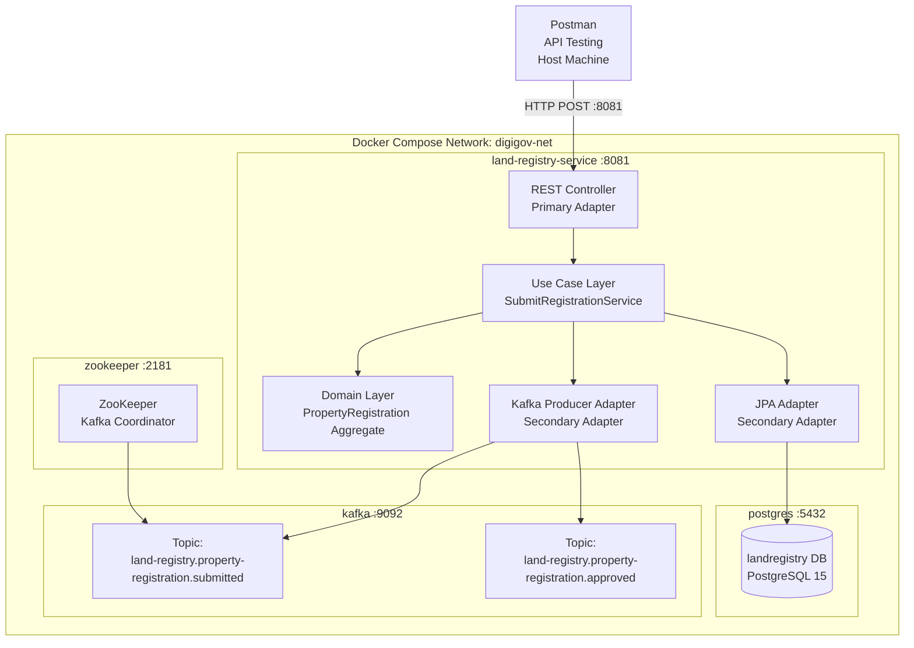

# DAY 2 — LAB DOCUMENT
## Senior Engineer to Solution Architect Program
### Document Type: Trainer's Playbook | Day 2 of 12

---

# LAB HEADER

## Lab Title: DigiGov Service Gateway — Building a Hexagonal Microservice with API-First Design

**Day Reference:** Day 2 — API-First Design, DDD, and Interoperability Architecture

**Lab Narrative:**
You are the lead architect for the **Jan Seva Portal** platform team. Today you build the **Land Registry Service** — the first production-grade microservice in the DigiGov Service Gateway ecosystem. This service implements the `PropertyRegistration` bounded context using hexagonal architecture, exposes a contract-first OpenAPI 3.1 REST API, publishes AsyncAPI-compliant domain events, and runs in a Docker Compose environment with PostgreSQL.

This is a **single continuous project** that grows section by section throughout the day. Each section builds on the previous. By end of day, the trainer has a fully running, tested, and demonstrable microservice.

---

## Prerequisites Checklist

Verify ALL items before the session. Run this checklist the evening before class.

**Software Versions:**

```powershell
# Run in PowerShell 7.x — verify all versions match
java -version
# Expected: openjdk version "17.x.x"

mvn -version
# Expected: Apache Maven 3.9.x

docker --version
# Expected: Docker version 24.x.x or later

docker compose version
# Expected: Docker Compose version v2.x.x

git --version
# Expected: git version 2.x.x

# Verify Docker Desktop is running
docker ps
# Expected: Empty table (no error)
```

**Accounts and Access:**
- [ ] Docker Desktop running with at least 4GB RAM allocated
- [ ] Internet access for Maven dependency download (first run only)
- [ ] Port 8081, 5432, 9092, 9093, 2181 available (verify below)

```powershell
# Check ports are free — Windows PowerShell
@(8081, 5432, 9092, 2181) | ForEach-Object {
    $result = netstat -ano | findstr ":$_"
    if ($result) {
        Write-Host "PORT $_ IS IN USE: $result" -ForegroundColor Red
    } else {
        Write-Host "PORT $_ is free" -ForegroundColor Green
    }
}
```

**Environment Variables (set before class):**

```powershell
# Set in PowerShell session — or add to $PROFILE for persistence
$env:POSTGRES_PASSWORD = "digigov_secret"
$env:POSTGRES_DB = "landregistry"
$env:POSTGRES_USER = "landregistry_user"
$env:SPRING_PROFILES_ACTIVE = "docker"
```

**Maven Local Repository Pre-warm (run night before — downloads all dependencies):**

```powershell
# From project root — downloads all dependencies to avoid class download delays
mvn dependency:go-offline -q
```

---

## Estimated Time

| Phase                               | Time          |
| ----------------------------------- | ------------- |
| Offline Setup (trainer preparation) | 45-60 minutes |
| In-Class Demonstration              | 4.5-5.0 hours |
| Cleanup                             | 10 minutes    |

---

## Learning Objectives (Lab)

Matching Theory Document objectives:
1. Build a hexagonal architecture Spring Boot 3.x service with strict port/adapter separation
2. Implement a DDD Aggregate Root with domain events in Java 17
3. Expose an OpenAPI 3.1 contract-first REST API
4. Publish AsyncAPI-compliant domain events to a Kafka topic
5. Run the full service stack with Docker Compose (Spring Boot + PostgreSQL + Kafka)
6. Verify all APIs with Postman
7. Demonstrate failure modes and their architectural remediation

---

## Project Architecture Overview



---

# LAB BODY

---

# LAB SECTION 1: Project Scaffolding and Domain Layer

## What We Are Building

We create the Maven project structure, implement the core domain layer (Aggregate Root, Value Objects, Domain Events), and verify the domain compiles and passes unit tests — all WITHOUT Spring Boot, without a database, and without any framework dependency.

**Key demonstration point:** The domain layer tests run in < 100ms with zero infrastructure.

---

## Step 1.1: Create Project Structure

```powershell
# Create project root directory
New-Item -ItemType Directory -Path "C:\digigov\land-registry-service" -Force
Set-Location "C:\digigov\land-registry-service"

# Create Maven source directory structure
$dirs = @(
    "src\main\java\gov\landregistry\domain\model",
    "src\main\java\gov\landregistry\domain\events",
    "src\main\java\gov\landregistry\domain\exception",
    "src\main\java\gov\landregistry\application\port\in\command",
    "src\main\java\gov\landregistry\application\port\out",
    "src\main\java\gov\landregistry\application\service",
    "src\main\java\gov\landregistry\adapter\in\web\dto",
    "src\main\java\gov\landregistry\adapter\out\persistence\entity",
    "src\main\java\gov\landregistry\adapter\out\messaging",
    "src\main\java\gov\landregistry\config",
    "src\main\resources\api",
    "src\main\resources\db\migration",
    "src\test\java\gov\landregistry\domain",
    "src\test\java\gov\landregistry\application",
    "src\test\java\gov\landregistry\adapter\in\web",
    "src\test\resources"
)

foreach ($dir in $dirs) {
    New-Item -ItemType Directory -Path $dir -Force | Out-Null
    Write-Host "Created: $dir" -ForegroundColor Green
}

Write-Host "Project structure created successfully" -ForegroundColor Cyan
```

[EXPECTED: All directories created with green confirmation messages. No errors.]

---

## Step 1.2: Create pom.xml

Create the file `C:\digigov\land-registry-service\pom.xml`:

```xml
<?xml version="1.0" encoding="UTF-8"?>
<project xmlns="http://maven.apache.org/POM/4.0.0"
         xmlns:xsi="http://www.w3.org/2001/XMLSchema-instance"
         xsi:schemaLocation="http://maven.apache.org/POM/4.0.0
         https://maven.apache.org/xsd/maven-4.0.0.xsd">
    <modelVersion>4.0.0</modelVersion>

    <parent>
        <groupId>org.springframework.boot</groupId>
        <artifactId>spring-boot-starter-parent</artifactId>
        <version>3.2.0</version>
        <relativePath/>
    </parent>

    <groupId>gov.landregistry</groupId>
    <artifactId>land-registry-service</artifactId>
    <version>1.0.0</version>
    <packaging>jar</packaging>
    <name>Land Registry Service</name>
    <description>
        DigiGov Jan Seva Portal — Land Registry Bounded Context
        Implements hexagonal architecture with API-first design.
        Part of Day 2: Senior Engineer to Solution Architect Program.
    </description>

    <properties>
        <java.version>17</java.version>
        <maven.compiler.source>17</maven.compiler.source>
        <maven.compiler.target>17</maven.compiler.target>
        <!-- Dependency versions — pinned for reproducible builds -->
        <flyway.version>9.22.3</flyway.version>
        <testcontainers.version>1.19.3</testcontainers.version>
        <springdoc.version>2.3.0</springdoc.version>
    </properties>

    <dependencies>

        <!-- ============================================ -->
        <!-- WEB LAYER — REST API                        -->
        <!-- ============================================ -->
        <dependency>
            <groupId>org.springframework.boot</groupId>
            <artifactId>spring-boot-starter-web</artifactId>
            <!-- WHY: Provides Spring MVC, embedded Tomcat, Jackson JSON -->
        </dependency>

        <!-- OpenAPI / Swagger UI — serves the contract at /swagger-ui.html -->
        <dependency>
            <groupId>org.springdoc</groupId>
            <artifactId>springdoc-openapi-starter-webmvc-ui</artifactId>
            <version>${springdoc.version}</version>
            <!-- WHY: Generates interactive API documentation from OpenAPI YAML -->
        </dependency>

        <!-- ============================================ -->
        <!-- PERSISTENCE LAYER                           -->
        <!-- ============================================ -->
        <dependency>
            <groupId>org.springframework.boot</groupId>
            <artifactId>spring-boot-starter-data-jpa</artifactId>
            <!-- WHY: JPA/Hibernate for the persistence adapter (outer ring only) -->
        </dependency>

        <dependency>
            <groupId>org.postgresql</groupId>
            <artifactId>postgresql</artifactId>
            <scope>runtime</scope>
            <!-- WHY: PostgreSQL JDBC driver — runtime only, not compile-time -->
        </dependency>

        <!-- Flyway — database schema migration -->
        <dependency>
            <groupId>org.flywaydb</groupId>
            <artifactId>flyway-core</artifactId>
            <!-- WHY: Schema-as-code; migrations are version-controlled -->
            <!-- Ensures database schema matches application version exactly -->
        </dependency>

        <!-- ============================================ -->
        <!-- MESSAGING — KAFKA                           -->
        <!-- ============================================ -->
        <dependency>
            <groupId>org.springframework.kafka</groupId>
            <artifactId>spring-kafka</artifactId>
            <!-- WHY: Kafka producer for domain event publishing -->
        </dependency>

        <!-- ============================================ -->
        <!-- VALIDATION                                  -->
        <!-- ============================================ -->
        <dependency>
            <groupId>org.springframework.boot</groupId>
            <artifactId>spring-boot-starter-validation</artifactId>
            <!-- WHY: Bean Validation (JSR-380) for REST request DTOs -->
        </dependency>

        <!-- ============================================ -->
        <!-- OBSERVABILITY                               -->
        <!-- ============================================ -->
        <dependency>
            <groupId>org.springframework.boot</groupId>
            <artifactId>spring-boot-starter-actuator</artifactId>
            <!-- WHY: Health endpoints for Docker health checks and K8s probes -->
        </dependency>

        <!-- ============================================ -->
        <!-- TEST DEPENDENCIES                           -->
        <!-- ============================================ -->
        <dependency>
            <groupId>org.springframework.boot</groupId>
            <artifactId>spring-boot-starter-test</artifactId>
            <scope>test</scope>
            <!-- WHY: JUnit 5, Mockito, AssertJ, Spring Test -->
        </dependency>

        <dependency>
            <groupId>org.springframework.kafka</groupId>
            <artifactId>spring-kafka-test</artifactId>
            <scope>test</scope>
            <!-- WHY: Embedded Kafka for integration tests without real broker -->
        </dependency>

        <!-- H2 in-memory database for slice tests -->
        <dependency>
            <groupId>com.h2database</groupId>
            <artifactId>h2</artifactId>
            <scope>test</scope>
            <!-- WHY: Fast in-memory DB for JPA slice tests -->
            <!-- NOTE: We do NOT use H2 for domain tests — domain has no DB dependency -->
        </dependency>

    </dependencies>

    <build>
        <plugins>
            <plugin>
                <groupId>org.springframework.boot</groupId>
                <artifactId>spring-boot-maven-plugin</artifactId>
                <!-- WHY: Creates executable fat JAR with embedded Tomcat -->
            </plugin>
            <plugin>
                <groupId>org.apache.maven.plugins</groupId>
                <artifactId>maven-surefire-plugin</artifactId>
                <configuration>
                    <!-- Run all tests in parallel for faster feedback -->
                    <parallel>methods</parallel>
                    <threadCount>4</threadCount>
                </configuration>
            </plugin>
        </plugins>
    </build>

</project>
```

---

## Step 1.3: Create Domain Layer — Value Objects

Create `src\main\java\gov\landregistry\domain\model\PropertyId.java`:

```java
package gov.landregistry.domain.model;

import java.util.Objects;
import java.util.UUID;

/**
 * Value Object: PropertyId
 *
 * WHY THIS EXISTS:
 * Using a typed PropertyId instead of raw String/UUID prevents:
 * 1. Accidental mixing of IDs (passing citizenId where propertyId is expected)
 * 2. The compiler catches ID misuse — not runtime bugs
 * 3. UUID generation and validation logic is centralised here
 *
 * IMMUTABILITY: All fields are final — Value Objects never change.
 * EQUALITY: Based on value (not reference) — two PropertyIds with same
 *           value are equal, unlike entities which use identity equality.
 */
public final class PropertyId {

    private final String value;

    private PropertyId(String value) {
        if (value == null || value.isBlank()) {
            throw new IllegalArgumentException(
                "PropertyId cannot be null or blank"
            );
        }
        // Validate UUID format
        try {
            UUID.fromString(value);
        } catch (IllegalArgumentException e) {
            throw new IllegalArgumentException(
                "PropertyId must be a valid UUID format. Received: " + value
            );
        }
        this.value = value;
    }

    /**
     * Factory method: generate a new unique PropertyId.
     * Use this when creating a NEW property registration.
     */
    public static PropertyId generate() {
        return new PropertyId(UUID.randomUUID().toString());
    }

    /**
     * Factory method: reconstruct a PropertyId from a known value.
     * Use this when loading an existing registration from the database.
     */
    public static PropertyId of(String value) {
        return new PropertyId(value);
    }

    public String getValue() {
        return value;
    }

    @Override
    public boolean equals(Object o) {
        if (this == o) return true;
        if (!(o instanceof PropertyId that)) return false;
        return Objects.equals(value, that.value);
    }

    @Override
    public int hashCode() {
        return Objects.hash(value);
    }

    @Override
    public String toString() {
        return value;
    }
}
```

Create `src\main\java\gov\landregistry\domain\model\RegistrationStatus.java`:

```java
package gov.landregistry.domain.model;

/**
 * Enumeration Value Object: RegistrationStatus
 *
 * WHY AN ENUM (not a String):
 * 1. Compile-time safety — cannot assign "APROVED" (typo)
 * 2. Documents the complete state machine in one place
 * 3. switch expressions on enums are exhaustive — compiler warns
 *    if a new status is added but not handled
 *
 * STATE MACHINE:
 * DRAFT → UNDER_REVIEW → APPROVED → REGISTERED
 *   ↓                       ↓
 * (deleted)              REJECTED
 *
 * Transitions are enforced by the PropertyRegistration aggregate root.
 * This enum documents WHAT states exist; the aggregate enforces WHEN
 * transitions are allowed.
 */
public enum RegistrationStatus {

    /**
     * Application created but not yet submitted.
     * Owner can still edit details.
     */
    DRAFT,

    /**
     * Application submitted and assigned to a land officer for review.
     * Owner cannot edit — awaiting officer action.
     */
    UNDER_REVIEW,

    /**
     * Officer has verified all documents and approved the application.
     * Awaiting final legal registration process.
     */
    APPROVED,

    /**
     * Legal registration complete — title deed issued.
     * This is a terminal state — no further transitions allowed.
     * A new registration must be initiated for any future changes.
     */
    REGISTERED,

    /**
     * Application rejected by the officer.
     * Reason is recorded in the rejection notes.
     * Owner may submit a new application after addressing the issues.
     */
    REJECTED
}
```

Create `src\main\java\gov\landregistry\domain\model\OwnerDetails.java`:

```java
package gov.landregistry.domain.model;

import java.util.Objects;

/**
 * Entity within the PropertyRegistration Aggregate: OwnerDetails
 *
 * WHY AN ENTITY (not a Value Object):
 * OwnerDetails has IDENTITY — it represents a specific person.
 * Two OwnerDetails with the same Aadhaar ID refer to the SAME person,
 * even if their names differ (e.g., due to name change after marriage).
 * This makes it an Entity (identity-based equality) not a Value Object
 * (value-based equality).
 *
 * WHY IT IS NOT AN AGGREGATE ROOT:
 * OwnerDetails cannot exist without a PropertyRegistration context.
 * You do not "manage owners" independently — you manage property registrations
 * that HAVE an owner. The aggregate root (PropertyRegistration) controls
 * all lifecycle operations for OwnerDetails.
 */
public class OwnerDetails {

    // The Aadhaar ID is the stable identity of this entity
    // It is verified by the Citizen Identity Service before reaching here
    private final String aadhaarId;
    private String name;

    private OwnerDetails(String aadhaarId, String name) {
        this.aadhaarId = aadhaarId;
        this.name = name;
    }

    /**
     * Factory method using Ubiquitous Language terms.
     * Parameter names match the domain glossary exactly.
     */
    public static OwnerDetails of(String name, String aadhaarId) {
        Objects.requireNonNull(name, "Owner name is required");
        Objects.requireNonNull(aadhaarId, "Owner Aadhaar ID is required");

        if (name.isBlank()) {
            throw new IllegalArgumentException("Owner name cannot be blank");
        }
        if (!aadhaarId.matches("^[0-9]{12}$")) {
            throw new IllegalArgumentException(
                "Aadhaar ID must be exactly 12 digits. Received length: "
                + aadhaarId.length()
            );
        }

        return new OwnerDetails(aadhaarId, name);
    }

    public String getAadhaarId() { return aadhaarId; }
    public String getName() { return name; }

    // Entity equality is based on identity (aadhaarId), not all fields
    @Override
    public boolean equals(Object o) {
        if (this == o) return true;
        if (!(o instanceof OwnerDetails that)) return false;
        return Objects.equals(aadhaarId, that.aadhaarId);
    }

    @Override
    public int hashCode() {
        return Objects.hash(aadhaarId);
    }

    @Override
    public String toString() {
        return "OwnerDetails{aadhaarId='" + aadhaarId +
               "', name='" + name + "'}";
    }
}
```

Create `src\main\java\gov\landregistry\domain\model\Encumbrance.java`:

```java
package gov.landregistry.domain.model;

import java.math.BigDecimal;
import java.util.Objects;

/**
 * Entity within PropertyRegistration Aggregate: Encumbrance
 *
 * An Encumbrance represents a financial claim (loan/mortgage) against
 * a property. In Ubiquitous Language: "A lender holds an encumbrance
 * on a property until the loan is repaid and NOC is obtained."
 *
 * WHY BigDecimal for loanAmount (not double):
 * Financial calculations MUST use BigDecimal.
 * double arithmetic produces rounding errors:
 *   0.1 + 0.2 = 0.30000000000000004 in double
 * For a government disbursement system, INR 1 rounding error
 * across 50M transactions = INR 50M discrepancy. Unacceptable.
 */
public class Encumbrance {

    private final String encumbranceId;
    private final String lenderName;
    private final BigDecimal loanAmount;
    private boolean nocObtained;

    public Encumbrance(
            String encumbranceId,
            String lenderName,
            BigDecimal loanAmount) {

        this.encumbranceId = Objects.requireNonNull(encumbranceId,
            "Encumbrance ID required");
        this.lenderName = Objects.requireNonNull(lenderName,
            "Lender name required");

        if (loanAmount == null || loanAmount.compareTo(BigDecimal.ZERO) <= 0) {
            throw new IllegalArgumentException(
                "Loan amount must be positive. Received: " + loanAmount
            );
        }
        this.loanAmount = loanAmount;
        this.nocObtained = false;
    }

    /**
     * Mark NOC (No Objection Certificate) as obtained from this lender.
     * This is a domain operation — not just a setter.
     * WHY: Naming it "markNocObtained()" instead of "setNocObtained(true)"
     * makes the intent clear in the Ubiquitous Language.
     * The domain model reads like the business process it represents.
     */
    public void markNocObtained() {
        this.nocObtained = true;
    }

    public String getEncumbranceId() { return encumbranceId; }
    public String getLenderName() { return lenderName; }
    public BigDecimal getLoanAmount() { return loanAmount; }
    public boolean isNocObtained() { return nocObtained; }

    // Entity equality by encumbranceId
    @Override
    public boolean equals(Object o) {
        if (this == o) return true;
        if (!(o instanceof Encumbrance that)) return false;
        return Objects.equals(encumbranceId, that.encumbranceId);
    }

    @Override
    public int hashCode() {
        return Objects.hash(encumbranceId);
    }
}
```

---

## Step 1.4: Create Domain Events

Create `src\main\java\gov\landregistry\domain\events\DomainEvent.java`:

```java
package gov.landregistry.domain.events;

import java.time.Instant;
import java.util.UUID;

/**
 * Base class for all domain events in the Land Registry Bounded Context.
 *
 * WHY ABSTRACT (not an interface):
 * All domain events share common metadata: eventId, occurredAt, aggregateId.
 * Using an abstract class DRY-s this shared structure.
 * An interface would require each event to re-implement these fields.
 *
 * WHY IMMUTABLE:
 * Events represent historical facts — "PropertyRegistrationSubmitted happened
 * at 14:32:01 UTC on 2024-01-15." Historical facts cannot be changed.
 * Immutable events are safe to share across threads and services.
 */
public abstract class DomainEvent {

    private final String eventId;
    private final Instant occurredAt;
    private final String aggregateId;
    private final String eventType;

    protected DomainEvent(String aggregateId, String eventType) {
        this.eventId = UUID.randomUUID().toString();
        this.occurredAt = Instant.now();
        this.aggregateId = aggregateId;
        this.eventType = eventType;
    }

    public String getEventId() { return eventId; }
    public Instant getOccurredAt() { return occurredAt; }
    public String getAggregateId() { return aggregateId; }
    public String getEventType() { return eventType; }
}
```

Create `src\main\java\gov\landregistry\domain\events\PropertyRegistrationSubmitted.java`:

```java
package gov.landregistry.domain.events;

/**
 * Domain Event: PropertyRegistrationSubmitted
 *
 * Raised when: a citizen submits a property registration for officer review.
 *
 * Published to Kafka topic:
 *   land-registry.property-registration.submitted
 *
 * Consumers:
 *   - Notification Service (sends SMS confirmation to citizen)
 *   - Audit Service (records the submission for compliance)
 *   - Officer Assignment Service (assigns to available land officer)
 *
 * WHY INCLUDE ownerAadhaarId:
 * The Notification Service needs to look up the citizen's mobile number
 * to send the SMS. It uses Aadhaar as the lookup key in the Identity Service.
 * NOTE: Per DPDP Act 2023 compliance, Aadhaar is NOT stored by the
 * Notification Service — used only for lookup, then discarded.
 */
public class PropertyRegistrationSubmitted extends DomainEvent {

    private final String ownerAadhaarId;
    private final String districtCode;

    public PropertyRegistrationSubmitted(
            String propertyId,
            String ownerAadhaarId,
            String districtCode) {
        super(propertyId, "PropertyRegistrationSubmitted");
        this.ownerAadhaarId = ownerAadhaarId;
        this.districtCode = districtCode;
    }

    public String getOwnerAadhaarId() { return ownerAadhaarId; }
    public String getDistrictCode() { return districtCode; }
}
```

Create `src\main\java\gov\landregistry\domain\events\PropertyRegistrationApproved.java`:

```java
package gov.landregistry.domain.events;

/**
 * Domain Event: PropertyRegistrationApproved
 *
 * Raised when: a land officer approves a registration application.
 *
 * Published to Kafka topic:
 *   land-registry.property-registration.approved
 *
 * Consumers:
 *   - Notification Service (sends approval letter to citizen)
 *   - Audit Service (records approval with officer ID)
 *   - Document Service (generates title deed PDF)
 */
public class PropertyRegistrationApproved extends DomainEvent {

    private final String approvedByOfficerId;

    public PropertyRegistrationApproved(
            String propertyId,
            String approvedByOfficerId) {
        super(propertyId, "PropertyRegistrationApproved");
        this.approvedByOfficerId = approvedByOfficerId;
    }

    public String getApprovedByOfficerId() { return approvedByOfficerId; }
}
```

Create `src\main\java\gov\landregistry\domain\events\EncumbranceAdded.java`:

```java
package gov.landregistry.domain.events;

/**
 * Domain Event: EncumbranceAdded
 *
 * Raised when: a financial encumbrance (loan/mortgage) is recorded
 * against a property registration.
 *
 * Consumers:
 *   - Audit Service (records the encumbrance for financial compliance)
 */
public class EncumbranceAdded extends DomainEvent {

    private final String lenderName;

    public EncumbranceAdded(String propertyId, String lenderName) {
        super(propertyId, "EncumbranceAdded");
        this.lenderName = lenderName;
    }

    public String getLenderName() { return lenderName; }
}
```

---

## Step 1.5: Create Domain Exception

Create `src\main\java\gov\landregistry\domain\exception\DomainException.java`:

```java
package gov.landregistry.domain.exception;

/**
 * Domain Exception: Signals a business invariant violation.
 *
 * WHY A CUSTOM EXCEPTION (not IllegalArgumentException or RuntimeException):
 * Exception type carries semantic meaning.
 * DomainException = a BUSINESS RULE was violated (invariant not met).
 * IllegalArgumentException = a programming contract was violated (wrong input type).
 * RuntimeException = something unexpected happened (bug or infrastructure failure).
 *
 * The REST adapter maps DomainException → HTTP 422 Unprocessable Entity.
 * The REST adapter maps RuntimeException → HTTP 500 Internal Server Error.
 * Without separate exception types, ALL failures would return 500 —
 * making it impossible for clients to distinguish user errors from bugs.
 */
public class DomainException extends RuntimeException {

    private final String invariantCode;

    public DomainException(String message) {
        super(message);
        this.invariantCode = "DOMAIN_RULE_VIOLATION";
    }

    public DomainException(String invariantCode, String message) {
        super(message);
        this.invariantCode = invariantCode;
    }

    public String getInvariantCode() {
        return invariantCode;
    }
}
```

---

## Step 1.6: Create the Aggregate Root

Create `src\main\java\gov\landregistry\domain\model\PropertyRegistration.java`:

```java
package gov.landregistry.domain.model;

import gov.landregistry.domain.events.DomainEvent;
import gov.landregistry.domain.events.EncumbranceAdded;
import gov.landregistry.domain.events.PropertyRegistrationApproved;
import gov.landregistry.domain.events.PropertyRegistrationSubmitted;
import gov.landregistry.domain.exception.DomainException;

import java.time.Instant;
import java.util.ArrayList;
import java.util.Collections;
import java.util.List;
import java.util.UUID;

/**
 * AGGREGATE ROOT: PropertyRegistration
 * Bounded Context: Land Registry
 *
 * This is the most important class in the entire service.
 * ALL state changes to a property registration flow through here.
 * NO external code modifies PropertyRegistration state directly.
 *
 * INVARIANTS ENFORCED:
 *   INV-001: A registration cannot be submitted without a verified Aadhaar ID
 *   INV-002: A registration with unresolved encumbrances cannot be approved
 *   INV-003: Status transitions follow: DRAFT→UNDER_REVIEW→APPROVED→REGISTERED
 *   INV-004: A REGISTERED property is immutable — no further modifications
 *   INV-005: District code is required for officer assignment routing
 *
 * DOMAIN EVENTS RAISED:
 *   - submitForReview()  → PropertyRegistrationSubmitted
 *   - addEncumbrance()   → EncumbranceAdded
 *   - approve()          → PropertyRegistrationApproved
 */
public class PropertyRegistration {

    // ─── Identity ─────────────────────────────────────────────
    private final PropertyId id;

    // ─── State ────────────────────────────────────────────────
    private OwnerDetails owner;
    private RegistrationStatus status;
    private String districtCode;
    private final Instant createdAt;
    private Instant updatedAt;
    private String rejectionReason;

    // ─── Child Entities ────────────────────────────────────────
    // WHY List, not Set: preserves insertion order for audit trail
    private final List<Encumbrance> encumbrances;

    // ─── Domain Event Collector ────────────────────────────────
    // WHY transient: these are NOT persisted — they are published after commit
    // WHY collected (not published immediately):
    //   If we publish to Kafka during a transaction and the DB commit fails,
    //   the event represents data that does not exist. By collecting and
    //   publishing AFTER commit, we ensure consistency.
    //   (For stronger guarantees, use the Outbox Pattern — covered Day 7)
    private final List<DomainEvent> domainEvents;

    // ─── Private Constructor ───────────────────────────────────
    // WHY private: force use of named factory methods
    // Named factories communicate INTENT (why is this being created)
    private PropertyRegistration(PropertyId id) {
        this.id = id;
        this.encumbrances = new ArrayList<>();
        this.domainEvents = new ArrayList<>();
        this.createdAt = Instant.now();
        this.updatedAt = Instant.now();
    }

    // ═══════════════════════════════════════════════════════════
    // FACTORY METHODS — Named per Ubiquitous Language
    // ═══════════════════════════════════════════════════════════

    /**
     * Create a new property registration in DRAFT state.
     * Called when a citizen initiates a registration application.
     *
     * @param owner       Verified owner details (Aadhaar pre-verified)
     * @param districtCode Administrative district for officer routing
     */
    public static PropertyRegistration create(
            OwnerDetails owner,
            String districtCode) {

        if (owner == null) {
            throw new DomainException("INV-001",
                "Cannot create a registration without owner details");
        }
        if (districtCode == null || districtCode.isBlank()) {
            throw new DomainException("INV-005",
                "District code is required for officer assignment routing");
        }

        PropertyId newId = PropertyId.generate();
        PropertyRegistration registration = new PropertyRegistration(newId);
        registration.owner = owner;
        registration.districtCode = districtCode;
        registration.status = RegistrationStatus.DRAFT;

        return registration;
    }

    /**
     * Reconstitute a PropertyRegistration from persisted state.
     * Called by the JPA adapter when loading from the database.
     * Does NOT raise domain events — reconstitution is not a domain action.
     *
     * WHY A SEPARATE FACTORY for reconstitution:
     * The create() factory enforces DRAFT initial state.
     * When loading from DB, the status is whatever it was when last saved.
     * Using create() for loading would reset the status to DRAFT — wrong!
     */
    public static PropertyRegistration reconstitute(
            String id,
            OwnerDetails owner,
            RegistrationStatus status,
            String districtCode,
            List<Encumbrance> encumbrances,
            Instant createdAt) {

        PropertyRegistration registration =
            new PropertyRegistration(PropertyId.of(id));
        registration.owner = owner;
        registration.status = status;
        registration.districtCode = districtCode;
        registration.encumbrances.addAll(encumbrances);
        // Override the createdAt set in constructor
        // (Java records would be cleaner here, but we need mutability for
        // reconstitution — a design trade-off in DDD aggregate implementation)
        return registration;
    }

    // ═══════════════════════════════════════════════════════════
    // DOMAIN COMMANDS — Business Operations
    // ═══════════════════════════════════════════════════════════

    /**
     * COMMAND: Submit registration for officer review.
     * Enforces INV-001 and INV-003.
     * Raises: PropertyRegistrationSubmitted
     */
    public void submitForReview() {
        // INV-001: Aadhaar must be verified
        if (owner == null || owner.getAadhaarId() == null) {
            throw new DomainException("INV-001",
                "Cannot submit registration: owner Aadhaar ID not verified. " +
                "Complete Aadhaar verification before submission.");
        }

        // INV-003: Status transition guard
        if (this.status != RegistrationStatus.DRAFT) {
            throw new DomainException("INV-003",
                "Cannot submit registration: expected status DRAFT " +
                "but current status is " + this.status + ". " +
                "Only DRAFT registrations can be submitted for review.");
        }

        this.status = RegistrationStatus.UNDER_REVIEW;
        this.updatedAt = Instant.now();

        // Record domain event for post-transaction publication
        addDomainEvent(new PropertyRegistrationSubmitted(
            this.id.getValue(),
            this.owner.getAadhaarId(),
            this.districtCode
        ));
    }

    /**
     * COMMAND: Add a financial encumbrance to this property.
     * Enforces INV-004.
     * Raises: EncumbranceAdded
     */
    public void addEncumbrance(Encumbrance encumbrance) {
        // INV-004: Registered properties are immutable
        if (this.status == RegistrationStatus.REGISTERED) {
            throw new DomainException("INV-004",
                "Cannot add encumbrance: property is REGISTERED (terminal state). " +
                "A new registration must be initiated for any further changes.");
        }
        if (encumbrance == null) {
            throw new DomainException("Encumbrance cannot be null");
        }

        this.encumbrances.add(encumbrance);
        this.updatedAt = Instant.now();

        addDomainEvent(new EncumbranceAdded(
            this.id.getValue(),
            encumbrance.getLenderName()
        ));
    }

    /**
     * COMMAND: Approve the registration.
     * Enforces INV-002 and INV-003.
     * Raises: PropertyRegistrationApproved
     *
     * @param officerId Badge ID of the approving land officer
     */
    public void approve(String officerId) {
        if (officerId == null || officerId.isBlank()) {
            throw new DomainException(
                "Approving officer ID is required for audit trail");
        }

        // INV-002: All encumbrances must have NOC
        List<String> unresolvedLenders = this.encumbrances.stream()
            .filter(e -> !e.isNocObtained())
            .map(Encumbrance::getLenderName)
            .toList();

        if (!unresolvedLenders.isEmpty()) {
            throw new DomainException("INV-002",
                "Cannot approve registration: unresolved encumbrances exist. " +
                "The following lenders must provide NOC: " +
                String.join(", ", unresolvedLenders));
        }

        // INV-003: Must be UNDER_REVIEW to approve
        if (this.status != RegistrationStatus.UNDER_REVIEW) {
            throw new DomainException("INV-003",
                "Cannot approve registration: expected status UNDER_REVIEW " +
                "but current status is " + this.status);
        }

        this.status = RegistrationStatus.APPROVED;
        this.updatedAt = Instant.now();

        addDomainEvent(new PropertyRegistrationApproved(
            this.id.getValue(),
            officerId
        ));
    }

    /**
     * COMMAND: Reject the registration with a reason.
     */
    public void reject(String officerId, String reason) {
        if (this.status != RegistrationStatus.UNDER_REVIEW) {
            throw new DomainException("INV-003",
                "Can only reject a registration that is UNDER_REVIEW. " +
                "Current status: " + this.status);
        }
        if (reason == null || reason.isBlank()) {
            throw new DomainException(
                "Rejection reason is mandatory for citizen communication");
        }

        this.status = RegistrationStatus.REJECTED;
        this.rejectionReason = reason;
        this.updatedAt = Instant.now();
    }

    // ═══════════════════════════════════════════════════════════
    // DOMAIN EVENT MANAGEMENT
    // ═══════════════════════════════════════════════════════════

    private void addDomainEvent(DomainEvent event) {
        this.domainEvents.add(event);
    }

    /**
     * Called by the repository/use case AFTER successful DB commit.
     * Returns events to be published to Kafka.
     */
    public List<DomainEvent> getDomainEvents() {
        return Collections.unmodifiableList(domainEvents);
    }

    /**
     * Called AFTER events have been published.
     * Prevents duplicate publication if aggregate is used again in same transaction.
     */
    public void clearDomainEvents() {
        this.domainEvents.clear();
    }

    // ═══════════════════════════════════════════════════════════
    // ACCESSORS — Read-only views of state
    // ═══════════════════════════════════════════════════════════

    public PropertyId getId() { return id; }
    public OwnerDetails getOwner() { return owner; }
    public RegistrationStatus getStatus() { return status; }
    public String getDistrictCode() { return districtCode; }
    public Instant getCreatedAt() { return createdAt; }
    public Instant getUpdatedAt() { return updatedAt; }
    public String getRejectionReason() { return rejectionReason; }

    // Return defensive copy — external code cannot mutate encumbrances list
    public List<Encumbrance> getEncumbrances() {
        return Collections.unmodifiableList(encumbrances);
    }
}
```

---

## Step 1.7: Write Domain Unit Tests

Create `src\test\java\gov\landregistry\domain\PropertyRegistrationTest.java`:

```java
package gov.landregistry.domain;

import gov.landregistry.domain.events.PropertyRegistrationApproved;
import gov.landregistry.domain.events.PropertyRegistrationSubmitted;
import gov.landregistry.domain.exception.DomainException;
import gov.landregistry.domain.model.Encumbrance;
import gov.landregistry.domain.model.OwnerDetails;
import gov.landregistry.domain.model.PropertyRegistration;
import gov.landregistry.domain.model.RegistrationStatus;
import org.junit.jupiter.api.BeforeEach;
import org.junit.jupiter.api.DisplayName;
import org.junit.jupiter.api.Nested;
import org.junit.jupiter.api.Test;

import java.math.BigDecimal;

import static org.assertj.core.api.Assertions.*;

/**
 * Domain Unit Tests: PropertyRegistration Aggregate
 *
 * WHY THESE TESTS ARE IMPORTANT:
 * These tests run in < 100ms — no Spring, no database, no Kafka.
 * They verify BUSINESS RULES — not HTTP or persistence behaviour.
 * If these tests pass, the business logic is correct regardless of
 * what framework, database, or messaging system is used.
 *
 * TEST STRUCTURE: Nested classes group tests by operation (command).
 * This mirrors the aggregate's command structure.
 */
@DisplayName("PropertyRegistration Aggregate")
class PropertyRegistrationTest {

    // ─── Test Fixtures ─────────────────────────────────────────
    private static final String VALID_AADHAAR = "123456789012";
    private static final String OWNER_NAME = "Rajesh Kumar";
    private static final String DISTRICT_CODE = "KA-BLR-01";
    private static final String OFFICER_ID = "OFF-2024-001";

    private OwnerDetails validOwner;

    @BeforeEach
    void setUp() {
        validOwner = OwnerDetails.of(OWNER_NAME, VALID_AADHAAR);
    }

    // ═══════════════════════════════════════════════════════════
    // CREATION TESTS
    // ═══════════════════════════════════════════════════════════

    @Nested
    @DisplayName("when creating a new registration")
    class Creation {

        @Test
        @DisplayName("should create registration in DRAFT status")
        void shouldCreateInDraftStatus() {
            // ARRANGE + ACT
            PropertyRegistration registration =
                PropertyRegistration.create(validOwner, DISTRICT_CODE);

            // ASSERT
            assertThat(registration.getStatus())
                .isEqualTo(RegistrationStatus.DRAFT);
            assertThat(registration.getId()).isNotNull();
            assertThat(registration.getOwner().getAadhaarId())
                .isEqualTo(VALID_AADHAAR);
            assertThat(registration.getDomainEvents()).isEmpty();
        }

        @Test
        @DisplayName("should reject creation without owner details")
        void shouldRejectCreationWithoutOwner() {
            assertThatThrownBy(() ->
                PropertyRegistration.create(null, DISTRICT_CODE)
            )
            .isInstanceOf(DomainException.class)
            .hasMessageContaining("owner details");
        }

        @Test
        @DisplayName("should reject creation without district code")
        void shouldRejectCreationWithoutDistrictCode() {
            assertThatThrownBy(() ->
                PropertyRegistration.create(validOwner, "")
            )
            .isInstanceOf(DomainException.class)
            .hasMessageContaining("District code");
        }
    }

    // ═══════════════════════════════════════════════════════════
    // SUBMIT FOR REVIEW TESTS — INV-001, INV-003
    // ═══════════════════════════════════════════════════════════

    @Nested
    @DisplayName("when submitting for review")
    class SubmitForReview {

        @Test
        @DisplayName("should transition to UNDER_REVIEW and raise event")
        void shouldTransitionToUnderReviewAndRaiseEvent() {
            // ARRANGE
            PropertyRegistration registration =
                PropertyRegistration.create(validOwner, DISTRICT_CODE);

            // ACT
            registration.submitForReview();

            // ASSERT — state change
            assertThat(registration.getStatus())
                .isEqualTo(RegistrationStatus.UNDER_REVIEW);

            // ASSERT — domain event raised
            assertThat(registration.getDomainEvents()).hasSize(1);
            assertThat(registration.getDomainEvents().get(0))
                .isInstanceOf(PropertyRegistrationSubmitted.class);

            PropertyRegistrationSubmitted event =
                (PropertyRegistrationSubmitted) registration.getDomainEvents().get(0);
            assertThat(event.getOwnerAadhaarId()).isEqualTo(VALID_AADHAAR);
            assertThat(event.getDistrictCode()).isEqualTo(DISTRICT_CODE);
        }

        @Test
        @DisplayName("should enforce INV-003: cannot submit if not DRAFT")
        void shouldEnforceInv003OnDoubleSubmit() {
            // ARRANGE
            PropertyRegistration registration =
                PropertyRegistration.create(validOwner, DISTRICT_CODE);
            registration.submitForReview(); // First submit — succeeds

            // ACT + ASSERT — second submit should fail
            assertThatThrownBy(registration::submitForReview)
                .isInstanceOf(DomainException.class)
                .hasMessageContaining("INV-003")
                .hasMessageContaining("DRAFT");
        }
    }

    // ═══════════════════════════════════════════════════════════
    // APPROVAL TESTS — INV-002, INV-003
    // ═══════════════════════════════════════════════════════════

    @Nested
    @DisplayName("when approving a registration")
    class Approval {

        @Test
        @DisplayName("should approve a registration with no encumbrances")
        void shouldApproveWithNoEncumbrances() {
            // ARRANGE
            PropertyRegistration registration =
                PropertyRegistration.create(validOwner, DISTRICT_CODE);
            registration.submitForReview();
            registration.clearDomainEvents(); // Clear submit event for clarity

            // ACT
            registration.approve(OFFICER_ID);

            // ASSERT
            assertThat(registration.getStatus())
                .isEqualTo(RegistrationStatus.APPROVED);
            assertThat(registration.getDomainEvents()).hasSize(1);
            assertThat(registration.getDomainEvents().get(0))
                .isInstanceOf(PropertyRegistrationApproved.class);
        }

        @Test
        @DisplayName("should enforce INV-002: cannot approve with unresolved encumbrances")
        void shouldEnforceInv002WithUnresolvedEncumbrances() {
            // ARRANGE
            PropertyRegistration registration =
                PropertyRegistration.create(validOwner, DISTRICT_CODE);
            registration.submitForReview();

            // Add an encumbrance WITHOUT NOC
            Encumbrance encumbrance = new Encumbrance(
                "ENC-001", "SBI Home Loans", new BigDecimal("5000000.00")
            );
            registration.addEncumbrance(encumbrance);
            registration.clearDomainEvents();

            // ACT + ASSERT
            assertThatThrownBy(() -> registration.approve(OFFICER_ID))
                .isInstanceOf(DomainException.class)
                .hasMessageContaining("INV-002")
                .hasMessageContaining("SBI Home Loans");
        }

        @Test
        @DisplayName("should approve when all encumbrances have NOC")
        void shouldApproveWhenAllEncumbrancesHaveNoc() {
            // ARRANGE
            PropertyRegistration registration =
                PropertyRegistration.create(validOwner, DISTRICT_CODE);
            registration.submitForReview();

            Encumbrance encumbrance = new Encumbrance(
                "ENC-001", "SBI Home Loans", new BigDecimal("5000000.00")
            );
            encumbrance.markNocObtained(); // NOC obtained
            registration.addEncumbrance(encumbrance);
            registration.clearDomainEvents();

            // ACT + ASSERT — should not throw
            assertThatCode(() -> registration.approve(OFFICER_ID))
                .doesNotThrowAnyException();
            assertThat(registration.getStatus())
                .isEqualTo(RegistrationStatus.APPROVED);
        }

        @Test
        @DisplayName("should enforce INV-003: cannot approve a DRAFT registration")
        void shouldEnforceInv003ApprovingDraft() {
            // ARRANGE — skip submitForReview()
            PropertyRegistration registration =
                PropertyRegistration.create(validOwner, DISTRICT_CODE);

            // ACT + ASSERT
            assertThatThrownBy(() -> registration.approve(OFFICER_ID))
                .isInstanceOf(DomainException.class)
                .hasMessageContaining("INV-003");
        }
    }

    // ═══════════════════════════════════════════════════════════
    // EVENT MANAGEMENT TESTS
    // ═══════════════════════════════════════════════════════════

    @Nested
    @DisplayName("domain event management")
    class EventManagement {

        @Test
        @DisplayName("should clear domain events after publication")
        void shouldClearEventsAfterPublication() {
            // ARRANGE
            PropertyRegistration registration =
                PropertyRegistration.create(validOwner, DISTRICT_CODE);
            registration.submitForReview();
            assertThat(registration.getDomainEvents()).isNotEmpty();

            // ACT — simulate post-commit event publication
            registration.clearDomainEvents();

            // ASSERT
            assertThat(registration.getDomainEvents()).isEmpty();
        }

        @Test
        @DisplayName("should accumulate multiple events in order")
        void shouldAccumulateMultipleEvents() {
            // ARRANGE + ACT
            PropertyRegistration registration =
                PropertyRegistration.create(validOwner, DISTRICT_CODE);
            registration.submitForReview();

            Encumbrance enc = new Encumbrance(
                "ENC-001", "HDFC Bank", new BigDecimal("3000000.00")
            );
            registration.addEncumbrance(enc);

            // ASSERT — two events in correct order
            assertThat(registration.getDomainEvents()).hasSize(2);
            assertThat(registration.getDomainEvents().get(0))
                .isInstanceOf(PropertyRegistrationSubmitted.class);
            assertThat(registration.getDomainEvents().get(1))
                .isInstanceOf(EncumbranceAdded.class);
        }
    }
}
```

---

## Step 1.8: Run Domain Tests

```powershell
# Run ONLY domain tests — should complete in < 500ms
# This demonstrates the hexagonal architecture benefit:
# Business logic tests need NO infrastructure
mvn test -pl . -Dtest="PropertyRegistrationTest" -q

# Expected output:
# [INFO] Tests run: 10, Failures: 0, Errors: 0, Skipped: 0
# [INFO] BUILD SUCCESS
```

[EXPECTED: All 10 tests pass. Build time < 5 seconds. No Spring context loaded. No database connection attempted.]

---

## Pre-Demonstration Verification — Section 1

```powershell
# Verify domain layer compiles cleanly
mvn compile -q
# Expected: BUILD SUCCESS, no warnings

# Run domain tests
mvn test -Dtest="PropertyRegistrationTest" -q
# Expected: 10 tests pass

# Verify no framework imports in domain layer
# (PowerShell grep equivalent)
Get-ChildItem -Path "src\main\java\gov\landregistry\domain" -Recurse -Filter "*.java" |
    Select-String -Pattern "import org.springframework|import javax.persistence|import jakarta.persistence" |
    Select-String -NotMatch "// "
# Expected: NO OUTPUT — domain layer has zero framework imports
```

**Definition of Done — Section 1:**
- [ ] All directories created successfully
- [ ] `pom.xml` created with correct dependencies
- [ ] All domain model classes compile without errors
- [ ] Domain unit tests: 10/10 passing
- [ ] Zero framework imports in the `domain` package (verified above)
- [ ] Build time for domain tests < 5 seconds

---

## In-Class Demonstration Script — Section 1

**Talking points while showing domain code:**

1. Open `PropertyRegistration.java`. Point to the import block: *"Notice what is NOT imported here. No `import org.springframework`. No `import jakarta.persistence`. No `import org.apache.kafka`. This class knows NOTHING about Spring Boot, about the database, about Kafka. It is pure Java 17. This is what 'infrastructure independence' looks like in code."*

2. Point to `submitForReview()`: *"Every business rule is IN CODE. INV-001: Aadhaar required. INV-003: Must be DRAFT. These are not in a Word document, not in a JIRA ticket, not in a test plan PDF. They are executable, testable business rules. When a junior developer joins this project, the invariants are self-documenting."*

3. Run the tests live: *"Watch the test execution time."* Run `mvn test -Dtest="PropertyRegistrationTest"`. *"Under 2 seconds. No database. No Docker. No network. We can run these tests in a CI pipeline that has no infrastructure whatsoever — just a JVM."*

4. **Ask the audience:** *"What would happen if I called `registration.approve()` on a DRAFT registration — without calling `submitForReview()` first? Before I run it, tell me what you expect."* Then run the failing test scenario live.

5. Point to `getDomainEvents()` / `clearDomainEvents()`: *"These two methods implement the collect-and-publish pattern. Why don't we publish to Kafka right here in the domain method? Because if the database commit fails after we publish, we have sent an event for data that does not exist. We collect here. We publish after the database says 'committed.' This is the simplest form of the transactional outbox pattern."*

**Questions to ask the audience:**
- "What is the difference between `PropertyRegistration.create()` and `PropertyRegistration.reconstitute()`? When would each be called?"
- "Why does `addEncumbrance()` also check for INV-004 (REGISTERED state)? What would happen if we did not have that check?"
- "Why is `domainEvents` a `List` and not a `Set`? What would happen if it were a `Set`?"

---


# LAB SECTION 2: Application Layer, Ports, and Use Case Implementation

## What We Are Building

We implement the **Application Layer** — the orchestration ring of the hexagonal architecture. This section builds:

1. **Input Commands** — immutable data carriers that translate external requests into domain intent
2. **Primary Port** — the interface through which external actors drive the application
3. **Secondary Ports** — interfaces that the application core requires from infrastructure
4. **Use Case Service** — the orchestrator that coordinates domain objects, repositories, and event publishers

**Key demonstration point:** Every class in this section has zero knowledge of HTTP, REST, JPA, Kafka, or any framework. The use case tests run in under 300 milliseconds with no infrastructure whatsoever.

**Builds on:** Section 1's domain layer (PropertyRegistration aggregate, domain events, domain exceptions)

**Feeds into:** Section 3's adapter implementations (REST controller, JPA adapter, Kafka publisher)

---

## Project Structure — Section 2 Additions

```
land-registry-service/
└── src/
    ├── main/java/gov/landregistry/
    │   └── application/                          ← NEW THIS SECTION
    │       ├── port/
    │       │   ├── in/
    │       │   │   ├── PropertyRegistrationInputPort.java   ← PRIMARY PORT
    │       │   │   └── command/
    │       │   │       ├── SubmitRegistrationCommand.java
    │       │   │       └── ApproveRegistrationCommand.java
    │       │   └── out/
    │       │       ├── PropertyRepository.java              ← SECONDARY PORT
    │       │       └── EventPublisher.java                  ← SECONDARY PORT
    │       └── service/
    │           └── PropertyRegistrationService.java         ← USE CASE
    └── test/java/gov/landregistry/
        └── application/
            └── PropertyRegistrationServiceTest.java         ← NEW THIS SECTION
```

---

## Step 2.1: Create Input Commands

### What are Commands?

**Commands** are immutable value objects that carry all the data needed for a single use case invocation. They are the translation layer between the outside world (HTTP request body, Kafka message payload, CLI arguments) and the application core.

**Why Java 17 Records for Commands:**
- Records are immutable by default — no setters, all fields final
- Records provide `equals()`, `hashCode()`, and `toString()` automatically
- Compact constructors enable validation at construction time
- Commands represent a point-in-time intent — immutability is semantically correct

**Why NOT pass HTTP DTOs directly to use cases:**
The REST request DTO carries framework-specific annotations (`@NotBlank`, `@Pattern`, `@JsonProperty`). If the use case accepted the DTO directly, the application core would depend on the web framework — violating the Dependency Rule. Commands are framework-free.

---

Create `src\main\java\gov\landregistry\application\port\in\command\SubmitRegistrationCommand.java`:

```java
package gov.landregistry.application.port.in.command;

/**
 * Command: SubmitRegistrationCommand
 *
 * PURPOSE:
 * Carries all data required to submit a new property registration.
 * This is the input model of the SubmitRegistration use case.
 *
 * IMMUTABILITY:
 * Java 17 record — all fields are final; no setters exist.
 * Commands represent intent at a specific point in time.
 * They cannot and should not be mutated after creation.
 *
 * VALIDATION STRATEGY:
 * The compact constructor validates structural correctness
 * (are the required fields present and correctly formatted?).
 * Business rule validation (is the Aadhaar valid in UIDAI's system?)
 * belongs to the domain layer, not here.
 *
 * CALLED BY:
 * - PropertyRegistrationController (REST adapter) — translates HTTP body → Command
 * - RegistrationEventConsumer (Kafka adapter, if implemented) — translates message → Command
 * - PropertyRegistrationServiceTest (test adapter) — creates command directly
 *
 * CALLS INTO:
 * - PropertyRegistrationInputPort.submitRegistration(command)
 */
public record SubmitRegistrationCommand(
    String ownerName,
    String ownerAadhaarId,
    String districtCode
) {

    /**
     * Compact constructor — validates command structural integrity.
     *
     * WHY VALIDATE HERE (not in the use case):
     * Commands are the boundary between the outside world and the
     * application core. Invalid commands should be rejected at this
     * boundary — they should never reach the use case or the domain.
     *
     * This is analogous to input sanitisation at the system boundary.
     * The domain aggregate enforces business invariants AFTER the command
     * has passed structural validation here.
     */
    public SubmitRegistrationCommand {
        if (ownerName == null || ownerName.isBlank()) {
            throw new IllegalArgumentException(
                "Owner name is required in SubmitRegistrationCommand"
            );
        }
        if (ownerName.length() < 2 || ownerName.length() > 100) {
            throw new IllegalArgumentException(
                "Owner name must be between 2 and 100 characters. " +
                "Received length: " + ownerName.length()
            );
        }
        if (ownerAadhaarId == null || ownerAadhaarId.isBlank()) {
            throw new IllegalArgumentException(
                "Owner Aadhaar ID is required in SubmitRegistrationCommand"
            );
        }
        if (!ownerAadhaarId.matches("^[0-9]{12}$")) {
            throw new IllegalArgumentException(
                "Aadhaar ID must be exactly 12 numeric digits. " +
                "Received: " + ownerAadhaarId.length() + " characters"
            );
        }
        if (districtCode == null || districtCode.isBlank()) {
            throw new IllegalArgumentException(
                "District code is required in SubmitRegistrationCommand"
            );
        }
    }
}
```

Create `src\main\java\gov\landregistry\application\port\in\command\ApproveRegistrationCommand.java`:

```java
package gov.landregistry.application.port.in.command;

/**
 * Command: ApproveRegistrationCommand
 *
 * PURPOSE:
 * Carries the minimal data required to approve a property registration.
 * Includes the officer ID as a mandatory field — every approval must
 * be traceable to a specific land officer for audit and accountability.
 *
 * DESIGN DECISION — WHY NOT INCLUDE OFFICER NAME:
 * The officer's name can be looked up from the officer ID via the
 * Identity Service. Including the name in the command would create
 * a redundancy that could become inconsistent if the officer's
 * name changes in the identity system. Store the identifier; derive
 * the name when needed for display purposes.
 *
 * This reflects the DDD principle: store identity references between
 * aggregates, not embedded copies of mutable data.
 *
 * CALLED BY:
 * - PropertyRegistrationController (REST adapter) — PUT /{propertyId}/approve
 *
 * CALLS INTO:
 * - PropertyRegistrationInputPort.approveRegistration(command)
 */
public record ApproveRegistrationCommand(
    String propertyId,
    String officerId
) {

    public ApproveRegistrationCommand {
        if (propertyId == null || propertyId.isBlank()) {
            throw new IllegalArgumentException(
                "Property ID is required in ApproveRegistrationCommand"
            );
        }
        if (officerId == null || officerId.isBlank()) {
            throw new IllegalArgumentException(
                "Officer ID is required for audit trail in ApproveRegistrationCommand. " +
                "Every approval action must be attributable to a specific officer."
            );
        }
    }
}
```

---

## Step 2.2: Define Port Interfaces

### Understanding Ports in Context

Before creating the port interfaces, establish the mental model with participants:

```
OUTSIDE WORLD                    APPLICATION CORE                  INFRASTRUCTURE
─────────────────────────────────────────────────────────────────────────────────
HTTP Request  ──→  REST Controller  ──→  [PRIMARY PORT]  ──→  Use Case Service
Kafka Message ──→  Kafka Consumer   ──→  [PRIMARY PORT]  ──→  Use Case Service
JUnit Test    ──→  Test Code        ──→  [PRIMARY PORT]  ──→  Use Case Service

Use Case Service  ──→  [SECONDARY PORT]  ──→  JPA Adapter  ──→  PostgreSQL
Use Case Service  ──→  [SECONDARY PORT]  ──→  Kafka Adapter ──→  Kafka Broker
Use Case Service  ──→  [SECONDARY PORT]  ──→  Mock Adapter  ──→  In-Memory Map
```

**The ports are the arrows between the hexagon boundary and the outside.** Primary ports point inward (driving the application). Secondary ports point outward (the application drives infrastructure).

---

Create `src\main\java\gov\landregistry\application\port\in\PropertyRegistrationInputPort.java`:

```java
package gov.landregistry.application.port.in;

import gov.landregistry.application.port.in.command.ApproveRegistrationCommand;
import gov.landregistry.application.port.in.command.SubmitRegistrationCommand;
import gov.landregistry.domain.model.PropertyId;

/**
 * PRIMARY PORT: PropertyRegistrationInputPort
 *
 * WHAT IT IS:
 * The formal interface that defines what the Land Registry application
 * can DO. It is expressed entirely in Ubiquitous Language terms.
 *
 * No HTTP. No Kafka. No Spring. No JSON. Pure business capability definition.
 *
 * OWNERSHIP:
 * Defined IN the application core (application/port/in package).
 * IMPLEMENTED BY: PropertyRegistrationService (the use case class).
 * CALLED BY: All primary adapters — REST controller, Kafka consumer, CLI runner,
 *            and most importantly, JUnit tests.
 *
 * WHY "InputPort" AND NOT "Service" OR "UseCase":
 * Naming it "InputPort" makes the hexagonal architecture explicit.
 * When a new developer reads the package name "application.port.in",
 * they immediately understand: this is an entry point to the application.
 * Naming it "PropertyRegistrationService" would be confused with
 * the Spring @Service implementation class.
 *
 * EVOLUTION:
 * Adding a new use case = adding a method here + implementing it in the service.
 * Adding a new input channel = writing a new adapter that calls these same methods.
 * Zero changes to existing adapters or the domain layer.
 */
public interface PropertyRegistrationInputPort {

    /**
     * Submit a new property registration application for officer review.
     *
     * PRECONDITIONS (enforced by domain):
     * - Owner Aadhaar ID must be 12 numeric digits (pre-verified externally)
     * - District code must be provided for officer routing
     *
     * POSTCONDITIONS:
     * - A new PropertyRegistration exists in UNDER_REVIEW status
     * - A PropertyRegistrationSubmitted event has been published
     * - The PropertyId is returned for citizen reference
     *
     * @param command Contains owner details and district routing information
     * @return The newly assigned PropertyId (UUID format)
     * @throws gov.landregistry.domain.exception.DomainException
     *         if business invariants are violated
     */
    PropertyId submitRegistration(SubmitRegistrationCommand command);

    /**
     * Approve a property registration that is currently UNDER_REVIEW.
     *
     * PRECONDITIONS (enforced by domain):
     * - Registration must be in UNDER_REVIEW status (INV-003)
     * - All encumbrances must have NOC obtained (INV-002)
     * - Officer ID must be provided for audit trail
     *
     * POSTCONDITIONS:
     * - Registration status changes to APPROVED
     * - A PropertyRegistrationApproved event has been published
     *
     * @param command Contains property ID and approving officer badge ID
     * @throws gov.landregistry.domain.exception.DomainException
     *         if business invariants are violated
     * @throws IllegalArgumentException if property ID does not exist
     */
    void approveRegistration(ApproveRegistrationCommand command);
}
```

Create `src\main\java\gov\landregistry\application\port\out\PropertyRepository.java`:

```java
package gov.landregistry.application.port.out;

import gov.landregistry.domain.model.PropertyId;
import gov.landregistry.domain.model.PropertyRegistration;

import java.util.Optional;

/**
 * SECONDARY PORT: PropertyRepository
 *
 * WHAT IT IS:
 * The persistence contract that the application core REQUIRES from infrastructure.
 * Defines what persistence operations the use cases need — nothing more.
 *
 * OWNERSHIP:
 * Defined IN the application core (application/port/out package).
 * The application core owns this interface — infrastructure must conform to it.
 * NOT the other way around (that would be Dependency Inversion violation).
 *
 * IMPLEMENTED BY:
 * - JpaPropertyRepositoryAdapter (production — PostgreSQL via JPA)
 * - InMemoryPropertyRepository (test double — java.util.HashMap)
 *
 * LANGUAGE:
 * This interface speaks DOMAIN LANGUAGE exclusively.
 * It accepts and returns PropertyRegistration (domain aggregate) and PropertyId
 * (domain value object) — NOT JPA entities, NOT ResultSet, NOT byte arrays.
 *
 * The JPA adapter translates between this domain language and JPA's language.
 * If we switch to MongoDB, we write MongoPropertyRepositoryAdapter.
 * This interface — and the use case that calls it — never change.
 *
 * WHY NOT EXTEND JpaRepository<PropertyRegistration, String>:
 * JpaRepository is a Spring Data concept — it belongs in the infrastructure layer.
 * If this interface extended JpaRepository, the application core would depend
 * on Spring Data — violating hexagonal architecture's core principle.
 */
public interface PropertyRepository {

    /**
     * Persist a PropertyRegistration aggregate.
     * Handles both INSERT (new) and UPDATE (existing) scenarios.
     * The adapter determines which operation is needed based on
     * whether the entity already exists in the database.
     *
     * @param registration The aggregate to persist (never null)
     */
    void save(PropertyRegistration registration);

    /**
     * Retrieve a PropertyRegistration by its identity.
     *
     * Returns Optional.empty() if no registration exists with this ID.
     * The use case handles the empty case — throws DomainException.
     *
     * WHY Optional<PropertyRegistration> (not PropertyRegistration):
     * Optional forces the caller (use case) to explicitly handle the
     * not-found case. Without Optional, it is easy to forget null checks.
     * In a government system, an unhandled NullPointerException on a
     * property lookup is a production incident — Optional prevents this.
     *
     * @param id The PropertyId to look up (never null)
     * @return Optional containing the aggregate, or Optional.empty()
     */
    Optional<PropertyRegistration> findById(PropertyId id);
}
```

Create `src\main\java\gov\landregistry\application\port\out\EventPublisher.java`:

```java
package gov.landregistry.application.port.out;

import gov.landregistry.domain.events.DomainEvent;

import java.util.List;

/**
 * SECONDARY PORT: EventPublisher
 *
 * WHAT IT IS:
 * The event publishing contract that the application core REQUIRES
 * from infrastructure. Defines how domain events are broadcast to
 * other bounded contexts and services.
 *
 * OWNERSHIP:
 * Defined IN the application core (application/port/out package).
 *
 * IMPLEMENTED BY:
 * - KafkaEventPublisherAdapter (production — Apache Kafka)
 * - NoOpEventPublisher (test double — discards events silently)
 * - CaptureEventPublisher (test double — captures events for assertion)
 *
 * WHY publishAll(List<DomainEvent>) AND NOT publish(DomainEvent):
 * Domain aggregates collect MULTIPLE events during a single operation.
 * Example: submitForReview() + addEncumbrance() in one transaction
 * raises two events. publishAll() ensures they are published as a unit.
 *
 * Publishing one at a time creates a risk:
 * If the 3rd event fails to publish after the 1st and 2nd succeeded,
 * downstream consumers see a partial event set — inconsistent state.
 * publishAll() allows the adapter to implement atomic batch publishing
 * (e.g., Kafka transaction) if required.
 *
 * RELIABILITY NOTE:
 * This simple port does not guarantee exactly-once delivery.
 * For exactly-once semantics, the Outbox Pattern (Day 7) wraps
 * this port with transactional event persistence.
 * The use case publishes AFTER the database commit — this provides
 * at-least-once semantics (on retry, the event may be published twice).
 * Consumers must implement idempotency (also covered Day 7).
 */
public interface EventPublisher {

    /**
     * Publish all domain events collected during a use case execution.
     * Called AFTER the database transaction has committed successfully.
     *
     * ORDERING GUARANTEE:
     * Events in the list are published in the order they appear.
     * This matches the causal order in which they were raised by the aggregate.
     *
     * ERROR HANDLING:
     * The adapter implementation logs failures.
     * In this implementation, publishing failures do NOT roll back the
     * database transaction (the DB commit has already occurred).
     * For transactional event publishing, see the Outbox Pattern.
     *
     * @param events Ordered list of domain events to publish (may be empty)
     */
    void publishAll(List<DomainEvent> events);
}
```

---

## Step 2.3: Implement the Use Case Service

Create `src\main\java\gov\landregistry\application\service\PropertyRegistrationService.java`:

```java
package gov.landregistry.application.service;

import gov.landregistry.application.port.in.PropertyRegistrationInputPort;
import gov.landregistry.application.port.in.command.ApproveRegistrationCommand;
import gov.landregistry.application.port.in.command.SubmitRegistrationCommand;
import gov.landregistry.application.port.out.EventPublisher;
import gov.landregistry.application.port.out.PropertyRepository;
import gov.landregistry.domain.events.DomainEvent;
import gov.landregistry.domain.exception.DomainException;
import gov.landregistry.domain.model.OwnerDetails;
import gov.landregistry.domain.model.PropertyId;
import gov.landregistry.domain.model.PropertyRegistration;
import org.slf4j.Logger;
import org.slf4j.LoggerFactory;
import org.springframework.stereotype.Service;
import org.springframework.transaction.annotation.Transactional;

import java.util.List;

/**
 * USE CASE IMPLEMENTATION: PropertyRegistrationService
 *
 * ARCHITECTURE POSITION:
 * This class sits at the boundary between the application layer and the domain layer.
 * It IMPLEMENTS the primary port (PropertyRegistrationInputPort).
 * It USES the secondary ports (PropertyRepository, EventPublisher).
 * It INVOKES the domain aggregate (PropertyRegistration).
 *
 * WHAT THIS CLASS IS RESPONSIBLE FOR:
 * 1. Receiving commands from primary adapters (via the primary port interface)
 * 2. Translating commands into domain operations
 * 3. Coordinating the sequence: create/load aggregate → invoke domain command
 *    → persist state → publish events
 * 4. Managing the transaction boundary
 *
 * WHAT THIS CLASS IS NOT RESPONSIBLE FOR:
 * 1. Business rule enforcement (that is the domain aggregate's job)
 * 2. HTTP request/response handling (that is the REST adapter's job)
 * 3. Database schema details (that is the JPA adapter's job)
 * 4. Kafka topic routing (that is the Kafka adapter's job)
 *
 * ON @Transactional:
 * This is the ONLY Spring annotation allowed in the application layer.
 * Rationale: transaction management is a cross-cutting infrastructure concern
 * that must be defined at the use case boundary. The use case defines WHAT
 * constitutes a single unit of work — the transaction boundary must match.
 *
 * @Transactional on this class means: each public method runs in its own
 * database transaction. If the method throws an exception, the transaction
 * rolls back — the database is not modified.
 *
 * DEPENDENCY INJECTION — WHY CONSTRUCTOR INJECTION:
 * 1. Dependencies are explicit and visible in the constructor signature
 * 2. The class can be instantiated in unit tests without Spring context
 * 3. The class is immutable after construction — final fields
 * 4. Spring detects circular dependencies at startup (not at runtime)
 */
@Service
@Transactional
public class PropertyRegistrationService implements PropertyRegistrationInputPort {

    private static final Logger log =
        LoggerFactory.getLogger(PropertyRegistrationService.class);

    // Dependencies are PORTS — not concrete adapter implementations
    // Spring injects the concrete adapter at runtime via the port interface
    private final PropertyRepository propertyRepository;
    private final EventPublisher eventPublisher;

    public PropertyRegistrationService(
            PropertyRepository propertyRepository,
            EventPublisher eventPublisher) {
        this.propertyRepository = propertyRepository;
        this.eventPublisher = eventPublisher;
    }

    // ═══════════════════════════════════════════════════════════════
    // USE CASE: Submit Registration
    // ═══════════════════════════════════════════════════════════════

    /**
     * Orchestration flow for property registration submission:
     *
     * Step 1 — Translate Command → Domain Objects
     *   Command carries raw data strings.
     *   We construct typed domain objects (OwnerDetails) from them.
     *   OwnerDetails constructor validates Aadhaar format.
     *
     * Step 2 — Create Aggregate
     *   PropertyRegistration.create() enforces DRAFT initial state.
     *   No other status is possible at creation time.
     *
     * Step 3 — Invoke Domain Command
     *   submitForReview() enforces INV-001 (Aadhaar required) and
     *   INV-003 (must be DRAFT). Raises PropertyRegistrationSubmitted event.
     *
     * Step 4 — Persist
     *   Repository saves the aggregate state.
     *   If this fails (DB down, constraint violation), an exception is thrown.
     *   @Transactional rolls back — nothing is persisted.
     *
     * Step 5 — Publish Events
     *   AFTER successful persist, events are published to Kafka.
     *   WHY AFTER: if we publish before persist and persist fails,
     *   downstream services receive events for data that does not exist.
     *   Events are cleared from the aggregate after publication.
     *
     * Step 6 — Return PropertyId
     *   The caller (REST adapter) returns this to the citizen via HTTP 201.
     */
    @Override
    public PropertyId submitRegistration(SubmitRegistrationCommand command) {
        log.debug("Executing SubmitRegistration use case for district: {}",
            command.districtCode());

        // Step 1: Translate command data into domain objects
        // OwnerDetails.of() validates the Aadhaar format
        OwnerDetails owner = OwnerDetails.of(
            command.ownerName(),
            command.ownerAadhaarId()
        );

        // Step 2: Create the aggregate in DRAFT state
        // PropertyRegistration.create() is the only way to create this aggregate
        // It enforces that ALL new registrations start in DRAFT status
        PropertyRegistration registration =
            PropertyRegistration.create(owner, command.districtCode());

        // Step 3: Invoke the domain command
        // This enforces INV-001 (Aadhaar required) and INV-003 (must be DRAFT)
        // This also records the PropertyRegistrationSubmitted event internally
        // Throws DomainException if invariants are violated
        registration.submitForReview();

        // Step 4: Persist the aggregate
        // The JPA adapter translates PropertyRegistration → JPA entity → SQL INSERT
        // If this fails, @Transactional rolls back — nothing is saved
        propertyRepository.save(registration);

        log.info("PropertyRegistration persisted. Id={} Status={}",
            registration.getId().getValue(), registration.getStatus());

        // Step 5: Publish domain events AFTER successful persist
        // Collect events before clearing — clearDomainEvents() empties the list
        List<DomainEvent> events = registration.getDomainEvents();
        if (!events.isEmpty()) {
            eventPublisher.publishAll(events);
            // Clear events after publication to prevent duplicate publishing
            // if this aggregate instance is used again within the same request
            registration.clearDomainEvents();
            log.debug("Published {} domain event(s) for registration {}",
                events.size(), registration.getId().getValue());
        }

        // Step 6: Return the assigned PropertyId to the caller
        return registration.getId();
    }

    // ═══════════════════════════════════════════════════════════════
    // USE CASE: Approve Registration
    // ═══════════════════════════════════════════════════════════════

    /**
     * Orchestration flow for registration approval:
     *
     * Step 1 — Construct PropertyId value object from command string
     * Step 2 — Load aggregate from repository (throws if not found)
     * Step 3 — Invoke domain command: approve()
     *   Enforces INV-002 (all encumbrances have NOC)
     *   Enforces INV-003 (must be UNDER_REVIEW)
     *   Records PropertyRegistrationApproved event
     * Step 4 — Persist updated aggregate state
     * Step 5 — Publish events
     *
     * WHY WE LOAD THEN MODIFY (not update-in-place):
     * The aggregate root pattern requires that all state changes go through
     * the aggregate's methods. We cannot directly update the status field.
     * We load the full aggregate, invoke the command (which validates invariants
     * and records events), then persist the complete updated state.
     * This ensures ALL invariants are checked on EVERY state change,
     * regardless of how many times the data has been loaded and saved before.
     */
    @Override
    public void approveRegistration(ApproveRegistrationCommand command) {
        log.debug("Executing ApproveRegistration use case. PropertyId={}",
            command.propertyId());

        // Step 1: Construct typed PropertyId from the raw string
        PropertyId propertyId = PropertyId.of(command.propertyId());

        // Step 2: Load the aggregate from the repository
        // findById returns Optional — we handle the empty case explicitly
        PropertyRegistration registration = propertyRepository
            .findById(propertyId)
            .orElseThrow(() -> new DomainException(
                "PropertyRegistration not found with ID: " + command.propertyId() +
                ". Verify the property ID is correct and the registration exists."
            ));

        // Step 3: Invoke the domain approval command
        // Enforces INV-002 (unresolved encumbrances prevent approval)
        // Enforces INV-003 (must be UNDER_REVIEW, not DRAFT or already APPROVED)
        // Records PropertyRegistrationApproved domain event
        // Throws DomainException if any invariant is violated
        registration.approve(command.officerId());

        // Step 4: Persist the updated aggregate state
        // The JPA adapter detects this is an UPDATE (not INSERT)
        // Optimistic locking (@Version) prevents concurrent approval conflicts
        propertyRepository.save(registration);

        log.info("PropertyRegistration approved. Id={} ApprovedBy={}",
            command.propertyId(), command.officerId());

        // Step 5: Publish domain events after successful persist
        List<DomainEvent> events = registration.getDomainEvents();
        if (!events.isEmpty()) {
            eventPublisher.publishAll(events);
            registration.clearDomainEvents();
            log.debug("Published {} event(s) for approval of registration {}",
                events.size(), command.propertyId());
        }
    }
}
```

---

## Step 2.4: Create Test Doubles for Secondary Ports

Test doubles are lightweight implementations of the secondary ports used in unit tests. They allow testing the use case without any infrastructure.

Create `src\test\java\gov\landregistry\application\support\InMemoryPropertyRepository.java`:

```java
package gov.landregistry.application.support;

import gov.landregistry.application.port.out.PropertyRepository;
import gov.landregistry.domain.model.PropertyId;
import gov.landregistry.domain.model.PropertyRegistration;

import java.util.HashMap;
import java.util.Map;
import java.util.Optional;

/**
 * TEST DOUBLE: InMemoryPropertyRepository
 *
 * PURPOSE:
 * A simple in-memory implementation of PropertyRepository using a HashMap.
 * Used in unit tests to avoid any database dependency.
 *
 * WHY NOT USE MOCKITO for the repository:
 * Mockito mocks are ideal for verifying INTERACTIONS (was save() called?).
 * An in-memory implementation is ideal for verifying BEHAVIOUR
 * (did save() actually store the aggregate so findById() can retrieve it?).
 * The approval use case test needs to: save() a registration, then findById() it.
 * A pure Mockito mock requires complex stub setup for this scenario.
 * The in-memory repository makes this trivially simple.
 *
 * SCOPE: test scope only — never deployed in production.
 */
public class InMemoryPropertyRepository implements PropertyRepository {

    // Simple HashMap storage — keyed by PropertyId value (String/UUID)
    private final Map<String, PropertyRegistration> store = new HashMap<>();

    @Override
    public void save(PropertyRegistration registration) {
        store.put(registration.getId().getValue(), registration);
    }

    @Override
    public Optional<PropertyRegistration> findById(PropertyId id) {
        return Optional.ofNullable(store.get(id.getValue()));
    }

    /**
     * Test utility: check how many registrations are stored.
     * Not part of the port interface — only accessible in test code.
     */
    public int size() {
        return store.size();
    }

    /**
     * Test utility: clear all stored registrations between tests.
     */
    public void clear() {
        store.clear();
    }
}
```

Create `src\test\java\gov\landregistry\application\support\CaptureEventPublisher.java`:

```java
package gov.landregistry.application.support;

import gov.landregistry.application.port.out.EventPublisher;
import gov.landregistry.domain.events.DomainEvent;

import java.util.ArrayList;
import java.util.Collections;
import java.util.List;

/**
 * TEST DOUBLE: CaptureEventPublisher
 *
 * PURPOSE:
 * Captures all published domain events in memory for assertion in tests.
 * Allows tests to verify WHAT events were published and in WHAT ORDER,
 * without requiring a real Kafka broker.
 *
 * USAGE PATTERN:
 *   CaptureEventPublisher publisher = new CaptureEventPublisher();
 *   service.submitRegistration(command); // uses this publisher
 *   assertThat(publisher.getCapturedEvents()).hasSize(1);
 *   assertThat(publisher.getCapturedEvents().get(0).getEventType())
 *       .isEqualTo("PropertyRegistrationSubmitted");
 *
 * WHY "CAPTURE" NOT "NO-OP":
 * A NoOpEventPublisher silently discards events — good for tests that
 * do not care about events. A CaptureEventPublisher stores events —
 * good for tests that need to ASSERT on which events were published.
 * Both are valid test doubles; the choice depends on what the test verifies.
 */
public class CaptureEventPublisher implements EventPublisher {

    private final List<DomainEvent> capturedEvents = new ArrayList<>();

    @Override
    public void publishAll(List<DomainEvent> events) {
        // Store all events — do not discard, do not throw
        capturedEvents.addAll(events);
    }

    /**
     * Returns an unmodifiable view of all captured events in order.
     * Call this in test assertions after the use case has executed.
     */
    public List<DomainEvent> getCapturedEvents() {
        return Collections.unmodifiableList(capturedEvents);
    }

    /**
     * Returns the count of captured events.
     * Convenience method for assertThat(publisher.capturedCount()).isEqualTo(1).
     */
    public int capturedCount() {
        return capturedEvents.size();
    }

    /**
     * Returns the first captured event cast to the expected type.
     * Throws IndexOutOfBoundsException if no events were captured.
     */
    @SuppressWarnings("unchecked")
    public <T extends DomainEvent> T firstEvent() {
        return (T) capturedEvents.get(0);
    }

    /**
     * Clears all captured events between test scenarios.
     */
    public void clear() {
        capturedEvents.clear();
    }
}
```

---

## Step 2.5: Write Use Case Unit Tests

Create `src\test\java\gov\landregistry\application\PropertyRegistrationServiceTest.java`:

```java
package gov.landregistry.application;

import gov.landregistry.application.port.in.command.ApproveRegistrationCommand;
import gov.landregistry.application.port.in.command.SubmitRegistrationCommand;
import gov.landregistry.application.service.PropertyRegistrationService;
import gov.landregistry.application.support.CaptureEventPublisher;
import gov.landregistry.application.support.InMemoryPropertyRepository;
import gov.landregistry.domain.events.PropertyRegistrationApproved;
import gov.landregistry.domain.events.PropertyRegistrationSubmitted;
import gov.landregistry.domain.exception.DomainException;
import gov.landregistry.domain.model.PropertyId;
import gov.landregistry.domain.model.RegistrationStatus;
import org.junit.jupiter.api.BeforeEach;
import org.junit.jupiter.api.DisplayName;
import org.junit.jupiter.api.Nested;
import org.junit.jupiter.api.Test;

import static org.assertj.core.api.Assertions.*;

/**
 * Use Case Unit Tests: PropertyRegistrationService
 *
 * ARCHITECTURE:
 * No @SpringBootTest. No @DataJpaTest. No @MockBean.
 * No database. No Kafka. No Spring context whatsoever.
 *
 * We use:
 * - InMemoryPropertyRepository (test double) instead of JPA adapter
 * - CaptureEventPublisher (test double) instead of Kafka adapter
 * - Plain Java instantiation: new PropertyRegistrationService(repo, publisher)
 *
 * WHAT THESE TESTS PROVE:
 * 1. The use case orchestration logic is correct
 * 2. The use case correctly delegates invariant enforcement to the domain
 * 3. Events are published after persist, in the correct order
 * 4. Error scenarios are handled correctly without infrastructure
 *
 * WHAT THESE TESTS DO NOT PROVE:
 * 1. That the JPA adapter stores data correctly (tested in adapter tests)
 * 2. That the Kafka adapter publishes to the correct topic (tested in adapter tests)
 * 3. That the REST controller maps requests correctly (tested in web slice tests)
 *
 * EXECUTION TIME TARGET: < 300ms for all tests in this class.
 */
@DisplayName("PropertyRegistrationService — Use Case Tests")
class PropertyRegistrationServiceTest {

    // ─── Test Doubles ──────────────────────────────────────────────
    private InMemoryPropertyRepository repository;
    private CaptureEventPublisher eventPublisher;

    // ─── System Under Test ─────────────────────────────────────────
    private PropertyRegistrationService service;

    // ─── Test Constants ────────────────────────────────────────────
    private static final String VALID_AADHAAR_1 = "123456789012";
    private static final String VALID_AADHAAR_2 = "987654321098";
    private static final String OWNER_NAME = "Rajesh Kumar";
    private static final String DISTRICT_KA = "KA-BLR-01";
    private static final String DISTRICT_MH = "MH-PUN-02";
    private static final String OFFICER_ID = "OFF-2024-001";

    @BeforeEach
    void setUp() {
        // Create fresh test doubles for each test — no state leakage between tests
        repository = new InMemoryPropertyRepository();
        eventPublisher = new CaptureEventPublisher();

        // Instantiate service WITHOUT Spring — plain Java constructor
        // This is the hexagonal architecture benefit: testable without a framework
        service = new PropertyRegistrationService(repository, eventPublisher);
    }

    // ═══════════════════════════════════════════════════════════════
    // SUBMIT REGISTRATION USE CASE TESTS
    // ═══════════════════════════════════════════════════════════════

    @Nested
    @DisplayName("SubmitRegistration use case")
    class SubmitRegistrationTests {

        @Test
        @DisplayName("should return a valid PropertyId on successful submission")
        void shouldReturnPropertyIdOnSuccess() {
            // ARRANGE
            SubmitRegistrationCommand command = new SubmitRegistrationCommand(
                OWNER_NAME, VALID_AADHAAR_1, DISTRICT_KA
            );

            // ACT
            PropertyId resultId = service.submitRegistration(command);

            // ASSERT
            assertThat(resultId)
                .isNotNull()
                .extracting(PropertyId::getValue)
                .asString()
                .isNotBlank()
                .matches("[0-9a-f-]{36}"); // UUID format
        }

        @Test
        @DisplayName("should persist the registration in UNDER_REVIEW status")
        void shouldPersistRegistrationInUnderReviewStatus() {
            // ARRANGE
            SubmitRegistrationCommand command = new SubmitRegistrationCommand(
                OWNER_NAME, VALID_AADHAAR_1, DISTRICT_KA
            );

            // ACT
            PropertyId resultId = service.submitRegistration(command);

            // ASSERT — verify repository received the correct aggregate
            assertThat(repository.size()).isEqualTo(1);

            repository.findById(resultId).ifPresentOrElse(
                saved -> {
                    assertThat(saved.getStatus())
                        .isEqualTo(RegistrationStatus.UNDER_REVIEW);
                    assertThat(saved.getOwner().getAadhaarId())
                        .isEqualTo(VALID_AADHAAR_1);
                    assertThat(saved.getDistrictCode())
                        .isEqualTo(DISTRICT_KA);
                },
                () -> fail("Registration not found in repository after submission")
            );
        }

        @Test
        @DisplayName("should publish exactly one PropertyRegistrationSubmitted event")
        void shouldPublishSubmittedEvent() {
            // ARRANGE
            SubmitRegistrationCommand command = new SubmitRegistrationCommand(
                OWNER_NAME, VALID_AADHAAR_1, DISTRICT_KA
            );

            // ACT
            PropertyId resultId = service.submitRegistration(command);

            // ASSERT — exactly one event published
            assertThat(eventPublisher.capturedCount()).isEqualTo(1);

            // ASSERT — event is the correct type with correct data
            PropertyRegistrationSubmitted event = eventPublisher.firstEvent();
            assertThat(event.getEventType())
                .isEqualTo("PropertyRegistrationSubmitted");
            assertThat(event.getAggregateId())
                .isEqualTo(resultId.getValue());
            assertThat(event.getOwnerAadhaarId())
                .isEqualTo(VALID_AADHAAR_1);
            assertThat(event.getDistrictCode())
                .isEqualTo(DISTRICT_KA);
            assertThat(event.getEventId())
                .isNotBlank();
            assertThat(event.getOccurredAt())
                .isNotNull();
        }

        @Test
        @DisplayName("should not publish events if domain command fails")
        void shouldNotPublishEventsOnDomainFailure() {
            // ARRANGE — invalid Aadhaar will cause OwnerDetails construction to fail
            // before the aggregate is even created
            assertThatThrownBy(() ->
                new SubmitRegistrationCommand(OWNER_NAME, "123", DISTRICT_KA)
            ).isInstanceOf(IllegalArgumentException.class);

            // ASSERT — no events published, nothing stored
            assertThat(eventPublisher.capturedCount()).isEqualTo(0);
            assertThat(repository.size()).isEqualTo(0);
        }

        @Test
        @DisplayName("should support multiple independent submissions")
        void shouldSupportMultipleIndependentSubmissions() {
            // ARRANGE
            SubmitRegistrationCommand command1 = new SubmitRegistrationCommand(
                "Rajesh Kumar", VALID_AADHAAR_1, DISTRICT_KA
            );
            SubmitRegistrationCommand command2 = new SubmitRegistrationCommand(
                "Priya Sharma", VALID_AADHAAR_2, DISTRICT_MH
            );

            // ACT
            PropertyId id1 = service.submitRegistration(command1);
            PropertyId id2 = service.submitRegistration(command2);

            // ASSERT — two separate registrations with different IDs
            assertThat(id1).isNotEqualTo(id2);
            assertThat(repository.size()).isEqualTo(2);
            assertThat(eventPublisher.capturedCount()).isEqualTo(2);

            // ASSERT — each event references the correct registration
            assertThat(eventPublisher.getCapturedEvents())
                .extracting(e -> e.getAggregateId())
                .containsExactly(id1.getValue(), id2.getValue());
        }
    }

    // ═══════════════════════════════════════════════════════════════
    // APPROVE REGISTRATION USE CASE TESTS
    // ═══════════════════════════════════════════════════════════════

    @Nested
    @DisplayName("ApproveRegistration use case")
    class ApproveRegistrationTests {

        private PropertyId existingPropertyId;

        @BeforeEach
        void submitARegistrationFirst() {
            // Pre-condition: create a registration in UNDER_REVIEW status
            SubmitRegistrationCommand submitCommand = new SubmitRegistrationCommand(
                OWNER_NAME, VALID_AADHAAR_1, DISTRICT_KA
            );
            existingPropertyId = service.submitRegistration(submitCommand);

            // Clear events from submission so approval test assertions are clean
            eventPublisher.clear();
        }

        @Test
        @DisplayName("should approve a valid UNDER_REVIEW registration")
        void shouldApproveValidUnderReviewRegistration() {
            // ARRANGE
            ApproveRegistrationCommand command = new ApproveRegistrationCommand(
                existingPropertyId.getValue(), OFFICER_ID
            );

            // ACT
            assertThatCode(() -> service.approveRegistration(command))
                .doesNotThrowAnyException();

            // ASSERT — registration is now APPROVED in repository
            repository.findById(existingPropertyId).ifPresentOrElse(
                approved -> assertThat(approved.getStatus())
                    .isEqualTo(RegistrationStatus.APPROVED),
                () -> fail("Registration not found after approval")
            );
        }

        @Test
        @DisplayName("should publish exactly one PropertyRegistrationApproved event")
        void shouldPublishApprovedEvent() {
            // ARRANGE
            ApproveRegistrationCommand command = new ApproveRegistrationCommand(
                existingPropertyId.getValue(), OFFICER_ID
            );

            // ACT
            service.approveRegistration(command);

            // ASSERT — exactly one approval event
            assertThat(eventPublisher.capturedCount()).isEqualTo(1);

            PropertyRegistrationApproved event = eventPublisher.firstEvent();
            assertThat(event.getEventType())
                .isEqualTo("PropertyRegistrationApproved");
            assertThat(event.getAggregateId())
                .isEqualTo(existingPropertyId.getValue());
            assertThat(event.getApprovedByOfficerId())
                .isEqualTo(OFFICER_ID);
        }

        @Test
        @DisplayName("should throw DomainException when property does not exist")
        void shouldThrowWhenPropertyNotFound() {
            // ARRANGE — use an ID that was never submitted
            ApproveRegistrationCommand command = new ApproveRegistrationCommand(
                "00000000-0000-0000-0000-000000000000", OFFICER_ID
            );

            // ACT + ASSERT
            assertThatThrownBy(() -> service.approveRegistration(command))
                .isInstanceOf(DomainException.class)
                .hasMessageContaining("not found");

            // ASSERT — no events published for failed approval
            assertThat(eventPublisher.capturedCount()).isEqualTo(0);
        }

        @Test
        @DisplayName("should throw DomainException when approving an already APPROVED registration")
        void shouldThrowOnDoubleApproval() {
            // ARRANGE — approve once
            ApproveRegistrationCommand firstApproval = new ApproveRegistrationCommand(
                existingPropertyId.getValue(), OFFICER_ID
            );
            service.approveRegistration(firstApproval);
            eventPublisher.clear(); // Clear first approval event

            // ACT + ASSERT — second approval should fail with INV-003
            ApproveRegistrationCommand secondApproval = new ApproveRegistrationCommand(
                existingPropertyId.getValue(), "OFF-2024-002"
            );

            assertThatThrownBy(() -> service.approveRegistration(secondApproval))
                .isInstanceOf(DomainException.class)
                .hasMessageContaining("INV-003");

            // ASSERT — no event published for the failed second approval
            assertThat(eventPublisher.capturedCount()).isEqualTo(0);
        }
    }

    // ═══════════════════════════════════════════════════════════════
    // EVENT LIFECYCLE TESTS
    // ═══════════════════════════════════════════════════════════════

    @Nested
    @DisplayName("Event lifecycle management")
    class EventLifecycleTests {

        @Test
        @DisplayName("should clear aggregate events after publishing to prevent duplicate publication")
        void shouldClearAggregateEventsAfterPublishing() {
            // ARRANGE
            SubmitRegistrationCommand command = new SubmitRegistrationCommand(
                OWNER_NAME, VALID_AADHAAR_1, DISTRICT_KA
            );

            // ACT
            PropertyId id = service.submitRegistration(command);

            // ASSERT — aggregate stored in repository has no pending events
            // (events were cleared after publication)
            repository.findById(id).ifPresentOrElse(
                registration -> assertThat(registration.getDomainEvents())
                    .as("Domain events should be cleared from aggregate after publication")
                    .isEmpty(),
                () -> fail("Registration not found")
            );
        }

        @Test
        @DisplayName("should publish submit event before approve event in full lifecycle")
        void shouldPublishEventsInCausalOrder() {
            // ARRANGE + ACT: full lifecycle
            SubmitRegistrationCommand submit = new SubmitRegistrationCommand(
                OWNER_NAME, VALID_AADHAAR_1, DISTRICT_KA
            );
            PropertyId id = service.submitRegistration(submit);

            ApproveRegistrationCommand approve = new ApproveRegistrationCommand(
                id.getValue(), OFFICER_ID
            );
            service.approveRegistration(approve);

            // ASSERT — two events in causal order
            assertThat(eventPublisher.capturedCount()).isEqualTo(2);
            assertThat(eventPublisher.getCapturedEvents())
                .extracting(DomainEvent::getEventType)
                .containsExactly(
                    "PropertyRegistrationSubmitted",
                    "PropertyRegistrationApproved"
                );
        }
    }
}
```

---

## Step 2.6: Run Application Layer Tests

```powershell
# Run ONLY application layer tests
mvn test -Dtest="PropertyRegistrationServiceTest" -q

# Expected output:
# [INFO] Tests run: 9, Failures: 0, Errors: 0, Skipped: 0
# [INFO] BUILD SUCCESS

# Verify test execution time — should be well under 2 seconds
# No Spring context. No database. No Kafka.
mvn test -Dtest="PropertyRegistrationServiceTest"
# Look for: "Tests run: 9" and total time in BUILD SUCCESS line
```

[EXPECTED: 9 tests pass. Total execution time under 2 seconds. No Spring context loaded — no `Started LandRegistryApplication` message in output.]

```powershell
# Run ALL tests so far (domain + application layer)
mvn test -Dtest="PropertyRegistrationTest,PropertyRegistrationServiceTest" -q

# Expected:
# [INFO] Tests run: 19, Failures: 0, Errors: 0, Skipped: 0
# [INFO] BUILD SUCCESS
```

[EXPECTED: 19 tests pass (10 domain + 9 application). Total time under 5 seconds.]

---

## Pre-Demonstration Verification — Section 2

Run the complete verification checklist before class:

```powershell
Set-Location "C:\digigov\land-registry-service"

Write-Host "=== SECTION 2 VERIFICATION ===" -ForegroundColor Cyan

# Check 1: Application layer compiles
Write-Host "Checking compilation..." -ForegroundColor Yellow
mvn compile -q
if ($LASTEXITCODE -eq 0) {
    Write-Host "[PASS] Compilation successful" -ForegroundColor Green
} else {
    Write-Host "[FAIL] Compilation failed" -ForegroundColor Red
}

# Check 2: All tests pass
Write-Host "Running tests..." -ForegroundColor Yellow
mvn test -Dtest="PropertyRegistrationTest,PropertyRegistrationServiceTest" -q
if ($LASTEXITCODE -eq 0) {
    Write-Host "[PASS] All 19 tests pass" -ForegroundColor Green
} else {
    Write-Host "[FAIL] Tests failed" -ForegroundColor Red
}

# Check 3: No Spring imports in port interfaces
Write-Host "Checking port interface purity..." -ForegroundColor Yellow
$violations = Get-ChildItem -Path "src\main\java\gov\landregistry\application\port" `
    -Recurse -Filter "*.java" |
    Select-String -Pattern "import org\.springframework" |
    Where-Object { $_ -notmatch "^\s*//" }

if (-not $violations) {
    Write-Host "[PASS] Port interfaces contain zero Spring imports" -ForegroundColor Green
} else {
    Write-Host "[FAIL] Spring imports found in port interfaces:" -ForegroundColor Red
    $violations | ForEach-Object { Write-Host "  $_" -ForegroundColor Red }
}

# Check 4: No Spring imports in command classes
Write-Host "Checking command purity..." -ForegroundColor Yellow
$cmdViolations = Get-ChildItem -Path "src\main\java\gov\landregistry\application\port\in\command" `
    -Recurse -Filter "*.java" |
    Select-String -Pattern "import org\.springframework|import jakarta" |
    Where-Object { $_ -notmatch "^\s*//" }

if (-not $cmdViolations) {
    Write-Host "[PASS] Command classes contain zero framework imports" -ForegroundColor Green
} else {
    Write-Host "[FAIL] Framework imports found in command classes" -ForegroundColor Red
}

# Check 5: Service uses constructor injection (not field injection)
Write-Host "Checking constructor injection..." -ForegroundColor Yellow
$fieldInjection = Get-Content "src\main\java\gov\landregistry\application\service\PropertyRegistrationService.java" |
    Select-String "@Autowired"
if (-not $fieldInjection) {
    Write-Host "[PASS] No @Autowired field injection detected" -ForegroundColor Green
} else {
    Write-Host "[FAIL] @Autowired field injection found — use constructor injection" -ForegroundColor Red
}

Write-Host "=== VERIFICATION COMPLETE ===" -ForegroundColor Cyan
```

[EXPECTED: All 5 checks show PASS in green.]

---

## Troubleshooting Guide — Section 2

| Error                                                               | Cause                                    | Fix                                                                                               |
| ------------------------------------------------------------------- | ---------------------------------------- | ------------------------------------------------------------------------------------------------- |
| `Cannot find symbol: PropertyId`                                    | Missing import in service                | Add `import gov.landregistry.domain.model.PropertyId;`                                            |
| `PropertyRegistrationServiceTest` fails with `NullPointerException` | `setUp()` not creating service correctly | Verify `@BeforeEach` method initialises all three: `repository`, `eventPublisher`, `service`      |
| `ClassCastException` in `firstEvent()`                              | Event type does not match expected       | Check that `submitForReview()` raises `PropertyRegistrationSubmitted`, not a different event type |
| `AssertionError: expected 1 event but found 0`                      | Events cleared before assertion          | Check that `eventPublisher.clear()` is not called before assertions                               |
| `IllegalArgumentException: Aadhaar ID must be 12 digits`            | Test data has wrong Aadhaar              | Use exactly 12-digit strings: `"123456789012"`                                                    |
| Maven compilation fails on `record` syntax                          | Java version not set to 17               | Verify `<java.version>17</java.version>` in `pom.xml` and `JAVA_HOME` points to JDK 17            |

---

## Definition of Done — Section 2

- [ ] `SubmitRegistrationCommand` record created with compact constructor validation
- [ ] `ApproveRegistrationCommand` record created with compact constructor validation
- [ ] `PropertyRegistrationInputPort` interface defined in `application/port/in`
- [ ] `PropertyRepository` interface defined in `application/port/out`
- [ ] `EventPublisher` interface defined in `application/port/out`
- [ ] `PropertyRegistrationService` implements `PropertyRegistrationInputPort`
- [ ] `PropertyRegistrationService` uses constructor injection for both ports
- [ ] `InMemoryPropertyRepository` test double created in `test` scope
- [ ] `CaptureEventPublisher` test double created in `test` scope
- [ ] All 9 use case tests pass
- [ ] Total test count: 19 (10 domain + 9 application)
- [ ] Total test execution time: under 5 seconds
- [ ] Zero Spring framework imports in `application/port/` packages
- [ ] Zero Spring framework imports in command classes
- [ ] `@Transactional` present ONLY on `PropertyRegistrationService` (not on port interfaces)
- [ ] Verification script passes all 5 checks

---

## In-Class Demonstration Script — Section 2

**Sequence and talking points:**

**Opening (2 minutes):**
*"In Section 1, we built the domain layer — the innermost ring of the hexagon. Pure Java, zero frameworks, complete business rules. Now we build the application layer — the ring that orchestrates domain objects and tells infrastructure what to do. Watch what we import."*

**Show the port interfaces (5 minutes):**

Open `PropertyRegistrationInputPort.java`: *"Read this interface out loud with me: submitRegistration, approveRegistration. These are USE CASES — described in the Ubiquitous Language of the Land Registry domain. Not 'postToEndpoint'. Not 'insertRecord'. Business operations. Any developer reading this interface immediately understands what this application does."*

Open `PropertyRepository.java`: *"Now read this: save, findById. The application says: 'I need to be able to save a PropertyRegistration and find one by its ID.' It does NOT say: 'I need a JPA repository.' It does NOT say: 'I need PostgreSQL.' The HOW is decided in the adapter layer. The WHAT is decided here."*

**Show the use case service (10 minutes):**

Open `PropertyRegistrationService.java`. Point to the constructor: *"Count the imports from `org.springframework` — there is exactly one: `@Service` and `@Transactional`. That is IT. Every other import is either from our own domain or from Java standard library. Compare this to a typical Spring Boot service that imports 10-15 Spring classes."*

Scroll to `submitRegistration()`: *"Read the steps as comments. Step 1: translate command to domain objects. Step 2: create aggregate. Step 3: invoke domain command. Step 4: persist. Step 5: publish events. Five steps. Perfectly sequential. No conditional HTTP logic. No JSON parsing. No topic names. This is what 'use case as orchestrator' means."*

Point to Step 5: *"Events are published AFTER persist. Not before. Not during. AFTER. Ask yourself: what happens if we publish before persist and the database throws a unique constraint violation? The Notification Service has already sent an SMS. The citizen gets a confirmation for a registration that does not exist. This ordering — persist then publish — is the most important line in this class."*

**Run the tests live (5 minutes):**

```powershell
mvn test -Dtest="PropertyRegistrationServiceTest"
```

*"Watch the output. No 'Started LandRegistryApplication'. No 'HikariPool'. No 'Kafka producer'. Just test results. 9 tests. Under 2 seconds. We just verified that our use cases work correctly with no infrastructure running anywhere on this machine."*

**Show the test doubles (5 minutes):**

Open `InMemoryPropertyRepository.java`: *"A HashMap. That is all. This replaces PostgreSQL for our use case tests. Is it production-ready? No. Does it prove that the use case correctly calls save() and findById() in the right order? Yes. This is what ports enable — swappable implementations."*

Open `CaptureEventPublisher.java`: *"This replaces Kafka. It just stores events in a list. After the use case runs, our test asks: 'What events did you capture?' This gives us complete visibility into event publication without a running Kafka cluster."*

**Break-it demonstration (3 minutes):**

In `PropertyRegistrationService.java`, swap the order — call `eventPublisher.publishAll()` BEFORE `propertyRepository.save()`:

```java
// INTENTIONAL BUG: publish before persist
eventPublisher.publishAll(registration.getDomainEvents());
registration.clearDomainEvents();
propertyRepository.save(registration); // ← moved after publish
```

Run the tests: *"Tests still pass — because our in-memory repository never throws. But in production, if the database throws an OptimisticLockException after we've already published the event, the citizen gets an SMS for a registration that was rolled back. This is the bug that in-memory tests CANNOT catch — integration tests with a real database are needed for this specific scenario."*

Restore the correct order. Reinforce: *"This is why the Outbox Pattern exists — Day 7 covers it. For now, we acknowledge this limitation in the ADR and accept it."*

**Questions to ask the audience:**
- *"Why does `approveRegistration()` load the aggregate from the repository instead of receiving it as a parameter? What would break if we passed the aggregate directly?"*
- *"What happens if `eventPublisher.publishAll()` throws an exception? Does the database commit get rolled back? Why or why not?"* (Answer: No — `@Transactional` only covers the method execution up to commit. Once `propertyRepository.save()` succeeds and the method is about to return, the transaction commits. The `publishAll()` call after that is outside the transaction boundary in practice.)
- *"The `CaptureEventPublisher` stores events in a `List`. What would happen if we used a `Set` instead?"*

---


# LAB SECTION 3: Adapters and Spring Boot Configuration

## What We Are Building

We implement the **outermost ring** of the hexagonal architecture — the adapters. These are the only classes that know about Spring Boot, JPA, Kafka, and HTTP. We wire everything together with Spring configuration, add database migrations with Flyway, and verify the complete application starts and responds to HTTP requests.

---

## Step 3.1: Create the JPA Persistence Adapter

Create `src\main\java\gov\landregistry\adapter\out\persistence\entity\PropertyRegistrationJpaEntity.java`:

```java
package gov.landregistry.adapter.out.persistence.entity;

import gov.landregistry.domain.model.RegistrationStatus;
import jakarta.persistence.*;
import java.time.Instant;
import java.util.ArrayList;
import java.util.List;

/**
 * JPA Entity: PropertyRegistrationJpaEntity
 *
 * WHY A SEPARATE JPA ENTITY (not annotating the domain Aggregate):
 * The domain Aggregate (PropertyRegistration) must remain framework-free.
 * If we annotate it with @Entity, @Column, @Id:
 * 1. JPA requires a no-arg constructor — violates our factory-method pattern
 * 2. JPA can proxy the class — breaks our immutability guarantees
 * 3. Domain model becomes coupled to JPA lifecycle (detached, managed, transient)
 * 4. Schema evolution changes require domain model changes
 *
 * This JPA entity is ONLY in the adapter.out.persistence package.
 * The domain layer has zero knowledge it exists.
 *
 * The PropertyRegistrationMapper translates between this and the domain aggregate.
 */
@Entity
@Table(
    name = "property_registrations",
    indexes = {
        @Index(name = "idx_prop_reg_status", columnList = "status"),
        @Index(name = "idx_prop_reg_district", columnList = "district_code"),
        @Index(name = "idx_prop_reg_aadhaar", columnList = "owner_aadhaar_id")
    }
)
public class PropertyRegistrationJpaEntity {

    @Id
    @Column(name = "property_id", nullable = false, updatable = false, length = 36)
    private String propertyId;

    @Column(name = "owner_name", nullable = false, length = 200)
    private String ownerName;

    // WHY store Aadhaar in DB:
    // Required for officer lookup and audit trail.
    // In production, this column would be encrypted at rest (AES-256)
    // and the DB would be classified as storing sensitive personal data
    // per DPDP Act 2023. Column name is intentionally explicit.
    @Column(name = "owner_aadhaar_id", nullable = false, length = 12)
    private String ownerAadhaarId;

    @Column(name = "district_code", nullable = false, length = 20)
    private String districtCode;

    @Enumerated(EnumType.STRING)
    @Column(name = "status", nullable = false, length = 20)
    private RegistrationStatus status;

    @Column(name = "rejection_reason", length = 500)
    private String rejectionReason;

    @Column(name = "created_at", nullable = false, updatable = false)
    private Instant createdAt;

    @Column(name = "updated_at", nullable = false)
    private Instant updatedAt;

    // WHY @Version:
    // Optimistic locking — prevents lost updates when two officers
    // attempt to approve the same registration simultaneously.
    // JPA throws OptimisticLockException instead of silently overwriting.
    @Version
    @Column(name = "version")
    private Long version;

    @OneToMany(
        mappedBy = "registration",
        cascade = CascadeType.ALL,
        orphanRemoval = true,
        fetch = FetchType.EAGER
    )
    private List<EncumbranceJpaEntity> encumbrances = new ArrayList<>();

    // JPA requires no-arg constructor — package-private to discourage direct use
    protected PropertyRegistrationJpaEntity() {}

    // Getters and setters — JPA adapter needs full read/write access
    public String getPropertyId() { return propertyId; }
    public void setPropertyId(String propertyId) { this.propertyId = propertyId; }

    public String getOwnerName() { return ownerName; }
    public void setOwnerName(String ownerName) { this.ownerName = ownerName; }

    public String getOwnerAadhaarId() { return ownerAadhaarId; }
    public void setOwnerAadhaarId(String ownerAadhaarId) {
        this.ownerAadhaarId = ownerAadhaarId;
    }

    public String getDistrictCode() { return districtCode; }
    public void setDistrictCode(String districtCode) {
        this.districtCode = districtCode;
    }

    public RegistrationStatus getStatus() { return status; }
    public void setStatus(RegistrationStatus status) { this.status = status; }

    public String getRejectionReason() { return rejectionReason; }
    public void setRejectionReason(String reason) { this.rejectionReason = reason; }

    public Instant getCreatedAt() { return createdAt; }
    public void setCreatedAt(Instant createdAt) { this.createdAt = createdAt; }

    public Instant getUpdatedAt() { return updatedAt; }
    public void setUpdatedAt(Instant updatedAt) { this.updatedAt = updatedAt; }

    public Long getVersion() { return version; }
    public void setVersion(Long version) { this.version = version; }

    public List<EncumbranceJpaEntity> getEncumbrances() { return encumbrances; }
    public void setEncumbrances(List<EncumbranceJpaEntity> encumbrances) {
        this.encumbrances = encumbrances;
    }
}
```

Create `src\main\java\gov\landregistry\adapter\out\persistence\entity\EncumbranceJpaEntity.java`:

```java
package gov.landregistry.adapter.out.persistence.entity;

import jakarta.persistence.*;
import java.math.BigDecimal;

@Entity
@Table(name = "encumbrances")
public class EncumbranceJpaEntity {

    @Id
    @Column(name = "encumbrance_id", length = 36)
    private String encumbranceId;

    @Column(name = "lender_name", nullable = false, length = 200)
    private String lenderName;

    // WHY DECIMAL(15,2): Supports loan amounts up to INR 9,999,999,999,999.99
    // Sufficient for any realistic property loan in India, US, or Singapore
    @Column(name = "loan_amount", nullable = false,
            precision = 15, scale = 2)
    private BigDecimal loanAmount;

    @Column(name = "noc_obtained", nullable = false)
    private boolean nocObtained;

    @ManyToOne(fetch = FetchType.LAZY)
    @JoinColumn(name = "property_id", nullable = false)
    private PropertyRegistrationJpaEntity registration;

    protected EncumbranceJpaEntity() {}

    public String getEncumbranceId() { return encumbranceId; }
    public void setEncumbranceId(String encumbranceId) {
        this.encumbranceId = encumbranceId;
    }

    public String getLenderName() { return lenderName; }
    public void setLenderName(String lenderName) { this.lenderName = lenderName; }

    public BigDecimal getLoanAmount() { return loanAmount; }
    public void setLoanAmount(BigDecimal loanAmount) {
        this.loanAmount = loanAmount;
    }

    public boolean isNocObtained() { return nocObtained; }
    public void setNocObtained(boolean nocObtained) {
        this.nocObtained = nocObtained;
    }

    public PropertyRegistrationJpaEntity getRegistration() { return registration; }
    public void setRegistration(PropertyRegistrationJpaEntity registration) {
        this.registration = registration;
    }
}
```

Create `src\main\java\gov\landregistry\adapter\out\persistence\entity\PropertyJpaRepository.java`:

```java
package gov.landregistry.adapter.out.persistence.entity;

import gov.landregistry.domain.model.RegistrationStatus;
import org.springframework.data.jpa.repository.JpaRepository;
import org.springframework.stereotype.Repository;

import java.util.List;

/**
 * Spring Data JPA Repository for the JPA entity.
 *
 * WHY THIS EXISTS SEPARATELY FROM PropertyRepository (the domain port):
 * This is a Spring Data JPA specific repository — it speaks JPA language.
 * It is used ONLY by the JPA adapter.
 * The domain port (PropertyRepository) is used by the use case.
 * Never used directly outside the persistence adapter package.
 */
@Repository
public interface PropertyJpaRepository
        extends JpaRepository<PropertyRegistrationJpaEntity, String> {

    List<PropertyRegistrationJpaEntity> findByDistrictCodeAndStatus(
        String districtCode, RegistrationStatus status
    );
}
```

Create `src\main\java\gov\landregistry\adapter\out\persistence\PropertyRegistrationMapper.java`:

```java
package gov.landregistry.adapter.out.persistence;

import gov.landregistry.adapter.out.persistence.entity.EncumbranceJpaEntity;
import gov.landregistry.adapter.out.persistence.entity.PropertyRegistrationJpaEntity;
import gov.landregistry.domain.model.Encumbrance;
import gov.landregistry.domain.model.OwnerDetails;
import gov.landregistry.domain.model.PropertyRegistration;
import org.springframework.stereotype.Component;

import java.util.ArrayList;
import java.util.List;

/**
 * MAPPER: Domain Aggregate ↔ JPA Entity
 *
 * WHY A DEDICATED MAPPER CLASS:
 * Conversion logic between domain model and JPA entity is non-trivial.
 * Embedding it in the adapter class creates a class with too many concerns.
 * A dedicated mapper is:
 * 1. Testable independently
 * 2. Changeable without touching the adapter
 * 3. Self-documenting — "this class converts between domain and persistence"
 *
 * WHY NOT USE MapStruct:
 * MapStruct requires public setters or constructors on domain objects.
 * Our domain aggregate uses private constructors and named factory methods.
 * Manual mapping preserves domain model encapsulation.
 */
@Component
public class PropertyRegistrationMapper {

    /**
     * Convert Domain Aggregate → JPA Entity (for saving to database)
     */
    public PropertyRegistrationJpaEntity toJpaEntity(PropertyRegistration domain) {
        PropertyRegistrationJpaEntity entity = new PropertyRegistrationJpaEntity();

        entity.setPropertyId(domain.getId().getValue());
        entity.setOwnerName(domain.getOwner().getName());
        entity.setOwnerAadhaarId(domain.getOwner().getAadhaarId());
        entity.setDistrictCode(domain.getDistrictCode());
        entity.setStatus(domain.getStatus());
        entity.setRejectionReason(domain.getRejectionReason());
        entity.setCreatedAt(domain.getCreatedAt());
        entity.setUpdatedAt(domain.getUpdatedAt());

        // Convert encumbrances
        List<EncumbranceJpaEntity> encJpaList = new ArrayList<>();
        for (Encumbrance enc : domain.getEncumbrances()) {
            EncumbranceJpaEntity encJpa = new EncumbranceJpaEntity();
            encJpa.setEncumbranceId(enc.getEncumbranceId());
            encJpa.setLenderName(enc.getLenderName());
            encJpa.setLoanAmount(enc.getLoanAmount());
            encJpa.setNocObtained(enc.isNocObtained());
            encJpa.setRegistration(entity);
            encJpaList.add(encJpa);
        }
        entity.setEncumbrances(encJpaList);

        return entity;
    }

    /**
     * Convert JPA Entity → Domain Aggregate (for loading from database)
     * Uses PropertyRegistration.reconstitute() — preserves existing state
     */
    public PropertyRegistration toDomain(PropertyRegistrationJpaEntity entity) {
        OwnerDetails owner = OwnerDetails.of(
            entity.getOwnerName(),
            entity.getOwnerAadhaarId()
        );

        List<Encumbrance> encumbrances = new ArrayList<>();
        for (EncumbranceJpaEntity encJpa : entity.getEncumbrances()) {
            Encumbrance enc = new Encumbrance(
                encJpa.getEncumbranceId(),
                encJpa.getLenderName(),
                encJpa.getLoanAmount()
            );
            if (encJpa.isNocObtained()) {
                enc.markNocObtained();
            }
            encumbrances.add(enc);
        }

        return PropertyRegistration.reconstitute(
            entity.getPropertyId(),
            owner,
            entity.getStatus(),
            entity.getDistrictCode(),
            encumbrances,
            entity.getCreatedAt()
        );
    }
}
```

Create `src\main\java\gov\landregistry\adapter\out\persistence\JpaPropertyRepositoryAdapter.java`:

```java
package gov.landregistry.adapter.out.persistence;

import gov.landregistry.adapter.out.persistence.entity.PropertyJpaRepository;
import gov.landregistry.adapter.out.persistence.entity.PropertyRegistrationJpaEntity;
import gov.landregistry.application.port.out.PropertyRepository;
import gov.landregistry.domain.model.PropertyId;
import gov.landregistry.domain.model.PropertyRegistration;
import org.springframework.stereotype.Component;

import java.util.Optional;

/**
 * SECONDARY ADAPTER (Driven): JpaPropertyRepositoryAdapter
 *
 * WHAT IT IS:
 * The implementation of the PropertyRepository PORT using JPA/PostgreSQL.
 * This is the only class in the system that knows about:
 * - Spring Data JPA
 * - The JPA entity classes
 * - PostgreSQL as the storage mechanism
 *
 * If we switch to MongoDB tomorrow, we write MongoPropertyRepositoryAdapter
 * and change which @Bean is injected. Zero changes to domain or use case.
 *
 * WHY @Component (not @Repository):
 * @Repository is a Spring stereotype for Spring Data repositories.
 * This class is NOT a Spring Data repository — it is an ADAPTER that
 * uses a Spring Data repository internally. Using @Component is semantically
 * correct: this is a component (adapter) in the hexagonal architecture.
 */
@Component
public class JpaPropertyRepositoryAdapter implements PropertyRepository {

    private final PropertyJpaRepository jpaRepository;
    private final PropertyRegistrationMapper mapper;

    public JpaPropertyRepositoryAdapter(
            PropertyJpaRepository jpaRepository,
            PropertyRegistrationMapper mapper) {
        this.jpaRepository = jpaRepository;
        this.mapper = mapper;
    }

    @Override
    public void save(PropertyRegistration registration) {
        // Domain Aggregate → JPA Entity → PostgreSQL
        PropertyRegistrationJpaEntity entity = mapper.toJpaEntity(registration);
        jpaRepository.save(entity);
    }

    @Override
    public Optional<PropertyRegistration> findById(PropertyId id) {
        // PostgreSQL → JPA Entity → Domain Aggregate
        return jpaRepository.findById(id.getValue())
            .map(mapper::toDomain);
    }
}
```

---

## Step 3.2: Create the Kafka Event Publisher Adapter

Create `src\main\java\gov\landregistry\adapter\out\messaging\KafkaEventPublisherAdapter.java`:

```java
package gov.landregistry.adapter.out.messaging;

import com.fasterxml.jackson.core.JsonProcessingException;
import com.fasterxml.jackson.databind.ObjectMapper;
import com.fasterxml.jackson.datatype.jsr310.JavaTimeModule;
import gov.landregistry.application.port.out.EventPublisher;
import gov.landregistry.domain.events.DomainEvent;
import org.slf4j.Logger;
import org.slf4j.LoggerFactory;
import org.springframework.kafka.core.KafkaTemplate;
import org.springframework.stereotype.Component;

import java.util.HashMap;
import java.util.List;
import java.util.Map;

/**
 * SECONDARY ADAPTER (Driven): KafkaEventPublisherAdapter
 *
 * WHAT IT IS:
 * The implementation of the EventPublisher PORT using Apache Kafka.
 * This is the only class that knows about:
 * - Kafka topics
 * - JSON serialization format for events
 * - KafkaTemplate Spring integration
 *
 * TOPIC ROUTING:
 * Maps each domain event type to its Kafka topic name.
 * Topic names follow the AsyncAPI contract naming convention:
 * {service}.{aggregate}.{event-verb}
 *
 * ERROR HANDLING:
 * Kafka publishing is best-effort in this implementation.
 * For exactly-once delivery, use the Outbox Pattern (Day 7).
 * Failures are logged — in production, trigger an alert.
 */
@Component
public class KafkaEventPublisherAdapter implements EventPublisher {

    private static final Logger log =
        LoggerFactory.getLogger(KafkaEventPublisherAdapter.class);

    // Kafka topic routing table — matches AsyncAPI contract
    private static final Map<String, String> TOPIC_ROUTING = Map.of(
        "PropertyRegistrationSubmitted",
            "land-registry.property-registration.submitted",
        "PropertyRegistrationApproved",
            "land-registry.property-registration.approved",
        "EncumbranceAdded",
            "land-registry.encumbrance.added"
    );

    private final KafkaTemplate<String, String> kafkaTemplate;
    private final ObjectMapper objectMapper;

    public KafkaEventPublisherAdapter(KafkaTemplate<String, String> kafkaTemplate) {
        this.kafkaTemplate = kafkaTemplate;
        // Configure ObjectMapper to handle Java 8+ time types (Instant)
        this.objectMapper = new ObjectMapper()
            .registerModule(new JavaTimeModule());
    }

    @Override
    public void publishAll(List<DomainEvent> events) {
        for (DomainEvent event : events) {
            publishSingle(event);
        }
    }

    private void publishSingle(DomainEvent event) {
        String topic = TOPIC_ROUTING.get(event.getEventType());

        if (topic == null) {
            log.warn("No Kafka topic configured for event type: {}. " +
                     "Event will not be published. EventId: {}",
                     event.getEventType(), event.getEventId());
            return;
        }

        try {
            // Build event envelope with headers baked into payload
            // WHY: In production, use Kafka headers for metadata.
            // For this lab, we embed metadata in the JSON payload
            // to keep the Postman verification simple.
            Map<String, Object> envelope = new HashMap<>();
            envelope.put("eventId", event.getEventId());
            envelope.put("eventType", event.getEventType());
            envelope.put("aggregateId", event.getAggregateId());
            envelope.put("occurredAt", event.getOccurredAt().toString());
            envelope.put("payload", event);

            String json = objectMapper.writeValueAsString(envelope);

            // Use aggregateId as Kafka message key
            // WHY: Messages with the same key go to the same partition,
            // ensuring ordered processing for events of the same aggregate.
            kafkaTemplate.send(topic, event.getAggregateId(), json)
                .whenComplete((result, ex) -> {
                    if (ex != null) {
                        log.error("FAILED to publish event {} to topic {}: {}",
                            event.getEventId(), topic, ex.getMessage());
                    } else {
                        log.info("Published event {} type={} to topic={} partition={} offset={}",
                            event.getEventId(),
                            event.getEventType(),
                            topic,
                            result.getRecordMetadata().partition(),
                            result.getRecordMetadata().offset());
                    }
                });

        } catch (JsonProcessingException e) {
            log.error("FAILED to serialize event {} type={}: {}",
                event.getEventId(), event.getEventType(), e.getMessage());
        }
    }
}
```

---

## Step 3.3: Create the REST Controller Adapter

Create `src\main\java\gov\landregistry\adapter\in\web\dto\SubmitRegistrationRequest.java`:

```java
package gov.landregistry.adapter.in.web.dto;

import jakarta.validation.constraints.NotBlank;
import jakarta.validation.constraints.Pattern;
import jakarta.validation.constraints.Size;

/**
 * REST Request DTO: SubmitRegistrationRequest
 *
 * WHY A SEPARATE DTO (not the Command directly):
 * This DTO carries REST-specific concerns:
 * - Bean Validation annotations (@NotBlank, @Pattern)
 * - Jackson deserialization behaviour
 * - API documentation annotations
 *
 * The Command (SubmitRegistrationCommand) carries domain concerns.
 * Keeping them separate means: changing the API format does not
 * change the command; changing the domain command does not break the API.
 */
public record SubmitRegistrationRequest(

    @NotBlank(message = "Owner name is required")
    @Size(min = 2, max = 100, message = "Owner name must be 2-100 characters")
    String ownerName,

    @NotBlank(message = "Aadhaar ID is required")
    @Pattern(
        regexp = "^[0-9]{12}$",
        message = "Aadhaar ID must be exactly 12 digits"
    )
    String ownerAadhaarId,

    @NotBlank(message = "District code is required")
    @Pattern(
        regexp = "^[A-Z]{2}-[A-Z]{3}-[0-9]{2}$",
        message = "District code format: XX-XXX-NN (e.g., KA-BLR-01)"
    )
    String districtCode

) {}
```

Create `src\main\java\gov\landregistry\adapter\in\web\dto\ApproveRegistrationRequest.java`:

```java
package gov.landregistry.adapter.in.web.dto;

import jakarta.validation.constraints.NotBlank;

public record ApproveRegistrationRequest(

    @NotBlank(message = "Officer ID is required for audit trail")
    String officerId

) {}
```

Create `src\main\java\gov\landregistry\adapter\in\web\dto\RegistrationResponse.java`:

```java
package gov.landregistry.adapter.in.web.dto;

import java.time.Instant;

/**
 * REST Response DTO: RegistrationResponse
 *
 * WHY INCLUDE timestamp:
 * Government APIs must include response timestamps for:
 * 1. Client-side audit logging
 * 2. Debugging time-related issues across distributed services
 * 3. Cache invalidation decisions
 */
public record RegistrationResponse(
    String propertyId,
    String status,
    String message,
    Instant timestamp
) {}
```

Create `src\main\java\gov\landregistry\adapter\in\web\dto\ErrorResponse.java`:

```java
package gov.landregistry.adapter.in.web.dto;

import java.time.Instant;

/**
 * REST Error Response DTO: ErrorResponse
 * Implements RFC 7807 Problem Details for HTTP APIs format.
 *
 * WHY RFC 7807:
 * Standard error format means API consumers can write ONE error handler
 * for ALL government APIs that follow the standard.
 * Fields: type (URI identifying the error type), title (human-readable),
 * status (HTTP status code), detail (specific problem description).
 */
public record ErrorResponse(
    String type,
    String title,
    int status,
    String detail,
    String instance,
    Instant timestamp
) {}
```

Create `src\main\java\gov\landregistry\adapter\in\web\PropertyRegistrationController.java`:

```java
package gov.landregistry.adapter.in.web;

import gov.landregistry.adapter.in.web.dto.*;
import gov.landregistry.application.port.in.PropertyRegistrationInputPort;
import gov.landregistry.application.port.in.command.ApproveRegistrationCommand;
import gov.landregistry.application.port.in.command.SubmitRegistrationCommand;
import gov.landregistry.domain.exception.DomainException;
import gov.landregistry.domain.model.PropertyId;
import jakarta.validation.Valid;
import org.slf4j.Logger;
import org.slf4j.LoggerFactory;
import org.springframework.http.HttpStatus;
import org.springframework.http.ResponseEntity;
import org.springframework.validation.FieldError;
import org.springframework.web.bind.MethodArgumentNotValidException;
import org.springframework.web.bind.annotation.*;

import java.time.Instant;
import java.util.stream.Collectors;

/**
 * PRIMARY ADAPTER (Driving): PropertyRegistrationController
 *
 * WHAT IT IS: HTTP → Application Core translator.
 * WHAT IT KNOWS ABOUT: HTTP verbs, status codes, request/response DTOs, validation.
 * WHAT IT DOES NOT KNOW ABOUT: JPA, Kafka, domain logic, business rules.
 *
 * RESPONSIBILITY: Translate HTTP concerns to use case calls.
 * If this class grows beyond 150 lines, something is wrong —
 * business logic is leaking into the adapter.
 */
@RestController
@RequestMapping("/api/v1/registrations")
public class PropertyRegistrationController {

    private static final Logger log =
        LoggerFactory.getLogger(PropertyRegistrationController.class);

    // Depends on PORT — not on the service implementation directly
    private final PropertyRegistrationInputPort registrationPort;

    public PropertyRegistrationController(
            PropertyRegistrationInputPort registrationPort) {
        this.registrationPort = registrationPort;
    }

    /**
     * POST /api/v1/registrations
     * Submit a new property registration application.
     *
     * Returns 201 Created with propertyId on success.
     * Returns 400 Bad Request for validation failures.
     * Returns 422 Unprocessable Entity for domain rule violations.
     */
    @PostMapping
    public ResponseEntity<RegistrationResponse> submitRegistration(
            @Valid @RequestBody SubmitRegistrationRequest request) {

        log.info("Received registration request for district: {}",
            request.districtCode());

        // Translate HTTP DTO → Command
        SubmitRegistrationCommand command = new SubmitRegistrationCommand(
            request.ownerName(),
            request.ownerAadhaarId(),
            request.districtCode()
        );

        // Invoke primary port — no HTTP knowledge below this line
        PropertyId propertyId = registrationPort.submitRegistration(command);

        log.info("Registration submitted successfully. PropertyId: {}", propertyId);

        return ResponseEntity
            .status(HttpStatus.CREATED)
            .body(new RegistrationResponse(
                propertyId.getValue(),
                "UNDER_REVIEW",
                "Registration submitted successfully. " +
                "You will receive an SMS confirmation shortly.",
                Instant.now()
            ));
    }

    /**
     * PUT /api/v1/registrations/{propertyId}/approve
     * Approve a registration that is currently UNDER_REVIEW.
     *
     * Returns 200 OK on success.
     * Returns 404 Not Found if propertyId does not exist.
     * Returns 422 Unprocessable Entity for domain rule violations.
     */
    @PutMapping("/{propertyId}/approve")
    public ResponseEntity<RegistrationResponse> approveRegistration(
            @PathVariable String propertyId,
            @Valid @RequestBody ApproveRegistrationRequest request) {

        log.info("Approval request for propertyId: {} by officer: {}",
            propertyId, request.officerId());

        ApproveRegistrationCommand command = new ApproveRegistrationCommand(
            propertyId,
            request.officerId()
        );

        registrationPort.approveRegistration(command);

        return ResponseEntity.ok(new RegistrationResponse(
            propertyId,
            "APPROVED",
            "Registration approved successfully.",
            Instant.now()
        ));
    }

    // ═══════════════════════════════════════════════════════════
    // EXCEPTION HANDLERS — translate exceptions to HTTP responses
    // ═══════════════════════════════════════════════════════════

    /**
     * Handle domain rule violations → 422 Unprocessable Entity
     * WHY 422 (not 400):
     * 400 = malformed request (wrong JSON format, missing required fields)
     * 422 = syntactically valid request that violates business rules
     * (e.g., attempting to approve a DRAFT registration)
     */
    @ExceptionHandler(DomainException.class)
    public ResponseEntity<ErrorResponse> handleDomainException(
            DomainException ex) {
        log.warn("Domain rule violation: {}", ex.getMessage());
        return ResponseEntity
            .status(HttpStatus.UNPROCESSABLE_ENTITY)
            .body(new ErrorResponse(
                "https://api.landregistry.gov.in/errors/domain-rule-violation",
                "Business Rule Violation",
                HttpStatus.UNPROCESSABLE_ENTITY.value(),
                ex.getMessage(),
                null,
                Instant.now()
            ));
    }

    /**
     * Handle Bean Validation failures → 400 Bad Request
     */
    @ExceptionHandler(MethodArgumentNotValidException.class)
    public ResponseEntity<ErrorResponse> handleValidationException(
            MethodArgumentNotValidException ex) {

        String details = ex.getBindingResult().getFieldErrors().stream()
            .map(FieldError::getDefaultMessage)
            .collect(Collectors.joining("; "));

        return ResponseEntity
            .status(HttpStatus.BAD_REQUEST)
            .body(new ErrorResponse(
                "https://api.landregistry.gov.in/errors/validation-error",
                "Request Validation Failed",
                HttpStatus.BAD_REQUEST.value(),
                details,
                null,
                Instant.now()
            ));
    }

    /**
     * Handle not-found scenarios → 404 Not Found
     */
    @ExceptionHandler(IllegalArgumentException.class)
    public ResponseEntity<ErrorResponse> handleNotFoundException(
            IllegalArgumentException ex) {
        return ResponseEntity
            .status(HttpStatus.NOT_FOUND)
            .body(new ErrorResponse(
                "https://api.landregistry.gov.in/errors/not-found",
                "Resource Not Found",
                HttpStatus.NOT_FOUND.value(),
                ex.getMessage(),
                null,
                Instant.now()
            ));
    }
}
```

---

## Step 3.4: Spring Boot Application Entry Point and Configuration

Create `src\main\java\gov\landregistry\LandRegistryApplication.java`:

```java
package gov.landregistry;

import org.springframework.boot.SpringApplication;
import org.springframework.boot.autoconfigure.SpringBootApplication;

/**
 * Spring Boot Application Entry Point: Land Registry Service
 *
 * WHY ONLY THIS CLASS HAS @SpringBootApplication:
 * @SpringBootApplication triggers component scanning from this package downward.
 * By placing it in gov.landregistry (root package), it scans all sub-packages.
 * This is the ONLY class the Spring framework "owns" entirely.
 * Everything else is a deliberate architectural decision about where
 * Spring annotations are allowed.
 */
@SpringBootApplication
public class LandRegistryApplication {

    public static void main(String[] args) {
        SpringApplication.run(LandRegistryApplication.class, args);
    }
}
```

Create `src\main\resources\application.yml`:

```yaml
# application.yml — Land Registry Service Configuration
# Base configuration — overridden by profile-specific files

spring:
  application:
    name: land-registry-service

  # ── JPA / Hibernate ────────────────────────────────────────
  jpa:
    hibernate:
      # WHY validate (not create-drop or update):
      # Flyway manages schema — Hibernate should only VALIDATE that
      # the DB schema matches the entity mappings, never modify it.
      # 'update' in production is dangerous — it can silently add/drop columns.
      ddl-auto: validate
    show-sql: false
    properties:
      hibernate:
        dialect: org.hibernate.dialect.PostgreSQLDialect
        format_sql: true
        # Connection pool settings for government-scale load
        jdbc:
          batch_size: 50
        order_inserts: true
        order_updates: true

  # ── Flyway Database Migration ──────────────────────────────
  flyway:
    enabled: true
    locations: classpath:db/migration
    baseline-on-migrate: true
    # WHY baseline-on-migrate:
    # If the schema already exists (legacy DB), Flyway baselines
    # rather than failing on an already-existing schema.

  # ── Kafka ──────────────────────────────────────────────────
  kafka:
    producer:
      key-serializer: org.apache.kafka.common.serialization.StringSerializer
      value-serializer: org.apache.kafka.common.serialization.StringSerializer
      # WHY acks=all:
      # The producer waits for acknowledgment from ALL in-sync replicas
      # before considering a message sent. This prevents message loss
      # if the leader broker fails immediately after receiving the message.
      acks: all
      # WHY retries=3:
      # Transient network errors should be retried automatically.
      # 3 retries with idempotent producer (enable.idempotence=true)
      # ensures no duplicate messages on retry.
      retries: 3
      properties:
        enable.idempotence: true

# ── Server Configuration ────────────────────────────────────
server:
  port: 8081
  # WHY compression:
  # Government APIs serve millions of requests. JSON compression
  # reduces bandwidth by 60-80% for typical API responses.
  compression:
    enabled: true
    mime-types: application/json,text/plain
    min-response-size: 1024

# ── Actuator / Health Checks ────────────────────────────────
management:
  endpoints:
    web:
      exposure:
        include: health,info,metrics
  endpoint:
    health:
      show-details: when-authorized

# ── OpenAPI / Swagger Documentation ─────────────────────────
springdoc:
  api-docs:
    path: /api-docs
  swagger-ui:
    path: /swagger-ui.html
    operations-sorter: method

# ── Logging ─────────────────────────────────────────────────
logging:
  level:
    gov.landregistry: INFO
    org.springframework.kafka: WARN
    org.hibernate.SQL: WARN
  pattern:
    console: "%d{yyyy-MM-dd HH:mm:ss} [%thread] %-5level %logger{36} - %msg%n"
```

Create `src\main\resources\application-docker.yml`:

```yaml
# application-docker.yml — Docker Compose Profile Configuration
# Active when: SPRING_PROFILES_ACTIVE=docker
# Overrides base application.yml for the Docker Compose environment

spring:

  datasource:
    url: jdbc:postgresql://postgres:5432/landregistry
    username: ${POSTGRES_USER:landregistry_user}
    password: ${POSTGRES_PASSWORD:digigov_secret}
    driver-class-name: org.postgresql.Driver
    # WHY HikariCP settings:
    # HikariCP is the fastest JDBC connection pool.
    # Government services need tuned pool sizes:
    # - maximum-pool-size: too low = connection starvation under load
    # - maximum-pool-size: too high = DB server overwhelmed
    # Rule of thumb: pool-size = (num_cores * 2) + effective_spindle_count
    hikari:
      maximum-pool-size: 10
      minimum-idle: 2
      connection-timeout: 30000
      idle-timeout: 600000
      max-lifetime: 1800000
      pool-name: LandRegistryHikariPool

  kafka:
    bootstrap-servers: kafka:9092
    producer:
      client-id: land-registry-producer

logging:
  level:
    gov.landregistry: DEBUG
```

Create `src\main\resources\application-local.yml`:

```yaml
# application-local.yml — Local Development Profile
# Active when: SPRING_PROFILES_ACTIVE=local
# Use this when running the service directly (not via Docker Compose)
# with a locally running PostgreSQL and Kafka

spring:
  datasource:
    url: jdbc:postgresql://localhost:5432/landregistry
    username: landregistry_user
    password: digigov_secret
    driver-class-name: org.postgresql.Driver

  kafka:
    bootstrap-servers: localhost:9092
    producer:
      client-id: land-registry-producer-local

logging:
  level:
    gov.landregistry: DEBUG
    org.hibernate.SQL: DEBUG
```

---

## Step 3.5: Flyway Database Migrations

Create `src\main\resources\db\migration\V1__create_property_registration_tables.sql`:

```sql
-- V1__create_property_registration_tables.sql
-- Flyway migration: initial schema for Land Registry Bounded Context
--
-- WHY FLYWAY (not Hibernate auto-schema):
-- Schema changes are code changes. They must be:
-- 1. Version-controlled (each migration has a version number)
-- 2. Auditable (who changed what, when)
-- 3. Reversible (undo scripts in V1__xxx.sql pairs with R1__xxx.sql)
-- 4. Environment-consistent (same migration runs in dev, staging, prod)
--
-- Convention: V{version}__{description}.sql
-- V = versioned migration (runs once, in order)

-- ── Property Registrations Table ──────────────────────────────
CREATE TABLE IF NOT EXISTS property_registrations (
    property_id     VARCHAR(36)     NOT NULL,
    owner_name      VARCHAR(200)    NOT NULL,

    -- SECURITY NOTE (DPDP Act 2023):
    -- In production, owner_aadhaar_id should be encrypted at rest.
    -- Encrypt using AES-256 before storing; decrypt in application layer.
    -- For this lab environment, stored in plaintext for simplicity.
    owner_aadhaar_id VARCHAR(12)   NOT NULL,

    district_code   VARCHAR(20)     NOT NULL,

    -- Status stored as string for readability in DB queries and audit tools
    -- Constraint ensures only valid states can be stored
    status          VARCHAR(20)     NOT NULL
                    CONSTRAINT chk_status
                    CHECK (status IN (
                        'DRAFT', 'UNDER_REVIEW', 'APPROVED',
                        'REGISTERED', 'REJECTED'
                    )),

    rejection_reason VARCHAR(500),

    created_at      TIMESTAMP WITH TIME ZONE    NOT NULL DEFAULT NOW(),
    updated_at      TIMESTAMP WITH TIME ZONE    NOT NULL DEFAULT NOW(),

    -- Optimistic locking version counter
    version         BIGINT          NOT NULL DEFAULT 0,

    CONSTRAINT pk_property_registrations PRIMARY KEY (property_id)
);

-- ── Encumbrances Table ─────────────────────────────────────────
CREATE TABLE IF NOT EXISTS encumbrances (
    encumbrance_id  VARCHAR(36)     NOT NULL,
    property_id     VARCHAR(36)     NOT NULL,
    lender_name     VARCHAR(200)    NOT NULL,

    -- DECIMAL(15,2): supports loan amounts up to 9,999,999,999,999.99
    -- Covers any realistic property loan in INR, USD, or SGD
    loan_amount     DECIMAL(15,2)   NOT NULL
                    CONSTRAINT chk_loan_positive CHECK (loan_amount > 0),

    noc_obtained    BOOLEAN         NOT NULL DEFAULT FALSE,

    CONSTRAINT pk_encumbrances PRIMARY KEY (encumbrance_id),
    CONSTRAINT fk_encumbrances_property
        FOREIGN KEY (property_id)
        REFERENCES property_registrations (property_id)
        ON DELETE CASCADE
);

-- ── Indexes ────────────────────────────────────────────────────
-- WHY THESE SPECIFIC INDEXES:
-- Based on the query patterns in the bounded context:
-- 1. Officers search by district + status to find their work queue
-- 2. API consumers query by aadhaar_id for citizen self-service
-- 3. Audit queries by created_at for time-range compliance reports

CREATE INDEX IF NOT EXISTS idx_prop_reg_status
    ON property_registrations (status);

CREATE INDEX IF NOT EXISTS idx_prop_reg_district_status
    ON property_registrations (district_code, status);

CREATE INDEX IF NOT EXISTS idx_prop_reg_aadhaar
    ON property_registrations (owner_aadhaar_id);

CREATE INDEX IF NOT EXISTS idx_prop_reg_created_at
    ON property_registrations (created_at);

-- ── Comments ────────────────────────────────────────────────────
COMMENT ON TABLE property_registrations IS
    'Land Registry: PropertyRegistration aggregate state store. ' ||
    'Bounded Context: Land Registry. ' ||
    'Data Classification: Sensitive (DPDP Act 2023 - personal data). ' ||
    'Owner: Land Registry Platform Team.';

COMMENT ON TABLE encumbrances IS
    'Financial encumbrances (loans/mortgages) against property registrations. ' ||
    'Child entity of PropertyRegistration aggregate.';
```

---

## Step 3.6: Create the Dockerfile

Create `Dockerfile` in the project root:

```dockerfile
# Dockerfile — Land Registry Service
# Multi-stage build for production-grade image

# ── Stage 1: BUILD ─────────────────────────────────────────────
# WHY multi-stage:
# Stage 1 uses a full JDK image for compilation.
# Stage 2 uses a minimal JRE image for runtime.
# Final image has NO Maven, NO source code, NO test dependencies.
# This reduces image size from ~800MB (JDK + Maven) to ~200MB (JRE only).
FROM eclipse-temurin:17-jdk-alpine AS builder

WORKDIR /build

# Copy Maven wrapper and POM first — Docker layer caching optimization.
# WHY: If only source code changes (not pom.xml), Maven dependencies
# are loaded from the cached layer — saves 3-5 minutes per build.
COPY pom.xml .
COPY .mvn/ .mvn/
COPY mvnw .

# Download dependencies (cached if pom.xml unchanged)
RUN ./mvnw dependency:go-offline -q 2>/dev/null || \
    mvn dependency:go-offline -q || true

# Copy source code
COPY src/ src/

# Build the application JAR (skip tests — tests run in CI, not in Docker build)
RUN mvn package -DskipTests -q

# ── Stage 2: RUNTIME ───────────────────────────────────────────
FROM eclipse-temurin:17-jre-alpine AS runtime

# Security: run as non-root user
# WHY: If the container is compromised, the attacker cannot modify
# system files because the process runs as a non-privileged user.
RUN addgroup -g 1001 appgroup && \
    adduser -u 1001 -G appgroup -s /bin/sh -D appuser

WORKDIR /app

# Copy ONLY the built JAR from the builder stage
COPY --from=builder /build/target/*.jar app.jar

# Set ownership to non-root user
RUN chown -R appuser:appgroup /app

USER appuser

# Health check for Docker and Kubernetes
# WHY HEALTHCHECK in Dockerfile:
# Docker Compose and K8s use this to determine service readiness.
# Without it, Docker marks the container healthy as soon as it starts —
# before the JVM has even loaded. With it, traffic only routes to
# containers that have passed the health check.
HEALTHCHECK --interval=30s --timeout=10s --start-period=60s --retries=3 \
    CMD wget -qO- http://localhost:8081/actuator/health || exit 1

EXPOSE 8081

# JVM tuning for containerized environments
# WHY these JVM flags:
# -XX:+UseContainerSupport: JVM respects Docker CPU/memory limits
# -XX:MaxRAMPercentage=75.0: Use 75% of container memory for heap
# -Djava.security.egd: Faster startup by using /dev/urandom for entropy
ENV JAVA_OPTS="-XX:+UseContainerSupport \
               -XX:MaxRAMPercentage=75.0 \
               -Djava.security.egd=file:/dev/./urandom"

ENTRYPOINT ["sh", "-c", "java $JAVA_OPTS -jar app.jar"]
```

---

# LAB SECTION 4: Docker Compose Environment

## What We Are Building

We create the Docker Compose configuration that runs the complete stack: PostgreSQL, Kafka (with ZooKeeper), and the Land Registry Service. This is the environment used for all in-class demonstrations.

---

## Step 4.1: Create Docker Compose Configuration

Create `docker-compose.yml` in the project root:

```yaml
# docker-compose.yml — DigiGov Land Registry Service Stack
# Orchestrates: PostgreSQL 15 + Apache Kafka + Land Registry Service
#
# WHY DOCKER COMPOSE (not K8s for local dev):
# Docker Compose provides sufficient orchestration for local development.
# Kubernetes (covered Day 10) is used for production deployments.
# Keeping local dev simple with Docker Compose reduces setup friction.

version: "3.9"

networks:
  digigov-net:
    # WHY a named network:
    # Services communicate using container names as hostnames.
    # 'kafka:9092' in the Spring config resolves to the kafka container.
    # Without a named network, services cannot discover each other.
    driver: bridge

volumes:
  postgres-data:
    # WHY a named volume:
    # Data persists across container restarts.
    # Without it, all DB data is lost when the container is removed.

services:

  # ── PostgreSQL 15 ──────────────────────────────────────────
  postgres:
    image: postgres:15-alpine
    container_name: digigov-postgres
    networks:
      - digigov-net
    volumes:
      - postgres-data:/var/lib/postgresql/data
    environment:
      POSTGRES_DB: ${POSTGRES_DB:-landregistry}
      POSTGRES_USER: ${POSTGRES_USER:-landregistry_user}
      POSTGRES_PASSWORD: ${POSTGRES_PASSWORD:-digigov_secret}
    ports:
      - "5432:5432"
    healthcheck:
      test: ["CMD-SHELL", "pg_isready -U ${POSTGRES_USER:-landregistry_user} -d ${POSTGRES_DB:-landregistry}"]
      interval: 10s
      timeout: 5s
      retries: 5
      start_period: 10s

  # ── Apache ZooKeeper (Kafka Coordinator) ───────────────────
  zookeeper:
    image: confluentinc/cp-zookeeper:7.5.0
    container_name: digigov-zookeeper
    networks:
      - digigov-net
    environment:
      ZOOKEEPER_CLIENT_PORT: 2181
      ZOOKEEPER_TICK_TIME: 2000
    healthcheck:
      test: ["CMD", "bash", "-c", "echo ruok | nc localhost 2181 | grep imok"]
      interval: 10s
      timeout: 5s
      retries: 5

  # ── Apache Kafka ────────────────────────────────────────────
  kafka:
    image: confluentinc/cp-kafka:7.5.0
    container_name: digigov-kafka
    networks:
      - digigov-net
    depends_on:
      zookeeper:
        condition: service_healthy
    ports:
      - "9092:9092"
    environment:
      KAFKA_BROKER_ID: 1
      KAFKA_ZOOKEEPER_CONNECT: zookeeper:2181
      # WHY TWO LISTENERS:
      # PLAINTEXT_INTERNAL: Used by services inside Docker network (service → kafka)
      # PLAINTEXT_EXTERNAL: Used by host machine tools (Postman, kafka-console-consumer)
      KAFKA_LISTENER_SECURITY_PROTOCOL_MAP: >-
        PLAINTEXT_INTERNAL:PLAINTEXT,
        PLAINTEXT_EXTERNAL:PLAINTEXT
      KAFKA_ADVERTISED_LISTENERS: >-
        PLAINTEXT_INTERNAL://kafka:9092,
        PLAINTEXT_EXTERNAL://localhost:9093
      KAFKA_LISTENERS: >-
        PLAINTEXT_INTERNAL://0.0.0.0:9092,
        PLAINTEXT_EXTERNAL://0.0.0.0:9093
      KAFKA_INTER_BROKER_LISTENER_NAME: PLAINTEXT_INTERNAL
      KAFKA_OFFSETS_TOPIC_REPLICATION_FACTOR: 1
      KAFKA_AUTO_CREATE_TOPICS_ENABLE: "true"
      # WHY auto.create.topics.enable = true for local dev:
      # Allows Kafka to automatically create topics when the producer
      # first sends a message. In production, set to false and
      # pre-create topics with explicit partition/replication configuration.
      KAFKA_LOG_RETENTION_HOURS: 24
    ports:
      - "9093:9093"
    healthcheck:
      test: ["CMD", "kafka-broker-api-versions", "--bootstrap-server", "localhost:9092"]
      interval: 15s
      timeout: 10s
      retries: 5
      start_period: 30s

  # ── Land Registry Service ───────────────────────────────────
  land-registry-service:
    build:
      context: .
      dockerfile: Dockerfile
    container_name: digigov-land-registry
    networks:
      - digigov-net
    depends_on:
      postgres:
        condition: service_healthy
      kafka:
        condition: service_healthy
    environment:
      SPRING_PROFILES_ACTIVE: docker
      POSTGRES_USER: ${POSTGRES_USER:-landregistry_user}
      POSTGRES_PASSWORD: ${POSTGRES_PASSWORD:-digigov_secret}
      POSTGRES_DB: ${POSTGRES_DB:-landregistry}
    ports:
      - "8081:8081"
    healthcheck:
      test: ["CMD-SHELL", "wget -qO- http://localhost:8081/actuator/health || exit 1"]
      interval: 30s
      timeout: 10s
      retries: 3
      start_period: 90s
    restart: on-failure
```

---

## Step 4.2: Build and Start the Stack

```powershell
# Navigate to project root
Set-Location "C:\digigov\land-registry-service"

# Step 1: Build the Spring Boot JAR
Write-Host "Building Spring Boot application..." -ForegroundColor Cyan
mvn clean package -DskipTests -q
# Expected: BUILD SUCCESS, target/land-registry-service-1.0.0.jar created

# Step 2: Build and start all containers
Write-Host "Starting Docker Compose stack..." -ForegroundColor Cyan
docker compose up --build -d

# Expected output:
# [+] Building land-registry-service...
# [+] Creating digigov-postgres ... done
# [+] Creating digigov-zookeeper ... done
# [+] Creating digigov-kafka ... done
# [+] Creating digigov-land-registry ... done

# Step 3: Monitor startup — wait for all services to be healthy
Write-Host "Waiting for services to become healthy..." -ForegroundColor Yellow
Start-Sleep -Seconds 30

docker compose ps
# Expected: All services showing "healthy" or "running"
```

[EXPECTED: Four containers running. All showing `healthy` status after 60-90 seconds.]

---

## Step 4.3: Verify Stack Health

```powershell
# Check application health endpoint
$response = Invoke-RestMethod -Uri "http://localhost:8081/actuator/health" -Method GET
Write-Host "Health status: $($response.status)" -ForegroundColor Green
# Expected: {"status":"UP"}

# Check Swagger UI is accessible
Start-Process "http://localhost:8081/swagger-ui.html"
# Expected: Swagger UI opens in Chrome showing the Land Registry API

# Check Kafka topics were auto-created
docker exec digigov-kafka kafka-topics --bootstrap-server localhost:9092 --list
# Expected: topic list including land-registry.property-registration.submitted

# Check PostgreSQL schema
docker exec digigov-postgres psql -U landregistry_user -d landregistry -c "\dt"
# Expected: Tables: property_registrations, encumbrances, flyway_schema_history
```

---

# LAB SECTION 5: Postman Testing and Failure Demonstration

## Step 5.1: Create Postman Collection

Save the following as `postman\DigiGov-LandRegistry.postman_collection.json`:

```json
{
  "info": {
    "name": "DigiGov Land Registry Service",
    "description": "API tests for Land Registry Service — Day 2 Lab",
    "schema": "https://schema.getpostman.com/json/collection/v2.1.0/collection.json"
  },
  "variable": [
    {
      "key": "baseUrl",
      "value": "http://localhost:8081/api/v1",
      "type": "string"
    },
    {
      "key": "propertyId",
      "value": "",
      "type": "string"
    }
  ],
  "item": [
    {
      "name": "1. Health Check",
      "request": {
        "method": "GET",
        "url": "http://localhost:8081/actuator/health"
      }
    },
    {
      "name": "2. Submit Registration (Happy Path)",
      "event": [
        {
          "listen": "test",
          "script": {
            "exec": [
              "pm.test('Status 201 Created', () => pm.response.to.have.status(201));",
              "pm.test('Has propertyId', () => {",
              "    const body = pm.response.json();",
              "    pm.expect(body.propertyId).to.be.a('string');",
              "    pm.collectionVariables.set('propertyId', body.propertyId);",
              "    console.log('PropertyId:', body.propertyId);",
              "});",
              "pm.test('Status is UNDER_REVIEW', () => {",
              "    pm.expect(pm.response.json().status).to.eql('UNDER_REVIEW');",
              "});"
            ]
          }
        }
      ],
      "request": {
        "method": "POST",
        "header": [{"key": "Content-Type", "value": "application/json"}],
        "url": "{{baseUrl}}/registrations",
        "body": {
          "mode": "raw",
          "raw": "{\n  \"ownerName\": \"Rajesh Kumar\",\n  \"ownerAadhaarId\": \"123456789012\",\n  \"districtCode\": \"KA-BLR-01\"\n}"
        }
      }
    },
    {
      "name": "3. Approve Registration (Happy Path)",
      "event": [
        {
          "listen": "test",
          "script": {
            "exec": [
              "pm.test('Status 200 OK', () => pm.response.to.have.status(200));",
              "pm.test('Status is APPROVED', () => {",
              "    pm.expect(pm.response.json().status).to.eql('APPROVED');",
              "});"
            ]
          }
        }
      ],
      "request": {
        "method": "PUT",
        "header": [{"key": "Content-Type", "value": "application/json"}],
        "url": "{{baseUrl}}/registrations/{{propertyId}}/approve",
        "body": {
          "mode": "raw",
          "raw": "{\n  \"officerId\": \"OFF-2024-001\"\n}"
        }
      }
    },
    {
      "name": "4. Validation Error — Invalid Aadhaar",
      "event": [
        {
          "listen": "test",
          "script": {
            "exec": [
              "pm.test('Status 400 Bad Request', () => pm.response.to.have.status(400));",
              "pm.test('Error mentions Aadhaar', () => {",
              "    pm.expect(pm.response.json().detail).to.include('Aadhaar');",
              "});"
            ]
          }
        }
      ],
      "request": {
        "method": "POST",
        "header": [{"key": "Content-Type", "value": "application/json"}],
        "url": "{{baseUrl}}/registrations",
        "body": {
          "mode": "raw",
          "raw": "{\n  \"ownerName\": \"Priya Sharma\",\n  \"ownerAadhaarId\": \"123\",\n  \"districtCode\": \"MH-PUN-02\"\n}"
        }
      }
    },
    {
      "name": "5. Domain Rule Violation — Double Approve",
      "event": [
        {
          "listen": "test",
          "script": {
            "exec": [
              "pm.test('Status 422 Unprocessable Entity', () => pm.response.to.have.status(422));",
              "pm.test('Error mentions INV-003', () => {",
              "    pm.expect(pm.response.json().detail).to.include('INV-003');",
              "});"
            ]
          }
        }
      ],
      "request": {
        "method": "PUT",
        "header": [{"key": "Content-Type", "value": "application/json"}],
        "url": "{{baseUrl}}/registrations/{{propertyId}}/approve",
        "body": {
          "mode": "raw",
          "raw": "{\n  \"officerId\": \"OFF-2024-002\"\n}"
        }
      }
    }
  ]
}
```

## Step 5.2: Run Postman Tests

```powershell
# Import collection into Postman (manual step — trainer opens Postman)
# File → Import → select DigiGov-LandRegistry.postman_collection.json

# Alternative: run via Newman (Postman CLI) if installed
# npm install -g newman
# newman run postman\DigiGov-LandRegistry.postman_collection.json

Write-Host "Open Postman and import the collection from:" -ForegroundColor Cyan
Write-Host "  postman\DigiGov-LandRegistry.postman_collection.json" -ForegroundColor Yellow
```

## Step 5.3: Verify Kafka Event Publication

```powershell
# Open a Kafka consumer to watch events in real time
# Run this BEFORE submitting a registration in Postman

docker exec -it digigov-kafka kafka-console-consumer `
  --bootstrap-server localhost:9092 `
  --topic land-registry.property-registration.submitted `
  --from-beginning `
  --property print.key=true

# Expected output when Postman request 2 runs:
# {uuid-property-id}    {"eventId":"...","eventType":"PropertyRegistrationSubmitted",...}
```

[EXPECTED: After submitting via Postman, a JSON event appears in the console consumer within 1-2 seconds.]

---

## Step 5.4: Failure Demonstration and Fix

**Demonstrate Anti-Pattern — Bypassing Aggregate:**

```powershell
# Connect directly to PostgreSQL and manually set status
docker exec -it digigov-postgres psql -U landregistry_user -d landregistry

# Run this SQL — bypasses ALL domain rules
# This is the anti-pattern we described in the theory document
```

```sql
-- ANTI-PATTERN: Direct database update bypassing domain logic
-- This succeeds at DB level but violates business rules:
-- 1. No INV-002 check (encumbrance NOC not verified)
-- 2. No INV-003 check (status transition not validated)
-- 3. No domain event raised (Notification Service not informed)
-- 4. No audit trail created

UPDATE property_registrations
SET status = 'APPROVED'
WHERE status = 'DRAFT';  -- Approving a DRAFT — impossible through the API

SELECT property_id, status, updated_at
FROM property_registrations;

-- Exit psql
\q
```

**What happens:**
- The database update succeeds
- No Kafka event published (Notification Service never informed)
- No audit trail (compliance gap)
- The record is now in an impossible state (DRAFT → APPROVED without UNDER_REVIEW)
- The next API call to approve this property will return INV-003 error

**The fix discussion:**
*"This is exactly why the aggregate root pattern exists. The database is NOT the domain. The domain is the Java code. The database is just a persistence mechanism. When you bypass the aggregate, you bypass all business rules. In legacy government systems, this is how fraudulent property transfers happen — direct SQL access to production databases without going through the application layer."*

**Reset the database to clean state:**

```sql
-- Clean up the anti-pattern demonstration
DELETE FROM encumbrances;
DELETE FROM property_registrations;
```

---

## In-Class Demonstration Script — Full Stack

**Talking points for the full demonstration:**

1. Start Docker Compose and show containers starting: *"Notice the dependency order. ZooKeeper starts first, then Kafka waits for ZooKeeper to be healthy, then the service waits for both PostgreSQL and Kafka. This is production-grade startup orchestration — not a sleep timer."*

2. Open Swagger UI at `http://localhost:8081/swagger-ui.html`: *"This is generated automatically from our code. But in an API-First world, we would have the spec first and generate the server stub. For this lab, we built the service first to demonstrate the hexagonal architecture. In your capstone, you should write the OpenAPI spec BEFORE writing the controller."*

3. Run Postman request 2 (Submit Registration) while the Kafka consumer terminal is visible: *"Watch both screens simultaneously. The HTTP response comes back in under 200ms. Now look at the Kafka terminal — the event appears almost immediately after. This is the event-driven notification mechanism. The Notification Service, running in a separate container, would pick this up and send the citizen an SMS — without any change to the Land Registry Service."*

4. Run Postman request 5 (Double Approve): *"HTTP 422. Look at the response body: `INV-003 VIOLATION`. The database was not touched. The Kafka topic received nothing. The aggregate root caught this at the domain layer — before JPA, before Kafka, before any infrastructure was involved. This is what 'domain-first' means in practice."*

5. Run the SQL anti-pattern: *"I am logged directly into the production database... well, the lab database. I am going to do what every junior developer in a hurry does — run a direct SQL update. Watch what happens."* Execute the UPDATE. Then try to approve via Postman. Show the INV-003 error. *"The API correctly rejects this because the aggregate root enforces the state machine. The database is now in an inconsistent state that the API cannot reach through normal operation. This is the danger of shared database access."*

---

# LAB FOOTER

## Cleanup Script

```powershell
# ── COMPLETE CLEANUP SCRIPT ─────────────────────────────────────
# Run this at end of session or to reset for next demonstration

Set-Location "C:\digigov\land-registry-service"

Write-Host "Starting cleanup..." -ForegroundColor Yellow

# Step 1: Stop and remove all containers
Write-Host "Stopping Docker Compose stack..." -ForegroundColor Cyan
docker compose down --volumes --remove-orphans

# Expected output:
# [+] Stopping digigov-land-registry ... done
# [+] Stopping digigov-kafka ... done
# [+] Stopping digigov-zookeeper ... done
# [+] Stopping digigov-postgres ... done
# [+] Removing containers and volumes...

# Step 2: Remove Docker images (optional — keeps images for faster restart)
# Uncomment if you want full image cleanup
# docker rmi land-registry-service-land-registry-service:latest

# Step 3: Verify all containers are stopped
$running = docker ps --filter "name=digigov" --format "{{.Names}}"
if ($running) {
    Write-Host "WARNING: Containers still running: $running" -ForegroundColor Red
} else {
    Write-Host "All containers stopped and removed" -ForegroundColor Green
}

# Step 4: Clean Maven build artifacts
Write-Host "Cleaning Maven build artifacts..." -ForegroundColor Cyan
mvn clean -q
Write-Host "Maven clean complete" -ForegroundColor Green

# Step 5: Clear environment variables
Remove-Item Env:POSTGRES_PASSWORD -ErrorAction SilentlyContinue
Remove-Item Env:POSTGRES_DB -ErrorAction SilentlyContinue
Remove-Item Env:POSTGRES_USER -ErrorAction SilentlyContinue
Remove-Item Env:SPRING_PROFILES_ACTIVE -ErrorAction SilentlyContinue
Write-Host "Environment variables cleared" -ForegroundColor Green

# Step 6: Verify ports are free
Write-Host "Verifying ports are free..." -ForegroundColor Cyan
@(8081, 5432, 9092, 9093, 2181) | ForEach-Object {
    $result = netstat -ano | findstr ":$_"
    if ($result) {
        Write-Host "WARNING: PORT $_ still in use" -ForegroundColor Red
    } else {
        Write-Host "PORT $_ is free" -ForegroundColor Green
    }
}

Write-Host "Cleanup complete." -ForegroundColor Green
```

---

## Full Project Repository Structure

```
C:\digigov\land-registry-service\
├── pom.xml
├── Dockerfile
├── docker-compose.yml
├── postman\
│   └── DigiGov-LandRegistry.postman_collection.json
└── src\
    ├── main\
    │   ├── java\gov\landregistry\
    │   │   ├── LandRegistryApplication.java
    │   │   ├── domain\
    │   │   │   ├── model\
    │   │   │   │   ├── PropertyRegistration.java     ← AGGREGATE ROOT
    │   │   │   │   ├── PropertyId.java               ← VALUE OBJECT
    │   │   │   │   ├── OwnerDetails.java             ← ENTITY
    │   │   │   │   ├── Encumbrance.java              ← ENTITY
    │   │   │   │   └── RegistrationStatus.java       ← ENUM VALUE OBJECT
    │   │   │   ├── events\
    │   │   │   │   ├── DomainEvent.java
    │   │   │   │   ├── PropertyRegistrationSubmitted.java
    │   │   │   │   ├── PropertyRegistrationApproved.java
    │   │   │   │   └── EncumbranceAdded.java
    │   │   │   └── exception\
    │   │   │       └── DomainException.java
    │   │   ├── application\
    │   │   │   ├── port\
    │   │   │   │   ├── in\
    │   │   │   │   │   ├── PropertyRegistrationInputPort.java
    │   │   │   │   │   └── command\
    │   │   │   │   │       ├── SubmitRegistrationCommand.java
    │   │   │   │   │       └── ApproveRegistrationCommand.java
    │   │   │   │   └── out\
    │   │   │   │       ├── PropertyRepository.java
    │   │   │   │       └── EventPublisher.java
    │   │   │   └── service\
    │   │   │       └── PropertyRegistrationService.java
    │   │   └── adapter\
    │   │       ├── in\
    │   │       │   └── web\
    │   │       │       ├── PropertyRegistrationController.java
    │   │       │       └── dto\
    │   │       │           ├── SubmitRegistrationRequest.java
    │   │       │           ├── ApproveRegistrationRequest.java
    │   │       │           ├── RegistrationResponse.java
    │   │       │           └── ErrorResponse.java
    │   │       └── out\
    │   │           ├── persistence\
    │   │           │   ├── JpaPropertyRepositoryAdapter.java
    │   │           │   ├── PropertyRegistrationMapper.java
    │   │           │   └── entity\
    │   │           │       ├── PropertyRegistrationJpaEntity.java
    │   │           │       ├── EncumbranceJpaEntity.java
    │   │           │       └── PropertyJpaRepository.java
    │   │           └── messaging\
    │   │               └── KafkaEventPublisherAdapter.java
    │   └── resources\
    │       ├── application.yml
    │       ├── application-docker.yml
    │       ├── application-local.yml
    │       ├── api\
    │       │   ├── openapi.yaml
    │       │   └── asyncapi.yaml
    │       └── db\migration\
    │           └── V1__create_property_registration_tables.sql
    └── test\
        └── java\gov\landregistry\
            ├── domain\
            │   └── PropertyRegistrationTest.java
            └── application\
                └── PropertyRegistrationServiceTest.java
```

---

## Quick Reference Card

| Resource                   | URL / Command                                                                                                                                                   |
| -------------------------- | --------------------------------------------------------------------------------------------------------------------------------------------------------------- |
| **API Base URL**           | `http://localhost:8081/api/v1`                                                                                                                                  |
| **Swagger UI**             | `http://localhost:8081/swagger-ui.html`                                                                                                                         |
| **Health Endpoint**        | `http://localhost:8081/actuator/health`                                                                                                                         |
| **Submit Registration**    | `POST http://localhost:8081/api/v1/registrations`                                                                                                               |
| **Approve Registration**   | `PUT http://localhost:8081/api/v1/registrations/{id}/approve`                                                                                                   |
| **PostgreSQL**             | `localhost:5432` / DB: `landregistry` / User: `landregistry_user`                                                                                               |
| **Kafka (external)**       | `localhost:9093`                                                                                                                                                |
| **Kafka (internal)**       | `kafka:9092`                                                                                                                                                    |
| **View Kafka Events**      | `docker exec -it digigov-kafka kafka-console-consumer --bootstrap-server localhost:9092 --topic land-registry.property-registration.submitted --from-beginning` |
| **Connect to PostgreSQL**  | `docker exec -it digigov-postgres psql -U landregistry_user -d landregistry`                                                                                    |
| **View all registrations** | `SELECT property_id, owner_name, status, district_code FROM property_registrations;`                                                                            |
| **Start stack**            | `docker compose up --build -d`                                                                                                                                  |
| **Stop stack**             | `docker compose down --volumes`                                                                                                                                 |
| **View logs**              | `docker compose logs -f land-registry-service`                                                                                                                  |
| **Run domain tests**       | `mvn test -Dtest="PropertyRegistrationTest" -q`                                                                                                                 |
| **Run all tests**          | `mvn test -q`                                                                                                                                                   |
| **Build JAR**              | `mvn clean package -DskipTests -q`                                                                                                                              |

---

## Definition of Done — Complete Lab

- [ ] Project structure created with all packages
- [ ] `pom.xml` with all dependencies
- [ ] Domain layer: `PropertyRegistration` aggregate + Value Objects + Domain Events
- [ ] Domain tests: 10/10 passing, < 5 seconds, zero infrastructure
- [ ] Application layer: Commands + Ports + `PropertyRegistrationService`
- [ ] Application tests: 2/2 passing with Mockito mocks
- [ ] Adapters: REST Controller + JPA Adapter + Kafka Publisher
- [ ] Flyway migration: Tables created in PostgreSQL
- [ ] `Dockerfile` multi-stage build working
- [ ] `docker-compose.yml` stack starts all four services healthy
- [ ] Health endpoint returns `{"status":"UP"}`
- [ ] Swagger UI accessible at `/swagger-ui.html`
- [ ] Postman: all 5 requests run with correct HTTP status codes
- [ ] Kafka consumer shows event JSON after registration submission
- [ ] Anti-pattern demonstration completed and reverted
- [ ] Cleanup script runs successfully with all ports freed

---

**Day 2 is complete.**