# DAY 2 — THEORY DOCUMENT
## Senior Engineer to Solution Architect Program
### Document Type: Trainer's Master Reference | Day 2 of 12

---

# Section 1: Hands-on — Rapid Mapping of Business Goals to Architectural Decisions (Part 2)

## 1.1 Topic Title and Learning Objectives

**Topic:** Completing the Business-Capability-to-Architecture Blueprint

**Duration:** 1.0 hour (continuation from Day 1, Part 1)

**Learning Objectives** — By the end of this section, participants will be able to:

1. **Refine** a high-level architecture blueprint based on structured peer review feedback
2. **Identify** architectural gaps between business capabilities and proposed system components
3. **Validate** component boundaries using cohesion and coupling heuristics
4. **Produce** a presentation-ready architecture blueprint with justified design decisions

---

## 1.2 Concept Explanation

### The Analogy: An Urban Planning Review

On Day 1, participants acted as city planners who laid out a rough sketch of a new district — roads, zones, utilities, public buildings. Today, they bring those sketches to a planning commission (their peers) for review. The commission asks hard questions: *Why is the hospital so far from the emergency vehicle depot? Why does the water treatment plant share a zone with the residential area?* The point is not to embarrass the designers, but to stress-test decisions before concrete is poured.

In architecture, the equivalent of concrete is production code. Once a boundary is drawn incorrectly — a service that owns too much, a database shared between two teams, an API that couples two unrelated domains — the cost of correcting it multiplies with every sprint.

### What is a Business-Capability Map?

A **Business Capability Map (BCM)** is a structured representation of WHAT an organisation does, independent of HOW it does it. It maps business functions (capabilities) at multiple levels of granularity. Unlike process maps, BCMs are stable — the capability "Citizen Identity Verification" exists regardless of whether it is implemented by a paper form, a legacy mainframe, or a biometric API.

At the architectural level, BCMs serve as the primary input for:
- **Service decomposition:** Each leaf-level capability is a candidate service boundary
- **Bounded context identification:** Clusters of related capabilities often form a bounded context (more on this in Section 2)
- **Team topology alignment:** Conway's Law states that system design mirrors the communication structure of the organisations that build it — BCMs help align team boundaries with capability boundaries

### What is a Gap Analysis in Architecture?

An **Architectural Gap Analysis** compares the current state (or proposed state) of a system against the desired target state, identifying missing components, misaligned boundaries, unaddressed NFRs (**Non-Functional Requirements** — quality attributes such as performance, security, scalability, and maintainability that define HOW WELL a system performs its functions), and uncovered risks.

A structured gap analysis produces:
1. A list of capabilities with no corresponding system component (coverage gaps)
2. A list of system components with no clear business justification (orphaned components)
3. NFRs from Day 1's utility tree that have no architectural mechanism addressing them (quality gaps)
4. Cross-cutting concerns (security, observability, audit) that appear in no component's responsibility (concern gaps)

---

## 1.3 Peer Review Protocol for Architecture Blueprints

The following protocol is used during the 1-hour session:

### Review Dimensions

| Dimension                  | Review Question                                                 | Heuristic                                                                                                     |
| -------------------------- | --------------------------------------------------------------- | ------------------------------------------------------------------------------------------------------------- |
| **Cohesion**               | Does each component do one thing well?                          | If you cannot describe a component's purpose in one sentence without using "and", it is likely doing too much |
| **Coupling**               | Are dependencies minimal and unidirectional?                    | Count the number of arrows pointing INTO each component. High in-degree = high coupling risk                  |
| **Coverage**               | Is every business capability represented?                       | Every leaf-level BCM node should map to at least one component                                                |
| **NFR Traceability**       | Is every priority-1 NFR addressed?                              | Cross-reference Day 1 utility tree with component responsibilities                                            |
| **Boundary Clarity**       | Are component boundaries defined by ownership, not convenience? | Ask: "If this component changed its internal implementation, which other components would need to change?"    |
| **Cross-Cutting Concerns** | Where is security enforced? Where is logging captured?          | These should appear explicitly, not be assumed                                                                |

---

## 1.4 High-Level Design: Refined Government Service Blueprint

The following diagram represents a refined blueprint for a **Citizen Services Portal** (used as the running example from Day 1). Participants use this as a reference to compare against their own blueprints.

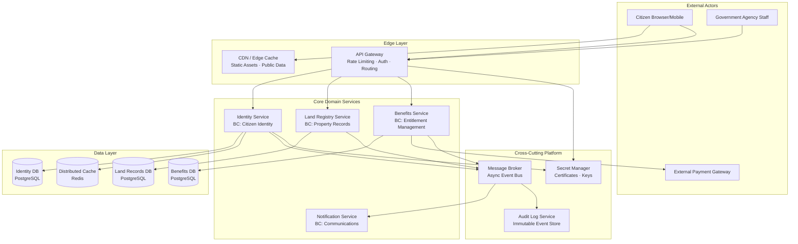

> **Architect's Note:** Notice that the API Gateway is the single entry point for ALL external traffic. This is intentional — it centralises cross-cutting concerns (authentication, rate limiting, routing). However, it is also a potential single point of failure. In a production government system, the gateway itself must be deployed in a highly available configuration (active-active, multi-region). This trade-off — centralisation vs. resilience — is a recurring architectural tension.

---

## 1.5 Gap Analysis Exercise Structure

During the 1-hour session, teams complete the following structured gap analysis table for their Day 1 blueprints:

| Business Capability       | Mapped Component      | NFR Addressed            | Gap Identified            | Remediation Action                       |
| ------------------------- | --------------------- | ------------------------ | ------------------------- | ---------------------------------------- |
| Citizen Authentication    | Identity Service      | Security (AuthN)         | No MFA mechanism shown    | Add MFA adapter to Identity Service      |
| Property Search           | Land Registry Service | Performance (<200ms p95) | No caching layer shown    | Add Redis cache in front of Land DB      |
| Benefit Disbursement      | Benefits Service      | Auditability             | No audit trail mechanism  | Publish domain events to Audit Service   |
| Cross-Agency Notification | *(missing)*           | Reliability              | Entire capability missing | Add Notification Service bounded context |

---

## 1.6 Food for Thought

> **Provocation:** Conway's Law (Melvin Conway, 1967) states: *"Any organisation that designs a system will produce a design whose structure is a copy of the organisation's communication structure."*
>
> Your challenge: Look at the team structure of a project you have worked on. Now look at the system architecture. Does Conway's Law hold? If yes, was the resulting architecture optimal? If not, how did the team overcome organisational gravity?
>
> Research prompt for Copilot/ChatGPT: *"Explain the Inverse Conway Maneuver as proposed by ThoughtWorks and give three examples of how government agencies have reorganised teams to drive better system architecture."*

---

## 1.7 Questionnaire — Section 1

**Conceptual Questions**

1. What is the difference between a business process map and a business capability map? Why do architects prefer capability maps for system decomposition?

2. Define "architectural cohesion" and "architectural coupling." Why is high coupling at the service boundary level more dangerous than high coupling within a single service?

3. What is Conway's Law, and what is the "Inverse Conway Maneuver"? How does it apply to government IT organisations with rigid departmental hierarchies?

**Application Questions**

4. A team has designed a "User Management Service" that handles: citizen registration, officer authentication, role assignment, audit log access, and password reset emails. Using the cohesion heuristic from this section, identify which responsibilities should be separated and into which services.

5. During a gap analysis, you find that the NFR "all citizen data changes must be auditable within 24 hours for regulatory compliance" has no corresponding architectural mechanism. What component(s) would you add, and what pattern would you use to implement auditability?

6. A blueprint shows five microservices, each with a direct database connection to a shared PostgreSQL instance. Identify the coupling problem this creates and propose a remediation.

**Analysis Questions**

7. Compare two decomposition strategies: (a) decompose by technical layer (all APIs in one service, all data access in another), versus (b) decompose by business capability. Analyse the trade-offs in terms of team autonomy, deployment independence, and database coupling.

8. A peer reviewer argues that your API Gateway creates a single point of failure and recommends distributing gateway logic into each service. Evaluate this argument. Under what conditions would you agree or disagree?

**Scenario-Based Questions**

9. You are reviewing a blueprint for Singapore's MyInfo-equivalent platform (a personal data portability service). The blueprint shows a single "Data Service" that handles data from 15 government agencies. What architectural risks does this create? What would you recommend instead?

10. An Indian state government team presents a blueprint where the "Citizen Portal" service directly calls the "Income Tax Department API," the "EPFO API," and the "Aadhaar Verification API" synchronously in a single request-response cycle. What NFRs are at risk? What architectural changes would you recommend?

**Answer Key — Section 1**

| Q   | Answer Summary                                                                                                                                                                                                                                                                                                                                                                                                   |
| --- | ---------------------------------------------------------------------------------------------------------------------------------------------------------------------------------------------------------------------------------------------------------------------------------------------------------------------------------------------------------------------------------------------------------------- |
| 1   | A process map shows HOW work flows; a capability map shows WHAT is done, independent of implementation. Architects prefer BCMs because capabilities are stable across technology changes — the process changes, the capability does not.                                                                                                                                                                         |
| 2   | Cohesion = degree to which elements within a component belong together. Coupling = degree to which components depend on each other. Service-level coupling is more dangerous because it creates distributed deployment and change dependencies — a change in one service forces coordination with (and potentially redeployment of) another.                                                                     |
| 3   | Conway's Law: system design mirrors org communication structure. Inverse Conway Maneuver: deliberately structure teams to mirror the desired system architecture, letting the architecture drive the org design, not the other way around. In rigid government orgs, this often requires executive mandate to reorganise across departmental lines.                                                              |
| 4   | Separate into: Identity/Auth Service (registration, authentication), RBAC Service (role assignment), Audit Service (log access — read-only view), Notification Service (password reset emails). The "and" test reveals the over-loading immediately.                                                                                                                                                             |
| 5   | Add an Audit Event consumer that subscribes to domain events from all services via a message broker. Use an immutable append-only event store (e.g., PostgreSQL with insert-only tables or a dedicated event store). The pattern is Event-Driven Audit via Domain Events.                                                                                                                                        |
| 6   | Shared database = shared schema = tight coupling. Changes to schema by one team break others. Resolution: each service owns its own database schema (Database-per-Service pattern). Use APIs or events for cross-service data access.                                                                                                                                                                            |
| 7   | Technical-layer decomposition creates horizontal coupling (the API layer always calls the data layer = tight coupling, no independent deployability). Capability decomposition creates vertical slices = independent deployment, team ownership, but requires discipline around data duplication and eventual consistency.                                                                                       |
| 8   | The reviewer's concern is valid for availability. However, distributing gateway logic into each service creates duplication of cross-cutting concerns (auth, rate limiting, logging). The resolution is: deploy the API Gateway in HA configuration (not eliminate it). If service-mesh is used (Istio/Linkerd), gateway logic can be further distributed as a sidecar pattern — both approaches are compatible. |
| 9   | Single "Data Service" across 15 agencies = massive coupling, single point of failure, regulatory boundary violations (agencies have different data classification levels). Recommendation: one service per agency data domain, aggregated via a data federation or API composition layer. Apply bounded context per agency.                                                                                      |
| 10  | At risk: Availability (if any one external API is down, the entire citizen portal fails), Latency (three sequential synchronous calls = additive latency), and Resilience. Recommendation: Use async/parallel calls where possible; introduce circuit breakers (Resilience4j); cache stable data (Aadhaar verification result for a session); consider event-driven integration for non-real-time data.          |

---

# Section 2: Domain-Driven Design — Bounded Contexts, Aggregates, Ubiquitous Language

## 2.1 Topic Title and Learning Objectives

**Topic:** Strategic Domain-Driven Design for Government-Scale Systems

**Duration:** 1.5 hours

**Learning Objectives** — By the end of this section, participants will be able to:

1. **Explain** the purpose and boundaries of a **Bounded Context (BC)** as the primary unit of decomposition in DDD
2. **Identify** **Aggregate Roots** and define consistency boundaries within a domain
3. **Construct** a **Ubiquitous Language (UL)** glossary for a given government domain
4. **Facilitate** a simplified **Event Storming** session to discover domain events, commands, and aggregates
5. **Map** context relationships using a **Context Map** with integration patterns (ACL, Shared Kernel, Conformist)

---

## 2.2 Concept Explanation

### The Analogy: The Hospital Floor Problem

Imagine a large government hospital. The word "patient" means something different to:
- The **Emergency Department** (a patient is anyone who walks in with a complaint — they have a triage tag)
- The **Billing Department** (a patient is a financial account with insurance details and outstanding invoices)
- The **Pharmacy** (a patient is a prescription holder with medication history)
- The **Research Department** (a patient is an anonymised data subject in a clinical study)

If you build ONE "Patient" database table and ONE "Patient" service to serve all four departments, you end up with a table that has 200 columns, contradictory business rules, and constant schema conflicts when the billing team needs to add an "invoice_status" column that the emergency team will never use.

**Domain-Driven Design (DDD)** — introduced by Eric Evans in his 2003 book *"Domain-Driven Design: Tackling Complexity in the Heart of Software"* — solves this by saying: let each department have its OWN model of "Patient," with its own language, its own rules, and its own data. The boundaries between these models are called **Bounded Contexts**.

---

### 2.2.1 Bounded Context (BC)

**Definition:** A **Bounded Context** is an explicit boundary within which a particular domain model is defined and applicable. Within the boundary, all terms, rules, and concepts have a precise, unambiguous meaning agreed upon by the team. Outside the boundary, the same terms may mean something entirely different.

**Why it matters architecturally:**
- A bounded context is the strongest candidate for a microservice boundary (though not every BC must be a separate deployable — that is a tactical, not strategic, decision)
- It defines team ownership: one team owns one (or occasionally two related) bounded contexts
- It is the unit at which the **Ubiquitous Language** is enforced

**When to use it:**
- When different parts of the business use the same word to mean different things
- When a large monolith has become impossible to evolve because changes in one area break unrelated areas
- When you need to align system boundaries with organisational boundaries (Inverse Conway Maneuver)

**When NOT to use it:**
- Do not create a bounded context for every noun in the domain. Over-decomposition creates chatty inter-service communication and distributed monolith anti-patterns
- Do not create a bounded context to separate technical layers (e.g., a "Database BC" and an "API BC")

> **Anti-Pattern Warning:** The "Nano-Service Anti-Pattern" — creating a separate bounded context (and microservice) for every entity (e.g., a separate "Address Service," "Phone Number Service," "Email Service") — results in extreme network overhead, complex distributed transactions, and negligible team autonomy benefits. Bounded contexts should encapsulate behaviour, not just data.

**Identifying BC Boundaries — Heuristics:**

| Heuristic                | Application                                                                                |
| ------------------------ | ------------------------------------------------------------------------------------------ |
| **Linguistic boundary**  | When the same term means different things to different teams, you have found a BC boundary |
| **Data ownership**       | Which team is the system-of-record for this data? That team owns the BC                    |
| **Change rate**          | Components that change together for the same reason belong in the same BC                  |
| **Team boundary**        | Apply Conway's Law intentionally — one team, one BC                                        |
| **Transaction boundary** | Operations that MUST be atomic belong in the same BC                                       |

---

### 2.2.2 Aggregate and Aggregate Root

**Definition:** An **Aggregate** is a cluster of domain objects (entities and value objects) that are treated as a single unit for the purpose of data changes. Every aggregate has an **Aggregate Root** — the single entry point through which all external objects may reference or modify the aggregate.

**The Consistency Boundary:** The aggregate defines the boundary of **strong consistency** (transactional consistency, i.e., ACID guarantees). Within an aggregate, all invariants (business rules) must hold after every state change. Across aggregates, consistency is **eventual** — changes propagate via domain events.

**Analogy:** A Purchase Order is an aggregate. The Order Header is the aggregate root. Line Items, Shipping Address, and Payment Terms are entities within the aggregate. You cannot add a Line Item by directly accessing the `line_items` table — you MUST go through the Order (the aggregate root), which enforces the business rule: *"An order cannot have more than 50 line items."*

**Rules for Aggregate Design:**

| Rule                                                | Explanation                                                                                                                                |
| --------------------------------------------------- | ------------------------------------------------------------------------------------------------------------------------------------------ |
| **Reference by ID only**                            | Aggregates reference other aggregates only by their ID, never by direct object reference                                                   |
| **One transaction = one aggregate**                 | A database transaction should modify only ONE aggregate. If you need to change two aggregates atomically, you likely have a design problem |
| **Small aggregates preferred**                      | Large aggregates = large lock contention = poor concurrency. Keep aggregates as small as the invariants allow                              |
| **Domain events for cross-aggregate communication** | When aggregate A changes and aggregate B needs to react, A publishes a domain event; B subscribes                                          |

**Government Example (India — Land Registry):**

```
Aggregate: PropertyRegistration (Root)
  ├── PropertyId (Identity Value Object)
  ├── OwnerDetails (Entity)
  │     ├── AadhaarId (Value Object)
  │     └── Name (Value Object)
  ├── PropertyBoundary (Value Object — GeoJSON)
  ├── EncumbranceList (Collection of Encumbrance entities)
  │     └── Encumbrance (Entity)
  │           ├── LenderName
  │           └── LoanAmount
  └── RegistrationStatus (Enumeration Value Object)
        [DRAFT → UNDER_REVIEW → APPROVED → REGISTERED]
```

Invariants enforced by the PropertyRegistration aggregate root:
- A property cannot be registered without a verified owner AadhaarId
- A property with active encumbrances cannot be transferred without lender NOC
- Status transitions must follow the defined state machine

---

### 2.2.3 Ubiquitous Language

**Definition:** **Ubiquitous Language (UL)** is a shared, precise vocabulary that is used consistently by ALL members of a team — developers, architects, business analysts, domain experts — in all conversations, documents, code, and tests. It is the language of the bounded context.

**Why it matters:** Language ambiguity is the #1 source of requirements misunderstanding. When a business analyst says "approve the application" and the developer writes code that sets a status flag to "approved" without understanding the 14-step approval workflow the analyst meant, the result is incorrect software.

**How to build a Ubiquitous Language:**

1. **Domain expert interviews:** Ask the domain expert to walk through a process. Note every noun (entity candidate) and verb (command/event candidate)
2. **Glossary construction:** For every term used, write: term name, definition in plain language, what it is NOT, example usage
3. **Model the language in code:** Class names, method names, and variable names MUST use UL terms — not technical synonyms

**Example — Benefits Disbursement Domain (Singapore CPF-equivalent):**

| Term                       | Definition in this BC                                                                     | What it is NOT                                                      |
| -------------------------- | ----------------------------------------------------------------------------------------- | ------------------------------------------------------------------- |
| **Claimant**               | A citizen who has submitted a valid benefits application and meets eligibility criteria   | NOT a "User" (technical term) or "Applicant" (pre-eligibility term) |
| **Entitlement**            | The calculated benefit amount a Claimant is eligible to receive in a given period         | NOT a "Payment" (which occurs after disbursement)                   |
| **Disbursement**           | The act of transferring an Entitlement amount to a Claimant's designated bank account     | NOT a "Transaction" (financial term used in the Payments BC)        |
| **Eligibility Assessment** | The rule-based evaluation process that determines whether an Applicant becomes a Claimant | NOT "validation" (technical term) or "approval" (ambiguous)         |

> **Architect's Note:** If your codebase uses the word "User" to mean 15 different things (citizen, officer, admin, API client), you do not have a Ubiquitous Language. This is the single most common indicator of a system that has grown without DDD discipline, and it is the primary reason why code becomes unreadable to new team members.

---

### 2.2.4 Event Storming

**Definition:** **Event Storming** is a collaborative, workshop-format design technique introduced by Alberto Brandolini that uses coloured sticky notes (physical or digital) to rapidly discover domain events, commands, aggregates, bounded contexts, and system hotspots. It requires domain experts and engineers in the same room.

**The Notation (colour-coded sticky notes):**

| Colour          | Represents                                                 | Example                                                  |
| --------------- | ---------------------------------------------------------- | -------------------------------------------------------- |
| **Orange**      | Domain Event (past tense — something that happened)        | `PropertyRegistrationApproved`                           |
| **Blue**        | Command (imperative — something triggered by an actor)     | `SubmitRegistrationApplication`                          |
| **Yellow**      | Actor (who issues the command)                             | `Land Officer`                                           |
| **Purple/Red**  | Policy / Business Rule (when event happens, do this)       | `When ApplicationSubmitted, notify applicant within 24h` |
| **Green**       | Read Model / Query (information needed to make a decision) | `ApplicationStatusView`                                  |
| **Pink**        | Aggregate (groups related events and commands)             | `PropertyRegistration`                                   |
| **Red (large)** | Hotspot (a question, conflict, or problem area)            | `Who validates GeoJSON boundary data?`                   |

**Event Storming Flow:**

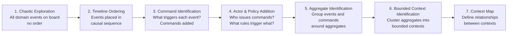

---

### 2.2.5 Context Map and Integration Patterns

A **Context Map** is a visual and documented representation of the relationships between bounded contexts. It shows not just the connections, but the NATURE of the relationship — who is upstream (U) and downstream (D), and what integration pattern is used.

**Context Map Integration Patterns:**

| Pattern                         | Description                                                                                                 | Government Use Case                                                                                                            |
| ------------------------------- | ----------------------------------------------------------------------------------------------------------- | ------------------------------------------------------------------------------------------------------------------------------ |
| **Shared Kernel**               | Two teams share a subset of the domain model. Changes require joint agreement                               | Two agencies share a common "Citizen Identity" data structure                                                                  |
| **Customer-Supplier**           | Upstream team (supplier) provides an API; downstream team (customer) depends on it. Supplier has more power | UIDAI (Aadhaar) is upstream supplier; all verification-dependent agencies are downstream customers                             |
| **Conformist**                  | Downstream team adopts the upstream model as-is, even if it is not ideal                                    | A new state agency adopts the central government API model without modification                                                |
| **Anti-Corruption Layer (ACL)** | Downstream team builds a translation layer to protect its own model from upstream model changes             | A modern microservice wrapping a legacy COBOL system — the ACL translates between legacy data formats and the new domain model |
| **Open Host Service (OHS)**     | Upstream team publishes a well-defined, stable, versioned protocol (API) for downstream teams to consume    | UIDAI's Aadhaar Authentication API — a single API used by hundreds of downstream agencies                                      |
| **Published Language (PL)**     | A well-documented language (schema/format) that all participants agree to use for communication             | India's DigiLocker API schema — a standard format for document exchange                                                        |

---

## 2.3 High-Level Design: DDD Context Map for Citizen Services Portal

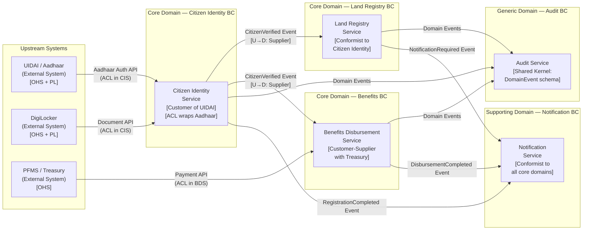

> **Architect's Note:** The Anti-Corruption Layer (ACL) in the Citizen Identity Service is critical. Aadhaar's API response format is dictated by UIDAI. If the Citizen Identity Service directly exposes Aadhaar's data structures to downstream services, then every Aadhaar API change causes a cascade of changes across ALL services. The ACL translates Aadhaar's model into the internal Ubiquitous Language — downstream services work with "VerifiedCitizenIdentity," not "AadhaarVerificationResponse."

---

## 2.4 Design Rationale and Trade-off Analysis

### Trade-off: Bounded Context Granularity

| Approach                                                             | Pros                                                                                             | Cons                                                                                                  | Best For                                                                                                                              |
| -------------------------------------------------------------------- | ------------------------------------------------------------------------------------------------ | ----------------------------------------------------------------------------------------------------- | ------------------------------------------------------------------------------------------------------------------------------------- |
| **Coarse-grained BCs** (fewer, larger)                               | Lower inter-service communication overhead; simpler data consistency; easier initial development | Larger deployment units; risk of internal coupling growth; team ownership becomes unclear as BC grows | Early-stage systems, small teams, domains not yet well-understood                                                                     |
| **Fine-grained BCs** (more, smaller)                                 | High team autonomy; independent deployability; clear ownership; aligns with microservices        | Higher operational complexity; distributed transactions; network latency; service discovery overhead  | Well-understood domains, large teams, high change rate in specific sub-domains                                                        |
| **DDD-aligned BCs** (sized by linguistic and consistency boundaries) | Boundaries are justified by domain logic, not technical preference; most stable over time        | Requires significant upfront domain exploration (event storming); resists "just code it" pressure     | **Recommended for government systems** where domains are complex, regulations define boundaries, and longevity is measured in decades |

> **Trade-off Alert:** `[Team Autonomy] vs [Operational Simplicity]` — Every additional bounded context-as-microservice increases operational overhead (additional CI/CD pipelines, monitoring dashboards, deployment coordination). The break-even point depends on team size and change frequency. A rule of thumb: if a BC is changed less than once per quarter and has no autonomy requirement, consider keeping it co-deployed with an adjacent BC (a "Modular Monolith" deployment unit), while maintaining logical BC separation in code.

---

## 2.5 Implementation Walkthrough — DDD Aggregate in Java 17

The following code implements the `PropertyRegistration` aggregate from the Land Registry bounded context. This is a production-grade implementation demonstrating aggregate root patterns, domain events, and invariant enforcement.

### Project Structure (Land Registry BC — Domain Layer Only)

```
land-registry-service/
├── src/main/java/gov/landregistry/
│   ├── domain/
│   │   ├── model/
│   │   │   ├── PropertyRegistration.java       ← Aggregate Root
│   │   │   ├── OwnerDetails.java               ← Entity within Aggregate
│   │   │   ├── Encumbrance.java                ← Entity within Aggregate
│   │   │   ├── PropertyId.java                 ← Value Object
│   │   │   └── RegistrationStatus.java         ← Enumeration Value Object
│   │   ├── events/
│   │   │   ├── DomainEvent.java                ← Base Domain Event
│   │   │   ├── PropertyRegistrationSubmitted.java
│   │   │   ├── PropertyRegistrationApproved.java
│   │   │   └── EncumbranceAdded.java
│   │   └── exception/
│   │       └── DomainException.java
```

```java
// PropertyId.java — Value Object
// WHY: Value Objects have no identity — they are equal if their values are equal.
// A PropertyId is immutable and compared by its value, not its memory reference.
// This prevents accidental mutation of identifiers throughout the domain.

package gov.landregistry.domain.model;

import java.util.Objects;
import java.util.UUID;

/**
 * Value Object representing a unique property identifier.
 * Immutable by design — no setters, all fields final.
 * Uses the type system to prevent raw String/UUID usage in domain logic.
 */
public final class PropertyId {

    private final String value;

    // Private constructor — use factory method to enforce validation
    private PropertyId(String value) {
        if (value == null || value.isBlank()) {
            throw new IllegalArgumentException("PropertyId cannot be null or blank");
        }
        this.value = value;
    }

    // Factory method — named after the Ubiquitous Language, not a technical term
    public static PropertyId generate() {
        return new PropertyId(UUID.randomUUID().toString());
    }

    public static PropertyId of(String value) {
        return new PropertyId(value);
    }

    public String getValue() {
        return value;
    }

    // Value Objects must implement equals and hashCode by VALUE
    @Override
    public boolean equals(Object o) {
        if (this == o) return true;
        if (!(o instanceof PropertyId that)) return false;
        return Objects.equals(value, that.value);
    }

    @Override
    public int hashCode() {
        return Objects.hash(value);
    }

    @Override
    public String toString() {
        return "PropertyId{" + value + "}";
    }
}
```

```java
// RegistrationStatus.java — Enumeration Value Object
// WHY: Making status a typed enum (not a raw String) enforces the state machine
// at compile time. You cannot assign "APROVED" (typo) as a status.
// It also documents the valid state transitions in the Ubiquitous Language.

package gov.landregistry.domain.model;

public enum RegistrationStatus {
    DRAFT,          // Initial state — application created but not submitted
    UNDER_REVIEW,   // Submitted and assigned to a land officer
    APPROVED,       // Officer has verified all documents and details
    REGISTERED,     // Legal registration complete — title deed issued
    REJECTED        // Application rejected — reason recorded separately
}
```

```java
// DomainEvent.java — Base class for all domain events
// WHY: Domain Events are first-class citizens in DDD. They represent
// something significant that happened in the domain (past tense).
// They are the primary mechanism for cross-aggregate and cross-BC communication.

package gov.landregistry.domain.events;

import java.time.Instant;
import java.util.UUID;

/**
 * Base class for all domain events in the Land Registry BC.
 * Immutable — events represent historical facts; they cannot be changed.
 */
public abstract class DomainEvent {

    private final String eventId;
    private final Instant occurredAt;
    private final String aggregateId;

    protected DomainEvent(String aggregateId) {
        this.eventId = UUID.randomUUID().toString();
        this.occurredAt = Instant.now();
        this.aggregateId = aggregateId;
    }

    public String getEventId() { return eventId; }
    public Instant getOccurredAt() { return occurredAt; }
    public String getAggregateId() { return aggregateId; }
}
```

```java
// PropertyRegistrationSubmitted.java — Domain Event
package gov.landregistry.domain.events;

/**
 * Raised when a citizen submits a property registration application.
 * This event notifies: Audit Service, Notification Service (to send confirmation SMS).
 */
public class PropertyRegistrationSubmitted extends DomainEvent {

    private final String ownerAadhaarId;
    private final String propertyIdValue;

    public PropertyRegistrationSubmitted(String propertyId, String ownerAadhaarId) {
        super(propertyId);
        this.propertyIdValue = propertyId;
        this.ownerAadhaarId = ownerAadhaarId;
    }

    public String getOwnerAadhaarId() { return ownerAadhaarId; }
    public String getPropertyIdValue() { return propertyIdValue; }
}
```

```java
// PropertyRegistration.java — Aggregate Root
// WHY: This is the most important class in the Land Registry domain.
// ALL state changes to a property registration MUST go through this class.
// It enforces invariants (business rules), records domain events, and
// controls the state machine (status transitions).
//
// WHAT HAPPENS WITHOUT THIS PATTERN:
// Without an aggregate root, developers directly update database columns:
//   UPDATE property_registration SET status = 'APPROVED' WHERE id = ?
// This bypasses ALL business rules — an officer could "approve" an application
// that has no Aadhaar verification, no document upload, and no site inspection.
// The database becomes inconsistent with business reality.

package gov.landregistry.domain.model;

import gov.landregistry.domain.events.DomainEvent;
import gov.landregistry.domain.events.PropertyRegistrationApproved;
import gov.landregistry.domain.events.PropertyRegistrationSubmitted;
import gov.landregistry.domain.events.EncumbranceAdded;
import gov.landregistry.domain.exception.DomainException;

import java.util.ArrayList;
import java.util.Collections;
import java.util.List;

/**
 * Aggregate Root: PropertyRegistration
 *
 * Bounded Context: Land Registry
 * Ubiquitous Language Terms Used: PropertyId, OwnerDetails, Encumbrance,
 *   RegistrationStatus, AadhaarId, Encumbrance, NOC (No Objection Certificate)
 *
 * Invariants:
 *   INV-1: A property cannot be submitted for review without a verified Aadhaar ID
 *   INV-2: A property with active encumbrances cannot be APPROVED without NOC from all lenders
 *   INV-3: Status transitions must follow: DRAFT→UNDER_REVIEW→APPROVED→REGISTERED
 *   INV-4: A REGISTERED property cannot be modified — it requires a new registration
 */
public class PropertyRegistration {

    // Identity — every aggregate has a unique identity
    private final PropertyId id;

    // State
    private OwnerDetails owner;
    private RegistrationStatus status;
    private final List<Encumbrance> encumbrances;

    // Domain Events — collected during a transaction, published after commit
    // WHY: We don't publish events during the transaction because the transaction
    // might roll back. We collect events and publish them AFTER successful commit.
    private final List<DomainEvent> domainEvents;

    // --- Constructor — creates a new DRAFT registration ---
    // WHY: Named constructor (factory method) instead of raw constructor.
    // This enforces that ALL new registrations start in DRAFT state.
    // You cannot create a PropertyRegistration that starts in APPROVED status.
    public static PropertyRegistration create(PropertyId id, OwnerDetails owner) {
        if (owner == null) {
            throw new DomainException("Owner details are required to create a property registration");
        }
        PropertyRegistration registration = new PropertyRegistration(id);
        registration.owner = owner;
        registration.status = RegistrationStatus.DRAFT;
        return registration;
    }

    private PropertyRegistration(PropertyId id) {
        this.id = id;
        this.encumbrances = new ArrayList<>();
        this.domainEvents = new ArrayList<>();
    }

    // --- Command: Submit for Review ---
    // WHY: This method enforces INV-1 before allowing the status transition.
    // It also raises the domain event that notifies downstream services.
    public void submitForReview() {
        // INV-1: Aadhaar must be verified before submission
        if (owner == null || owner.getAadhaarId() == null || owner.getAadhaarId().isBlank()) {
            throw new DomainException(
                "INV-1 VIOLATION: Cannot submit registration without a verified Aadhaar ID. " +
                "Owner: " + (owner != null ? owner.getName() : "null")
            );
        }

        // INV-3: Status transition guard
        if (this.status != RegistrationStatus.DRAFT) {
            throw new DomainException(
                "INV-3 VIOLATION: Can only submit a DRAFT registration. " +
                "Current status: " + this.status
            );
        }

        this.status = RegistrationStatus.UNDER_REVIEW;

        // Record domain event — will be published after transaction commits
        this.domainEvents.add(
            new PropertyRegistrationSubmitted(this.id.getValue(), this.owner.getAadhaarId())
        );
    }

    // --- Command: Add Encumbrance ---
    public void addEncumbrance(Encumbrance encumbrance) {
        // INV-4: Cannot modify a registered property
        if (this.status == RegistrationStatus.REGISTERED) {
            throw new DomainException(
                "INV-4 VIOLATION: Cannot add encumbrance to a REGISTERED property. " +
                "Property ID: " + this.id.getValue()
            );
        }

        this.encumbrances.add(encumbrance);
        this.domainEvents.add(
            new EncumbranceAdded(this.id.getValue(), encumbrance.getLenderName())
        );
    }

    // --- Command: Approve Registration ---
    public void approve(String approvedByOfficerId) {
        // INV-2: All encumbrances must have NOC
        boolean hasUnresolvedEncumbrances = this.encumbrances.stream()
            .anyMatch(e -> !e.isNocObtained());

        if (hasUnresolvedEncumbrances) {
            throw new DomainException(
                "INV-2 VIOLATION: Cannot approve registration with unresolved encumbrances. " +
                "All lenders must provide NOC before approval."
            );
        }

        // INV-3: Must be UNDER_REVIEW to approve
        if (this.status != RegistrationStatus.UNDER_REVIEW) {
            throw new DomainException(
                "INV-3 VIOLATION: Can only approve a registration that is UNDER_REVIEW. " +
                "Current status: " + this.status
            );
        }

        this.status = RegistrationStatus.APPROVED;
        this.domainEvents.add(
            new PropertyRegistrationApproved(this.id.getValue(), approvedByOfficerId)
        );
    }

    // --- Accessors ---
    public PropertyId getId() { return id; }
    public RegistrationStatus getStatus() { return status; }
    public OwnerDetails getOwner() { return owner; }

    // Return unmodifiable view — external code cannot add events directly
    public List<Encumbrance> getEncumbrances() {
        return Collections.unmodifiableList(encumbrances);
    }

    // Domain events accessor — used by the repository after transaction commit
    public List<DomainEvent> getDomainEvents() {
        return Collections.unmodifiableList(domainEvents);
    }

    // Clear events after publication — prevents duplicate publishing
    public void clearDomainEvents() {
        this.domainEvents.clear();
    }
}
```

```java
// DomainException.java
package gov.landregistry.domain.exception;

/**
 * Domain-specific exception.
 * WHY: Using a domain-specific exception (not IllegalArgumentException or RuntimeException)
 * allows exception handlers to distinguish between domain rule violations and
 * technical failures. A domain exception means a business invariant was violated —
 * NOT a bug or infrastructure failure.
 */
public class DomainException extends RuntimeException {
    public DomainException(String message) {
        super(message);
    }
}
```

**What happens if you do NOT use the aggregate pattern (negative example):**

```java
// ANTI-PATTERN: Direct database update bypassing domain logic
// This is what happens in many legacy government systems

@Service
public class PropertyServiceAntiPattern {

    @Autowired
    private JdbcTemplate jdbcTemplate;

    // PROBLEM 1: No invariant checking — status can be set to anything
    // PROBLEM 2: No domain events raised — Notification and Audit services never informed
    // PROBLEM 3: Business rules are duplicated across 15 different controller classes
    // PROBLEM 4: A junior developer can write: setStatus("APROVED") — typo, no compile error
    public void approveRegistration(String propertyId) {
        // Direct DB update — no business rules enforced
        jdbcTemplate.update(
            "UPDATE property_registration SET status = 'APPROVED' WHERE id = ?",
            propertyId
        );
        // NO encumbrance check
        // NO NOC verification
        // NO domain event
        // NO audit trail
        // This has been responsible for fraudulent property transfers in several
        // real-world legacy land registry systems
    }
}
```

---

## 2.6 Real-World Case Study: Karnataka Land Records Modernisation (Illustrative)

> **Note:** The following is an illustrative scenario based on publicly known challenges in government land registry digitalisation in India. All figures are hypothetical and for educational purposes.

**Context:** A state government's Revenue Department operates a 20-year-old land records system ("Bhoomi") built as a monolithic application with a shared Oracle database. The system handles approximately 8,000 property transactions per day across 30 districts.

**The Problem (Initial Architecture):**

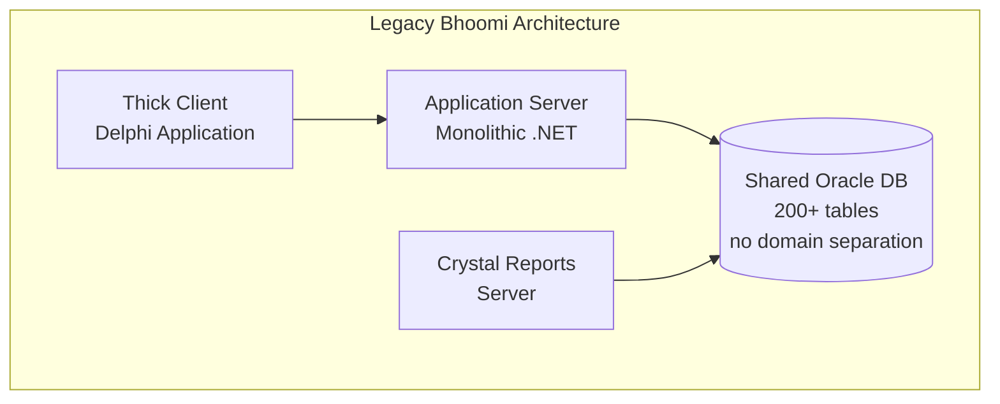

**Quantifiable Problems (Hypothetical but Realistic):**
- A single "citizen" table with 180 columns serving land officers, court litigants, bank loan officers, and government auditors — all with different consistency requirements
- Schema change requests take 6-8 months due to cross-team coordination risk
- Three fraudulent property transfers per year on average, caused by direct database updates bypassing application rules (estimated loss: INR 2-5 crore per incident)
- 4-hour planned maintenance window every Sunday, making the system unavailable to 30 district offices simultaneously
- "Property" means different things to Revenue (agricultural/non-agricultural classification), Courts (litigation subject), and Banks (collateral asset) — all served by one table with flags like `is_bank_collateral`, `is_litigated`, `is_agricultural`

**The DDD-Driven Remediation:**

The team conducted a 3-day event storming workshop with domain experts from Revenue, Courts, and the Banking interface team. The outcome:

1. Three bounded contexts identified: `PropertyRecord` BC (Revenue), `LitigationRecord` BC (Courts), `CollateralRecord` BC (Banks)
2. Each BC maintains its own model of "Property" with its own database schema
3. The `PropertyRecord` BC is the System of Record — the other two conform to it via Published Language events
4. Aggregate roots enforce invariants that previously had to be documented in a 40-page manual of business rules

**After Architecture:**

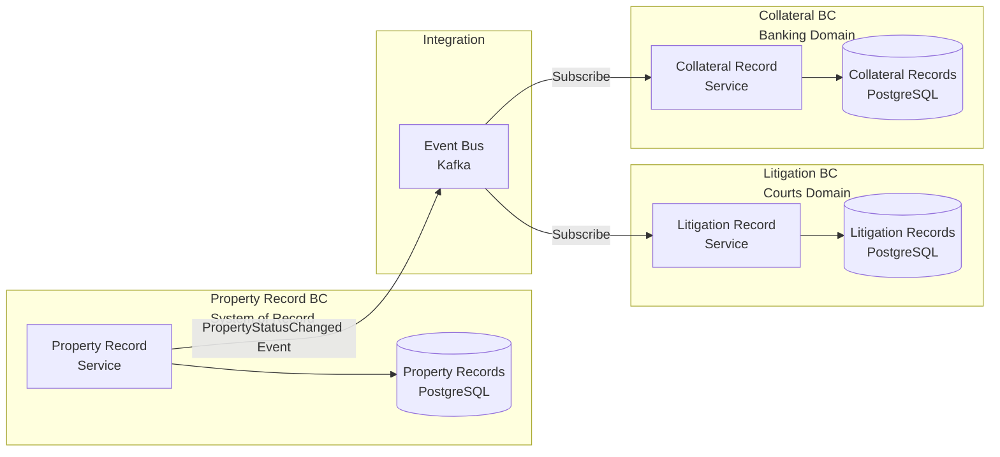

**Lessons Learned:**
1. The event storming workshop revealed more domain complexity in 3 days than 6 months of requirements documentation had in the original project
2. Giving each bounded context its own database eliminated the 6-8 month schema change bottleneck — each team can now evolve their schema independently
3. Domain events provide a natural audit trail — every state change is recorded as an immutable event
4. The aggregate root pattern eliminated direct SQL updates — all mutations now go through domain logic

---

## 2.7 Food for Thought — DDD

> **Provocation:** Eric Evans himself, in a 2015 interview, said: *"DDD is not about microservices. I've seen teams create 50 microservices, each mapping to a tactical DDD pattern, and end up with the most complicated, unmaintainable distributed monolith imaginable."*
>
> Research prompt for Copilot/ChatGPT: *"What is the difference between strategic DDD and tactical DDD? In which situations is strategic DDD valuable without implementing tactical DDD patterns (aggregates, repositories, value objects)? Give examples from government or financial systems."*
>
> Weekend challenge: Take any one feature you shipped in the last 6 months. Identify how many different "meanings" the word "user" or "account" has in the codebase. Write a one-page Ubiquitous Language glossary for the bounded context that feature belongs to.

---

## 2.8 Questionnaire — Section 2 (DDD)

**Conceptual Questions**

1. What is a Bounded Context and what problem does it solve? Why is "the same entity in two bounded contexts" not a design flaw, but often a sign of correct design?

2. What is the difference between an Entity and a Value Object in DDD? Give one example of each from a government payroll domain.

3. What is an Aggregate Root, and why is it the rule that "only one aggregate should be modified per transaction"? What happens when you violate this rule?

**Application Questions**

4. You are designing a system for the US Social Security Administration. The domain has: benefit claims, recipient profiles, payment disbursements, and fraud investigations. Identify at least three bounded contexts and one aggregate root per context.

5. Draw a Context Map for Singapore's SkillsFuture (lifelong learning credits system) with at least four bounded contexts. Label each relationship with the appropriate integration pattern (Shared Kernel, Customer-Supplier, ACL, OHS, Conformist).

6. You join a project where the codebase has a `User` class with fields: `userId`, `citizenNationalId`, `employeeId`, `officerBadgeNumber`, `taxpayerId`, `sessionToken`, `lastLoginTime`, `benefitClaimId`. Identify the Ubiquitous Language problem. How would you refactor?

**Analysis Questions**

7. A team argues: "We don't need DDD. We can just create a microservice per database table — that gives us the same separation." Analyse this argument. What is wrong with it, and what specific problems will this approach create at scale?

8. Compare Event Storming with traditional Use Case analysis (UML use case diagrams). When is each approach more appropriate? What does Event Storming discover that use cases typically miss?

**Scenario-Based Questions**

9. You are the solution architect for India's ONDC (Open Network for Digital Commerce) — a government-mandated open e-commerce network. You need to design bounded contexts for: seller onboarding, product catalog, order management, payment, and logistics. A product in the catalog has 50 attributes. An order contains product details, buyer info, and logistics info. How would you design aggregate boundaries to prevent the order aggregate from becoming a "God Object"?

10. A legacy government ERP system stores all domain data in one Oracle schema: HR, Payroll, Procurement, Finance, and Asset Management — 600+ tables, 20 years of data. The CTO wants to "apply DDD." What is your advice? Should bounded contexts be applied immediately as separate microservices, or is there an intermediate step? What is it called?

**Answer Key — Section 2**

| Q   | Answer Summary                                                                                                                                                                                                                                                                                                                                                                                                                                                                                                                    |
| --- | --------------------------------------------------------------------------------------------------------------------------------------------------------------------------------------------------------------------------------------------------------------------------------------------------------------------------------------------------------------------------------------------------------------------------------------------------------------------------------------------------------------------------------- |
| 1   | A BC is an explicit boundary within which a domain model is defined and applicable. Having two BCs with a "Customer" entity is correct — the Customer in Sales has pricing/CRM attributes; the Customer in Billing has invoice/payment attributes. They should NOT share the same model even if they represent the same real-world person.                                                                                                                                                                                        |
| 2   | Entity: has identity that persists over time (e.g., `Employee` — identified by `employeeId`, even if name changes). Value Object: identified purely by its attributes, immutable (e.g., `SalaryGrade` — if two `SalaryGrade` objects have the same level and band, they are equal).                                                                                                                                                                                                                                               |
| 3   | Only one aggregate per transaction rule exists because: (1) aggregates define the consistency boundary — if you modify two aggregates in one transaction, you have implied a larger consistency boundary than either aggregate defines; (2) this creates distributed locking risks in a cluster; (3) it indicates the two aggregates should possibly be one. Violation leads to distributed transaction complexity and data races.                                                                                                |
| 4   | BCs: `BenefitClaims` (Aggregate Root: `BenefitClaim`), `RecipientProfile` (Aggregate Root: `Recipient`), `PaymentDisbursement` (Aggregate Root: `Disbursement`), `FraudInvestigation` (Aggregate Root: `Investigation`).                                                                                                                                                                                                                                                                                                          |
| 5   | BCs: `LearnerProfile`, `CreditWallet`, `CourseRegistry`, `ClaimRedemption`. Relationships: CourseRegistry→LearnerProfile: Customer-Supplier (learning history); CreditWallet→ClaimRedemption: Shared Kernel (credit amount schema); ClaimRedemption→external payment: ACL; CourseRegistry→external providers: OHS + PL.                                                                                                                                                                                                           |
| 6   | The `User` class is a "God Object" — it merges five different bounded contexts: Citizen Identity, Employee HR, Law Enforcement, Tax, Benefits, and Session Management. Refactor by identifying which BC each field belongs to and creating separate, properly named entities in each BC. `sessionToken` and `lastLoginTime` belong to an Authentication/Session BC, not a business domain at all.                                                                                                                                 |
| 7   | Table-per-microservice decomposition is the "Anemic Domain Model at scale" anti-pattern. Problems: (1) no business logic encapsulation — all rules live in a "service layer" that becomes a God Service; (2) joins that were previously cheap SQL become expensive distributed API calls; (3) no natural aggregate boundaries means transactions span multiple services; (4) the "database" is now the domain model, not the business domain.                                                                                     |
| 8   | Event Storming discovers: the temporal sequence of business events, causal relationships, business rules triggered by events, hotspots (conflicts, ambiguities), and natural aggregate/BC boundaries. Use Case analysis discovers: actors, functional requirements, and system boundaries. Use Cases miss: temporal ordering, event causality, business rules, and aggregate boundaries. Event Storming is better for complex domains; Use Cases are better for early-stage requirements capture.                                 |
| 9   | Product details in the Order aggregate should be a snapshot (Value Object) of the product at time of order — NOT a reference to the Product Catalog aggregate. This is the "Order Line Item" pattern: the Order contains `OrderLine` entities with snapshotted product details. The Product Catalog BC and Order BC are loosely coupled — a product price change does not retroactively change existing orders.                                                                                                                   |
| 10  | Do not jump to microservices. The intermediate step is the "Modular Monolith" — apply DDD bounded contexts as MODULES within the existing monolith (separate Java packages/Maven modules, separate database schemas within the same Oracle instance). This provides logical separation and team autonomy without the operational overhead of microservices. Once modules are stable and boundaries are validated, extract to separate services selectively. This approach is called "Strangler Fig with Internal Modularisation." |

---

# Section 3: Hexagonal/Clean Architecture & API-First Design (OpenAPI/AsyncAPI)

## 3.1 Topic Title and Learning Objectives

**Topic:** Hexagonal Architecture, Clean Architecture, and API-First Design with OpenAPI 3.1 and AsyncAPI 2.6

**Duration:** 1.0 hour

**Learning Objectives** — By the end of this section, participants will be able to:

1. **Explain** the Ports and Adapters (Hexagonal) architecture pattern and how it enables infrastructure independence
2. **Distinguish** between Primary (Driving) and Secondary (Driven) ports and their corresponding adapters
3. **Apply** the Dependency Inversion Principle at the architectural level — not just at the class level — to produce testable, maintainable service boundaries
4. **Design** an OpenAPI 3.1 specification for a synchronous inter-service API following contract-first development principles
5. **Design** an AsyncAPI 2.6 specification for an asynchronous event-driven API contract

---

## 3.2 Concept Explanation

### The Analogy: A Universal Power Adapter

Imagine you have a laptop (your core application logic). In India, the wall socket is a three-pin Type D plug. In the US, it is a two-pin Type A. In Singapore, it is a three-pin Type G. Your laptop does not change. What changes is the adapter — the thing that bridges the wall socket interface to your laptop's power interface.

**Hexagonal Architecture**, introduced by Alistair Cockburn in 2005 (also called "Ports and Adapters"), applies exactly this principle to software. The core of your application — your domain model, your business rules, your use cases — is the laptop. It has absolutely no knowledge of where its inputs come from (HTTP? gRPC? Kafka message? CLI command?) or where its outputs go (PostgreSQL? MongoDB? REST API? S3?). These are all adapters. The application defines what interfaces it needs (ports), and adapters plug into those ports.

**Why does this matter at the architectural level?**

In most traditional layered architectures (Controller → Service → Repository), the service layer directly imports and depends on the repository implementation:

```java
// Traditional layered — the service KNOWS about JPA
@Service
public class PropertyService {
    @Autowired
    private PropertyJpaRepository jpaRepository; // Coupled to JPA/Hibernate
    // Cannot test without a database
    // Cannot switch to MongoDB without changing this class
}
```

In hexagonal architecture, the service defines what it needs as an interface (port), and the repository implementation (adapter) provides it:

```java
// Hexagonal — the service knows only about the PORT (interface)
@Service
public class PropertyRegistrationUseCase {
    private final PropertyRepository repository; // Interface — not the JPA implementation
    // Can be tested with a simple in-memory Map — no database needed
    // Can switch to MongoDB by writing a new adapter — service unchanged
}
```

---

### 3.2.1 Hexagonal Architecture — Structure

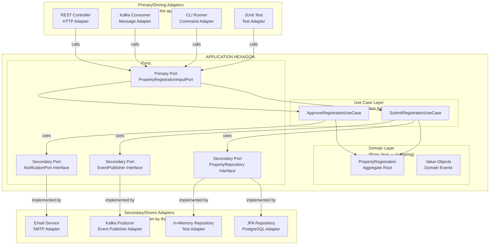

> **Architect's Note:** The arrows in this diagram represent DEPENDENCY direction. The domain layer and use case layer have NO outward-pointing arrows to the adapter layer. This is Dependency Inversion at the architectural level — the high-level policy (domain logic) does not depend on low-level details (database, message broker). The ports are the inversion points — interfaces owned by the domain, implemented by infrastructure.

---

### 3.2.2 Primary Ports (Driving / Input Side)

**Primary Ports** define HOW the application is invoked. They are interfaces that represent the application's use cases from the outside world's perspective.

- A REST controller calls a primary port when an HTTP request arrives
- A Kafka consumer calls a primary port when a message is received
- A JUnit test calls a primary port directly — no HTTP, no network, no database needed

**This is the key testability benefit:** Because the primary port is a plain Java interface, tests invoke the application core directly. The entire domain logic can be tested in milliseconds, without spinning up Spring context, without connecting to a database, without a running Kafka broker.

---

### 3.2.3 Secondary Ports (Driven / Output Side)

**Secondary Ports** define WHAT the application needs from infrastructure. They are interfaces that the application core defines and the infrastructure adapters implement.

Examples:
- `PropertyRepository` — interface for persisting and retrieving property registrations
- `EventPublisher` — interface for publishing domain events
- `NotificationPort` — interface for sending citizen notifications

The application core NEVER imports a JPA class, a Kafka class, or a Spring Data annotation. It only uses its own interfaces.

---

### 3.2.4 Clean Architecture Relationship

**Clean Architecture** (Robert C. Martin, 2017) is a complementary — and more prescriptive — formulation of the same idea. It organises the application into concentric rings:

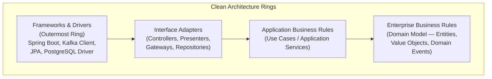

**The Dependency Rule:** Source code dependencies must point INWARD only. Nothing in an inner ring can know anything about something in an outer ring. The domain layer (innermost) knows nothing about Spring, Kafka, or PostgreSQL. The use case layer knows nothing about HTTP or message formats. Only the outer rings know about frameworks.

**Hexagonal vs. Clean Architecture:**

| Aspect                   | Hexagonal Architecture                      | Clean Architecture                                                                  |
| ------------------------ | ------------------------------------------- | ----------------------------------------------------------------------------------- |
| **Origin**               | Alistair Cockburn, 2005                     | Robert C. Martin, 2012                                                              |
| **Metaphor**             | Hexagon with ports and adapters             | Concentric rings with dependency rule                                               |
| **Prescription**         | Less prescriptive — defines the concept     | More prescriptive — defines ring structure                                          |
| **Focus**                | Testability and infrastructure independence | Full layering including use cases and entities                                      |
| **Practical difference** | Focuses on port/adapter boundaries          | Adds explicit use case and entity layers                                            |
| **Government fit**       | Both are equivalent in practice             | Clean Architecture's explicit use case layer maps well to government workflow steps |

> **Production Insight:** In practice, most Spring Boot teams implement a hybrid: the package structure follows Clean Architecture rings (domain, application, adapter.in, adapter.out), while the conceptual model follows Hexagonal. This hybrid is sometimes called "Hexagonal Clean Architecture" and is the dominant pattern in modern enterprise Java.

---

### 3.2.5 API-First Design

**API-First Design** is a development methodology in which the API contract (specification) is designed, reviewed, and agreed upon BEFORE any implementation begins. The contract is the source of truth. Both the provider (server) and the consumer (client) generate their code from the contract.

**Why API-First matters in government systems:**

Government systems typically have:
- Multiple consumer agencies who integrate with a service (they cannot wait for implementation to start their work)
- Regulatory and procurement requirements that mandate documented interfaces before system approval
- Long-lived APIs (a government API published today may be consumed for 10+ years)
- Cross-team and cross-agency coordination needs — the contract is the coordination artifact

**API-First Workflow:**

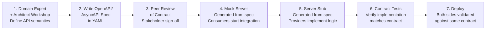

**The key insight:** Steps 4 and 5 happen IN PARALLEL. Consumers do not wait for the server to be built. They integrate against the mock server generated from the OpenAPI spec. This eliminates the most common cause of integration delays in government IT projects.

---

### 3.2.6 OpenAPI 3.1 Specification

**OpenAPI Specification (OAS)** — formerly Swagger — is the industry standard for describing synchronous HTTP APIs. Version 3.1 (released 2021) achieves full alignment with JSON Schema, making it the definitive standard for REST API documentation and code generation.

Key OAS 3.1 structural elements:

| Element                      | Purpose                                                         |
| ---------------------------- | --------------------------------------------------------------- |
| `info`                       | API metadata: title, version, description, contact, license     |
| `servers`                    | Base URLs for different environments (dev, staging, production) |
| `paths`                      | API endpoints and their HTTP operations                         |
| `components/schemas`         | Reusable data models (request/response bodies)                  |
| `components/securitySchemes` | Authentication mechanisms (OAuth2, API Key, mTLS)               |
| `components/responses`       | Reusable HTTP response definitions                              |
| `tags`                       | Logical grouping of operations                                  |
| `webhooks`                   | Outbound event definitions (new in 3.1)                         |

---

### 3.2.7 AsyncAPI 2.6 Specification

**AsyncAPI** is the OpenAPI equivalent for asynchronous, event-driven APIs — Kafka topics, RabbitMQ exchanges, WebSocket channels, and MQTT topics. It describes:
- What channels (topics/queues) exist
- What messages are published to or consumed from each channel
- What the message schema is
- Who is the publisher and who is the subscriber

**Why AsyncAPI matters:** Without AsyncAPI contracts, event-driven systems have "invisible" interfaces. A Kafka producer publishes a JSON blob; the consumer parses it with hope and prayer. Schema drift (producer changes the JSON structure; consumer breaks silently) is one of the most dangerous failure modes in event-driven government systems.

---

## 3.3 High-Level Design: Hexagonal Architecture for Land Registry Service

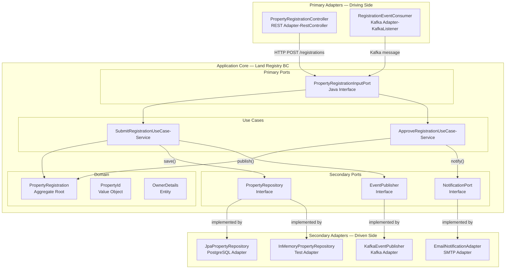

---

## 3.4 Design Rationale and Trade-off Analysis

### Trade-off: Hexagonal Architecture vs. Traditional Layered Architecture

| Dimension                        | Traditional Layered                                                              | Hexagonal / Clean                                                           | Winner                             |
| -------------------------------- | -------------------------------------------------------------------------------- | --------------------------------------------------------------------------- | ---------------------------------- |
| **Initial complexity**           | Low — familiar to all Java developers                                            | Higher — requires understanding ports, adapters, dependency inversion       | Layered for greenfield small teams |
| **Testability**                  | Poor — integration tests dominate; unit tests require mocks of framework classes | Excellent — domain logic testable with plain Java; no Spring context needed | Hexagonal                          |
| **Infrastructure changeability** | Poor — switching database requires changes throughout the service layer          | Excellent — write a new adapter; use case layer unchanged                   | Hexagonal                          |
| **Onboarding**                   | Easy — "it's just MVC"                                                           | Moderate — requires DDD and clean architecture literacy                     | Layered for short-lived projects   |
| **Long-term maintainability**    | Poor — framework creep into business logic; changes become risky                 | Excellent — business logic isolated and protected                           | Hexagonal                          |
| **Government fit**               | Acceptable for simple CRUD services                                              | Strongly recommended for complex domain logic, regulatory compliance        | Hexagonal for complex domains      |

> **Trade-off Alert:** `[Initial Development Speed] vs [Long-Term Maintainability]` — Hexagonal architecture requires more upfront design discipline. For a 2-week proof-of-concept, it is overkill. For a 10-year government system with regulatory compliance requirements, audit trails, and multiple integration points, the cost of NOT using it is a codebase that becomes impossible to test, modify, or migrate without full rewrites.

---

## 3.5 Implementation Walkthrough — Hexagonal Architecture + OpenAPI + AsyncAPI

### 3.5.1 Package Structure

```
land-registry-service/
├── src/main/java/gov/landregistry/
│   ├── domain/                          ← Innermost ring — pure Java, no frameworks
│   │   ├── model/
│   │   ├── events/
│   │   └── exception/
│   ├── application/                     ← Use case ring — Spring @Service allowed
│   │   ├── port/
│   │   │   ├── in/                      ← Primary ports (interfaces)
│   │   │   │   └── PropertyRegistrationInputPort.java
│   │   │   └── out/                     ← Secondary ports (interfaces)
│   │   │       ├── PropertyRepository.java
│   │   │       ├── EventPublisher.java
│   │   │       └── NotificationPort.java
│   │   └── service/                     ← Use case implementations
│   │       ├── SubmitRegistrationService.java
│   │       └── ApproveRegistrationService.java
│   └── adapter/                         ← Outermost ring — framework-heavy
│       ├── in/
│       │   ├── web/                     ← REST controllers
│       │   │   ├── PropertyRegistrationController.java
│       │   │   └── dto/
│       │   │       ├── SubmitRegistrationRequest.java
│       │   │       └── RegistrationResponse.java
│       │   └── messaging/               ← Kafka consumers
│       │       └── RegistrationEventConsumer.java
│       └── out/
│           ├── persistence/             ← JPA repositories
│           │   ├── JpaPropertyRepository.java
│           │   ├── PropertyJpaEntity.java
│           │   └── PropertyRegistrationMapper.java
│           └── messaging/               ← Kafka producers
│               └── KafkaEventPublisher.java
├── src/main/resources/
│   ├── application.yml
│   └── api/
│       ├── openapi.yaml                 ← OpenAPI 3.1 contract
│       └── asyncapi.yaml               ← AsyncAPI 2.6 contract
└── pom.xml
```

### 3.5.2 Primary Port — Input Interface

```java
// PropertyRegistrationInputPort.java
// WHY: This interface is the PRIMARY PORT — it defines WHAT the application
// can do, expressed in Ubiquitous Language terms. It is owned by the application
// core, NOT by the REST adapter or the Kafka adapter.
// REST controllers and Kafka consumers call this interface.
// The use case implementation implements this interface.
// This means: if we add a new input channel (e.g., GraphQL), we write a new adapter
// that calls this same port — zero changes to domain or use case code.

package gov.landregistry.application.port.in;

import gov.landregistry.application.port.in.command.SubmitRegistrationCommand;
import gov.landregistry.application.port.in.command.ApproveRegistrationCommand;
import gov.landregistry.domain.model.PropertyId;

/**
 * Primary Port: Property Registration Use Cases
 * Defines the application's capabilities in Ubiquitous Language terms.
 * No HTTP, no Kafka, no Spring — pure business interface.
 */
public interface PropertyRegistrationInputPort {

    /**
     * Submit a new property registration application for review.
     * Corresponds to: POST /api/v1/registrations
     * @param command Encapsulates all data needed to submit a registration
     * @return The assigned PropertyId for the new registration
     */
    PropertyId submitRegistration(SubmitRegistrationCommand command);

    /**
     * Approve a property registration that is currently under review.
     * Corresponds to: PUT /api/v1/registrations/{id}/approve
     * @param command Encapsulates the property ID and approving officer ID
     */
    void approveRegistration(ApproveRegistrationCommand command);
}
```

```java
// SubmitRegistrationCommand.java
// WHY: Commands are immutable value objects that carry all data needed
// for a use case. They decouple the input adapter (REST DTO, Kafka message)
// from the use case. The use case receives a Command, not an HTTP request.
// This means the same use case can be called from REST and Kafka
// with different input formats — both translate to the same Command.

package gov.landregistry.application.port.in.command;

/**
 * Command: Submit Property Registration
 * Immutable — commands represent intent at a point in time.
 * Uses Java 17 record for concise immutable data carrier.
 */
public record SubmitRegistrationCommand(
    String ownerName,
    String ownerAadhaarId,        // Verified Aadhaar ID from Identity Service
    String propertyGeoJson,        // GeoJSON boundary of the property
    String districtCode            // Administrative district code
) {
    // Compact constructor — validates command integrity on construction
    // WHY: Validation here ensures invalid commands never reach the domain.
    // The domain should never receive a command it cannot process.
    public SubmitRegistrationCommand {
        if (ownerName == null || ownerName.isBlank()) {
            throw new IllegalArgumentException("Owner name is required");
        }
        if (ownerAadhaarId == null || ownerAadhaarId.length() != 12) {
            throw new IllegalArgumentException("Valid 12-digit Aadhaar ID is required");
        }
        if (propertyGeoJson == null || propertyGeoJson.isBlank()) {
            throw new IllegalArgumentException("Property GeoJSON boundary is required");
        }
        if (districtCode == null || districtCode.isBlank()) {
            throw new IllegalArgumentException("District code is required");
        }
    }
}
```

### 3.5.3 Secondary Ports — Output Interfaces

```java
// PropertyRepository.java — Secondary Port
// WHY: The application core defines THIS interface.
// JPA, MongoDB, in-memory — these are all implementations (adapters) of this port.
// The use case layer depends on THIS interface, NEVER on JpaRepository directly.

package gov.landregistry.application.port.out;

import gov.landregistry.domain.model.PropertyId;
import gov.landregistry.domain.model.PropertyRegistration;
import java.util.Optional;

/**
 * Secondary Port: Property Persistence
 * Defined by the application core — implemented by infrastructure adapters.
 * Speaks Ubiquitous Language (PropertyRegistration, PropertyId)
 * NOT JPA language (Entity, @Id, flush, merge).
 */
public interface PropertyRepository {
    void save(PropertyRegistration registration);
    Optional<PropertyRegistration> findById(PropertyId id);
    boolean existsByOwnerAadhaarIdAndStatus(String aadhaarId, String status);
}
```

```java
// EventPublisher.java — Secondary Port
package gov.landregistry.application.port.out;

import gov.landregistry.domain.events.DomainEvent;
import java.util.List;

/**
 * Secondary Port: Domain Event Publishing
 * The application core calls this after a successful domain state change.
 * Implemented by: KafkaEventPublisher (production), NoOpEventPublisher (tests)
 */
public interface EventPublisher {
    void publishAll(List<DomainEvent> events);
}
```

### 3.5.4 Use Case Implementation

```java
// SubmitRegistrationService.java — Use Case Implementation
// WHY: This is the application service (use case) layer.
// It orchestrates: load/create domain objects → invoke domain logic →
// persist state → publish events.
// It has NO knowledge of HTTP, Kafka, or database specifics.
// @Transactional here is the only framework annotation allowed in this layer —
// it is a cross-cutting concern that applies regardless of input channel.

package gov.landregistry.application.service;

import gov.landregistry.application.port.in.PropertyRegistrationInputPort;
import gov.landregistry.application.port.in.command.ApproveRegistrationCommand;
import gov.landregistry.application.port.in.command.SubmitRegistrationCommand;
import gov.landregistry.application.port.out.EventPublisher;
import gov.landregistry.application.port.out.PropertyRepository;
import gov.landregistry.domain.model.OwnerDetails;
import gov.landregistry.domain.model.PropertyId;
import gov.landregistry.domain.model.PropertyRegistration;
import gov.landregistry.domain.exception.DomainException;
import org.springframework.stereotype.Service;
import org.springframework.transaction.annotation.Transactional;

/**
 * Use Case Implementation: Property Registration
 *
 * Orchestration flow:
 * 1. Validate command (already done in Command constructor)
 * 2. Create/load domain aggregate
 * 3. Invoke domain command (enforces business rules)
 * 4. Persist updated aggregate
 * 5. Publish domain events (after successful persist)
 * 6. Return result
 */
@Service
@Transactional
public class SubmitRegistrationService implements PropertyRegistrationInputPort {

    // Depends on PORTS (interfaces), not implementations
    // Spring injects the adapter implementation at runtime
    private final PropertyRepository propertyRepository;
    private final EventPublisher eventPublisher;

    // Constructor injection — preferred over field injection
    // WHY: Makes dependencies explicit; allows instantiation without Spring
    //      context in unit tests
    public SubmitRegistrationService(
            PropertyRepository propertyRepository,
            EventPublisher eventPublisher) {
        this.propertyRepository = propertyRepository;
        this.eventPublisher = eventPublisher;
    }

    @Override
    public PropertyId submitRegistration(SubmitRegistrationCommand command) {

        // Step 1: Generate new identity for the aggregate
        PropertyId newPropertyId = PropertyId.generate();

        // Step 2: Build owner entity from command data
        // WHY: We translate from Command (input model) to Domain (domain model)
        // here — the domain model never knows about commands.
        OwnerDetails owner = OwnerDetails.of(
            command.ownerName(),
            command.ownerAadhaarId()
        );

        // Step 3: Create aggregate (enforces: DRAFT initial state)
        PropertyRegistration registration = PropertyRegistration.create(newPropertyId, owner);

        // Step 4: Invoke domain command — aggregate enforces INV-1 and INV-3
        // This raises PropertyRegistrationSubmitted domain event internally
        registration.submitForReview();

        // Step 5: Persist aggregate state
        // The repository adapter translates PropertyRegistration → JPA entity
        propertyRepository.save(registration);

        // Step 6: Publish domain events AFTER successful persist
        // WHY: If we publish before saving, and the save fails, downstream
        // services receive an event for data that does not exist in the DB.
        // This ordering (save → publish) is the simple reliability pattern.
        // For stronger guarantees, use the Outbox Pattern (covered Day 7).
        eventPublisher.publishAll(registration.getDomainEvents());
        registration.clearDomainEvents();

        return newPropertyId;
    }

    @Override
    public void approveRegistration(ApproveRegistrationCommand command) {
        // Step 1: Load aggregate from repository
        PropertyRegistration registration = propertyRepository
            .findById(PropertyId.of(command.propertyId()))
            .orElseThrow(() -> new DomainException(
                "PropertyRegistration not found: " + command.propertyId()
            ));

        // Step 2: Invoke domain command — enforces INV-2 and INV-3
        registration.approve(command.officerId());

        // Step 3: Persist and publish
        propertyRepository.save(registration);
        eventPublisher.publishAll(registration.getDomainEvents());
        registration.clearDomainEvents();
    }
}
```

### 3.5.5 REST Adapter (Primary/Driving)

```java
// PropertyRegistrationController.java — REST Adapter
// WHY: This class knows about HTTP — request/response, status codes, headers.
// It translates HTTP concerns into Commands and invokes the Primary Port.
// NO business logic here — only translation and HTTP protocol handling.

package gov.landregistry.adapter.in.web;

import gov.landregistry.adapter.in.web.dto.SubmitRegistrationRequest;
import gov.landregistry.adapter.in.web.dto.RegistrationResponse;
import gov.landregistry.application.port.in.PropertyRegistrationInputPort;
import gov.landregistry.application.port.in.command.SubmitRegistrationCommand;
import gov.landregistry.domain.model.PropertyId;
import gov.landregistry.domain.exception.DomainException;
import org.springframework.http.HttpStatus;
import org.springframework.http.ResponseEntity;
import org.springframework.web.bind.annotation.*;

/**
 * REST Adapter: Property Registration
 * Translates HTTP requests → Commands → Primary Port calls
 * Translates Primary Port results/exceptions → HTTP responses
 *
 * This adapter is the ONLY class in the system that knows about:
 * - HTTP verbs (GET, POST, PUT)
 * - HTTP status codes (200, 201, 400, 404, 422)
 * - Request/Response DTOs
 * - URL path structures
 */
@RestController
@RequestMapping("/api/v1/registrations")
public class PropertyRegistrationController {

    private final PropertyRegistrationInputPort registrationPort;

    public PropertyRegistrationController(PropertyRegistrationInputPort registrationPort) {
        this.registrationPort = registrationPort;
    }

    /**
     * POST /api/v1/registrations
     * Submit a new property registration application.
     * Returns 201 Created with the new property ID.
     */
    @PostMapping
    public ResponseEntity<RegistrationResponse> submitRegistration(
            @RequestBody SubmitRegistrationRequest request) {

        // Translate HTTP request DTO → Command (input model of the use case)
        SubmitRegistrationCommand command = new SubmitRegistrationCommand(
            request.ownerName(),
            request.ownerAadhaarId(),
            request.propertyGeoJson(),
            request.districtCode()
        );

        // Invoke primary port — HTTP adapter does NOT call service directly
        PropertyId propertyId = registrationPort.submitRegistration(command);

        // Translate result → HTTP response
        return ResponseEntity
            .status(HttpStatus.CREATED)
            .body(new RegistrationResponse(
                propertyId.getValue(),
                "Registration submitted successfully. Status: UNDER_REVIEW"
            ));
    }

    /**
     * Global exception handler for domain violations in this controller.
     * Translates DomainException → HTTP 422 Unprocessable Entity
     * WHY 422 not 400: 400 = malformed request syntax.
     *                  422 = syntactically valid but semantically invalid
     *                  (business rule violation). This distinction matters
     *                  for API consumers who need to differentiate
     *                  "fix your JSON" from "fix your business data."
     */
    @ExceptionHandler(DomainException.class)
    public ResponseEntity<String> handleDomainException(DomainException ex) {
        return ResponseEntity
            .status(HttpStatus.UNPROCESSABLE_ENTITY)
            .body(ex.getMessage());
    }
}
```

```java
// SubmitRegistrationRequest.java — REST DTO
// WHY: DTOs are separate from domain objects. The REST API shape
// can evolve independently from the domain model shape.
// Java 17 records are ideal for immutable DTOs.

package gov.landregistry.adapter.in.web.dto;

public record SubmitRegistrationRequest(
    String ownerName,
    String ownerAadhaarId,
    String propertyGeoJson,
    String districtCode
) {}
```

```java
// RegistrationResponse.java — REST Response DTO
package gov.landregistry.adapter.in.web.dto;

public record RegistrationResponse(
    String propertyId,
    String message
) {}
```

### 3.5.6 OpenAPI 3.1 Contract

```yaml
# openapi.yaml — Land Registry Service API Contract
# WHY: This file is the SOURCE OF TRUTH for the API.
# It is written BEFORE implementation (API-First).
# It is used to:
#   1. Generate server stub code (openapi-generator-maven-plugin)
#   2. Generate client SDK code for consumer agencies
#   3. Generate Postman collections for testing
#   4. Power the mock server for consumer teams to integrate against
#   5. Provide governance documentation for the API committee

openapi: "3.1.0"

info:
  title: "Land Registry Service API"
  description: |
    Manages property registration lifecycle for the State Land Registry Department.
    This API is governed by the National API Gateway Policy (India IT Act, Section 69B).
    All requests require valid OAuth2 Bearer token from the Central Identity Provider.
  version: "1.0.0"
  contact:
    name: "Land Registry Platform Team"
    email: "landregistry-api@gov.in"
  license:
    name: "Government Open Data License (India)"
    url: "https://data.gov.in/government-open-data-license-version-2"

servers:
  - url: "https://api.landregistry.gov.in/v1"
    description: "Production (NIC Cloud)"
  - url: "https://staging-api.landregistry.gov.in/v1"
    description: "Staging"
  - url: "http://localhost:8081/api/v1"
    description: "Local Development"

tags:
  - name: "Registration"
    description: "Property registration lifecycle management"

paths:
  /registrations:
    post:
      tags: ["Registration"]
      operationId: "submitRegistration"
      summary: "Submit a property registration application"
      description: |
        Initiates a new property registration application.
        The application moves to UNDER_REVIEW status upon submission.
        A confirmation notification is sent to the owner's registered mobile number.

        **Preconditions:**
        - Owner Aadhaar must be verified by the Citizen Identity Service
        - Property GeoJSON must be a valid RFC 7946 compliant geometry

        **Rate Limits:** 10 requests per minute per authenticated client
      security:
        - BearerAuth: ["land-registry:write"]
      requestBody:
        required: true
        content:
          application/json:
            schema:
              $ref: "#/components/schemas/SubmitRegistrationRequest"
            example:
              ownerName: "Rajesh Kumar"
              ownerAadhaarId: "123456789012"
              propertyGeoJson: '{"type":"Polygon","coordinates":[[[77.5946,12.9716],[77.5956,12.9716],[77.5956,12.9726],[77.5946,12.9726],[77.5946,12.9716]]]}'
              districtCode: "KA-BLR-01"
      responses:
        "201":
          description: "Registration submitted successfully"
          content:
            application/json:
              schema:
                $ref: "#/components/schemas/RegistrationResponse"
        "400":
          description: "Malformed request body"
          content:
            application/json:
              schema:
                $ref: "#/components/schemas/ErrorResponse"
        "401":
          description: "Authentication required"
        "422":
          description: "Business rule violation (e.g., invalid Aadhaar, missing required data)"
          content:
            application/json:
              schema:
                $ref: "#/components/schemas/ErrorResponse"
        "429":
          description: "Rate limit exceeded"
        "500":
          description: "Internal server error"

  /registrations/{propertyId}/approve:
    put:
      tags: ["Registration"]
      operationId: "approveRegistration"
      summary: "Approve a property registration under review"
      description: |
        Approves a property registration application.
        Only authorized Land Officers (role: LAND_OFFICER) may call this endpoint.
        All encumbrances must have NOC before approval is permitted.
      security:
        - BearerAuth: ["land-registry:approve"]
      parameters:
        - name: propertyId
          in: path
          required: true
          schema:
            type: string
            format: uuid
          description: "Unique identifier of the property registration"
      requestBody:
        required: true
        content:
          application/json:
            schema:
              $ref: "#/components/schemas/ApproveRegistrationRequest"
      responses:
        "200":
          description: "Registration approved successfully"
        "404":
          description: "Property registration not found"
        "422":
          description: "Business rule violation (e.g., unresolved encumbrances)"
          content:
            application/json:
              schema:
                $ref: "#/components/schemas/ErrorResponse"

components:
  schemas:

    SubmitRegistrationRequest:
      type: object
      required: [ownerName, ownerAadhaarId, propertyGeoJson, districtCode]
      properties:
        ownerName:
          type: string
          minLength: 2
          maxLength: 100
          description: "Full legal name of the property owner"
          example: "Rajesh Kumar"
        ownerAadhaarId:
          type: string
          pattern: "^[0-9]{12}$"
          description: "12-digit Aadhaar ID (pre-verified by Identity Service)"
          example: "123456789012"
        propertyGeoJson:
          type: string
          description: "RFC 7946 GeoJSON Polygon defining property boundaries"
        districtCode:
          type: string
          pattern: "^[A-Z]{2}-[A-Z]{3}-[0-9]{2}$"
          description: "Administrative district code (e.g., KA-BLR-01 for Bengaluru)"
          example: "KA-BLR-01"

    RegistrationResponse:
      type: object
      properties:
        propertyId:
          type: string
          format: uuid
          description: "System-assigned unique identifier for the registration"
        message:
          type: string
          description: "Human-readable status message"

    ApproveRegistrationRequest:
      type: object
      required: [officerId]
      properties:
        officerId:
          type: string
          description: "Badge ID of the approving Land Officer"

    ErrorResponse:
      type: object
      properties:
        errorCode:
          type: string
          description: "Machine-readable error code"
        message:
          type: string
          description: "Human-readable error description"
        timestamp:
          type: string
          format: date-time

  securitySchemes:
    BearerAuth:
      type: http
      scheme: bearer
      bearerFormat: JWT
      description: "OAuth2 Bearer token from Central Government Identity Provider (Keycloak)"
```

### 3.5.7 AsyncAPI 2.6 Contract

```yaml
# asyncapi.yaml — Land Registry Service Event Contract
# WHY: This is the contract for events PUBLISHED by the Land Registry Service.
# Consumer services (Notification Service, Audit Service) implement against
# this contract. Without this contract, consumers parse JSON blindly —
# schema drift breaks consumers silently with no compile-time error.

asyncapi: "2.6.0"

info:
  title: "Land Registry Service — Event API"
  version: "1.0.0"
  description: |
    Defines all domain events published by the Land Registry Service to the
    shared event bus. Consumers must subscribe to relevant channels and
    implement the specified message schemas.
  contact:
    name: "Land Registry Platform Team"
    email: "landregistry-api@gov.in"

servers:
  production:
    url: "kafka.landregistry.gov.in:9092"
    protocol: "kafka"
    description: "Production Kafka cluster (NIC hosted)"
    security:
      - saslScram: []
  local:
    url: "localhost:9092"
    protocol: "kafka"
    description: "Local development Kafka"

channels:

  land-registry.property-registration.submitted:
    description: |
      Published when a citizen submits a property registration application.
      Consumers: Notification Service (send confirmation SMS), Audit Service.
    subscribe:
      operationId: "onPropertyRegistrationSubmitted"
      summary: "Receive property registration submission events"
      message:
        $ref: "#/components/messages/PropertyRegistrationSubmitted"

  land-registry.property-registration.approved:
    description: |
      Published when a Land Officer approves a registration.
      Consumers: Notification Service (send approval letter), Audit Service,
      Document Service (generate title deed).
    subscribe:
      operationId: "onPropertyRegistrationApproved"
      summary: "Receive property registration approval events"
      message:
        $ref: "#/components/messages/PropertyRegistrationApproved"

components:

  messages:

    PropertyRegistrationSubmitted:
      name: "PropertyRegistrationSubmitted"
      title: "Property Registration Submitted"
      summary: "A citizen has submitted a property registration for review"
      contentType: "application/json"
      headers:
        type: object
        properties:
          eventId:
            type: string
            format: uuid
            description: "Unique event identifier for idempotency"
          occurredAt:
            type: string
            format: date-time
            description: "ISO-8601 timestamp when the event occurred"
          eventType:
            type: string
            const: "PropertyRegistrationSubmitted"
          sourceService:
            type: string
            const: "land-registry-service"
          correlationId:
            type: string
            description: "Request correlation ID for distributed tracing"
      payload:
        type: object
        required: [propertyId, ownerAadhaarId, districtCode, submittedAt]
        properties:
          propertyId:
            type: string
            format: uuid
            description: "Unique identifier of the submitted registration"
          ownerAadhaarId:
            type: string
            pattern: "^[0-9]{12}$"
            description: "Aadhaar ID of the property owner (for notification lookup)"
          districtCode:
            type: string
            description: "Administrative district for routing to correct officer"
          submittedAt:
            type: string
            format: date-time
            description: "Timestamp of submission"

    PropertyRegistrationApproved:
      name: "PropertyRegistrationApproved"
      title: "Property Registration Approved"
      contentType: "application/json"
      headers:
        type: object
        properties:
          eventId:
            type: string
            format: uuid
          occurredAt:
            type: string
            format: date-time
          eventType:
            type: string
            const: "PropertyRegistrationApproved"
          sourceService:
            type: string
            const: "land-registry-service"
      payload:
        type: object
        required: [propertyId, approvedByOfficerId, approvedAt]
        properties:
          propertyId:
            type: string
            format: uuid
          approvedByOfficerId:
            type: string
            description: "Badge ID of the approving officer"
          approvedAt:
            type: string
            format: date-time

  securitySchemes:
    saslScram:
      type: scramSha256
      description: "SCRAM-SHA-256 authentication for Kafka (NIC Kafka cluster)"
```

---

## 3.6 Real-World Case Study: US GSA API Modernisation — USDS API-First Initiative (Illustrative)

**Context:** A US federal agency (illustrative, modelled on real USDS patterns) manages a benefits application portal serving approximately 3 million citizens annually. The existing system exposes tightly-coupled SOAP/XML web services that were designed in 2008. New consuming agencies (state governments integrating for eligibility checks, mobile app teams) cannot integrate because:
- No OpenAPI documentation exists
- Schema changes are undocumented and breaking
- No versioning strategy — changes break all consumers simultaneously
- Test environments do not match production schemas

**Quantifiable Impact (Hypothetical):**
- Each integration request from a state agency takes 4-6 months due to undocumented API discovery
- Estimated 3-4 breaking changes per year causing consumer outage averaging 8 hours each
- Integration cost per new consumer agency: approximately $180,000 USD in contractor time

**API-First Remediation Applied:**

1. OpenAPI 3.1 contracts written for all existing endpoints (documentation-first phase)
2. AsyncAPI contracts written for all Kafka events (previously undocumented)
3. Mock servers generated from OpenAPI specs — 6 state agencies begin parallel integration
4. API versioning policy established (URI versioning: `/v1/`, `/v2/`) with 18-month deprecation notice
5. Contract tests (Spring Cloud Contract) added to CI pipeline — breaking changes caught at PR merge time
6. Developer portal (based on Backstage) publishes all contracts with interactive try-it functionality

**After Outcome (Hypothetical):**
- New consumer integration time reduced from 4-6 months to 3-4 weeks
- Zero breaking changes reaching consumers (caught by contract tests)
- Integration cost per new consumer: approximately $22,000 USD

**Lessons Learned:**
1. The OpenAPI spec is not documentation — it is a CONTRACT with legal-equivalent weight in government procurement
2. AsyncAPI adoption for event contracts is the most overlooked but highest-impact change in event-driven government systems
3. Mock servers enable consumer teams to begin integration before the server is built — this alone saves months in multi-agency projects

---

## 3.7 Food for Thought — Hexagonal Architecture & API-First

> **Provocation:** Every junior developer who joins a Spring Boot project immediately adds `@Autowired private UserRepository userRepository` to a `@Service` class. This seems harmless. But when this pattern is repeated 200 times across 40 services, the result is a system where every service test requires a running database, every service is tied to JPA forever, and changing a persistence library requires touching every service class.
>
> The question is not: "Is hexagonal architecture worth the complexity for THIS feature?" The question is: "What is the cost of NOT using it, compounded over 50 features and 5 years?"
>
> Research prompt for Copilot/ChatGPT: *"Compare the 'Screaming Architecture' concept by Robert C. Martin with the traditional package-by-layer structure in Spring Boot. Show what a screaming architecture package structure looks like for a government land registry service, and explain why it is preferred for domain-complex applications."*

---

## 3.8 Questionnaire — Section 3

**Conceptual Questions**

1. What is the "Dependency Rule" in Clean Architecture? Explain it in terms of which layer can import from which other layer and why.

2. What is the difference between a "Primary Port" and a "Secondary Port" in hexagonal architecture? Give one real example of each from a government payments system.

3. What is "API-First Design"? How does it differ from "Code-First" (generate the spec from annotations) and "Documentation-First" (write docs after implementation)? What are the concrete benefits in a multi-agency government integration scenario?

**Application Questions**

4. A team is building a tax filing service. The service must accept filings via: (a) a citizen web portal REST API, (b) a bulk XML upload from accountant software via SFTP, and (c) a Kafka topic for automated ERP integrations. Using hexagonal architecture, describe: how many primary adapters are needed, what the primary port looks like, and what changes when a 4th input channel (mobile app) is added.

5. Write a skeleton OpenAPI 3.1 path definition for an endpoint: `GET /api/v1/citizens/{citizenId}/benefits` that returns a paginated list of active benefits for a citizen, secured with OAuth2, with proper error responses for 404 and 401.

6. You are designing an AsyncAPI contract for a "CitizenRegistered" event published by an Identity Service. What headers would you include and why? What payload fields are mandatory?

**Analysis Questions**

7. A colleague argues: "Hexagonal architecture is academic overengineering. In 5 years of building CRUD microservices, I have never needed to swap a database or change a messaging broker." Analyse this argument. Under what conditions is hexagonal architecture clearly justified, and under what conditions might a simpler layered approach be acceptable?

8. Compare OpenAPI 3.1 with gRPC's Protocol Buffers (protobuf) as API contract formats. When would you choose each for a government inter-agency integration? What are the trade-offs in terms of human readability, binary efficiency, browser compatibility, and tooling maturity?

**Scenario-Based Questions**

9. You are the API governance lead for Singapore's Whole-of-Government API Exchange (APEX). A new agency wants to publish an API. You require them to submit an OpenAPI 3.1 spec before approval. They submit a spec where every endpoint returns HTTP 200 with a `success: true/false` field instead of using proper HTTP status codes. What problems does this create, and what specific changes would you require?

10. A team building a benefits service implements their use case layer as follows: `BenefitService` has methods `getBenefitsByUserId(Long userId)` that directly calls `benefitJpaRepository.findAllByUserIdAndActiveTrue(userId)`. The service is tested with `@SpringBootTest` and a real H2 in-memory database. Identify: (a) what architectural principle is violated, (b) what the consequence is at scale, and (c) how to fix it using hexagonal architecture.

**Answer Key — Section 3**

| Q   | Answer Summary                                                                                                                                                                                                                                                                                                                                                                                                                                                                                                                                                                                                                                                     |
| --- | ------------------------------------------------------------------------------------------------------------------------------------------------------------------------------------------------------------------------------------------------------------------------------------------------------------------------------------------------------------------------------------------------------------------------------------------------------------------------------------------------------------------------------------------------------------------------------------------------------------------------------------------------------------------ |
| 1   | Source code dependencies must point INWARD. Outer rings (frameworks, adapters) may import from inner rings (use cases, domain). Inner rings MUST NOT import from outer rings. A domain entity must never import a Spring annotation, a JPA annotation, or a Kafka class. This makes the domain portable — it can run outside any framework.                                                                                                                                                                                                                                                                                                                        |
| 2   | Primary Port: defined by the application core, called by external actors to drive the application (e.g., `ProcessPaymentInputPort` called by REST controller and Kafka consumer). Secondary Port: defined by the application core, implemented by infrastructure to serve the application (e.g., `PaymentRepository` interface implemented by JPA adapter). The application owns both — adapters implement or call them.                                                                                                                                                                                                                                           |
| 3   | API-First: spec written first, code generated from spec. Code-First: implementation written first, spec extracted from annotations (e.g., Swagger @Operation). Documentation-First: code written, docs added later (least rigorous). In multi-agency government: API-First allows 6 consumer agencies to begin parallel integration against a mock server while the provider builds the implementation — saving months of sequential dependency.                                                                                                                                                                                                                   |
| 4   | Three primary adapters: `RestFilingAdapter` (REST), `SftpBulkFilingAdapter` (SFTP/XML), `KafkaFilingAdapter` (Kafka consumer). One primary port: `TaxFilingInputPort` with `submitFiling(SubmitFilingCommand)`. Adding mobile: write a 4th adapter — `MobileApiBridge` or `GraphQLFilingAdapter`. Zero changes to primary port or use case layer.                                                                                                                                                                                                                                                                                                                  |
| 5   | Path includes: `get`, `operationId: getCitizenBenefits`, `parameters: citizenId (path, required), page (query, integer, default 0), size (query, integer, default 20)`, `security: BearerAuth`, `responses: 200 (paginated BenefitList schema with content array and pagination metadata), 401 (unauthenticated), 404 (citizen not found)`.                                                                                                                                                                                                                                                                                                                        |
| 6   | Headers: `eventId` (UUID for idempotency), `occurredAt` (ISO-8601 for temporal ordering), `eventType` (string const for routing), `sourceService` (for debugging), `correlationId` (for distributed tracing). Mandatory payload: `citizenId`, `nationalId` (e.g., NRIC for Singapore), `registeredAt`, `registrationChannel` (web/mobile/in-person).                                                                                                                                                                                                                                                                                                               |
| 7   | Justified when: domain logic is complex (many invariants), multiple input channels exist, infrastructure changeability is required (government systems often migrate databases every 5-10 years with procurement cycles), high unit test coverage is mandated. Acceptable to skip when: true CRUD with no business logic, short-lived service (< 1 year), single developer, single input channel. The argument fails at scale — even if YOU never swapped a database, the cost of untestable services compounds with every developer who joins the team.                                                                                                           |
| 8   | OpenAPI/JSON: human-readable, excellent browser/JS tooling, REST conventions well-understood, verbose on wire. protobuf: binary (3-10x smaller), strongly typed, excellent for internal service-to-service, not human-readable, requires protoc toolchain. Government inter-agency: OpenAPI preferred for public/semi-public APIs (citizen portals, cross-agency), protobuf for high-throughput internal services. Browser compatibility: OpenAPI wins (HTTP/JSON works everywhere; protobuf requires gRPC-Web for browsers).                                                                                                                                      |
| 9   | Problems: (1) HTTP clients cannot use standard error handling (all responses are 200); (2) caching is broken (200 responses are cached, including errors); (3) API gateways cannot apply error-based routing policies; (4) monitoring tools cannot detect error rates. Required changes: use HTTP 4xx for client errors, 5xx for server errors, 2xx for success; use `application/problem+json` (RFC 7807) for error bodies; remove `success: true/false` field.                                                                                                                                                                                                   |
| 10  | (a) Violated: Dependency Rule — use case layer imports JPA repository directly (outer ring imported by inner ring). (b) Consequence: every test requires Spring + H2; test suite takes minutes instead of milliseconds; switching from JPA to JDBC requires touching use case code; tight coupling prevents independent evolution of persistence. (c) Fix: define `BenefitRepository` interface in `application/port/out`; create `JpaBenefitRepositoryAdapter` in `adapter/out/persistence` that implements it; inject interface into use case via constructor; unit test with an in-memory `Map`-based implementation — no H2, no Spring, sub-millisecond tests. |

---


# Section 4: Interoperability Patterns & Versioning Strategies

## 4.1 Topic Title and Learning Objectives

**Topic:** Government API Interoperability Standards, Versioning Strategies, and Backward Compatibility

**Duration:** 0.5 hour

**Learning Objectives** — By the end of this section, participants will be able to:

1. **Explain** why interoperability is a first-class architectural concern in government systems, referencing specific regulatory frameworks from India, US, and Singapore
2. **Compare** URI-based, header-based, and content-negotiation versioning strategies with concrete trade-offs
3. **Apply** semantic versioning principles to API lifecycle management
4. **Design** a backward-compatible API change strategy with a deprecation policy
5. **Identify** common interoperability anti-patterns that cause integration failures in cross-agency government portals

---

## 4.2 Concept Explanation

### The Analogy: Railway Gauge Standardisation

In the 19th century, different railway companies in India built tracks with different gauges — broad gauge (5 ft 6 in), metre gauge (3 ft 3 in), and narrow gauge (2 ft 6 in). A train built for broad gauge could not run on metre gauge tracks. Passengers and cargo had to be transferred at every gauge change point — a massive operational inefficiency that persisted for over 100 years and required a multi-decade "Project Unigauge" to rectify.

Government API interoperability problems are the digital equivalent. When each agency builds its own API with its own authentication mechanism, its own data formats, its own error codes, and its own versioning scheme, every cross-agency integration becomes a custom gauge-change point. Multiply this by 500 agencies, and the integration cost exceeds the cost of the individual systems.

**Interoperability** in government architecture means: systems can exchange information and use the information that has been exchanged, without requiring custom point-to-point integration for every pair of agencies.

---

### 4.2.1 Government Interoperability Frameworks

Three reference frameworks govern API design in the geographies relevant to this program:

**India — MeitY / NIC Standards:**

| Framework                                 | Scope                                        | Key Mandates                                                                              |
| ----------------------------------------- | -------------------------------------------- | ----------------------------------------------------------------------------------------- |
| **IndEA (India Enterprise Architecture)** | Whole-of-Government EA framework             | Service orientation, reusability, open standards                                          |
| **NIC API Guidelines**                    | API design standards for central government  | RESTful APIs, OAuth2, JSON, OpenAPI documentation                                         |
| **API Setu**                              | API gateway and marketplace for G2G/G2B APIs | Centralised discovery, rate limiting, monitoring                                          |
| **DPDP Act 2023**                         | Digital Personal Data Protection Act         | Data minimisation in API responses, consent-based data sharing, localisation requirements |

**United States — GSA / USDS Standards:**

| Framework                        | Scope                                 | Key Mandates                                           |
| -------------------------------- | ------------------------------------- | ------------------------------------------------------ |
| **US Digital Services Playbook** | Design and development standards      | API-first, open data, versioning                       |
| **OMB Circular A-130**           | Federal information management        | Interoperability, data standards, lifecycle management |
| **FedRAMP**                      | Cloud security authorisation          | API security controls, mTLS, audit logging             |
| **NIST SP 800-204**              | Security strategies for microservices | Zero trust, service mesh, API gateway security         |

**Singapore — GovTech / SNDGO Standards:**

| Framework                           | Scope                           | Key Mandates                                                 |
| ----------------------------------- | ------------------------------- | ------------------------------------------------------------ |
| **IM8 (Instruction Manual 8)**      | Government ICT standards        | Mandatory security controls, API design, data classification |
| **APEX (API Exchange)**             | Whole-of-Government API gateway | Centralised API publication, subscription management         |
| **NDI (National Digital Identity)** | Singpass API standards          | OAuth2 PKCE, OIDC, mTLS for citizen identity APIs            |
| **PDPA 2012 (amended 2020)**        | Personal Data Protection Act    | Consent, purpose limitation, data portability in API design  |

> **Architect's Note:** When designing APIs for government systems in any of these three geographies, compliance with the relevant framework is not optional — it is a contractual requirement in government procurement. An API that does not support OAuth2 will fail the NIC security review in India. An API that does not implement rate limiting will be rejected by Singapore's APEX gateway. Architects must know these frameworks, not just the technical patterns.

---

### 4.2.2 Interoperability Patterns

**Pattern 1: API Gateway as Interoperability Mediator**

The API gateway serves as the centralised point where interoperability concerns are enforced — authentication translation (converting different auth schemes to a standard), protocol translation (SOAP to REST), data format translation (XML to JSON), and rate limiting. This is the pattern used by India's API Setu, Singapore's APEX, and the US GSA API gateway.

**Pattern 2: Event-Driven Interoperability via Shared Event Bus**

Rather than synchronous API calls between agencies, publish domain events to a shared event bus. Each agency subscribes to relevant events. This decouples agencies in time (no synchronous dependency) and in availability (producer and consumer do not need to be simultaneously available).

**Pattern 3: Data Exchange via Published Language**

Agencies agree on a canonical data model (Published Language in DDD terms) for shared entities — a "Citizen" record, a "Property" record, a "Payment" record. All agencies translate their internal models to and from this canonical model at their boundaries. This is the approach used by India's DigiLocker schema and Singapore's MyInfo data schema.

**Pattern 4: Anti-Corruption Layer for Legacy Integration**

When integrating with legacy agency systems (COBOL-based mainframes, 20-year-old Oracle Forms applications), modern services build an ACL that translates between the legacy system's proprietary data format and the modern API's Ubiquitous Language. The modern service never exposes the legacy format to its consumers.

---

### 4.2.3 API Versioning Strategies

**Why versioning is non-negotiable in government APIs:**

Government APIs have consumers that cannot be forced to upgrade on the provider's timeline. A state government consuming a central government API may have a procurement cycle of 18-24 months for any change. A private bank consuming a financial regulatory API may have compliance testing requirements that take 6 months. The provider CANNOT break existing consumers. Period.

**Strategy 1: URI Path Versioning**

```
https://api.landregistry.gov.in/v1/registrations
https://api.landregistry.gov.in/v2/registrations
```

| Aspect                  | Detail                                                                            |
| ----------------------- | --------------------------------------------------------------------------------- |
| **Mechanism**           | Version number embedded in the URL path                                           |
| **Discoverability**     | Excellent — visible in browser, logs, and documentation                           |
| **Cache-friendliness**  | Excellent — CDNs cache by URL; v1 and v2 are cached separately                    |
| **REST purity**         | Debated — purists argue the URL should identify a resource, not a version         |
| **Government adoption** | Highest — NIC guidelines, GSA API standards, Singapore APEX all recommend this    |
| **When to use**         | Major, breaking changes. Recommended for government APIs                          |
| **When NOT to use**     | Minor, non-breaking changes — increment minor/patch version in documentation only |

**Strategy 2: Request Header Versioning**

```http
GET /api/registrations HTTP/1.1
Host: api.landregistry.gov.in
API-Version: 2024-01-15
Accept-Version: v2
```

| Aspect                  | Detail                                                                               |
| ----------------------- | ------------------------------------------------------------------------------------ |
| **Mechanism**           | Version specified in a custom header or Accept header                                |
| **Discoverability**     | Poor — not visible in URL; consumers must read documentation                         |
| **Cache-friendliness**  | Poor — CDNs cache by URL; the same URL returns different versions                    |
| **REST purity**         | More RESTful — URL identifies the resource; header specifies representation          |
| **Government adoption** | Lower — used by some financial APIs (Stripe, Plaid use date-based header versioning) |
| **When to use**         | When URL cleanliness is paramount; internal APIs between controlled teams            |

**Strategy 3: Content Negotiation (Accept Header)**

```http
GET /api/registrations HTTP/1.1
Accept: application/vnd.landregistry.v2+json
```

| Aspect                  | Detail                                                                             |
| ----------------------- | ---------------------------------------------------------------------------------- |
| **Mechanism**           | Media type includes version identifier                                             |
| **Discoverability**     | Poor — requires advanced HTTP client configuration                                 |
| **Cache-friendliness**  | Moderate — Vary: Accept header enables content-aware caching                       |
| **REST purity**         | Highest — formally correct use of HTTP content negotiation                         |
| **Government adoption** | Lowest — rarely used in government APIs due to tooling complexity                  |
| **When to use**         | APIs serving multiple representation formats (JSON, XML, CSV) of the same resource |

**Recommendation for Government Systems:**

```
Use URI versioning (v1, v2, v3) for MAJOR breaking changes.
Use semantic versioning in documentation for non-breaking changes.
Maintain ALL active versions simultaneously with at minimum 18-month deprecation notice.
```

---

### 4.2.4 Semantic Versioning for APIs

**Semantic Versioning (SemVer)** — `MAJOR.MINOR.PATCH` — applied to APIs:

| Component | Meaning for APIs                        | Examples                                                                                      |
| --------- | --------------------------------------- | --------------------------------------------------------------------------------------------- |
| **MAJOR** | Breaking change — consumers MUST update | Removing a field, changing a field type, changing authentication scheme, renaming an endpoint |
| **MINOR** | Backward-compatible addition            | Adding a new optional field, adding a new endpoint, adding a new enum value                   |
| **PATCH** | Backward-compatible bug fix             | Correcting a validation error message, fixing a typo in documentation                         |

**What constitutes a BREAKING change:**

| Change Type                            | Breaking? | Reason                                                                      |
| -------------------------------------- | --------- | --------------------------------------------------------------------------- |
| Remove a required request field        | Yes       | Existing consumers send the field; new spec rejects it                      |
| Remove a response field                | Yes       | Existing consumers read the field; it returns null/missing                  |
| Add a required request field           | Yes       | Existing consumers do not send it; new spec rejects requests                |
| Add an optional request field          | No        | Existing consumers ignore it                                                |
| Add a response field                   | No        | Existing consumers ignore unknown fields (if using tolerant reader pattern) |
| Change a field type (string → integer) | Yes       | Existing consumers parse as string; server now returns integer              |
| Change authentication scheme           | Yes       | Existing consumers use old auth mechanism                                   |
| Change HTTP method for an operation    | Yes       | Existing consumers send the old method                                      |
| Add a new endpoint                     | No        | Existing consumers are unaware and unaffected                               |
| Change an error response format        | Debated   | If consumers parse error bodies, yes; if not, no                            |

---

### 4.2.5 Backward Compatibility Design Patterns

**Pattern: Tolerant Reader**

Consumers implement the Tolerant Reader pattern (Martin Fowler, 2011): when parsing a response, ignore unknown fields instead of failing. This is the default behaviour of Jackson (Java) and most JSON parsers when configured correctly.

```java
// ANTI-PATTERN: Strict deserialization — breaks when new fields added to response
// ObjectMapper with FAIL_ON_UNKNOWN_PROPERTIES = true (Jackson default pre-2.x)
ObjectMapper strictMapper = new ObjectMapper();
// This throws UnrecognizedPropertyException when the API adds a new field

// CORRECT: Tolerant reader — ignore unknown fields
// WHY: API providers will add fields; consumers should not break on additions.
// This is the most important resilience pattern for API consumers.
ObjectMapper tolerantMapper = new ObjectMapper()
    .configure(DeserializationFeature.FAIL_ON_UNKNOWN_PROPERTIES, false);
```

**Pattern: Expand-Contract (Parallel Change)**

Used to make breaking changes in a backward-compatible way:

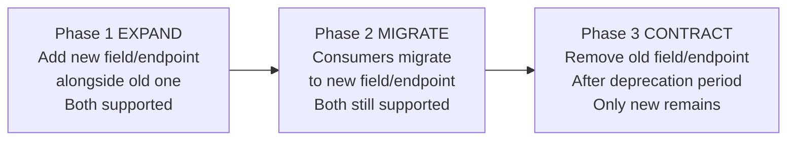

**Example — Renaming `ownerName` to `ownerFullLegalName` in the Land Registry API:**

- **Phase 1 (EXPAND):** API returns BOTH `ownerName` and `ownerFullLegalName` in every response. API accepts BOTH in requests.
- **Phase 2 (MIGRATE):** Notify all consumers. Provide 18-month migration window. Track which consumers still use `ownerName` via API gateway analytics.
- **Phase 3 (CONTRACT):** Remove `ownerName` after all consumers have migrated OR after the deprecation deadline.

**Deprecation Header (HTTP Standard):**

```http
HTTP/1.1 200 OK
Deprecation: true
Sunset: Sat, 01 Jan 2026 00:00:00 GMT
Link: <https://api.landregistry.gov.in/v2/registrations>; rel="successor-version"
Warning: 299 - "The v1 endpoint is deprecated. Migrate to v2 by 2026-01-01."
```

> **Production Insight:** The `Sunset` header (RFC 8594) is the standard HTTP mechanism for communicating API retirement dates. Configure your API gateway to automatically inject this header for deprecated endpoints. Set up monitoring to alert when traffic to deprecated endpoints drops below a threshold — this tells you when migration is complete.

---

### 4.2.6 Interoperability Anti-Patterns

| Anti-Pattern                    | Description                                                                  | Government Consequence                                                                                |
| ------------------------------- | ---------------------------------------------------------------------------- | ----------------------------------------------------------------------------------------------------- |
| **The Big Bang Version**        | Releasing v2 that is completely incompatible with v1, with no migration path | All consumer agencies break simultaneously; political escalation; emergency patches                   |
| **Version in the Body**         | `{ "apiVersion": "2.0", "data": {...} }` — version embedded in JSON body     | Routers and gateways cannot version-route without parsing the body; caching broken                    |
| **Eternal Beta**                | Keeping API in "beta" to avoid versioning commitments                        | Consumers cannot rely on beta APIs; government procurement requires stable APIs                       |
| **God API**                     | One endpoint that returns all possible data for all consumers                | Performance degradation; security risk (returning data consumer is not authorised for); over-fetching |
| **Date-Stamped Endpoints**      | `/api/registrations-2024-01`                                                 | Not scalable; consumer code becomes a calendar reference                                              |
| **Implicit Schema**             | No OpenAPI/AsyncAPI contract; schema communicated via email/Word documents   | Schema drift; integration failures; no contract tests possible                                        |
| **Shared Database Integration** | Two agencies share a database instead of using APIs                          | Schema coupling; no independent deployment; security boundary violation                               |

---

## 4.3 High-Level Design: API Versioning Architecture for Government Gateway

```mermaid
graph TB
    subgraph "Consumer Agencies"
        C1[State Agency A\nv1 Consumer]
        C2[State Agency B\nv2 Consumer]
        C3[Private Bank\nv1 Consumer\nDeprecation Notice Sent]
    end

    subgraph "API Gateway Layer — India API Setu / Singapore APEX"
        GW[API Gateway\nVersion Router]
        RM[Rate Limiter\nPer-consumer quotas]
        AM[Auth Middleware\nOAuth2 Token Validation]
        DM[Deprecation Middleware\nInjects Sunset Headers]
        AN[Analytics\nVersion Usage Tracking]
    end

    subgraph "Land Registry Service"
        V1[v1 Handler\n/api/v1/registrations\nMaintained — Deprecated]
        V2[v2 Handler\n/api/v2/registrations\nCurrent — Stable]
        CORE[Application Core\nShared Domain Logic\nHexagonal Architecture]
    end

    C1 -->|"GET /v1/registrations"| GW
    C2 -->|"GET /v2/registrations"| GW
    C3 -->|"GET /v1/registrations"| GW

    GW --> RM --> AM --> DM --> AN

    DM -->|"v1 route + Sunset header"| V1
    DM -->|"v2 route"| V2

    V1 --> CORE
    V2 --> CORE

    AN -->|"Alert: Agency C\nstill on v1\n30 days to sunset"| NOTIFY[Notification\nto API Team]
```

> **Architect's Note:** The key insight in this diagram is that BOTH v1 and v2 handlers share the SAME application core (hexagonal architecture). The version handlers are adapters — they translate the v1 or v2 request format into the same Command objects that the use case layer accepts. This means versioning is an adapter-level concern, not a domain-level concern. Business logic is written once; API format variations are adapter-level translations.

---

## 4.4 Design Rationale and Trade-off Analysis

### Trade-off: URI Versioning vs. Header Versioning in Government Context

| Dimension                         | URI Versioning                                         | Header Versioning                      | Government Verdict          |
| --------------------------------- | ------------------------------------------------------ | -------------------------------------- | --------------------------- |
| **API Gateway routing**           | Trivial — route by URL prefix                          | Complex — requires header inspection   | URI wins                    |
| **Developer experience**          | Excellent — visible, bookmarkable, testable in browser | Poor — requires custom header setup    | URI wins                    |
| **Cache efficiency**              | Excellent — CDN caches by URL naturally                | Requires Vary header configuration     | URI wins                    |
| **REST theoretical purity**       | Debated — URL should identify resource                 | More correct per RFC 7231              | Header wins (theoretically) |
| **Regulatory audit trail**        | Excellent — version visible in access logs             | Requires custom log enrichment         | URI wins                    |
| **Government standard alignment** | NIC, GSA, APEX all mandate URI versioning              | Not mandated by any framework reviewed | URI wins                    |

**Verdict for government systems:** Use URI versioning. The theoretical REST purity argument is outweighed by operational, compliance, and developer experience factors in government contexts.

---

## 4.5 Questionnaire — Section 4

**Conceptual Questions**

1. What is the difference between API interoperability and API integration? Why do architects distinguish between the two?

2. Explain the Tolerant Reader pattern. Why is it critical for API consumers in a government ecosystem where providers change APIs independently?

3. What is the Sunset header (RFC 8594) and how does it support API lifecycle management? How would you monitor consumer migration away from a deprecated API version?

**Application Questions**

4. The Land Registry API currently returns: `{ "ownerName": "Rajesh Kumar", "propertyId": "uuid" }`. You need to add a required `ownerAadhaarId` field (required for a new regulatory mandate). Walk through the Expand-Contract pattern to make this change without breaking existing consumers.

5. Design a versioning policy document (one paragraph each) covering: (a) what constitutes a breaking vs. non-breaking change, (b) minimum deprecation notice period, (c) how consumers are notified of deprecation, (d) what happens if a consumer does not migrate by the sunset date.

6. Singapore's APEX gateway requires all published APIs to include rate limiting headers in responses. Write the HTTP response headers that should be included, with example values.

**Analysis Questions**

7. A government API team argues: "We should use date-based versioning (e.g., `API-Version: 2024-01-15`) like Stripe does, because it is more granular than v1/v2." Analyse this argument. Is date-based versioning appropriate for a government API ecosystem? What are the specific challenges in a government context?

8. Compare the "God API" anti-pattern with GraphQL as an alternative. Could GraphQL be a solution to the God API problem in government systems? What are the risks of adopting GraphQL in a regulated government API ecosystem?

**Scenario-Based Questions**

9. You are the API governance lead for India's API Setu platform. An agency submits a new API for publication that: (a) uses Basic Authentication (username/password in Base64), (b) returns all citizen data including Aadhaar number in every response regardless of what the consumer needs, (c) has no versioning, (d) returns HTTP 200 for all responses including errors. List the specific rejections and the corrective requirements for each.

10. A critical cross-agency integration exists between the Indian Income Tax Department API (v1) and 47 state government systems. The IT Department wants to release v2 with breaking changes and plans to shut down v1 in 90 days. As the solution architect mediating the transition, what process would you design? What technical mechanisms would you put in place to ensure no state system goes dark?

**Answer Key — Section 4**

| Q   | Answer Summary                                                                                                                                                                                                                                                                                                                                                                                                                                                                                                                                                                                                                                                                                                                                                                                                                                                                                 |
| --- | ---------------------------------------------------------------------------------------------------------------------------------------------------------------------------------------------------------------------------------------------------------------------------------------------------------------------------------------------------------------------------------------------------------------------------------------------------------------------------------------------------------------------------------------------------------------------------------------------------------------------------------------------------------------------------------------------------------------------------------------------------------------------------------------------------------------------------------------------------------------------------------------------- |
| 1   | Integration: two specific systems exchange data (point-to-point, custom protocol). Interoperability: any two systems within an ecosystem can exchange data using standard protocols, formats, and authentication — without custom per-pair integration. Architects distinguish because interoperability is a platform-level property (achieved once for the ecosystem) while integration is a feature-level property (must be built for each new pair).                                                                                                                                                                                                                                                                                                                                                                                                                                        |
| 2   | Tolerant Reader: consumers ignore unknown fields in responses instead of failing. Critical because: in a government ecosystem with 500 APIs, providers add fields constantly for new features; if every consumer fails on unknown fields, every provider change requires coordinated consumer updates — operationally impossible. In Jackson: `FAIL_ON_UNKNOWN_PROPERTIES = false`.                                                                                                                                                                                                                                                                                                                                                                                                                                                                                                            |
| 3   | Sunset header: standard HTTP header (RFC 8594) that communicates the date after which the API endpoint will be unavailable. Monitor migration by: API gateway analytics tracking request counts per version per consumer; alert when deprecated endpoint traffic is non-zero within 30 days of sunset; proactively contact non-migrating consumers via the API subscription contact.                                                                                                                                                                                                                                                                                                                                                                                                                                                                                                           |
| 4   | Phase 1 EXPAND: Add `ownerAadhaarId` as OPTIONAL in the request (for now) and return it in responses alongside existing fields. Phase 2 MIGRATE: Notify all consumers with 18-month window; provide `ownerAadhaarId` in all existing responses. Phase 3 CONTRACT: Make `ownerAadhaarId` required in requests only after all consumers confirmed sending it (verified via gateway analytics); bump to v2 with the required field.                                                                                                                                                                                                                                                                                                                                                                                                                                                               |
| 5   | (a) Breaking: removing fields, changing types, changing auth, renaming endpoints. Non-breaking: adding optional fields, new endpoints, new enum values. (b) Minimum 18 months for production APIs (12 months for internal APIs). (c) Email to registered API subscriber contacts, API gateway dashboard notification, Deprecation + Sunset HTTP headers in responses, API developer portal announcement. (d) After sunset: endpoint returns HTTP 410 Gone with migration guide URL; not silently dropped.                                                                                                                                                                                                                                                                                                                                                                                      |
| 6   | Rate limit headers: `X-RateLimit-Limit: 100` (max requests per window), `X-RateLimit-Remaining: 87` (requests remaining), `X-RateLimit-Reset: 1704067200` (Unix timestamp when window resets), `Retry-After: 60` (seconds to wait when limit exceeded, returned with 429).                                                                                                                                                                                                                                                                                                                                                                                                                                                                                                                                                                                                                     |
| 7   | Date versioning challenges in government: (1) procurement cycles mean consumers plan 12-24 months ahead — date granularity creates confusion about which date-version to target; (2) "2024-01-15" vs "2024-03-01" requires consumers to track which dates introduced breaking changes — complex for 47 consuming agencies; (3) government audit and compliance documentation refers to API "versions" not dates; (4) NIC and APEX mandate v-prefixed versioning. Date versioning is excellent for SaaS products with weekly releases and sophisticated developer consumers; inappropriate for government APIs with slow procurement cycles and diverse consumer sophistication.                                                                                                                                                                                                                |
| 8   | GraphQL partially solves the God API problem (consumers specify exactly what fields they need — no over-fetching). Risks for government: (1) N+1 query problem can cause backend database overload if not managed with DataLoader; (2) introspection queries reveal full schema — security concern (disable in production); (3) APEX and NIC gateways are REST-centric; GraphQL requires custom gateway configuration; (4) audit logging of GraphQL queries is complex — the same endpoint is called with different query shapes; (5) IM8 (Singapore) and NIC guidelines do not explicitly address GraphQL security controls. Use GraphQL only for internal developer portals or BFF (Backend for Frontend) layers, not as primary inter-agency integration mechanism.                                                                                                                         |
| 9   | Rejections: (a) Basic Auth: rejected under NIC security guidelines — mandatory OAuth2/OIDC. Corrective: implement OAuth2 Client Credentials for M2M, OAuth2 PKCE for citizen-facing. (b) Aadhaar in every response: rejected under DPDP Act 2023 (data minimisation principle). Corrective: return only fields relevant to the consumer's declared purpose; mask Aadhaar to last 4 digits in non-identity APIs. (c) No versioning: rejected under API Setu publication standards. Corrective: add URI versioning (/v1/), maintain until sunset policy defined. (d) HTTP 200 for errors: rejected under NIC API design standards. Corrective: implement proper HTTP status codes; adopt RFC 7807 Problem Details for error responses.                                                                                                                                                           |
| 10  | Process: (1) Extend v1 sunset to minimum 18 months — 90 days is non-compliant with government interoperability standards. (2) Technical mechanisms: v1 and v2 run simultaneously (hexagonal architecture — same core, two adapters); API gateway injects `Deprecation: true` and `Sunset` headers from day 1 of v2 launch; gateway analytics dashboard shows per-state-system v1 usage; automated weekly email to states still on v1 with usage counts. (3) Provide automated migration tooling: a conversion library translating v1 request/response to v2 format. (4) Parallel run period: 6 months where both v1 and v2 are active and all responses logged for comparison. (5) After sunset: v1 returns HTTP 410 Gone with migration URL — not a silent failure. (6) Escalation path: states that cannot migrate due to procurement constraints get a waiver process through the Ministry. |

---

# Section 5: Case Study — Rapid Design of an Interoperable Government Service Mesh

## 5.1 Topic Title and Learning Objectives

**Topic:** Synthesising DDD, Hexagonal Architecture, API-First, and Interoperability into a Government Service Mesh Design

**Duration:** 1.0 hour

**Learning Objectives** — By the end of this section, participants will be able to:

1. **Synthesise** all Day 2 concepts (DDD, hexagonal architecture, OpenAPI/AsyncAPI, interoperability, versioning) into a coherent architecture design
2. **Evaluate** architectural decisions in a realistic multi-agency government scenario
3. **Identify** integration patterns appropriate for specific cross-agency communication needs
4. **Produce** a presentation-ready architecture blueprint with justified design decisions and ADRs
5. **Apply** the Architecture Trade-off Analysis Method (**ATAM** — a structured approach for evaluating architectural designs against quality attribute requirements) to assess the proposed design

---

## 5.2 Case Study Context: India's ONDC-Inspired Cross-Agency Benefits Portal

> **Note:** The following scenario is illustrative, inspired by publicly announced digital governance initiatives. All figures are hypothetical and stated as such for educational purposes.

### 5.2.1 Background

The Ministry of Digital Governance (hypothetical) has mandated a unified **"Jan Seva Portal"** (Citizen Services Portal) that aggregates services from five agencies into a single citizen-facing digital interface. Citizens currently interact with five separate portals, each requiring separate login, separate document upload, and separate status tracking.

**Participating Agencies and Their Systems:**

| Agency              | Service Offered                                | Existing Technology                  | Integration Maturity                  |
| ------------------- | ---------------------------------------------- | ------------------------------------ | ------------------------------------- |
| UIDAI               | Aadhaar Identity Verification                  | REST API (OAuth2)                    | High — published API, well-documented |
| MeitY / DigiLocker  | Document Vault (Income Cert, Caste Cert, etc.) | REST API (OAuth2 PKCE)               | High — published OpenAPI spec         |
| State Revenue Dept. | Land Records & Property Registration           | Legacy SOAP/XML (2008 vintage)       | Low — no documentation, no versioning |
| EPFO                | Employee Provident Fund Status                 | REST API (Basic Auth, no versioning) | Medium — undocumented, fragile        |
| NPCI / PM-KISAN     | Agricultural Subsidy Disbursement              | REST + Kafka events                  | Medium — partial documentation        |

**Citizen Journey to Be Supported:**

A farmer (citizen) wants to apply for agricultural subsidy. The process requires:
1. Identity verification (UIDAI)
2. Land ownership proof (State Revenue Dept.)
3. Income certificate retrieval (DigiLocker)
4. Existing EPFO status check (to prevent double-dipping)
5. Subsidy eligibility calculation and disbursement (NPCI/PM-KISAN)

**Scale Requirements (hypothetical):**
- 50 million eligible farmers across 12 states
- Peak load: 2 million applications during Kharif season (June-July) over 30 days
- SLA: Application submission response < 3 seconds (p95); status check < 500ms (p95)
- Availability: 99.9% uptime (8.7 hours max downtime per year)
- Data: Must comply with DPDP Act 2023 (data minimisation, purpose limitation, consent)

---

### 5.2.2 Problem Statement: The Naive Integration Approach

Before applying Day 2's concepts, examine the naive approach many government teams take:

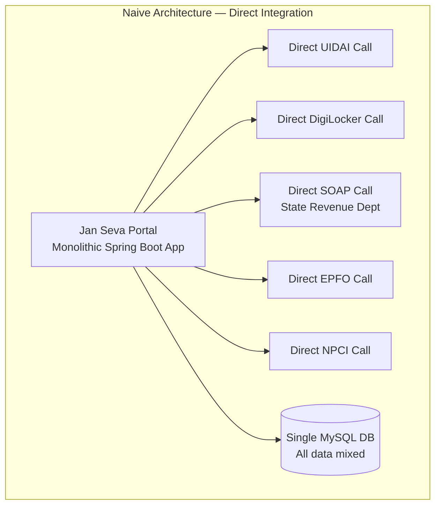

**Problems with the naive approach:**

| Problem                                                          | Impact                                                                                                                    |
| ---------------------------------------------------------------- | ------------------------------------------------------------------------------------------------------------------------- |
| Citizen request makes 5 synchronous external calls serially      | p95 latency = sum of all 5 APIs = 500ms + 800ms + 2000ms (SOAP) + 600ms + 700ms = 4.6 seconds — violates the 3-second SLA |
| State Revenue Dept. SOAP API goes down (30% uptime historically) | Entire portal unavailable — 100% impact for ALL farmers, not just those needing land records                              |
| EPFO changes its API format                                      | Entire portal breaks — no version isolation                                                                               |
| No domain model — all business logic in portal controllers       | Untestable; every change risk breaks the citizen journey                                                                  |
| Single database for all agencies' data                           | DPDP Act violation — data from five agencies in one schema; no consent boundaries                                         |
| No event-driven notifications                                    | Farmer has no way to know application status without polling                                                              |

---

### 5.2.3 Applied Architecture: Jan Seva Portal Service Mesh

The architecture below applies every concept from Day 2:

**Design Decisions Applied:**

1. **DDD Bounded Contexts:** Each agency integration is its own bounded context with its own model
2. **ACL Pattern:** Each legacy/external system wrapped in an Anti-Corruption Layer
3. **Hexagonal Architecture:** Each microservice built with ports and adapters
4. **API-First:** OpenAPI specs for all synchronous; AsyncAPI specs for all events
5. **Event-Driven Integration:** Orchestration via Kafka events, not synchronous chaining
6. **API Versioning:** URI versioning on the citizen-facing Gateway API
7. **CQRS (Command Query Responsibility Segregation — separating read and write operations into different models):** Separate read (status check) from write (application submission) paths

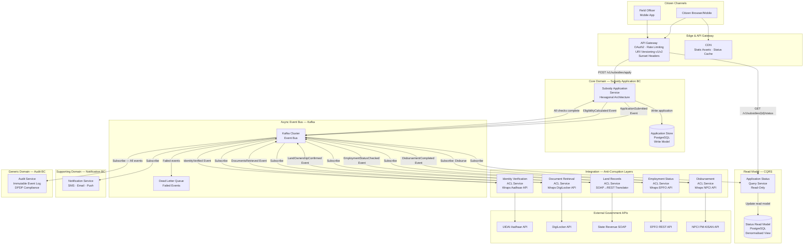

---

### 5.2.4 Architectural Decision Records for Jan Seva Portal

**ADR-001: Event-Driven Orchestration for Multi-Agency Verification**

```
Title: Use Kafka-based event-driven orchestration for multi-agency verification
Status: Accepted
Date: [Workshop Date]

Context:
The subsidy application process requires verification from 5 external government APIs.
The State Revenue SOAP API has historically had 70% uptime. A synchronous chain would
produce p95 latency of 4.6 seconds, violating the 3-second SLA, and would make
availability dependent on all 5 systems being simultaneously available.

Decision:
Use Kafka as the event bus. The Subsidy Application Service publishes an
ApplicationSubmitted event. Each ACL service subscribes independently, performs
its verification, and publishes its result event. The Application Service aggregates
result events using a saga pattern (covered Day 4). Verifications run in PARALLEL,
not sequentially.

Consequences:
Positive:
- Parallel verification reduces expected latency from 4.6s to max(individual latency) ≈ 2s
- ACL service failure does not block the portal — retries and DLQ handle failures
- Each ACL service can be deployed, scaled, and upgraded independently

Negative:
- Eventual consistency — application state is not immediately known (status polling needed)
- More complex failure handling (saga compensation patterns required)
- Kafka operational overhead (cluster management, topic configuration)

Alternatives considered:
- Synchronous parallel calls (CompletableFuture): faster for happy path but no failure isolation
- GraphQL federation: rejected — NIC guidelines mandate REST

Quality Attributes Addressed: Performance (latency SLA), Availability (partial failure tolerance)
```

**ADR-002: Anti-Corruption Layer for State Revenue SOAP API**

```
Title: Wrap State Revenue SOAP API in a dedicated ACL microservice
Status: Accepted

Context:
The State Revenue Department's API is a SOAP/XML service from 2008 with no documentation,
no versioning, and 70% uptime. Exposing this directly to the Subsidy Application
Service would couple the modern domain model to a legacy format that changes
unpredictably.

Decision:
Create a dedicated "Land Records ACL Service" that:
1. Translates incoming LandOwnershipCheckRequested Kafka events to SOAP XML calls
2. Translates SOAP XML responses to LandOwnershipConfirmed/LandOwnershipFailed events
3. Implements retry logic (3 retries with exponential backoff) for SOAP failures
4. Caches verified land ownership records for 24 hours (land records change rarely)

Consequences:
Positive:
- State Revenue SOAP changes are absorbed by the ACL — zero impact on other services
- Retry and caching compensate for poor SOAP API reliability
- Modern services use event-based Ubiquitous Language; SOAP details are invisible

Negative:
- Additional service to deploy and maintain
- 24-hour cache introduces potential staleness for land records changed today

Quality Attributes Addressed: Maintainability, Reliability, Performance
```

---

### 5.2.5 ATAM Analysis: Quality Attribute Scenarios

**ATAM (Architecture Trade-off Analysis Method)** is a structured method for evaluating how well an architecture satisfies quality attribute requirements. It uses **quality attribute scenarios** — structured statements of the form: *Stimulus → Source → Artifact → Environment → Response → Response Measure*.

| #   | Quality Attribute              | Scenario                                                                                         | Architecture Response                                                                                                                                                                                  | Trade-off                                                                                                                                     |
| --- | ------------------------------ | ------------------------------------------------------------------------------------------------ | ------------------------------------------------------------------------------------------------------------------------------------------------------------------------------------------------------ | --------------------------------------------------------------------------------------------------------------------------------------------- |
| 1   | **Performance**                | 2 million farmers submit applications over 30 days during Kharif season (peak: 5,000 req/min)    | API Gateway rate limits + horizontal scaling of Subsidy Application Service + Kafka absorbs burst as buffer                                                                                            | More Kafka partitions increase parallelism; more consumers increase throughput; cost increases linearly                                       |
| 2   | **Availability**               | State Revenue SOAP API is down for 6 hours                                                       | Revenue ACL retries with backoff; DLQ captures failed checks; application marked "Pending Land Verification"; farmer notified via SMS; system continues accepting new applications                     | Applications with land verification pending are not processed for disbursement until Revenue API recovers — acceptable delay vs. total outage |
| 3   | **Security / DPDP Compliance** | Audit requires proof that Aadhaar data was processed under consent and deleted after purpose     | Every Aadhaar interaction is logged to Audit Service via immutable Kafka event; ACL service does not persist raw Aadhaar — stores only verification result; consent captured at application submission | Storing consent events in Kafka requires careful topic retention policy (DPDP mandates data deletion on consent withdrawal)                   |
| 4   | **Maintainability**            | EPFO changes its API from Basic Auth to OAuth2                                                   | Only the EPFO ACL Service needs updating — zero changes to Application Service, Status Service, Notification Service                                                                                   | Maintaining 5 separate ACL services requires 5 separate CI/CD pipelines, 5 separate monitoring dashboards                                     |
| 5   | **Testability**                | A developer needs to test the eligibility calculation logic without calling real government APIs | Hexagonal architecture: use case tested with mock ACL events injected directly into primary port; no real Kafka or external API needed                                                                 | Mock events must accurately represent real API responses — requires investment in realistic test data management                              |

---

### 5.2.6 Before and After Architecture Summary

**Before (Naive) — Key Metrics (Hypothetical):**

| Metric                             | Value                                                 |
| ---------------------------------- | ----------------------------------------------------- |
| p95 Application Submission Latency | 4.6 seconds (violates SLA)                            |
| Availability when Revenue API down | 0% (total outage)                                     |
| Time to integrate new agency       | 3-4 months (custom per-pair integration)              |
| DPDP compliance                    | Not achievable (shared database, no consent boundary) |
| Deployable independently?          | No (monolith)                                         |

**After (DDD + Hexagonal + Event-Driven) — Key Metrics (Hypothetical):**

| Metric                             | Value                                                               |
| ---------------------------------- | ------------------------------------------------------------------- |
| p95 Application Submission Latency | < 500ms (synchronous write only; verifications async)               |
| Availability when Revenue API down | 99.9% (applications queued; not blocked)                            |
| Time to integrate new agency       | 2-3 weeks (write new ACL adapter + AsyncAPI contract)               |
| DPDP compliance                    | Achievable (per-BC database, consent events, Aadhaar not persisted) |
| Deployable independently?          | Yes (each BC + ACL deployed independently)                          |

---

### 5.2.7 Lessons Learned and Architectural Principles Reinforced

1. **Domain events are the integration currency of government systems.** When each agency publishes well-defined domain events (per AsyncAPI contract), adding a new consumer (a new ministry, a new analytics system) requires zero changes to the producer — just subscribe to the existing event.

2. **The ACL pattern is the most practical pattern in Indian government architecture** because legacy SOAP/XML systems will coexist with modern REST/event systems for the next decade. Every new system must plan for ACL boundaries upfront.

3. **Hexagonal architecture pays for itself at integration test time.** The most expensive phase of government IT projects is integration testing with real external APIs that have uptime and rate limit constraints. Hexagonal architecture allows 95% of tests to run against in-memory adapters — no rate limits, no downtime dependencies.

4. **CQRS (separating read and write models) is mandatory when read patterns differ significantly from write patterns.** A farmer checking application status 10 times per day (read-heavy, low latency required) should not compete with the same database resources as the complex write operation of submitting a new application.

5. **API versioning is a governance problem, not a technical problem.** The technical implementation of URI versioning is trivial. The hard part is the organisational process: who decides when to deprecate, how consumers are notified, and what happens when consumers miss the sunset date. Architects must design the PROCESS, not just the technology.

---

## 5.3 Food for Thought — Case Study

> **Provocation:** The Jan Seva Portal architecture described above requires 9 microservices (Subsidy Application Service, Status Service, 5 ACL Services, Notification Service, Audit Service) just to support ONE citizen journey — the agricultural subsidy application. In a real government portal supporting 100 citizen journeys, this architecture would produce hundreds of services.
>
> The question is: **At what point does microservice proliferation create more complexity than the monolith it replaced?** Is there a "right" number of services? How do you measure whether your microservice architecture is healthier than your previous monolith?
>
> Research prompt for Copilot/ChatGPT: *"What is a 'Distributed Monolith' and how do you identify if your microservice architecture has become one? What metrics or fitness functions would you define to detect distributed monolith symptoms in a government services platform?"*
>
> Weekend challenge: Map one citizen journey from your national government's digital services portal (India's DigiLocker / US Login.gov / Singapore MyInfo). How many backend systems does the journey touch? How many of those systems are synchronously coupled? Design an event-driven alternative using the Jan Seva Portal pattern.

---

## 5.4 Questionnaire — Section 5

**Conceptual Questions**

1. What is ATAM and what problem does it solve in architecture evaluation? How does it differ from a code review or a security audit?

2. Explain the CQRS pattern as applied in the Jan Seva Portal. Why is separating the read model (Application Status Query Service) from the write model (Subsidy Application Service) beneficial in this specific scenario?

3. What is a "Dead Letter Queue (DLQ)" and why is it essential in an event-driven government system? What happens to failed events without a DLQ?

**Application Questions**

4. The Jan Seva Portal needs to add a new agency: the National Health Authority (NHA) for health insurance verification. Using the ACL and event-driven patterns from this section, describe the steps to integrate NHA without changing any existing services.

5. Write a Quality Attribute Scenario (using the Stimulus → Source → Artifact → Environment → Response → Response Measure format) for the security requirement: "All citizen Aadhaar data must be processed in compliance with the DPDP Act 2023."

6. The Audit Service receives ALL domain events from ALL services. At peak (2 million applications per month), estimate the event volume the Audit Service must handle. What architectural decisions would you make about the Audit Service's storage and processing strategy?

**Analysis Questions**

7. The Jan Seva Portal uses Kafka for async integration between ACL services and the core Application Service. A team member proposes using a choreography-based saga (each service reacts to events) versus an orchestration-based saga (a central saga orchestrator controls the flow). Compare these two approaches for the multi-agency verification flow. Which would you choose and why?

8. Analyse the 24-hour caching strategy in the Land Records ACL Service (ADR-002). What are the risks if a farmer's land ownership changes (e.g., sold to someone else) and the cache still shows the old owner? How would you mitigate this risk while maintaining the performance benefit?

**Scenario-Based Questions**

9. Six months after launch, the Jan Seva Portal's SRE (Site Reliability Engineering) team reports: the NPCI Disbursement ACL Service is processing only 800 events per minute, but the Kafka topic has a growing backlog of 500,000 unprocessed events. The Kharif season deadline is in 3 days. As the solution architect on-call, what is your immediate diagnosis checklist and what scaling options do you have?

10. The Ministry requires that the Jan Seva Portal's architecture be presented to a parliamentary standing committee (non-technical audience). You have 10 minutes and one diagram. Redesign the architecture diagram from Section 5.2.3 as a simplified narrative diagram (using ASCII art or Mermaid) that a non-technical committee member can understand, removing all technical jargon while preserving the key architectural decisions.

**Answer Key — Section 5**

| Q   | Answer Summary                                                                                                                                                                                                                                                                                                                                                                                                                                                                                                                                                                                                                                                                                                                                                                                                                                                                                                                                           |
| --- | -------------------------------------------------------------------------------------------------------------------------------------------------------------------------------------------------------------------------------------------------------------------------------------------------------------------------------------------------------------------------------------------------------------------------------------------------------------------------------------------------------------------------------------------------------------------------------------------------------------------------------------------------------------------------------------------------------------------------------------------------------------------------------------------------------------------------------------------------------------------------------------------------------------------------------------------------------- |
| 1   | ATAM evaluates how an architecture satisfies quality attribute requirements BEFORE full implementation, identifying trade-offs and risks early. Differs from code review (code review evaluates implementation correctness, not architectural quality attributes) and security audit (security audit evaluates a specific attribute — security — not the holistic trade-off landscape). ATAM produces a prioritised list of architectural risks and trade-offs using quality attribute scenarios.                                                                                                                                                                                                                                                                                                                                                                                                                                                        |
| 2   | CQRS separates write model (complex, transactional: submit application, trigger verification saga) from read model (simple, high-frequency, low-latency: check status). In Jan Seva Portal: a farmer checks status 10x/day per application — millions of read queries. Without CQRS, these reads compete with complex writes on the same database. With CQRS: status read model is a denormalised view updated by events — can be served from a read-optimised store with sub-100ms response, while write model focuses on correctness.                                                                                                                                                                                                                                                                                                                                                                                                                  |
| 3   | DLQ: a separate queue/topic where messages that fail processing after N retries are stored instead of being lost. Essential because: without DLQ, a failed event (e.g., NPCI API returns 500) is either retried infinitely (blocks the consumer) or dropped (disbursement never happens — citizen never receives subsidy). With DLQ: failed events are quarantined; operations team can inspect, fix the cause, and replay the events; no data loss; no infinite retry loops.                                                                                                                                                                                                                                                                                                                                                                                                                                                                            |
| 4   | Steps: (1) Create NHA ACL Service — a new microservice that subscribes to `ApplicationSubmitted` Kafka events, calls NHA API, and publishes `HealthInsuranceStatusChecked` events. (2) Update Subsidy Application Service saga to wait for `HealthInsuranceStatusChecked` event as a new verification step. (3) Write AsyncAPI contract for the new event. (4) Deploy NHA ACL Service independently. Zero changes to: UIDAI ACL, DigiLocker ACL, Revenue ACL, EPFO ACL, Notification Service, Audit Service.                                                                                                                                                                                                                                                                                                                                                                                                                                             |
| 5   | Scenario: Stimulus: A citizen submits a subsidy application containing Aadhaar ID. Source: Citizen via web portal. Artifact: Subsidy Application Service + UIDAI ACL Service. Environment: Production, normal operation. Response: Aadhaar ID is used for identity verification only; not persisted in any database; verification result stored as a boolean flag; the interaction is logged to Audit Service with consent reference; Aadhaar is absent from all event payloads downstream of UIDAI ACL. Response Measure: Aadhaar ID is absent from all database stores (verified by automated compliance scan); audit log entry exists for every Aadhaar access with citizen consent ID.                                                                                                                                                                                                                                                               |
| 6   | Estimate: 2M applications × average 7 events per application lifecycle = 14M events/month ÷ 30 days ÷ 24 hours = ~19,000 events/hour ÷ 3600 = ~5 events/second average; peak (Kharif, 5000 req/min submission rate) = 5000 × 7 = 35,000 events/min = ~580 events/second. Storage: append-only PostgreSQL with partitioning by month; 3-year retention (regulatory); ~100 bytes per event = 14M × 100 = 1.4GB/month = ~17GB/year. Processing: Audit Service uses batch consumer (process 1000 events per batch) with multiple partitions. No business logic — pure append.                                                                                                                                                                                                                                                                                                                                                                                |
| 7   | Choreography: each ACL service reacts to events independently — simpler, no central bottleneck, but hard to track overall saga state. Orchestration: a central saga orchestrator (Subsidy Application Service) tracks which verifications are complete — complex but gives full visibility. For government: orchestration preferred because: (1) regulatory requirement to know exact application state at any moment; (2) easier to implement timeouts (if Revenue ACL does not respond in 48 hours, mark application as "Manual Review Required"); (3) compensation logic is centralised and auditable. Choreography preferred only when the flow is simple and team autonomy is more important than central visibility.                                                                                                                                                                                                                               |
| 8   | Risks: a farmer who sold their land yesterday is still shown as owner; they receive subsidy fraudulently; actual owner (buyer) is denied. Mitigation: (1) Reduce cache TTL for properties in active transactions (Revenue ACL subscribes to `PropertyTransferInitiated` events and invalidates specific cache entries); (2) Add cache validation at eligibility calculation step (re-verify if application is older than cache timestamp); (3) Accept the risk for 24h window with a reconciliation job that cross-checks disbursement records against Revenue records post-disbursement (DPDP-compliant with proper purpose limitation). Performance vs. correctness trade-off — document in ADR with explicit risk acceptance.                                                                                                                                                                                                                         |
| 9   | Immediate diagnosis: (1) Check Kafka consumer lag on the NPCI topic — is it growing? Yes → consumer is the bottleneck. (2) Check NPCI ACL Service CPU/memory — is it resource-constrained? (3) Check NPCI external API rate limits — is the ACL hitting rate limits from NPCI? (4) Check for exceptions in NPCI ACL logs — is it in an error loop? Scaling options: if CPU-bound → increase replica count of NPCI ACL Service (K8s: `kubectl scale deployment npci-acl --replicas=10`); if NPCI rate-limited → cannot scale consumers beyond rate limit; negotiate emergency rate limit increase with NPCI, OR implement batch disbursement (group 100 records per NPCI call); if Kafka partition-bound → add partitions to the topic (but requires consumer group rebalance — 2-3 minute downtime); immediate: temporarily reroute high-priority applications (identified by district priority) to front of queue using Kafka message priority pattern. |
| 10  | Simplified narrative diagram for parliamentary committee:                                                                                                                                                                                                                                                                                                                                                                                                                                                                                                                                                                                                                                                                                                                                                                                                                                                                                                |

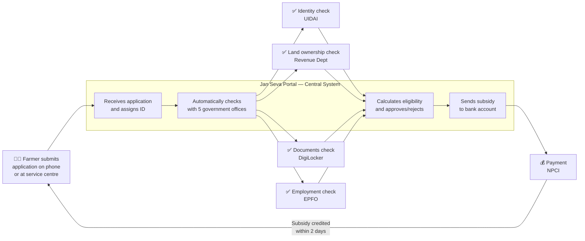

> Key message for committee: "The system works like an automated file routing system. When a farmer submits, five government offices are checked simultaneously — not one by one. If one office system is temporarily down, the farmer is not rejected — the application waits and retries automatically. No manual follow-up required. The farmer receives an SMS at every step."

---


# Day 2 Master Summary

## Learning Journey Recap

The following table maps every learning objective from the Day 2 curriculum to the section where it was addressed, the key concept introduced, and the assessment question that validates it:

| #   | Curriculum Learning Outcome                                                | Section | Key Concept                                                           | Validating Question |
| --- | -------------------------------------------------------------------------- | ------- | --------------------------------------------------------------------- | ------------------- |
| 1   | Produce a validated high-level architecture blueprint from business goals  | 1       | Gap Analysis, BCM, Peer Review Protocol                               | Q1.9, Q1.10         |
| 2   | Decompose complex domains into bounded contexts using DDD                  | 2       | Bounded Context, Aggregate Root, Ubiquitous Language                  | Q2.4, Q2.5          |
| 3   | Apply event storming to discover domain structure                          | 2       | Event Storming, Context Map                                           | Q2.8                |
| 4   | Design maintainable architectures with clean separation of concerns        | 3       | Hexagonal Architecture, Clean Architecture, Dependency Rule           | Q3.1, Q3.10         |
| 5   | Design API-first contracts using OpenAPI and AsyncAPI                      | 3       | OpenAPI 3.1, AsyncAPI 2.6, Contract-First Development                 | Q3.5, Q3.6          |
| 6   | Implement robust versioning and interoperability patterns                  | 4       | URI Versioning, Semantic Versioning, Tolerant Reader, Expand-Contract | Q4.4, Q4.9          |
| 7   | Combine DDD, clean architecture, and API design for interoperable services | 5       | Jan Seva Portal Case Study, ATAM, ADRs                                | Q5.4, Q5.7          |

---

## Concept Dependency Map

The following diagram shows how Day 2's concepts build upon each other and connect to adjacent days:

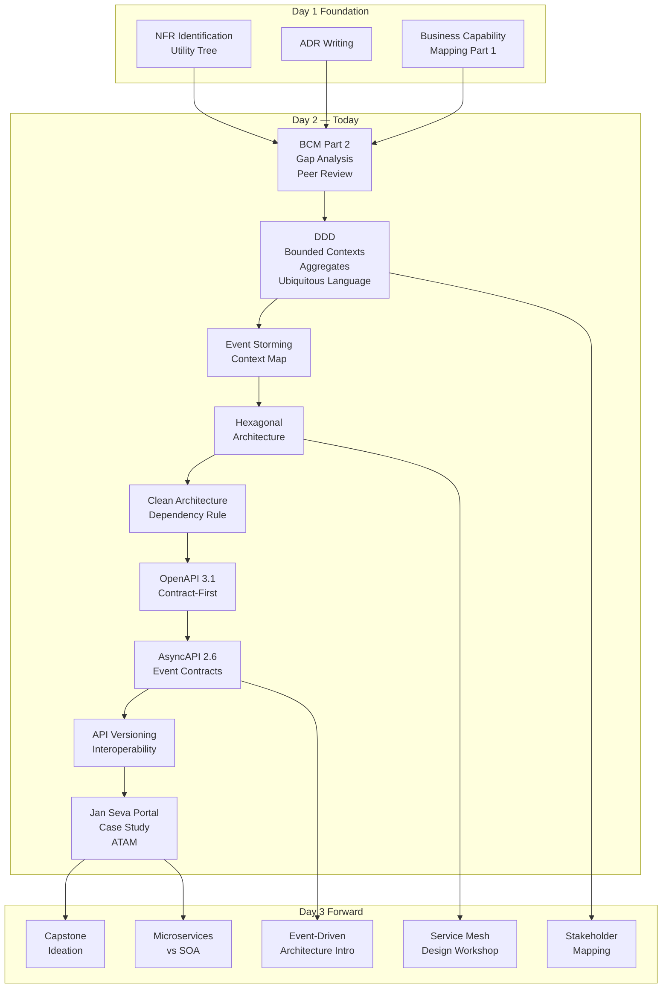

---

## Key Vocabulary Master Reference (Day 2)

The following glossary consolidates all architect-level terms introduced today. This serves as the trainer's quick-reference during Q&A and participant discussion.

| Term         | Full Form / Definition                                                                                              | First Introduced |
| ------------ | ------------------------------------------------------------------------------------------------------------------- | ---------------- |
| **BCM**      | Business Capability Map — a structured representation of what an organisation does, independent of how              | Section 1        |
| **DDD**      | Domain-Driven Design — a software design approach focusing the design on the core domain and domain logic           | Section 2        |
| **BC**       | Bounded Context — an explicit boundary within which a domain model is defined and applicable                        | Section 2        |
| **UL**       | Ubiquitous Language — a shared, precise vocabulary used by all team members in all artifacts                        | Section 2        |
| **AR**       | Aggregate Root — the single entry point through which external objects may access or modify an aggregate            | Section 2        |
| **ACL**      | Anti-Corruption Layer — a translation layer that protects a modern domain model from a legacy or external model     | Section 2, 5     |
| **OHS**      | Open Host Service — a stable, well-documented API published by an upstream context for downstream consumption       | Section 2        |
| **PL**       | Published Language — a well-documented data exchange format agreed upon by all participants                         | Section 2        |
| **HLD**      | High-Level Design — an architectural view showing major components, interactions, and data flows                    | Section 2, 3     |
| **OAS**      | OpenAPI Specification — the industry standard for describing synchronous HTTP REST APIs (current version: 3.1)      | Section 3        |
| **AsyncAPI** | Asynchronous API Specification — the standard for describing event-driven/asynchronous APIs (current: 2.6)          | Section 3        |
| **PP**       | Primary Port — an interface defined by the application core, called by external actors (REST, Kafka, CLI)           | Section 3        |
| **SP**       | Secondary Port — an interface defined by the application core, implemented by infrastructure adapters               | Section 3        |
| **SemVer**   | Semantic Versioning — MAJOR.MINOR.PATCH versioning convention for APIs and software                                 | Section 4        |
| **DLQ**      | Dead Letter Queue — a queue/topic where messages that fail processing after N retries are stored                    | Section 5        |
| **CQRS**     | Command Query Responsibility Segregation — separating read and write operations into different models               | Section 5        |
| **ATAM**     | Architecture Trade-off Analysis Method — a structured method for evaluating architecture against quality attributes | Section 5        |
| **DPDP**     | Digital Personal Data Protection Act (India, 2023) — governs collection, processing, and storage of personal data   | Sections 4, 5    |
| **APEX**     | API Exchange — Singapore's Whole-of-Government API gateway platform managed by GovTech                              | Section 4        |
| **IM8**      | Instruction Manual 8 — Singapore government's ICT standards and security policy framework                           | Section 4        |
| **FedRAMP**  | Federal Risk and Authorization Management Program — US cloud security authorisation framework                       | Section 4        |
| **NDI**      | National Digital Identity — Singapore's digital identity framework underpinning Singpass                            | Section 4        |

---

## Architectural Principles Reinforced Today

The following principles — drawn from established architecture frameworks — were demonstrated through Day 2's content. Trainers should explicitly call these out during session wrap-up:

**1. The Stable Abstractions Principle (Robert C. Martin)**
> "A component should be as abstract as it is stable."
> Demonstrated by: Domain interfaces (ports) are the most stable elements in the system. Infrastructure adapters are the most concrete. The dependency flows from concrete (adapters) to abstract (ports) — not the other way.

**2. Conway's Law (Melvin Conway, 1967)**
> "Any organisation that designs a system will produce a design whose structure is a copy of the organisation's communication structure."
> Demonstrated by: The Jan Seva Portal's bounded contexts map to organisational boundaries (UIDAI, Revenue Dept., EPFO). The Inverse Conway Maneuver recommends structuring the team organisation to match the desired architecture, not inheriting it from existing org charts.

**3. The Dependency Inversion Principle at Architecture Scale**
> "High-level modules should not depend on low-level modules. Both should depend on abstractions."
> Demonstrated by: The Hexagonal Architecture section — the domain layer depends on port interfaces, not on Spring, Kafka, or JPA.

**4. Postel's Law (The Robustness Principle)**
> "Be conservative in what you send, liberal in what you accept."
> Demonstrated by: The Tolerant Reader pattern in API versioning — consumers accept unknown fields; producers only include well-defined fields.

**5. The Single Responsibility Principle at Service Level**
> A bounded context (and its corresponding service) should have one, and only one, reason to change.
> Demonstrated by: The ACL pattern — the Land Records ACL has one reason to change: when the State Revenue SOAP API changes. Nothing else changes it.

**6. The Open-Closed Principle at Architecture Scale**
> "Software entities should be open for extension, closed for modification."
> Demonstrated by: Adding the NHA (National Health Authority) to the Jan Seva Portal requires writing a NEW ACL service — it does not modify any existing service. The architecture is open for extension (new agencies) and closed for modification (existing services unchanged).

---

## Common Trainer Questions and Answers (Day 2 FAQ)

These are questions that participants commonly raise during the session. Trainers should be prepared with these responses:

**Q: "Is every bounded context a separate microservice? Do we always need to deploy them separately?"**

> Not necessarily. A Bounded Context is a LOGICAL boundary — a conceptual separation of domain models. Whether it becomes a separate deployable (microservice) is a separate, tactical decision based on: team autonomy requirements, independent scaling needs, and change frequency. A "Modular Monolith" — multiple bounded contexts in one deployable with strict module boundaries — is a valid and often preferable intermediate step. Netflix started as a monolith, broke it into modules first, then extracted microservices incrementally.

**Q: "OpenAPI is just Swagger renaming — why does it matter?"**

> Swagger was the tool. OpenAPI is the specification. The distinction matters because OpenAPI 3.1 (2021) achieved full JSON Schema alignment, enabling schema reuse across OpenAPI contracts and JSON Schema validators. More importantly, OpenAPI is now governed by the OpenAPI Initiative (Linux Foundation) — not a single vendor. For government procurement, a vendor-neutral standard is non-negotiable. Regulators in India (NIC), US (GSA), and Singapore (GovTech) mandate OpenAPI — not "Swagger."

**Q: "Why do we need AsyncAPI if Kafka topics are internal? Consumers are our own team."**

> Two reasons. First, "our own team" today becomes "three teams and two external agencies" in 18 months — government systems attract integrations. Second, internal schema drift between a Kafka producer and consumer team is the most silent and dangerous form of breaking change — there is no HTTP 422 response to alert you. AsyncAPI gives you the same contract-first safety net for events that OpenAPI gives you for HTTP. The operational cost of writing the spec is two hours. The cost of a schema drift incident is days of debugging across distributed systems.

**Q: "Hexagonal architecture seems like over-engineering for a simple CRUD service. When do we NOT use it?"**

> Clear cases where hexagonal architecture is overkill: (1) services with no business logic — pure data passthrough / CRUD with zero invariants; (2) proof-of-concept services with < 3 months expected lifetime; (3) single-developer, single-team services with no external consumers; (4) services that will NEVER change their infrastructure (guaranteed never to switch databases, guaranteed single input channel). For everything else in a government context — where longevity is 10+ years, where regulations change business rules annually, and where multiple agencies integrate — hexagonal architecture's cost is justified within the first year.

**Q: "The Jan Seva Portal has 9 microservices. How do we prevent this from becoming unmanageable?"**

> Three mechanisms: (1) Platform Engineering — a shared internal developer platform (IDP) handles common concerns (CI/CD templates, observability, service mesh) so each team does not re-implement them. (2) Service Mesh (covered Day 11) — handles cross-cutting concerns (mTLS, traffic routing, circuit breaking) without per-service code. (3) Fitness Functions — automated architectural tests that detect distributed monolith symptoms (excessive synchronous coupling, circular dependencies, shared databases) before they compound. The 9 services are manageable because they are truly independent — no shared databases, no synchronous dependencies between ACL services, and each maps to one clear bounded context and team.

---

## Day 2 Assignment Summary

The following assignments were embedded throughout Day 2. These are designed for completion between Day 2 and Day 3:

| Assignment                             | Section | Description                                                                                                                                           | Output                                                                    |
| -------------------------------------- | ------- | ----------------------------------------------------------------------------------------------------------------------------------------------------- | ------------------------------------------------------------------------- |
| **A2-1: Blueprint Completion**         | 1       | Complete the architecture blueprint from Day 1 Part 1, incorporating peer review feedback                                                             | Refined HLD diagram with gap analysis table                               |
| **A2-2: Event Storming**               | 2       | Conduct an event storming exercise on the government case chosen for capstone (land registry, benefits portal, or identity system)                    | Event timeline with aggregates, commands, and bounded contexts identified |
| **A2-3: Ubiquitous Language Glossary** | 2       | Write a 10-term Ubiquitous Language glossary for ONE bounded context from your event storming                                                         | Glossary document                                                         |
| **A2-4: OpenAPI Contract**             | 3       | Write a complete OpenAPI 3.1 specification for ONE endpoint from your capstone domain                                                                 | openapi.yaml file                                                         |
| **A2-5: Versioning Policy**            | 4       | Write a one-page API versioning policy for your capstone project covering: breaking change definition, deprecation period, notification process       | Versioning policy document                                                |
| **A2-6: ADR Writing**                  | 5       | Write two ADRs for your capstone: one for your bounded context decomposition decision, one for your synchronous vs. asynchronous integration decision | Two ADR documents                                                         |

---

## Day 3 Preview and Preparation

**Day 3 begins with** the Capstone Project Ideation session. Participants should arrive with:

1. A candidate government problem they want to solve for their capstone (a real or realistic government service modernisation scenario from India, US, or Singapore)
2. A rough list of 5-8 NFRs for their capstone problem
3. Their Day 2 blueprint and event storming outputs

**Day 3 will cover:**
- Capstone problem statement framing and scoping (1.0 hr)
- Stakeholder mapping and architecture vision (1.0 hr)
- Government Service Mesh Design Workshop continuation (2.0 hr)
- Introduction to Microservices vs. SOA vs. Space-Based Architecture (0.5 hr)
- Introduction to Event-Driven Architecture patterns (0.5 hr)

**Bridge concept from Day 2 to Day 3:**
The bounded contexts identified today through event storming become the microservice candidates in Day 3's decomposition discussion. The OpenAPI and AsyncAPI contracts designed today become the service mesh contracts in Day 3's workshop. The Jan Seva Portal case study continues as a running example for the Service Mesh Design Workshop.


---

**Day 2 Theory Document is complete.**
