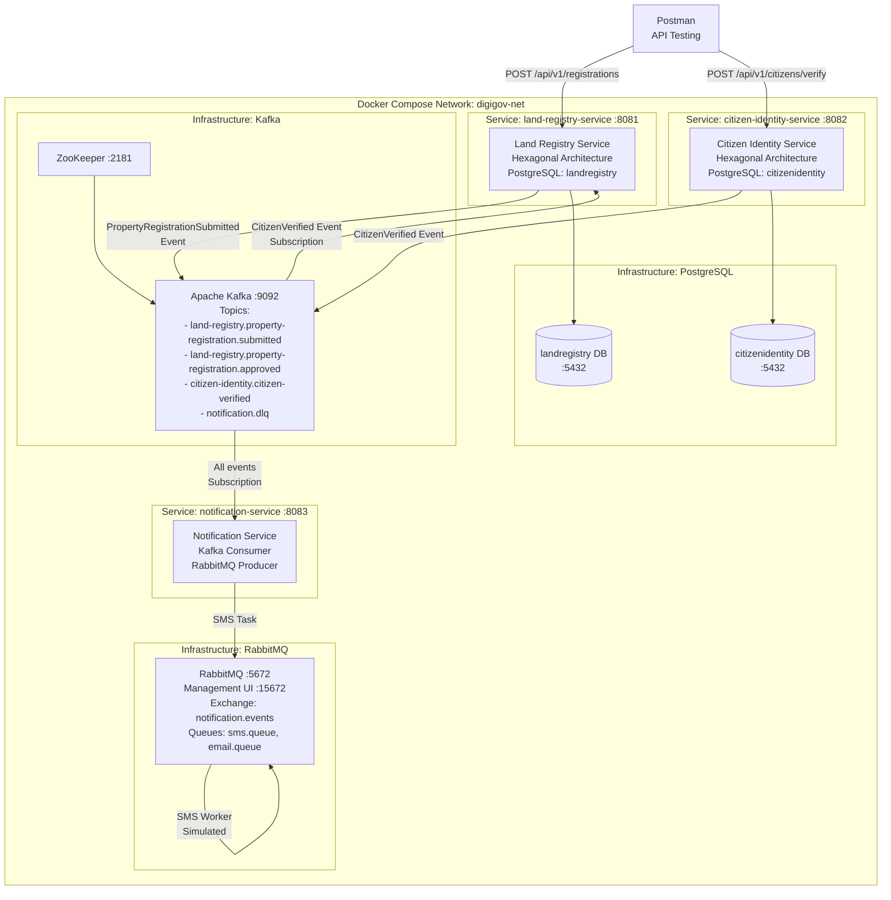

# DAY 3 — LAB DOCUMENT
## Senior Engineer to Solution Architect Program
### Document Type: Trainer's Playbook | Day 3 of 12

---

# LAB HEADER

## Lab Title: DigiGov Service Gateway — Multi-Service Mesh with Kafka and RabbitMQ

**Day Reference:** Day 3 — Capstone Ideation, Service Mesh Design, and Distributed Systems Foundations

**Lab Narrative:**
The Jan Seva Portal platform team adds a second bounded context today — the **Citizen Identity Service** — and establishes the first cross-service event flow between it and the Land Registry Service built on Day 2. We introduce **RabbitMQ** as the notification task queue and demonstrate the architectural difference between Kafka (event streaming, immutable log, multiple consumers) and RabbitMQ (task queue, competing consumers, ephemeral messages) in a running system. By end of day, two services communicate via Kafka events, a Notification Service dispatches tasks via RabbitMQ, and the complete stack runs in Docker Compose.

**Continuity:** This lab directly extends Day 2's `land-registry-service`. The Day 2 project remains unchanged — we add new services to the same Docker Compose network.

---

## Prerequisites Checklist

```powershell
# Verify Day 2 lab is complete and working
Set-Location "C:\digigov\land-registry-service"
docker compose ps
# Expected: postgres, zookeeper, kafka all healthy

# Verify Day 2 service responds
Invoke-RestMethod -Uri "http://localhost:8081/actuator/health"
# Expected: {"status":"UP"}

# Verify available ports for new services
@(8082, 8083, 5672, 15672) | ForEach-Object {
    $result = netstat -ano | findstr ":$_"
    if ($result) {
        Write-Host "PORT $_ IN USE: $result" -ForegroundColor Red
    } else {
        Write-Host "PORT $_ free" -ForegroundColor Green
    }
}
# Expected: All four ports free

# Verify Docker memory allocation (need at least 6GB for full stack)
docker system info --format "{{.MemTotal}}"
# Expected: > 6000000000 (6GB)
```

**Additional Environment Variables (add to existing):**

```powershell
$env:RABBITMQ_USER = "digigov"
$env:RABBITMQ_PASS = "digigov_secret"
$env:CITIZEN_IDENTITY_DB = "citizenidentity"
$env:NOTIFICATION_DB = "notification"
```

---

## Estimated Time

| Phase                               | Time          |
| ----------------------------------- | ------------- |
| Offline Setup (trainer preparation) | 60-75 minutes |
| In-Class Demonstration              | 5.0-5.5 hours |
| Cleanup                             | 15 minutes    |

---

## Learning Objectives (Lab)

1. Build a second Spring Boot microservice (Citizen Identity Service) using hexagonal architecture
2. Establish cross-service Kafka event communication between Land Registry and Citizen Identity services
3. Demonstrate the architectural difference between Kafka (event bus) and RabbitMQ (task queue) in a running system
4. Implement a Notification Service that consumes Kafka events and dispatches SMS tasks via RabbitMQ
5. Extend Docker Compose to orchestrate a four-service mesh with shared Kafka and RabbitMQ infrastructure
6. Produce C4-L2 architecture diagrams as executable Mermaid code validated against the running system

---

## Project Architecture Overview



---

# LAB BODY

---

# LAB SECTION 1: Citizen Identity Service — New Bounded Context

## What We Are Building

The **Citizen Identity Service** is the second bounded context in the DigiGov Service Gateway. It wraps the UIDAI Aadhaar verification API (simulated in this lab — we do not call the real UIDAI API). When a citizen's identity is verified, it publishes a `CitizenVerified` domain event to Kafka. The Land Registry Service subscribes to this event to update the registration status.

**This demonstrates:** Cross-service event communication using Kafka — the fundamental inter-service integration pattern for the Jan Seva Portal service mesh.

---

## Step 1.1: Create Project Structure

```powershell
# Create the citizen identity service alongside the land registry service
New-Item -ItemType Directory -Path "C:\digigov\citizen-identity-service" -Force
Set-Location "C:\digigov\citizen-identity-service"

$dirs = @(
    "src\main\java\gov\identity\domain\model",
    "src\main\java\gov\identity\domain\events",
    "src\main\java\gov\identity\domain\exception",
    "src\main\java\gov\identity\application\port\in\command",
    "src\main\java\gov\identity\application\port\out",
    "src\main\java\gov\identity\application\service",
    "src\main\java\gov\identity\adapter\in\web\dto",
    "src\main\java\gov\identity\adapter\out\persistence\entity",
    "src\main\java\gov\identity\adapter\out\messaging",
    "src\main\resources\db\migration",
    "src\test\java\gov\identity\domain",
    "src\test\java\gov\identity\application"
)

foreach ($dir in $dirs) {
    New-Item -ItemType Directory -Path $dir -Force | Out-Null
    Write-Host "Created: $dir" -ForegroundColor Green
}
```

---

## Step 1.2: Create pom.xml

Create `C:\digigov\citizen-identity-service\pom.xml`:

```xml
<?xml version="1.0" encoding="UTF-8"?>
<project xmlns="http://maven.apache.org/POM/4.0.0"
         xmlns:xsi="http://www.w3.org/2001/XMLSchema-instance"
         xsi:schemaLocation="http://maven.apache.org/POM/4.0.0
         https://maven.apache.org/xsd/maven-4.0.0.xsd">
    <modelVersion>4.0.0</modelVersion>

    <parent>
        <groupId>org.springframework.boot</groupId>
        <artifactId>spring-boot-starter-parent</artifactId>
        <version>3.2.0</version>
        <relativePath/>
    </parent>

    <groupId>gov.identity</groupId>
    <artifactId>citizen-identity-service</artifactId>
    <version>1.0.0</version>
    <name>Citizen Identity Service</name>
    <description>
        DigiGov Jan Seva Portal — Citizen Identity Bounded Context
        Wraps UIDAI Aadhaar verification (simulated for lab).
        Part of Day 3: Senior Engineer to Solution Architect Program.
    </description>

    <properties>
        <java.version>17</java.version>
        <maven.compiler.source>17</maven.compiler.source>
        <maven.compiler.target>17</maven.compiler.target>
        <springdoc.version>2.3.0</springdoc.version>
    </properties>

    <dependencies>
        <dependency>
            <groupId>org.springframework.boot</groupId>
            <artifactId>spring-boot-starter-web</artifactId>
        </dependency>
        <dependency>
            <groupId>org.springdoc</groupId>
            <artifactId>springdoc-openapi-starter-webmvc-ui</artifactId>
            <version>${springdoc.version}</version>
        </dependency>
        <dependency>
            <groupId>org.springframework.boot</groupId>
            <artifactId>spring-boot-starter-data-jpa</artifactId>
        </dependency>
        <dependency>
            <groupId>org.postgresql</groupId>
            <artifactId>postgresql</artifactId>
            <scope>runtime</scope>
        </dependency>
        <dependency>
            <groupId>org.flywaydb</groupId>
            <artifactId>flyway-core</artifactId>
        </dependency>
        <dependency>
            <groupId>org.springframework.kafka</groupId>
            <artifactId>spring-kafka</artifactId>
        </dependency>
        <dependency>
            <groupId>org.springframework.boot</groupId>
            <artifactId>spring-boot-starter-validation</artifactId>
        </dependency>
        <dependency>
            <groupId>org.springframework.boot</groupId>
            <artifactId>spring-boot-starter-actuator</artifactId>
        </dependency>
        <dependency>
            <groupId>org.springframework.boot</groupId>
            <artifactId>spring-boot-starter-test</artifactId>
            <scope>test</scope>
        </dependency>
        <dependency>
            <groupId>org.springframework.kafka</groupId>
            <artifactId>spring-kafka-test</artifactId>
            <scope>test</scope>
        </dependency>
        <dependency>
            <groupId>com.h2database</groupId>
            <artifactId>h2</artifactId>
            <scope>test</scope>
        </dependency>
    </dependencies>

    <build>
        <plugins>
            <plugin>
                <groupId>org.springframework.boot</groupId>
                <artifactId>spring-boot-maven-plugin</artifactId>
            </plugin>
        </plugins>
    </build>
</project>
```

---

## Step 1.3: Domain Layer — Citizen Identity Aggregate

Create `src\main\java\gov\identity\domain\model\CitizenId.java`:

```java
package gov.identity.domain.model;

import java.util.Objects;
import java.util.UUID;

/**
 * Value Object: CitizenId
 *
 * WHY SEPARATE FROM AadhaarId:
 * CitizenId is the system's internal pseudonymous identifier for a citizen.
 * AadhaarId is the government-issued identifier.
 * Per DPDP Act 2023 purpose limitation, the system uses CitizenId
 * in all downstream events — Aadhaar is used only at verification time
 * and never propagated beyond this bounded context.
 *
 * This implements the "pseudonymous reference" pattern discussed in
 * the AsyncAPI contract design (Section 3.2.5 of Theory Document).
 */
public final class CitizenId {

    private final String value;

    private CitizenId(String value) {
        if (value == null || value.isBlank()) {
            throw new IllegalArgumentException("CitizenId cannot be null or blank");
        }
        try {
            UUID.fromString(value);
        } catch (IllegalArgumentException e) {
            throw new IllegalArgumentException(
                "CitizenId must be a valid UUID. Received: " + value
            );
        }
        this.value = value;
    }

    public static CitizenId generate() {
        return new CitizenId(UUID.randomUUID().toString());
    }

    public static CitizenId of(String value) {
        return new CitizenId(value);
    }

    public String getValue() { return value; }

    @Override
    public boolean equals(Object o) {
        if (this == o) return true;
        if (!(o instanceof CitizenId that)) return false;
        return Objects.equals(value, that.value);
    }

    @Override
    public int hashCode() { return Objects.hash(value); }

    @Override
    public String toString() { return value; }
}
```

Create `src\main\java\gov\identity\domain\model\VerificationStatus.java`:

```java
package gov.identity.domain.model;

/**
 * Enumeration Value Object: VerificationStatus
 *
 * State machine for citizen identity verification:
 * PENDING → VERIFIED (Aadhaar matches)
 * PENDING → FAILED (Aadhaar mismatch or unavailable)
 * FAILED → PENDING (citizen resubmits with corrected details)
 *
 * VERIFIED is not terminal — a verified citizen can be
 * re-verified if their details change (name change after marriage).
 */
public enum VerificationStatus {
    PENDING,    // Verification request received, not yet processed
    VERIFIED,   // Aadhaar verification successful
    FAILED      // Aadhaar verification failed — reason in failure reason field
}
```

Create `src\main\java\gov\identity\domain\model\CitizenVerification.java`:

```java
package gov.identity.domain.model;

import gov.identity.domain.events.CitizenVerified;
import gov.identity.domain.events.CitizenVerificationFailed;
import gov.identity.domain.events.DomainEvent;
import gov.identity.domain.exception.DomainException;

import java.time.Instant;
import java.util.ArrayList;
import java.util.Collections;
import java.util.List;

/**
 * AGGREGATE ROOT: CitizenVerification
 * Bounded Context: Citizen Identity
 *
 * Manages the lifecycle of a citizen identity verification request.
 *
 * DPDP ACT 2023 COMPLIANCE NOTE:
 * This aggregate intentionally does NOT store the Aadhaar number
 * after verification. The Aadhaar is used for the UIDAI API call
 * (simulated in this lab) and then discarded. Only the CitizenId
 * (pseudonymous) and verification result are persisted.
 *
 * INVARIANTS:
 * INV-001: A VERIFIED citizen cannot be re-verified without first
 *           being reset to PENDING by an authorised officer
 * INV-002: Verification result must include a source reference
 *           (UIDAI transaction ID) for audit purposes
 * INV-003: Failed verification must include a reason for citizen communication
 */
public class CitizenVerification {

    private final CitizenId citizenId;
    private String citizenName;
    private VerificationStatus status;
    private String uidaiTransactionId;  // Audit reference — not Aadhaar
    private String failureReason;
    private final Instant createdAt;
    private Instant verifiedAt;

    // Domain event collector — same pattern as Land Registry Service
    private final List<DomainEvent> domainEvents;

    private CitizenVerification(CitizenId citizenId) {
        this.citizenId = citizenId;
        this.domainEvents = new ArrayList<>();
        this.createdAt = Instant.now();
    }

    /**
     * Factory: initiate a new verification request.
     * Citizen provides their name and Aadhaar — verification begins in PENDING.
     *
     * NOTE: aadhaarId parameter is used for verification call only.
     * It is NOT stored in this aggregate — DPDP compliance.
     */
    public static CitizenVerification initiateVerification(
            String citizenName,
            String aadhaarId) {

        if (citizenName == null || citizenName.isBlank()) {
            throw new DomainException("Citizen name is required to initiate verification");
        }
        if (aadhaarId == null || !aadhaarId.matches("^[0-9]{12}$")) {
            throw new DomainException(
                "Valid 12-digit Aadhaar ID is required for verification"
            );
        }

        CitizenId newId = CitizenId.generate();
        CitizenVerification verification = new CitizenVerification(newId);
        verification.citizenName = citizenName;
        verification.status = VerificationStatus.PENDING;

        // NOTE: aadhaarId is NOT stored — used only for ACL call, then discarded
        return verification;
    }

    /**
     * Reconstitute from persistent storage.
     * Used by JPA adapter when loading from database.
     */
    public static CitizenVerification reconstitute(
            String citizenId,
            String citizenName,
            VerificationStatus status,
            String uidaiTransactionId,
            String failureReason,
            Instant createdAt,
            Instant verifiedAt) {

        CitizenVerification v = new CitizenVerification(CitizenId.of(citizenId));
        v.citizenName = citizenName;
        v.status = status;
        v.uidaiTransactionId = uidaiTransactionId;
        v.failureReason = failureReason;
        v.verifiedAt = verifiedAt;
        return v;
    }

    /**
     * COMMAND: Mark verification as successful.
     * Called by the use case after simulated UIDAI API returns success.
     * Enforces INV-001: cannot re-verify without reset.
     * Raises: CitizenVerified domain event.
     *
     * @param uidaiTransactionId Audit reference from UIDAI (not Aadhaar)
     */
    public void markVerified(String uidaiTransactionId) {
        if (this.status == VerificationStatus.VERIFIED) {
            throw new DomainException("INV-001",
                "Citizen " + this.citizenId.getValue() +
                " is already VERIFIED. Reset to PENDING before re-verification."
            );
        }
        if (uidaiTransactionId == null || uidaiTransactionId.isBlank()) {
            throw new DomainException("INV-002",
                "UIDAI transaction ID is required for audit trail"
            );
        }

        this.status = VerificationStatus.VERIFIED;
        this.uidaiTransactionId = uidaiTransactionId;
        this.verifiedAt = Instant.now();

        // CitizenId (pseudonymous) published in event — NOT Aadhaar
        // This is the DPDP-compliant pseudonymous reference pattern
        addDomainEvent(new CitizenVerified(
            this.citizenId.getValue(),
            this.citizenName,
            this.uidaiTransactionId
        ));
    }

    /**
     * COMMAND: Mark verification as failed.
     * Raises: CitizenVerificationFailed domain event.
     *
     * @param reason Human-readable reason for citizen communication
     */
    public void markFailed(String reason) {
        if (reason == null || reason.isBlank()) {
            throw new DomainException("INV-003",
                "Failure reason is mandatory for citizen communication"
            );
        }

        this.status = VerificationStatus.FAILED;
        this.failureReason = reason;

        addDomainEvent(new CitizenVerificationFailed(
            this.citizenId.getValue(),
            reason
        ));
    }

    private void addDomainEvent(DomainEvent event) {
        this.domainEvents.add(event);
    }

    public List<DomainEvent> getDomainEvents() {
        return Collections.unmodifiableList(domainEvents);
    }

    public void clearDomainEvents() {
        this.domainEvents.clear();
    }

    public CitizenId getCitizenId() { return citizenId; }
    public String getCitizenName() { return citizenName; }
    public VerificationStatus getStatus() { return status; }
    public String getUidaiTransactionId() { return uidaiTransactionId; }
    public String getFailureReason() { return failureReason; }
    public Instant getCreatedAt() { return createdAt; }
    public Instant getVerifiedAt() { return verifiedAt; }
}
```

---

## Step 1.4: Domain Events

Create `src\main\java\gov\identity\domain\events\DomainEvent.java`:

```java
package gov.identity.domain.events;

import java.time.Instant;
import java.util.UUID;

public abstract class DomainEvent {
    private final String eventId;
    private final Instant occurredAt;
    private final String aggregateId;
    private final String eventType;

    protected DomainEvent(String aggregateId, String eventType) {
        this.eventId = UUID.randomUUID().toString();
        this.occurredAt = Instant.now();
        this.aggregateId = aggregateId;
        this.eventType = eventType;
    }

    public String getEventId() { return eventId; }
    public Instant getOccurredAt() { return occurredAt; }
    public String getAggregateId() { return aggregateId; }
    public String getEventType() { return eventType; }
}
```

Create `src\main\java\gov\identity\domain\events\CitizenVerified.java`:

```java
package gov.identity.domain.events;

/**
 * Domain Event: CitizenVerified
 *
 * Published when UIDAI Aadhaar verification succeeds.
 *
 * IMPORTANT: This event carries citizenId (pseudonymous UUID) — NOT aadhaarId.
 * Per DPDP Act 2023 purpose limitation, Aadhaar is not propagated beyond
 * the Identity bounded context.
 *
 * Kafka Topic: citizen-identity.citizen-verified.v1
 *
 * Consumers:
 * - Land Registry Service: updates PropertyRegistration owner verification status
 * - Audit Service: records successful verification
 * - Notification Service: sends "Identity Verified" SMS to citizen
 */
public class CitizenVerified extends DomainEvent {

    private final String citizenName;
    private final String uidaiTransactionId;

    public CitizenVerified(
            String citizenId,
            String citizenName,
            String uidaiTransactionId) {
        super(citizenId, "CitizenVerified");
        this.citizenName = citizenName;
        this.uidaiTransactionId = uidaiTransactionId;
    }

    public String getCitizenName() { return citizenName; }
    public String getUidaiTransactionId() { return uidaiTransactionId; }

    // The aggregateId IS the citizenId — consumers use this as the
    // pseudonymous reference to look up the citizen in their domain
    public String getCitizenId() { return getAggregateId(); }
}
```

Create `src\main\java\gov\identity\domain\events\CitizenVerificationFailed.java`:

```java
package gov.identity.domain.events;

/**
 * Domain Event: CitizenVerificationFailed
 *
 * Published when UIDAI Aadhaar verification fails.
 * Consumers use this to notify the citizen and update their
 * local records.
 *
 * Kafka Topic: citizen-identity.citizen-verification-failed.v1
 */
public class CitizenVerificationFailed extends DomainEvent {

    private final String failureReason;

    public CitizenVerificationFailed(String citizenId, String failureReason) {
        super(citizenId, "CitizenVerificationFailed");
        this.failureReason = failureReason;
    }

    public String getCitizenId() { return getAggregateId(); }
    public String getFailureReason() { return failureReason; }
}
```

Create `src\main\java\gov\identity\domain\exception\DomainException.java`:

```java
package gov.identity.domain.exception;

public class DomainException extends RuntimeException {
    private final String invariantCode;

    public DomainException(String message) {
        super(message);
        this.invariantCode = "DOMAIN_RULE_VIOLATION";
    }

    public DomainException(String invariantCode, String message) {
        super(message);
        this.invariantCode = invariantCode;
    }

    public String getInvariantCode() { return invariantCode; }
}
```

---

## Step 1.5: Application Layer — Ports and Use Case

Create `src\main\java\gov\identity\application\port\in\command\VerifyCitizenCommand.java`:

```java
package gov.identity.application.port.in.command;

/**
 * Command: VerifyCitizenCommand
 *
 * Carries the data needed to initiate a citizen identity verification.
 * The aadhaarId is included here — it is used in the use case to call
 * the simulated UIDAI ACL, but it is NOT persisted or propagated in events.
 *
 * WHY aadhaarId IN THE COMMAND but not in the domain event:
 * The command represents the citizen's REQUEST — they provide their Aadhaar.
 * The domain event represents the OUTCOME — the system records that a citizen
 * was verified (by CitizenId) without propagating the Aadhaar further.
 * This is the entry/exit point for Aadhaar in the system.
 */
public record VerifyCitizenCommand(
    String citizenName,
    String aadhaarId
) {
    public VerifyCitizenCommand {
        if (citizenName == null || citizenName.isBlank()) {
            throw new IllegalArgumentException("Citizen name is required");
        }
        if (aadhaarId == null || !aadhaarId.matches("^[0-9]{12}$")) {
            throw new IllegalArgumentException(
                "Valid 12-digit Aadhaar ID required"
            );
        }
    }
}
```

Create `src\main\java\gov\identity\application\port\in\CitizenIdentityInputPort.java`:

```java
package gov.identity.application.port.in;

import gov.identity.application.port.in.command.VerifyCitizenCommand;
import gov.identity.domain.model.CitizenId;

/**
 * PRIMARY PORT: CitizenIdentityInputPort
 *
 * Defines the capabilities of the Citizen Identity bounded context.
 * Called by: REST adapter (POST /api/v1/citizens/verify)
 */
public interface CitizenIdentityInputPort {

    /**
     * Initiate and complete citizen identity verification via UIDAI.
     *
     * @param command Contains citizen name and Aadhaar ID
     * @return The assigned CitizenId (pseudonymous UUID)
     */
    CitizenId verifyCitizen(VerifyCitizenCommand command);
}
```

Create `src\main\java\gov\identity\application\port\out\CitizenVerificationRepository.java`:

```java
package gov.identity.application.port.out;

import gov.identity.domain.model.CitizenId;
import gov.identity.domain.model.CitizenVerification;
import java.util.Optional;

/**
 * SECONDARY PORT: CitizenVerificationRepository
 * Persistence contract for CitizenVerification aggregates.
 */
public interface CitizenVerificationRepository {
    void save(CitizenVerification verification);
    Optional<CitizenVerification> findById(CitizenId id);
}
```

Create `src\main\java\gov\identity\application\port\out\IdentityEventPublisher.java`:

```java
package gov.identity.application.port.out;

import gov.identity.domain.events.DomainEvent;
import java.util.List;

/**
 * SECONDARY PORT: IdentityEventPublisher
 * Event publishing contract for the Identity bounded context.
 */
public interface IdentityEventPublisher {
    void publishAll(List<DomainEvent> events);
}
```

Create `src\main\java\gov\identity\application\port\out\UidaiVerificationPort.java`:

```java
package gov.identity.application.port.out;

/**
 * SECONDARY PORT: UidaiVerificationPort
 *
 * WHAT IT IS: The ACL interface for UIDAI Aadhaar verification.
 * The use case calls this port; the adapter calls the real UIDAI API
 * (or the simulated adapter in this lab).
 *
 * WHY A SEPARATE PORT (not inline in the use case):
 * The UIDAI verification is an external API call — it can fail,
 * be slow, or return unexpected results. By isolating it behind a port,
 * we can:
 * 1. Test the use case with a simulated UIDAI adapter (no real API call)
 * 2. Switch from simulated to real UIDAI by changing the adapter only
 * 3. Add retry logic, circuit breaker, and caching in the adapter
 *    without touching the use case
 */
public interface UidaiVerificationPort {

    /**
     * Verify a citizen's identity against UIDAI's Aadhaar database.
     *
     * @param aadhaarId 12-digit Aadhaar number
     * @param citizenName Name to match against Aadhaar record
     * @return VerificationResult containing success flag and transaction ID
     */
    VerificationResult verify(String aadhaarId, String citizenName);

    /**
     * Result record from UIDAI verification.
     * Contains only what is needed by the domain — not the full UIDAI response.
     */
    record VerificationResult(
        boolean successful,
        String uidaiTransactionId,
        String failureReason
    ) {}
}
```

Create `src\main\java\gov\identity\application\service\CitizenIdentityService.java`:

```java
package gov.identity.application.service;

import gov.identity.application.port.in.CitizenIdentityInputPort;
import gov.identity.application.port.in.command.VerifyCitizenCommand;
import gov.identity.application.port.out.CitizenVerificationRepository;
import gov.identity.application.port.out.IdentityEventPublisher;
import gov.identity.application.port.out.UidaiVerificationPort;
import gov.identity.domain.events.DomainEvent;
import gov.identity.domain.model.CitizenId;
import gov.identity.domain.model.CitizenVerification;
import org.slf4j.Logger;
import org.slf4j.LoggerFactory;
import org.springframework.stereotype.Service;
import org.springframework.transaction.annotation.Transactional;

import java.util.List;

/**
 * USE CASE: CitizenIdentityService
 *
 * Orchestration flow:
 * 1. Initiate CitizenVerification aggregate (PENDING state)
 * 2. Call UIDAI ACL port (simulated) to verify Aadhaar
 * 3. Invoke domain command: markVerified() or markFailed()
 *    (aadhaarId used here, then discarded — never stored)
 * 4. Persist aggregate (CitizenId stored, Aadhaar NOT stored)
 * 5. Publish CitizenVerified or CitizenVerificationFailed event
 *    (event carries CitizenId — NOT Aadhaar)
 * 6. Return CitizenId to caller
 *
 * DPDP COMPLIANCE POINT:
 * Aadhaar enters at step 2 and is discarded after step 3.
 * It does not appear in: the aggregate state, the database,
 * the domain event, the Kafka topic, or the API response.
 * Only the pseudonymous CitizenId propagates forward.
 */
@Service
@Transactional
public class CitizenIdentityService implements CitizenIdentityInputPort {

    private static final Logger log =
        LoggerFactory.getLogger(CitizenIdentityService.class);

    private final CitizenVerificationRepository repository;
    private final IdentityEventPublisher eventPublisher;
    private final UidaiVerificationPort uidaiPort;

    public CitizenIdentityService(
            CitizenVerificationRepository repository,
            IdentityEventPublisher eventPublisher,
            UidaiVerificationPort uidaiPort) {
        this.repository = repository;
        this.eventPublisher = eventPublisher;
        this.uidaiPort = uidaiPort;
    }

    @Override
    public CitizenId verifyCitizen(VerifyCitizenCommand command) {
        log.debug("Initiating citizen verification for: {}", command.citizenName());

        // Step 1: Create aggregate in PENDING state
        // aadhaarId is passed here but NOT stored in the aggregate
        CitizenVerification verification = CitizenVerification.initiateVerification(
            command.citizenName(),
            command.aadhaarId()
        );

        // Step 2: Call UIDAI ACL (simulated in lab)
        // The aadhaarId leaves the system boundary here — it goes to UIDAI
        // The result comes back as a VerificationResult (no Aadhaar in result)
        UidaiVerificationPort.VerificationResult result =
            uidaiPort.verify(command.aadhaarId(), command.citizenName());

        // Step 3: Invoke domain command based on UIDAI result
        // After this call, aadhaarId is no longer referenced anywhere
        if (result.successful()) {
            verification.markVerified(result.uidaiTransactionId());
            log.info("Citizen verified successfully. CitizenId={} TxId={}",
                verification.getCitizenId().getValue(),
                result.uidaiTransactionId());
        } else {
            verification.markFailed(result.failureReason());
            log.warn("Citizen verification failed. Reason: {}",
                result.failureReason());
        }

        // Step 4: Persist (Aadhaar NOT in aggregate — not stored in DB)
        repository.save(verification);

        // Step 5: Publish events (CitizenVerified carries CitizenId — not Aadhaar)
        List<DomainEvent> events = verification.getDomainEvents();
        if (!events.isEmpty()) {
            eventPublisher.publishAll(events);
            verification.clearDomainEvents();
        }

        // Step 6: Return pseudonymous CitizenId (not Aadhaar)
        return verification.getCitizenId();
    }
}
```

---

## Step 1.6: Simulated UIDAI ACL Adapter

Create `src\main\java\gov\identity\adapter\out\uidai\SimulatedUidaiAdapter.java`:

```java
package gov.identity.adapter.out.uidai;

import gov.identity.application.port.out.UidaiVerificationPort;
import org.slf4j.Logger;
import org.slf4j.LoggerFactory;
import org.springframework.stereotype.Component;

import java.util.UUID;

/**
 * SECONDARY ADAPTER: SimulatedUidaiAdapter
 *
 * WHAT IT IS: A simulated implementation of the UidaiVerificationPort.
 * In a real system, this would call the UIDAI Aadhaar Authentication API
 * (https://developer.uidai.gov.in/) using their SDK.
 *
 * WHY SIMULATED (not real UIDAI):
 * 1. Real UIDAI API requires government-issued API keys and
 *    MeitY-approved infrastructure — not available in a training lab
 * 2. The hexagonal architecture means the use case is identical
 *    regardless of whether this adapter is real or simulated
 * 3. Demonstrates the ACL pattern: the adapter translates between
 *    UIDAI's proprietary response format and our domain's
 *    UidaiVerificationPort.VerificationResult
 *
 * SIMULATION RULES (for lab demonstrations):
 * - Aadhaar ending in "0000": always fails (for demonstrating failure path)
 * - Aadhaar ending in "9999": simulates UIDAI timeout (for demonstrating resilience)
 * - All other valid Aadhaar: succeeds with a simulated transaction ID
 */
@Component
public class SimulatedUidaiAdapter implements UidaiVerificationPort {

    private static final Logger log =
        LoggerFactory.getLogger(SimulatedUidaiAdapter.class);

    @Override
    public VerificationResult verify(String aadhaarId, String citizenName) {
        log.debug("Calling simulated UIDAI API for verification. " +
                  "AadhaarLastFour: {}", aadhaarId.substring(8));

        // Simulate UIDAI API call latency (50-150ms)
        simulateNetworkLatency();

        // Simulation rules for lab demonstrations
        if (aadhaarId.endsWith("0000")) {
            log.warn("UIDAI verification FAILED for AadhaarLastFour: {}",
                aadhaarId.substring(8));
            return new VerificationResult(
                false,
                null,
                "Aadhaar record does not match provided name. " +
                "Please verify your details and resubmit."
            );
        }

        if (aadhaarId.endsWith("9999")) {
            // Simulate timeout — in real system, this would trigger
            // circuit breaker after N consecutive timeouts
            log.error("UIDAI API TIMEOUT for AadhaarLastFour: {}",
                aadhaarId.substring(8));
            throw new RuntimeException(
                "UIDAI API timeout after 30000ms. " +
                "Circuit breaker will open after 3 consecutive failures."
            );
        }

        // Successful verification — generate simulated UIDAI transaction ID
        String simulatedTxId = "UIDAI-SIM-" + UUID.randomUUID()
            .toString().substring(0, 8).toUpperCase();

        log.info("UIDAI verification SUCCESS. TxId={}", simulatedTxId);

        return new VerificationResult(true, simulatedTxId, null);
    }

    private void simulateNetworkLatency() {
        try {
            // Simulate 50-150ms UIDAI API response time
            Thread.sleep(50 + (long)(Math.random() * 100));
        } catch (InterruptedException e) {
            Thread.currentThread().interrupt();
        }
    }
}
```

---

## Step 1.7: Persistence Adapter

Create `src\main\java\gov\identity\adapter\out\persistence\entity\CitizenVerificationJpaEntity.java`:

```java
package gov.identity.adapter.out.persistence.entity;

import gov.identity.domain.model.VerificationStatus;
import jakarta.persistence.*;
import java.time.Instant;

@Entity
@Table(name = "citizen_verifications")
public class CitizenVerificationJpaEntity {

    @Id
    @Column(name = "citizen_id", length = 36, nullable = false, updatable = false)
    private String citizenId;

    @Column(name = "citizen_name", nullable = false, length = 200)
    private String citizenName;

    // DPDP NOTE: aadhaar_id is NOT stored here — only the UIDAI transaction ID
    // The UIDAI transaction ID is the audit reference for the verification
    // It proves verification occurred without storing the Aadhaar itself
    @Column(name = "uidai_transaction_id", length = 100)
    private String uidaiTransactionId;

    @Enumerated(EnumType.STRING)
    @Column(name = "status", nullable = false, length = 20)
    private VerificationStatus status;

    @Column(name = "failure_reason", length = 500)
    private String failureReason;

    @Column(name = "created_at", nullable = false, updatable = false)
    private Instant createdAt;

    @Column(name = "verified_at")
    private Instant verifiedAt;

    @Version
    private Long version;

    protected CitizenVerificationJpaEntity() {}

    public String getCitizenId() { return citizenId; }
    public void setCitizenId(String citizenId) { this.citizenId = citizenId; }

    public String getCitizenName() { return citizenName; }
    public void setCitizenName(String citizenName) { this.citizenName = citizenName; }

    public String getUidaiTransactionId() { return uidaiTransactionId; }
    public void setUidaiTransactionId(String id) { this.uidaiTransactionId = id; }

    public VerificationStatus getStatus() { return status; }
    public void setStatus(VerificationStatus status) { this.status = status; }

    public String getFailureReason() { return failureReason; }
    public void setFailureReason(String reason) { this.failureReason = reason; }

    public Instant getCreatedAt() { return createdAt; }
    public void setCreatedAt(Instant createdAt) { this.createdAt = createdAt; }

    public Instant getVerifiedAt() { return verifiedAt; }
    public void setVerifiedAt(Instant verifiedAt) { this.verifiedAt = verifiedAt; }

    public Long getVersion() { return version; }
    public void setVersion(Long version) { this.version = version; }
}
```

Create `src\main\java\gov\identity\adapter\out\persistence\entity\CitizenVerificationJpaRepository.java`:

```java
package gov.identity.adapter.out.persistence.entity;

import org.springframework.data.jpa.repository.JpaRepository;
import org.springframework.stereotype.Repository;

@Repository
public interface CitizenVerificationJpaRepository
        extends JpaRepository<CitizenVerificationJpaEntity, String> {
}
```

Create `src\main\java\gov\identity\adapter\out\persistence\CitizenVerificationMapper.java`:

```java
package gov.identity.adapter.out.persistence;

import gov.identity.adapter.out.persistence.entity.CitizenVerificationJpaEntity;
import gov.identity.domain.model.CitizenVerification;
import org.springframework.stereotype.Component;

import java.util.Collections;

@Component
public class CitizenVerificationMapper {

    public CitizenVerificationJpaEntity toJpaEntity(CitizenVerification domain) {
        CitizenVerificationJpaEntity entity = new CitizenVerificationJpaEntity();
        entity.setCitizenId(domain.getCitizenId().getValue());
        entity.setCitizenName(domain.getCitizenName());
        entity.setUidaiTransactionId(domain.getUidaiTransactionId());
        entity.setStatus(domain.getStatus());
        entity.setFailureReason(domain.getFailureReason());
        entity.setCreatedAt(domain.getCreatedAt());
        entity.setVerifiedAt(domain.getVerifiedAt());
        return entity;
    }

    public CitizenVerification toDomain(CitizenVerificationJpaEntity entity) {
        return CitizenVerification.reconstitute(
            entity.getCitizenId(),
            entity.getCitizenName(),
            entity.getStatus(),
            entity.getUidaiTransactionId(),
            entity.getFailureReason(),
            entity.getCreatedAt(),
            entity.getVerifiedAt()
        );
    }
}
```

Create `src\main\java\gov\identity\adapter\out\persistence\JpaCitizenVerificationAdapter.java`:

```java
package gov.identity.adapter.out.persistence;

import gov.identity.adapter.out.persistence.entity.CitizenVerificationJpaRepository;
import gov.identity.application.port.out.CitizenVerificationRepository;
import gov.identity.domain.model.CitizenId;
import gov.identity.domain.model.CitizenVerification;
import org.springframework.stereotype.Component;

import java.util.Optional;

@Component
public class JpaCitizenVerificationAdapter implements CitizenVerificationRepository {

    private final CitizenVerificationJpaRepository jpaRepository;
    private final CitizenVerificationMapper mapper;

    public JpaCitizenVerificationAdapter(
            CitizenVerificationJpaRepository jpaRepository,
            CitizenVerificationMapper mapper) {
        this.jpaRepository = jpaRepository;
        this.mapper = mapper;
    }

    @Override
    public void save(CitizenVerification verification) {
        jpaRepository.save(mapper.toJpaEntity(verification));
    }

    @Override
    public Optional<CitizenVerification> findById(CitizenId id) {
        return jpaRepository.findById(id.getValue())
            .map(mapper::toDomain);
    }
}
```

---

## Step 1.8: Kafka Event Publisher Adapter

Create `src\main\java\gov\identity\adapter\out\messaging\KafkaIdentityEventPublisher.java`:

```java
package gov.identity.adapter.out.messaging;

import com.fasterxml.jackson.core.JsonProcessingException;
import com.fasterxml.jackson.databind.ObjectMapper;
import com.fasterxml.jackson.datatype.jsr310.JavaTimeModule;
import gov.identity.application.port.out.IdentityEventPublisher;
import gov.identity.domain.events.DomainEvent;
import org.slf4j.Logger;
import org.slf4j.LoggerFactory;
import org.springframework.kafka.core.KafkaTemplate;
import org.springframework.stereotype.Component;

import java.util.HashMap;
import java.util.List;
import java.util.Map;

/**
 * SECONDARY ADAPTER: KafkaIdentityEventPublisher
 *
 * Publishes Citizen Identity domain events to Kafka topics.
 * Topic routing follows the AsyncAPI contract naming convention:
 * {service-domain}.{aggregate}.{event-verb}.{version}
 */
@Component
public class KafkaIdentityEventPublisher implements IdentityEventPublisher {

    private static final Logger log =
        LoggerFactory.getLogger(KafkaIdentityEventPublisher.class);

    private static final Map<String, String> TOPIC_ROUTING = Map.of(
        "CitizenVerified",
            "citizen-identity.citizen-verified.v1",
        "CitizenVerificationFailed",
            "citizen-identity.citizen-verification-failed.v1"
    );

    private final KafkaTemplate<String, String> kafkaTemplate;
    private final ObjectMapper objectMapper;

    public KafkaIdentityEventPublisher(KafkaTemplate<String, String> kafkaTemplate) {
        this.kafkaTemplate = kafkaTemplate;
        this.objectMapper = new ObjectMapper()
            .registerModule(new JavaTimeModule());
    }

    @Override
    public void publishAll(List<DomainEvent> events) {
        for (DomainEvent event : events) {
            publishSingle(event);
        }
    }

    private void publishSingle(DomainEvent event) {
        String topic = TOPIC_ROUTING.get(event.getEventType());
        if (topic == null) {
            log.warn("No topic configured for event type: {}", event.getEventType());
            return;
        }

        try {
            Map<String, Object> envelope = new HashMap<>();
            envelope.put("eventId", event.getEventId());
            envelope.put("eventType", event.getEventType());
            envelope.put("aggregateId", event.getAggregateId());
            envelope.put("occurredAt", event.getOccurredAt().toString());
            envelope.put("sourceService", "citizen-identity-service");
            envelope.put("dataClassification", "SENSITIVE");
            envelope.put("payload", event);

            String json = objectMapper.writeValueAsString(envelope);

            kafkaTemplate.send(topic, event.getAggregateId(), json)
                .whenComplete((result, ex) -> {
                    if (ex != null) {
                        log.error("FAILED to publish {} to {}: {}",
                            event.getEventId(), topic, ex.getMessage());
                    } else {
                        log.info("Published {} type={} to topic={} offset={}",
                            event.getEventId(), event.getEventType(), topic,
                            result.getRecordMetadata().offset());
                    }
                });

        } catch (JsonProcessingException e) {
            log.error("Serialization failed for event {}: {}",
                event.getEventId(), e.getMessage());
        }
    }
}
```

---

## Step 1.9: REST Controller and Application Entry Point

Create `src\main\java\gov\identity\adapter\in\web\dto\VerifyCitizenRequest.java`:

```java
package gov.identity.adapter.in.web.dto;

import jakarta.validation.constraints.NotBlank;
import jakarta.validation.constraints.Pattern;

public record VerifyCitizenRequest(

    @NotBlank(message = "Citizen name is required")
    String citizenName,

    @NotBlank(message = "Aadhaar ID is required")
    @Pattern(regexp = "^[0-9]{12}$",
             message = "Aadhaar ID must be exactly 12 digits")
    String aadhaarId

) {}
```

Create `src\main\java\gov\identity\adapter\in\web\dto\VerificationResponse.java`:

```java
package gov.identity.adapter.in.web.dto;

import java.time.Instant;

/**
 * REST Response DTO: VerificationResponse
 *
 * DPDP NOTE: This response returns the citizenId (pseudonymous UUID).
 * It does NOT return the Aadhaar ID — the Aadhaar never leaves the system
 * boundary in any API response.
 */
public record VerificationResponse(
    String citizenId,       // Pseudonymous UUID — safe to return to caller
    String citizenName,
    String status,
    String message,
    Instant timestamp
) {}
```

Create `src\main\java\gov\identity\adapter\in\web\CitizenIdentityController.java`:

```java
package gov.identity.adapter.in.web;

import gov.identity.adapter.in.web.dto.VerifyCitizenRequest;
import gov.identity.adapter.in.web.dto.VerificationResponse;
import gov.identity.application.port.in.CitizenIdentityInputPort;
import gov.identity.application.port.in.command.VerifyCitizenCommand;
import gov.identity.domain.exception.DomainException;
import gov.identity.domain.model.CitizenId;
import jakarta.validation.Valid;
import org.slf4j.Logger;
import org.slf4j.LoggerFactory;
import org.springframework.http.HttpStatus;
import org.springframework.http.ResponseEntity;
import org.springframework.web.bind.annotation.*;

import java.time.Instant;

/**
 * PRIMARY ADAPTER: CitizenIdentityController
 *
 * Translates HTTP → Command → Primary Port → HTTP Response.
 * Knows about HTTP. Does NOT know about Kafka, JPA, or UIDAI specifics.
 */
@RestController
@RequestMapping("/api/v1/citizens")
public class CitizenIdentityController {

    private static final Logger log =
        LoggerFactory.getLogger(CitizenIdentityController.class);

    private final CitizenIdentityInputPort identityPort;

    public CitizenIdentityController(CitizenIdentityInputPort identityPort) {
        this.identityPort = identityPort;
    }

    /**
     * POST /api/v1/citizens/verify
     * Verify a citizen's identity via UIDAI Aadhaar.
     * Returns the pseudonymous CitizenId on success.
     *
     * NOTE: The Aadhaar ID is accepted in the request body
     * but is NEVER returned in the response.
     */
    @PostMapping("/verify")
    public ResponseEntity<VerificationResponse> verifyCitizen(
            @Valid @RequestBody VerifyCitizenRequest request) {

        log.info("Identity verification request for citizen: {}",
            request.citizenName());

        VerifyCitizenCommand command = new VerifyCitizenCommand(
            request.citizenName(),
            request.aadhaarId()
        );

        CitizenId citizenId = identityPort.verifyCitizen(command);

        return ResponseEntity
            .status(HttpStatus.CREATED)
            .body(new VerificationResponse(
                citizenId.getValue(),  // pseudonymous UUID — safe to return
                request.citizenName(),
                "VERIFIED",
                "Identity verified successfully via UIDAI. " +
                "Your CitizenId is your reference for all future interactions.",
                Instant.now()
            ));
    }

    @ExceptionHandler(DomainException.class)
    public ResponseEntity<String> handleDomainException(DomainException ex) {
        return ResponseEntity
            .status(HttpStatus.UNPROCESSABLE_ENTITY)
            .body(ex.getMessage());
    }

    @ExceptionHandler(RuntimeException.class)
    public ResponseEntity<String> handleRuntimeException(RuntimeException ex) {
        log.error("Unexpected error during citizen verification: {}", ex.getMessage());
        return ResponseEntity
            .status(HttpStatus.SERVICE_UNAVAILABLE)
            .body("Identity verification service temporarily unavailable. " +
                  "Please retry in a few minutes.");
    }
}
```

Create `src\main\java\gov\identity\CitizenIdentityApplication.java`:

```java
package gov.identity;

import org.springframework.boot.SpringApplication;
import org.springframework.boot.autoconfigure.SpringBootApplication;

@SpringBootApplication
public class CitizenIdentityApplication {
    public static void main(String[] args) {
        SpringApplication.run(CitizenIdentityApplication.class, args);
    }
}
```

---

## Step 1.10: Configuration and Flyway Migration

Create `src\main\resources\application.yml`:

```yaml
spring:
  application:
    name: citizen-identity-service
  jpa:
    hibernate:
      ddl-auto: validate
    show-sql: false
    properties:
      hibernate:
        dialect: org.hibernate.dialect.PostgreSQLDialect
  flyway:
    enabled: true
    locations: classpath:db/migration
    baseline-on-migrate: true
  kafka:
    producer:
      key-serializer: org.apache.kafka.common.serialization.StringSerializer
      value-serializer: org.apache.kafka.common.serialization.StringSerializer
      acks: all
      retries: 3
      properties:
        enable.idempotence: true

server:
  port: 8082

management:
  endpoints:
    web:
      exposure:
        include: health,info,metrics

springdoc:
  api-docs:
    path: /api-docs
  swagger-ui:
    path: /swagger-ui.html

logging:
  level:
    gov.identity: INFO
```

Create `src\main\resources\application-docker.yml`:

```yaml
spring:
  datasource:
    url: jdbc:postgresql://postgres:5432/${CITIZEN_IDENTITY_DB:-citizenidentity}
    username: ${POSTGRES_USER:-landregistry_user}
    password: ${POSTGRES_PASSWORD:-digigov_secret}
    driver-class-name: org.postgresql.Driver
    hikari:
      maximum-pool-size: 10
      minimum-idle: 2
      pool-name: IdentityHikariPool
  kafka:
    bootstrap-servers: kafka:9092
    producer:
      client-id: citizen-identity-producer

logging:
  level:
    gov.identity: DEBUG
```

Create `src\main\resources\db\migration\V1__create_citizen_verification_table.sql`:

```sql
-- V1__create_citizen_verification_table.sql
-- Citizen Identity Service schema
--
-- DPDP ACT 2023 COMPLIANCE:
-- This table does NOT store aadhaar_id.
-- The uidai_transaction_id column stores only the UIDAI audit reference,
-- which proves verification occurred without storing PII.
-- Data Classification: SENSITIVE
-- Retention: 7 years (IT Act 2000 audit requirement)

CREATE TABLE IF NOT EXISTS citizen_verifications (
    citizen_id          VARCHAR(36)     NOT NULL,
    citizen_name        VARCHAR(200)    NOT NULL,

    -- UIDAI transaction reference — NOT the Aadhaar number
    -- Proves verification occurred; used for dispute resolution
    uidai_transaction_id VARCHAR(100),

    status              VARCHAR(20)     NOT NULL
                        CONSTRAINT chk_verification_status
                        CHECK (status IN ('PENDING', 'VERIFIED', 'FAILED')),

    failure_reason      VARCHAR(500),

    created_at          TIMESTAMP WITH TIME ZONE    NOT NULL DEFAULT NOW(),
    verified_at         TIMESTAMP WITH TIME ZONE,

    version             BIGINT          NOT NULL DEFAULT 0,

    CONSTRAINT pk_citizen_verifications PRIMARY KEY (citizen_id)
);

CREATE INDEX IF NOT EXISTS idx_citizen_ver_status
    ON citizen_verifications (status);

CREATE INDEX IF NOT EXISTS idx_citizen_ver_created
    ON citizen_verifications (created_at);

COMMENT ON TABLE citizen_verifications IS
    'Citizen Identity BC: Records of UIDAI Aadhaar verification outcomes. ' ||
    'DPDP Compliant: Aadhaar NOT stored — only UIDAI transaction reference. ' ||
    'Data Classification: SENSITIVE. Retention: 7 years.';
```

---

## Step 1.11: Build and Verify Citizen Identity Service

```powershell
Set-Location "C:\digigov\citizen-identity-service"

# Build the service
Write-Host "Building Citizen Identity Service..." -ForegroundColor Cyan
mvn clean package -DskipTests -q

if ($LASTEXITCODE -eq 0) {
    Write-Host "[PASS] Build successful" -ForegroundColor Green
} else {
    Write-Host "[FAIL] Build failed" -ForegroundColor Red
}

# Verify no framework imports in domain layer
Write-Host "Checking domain purity..." -ForegroundColor Yellow
$violations = Get-ChildItem -Path "src\main\java\gov\identity\domain" `
    -Recurse -Filter "*.java" |
    Select-String -Pattern "import org\.springframework|import jakarta\.persistence"

if (-not $violations) {
    Write-Host "[PASS] Domain layer is framework-free" -ForegroundColor Green
} else {
    Write-Host "[FAIL] Framework imports found in domain" -ForegroundColor Red
    $violations | ForEach-Object { Write-Host "  $_" -ForegroundColor Red }
}
```

**Definition of Done — Section 1:**
- [ ] Project structure created
- [ ] `pom.xml` created
- [ ] Domain layer: `CitizenVerification` aggregate + events + exception
- [ ] Application layer: command + ports + `CitizenIdentityService`
- [ ] `SimulatedUidaiAdapter` implements `UidaiVerificationPort`
- [ ] JPA adapter and Kafka publisher adapter created
- [ ] REST controller created
- [ ] Flyway migration created
- [ ] Build succeeds: `mvn clean package -DskipTests`
- [ ] Zero framework imports in `gov.identity.domain` package

---


# LAB SECTION 2: Notification Service with RabbitMQ

## What We Are Building

The **Notification Service** is the third service in the DigiGov mesh. It demonstrates the architectural distinction between Kafka and RabbitMQ:

- It **consumes** domain events from Kafka (multi-consumer, immutable log — "news broadcast")
- It **produces** SMS delivery tasks to RabbitMQ (competing consumers, ephemeral — "post office")

This service has no domain layer — it is a pure integration service (sometimes called an **Anti-Corruption Layer + Adapter** service). It translates domain events from the Kafka event bus into actionable notification tasks dispatched via RabbitMQ.

**Key demonstration point:** Two different messaging technologies in one system, each used for the pattern it was designed for — not forced into a role it was not built for.

---

## Step 2.1: Create Notification Service Project

```powershell
New-Item -ItemType Directory -Path "C:\digigov\notification-service" -Force
Set-Location "C:\digigov\notification-service"

$dirs = @(
    "src\main\java\gov\notification\consumer",
    "src\main\java\gov\notification\publisher",
    "src\main\java\gov\notification\config",
    "src\main\java\gov\notification\model",
    "src\test\java\gov\notification"
)

foreach ($dir in $dirs) {
    New-Item -ItemType Directory -Path $dir -Force | Out-Null
    Write-Host "Created: $dir" -ForegroundColor Green
}
```

---

## Step 2.2: Create pom.xml

Create `C:\digigov\notification-service\pom.xml`:

```xml
<?xml version="1.0" encoding="UTF-8"?>
<project xmlns="http://maven.apache.org/POM/4.0.0"
         xmlns:xsi="http://www.w3.org/2001/XMLSchema-instance"
         xsi:schemaLocation="http://maven.apache.org/POM/4.0.0
         https://maven.apache.org/xsd/maven-4.0.0.xsd">
    <modelVersion>4.0.0</modelVersion>

    <parent>
        <groupId>org.springframework.boot</groupId>
        <artifactId>spring-boot-starter-parent</artifactId>
        <version>3.2.0</version>
        <relativePath/>
    </parent>

    <groupId>gov.notification</groupId>
    <artifactId>notification-service</artifactId>
    <version>1.0.0</version>
    <name>Notification Service</name>
    <description>
        DigiGov Jan Seva Portal — Notification Service
        Consumes Kafka domain events, dispatches SMS tasks via RabbitMQ.
        Demonstrates Kafka (event streaming) vs RabbitMQ (task queue) distinction.
        Part of Day 3: Senior Engineer to Solution Architect Program.
    </description>

    <properties>
        <java.version>17</java.version>
        <maven.compiler.source>17</maven.compiler.source>
        <maven.compiler.target>17</maven.compiler.target>
    </properties>

    <dependencies>

        <!-- Web — for health endpoints and admin API -->
        <dependency>
            <groupId>org.springframework.boot</groupId>
            <artifactId>spring-boot-starter-web</artifactId>
        </dependency>

        <!-- Kafka — event consumer (reads from event bus) -->
        <dependency>
            <groupId>org.springframework.kafka</groupId>
            <artifactId>spring-kafka</artifactId>
            <!--
                WHY Kafka here:
                Notification Service subscribes to domain events published by
                Land Registry and Citizen Identity services.
                Kafka provides: immutable log, consumer group offset management,
                replay capability (if notification fails and needs to be retried
                by replaying the Kafka topic from a past offset).
            -->
        </dependency>

        <!-- RabbitMQ — task queue producer (dispatches SMS tasks) -->
        <dependency>
            <groupId>org.springframework.boot</groupId>
            <artifactId>spring-boot-starter-amqp</artifactId>
            <!--
                WHY RabbitMQ here:
                SMS delivery is a task — send once, acknowledge once, discard.
                RabbitMQ provides: competing consumer semantics (multiple SMS
                workers share the queue), message TTL (24-hour retry window),
                dead letter exchange (failed notifications to manual review),
                priority queuing (urgent notifications processed first).
                These are RabbitMQ strengths that Kafka does not provide natively.
            -->
        </dependency>

        <!-- Jackson for JSON event deserialization -->
        <dependency>
            <groupId>com.fasterxml.jackson.core</groupId>
            <artifactId>jackson-databind</artifactId>
        </dependency>
        <dependency>
            <groupId>com.fasterxml.jackson.datatype</groupId>
            <artifactId>jackson-datatype-jsr310</artifactId>
        </dependency>

        <!-- Actuator for health checks -->
        <dependency>
            <groupId>org.springframework.boot</groupId>
            <artifactId>spring-boot-starter-actuator</artifactId>
        </dependency>

        <!-- Test -->
        <dependency>
            <groupId>org.springframework.boot</groupId>
            <artifactId>spring-boot-starter-test</artifactId>
            <scope>test</scope>
        </dependency>
        <dependency>
            <groupId>org.springframework.kafka</groupId>
            <artifactId>spring-kafka-test</artifactId>
            <scope>test</scope>
        </dependency>
        <dependency>
            <groupId>org.springframework.amqp</groupId>
            <artifactId>spring-rabbit-test</artifactId>
            <scope>test</scope>
        </dependency>

    </dependencies>

    <build>
        <plugins>
            <plugin>
                <groupId>org.springframework.boot</groupId>
                <artifactId>spring-boot-maven-plugin</artifactId>
            </plugin>
        </plugins>
    </build>

</project>
```

---

## Step 2.3: Notification Models

Create `src\main\java\gov\notification\model\KafkaEventEnvelope.java`:

```java
package gov.notification.model;

import com.fasterxml.jackson.annotation.JsonIgnoreProperties;
import java.time.Instant;

/**
 * Deserialization model for incoming Kafka event envelopes.
 *
 * WHY @JsonIgnoreProperties(ignoreUnknown = true):
 * This implements the Tolerant Reader pattern from Section 4.2.5
 * of the Theory Document. New fields added to events by producers
 * do not break this consumer. This is the most important resilience
 * annotation in any Kafka consumer.
 *
 * The Notification Service consumes events from MULTIPLE producers
 * (Land Registry, Citizen Identity). Each may add fields over time.
 * Without ignoreUnknown = true, ANY new field from ANY producer
 * breaks ALL notification processing.
 */
@JsonIgnoreProperties(ignoreUnknown = true)
public class KafkaEventEnvelope {

    private String eventId;
    private String eventType;
    private String aggregateId;
    private Instant occurredAt;
    private String sourceService;
    private String dataClassification;

    // The payload is kept as a generic Object — we extract only
    // the fields we need per event type in the consumer
    private Object payload;

    public String getEventId() { return eventId; }
    public void setEventId(String eventId) { this.eventId = eventId; }

    public String getEventType() { return eventType; }
    public void setEventType(String eventType) { this.eventType = eventType; }

    public String getAggregateId() { return aggregateId; }
    public void setAggregateId(String aggregateId) { this.aggregateId = aggregateId; }

    public Instant getOccurredAt() { return occurredAt; }
    public void setOccurredAt(Instant occurredAt) { this.occurredAt = occurredAt; }

    public String getSourceService() { return sourceService; }
    public void setSourceService(String sourceService) {
        this.sourceService = sourceService;
    }

    public String getDataClassification() { return dataClassification; }
    public void setDataClassification(String dc) { this.dataClassification = dc; }

    public Object getPayload() { return payload; }
    public void setPayload(Object payload) { this.payload = payload; }
}
```

Create `src\main\java\gov\notification\model\SmsNotificationTask.java`:

```java
package gov.notification.model;

import java.time.Instant;

/**
 * RabbitMQ Task Message: SmsNotificationTask
 *
 * This is the message that goes INTO RabbitMQ queues.
 * It is the task model — NOT a domain event.
 *
 * DISTINCTION FROM KAFKA EVENT:
 * - Kafka event: "PropertyRegistrationSubmitted happened" (past tense, immutable fact)
 * - RabbitMQ task: "Send this SMS to this number" (imperative, actionable instruction)
 *
 * WHY this distinction matters architecturally:
 * The Kafka event is produced by the Land Registry Service — it owns the data.
 * The RabbitMQ task is produced by the Notification Service after interpreting
 * the event. The Notification Service owns the SMS delivery concern.
 * Two different ownerships, two different messaging patterns.
 *
 * DPDP NOTE:
 * This task contains the citizen name and notification message.
 * In production, the mobile number would be looked up from the
 * Identity Service using citizenId — it would NOT be embedded here.
 * For lab simplicity, we use a simulated mobile number.
 */
public record SmsNotificationTask(
    String taskId,
    String citizenId,           // Pseudonymous reference — not Aadhaar
    String citizenName,
    String simulatedMobileNumber,  // In production: looked up from Identity Service
    String messageTemplate,
    String notificationType,    // APPLICATION_SUBMITTED, VERIFIED, APPROVED, REJECTED
    Instant createdAt,
    int priority               // 1=HIGH (approved/rejected), 2=NORMAL (submitted)
) {}
```

---

## Step 2.4: RabbitMQ Configuration

Create `src\main\java\gov\notification\config\RabbitMQConfig.java`:

```java
package gov.notification.config;

import org.springframework.amqp.core.*;
import org.springframework.amqp.rabbit.connection.ConnectionFactory;
import org.springframework.amqp.rabbit.core.RabbitTemplate;
import org.springframework.amqp.support.converter.Jackson2JsonMessageConverter;
import org.springframework.amqp.support.converter.MessageConverter;
import org.springframework.context.annotation.Bean;
import org.springframework.context.annotation.Configuration;

/**
 * RabbitMQ Configuration: Notification Service
 *
 * TOPOLOGY:
 *
 * Exchange: notification.events (Topic Exchange)
 *    │
 *    ├── Binding: notification.sms.# → sms.queue (priority queue)
 *    │     └── DLX: notification.dlx → notification.dlq (after TTL)
 *    │
 *    └── Binding: notification.email.# → email.queue
 *          └── DLX: notification.dlx → notification.dlq
 *
 * WHY TOPIC EXCHANGE (not Direct or Fanout):
 * Topic exchange allows routing by pattern:
 * - notification.sms.submitted → sms.queue
 * - notification.sms.approved → sms.queue (same queue, different routing key)
 * - notification.email.approved → email.queue
 * This allows adding new notification channels (push, in-app) by adding
 * new bindings — zero changes to producers.
 *
 * WHY DEAD LETTER EXCHANGE:
 * If SMS delivery fails after TTL (24 hours), the message moves to
 * notification.dlq for manual review. Without DLX, failed messages
 * are silently discarded — citizens never receive notifications.
 */
@Configuration
public class RabbitMQConfig {

    // Exchange names
    public static final String NOTIFICATION_EXCHANGE = "notification.events";
    public static final String DEAD_LETTER_EXCHANGE = "notification.dlx";

    // Queue names
    public static final String SMS_QUEUE = "sms.queue";
    public static final String EMAIL_QUEUE = "email.queue";
    public static final String DEAD_LETTER_QUEUE = "notification.dlq";

    // Routing key patterns
    public static final String SMS_ROUTING_PATTERN = "notification.sms.#";
    public static final String EMAIL_ROUTING_PATTERN = "notification.email.#";

    // Specific routing keys used by producers
    public static final String SMS_SUBMITTED_KEY = "notification.sms.submitted";
    public static final String SMS_VERIFIED_KEY = "notification.sms.verified";
    public static final String SMS_APPROVED_KEY = "notification.sms.approved";
    public static final String SMS_REJECTED_KEY = "notification.sms.rejected";
    public static final String EMAIL_APPROVED_KEY = "notification.email.approved";

    // TTL: 24 hours in milliseconds
    // WHY 24 hours: gives adequate retry window for transient SMS gateway failures
    // while preventing stale notifications (no point sending "submitted" SMS 3 days later)
    private static final int MESSAGE_TTL_MS = 86_400_000;

    // ── Dead Letter Exchange ────────────────────────────────────────
    @Bean
    public DirectExchange deadLetterExchange() {
        return new DirectExchange(DEAD_LETTER_EXCHANGE);
    }

    @Bean
    public Queue deadLetterQueue() {
        return QueueBuilder
            .durable(DEAD_LETTER_QUEUE)
            .build();
    }

    @Bean
    public Binding deadLetterBinding() {
        return BindingBuilder
            .bind(deadLetterQueue())
            .to(deadLetterExchange())
            .with(SMS_QUEUE);  // DLX routes using original queue name as key
    }

    // ── Main Notification Exchange ──────────────────────────────────
    @Bean
    public TopicExchange notificationExchange() {
        return new TopicExchange(NOTIFICATION_EXCHANGE);
    }

    // ── SMS Queue ───────────────────────────────────────────────────
    @Bean
    public Queue smsQueue() {
        return QueueBuilder
            .durable(SMS_QUEUE)
            // Dead letter: messages that expire go to DLX
            .withArgument("x-dead-letter-exchange", DEAD_LETTER_EXCHANGE)
            .withArgument("x-dead-letter-routing-key", SMS_QUEUE)
            // TTL: messages older than 24h move to DLQ
            .withArgument("x-message-ttl", MESSAGE_TTL_MS)
            // Max priority: allows priority 1 (HIGH) to jump ahead of priority 2 (NORMAL)
            // WHY: An "application approved" SMS is more urgent than "application submitted"
            .withArgument("x-max-priority", 3)
            .build();
    }

    @Bean
    public Binding smsBinding() {
        return BindingBuilder
            .bind(smsQueue())
            .to(notificationExchange())
            .with(SMS_ROUTING_PATTERN);
    }

    // ── Email Queue ─────────────────────────────────────────────────
    @Bean
    public Queue emailQueue() {
        return QueueBuilder
            .durable(EMAIL_QUEUE)
            .withArgument("x-dead-letter-exchange", DEAD_LETTER_EXCHANGE)
            .withArgument("x-dead-letter-routing-key", EMAIL_QUEUE)
            .withArgument("x-message-ttl", MESSAGE_TTL_MS)
            .build();
    }

    @Bean
    public Binding emailBinding() {
        return BindingBuilder
            .bind(emailQueue())
            .to(notificationExchange())
            .with(EMAIL_ROUTING_PATTERN);
    }

    // ── Jackson Message Converter ───────────────────────────────────
    // WHY: Convert Java objects to JSON for RabbitMQ messages
    // Without this, Spring AMQP uses Java serialization — incompatible
    // with non-Java consumers (Python SMS workers, Node.js workers)
    @Bean
    public MessageConverter jsonMessageConverter() {
        return new Jackson2JsonMessageConverter();
    }

    @Bean
    public RabbitTemplate rabbitTemplate(
            ConnectionFactory connectionFactory,
            MessageConverter messageConverter) {
        RabbitTemplate template = new RabbitTemplate(connectionFactory);
        template.setMessageConverter(messageConverter);
        return template;
    }
}
```

---

## Step 2.5: Kafka Event Consumers

Create `src\main\java\gov\notification\consumer\LandRegistryEventConsumer.java`:

```java
package gov.notification.consumer;

import com.fasterxml.jackson.databind.ObjectMapper;
import com.fasterxml.jackson.datatype.jsr310.JavaTimeModule;
import gov.notification.model.KafkaEventEnvelope;
import gov.notification.model.SmsNotificationTask;
import gov.notification.publisher.SmsNotificationPublisher;
import org.apache.kafka.clients.consumer.ConsumerRecord;
import org.slf4j.Logger;
import org.slf4j.LoggerFactory;
import org.springframework.kafka.annotation.KafkaListener;
import org.springframework.kafka.support.Acknowledgment;
import org.springframework.stereotype.Component;

import java.time.Instant;
import java.util.UUID;

/**
 * PRIMARY ADAPTER (Kafka Consumer): LandRegistryEventConsumer
 *
 * Subscribes to Land Registry domain events and dispatches
 * SMS notification tasks to RabbitMQ.
 *
 * CONSUMER GROUP: notification-service-group
 * WHY THIS MATTERS: This consumer group reads independently from
 * any other consumer group (e.g., audit-service-group).
 * The Land Registry Service's event publishing is completely decoupled
 * from whether this notification consumer is running or not.
 * If this service restarts, it resumes from the last committed offset —
 * no events are lost.
 *
 * MANUAL ACKNOWLEDGMENT:
 * We use manual ACK (Acknowledgment parameter) instead of auto-commit.
 * WHY: With auto-commit, if the service crashes between receiving the
 * Kafka message and publishing to RabbitMQ, the Kafka offset is already
 * committed — the message is "processed" but the SMS was never queued.
 * With manual ACK, we only commit the Kafka offset AFTER successfully
 * publishing to RabbitMQ — ensuring at-least-once SMS dispatch.
 */
@Component
public class LandRegistryEventConsumer {

    private static final Logger log =
        LoggerFactory.getLogger(LandRegistryEventConsumer.class);

    private final SmsNotificationPublisher smsPublisher;
    private final ObjectMapper objectMapper;

    public LandRegistryEventConsumer(SmsNotificationPublisher smsPublisher) {
        this.smsPublisher = smsPublisher;
        this.objectMapper = new ObjectMapper()
            .registerModule(new JavaTimeModule());
    }

    /**
     * Listen to PropertyRegistrationSubmitted events.
     *
     * WHY SEPARATE @KafkaListener METHODS per topic (not one method for all):
     * Each topic has different event schemas. Separate methods make the
     * routing explicit and testable. A single method handling all topics
     * would require fragile instanceof/eventType branching.
     */
    @KafkaListener(
        topics = "land-registry.property-registration.submitted",
        groupId = "notification-service-group",
        containerFactory = "manualAckKafkaListenerContainerFactory"
    )
    public void onPropertyRegistrationSubmitted(
            ConsumerRecord<String, String> record,
            Acknowledgment acknowledgment) {

        log.info("Received PropertyRegistrationSubmitted event. " +
                 "Key={} Partition={} Offset={}",
                 record.key(), record.partition(), record.offset());

        try {
            KafkaEventEnvelope envelope = objectMapper.readValue(
                record.value(), KafkaEventEnvelope.class
            );

            // Create SMS notification task
            // NOTE: In production, citizenId would be used to look up
            // mobile number from Identity Service. For lab: simulated number.
            SmsNotificationTask task = new SmsNotificationTask(
                UUID.randomUUID().toString(),
                envelope.getAggregateId(),  // This is the propertyId
                "Valued Citizen",            // In production: looked up by propertyId
                "+91-9876543210",           // Simulated mobile number
                "Your property registration has been received. " +
                "Reference: " + envelope.getAggregateId().substring(0, 8).toUpperCase() +
                ". You will receive updates as verification progresses.",
                "APPLICATION_SUBMITTED",
                Instant.now(),
                2  // Normal priority — submitted is less urgent than approved/rejected
            );

            // Publish to RabbitMQ sms.queue via notification.events exchange
            smsPublisher.publishSmsTask(task,
                gov.notification.config.RabbitMQConfig.SMS_SUBMITTED_KEY);

            // Manual ACK — only commit offset after successful RabbitMQ publish
            // If RabbitMQ publish fails, exception propagates up,
            // Kafka retries the message (at-least-once semantic)
            acknowledgment.acknowledge();

            log.info("SMS task queued for PropertyRegistrationSubmitted. " +
                     "PropertyId={}", envelope.getAggregateId());

        } catch (Exception e) {
            log.error("Failed to process PropertyRegistrationSubmitted event. " +
                      "Key={} Error={}", record.key(), e.getMessage());
            // Do NOT acknowledge — Kafka will redeliver this record
            // After max retries, the record goes to the Kafka DLQ topic
        }
    }

    /**
     * Listen to PropertyRegistrationApproved events.
     * Higher priority SMS (priority=1) — citizen is waiting for this news.
     */
    @KafkaListener(
        topics = "land-registry.property-registration.approved",
        groupId = "notification-service-group",
        containerFactory = "manualAckKafkaListenerContainerFactory"
    )
    public void onPropertyRegistrationApproved(
            ConsumerRecord<String, String> record,
            Acknowledgment acknowledgment) {

        log.info("Received PropertyRegistrationApproved event. Key={}",
            record.key());

        try {
            KafkaEventEnvelope envelope = objectMapper.readValue(
                record.value(), KafkaEventEnvelope.class
            );

            SmsNotificationTask task = new SmsNotificationTask(
                UUID.randomUUID().toString(),
                envelope.getAggregateId(),
                "Valued Citizen",
                "+91-9876543210",
                "CONGRATULATIONS! Your property registration " +
                envelope.getAggregateId().substring(0, 8).toUpperCase() +
                " has been APPROVED. Your title deed will be issued within 7 working days.",
                "APPLICATION_APPROVED",
                Instant.now(),
                1  // HIGH priority — approved SMS must be delivered ASAP
            );

            smsPublisher.publishSmsTask(task,
                gov.notification.config.RabbitMQConfig.SMS_APPROVED_KEY);

            acknowledgment.acknowledge();

        } catch (Exception e) {
            log.error("Failed to process PropertyRegistrationApproved. " +
                      "Key={} Error={}", record.key(), e.getMessage());
        }
    }
}
```

Create `src\main\java\gov\notification\consumer\CitizenIdentityEventConsumer.java`:

```java
package gov.notification.consumer;

import com.fasterxml.jackson.databind.ObjectMapper;
import com.fasterxml.jackson.datatype.jsr310.JavaTimeModule;
import gov.notification.model.KafkaEventEnvelope;
import gov.notification.model.SmsNotificationTask;
import gov.notification.publisher.SmsNotificationPublisher;
import org.apache.kafka.clients.consumer.ConsumerRecord;
import org.slf4j.Logger;
import org.slf4j.LoggerFactory;
import org.springframework.kafka.annotation.KafkaListener;
import org.springframework.kafka.support.Acknowledgment;
import org.springframework.stereotype.Component;

import java.time.Instant;
import java.util.UUID;

/**
 * PRIMARY ADAPTER (Kafka Consumer): CitizenIdentityEventConsumer
 *
 * Subscribes to Citizen Identity domain events.
 * Same consumer group as LandRegistryEventConsumer —
 * they share the offset management and load balancing
 * for the notification-service-group.
 *
 * WHY SAME CONSUMER GROUP (not separate groups):
 * The Notification Service has ONE logical concern: sending notifications.
 * It is ONE consumer group from Kafka's perspective, regardless of which
 * topics it subscribes to. Using one group allows Kafka to coordinate
 * partition assignment across all notification consumers as a unit.
 */
@Component
public class CitizenIdentityEventConsumer {

    private static final Logger log =
        LoggerFactory.getLogger(CitizenIdentityEventConsumer.class);

    private final SmsNotificationPublisher smsPublisher;
    private final ObjectMapper objectMapper;

    public CitizenIdentityEventConsumer(SmsNotificationPublisher smsPublisher) {
        this.smsPublisher = smsPublisher;
        this.objectMapper = new ObjectMapper()
            .registerModule(new JavaTimeModule());
    }

    @KafkaListener(
        topics = "citizen-identity.citizen-verified.v1",
        groupId = "notification-service-group",
        containerFactory = "manualAckKafkaListenerContainerFactory"
    )
    public void onCitizenVerified(
            ConsumerRecord<String, String> record,
            Acknowledgment acknowledgment) {

        log.info("Received CitizenVerified event. Key={}", record.key());

        try {
            KafkaEventEnvelope envelope = objectMapper.readValue(
                record.value(), KafkaEventEnvelope.class
            );

            SmsNotificationTask task = new SmsNotificationTask(
                UUID.randomUUID().toString(),
                envelope.getAggregateId(),  // citizenId (pseudonymous)
                "Valued Citizen",
                "+91-9876543210",
                "Your identity has been successfully verified by UIDAI Aadhaar. " +
                "Your Citizen Reference: " +
                envelope.getAggregateId().substring(0, 8).toUpperCase() +
                ". You may now proceed with government service applications.",
                "CITIZEN_VERIFIED",
                Instant.now(),
                2  // Normal priority
            );

            smsPublisher.publishSmsTask(task,
                gov.notification.config.RabbitMQConfig.SMS_VERIFIED_KEY);

            acknowledgment.acknowledge();
            log.info("SMS task queued for CitizenVerified. CitizenId={}",
                envelope.getAggregateId());

        } catch (Exception e) {
            log.error("Failed to process CitizenVerified event. " +
                      "Key={} Error={}", record.key(), e.getMessage());
        }
    }

    @KafkaListener(
        topics = "citizen-identity.citizen-verification-failed.v1",
        groupId = "notification-service-group",
        containerFactory = "manualAckKafkaListenerContainerFactory"
    )
    public void onCitizenVerificationFailed(
            ConsumerRecord<String, String> record,
            Acknowledgment acknowledgment) {

        log.info("Received CitizenVerificationFailed event. Key={}", record.key());

        try {
            KafkaEventEnvelope envelope = objectMapper.readValue(
                record.value(), KafkaEventEnvelope.class
            );

            SmsNotificationTask task = new SmsNotificationTask(
                UUID.randomUUID().toString(),
                envelope.getAggregateId(),
                "Valued Citizen",
                "+91-9876543210",
                "Your identity verification could not be completed at this time. " +
                "Please visit your nearest Common Service Centre with your " +
                "original Aadhaar card for assisted verification.",
                "CITIZEN_VERIFICATION_FAILED",
                Instant.now(),
                1  // HIGH priority — failure notification is urgent
            );

            smsPublisher.publishSmsTask(task,
                gov.notification.config.RabbitMQConfig.SMS_REJECTED_KEY);

            acknowledgment.acknowledge();

        } catch (Exception e) {
            log.error("Failed to process CitizenVerificationFailed. " +
                      "Key={} Error={}", record.key(), e.getMessage());
        }
    }
}
```

---

## Step 2.6: RabbitMQ SMS Publisher

Create `src\main\java\gov\notification\publisher\SmsNotificationPublisher.java`:

```java
package gov.notification.publisher;

import gov.notification.config.RabbitMQConfig;
import gov.notification.model.SmsNotificationTask;
import org.slf4j.Logger;
import org.slf4j.LoggerFactory;
import org.springframework.amqp.core.MessagePostProcessor;
import org.springframework.amqp.rabbit.core.RabbitTemplate;
import org.springframework.stereotype.Component;

/**
 * OUTBOUND ADAPTER: SmsNotificationPublisher
 *
 * Publishes SMS notification tasks to RabbitMQ.
 *
 * ARCHITECTURAL BOUNDARY:
 * This class sits at the boundary between:
 * - The Notification Service's domain (notification tasks)
 * - RabbitMQ's infrastructure (AMQP messages)
 *
 * It translates SmsNotificationTask → AMQP message with
 * appropriate headers (priority, content-type).
 *
 * COMPETING CONSUMER PATTERN:
 * Multiple SMS worker instances subscribe to sms.queue.
 * RabbitMQ distributes tasks across available workers.
 * This provides both redundancy (one worker fails → others continue)
 * and scalability (add workers during peak SMS volume).
 * This is the primary reason we use RabbitMQ here instead of Kafka:
 * Kafka consumer groups also provide competing consumers, but
 * RabbitMQ's queue-per-consumer model is simpler for task distribution
 * and supports priority queuing natively.
 */
@Component
public class SmsNotificationPublisher {

    private static final Logger log =
        LoggerFactory.getLogger(SmsNotificationPublisher.class);

    private final RabbitTemplate rabbitTemplate;

    public SmsNotificationPublisher(RabbitTemplate rabbitTemplate) {
        this.rabbitTemplate = rabbitTemplate;
    }

    /**
     * Publish an SMS notification task to RabbitMQ.
     *
     * @param task       The SMS task to dispatch
     * @param routingKey The routing key for topic exchange routing
     *                   (e.g., "notification.sms.submitted")
     */
    public void publishSmsTask(SmsNotificationTask task, String routingKey) {
        try {
            // Set message priority header for the priority queue
            // Priority 1 = HIGH (approved/rejected — urgent)
            // Priority 2 = NORMAL (submitted, verified — informational)
            MessagePostProcessor priorityHeader = message -> {
                message.getMessageProperties().setPriority(task.priority());
                message.getMessageProperties().setContentType("application/json");
                message.getMessageProperties().setMessageId(task.taskId());
                return message;
            };

            rabbitTemplate.convertAndSend(
                RabbitMQConfig.NOTIFICATION_EXCHANGE,
                routingKey,
                task,
                priorityHeader
            );

            log.info("SMS task published to RabbitMQ. " +
                     "TaskId={} Type={} RoutingKey={} Priority={}",
                     task.taskId(), task.notificationType(),
                     routingKey, task.priority());

        } catch (Exception e) {
            log.error("FAILED to publish SMS task to RabbitMQ. " +
                      "TaskId={} Type={} Error={}",
                      task.taskId(), task.notificationType(), e.getMessage());
            throw new RuntimeException(
                "SMS task publication failed: " + e.getMessage(), e
            );
        }
    }
}
```

---

## Step 2.7: Simulated SMS Worker

Create `src\main\java\gov\notification\consumer\SimulatedSmsWorker.java`:

```java
package gov.notification.consumer;

import gov.notification.model.SmsNotificationTask;
import org.slf4j.Logger;
import org.slf4j.LoggerFactory;
import org.springframework.amqp.rabbit.annotation.RabbitListener;
import org.springframework.stereotype.Component;

/**
 * SIMULATED SMS WORKER — Competing Consumer on sms.queue
 *
 * In production, this would be a separate service (or multiple instances
 * of a separate service) that calls actual SMS gateway APIs (Airtel, Jio).
 *
 * For this lab, we simulate SMS delivery in the same service to keep
 * the Docker Compose stack manageable.
 *
 * WHY @RabbitListener on a SEPARATE CLASS from the Kafka consumers:
 * This class CONSUMES from RabbitMQ (it is a task worker).
 * The Kafka consumer classes PRODUCE to RabbitMQ (they are event consumers
 * that translate events to tasks).
 * Keeping them separate makes the data flow explicit:
 * Kafka → LandRegistryEventConsumer → SmsNotificationPublisher → RabbitMQ → SimulatedSmsWorker
 *
 * COMPETING CONSUMER DEMONSTRATION:
 * If we run TWO instances of this service, RabbitMQ distributes SMS tasks
 * across both instances. This is the horizontal scaling pattern for
 * notification delivery — add workers during peak periods.
 */
@Component
public class SimulatedSmsWorker {

    private static final Logger log =
        LoggerFactory.getLogger(SimulatedSmsWorker.class);

    /**
     * Process SMS tasks from the sms.queue.
     *
     * WHY @RabbitListener with concurrency = "2":
     * Two concurrent threads process from sms.queue within this service instance.
     * Combined with RabbitMQ's competing consumer model, this provides
     * 2 × (number of service instances) parallel SMS processing capacity.
     *
     * Concurrency = 2 is appropriate for a lab environment.
     * In production: scale instances horizontally via K8s HPA based on
     * queue depth (RabbitMQ queue length as a custom metric).
     */
    @RabbitListener(
        queues = "sms.queue",
        concurrency = "2"
    )
    public void processSmsTask(SmsNotificationTask task) {
        log.info("=== SMS WORKER: Processing task ===" +
                 "\n  TaskId:   {}" +
                 "\n  Type:     {}" +
                 "\n  CitizenId:{}" +
                 "\n  To:       {}" +
                 "\n  Priority: {}" +
                 "\n  Message:  {}",
                 task.taskId(),
                 task.notificationType(),
                 task.citizenId(),
                 task.simulatedMobileNumber(),
                 task.priority(),
                 task.messageTemplate());

        // Simulate SMS gateway API call
        simulateSmsGatewayCall(task);

        log.info("=== SMS WORKER: Delivery CONFIRMED ===" +
                 "\n  TaskId: {} delivered to {}",
                 task.taskId(), task.simulatedMobileNumber());

        // RabbitMQ auto-acknowledges when this method returns normally.
        // If an exception is thrown, RabbitMQ requeues the message.
        // WHY auto-ack (not manual): For SMS tasks, the retry logic
        // is managed by RabbitMQ's x-message-ttl and DLX configuration.
        // The worker either succeeds or the message eventually goes to DLQ.
    }

    /**
     * Process failed notifications from the Dead Letter Queue.
     * These are tasks that expired after 24 hours without successful delivery.
     * In production: create a JIRA ticket, alert the operations team,
     * attempt manual delivery via alternative channel.
     */
    @RabbitListener(queues = "notification.dlq")
    public void processDeadLetterTask(SmsNotificationTask task) {
        log.error("=== DLQ ALERT: UNDELIVERED NOTIFICATION ===" +
                  "\n  TaskId:   {}" +
                  "\n  Type:     {}" +
                  "\n  CitizenId:{}" +
                  "\n  Created:  {}" +
                  "\n  ACTION:   Escalate to operations team for manual delivery",
                  task.taskId(),
                  task.notificationType(),
                  task.citizenId(),
                  task.createdAt());
    }

    private void simulateSmsGatewayCall(SmsNotificationTask task) {
        try {
            // Simulate SMS API latency: 200-500ms
            Thread.sleep(200 + (long)(Math.random() * 300));
        } catch (InterruptedException e) {
            Thread.currentThread().interrupt();
        }
    }
}
```

---

## Step 2.8: Kafka Listener Container Factory

Create `src\main\java\gov\notification\config\KafkaConfig.java`:

```java
package gov.notification.config;

import org.apache.kafka.clients.consumer.ConsumerConfig;
import org.apache.kafka.common.serialization.StringDeserializer;
import org.springframework.beans.factory.annotation.Value;
import org.springframework.context.annotation.Bean;
import org.springframework.context.annotation.Configuration;
import org.springframework.kafka.config.ConcurrentKafkaListenerContainerFactory;
import org.springframework.kafka.core.ConsumerFactory;
import org.springframework.kafka.core.DefaultKafkaConsumerFactory;
import org.springframework.kafka.listener.ContainerProperties;

import java.util.HashMap;
import java.util.Map;

/**
 * Kafka Consumer Configuration for Notification Service
 *
 * WHY MANUAL ACK FACTORY:
 * We create a custom KafkaListenerContainerFactory with manual acknowledgment.
 * This gives us explicit control over when the Kafka offset is committed.
 * We commit ONLY after successfully publishing the SMS task to RabbitMQ.
 *
 * Without manual ACK: Kafka auto-commits the offset when the message is
 * received. If the service crashes before publishing to RabbitMQ,
 * the Kafka offset is already committed — the notification is LOST.
 *
 * With manual ACK: Kafka only commits the offset when we call
 * acknowledgment.acknowledge(). If the service crashes, Kafka redelivers
 * the message — at-least-once notification guarantee.
 */
@Configuration
public class KafkaConfig {

    @Value("${spring.kafka.bootstrap-servers:kafka:9092}")
    private String bootstrapServers;

    @Bean
    public ConsumerFactory<String, String> consumerFactory() {
        Map<String, Object> props = new HashMap<>();
        props.put(ConsumerConfig.BOOTSTRAP_SERVERS_CONFIG, bootstrapServers);
        props.put(ConsumerConfig.GROUP_ID_CONFIG, "notification-service-group");
        props.put(ConsumerConfig.KEY_DESERIALIZER_CLASS_CONFIG,
            StringDeserializer.class);
        props.put(ConsumerConfig.VALUE_DESERIALIZER_CLASS_CONFIG,
            StringDeserializer.class);
        // WHY EARLIEST: If the service restarts, read from the last
        // committed offset (not from the latest message)
        // This ensures no notifications are missed during restarts
        props.put(ConsumerConfig.AUTO_OFFSET_RESET_CONFIG, "earliest");
        // Disable auto-commit — we use manual acknowledgment
        props.put(ConsumerConfig.ENABLE_AUTO_COMMIT_CONFIG, false);
        return new DefaultKafkaConsumerFactory<>(props);
    }

    @Bean
    public ConcurrentKafkaListenerContainerFactory<String, String>
            manualAckKafkaListenerContainerFactory() {

        ConcurrentKafkaListenerContainerFactory<String, String> factory =
            new ConcurrentKafkaListenerContainerFactory<>();
        factory.setConsumerFactory(consumerFactory());
        // MANUAL_IMMEDIATE: offset committed when acknowledgment.acknowledge() called
        factory.getContainerProperties().setAckMode(
            ContainerProperties.AckMode.MANUAL_IMMEDIATE
        );
        // Concurrency: 2 concurrent consumer threads per topic
        factory.setConcurrency(2);
        return factory;
    }
}
```

---

## Step 2.9: Application Entry Point and Configuration

Create `src\main\java\gov\notification\NotificationApplication.java`:

```java
package gov.notification;

import org.springframework.boot.SpringApplication;
import org.springframework.boot.autoconfigure.SpringBootApplication;

@SpringBootApplication
public class NotificationApplication {
    public static void main(String[] args) {
        SpringApplication.run(NotificationApplication.class, args);
    }
}
```

Create `src\main\resources\application.yml`:

```yaml
spring:
  application:
    name: notification-service

  # Kafka consumer configuration
  kafka:
    consumer:
      group-id: notification-service-group
      auto-offset-reset: earliest
      enable-auto-commit: false
      key-deserializer: org.apache.kafka.common.serialization.StringDeserializer
      value-deserializer: org.apache.kafka.common.serialization.StringDeserializer

  # RabbitMQ configuration
  rabbitmq:
    host: ${RABBITMQ_HOST:localhost}
    port: 5672
    username: ${RABBITMQ_USER:digigov}
    password: ${RABBITMQ_PASS:digigov_secret}
    virtual-host: /
    # WHY publisher-confirms:
    # Ensures RabbitMQ acknowledges receipt of the message before
    # the publishSmsTask() method returns. Without this, the publish
    # could "succeed" from Spring's perspective but the message never
    # reached the broker (network issue). With confirms: we know the
    # broker has the message before we ACK the Kafka offset.
    publisher-confirm-type: correlated
    publisher-returns: true

server:
  port: 8083

management:
  endpoints:
    web:
      exposure:
        include: health,info,metrics

logging:
  level:
    gov.notification: DEBUG
    org.springframework.amqp: INFO
    org.springframework.kafka: INFO
```

Create `src\main\resources\application-docker.yml`:

```yaml
spring:
  kafka:
    bootstrap-servers: kafka:9092
    consumer:
      group-id: notification-service-group

  rabbitmq:
    host: rabbitmq
    port: 5672
    username: ${RABBITMQ_USER:-digigov}
    password: ${RABBITMQ_PASS:-digigov_secret}

logging:
  level:
    gov.notification: DEBUG
```

---

## Step 2.10: Create Dockerfiles

Create `C:\digigov\citizen-identity-service\Dockerfile`:

```dockerfile
FROM eclipse-temurin:17-jdk-alpine AS builder
WORKDIR /build
COPY pom.xml .
RUN apk add --no-cache maven 2>/dev/null || true
COPY src/ src/
RUN mvn package -DskipTests -q 2>/dev/null || \
    (apk add --no-cache maven && mvn package -DskipTests -q)

FROM eclipse-temurin:17-jre-alpine AS runtime
RUN addgroup -g 1001 appgroup && \
    adduser -u 1001 -G appgroup -s /bin/sh -D appuser
WORKDIR /app
COPY --from=builder /build/target/*.jar app.jar
RUN chown -R appuser:appgroup /app
USER appuser
HEALTHCHECK --interval=30s --timeout=10s --start-period=60s --retries=3 \
    CMD wget -qO- http://localhost:8082/actuator/health || exit 1
EXPOSE 8082
ENV JAVA_OPTS="-XX:+UseContainerSupport -XX:MaxRAMPercentage=75.0"
ENTRYPOINT ["sh", "-c", "java $JAVA_OPTS -jar app.jar"]
```

Create `C:\digigov\notification-service\Dockerfile`:

```dockerfile
FROM eclipse-temurin:17-jdk-alpine AS builder
WORKDIR /build
COPY pom.xml .
COPY src/ src/
RUN mvn package -DskipTests -q 2>/dev/null || \
    (apk add --no-cache maven && mvn package -DskipTests -q)

FROM eclipse-temurin:17-jre-alpine AS runtime
RUN addgroup -g 1001 appgroup && \
    adduser -u 1001 -G appgroup -s /bin/sh -D appuser
WORKDIR /app
COPY --from=builder /build/target/*.jar app.jar
RUN chown -R appuser:appgroup /app
USER appuser
HEALTHCHECK --interval=30s --timeout=10s --start-period=60s --retries=3 \
    CMD wget -qO- http://localhost:8083/actuator/health || exit 1
EXPOSE 8083
ENV JAVA_OPTS="-XX:+UseContainerSupport -XX:MaxRAMPercentage=75.0"
ENTRYPOINT ["sh", "-c", "java $JAVA_OPTS -jar app.jar"]
```

**Definition of Done — Section 2:**
- [ ] Notification Service project structure created
- [ ] `pom.xml` with Kafka and RabbitMQ dependencies
- [ ] `RabbitMQConfig` with topic exchange, SMS queue, email queue, DLX
- [ ] `KafkaConfig` with manual ACK container factory
- [ ] `LandRegistryEventConsumer` subscribes to two Land Registry topics
- [ ] `CitizenIdentityEventConsumer` subscribes to two Identity topics
- [ ] `SmsNotificationPublisher` publishes to RabbitMQ exchange
- [ ] `SimulatedSmsWorker` consumes from sms.queue and DLQ
- [ ] Both Dockerfiles created
- [ ] Build succeeds: `mvn clean package -DskipTests` for both services

---

# LAB SECTION 3: Updated Docker Compose for Full Service Mesh

## What We Are Building

We extend the Day 2 Docker Compose file to orchestrate all three application services plus RabbitMQ. The complete stack: PostgreSQL, ZooKeeper, Kafka, RabbitMQ, Land Registry Service, Citizen Identity Service, and Notification Service.

---

## Step 3.1: Create Root Docker Compose Directory

```powershell
# Create a root directory for the multi-service Docker Compose
New-Item -ItemType Directory -Path "C:\digigov\docker-compose-mesh" -Force
Set-Location "C:\digigov\docker-compose-mesh"
```

---

## Step 3.2: Root Docker Compose File

Create `C:\digigov\docker-compose-mesh\docker-compose.yml`:

```yaml
# docker-compose.yml — DigiGov Service Mesh — Full Stack
# Orchestrates all three services + infrastructure
# Day 3: Demonstrates Kafka (event bus) + RabbitMQ (task queue) in one system

version: "3.9"

networks:
  digigov-net:
    driver: bridge

volumes:
  postgres-data:
  rabbitmq-data:

services:

  # ── PostgreSQL 15 (shared instance, separate schemas) ──────
  postgres:
    image: postgres:15-alpine
    container_name: digigov-postgres
    networks:
      - digigov-net
    volumes:
      - postgres-data:/var/lib/postgresql/data
      - ./init-db.sql:/docker-entrypoint-initdb.d/init-db.sql
    environment:
      POSTGRES_DB: landregistry
      POSTGRES_USER: ${POSTGRES_USER:-landregistry_user}
      POSTGRES_PASSWORD: ${POSTGRES_PASSWORD:-digigov_secret}
    ports:
      - "5432:5432"
    healthcheck:
      test: ["CMD-SHELL",
             "pg_isready -U ${POSTGRES_USER:-landregistry_user}"]
      interval: 10s
      timeout: 5s
      retries: 5
      start_period: 10s

  # ── ZooKeeper ───────────────────────────────────────────────
  zookeeper:
    image: confluentinc/cp-zookeeper:7.5.0
    container_name: digigov-zookeeper
    networks:
      - digigov-net
    environment:
      ZOOKEEPER_CLIENT_PORT: 2181
      ZOOKEEPER_TICK_TIME: 2000
    healthcheck:
      test: ["CMD", "bash", "-c",
             "echo ruok | nc localhost 2181 | grep imok"]
      interval: 10s
      timeout: 5s
      retries: 5

  # ── Apache Kafka ────────────────────────────────────────────
  kafka:
    image: confluentinc/cp-kafka:7.5.0
    container_name: digigov-kafka
    networks:
      - digigov-net
    depends_on:
      zookeeper:
        condition: service_healthy
    ports:
      - "9092:9092"
      - "9093:9093"
    environment:
      KAFKA_BROKER_ID: 1
      KAFKA_ZOOKEEPER_CONNECT: zookeeper:2181
      KAFKA_LISTENER_SECURITY_PROTOCOL_MAP: >-
        PLAINTEXT_INTERNAL:PLAINTEXT,
        PLAINTEXT_EXTERNAL:PLAINTEXT
      KAFKA_ADVERTISED_LISTENERS: >-
        PLAINTEXT_INTERNAL://kafka:9092,
        PLAINTEXT_EXTERNAL://localhost:9093
      KAFKA_LISTENERS: >-
        PLAINTEXT_INTERNAL://0.0.0.0:9092,
        PLAINTEXT_EXTERNAL://0.0.0.0:9093
      KAFKA_INTER_BROKER_LISTENER_NAME: PLAINTEXT_INTERNAL
      KAFKA_OFFSETS_TOPIC_REPLICATION_FACTOR: 1
      KAFKA_AUTO_CREATE_TOPICS_ENABLE: "true"
      KAFKA_LOG_RETENTION_HOURS: 168
    healthcheck:
      test: ["CMD", "kafka-broker-api-versions",
             "--bootstrap-server", "localhost:9092"]
      interval: 15s
      timeout: 10s
      retries: 5
      start_period: 30s

  # ── RabbitMQ 3.12 ───────────────────────────────────────────
  rabbitmq:
    image: rabbitmq:3.12-management-alpine
    container_name: digigov-rabbitmq
    networks:
      - digigov-net
    volumes:
      - rabbitmq-data:/var/lib/rabbitmq
    environment:
      RABBITMQ_DEFAULT_USER: ${RABBITMQ_USER:-digigov}
      RABBITMQ_DEFAULT_PASS: ${RABBITMQ_PASS:-digigov_secret}
      RABBITMQ_DEFAULT_VHOST: /
    ports:
      - "5672:5672"    # AMQP port
      - "15672:15672"  # Management UI
    healthcheck:
      test: ["CMD", "rabbitmq-diagnostics", "check_port_connectivity"]
      interval: 15s
      timeout: 10s
      retries: 5
      start_period: 30s

  # ── Land Registry Service ───────────────────────────────────
  land-registry-service:
    build:
      context: ../land-registry-service
      dockerfile: Dockerfile
    container_name: digigov-land-registry
    networks:
      - digigov-net
    depends_on:
      postgres:
        condition: service_healthy
      kafka:
        condition: service_healthy
    environment:
      SPRING_PROFILES_ACTIVE: docker
      POSTGRES_USER: ${POSTGRES_USER:-landregistry_user}
      POSTGRES_PASSWORD: ${POSTGRES_PASSWORD:-digigov_secret}
      POSTGRES_DB: landregistry
    ports:
      - "8081:8081"
    healthcheck:
      test: ["CMD-SHELL",
             "wget -qO- http://localhost:8081/actuator/health || exit 1"]
      interval: 30s
      timeout: 10s
      retries: 3
      start_period: 90s

  # ── Citizen Identity Service ────────────────────────────────
  citizen-identity-service:
    build:
      context: ../citizen-identity-service
      dockerfile: Dockerfile
    container_name: digigov-citizen-identity
    networks:
      - digigov-net
    depends_on:
      postgres:
        condition: service_healthy
      kafka:
        condition: service_healthy
    environment:
      SPRING_PROFILES_ACTIVE: docker
      POSTGRES_USER: ${POSTGRES_USER:-landregistry_user}
      POSTGRES_PASSWORD: ${POSTGRES_PASSWORD:-digigov_secret}
      CITIZEN_IDENTITY_DB: citizenidentity
    ports:
      - "8082:8082"
    healthcheck:
      test: ["CMD-SHELL",
             "wget -qO- http://localhost:8082/actuator/health || exit 1"]
      interval: 30s
      timeout: 10s
      retries: 3
      start_period: 90s

  # ── Notification Service ────────────────────────────────────
  notification-service:
    build:
      context: ../notification-service
      dockerfile: Dockerfile
    container_name: digigov-notification
    networks:
      - digigov-net
    depends_on:
      kafka:
        condition: service_healthy
      rabbitmq:
        condition: service_healthy
    environment:
      SPRING_PROFILES_ACTIVE: docker
      RABBITMQ_USER: ${RABBITMQ_USER:-digigov}
      RABBITMQ_PASS: ${RABBITMQ_PASS:-digigov_secret}
    ports:
      - "8083:8083"
    healthcheck:
      test: ["CMD-SHELL",
             "wget -qO- http://localhost:8083/actuator/health || exit 1"]
      interval: 30s
      timeout: 10s
      retries: 3
      start_period: 90s
```

---

## Step 3.3: Database Initialisation Script

Create `C:\digigov\docker-compose-mesh\init-db.sql`:

```sql
-- init-db.sql
-- Creates separate databases for each bounded context
-- within the shared PostgreSQL instance.
--
-- WHY SEPARATE DATABASES (not separate schemas):
-- Each bounded context gets its own database for maximum isolation.
-- Database-level separation prevents accidental cross-BC joins.
-- Each service connects to only its own database — enforced by
-- separate connection strings and database users.
--
-- In production: separate PostgreSQL instances per bounded context.
-- For lab: one PostgreSQL instance with separate databases.
-- The LOGICAL separation is identical; only the PHYSICAL infrastructure differs.

-- Create citizen identity database
CREATE DATABASE citizenidentity
    WITH OWNER = landregistry_user
    ENCODING = 'UTF8'
    LC_COLLATE = 'en_US.utf8'
    LC_CTYPE = 'en_US.utf8';

COMMENT ON DATABASE citizenidentity IS
    'Citizen Identity bounded context database. ' ||
    'Owner: Identity Platform Team. ' ||
    'DPDP Classification: SENSITIVE.';

-- Grant permissions
GRANT ALL PRIVILEGES ON DATABASE citizenidentity TO landregistry_user;

-- Note: landregistry database is created automatically by PostgreSQL
-- from the POSTGRES_DB environment variable.
-- This script only creates the additional databases.
```

---

## Step 3.4: Build and Start Full Stack

```powershell
Set-Location "C:\digigov\docker-compose-mesh"

# Step 1: Build all three service JARs
Write-Host "Building all services..." -ForegroundColor Cyan

Set-Location "..\land-registry-service"
mvn clean package -DskipTests -q
Write-Host "[PASS] Land Registry Service built" -ForegroundColor Green

Set-Location "..\citizen-identity-service"
mvn clean package -DskipTests -q
Write-Host "[PASS] Citizen Identity Service built" -ForegroundColor Green

Set-Location "..\notification-service"
mvn clean package -DskipTests -q
Write-Host "[PASS] Notification Service built" -ForegroundColor Green

# Step 2: Start the full stack
Set-Location "..\docker-compose-mesh"
Write-Host "Starting full service mesh stack..." -ForegroundColor Cyan
docker compose up --build -d

# Step 3: Wait for all services
Write-Host "Waiting 120 seconds for all services to start..." -ForegroundColor Yellow
Start-Sleep -Seconds 120

# Step 4: Check status
docker compose ps
```

[EXPECTED: 7 containers all showing healthy status after 120-150 seconds]

---

## Step 3.5: Verify Full Stack Health

```powershell
Write-Host "=== FULL STACK HEALTH CHECK ===" -ForegroundColor Cyan

# Check all three service health endpoints
$services = @(
    @{Name="Land Registry";    Port=8081},
    @{Name="Citizen Identity"; Port=8082},
    @{Name="Notification";     Port=8083}
)

foreach ($svc in $services) {
    try {
        $response = Invoke-RestMethod `
            -Uri "http://localhost:$($svc.Port)/actuator/health" `
            -Method GET
        if ($response.status -eq "UP") {
            Write-Host "[PASS] $($svc.Name) Service: UP" -ForegroundColor Green
        } else {
            Write-Host "[WARN] $($svc.Name) Service: $($response.status)" `
                -ForegroundColor Yellow
        }
    } catch {
        Write-Host "[FAIL] $($svc.Name) Service not responding" -ForegroundColor Red
    }
}

# Check RabbitMQ Management UI
Write-Host ""
Write-Host "Opening RabbitMQ Management UI..." -ForegroundColor Cyan
Start-Process "http://localhost:15672"
Write-Host "Login: digigov / digigov_secret" -ForegroundColor Yellow

# Check Kafka topics
Write-Host ""
Write-Host "Listing Kafka topics..." -ForegroundColor Cyan
docker exec digigov-kafka kafka-topics `
    --bootstrap-server localhost:9092 `
    --list
```

[EXPECTED: All three services UP, RabbitMQ UI opens in browser, Kafka topics listed]

---

# LAB SECTION 4: Cross-Service Event Flow Verification and Postman Testing

## What We Are Building

We demonstrate the complete cross-service event flow:
1. POST to Citizen Identity Service → CitizenVerified event published to Kafka
2. Notification Service consumes from Kafka → SMS task published to RabbitMQ
3. SMS Worker consumes from RabbitMQ → "SMS delivered" logged
4. POST to Land Registry Service → PropertyRegistrationSubmitted event published
5. Notification Service receives → SMS task for submission confirmation

---

## Step 4.1: Postman Collection for Full Mesh

Save as `C:\digigov\docker-compose-mesh\postman\DigiGov-FullMesh.postman_collection.json`:

```json
{
  "info": {
    "name": "DigiGov Full Service Mesh",
    "description": "Day 3 Lab — Tests cross-service event flows",
    "schema": "https://schema.getpostman.com/json/collection/v2.1.0/collection.json"
  },
  "variable": [
    {"key": "landRegistryUrl", "value": "http://localhost:8081/api/v1"},
    {"key": "identityUrl",     "value": "http://localhost:8082/api/v1"},
    {"key": "citizenId",       "value": ""},
    {"key": "propertyId",      "value": ""}
  ],
  "item": [
    {
      "name": "Flow 1: Verify Citizen Identity",
      "item": [
        {
          "name": "1.1 Health Check — Citizen Identity Service",
          "request": {
            "method": "GET",
            "url": "http://localhost:8082/actuator/health"
          }
        },
        {
          "name": "1.2 Verify Citizen (Happy Path)",
          "event": [
            {
              "listen": "test",
              "script": {
                "exec": [
                  "pm.test('Status 201', () => pm.response.to.have.status(201));",
                  "pm.test('Has citizenId', () => {",
                  "    const body = pm.response.json();",
                  "    pm.expect(body.citizenId).to.be.a('string');",
                  "    pm.expect(body.citizenId).to.match(/[0-9a-f-]{36}/);",
                  "    pm.collectionVariables.set('citizenId', body.citizenId);",
                  "    console.log('CitizenId (pseudonymous UUID):', body.citizenId);",
                  "});",
                  "pm.test('Status is VERIFIED', () => {",
                  "    pm.expect(pm.response.json().status).to.eql('VERIFIED');",
                  "});",
                  "pm.test('Aadhaar NOT in response', () => {",
                  "    const body = JSON.stringify(pm.response.json());",
                  "    pm.expect(body).to.not.include('123456789012');",
                  "    console.log('DPDP CHECK PASSED: Aadhaar not in response');",
                  "});"
                ]
              }
            }
          ],
          "request": {
            "method": "POST",
            "header": [{"key": "Content-Type", "value": "application/json"}],
            "url": "{{identityUrl}}/citizens/verify",
            "body": {
              "mode": "raw",
              "raw": "{\n  \"citizenName\": \"Rajesh Kumar\",\n  \"aadhaarId\": \"123456789012\"\n}"
            }
          }
        },
        {
          "name": "1.3 Verify Citizen (Failure Path — Aadhaar ends 0000)",
          "event": [
            {
              "listen": "test",
              "script": {
                "exec": [
                  "pm.test('Status 422 for verification failure', () => {",
                  "    pm.response.to.have.status(422);",
                  "});"
                ]
              }
            }
          ],
          "request": {
            "method": "POST",
            "header": [{"key": "Content-Type", "value": "application/json"}],
            "url": "{{identityUrl}}/citizens/verify",
            "body": {
              "mode": "raw",
              "raw": "{\n  \"citizenName\": \"Test Failure\",\n  \"aadhaarId\": \"123456780000\"\n}"
            }
          }
        }
      ]
    },
    {
      "name": "Flow 2: Submit Property Registration",
      "item": [
        {
          "name": "2.1 Submit Registration (Happy Path)",
          "event": [
            {
              "listen": "test",
              "script": {
                "exec": [
                  "pm.test('Status 201', () => pm.response.to.have.status(201));",
                  "pm.test('Has propertyId', () => {",
                  "    const body = pm.response.json();",
                  "    pm.expect(body.propertyId).to.be.a('string');",
                  "    pm.collectionVariables.set('propertyId', body.propertyId);",
                  "    console.log('PropertyId:', body.propertyId);",
                  "});",
                  "pm.test('Status is UNDER_REVIEW', () => {",
                  "    pm.expect(pm.response.json().status).to.eql('UNDER_REVIEW');",
                  "});"
                ]
              }
            }
          ],
          "request": {
            "method": "POST",
            "header": [{"key": "Content-Type", "value": "application/json"}],
            "url": "{{landRegistryUrl}}/registrations",
            "body": {
              "mode": "raw",
              "raw": "{\n  \"ownerName\": \"Rajesh Kumar\",\n  \"ownerAadhaarId\": \"123456789012\",\n  \"districtCode\": \"KA-BLR-01\"\n}"
            }
          }
        },
        {
          "name": "2.2 Approve Registration",
          "event": [
            {
              "listen": "test",
              "script": {
                "exec": [
                  "pm.test('Status 200 OK', () => pm.response.to.have.status(200));",
                  "pm.test('Status APPROVED', () => {",
                  "    pm.expect(pm.response.json().status).to.eql('APPROVED');",
                  "});"
                ]
              }
            }
          ],
          "request": {
            "method": "PUT",
            "header": [{"key": "Content-Type", "value": "application/json"}],
            "url": "{{landRegistryUrl}}/registrations/{{propertyId}}/approve",
            "body": {
              "mode": "raw",
              "raw": "{\n  \"officerId\": \"OFF-2024-001\"\n}"
            }
          }
        }
      ]
    }
  ]
}
```

---

## Step 4.2: Run Cross-Service Verification

```powershell
# Terminal 1: Watch ALL Kafka topics simultaneously
# Open a new PowerShell window for this

docker exec -it digigov-kafka kafka-console-consumer `
    --bootstrap-server localhost:9092 `
    --topic citizen-identity.citizen-verified.v1 `
    --from-beginning `
    --property print.key=true `
    --property print.timestamp=true

# Terminal 2: Watch notification service logs (SMS delivery)
docker logs -f digigov-notification

# Terminal 3: Run Postman tests
# Import collection and run Flow 1 then Flow 2
# After each request, observe Terminal 1 (Kafka events) and Terminal 2 (SMS delivery logs)
```

**Expected log sequence after running Postman requests:**

```
# Terminal 1 (Kafka consumer) — after request 1.2:
[timestamp] {citizenId-uuid}    {"eventId":"...","eventType":"CitizenVerified",...}

# Terminal 2 (Notification service logs) — immediately after:
Received CitizenVerified event. Key={citizenId}
SMS task published to RabbitMQ. TaskId=... Type=CITIZEN_VERIFIED RoutingKey=notification.sms.verified
=== SMS WORKER: Processing task ===
  TaskId:    {uuid}
  Type:      CITIZEN_VERIFIED
  CitizenId: {citizenId-uuid}
  To:        +91-9876543210
  Priority:  2
  Message:   Your identity has been successfully verified...
=== SMS WORKER: Delivery CONFIRMED ===
  TaskId: {uuid} delivered to +91-9876543210
```

[EXPECTED: Events appear in Kafka within 200ms of API response; SMS worker log appears within 1 second]

---

## Step 4.3: RabbitMQ Management UI Verification

```powershell
# Open RabbitMQ Management UI
Start-Process "http://localhost:15672"
# Login: digigov / digigov_secret
```

**In the RabbitMQ Management UI, demonstrate to participants:**

1. **Queues tab:** Show `sms.queue`, `email.queue`, `notification.dlq`
2. **Message rates:** Show messages/second flowing through `sms.queue`
3. **Exchange tab:** Show `notification.events` topic exchange with bindings
4. **Queue detail:** Click `sms.queue` → show delivery confirmation rate

---

## Step 4.4: Failure Demonstration

**Demonstrate Kafka vs. RabbitMQ failure modes:**

```powershell
# Stop the Notification Service to simulate failure
docker compose -f "C:\digigov\docker-compose-mesh\docker-compose.yml" `
    stop notification-service

Write-Host "Notification Service stopped. Now submit a registration..." `
    -ForegroundColor Yellow

# Run Postman request 2.1 (Submit Registration) while Notification is down
# The registration SUCCEEDS (Land Registry Service is independent)
# The event IS published to Kafka (Kafka persists it)
# The Notification Service will process it when it restarts

# Restart Notification Service
docker compose -f "C:\digigov\docker-compose-mesh\docker-compose.yml" `
    start notification-service

Start-Sleep -Seconds 30
Write-Host "Notification Service restarted. Watch logs for catch-up..." `
    -ForegroundColor Cyan
docker logs --tail=20 digigov-notification
```

[EXPECTED: After restart, Notification Service reads the Kafka events from the last committed offset and processes them — demonstrating Kafka's replay capability]

**Talking point:** *"This is the fundamental difference between Kafka and RabbitMQ. The events were published to Kafka while the Notification Service was down. When it restarted, it resumed from its last committed offset — it caught up on everything it missed. With RabbitMQ alone as the event bus, if the consumer is down when the message is delivered, the message waits in the queue. But if there is NO queue (direct publish), the message is lost. Kafka's immutable log is the safety net for event-driven systems."*

---

# LAB FOOTER

## Cleanup Script

```powershell
Set-Location "C:\digigov\docker-compose-mesh"

Write-Host "=== STARTING CLEANUP ===" -ForegroundColor Yellow

# Stop and remove all containers and volumes
docker compose down --volumes --remove-orphans

# Verify cleanup
$running = docker ps --filter "name=digigov" --format "{{.Names}}"
if ($running) {
    Write-Host "WARNING: Containers still running: $running" -ForegroundColor Red
} else {
    Write-Host "[PASS] All containers stopped and removed" -ForegroundColor Green
}

# Clean Maven build artifacts for all three services
@(
    "C:\digigov\land-registry-service",
    "C:\digigov\citizen-identity-service",
    "C:\digigov\notification-service"
) | ForEach-Object {
    Set-Location $_
    mvn clean -q
    Write-Host "[PASS] Cleaned: $_" -ForegroundColor Green
}

# Clear environment variables
@(
    "POSTGRES_PASSWORD", "POSTGRES_DB", "POSTGRES_USER",
    "RABBITMQ_USER", "RABBITMQ_PASS",
    "CITIZEN_IDENTITY_DB", "NOTIFICATION_DB",
    "SPRING_PROFILES_ACTIVE"
) | ForEach-Object {
    Remove-Item "Env:$_" -ErrorAction SilentlyContinue
}
Write-Host "[PASS] Environment variables cleared" -ForegroundColor Green

# Verify ports are free
Write-Host "Verifying ports..." -ForegroundColor Cyan
@(8081, 8082, 8083, 5432, 9092, 9093, 5672, 15672, 2181) | ForEach-Object {
    $result = netstat -ano | findstr ":$_"
    if ($result) {
        Write-Host "[WARN] PORT $_ still in use" -ForegroundColor Yellow
    } else {
        Write-Host "[PASS] PORT $_ free" -ForegroundColor Green
    }
}

Write-Host "=== CLEANUP COMPLETE ===" -ForegroundColor Green
```

---

## Full Project Repository Structure

```
C:\digigov\
├── land-registry-service\                    ← Day 2 (unchanged)
│   ├── pom.xml
│   ├── Dockerfile
│   └── src\...
│
├── citizen-identity-service\                  ← NEW Day 3
│   ├── pom.xml
│   ├── Dockerfile
│   └── src\main\java\gov\identity\
│       ├── CitizenIdentityApplication.java
│       ├── domain\
│       │   ├── model\
│       │   │   ├── CitizenId.java
│       │   │   ├── CitizenVerification.java   ← AGGREGATE ROOT
│       │   │   └── VerificationStatus.java
│       │   ├── events\
│       │   │   ├── DomainEvent.java
│       │   │   ├── CitizenVerified.java
│       │   │   └── CitizenVerificationFailed.java
│       │   └── exception\
│       │       └── DomainException.java
│       ├── application\
│       │   ├── port\
│       │   │   ├── in\
│       │   │   │   ├── CitizenIdentityInputPort.java
│       │   │   │   └── command\
│       │   │   │       └── VerifyCitizenCommand.java
│       │   │   └── out\
│       │   │       ├── CitizenVerificationRepository.java
│       │   │       ├── IdentityEventPublisher.java
│       │   │       └── UidaiVerificationPort.java
│       │   └── service\
│       │       └── CitizenIdentityService.java
│       └── adapter\
│           ├── in\web\
│           │   ├── CitizenIdentityController.java
│           │   └── dto\
│           │       ├── VerifyCitizenRequest.java
│           │       └── VerificationResponse.java
│           └── out\
│               ├── uidai\
│               │   └── SimulatedUidaiAdapter.java
│               ├── persistence\
│               │   ├── JpaCitizenVerificationAdapter.java
│               │   ├── CitizenVerificationMapper.java
│               │   └── entity\
│               │       ├── CitizenVerificationJpaEntity.java
│               │       └── CitizenVerificationJpaRepository.java
│               └── messaging\
│                   └── KafkaIdentityEventPublisher.java
│
├── notification-service\                      ← NEW Day 3
│   ├── pom.xml
│   ├── Dockerfile
│   └── src\main\java\gov\notification\
│       ├── NotificationApplication.java
│       ├── config\
│       │   ├── RabbitMQConfig.java
│       │   └── KafkaConfig.java
│       ├── consumer\
│       │   ├── LandRegistryEventConsumer.java
│       │   ├── CitizenIdentityEventConsumer.java
│       │   └── SimulatedSmsWorker.java
│       ├── publisher\
│       │   └── SmsNotificationPublisher.java
│       └── model\
│           ├── KafkaEventEnvelope.java
│           └── SmsNotificationTask.java
│
└── docker-compose-mesh\                       ← NEW Day 3
    ├── docker-compose.yml
    ├── init-db.sql
    └── postman\
        └── DigiGov-FullMesh.postman_collection.json
```

---

## Quick Reference Card

| Resource                          | URL / Command                                                                                                                                                                    |
| --------------------------------- | -------------------------------------------------------------------------------------------------------------------------------------------------------------------------------- |
| **Land Registry API**             | `http://localhost:8081/api/v1`                                                                                                                                                   |
| **Land Registry Swagger**         | `http://localhost:8081/swagger-ui.html`                                                                                                                                          |
| **Citizen Identity API**          | `http://localhost:8082/api/v1`                                                                                                                                                   |
| **Citizen Identity Swagger**      | `http://localhost:8082/swagger-ui.html`                                                                                                                                          |
| **Notification Health**           | `http://localhost:8083/actuator/health`                                                                                                                                          |
| **RabbitMQ Management UI**        | `http://localhost:15672` (digigov/digigov_secret)                                                                                                                                |
| **Kafka topics list**             | `docker exec digigov-kafka kafka-topics --bootstrap-server localhost:9092 --list`                                                                                                |
| **Watch CitizenVerified events**  | `docker exec -it digigov-kafka kafka-console-consumer --bootstrap-server localhost:9092 --topic citizen-identity.citizen-verified.v1 --from-beginning --property print.key=true` |
| **Watch Land Registry events**    | `docker exec -it digigov-kafka kafka-console-consumer --bootstrap-server localhost:9092 --topic land-registry.property-registration.submitted --from-beginning`                  |
| **Notification logs**             | `docker logs -f digigov-notification`                                                                                                                                            |
| **PostgreSQL — Land Registry**    | `docker exec -it digigov-postgres psql -U landregistry_user -d landregistry`                                                                                                     |
| **PostgreSQL — Citizen Identity** | `docker exec -it digigov-postgres psql -U landregistry_user -d citizenidentity`                                                                                                  |
| **Verify DPDP compliance**        | `docker exec -it digigov-postgres psql -U landregistry_user -d citizenidentity -c "SELECT citizen_id, citizen_name, uidai_transaction_id, status FROM citizen_verifications;"`   |
| **Start full stack**              | `docker compose up --build -d` (from docker-compose-mesh)                                                                                                                        |
| **Stop full stack**               | `docker compose down --volumes`                                                                                                                                                  |
| **Consumer group offsets**        | `docker exec digigov-kafka kafka-consumer-groups --bootstrap-server localhost:9092 --group notification-service-group --describe`                                                |

---

## Definition of Done — Complete Day 3 Lab

- [ ] Citizen Identity Service project structure created with hexagonal architecture
- [ ] `CitizenVerification` aggregate with DPDP-compliant design (Aadhaar not stored)
- [ ] `SimulatedUidaiAdapter` with simulation rules (0000=fail, 9999=timeout)
- [ ] Notification Service created with both Kafka consumers and RabbitMQ publisher
- [ ] `RabbitMQConfig` — topic exchange, SMS queue with priority + TTL + DLX, DLQ
- [ ] `KafkaConfig` — manual ACK container factory configured
- [ ] `SimulatedSmsWorker` consumes from sms.queue and DLQ
- [ ] Root Docker Compose orchestrates 7 containers: PostgreSQL, ZooKeeper, Kafka, RabbitMQ, Land Registry, Citizen Identity, Notification
- [ ] `init-db.sql` creates separate databases for each bounded context
- [ ] All three service health endpoints return `{"status":"UP"}`
- [ ] RabbitMQ Management UI accessible at `http://localhost:15672`
- [ ] Queues visible: `sms.queue`, `email.queue`, `notification.dlq`
- [ ] Postman Flow 1: Citizen verification returns 201 with citizenId UUID (Aadhaar NOT in response — DPDP test passes)
- [ ] Postman Flow 1.3: Failure path (Aadhaar ending 0000) returns 422
- [ ] Kafka consumer shows `CitizenVerified` event within 200ms
- [ ] Notification logs show SMS worker processing and delivery confirmation
- [ ] Postman Flow 2: Registration submission returns 201 with propertyId
- [ ] Notification logs show `APPLICATION_SUBMITTED` SMS task delivery
- [ ] Postman Flow 2.2: Approval returns 200; notification logs show HIGH priority SMS
- [ ] Failure demo: Notification Service restart correctly replays missed Kafka events
- [ ] DPDP compliance verified: `SELECT` on `citizen_verifications` shows NO aadhaar column

---

> **Day 3 is complete.**

