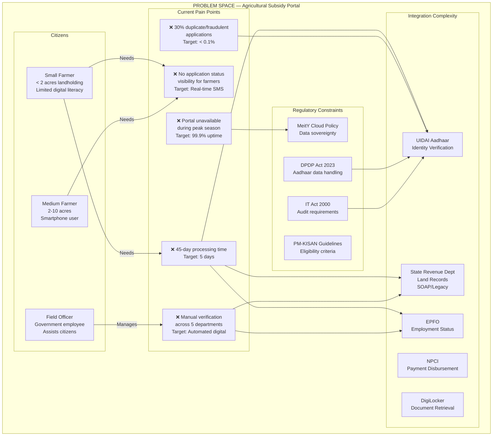
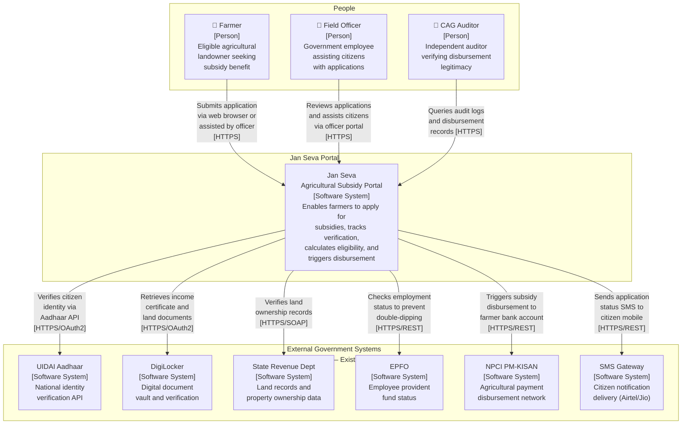
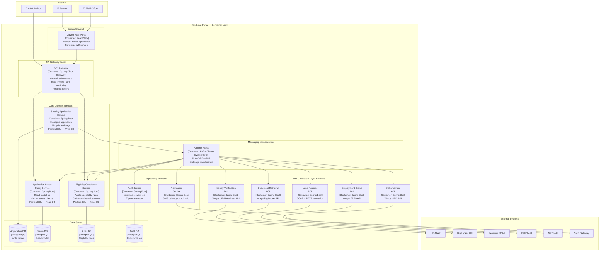
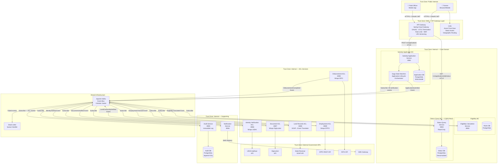
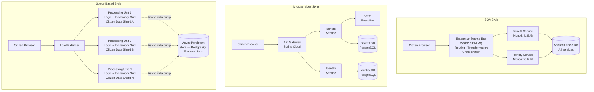
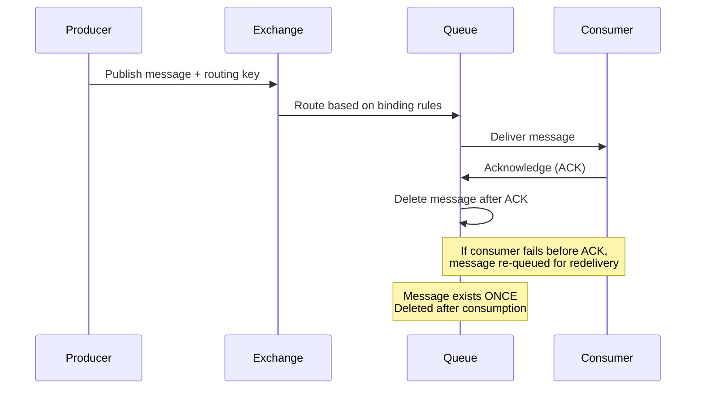
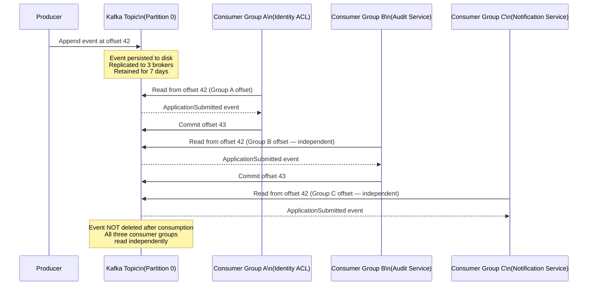
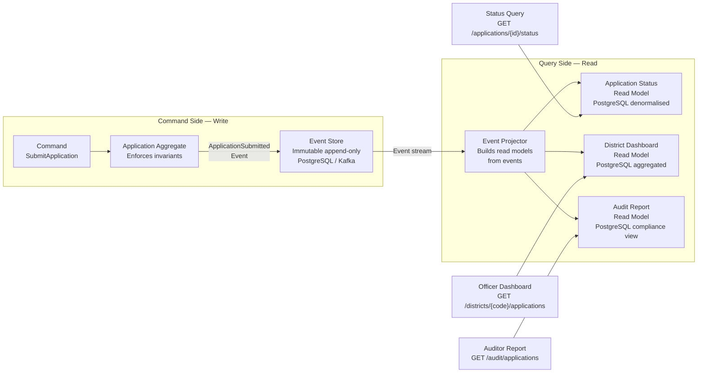
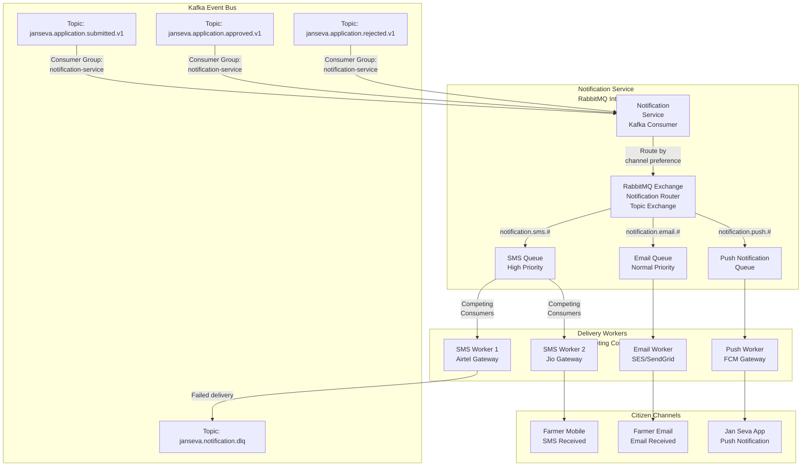

# DAY 3 — THEORY DOCUMENT
## Senior Engineer to Solution Architect Program
### Document Type: Trainer's Master Reference | Day 3 of 12

---

# Section 1: Capstone Project Ideation — Problem Definition, NFRs, and Scope

## 1.1 Topic Title and Learning Objectives

**Topic:** Framing a Government-Scale Architecture Problem for the Capstone Project


**Learning Objectives** — By the end of this section, participants will be able to:

1. **Formulate** a precise architecture problem statement that distinguishes between a business problem and an architecture problem
2. **Scope** a capstone project to a realistic 12-day deliverable without sacrificing architectural depth
3. **Derive** measurable NFRs from a vague government modernisation mandate
4. **Define** success criteria that are testable and architecturally traceable
5. **Apply** AI-assisted ideation (Copilot/ChatGPT) to accelerate problem framing with critical review

---

## 1.2 Concept Explanation

### The Analogy: The City Brief vs. The Building Brief

When a government commissions a new public hospital, two documents exist. The **City Brief** says: *"We need a 500-bed hospital in the northern district to serve 200,000 residents."* This is the business problem. The **Building Brief** says: *"The hospital requires 42 operating theatres, 8 ICUs, a trauma bay accessible within 90 seconds from the ambulance bay, earthquake-resistant structure to Zone 4 standards, and power backup for 72 hours."* This is the architecture problem statement.

Senior engineers are excellent at reading the Building Brief. What they struggle with — and what architects must master — is translating a City Brief (*"Modernise our legacy benefits system"*) into a Building Brief (*"Decompose the monolithic benefits eligibility engine into independently deployable bounded contexts, maintaining sub-2-second p95 response time under 500,000 concurrent users, with zero-downtime migration from Oracle to PostgreSQL, while complying with the DPDP Act 2023 audit requirements"*).

The capstone project is your Building Brief exercise. It must be:
- **Specific enough** to produce concrete architectural decisions
- **Complex enough** to require the patterns taught in this program
- **Bounded enough** to deliver in 12 days of workshop time
- **Real enough** to be defensible to a technical panel

---

### 1.2.1 What Makes a Good Capstone Problem?

A good capstone problem has five characteristics:

| Characteristic               | Description                                       | Indicator of Good Problem                                                               | Indicator of Poor Problem                   |
| ---------------------------- | ------------------------------------------------- | --------------------------------------------------------------------------------------- | ------------------------------------------- |
| **Architectural Complexity** | Requires non-trivial design decisions             | Multiple bounded contexts, cross-agency integration, regulatory constraints             | A single CRUD service with one database     |
| **NFR Richness**             | Multiple conflicting quality attributes           | Performance vs. security vs. maintainability tensions                                   | Only functional requirements                |
| **Scope Clarity**            | Boundaries are defined and defensible             | "The citizen-facing subsidy application portal — not the back-office processing system" | "The entire benefits ecosystem"             |
| **Government Relevance**     | Maps to a real problem in India, US, or Singapore | Digital identity, land records, benefits disbursement, health records                   | Generic e-commerce or social media          |
| **Technology Fit**           | Uses the program's tech stack naturally           | Spring Boot microservices, Kafka events, PostgreSQL, Docker/K8s                         | Requires SAP, COBOL, or mainframe expertise |

---

### 1.2.2 The Architecture Problem Statement Template

A well-formed architecture problem statement has six components. Use this template for the capstone:

```
CONTEXT:
[Describe the current state — what system exists, what organisation operates it,
what scale it operates at, what users it serves]

PROBLEM:
[Describe the specific pain points — performance issues, availability gaps,
compliance failures, scalability ceilings, maintainability costs]

CONSTRAINTS:
[List the non-negotiable constraints — regulatory requirements, budget limits,
technology mandates, timeline constraints, team capability constraints]

PROPOSED SCOPE:
[Define what IS in scope and what is explicitly OUT OF scope]

SUCCESS CRITERIA:
[State 3-5 measurable outcomes that define "done" for this architecture]

KEY NFRs:
[List 5-8 quality attributes with specific, measurable targets]
```

---

### 1.2.3 Reference Capstone Domains

Participants may select from — or derive inspiration from — the following reference government domains. Each is presented with a seed problem statement:

**Domain 1: Digital Identity and Citizen Authentication**
*(India — Aadhaar-inspired / Singapore — Singpass-inspired / US — Login.gov-inspired)*

> Seed: A state government's 14 citizen-facing portals each maintain their own citizen authentication system. Citizens have 14 separate usernames and passwords. The IT Department wants to implement a unified Single Sign-On (SSO) solution that federates all 14 portals behind a central identity provider.

**Domain 2: Land Records and Property Registration**
*(India — DILRMP / Karnataka Bhoomi-inspired)*

> Seed: A state revenue department operates a 15-year-old land records monolith with 80% uptime, no API interface, and schema-level integration with 6 other departments. The department needs to expose land records as a modern API while maintaining zero downtime for 8,000 daily transactions.

**Domain 3: Benefits Eligibility and Disbursement**
*(India — PM-KISAN / US — SNAP / Singapore — ComCare-inspired)*

> Seed: An agricultural benefits portal processes 2 million applications per year across 12 states. The current system requires 45 days to process a single application due to manual verification across 5 government departments. The mandate is to reduce processing time to 5 days through digital verification integration.

**Domain 4: Health Records and Inter-Hospital Data Exchange**
*(India — ABDM / US — HL7 FHIR / Singapore — HealthHub-inspired)*

> Seed: A national health authority needs to enable secure, consent-based sharing of patient health records between 3,000 public and private hospitals, with full audit compliance under the relevant health data protection regulations.

**Domain 5: Public Procurement and Vendor Management**
*(India — GeM / US — SAM.gov / Singapore — GeBIZ-inspired)*

> Seed: A government procurement portal processes 500,000 purchase orders per year from 50,000 registered vendors. The portal has a monolithic architecture with 4-hour nightly maintenance windows that violate the SLA committed to vendors.

---

### 1.2.4 NFR Derivation from Government Mandates

The most common source of NFRs in government architecture is not the technical team — it is the regulatory and policy framework. Architects must read policy documents the same way engineers read technical specifications.

**Mapping from Policy to NFR (India Example):**

| Policy / Regulation                      | Specific Mandate                                                                 | Derived NFR                   | Measurable Target                                                                                                                              |
| ---------------------------------------- | -------------------------------------------------------------------------------- | ----------------------------- | ---------------------------------------------------------------------------------------------------------------------------------------------- |
| DPDP Act 2023, Section 8                 | Personal data must be processed only for the specified purpose                   | **Data Minimisation**         | API responses must not include personal data fields not required by the consumer's declared purpose. Automated compliance scan in CI pipeline. |
| DPDP Act 2023, Section 12                | Data fiduciary must respond to data principal's rights request within 72 hours   | **Responsiveness**            | Citizen data deletion/export request processed and confirmed within 24 hours (system SLA, 48-hour buffer to 72-hour regulatory deadline)       |
| NIC API Security Guidelines, Section 4.3 | All government APIs must implement OAuth2/OIDC                                   | **Security — Authentication** | Zero unauthenticated API endpoints in production. Verified by automated security gate in CI/CD                                                 |
| MeitY Cloud Policy, Section 6            | Sensitive government data must be stored in MeitY-empanelled cloud or on-premise | **Data Sovereignty**          | No citizen PII stored outside MeitY-empanelled infrastructure. Verified by infrastructure compliance scan                                      |
| IT Act 2000, Section 43A                 | Reasonable security practices for sensitive personal data                        | **Security — Encryption**     | All PII encrypted at rest (AES-256) and in transit (TLS 1.3). Verified by quarterly security audit                                             |

**Mapping from Policy to NFR (US Example):**

| Policy / Regulation              | Specific Mandate                                           | Derived NFR          | Measurable Target                                                                              |
| -------------------------------- | ---------------------------------------------------------- | -------------------- | ---------------------------------------------------------------------------------------------- |
| FedRAMP Moderate                 | Cloud services must meet NIST SP 800-53 Moderate baseline  | **Security**         | All cloud components FedRAMP Moderate authorised or operating under ATO (Authority to Operate) |
| Section 508 (Rehabilitation Act) | Federal web applications must be accessible                | **Accessibility**    | WCAG 2.1 AA compliance for all citizen-facing interfaces. Automated scan + manual audit        |
| OMB M-19-17                      | APIs must be designed per US Digital Services standards    | **Interoperability** | OpenAPI 3.1 spec for all public APIs published on api.data.gov                                 |
| FISMA                            | Federal information systems must implement risk management | **Security**         | Annual FISMA assessment with no High findings outstanding > 30 days                            |

**Mapping from Policy to NFR (Singapore Example):**

| Policy / Regulation        | Specific Mandate                                                            | Derived NFR                   | Measurable Target                                                                        |
| -------------------------- | --------------------------------------------------------------------------- | ----------------------------- | ---------------------------------------------------------------------------------------- |
| IM8 (Instruction Manual 8) | All government systems classified Restricted or above must implement MFA    | **Security — Authentication** | MFA enforced for all officer-facing interfaces. Citizen-facing: risk-based MFA           |
| PDPA 2012 (amended 2020)   | Mandatory data breach notification within 3 days if significant harm likely | **Observability**             | Automated PII data access anomaly detection with alert within 1 hour of breach detection |
| GovTech DevSecOps Playbook | SAST, DAST, and SCA must be integrated into CI/CD for all GovTech products  | **Security — SDLC**           | CI pipeline blocks merge on any Critical SAST finding. SCA blocks on any Critical CVE    |
| APEX API Standards         | All WOG APIs must include rate limiting, authentication, and API versioning | **Interoperability**          | All APIs published to APEX with rate limits defined, OAuth2 enforced, URI versioning     |

---

### 1.2.5 Scoping Heuristics for the Capstone

The most common mistake in capstone projects is scope creep — trying to architect the entire ecosystem. Use these heuristics to scope correctly:

**The "One Citizen Journey" Rule:**
Scope the capstone to deliver complete architectural coverage of ONE end-to-end citizen journey. For example: "A farmer applies for agricultural subsidy and receives payment" — not "all government benefits for all citizen types."

**The "Three Bounded Context" Rule:**
A 12-day capstone can deeply explore a maximum of 3 bounded contexts. More than 3 = surface-level coverage. Fewer than 2 = insufficient complexity to demonstrate architecture skills.

**The "Five NFR" Rule:**
Identify 5-8 NFRs. Fewer than 5 = the system is too simple. More than 8 = you are cataloguing, not prioritising. For each NFR, define a measurable target and identify the architectural mechanism that addresses it.

**The "Known Unknown" Boundary:**
Explicitly state what you are ASSUMING and what you are explicitly NOT solving. "We assume the UIDAI Aadhaar API is available and reliable — we do not architect a fallback identity provider for this capstone." This demonstrates architectural maturity — architects know what is out of scope.

---

### 1.2.6 AI-Assisted Problem Framing

**Copilot/ChatGPT Prompt Templates for Capstone Ideation:**

**Prompt 1 — Problem Elaboration:**
```
I am designing a capstone architecture project for a government digital transformation 
scenario. The domain is: [INSERT YOUR DOMAIN — e.g., "agricultural subsidy disbursement 
in India"]. The system currently serves [INSERT SCALE — e.g., "2 million farmers annually"]. 
The key pain points are [INSERT PAIN POINTS — e.g., "45-day processing time, manual 
verification, no API integration"].

Generate:
1. A precise architecture problem statement using the Context/Problem/Constraints/
   Scope/Success Criteria/NFRs format
2. 8 specific, measurable NFRs with regulatory justification from India's IT Act, 
   DPDP Act 2023, and MeitY policies
3. 3 candidate bounded contexts with their aggregate roots
4. 2 architectural risks that are non-obvious

Review the output critically — verify regulatory references are accurate, 
flag any invented statistics.
```

**Prompt 2 — NFR Conflict Detection:**
```
I have the following NFRs for a government citizen portal:
[LIST YOUR NFRs]

Identify ALL conflicts between these NFRs (e.g., security controls that 
reduce performance, auditability requirements that increase storage costs).
For each conflict, suggest an architectural mechanism that provides an 
acceptable balance, and indicate which NFR should take precedence 
in a government context and why.
```

**Prompt 3 — Scope Boundary Validation:**
```
I have scoped my capstone to: [DESCRIBE YOUR SCOPE]

Challenge this scope. Identify:
1. Hidden dependencies I have not accounted for
2. NFRs that make the scope larger than I think
3. Components I have included that could be out of scope
4. Whether this is achievable in 12 workshop days at HLD level

Be direct and specific. Do not just agree with my scoping.
```

> **Architect's Note:** AI-generated problem statements often include invented statistics (e.g., "INR 450 crore processing cost") presented as facts. Always verify regulatory references independently. Use AI output as a structured STARTING POINT, not as an authoritative source. The critical review of AI output is itself an architectural skill.

---

## 1.3 High-Level Design: Capstone Reference Architecture — Problem Space Map

The following diagram represents the PROBLEM SPACE (not the solution) for the reference capstone domain — the Jan Seva Agricultural Subsidy Portal. This is the input to the architecture process, not the output.



> **Architect's Note:** This is a PROBLEM diagram — it shows pain, constraints, and complexity. Solution architects spend more time understanding the problem space than designing solutions. A solution designed without deep problem understanding solves the wrong problem elegantly.

---

## 1.4 Design Rationale: Capstone Scoping Trade-offs

| Scoping Decision    | Broader Scope                                      | Narrower Scope                                               |
| ------------------- | -------------------------------------------------- | ------------------------------------------------------------ |
| **Coverage**        | More comprehensive; reflects real-world complexity | More depth per bounded context; better architectural quality |
| **Risk**            | Higher risk of surface-level treatment             | Lower risk; every decision can be fully justified            |
| **Demonstrability** | Harder to demo — too many moving parts             | Easier to demo; every component has a running lab            |
| **Realism**         | More realistic to actual government projects       | May feel like a simplified toy problem                       |
| **Recommendation**  | Appropriate for team-based capstones (4+ people)   | Appropriate for individual capstones                         |

> **Trade-off Alert:** `[Breadth of Coverage] vs [Depth of Architectural Justification]` — In a 12-day program, choose depth. A shallow architecture of 10 services is less impressive than a deep, fully justified architecture of 3 services with complete ADRs, NFR traceability, and running demonstrations.

---

## 1.5 Implementation Walkthrough — Capstone Problem Statement (Reference Example)

The following is a complete, reference-quality capstone problem statement using the template from Section 1.2.2. Participants use this as a model — not a copy.

```
CAPSTONE PROBLEM STATEMENT — JAN SEVA AGRICULTURAL SUBSIDY PORTAL
Version: 1.0 | Date: [Workshop Day 3]
Author: [Participant Name] | Reviewer: [Peer Name]

═══════════════════════════════════════════════════════════════

CONTEXT:
The Ministry of Agriculture operates the PM-KISAN benefit scheme serving
50 million eligible farmers across 12 states. The current portal is a Java
EE 6 monolith deployed on-premise at NIC Delhi with a single Oracle 11g
database. The portal processes approximately 2 million new applications
per year with a peak load of 50,000 concurrent users during the Kharif
registration window (June-July).

PROBLEM:
1. Processing time averages 45 days due to serial manual verification
   across 5 government departments (UIDAI, State Revenue, EPFO, DigiLocker,
   NPCI). Target: 5 days maximum.
2. Portal availability is 94% annually (legacy hardware failures, planned
   maintenance windows). Violates the committed SLA of 99.9%.
3. An estimated 8% of applications are duplicate or fraudulent, costing
   approximately INR 340 crore annually (hypothetical estimate).
4. No real-time application status visibility — farmers call helplines
   generating 500,000 avoidable support calls per year.
5. Schema changes require 6-month coordination across 5 departments —
   new eligibility criteria cannot be implemented within a policy cycle.

CONSTRAINTS:
- All citizen personal data must be stored in MeitY-empanelled infrastructure
  (data sovereignty constraint)
- Aadhaar-based verification is mandatory (IT Act / UIDAI mandate)
- Zero downtime migration — portal must remain available during transition
- DPDP Act 2023 compliance mandatory from day 1 of new system
- Existing field officers (65,000 across 12 states) cannot be retrained
  — new system must be backward-compatible with existing field officer workflows

PROPOSED SCOPE:
IN SCOPE:
- Citizen subsidy application submission (web + mobile-responsive)
- Automated multi-agency digital verification (UIDAI, State Revenue, DigiLocker)
- Eligibility calculation engine
- Real-time application status notifications (SMS)
- Officer-facing application review dashboard
- Audit and compliance reporting

OUT OF SCOPE (explicitly):
- Back-office disbursement processing (NPCI integration — referenced but not designed)
- Fraud analytics and ML-based duplicate detection (referenced as future phase)
- Field officer mobile app (referenced, not designed in this capstone)
- Grievance redressal system
- Multi-language support (assumed available via browser/OS translation)

SUCCESS CRITERIA:
SC-1: Application submission to first status update: < 24 hours
      (Current: no update until 45-day decision)
SC-2: p95 API response time for application submission: < 2 seconds
      (Current: 8-12 seconds during peak)
SC-3: Portal availability during Kharif peak: > 99.9%
      (Current: 94%)
SC-4: Duplicate application detection rate: > 99%
      (Current: estimated 8% fraud — Aadhaar deduplication achieves >99%)
SC-5: Schema change deployment time: < 2 weeks
      (Current: 6 months)

KEY NFRs:
NFR-01: Performance — p95 < 2s submission, p95 < 500ms status check
NFR-02: Availability — 99.9% uptime (< 8.7 hours downtime/year)
NFR-03: Scalability — Handle 2x peak load (100,000 concurrent users)
         without manual intervention (auto-scaling)
NFR-04: Security — DPDP Act 2023 compliant; OAuth2/OIDC; MFA for officers
NFR-05: Auditability — Every state change logged immutably;
         7-year audit retention (IT Act 2000)
NFR-06: Maintainability — Schema changes deployable in < 2 weeks;
         independent bounded context deployments
NFR-07: Interoperability — OpenAPI 3.1 specs for all APIs;
         AsyncAPI 2.6 for all events; NIC API standards compliant
NFR-08: Data Sovereignty — All PII stored in MeitY-empanelled infrastructure;
         no PII in logs or event payloads beyond necessity
```

---

## 1.6 Real-World Case Study: India's DigiLocker Architecture Problem Framing

**Context:** DigiLocker (launched 2015, operated by MeitY) is a cloud-based document wallet allowing citizens to store and share verified digital copies of government-issued documents. By 2023, DigiLocker had over 180 million registered users and stored over 6 billion documents (publicly reported figures).

**The Architecture Problem That Had to Be Solved (Illustrative):**

When DigiLocker was initially scoped, the architecture team faced the classic government capstone problem: the mandate was broad ("give every Indian citizen a digital document wallet") but the architecture problem had to be specific.

The key scoping decisions that shaped the architecture:

1. **Document storage vs. document verification:** DigiLocker chose to store document REFERENCES (pointers to issuer databases) rather than documents themselves. This reduced storage cost by ~90% and kept data sovereignty at the issuing authority, not a central MeitY server. A different scoping decision would have produced a radically different architecture.

2. **Citizen-pull vs. government-push:** DigiLocker defined the primary user journey as citizen-initiated document retrieval ("pull"), not government-initiated document delivery ("push"). This shaped the API design — APIs are citizen-authenticated (OAuth2 PKCE), not government-authenticated.

3. **Federation boundary:** DigiLocker explicitly scoped OUT the verification logic for each document type. It provides a standard interface for issuers to connect. Each issuing department manages its own verification. This produced an Open Host Service architecture — DigiLocker is the OHS; issuing departments are conformist consumers.

**Lesson for Capstone Scoping:**
> The architecture problem statement IS an architectural decision. How you frame the problem determines what solutions are possible. DigiLocker's decision to store references (not documents) is not documented in any design document — it is embedded in the problem statement.

---

## 1.7 Food for Thought — Capstone Ideation

> **Provocation:** In his book "The Design of Everyday Things," Don Norman argues that most design failures are not failures of execution — they are failures of problem definition. The designer solved the wrong problem brilliantly.
>
> In architecture, the equivalent failure is: building a highly available, horizontally scalable, event-driven microservices platform for a workload that serves 500 users and changes once a year. The architecture is correct. The problem framing was wrong.
>
> Research prompt for Copilot/ChatGPT: *"What is 'problem-solution fit' in software architecture? Give three examples of government IT projects where the architecture was technically sound but the problem was framed incorrectly — resulting in systems that solved the wrong problem. What process would have caught the misframing earlier?"*
>
> Weekend challenge: Find one government IT project failure report from India (CAG audit report), the US (GAO report), or Singapore (equivalent parliamentary report). Identify whether the failure was a problem-framing failure, an execution failure, or an architecture failure. The distinction matters.

---

## 1.8 Questionnaire — Section 1

**Conceptual Questions**

1. What is the difference between a business problem statement and an architecture problem statement? Give an example of each for the same government scenario (e.g., benefits portal modernisation).

2. What are the six components of the Architecture Problem Statement template introduced in this section? For each component, explain what information it captures and why that information is architecturally significant.

3. What is the "One Citizen Journey Rule" for capstone scoping? Why is scoping to a single citizen journey more appropriate than scoping to an entire government department's digital needs?

**Application Questions**

4. A government team presents this problem statement: *"We need to modernise our legacy HR system."* Using the Architecture Problem Statement template, rewrite this as a well-formed architecture problem statement. Make reasonable assumptions about scale, constraints, and success criteria.

5. Given the following mandate from India's DPDP Act 2023: *"Data fiduciaries must implement appropriate technical and organisational measures to ensure the security of personal data."* Derive TWO specific, measurable NFRs with architectural mechanisms that satisfy this mandate.

6. A capstone team wants to include all of the following in their scope: citizen registration, benefit eligibility calculation, payment disbursement, fraud detection, grievance redressal, officer training portal, and analytics dashboard. Apply the scoping heuristics from Section 1.2.5 to reduce this to an appropriate capstone scope. Justify your decisions.

**Analysis Questions**

7. Compare two approaches to capstone scoping: (a) shallow coverage of 8 microservices with basic HLD diagrams, versus (b) deep coverage of 3 bounded contexts with complete ADRs, OpenAPI specs, working code, and ATAM analysis. Analyse the trade-offs. Which approach better demonstrates solution architect capability and why?

8. AI tools (Copilot/ChatGPT) can generate a complete architecture problem statement in 30 seconds. Analyse the risks of using AI-generated problem statements without critical review. What specific types of errors or hallucinations are most likely? How would a competent architect validate the AI output?

**Scenario-Based Questions**

9. You are the lead architect for Singapore's SkillsFuture Credit system modernisation. The Minister's office has issued this mandate: *"Every Singapore citizen should be able to claim their SkillsFuture credits from any approved training provider within 24 hours of course completion."* Derive: (a) the architecture problem statement, (b) five NFRs with measurable targets, (c) two explicit out-of-scope items, and (d) two success criteria. Reference Singapore's PDPA and IM8 as relevant constraints.

10. A US federal agency (hypothetical) runs a benefits eligibility portal that processes 10 million applications per year. The current architecture has 99.2% availability. The agency wants to achieve 99.99% availability (FedRAMP High). Calculate the difference in allowed downtime between 99.2% and 99.99% annually. What architectural changes would be required to bridge this gap? Is 99.99% the right target for a benefits portal? Justify your answer.

**Answer Key — Section 1**

| Q   | Answer Summary                                                                                                                                                                                                                                                                                                                                                                                                                                                                                                                                                                                                                                                                                                                                                                                                                                                                                |
| --- | --------------------------------------------------------------------------------------------------------------------------------------------------------------------------------------------------------------------------------------------------------------------------------------------------------------------------------------------------------------------------------------------------------------------------------------------------------------------------------------------------------------------------------------------------------------------------------------------------------------------------------------------------------------------------------------------------------------------------------------------------------------------------------------------------------------------------------------------------------------------------------------------- |
| 1   | Business problem: "Our benefits processing takes 45 days and farmers are frustrated." Architecture problem: "The serial synchronous integration with 5 government APIs produces p95 latency of 4.6 seconds; the monolithic deployment model creates a single point of failure; and the shared Oracle schema prevents independent schema evolution. We need an event-driven, bounded-context decomposition that reduces processing to 5 days while achieving 99.9% availability." The difference: the architecture problem statement specifies the measurable gap and the class of solution.                                                                                                                                                                                                                                                                                                   |
| 2   | Six components: (1) Context — current state, scale, users, technology; provides baseline for "how far we need to go." (2) Problem — specific pain points with measurable indicators; prevents vague problem statements. (3) Constraints — non-negotiable boundaries; prevents solutions that cannot be deployed. (4) Scope — in/out explicit list; prevents scope creep and false assumptions. (5) Success Criteria — measurable outcomes defining done; prevents "good enough" disputes. (6) NFRs — quality attribute targets with architectural mechanisms; ensures NFRs drive design, not afterthoughts.                                                                                                                                                                                                                                                                                   |
| 3   | One citizen journey ensures: (a) architectural decisions can be traced end-to-end; (b) the capstone is demonstrable — one complete flow can be shown running; (c) depth is achievable in 12 days; (d) all architectural patterns interact naturally within one journey. Scoping to an entire department creates a catalogue of services without demonstrable depth — the capstone becomes a slide deck, not an architecture.                                                                                                                                                                                                                                                                                                                                                                                                                                                                  |
| 4   | Model answer: Context: Government HR department manages 50,000 employee records on PeopleSoft 8.9 (2008 vintage). Problem: 3-hour payroll run blocks system for all users; schema changes take 9 months due to vendor lock-in; no API interface for integration with Finance system. Constraints: Payroll regulations, no data migration downtime, government procurement rules. Scope: Payroll processing and leave management only. Success Criteria: Payroll run < 30 minutes; schema changes in < 4 weeks; Finance integration via OpenAPI. NFRs: Performance, Availability, Maintainability, Security, Auditability.                                                                                                                                                                                                                                                                     |
| 5   | NFR 1: Encryption — All personal data fields (name, Aadhaar, address, financial data) encrypted at rest using AES-256; in transit using TLS 1.3 minimum. Mechanism: Column-level encryption in PostgreSQL; TLS termination at API Gateway. Verified by quarterly security scan. NFR 2: Access Control — Personal data API endpoints accessible only to authenticated clients with explicit data-purpose scope in OAuth2 token. Mechanism: OAuth2 scope enforcement at API Gateway; purpose-limitation fields in access token; no wildcard scopes. Verified by automated security gate in CI/CD pipeline.                                                                                                                                                                                                                                                                                      |
| 6   | Apply "Three Bounded Context Rule": Keep eligibility calculation + citizen registration (core domain — directly delivers the citizen value). Remove fraud detection (supporting domain — can be added later as event subscriber). Remove grievance redressal (separate citizen journey). Remove officer training portal (internal HR — different department). Remove analytics dashboard (generic domain — use existing BI tool). Remove disbursement (complex integration — reference but do not design). Result: 2-3 bounded contexts, 1 citizen journey.                                                                                                                                                                                                                                                                                                                                   |
| 7   | Shallow 8-service approach demonstrates: breadth, some pattern knowledge, diagram skills. Deep 3-context approach demonstrates: architectural judgment (why these boundaries?), NFR traceability (how does this design address NFR-02?), trade-off analysis (ATAM), implementation credibility (working code), governance (ADRs). Solution architects are evaluated on judgment and justification — not on the number of boxes in a diagram. Deep approach is definitively more valuable.                                                                                                                                                                                                                                                                                                                                                                                                     |
| 8   | AI hallucination risks: (1) Invented statistics — "45% of Indian farmers lack smartphones" presented as fact (unverified). (2) Incorrect regulatory references — citing clauses that do not exist in DPDP Act. (3) Technology anachronism — recommending deprecated frameworks. (4) Missing domain context — generic NFRs that miss government-specific constraints. (5) Scope inflation — AI tends to include everything, not scope correctly. Validation: fact-check all statistics against primary sources; verify every regulatory citation against the actual Act text; have a domain expert review the problem framing; use AI output as a starting checklist, not a final statement.                                                                                                                                                                                                   |
| 9   | (a) Problem statement: Context: 600,000 active SkillsFuture Credit holders; current claim process takes 3-5 days (manual provider reconciliation). Problem: Processing delay prevents timely upskilling; providers wait for payment before issuing certificates; 15% claim abandonment rate. Constraints: PDPA data minimisation; IM8 security controls; MAS payment regulations for credit disbursement. Scope: Claim submission, training provider verification, credit disbursement — not credit top-up or training marketplace. (b) NFRs: Performance (< 24h end-to-end), Availability (99.9%), Security (PDPA + IM8 MFA), Auditability (7-year retention), Interoperability (APEX API standards). (c) Out of scope: Credit top-up policy decisions; training quality assessment. (d) Success criteria: 95% of claims processed < 24h; zero manual reconciliation for approved providers. |
| 10  | 99.2% = 70.1 hours downtime/year. 99.99% = 52.6 minutes downtime/year. Difference: 69.5 hours. Architectural changes required: Active-active multi-region deployment; zero-downtime database (CockroachDB or Aurora Global); chaos engineering; RTO < 1 minute; RPO = 0. Is 99.99% right? For a benefits portal: probably not. 99.99% costs 10-20x more than 99.9%. Benefits portals can tolerate 1-2 hour maintenance windows with advance notice. 99.9% (8.7 hours/year) is appropriate; 99.95% is achievable at reasonable cost. 99.99% is appropriate for financial settlement systems or life-critical infrastructure — not a benefits application portal. The architect must challenge the requirement, not just implement it.                                                                                                                                                          |

---

# Section 2: Stakeholder Mapping and Architecture Vision

## 2.1 Topic Title and Learning Objectives

**Topic:** Identifying Stakeholders, Mapping Concerns to Quality Attributes, and Crafting the Architecture Vision


**Learning Objectives** — By the end of this section, participants will be able to:

1. **Identify** all relevant stakeholders in a government system — including non-obvious ones — using a structured stakeholder taxonomy
2. **Map** each stakeholder's concerns to specific architectural quality attributes using a Concern-to-NFR traceability matrix
3. **Craft** an Architecture Vision statement that communicates the proposed solution to both technical and non-technical audiences
4. **Produce** a C4 Level 1 (System Context) diagram that represents the architecture vision visually
5. **Evaluate** stakeholder conflicts and apply architectural prioritisation to resolve competing concerns

---

## 2.2 Concept Explanation

### The Analogy: The Hospital Board Meeting

Imagine you are the architect presenting plans for a new government hospital. Around the table sit: the Health Minister (wants political visibility — a modern, impressive building), the Chief Medical Officer (wants clinical efficiency — operating theatres close to ICUs), the Head of Finance (wants cost control — no gold-plating), the Head of IT (wants integration with the existing patient management system), the Nurses Union representative (wants adequate rest areas and ergonomic workstations), the patient advocacy group (wants privacy in consultation rooms and accessible corridors), and the local municipality (wants the building to not exceed the zoning height limit).

Every stakeholder has legitimate concerns. Every concern implies an architectural constraint or quality attribute. The architect who only designs for the Health Minister's visibility requirement will produce a beautiful building that the nurses cannot work in and the patients cannot navigate.

**Architecture without stakeholder mapping is architecture for the wrong audience.**

In government IT systems, the stakeholder landscape is even more complex than a hospital — there are citizens, officers, policymakers, regulators, auditors, integration partners, procurement officers, security reviewers, and the developers who will maintain the system for the next 20 years. Every one of them has a legitimate architectural concern.

---

### 2.2.1 Stakeholder Taxonomy for Government Systems

Government IT systems have a characteristic stakeholder structure that differs from commercial software. Understanding this taxonomy prevents the most common mistake: designing only for the visible end-user while ignoring the structural stakeholders who determine whether the system is deployed, maintained, and trusted.

**Level 1: Direct Users**

These are the people who interact with the system interface directly.

| Stakeholder               | Role                                    | Primary System Concern                            |
| ------------------------- | --------------------------------------- | ------------------------------------------------- |
| **Citizens**              | Recipients of government services       | Ease of use, response time, availability, privacy |
| **Field Officers**        | Government employees assisting citizens | Reliability, offline capability, simple interface |
| **Back-Office Staff**     | Processing and approval personnel       | Throughput, data accuracy, audit visibility       |
| **System Administrators** | Technical operations                    | Monitorability, deployability, incident response  |

**Level 2: Structural Stakeholders**

These are the people who determine system viability but do not use it directly.

| Stakeholder                           | Role                                  | Primary System Concern                                                  |
| ------------------------------------- | ------------------------------------- | ----------------------------------------------------------------------- |
| **Policy Makers / Minister's Office** | Mandate the system's existence        | Political visibility, rollout speed, citizen adoption metrics           |
| **Finance / Treasury**                | Fund the system                       | Total Cost of Ownership (TCO), operational cost, procurement compliance |
| **Legal / Compliance**                | Govern regulatory adherence           | Auditability, data protection, regulatory compliance proof              |
| **Security / CISO**                   | Protect government data               | Zero-trust, encryption, access control, breach detection                |
| **Auditors (CAG/GAO)**                | Independently verify system integrity | Immutable audit logs, financial traceability, access records            |
| **Procurement / Tender Committee**    | Approve technology choices            | Standards compliance, vendor neutrality, open-source policy             |

**Level 3: Integration Stakeholders**

These are organisations and systems that the new system must interact with.

| Stakeholder                | Role                             | Primary System Concern                                              |
| -------------------------- | -------------------------------- | ------------------------------------------------------------------- |
| **Upstream API Providers** | UIDAI, DigiLocker, NPCI          | API contract stability, rate limit headroom, backward compatibility |
| **Downstream Consumers**   | State portals, reporting systems | API availability, versioning, data format consistency               |
| **Data Partners**          | Other ministry databases         | Data sharing agreements, schema compatibility, consent management   |

**Level 4: Future Stakeholders**

These are often entirely forgotten — the people who will work with the system after the project team has moved on.

| Stakeholder                   | Role                              | Primary System Concern                                          |
| ----------------------------- | --------------------------------- | --------------------------------------------------------------- |
| **Maintenance Team**          | Operates the system post-launch   | Code readability, documentation, runbook quality, observability |
| **Future Architects**         | Extends the system                | ADR quality, pattern consistency, extension points              |
| **Data Analysts**             | Derives insights from system data | Data model clarity, event schema richness, query performance    |
| **Incident Responders (SRE)** | Handles production failures       | Alerting quality, runbook completeness, rollback procedures     |

> **Architect's Note:** The single most underserved stakeholder in government IT projects is the Maintenance Team. A system built for the launch date is optimised for the development team's velocity. A system built for a 15-year operational life is optimised for the maintenance team's clarity. Government systems typically run for 15-20+ years. Design for the maintainer.

---

### 2.2.2 Concern-to-NFR Mapping

Once stakeholders are identified, each stakeholder's concerns must be translated into architectural quality attributes (NFRs). This produces the **Concern Traceability Matrix** — the document that proves every architectural decision serves a real stakeholder need.

**Concern Traceability Matrix — Jan Seva Agricultural Subsidy Portal (Reference):**

| Stakeholder                      | Stated Concern                                             | Underlying Fear                                                | Derived NFR                                                                                   | Architectural Mechanism                                                        |
| -------------------------------- | ---------------------------------------------------------- | -------------------------------------------------------------- | --------------------------------------------------------------------------------------------- | ------------------------------------------------------------------------------ |
| Farmer (citizen)                 | "I don't know if my application went through"              | Loss of INR investment in application fee + documentation      | **Observability for Citizens**: Real-time status updates within 24 hours                      | Kafka event → Notification Service → SMS gateway                               |
| Field Officer                    | "The app doesn't work in the village — no internet"        | Cannot serve citizens in rural areas                           | **Offline Capability**: Core workflows functional without connectivity                        | PWA with IndexedDB local storage + sync on reconnect                           |
| Health Minister's Office         | "The media will ask how many farmers benefited this month" | Political embarrassment from low adoption                      | **Operational Metrics**: Daily dashboard of applications received, processed, and disbursed   | Prometheus + Grafana operational dashboard; daily digest report                |
| Finance Ministry                 | "This will cost more than budgeted"                        | Cost overrun leading to project cancellation                   | **TCO Optimisation**: Cloud-native horizontal scaling; pay-per-use model                      | Auto-scaling on Azure (HPA); PostgreSQL managed service                        |
| Legal/DPDP Officer               | "We will be held liable for Aadhaar misuse"                | Regulatory penalty under DPDP Act 2023                         | **Data Minimisation + Audit**: Aadhaar not persisted after verification; all access logged    | ACL pattern (Aadhaar used for lookup only); immutable Kafka audit topic        |
| CISO                             | "A breach will expose 50 million farmers' data"            | National security incident + ministerial accountability        | **Zero Trust + Encryption**: No implicit trust between services; PII encrypted at rest        | mTLS between services; AES-256 column encryption; RBAC enforcement             |
| CAG Auditor                      | "We need to verify every disbursement is legitimate"       | Audit qualification on ministry accounts                       | **Immutable Audit Trail**: Every state change logged with actor, timestamp, and data snapshot | Event Sourcing-style audit log; 7-year retention; tamper-evident               |
| Maintenance Team                 | "We inherited this code and cannot understand it"          | Inability to deliver new features; accumulating technical debt | **Maintainability**: Hexagonal architecture; comprehensive ADRs; runbooks for every component | Hexagonal package structure; ADR repository; Confluent Runbook template        |
| State Revenue Dept (Integration) | "Our SOAP API cannot change on short notice"               | Disruption to their operational system                         | **ACL + Versioning**: No direct dependency on Revenue SOAP schema                             | ACL service absorbs SOAP changes; Revenue SOAP schema never exposed beyond ACL |
| Future Architect                 | "I need to understand why decisions were made"             | Inability to safely extend the system                          | **Decision Traceability**: Every significant decision documented in an ADR                    | ADR repository with context, options, decision, and consequences               |

---

### 2.2.3 Stakeholder Conflict Resolution

Stakeholder concerns frequently conflict. The architect's role is not to satisfy every stakeholder completely — it is to make principled trade-offs and communicate them transparently.

**Common Conflicts in Government Systems:**

| Conflict                             | Stakeholder A                          | Stakeholder B                                 | Resolution Approach                                                                                                                                                                |
| ------------------------------------ | -------------------------------------- | --------------------------------------------- | ---------------------------------------------------------------------------------------------------------------------------------------------------------------------------------- |
| **Speed vs. Security**               | Policy makers want faster rollout      | CISO wants full security review before launch | Phased release: launch with core security controls; add advanced controls in subsequent phases. Document accepted risk in ADR.                                                     |
| **Openness vs. Privacy**             | Data analysts want full event payloads | Legal wants minimal data in event streams     | Separate event streams: operational events (minimal PII) for consumers; full-audit events (complete data) for compliance store with restricted access                              |
| **Availability vs. Cost**            | Citizens need 99.99% uptime            | Finance wants minimum infrastructure cost     | Justify 99.9% (not 99.99%) — calculate cost difference (typically 5-10x); present TCO analysis; 99.9% = 8.7 hours/year which is acceptable for a non-life-critical benefits portal |
| **Consistency vs. Performance**      | Auditors need strong consistency       | Citizens need fast response                   | CQRS: write path uses strong consistency (ACID transaction); read path uses eventual consistency (denormalised read model, sub-100ms response)                                     |
| **Vendor Independence vs. Features** | Procurement wants open-source only     | Developers want managed cloud services        | Kubernetes-native deployment with cloud-agnostic IaC (Terraform); use managed services where operational benefit outweighs lock-in risk; document vendor lock-in risks in ADRs     |

---

### 2.2.4 The Architecture Vision Statement

An **Architecture Vision** is a concise, stakeholder-appropriate description of the proposed solution. It serves two audiences simultaneously:

1. **Non-technical stakeholders** (Minister's office, Finance, Legal): What are we building, why, and what will it achieve?
2. **Technical stakeholders** (engineering teams, integration partners, future architects): What are the governing principles, key patterns, and major components?

**Architecture Vision Template:**

```
ARCHITECTURE VISION — [System Name]
Version: 1.0 | Date: [Date] | Author: [Architect Name]

ONE-LINE SUMMARY (for policy makers):
[The system] will [primary capability] for [primary user]
by [primary mechanism], achieving [key success metric].

GOVERNING PRINCIPLES (for all stakeholders):
1. [Principle 1 — e.g., "API-First: all capabilities exposed via documented APIs"]
2. [Principle 2 — e.g., "Security by Design: zero-trust between all services"]
3. [Principle 3 — e.g., "Data Minimisation: collect only what is necessary"]
4. [Principle 4 — e.g., "Observable by Default: every component monitored"]
5. [Principle 5 — e.g., "Evolutionary Architecture: bounded contexts allow independent evolution"]

WHAT WE ARE BUILDING (for technical stakeholders):
[2-3 sentences describing the primary architectural style, bounded contexts,
and integration patterns]

WHAT WE ARE NOT BUILDING (explicit exclusions):
[2-3 sentences on explicit out-of-scope items]

QUALITY ATTRIBUTE PRIORITIES (for architects and developers):
1. [Highest priority NFR] — because [business justification]
2. [Second priority NFR] — because [business justification]
3. [Third priority NFR] — because [business justification]
[Remaining NFRs listed]

KEY RISKS (for all stakeholders):
1. [Risk 1 — probability, impact, mitigation]
2. [Risk 2 — probability, impact, mitigation]
```

**Reference Architecture Vision — Jan Seva Portal:**

```
ARCHITECTURE VISION — Jan Seva Agricultural Subsidy Portal
Version: 1.0

ONE-LINE SUMMARY:
The Jan Seva Portal will enable India's 50 million eligible farmers to apply
for agricultural subsidies digitally and receive automated verification
decisions within 5 days — reducing the current 45-day manual process —
by decomposing the verification workflow into event-driven microservices
that coordinate with government APIs in parallel rather than serially.

GOVERNING PRINCIPLES:
1. API-First: Every capability exposed via OpenAPI 3.1 or AsyncAPI 2.6
   contracts before implementation begins
2. Event-Driven Integration: Cross-agency communication via domain events
   on a shared Kafka bus — no synchronous cross-service dependencies
3. Bounded Context Isolation: Each government agency integration wrapped
   in an Anti-Corruption Layer — external schema changes absorbed locally
4. Zero-Trust Security: mTLS between all services; OAuth2 for all APIs;
   Aadhaar data never persisted beyond the identity verification ACL
5. Design for the Maintainer: Hexagonal architecture throughout;
   ADR for every significant decision; runbook for every component

WHAT WE ARE BUILDING:
An event-driven microservices platform comprising 3 core bounded contexts
(Subsidy Application, Citizen Identity Verification, Eligibility Calculation)
supported by 5 Anti-Corruption Layer services (UIDAI, DigiLocker, State
Revenue, EPFO, NPCI), a real-time notification system, and an immutable
audit service — all deployed on Azure (MeitY-empanelled) using Docker and
Kubernetes, provisioned via Terraform.

WHAT WE ARE NOT BUILDING:
This capstone does not design the ML-based fraud detection system, the
field officer mobile application, the grievance redressal portal, or the
back-office financial reconciliation system. These are referenced as
integration points and future phases but not architecturally designed.

QUALITY ATTRIBUTE PRIORITIES:
1. Security / DPDP Compliance — because regulatory non-compliance is an
   existential risk to the programme
2. Availability (99.9%) — because farmer access during Kharif season
   is time-critical and politically sensitive
3. Performance (p95 < 2s submission) — because poor performance
   drives abandonment and helpline calls
4. Auditability — because CAG audit is mandatory and public
5. Maintainability — because the system will operate for 15+ years

KEY RISKS:
1. State Revenue SOAP API Reliability (High Probability, High Impact)
   Mitigation: ACL with 72-hour retry queue; grace period processing
2. DPDP Act 2023 Interpretation (Medium Probability, High Impact)
   Mitigation: Engage DPO (Data Protection Officer) before launch;
   architecture reviewed by legal counsel
3. Farmer Digital Literacy (High Probability, Medium Impact)
   Mitigation: Field officer-assisted application workflow; IVR fallback
```

---

### 2.2.5 The C4 Model for Architecture Communication

The **C4 Model** (developed by Simon Brown) is a hierarchical approach to software architecture documentation consisting of four levels of abstraction:

| Level     | Name           | Audience                         | Content                                                                       |
| --------- | -------------- | -------------------------------- | ----------------------------------------------------------------------------- |
| **C4-L1** | System Context | Anyone — including non-technical | The system, its users, and external systems it interacts with                 |
| **C4-L2** | Container      | Technical stakeholders           | The deployable units (services, databases, message brokers) inside the system |
| **C4-L3** | Component      | Developers                       | The major components inside a single container                                |
| **C4-L4** | Code           | Developers                       | Class-level detail — often auto-generated from code                           |

> **Architect's Note:** The C4 model is not a formal standard — it is a communication framework. Its power lies in the clarity of audience targeting. A C4-L1 diagram shown to a Finance Minister is appropriate; a C4-L4 class diagram is not. Solution architects must know WHICH diagram to show to WHICH audience and WHY.

**C4 Notation Conventions:**

| Element             | Representation                  | Description                                                    |
| ------------------- | ------------------------------- | -------------------------------------------------------------- |
| **Person**          | Stick figure or rounded box     | A human user of the system                                     |
| **Software System** | Large box                       | A system boundary — what we are building                       |
| **Container**       | Box within the system           | A deployable unit: service, database, message broker, frontend |
| **Component**       | Box within a container          | A major structural element within a container                  |
| **External System** | Box outside the system boundary | Third-party or other-team systems                              |
| **Relationship**    | Arrow with label                | An interaction: "Submits application via HTTPS"                |

---

## 2.3 High-Level Design: C4 Level 1 — System Context Diagram



---

## 2.4 High-Level Design: C4 Level 2 — Container Diagram



> **Architect's Note:** The C4-L2 Container Diagram is the most useful diagram in a solution architect's toolkit. It answers the question every stakeholder asks first: "What are the moving parts?" It is specific enough to guide technology decisions and team organisation, but abstract enough to be understood by non-developers. If you can only produce ONE diagram for a stakeholder review, produce C4-L2.

---

## 2.5 Design Rationale and Trade-off Analysis

### Trade-off: Stakeholder Mapping Depth vs. Delivery Speed

| Approach                                                 | Pros                                                                                    | Cons                                                                            | Appropriate When                                                                           |
| -------------------------------------------------------- | --------------------------------------------------------------------------------------- | ------------------------------------------------------------------------------- | ------------------------------------------------------------------------------------------ |
| **Deep stakeholder mapping** (2-3 day workshop)          | Complete concern coverage; no surprise requirements late in project; stakeholder buy-in | Time-consuming; requires scheduling domain experts                              | System lifetime > 5 years; regulatory environment; large number of integration partners    |
| **Lightweight stakeholder mapping** (half-day)           | Fast; sufficient for well-understood domains; agile-friendly                            | Risk of missing structural stakeholders (auditors, legal); late-stage surprises | Greenfield internal tool; small team; well-understood domain with no regulatory complexity |
| **Iterative stakeholder mapping** (1-2 hours per sprint) | Continuously updated; responsive to new stakeholders emerging                           | Requires discipline to maintain; incomplete at any given moment                 | Long-running programmes where stakeholder landscape evolves                                |

**For government systems:** Deep stakeholder mapping is always justified. The cost of discovering an auditor's requirement after the system is built (requiring architectural retrofitting of immutable audit logs) is orders of magnitude higher than the cost of the mapping workshop.

---

## 2.6 Real-World Case Study: US Healthcare.gov Launch Failure — A Stakeholder Mapping Lesson

**Context:** Healthcare.gov, the US federal health insurance exchange portal mandated by the Affordable Care Act, launched in October 2013. The launch was a widely documented failure — the site was effectively non-functional for the first month, serving approximately 6 users in the first 24 hours against a target of 250,000.

> **Note:** The Healthcare.gov failure is publicly documented in multiple Congressional hearings, GAO reports, and journalistic investigations. The following analysis draws on public record.

**What Happened — The Stakeholder Mapping Failure:**

The architectural failure was not primarily technical — it was a stakeholder mapping failure:

1. **Ignored Structural Stakeholder — the Integration Partner (CMS):** The Centers for Medicare and Medicaid Services (CMS) was both the client and the primary integration partner. The data hub connecting to 9 federal agencies (IRS, DHS, SSA, etc.) was treated as a dependency to be managed, not a stakeholder to be mapped. No single entity had architectural authority over the integration contracts.

2. **Missing Stakeholder — the Load Testing Team:** No stakeholder was assigned responsibility for end-to-end load testing until 2 weeks before launch. 500 simultaneous users caused complete failure — the system had never been tested beyond unit-level.

3. **Conflicting Stakeholder — Security vs. Schedule:** The CISO required security review before launch. The political calendar required October 1 launch. No architect had authority to resolve this conflict — it was escalated to political decision-makers who chose schedule over security review. The system launched with known security vulnerabilities.

4. **Forgotten Stakeholder — the Citizen:** The citizen-facing UX was tested with government employees (familiar with complex forms) rather than actual citizens (many with limited digital literacy). The UI was designed for the most technically sophisticated 10% of users.

**The Architectural Consequences:**
- System collapsed under load on launch day (Availability NFR not addressed)
- Security vulnerabilities required emergency patching during peak enrollment period
- 3 separate contractors built incompatible components with no shared API contract
- $630 million spent; emergency rescue contract awarded for $90 million additional

**Lessons for Government Architecture:**

1. **Every integration partner is a stakeholder with architectural power.** The federal data hub was an integration point treated as a black box — it should have been a stakeholder with defined API contracts, load commitments, and failure mode agreements.

2. **Security reviewers must be stakeholders, not gatekeepers.** When security is treated as a post-development gate rather than a design input, it becomes either a launch blocker or a skipped step — both are failures.

3. **The definition of "citizen stakeholder" must include the least digitally capable citizen, not the most.** NFRs derived from sophisticated users produce systems that serve only sophisticated users.

4. **Political timeline is a constraint, not an NFR.** When a political deadline overrides an availability NFR, the architect must document this explicitly as an accepted risk — and quantify the probability and cost of failure.

---

## 2.7 Food for Thought — Stakeholder Mapping

> **Provocation:** The C4 model has four levels. Most architects produce C4-L1 and C4-L2 and stop. Simon Brown, the creator of the C4 model, has observed that architects who cannot produce C4-L3 (component diagrams) for their own system often do not understand the system they are supposedly architecting.
>
> More provocatively: if you showed your C4-L1 diagram to the most junior developer on the team and the most senior minister in the relevant ministry, would both audiences understand it? If not — whose understanding failed, and why?
>
> Research prompt for Copilot/ChatGPT: *"What is the '4+1 architectural views model' proposed by Philippe Kruchten, and how does it compare to the C4 model? Which is more appropriate for a government system that needs to satisfy both technical (developer) and regulatory (auditor) stakeholders? Give a concrete example of a view from each model that would satisfy an auditor's concern."*
>
> Weekend challenge: Take any system you have worked on. Create a C4-L1 System Context diagram using Mermaid.js. Then show it to a non-technical colleague. Ask them to describe back to you what the system does, who uses it, and what external systems it connects to. If they cannot accurately describe it from the diagram alone, the diagram has failed — redesign it.

---

## 2.8 Questionnaire — Section 2

**Conceptual Questions**

1. What are the four levels of stakeholder taxonomy introduced in this section? Give one example of a stakeholder at each level for a government land records portal, and state their primary architectural concern.

2. What is the C4 Model and what problem does it solve in architecture communication? What are the four levels and what audience is each level appropriate for?

3. What is an Architecture Vision statement and how does it differ from an Architecture Decision Record (ADR)? When would you produce an Architecture Vision and when would you produce an ADR?

**Application Questions**

4. A government health portal has the following stakeholder conflicts: (a) The Health Minister wants real-time public dashboards showing patient counts by district — the CISO says this risks privacy by enabling inference attacks. (b) The Finance Ministry wants a single shared database to reduce infrastructure cost — the development team wants database-per-service for bounded context isolation. For each conflict, propose an architectural resolution that satisfies both stakeholders' core concerns.

5. Draw a C4 Level 1 System Context diagram (using Mermaid.js syntax) for Singapore's SkillsFuture Credit system. Include: the primary citizen user, training providers, the SkillsFuture system boundary, and at least three external systems it must integrate with. Add relationship labels describing the nature of each interaction.

6. Using the Architecture Vision template from Section 2.2.4, write a one-page Architecture Vision for US Login.gov (the federal single sign-on system). Include the one-line summary, five governing principles, what is being built, what is not being built, NFR priorities, and two key risks.

**Analysis Questions**

7. The Healthcare.gov case study identified four stakeholder mapping failures. Analyse each failure and state which stakeholder taxonomy level (Direct User, Structural, Integration, Future) each missing stakeholder belonged to. Then propose the specific process change that would have caught each missing stakeholder earlier.

8. A team argues: "We do not need formal stakeholder mapping — we will use agile user stories to discover stakeholder needs iteratively." Analyse this argument. What types of stakeholder concerns are well-captured by agile user stories, and what types are systematically missed? Give three examples of government-specific concerns that would not emerge from user story writing.

**Scenario-Based Questions**

9. You are presenting the Jan Seva Portal C4-L2 Container diagram to three different audiences in sequence: (a) the Finance Minister (15 minutes), (b) the CISO (30 minutes), (c) the lead developer of the State Revenue Department (60 minutes). For each audience, describe: which elements of the diagram you would emphasise, what questions you anticipate, and what additional diagrams (if any) you would add for that specific audience.

10. The Concern Traceability Matrix for the Jan Seva Portal shows that the "CAG Auditor" stakeholder requires an immutable audit trail with 7-year retention. The "Finance Ministry" stakeholder requires infrastructure cost minimisation. Analysing the storage cost of 7-year immutable audit retention for 50 million applications with an average of 10 events each (at approximately 1KB per event): calculate the storage requirement, estimate the cost on Azure (standard LRS storage, approximately $0.018/GB/month in India region), and propose an architecture that satisfies both stakeholders' concerns simultaneously.

**Answer Key — Section 2**

| Q   | Answer Summary                                                                                                                                                                                                                                                                                                                                                                                                                                                                                                                                                                                                                                                                                                                                                                                                                                                                                                                                                                                                                                                                                  |
| --- | ----------------------------------------------------------------------------------------------------------------------------------------------------------------------------------------------------------------------------------------------------------------------------------------------------------------------------------------------------------------------------------------------------------------------------------------------------------------------------------------------------------------------------------------------------------------------------------------------------------------------------------------------------------------------------------------------------------------------------------------------------------------------------------------------------------------------------------------------------------------------------------------------------------------------------------------------------------------------------------------------------------------------------------------------------------------------------------------------- |
| 1   | Level 1 Direct Users: Citizen (ease of use, response time), Land Officer (reliability, offline), Back-Office Staff (throughput), Admin (monitorability). Level 2 Structural: Minister (political visibility), Finance (TCO), Legal (regulatory compliance), CISO (security), Auditor (immutable logs), Procurement (open standards). Level 3 Integration: State Revenue Dept (API contract stability), downstream reporting systems (data format). Level 4 Future: Maintenance team (code clarity, runbooks), future architects (ADR quality), incident responders (alerting).                                                                                                                                                                                                                                                                                                                                                                                                                                                                                                                  |
| 2   | C4 Model: hierarchical architecture documentation framework (Simon Brown). Solves: different stakeholders need different abstraction levels — one diagram cannot serve all audiences. Four levels: L1 System Context (anyone, including non-technical); L2 Container (technical stakeholders, shows deployable units); L3 Component (developers, shows internal structure); L4 Code (developers, class-level detail).                                                                                                                                                                                                                                                                                                                                                                                                                                                                                                                                                                                                                                                                           |
| 3   | Architecture Vision: high-level document describing WHAT will be built, for WHOM, following WHICH principles — produced BEFORE design begins; audience includes non-technical stakeholders. ADR: records a SPECIFIC decision with context, options considered, decision made, and consequences — produced AS design proceeds; audience is primarily technical. Vision sets direction; ADRs record the specific choices made while following that direction.                                                                                                                                                                                                                                                                                                                                                                                                                                                                                                                                                                                                                                     |
| 4   | (a) Real-time public health dashboard vs. privacy: aggregate-level statistics only (district totals, no individual records); k-anonymity enforcement (suppress cells with fewer than 10 patients); differential privacy for trend data; separate public dashboard fed from pre-aggregated, de-identified read models — not from raw patient data. (b) Shared database vs. database-per-service: shared physical PostgreSQL instance (satisfies cost concern) with SEPARATE schemas per bounded context and separate database users with schema-level access control (satisfies isolation concern); plan for physical separation as traffic grows.                                                                                                                                                                                                                                                                                                                                                                                                                                               |
| 5   | Mermaid C4-L1 for SkillsFuture: Persons: Singapore Citizen (claims credits), Training Provider (submits course completion). System boundary: SkillsFuture Credit System. External systems: Singpass (citizen authentication, HTTPS/OIDC), SSG Skills Framework API (approved course registry, HTTPS), PayNow/FAST (credit disbursement, HTTPS), APEX (WOG API gateway, HTTPS). Relationships: Citizen → System "Claims credits via web portal [HTTPS]"; System → Singpass "Authenticates citizen identity [OIDC/OAuth2]"; System → SSG API "Validates course approval [HTTPS]"; Training Provider → System "Submits course completion [HTTPS/API]"; System → PayNow "Disburses approved credit [HTTPS]".                                                                                                                                                                                                                                                                                                                                                                                        |
| 6   | Architecture Vision for Login.gov: One-line: Login.gov will provide every US resident with a single, secure, reusable digital identity for accessing all federal government services, eliminating the need for 27 separate agency credentials. Principles: Privacy by Design (NIST 800-63), Accessibility (WCAG 2.1 AA), Open Source, FedRAMP High, Interoperability (SAML 2.0 + OIDC). Building: Identity proofing, credential management, SSO federation for federal agencies. Not building: Agency-specific authentication logic; state government integration (future); foreign national identity. NFR priorities: Security (FedRAMP High) > Availability (99.9%) > Accessibility (WCAG AA) > Performance (p95 < 2s auth). Risks: (1) Identity proofing accuracy vs. accessibility (High impact — stricter proofing excludes legitimate users with limited documentation); (2) FedRAMP High authorisation timeline (Medium probability — may delay agency onboarding).                                                                                                                      |
| 7   | Healthcare.gov failures by stakeholder level: (1) CMS as integration partner — Level 3 Integration Stakeholder. Process fix: mandatory integration stakeholder workshop mapping all API contracts, load commitments, and failure modes before technical design begins. (2) Missing load testing team — Level 2 Structural Stakeholder (Quality Assurance function). Process fix: NFR-driven test planning in architecture phase — each NFR maps to a test owner. (3) Security vs. schedule conflict — Level 2 Structural (CISO vs. political schedule). Process fix: security as a non-negotiable gate in Architecture Definition — not a launch decision. (4) Wrong citizen definition — Level 1 Direct User (most vulnerable, not most sophisticated). Process fix: persona-based user research with actual citizen sample, not government staff proxies.                                                                                                                                                                                                                                     |
| 8   | Well-captured by user stories: functional requirements, user interface preferences, happy-path workflows, feature prioritisation. Systematically missed: regulatory compliance requirements (no user story describes FISMA compliance), non-functional attributes (no user story says "as a citizen, I want p95 < 2s" — users describe symptoms, not metrics), structural stakeholder concerns (auditors do not write user stories), integration partner requirements (the UIDAI API team does not attend sprint planning), future maintainability (no user story for "as a future developer, I want ADRs for every significant decision"). Three government-specific examples: (1) audit immutability (regulatory, not user-facing), (2) data sovereignty constraints (MeitY cloud policy — no user story would discover this), (3) parliamentary reporting requirements (the system must produce specific reports for annual budget defence).                                                                                                                                                 |
| 9   | (a) Finance Minister (15 min): emphasise citizen benefit (50M farmers), cost savings vs. current system, and the automated nature (reduced manual staff). Point to the overall system boundary and external systems. Anticipate: "How much does this cost?" and "When will it be ready?" Do not show container-level detail. Add: a simple before/after slide showing 45 days → 5 days. (b) CISO (30 min): emphasise ACL services (Aadhaar isolation), API Gateway (OAuth2 enforcement), Audit Service (immutable log). Anticipate: "How is Aadhaar data protected?" "What happens if Kafka is breached?" Add: data flow diagram showing where PII travels and where it is masked. (c) Revenue Dept Lead Developer (60 min): emphasise the Land Records ACL specifically — show it is the ONLY service that touches their SOAP API, define the event contract they need to be aware of, discuss the 72-hour retry queue protecting against their API downtime. Add: sequence diagram for the land ownership verification flow; the AsyncAPI contract for the LandOwnershipCheckRequested event. |
| 10  | Calculation: 50M applications × 10 events × 1KB = 500GB per year × 7 years = 3.5TB total audit storage. Azure India Standard LRS: $0.018/GB/month = $0.018 × 3,500GB × 12 months/year = $756/year for mature state (all 7 years populated). Initial year: $0.018 × 500GB × 12 = $108/year. Total 7-year cost: approximately $2,800 (USD). This is negligible. Architecture satisfying both stakeholders: Tiered storage — hot storage (PostgreSQL, last 6 months, fast query) + cold storage (Azure Blob Archive tier at $0.002/GB/month, years 1-7). Archive tier cost: $0.002 × 3,500 × 12 = $84/year. Move events to archive after 6 months via automated lifecycle policy. CAG auditor gets: fast access to recent 6 months + retrieval (few hours) for older events. Finance gets: 95% cost reduction vs. keeping everything in hot storage. Both stakeholders satisfied; document the retrieval SLA for archived audit records in the runbook.                                                                                                                                            |

---


# Section 3: Hands-on — Government Service Mesh Design Workshop (Continuation)

## 3.1 Topic Title and Learning Objectives

**Topic:** Synthesising DDD, Hexagonal Architecture, API-First, and Stakeholder Mapping into a Complete Government Service Mesh Design

**Learning Objectives** — By the end of this section, participants will be able to:

1. **Apply** all Day 2 and Day 3 concepts in an integrated design exercise — from bounded contexts through to inter-service event contracts
2. **Refine** an initial architecture blueprint through structured peer review using the ATAM quality attribute scenario format
3. **Produce** complete Architecture Decision Records for service mesh integration choices
4. **Design** a cross-agency event contract using AsyncAPI 2.6 that satisfies both functional and regulatory requirements
5. **Evaluate** competing design approaches using a Trade-off Analysis matrix and justify the recommended approach

---

## 3.2 Concept Explanation

### The Analogy: The City's Utility Grid

A city does not build a separate electrical grid for every building. It builds a shared utility infrastructure — cables, transformers, meters, and control systems — and every building connects to it through standardised interfaces (plug sockets, voltage standards, safety breakers). The city's utility grid is the **service mesh**.

In government digital architecture, a **Service Mesh** is the shared infrastructure layer through which independently-deployed microservices communicate, discover each other, enforce security policies, and observe their own behaviour. It is NOT a framework or a product — it is an architectural pattern. Istio, Linkerd, and Consul are implementations of the service mesh pattern (covered in depth on Day 11). Today, we design the LOGICAL service mesh — the topology of services, their communication patterns, and their shared contracts — before worrying about the infrastructure implementation.

A government service mesh differs from a commercial service mesh in three important ways:

1. **Regulatory topology:** Service boundaries must align with legal and regulatory boundaries. The Aadhaar verification service must be isolated from the benefits disbursement service not just for technical reasons but because the DPDP Act 2023 mandates purpose limitation — Aadhaar data collected for identity verification cannot be accessed by the disbursement service.

2. **Longevity requirement:** Commercial service meshes are designed for 2-5 year product cycles. Government service meshes must support 15-20 year operational lifetimes with multiple technology generations passing through them. The contracts must be more stable than any individual technology choice.

3. **Trust boundary complexity:** Commercial systems typically have one trust domain (internal services trust each other; external clients do not). Government systems have multiple trust domains — central government services, state government services, private sector integrators, citizens — each with different trust levels, different authentication requirements, and different data access permissions.

---

### 3.2.1 Service Mesh Design Methodology

The following six-step methodology structures the 2-hour workshop:

**Step 1: Bounded Context Inventory (15 minutes)**

List all bounded contexts identified through event storming (Day 2). For each, document:
- The aggregate root and its invariants
- The team that owns it
- The data store type and ownership
- The upstream dependencies (what it consumes)
- The downstream dependents (what consumes it)

**Step 2: Communication Pattern Selection (20 minutes)**

For each inter-service interaction, decide:

| Interaction Type                     | Pattern                                         | When to Use                                                     |
| ------------------------------------ | ----------------------------------------------- | --------------------------------------------------------------- |
| **Citizen submits data**             | Synchronous REST (via API Gateway)              | Immediate acknowledgment required; citizen waiting for response |
| **Verification result notification** | Asynchronous Kafka event                        | Result available after delay; service decoupling required       |
| **Status query**                     | Synchronous REST (read model)                   | Real-time status check; low-latency requirement                 |
| **Audit logging**                    | Asynchronous Kafka event (fire-and-forget)      | Non-blocking; ordering not critical per-aggregate               |
| **Cross-agency data fetch**          | Asynchronous request-reply via Kafka            | External API with variable latency; resilience required         |
| **Citizen notification**             | Asynchronous Kafka event → Notification Service | Decoupled delivery; retry on SMS gateway failure                |

**Step 3: API Contract Definition (20 minutes)**

For each synchronous interaction: define the OpenAPI 3.1 path, request/response schema, error codes, and security scheme.

For each asynchronous interaction: define the AsyncAPI 2.6 channel, message schema, headers, and consumer list.

**Step 4: Security Boundary Mapping (15 minutes)**

For each service-to-service communication:
- Classify the data sensitivity level (Public / Internal / Sensitive / Restricted)
- Identify the authentication mechanism (mTLS for service-to-service; OAuth2 for client-to-gateway)
- Identify which services can access which data (RBAC mapping)
- Identify where PII appears in event payloads and whether it should be masked

**Step 5: Failure Mode Analysis (20 minutes)**

For each external API dependency:
- Define the failure mode (timeout, 500 error, rate limit, authentication failure)
- Define the resilience pattern (circuit breaker, retry with backoff, DLQ, cache)
- Define the business impact of each failure (citizen blocked, delayed, or degraded service)
- Define the recovery procedure (runbook reference)

**Step 6: ADR Documentation (30 minutes)**

For each significant design decision made in steps 1-5, write an ADR capturing:
- Context (why is this decision needed?)
- Options considered (minimum 2)
- Decision (what was chosen?)
- Consequences (positive and negative)
- Quality attributes addressed

---

### 3.2.2 Service Mesh Design Patterns Catalogue

The following patterns are the building blocks of a government service mesh. Participants apply these during the workshop:

**Pattern 1: Gateway Aggregation**

Multiple fine-grained service calls are aggregated at the API Gateway into a single coarse-grained response for the client.

```
WHY: Mobile clients have limited bandwidth. Making 5 separate API calls
     to build a citizen dashboard page is 5 times the network overhead.
WHEN: Client-facing APIs that aggregate data from multiple services.
NOT WHEN: Server-to-server calls — aggregation at gateway creates tight coupling.
```

**Pattern 2: Saga Pattern (Choreography-based)**

A long-running business process is broken into a sequence of local transactions, each publishing an event that triggers the next step. If any step fails, compensating transactions undo the previous steps.

```
WHY: Distributed transactions spanning multiple services cannot use ACID
     transactions. Sagas provide eventual consistency with explicit
     compensation logic.
WHEN: Multi-step business processes spanning multiple bounded contexts.
NOT WHEN: Simple single-service operations — unnecessary complexity.
```

**Pattern 3: Event-Carried State Transfer**

Events carry enough state that consumers do not need to call back to the producer to get the data they need.

```
WHY: Eliminates synchronous coupling between producer and consumer.
     Consumer processes the event without requiring the producer to be
     available at processing time.
WHEN: Consumer needs a subset of the producer's data to process the event.
NOT WHEN: Event payload would be excessively large (> 1MB); use event
           notification + query-back pattern instead.
```

**Pattern 4: API Gateway as Security Enforcement Point**

All external traffic passes through a single gateway that enforces authentication, authorisation, rate limiting, and TLS termination before routing to downstream services.

```
WHY: Centralises security enforcement — each service does not re-implement
     OAuth2 token validation, rate limiting, and TLS handling.
WHEN: Always — for any system with external consumers.
NOT WHEN: Internal service-to-service calls — use mTLS and service mesh
           sidecar proxies instead (Day 11).
```

**Pattern 5: Strangler Fig + ACL for Legacy Integration**

Legacy systems are wrapped in an ACL microservice. The ACL translates between legacy protocols (SOAP, FTP, flat files) and modern event-driven patterns. The legacy system is gradually "strangled" as new capabilities are implemented in the ACL and the legacy system's scope shrinks.

```
WHY: Government systems always coexist with legacy systems that cannot
     be replaced immediately. ACLs provide the translation layer.
WHEN: Integrating with systems that cannot be changed (external agency
      APIs, legacy mainframes, COTS products).
NOT WHEN: Greenfield systems with modern APIs — add overhead without benefit.
```

---

### 3.2.3 Cross-Agency Event Contract Design

The most critical artifact produced during the service mesh workshop is the **Cross-Agency Event Contract** — the AsyncAPI specification that governs how events flow between bounded contexts owned by different teams or agencies.

**Cross-Agency Event Contract Requirements:**

Government event contracts have requirements beyond commercial event contracts:

| Requirement                           | Rationale                                                                 | Implementation                                                                                                   |
| ------------------------------------- | ------------------------------------------------------------------------- | ---------------------------------------------------------------------------------------------------------------- |
| **Immutable event schema versioning** | Downstream agencies cannot be forced to update on the producer's schedule | AsyncAPI schema versioning; backward-compatible schema evolution only                                            |
| **Regulatory header fields**          | Audit trail requires correlation IDs, actor IDs, and consent references   | Standard mandatory headers on all events: `eventId`, `occurredAt`, `actorId`, `consentRef`, `dataClassification` |
| **PII classification in schema**      | DPDP Act 2023 requires knowing where PII appears                          | AsyncAPI schema extension: custom `x-pii: true` extension field on PII properties                                |
| **Consumer registration**             | Know who consumes each event for impact assessment before changes         | AsyncAPI `info.x-consumers` extension listing all known consumer services                                        |
| **Data sovereignty annotation**       | Events crossing state/national boundaries require documentation           | AsyncAPI `x-data-residency` extension on channels                                                                |

---

### 3.2.4 Workshop Reference Design: Jan Seva Portal Service Mesh — Refined Architecture

Building on the Day 2 Jan Seva Portal design, the following represents the refined service mesh architecture incorporating all workshop steps:



---

### 3.2.5 Cross-Agency AsyncAPI Contract — Refined Reference

The following AsyncAPI contract governs the events published by the Subsidy Application Service and consumed by all ACL services. This is the contract that would be submitted to a government API governance committee for approval.

```yaml
# Jan Seva Portal — Cross-Agency Domain Event Contract
# AsyncAPI 2.6 Specification
# Governance: NIC API Committee
# Classification: INTERNAL — Government Use Only

asyncapi: "2.6.0"

info:
  title: "Jan Seva Portal — Subsidy Application Events"
  version: "1.0.0"
  description: |
    Domain events published by the Subsidy Application Service.
    All consuming services must register via the API governance portal
    before subscribing to these channels.

    DATA CLASSIFICATION: INTERNAL
    REGULATORY FRAMEWORK: DPDP Act 2023, IT Act 2000 Section 43A
    DATA RESIDENCY: MeitY-empanelled infrastructure only (India regions)
    CONTACT: jansevaplatform@nic.in
  contact:
    name: "Jan Seva Platform Team — NIC"
    email: "jansevaplatform@nic.in"
  x-consumers:
    - service: "identity-verification-acl"
      team: "Identity Platform Team"
      subscribes-to: ["application.submitted"]
    - service: "document-retrieval-acl"
      team: "DigiLocker Integration Team"
      subscribes-to: ["application.submitted"]
    - service: "land-records-acl"
      team: "Revenue Integration Team"
      subscribes-to: ["application.submitted"]
    - service: "employment-status-acl"
      team: "EPFO Integration Team"
      subscribes-to: ["application.submitted"]
    - service: "audit-service"
      team: "Compliance Platform Team"
      subscribes-to: ["application.submitted",
                       "application.approved",
                       "application.rejected"]
    - service: "notification-service"
      team: "Citizen Communication Team"
      subscribes-to: ["application.submitted",
                       "application.approved",
                       "application.rejected"]

servers:
  production:
    url: "kafka.janseva.nic.in:9092"
    protocol: "kafka"
    description: "Production Kafka cluster — NIC Delhi Data Centre"
    security:
      - saslScram256: []
    bindings:
      kafka:
        clientId: "{service-name}-{environment}"
  staging:
    url: "kafka-staging.janseva.nic.in:9092"
    protocol: "kafka"
    description: "Staging environment"
  local:
    url: "localhost:9092"
    protocol: "kafka"
    description: "Local development"

channels:

  janseva.application.submitted.v1:
    description: |
      Published when a farmer submits a new subsidy application.
      This event initiates the multi-agency verification saga.

      CONSUMERS: Identity ACL, Document ACL, Land Records ACL,
                 Employment ACL, Audit Service, Notification Service.

      RETENTION: 7 days (operational); 7 years (compliance archive)
      x-data-residency: India (MeitY-empanelled only)
    bindings:
      kafka:
        topic: "janseva.application.submitted.v1"
        partitions: 12
        replicas: 3
        topicConfiguration:
          retention.ms: 604800000
          cleanup.policy: ["delete"]
    subscribe:
      operationId: "onApplicationSubmitted"
      summary: "A farmer has submitted a subsidy application"
      message:
        $ref: "#/components/messages/ApplicationSubmitted"

  janseva.application.approved.v1:
    description: |
      Published when the eligibility calculation confirms the farmer
      is eligible and the application is approved for disbursement.
    bindings:
      kafka:
        topic: "janseva.application.approved.v1"
        partitions: 6
        replicas: 3
    subscribe:
      operationId: "onApplicationApproved"
      summary: "A subsidy application has been approved"
      message:
        $ref: "#/components/messages/ApplicationApproved"

  janseva.application.rejected.v1:
    description: |
      Published when the eligibility calculation determines the farmer
      is not eligible, or when verification fails.
    bindings:
      kafka:
        topic: "janseva.application.rejected.v1"
        partitions: 6
        replicas: 3
    subscribe:
      operationId: "onApplicationRejected"
      summary: "A subsidy application has been rejected"
      message:
        $ref: "#/components/messages/ApplicationRejected"

components:

  messages:

    ApplicationSubmitted:
      name: "ApplicationSubmitted"
      title: "Subsidy Application Submitted"
      contentType: "application/json"
      headers:
        type: object
        required:
          - eventId
          - occurredAt
          - eventType
          - sourceService
          - correlationId
          - dataClassification
        properties:
          eventId:
            type: string
            format: uuid
            description: "Unique event ID — use for idempotency checks"
          occurredAt:
            type: string
            format: date-time
            description: "ISO-8601 UTC timestamp of event occurrence"
          eventType:
            type: string
            const: "ApplicationSubmitted"
          eventVersion:
            type: string
            const: "1.0"
            description: "Schema version — used for consumer migration"
          sourceService:
            type: string
            const: "subsidy-application-service"
          correlationId:
            type: string
            description: "Distributed trace correlation ID (W3C TraceContext)"
          dataClassification:
            type: string
            enum: ["PUBLIC", "INTERNAL", "SENSITIVE", "RESTRICTED"]
            description: "Data sensitivity — governs consumer access control"
          consentReference:
            type: string
            description: |
              Reference to citizen's consent record in the consent management
              system. Required per DPDP Act 2023 for processing personal data.
      payload:
        type: object
        required:
          - applicationId
          - farmerId
          - submittedAt
          - districtCode
          - stateCode
          - verificationScope
        properties:
          applicationId:
            type: string
            format: uuid
            description: "Unique identifier of the subsidy application"
          farmerId:
            type: string
            description: |
              Pseudonymous farmer identifier — NOT the Aadhaar number.
              Consumers needing Aadhaar must call the Identity Service
              with this farmerId. Aadhaar is not propagated in events.
              x-pii: false (pseudonymous reference only)
          submittedAt:
            type: string
            format: date-time
          districtCode:
            type: string
            pattern: "^[A-Z]{2}-[A-Z]{3}-[0-9]{2}$"
            description: "Administrative district for routing to correct ACL instance"
          stateCode:
            type: string
            minLength: 2
            maxLength: 2
            description: "Two-character state code (ISO 3166-2:IN)"
          verificationScope:
            type: array
            items:
              type: string
              enum:
                - IDENTITY_VERIFICATION
                - DOCUMENT_VERIFICATION
                - LAND_OWNERSHIP_VERIFICATION
                - EMPLOYMENT_STATUS_CHECK
            description: |
              List of verifications required for this application.
              Not all applications require all verifications.
              ACL services process only verifications in their scope.
          landHoldingAcres:
            type: number
            format: double
            minimum: 0
            description: "Declared land holding in acres (from application form)"
          applicationChannel:
            type: string
            enum: ["WEB_SELF_SERVICE", "OFFICER_ASSISTED", "API_DIRECT"]
            description: "How the application was submitted — for analytics"

    ApplicationApproved:
      name: "ApplicationApproved"
      contentType: "application/json"
      headers:
        type: object
        required: [eventId, occurredAt, eventType, sourceService, correlationId]
        properties:
          eventId:
            type: string
            format: uuid
          occurredAt:
            type: string
            format: date-time
          eventType:
            type: string
            const: "ApplicationApproved"
          sourceService:
            type: string
            const: "eligibility-calculation-service"
          correlationId:
            type: string
      payload:
        type: object
        required: [applicationId, farmerId, approvedAmount, disbursementDueDate]
        properties:
          applicationId:
            type: string
            format: uuid
          farmerId:
            type: string
            description: "Pseudonymous farmer reference — not Aadhaar"
          approvedAmount:
            type: number
            format: double
            description: "Approved subsidy amount in INR"
          disbursementDueDate:
            type: string
            format: date
            description: "Target date for disbursement to farmer bank account"
          eligibilityBreakdown:
            type: object
            description: "Structured summary of eligibility criteria met"
            properties:
              identityVerified:
                type: boolean
              landOwnershipVerified:
                type: boolean
              incomeBelowThreshold:
                type: boolean
              notDoubleRegistered:
                type: boolean

    ApplicationRejected:
      name: "ApplicationRejected"
      contentType: "application/json"
      headers:
        type: object
        required: [eventId, occurredAt, eventType, sourceService, correlationId]
        properties:
          eventId:
            type: string
            format: uuid
          occurredAt:
            type: string
            format: date-time
          eventType:
            type: string
            const: "ApplicationRejected"
          sourceService:
            type: string
          correlationId:
            type: string
      payload:
        type: object
        required: [applicationId, farmerId, rejectionCode, rejectionReason]
        properties:
          applicationId:
            type: string
            format: uuid
          farmerId:
            type: string
          rejectionCode:
            type: string
            enum:
              - IDENTITY_VERIFICATION_FAILED
              - LAND_OWNERSHIP_NOT_CONFIRMED
              - INCOME_ABOVE_THRESHOLD
              - DUPLICATE_APPLICATION_DETECTED
              - DOCUMENT_VERIFICATION_FAILED
              - EMPLOYMENT_STATUS_INELIGIBLE
            description: "Machine-readable rejection code for citizen communication"
          rejectionReason:
            type: string
            maxLength: 500
            description: "Human-readable explanation for the rejection"
          appealDeadline:
            type: string
            format: date
            description: "Last date by which the farmer may appeal the decision"

  securitySchemes:
    saslScram256:
      type: scramSha256
      description: "SCRAM-SHA-256 authentication for Kafka cluster access"
```

---

### 3.2.6 Workshop ADR: Service Mesh Communication Pattern Decision

```
ADR-003: Choreography-based Saga for Multi-Agency Verification

Title: Use choreography-based saga over orchestration for verification flow
Status: Accepted
Date: [Day 3 Workshop Date]
Deciders: Platform Architecture Team + Integration Partners

CONTEXT:
The subsidy application verification process requires coordination across
5 ACL services (UIDAI, DigiLocker, Revenue, EPFO, NPCI). Each verification
can take between 500ms and 120 seconds depending on external API reliability.
We need a pattern that:
- Allows verifications to run in parallel (not sequentially)
- Tolerates individual verification service failures without blocking others
- Maintains a complete audit trail of which verifications completed
- Allows each ACL service team to evolve independently

DECISION DRIVERS:
- Performance: parallel verification reduces overall saga time
- Resilience: one ACL failure must not block all others
- Team Autonomy: 5 different teams own 5 different ACL services
- Auditability: every verification step must be traceable

OPTIONS CONSIDERED:

Option A: Choreography-based Saga (selected)
Each ACL service subscribes to ApplicationSubmitted and publishes its own
verification result event. The Saga State Machine subscribes to all result
events and determines when enough verifications are complete to proceed.
Pros: Loose coupling; parallel execution; team autonomy; natural event log
Cons: Harder to visualise overall flow; distributed saga state

Option B: Orchestration-based Saga (Camunda/Temporal)
A central saga orchestrator calls each ACL service in sequence or parallel
and maintains the saga state machine explicitly.
Pros: Clear visibility of flow; easier compensation logic; single point of
      saga state management
Cons: Central orchestrator = single point of failure and bottleneck;
      ACL teams depend on orchestrator team for any flow change;
      requires additional infrastructure (Camunda/Temporal)

Option C: Synchronous Fan-Out (Parallel HTTP calls)
The Application Service makes parallel HTTP calls to all 5 ACL services
using CompletableFuture and waits for all to respond.
Pros: Simple implementation; no Kafka dependency for this flow
Cons: Application Service coupled to all 5 ACL services;
      one slow ACL service blocks response; no natural retry/DLQ;
      does not scale to 100+ concurrent applications

DECISION:
Choreography-based Saga (Option A).

The team autonomy requirement is the deciding factor. Each of the 5 ACL
services is owned by a different government agency team with different
deployment schedules. An orchestration approach would create a dependency
on the central orchestrator team for every flow change — incompatible
with the federated ownership model of cross-agency government platforms.

The saga state machine within the Application Service maintains visibility
of which verifications are complete. The Audit Service provides the
external audit trail. Together, these address the visibility concern.

CONSEQUENCES:
Positive:
- Each ACL service team can deploy independently
- Verifications run in parallel — total time = max(individual times) not sum
- Natural event log in Kafka provides audit trail at no additional cost
- Failed verifications handled by DLQ + retry — no global failure

Negative:
- Saga state management is distributed — debugging requires correlating
  events across multiple Kafka topics (mitigated by correlationId header)
- Adding a new verification step requires updating the saga state machine
  and defining a new event contract (acceptable cost)
- Eventual consistency — the saga state is not immediately consistent
  (acceptable — not a financial transaction with immediate consistency need)

QUALITY ATTRIBUTES ADDRESSED:
Performance (parallel), Availability (fault isolation),
Maintainability (team autonomy), Auditability (event log)
```

---

## 3.3 Food for Thought — Service Mesh Design

> **Provocation:** The AsyncAPI contract defined in Section 3.2.5 explicitly uses a pseudonymous `farmerId` in event payloads — not the Aadhaar number — to prevent Aadhaar data from propagating through the event bus. This is a data architecture decision driven by a regulatory constraint (DPDP Act 2023 purpose limitation).
>
> But pseudonymisation creates a new problem: the Notification Service needs the farmer's mobile number to send an SMS. It has a `farmerId` but not a phone number. It must call the Identity Service to look up the mobile number — creating a synchronous dependency that the event-driven architecture was designed to avoid.
>
> **The question is:** How do you design a system that is simultaneously DPDP-compliant (minimal PII in events), fully event-driven (no synchronous dependencies), and operationally practical (the Notification Service can actually send the SMS)?
>
> Research prompt for Copilot/ChatGPT: *"What is 'privacy-preserving event-driven architecture'? Describe at least three patterns for including citizen notification data in an event-driven system without propagating PII through the event bus. Compare these patterns in terms of GDPR/DPDP compliance, operational complexity, and latency impact."*

---

## 3.4 Questionnaire — Section 3

**Conceptual Questions**

1. What is a government service mesh and how does it differ from a commercial service mesh in terms of trust boundary complexity, regulatory topology, and longevity requirements?

2. What is Event-Carried State Transfer and what problem does it solve? What is the key risk of this pattern and when should you use "event notification + query-back" instead?

3. What is the difference between a choreography-based saga and an orchestration-based saga? Give one government scenario where choreography is preferred and one where orchestration is preferred.

**Application Questions**

4. The Jan Seva Portal AsyncAPI contract uses a `verificationScope` array in the `ApplicationSubmitted` event payload. A new government requirement mandates that some farmers (those with > 5 acres) must also undergo a "Soil Health Card Verification" as an additional eligibility check. Describe the changes needed to the AsyncAPI contract, the Saga State Machine, and the existing ACL services to accommodate this new verification — without breaking existing consumers.

5. Design the failure mode analysis for the Land Records ACL service: (a) define three distinct failure modes for the State Revenue SOAP API, (b) specify the resilience pattern for each failure mode, (c) describe the business impact and the recovery procedure for the worst-case failure mode.

6. Write an ADR for the following decision: "The Jan Seva Portal will use pseudonymous farmerId references in all Kafka event payloads — Aadhaar numbers will not appear in any event." Structure the ADR with Context, Options, Decision, and Consequences.

**Analysis Questions**

7. Compare the Gateway Aggregation pattern with the Backend for Frontend (BFF) pattern. When would a government citizen portal use Gateway Aggregation, and when would it use a dedicated BFF service? What are the trade-offs in terms of coupling, team ownership, and flexibility?

8. The Jan Seva Portal design uses 5 separate ACL services — one per external government API. A team member argues: "We should build one unified 'Government API Aggregator' service that wraps all 5 external APIs, reducing the number of services from 5 to 1." Analyse this argument using the Single Responsibility Principle at the service level and the Bounded Context concept. What would you decide and why?

**Scenario-Based Questions**

9. Three months after launch, the Jan Seva Portal Kafka cluster experiences a 4-hour outage. During this time: the Application Service is still running (it persists applications to PostgreSQL), but ACL services cannot receive events and external verifications stop. When Kafka recovers, there are 50,000 unprocessed ApplicationSubmitted events. Describe: (a) what the saga state machine shows for these applications, (b) how the DLQ handler processes the backlog, (c) what the citizen experience is during the outage and recovery, and (d) what architectural improvement would prevent this scenario.

10. You are conducting an ATAM evaluation of the Jan Seva Portal service mesh design. Identify THREE quality attribute scenarios (one for Performance, one for Security, and one for Maintainability) using the Stimulus → Source → Artifact → Environment → Response → Response Measure format. For each scenario, identify the architectural decision that addresses it and any trade-off it creates with another quality attribute.

**Answer Key — Section 3**

| Q   | Answer Summary                                                                                                                                                                                                                                                                                                                                                                                                                                                                                                                                                                                                                                                                                                                                                                                                                                                                                                                                                                                                                                                                                                                                                                                                                                                                                                                                                                                                                                                                                                                                                                                                                                                                                                                                                                                                                                                                                                                                              |
| --- | ----------------------------------------------------------------------------------------------------------------------------------------------------------------------------------------------------------------------------------------------------------------------------------------------------------------------------------------------------------------------------------------------------------------------------------------------------------------------------------------------------------------------------------------------------------------------------------------------------------------------------------------------------------------------------------------------------------------------------------------------------------------------------------------------------------------------------------------------------------------------------------------------------------------------------------------------------------------------------------------------------------------------------------------------------------------------------------------------------------------------------------------------------------------------------------------------------------------------------------------------------------------------------------------------------------------------------------------------------------------------------------------------------------------------------------------------------------------------------------------------------------------------------------------------------------------------------------------------------------------------------------------------------------------------------------------------------------------------------------------------------------------------------------------------------------------------------------------------------------------------------------------------------------------------------------------------------------- |
| 1   | Government service mesh differs in: (1) Regulatory topology — boundaries follow legal/regulatory lines, not just technical convenience (DPDP purpose limitation means Aadhaar service must be isolated from disbursement service at network level). (2) Trust boundary complexity — multiple trust domains (central/state/private/citizen) each with different auth requirements vs. commercial systems' simpler internal/external split. (3) Longevity — designed for 15-20 year operation across multiple technology generations; contracts must outlive any specific technology choice.                                                                                                                                                                                                                                                                                                                                                                                                                                                                                                                                                                                                                                                                                                                                                                                                                                                                                                                                                                                                                                                                                                                                                                                                                                                                                                                                                                  |
| 2   | Event-Carried State Transfer: events carry enough data that consumers do not need to query the producer. Solves: eliminates synchronous coupling and temporal coupling (consumer processes event without producer being available). Key risk: large events with stale embedded data — if the carried state changes between event creation and consumer processing, consumer has outdated data. Use event notification + query-back when: (a) state changes frequently; (b) event payload would be > 1MB; (c) consumer needs authoritative current state, not state at time of event.                                                                                                                                                                                                                                                                                                                                                                                                                                                                                                                                                                                                                                                                                                                                                                                                                                                                                                                                                                                                                                                                                                                                                                                                                                                                                                                                                                        |
| 3   | Choreography: each service reacts to events independently, no central control. Orchestration: central orchestrator controls the flow. Government scenarios — Choreography preferred: multi-agency verification where 5 agencies own 5 services and must deploy independently (as in Jan Seva Portal — no team has authority to centralise control). Orchestration preferred: single-agency multi-step workflow where a central authority owns all steps and needs explicit compensating transaction control (e.g., a pension fund transfer that requires ordered steps with specific compensation on failure — Camunda workflow engine manages the explicit state machine).                                                                                                                                                                                                                                                                                                                                                                                                                                                                                                                                                                                                                                                                                                                                                                                                                                                                                                                                                                                                                                                                                                                                                                                                                                                                                 |
| 4   | AsyncAPI changes: Add `SOIL_HEALTH_CARD_VERIFICATION` to the `verificationScope` enum. This is a backward-compatible change (new enum value, existing consumers ignore values they do not handle). New `SoilHealthACL` service created — subscribes to `ApplicationSubmitted` events where `verificationScope` contains `SOIL_HEALTH_CARD_VERIFICATION`. Publishes new `SoilHealthVerified` event (new AsyncAPI channel added). Saga State Machine: add `SOIL_HEALTH_CARD_VERIFICATION` as a conditional step in the state machine — only required when `landHoldingAcres > 5`. Existing ACL services: zero changes — they process only their own scope items and ignore unknown verificationScope values (Tolerant Reader pattern).                                                                                                                                                                                                                                                                                                                                                                                                                                                                                                                                                                                                                                                                                                                                                                                                                                                                                                                                                                                                                                                                                                                                                                                                                        |
| 5   | Failure modes for State Revenue SOAP API: (1) Connection timeout (SOAP call takes > 30s) — Resilience: circuit breaker opens after 3 consecutive timeouts; retry with exponential backoff (1s, 2s, 4s); cache last known land ownership result for 24h as fallback. Business impact: minor delay (application waits for retry). Recovery: automatic when SOAP API recovers. (2) HTTP 500 / SOAP Fault (API returns error) — Resilience: retry up to 3 times; after 3 failures, publish `LandOwnershipVerificationFailed` event with `retryable: true`; event enters DLQ with 6-hour retry schedule. Business impact: application processing delayed by up to 6 hours. (3) API completely unreachable for > 72 hours (infrastructure failure) — worst case. Business impact: all applications requiring land verification are blocked. Recovery: (a) DLQ replay when API recovers; (b) manual verification workflow activated (officer manually confirms land ownership from paper records); (c) application status shown as "Pending Land Verification" to farmer with expected resolution date. Runbook reference: RB-REVENUE-ACL-003.                                                                                                                                                                                                                                                                                                                                                                                                                                                                                                                                                                                                                                                                                                                                                                                                                     |
| 6   | ADR: Context: DPDP Act 2023 Section 8 mandates purpose limitation — Aadhaar collected for identity verification cannot be made available to services processing other purposes (eligibility calculation, disbursement). If Aadhaar propagates through Kafka events, any consumer with Kafka access can read it — violating purpose limitation. Options: Option A (pseudonymous farmerId) — Aadhaar never in events; consumers needing Aadhaar call Identity Service with farmerId; Aadhaar only accessible by Identity ACL. Option B (Aadhaar in events, consumer-level access control) — Aadhaar in events but Kafka ACLs restrict which consumers can read which topics. Decision: Option A. Reason: Kafka ACLs are operational controls — they can be misconfigured, and misconfiguration exposes Aadhaar to all consumers. Data-minimisation-at-source (Option A) is a design control that cannot be misconfigured — Aadhaar simply does not exist in the event. Consequences: Positive — DPDP compliance by design. Negative — Notification Service needs synchronous call to Identity Service to look up mobile number (mitigated by caching contact details in Notification Service after first lookup).                                                                                                                                                                                                                                                                                                                                                                                                                                                                                                                                                                                                                                                                                                                                             |
| 7   | Gateway Aggregation: API Gateway combines responses from multiple services into one client response — the gateway owns the aggregation logic. BFF: a dedicated service per client type (mobile BFF, web BFF) that aggregates and transforms responses for its specific client's needs. Government use cases: Gateway Aggregation for generic API consumers (state government portals that need standardised combined data — the aggregation is consistent for all consumers). BFF for citizen-facing channels: mobile citizens need compressed, paginated data; officer dashboards need rich, unfiltered data — a BFF per channel (Citizen Mobile BFF, Officer Web BFF) tailors the response. Trade-offs: Gateway Aggregation = simpler (one gateway), but inflexible (aggregation is same for all clients). BFF = flexible per client but more services to maintain.                                                                                                                                                                                                                                                                                                                                                                                                                                                                                                                                                                                                                                                                                                                                                                                                                                                                                                                                                                                                                                                                                       |
| 8   | "Unified Government API Aggregator" violates: (1) Single Responsibility — one service managing 5 external APIs has 5 reasons to change (when UIDAI changes, when DigiLocker changes, etc.). (2) Bounded Context — each external API represents a different domain (identity, documents, land, employment, payments) — merging them creates a context with no coherent Ubiquitous Language. (3) Fault isolation — UIDAI downtime and DigiLocker downtime both disable the same service; with 5 ACLs, failures are isolated. (4) Team autonomy — 5 ACL services can be owned by 5 teams aligned to 5 agencies; one aggregator requires one team to coordinate all 5 agency relationships. Decision: reject the aggregator proposal. Maintain 5 separate ACL services. The operational cost of 5 services is managed through platform engineering (shared CI/CD templates, shared monitoring).                                                                                                                                                                                                                                                                                                                                                                                                                                                                                                                                                                                                                                                                                                                                                                                                                                                                                                                                                                                                                                                                 |
| 9   | (a) Saga state machine shows 50,000 applications in `VERIFICATION_PENDING` state — `applicationSubmitted` recorded in write DB, but no verification events received. Applications are not lost — they exist in PostgreSQL. (b) DLQ handler: when Kafka recovers, the 50,000 events are still in the `janseva.application.submitted.v1` topic (Kafka retains messages by offset, not by consumer acknowledgment). Consumer groups resume from their last committed offset — all 50,000 events are replayed in order. ACL services process them at their normal throughput (approximately 800/minute per ACL). Full backlog cleared in ~62 minutes for each ACL independently. (c) Citizen experience during outage: application submission succeeds (PostgreSQL write succeeds); citizen receives "Application Received" SMS (sync path to Notification Service — also affected if Notification uses Kafka). Status shows "Verification Pending." During recovery: status updates arrive sequentially. (d) Architectural improvement: Kafka cluster HA (3-broker minimum with rack-aware replication, already in design); add a dead man's switch alert — if any Kafka topic has zero consumer progress for > 15 minutes, alert SRE team; implement the Transactional Outbox Pattern (Day 7) so events are not lost even if Kafka is unavailable during the initial write.                                                                                                                                                                                                                                                                                                                                                                                                                                                                                                                                                                                   |
| 10  | Three ATAM scenarios: (1) Performance — Stimulus: 50,000 concurrent farmers submit during Kharif peak. Source: Citizens via web portal. Artifact: API Gateway + Subsidy Application Service. Environment: Peak load, normal Kafka operation. Response: Applications submitted to PostgreSQL, ApplicationSubmitted events queued in Kafka; ACL services process in parallel. Response Measure: p95 submission response < 2 seconds; zero dropped requests. Trade-off: Kafka buffer absorbs burst but creates eventual consistency — farmer status not immediately updated (acceptable for this scenario). (2) Security — Stimulus: Insider threat — a developer deploys a rogue version of the Employment ACL that reads all ApplicationSubmitted events and logs farmerId-Aadhaar pairs. Source: Malicious internal actor. Artifact: Kafka cluster + ACL services. Environment: Production, normal operation. Response: Pseudonymous farmerId in events means rogue ACL captures only farmerIds — not Aadhaar. Aadhaar remains in Identity ACL's isolated database. Response Measure: Zero Aadhaar numbers exposed via event bus. Trade-off: Notification Service must make additional synchronous call for mobile number (latency +50ms). (3) Maintainability — Stimulus: A new government policy adds a "Crop Insurance Verification" step to the eligibility process. Source: Ministry policy change. Artifact: Saga State Machine + AsyncAPI contract. Environment: Production system with 5 active ACL services. Response: New `CropInsuranceACL` service deployed; `CROP_INSURANCE_VERIFICATION` added to verificationScope enum (backward-compatible); Saga State Machine updated to include new verification step. Response Measure: New verification deployed in < 2 weeks with zero changes to existing ACL services. Trade-off: Saga State Machine must be updated (single point of change — acceptable; it is the domain's coordination point). |

---

# Section 4: Microservices vs. SOA vs. Space-Based Architecture

## 4.1 Topic Title and Learning Objectives

**Topic:** Architectural Style Selection — Microservices, SOA, and Space-Based Architecture


**Learning Objectives** — By the end of this section, participants will be able to:

1. **Distinguish** between microservices, SOA, and space-based architecture as distinct architectural styles with different governance models, communication patterns, and deployment characteristics
2. **Apply** structured selection criteria to choose the appropriate architectural style for a given government workload
3. **Identify** the anti-patterns associated with each style — particularly the "distributed monolith" and "SOA governance overhead" failure modes
4. **Evaluate** hybrid approaches that combine elements of multiple styles

---

## 4.2 Concept Explanation

### The Analogy: Three Urban Planning Models

**Service-Oriented Architecture (SOA)** is like a city planned in the 1980s — there is a central city hall (Enterprise Service Bus / ESB) through which ALL communications flow. Every department must register with the ESB. The ESB handles routing, transformation, and orchestration. It works, but the city hall becomes a bottleneck. Any change requires city hall's approval and coordination.

**Microservices** is like a modern city with direct roads between every building — services communicate point-to-point (or via lightweight API gateways), each team owns their own building completely, and there is no central authority for every communication. Flexible and fast, but requires discipline — without planning, roads multiply chaotically and you get traffic jams (network overhead) everywhere.

**Space-Based Architecture** is like a city with a distributed underground pneumatic tube network — data is pre-distributed to caches near where it is needed. When a citizen walks into any office, the relevant data is already there. The system scales horizontally to millions of concurrent citizens because no single building is the bottleneck for data. Used for extreme concurrency scenarios.

---

### 4.2.1 Service-Oriented Architecture (SOA)

**Definition:** SOA is an architectural style where application components provide services to other components via a communication protocol over a network. Critically, in classical SOA, an **Enterprise Service Bus (ESB)** mediates ALL inter-service communication — handling routing, protocol translation, message transformation, and orchestration.

**Key Characteristics:**

| Characteristic              | Description                                                                                                  |
| --------------------------- | ------------------------------------------------------------------------------------------------------------ |
| **ESB as mediator**         | All service-to-service calls route through the ESB (e.g., IBM MQ, WSO2, MuleSoft, Apache ServiceMix)         |
| **SOAP/XML dominant**       | Services typically expose SOAP/WSDL interfaces — interoperable but verbose                                   |
| **Coarse-grained services** | Services are larger than microservices — typically encapsulating an entire business function                 |
| **Centralised governance**  | The SOA governance team approves all service interfaces and manages the service registry                     |
| **Shared databases**        | SOA often tolerates shared databases — data ownership is not as strict as in microservices                   |
| **Canonical data model**    | A shared enterprise data model (e.g., HL7 for healthcare) governs how all services represent common entities |

**When SOA is appropriate:**

- Legacy enterprise environments where services need protocol translation (SOAP ↔ REST, XML ↔ JSON)
- Environments with a strong centralised IT governance function
- Systems where services are large and change slowly
- Environments with significant COTS (Commercial Off-The-Shelf) software that exposes SOAP interfaces

**SOA Anti-Patterns:**

| Anti-Pattern              | Description                                                                                | Consequence                                                                             |
| ------------------------- | ------------------------------------------------------------------------------------------ | --------------------------------------------------------------------------------------- |
| **ESB as God Object**     | Too much business logic embedded in the ESB (routing rules, transformation, orchestration) | ESB becomes a bottleneck and single point of failure; logic is invisible and untestable |
| **Chatty ESB**            | Fine-grained services that make many small calls through the ESB                           | Network overhead and ESB latency multiplied; p99 latency explodes                       |
| **Leaky Canonical Model** | Every service must implement the full canonical data model even for fields it does not use | Schema coupling; every model change affects all services                                |

**Government SOA Reality:**

Many Indian state government systems (NIC-hosted) and US federal systems (legacy FISMA-compliant systems) operate on SOA with ESBs. Architects must understand SOA not as a historical curiosity but as the CURRENT STATE that most government modernisation projects are migrating FROM.

> **Production Insight:** In India, IBM WebSphere MQ and WSO2 ESB are the most commonly encountered ESBs in government SOA implementations. In Singapore, older GovTech systems use WSO2 and MuleSoft. In the US federal government, IBM MQ, Dell Boomi, and MuleSoft are prevalent. When joining a government project, assume SOA until proven otherwise.

---

### 4.2.2 Microservices Architecture

**Definition:** Microservices is an architectural style where an application is structured as a collection of small, independently deployable services, each running in its own process, owning its own data, and communicating via lightweight mechanisms (REST, gRPC, or messaging).

**Key Characteristics:**

| Characteristic                  | Description                                                                       |
| ------------------------------- | --------------------------------------------------------------------------------- |
| **Service autonomy**            | Each service can be deployed, scaled, and updated independently                   |
| **Database-per-service**        | Each service owns its own data store — no shared databases                        |
| **Decentralised governance**    | Teams choose their own technology stack (within platform constraints)             |
| **Domain-aligned**              | Service boundaries follow business domain boundaries (DDD bounded contexts)       |
| **Smart endpoints, dumb pipes** | Business logic in services; communication via simple protocols (HTTP, Kafka)      |
| **Design for failure**          | Circuit breakers, retries, DLQs — every service assumes its dependencies can fail |

**The "Distributed Monolith" Anti-Pattern:**

The most dangerous microservices failure mode is the **Distributed Monolith** — a system that has all the operational complexity of microservices (multiple deployments, network calls, distributed tracing) but none of the autonomy benefits (services are so tightly coupled they must be deployed together).

Signs of a distributed monolith:

```
1. Services share a database (directly or via a shared ORM library)
2. Services must be deployed in a specific order (deployment dependencies)
3. A change in Service A requires a simultaneous change in Services B and C
4. Services call each other synchronously in long chains (A→B→C→D→E)
5. One team "owns" multiple services with tight cross-service coupling
6. No service can be tested independently (requires all others running)
```

**Microservices vs. SOA Comparison:**

| Dimension          | SOA                                      | Microservices                            |
| ------------------ | ---------------------------------------- | ---------------------------------------- |
| **Service size**   | Coarse-grained (application-level)       | Fine-grained (bounded context-level)     |
| **Communication**  | Via ESB (centralised)                    | Direct (decentralised) or via event bus  |
| **Data ownership** | Often shared databases                   | Database-per-service                     |
| **Deployment**     | Often deployed together                  | Independently deployable                 |
| **Governance**     | Centralised (SOA governance team)        | Decentralised (team autonomy)            |
| **Technology**     | SOAP, XML, WSDL                          | REST, gRPC, Kafka, JSON/Protobuf         |
| **Team structure** | Functional teams (DBA team, ESB team)    | Cross-functional product teams           |
| **Government fit** | Legacy integration, strong IT governance | Modern digital platforms, DevOps culture |

---

### 4.2.3 Space-Based Architecture

**Definition:** Space-Based Architecture (SBA) is an architectural style designed for extreme concurrency and high availability by eliminating the central database as a bottleneck. Data is pre-distributed across in-memory grids (**processing units**) using a **tuple space** (shared distributed data structure). Each processing unit contains both the data it needs and the logic to process it.

**Key Characteristics:**

| Component                  | Description                                                              |
| -------------------------- | ------------------------------------------------------------------------ |
| **Processing Units**       | Self-contained units containing application logic + in-memory data grid  |
| **Virtualized Middleware** | Manages data replication, message passing, and processing unit lifecycle |
| **Data Pumps**             | Asynchronously synchronise in-memory data to persistent storage          |
| **Data Writers/Readers**   | Handle persistence to the underlying database                            |

**When Space-Based Architecture is appropriate:**

- Systems with **extreme concurrency** requirements (100,000+ concurrent users)
- **Event-driven** systems where latency must be sub-millisecond
- **Financial trading systems**, real-time bidding, gaming leaderboards
- **Government scenarios**: national election result processing (millions of concurrent viewers), national census data collection (burst traffic)

**When NOT to use Space-Based Architecture:**

- Standard government transactional systems (benefits, land records, HR) — unnecessary complexity
- Systems requiring strong ACID consistency across all data — SBA trades consistency for speed
- Small to medium scale systems — the infrastructure overhead is not justified

**SBA vs. Microservices in Government:**

| Dimension          | Microservices                          | Space-Based                             |
| ------------------ | -------------------------------------- | --------------------------------------- |
| **Scale**          | Millions of users (horizontal scaling) | Tens of millions concurrent (in-memory) |
| **Consistency**    | Eventual (across services)             | Eventual (async persistence)            |
| **Data model**     | Relational or document per service     | In-memory grid (key-value or object)    |
| **Complexity**     | High (but manageable with platform)    | Very High (specialised expertise)       |
| **Government use** | Standard digital services              | National-scale event systems            |
| **Examples**       | Benefits portal, land registry         | Election results, census portal         |

---

### 4.2.4 Architectural Style Selection Framework

Use the following decision matrix to select the appropriate architectural style:

| Factor                      | SOA                          | Microservices                 | Space-Based                |
| --------------------------- | ---------------------------- | ----------------------------- | -------------------------- |
| **Team size**               | Large, functional teams      | Small, cross-functional teams | Specialised, small teams   |
| **Change frequency**        | Low (quarterly releases)     | High (continuous delivery)    | Low (stable core logic)    |
| **Legacy integration**      | High (SOAP/ESB needed)       | Medium (ACL handles legacy)   | Low (greenfield typically) |
| **Data consistency**        | Strong (shared DB)           | Eventual (per-service DB)     | Eventual (async sync)      |
| **Concurrency**             | Medium (10K users)           | High (100K users)             | Extreme (1M+ concurrent)   |
| **Operational maturity**    | Low-Medium (ESB teams)       | High (DevOps, K8s)            | Very High (specialised)    |
| **Regulatory audit**        | Strong (centralised ESB log) | Good (distributed tracing)    | Complex (async audit)      |
| **Government maturity fit** | Legacy departments           | Modern digital agencies       | National-scale platforms   |

> **Trade-off Alert:** `[Deployment Autonomy] vs [Operational Complexity]` — Every step from SOA to Microservices to Space-Based increases operational complexity while increasing deployment autonomy and scale. The architect must match the chosen style to the organisation's operational maturity. A department with no DevOps capability deploying microservices will produce a distributed monolith operated manually — worse than the SOA it replaced.

---

## 4.3 High-Level Design: Three Architectural Styles Applied to the Same Problem

The following shows how the same government use case (citizen benefit application) would be architected in each style:



---

## 4.4 Questionnaire — Section 4

**Conceptual Questions**

1. What is an Enterprise Service Bus (ESB) and what role does it play in SOA? What are the two most dangerous anti-patterns associated with ESBs in government systems?

2. Define the "Distributed Monolith" anti-pattern. List five specific symptoms that indicate a microservices system has become a distributed monolith. Why is a distributed monolith considered worse than a well-designed monolith?

3. What is Space-Based Architecture and for which category of government workloads is it appropriate? Give two specific government scenarios where SBA would be the right choice and two where it would be inappropriate.

**Application Questions**

4. A state government IT department operates 15 services connected via a WSO2 ESB. Each service is a Java EE monolith deployed on WebSphere. The department wants to "modernise to microservices." As the lead architect, what is your advice? Should they immediately decompose to microservices, or is there an intermediate step? Justify your recommendation.

5. Match each of the following government scenarios to the most appropriate architectural style (SOA, Microservices, Space-Based) and justify your choice: (a) A rural district office that processes 200 land mutation requests per day, integrating with a central SOAP-based state registry. (b) A national election results portal that displays live vote counts to 50 million concurrent viewers on election night. (c) A central government digital public services platform (like India Stack) serving 500 million citizens across 300 services with continuous deployment.

6. A team is building a government HR system with 8 microservices. You discover: Service A calls Service B synchronously; Service B calls Service C synchronously; Service C calls Service D synchronously. The entire chain must complete before the citizen gets a response. Identify the anti-pattern and propose a redesign using appropriate communication patterns.

**Analysis Questions**

7. Compare SOA governance (centralised ESB team approves all service interfaces) with microservices governance (team autonomy within platform constraints). Which model is more appropriate for India's NIC (National Informatics Centre), which serves 600+ government departments? Justify your answer considering organisational scale, regulatory compliance, and operational maturity.

8. The selection framework in Section 4.2.4 suggests that Space-Based Architecture requires "very high operational maturity." What specific operational capabilities are required to successfully run a space-based architecture? Which of these capabilities are typically present in government IT departments, and which are typically absent?

**Scenario-Based Questions**

9. Singapore's Elections Department needs to display live vote counting results on election night to 4 million citizens (Singapore's population) simultaneously, with results updating every 30 seconds. Current architecture: a single PostgreSQL database with a web frontend. The database cannot handle the read load on election night. Design an architecture that solves this problem. Which style(s) would you use, and why?

10. You are presenting architectural style options to a CTO of a large Indian state government. They say: "I've heard microservices is the modern approach — let's use microservices for everything." Respond to this statement as an architect. What questions would you ask to determine whether microservices is appropriate? What would disqualify microservices as the right choice for their specific context?

**Answer Key — Section 4**

| Q   | Answer Summary                                                                                                                                                                                                                                                                                                                                                                                                                                                                                                                                                                                                                                                                                                                                                                                                                                                                                                                                                                                                                                                                                                                                                                                                                                                                            |
| --- | ----------------------------------------------------------------------------------------------------------------------------------------------------------------------------------------------------------------------------------------------------------------------------------------------------------------------------------------------------------------------------------------------------------------------------------------------------------------------------------------------------------------------------------------------------------------------------------------------------------------------------------------------------------------------------------------------------------------------------------------------------------------------------------------------------------------------------------------------------------------------------------------------------------------------------------------------------------------------------------------------------------------------------------------------------------------------------------------------------------------------------------------------------------------------------------------------------------------------------------------------------------------------------------------- |
| 1   | ESB: middleware that mediates all service-to-service communication in SOA — handles routing, protocol translation, message transformation, and orchestration. Two dangerous anti-patterns: (1) ESB as God Object — business logic embedded in ESB routing rules becomes invisible, untestable, and creates a change bottleneck; any business rule change requires ESB configuration change. (2) Chatty ESB — fine-grained services making many small calls through the ESB; each call adds ESB latency; p99 latency = sum of all ESB hops; system becomes unusably slow under load.                                                                                                                                                                                                                                                                                                                                                                                                                                                                                                                                                                                                                                                                                                       |
| 2   | Distributed Monolith: system with microservices deployment complexity but monolith coupling. Five symptoms: (1) shared database between services; (2) deployment ordering dependency; (3) one change requires simultaneous changes in multiple services; (4) synchronous call chains (A→B→C→D→E); (5) no service can be tested independently. Why worse than monolith: a monolith has one deployment (simple), co-located calls (fast), shared memory (no network overhead). A distributed monolith has multiple deployments (complex), network calls with latency (slow), distributed tracing required (expensive) — all the costs of microservices, none of the autonomy benefits.                                                                                                                                                                                                                                                                                                                                                                                                                                                                                                                                                                                                      |
| 3   | SBA: eliminates central database bottleneck by pre-distributing data across in-memory processing units. Appropriate for: (a) national election results processing — millions of concurrent readers, data changes frequently during counting, sub-second update required; (b) national census portal — massive burst on census day, read-heavy, data pre-loaded into processing units. Inappropriate for: standard benefits application processing (ACID transactions required; complexity not justified for 10K concurrent); land records (strong consistency for legal records; SBA's eventual consistency unacceptable).                                                                                                                                                                                                                                                                                                                                                                                                                                                                                                                                                                                                                                                                |
| 4   | Intermediate step: do NOT immediately decompose to microservices. Recommended path: (1) Modular Monolith — apply DDD bounded context boundaries within each existing EJB application as separate packages with strict module separation; replace direct class calls with defined interfaces. (2) Identify one high-change-rate module as the first extraction candidate. (3) Extract to a microservice using the Strangler Fig pattern — new service handles new requests; old EJB handles existing requests until migration complete. (4) Replace ESB routing for the extracted service with direct API calls. Justification: team needs to build operational maturity (CI/CD, monitoring, Docker) incrementally; big-bang microservices decomposition has > 70% failure rate in organisations without DevOps capability.                                                                                                                                                                                                                                                                                                                                                                                                                                                                |
| 5   | (a) Rural district office (200 requests/day, SOAP integration): SOA is appropriate. Low volume, existing SOAP integration, limited team DevOps maturity, no independent deployability needed. A simple Spring WS client wrapping the state registry is sufficient — microservices overhead is not justified. (b) Election results portal (50M concurrent viewers): Space-Based or heavily cached read-heavy architecture. In-memory caching (Redis + CDN) in front of PostgreSQL handles 50M read-only viewers; vote count updates pushed via WebSocket/SSE. Pure SBA if 30-second update latency allows async consistency. (c) India Stack equivalent: Microservices. Large scale, continuous deployment needed, multiple teams, bounded contexts across 300 services — microservices with a strong platform engineering team is the only style that scales to this complexity with team autonomy.                                                                                                                                                                                                                                                                                                                                                                                       |
| 6   | Anti-pattern: Synchronous Chain (variant of the "Chatty Microservices" / distributed monolith pattern). The chain A→B→C→D is effectively a distributed transaction with cumulative latency. Redesign: (1) Identify if all four services MUST be involved in one user-facing request or if some can be asynchronous. (2) For steps that do not need immediate response: apply event-driven communication — A publishes event, B/C/D process asynchronously; citizen gets immediate acknowledgment, final result notified via SMS. (3) For steps that are purely data fetching: apply API Composition at the Gateway level (parallel calls, not sequential). (4) Consider whether B, C, D are actually separate bounded contexts or should be merged — if they always change together for the same reason, they may belong in one service.                                                                                                                                                                                                                                                                                                                                                                                                                                                  |
| 7   | For NIC serving 600+ departments: Centralised SOA governance is more appropriate for the existing state (legacy ESB infrastructure, functional team structure, mixed-maturity departments). However, the modern digital departments (NIC's DigiLocker team, UMANG team) should operate under microservices governance with team autonomy. Recommended: federated governance model — central platform team sets standards (API contracts, security, observability requirements); individual department teams have autonomy within those standards. This mirrors TOGAF's "federated EA" model and aligns with NIC's actual trajectory. Pure decentralised microservices governance fails in a 600-department context — no mechanism to enforce interoperability. Pure centralised SOA governance fails for high-velocity digital teams — bottleneck.                                                                                                                                                                                                                                                                                                                                                                                                                                        |
| 8   | Capabilities required for SBA: (1) In-memory grid expertise (Hazelcast, Apache Ignite, Oracle Coherence) — rarely present in government IT. (2) Distributed systems debugging (data consistency across processing units) — requires specialised skills. (3) Data partitioning strategy design — requires deep data architecture expertise. (4) Async persistence tuning (data pump lag management). (5) Processing unit failure recovery without data loss. Typically present in government IT: infrastructure management, network management. Typically absent: in-memory grid expertise, distributed systems specialisation, chaos engineering for SBA. Conclusion: SBA is rarely appropriate for direct government IT department implementation — more commonly implemented by a specialised vendor or platform team delivering infrastructure to government.                                                                                                                                                                                                                                                                                                                                                                                                                          |
| 9   | Singapore election results: Hybrid architecture. Write path (vote counting officers enter results): low volume (< 1,000 concurrent updates), strong consistency required — PostgreSQL handles this easily. Read path (4M citizens viewing): CDN + Redis cache in front of PostgreSQL read replica. Cache-aside pattern: when a count is updated, cache is invalidated; next read repopulates cache. CDN serves cached results globally — reduces origin server load by 99%. WebSocket/SSE for live updates: push delta updates to citizen browsers every 30 seconds (not full page reload). This is NOT SBA — it is cache-heavy microservices architecture. SBA would be appropriate only if sub-second consistency is required (unnecessary for 30-second update interval) or if write volume were also extreme (it is not). CDN + Redis handles 4M concurrent readers at negligible cost.                                                                                                                                                                                                                                                                                                                                                                                               |
| 10  | Questions to ask: (1) What is your current CI/CD capability? (No CI/CD pipeline → microservices will not be deployable independently, defeating their purpose.) (2) Do you have container orchestration experience (Docker/K8s)? (No → start with containerisation before microservices.) (3) How large are your development teams? (2 teams of 5 → 2 microservices maximum; Conway's Law applies.) (4) What is your change frequency? (Quarterly releases → microservices overhead not justified; modular monolith better.) (5) Do you have distributed tracing and observability tools? (No → microservices failures will be invisible.) Disqualifiers: no DevOps capability, less than 3 independent development teams, quarterly-or-slower release cycle, shared legacy database that cannot be decomposed, no container platform, regulatory audit requiring synchronous strong consistency across all operations. Response: "Microservices is the right destination for a department your scale, but it is not a starting point — it is a destination you reach after building the operational foundation. Let us design a 3-year evolution path: modular monolith today, extract first microservice in year 2 when your DevOps pipeline is mature, scale microservices in year 3." |

---

# Section 5: Event-Driven Patterns — Kafka/RabbitMQ, Event Sourcing Overview

## 5.1 Topic Title and Learning Objectives

**Topic:** Event-Driven Architecture Fundamentals — Message Brokers, Event Streaming, and Introduction to Event Sourcing

**Duration:** 0.5 hour

**Learning Objectives** — By the end of this section, participants will be able to:

1. **Distinguish** between message queuing (RabbitMQ) and event streaming (Kafka) as fundamentally different paradigms — not just different implementations of the same concept
2. **Select** the appropriate messaging technology for a given government communication pattern using a structured decision framework
3. **Explain** the broker vs. brokerless messaging pattern and the trade-offs of each
4. **Describe** the core principles of Event Sourcing and CQRS as a foundation for Day 4's deep dive
5. **Diagram** a simple event flow for a government notification system using correct event-driven vocabulary

---

## 5.2 Concept Explanation

### The Analogy: Post Office vs. News Broadcast

**RabbitMQ** (message queuing) works like a **post office**. A sender addresses a letter to a specific recipient (or a specific queue). The post office stores the letter until the recipient collects it. Once the letter is collected and acknowledged, it is destroyed — it served its purpose. If the recipient is unavailable, the letter waits. Only ONE recipient collects each letter (unless you send copies to multiple addresses).

**Apache Kafka** (event streaming) works like a **television news broadcast**. A broadcaster transmits a news event. Anyone with a television (subscriber) receives it. The broadcast is recorded on tape and kept in the archive for weeks. A viewer who missed the live broadcast can watch the recording later. Multiple viewers can watch simultaneously — the broadcast is not destroyed when the first viewer watches it. And crucially — the broadcaster does not know or care who is watching.

This analogy captures the most important architectural distinction:
- **RabbitMQ:** message is delivered to a specific consumer and deleted after acknowledgment
- **Kafka:** event is appended to an immutable log; multiple consumers read independently; events are retained for a configurable period

---

### 5.2.1 Message Queuing — RabbitMQ

**RabbitMQ** is an **Advanced Message Queuing Protocol (AMQP)** compliant message broker. It implements the classic **producer-broker-consumer** pattern with sophisticated routing capabilities.

**Core Concepts:**

| Concept          | Definition                                                                | Government Analogy                                          |
| ---------------- | ------------------------------------------------------------------------- | ----------------------------------------------------------- |
| **Exchange**     | Receives messages from producers and routes them to queues based on rules | Post office sorting facility — routes letters by address    |
| **Queue**        | Stores messages until consumers retrieve them                             | Mailbox — messages wait here                                |
| **Binding**      | Rule that connects an exchange to a queue                                 | Forwarding address — "send letters for District A to Box 5" |
| **Routing Key**  | Attribute on the message used by exchanges for routing decisions          | Address on the envelope                                     |
| **Virtual Host** | Logical separation of broker resources                                    | Separate post offices for different departments             |

**Exchange Types:**

| Exchange Type | Routing Behaviour                                                         | Government Use Case                                                      |
| ------------- | ------------------------------------------------------------------------- | ------------------------------------------------------------------------ |
| **Direct**    | Routes to queues with exactly matching routing key                        | Route application events to the specific district officer queue          |
| **Topic**     | Routes based on routing key pattern matching (`*` = one word, `#` = many) | Route `district.blr.#` to all Bengaluru processing queues                |
| **Fanout**    | Broadcasts to all bound queues regardless of routing key                  | Broadcast a system maintenance alert to all department queues            |
| **Headers**   | Routes based on message header attributes                                 | Route based on data classification level (`x-classification: SENSITIVE`) |

**Message Lifecycle in RabbitMQ:**



**RabbitMQ Strengths:**

- Complex routing logic (topic-based, header-based, content-based)
- Per-message TTL (time-to-live) and priority queuing
- Dead letter exchanges (DLX) for failed message handling
- Request-reply pattern with correlation IDs
- Strong per-message delivery guarantees (at-least-once with ACK)
- Management UI out of the box
- Lower operational complexity than Kafka for simple messaging

**RabbitMQ Limitations:**

- Messages are deleted after consumption — no replay capability
- No native event log — cannot ask "what events happened in the last 7 days?"
- Throughput ceiling lower than Kafka (typically 50,000-100,000 msg/sec vs. Kafka's millions)
- Consumer groups do not natively share offset position — each queue has one consumer group

---

### 5.2.2 Event Streaming — Apache Kafka

**Apache Kafka** is a **distributed event streaming platform** that implements a persistent, ordered, immutable log of events. It is fundamentally different from a message queue — it is a **distributed commit log** that happens to support pub/sub semantics.

**Core Concepts:**

| Concept                | Definition                                                                                                 | Government Analogy                                                                              |
| ---------------------- | ---------------------------------------------------------------------------------------------------------- | ----------------------------------------------------------------------------------------------- |
| **Topic**              | A named, ordered, immutable log of events                                                                  | A government gazette — events appended in order, never modified                                 |
| **Partition**          | A topic is split into partitions for parallelism; each partition is an ordered log                         | A gazette divided into regional editions — same content, different geographic routing           |
| **Offset**             | The position of a message within a partition — used by consumers to track progress                         | Page number in the gazette — consumer remembers which page they read to                         |
| **Consumer Group**     | A group of consumers that jointly consume a topic; each partition is assigned to one consumer in the group | A team of officers — each reads a different set of gazette pages; together they cover all pages |
| **Broker**             | A single Kafka server; a Kafka cluster has 3+ brokers for HA                                               | A printing press — multiple presses ensure the gazette is published even if one breaks          |
| **Replication Factor** | Number of broker copies of each partition                                                                  | Number of copies of each gazette edition kept in different locations                            |
| **Retention**          | How long events are kept in the topic                                                                      | How long the gazette archive is maintained (7 years for government audit)                       |

**Kafka Event Lifecycle:**



**Kafka Strengths:**

- **Immutable event log** — events are never deleted during retention; replay is native
- **Multiple independent consumers** — each consumer group maintains its own offset
- **Extreme throughput** — millions of events per second with horizontal scaling
- **Ordered within partition** — events for the same key (e.g., same applicationId) are ordered
- **Long retention** — configurable from hours to years (7-year audit retention is natively supported)
- **Replayability** — new consumers can read from the beginning of the log
- **Stream processing** — Kafka Streams and ksqlDB enable real-time event processing

**Kafka Limitations:**

- Higher operational complexity (ZooKeeper historically; KRaft in newer versions)
- No built-in complex routing (topic routing is simple; complex routing requires consumer logic)
- Higher minimum infrastructure footprint (3-broker cluster recommended for production)
- No built-in request-reply pattern (requires manual correlation ID + reply topic)
- Message ordering guaranteed only within a partition (not across partitions of the same topic)

---

### 5.2.3 Kafka vs. RabbitMQ — Decision Framework

| Decision Factor            | Choose RabbitMQ                                     | Choose Kafka                                          |
| -------------------------- | --------------------------------------------------- | ----------------------------------------------------- |
| **Message lifecycle**      | Process once, discard                               | Retain for replay and multiple consumers              |
| **Consumer model**         | One consumer per message (competing consumers)      | Multiple independent consumer groups                  |
| **Routing complexity**     | Complex routing (topic patterns, headers, priority) | Simple routing (topic-based)                          |
| **Throughput**             | Up to ~100K msg/sec                                 | Millions of msg/sec                                   |
| **Audit requirement**      | Low (transient messages)                            | High (immutable log = natural audit trail)            |
| **Event replay**           | Not required                                        | Required (new services need historical events)        |
| **Ordering**               | Per-queue FIFO                                      | Per-partition ordering                                |
| **Operational complexity** | Lower                                               | Higher                                                |
| **Government audit trail** | Poor (messages deleted)                             | Excellent (immutable log with configurable retention) |
| **Primary pattern**        | Task queue, work distribution, RPC                  | Event sourcing, audit log, real-time streaming        |

**Government-Specific Guidance:**

| Government Use Case                           | Recommended Technology | Reason                                                                                     |
| --------------------------------------------- | ---------------------- | ------------------------------------------------------------------------------------------ |
| Multi-agency domain event publication         | Kafka                  | Multiple agencies consume independently; audit trail retention; replay for new integrators |
| Background job queue (e.g., PDF generation)   | RabbitMQ               | Single consumer; process once; no replay needed; simpler routing                           |
| Citizen notification dispatch                 | RabbitMQ (or Kafka)    | Per-notification task; competing consumers for SMS delivery; no replay needed              |
| Compliance audit event log                    | Kafka                  | 7-year retention; immutable; queryable; new audit consumers can read history               |
| Workflow task assignment (officer work queue) | RabbitMQ               | Task assigned to ONE officer; competing consumer model; ACK on completion                  |
| Real-time analytics feed                      | Kafka                  | Multiple analytics consumers; stream processing; historical replay                         |

> **Anti-Pattern Warning:** Using Kafka as a task queue (where each message should be processed by exactly one consumer and deleted) is a common mistake. Kafka's consumer group semantics achieve competing-consumer behaviour, but the message is retained for the full retention period regardless — wasting storage and confusing developers who expect Kafka topics to be "empty" after processing. Use RabbitMQ for task queues; use Kafka for event logs.

---

### 5.2.4 Broker vs. Brokerless Messaging

**Broker-based messaging** (RabbitMQ, Kafka, Azure Service Bus) uses a central intermediary to store and forward messages:

```
Advantages:
- Temporal decoupling (producer and consumer need not be simultaneously available)
- Delivery guarantee (broker stores message until consumer acknowledges)
- Fan-out (one message → multiple consumers)
- Back-pressure management (broker absorbs burst)

Disadvantages:
- Single point of failure (unless clustered)
- Additional infrastructure and operational complexity
- Latency added by broker hop
```

**Brokerless messaging** (ZeroMQ, gRPC, direct HTTP) removes the intermediary — producer communicates directly with consumer:

```
Advantages:
- Lower latency (no broker hop)
- Lower infrastructure cost
- Simpler failure model (no broker to diagnose)

Disadvantages:
- Temporal coupling (both producer and consumer must be available simultaneously)
- Producer must know consumer's address (service discovery required)
- No native fan-out (producer must send to each consumer individually)
- No guaranteed delivery without additional logic
```

**Government Architecture Guidance:** Use broker-based messaging for cross-agency integration (temporal decoupling is critical — agencies have different availability profiles) and brokerless messaging (REST/gRPC) for synchronous citizen-facing interactions where immediate response is required.

---

### 5.2.5 Introduction to Event Sourcing

**Event Sourcing** is an architectural pattern where the state of an application is derived by replaying a sequence of immutable events, rather than storing the current state directly.

**Traditional State Storage vs. Event Sourcing:**

```
TRADITIONAL (Store Current State):
Table: property_registrations
| property_id | status      | updated_at  |
| abc-123     | APPROVED    | 2024-01-15  |

We know the CURRENT state. We do NOT know:
- Who changed it
- What it was before
- What caused the change
- What sequence of events led to this state

═══════════════════════════════════════════════

EVENT SOURCING (Store Events That Led To State):
Table: property_registration_events
| event_id | property_id | event_type                      | payload          | occurred_at  |
| evt-001  | abc-123     | PropertyRegistrationDraft       | {owner, district}| 2024-01-10   |
| evt-002  | abc-123     | PropertyRegistrationSubmitted   | {aadhaarId}      | 2024-01-10   |
| evt-003  | abc-123     | PropertyRegistrationApproved    | {officerId}      | 2024-01-15   |

Current state = replay evt-001 + evt-002 + evt-003
We know: EVERYTHING — who, what, when, why (from event payload)
```

**Why Event Sourcing matters for government systems:**

| Government Requirement         | Traditional Storage                                                   | Event Sourcing                                                    |
| ------------------------------ | --------------------------------------------------------------------- | ----------------------------------------------------------------- |
| **Audit trail**                | Requires separate audit table (often forgotten)                       | Built-in — every state change is an event                         |
| **Regulatory investigation**   | "How did this record get into this state?" — requires log archaeology | Replay events to reconstruct any past state at any point in time  |
| **Fraud detection**            | Only current state available                                          | Full history available for anomaly detection                      |
| **Compensation / corrections** | Update the record (loses history)                                     | Publish a compensating event (history preserved)                  |
| **CAG audit**                  | Prove that property X was transferred legitimately                    | Replay the event log — every actor, every action, every timestamp |

**Event Sourcing Trade-offs:**

| Benefit                                       | Cost                                                                 |
| --------------------------------------------- | -------------------------------------------------------------------- |
| Complete audit trail by default               | Current state requires replaying all events (mitigated by snapshots) |
| Temporal queries ("what was state on Jan 5?") | Complex to query (requires event log scan or projections)            |
| Natural integration with CQRS                 | Higher implementation complexity                                     |
| Compensation without data loss                | Event schema evolution is difficult — old events must still be valid |
| Debugging by replaying history                | Eventual consistency between event store and read models             |

> **Architect's Note:** Event Sourcing is NOT the same as Event-Driven Architecture. EDA = services communicate via events. Event Sourcing = the STATE of an aggregate is STORED as a sequence of events. You can have EDA without Event Sourcing (most microservices systems do). You can have Event Sourcing without EDA (though it is unusual). The two patterns complement each other — Day 4 covers Event Sourcing and CQRS in depth.

---

### 5.2.6 Introduction to CQRS

**Command Query Responsibility Segregation (CQRS)** is an architectural pattern that separates the model used to update state (Command side — writes) from the model used to read state (Query side — reads).

**Why CQRS matters:**

In most government systems, read patterns and write patterns have fundamentally different characteristics:

| Dimension       | Write Path (Command)              | Read Path (Query)             |
| --------------- | --------------------------------- | ----------------------------- |
| **Volume**      | Low (2M applications/year)        | High (20M status checks/year) |
| **Consistency** | Strong ACID required              | Eventual acceptable           |
| **Complexity**  | High (business rules, invariants) | Low (simple data retrieval)   |
| **Latency**     | Moderate (< 2s)                   | Low (< 200ms)                 |
| **Data model**  | Normalised (domain aggregate)     | Denormalised (read-optimised) |

When you force reads and writes through the same model and database, you make compromises that serve neither well. CQRS eliminates this compromise.

**CQRS with Event Sourcing:**



> **Architect's Note:** CQRS does not require Event Sourcing. You can implement CQRS with traditional state storage — the command side writes to a normalised database; events are published to update denormalised read models. However, Event Sourcing and CQRS together form a powerful combination for government systems that need both strong consistency on writes and high performance on reads. Day 4 covers both patterns in full depth with working code.

---

## 5.3 High-Level Design: Event-Driven Notification System for Jan Seva Portal



> **Architect's Note:** This diagram deliberately uses BOTH Kafka and RabbitMQ. Kafka is used for the event bus (multiple independent consumers, immutable log, audit trail). RabbitMQ is used for the notification task queue (competing consumers for SMS delivery, priority queuing, no replay needed). Using the right tool for each job — not forcing one technology to serve both purposes — is a hallmark of mature architecture.

---

## 5.4 Design Rationale and Trade-off Analysis

### Trade-off: Kafka vs. RabbitMQ for the Jan Seva Portal Event Bus

| Dimension                   | If We Use RabbitMQ for Event Bus                               | If We Use Kafka for Event Bus                                            |
| --------------------------- | -------------------------------------------------------------- | ------------------------------------------------------------------------ |
| **Audit trail**             | Poor — messages deleted after ACK; need separate audit sink    | Excellent — immutable log is natural audit trail                         |
| **New service integration** | Cannot replay historical events; new service starts from "now" | Can replay full event history; new service bootstraps from log beginning |
| **Multiple consumers**      | Requires fanout exchange + multiple queues                     | Native — each consumer group reads independently                         |
| **Regulatory retention**    | Requires custom dead-letter + archive solution                 | Native — set `retention.ms = 220752000000` (7 years)                     |
| **Throughput at peak**      | 100K msg/sec ceiling                                           | Millions msg/sec                                                         |
| **Operational complexity**  | Lower                                                          | Higher                                                                   |

**Decision:** Kafka for the event bus. The audit trail and replay requirements are non-negotiable for government compliance. RabbitMQ for internal task queues within the Notification Service where competing consumer and priority routing semantics are needed.

---

## 5.5 Real-World Case Study: India's UPI — Event-Driven at National Scale

**Context:** Unified Payments Interface (UPI), operated by NPCI (National Payments Corporation of India), processed 11.8 billion transactions in November 2023 (publicly reported figure). It is arguably the world's largest real-time payment system by transaction volume.

**Event-Driven Architecture at UPI Scale (Illustrative — Based on Public Information):**

UPI's architecture faces the same fundamental challenges as the Jan Seva Portal, but at orders of magnitude higher scale:

1. **Multiple independent consumers per transaction event:** When a UPI payment is initiated, multiple systems must react — the payer's bank (debit), the payee's bank (credit), NPCI's fraud detection, the payment app (notification), and the regulatory reporting system. These are structurally identical to the Jan Seva Portal's multi-agency verification — except at 11.8 billion/month scale.

2. **Kafka as the integration backbone (reported architecture pattern):** NPCI and partner banks use Kafka-compatible event streaming for transaction event propagation. The immutable log enables: transaction audit (RBI regulatory requirement), dispute resolution (replay the transaction event history), and fraud pattern detection (stream processing on the event log).

3. **RabbitMQ for notification delivery:** Per-transaction notifications (UPI apps send "Payment Received" notifications) use task queue semantics — one notification delivered to one consumer, no replay required.

4. **Event Sourcing for dispute resolution:** When a UPI transaction is disputed, the resolution process requires reconstructing the complete event history: InitiationReceived → BankDebited → NPCIRouted → BankCredited → Acknowledged. This is Event Sourcing in production at national scale.

**Lessons for Government Architecture:**

1. Event-driven architecture at national scale is proven and operational — UPI is the reference implementation for Indian government architects.

2. The distinction between Kafka (event log, multiple consumers, audit) and RabbitMQ (task queue, single consumer, ephemeral) is not academic — it is the architectural decision that makes UPI's audit and dispute resolution capabilities possible.

3. Event Sourcing for financial dispute resolution is a regulatory requirement masquerading as a technical pattern. Government architects must recognise regulatory requirements as architectural drivers, not constraints to work around.

---

## 5.6 Food for Thought — Event-Driven Patterns

> **Provocation:** Martin Fowler coined the term "Event-Driven Architecture" in 2005. In 2017, he wrote a follow-up article warning that EDA "is very appealing, but has a lot of hidden complexity." He specifically called out: *"The asynchronous nature makes it hard to reason about the overall flow... Error handling is much more complex... Testing is difficult."*
>
> The Jan Seva Portal uses EDA for multi-agency verification. A farmer submits an application. The application goes into Kafka. Five ACL services consume it. Results come back as events. The saga state machine aggregates results. The farmer gets an SMS.
>
> **How many failure modes can you enumerate in this flow?** Be systematic. Start from "Kafka is unavailable" and work through every component. For each failure mode, what is the citizen experience? What is the recovery path?
>
> Research prompt for Copilot/ChatGPT: *"What are the top 10 operational failure modes of a Kafka-based event-driven architecture in production? For each failure mode, describe: the symptoms from the application's perspective, the impact on consumers, the detection mechanism (how would you know this is happening?), and the remediation procedure. Focus on government-scale systems with regulatory audit requirements."*
>
> Weekend challenge: Draw the complete event flow for the Jan Seva Portal application submission saga — from citizen HTTP POST through to SMS delivery. Include every Kafka topic, every consumer group, every ACL service, and every possible failure point. Annotate each failure point with: probability (High/Medium/Low), business impact, and your proposed resilience mechanism.

---

## 5.7 Questionnaire — Section 5

**Conceptual Questions**

1. Explain the fundamental difference between Apache Kafka and RabbitMQ as architectural concepts — not just feature lists. Use the "post office vs. news broadcast" analogy to explain why this difference matters for a government audit requirement.

2. What is the difference between a Kafka Consumer Group and a Kafka Partition? If a topic has 12 partitions and a consumer group has 3 consumers, how are partitions assigned? What happens if a 4th consumer is added to the group?

3. What is Event Sourcing? Explain the difference between storing current state (traditional) and storing events (Event Sourcing) using a land records example. What government requirement makes Event Sourcing particularly valuable?

**Application Questions**

4. Design the Kafka topic structure (topic names, partition count, retention period, and consumer groups) for the Jan Seva Portal. Justify your partition count for the `janseva.application.submitted.v1` topic given the system processes 2 million applications per year with peaks of 50,000 applications in a 30-day window.

5. The Jan Seva Portal Notification Service needs to send SMS notifications for three event types (ApplicationSubmitted, ApplicationApproved, ApplicationRejected) with the following requirements: SMS must be sent within 60 seconds of event; if the SMS gateway is unavailable, retry for up to 24 hours; two SMS gateways (Airtel, Jio) for redundancy; failed notifications after 24 hours go to a manual review queue. Design the RabbitMQ exchange and queue topology for this requirement.

6. A government fraud investigation requires: "Show all state changes to property registration abc-123 between January 1 and January 15, 2024, with the actor responsible for each change." Can this query be answered with: (a) traditional state storage in PostgreSQL, (b) Event Sourcing with a Kafka event log? Explain the difference in query implementation for each approach.

**Analysis Questions**

7. A team proposes using Apache Kafka for ALL messaging in the Jan Seva Portal — including the Notification Service's internal task queue (SMS delivery). Analyse this proposal. What are the implications of using Kafka for task queue semantics (competing consumers for SMS delivery, no replay after delivery)? Under what conditions would this be acceptable?

8. Compare Event Sourcing with the Audit Log Pattern (a separate audit table that records every change to a state table). In terms of query capability, storage cost, implementation complexity, and regulatory compliance for government systems — which is more appropriate for the Jan Seva Portal?

**Scenario-Based Questions**

9. The Jan Seva Portal has been live for 6 months. A new requirement arrives: the Ministry of Agriculture wants a "Fraud Analytics Dashboard" that shows patterns in rejected applications by district, land holding size, and time of submission. The analytics team has never had access to this data before. Using Kafka's replay capability, explain how you would provision the analytics team with 6 months of historical event data without disrupting the production system. What new Kafka consumer group would you create? What CQRS read model would you build?

10. You are explaining Event Sourcing to a skeptical senior developer who says: "This is just complicated audit logging. We can achieve the same thing with database triggers that write to an audit table." Respond to this argument. What can Event Sourcing do that database trigger-based audit logging cannot? Give three specific scenarios where the difference is architecturally significant for a government land records system.

**Answer Key — Section 5**

| Q   | Answer Summary                                                                                                                                                                                                                                                                                                                                                                                                                                                                                                                                                                                                                                                                                                                                                                                                                                                                                                                                                                                                                                                                                                                                                                                                                                                                                                         |
| --- | ---------------------------------------------------------------------------------------------------------------------------------------------------------------------------------------------------------------------------------------------------------------------------------------------------------------------------------------------------------------------------------------------------------------------------------------------------------------------------------------------------------------------------------------------------------------------------------------------------------------------------------------------------------------------------------------------------------------------------------------------------------------------------------------------------------------------------------------------------------------------------------------------------------------------------------------------------------------------------------------------------------------------------------------------------------------------------------------------------------------------------------------------------------------------------------------------------------------------------------------------------------------------------------------------------------------------- |
| 1   | RabbitMQ (post office): message addressed to specific recipient; delivered once; deleted after acknowledgment; new consumer cannot read old messages. Kafka (news broadcast): event published to a log; retained for configurable period; multiple independent consumer groups each read all events; new consumer can read from beginning of log. Government audit requirement: audit requires reading ALL events that occurred in the last 7 years, including events that occurred before the audit system was deployed. With RabbitMQ (messages deleted after consumption), this is impossible — past messages are gone. With Kafka (events retained for 7 years), an audit consumer group can read the complete event history from day 1, even if the audit service was deployed 6 months after the system launched.                                                                                                                                                                                                                                                                                                                                                                                                                                                                                                |
| 2   | Consumer Group: a group of consumers that jointly consume a topic; Kafka ensures each partition is assigned to exactly one consumer in the group at a time — enabling competing consumer semantics across partitions. Partition: an ordered, immutable sub-log of a topic; the unit of parallelism. With 12 partitions and 3 consumers: Kafka assigns 4 partitions per consumer (12/3). Adding a 4th consumer: rebalance occurs — partitions reassigned to 3 partitions per consumer for 3 consumers, and 3 partitions for the 4th consumer (12/4). During rebalance (seconds to minutes), consumers pause processing. Beyond 12 consumers, additional consumers sit idle — partitions are the maximum parallelism limit.                                                                                                                                                                                                                                                                                                                                                                                                                                                                                                                                                                                              |
| 3   | Traditional: stores CURRENT state only — `status = 'APPROVED'`. No knowledge of who changed it, what it was before, or what caused the change. Event Sourcing: stores the SEQUENCE of events — DraftCreated, SubmittedForReview, ApprovedByOfficer. Current state = apply all events in order. Land records example: Traditional DB shows `owner = "Rajesh Kumar"`. Event log shows: PropertyCreated (original owner), OwnershipTransferred (to current owner, with transferring officer ID, date, and consideration amount). Government requirement: CAG audit requires provable chain of custody for every land transfer — "Who transferred this land, when, and under whose authority?" Event Sourcing answers this natively; traditional storage requires manual audit table construction that is often incomplete or missing.                                                                                                                                                                                                                                                                                                                                                                                                                                                                                     |
| 4   | Topic structure: `janseva.application.submitted.v1` — 12 partitions (justification: peak = 50,000 apps/30 days ≈ 1,667/day ÷ 86,400 seconds = ~0.02/second average, but peak burst may be 10x = ~0.2/second; 12 partitions provides headroom for 12 parallel ACL consumers each processing at partition speed; partition count should be ≥ number of consumer group instances needed at peak; rule of thumb: over-partition, do not under-partition — partitions can be increased but cause rebalancing). Retention: 604800000ms (7 days) operational; separate archival to cold storage for 7-year compliance. Consumer groups: `identity-acl-group`, `document-acl-group`, `land-records-acl-group`, `employment-acl-group`, `audit-service-group`, `notification-service-group`, `status-service-group` — 7 independent consumer groups each reading all events.                                                                                                                                                                                                                                                                                                                                                                                                                                                    |
| 5   | RabbitMQ topology: Topic Exchange `notification.events.exchange`. Bindings: `notification.submitted` → `sms.submitted.queue`; `notification.approved` → `sms.approved.queue`; `notification.rejected` → `sms.rejected.queue`. Each queue: x-dead-letter-exchange → `notification.dlx`; x-message-ttl = 86400000 (24 hours). Dead letter exchange: `notification.dlx` → `notification.manual.review.queue`. Consumers: 2 competing consumers per SMS queue (one each for Airtel, Jio gateway). If Airtel fails: Airtel consumer rejects message with requeue=true; Jio consumer picks it up. After 24 hours TTL: message moves to DLX → manual review queue. Retry logic: consumers implement exponential backoff (1s, 2s, 4s, up to 60s intervals) before rejecting.                                                                                                                                                                                                                                                                                                                                                                                                                                                                                                                                                   |
| 6   | (a) Traditional PostgreSQL: if no audit table exists — impossible. If audit table exists but was added after January 1 — partial. Even with audit table: data shows field-level changes but not the BUSINESS EVENT that caused them (was the approval triggered by an officer action or a system event?). Query complexity: multiple JOIN across state table and audit table; actor information must be stored separately. (b) Event Sourcing with Kafka: replay events for `propertyId = 'abc-123'` from topic with timestamp filter Jan 1-15. Every event carries: eventType (what happened), actorId (who did it), occurredAt (when), payload (what the state was). Query returns: ordered list of business events with full context. No JOINs required — each event is self-describing. The difference: Event Sourcing answers "what happened and why" — traditional audit answers only "what changed."                                                                                                                                                                                                                                                                                                                                                                                                            |
| 7   | Using Kafka for SMS task queue: technically possible (consumer groups provide competing consumer semantics), but: (1) Events retained after delivery (7-day default) — SMS delivery tasks accumulate in log unnecessarily, increasing storage; (2) Redelivery on consumer failure requires tracking offsets carefully — with RabbitMQ, unACKed messages automatically requeue; with Kafka, offset management must be manual; (3) Priority queuing not natively supported in Kafka — cannot prioritise ApplicationApproved SMS over ApplicationSubmitted SMS; (4) 24-hour retry timeout is complex — Kafka has no per-message TTL; requires application-level timestamp checking. Acceptable when: team has strong Kafka expertise; operational simplicity of one technology outweighs feature gaps; priority queuing is not required; retry complexity is managed in consumer code.                                                                                                                                                                                                                                                                                                                                                                                                                                    |
| 8   | Comparison: Query capability — Event Sourcing: temporal queries (state at any past time), causal queries (what caused this state); Audit log: current + delta history (limited). Storage cost — Event Sourcing: higher (stores every event, not just diffs); Audit log: lower (stores only changed fields). Implementation complexity — Event Sourcing: high (event store, projections, snapshots, schema evolution); Audit log: low (trigger + table). Regulatory compliance — Event Sourcing: naturally produces legally admissible evidence of every state change with business context; Audit log: produces technical diffs without business context (who approved? what was the business justification?). For Jan Seva Portal: Event Sourcing is preferred due to CAG audit requirement for business-context audit (not just field changes) and the fraud investigation use case requiring state reconstruction at any past point in time. However, given implementation complexity, a pragmatic hybrid is acceptable: traditional state storage + Kafka event log (immutable) — the Kafka log provides Event Sourcing's audit benefits without a full Event Sourcing implementation. Full Event Sourcing with projections is reserved for the most audit-sensitive aggregate (the SubsidyApplication aggregate). |
| 9   | Provisioning analytics team with 6 months of historical data: (1) Create new consumer group: `fraud-analytics-consumer-group`. (2) Set initial offset to beginning of log: `kafka-consumer-groups --reset-offsets --to-earliest --group fraud-analytics-consumer-group --topic janseva.application.submitted.v1`. (3) Analytics consumer processes all 6 months of events (1M+ events replayed in hours — Kafka throughput). (4) CQRS read model: create `FraudAnalyticsProjection` database — a PostgreSQL table with denormalised schema: `application_id, district_code, land_holding_acres, submission_hour, rejection_code, submission_channel, state_code`. (5) Projector service: listens to consumer group, populates read model from events. (6) Dashboard queries: `SELECT district_code, rejection_code, COUNT(*) FROM fraud_analytics GROUP BY district_code, rejection_code` — sub-second query on denormalised table. Zero impact on production: Kafka consumer groups are completely independent; analytics consumer reading historical events does not affect Identity ACL consumer group's current offset.                                                                                                                                                                                            |
| 10  | Three scenarios where Event Sourcing beats trigger-based audit: (1) Temporal state reconstruction — "What was the ownership record for property abc-123 on 14 January 2024 at 14:32 UTC?" — Event Sourcing: replay events up to that timestamp, derive state. Trigger audit: requires reconstructing state by applying all changes in reverse from current — complex, error-prone, and only possible if ALL field changes are captured (triggers often miss bulk updates or direct SQL). (2) Business event context — "Why did the ownership change?" — Event Sourcing: event payload includes `OwnershipTransferred { previousOwner, newOwner, officerId, considerationAmount, transferType: 'SALE' }`. Trigger: captures `owner_name changed from X to Y` — no business context (was it a sale, inheritance, correction?). Trigger audit cannot answer WHY, only WHAT. (3) New read model retroactively — "Build a dashboard showing all transfers by district for the last 5 years." Event Sourcing: create a new projector, replay 5 years of events, populate new read model in hours. Trigger audit: if the district aggregation field was not captured at the time of each change, the historical data is unavailable — you can only query data captured from the audit table's creation date onward.           |

---

# Day 3 Master Summary

## Learning Journey Recap

| #   | Curriculum Learning Outcome                                          | Section | Key Concept                                                    | Validating Question |
| --- | -------------------------------------------------------------------- | ------- | -------------------------------------------------------------- | ------------------- |
| 1   | Articulate a clear architecture problem statement with defined scope | 1       | Problem Statement Template, NFR Derivation, Scoping Heuristics | Q1.4, Q1.9          |
| 2   | Produce stakeholder map with concerns mapped to quality attributes   | 2       | Stakeholder Taxonomy, Concern-to-NFR Matrix                    | Q2.1, Q2.4          |
| 3   | Create C4 Level 1 and Level 2 diagrams for the capstone              | 2       | C4 Model, Context and Container Diagrams                       | Q2.5, Q2.6          |
| 4   | Refine government service mesh design with peer review               | 3       | Service Mesh Design Methodology, Workshop ADR                  | Q3.4, Q3.6          |
| 5   | Differentiate microservices, SOA, and space-based architecture       | 4       | Architectural Style Comparison, Selection Framework            | Q4.5, Q4.9          |
| 6   | Explain event-driven fundamentals with Kafka vs. RabbitMQ trade-offs | 5       | Message Queuing vs. Event Streaming, Decision Framework        | Q5.1, Q5.7          |
| 7   | Describe Event Sourcing and CQRS basic principles                    | 5       | Event Sourcing Introduction, CQRS Overview                     | Q5.3, Q5.10         |

---

## Key Vocabulary Master Reference (Day 3)

| Term                     | Full Form / Definition                                                                            | First Introduced   |
| ------------------------ | ------------------------------------------------------------------------------------------------- | ------------------ |
| **BCM**                  | Business Capability Map — maps what an organisation does, independent of how                      | Day 2 (referenced) |
| **SBA**                  | Space-Based Architecture — eliminates central database via distributed in-memory processing units | Section 4          |
| **ESB**                  | Enterprise Service Bus — central mediator in SOA routing all inter-service communication          | Section 4          |
| **EDA**                  | Event-Driven Architecture — services communicate via events rather than direct calls              | Section 5          |
| **AMQP**                 | Advanced Message Queuing Protocol — the protocol standard implemented by RabbitMQ                 | Section 5          |
| **Offset**               | A Kafka consumer's position in a partition log — used to track which events have been read        | Section 5          |
| **Consumer Group**       | A group of Kafka consumers that jointly consume a topic with partition-level assignment           | Section 5          |
| **Retention**            | Kafka's configurable period for keeping events in a topic — 7 years for government audit          | Section 5          |
| **Event Sourcing**       | Storing application state as a sequence of immutable events rather than current state             | Section 5          |
| **CQRS**                 | Command Query Responsibility Segregation — separate models for writes and reads                   | Section 5          |
| **Projection**           | A read model built by processing events from an event store or Kafka topic                        | Section 5          |
| **DLQ**                  | Dead Letter Queue — destination for messages/events that fail processing after N retries          | Section 3          |
| **Choreography**         | Saga pattern where each service reacts to events without central coordination                     | Section 3          |
| **Orchestration**        | Saga pattern where a central coordinator controls the workflow sequence                           | Section 3          |
| **C4 Model**             | Four-level architecture documentation framework (Context, Container, Component, Code)             | Section 2          |
| **Concern Traceability** | Matrix mapping stakeholder concerns to architectural quality attributes                           | Section 2          |
| **Architecture Vision**  | High-level document communicating the proposed solution to all stakeholder audiences              | Section 2          |
| **Distributed Monolith** | Microservices deployment with monolith coupling — worst of both worlds                            | Section 4          |
| **WOG**                  | Whole-of-Government — Singapore term for cross-agency government-wide scope                       | Section 2          |
| **KRaft**                | Kafka's native consensus protocol replacing ZooKeeper in newer versions                           | Section 5          |

---

## Architectural Principles Reinforced Today

**1. The Architect's First Responsibility is Problem Framing**
> Before designing a solution, the architect must ensure the problem is correctly and precisely stated. A precise problem statement IS an architectural decision — it determines what solutions are possible.

**2. Architecture Serves Stakeholders, Not Technology**
> Every architectural decision must be traceable to a stakeholder concern. If no stakeholder has the concern an architectural feature addresses, that feature should not be in the architecture.

**3. Match Architectural Style to Organisational Maturity**
> Microservices in an organisation without DevOps capability produces a distributed monolith. Space-Based Architecture in a team without distributed systems expertise produces an unmaintainable system. The architect must assess the receiving organisation's capability, not just the theoretical best solution.

**4. Use the Right Tool for the Right Pattern**
> Kafka for event logs with audit, replay, and multiple consumers. RabbitMQ for task queues with competing consumers and no replay. Forcing one technology to serve both patterns produces an architecture that serves neither well.

**5. Event Sourcing is a Regulatory Pattern, Not Just a Technical Pattern**
> For government systems, Event Sourcing addresses mandatory requirements: audit trail, fraud investigation, regulatory reporting, and temporal state queries. Recognising regulatory requirements as architectural drivers — rather than constraints to minimise — produces systems that serve their compliance obligations by design, not by retrofit.

---

## Day 3 Assignment Summary

| Assignment                           | Section | Description                                                                                                                                                                                    | Output                                      |
| ------------------------------------ | ------- | ---------------------------------------------------------------------------------------------------------------------------------------------------------------------------------------------- | ------------------------------------------- |
| **A3-1: Capstone Problem Statement** | 1       | Complete the Architecture Problem Statement template for your chosen capstone domain. Include Context, Problem, Constraints, Scope, Success Criteria, and 5-8 NFRs with measurable targets     | Problem Statement document (1-2 pages)      |
| **A3-2: Stakeholder Map**            | 2       | Produce a full stakeholder map for your capstone using all four taxonomy levels. Build the Concern-to-NFR traceability matrix                                                                  | Stakeholder map + traceability matrix       |
| **A3-3: Architecture Vision**        | 2       | Write the Architecture Vision statement for your capstone using the template                                                                                                                   | Architecture Vision document (1 page)       |
| **A3-4: C4 Diagrams**                | 2       | Produce C4-L1 (Context) and C4-L2 (Container) diagrams for your capstone using Mermaid.js                                                                                                      | Two Mermaid diagrams committed to Git       |
| **A3-5: Service Mesh ADR**           | 3       | Write one ADR for your capstone's most significant inter-service communication pattern decision                                                                                                | ADR document                                |
| **A3-6: Event Flow Diagram**         | 5       | Draw the complete event flow for your capstone's primary citizen journey — from HTTP request through to citizen notification — annotating every Kafka topic, consumer group, and failure point | Event flow diagram with failure annotations |

---

## Day 4 Preview and Preparation

**Day 4 begins with** the deep dive into Event Sourcing and CQRS — building on today's 30-minute introduction. Participants should arrive with:

1. Their capstone problem statement (A3-1) — Day 4's Event Sourcing and CQRS discussion will be applied to their specific capstone domain
2. Their event flow diagram (A3-6) — Day 4 extends this with event store design and projection patterns
3. Familiarity with the Jan Seva Portal case study — it continues as the running lab example

**Day 4 will cover:**
- Event Sourcing and CQRS Deep Dive with working Spring Boot code (1.0 hr)
- Non-Blocking I/O, Reactive Patterns, and Workflow Engines (1.0 hr)
- Hands-on: Building Resilient Event Flows with Failure Simulation (1.0 hr)
- Polyglot Persistence: MongoDB, Redis, Neo4j, and Cassandra Use Cases (1.0 hr)
- Sharding, Partitioning, and Geo-Unit Design for Global Scale (1.0 hr)

**Bridge concepts from Day 3 to Day 4:**
- Today's Event Sourcing introduction becomes Day 4's primary topic — working code for an event store in PostgreSQL and event projection patterns
- Today's Kafka topology design feeds directly into Day 4's resilient event flow lab
- Today's CQRS overview becomes Day 4's read model implementation with separate PostgreSQL schemas for write and read sides

---


### Workshop Facilitation Notes — Service Mesh Design (Section 3)

The 2-hour service mesh design workshop is the most complex facilitation challenge of Day 3. The following structure ensures productive output:

**Team Formation:** Groups of 3-4 participants. Mix experience levels — do not group all senior participants together.

**Workshop Materials:** Each group needs: large paper or whiteboard section, sticky notes (orange for events, blue for commands, yellow for services, red for failures), and marker pens.

**Step Timing:**
- Step 1 (Bounded Context Inventory): 15 min — groups list BCs from their Day 2 event storming
- Step 2 (Communication Pattern Selection): 20 min — for each interaction, decide sync vs. async
- Step 3 (API Contract): 20 min — sketch AsyncAPI channel names and event schema fields
- Step 4 (Security Boundary): 15 min — color-code by trust zone and data classification
- Step 5 (Failure Mode): 20 min — red sticky notes for every failure point
- Step 6 (ADR): 30 min — one ADR per group for their most controversial decision

**Gallery Walk (not in timing above — add 15 min):** Groups post their designs and rotate to review others. Each group leaves one member to explain their design to visitors.

### Energy Management Tips

- **Section 1 (Capstone Ideation):** Opens with individual reflection — give 5 minutes of silent thinking time before group discussion. The AI prompt exercise (using Copilot/ChatGPT live) generates immediate energy.
- **Section 2 (Stakeholder Mapping):** The Healthcare.gov case study is the energy moment — the story of a $630M failure is immediately engaging. Tell it as a story, not as a lecture.
- **Section 3 (Workshop):** Energy naturally high during group work. Trainer circulates continuously — do not sit. The biggest risk is groups getting stuck on one decision. Use the "two-minute rule": if a group has been debating one decision for > 2 minutes, enforce a decision and move on.
- **Section 4 (Styles Comparison):** Lower energy post-workshop. Open with the analogy (city planning models) before showing the comparison table. The matching exercise (Q4.5) as a group activity reactivates energy.
- **Section 5 (Kafka/RabbitMQ):** Draw the post office vs. news broadcast analogy on the whiteboard BEFORE showing any technical diagrams. The abstraction before the detail approach works best for this conceptual shift.

### Common Participant Questions — Day 3

**Q: "How do I choose between a capstone that is simple enough to finish in 12 days and one that is complex enough to be meaningful?"**

> The answer is scope, not complexity. A complex domain (healthcare data exchange) scoped to ONE citizen journey with THREE bounded contexts is perfectly achievable and architecturally rich. A simple domain (book library management) with ALL features is neither achievable nor meaningful. Scope tightly; go deep.

**Q: "Do we really need both Kafka AND RabbitMQ? Can't we just use one?"**

> You can use just Kafka — but you lose per-message TTL, priority queuing, and the competing consumer semantics that are natural in RabbitMQ. You can use just RabbitMQ — but you lose replay, multi-consumer independence, and long-term retention that are Kafka's strengths. Most production government systems at scale use both — Kafka for the event bus, RabbitMQ for internal task distribution. If you must choose one for simplicity: choose Kafka. Its replay and audit capabilities are more valuable for government systems than RabbitMQ's routing sophistication.

**Q: "Is Event Sourcing overkill for most government systems?"**

> For the full Event Sourcing implementation (event store, projectors, snapshots, schema evolution): yes, it is complex. For the PRINCIPLE of storing events in addition to (or instead of) current state: no, it is essential for audit-intensive government systems. The pragmatic middle ground — traditional state storage with Kafka as an immutable event log — gives you 80% of Event Sourcing's audit benefits at 20% of the implementation complexity. Start here, evolve to full Event Sourcing for the bounded contexts that most need it.

---

**Day 3 Theory Document is complete.**