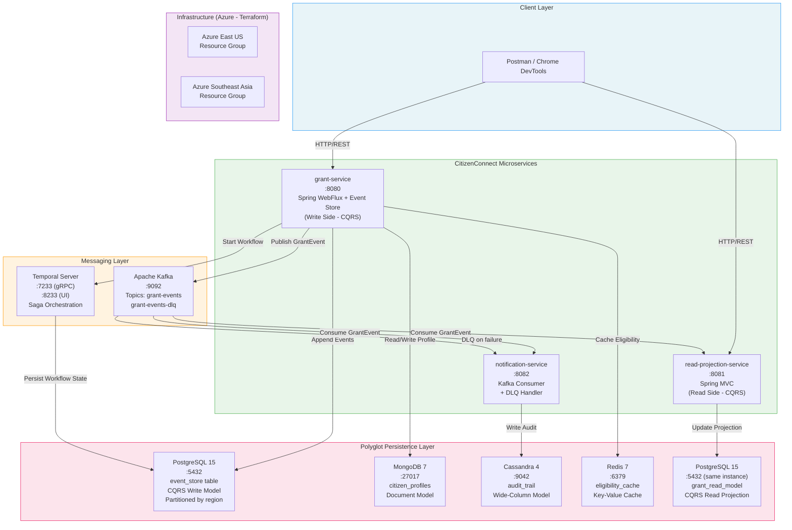

# DAY 4 — LAB DOCUMENT
## CitizenConnect — Grant Disbursement Platform

---

# LAB HEADER

---

## Lab Title
**Day 4 Lab: Building Resilient Event-Driven Systems with Event Sourcing, CQRS, Reactive Patterns, and Polyglot Persistence**
*Program: Senior Engineer to Solution Architect | Day 4 of 12*

---

## Prerequisites Checklist

Verify every item before the session begins. The trainer must complete all offline setup the evening before class.

```
PREREQUISITES VERIFICATION CHECKLIST
=====================================

Software & Versions:
[ ] Java 17 installed          → java -version  (must show 17.x)
[ ] Maven 3.9+                 → mvn -version
[ ] Docker Desktop running     → docker info
[ ] Docker Compose V2          → docker compose version (must show v2.x)
[ ] Git                        → git --version
[ ] PowerShell 7.x             → $PSVersionTable.PSVersion
[ ] Postman (desktop)          → Open and confirm workspace loads
[ ] Azure CLI                  → az --version
[ ] Terraform 1.5+             → terraform -version
[ ] kubectl                    → kubectl version --client

Accounts & Access:
[ ] Docker Hub account (for image pulls)
[ ] Azure Free Tier account (for geo-partitioning section)
[ ] Azure CLI logged in        → az login confirmed

Hardware Minimums (for all containers running simultaneously):
[ ] RAM: 16 GB recommended (12 GB absolute minimum)
[ ] Disk: 20 GB free space
[ ] CPU: 4 cores minimum

Port Availability (must be free before class):
[ ] 5432  → PostgreSQL
[ ] 27017 → MongoDB
[ ] 9042  → Cassandra
[ ] 6379  → Redis
[ ] 9092  → Kafka broker
[ ] 2181  → Zookeeper
[ ] 8233  → Temporal UI
[ ] 7233  → Temporal gRPC
[ ] 8080  → CitizenConnect API (grant-service)
[ ] 8081  → Read Projection Service
[ ] 8082  → Notification Service

Check all ports free (PowerShell):
[ ] Run: netstat -ano | Select-String "LISTENING" | 
         Select-String "5432|27017|9042|6379|9092|8080|8081|8082"
    → Output should be EMPTY (no conflicts)
```

---

## Estimated Time

| Phase                                 | Time           |
| ------------------------------------- | -------------- |
| Offline Setup (trainer, night before) | 90-120 minutes |
| In-Class Demonstration (all sections) | 5.0-6.0 hours  |
| Q&A and Discussion Buffer             | 30-45 minutes  |

---

## Learning Objectives

By the end of this lab, participants will be able to:

1. **Build** an event-sourced aggregate with a PostgreSQL-backed event store and reconstruct state from events
2. **Implement** CQRS with separate read and write models, demonstrating projection updates via event consumption
3. **Apply** non-blocking reactive patterns using Spring WebFlux for high-concurrency grant status queries
4. **Design** a Temporal-based workflow saga for multi-step grant approval with compensation
5. **Construct** fault-tolerant Kafka event flows with retry, dead-letter queues, and idempotency enforcement
6. **Integrate** polyglot persistence (MongoDB, Cassandra, Redis) into a single platform with appropriate use-case mapping
7. **Architect** Cassandra partition keys and PostgreSQL table partitions for geo-unit data locality

---

## Project Architecture Overview



---

# SECTION 1: EVENT SOURCING + CQRS — WRITE SIDE

## What We Are Building

We are building the **write side** of the `grant-service`: a Spring Boot 3.x application that models a `GrantApplication` aggregate. Instead of storing current state (as a traditional ORM would), we append **immutable domain events** to a PostgreSQL `event_store` table. State is reconstructed by replaying events. This is **Event Sourcing**. The **CQRS** (Command Query Responsibility Segregation) pattern separates this write path from the read path entirely.

---

## Project Structure — Full Repository Layout

```
citizen-connect/
├── docker-compose.yml                    ← All infrastructure containers
├── docker-compose.temporal.yml           ← Temporal server (separate compose)
├── init-scripts/
│   ├── postgres-init.sql                 ← Event store + read model DDL
│   ├── mongo-init.js                     ← MongoDB collections + indexes
│   └── cassandra-init.cql               ← Cassandra keyspace + table DDL
├── grant-service/                        ← CQRS Write Side + Reactive API
│   ├── pom.xml
│   └── src/
│       └── main/
│           ├── java/gov/citizenconnect/grant/
│           │   ├── GrantServiceApplication.java
│           │   ├── config/
│           │   │   ├── KafkaConfig.java
│           │   │   ├── R2dbcConfig.java
│           │   │   └── TemporalConfig.java
│           │   ├── domain/
│           │   │   ├── aggregate/
│           │   │   │   └── GrantApplication.java
│           │   │   ├── command/
│           │   │   │   ├── SubmitGrantCommand.java
│           │   │   │   ├── ApproveGrantCommand.java
│           │   │   │   └── DisburseFundsCommand.java
│           │   │   └── event/
│           │   │       ├── DomainEvent.java
│           │   │       ├── GrantSubmittedEvent.java
│           │   │       ├── GrantApprovedEvent.java
│           │   │       └── FundsDisbursedEvent.java
│           │   ├── eventstore/
│           │   │   ├── EventStoreRepository.java
│           │   │   └── StoredEvent.java
│           │   ├── workflow/
│           │   │   ├── GrantApprovalWorkflow.java
│           │   │   ├── GrantApprovalWorkflowImpl.java
│           │   │   └── GrantApprovalActivities.java
│           │   │   └── GrantApprovalActivitiesImpl.java
│           │   ├── api/
│           │   │   ├── GrantCommandController.java
│           │   │   └── dto/
│           │   │       ├── SubmitGrantRequest.java
│           │   │       └── GrantCommandResponse.java
│           │   └── service/
│           │       └── GrantCommandService.java
│           └── resources/
│               └── application.yml
├── read-projection-service/              ← CQRS Read Side
│   ├── pom.xml
│   └── src/
│       └── main/
│           ├── java/gov/citizenconnect/projection/
│           │   ├── ReadProjectionServiceApplication.java
│           │   ├── config/
│           │   │   └── KafkaConsumerConfig.java
│           │   ├── projection/
│           │   │   ├── GrantProjection.java
│           │   │   └── GrantProjectionRepository.java
│           │   ├── consumer/
│           │   │   └── GrantEventConsumer.java
│           │   └── api/
│           │       └── GrantQueryController.java
│           └── resources/
│               └── application.yml
├── notification-service/                 ← Kafka Consumer + DLQ Handler
│   ├── pom.xml
│   └── src/
│       └── main/
│           ├── java/gov/citizenconnect/notification/
│           │   ├── NotificationServiceApplication.java
│           │   ├── config/
│           │   │   └── KafkaConsumerConfig.java
│           │   ├── consumer/
│           │   │   ├── NotificationConsumer.java
│           │   │   └── DlqConsumer.java
│           │   └── service/
│           │       └── AuditService.java
│           └── resources/
│               └── application.yml
├── terraform/
│   ├── main.tf
│   ├── variables.tf
│   └── outputs.tf
└── scripts/
    ├── scaffold.ps1                      ← PowerShell scaffold script
    ├── verify.ps1                        ← Pre-demo verification script
    └── cleanup.ps1                       ← Post-demo cleanup script
```

---

## STEP 1: PowerShell Scaffold Script

Run this script **offline before class**. It creates the entire project skeleton with all files as empty placeholders. Code is populated in subsequent steps.

```powershell
# scripts/scaffold.ps1
# CitizenConnect - Day 4 Lab Scaffold Script
# Run from: any directory. Creates citizen-connect/ in current location.
# PowerShell 7.x required

param(
    [string]$RootDir = "citizen-connect"
)

Write-Host "========================================" -ForegroundColor Cyan
Write-Host " CitizenConnect - Day 4 Lab Scaffold    " -ForegroundColor Cyan
Write-Host "========================================" -ForegroundColor Cyan

function New-Dir($path) {
    if (-not (Test-Path $path)) {
        New-Item -ItemType Directory -Path $path -Force | Out-Null
        Write-Host "[DIR]  $path" -ForegroundColor Green
    }
}

function New-File($path, $content = "") {
    $dir = Split-Path $path -Parent
    if ($dir -and -not (Test-Path $dir)) {
        New-Item -ItemType Directory -Path $dir -Force | Out-Null
    }
    Set-Content -Path $path -Value $content -Encoding UTF8
    Write-Host "[FILE] $path" -ForegroundColor Yellow
}

Set-Location -Path (Split-Path -Parent $PSScriptRoot) -ErrorAction SilentlyContinue

# ── Root directories ───────────────────────────────────────────────────────────
$dirs = @(
    "$RootDir/init-scripts",
    "$RootDir/scripts",
    "$RootDir/terraform",
    # grant-service
    "$RootDir/grant-service/src/main/java/gov/citizenconnect/grant/config",
    "$RootDir/grant-service/src/main/java/gov/citizenconnect/grant/domain/aggregate",
    "$RootDir/grant-service/src/main/java/gov/citizenconnect/grant/domain/command",
    "$RootDir/grant-service/src/main/java/gov/citizenconnect/grant/domain/event",
    "$RootDir/grant-service/src/main/java/gov/citizenconnect/grant/eventstore",
    "$RootDir/grant-service/src/main/java/gov/citizenconnect/grant/workflow",
    "$RootDir/grant-service/src/main/java/gov/citizenconnect/grant/api/dto",
    "$RootDir/grant-service/src/main/java/gov/citizenconnect/grant/service",
    "$RootDir/grant-service/src/main/resources",
    "$RootDir/grant-service/src/test/java/gov/citizenconnect/grant",
    # read-projection-service
    "$RootDir/read-projection-service/src/main/java/gov/citizenconnect/projection/config",
    "$RootDir/read-projection-service/src/main/java/gov/citizenconnect/projection/projection",
    "$RootDir/read-projection-service/src/main/java/gov/citizenconnect/projection/consumer",
    "$RootDir/read-projection-service/src/main/java/gov/citizenconnect/projection/api",
    "$RootDir/read-projection-service/src/main/resources",
    # notification-service
    "$RootDir/notification-service/src/main/java/gov/citizenconnect/notification/config",
    "$RootDir/notification-service/src/main/java/gov/citizenconnect/notification/consumer",
    "$RootDir/notification-service/src/main/java/gov/citizenconnect/notification/service",
    "$RootDir/notification-service/src/main/resources"
)

foreach ($d in $dirs) { New-Dir $d }

# ── Root files ────────────────────────────────────────────────────────────────
$files = @(
    "$RootDir/docker-compose.yml",
    "$RootDir/docker-compose.temporal.yml",
    "$RootDir/init-scripts/postgres-init.sql",
    "$RootDir/init-scripts/mongo-init.js",
    "$RootDir/init-scripts/cassandra-init.cql",
    "$RootDir/terraform/main.tf",
    "$RootDir/terraform/variables.tf",
    "$RootDir/terraform/outputs.tf",
    "$RootDir/scripts/verify.ps1",
    "$RootDir/scripts/cleanup.ps1",
    # grant-service
    "$RootDir/grant-service/pom.xml",
    "$RootDir/grant-service/src/main/resources/application.yml",
    "$RootDir/grant-service/src/main/java/gov/citizenconnect/grant/GrantServiceApplication.java",
    "$RootDir/grant-service/src/main/java/gov/citizenconnect/grant/config/KafkaConfig.java",
    "$RootDir/grant-service/src/main/java/gov/citizenconnect/grant/config/R2dbcConfig.java",
    "$RootDir/grant-service/src/main/java/gov/citizenconnect/grant/config/TemporalConfig.java",
    "$RootDir/grant-service/src/main/java/gov/citizenconnect/grant/domain/aggregate/GrantApplication.java",
    "$RootDir/grant-service/src/main/java/gov/citizenconnect/grant/domain/command/SubmitGrantCommand.java",
    "$RootDir/grant-service/src/main/java/gov/citizenconnect/grant/domain/command/ApproveGrantCommand.java",
    "$RootDir/grant-service/src/main/java/gov/citizenconnect/grant/domain/command/DisburseFundsCommand.java",
    "$RootDir/grant-service/src/main/java/gov/citizenconnect/grant/domain/event/DomainEvent.java",
    "$RootDir/grant-service/src/main/java/gov/citizenconnect/grant/domain/event/GrantSubmittedEvent.java",
    "$RootDir/grant-service/src/main/java/gov/citizenconnect/grant/domain/event/GrantApprovedEvent.java",
    "$RootDir/grant-service/src/main/java/gov/citizenconnect/grant/domain/event/FundsDisbursedEvent.java",
    "$RootDir/grant-service/src/main/java/gov/citizenconnect/grant/eventstore/StoredEvent.java",
    "$RootDir/grant-service/src/main/java/gov/citizenconnect/grant/eventstore/EventStoreRepository.java",
    "$RootDir/grant-service/src/main/java/gov/citizenconnect/grant/workflow/GrantApprovalWorkflow.java",
    "$RootDir/grant-service/src/main/java/gov/citizenconnect/grant/workflow/GrantApprovalWorkflowImpl.java",
    "$RootDir/grant-service/src/main/java/gov/citizenconnect/grant/workflow/GrantApprovalActivities.java",
    "$RootDir/grant-service/src/main/java/gov/citizenconnect/grant/workflow/GrantApprovalActivitiesImpl.java",
    "$RootDir/grant-service/src/main/java/gov/citizenconnect/grant/api/dto/SubmitGrantRequest.java",
    "$RootDir/grant-service/src/main/java/gov/citizenconnect/grant/api/dto/GrantCommandResponse.java",
    "$RootDir/grant-service/src/main/java/gov/citizenconnect/grant/api/GrantCommandController.java",
    "$RootDir/grant-service/src/main/java/gov/citizenconnect/grant/service/GrantCommandService.java",
    "$RootDir/grant-service/src/test/java/gov/citizenconnect/grant/GrantServiceTest.java",
    # read-projection-service
    "$RootDir/read-projection-service/pom.xml",
    "$RootDir/read-projection-service/src/main/resources/application.yml",
    "$RootDir/read-projection-service/src/main/java/gov/citizenconnect/projection/ReadProjectionServiceApplication.java",
    "$RootDir/read-projection-service/src/main/java/gov/citizenconnect/projection/config/KafkaConsumerConfig.java",
    "$RootDir/read-projection-service/src/main/java/gov/citizenconnect/projection/projection/GrantProjection.java",
    "$RootDir/read-projection-service/src/main/java/gov/citizenconnect/projection/projection/GrantProjectionRepository.java",
    "$RootDir/read-projection-service/src/main/java/gov/citizenconnect/projection/consumer/GrantEventConsumer.java",
    "$RootDir/read-projection-service/src/main/java/gov/citizenconnect/projection/api/GrantQueryController.java",
    # notification-service
    "$RootDir/notification-service/pom.xml",
    "$RootDir/notification-service/src/main/resources/application.yml",
    "$RootDir/notification-service/src/main/java/gov/citizenconnect/notification/NotificationServiceApplication.java",
    "$RootDir/notification-service/src/main/java/gov/citizenconnect/notification/config/KafkaConsumerConfig.java",
    "$RootDir/notification-service/src/main/java/gov/citizenconnect/notification/consumer/NotificationConsumer.java",
    "$RootDir/notification-service/src/main/java/gov/citizenconnect/notification/consumer/DlqConsumer.java",
    "$RootDir/notification-service/src/main/java/gov/citizenconnect/notification/service/AuditService.java"
)

foreach ($f in $files) { New-File $f }

Write-Host ""
Write-Host "========================================" -ForegroundColor Cyan
Write-Host " Scaffold complete!                     " -ForegroundColor Cyan
Write-Host " Directory: ./$RootDir                  " -ForegroundColor Cyan
Write-Host " Next: populate files per Lab Document  " -ForegroundColor Cyan
Write-Host "========================================" -ForegroundColor Cyan
```

**Run the scaffold:**
```powershell
# From any working directory (e.g., C:\training\day4)
mkdir C:\training\day4
cd C:\training\day4
# Copy scaffold.ps1 into scripts/ manually first, then:
powershell -ExecutionPolicy Bypass -File .\scripts\scaffold.ps1
```

---

## STEP 2: Infrastructure — docker-compose.yml

This single Compose file brings up PostgreSQL, MongoDB, Cassandra, Redis, Kafka, and Zookeeper.

```yaml
# citizen-connect/docker-compose.yml
# CitizenConnect Day 4 - Core Infrastructure
# Starts: PostgreSQL, MongoDB, Cassandra, Redis, Kafka, Zookeeper
# Usage: docker compose up -d
# Teardown: docker compose down -v

version: "3.9"

services:

  # ── PostgreSQL 15 ─────────────────────────────────────────────────────────
  # Serves TWO purposes in CQRS:
  #   1. event_store schema  → Write side (append-only events)
  #   2. grant_read_model    → Read side (denormalised projection)
  # Temporal also uses PostgreSQL for its own persistence (separate DB).
  postgres:
    image: postgres:15-alpine
    container_name: cc_postgres
    environment:
      POSTGRES_USER: ccadmin
      POSTGRES_PASSWORD: ccpassword
      POSTGRES_DB: citizenconnect
    ports:
      - "5432:5432"
    volumes:
      - postgres_data:/var/lib/postgresql/data
      # Init script runs on first startup to create schemas
      - ./init-scripts/postgres-init.sql:/docker-entrypoint-initdb.d/01-init.sql
    healthcheck:
      test: ["CMD-SHELL", "pg_isready -U ccadmin -d citizenconnect"]
      interval: 10s
      timeout: 5s
      retries: 5
    networks:
      - cc_network

  # ── MongoDB 7 ─────────────────────────────────────────────────────────────
  # Stores citizen profiles (document model).
  # Rich, nested documents map naturally to citizen data (address, documents,
  # family details) without a rigid schema — ideal for evolving gov datasets.
  mongodb:
    image: mongo:7.0
    container_name: cc_mongodb
    environment:
      MONGO_INITDB_ROOT_USERNAME: ccadmin
      MONGO_INITDB_ROOT_PASSWORD: ccpassword
      MONGO_INITDB_DATABASE: citizenconnect
    ports:
      - "27017:27017"
    volumes:
      - mongo_data:/data/db
      - ./init-scripts/mongo-init.js:/docker-entrypoint-initdb.d/mongo-init.js:ro
    healthcheck:
      test: ["CMD", "mongosh", "--eval", "db.adminCommand('ping')"]
      interval: 15s
      timeout: 10s
      retries: 5
    networks:
      - cc_network

  # ── Apache Cassandra 4 ────────────────────────────────────────────────────
  # Stores audit trail for all grant events (wide-column model).
  # Cassandra's append-optimised write path and time-series partition design
  # make it perfect for immutable audit logs at government scale.
  cassandra:
    image: cassandra:4.1
    container_name: cc_cassandra
    environment:
      CASSANDRA_CLUSTER_NAME: CitizenConnectCluster
      CASSANDRA_DC: dc1
      CASSANDRA_ENDPOINT_SNITCH: GossipingPropertyFileSnitch
      MAX_HEAP_SIZE: "512M"
      HEAP_NEWSIZE: "128M"
    ports:
      - "9042:9042"
    volumes:
      - cassandra_data:/var/lib/cassandra
    healthcheck:
      test: ["CMD-SHELL", "cqlsh -e 'describe keyspaces' || exit 1"]
      interval: 30s
      timeout: 15s
      retries: 10
      start_period: 60s
    networks:
      - cc_network

  # ── Redis 7 ───────────────────────────────────────────────────────────────
  # Caches eligibility computation results.
  # Eligibility checks are CPU-intensive (income calculations, scheme rules).
  # Redis TTL-based caching prevents redundant computation for the same citizen.
  redis:
    image: redis:7.2-alpine
    container_name: cc_redis
    command: redis-server --requirepass ccredispass --maxmemory 256mb --maxmemory-policy allkeys-lru
    ports:
      - "6379:6379"
    volumes:
      - redis_data:/data
    healthcheck:
      test: ["CMD", "redis-cli", "-a", "ccredispass", "ping"]
      interval: 10s
      timeout: 5s
      retries: 5
    networks:
      - cc_network

  # ── Zookeeper ─────────────────────────────────────────────────────────────
  # Required by Kafka for cluster coordination.
  # NOTE: In Kafka 3.x+, KRaft mode eliminates Zookeeper. We use Zookeeper
  # here for broader compatibility with Spring Kafka defaults.
  zookeeper:
    image: confluentinc/cp-zookeeper:7.5.0
    container_name: cc_zookeeper
    environment:
      ZOOKEEPER_CLIENT_PORT: 2181
      ZOOKEEPER_TICK_TIME: 2000
    ports:
      - "2181:2181"
    networks:
      - cc_network

  # ── Apache Kafka ──────────────────────────────────────────────────────────
  # Event backbone for CitizenConnect.
  # grant-events topic: primary event stream
  # grant-events-dlq topic: dead-letter queue for failed consumers
  # KAFKA_AUTO_CREATE_TOPICS_ENABLE=false: we control topic creation explicitly
  kafka:
    image: confluentinc/cp-kafka:7.5.0
    container_name: cc_kafka
    depends_on:
      - zookeeper
    ports:
      - "9092:9092"
      - "9101:9101"
    environment:
      KAFKA_BROKER_ID: 1
      KAFKA_ZOOKEEPER_CONNECT: zookeeper:2181
      # PLAINTEXT_HOST allows connections from the Docker host (localhost:9092)
      # PLAINTEXT allows inter-container communication (kafka:29092)
      KAFKA_ADVERTISED_LISTENERS: PLAINTEXT://kafka:29092,PLAINTEXT_HOST://localhost:9092
      KAFKA_LISTENER_SECURITY_PROTOCOL_MAP: PLAINTEXT:PLAINTEXT,PLAINTEXT_HOST:PLAINTEXT
      KAFKA_INTER_BROKER_LISTENER_NAME: PLAINTEXT
      KAFKA_OFFSETS_TOPIC_REPLICATION_FACTOR: 1
      KAFKA_AUTO_CREATE_TOPICS_ENABLE: "false"
      KAFKA_LOG_RETENTION_HOURS: 168
      KAFKA_JMX_PORT: 9101
    healthcheck:
      test: ["CMD", "kafka-broker-api-versions", "--bootstrap-server", "localhost:9092"]
      interval: 15s
      timeout: 10s
      retries: 10
      start_period: 30s
    networks:
      - cc_network

  # ── Kafka Topic Initialiser ───────────────────────────────────────────────
  # One-shot container that creates required Kafka topics then exits.
  # This ensures topics exist before any producer/consumer starts.
  kafka-init:
    image: confluentinc/cp-kafka:7.5.0
    container_name: cc_kafka_init
    depends_on:
      kafka:
        condition: service_healthy
    entrypoint: ["/bin/sh", "-c"]
    command: |
      "
      echo 'Creating Kafka topics...'
      kafka-topics --bootstrap-server kafka:29092 --create --if-not-exists \
        --topic grant-events --partitions 3 --replication-factor 1
      kafka-topics --bootstrap-server kafka:29092 --create --if-not-exists \
        --topic grant-events-dlq --partitions 1 --replication-factor 1
      echo 'Topics created:'
      kafka-topics --bootstrap-server kafka:29092 --list
      "
    networks:
      - cc_network

volumes:
  postgres_data:
  mongo_data:
  cassandra_data:
  redis_data:

networks:
  cc_network:
    driver: bridge
    name: citizenconnect_net
```

---

## STEP 3: docker-compose.temporal.yml

Temporal is kept in a separate Compose file to allow independent startup (it is heavier and slower to initialise).

```yaml
# citizen-connect/docker-compose.temporal.yml
# Temporal Workflow Engine for CitizenConnect Saga Orchestration
# Usage: docker compose -f docker-compose.temporal.yml up -d
# Requires: cc_postgres must be running (uses it for persistence)
# Temporal UI: http://localhost:8233

version: "3.9"

services:

  # ── Temporal Server ───────────────────────────────────────────────────────
  # Manages durable workflow execution state.
  # Uses PostgreSQL as its persistence backend (same instance, separate DB).
  # temporalio/auto-setup image bootstraps schema automatically.
  temporal:
    image: temporalio/auto-setup:1.24.0
    container_name: cc_temporal
    environment:
      DB: postgresql
      DB_PORT: 5432
      POSTGRES_USER: ccadmin
      POSTGRES_PWD: ccpassword
      POSTGRES_SEEDS: cc_postgres
      DYNAMIC_CONFIG_FILE_PATH: /etc/temporal/dynamicconfig/docker.yaml
    ports:
      - "7233:7233"
    depends_on:
      - temporal-postgres-init
    networks:
      - citizenconnect_net

  # ── Temporal Admin Tools ──────────────────────────────────────────────────
  # Provides tctl CLI for namespace management.
  temporal-admin-tools:
    image: temporalio/admin-tools:1.24.0
    container_name: cc_temporal_admin
    environment:
      TEMPORAL_ADDRESS: temporal:7233
      TEMPORAL_CLI_ADDRESS: temporal:7233
    stdin_open: true
    tty: true
    depends_on:
      - temporal
    networks:
      - citizenconnect_net

  # ── Temporal UI ───────────────────────────────────────────────────────────
  # Web UI to inspect workflow executions, history, and task queues.
  # Critical for demonstrating saga state and compensation in class.
  temporal-ui:
    image: temporalio/ui:2.26.0
    container_name: cc_temporal_ui
    environment:
      TEMPORAL_ADDRESS: temporal:7233
      TEMPORAL_CORS_ORIGINS: http://localhost:3000
    ports:
      - "8233:8080"
    depends_on:
      - temporal
    networks:
      - citizenconnect_net

  # ── Temporal DB Initialiser ───────────────────────────────────────────────
  # Ensures Temporal's PostgreSQL database exists before Temporal server starts.
  temporal-postgres-init:
    image: postgres:15-alpine
    container_name: cc_temporal_pg_init
    environment:
      PGPASSWORD: ccpassword
    entrypoint: ["/bin/sh", "-c"]
    command: |
      "
      echo 'Waiting for PostgreSQL...'
      until pg_isready -h cc_postgres -U ccadmin; do sleep 2; done
      echo 'Creating temporal database...'
      psql -h cc_postgres -U ccadmin -d citizenconnect \
        -c \"SELECT 'CREATE DATABASE temporal' WHERE NOT EXISTS (SELECT FROM pg_database WHERE datname = 'temporal')\" \
        | grep -q 'CREATE DATABASE' && \
        psql -h cc_postgres -U ccadmin -c 'CREATE DATABASE temporal' || true
      psql -h cc_postgres -U ccadmin -d citizenconnect \
        -c \"SELECT 'CREATE DATABASE temporal_visibility' WHERE NOT EXISTS (SELECT FROM pg_database WHERE datname = 'temporal_visibility')\" \
        | grep -q 'CREATE DATABASE' && \
        psql -h cc_postgres -U ccadmin -c 'CREATE DATABASE temporal_visibility' || true
      echo 'Temporal databases ready.'
      "
    networks:
      - citizenconnect_net

networks:
  citizenconnect_net:
    external: true
    name: citizenconnect_net
```

---

## STEP 4: Database Initialisation Scripts

### postgres-init.sql

```sql
-- init-scripts/postgres-init.sql
-- CitizenConnect PostgreSQL Schema Initialisation
-- Executed automatically on first container startup.
-- Creates BOTH the write side (event_store) and read side (grant_read_model).

-- ═══════════════════════════════════════════════════════════════════════════
-- WRITE SIDE: Event Store
-- ─────────────────────────────────────────────────────────────────────────
-- Key design decisions:
--   1. aggregate_id + sequence_number together identify an event uniquely.
--      Optimistic concurrency: INSERT fails if same (aggregate_id, sequence_number)
--      is submitted twice → prevents duplicate event appends.
--   2. payload is JSONB: allows schema evolution without DDL changes.
--      Each event type has its own JSON shape — the aggregate reconstructs
--      state by deserialising based on event_type.
--   3. occurred_at is set by the database (not the application) to avoid
--      clock skew across service instances.
--   4. idempotency_key: prevents duplicate event appends from retried
--      commands (exactly-once append semantics).
-- ═══════════════════════════════════════════════════════════════════════════

CREATE TABLE IF NOT EXISTS event_store (
    id                BIGSERIAL       PRIMARY KEY,
    aggregate_id      UUID            NOT NULL,
    aggregate_type    VARCHAR(100)    NOT NULL,
    event_type        VARCHAR(200)    NOT NULL,
    sequence_number   BIGINT          NOT NULL,
    payload           JSONB           NOT NULL,
    metadata          JSONB           NOT NULL DEFAULT '{}',
    occurred_at       TIMESTAMPTZ     NOT NULL DEFAULT NOW(),
    idempotency_key   VARCHAR(255)    UNIQUE,
    region            VARCHAR(50)     NOT NULL DEFAULT 'IN-NATIONAL'
) PARTITION BY LIST (region);

-- Regional partitions for geo-unit design (Section 5 concept)
-- Data for Indian states stays within their regional partitions.
-- In a real deployment each partition would be on a different tablespace
-- or even a different PostgreSQL instance in that region.
CREATE TABLE IF NOT EXISTS event_store_in_national
    PARTITION OF event_store FOR VALUES IN ('IN-NATIONAL');
CREATE TABLE IF NOT EXISTS event_store_in_south
    PARTITION OF event_store FOR VALUES IN ('IN-SOUTH');
CREATE TABLE IF NOT EXISTS event_store_in_north
    PARTITION OF event_store FOR VALUES IN ('IN-NORTH');
CREATE TABLE IF NOT EXISTS event_store_us_east
    PARTITION OF event_store FOR VALUES IN ('US-EAST');
CREATE TABLE IF NOT EXISTS event_store_sg
    PARTITION OF event_store FOR VALUES IN ('SG');

-- Unique constraint: one event per (aggregate, sequence) prevents
-- duplicate events in the same aggregate stream.
CREATE UNIQUE INDEX IF NOT EXISTS idx_event_store_aggregate_sequence
    ON event_store (aggregate_id, sequence_number);

-- Fast lookup: all events for a given aggregate (stream replay)
CREATE INDEX IF NOT EXISTS idx_event_store_aggregate_id
    ON event_store (aggregate_id, sequence_number ASC);

-- Fast lookup: events after a given sequence (for projection catch-up)
CREATE INDEX IF NOT EXISTS idx_event_store_occurred_at
    ON event_store (occurred_at DESC);

-- ═══════════════════════════════════════════════════════════════════════════
-- READ SIDE: Grant Read Model (CQRS Projection)
-- ─────────────────────────────────────────────────────────────────────────
-- This is a DENORMALISED view of grant state, optimised for queries.
-- Updated by the read-projection-service when it consumes GrantEvents
-- from Kafka. Write side NEVER reads from this table.
-- ═══════════════════════════════════════════════════════════════════════════

CREATE TABLE IF NOT EXISTS grant_read_model (
    grant_id          UUID            PRIMARY KEY,
    citizen_id        VARCHAR(50)     NOT NULL,
    citizen_name      VARCHAR(255)    NOT NULL,
    scheme_code       VARCHAR(100)    NOT NULL,
    amount_inr        NUMERIC(15,2)   NOT NULL,
    status            VARCHAR(50)     NOT NULL,
    submitted_at      TIMESTAMPTZ,
    approved_at       TIMESTAMPTZ,
    disbursed_at      TIMESTAMPTZ,
    approver_id       VARCHAR(50),
    rejection_reason  TEXT,
    region            VARCHAR(50)     NOT NULL DEFAULT 'IN-NATIONAL',
    last_updated      TIMESTAMPTZ     NOT NULL DEFAULT NOW(),
    version           BIGINT          NOT NULL DEFAULT 0
);

-- Indexes optimised for the most common read queries:
--   1. Find grants by citizen (citizen portal view)
--   2. Find all grants by status + region (admin dashboard)
CREATE INDEX IF NOT EXISTS idx_grant_rm_citizen_id
    ON grant_read_model (citizen_id);
CREATE INDEX IF NOT EXISTS idx_grant_rm_status_region
    ON grant_read_model (status, region);

-- ═══════════════════════════════════════════════════════════════════════════
-- Seed data: Two initial grant applications for demo replay
-- ═══════════════════════════════════════════════════════════════════════════
INSERT INTO grant_read_model
    (grant_id, citizen_id, citizen_name, scheme_code, amount_inr, status, submitted_at, region)
VALUES
    ('a1b2c3d4-0000-0000-0000-000000000001',
     'CIT-001', 'Priya Sharma', 'PM-KISAN', 6000.00, 'SUBMITTED',
     NOW() - INTERVAL '2 days', 'IN-SOUTH'),
    ('a1b2c3d4-0000-0000-0000-000000000002',
     'CIT-002', 'Rajesh Kumar', 'MGNREGS', 12000.00, 'SUBMITTED',
     NOW() - INTERVAL '1 day', 'IN-NORTH')
ON CONFLICT (grant_id) DO NOTHING;
```

### mongo-init.js

```javascript
// init-scripts/mongo-init.js
// MongoDB Initialisation for CitizenConnect
// Creates citizen_profiles collection with schema validation and indexes.
// Runs inside mongo container on first startup.

// Switch to the citizenconnect database
db = db.getSiblingDB('citizenconnect');

// ─────────────────────────────────────────────────────────────────────────
// Collection: citizen_profiles
// WHY document model? A citizen's profile is hierarchical and schema-flexible:
//   - Address has different fields for urban vs rural citizens
//   - Document list varies by scheme (Aadhaar, PAN, voter ID, land records)
//   - Family members can be any number
// A relational model would require 4-5 JOINed tables. MongoDB stores it as
// one document → single-read retrieval, zero JOIN overhead.
// ─────────────────────────────────────────────────────────────────────────
db.createCollection('citizen_profiles', {
    validator: {
        $jsonSchema: {
            bsonType: 'object',
            required: ['citizen_id', 'full_name', 'aadhaar_hash', 'region', 'created_at'],
            properties: {
                citizen_id: {
                    bsonType: 'string',
                    description: 'Unique citizen identifier (e.g., CIT-001)'
                },
                full_name: {
                    bsonType: 'string',
                    minLength: 2,
                    maxLength: 255
                },
                aadhaar_hash: {
                    bsonType: 'string',
                    description: 'SHA-256 hash of Aadhaar number - never store raw'
                },
                date_of_birth: { bsonType: 'date' },
                region: {
                    bsonType: 'string',
                    enum: ['IN-NATIONAL', 'IN-SOUTH', 'IN-NORTH', 'US-EAST', 'SG']
                },
                address: {
                    bsonType: 'object',
                    properties: {
                        street: { bsonType: 'string' },
                        district: { bsonType: 'string' },
                        state: { bsonType: 'string' },
                        pincode: { bsonType: 'string' },
                        geo_coordinates: {
                            bsonType: 'object',
                            properties: {
                                lat: { bsonType: 'double' },
                                lon: { bsonType: 'double' }
                            }
                        }
                    }
                },
                annual_income_inr: { bsonType: 'double' },
                eligible_schemes: {
                    bsonType: 'array',
                    items: { bsonType: 'string' }
                },
                documents: {
                    bsonType: 'array',
                    items: {
                        bsonType: 'object',
                        required: ['type', 'verified'],
                        properties: {
                            type: { bsonType: 'string' },
                            number_hash: { bsonType: 'string' },
                            verified: { bsonType: 'bool' },
                            verified_at: { bsonType: 'date' }
                        }
                    }
                },
                created_at: { bsonType: 'date' },
                updated_at: { bsonType: 'date' }
            }
        }
    },
    validationLevel: 'moderate',
    validationAction: 'warn'
});

// Indexes
// WHY unique on citizen_id? Every document operation uses this as the
// application-level key. Unique index prevents duplicate profiles.
db.citizen_profiles.createIndex({ citizen_id: 1 }, { unique: true });
// WHY index on region? All queries filter by region first (data sovereignty).
db.citizen_profiles.createIndex({ region: 1, citizen_id: 1 });
// WHY index on eligible_schemes? Bulk queries during scheme disbursement.
db.citizen_profiles.createIndex({ eligible_schemes: 1 });

// Seed two citizen profiles matching the grant_read_model seed data
db.citizen_profiles.insertMany([
    {
        citizen_id: 'CIT-001',
        full_name: 'Priya Sharma',
        aadhaar_hash: 'e3b0c44298fc1c149afbf4c8996fb92427ae41e4649b934ca495991b7852b855',
        date_of_birth: new Date('1985-04-12'),
        region: 'IN-SOUTH',
        address: {
            street: '14, MG Road',
            district: 'Bengaluru Urban',
            state: 'Karnataka',
            pincode: '560001',
            geo_coordinates: { lat: 12.9716, lon: 77.5946 }
        },
        annual_income_inr: 85000.0,
        eligible_schemes: ['PM-KISAN', 'PMAY'],
        documents: [
            { type: 'AADHAAR', number_hash: 'hash_aadhaar_001', verified: true, verified_at: new Date('2023-01-15') },
            { type: 'PAN', number_hash: 'hash_pan_001', verified: true, verified_at: new Date('2023-01-15') }
        ],
        created_at: new Date(),
        updated_at: new Date()
    },
    {
        citizen_id: 'CIT-002',
        full_name: 'Rajesh Kumar',
        aadhaar_hash: 'a665a45920422f9d417e4867efdc4fb8a04a1f3fff1fa07e998e86f7f7a27ae3',
        date_of_birth: new Date('1978-11-30'),
        region: 'IN-NORTH',
        address: {
            street: '7, Chandni Chowk',
            district: 'Central Delhi',
            state: 'Delhi',
            pincode: '110006',
            geo_coordinates: { lat: 28.6506, lon: 77.2299 }
        },
        annual_income_inr: 120000.0,
        eligible_schemes: ['MGNREGS', 'PMJAY'],
        documents: [
            { type: 'AADHAAR', number_hash: 'hash_aadhaar_002', verified: true, verified_at: new Date('2022-08-20') },
            { type: 'VOTER_ID', number_hash: 'hash_vid_002', verified: false, verified_at: null }
        ],
        created_at: new Date(),
        updated_at: new Date()
    }
]);

print('MongoDB citizen_profiles collection initialised with 2 seed documents.');
```

### cassandra-init.cql

```cql
-- init-scripts/cassandra-init.cql
-- Cassandra Schema for CitizenConnect Audit Trail
-- Run manually after Cassandra container is healthy:
--   docker exec -it cc_cassandra cqlsh -f /init-scripts/cassandra-init.cql
--
-- WHY Cassandra for audit trail?
--   1. Write-optimised: appends are O(1) via log-structured merge trees
--   2. Partition key design: (region, grant_id) keeps all audit rows for
--      one grant co-located on the same node → O(1) read for full audit trail
--   3. Clustering column (event_time DESC): rows returned newest-first
--      within a partition, matching the most common audit query pattern
--   4. Time-to-live (TTL): government regulations require 7-year retention
--      of financial audit data. Cassandra TTL automates expiry.

CREATE KEYSPACE IF NOT EXISTS citizenconnect
    WITH replication = {
        'class': 'SimpleStrategy',
        'replication_factor': 1
    }
    AND durable_writes = true;

USE citizenconnect;

-- Audit trail: every state change for every grant
-- Partition key: (region, grant_id)
--   → All audit rows for one grant in one region on one partition
-- Clustering key: event_time DESC
--   → Newest event first within each partition
CREATE TABLE IF NOT EXISTS grant_audit_trail (
    region          text,
    grant_id        uuid,
    event_time      timestamp,
    event_type      text,
    citizen_id      text,
    actor_id        text,
    payload         text,       -- JSON string of event details
    idempotency_key text,
    source_service  text,
    PRIMARY KEY ((region, grant_id), event_time)
) WITH CLUSTERING ORDER BY (event_time DESC)
  AND default_time_to_live = 220752000  -- 7 years in seconds
  AND comment = 'Immutable audit trail for grant events. Partitioned by region+grant for data sovereignty.';

-- Secondary index: query all events for a citizen across grants
-- NOTE: Secondary indexes in Cassandra are a last resort.
-- For high-volume queries, a separate table (denormalised) is preferable.
-- This index is acceptable here since citizen-level audit queries are
-- infrequent (admin investigations, not real-time).
CREATE INDEX IF NOT EXISTS ON grant_audit_trail (citizen_id);

-- Summary table: latest status per grant (for admin dashboards)
-- This is a SEPARATE denormalised table, not a secondary index.
-- WHY? Cassandra does not support aggregates efficiently. We maintain
-- this table via application-level dual writes.
CREATE TABLE IF NOT EXISTS grant_status_summary (
    region          text,
    status          text,
    grant_id        uuid,
    citizen_id      text,
    updated_at      timestamp,
    PRIMARY KEY ((region, status), updated_at, grant_id)
) WITH CLUSTERING ORDER BY (updated_at DESC, grant_id ASC)
  AND comment = 'Denormalised summary for dashboard queries by region+status.';
```

---

> **PART 1 COMPLETE**
>
> We have covered:
> - Lab Header, Prerequisites, Architecture Overview
> - PowerShell Scaffold Script (complete)
> - docker-compose.yml (all 6 infrastructure services)
> - docker-compose.temporal.yml (Temporal server + UI)
> - All 3 database initialisation scripts (PostgreSQL, MongoDB, Cassandra)
>
> **Type `continue` to proceed to Part 2**, which covers:
> - Section 1: grant-service pom.xml, application.yml, all domain classes (aggregate, commands, events, event store)
> - Section 2: GrantCommandService, GrantCommandController, DTOs
> - Temporal workflow and activities
>

---

# DAY 4 — LAB DOCUMENT (PART 2 of N)

---

# SECTION 1 (continued): EVENT SOURCING + CQRS — GRANT-SERVICE IMPLEMENTATION

## STEP 5: grant-service — pom.xml

```xml
<?xml version="1.0" encoding="UTF-8"?>
<!-- citizen-connect/grant-service/pom.xml
     CitizenConnect Grant Service - Write Side (CQRS)
     
     Key dependency decisions:
     - spring-boot-starter-webflux: Non-blocking reactive HTTP (replaces spring-web)
       WHY? Grant submission endpoint must handle thousands of concurrent citizens
       without blocking threads. WebFlux uses Netty + Project Reactor.
     - spring-boot-starter-data-r2dbc: Reactive PostgreSQL driver
       WHY? R2DBC (Reactive Relational Database Connectivity) pairs with WebFlux.
       Blocking JDBC would negate WebFlux's non-blocking benefits.
     - spring-kafka: Kafka producer for publishing domain events
     - temporal-sdk: Workflow engine client for saga orchestration
     - spring-boot-starter-data-mongodb-reactive: Reactive MongoDB for citizen profiles
     - spring-boot-starter-data-redis-reactive: Reactive Redis for eligibility cache
-->
<project xmlns="http://maven.apache.org/POM/4.0.0"
         xmlns:xsi="http://www.w3.org/2001/XMLSchema-instance"
         xsi:schemaLocation="http://maven.apache.org/POM/4.0.0
         https://maven.apache.org/xsd/maven-4.0.0.xsd">

    <modelVersion>4.0.0</modelVersion>

    <parent>
        <groupId>org.springframework.boot</groupId>
        <artifactId>spring-boot-starter-parent</artifactId>
        <version>3.2.4</version>
        <relativePath/>
    </parent>

    <groupId>gov.citizenconnect</groupId>
    <artifactId>grant-service</artifactId>
    <version>1.0.0-SNAPSHOT</version>
    <name>grant-service</name>
    <description>CitizenConnect Grant Service - CQRS Write Side + Reactive API</description>

    <properties>
        <java.version>17</java.version>
        <temporal.version>1.24.1</temporal.version>
        <testcontainers.version>1.19.7</testcontainers.version>
    </properties>

    <dependencies>

        <!-- ── Reactive Web (WebFlux + Netty) ─────────────────────────── -->
        <dependency>
            <groupId>org.springframework.boot</groupId>
            <artifactId>spring-boot-starter-webflux</artifactId>
        </dependency>

        <!-- ── Reactive PostgreSQL (R2DBC) ────────────────────────────── -->
        <!-- r2dbc-pool: connection pooling for reactive DB connections     -->
        <dependency>
            <groupId>org.springframework.boot</groupId>
            <artifactId>spring-boot-starter-data-r2dbc</artifactId>
        </dependency>
        <dependency>
            <groupId>org.postgresql</groupId>
            <artifactId>r2dbc-postgresql</artifactId>
            <scope>runtime</scope>
        </dependency>
        <!-- Flyway needs JDBC for schema migration (R2DBC cannot run DDL migrations) -->
        <dependency>
            <groupId>org.springframework.boot</groupId>
            <artifactId>spring-boot-starter-jdbc</artifactId>
        </dependency>
        <dependency>
            <groupId>org.postgresql</groupId>
            <artifactId>postgresql</artifactId>
            <scope>runtime</scope>
        </dependency>

        <!-- ── Reactive MongoDB ────────────────────────────────────────── -->
        <dependency>
            <groupId>org.springframework.boot</groupId>
            <artifactId>spring-boot-starter-data-mongodb-reactive</artifactId>
        </dependency>

        <!-- ── Reactive Redis ──────────────────────────────────────────── -->
        <dependency>
            <groupId>org.springframework.boot</groupId>
            <artifactId>spring-boot-starter-data-redis-reactive</artifactId>
        </dependency>
        <dependency>
            <groupId>io.lettuce</groupId>
            <artifactId>lettuce-core</artifactId>
        </dependency>

        <!-- ── Kafka Producer ──────────────────────────────────────────── -->
        <dependency>
            <groupId>org.springframework.kafka</groupId>
            <artifactId>spring-kafka</artifactId>
        </dependency>

        <!-- ── Temporal Workflow SDK ───────────────────────────────────── -->
        <dependency>
            <groupId>io.temporal</groupId>
            <artifactId>temporal-sdk</artifactId>
            <version>${temporal.version}</version>
        </dependency>
        <dependency>
            <groupId>io.temporal</groupId>
            <artifactId>temporal-spring-boot-starter-alpha</artifactId>
            <version>${temporal.version}</version>
        </dependency>

        <!-- ── Validation ─────────────────────────────────────────────── -->
        <dependency>
            <groupId>org.springframework.boot</groupId>
            <artifactId>spring-boot-starter-validation</artifactId>
        </dependency>

        <!-- ── Actuator (health, metrics) ─────────────────────────────── -->
        <dependency>
            <groupId>org.springframework.boot</groupId>
            <artifactId>spring-boot-starter-actuator</artifactId>
        </dependency>

        <!-- ── Jackson (JSON serialisation) ───────────────────────────── -->
        <dependency>
            <groupId>com.fasterxml.jackson.core</groupId>
            <artifactId>jackson-databind</artifactId>
        </dependency>
        <dependency>
            <groupId>com.fasterxml.jackson.datatype</groupId>
            <artifactId>jackson-datatype-jsr310</artifactId>
        </dependency>

        <!-- ── Lombok (reduces boilerplate) ───────────────────────────── -->
        <dependency>
            <groupId>org.projectlombok</groupId>
            <artifactId>lombok</artifactId>
            <optional>true</optional>
        </dependency>

        <!-- ── Test Dependencies ───────────────────────────────────────── -->
        <dependency>
            <groupId>org.springframework.boot</groupId>
            <artifactId>spring-boot-starter-test</artifactId>
            <scope>test</scope>
        </dependency>
        <dependency>
            <groupId>io.projectreactor</groupId>
            <artifactId>reactor-test</artifactId>
            <scope>test</scope>
        </dependency>
        <dependency>
            <groupId>org.springframework.kafka</groupId>
            <artifactId>spring-kafka-test</artifactId>
            <scope>test</scope>
        </dependency>

    </dependencies>

    <build>
        <plugins>
            <plugin>
                <groupId>org.springframework.boot</groupId>
                <artifactId>spring-boot-maven-plugin</artifactId>
                <configuration>
                    <excludes>
                        <exclude>
                            <groupId>org.projectlombok</groupId>
                            <artifactId>lombok</artifactId>
                        </exclude>
                    </excludes>
                </configuration>
            </plugin>
        </plugins>
    </build>

</project>
```

---

## STEP 6: grant-service — application.yml

```yaml
# citizen-connect/grant-service/src/main/resources/application.yml
# CitizenConnect Grant Service Configuration
# All secrets use environment variable substitution (${VAR:default})
# In production: inject via Kubernetes Secrets or Azure Key Vault

server:
  port: 8080
  # Netty (reactive server) configuration
  netty:
    connection-timeout: 10s
    idle-timeout: 60s

spring:
  application:
    name: grant-service

  # ── R2DBC (Reactive PostgreSQL) ──────────────────────────────────────────
  # Used for event_store writes (non-blocking reactive pipeline)
  r2dbc:
    url: r2dbc:postgresql://${POSTGRES_HOST:localhost}:${POSTGRES_PORT:5432}/${POSTGRES_DB:citizenconnect}
    username: ${POSTGRES_USER:ccadmin}
    password: ${POSTGRES_PASSWORD:ccpassword}
    pool:
      initial-size: 5
      max-size: 20
      # max-idle-time: how long a connection can sit idle before being closed
      max-idle-time: 30m
      validation-query: SELECT 1

  # ── JDBC (for Flyway schema migration only) ───────────────────────────────
  # Flyway requires blocking JDBC. We run migrations on startup only.
  datasource:
    url: jdbc:postgresql://${POSTGRES_HOST:localhost}:${POSTGRES_PORT:5432}/${POSTGRES_DB:citizenconnect}
    username: ${POSTGRES_USER:ccadmin}
    password: ${POSTGRES_PASSWORD:ccpassword}
    driver-class-name: org.postgresql.Driver

  # ── MongoDB (Reactive) ────────────────────────────────────────────────────
  data:
    mongodb:
      uri: mongodb://${MONGO_USER:ccadmin}:${MONGO_PASSWORD:ccpassword}@${MONGO_HOST:localhost}:${MONGO_PORT:27017}/citizenconnect?authSource=admin
    redis:
      host: ${REDIS_HOST:localhost}
      port: ${REDIS_PORT:6379}
      password: ${REDIS_PASSWORD:ccredispass}
      lettuce:
        pool:
          max-active: 10
          max-idle: 5
          min-idle: 2

  # ── Kafka Producer ────────────────────────────────────────────────────────
  kafka:
    bootstrap-servers: ${KAFKA_BOOTSTRAP:localhost:9092}
    producer:
      # key-serializer: grant_id (UUID as String)
      key-serializer: org.apache.kafka.common.serialization.StringSerializer
      # value-serializer: JSON-serialised domain event payload
      value-serializer: org.springframework.kafka.support.serializer.JsonSerializer
      # acks=all: producer waits for ALL in-sync replicas to confirm
      # WHY? In a 3-broker cluster, this prevents data loss on broker failure.
      # Trade-off: higher latency than acks=1 but required for financial data.
      acks: all
      # retries: retry up to 3 times on transient network failures
      retries: 3
      properties:
        # enable.idempotence: Kafka guarantees exactly-once delivery per partition
        # WHY? Without this, retries can produce duplicate events in the event store.
        enable.idempotence: true
        max.in.flight.requests.per.connection: 5
        spring.json.add.type.headers: false

  # ── Autoconfigure exclusions ──────────────────────────────────────────────
  # Exclude blocking JPA autoconfiguration since we use R2DBC
  autoconfigure:
    exclude:
      - org.springframework.boot.autoconfigure.orm.jpa.HibernateJpaAutoConfiguration

# ── Temporal Workflow Engine ──────────────────────────────────────────────────
temporal:
  connection:
    target: ${TEMPORAL_HOST:localhost}:${TEMPORAL_PORT:7233}
  namespace: citizenconnect
  workers:
    - task-queue: grant-approval-queue
      workflow-classes:
        - gov.citizenconnect.grant.workflow.GrantApprovalWorkflowImpl
      activity-beans:
        - grantApprovalActivities

# ── Application-specific configuration ───────────────────────────────────────
app:
  kafka:
    topics:
      grant-events: grant-events
      grant-events-dlq: grant-events-dlq
  cache:
    eligibility-ttl-minutes: 30
  failure-simulation:
    # Toggle to true during Section 3 demo to inject failures
    enabled: false
    failure-rate: 0.5

# ── Actuator endpoints ────────────────────────────────────────────────────────
management:
  endpoints:
    web:
      exposure:
        include: health,info,metrics,prometheus
  endpoint:
    health:
      show-details: always
```

---

## STEP 7: Domain Layer — Events

### DomainEvent.java (Base Interface)

```java
// grant-service/src/main/java/gov/citizenconnect/grant/domain/event/DomainEvent.java
// 
// WHY an interface rather than an abstract class?
// - Allows events to be records (Java 17 sealed hierarchy)
// - Jackson can serialise/deserialise through the interface using @JsonTypeInfo
// - Keeps events as pure data carriers with no behaviour

package gov.citizenconnect.grant.domain.event;

import com.fasterxml.jackson.annotation.JsonSubTypes;
import com.fasterxml.jackson.annotation.JsonTypeInfo;

import java.time.Instant;
import java.util.UUID;

// @JsonTypeInfo + @JsonSubTypes: enables polymorphic deserialisation.
// When we read a raw JSON event from the event store, Jackson uses
// the "eventType" field to determine the concrete class to instantiate.
// This is critical for aggregate state reconstruction (event replay).
@JsonTypeInfo(
    use = JsonTypeInfo.Id.NAME,
    include = JsonTypeInfo.As.PROPERTY,
    property = "eventType"
)
@JsonSubTypes({
    @JsonSubTypes.Type(value = GrantSubmittedEvent.class, name = "GrantSubmitted"),
    @JsonSubTypes.Type(value = GrantApprovedEvent.class,  name = "GrantApproved"),
    @JsonSubTypes.Type(value = FundsDisbursedEvent.class, name = "FundsDisbursed")
})
public interface DomainEvent {

    // Every domain event must identify:
    // 1. WHICH aggregate it belongs to (aggregateId)
    // 2. WHAT happened (eventType) - past tense, imperative mood
    // 3. WHEN it happened (occurredAt)
    // 4. WHAT version of the aggregate stream it is (sequenceNumber)
    //    → Used for optimistic concurrency control

    UUID aggregateId();
    String eventType();
    Instant occurredAt();
    long sequenceNumber();
}
```

### GrantSubmittedEvent.java

```java
// grant-service/src/main/java/gov/citizenconnect/grant/domain/event/GrantSubmittedEvent.java
//
// Java 17 record: immutable value object with auto-generated equals/hashCode/toString.
// WHY records for events? Events are immutable by definition — they represent
// something that happened in the past. Records enforce this at the language level.

package gov.citizenconnect.grant.domain.event;

import com.fasterxml.jackson.annotation.JsonCreator;
import com.fasterxml.jackson.annotation.JsonProperty;

import java.math.BigDecimal;
import java.time.Instant;
import java.util.UUID;

public record GrantSubmittedEvent(
    UUID aggregateId,       // grantId
    String citizenId,       // e.g., "CIT-001"
    String citizenName,
    String schemeCode,      // e.g., "PM-KISAN", "MGNREGS"
    BigDecimal amountInr,   // Requested grant amount in INR
    String region,          // e.g., "IN-SOUTH" — for geo-partitioning
    String idempotencyKey,  // Caller-supplied key to prevent duplicate submissions
    Instant occurredAt,
    long sequenceNumber
) implements DomainEvent {

    // Jackson requires a @JsonCreator for records when using JsonTypeInfo
    @JsonCreator
    public GrantSubmittedEvent(
        @JsonProperty("aggregateId")    UUID aggregateId,
        @JsonProperty("citizenId")      String citizenId,
        @JsonProperty("citizenName")    String citizenName,
        @JsonProperty("schemeCode")     String schemeCode,
        @JsonProperty("amountInr")      BigDecimal amountInr,
        @JsonProperty("region")         String region,
        @JsonProperty("idempotencyKey") String idempotencyKey,
        @JsonProperty("occurredAt")     Instant occurredAt,
        @JsonProperty("sequenceNumber") long sequenceNumber
    ) {
        this.aggregateId    = aggregateId;
        this.citizenId      = citizenId;
        this.citizenName    = citizenName;
        this.schemeCode     = schemeCode;
        this.amountInr      = amountInr;
        this.region         = region;
        this.idempotencyKey = idempotencyKey;
        this.occurredAt     = occurredAt;
        this.sequenceNumber = sequenceNumber;
    }

    @Override
    public String eventType() { return "GrantSubmitted"; }
}
```

### GrantApprovedEvent.java

```java
// grant-service/src/main/java/gov/citizenconnect/grant/domain/event/GrantApprovedEvent.java

package gov.citizenconnect.grant.domain.event;

import com.fasterxml.jackson.annotation.JsonCreator;
import com.fasterxml.jackson.annotation.JsonProperty;

import java.time.Instant;
import java.util.UUID;

public record GrantApprovedEvent(
    UUID aggregateId,
    String approverId,      // Officer ID who approved
    String approverDesig,   // Designation (e.g., "District Collector")
    String remarks,
    Instant occurredAt,
    long sequenceNumber
) implements DomainEvent {

    @JsonCreator
    public GrantApprovedEvent(
        @JsonProperty("aggregateId")   UUID aggregateId,
        @JsonProperty("approverId")    String approverId,
        @JsonProperty("approverDesig") String approverDesig,
        @JsonProperty("remarks")       String remarks,
        @JsonProperty("occurredAt")    Instant occurredAt,
        @JsonProperty("sequenceNumber") long sequenceNumber
    ) {
        this.aggregateId   = aggregateId;
        this.approverId    = approverId;
        this.approverDesig = approverDesig;
        this.remarks       = remarks;
        this.occurredAt    = occurredAt;
        this.sequenceNumber = sequenceNumber;
    }

    @Override
    public String eventType() { return "GrantApproved"; }
}
```

### FundsDisbursedEvent.java

```java
// grant-service/src/main/java/gov/citizenconnect/grant/domain/event/FundsDisbursedEvent.java

package gov.citizenconnect.grant.domain.event;

import com.fasterxml.jackson.annotation.JsonCreator;
import com.fasterxml.jackson.annotation.JsonProperty;

import java.math.BigDecimal;
import java.time.Instant;
import java.util.UUID;

public record FundsDisbursedEvent(
    UUID aggregateId,
    BigDecimal amountInr,       // Actual disbursed amount (may differ from requested)
    String bankAccountHash,     // SHA-256 of beneficiary account number
    String utrNumber,           // Unique Transaction Reference (NEFT/RTGS)
    String disbursementChannel, // "PFMS", "DBT", "NACH"
    Instant occurredAt,
    long sequenceNumber
) implements DomainEvent {

    @JsonCreator
    public FundsDisbursedEvent(
        @JsonProperty("aggregateId")         UUID aggregateId,
        @JsonProperty("amountInr")           BigDecimal amountInr,
        @JsonProperty("bankAccountHash")     String bankAccountHash,
        @JsonProperty("utrNumber")           String utrNumber,
        @JsonProperty("disbursementChannel") String disbursementChannel,
        @JsonProperty("occurredAt")          Instant occurredAt,
        @JsonProperty("sequenceNumber")      long sequenceNumber
    ) {
        this.aggregateId         = aggregateId;
        this.amountInr           = amountInr;
        this.bankAccountHash     = bankAccountHash;
        this.utrNumber           = utrNumber;
        this.disbursementChannel = disbursementChannel;
        this.occurredAt          = occurredAt;
        this.sequenceNumber      = sequenceNumber;
    }

    @Override
    public String eventType() { return "FundsDisbursed"; }
}
```

---

## STEP 8: Domain Layer — Commands

### SubmitGrantCommand.java

```java
// grant-service/src/main/java/gov/citizenconnect/grant/domain/command/SubmitGrantCommand.java
//
// Commands represent INTENT — something the system is asked to do.
// Events represent FACTS — something that already happened.
// WHY distinguish? A command can be REJECTED (validation failure, duplicate).
// An event, once appended to the store, is immutable and cannot be rejected.

package gov.citizenconnect.grant.domain.command;

import jakarta.validation.constraints.DecimalMin;
import jakarta.validation.constraints.NotBlank;
import jakarta.validation.constraints.NotNull;
import jakarta.validation.constraints.Pattern;

import java.math.BigDecimal;

public record SubmitGrantCommand(
    @NotBlank(message = "citizenId is mandatory")
    String citizenId,

    @NotBlank(message = "citizenName is mandatory")
    String citizenName,

    @NotBlank(message = "schemeCode is mandatory")
    String schemeCode,

    @NotNull(message = "amountInr is mandatory")
    @DecimalMin(value = "1.00", message = "Grant amount must be at least INR 1")
    BigDecimal amountInr,

    @NotBlank(message = "region is mandatory")
    @Pattern(
        regexp = "IN-NATIONAL|IN-SOUTH|IN-NORTH|US-EAST|SG",
        message = "region must be one of: IN-NATIONAL, IN-SOUTH, IN-NORTH, US-EAST, SG"
    )
    String region,

    // idempotencyKey: supplied by the caller (API client).
    // If the same key is submitted twice, the second request is a no-op.
    // Format: UUID v4 generated by client before the first submission attempt.
    @NotBlank(message = "idempotencyKey is mandatory")
    String idempotencyKey
) {}
```

### ApproveGrantCommand.java

```java
// grant-service/src/main/java/gov/citizenconnect/grant/domain/command/ApproveGrantCommand.java

package gov.citizenconnect.grant.domain.command;

import jakarta.validation.constraints.NotBlank;
import jakarta.validation.constraints.NotNull;

import java.util.UUID;

public record ApproveGrantCommand(
    @NotNull UUID grantId,
    @NotBlank String approverId,
    @NotBlank String approverDesig,
    String remarks,
    @NotBlank String idempotencyKey
) {}
```

### DisburseFundsCommand.java

```java
// grant-service/src/main/java/gov/citizenconnect/grant/domain/command/DisburseFundsCommand.java

package gov.citizenconnect.grant.domain.command;

import jakarta.validation.constraints.DecimalMin;
import jakarta.validation.constraints.NotBlank;
import jakarta.validation.constraints.NotNull;

import java.math.BigDecimal;
import java.util.UUID;

public record DisburseFundsCommand(
    @NotNull UUID grantId,
    @NotNull @DecimalMin("1.00") BigDecimal amountInr,
    @NotBlank String bankAccountHash,
    @NotBlank String utrNumber,
    @NotBlank String disbursementChannel,
    @NotBlank String idempotencyKey
) {}
```

---

## STEP 9: Domain Layer — Aggregate

```java
// grant-service/src/main/java/gov/citizenconnect/grant/domain/aggregate/GrantApplication.java
//
// The AGGREGATE ROOT in Event Sourcing.
//
// KEY CONCEPT — State Reconstruction via Event Replay:
//   Traditional ORM: SELECT * FROM grants WHERE id = ? → returns current state
//   Event Sourcing:  SELECT * FROM event_store WHERE aggregate_id = ?
//                    → returns ordered list of events
//                    → apply() each event to rebuild current state
//
// This means:
//   1. The aggregate has NO persistent fields in the traditional sense
//   2. ALL state changes go through apply(DomainEvent)
//   3. The aggregate validates business rules BEFORE raising events
//   4. The aggregate accumulates uncommitted events in a list
//      → these are what get appended to the event store

package gov.citizenconnect.grant.domain.aggregate;

import gov.citizenconnect.grant.domain.command.ApproveGrantCommand;
import gov.citizenconnect.grant.domain.command.DisburseFundsCommand;
import gov.citizenconnect.grant.domain.command.SubmitGrantCommand;
import gov.citizenconnect.grant.domain.event.*;
import lombok.Getter;

import java.math.BigDecimal;
import java.time.Instant;
import java.util.ArrayList;
import java.util.Collections;
import java.util.List;
import java.util.UUID;

@Getter
public class GrantApplication {

    // ── Current State (rebuilt by replaying events) ──────────────────────
    private UUID id;
    private String citizenId;
    private String citizenName;
    private String schemeCode;
    private BigDecimal amountInr;
    private String region;
    private GrantStatus status;
    private String approverId;
    private long version;   // = highest sequenceNumber applied so far

    // ── Uncommitted Events ────────────────────────────────────────────────
    // Events raised during this command handling session, not yet persisted.
    // The GrantCommandService reads these and appends them to the event store.
    private final List<DomainEvent> uncommittedEvents = new ArrayList<>();

    // ── Aggregate Status Enum ─────────────────────────────────────────────
    public enum GrantStatus {
        SUBMITTED, UNDER_REVIEW, APPROVED, DISBURSED, REJECTED
    }

    // ── Factory Method: Create from command ───────────────────────────────
    // WHY a static factory instead of a constructor?
    // The constructor (below) is reserved for reconstitution from events.
    // Using a factory makes the intent explicit: "submit" = new aggregate.
    public static GrantApplication submit(SubmitGrantCommand cmd) {
        GrantApplication grant = new GrantApplication();

        // Raise event — do NOT set state directly here.
        // State is ALWAYS set inside apply(), never in command handlers.
        // WHY? When we reconstitute from history, we replay through apply().
        // If state were set both here AND in apply(), we'd have duplication.
        GrantSubmittedEvent event = new GrantSubmittedEvent(
            UUID.randomUUID(),
            cmd.citizenId(),
            cmd.citizenName(),
            cmd.schemeCode(),
            cmd.amountInr(),
            cmd.region(),
            cmd.idempotencyKey(),
            Instant.now(),
            1L  // First event in stream → sequence = 1
        );

        grant.apply(event);
        grant.uncommittedEvents.add(event);
        return grant;
    }

    // ── Command Handler: Approve ──────────────────────────────────────────
    public void approve(ApproveGrantCommand cmd) {
        // BUSINESS RULE: Can only approve a SUBMITTED grant
        if (this.status != GrantStatus.SUBMITTED) {
            throw new IllegalStateException(
                "Grant " + id + " cannot be approved from status: " + status
            );
        }

        GrantApprovedEvent event = new GrantApprovedEvent(
            this.id,
            cmd.approverId(),
            cmd.approverDesig(),
            cmd.remarks(),
            Instant.now(),
            this.version + 1  // Increment sequence
        );

        apply(event);
        uncommittedEvents.add(event);
    }

    // ── Command Handler: Disburse ─────────────────────────────────────────
    public void disburseFunds(DisburseFundsCommand cmd) {
        // BUSINESS RULE: Can only disburse an APPROVED grant
        if (this.status != GrantStatus.APPROVED) {
            throw new IllegalStateException(
                "Grant " + id + " cannot disburse from status: " + status
            );
        }

        FundsDisbursedEvent event = new FundsDisbursedEvent(
            this.id,
            cmd.amountInr(),
            cmd.bankAccountHash(),
            cmd.utrNumber(),
            cmd.disbursementChannel(),
            Instant.now(),
            this.version + 1
        );

        apply(event);
        uncommittedEvents.add(event);
    }

    // ── Reconstitution: Rebuild from event history ────────────────────────
    // Called by EventStoreRepository when loading an existing aggregate.
    // Replays ALL stored events through apply() to restore current state.
    public static GrantApplication reconstitute(List<DomainEvent> history) {
        GrantApplication grant = new GrantApplication();
        for (DomainEvent event : history) {
            grant.apply(event);
            // NOTE: We do NOT add to uncommittedEvents here —
            // these events are already persisted in the event store.
        }
        return grant;
    }

    // ── Event Application (State Mutator) ────────────────────────────────
    // apply() is the ONLY place where state fields are set.
    // It is called both during command handling (new events) AND
    // during reconstitution (historical events).
    // It must be PURE: no side effects, no I/O, no external calls.
    private void apply(DomainEvent event) {
        if (event instanceof GrantSubmittedEvent e) {
            this.id          = e.aggregateId();
            this.citizenId   = e.citizenId();
            this.citizenName = e.citizenName();
            this.schemeCode  = e.schemeCode();
            this.amountInr   = e.amountInr();
            this.region      = e.region();
            this.status      = GrantStatus.SUBMITTED;
            this.version     = e.sequenceNumber();

        } else if (event instanceof GrantApprovedEvent e) {
            this.status     = GrantStatus.APPROVED;
            this.approverId = e.approverId();
            this.version    = e.sequenceNumber();

        } else if (event instanceof FundsDisbursedEvent e) {
            this.status  = GrantStatus.DISBURSED;
            this.version = e.sequenceNumber();
        }
    }

    // ── Getters ───────────────────────────────────────────────────────────
    public List<DomainEvent> getUncommittedEvents() {
        return Collections.unmodifiableList(uncommittedEvents);
    }

    public void clearUncommittedEvents() {
        uncommittedEvents.clear();
    }
}
```

---

## STEP 10: Event Store Layer

### StoredEvent.java

```java
// grant-service/src/main/java/gov/citizenconnect/grant/eventstore/StoredEvent.java
//
// The R2DBC entity mapped to the event_store table in PostgreSQL.
// WHY separate StoredEvent from DomainEvent?
//   - DomainEvent lives in the domain layer — pure business logic, no DB concerns
//   - StoredEvent lives in the infrastructure layer — knows about tables and columns
//   - This separation enforces Hexagonal Architecture (ports & adapters):
//     the domain does not depend on the persistence mechanism

package gov.citizenconnect.grant.eventstore;

import lombok.AllArgsConstructor;
import lombok.Builder;
import lombok.Data;
import lombok.NoArgsConstructor;
import org.springframework.data.annotation.Id;
import org.springframework.data.relational.core.mapping.Column;
import org.springframework.data.relational.core.mapping.Table;

import java.time.Instant;
import java.util.UUID;

@Data
@Builder
@NoArgsConstructor
@AllArgsConstructor
@Table("event_store")   // Maps to the partitioned event_store table
public class StoredEvent {

    @Id
    @Column("id")
    private Long id;            // Auto-generated by PostgreSQL BIGSERIAL

    @Column("aggregate_id")
    private UUID aggregateId;

    @Column("aggregate_type")
    private String aggregateType;   // e.g., "GrantApplication"

    @Column("event_type")
    private String eventType;       // e.g., "GrantSubmitted"

    @Column("sequence_number")
    private Long sequenceNumber;

    // payload: JSON serialisation of the full DomainEvent
    // Stored as text here; PostgreSQL stores it as JSONB automatically
    // because the column type in DDL is JSONB.
    @Column("payload")
    private String payload;

    @Column("metadata")
    private String metadata;        // e.g., {"correlationId": "...", "causationId": "..."}

    @Column("occurred_at")
    private Instant occurredAt;

    @Column("idempotency_key")
    private String idempotencyKey;

    @Column("region")
    private String region;
}
```

### EventStoreRepository.java

```java
// grant-service/src/main/java/gov/citizenconnect/grant/eventstore/EventStoreRepository.java
//
// The EVENT STORE PORT — the only persistence abstraction the domain interacts with.
//
// Key operations:
//   1. appendEvents()    → Append new uncommitted events from an aggregate
//   2. loadEvents()      → Replay all events for an aggregate (reconstitution)
//
// WHY reactive (Flux/Mono)?
//   - Appending events is I/O bound. Reactive non-blocking I/O (R2DBC) allows
//     the thread to serve other requests while waiting for DB confirmation.
//   - For high-volume submissions (e.g., 50,000 citizens submitting simultaneously
//     at a government scheme launch), reactive is critical to avoid thread exhaustion.

package gov.citizenconnect.grant.eventstore;

import com.fasterxml.jackson.core.JsonProcessingException;
import com.fasterxml.jackson.databind.ObjectMapper;
import gov.citizenconnect.grant.domain.event.DomainEvent;
import lombok.RequiredArgsConstructor;
import lombok.extern.slf4j.Slf4j;
import org.springframework.data.r2dbc.core.R2dbcEntityTemplate;
import org.springframework.data.relational.core.query.Criteria;
import org.springframework.data.relational.core.query.Query;
import org.springframework.stereotype.Repository;
import reactor.core.publisher.Flux;
import reactor.core.publisher.Mono;

import java.util.List;
import java.util.UUID;

@Slf4j
@Repository
@RequiredArgsConstructor
public class EventStoreRepository {

    private final R2dbcEntityTemplate r2dbcTemplate;
    private final ObjectMapper objectMapper;

    // ── Append Events ─────────────────────────────────────────────────────
    // Converts DomainEvents → StoredEvents and inserts them reactively.
    // If the idempotency_key already exists, PostgreSQL's UNIQUE constraint
    // will cause the insert to fail with a DuplicateKeyException.
    // The caller (GrantCommandService) catches this and returns idempotent response.
    public Flux<StoredEvent> appendEvents(
            UUID aggregateId,
            String aggregateType,
            String region,
            List<DomainEvent> events
    ) {
        return Flux.fromIterable(events)
            .flatMap(event -> {
                try {
                    String payload = objectMapper.writeValueAsString(event);
                    StoredEvent stored = StoredEvent.builder()
                        .aggregateId(aggregateId)
                        .aggregateType(aggregateType)
                        .eventType(event.eventType())
                        .sequenceNumber(event.sequenceNumber())
                        .payload(payload)
                        .metadata("{}")
                        .occurredAt(event.occurredAt())
                        .idempotencyKey(
                            event instanceof
                            gov.citizenconnect.grant.domain.event.GrantSubmittedEvent gse
                                ? gse.idempotencyKey() : null
                        )
                        .region(region)
                        .build();

                    return r2dbcTemplate.insert(StoredEvent.class)
                        .using(stored)
                        .doOnSuccess(s -> log.info(
                            "[EventStore] Appended {} seq={} for aggregate={}",
                            s.getEventType(), s.getSequenceNumber(), s.getAggregateId()
                        ))
                        .doOnError(e -> log.error(
                            "[EventStore] FAILED to append {} for aggregate={}: {}",
                            event.eventType(), aggregateId, e.getMessage()
                        ));
                } catch (JsonProcessingException e) {
                    return Mono.error(new RuntimeException(
                        "Failed to serialise event: " + event.eventType(), e
                    ));
                }
            });
    }

    // ── Load Events for Aggregate Reconstitution ──────────────────────────
    // Returns all events for a given aggregate in sequence order.
    // The aggregate replays these to reconstruct its current state.
    public Flux<DomainEvent> loadEvents(UUID aggregateId) {
        return r2dbcTemplate
            .select(StoredEvent.class)
            .matching(
                Query.query(
                    Criteria.where("aggregate_id").is(aggregateId)
                ).sort(
                    org.springframework.data.domain.Sort.by("sequence_number").ascending()
                )
            )
            .all()
            .flatMap(stored -> {
                try {
                    DomainEvent event = objectMapper.readValue(
                        stored.getPayload(), DomainEvent.class
                    );
                    return Mono.just(event);
                } catch (JsonProcessingException e) {
                    return Mono.error(new RuntimeException(
                        "Failed to deserialise event type: " + stored.getEventType(), e
                    ));
                }
            });
    }

    // ── Check Idempotency Key ─────────────────────────────────────────────
    // Returns true if the idempotency key was already used.
    // Called BEFORE processing a command to short-circuit duplicate requests.
    public Mono<Boolean> existsByIdempotencyKey(String idempotencyKey) {
        return r2dbcTemplate
            .select(StoredEvent.class)
            .matching(
                Query.query(
                    Criteria.where("idempotency_key").is(idempotencyKey)
                ).limit(1)
            )
            .one()
            .map(s -> true)
            .defaultIfEmpty(false);
    }
}
```

---

## STEP 11: Temporal Workflow — Saga Orchestration

### GrantApprovalWorkflow.java (Interface)

```java
// grant-service/src/main/java/gov/citizenconnect/grant/workflow/GrantApprovalWorkflow.java
//
// Temporal WORKFLOW INTERFACE — defines the saga contract.
//
// WHY Temporal for saga orchestration?
//   Sagas involve multiple steps across services. If step 3 fails after
//   steps 1 and 2 succeed, we need compensation (rollback-equivalent).
//   Temporal provides:
//     1. Durable execution: if the worker crashes, Temporal replays the
//        workflow from the last checkpoint. No manual recovery needed.
//     2. Built-in retry with backoff per activity
//     3. Visual history in Temporal UI — invaluable for debugging
//     4. Compensation via explicit compensate() workflows

package gov.citizenconnect.grant.workflow;

import io.temporal.workflow.WorkflowInterface;
import io.temporal.workflow.WorkflowMethod;

import java.util.UUID;

@WorkflowInterface
public interface GrantApprovalWorkflow {

    // The workflow method is the entry point of the saga.
    // Temporal serialises all arguments and stores them durably.
    // If the worker restarts mid-workflow, Temporal replays the history
    // to get back to the current state — the workflow code runs again
    // but activities that already completed are NOT re-executed
    // (results are memoised from history).
    @WorkflowMethod
    GrantWorkflowResult runApprovalWorkflow(UUID grantId, String region, String citizenId);
}
```

### GrantApprovalActivities.java (Interface)

```java
// grant-service/src/main/java/gov/citizenconnect/grant/workflow/GrantApprovalActivities.java
//
// Temporal ACTIVITY INTERFACE — each activity is one step in the saga.
// Activities are the units of work that interact with external systems.
// WHY separate activities from the workflow?
//   - Activities can be retried independently
//   - Activities can run on different workers
//   - Activities can be mocked in workflow unit tests

package gov.citizenconnect.grant.workflow;

import io.temporal.activity.ActivityInterface;
import io.temporal.activity.ActivityMethod;

import java.util.UUID;

@ActivityInterface
public interface GrantApprovalActivities {

    // Step 1: Verify citizen eligibility (checks MongoDB profile + Redis cache)
    @ActivityMethod
    boolean verifyCitizenEligibility(UUID grantId, String citizenId, String schemeCode);

    // Step 2: Perform fraud check (simulated external service call)
    @ActivityMethod
    boolean performFraudCheck(UUID grantId, String citizenId);

    // Step 3: Notify approver (sends to Kafka → notification-service)
    @ActivityMethod
    void notifyApprover(UUID grantId, String region);

    // Compensation: If fraud check fails, mark grant as REJECTED
    // and write audit trail to Cassandra
    @ActivityMethod
    void compensateRejectGrant(UUID grantId, String reason);
}
```

### GrantWorkflowResult.java

```java
// grant-service/src/main/java/gov/citizenconnect/grant/workflow/GrantWorkflowResult.java

package gov.citizenconnect.grant.workflow;

public record GrantWorkflowResult(
    String status,          // "APPROVED", "REJECTED", "PENDING_APPROVAL"
    String message,
    String workflowId
) {}
```

### GrantApprovalWorkflowImpl.java

```java
// grant-service/src/main/java/gov/citizenconnect/grant/workflow/GrantApprovalWorkflowImpl.java
//
// The SAGA IMPLEMENTATION.
//
// CRITICAL Temporal rule: Workflow code must be DETERMINISTIC.
//   - No System.currentTimeMillis() → use Workflow.currentTimeMillis()
//   - No Thread.sleep() → use Workflow.sleep()
//   - No random numbers → use Workflow.newRandom()
//   - No direct I/O → delegate ALL I/O to Activities
//
// WHY? Temporal replays the workflow history on restart. If non-deterministic
// code is used, the replay diverges from the original execution → corruption.

package gov.citizenconnect.grant.workflow;

import io.temporal.activity.ActivityOptions;
import io.temporal.common.RetryOptions;
import io.temporal.workflow.Workflow;
import lombok.extern.slf4j.Slf4j;

import java.time.Duration;
import java.util.UUID;

@Slf4j
public class GrantApprovalWorkflowImpl implements GrantApprovalWorkflow {

    // ── Activity stub with retry and timeout configuration ────────────────
    // ActivityOptions define HOW each activity is executed:
    //   startToCloseTimeout: max time for a SINGLE activity attempt
    //   scheduleToCloseTimeout: max time across ALL retries
    //   retryOptions: how many times to retry on failure
    private final GrantApprovalActivities activities = Workflow.newActivityStub(
        GrantApprovalActivities.class,
        ActivityOptions.newBuilder()
            // Each attempt must complete within 30 seconds
            .setStartToCloseTimeout(Duration.ofSeconds(30))
            // Total time across all retries: 5 minutes
            .setScheduleToCloseTimeout(Duration.ofMinutes(5))
            .setRetryOptions(
                RetryOptions.newBuilder()
                    .setMaximumAttempts(3)
                    // Exponential backoff: 1s, 2s, 4s
                    .setInitialInterval(Duration.ofSeconds(1))
                    .setBackoffCoefficient(2.0)
                    // Do NOT retry business rule violations
                    .addDoNotRetry(IllegalStateException.class.getName())
                    .build()
            )
            .build()
    );

    @Override
    public GrantWorkflowResult runApprovalWorkflow(
            UUID grantId, String region, String citizenId
    ) {
        // All logging via Workflow.getLogger() — Temporal captures this in history
        var logger = Workflow.getLogger(GrantApprovalWorkflowImpl.class);
        logger.info("Starting grant approval workflow for grantId={}", grantId);

        // ── STEP 1: Eligibility Verification ─────────────────────────────
        // This calls the activity. Temporal records the result in workflow history.
        // If the worker crashes HERE, on restart Temporal replays and skips
        // re-executing this activity (uses the recorded result from history).
        boolean eligible = activities.verifyCitizenEligibility(
            grantId, citizenId, "PM-KISAN"
        );

        if (!eligible) {
            // COMPENSATION: Reject immediately — no funds involved yet
            activities.compensateRejectGrant(grantId, "CITIZEN_NOT_ELIGIBLE");
            return new GrantWorkflowResult(
                "REJECTED", "Citizen not eligible for scheme", 
                Workflow.getInfo().getWorkflowId()
            );
        }

        // ── STEP 2: Fraud Check ───────────────────────────────────────────
        boolean fraudCheckPassed = activities.performFraudCheck(grantId, citizenId);

        if (!fraudCheckPassed) {
            // COMPENSATION: Reject and write audit trail
            activities.compensateRejectGrant(grantId, "FRAUD_DETECTED");
            return new GrantWorkflowResult(
                "REJECTED", "Fraud check failed", 
                Workflow.getInfo().getWorkflowId()
            );
        }

        // ── STEP 3: Notify Approver ───────────────────────────────────────
        // In a real system, this would wait for a human signal:
        //   Workflow.await(Duration.ofDays(2), () -> approvalSignalReceived)
        // For the lab demo, we notify and return PENDING_APPROVAL
        activities.notifyApprover(grantId, region);

        logger.info("Grant {} moved to PENDING_APPROVAL", grantId);
        return new GrantWorkflowResult(
            "PENDING_APPROVAL",
            "Eligibility and fraud checks passed. Awaiting officer approval.",
            Workflow.getInfo().getWorkflowId()
        );
    }
}
```

### GrantApprovalActivitiesImpl.java

```java
// grant-service/src/main/java/gov/citizenconnect/grant/workflow/GrantApprovalActivitiesImpl.java
//
// Activity implementations: these DO the actual I/O work.
// Activities CAN use blocking code — they run on a separate thread pool
// managed by Temporal, not on the Netty reactive event loop.

package gov.citizenconnect.grant.workflow;

import io.temporal.spring.boot.ActivityImpl;
import lombok.RequiredArgsConstructor;
import lombok.extern.slf4j.Slf4j;
import org.springframework.data.redis.core.ReactiveRedisTemplate;
import org.springframework.stereotype.Component;

import java.time.Duration;
import java.util.UUID;

@Slf4j
@Component("grantApprovalActivities")
// @ActivityImpl: registers this bean as the implementation for the task queue
@ActivityImpl(taskQueues = "grant-approval-queue")
@RequiredArgsConstructor
public class GrantApprovalActivitiesImpl implements GrantApprovalActivities {

    private final ReactiveRedisTemplate<String, String> redisTemplate;

    @Override
    public boolean verifyCitizenEligibility(
            UUID grantId, String citizenId, String schemeCode
    ) {
        log.info("[Activity] Verifying eligibility: citizenId={} scheme={}", citizenId, schemeCode);

        // Check Redis cache first (eligibility results are cached for 30 minutes)
        String cacheKey = "eligibility:" + citizenId + ":" + schemeCode;
        String cached = redisTemplate.opsForValue()
            .get(cacheKey)
            .block(Duration.ofSeconds(5));   // Activities can block

        if (cached != null) {
            log.info("[Activity] Cache HIT for eligibility key={}", cacheKey);
            return Boolean.parseBoolean(cached);
        }

        // Cache MISS: compute eligibility (simplified — in production,
        // this calls a Rules Engine microservice or Drools)
        boolean eligible = simulateEligibilityCheck(citizenId, schemeCode);

        // Cache the result with 30-minute TTL
        redisTemplate.opsForValue()
            .set(cacheKey, String.valueOf(eligible), Duration.ofMinutes(30))
            .block(Duration.ofSeconds(5));

        log.info("[Activity] Eligibility computed and cached: eligible={}", eligible);
        return eligible;
    }

    @Override
    public boolean performFraudCheck(UUID grantId, String citizenId) {
        log.info("[Activity] Performing fraud check: grantId={} citizenId={}", grantId, citizenId);

        // Simulate fraud check latency (in production: call CIBIL / UIDAI API)
        try { Thread.sleep(200); } catch (InterruptedException e) { Thread.currentThread().interrupt(); }

        // For demo: CIT-999 always fails fraud check to show compensation
        boolean passed = !citizenId.equals("CIT-999");
        log.info("[Activity] Fraud check result: passed={}", passed);
        return passed;
    }

    @Override
    public void notifyApprover(UUID grantId, String region) {
        log.info("[Activity] Notifying approver for grantId={} region={}", grantId, region);
        // In production: publish ApproverNotificationEvent to Kafka
        // For demo: log only (Kafka publishing is in GrantCommandService)
        log.info("[Activity] Approver notification sent for grantId={}", grantId);
    }

    @Override
    public void compensateRejectGrant(UUID grantId, String reason) {
        log.warn("[Activity] COMPENSATION triggered: grantId={} reason={}", grantId, reason);
        // In production:
        //   1. Publish GrantRejectedEvent to Kafka
        //   2. Write to Cassandra audit trail
        //   3. Send citizen notification
        log.warn("[Activity] Grant {} rejected via compensation. Reason: {}", grantId, reason);
    }

    // ── Private helper ────────────────────────────────────────────────────
    private boolean simulateEligibilityCheck(String citizenId, String schemeCode) {
        // Simplified rule: CIT-000 is always ineligible (for demo)
        return !citizenId.equals("CIT-000");
    }
}
```

---

> **PART 2 COMPLETE**
>
> We have covered:
> - grant-service pom.xml (complete with all dependencies)
> - application.yml (complete with R2DBC, Kafka, Temporal, Redis, MongoDB config)
> - All Domain Events (DomainEvent interface + 3 concrete event records)
> - All Commands (SubmitGrantCommand, ApproveGrantCommand, DisburseFundsCommand)
> - GrantApplication aggregate (full event sourcing with apply/reconstitute pattern)
> - StoredEvent + EventStoreRepository (reactive R2DBC event store)
> - Temporal Workflow interfaces + GrantApprovalWorkflowImpl (complete saga)
> - GrantApprovalActivitiesImpl (eligibility + fraud check + Redis cache)
>
> **Type `continue` to proceed to Part 3**, which covers:
> - GrantCommandService (orchestrates aggregate + event store + Kafka + Temporal)
> - GrantCommandController (reactive WebFlux REST endpoints)
> - DTOs + Application entry point + Config classes
> - read-projection-service (complete: Kafka consumer + projection + query API)


---


# DAY 4 — LAB DOCUMENT (PART 3 of N)

---

## STEP 12: Service Layer — GrantCommandService

```java
// grant-service/src/main/java/gov/citizenconnect/grant/service/GrantCommandService.java
//
// The APPLICATION SERVICE — orchestrates the full command handling pipeline:
//
//   1. Check idempotency key (prevent duplicate processing)
//   2. Load aggregate from event store (or create new)
//   3. Execute command on aggregate (raises domain events)
//   4. Append uncommitted events to event store (PostgreSQL)
//   5. Publish events to Kafka (for projections and notifications)
//   6. Start Temporal workflow (for saga orchestration)
//
// WHY is this NOT in the aggregate?
//   The aggregate handles business rules only (pure domain logic).
//   Infrastructure concerns (Kafka, Temporal, PostgreSQL) belong in the
//   application service. This is the Hexagonal Architecture principle:
//   domain core has zero knowledge of infrastructure adapters.

package gov.citizenconnect.grant.service;

import gov.citizenconnect.grant.domain.aggregate.GrantApplication;
import gov.citizenconnect.grant.domain.command.ApproveGrantCommand;
import gov.citizenconnect.grant.domain.command.DisburseFundsCommand;
import gov.citizenconnect.grant.domain.command.SubmitGrantCommand;
import gov.citizenconnect.grant.domain.event.DomainEvent;
import gov.citizenconnect.grant.eventstore.EventStoreRepository;
import gov.citizenconnect.grant.workflow.GrantApprovalWorkflow;
import gov.citizenconnect.grant.workflow.GrantWorkflowResult;
import io.temporal.client.WorkflowClient;
import io.temporal.client.WorkflowOptions;
import io.temporal.client.WorkflowExecutionAlreadyStarted;
import lombok.RequiredArgsConstructor;
import lombok.extern.slf4j.Slf4j;
import org.springframework.beans.factory.annotation.Value;
import org.springframework.kafka.core.KafkaTemplate;
import org.springframework.stereotype.Service;
import reactor.core.publisher.Mono;
import reactor.core.scheduler.Schedulers;

import java.time.Duration;
import java.util.List;
import java.util.UUID;

@Slf4j
@Service
@RequiredArgsConstructor
public class GrantCommandService {

    private final EventStoreRepository eventStoreRepository;
    private final KafkaTemplate<String, Object> kafkaTemplate;
    private final WorkflowClient temporalClient;

    @Value("${app.kafka.topics.grant-events}")
    private String grantEventsTopic;

    @Value("${app.failure-simulation.enabled:false}")
    private boolean failureSimulationEnabled;

    @Value("${app.failure-simulation.failure-rate:0.5}")
    private double failureRate;

    // ── Submit Grant Command ───────────────────────────────────────────────
    // Returns Mono<GrantApplication> — the newly created aggregate.
    // The reactive pipeline:
    //   existsByIdempotencyKey → if exists, return cached; else create aggregate
    //   → appendEvents → publishToKafka → startWorkflow
    public Mono<GrantApplication> submitGrant(SubmitGrantCommand command) {
        log.info("[GrantCommandService] Received SubmitGrantCommand: citizenId={} scheme={}",
            command.citizenId(), command.schemeCode());

        // ── Step 1: Idempotency check ─────────────────────────────────────
        // If the same idempotencyKey was already processed, we return a
        // success response WITHOUT re-processing. This makes the endpoint
        // safe to retry on network failures (exactly-once semantics).
        return eventStoreRepository
            .existsByIdempotencyKey(command.idempotencyKey())
            .flatMap(exists -> {
                if (exists) {
                    log.info("[GrantCommandService] Duplicate request detected for key={}. " +
                             "Returning idempotent response.", command.idempotencyKey());
                    // We cannot reconstruct the original aggregate cheaply here,
                    // so we signal idempotency via a specific exception that the
                    // controller handles as HTTP 200 (not 409 — it is not an error).
                    return Mono.error(new DuplicateCommandException(
                        "Idempotent: grant already submitted with key: " + command.idempotencyKey()
                    ));
                }

                // ── Step 2: Create aggregate (raises GrantSubmittedEvent) ──
                GrantApplication grant = GrantApplication.submit(command);

                // ── Step 3: Persist events to event store ──────────────────
                return eventStoreRepository.appendEvents(
                    grant.getId(),
                    "GrantApplication",
                    command.region(),
                    grant.getUncommittedEvents()
                )
                .collectList()
                .flatMap(storedEvents -> {
                    grant.clearUncommittedEvents();

                    // ── Step 4: Publish events to Kafka ────────────────────
                    // publishEvents runs on a boundedElastic scheduler because
                    // KafkaTemplate.send() is a blocking future internally.
                    // We MUST NOT block on the Netty event loop thread.
                    return publishEvents(grant.getId(), grant.getUncommittedEvents().isEmpty()
                        ? storedEvents.stream()
                            .map(se -> (Object) se)
                            .toList()
                        : List.of()
                    )
                    .then(Mono.just(grant));
                })
                .flatMap(grant2 -> {
                    // ── Step 5: Start Temporal workflow ────────────────────
                    // subscribeOn(boundedElastic): Temporal client is blocking gRPC
                    return Mono.fromCallable(() ->
                        startApprovalWorkflow(grant2.getId(), command.region(), command.citizenId())
                    )
                    .subscribeOn(Schedulers.boundedElastic())
                    .thenReturn(grant2);
                });
            });
    }

    // ── Approve Grant Command ─────────────────────────────────────────────
    public Mono<GrantApplication> approveGrant(ApproveGrantCommand command) {
        log.info("[GrantCommandService] ApproveGrantCommand: grantId={}", command.grantId());

        return loadAggregate(command.grantId())
            .flatMap(grant -> {
                // Business rule enforcement happens inside the aggregate
                grant.approve(command);

                return eventStoreRepository.appendEvents(
                    grant.getId(),
                    "GrantApplication",
                    grant.getRegion(),
                    grant.getUncommittedEvents()
                )
                .collectList()
                .flatMap(stored -> {
                    grant.clearUncommittedEvents();
                    return publishToKafka(grant.getId().toString(), stored)
                        .thenReturn(grant);
                });
            });
    }

    // ── Disburse Funds Command ────────────────────────────────────────────
    public Mono<GrantApplication> disburseFunds(DisburseFundsCommand command) {
        log.info("[GrantCommandService] DisburseFundsCommand: grantId={}", command.grantId());

        // ── Failure simulation (Section 3 demo) ───────────────────────────
        // Toggle app.failure-simulation.enabled=true to randomly fail here.
        // This demonstrates DLQ behaviour in the notification-service.
        if (failureSimulationEnabled && Math.random() < failureRate) {
            log.warn("[GrantCommandService] SIMULATED FAILURE injected for grantId={}",
                command.grantId());
            return Mono.error(new RuntimeException(
                "SIMULATED: Disbursement service temporarily unavailable"
            ));
        }

        return loadAggregate(command.grantId())
            .flatMap(grant -> {
                grant.disburseFunds(command);

                return eventStoreRepository.appendEvents(
                    grant.getId(),
                    "GrantApplication",
                    grant.getRegion(),
                    grant.getUncommittedEvents()
                )
                .collectList()
                .flatMap(stored -> {
                    grant.clearUncommittedEvents();
                    return publishToKafka(grant.getId().toString(), stored)
                        .thenReturn(grant);
                });
            });
    }

    // ── Private: Load aggregate from event store ──────────────────────────
    // Fetches ALL events for the aggregate and replays them through apply().
    // This is the EVENT SOURCING reconstitution pattern.
    // Performance note: for aggregates with thousands of events, introduce
    // SNAPSHOTS (periodic state capture) to avoid full replay.
    private Mono<GrantApplication> loadAggregate(UUID grantId) {
        return eventStoreRepository.loadEvents(grantId)
            .collectList()
            .flatMap(events -> {
                if (events.isEmpty()) {
                    return Mono.error(new AggregateNotFoundException(
                        "Grant not found: " + grantId
                    ));
                }
                return Mono.just(GrantApplication.reconstitute(events));
            });
    }

    // ── Private: Publish domain events to Kafka ───────────────────────────
    // Uses KafkaTemplate which is thread-safe but internally blocking.
    // subscribeOn(boundedElastic) offloads to a non-Netty thread pool.
    private Mono<Void> publishToKafka(String key, List<?> events) {
        return Mono.fromRunnable(() ->
            events.forEach(event -> {
                kafkaTemplate.send(grantEventsTopic, key, event)
                    .whenComplete((result, ex) -> {
                        if (ex != null) {
                            log.error("[Kafka] Failed to publish event: {}", ex.getMessage());
                        } else {
                            log.info("[Kafka] Published to topic={} partition={} offset={}",
                                result.getRecordMetadata().topic(),
                                result.getRecordMetadata().partition(),
                                result.getRecordMetadata().offset()
                            );
                        }
                    });
            })
        ).subscribeOn(Schedulers.boundedElastic());
    }

    // ── Overload for StoredEvent lists ────────────────────────────────────
    private Mono<Void> publishEvents(UUID aggregateId, List<Object> events) {
        return publishToKafka(aggregateId.toString(), events);
    }

    // ── Private: Start Temporal workflow ──────────────────────────────────
    // workflowId = grantId ensures idempotency at the workflow level.
    // If the same grantId is submitted twice, Temporal rejects the second
    // start with WorkflowExecutionAlreadyStarted (we catch and ignore it).
    private GrantWorkflowResult startApprovalWorkflow(
            UUID grantId, String region, String citizenId
    ) {
        try {
            GrantApprovalWorkflow workflow = temporalClient.newWorkflowStub(
                GrantApprovalWorkflow.class,
                WorkflowOptions.newBuilder()
                    .setWorkflowId("grant-approval-" + grantId)
                    .setTaskQueue("grant-approval-queue")
                    .build()
            );

            // WorkflowClient.start() is non-blocking (fire-and-forget).
            // The workflow runs asynchronously on Temporal workers.
            WorkflowClient.start(
                workflow::runApprovalWorkflow, grantId, region, citizenId
            );

            log.info("[Temporal] Started workflow for grantId={}", grantId);
            return new GrantWorkflowResult(
                "WORKFLOW_STARTED", "Approval workflow initiated", 
                "grant-approval-" + grantId
            );

        } catch (WorkflowExecutionAlreadyStarted e) {
            log.info("[Temporal] Workflow already running for grantId={} — idempotent", grantId);
            return new GrantWorkflowResult(
                "WORKFLOW_ALREADY_RUNNING", "Idempotent workflow start", 
                "grant-approval-" + grantId
            );
        }
    }

    // ── Custom Exceptions ─────────────────────────────────────────────────
    public static class DuplicateCommandException extends RuntimeException {
        public DuplicateCommandException(String message) { super(message); }
    }

    public static class AggregateNotFoundException extends RuntimeException {
        public AggregateNotFoundException(String message) { super(message); }
    }
}
```

---

## STEP 13: API Layer — DTOs and Controller

### SubmitGrantRequest.java

```java
// grant-service/src/main/java/gov/citizenconnect/grant/api/dto/SubmitGrantRequest.java
//
// The HTTP request DTO — deliberately separate from the domain Command.
// WHY? The API contract (JSON field names, validation messages) is a
// presentation concern. The Command is a domain concern. Mixing them
// creates a tight coupling between HTTP and domain, making it hard to
// change either independently (e.g., expose the same command via gRPC).

package gov.citizenconnect.grant.api.dto;

import com.fasterxml.jackson.annotation.JsonProperty;
import jakarta.validation.constraints.DecimalMin;
import jakarta.validation.constraints.NotBlank;
import jakarta.validation.constraints.NotNull;
import jakarta.validation.constraints.Pattern;

import java.math.BigDecimal;

public record SubmitGrantRequest(

    @NotBlank(message = "citizen_id is required")
    @JsonProperty("citizen_id")
    String citizenId,

    @NotBlank(message = "citizen_name is required")
    @JsonProperty("citizen_name")
    String citizenName,

    @NotBlank(message = "scheme_code is required")
    @JsonProperty("scheme_code")
    String schemeCode,

    @NotNull(message = "amount_inr is required")
    @DecimalMin(value = "1.00", message = "Minimum grant amount is INR 1.00")
    @JsonProperty("amount_inr")
    BigDecimal amountInr,

    @NotBlank(message = "region is required")
    @Pattern(
        regexp = "IN-NATIONAL|IN-SOUTH|IN-NORTH|US-EAST|SG",
        message = "region must be one of: IN-NATIONAL, IN-SOUTH, IN-NORTH, US-EAST, SG"
    )
    String region,

    // idempotency_key: client generates this UUID before the first attempt.
    // On network timeout, client retries with the SAME key — safe to do so.
    @NotBlank(message = "idempotency_key is required")
    @JsonProperty("idempotency_key")
    String idempotencyKey
) {}
```

### GrantCommandResponse.java

```java
// grant-service/src/main/java/gov/citizenconnect/grant/api/dto/GrantCommandResponse.java

package gov.citizenconnect.grant.api.dto;

import com.fasterxml.jackson.annotation.JsonInclude;
import com.fasterxml.jackson.annotation.JsonProperty;

import java.time.Instant;
import java.util.UUID;

// @JsonInclude(NON_NULL): fields with null values are omitted from JSON response.
// WHY? workflowId is only present on submit. rejectionReason only on rejection.
// Cleaner API responses without null fields polluting the payload.
@JsonInclude(JsonInclude.Include.NON_NULL)
public record GrantCommandResponse(

    @JsonProperty("grant_id")
    UUID grantId,

    @JsonProperty("status")
    String status,

    @JsonProperty("message")
    String message,

    @JsonProperty("workflow_id")
    String workflowId,

    @JsonProperty("idempotent")
    Boolean idempotent,

    @JsonProperty("timestamp")
    Instant timestamp
) {
    // Factory: successful submission
    public static GrantCommandResponse submitted(UUID grantId, String workflowId) {
        return new GrantCommandResponse(
            grantId, "SUBMITTED",
            "Grant application submitted successfully. Approval workflow initiated.",
            workflowId, null, Instant.now()
        );
    }

    // Factory: idempotent response (duplicate request)
    public static GrantCommandResponse idempotent(String message) {
        return new GrantCommandResponse(
            null, "SUBMITTED",
            message, null, true, Instant.now()
        );
    }

    // Factory: approved
    public static GrantCommandResponse approved(UUID grantId) {
        return new GrantCommandResponse(
            grantId, "APPROVED",
            "Grant approved successfully.", null, null, Instant.now()
        );
    }

    // Factory: disbursed
    public static GrantCommandResponse disbursed(UUID grantId) {
        return new GrantCommandResponse(
            grantId, "DISBURSED",
            "Funds disbursed successfully.", null, null, Instant.now()
        );
    }

    // Factory: error
    public static GrantCommandResponse error(String message) {
        return new GrantCommandResponse(
            null, "ERROR", message, null, null, Instant.now()
        );
    }
}
```

### GrantCommandController.java

```java
// grant-service/src/main/java/gov/citizenconnect/grant/api/GrantCommandController.java
//
// REACTIVE REST controller using Spring WebFlux (@RestController + Mono/Flux).
//
// WHY WebFlux here?
//   Traditional Spring MVC: one thread per request (Tomcat thread pool).
//   At 10,000 concurrent grant submissions, 10,000 threads are blocked
//   waiting for PostgreSQL/Kafka I/O → thread exhaustion → 503 errors.
//
//   WebFlux (Netty): a small number of event loop threads handle all requests.
//   Each I/O operation is non-blocking — thread is freed immediately and
//   reused for other requests while waiting for DB/Kafka response.
//   Result: same hardware handles 10x the concurrency.

package gov.citizenconnect.grant.api;

import gov.citizenconnect.grant.api.dto.ApproveGrantRequest;
import gov.citizenconnect.grant.api.dto.DisburseGrantRequest;
import gov.citizenconnect.grant.api.dto.GrantCommandResponse;
import gov.citizenconnect.grant.api.dto.SubmitGrantRequest;
import gov.citizenconnect.grant.domain.command.ApproveGrantCommand;
import gov.citizenconnect.grant.domain.command.DisburseFundsCommand;
import gov.citizenconnect.grant.domain.command.SubmitGrantCommand;
import gov.citizenconnect.grant.service.GrantCommandService;
import gov.citizenconnect.grant.service.GrantCommandService.AggregateNotFoundException;
import gov.citizenconnect.grant.service.GrantCommandService.DuplicateCommandException;
import jakarta.validation.Valid;
import lombok.RequiredArgsConstructor;
import lombok.extern.slf4j.Slf4j;
import org.springframework.http.HttpStatus;
import org.springframework.http.ResponseEntity;
import org.springframework.web.bind.annotation.*;
import reactor.core.publisher.Mono;

import java.util.UUID;

@Slf4j
@RestController
@RequestMapping("/api/v1/grants")
@RequiredArgsConstructor
public class GrantCommandController {

    private final GrantCommandService grantCommandService;

    // ── POST /api/v1/grants ───────────────────────────────────────────────
    // Submit a new grant application.
    // Idempotency: if idempotency_key already processed → HTTP 200 (not 409)
    // The Idempotency-Key header is a REST API best practice (RFC draft).
    // We accept it both as a header AND as a body field for flexibility.
    @PostMapping
    public Mono<ResponseEntity<GrantCommandResponse>> submitGrant(
        @Valid @RequestBody SubmitGrantRequest request
    ) {
        log.info("[Controller] POST /api/v1/grants citizenId={}", request.citizenId());

        // Map DTO → Command (separation of concerns)
        SubmitGrantCommand command = new SubmitGrantCommand(
            request.citizenId(),
            request.citizenName(),
            request.schemeCode(),
            request.amountInr(),
            request.region(),
            request.idempotencyKey()
        );

        return grantCommandService.submitGrant(command)
            .map(grant -> ResponseEntity
                .status(HttpStatus.CREATED)
                .body(GrantCommandResponse.submitted(grant.getId(), "grant-approval-" + grant.getId()))
            )
            // Idempotent duplicate → still HTTP 200 OK
            .onErrorResume(DuplicateCommandException.class, ex ->
                Mono.just(ResponseEntity.ok(
                    GrantCommandResponse.idempotent(ex.getMessage())
                ))
            )
            // Business rule violation → HTTP 422 Unprocessable Entity
            .onErrorResume(IllegalStateException.class, ex ->
                Mono.just(ResponseEntity
                    .status(HttpStatus.UNPROCESSABLE_ENTITY)
                    .body(GrantCommandResponse.error(ex.getMessage()))
                )
            )
            // Unexpected error → HTTP 500
            .onErrorResume(ex -> {
                log.error("[Controller] Unexpected error in submitGrant: {}", ex.getMessage(), ex);
                return Mono.just(ResponseEntity
                    .status(HttpStatus.INTERNAL_SERVER_ERROR)
                    .body(GrantCommandResponse.error("Internal server error"))
                );
            });
    }

    // ── PUT /api/v1/grants/{grantId}/approve ──────────────────────────────
    @PutMapping("/{grantId}/approve")
    public Mono<ResponseEntity<GrantCommandResponse>> approveGrant(
        @PathVariable UUID grantId,
        @Valid @RequestBody ApproveGrantRequest request
    ) {
        log.info("[Controller] PUT /api/v1/grants/{}/approve", grantId);

        ApproveGrantCommand command = new ApproveGrantCommand(
            grantId,
            request.approverId(),
            request.approverDesig(),
            request.remarks(),
            request.idempotencyKey()
        );

        return grantCommandService.approveGrant(command)
            .map(grant -> ResponseEntity.ok(GrantCommandResponse.approved(grant.getId())))
            .onErrorResume(IllegalStateException.class, ex ->
                Mono.just(ResponseEntity
                    .status(HttpStatus.UNPROCESSABLE_ENTITY)
                    .body(GrantCommandResponse.error(ex.getMessage()))
                )
            )
            .onErrorResume(AggregateNotFoundException.class, ex ->
                Mono.just(ResponseEntity
                    .status(HttpStatus.NOT_FOUND)
                    .body(GrantCommandResponse.error(ex.getMessage()))
                )
            );
    }

    // ── PUT /api/v1/grants/{grantId}/disburse ─────────────────────────────
    @PutMapping("/{grantId}/disburse")
    public Mono<ResponseEntity<GrantCommandResponse>> disburseFunds(
        @PathVariable UUID grantId,
        @Valid @RequestBody DisburseGrantRequest request
    ) {
        log.info("[Controller] PUT /api/v1/grants/{}/disburse", grantId);

        DisburseFundsCommand command = new DisburseFundsCommand(
            grantId,
            request.amountInr(),
            request.bankAccountHash(),
            request.utrNumber(),
            request.disbursementChannel(),
            request.idempotencyKey()
        );

        return grantCommandService.disburseFunds(command)
            .map(grant -> ResponseEntity.ok(GrantCommandResponse.disbursed(grant.getId())))
            .onErrorResume(IllegalStateException.class, ex ->
                Mono.just(ResponseEntity
                    .status(HttpStatus.UNPROCESSABLE_ENTITY)
                    .body(GrantCommandResponse.error(ex.getMessage()))
                )
            )
            .onErrorResume(AggregateNotFoundException.class, ex ->
                Mono.just(ResponseEntity
                    .status(HttpStatus.NOT_FOUND)
                    .body(GrantCommandResponse.error(ex.getMessage()))
                )
            )
            // Failure simulation shows up as 503
            .onErrorResume(RuntimeException.class, ex ->
                Mono.just(ResponseEntity
                    .status(HttpStatus.SERVICE_UNAVAILABLE)
                    .body(GrantCommandResponse.error(ex.getMessage()))
                )
            );
    }
}
```

### Additional DTOs for Controller

```java
// grant-service/src/main/java/gov/citizenconnect/grant/api/dto/ApproveGrantRequest.java

package gov.citizenconnect.grant.api.dto;

import com.fasterxml.jackson.annotation.JsonProperty;
import jakarta.validation.constraints.NotBlank;

public record ApproveGrantRequest(
    @NotBlank @JsonProperty("approver_id")    String approverId,
    @NotBlank @JsonProperty("approver_desig") String approverDesig,
    @JsonProperty("remarks")                  String remarks,
    @NotBlank @JsonProperty("idempotency_key") String idempotencyKey
) {}
```

```java
// grant-service/src/main/java/gov/citizenconnect/grant/api/dto/DisburseGrantRequest.java

package gov.citizenconnect.grant.api.dto;

import com.fasterxml.jackson.annotation.JsonProperty;
import jakarta.validation.constraints.DecimalMin;
import jakarta.validation.constraints.NotBlank;
import jakarta.validation.constraints.NotNull;

import java.math.BigDecimal;

public record DisburseGrantRequest(
    @NotNull @DecimalMin("1.00")
    @JsonProperty("amount_inr")              BigDecimal amountInr,
    @NotBlank @JsonProperty("bank_account_hash") String bankAccountHash,
    @NotBlank @JsonProperty("utr_number")    String utrNumber,
    @NotBlank @JsonProperty("disbursement_channel") String disbursementChannel,
    @NotBlank @JsonProperty("idempotency_key") String idempotencyKey
) {}
```

---

## STEP 14: Configuration Classes

### KafkaConfig.java

```java
// grant-service/src/main/java/gov/citizenconnect/grant/config/KafkaConfig.java
//
// Kafka producer configuration.
// WHY explicit config rather than relying on Spring auto-configuration?
//   We need fine-grained control over:
//   1. ProducerFactory: custom serialisers for domain events
//   2. KafkaTemplate: typed for <String, Object> to handle multiple event types
//   3. Error handling: configure producer-level retries and backoff

package gov.citizenconnect.grant.config;

import org.apache.kafka.clients.producer.ProducerConfig;
import org.apache.kafka.common.serialization.StringSerializer;
import org.springframework.beans.factory.annotation.Value;
import org.springframework.context.annotation.Bean;
import org.springframework.context.annotation.Configuration;
import org.springframework.kafka.core.DefaultKafkaProducerFactory;
import org.springframework.kafka.core.KafkaTemplate;
import org.springframework.kafka.core.ProducerFactory;
import org.springframework.kafka.support.serializer.JsonSerializer;

import java.util.HashMap;
import java.util.Map;

@Configuration
public class KafkaConfig {

    @Value("${spring.kafka.bootstrap-servers}")
    private String bootstrapServers;

    @Bean
    public ProducerFactory<String, Object> producerFactory() {
        Map<String, Object> props = new HashMap<>();
        props.put(ProducerConfig.BOOTSTRAP_SERVERS_CONFIG, bootstrapServers);
        props.put(ProducerConfig.KEY_SERIALIZER_CLASS_CONFIG, StringSerializer.class);
        props.put(ProducerConfig.VALUE_SERIALIZER_CLASS_CONFIG, JsonSerializer.class);

        // IDEMPOTENT PRODUCER: guarantees exactly-once delivery per partition.
        // Internally, Kafka assigns a producer ID (PID) and sequence numbers.
        // Broker deduplicates based on (PID, partition, sequence).
        props.put(ProducerConfig.ENABLE_IDEMPOTENCE_CONFIG, true);

        // acks=all: leader waits for all in-sync replicas to acknowledge.
        // Required when enable.idempotence=true.
        props.put(ProducerConfig.ACKS_CONFIG, "all");

        // Retry on transient network failures (idempotence makes retries safe)
        props.put(ProducerConfig.RETRIES_CONFIG, 3);
        props.put(ProducerConfig.RETRY_BACKOFF_MS_CONFIG, 1000);

        // Prevent JSON serialiser from adding type headers
        // (we embed type info in the payload itself via @JsonTypeInfo)
        props.put(JsonSerializer.ADD_TYPE_INFO_HEADERS, false);

        return new DefaultKafkaProducerFactory<>(props);
    }

    @Bean
    public KafkaTemplate<String, Object> kafkaTemplate() {
        return new KafkaTemplate<>(producerFactory());
    }
}
```

### R2dbcConfig.java

```java
// grant-service/src/main/java/gov/citizenconnect/grant/config/R2dbcConfig.java
//
// R2DBC configuration with ObjectMapper bean for JSON serialisation.
// The ObjectMapper is shared across EventStoreRepository and Jackson HTTP converters.

package gov.citizenconnect.grant.config;

import com.fasterxml.jackson.databind.ObjectMapper;
import com.fasterxml.jackson.databind.SerializationFeature;
import com.fasterxml.jackson.datatype.jsr310.JavaTimeModule;
import io.r2dbc.spi.ConnectionFactory;
import org.springframework.context.annotation.Bean;
import org.springframework.context.annotation.Configuration;
import org.springframework.context.annotation.Primary;
import org.springframework.data.r2dbc.core.R2dbcEntityTemplate;

@Configuration
public class R2dbcConfig {

    // ── ObjectMapper ──────────────────────────────────────────────────────
    // WHY custom ObjectMapper?
    // 1. JavaTimeModule: handles Java 8+ date/time types (Instant, LocalDateTime)
    //    without this, Jackson throws "InvalidDefinitionException for Instant"
    // 2. WRITE_DATES_AS_TIMESTAMPS=false: serialises Instant as ISO-8601 string
    //    (e.g., "2024-01-15T10:30:00Z") not as numeric epoch milliseconds
    //    → human-readable in event_store JSONB column
    @Bean
    @Primary
    public ObjectMapper objectMapper() {
        ObjectMapper mapper = new ObjectMapper();
        mapper.registerModule(new JavaTimeModule());
        mapper.disable(SerializationFeature.WRITE_DATES_AS_TIMESTAMPS);
        return mapper;
    }

    // R2dbcEntityTemplate is auto-configured by Spring Boot when r2dbc
    // starter is on classpath. We declare it here to make it explicit
    // and injectable into EventStoreRepository.
    @Bean
    public R2dbcEntityTemplate r2dbcEntityTemplate(ConnectionFactory connectionFactory) {
        return new R2dbcEntityTemplate(connectionFactory);
    }
}
```

### TemporalConfig.java

```java
// grant-service/src/main/java/gov/citizenconnect/grant/config/TemporalConfig.java
//
// Temporal client configuration.
// temporal-spring-boot-starter-alpha auto-configures workers based on
// application.yml (temporal.workers section). We only need the
// WorkflowClient bean here for use in GrantCommandService.

package gov.citizenconnect.grant.config;

import io.temporal.client.WorkflowClient;
import io.temporal.client.WorkflowClientOptions;
import io.temporal.serviceclient.WorkflowServiceStubs;
import io.temporal.serviceclient.WorkflowServiceStubsOptions;
import org.springframework.beans.factory.annotation.Value;
import org.springframework.context.annotation.Bean;
import org.springframework.context.annotation.Configuration;

@Configuration
public class TemporalConfig {

    @Value("${temporal.connection.target:localhost:7233}")
    private String temporalTarget;

    @Value("${temporal.namespace:citizenconnect}")
    private String temporalNamespace;

    // WorkflowServiceStubs: low-level gRPC connection to Temporal server
    @Bean
    public WorkflowServiceStubs workflowServiceStubs() {
        return WorkflowServiceStubs.newServiceStubs(
            WorkflowServiceStubsOptions.newBuilder()
                .setTarget(temporalTarget)
                .build()
        );
    }

    // WorkflowClient: high-level client for starting/querying workflows
    @Bean
    public WorkflowClient workflowClient(WorkflowServiceStubs stubs) {
        return WorkflowClient.newInstance(
            stubs,
            WorkflowClientOptions.newBuilder()
                .setNamespace(temporalNamespace)
                .build()
        );
    }
}
```

### GrantServiceApplication.java

```java
// grant-service/src/main/java/gov/citizenconnect/grant/GrantServiceApplication.java

package gov.citizenconnect.grant;

import org.springframework.boot.SpringApplication;
import org.springframework.boot.autoconfigure.SpringBootApplication;

// @SpringBootApplication enables:
// 1. @ComponentScan: discovers all @Service, @Repository, @Controller beans
// 2. @EnableAutoConfiguration: auto-configures R2DBC, WebFlux, Kafka, Redis, MongoDB
// 3. @Configuration: marks this as a Spring configuration class
//
// WHY no @EnableWebMvc?
// WebFlux (reactive) and WebMvc (blocking) cannot coexist in the same app.
// The presence of spring-boot-starter-webflux on the classpath auto-selects
// the reactive stack. No annotation needed.
@SpringBootApplication
public class GrantServiceApplication {
    public static void main(String[] args) {
        SpringApplication.run(GrantServiceApplication.class, args);
    }
}
```

---

## STEP 15: Tests — GrantServiceTest.java

```java
// grant-service/src/test/java/gov/citizenconnect/grant/GrantServiceTest.java
//
// Unit tests for the domain aggregate and service layer.
// WHY unit tests here, not integration tests?
//   - Aggregate logic must be testable WITHOUT any infrastructure
//   - We mock EventStoreRepository and KafkaTemplate
//   - Tests run in milliseconds (no Docker needed)
//   - Integration tests (Testcontainers) are a Day 9 topic

package gov.citizenconnect.grant;

import gov.citizenconnect.grant.domain.aggregate.GrantApplication;
import gov.citizenconnect.grant.domain.command.ApproveGrantCommand;
import gov.citizenconnect.grant.domain.command.DisburseFundsCommand;
import gov.citizenconnect.grant.domain.command.SubmitGrantCommand;
import gov.citizenconnect.grant.domain.event.GrantApprovedEvent;
import gov.citizenconnect.grant.domain.event.GrantSubmittedEvent;
import org.junit.jupiter.api.DisplayName;
import org.junit.jupiter.api.Test;

import java.math.BigDecimal;
import java.util.UUID;

import static org.assertj.core.api.Assertions.*;

@DisplayName("GrantApplication Aggregate Tests")
class GrantServiceTest {

    // ── Helper: build a standard submit command ───────────────────────────
    private SubmitGrantCommand buildSubmitCommand() {
        return new SubmitGrantCommand(
            "CIT-001",
            "Priya Sharma",
            "PM-KISAN",
            new BigDecimal("6000.00"),
            "IN-SOUTH",
            UUID.randomUUID().toString()
        );
    }

    @Test
    @DisplayName("Should raise GrantSubmittedEvent when submit command is processed")
    void shouldRaiseGrantSubmittedEventOnSubmit() {
        // ARRANGE
        SubmitGrantCommand command = buildSubmitCommand();

        // ACT
        GrantApplication grant = GrantApplication.submit(command);

        // ASSERT
        assertThat(grant.getUncommittedEvents()).hasSize(1);
        assertThat(grant.getUncommittedEvents().get(0))
            .isInstanceOf(GrantSubmittedEvent.class);

        GrantSubmittedEvent event = (GrantSubmittedEvent) grant.getUncommittedEvents().get(0);
        assertThat(event.citizenId()).isEqualTo("CIT-001");
        assertThat(event.schemeCode()).isEqualTo("PM-KISAN");
        assertThat(event.amountInr()).isEqualByComparingTo("6000.00");
        assertThat(event.sequenceNumber()).isEqualTo(1L);
    }

    @Test
    @DisplayName("Should set status to SUBMITTED after submit command")
    void shouldSetStatusToSubmittedAfterSubmit() {
        GrantApplication grant = GrantApplication.submit(buildSubmitCommand());

        assertThat(grant.getStatus())
            .isEqualTo(GrantApplication.GrantStatus.SUBMITTED);
        assertThat(grant.getId()).isNotNull();
        assertThat(grant.getVersion()).isEqualTo(1L);
    }

    @Test
    @DisplayName("Should raise GrantApprovedEvent when approve command is processed")
    void shouldRaiseGrantApprovedEventOnApprove() {
        // ARRANGE: create and clear uncommitted events (simulating post-persist state)
        GrantApplication grant = GrantApplication.submit(buildSubmitCommand());
        grant.clearUncommittedEvents();

        ApproveGrantCommand approveCmd = new ApproveGrantCommand(
            grant.getId(),
            "OFF-001",
            "District Collector",
            "Eligibility verified",
            UUID.randomUUID().toString()
        );

        // ACT
        grant.approve(approveCmd);

        // ASSERT
        assertThat(grant.getUncommittedEvents()).hasSize(1);
        assertThat(grant.getUncommittedEvents().get(0))
            .isInstanceOf(GrantApprovedEvent.class);
        assertThat(grant.getStatus())
            .isEqualTo(GrantApplication.GrantStatus.APPROVED);
        assertThat(grant.getVersion()).isEqualTo(2L);
    }

    @Test
    @DisplayName("Should throw IllegalStateException when approving an already approved grant")
    void shouldThrowExceptionWhenApprovingAlreadyApprovedGrant() {
        // ARRANGE
        GrantApplication grant = GrantApplication.submit(buildSubmitCommand());
        grant.clearUncommittedEvents();
        grant.approve(new ApproveGrantCommand(
            grant.getId(), "OFF-001", "DC", "OK", UUID.randomUUID().toString()
        ));
        grant.clearUncommittedEvents();

        // ACT + ASSERT
        assertThatThrownBy(() ->
            grant.approve(new ApproveGrantCommand(
                grant.getId(), "OFF-002", "DC", "Again", UUID.randomUUID().toString()
            ))
        )
        .isInstanceOf(IllegalStateException.class)
        .hasMessageContaining("cannot be approved from status: APPROVED");
    }

    @Test
    @DisplayName("Should reconstruct aggregate state from event history")
    void shouldReconstitutAggregateFromEventHistory() {
        // ARRANGE: simulate what EventStoreRepository.loadEvents() returns
        GrantApplication original = GrantApplication.submit(buildSubmitCommand());
        var events = original.getUncommittedEvents();

        // ACT: reconstitute from history (no new events should be raised)
        GrantApplication reconstituted = GrantApplication.reconstitute(events);

        // ASSERT
        assertThat(reconstituted.getCitizenId()).isEqualTo("CIT-001");
        assertThat(reconstituted.getStatus())
            .isEqualTo(GrantApplication.GrantStatus.SUBMITTED);
        assertThat(reconstituted.getUncommittedEvents()).isEmpty();
        assertThat(reconstituted.getVersion()).isEqualTo(1L);
    }

    @Test
    @DisplayName("Should throw when disbursing a non-approved grant")
    void shouldThrowWhenDisbursingNonApprovedGrant() {
        GrantApplication grant = GrantApplication.submit(buildSubmitCommand());
        grant.clearUncommittedEvents();

        DisburseFundsCommand cmd = new DisburseFundsCommand(
            grant.getId(),
            new BigDecimal("6000.00"),
            "hash_account",
            "UTR123456",
            "PFMS",
            UUID.randomUUID().toString()
        );

        assertThatThrownBy(() -> grant.disburseFunds(cmd))
            .isInstanceOf(IllegalStateException.class)
            .hasMessageContaining("cannot disburse from status: SUBMITTED");
    }
}
```

---

# SECTION 2: READ PROJECTION SERVICE — CQRS READ SIDE

## STEP 16: read-projection-service — pom.xml

```xml
<?xml version="1.0" encoding="UTF-8"?>
<!-- citizen-connect/read-projection-service/pom.xml
     CQRS Read Side: consumes Kafka events and maintains a denormalised
     read model in PostgreSQL, optimised for query performance.
     Uses blocking Spring MVC (not WebFlux) — queries are simple and
     the read model is already denormalised, so blocking JDBC is acceptable
     and simpler to reason about. -->
<project xmlns="http://maven.apache.org/POM/4.0.0"
         xmlns:xsi="http://www.w3.org/2001/XMLSchema-instance"
         xsi:schemaLocation="http://maven.apache.org/POM/4.0.0
         https://maven.apache.org/xsd/maven-4.0.0.xsd">

    <modelVersion>4.0.0</modelVersion>

    <parent>
        <groupId>org.springframework.boot</groupId>
        <artifactId>spring-boot-starter-parent</artifactId>
        <version>3.2.4</version>
        <relativePath/>
    </parent>

    <groupId>gov.citizenconnect</groupId>
    <artifactId>read-projection-service</artifactId>
    <version>1.0.0-SNAPSHOT</version>
    <name>read-projection-service</name>
    <description>CitizenConnect CQRS Read Projection Service</description>

    <properties>
        <java.version>17</java.version>
    </properties>

    <dependencies>
        <dependency>
            <groupId>org.springframework.boot</groupId>
            <artifactId>spring-boot-starter-web</artifactId>
        </dependency>
        <dependency>
            <groupId>org.springframework.boot</groupId>
            <artifactId>spring-boot-starter-data-jpa</artifactId>
        </dependency>
        <dependency>
            <groupId>org.postgresql</groupId>
            <artifactId>postgresql</artifactId>
            <scope>runtime</scope>
        </dependency>
        <dependency>
            <groupId>org.springframework.kafka</groupId>
            <artifactId>spring-kafka</artifactId>
        </dependency>
        <dependency>
            <groupId>org.springframework.boot</groupId>
            <artifactId>spring-boot-starter-actuator</artifactId>
        </dependency>
        <dependency>
            <groupId>com.fasterxml.jackson.core</groupId>
            <artifactId>jackson-databind</artifactId>
        </dependency>
        <dependency>
            <groupId>com.fasterxml.jackson.datatype</groupId>
            <artifactId>jackson-datatype-jsr310</artifactId>
        </dependency>
        <dependency>
            <groupId>org.projectlombok</groupId>
            <artifactId>lombok</artifactId>
            <optional>true</optional>
        </dependency>
        <dependency>
            <groupId>org.springframework.boot</groupId>
            <artifactId>spring-boot-starter-test</artifactId>
            <scope>test</scope>
        </dependency>
        <dependency>
            <groupId>org.springframework.kafka</groupId>
            <artifactId>spring-kafka-test</artifactId>
            <scope>test</scope>
        </dependency>
    </dependencies>

    <build>
        <plugins>
            <plugin>
                <groupId>org.springframework.boot</groupId>
                <artifactId>spring-boot-maven-plugin</artifactId>
            </plugin>
        </plugins>
    </build>
</project>
```

## STEP 17: read-projection-service — application.yml

```yaml
# citizen-connect/read-projection-service/src/main/resources/application.yml

server:
  port: 8081

spring:
  application:
    name: read-projection-service

  datasource:
    url: jdbc:postgresql://${POSTGRES_HOST:localhost}:5432/citizenconnect
    username: ${POSTGRES_USER:ccadmin}
    password: ${POSTGRES_PASSWORD:ccpassword}
    driver-class-name: org.postgresql.Driver
    hikari:
      maximum-pool-size: 10
      minimum-idle: 2

  jpa:
    hibernate:
      ddl-auto: none      # Schema managed by postgres-init.sql, NOT by Hibernate
    show-sql: false
    properties:
      hibernate.dialect: org.hibernate.dialect.PostgreSQLDialect

  kafka:
    bootstrap-servers: ${KAFKA_BOOTSTRAP:localhost:9092}
    consumer:
      group-id: read-projection-group
      auto-offset-reset: earliest
      # earliest: on first start, consume from beginning of topic.
      # WHY? If the projection service was offline when events were published,
      # it must catch up from the earliest offset to rebuild the read model.
      key-deserializer: org.apache.kafka.common.serialization.StringDeserializer
      value-deserializer: org.springframework.kafka.support.serializer.JsonDeserializer
      properties:
        spring.json.trusted.packages: "gov.citizenconnect.*"
        spring.json.use.type.headers: false

management:
  endpoints:
    web:
      exposure:
        include: health,info,metrics
```

## STEP 18: read-projection-service — Projection Entity and Repository

### GrantProjection.java

```java
// read-projection-service/src/main/java/gov/citizenconnect/projection/projection/GrantProjection.java
//
// JPA entity mapped to the grant_read_model table.
// This is the DENORMALISED read model — all data a query needs in one row.
// There are NO joins required to serve the citizen portal or admin dashboard.

package gov.citizenconnect.projection.projection;

import jakarta.persistence.*;
import lombok.AllArgsConstructor;
import lombok.Builder;
import lombok.Data;
import lombok.NoArgsConstructor;

import java.math.BigDecimal;
import java.time.Instant;
import java.util.UUID;

@Data
@Builder
@NoArgsConstructor
@AllArgsConstructor
@Entity
@Table(name = "grant_read_model")
public class GrantProjection {

    @Id
    @Column(name = "grant_id")
    private UUID grantId;

    @Column(name = "citizen_id", nullable = false)
    private String citizenId;

    @Column(name = "citizen_name", nullable = false)
    private String citizenName;

    @Column(name = "scheme_code", nullable = false)
    private String schemeCode;

    @Column(name = "amount_inr", nullable = false)
    private BigDecimal amountInr;

    // Status reflects the LATEST event applied to this projection.
    // Values: SUBMITTED, UNDER_REVIEW, APPROVED, DISBURSED, REJECTED
    @Column(name = "status", nullable = false)
    private String status;

    @Column(name = "submitted_at")
    private Instant submittedAt;

    @Column(name = "approved_at")
    private Instant approvedAt;

    @Column(name = "disbursed_at")
    private Instant disbursedAt;

    @Column(name = "approver_id")
    private String approverId;

    @Column(name = "rejection_reason")
    private String rejectionReason;

    @Column(name = "region", nullable = false)
    private String region;

    @Column(name = "last_updated", nullable = false)
    private Instant lastUpdated;

    // version: tracks which sequence number was last applied.
    // Prevents out-of-order event application (if Kafka delivers out of order).
    @Version
    @Column(name = "version", nullable = false)
    private Long version;
}
```

### GrantProjectionRepository.java

```java
// read-projection-service/src/main/java/gov/citizenconnect/projection/projection/GrantProjectionRepository.java

package gov.citizenconnect.projection.projection;

import org.springframework.data.jpa.repository.JpaRepository;
import org.springframework.data.jpa.repository.Query;
import org.springframework.data.repository.query.Param;
import org.springframework.stereotype.Repository;

import java.util.List;
import java.util.UUID;

@Repository
public interface GrantProjectionRepository extends JpaRepository<GrantProjection, UUID> {

    // Find all grants for a citizen (citizen portal use case)
    List<GrantProjection> findByCitizenIdOrderBySubmittedAtDesc(String citizenId);

    // Admin dashboard: grants by status and region
    List<GrantProjection> findByStatusAndRegionOrderBySubmittedAtDesc(
        String status, String region
    );

    // Count grants by status (dashboard summary card)
    @Query("SELECT COUNT(g) FROM GrantProjection g WHERE g.status = :status")
    long countByStatus(@Param("status") String status);
}
```

## STEP 19: read-projection-service — Kafka Consumer

```java
// read-projection-service/src/main/java/gov/citizenconnect/projection/consumer/GrantEventConsumer.java
//
// The PROJECTION UPDATER — listens to the grant-events Kafka topic and
// updates the grant_read_model table whenever a new event arrives.
//
// This is the "eventually consistent" half of CQRS:
//   - Write side appends event to PostgreSQL event_store (synchronous)
//   - Write side publishes event to Kafka (synchronous)
//   - Read side consumes from Kafka and updates read model (ASYNCHRONOUS)
//   - There is a small lag (typically milliseconds) between write and read
//   - Clients querying the read model may see slightly stale data
//   - This trade-off: higher write throughput vs. strong read consistency

package gov.citizenconnect.projection.consumer;

import com.fasterxml.jackson.databind.JsonNode;
import com.fasterxml.jackson.databind.ObjectMapper;
import gov.citizenconnect.projection.projection.GrantProjection;
import gov.citizenconnect.projection.projection.GrantProjectionRepository;
import lombok.RequiredArgsConstructor;
import lombok.extern.slf4j.Slf4j;
import org.apache.kafka.clients.consumer.ConsumerRecord;
import org.springframework.kafka.annotation.KafkaListener;
import org.springframework.kafka.support.Acknowledgment;
import org.springframework.stereotype.Component;

import java.math.BigDecimal;
import java.time.Instant;
import java.util.Optional;
import java.util.UUID;

@Slf4j
@Component
@RequiredArgsConstructor
public class GrantEventConsumer {

    private final GrantProjectionRepository projectionRepository;
    private final ObjectMapper objectMapper;

    // @KafkaListener: Spring Kafka wires this to the consumer group.
    // groupId: all instances of read-projection-service share one group →
    //          Kafka load-balances partitions across instances.
    // containerFactory: references the KafkaListenerContainerFactory bean
    //          configured in KafkaConsumerConfig.java (manual ack mode).
    @KafkaListener(
        topics       = "${app.kafka.topics.grant-events:grant-events}",
        groupId      = "read-projection-group",
        containerFactory = "kafkaListenerContainerFactory"
    )
    public void onGrantEvent(
        ConsumerRecord<String, String> record,
        Acknowledgment ack
    ) {
        log.info("[Projection] Received event from topic={} partition={} offset={}",
            record.topic(), record.partition(), record.offset());

        try {
            JsonNode payload = objectMapper.readTree(record.value());
            String eventType = payload.path("eventType").asText();

            switch (eventType) {
                case "GrantSubmitted" -> handleGrantSubmitted(payload);
                case "GrantApproved"  -> handleGrantApproved(payload);
                case "FundsDisbursed" -> handleFundsDisbursed(payload);
                default -> log.warn("[Projection] Unknown event type: {}", eventType);
            }

            // Manual ACK: only commit offset AFTER successful processing.
            // WHY manual? With auto-commit, offset is committed even if our
            // DB update fails. Manual ACK ensures at-least-once processing:
            // if processing fails, offset is NOT committed → event is redelivered.
            ack.acknowledge();
            log.info("[Projection] Successfully processed {} for grantId={}",
                eventType, record.key());

        } catch (Exception e) {
            log.error("[Projection] FAILED to process event at offset={}: {}",
                record.offset(), e.getMessage(), e);
            // Do NOT acknowledge → Kafka will redeliver this message.
            // After max.poll.interval.ms, the partition is reassigned.
            // In production: implement retry with exponential backoff here
            // and route to DLQ after N failures.
        }
    }

    // ── Handle GrantSubmitted ─────────────────────────────────────────────
    private void handleGrantSubmitted(JsonNode payload) {
        UUID grantId = UUID.fromString(payload.path("aggregateId").asText());

        // Idempotent upsert: if projection already exists (duplicate event),
        // findById returns the existing record — we skip creation.
        Optional<GrantProjection> existing = projectionRepository.findById(grantId);
        if (existing.isPresent()) {
            log.info("[Projection] GrantSubmitted already projected for grantId={}", grantId);
            return;
        }

        GrantProjection projection = GrantProjection.builder()
            .grantId(grantId)
            .citizenId(payload.path("citizenId").asText())
            .citizenName(payload.path("citizenName").asText())
            .schemeCode(payload.path("schemeCode").asText())
            .amountInr(new BigDecimal(payload.path("amountInr").asText()))
            .status("SUBMITTED")
            .submittedAt(Instant.parse(payload.path("occurredAt").asText()))
            .region(payload.path("region").asText())
            .lastUpdated(Instant.now())
            .version(0L)
            .build();

        projectionRepository.save(projection);
        log.info("[Projection] Created read model for grantId={}", grantId);
    }

    // ── Handle GrantApproved ──────────────────────────────────────────────
    private void handleGrantApproved(JsonNode payload) {
        UUID grantId = UUID.fromString(payload.path("aggregateId").asText());

        projectionRepository.findById(grantId).ifPresentOrElse(
            projection -> {
                projection.setStatus("APPROVED");
                projection.setApproverId(payload.path("approverId").asText());
                projection.setApprovedAt(Instant.parse(payload.path("occurredAt").asText()));
                projection.setLastUpdated(Instant.now());
                projectionRepository.save(projection);
                log.info("[Projection] Updated read model to APPROVED for grantId={}", grantId);
            },
            () -> log.warn("[Projection] Cannot apply GrantApproved — grantId={} not found", grantId)
        );
    }

    // ── Handle FundsDisbursed ─────────────────────────────────────────────
    private void handleFundsDisbursed(JsonNode payload) {
        UUID grantId = UUID.fromString(payload.path("aggregateId").asText());

        projectionRepository.findById(grantId).ifPresentOrElse(
            projection -> {
                projection.setStatus("DISBURSED");
                projection.setDisbursedAt(Instant.parse(payload.path("occurredAt").asText()));
                projection.setLastUpdated(Instant.now());
                projectionRepository.save(projection);
                log.info("[Projection] Updated read model to DISBURSED for grantId={}", grantId);
            },
            () -> log.warn("[Projection] Cannot apply FundsDisbursed — grantId={} not found", grantId)
        );
    }
}
```

## STEP 20: read-projection-service — Query Controller and Config

### GrantQueryController.java

```java
// read-projection-service/src/main/java/gov/citizenconnect/projection/api/GrantQueryController.java

package gov.citizenconnect.projection.api;

import gov.citizenconnect.projection.projection.GrantProjection;
import gov.citizenconnect.projection.projection.GrantProjectionRepository;
import lombok.RequiredArgsConstructor;
import org.springframework.http.ResponseEntity;
import org.springframework.web.bind.annotation.*;

import java.util.List;
import java.util.UUID;

@RestController
@RequestMapping("/api/v1/grants")
@RequiredArgsConstructor
public class GrantQueryController {

    private final GrantProjectionRepository projectionRepository;

    // GET /api/v1/grants/{grantId}
    @GetMapping("/{grantId}")
    public ResponseEntity<GrantProjection> getGrant(@PathVariable UUID grantId) {
        return projectionRepository.findById(grantId)
            .map(ResponseEntity::ok)
            .orElse(ResponseEntity.notFound().build());
    }

    // GET /api/v1/grants/citizen/{citizenId}
    @GetMapping("/citizen/{citizenId}")
    public List<GrantProjection> getGrantsByCitizen(@PathVariable String citizenId) {
        return projectionRepository.findByCitizenIdOrderBySubmittedAtDesc(citizenId);
    }

    // GET /api/v1/grants?status=SUBMITTED&region=IN-SOUTH
    @GetMapping
    public List<GrantProjection> getGrantsByStatusAndRegion(
        @RequestParam String status,
        @RequestParam String region
    ) {
        return projectionRepository.findByStatusAndRegionOrderBySubmittedAtDesc(status, region);
    }
}
```

### KafkaConsumerConfig.java (read-projection-service)

```java
// read-projection-service/src/main/java/gov/citizenconnect/projection/config/KafkaConsumerConfig.java

package gov.citizenconnect.projection.config;

import org.apache.kafka.clients.consumer.ConsumerConfig;
import org.apache.kafka.common.serialization.StringDeserializer;
import org.springframework.beans.factory.annotation.Value;
import org.springframework.context.annotation.Bean;
import org.springframework.context.annotation.Configuration;
import org.springframework.kafka.annotation.EnableKafka;
import org.springframework.kafka.config.ConcurrentKafkaListenerContainerFactory;
import org.springframework.kafka.core.ConsumerFactory;
import org.springframework.kafka.core.DefaultKafkaConsumerFactory;
import org.springframework.kafka.listener.ContainerProperties;

import java.util.HashMap;
import java.util.Map;

@EnableKafka
@Configuration
public class KafkaConsumerConfig {

    @Value("${spring.kafka.bootstrap-servers}")
    private String bootstrapServers;

    @Bean
    public ConsumerFactory<String, String> consumerFactory() {
        Map<String, Object> props = new HashMap<>();
        props.put(ConsumerConfig.BOOTSTRAP_SERVERS_CONFIG, bootstrapServers);
        props.put(ConsumerConfig.GROUP_ID_CONFIG, "read-projection-group");
        props.put(ConsumerConfig.AUTO_OFFSET_RESET_CONFIG, "earliest");
        props.put(ConsumerConfig.KEY_DESERIALIZER_CLASS_CONFIG, StringDeserializer.class);
        props.put(ConsumerConfig.VALUE_DESERIALIZER_CLASS_CONFIG, StringDeserializer.class);
        // Disable auto-commit — we use manual acknowledgement
        props.put(ConsumerConfig.ENABLE_AUTO_COMMIT_CONFIG, false);
        return new DefaultKafkaConsumerFactory<>(props);
    }

    @Bean
    public ConcurrentKafkaListenerContainerFactory<String, String>
    kafkaListenerContainerFactory() {
        ConcurrentKafkaListenerContainerFactory<String, String> factory =
            new ConcurrentKafkaListenerContainerFactory<>();
        factory.setConsumerFactory(consumerFactory());
        // MANUAL_IMMEDIATE: offset committed only when ack.acknowledge() is called
        factory.getContainerProperties()
            .setAckMode(ContainerProperties.AckMode.MANUAL_IMMEDIATE);
        // concurrency=3: one thread per Kafka partition (grant-events has 3 partitions)
        factory.setConcurrency(3);
        return factory;
    }
}
```

### ReadProjectionServiceApplication.java

```java
// read-projection-service/src/main/java/gov/citizenconnect/projection/ReadProjectionServiceApplication.java

package gov.citizenconnect.projection;

import org.springframework.boot.SpringApplication;
import org.springframework.boot.autoconfigure.SpringBootApplication;

@SpringBootApplication
public class ReadProjectionServiceApplication {
    public static void main(String[] args) {
        SpringApplication.run(ReadProjectionServiceApplication.class, args);
    }
}
```

---

> **PART 3 COMPLETE**
>
> We have covered:
> - GrantCommandService (full reactive orchestration: idempotency + event store + Kafka + Temporal)
> - GrantCommandController (WebFlux reactive REST: submit/approve/disburse endpoints)
> - All DTOs: SubmitGrantRequest, ApproveGrantRequest, DisburseGrantRequest, GrantCommandResponse
> - KafkaConfig, R2dbcConfig, TemporalConfig, GrantServiceApplication
> - GrantServiceTest (5 domain aggregate unit tests)
> - Complete read-projection-service: pom.xml, application.yml, GrantProjection entity, repository, GrantEventConsumer (Kafka consumer with manual ACK), GrantQueryController, KafkaConsumerConfig, ReadProjectionServiceApplication
>
> **Type `continue` to proceed to Part 4**, which covers:
> - notification-service (Kafka consumer + DLQ consumer + Cassandra audit writer)
> - Section 3: Resilient Event Flows — failure simulation, retry, DLQ demo
> - Section 4: Polyglot Persistence integration walkthrough
> - Section 5: Sharding/Geo-partitioning — Cassandra partition key demo + Terraform Azure geo-provisioning
> - Pre-demonstration verification script (verify.ps1)
> - Cleanup script (cleanup.ps1)
> - Trainer's Playbook (full in-class demonstration guide)
> - Quick Reference Card

---

# DAY 4 — LAB DOCUMENT (PART 4 of N)

---

# SECTION 3: NOTIFICATION SERVICE — KAFKA CONSUMER + DLQ + CASSANDRA AUDIT

## STEP 21: notification-service — pom.xml

```xml
<?xml version="1.0" encoding="UTF-8"?>
<!-- citizen-connect/notification-service/pom.xml
     Responsibilities:
     1. Consume grant-events topic → send citizen notifications
     2. Consume grant-events-dlq topic → log, alert, manual retry
     3. Write every event to Cassandra audit trail (immutable append)
     
     WHY a separate service for notifications?
     Single Responsibility: the grant-service handles business commands.
     Notifications are a cross-cutting concern — they should not slow
     down or fail the critical grant submission path.
     If the SMS gateway is down, grants can still be submitted.
     The notification-service retries independently. -->
<project xmlns="http://maven.apache.org/POM/4.0.0"
         xmlns:xsi="http://www.w3.org/2001/XMLSchema-instance"
         xsi:schemaLocation="http://maven.apache.org/POM/4.0.0
         https://maven.apache.org/xsd/maven-4.0.0.xsd">

    <modelVersion>4.0.0</modelVersion>

    <parent>
        <groupId>org.springframework.boot</groupId>
        <artifactId>spring-boot-starter-parent</artifactId>
        <version>3.2.4</version>
        <relativePath/>
    </parent>

    <groupId>gov.citizenconnect</groupId>
    <artifactId>notification-service</artifactId>
    <version>1.0.0-SNAPSHOT</version>
    <name>notification-service</name>
    <description>CitizenConnect Notification Service - Kafka Consumer + DLQ + Cassandra Audit</description>

    <properties>
        <java.version>17</java.version>
        <cassandra-driver.version>4.17.0</cassandra-driver.version>
    </properties>

    <dependencies>

        <!-- Spring Boot Web (lightweight REST for health checks) -->
        <dependency>
            <groupId>org.springframework.boot</groupId>
            <artifactId>spring-boot-starter-web</artifactId>
        </dependency>

        <!-- Kafka Consumer -->
        <dependency>
            <groupId>org.springframework.kafka</groupId>
            <artifactId>spring-kafka</artifactId>
        </dependency>

        <!-- Cassandra Driver (DataStax Java Driver for Apache Cassandra 4.x)
             WHY DataStax driver over Spring Data Cassandra?
             Spring Data Cassandra adds abstraction layers that obscure
             partition key control — critical for our geo-partitioning demo.
             Direct driver usage gives us full CQL control. -->
        <dependency>
            <groupId>com.datastax.oss</groupId>
            <artifactId>java-driver-core</artifactId>
            <version>${cassandra-driver.version}</version>
        </dependency>
        <dependency>
            <groupId>com.datastax.oss</groupId>
            <artifactId>java-driver-query-builder</artifactId>
            <version>${cassandra-driver.version}</version>
        </dependency>

        <!-- Jackson for JSON parsing of Kafka event payloads -->
        <dependency>
            <groupId>com.fasterxml.jackson.core</groupId>
            <artifactId>jackson-databind</artifactId>
        </dependency>
        <dependency>
            <groupId>com.fasterxml.jackson.datatype</groupId>
            <artifactId>jackson-datatype-jsr310</artifactId>
        </dependency>

        <!-- Actuator -->
        <dependency>
            <groupId>org.springframework.boot</groupId>
            <artifactId>spring-boot-starter-actuator</artifactId>
        </dependency>

        <!-- Lombok -->
        <dependency>
            <groupId>org.projectlombok</groupId>
            <artifactId>lombok</artifactId>
            <optional>true</optional>
        </dependency>

        <!-- Test -->
        <dependency>
            <groupId>org.springframework.boot</groupId>
            <artifactId>spring-boot-starter-test</artifactId>
            <scope>test</scope>
        </dependency>
        <dependency>
            <groupId>org.springframework.kafka</groupId>
            <artifactId>spring-kafka-test</artifactId>
            <scope>test</scope>
        </dependency>

    </dependencies>

    <build>
        <plugins>
            <plugin>
                <groupId>org.springframework.boot</groupId>
                <artifactId>spring-boot-maven-plugin</artifactId>
            </plugin>
        </plugins>
    </build>

</project>
```

---

## STEP 22: notification-service — application.yml

```yaml
# citizen-connect/notification-service/src/main/resources/application.yml

server:
  port: 8082

spring:
  application:
    name: notification-service

  kafka:
    bootstrap-servers: ${KAFKA_BOOTSTRAP:localhost:9092}
    consumer:
      # Separate consumer group from read-projection-service.
      # WHY? Each consumer group gets its own copy of every message.
      # notification-group and read-projection-group BOTH receive every
      # grant-events message independently — this is Kafka's fan-out model.
      group-id: notification-group
      auto-offset-reset: earliest
      key-deserializer: org.apache.kafka.common.serialization.StringDeserializer
      value-deserializer: org.apache.kafka.common.serialization.StringDeserializer
      enable-auto-commit: false
      # max-poll-records: limits messages fetched per poll cycle.
      # Keeps processing time predictable; prevents poll timeout on large batches.
      max-poll-records: 10
      properties:
        # max.poll.interval.ms: if consumer does not call poll() within this
        # time, Kafka assumes it is dead and triggers partition rebalance.
        # 5 minutes gives enough time for Cassandra write + notification send.
        max.poll.interval.ms: 300000

# Cassandra connection
cassandra:
  contact-points: ${CASSANDRA_HOST:localhost}
  port: ${CASSANDRA_PORT:9042}
  keyspace: citizenconnect
  local-datacenter: dc1

app:
  kafka:
    topics:
      grant-events: grant-events
      grant-events-dlq: grant-events-dlq
  # failure-simulation: when enabled, randomly fails notification processing
  # to demonstrate DLQ routing in Section 3
  failure-simulation:
    enabled: false
    failure-rate: 0.6

management:
  endpoints:
    web:
      exposure:
        include: health,info,metrics
```

---

## STEP 23: notification-service — Cassandra Configuration and AuditService

### KafkaConsumerConfig.java (notification-service)

```java
// notification-service/src/main/java/gov/citizenconnect/notification/config/KafkaConsumerConfig.java
//
// Configures TWO separate consumer factories:
//   1. Main topic consumer (grant-events) — with retry and DLQ routing
//   2. DLQ consumer (grant-events-dlq) — for manual inspection and alerting
//
// Dead-Letter Queue (DLQ) pattern:
//   When a consumer fails to process a message after N retries,
//   the message is moved to a DLQ topic instead of being discarded.
//   WHY? Prevents a single bad message from blocking the entire partition.
//   The DLQ is monitored separately — ops team can investigate and replay.

package gov.citizenconnect.notification.config;

import org.apache.kafka.clients.consumer.ConsumerConfig;
import org.apache.kafka.common.serialization.StringDeserializer;
import org.springframework.beans.factory.annotation.Value;
import org.springframework.context.annotation.Bean;
import org.springframework.context.annotation.Configuration;
import org.springframework.kafka.annotation.EnableKafka;
import org.springframework.kafka.config.ConcurrentKafkaListenerContainerFactory;
import org.springframework.kafka.core.ConsumerFactory;
import org.springframework.kafka.core.DefaultKafkaConsumerFactory;
import org.springframework.kafka.core.KafkaTemplate;
import org.springframework.kafka.core.ProducerFactory;
import org.springframework.kafka.core.DefaultKafkaProducerFactory;
import org.springframework.kafka.listener.ContainerProperties;
import org.springframework.kafka.listener.DeadLetterPublishingRecoverer;
import org.springframework.kafka.listener.DefaultErrorHandler;
import org.apache.kafka.clients.producer.ProducerConfig;
import org.apache.kafka.common.serialization.StringSerializer;
import org.springframework.util.backoff.FixedBackOff;

import java.util.HashMap;
import java.util.Map;

@EnableKafka
@Configuration
public class KafkaConsumerConfig {

    @Value("${spring.kafka.bootstrap-servers}")
    private String bootstrapServers;

    @Value("${app.kafka.topics.grant-events-dlq}")
    private String dlqTopic;

    // ── Consumer Factory (shared) ─────────────────────────────────────────
    @Bean
    public ConsumerFactory<String, String> consumerFactory() {
        Map<String, Object> props = new HashMap<>();
        props.put(ConsumerConfig.BOOTSTRAP_SERVERS_CONFIG, bootstrapServers);
        props.put(ConsumerConfig.GROUP_ID_CONFIG, "notification-group");
        props.put(ConsumerConfig.AUTO_OFFSET_RESET_CONFIG, "earliest");
        props.put(ConsumerConfig.KEY_DESERIALIZER_CLASS_CONFIG, StringDeserializer.class);
        props.put(ConsumerConfig.VALUE_DESERIALIZER_CLASS_CONFIG, StringDeserializer.class);
        props.put(ConsumerConfig.ENABLE_AUTO_COMMIT_CONFIG, false);
        props.put(ConsumerConfig.MAX_POLL_RECORDS_CONFIG, 10);
        return new DefaultKafkaConsumerFactory<>(props);
    }

    // ── Producer Factory for DLQ publishing ──────────────────────────────
    // A separate KafkaTemplate used exclusively by the error handler
    // to forward failed messages to the DLQ topic.
    @Bean
    public ProducerFactory<String, String> dlqProducerFactory() {
        Map<String, Object> props = new HashMap<>();
        props.put(ProducerConfig.BOOTSTRAP_SERVERS_CONFIG, bootstrapServers);
        props.put(ProducerConfig.KEY_SERIALIZER_CLASS_CONFIG, StringSerializer.class);
        props.put(ProducerConfig.VALUE_SERIALIZER_CLASS_CONFIG, StringSerializer.class);
        props.put(ProducerConfig.ACKS_CONFIG, "all");
        return new DefaultKafkaProducerFactory<>(props);
    }

    @Bean
    public KafkaTemplate<String, String> dlqKafkaTemplate() {
        return new KafkaTemplate<>(dlqProducerFactory());
    }

    // ── Main Listener Container Factory ──────────────────────────────────
    // Configured with:
    //   - Manual ACK mode (offset committed only on success)
    //   - DefaultErrorHandler with FixedBackOff retry (2 retries, 1s interval)
    //   - DeadLetterPublishingRecoverer: after retries exhausted → DLQ
    @Bean
    public ConcurrentKafkaListenerContainerFactory<String, String>
    kafkaListenerContainerFactory() {

        // DeadLetterPublishingRecoverer:
        //   On final failure (after all retries), publishes the original
        //   message to the DLQ topic with exception details as headers.
        //   WHY headers? The DLQ consumer can read WHY the message failed
        //   without deserialising the payload.
        DeadLetterPublishingRecoverer recoverer =
            new DeadLetterPublishingRecoverer(
                dlqKafkaTemplate(),
                // Route to the configured DLQ topic (not auto-generated .DLT)
                (record, ex) -> new org.apache.kafka.common.TopicPartition(
                    dlqTopic, 0
                )
            );

        // FixedBackOff: retry 2 times with 1000ms interval between attempts.
        // Total attempts = 2 retries + 1 original = 3 attempts maximum.
        // After 3 failures, recoverer routes to DLQ.
        DefaultErrorHandler errorHandler =
            new DefaultErrorHandler(recoverer, new FixedBackOff(1000L, 2L));

        // Do NOT retry these exceptions — they indicate bad data, not transient failures.
        // Retrying a deserialization error will always fail → go straight to DLQ.
        errorHandler.addNotRetryableExceptions(
            com.fasterxml.jackson.core.JsonProcessingException.class,
            IllegalArgumentException.class
        );

        ConcurrentKafkaListenerContainerFactory<String, String> factory =
            new ConcurrentKafkaListenerContainerFactory<>();
        factory.setConsumerFactory(consumerFactory());
        factory.setCommonErrorHandler(errorHandler);
        factory.getContainerProperties()
            .setAckMode(ContainerProperties.AckMode.MANUAL_IMMEDIATE);
        factory.setConcurrency(1);
        return factory;
    }

    // ── DLQ Listener Container Factory ───────────────────────────────────
    // Separate factory for the DLQ consumer.
    // WHY separate? DLQ processing is manual/alerting only — no retry needed.
    // A processing failure on the DLQ should NOT loop back to itself.
    @Bean
    public ConcurrentKafkaListenerContainerFactory<String, String>
    dlqListenerContainerFactory() {
        ConcurrentKafkaListenerContainerFactory<String, String> factory =
            new ConcurrentKafkaListenerContainerFactory<>();
        factory.setConsumerFactory(consumerFactory());
        // No error handler — DLQ failures are just logged
        factory.getContainerProperties()
            .setAckMode(ContainerProperties.AckMode.MANUAL_IMMEDIATE);
        factory.setConcurrency(1);
        return factory;
    }
}
```

### AuditService.java

```java
// notification-service/src/main/java/gov/citizenconnect/notification/service/AuditService.java
//
// Writes every grant event to the Cassandra grant_audit_trail table.
// Uses the DataStax Java Driver directly (not Spring Data Cassandra)
// to give us explicit control over partition key construction.
//
// PARTITION KEY DESIGN REMINDER (from DDL):
//   PRIMARY KEY ((region, grant_id), event_time)
//   → All audit rows for one grant in one region → same Cassandra partition
//   → O(1) read for "show all events for grant X in region Y"
//   → Data for IN-SOUTH grants never mixes with IN-NORTH grants on disk

package gov.citizenconnect.notification.service;

import com.datastax.oss.driver.api.core.CqlSession;
import com.datastax.oss.driver.api.core.cql.BoundStatement;
import com.datastax.oss.driver.api.core.cql.PreparedStatement;
import com.fasterxml.jackson.databind.JsonNode;
import jakarta.annotation.PostConstruct;
import lombok.RequiredArgsConstructor;
import lombok.extern.slf4j.Slf4j;
import org.springframework.beans.factory.annotation.Value;
import org.springframework.stereotype.Service;

import java.time.Instant;
import java.util.UUID;

@Slf4j
@Service
@RequiredArgsConstructor
public class AuditService {

    private final CqlSession cassandraSession;

    // PreparedStatement: compiled once, executed many times.
    // WHY? Cassandra prepares the query plan on first prepare() call.
    // Subsequent executions bind parameters without re-parsing CQL.
    // For a high-volume audit service, this reduces latency significantly.
    private PreparedStatement insertAuditStatement;
    private PreparedStatement insertSummaryStatement;

    @PostConstruct
    public void prepareStatements() {
        // Prepare audit trail insert
        insertAuditStatement = cassandraSession.prepare(
            """
            INSERT INTO citizenconnect.grant_audit_trail
                (region, grant_id, event_time, event_type, citizen_id,
                 actor_id, payload, idempotency_key, source_service)
            VALUES (?, ?, ?, ?, ?, ?, ?, ?, ?)
            USING TTL 220752000
            """
        );
        // TTL: 7 years in seconds (220752000 = 7 * 365.25 * 24 * 3600)
        // Cassandra automatically deletes rows after TTL expires.
        // WHY? Government financial records must be retained for 7 years
        // (India: Companies Act 2013; US: OMB A-123; Singapore: ISCA guidelines)

        // Prepare status summary upsert
        insertSummaryStatement = cassandraSession.prepare(
            """
            INSERT INTO citizenconnect.grant_status_summary
                (region, status, grant_id, citizen_id, updated_at)
            VALUES (?, ?, ?, ?, ?)
            """
        );

        log.info("[AuditService] Cassandra prepared statements ready.");
    }

    // ── Write audit trail entry ───────────────────────────────────────────
    public void writeAuditEntry(
        String region,
        UUID grantId,
        String eventType,
        String citizenId,
        String actorId,
        String payloadJson,
        String idempotencyKey
    ) {
        try {
            BoundStatement bound = insertAuditStatement.bind(
                region,             // partition key part 1
                grantId,            // partition key part 2
                Instant.now(),      // clustering key (event_time)
                eventType,
                citizenId,
                actorId != null ? actorId : "SYSTEM",
                payloadJson,
                idempotencyKey,
                "notification-service"
            );

            // execute() is synchronous (blocking).
            // WHY not async here? The notification-service is already
            // running on a dedicated Kafka consumer thread — blocking
            // is acceptable. Async Cassandra would add complexity for
            // marginal gain in this single-threaded consumer context.
            cassandraSession.execute(bound);

            log.info("[AuditService] Wrote audit entry: grantId={} eventType={}",
                grantId, eventType);

        } catch (Exception e) {
            // Log but do not rethrow — audit failure must NOT prevent
            // the notification from being sent. These are separate concerns.
            log.error("[AuditService] FAILED to write audit for grantId={}: {}",
                grantId, e.getMessage(), e);
        }
    }

    // ── Update status summary ─────────────────────────────────────────────
    public void updateStatusSummary(
        String region, String status, UUID grantId, String citizenId
    ) {
        try {
            BoundStatement bound = insertSummaryStatement.bind(
                region, status, grantId, citizenId, Instant.now()
            );
            cassandraSession.execute(bound);
            log.info("[AuditService] Updated status summary: grantId={} status={}",
                grantId, status);
        } catch (Exception e) {
            log.error("[AuditService] FAILED to update summary for grantId={}: {}",
                grantId, e.getMessage(), e);
        }
    }

    // ── Parse UUID safely ─────────────────────────────────────────────────
    public static UUID safeUUID(JsonNode node, String field) {
        String val = node.path(field).asText(null);
        if (val == null || val.isBlank()) return UUID.randomUUID();
        try { return UUID.fromString(val); }
        catch (IllegalArgumentException e) { return UUID.randomUUID(); }
    }
}
```

### CassandraConfig.java

```java
// notification-service/src/main/java/gov/citizenconnect/notification/config/CassandraConfig.java
//
// Manual CqlSession bean — gives us full control over connection settings.

package gov.citizenconnect.notification.config;

import com.datastax.oss.driver.api.core.CqlSession;
import com.datastax.oss.driver.api.core.CqlSessionBuilder;
import org.springframework.beans.factory.annotation.Value;
import org.springframework.context.annotation.Bean;
import org.springframework.context.annotation.Configuration;

import java.net.InetSocketAddress;

@Configuration
public class CassandraConfig {

    @Value("${cassandra.contact-points:localhost}")
    private String contactPoints;

    @Value("${cassandra.port:9042}")
    private int port;

    @Value("${cassandra.local-datacenter:dc1}")
    private String localDatacenter;

    @Bean
    public CqlSession cassandraSession() {
        return CqlSession.builder()
            .addContactPoint(new InetSocketAddress(contactPoints, port))
            // localDatacenter: tells the driver which DC to treat as local.
            // WHY? The driver uses this to route queries to the nearest DC,
            // avoiding cross-DC reads (which are slower and cost more in
            // multi-region deployments like India ↔ Singapore).
            .withLocalDatacenter(localDatacenter)
            .build();
    }
}
```

---

## STEP 24: notification-service — Main Consumer and DLQ Consumer

### NotificationConsumer.java

```java
// notification-service/src/main/java/gov/citizenconnect/notification/consumer/NotificationConsumer.java
//
// Main Kafka consumer for the grant-events topic.
// Demonstrates:
//   1. Manual ACK (offset committed only on success)
//   2. Failure simulation (toggle via application.yml)
//   3. Automatic DLQ routing (via DefaultErrorHandler after 3 failures)
//   4. Cassandra audit trail write on every event

package gov.citizenconnect.notification.consumer;

import com.fasterxml.jackson.databind.JsonNode;
import com.fasterxml.jackson.databind.ObjectMapper;
import gov.citizenconnect.notification.service.AuditService;
import lombok.RequiredArgsConstructor;
import lombok.extern.slf4j.Slf4j;
import org.apache.kafka.clients.consumer.ConsumerRecord;
import org.springframework.beans.factory.annotation.Value;
import org.springframework.kafka.annotation.KafkaListener;
import org.springframework.kafka.support.Acknowledgment;
import org.springframework.stereotype.Component;

import java.util.UUID;

@Slf4j
@Component
@RequiredArgsConstructor
public class NotificationConsumer {

    private final AuditService auditService;
    private final ObjectMapper objectMapper;

    @Value("${app.failure-simulation.enabled:false}")
    private boolean failureSimulationEnabled;

    @Value("${app.failure-simulation.failure-rate:0.6}")
    private double failureRate;

    @KafkaListener(
        topics           = "${app.kafka.topics.grant-events:grant-events}",
        groupId          = "notification-group",
        containerFactory = "kafkaListenerContainerFactory"
    )
    public void onGrantEvent(
        ConsumerRecord<String, String> record,
        Acknowledgment ack
    ) {
        log.info("[NotificationConsumer] Received: topic={} partition={} offset={} key={}",
            record.topic(), record.partition(), record.offset(), record.key());

        // ── Failure Injection (Section 3 Demo) ────────────────────────────
        // Enable in application.yml: app.failure-simulation.enabled=true
        // With failure-rate=0.6, ~60% of messages fail on first attempt.
        // DefaultErrorHandler retries 2 more times (3 total).
        // If all 3 fail → DeadLetterPublishingRecoverer → grant-events-dlq.
        //
        // DEMO SCRIPT:
        //   1. Submit a grant via Postman
        //   2. Watch logs: "SIMULATED FAILURE" appears 3 times
        //   3. Watch DlqConsumer pick up the message from grant-events-dlq
        //   4. Show: grant still in event_store (write succeeded)
        //      but notification was not sent → DLQ for manual retry
        if (failureSimulationEnabled && Math.random() < failureRate) {
            log.warn("[NotificationConsumer] SIMULATED FAILURE injected at offset={}",
                record.offset());
            // Throwing RuntimeException triggers DefaultErrorHandler retry logic.
            // After 2 retries: DeadLetterPublishingRecoverer routes to DLQ.
            throw new RuntimeException(
                "SIMULATED: Notification gateway unavailable (offset=" + record.offset() + ")"
            );
        }

        try {
            JsonNode payload = objectMapper.readTree(record.value());
            String eventType = payload.path("eventType").asText();
            UUID grantId     = AuditService.safeUUID(payload, "aggregateId");
            String citizenId = payload.path("citizenId").asText("UNKNOWN");
            String region    = payload.path("region").asText("IN-NATIONAL");

            // ── Step 1: Write to Cassandra audit trail ────────────────────
            auditService.writeAuditEntry(
                region, grantId, eventType, citizenId,
                null, record.value(), record.key()
            );

            // ── Step 2: Update status summary ─────────────────────────────
            String status = mapEventToStatus(eventType);
            if (status != null) {
                auditService.updateStatusSummary(region, status, grantId, citizenId);
            }

            // ── Step 3: Send citizen notification (simulated) ─────────────
            sendNotification(eventType, citizenId, grantId, payload);

            // ── Step 4: Acknowledge → commit offset ───────────────────────
            ack.acknowledge();
            log.info("[NotificationConsumer] Processed {} for grantId={}", eventType, grantId);

        } catch (com.fasterxml.jackson.core.JsonProcessingException e) {
            // Bad JSON → not retryable → goes straight to DLQ
            log.error("[NotificationConsumer] Invalid JSON at offset={}: {}",
                record.offset(), e.getMessage());
            throw new IllegalArgumentException("Malformed event JSON", e);
        }
    }

    // ── Map event type to status string ──────────────────────────────────
    private String mapEventToStatus(String eventType) {
        return switch (eventType) {
            case "GrantSubmitted"  -> "SUBMITTED";
            case "GrantApproved"   -> "APPROVED";
            case "FundsDisbursed"  -> "DISBURSED";
            default -> null;
        };
    }

    // ── Simulated notification dispatch ──────────────────────────────────
    // In production: call SMS gateway (Twilio, Kaleyra), email service,
    // or push notification (FCM). Here we log to demonstrate the concept.
    private void sendNotification(
        String eventType, String citizenId, UUID grantId, JsonNode payload
    ) {
        String message = switch (eventType) {
            case "GrantSubmitted" -> String.format(
                "Dear citizen %s, your grant application (ID: %s) for scheme %s " +
                "has been received. You will be notified on approval.",
                citizenId, grantId, payload.path("schemeCode").asText()
            );
            case "GrantApproved" -> String.format(
                "Dear citizen %s, your grant (ID: %s) has been APPROVED " +
                "by %s. Disbursement will follow shortly.",
                citizenId, grantId, payload.path("approverId").asText()
            );
            case "FundsDisbursed" -> String.format(
                "Dear citizen %s, INR %s has been disbursed for grant (ID: %s). " +
                "UTR: %s",
                citizenId, payload.path("amountInr").asText(),
                grantId, payload.path("utrNumber").asText()
            );
            default -> "Grant update for " + citizenId;
        };

        // In production: kafkaTemplate.send("notification-outbox", citizenId, message)
        log.info("[NotificationConsumer] NOTIFICATION → citizenId={} message={}",
            citizenId, message);
    }
}
```

### DlqConsumer.java

```java
// notification-service/src/main/java/gov/citizenconnect/notification/consumer/DlqConsumer.java
//
// Dead-Letter Queue Consumer — processes messages that failed all retries.
//
// Responsibilities:
//   1. Log the failed message with full context for ops investigation
//   2. Extract exception details from Kafka headers (set by DeadLetterPublishingRecoverer)
//   3. Write a FAILED_NOTIFICATION audit entry to Cassandra
//   4. In production: trigger PagerDuty/OpsGenie alert, create JIRA ticket
//
// WHY is the DLQ consumer in the SAME service?
//   Operationally simpler — same deployment unit, same Cassandra connection.
//   In some architectures, a separate "DLQ processor" service handles replay.
//   For this lab, co-location demonstrates the pattern clearly.

package gov.citizenconnect.notification.consumer;

import com.fasterxml.jackson.databind.JsonNode;
import com.fasterxml.jackson.databind.ObjectMapper;
import gov.citizenconnect.notification.service.AuditService;
import lombok.RequiredArgsConstructor;
import lombok.extern.slf4j.Slf4j;
import org.apache.kafka.clients.consumer.ConsumerRecord;
import org.apache.kafka.common.header.Header;
import org.springframework.kafka.annotation.KafkaListener;
import org.springframework.kafka.support.Acknowledgment;
import org.springframework.stereotype.Component;

import java.nio.charset.StandardCharsets;
import java.util.UUID;

@Slf4j
@Component
@RequiredArgsConstructor
public class DlqConsumer {

    private final AuditService auditService;
    private final ObjectMapper objectMapper;

    // Kafka headers set by DeadLetterPublishingRecoverer:
    //   kafka_dlt-exception-fqcn     → fully qualified exception class name
    //   kafka_dlt-exception-message  → exception message
    //   kafka_dlt-original-topic     → source topic
    //   kafka_dlt-original-partition → source partition
    //   kafka_dlt-original-offset    → source offset
    private static final String HEADER_EXCEPTION_CLASS   = "kafka_dlt-exception-fqcn";
    private static final String HEADER_EXCEPTION_MESSAGE = "kafka_dlt-exception-message";
    private static final String HEADER_ORIGINAL_TOPIC    = "kafka_dlt-original-topic";
    private static final String HEADER_ORIGINAL_OFFSET   = "kafka_dlt-original-offset";

    @KafkaListener(
        topics           = "${app.kafka.topics.grant-events-dlq:grant-events-dlq}",
        groupId          = "notification-dlq-group",
        containerFactory = "dlqListenerContainerFactory"
    )
    public void onDlqEvent(
        ConsumerRecord<String, String> record,
        Acknowledgment ack
    ) {
        // ── Extract exception details from headers ─────────────────────────
        String exceptionClass   = getHeader(record, HEADER_EXCEPTION_CLASS);
        String exceptionMessage = getHeader(record, HEADER_EXCEPTION_MESSAGE);
        String originalTopic    = getHeader(record, HEADER_ORIGINAL_TOPIC);
        String originalOffset   = getHeader(record, HEADER_ORIGINAL_OFFSET);

        log.error(
            """
            [DLQ] ===== DEAD LETTER MESSAGE RECEIVED =====
              DLQ topic    : {}
              DLQ partition: {}
              DLQ offset   : {}
              Original key : {}
              Original topic: {}
              Original offset: {}
              Exception class: {}
              Exception message: {}
              Payload (first 500 chars): {}
            ================================================
            """,
            record.topic(), record.partition(), record.offset(),
            record.key(), originalTopic, originalOffset,
            exceptionClass, exceptionMessage,
            record.value() != null
                ? record.value().substring(0, Math.min(500, record.value().length()))
                : "NULL"
        );

        // ── Write FAILED_NOTIFICATION audit entry to Cassandra ─────────────
        // Even failed messages get audited — for regulatory compliance.
        // The audit entry records WHAT failed and WHY, enabling post-incident analysis.
        try {
            JsonNode payload = objectMapper.readTree(record.value());
            UUID grantId = AuditService.safeUUID(payload, "aggregateId");
            String citizenId = payload.path("citizenId").asText("UNKNOWN");
            String region    = payload.path("region").asText("IN-NATIONAL");

            String failurePayload = String.format(
                "{\"dlq\":true,\"exceptionClass\":\"%s\",\"exceptionMessage\":\"%s\"," +
                "\"originalOffset\":\"%s\",\"originalPayload\":%s}",
                exceptionClass, exceptionMessage, originalOffset, record.value()
            );

            auditService.writeAuditEntry(
                region, grantId, "NOTIFICATION_FAILED",
                citizenId, "DLQ_CONSUMER",
                failurePayload, record.key()
            );

        } catch (Exception e) {
            log.error("[DLQ] Could not write audit for DLQ message: {}", e.getMessage());
        }

        // ── Production actions (not implemented in lab, documented for learning) ──
        // 1. Alert: PagerDuty.trigger("CitizenConnect DLQ alert", record.key())
        // 2. Ticket: JiraClient.createBug("DLQ message", exceptionMessage)
        // 3. Replay: Store in a "pending_replay" table for scheduled retry job
        // 4. Notify: Send ops team Slack/Teams message with grant details

        // Always acknowledge DLQ messages — we do NOT want to retry automatically.
        // Manual replay is a deliberate operational decision.
        ack.acknowledge();
        log.warn("[DLQ] Message acknowledged. Manual investigation required for key={}",
            record.key());
    }

    // ── Helper: extract header value as String ────────────────────────────
    private String getHeader(ConsumerRecord<?, ?> record, String headerKey) {
        Header header = record.headers().lastHeader(headerKey);
        if (header == null || header.value() == null) return "UNKNOWN";
        return new String(header.value(), StandardCharsets.UTF_8);
    }
}
```

### NotificationServiceApplication.java

```java
// notification-service/src/main/java/gov/citizenconnect/notification/NotificationServiceApplication.java

package gov.citizenconnect.notification;

import org.springframework.boot.SpringApplication;
import org.springframework.boot.autoconfigure.SpringBootApplication;

@SpringBootApplication
public class NotificationServiceApplication {
    public static void main(String[] args) {
        SpringApplication.run(NotificationServiceApplication.class, args);
    }
}
```

---

# SECTION 4 & 5: TERRAFORM — GEO-PARTITIONING ON AZURE

## STEP 25: Terraform Files — Azure Geo-Provisioning

### terraform/variables.tf

```hcl
# citizen-connect/terraform/variables.tf
# Variables for CitizenConnect Azure geo-provisioning demo.
# Demonstrates the INFRASTRUCTURE side of geo-unit design:
# separate Azure resource groups in East US and Southeast Asia (Singapore),
# mirroring the IN-NORTH/IN-SOUTH/SG/US-EAST data partitions in PostgreSQL and Cassandra.

variable "azure_subscription_id" {
  description = "Azure subscription ID (from az account show)"
  type        = string
  # Set via: export TF_VAR_azure_subscription_id=$(az account show --query id -o tsv)
}

variable "environment" {
  description = "Deployment environment"
  type        = string
  default     = "dev"
  validation {
    condition     = contains(["dev", "staging", "prod"], var.environment)
    error_message = "environment must be: dev, staging, or prod"
  }
}

variable "project" {
  description = "Project identifier used in all resource names"
  type        = string
  default     = "citizenconnect"
}

# ── Regional configuration ────────────────────────────────────────────────
# Two regions demonstrate geo-unit partitioning:
#   eastus       → represents US-EAST partition (USASpending.gov scenario)
#   southeastasia → represents SG partition (GrantConnect.gov.sg scenario)
#
# WHY not India regions?
# Azure India (Central India, South India) require paid subscriptions.
# Free Tier supports: eastus, westus, eastus2, westeurope, southeastasia.
# The geo-partitioning CONCEPT is identical regardless of region name.
variable "regions" {
  description = "Map of partition name to Azure region"
  type        = map(string)
  default = {
    "us-east" = "eastus"
    "sg"      = "southeastasia"
  }
}

variable "postgres_admin_user" {
  description = "PostgreSQL admin username"
  type        = string
  default     = "ccadmin"
  sensitive   = true
}

variable "postgres_admin_password" {
  description = "PostgreSQL admin password (min 8 chars, upper+lower+digit+symbol)"
  type        = string
  sensitive   = true
  # Set via: export TF_VAR_postgres_admin_password="YourSecureP@ss1"
}

variable "postgres_sku" {
  description = "Azure Database for PostgreSQL flexible server SKU"
  type        = string
  default     = "B_Standard_B1ms"
  # B_Standard_B1ms: cheapest burstable tier, eligible for Free Trial credits.
  # 1 vCore, 2 GB RAM — sufficient for lab demo.
}
```

### terraform/main.tf

```hcl
# citizen-connect/terraform/main.tf
# CitizenConnect - Azure Geo-Partitioned Infrastructure
#
# ARCHITECTURE CONCEPT DEMONSTRATED:
#   In a real citizen data platform, data sovereignty laws require that
#   citizen data stays within national borders:
#     - India's DPDP Act 2023: sensitive personal data localisation
#     - Singapore PDPA: cross-border transfer restrictions
#     - US FedRAMP: GovCloud-only for federal workloads
#
#   This Terraform code provisions SEPARATE PostgreSQL instances per region.
#   Each instance holds ONLY data for its geo-partition (US-EAST or SG).
#   The application layer routes writes to the correct instance based on
#   the "region" field on the command.
#
# NOTE FOR TRAINERS:
#   Run: terraform plan   (to show without applying — safe for demo)
#   Run: terraform apply  (to actually provision — uses Free Tier credits)
#   Run: terraform destroy (cleanup after demo)

terraform {
  required_version = ">= 1.5.0"
  required_providers {
    azurerm = {
      source  = "hashicorp/azurerm"
      version = "~> 3.90"
    }
    random = {
      source  = "hashicorp/random"
      version = "~> 3.6"
    }
  }
}

provider "azurerm" {
  features {
    resource_group {
      # Prevent accidental deletion of non-empty resource groups
      prevent_deletion_if_contains_resources = false
    }
  }
  subscription_id = var.azure_subscription_id
}

# ── Random suffix to ensure globally unique resource names ─────────────────
resource "random_string" "suffix" {
  length  = 6
  special = false
  upper   = false
}

# ── Resource Groups (one per geo-partition) ────────────────────────────────
# WHY separate resource groups?
#   1. Azure RBAC can be scoped to resource group → region-specific teams
#      get access only to their region's resources
#   2. Cost tracking: filter Azure Cost Management by resource group
#      to see per-region spend
#   3. Policy assignment: apply Azure Policy at RG level
#      (e.g., "All storage must use geo-redundant replication" in US-EAST)
resource "azurerm_resource_group" "geo_rg" {
  for_each = var.regions

  name     = "rg-${var.project}-${each.key}-${var.environment}-${random_string.suffix.result}"
  location = each.value

  tags = {
    project     = var.project
    environment = var.environment
    partition   = each.key
    managed_by  = "terraform"
    # data_classification: helps Azure Policy engine apply controls
    data_classification = "government-sensitive"
  }
}

# ── PostgreSQL Flexible Server (one per geo-partition) ─────────────────────
# Azure Database for PostgreSQL - Flexible Server:
#   - Fully managed (patching, backups, HA handled by Azure)
#   - Supports PostgreSQL 15
#   - Free Tier eligible: B_Standard_B1ms + 32GB storage

resource "azurerm_postgresql_flexible_server" "geo_pg" {
  for_each = var.regions

  name                = "pg-${var.project}-${each.key}-${var.environment}-${random_string.suffix.result}"
  resource_group_name = azurerm_resource_group.geo_rg[each.key].name
  location            = azurerm_resource_group.geo_rg[each.key].location

  # PostgreSQL version matches our local Docker container
  version             = "15"

  administrator_login    = var.postgres_admin_user
  administrator_password = var.postgres_admin_password

  # B_Standard_B1ms: 1 vCore, 2 GB RAM, burstable
  # In production: GP_Standard_D4s_v3 (4 vCore, 16 GB) minimum
  sku_name = var.postgres_sku

  storage_mb            = 32768  # 32 GB — Free Tier maximum
  backup_retention_days = 7

  # geo_redundant_backup_enabled = false for dev (true in production)
  # WHY? Geo-redundant backup replicates to a paired Azure region.
  # In production this is MANDATORY for government SLA compliance.
  geo_redundant_backup_enabled  = false
  auto_grow_enabled             = true

  # zone: Availability Zone for HA
  # "1" = no zone preference (single zone) — adequate for dev/demo
  zone = "1"

  tags = azurerm_resource_group.geo_rg[each.key].tags

  lifecycle {
    # Prevent Terraform from destroying the DB if password changes
    ignore_changes = [administrator_password, zone]
  }
}

# ── PostgreSQL Firewall Rule ───────────────────────────────────────────────
# Allow connections from ALL Azure IPs (0.0.0.0 special Azure rule).
# WHY not restrict? In dev, our lab machines may have dynamic IPs.
# In production: use Private Endpoint + VNet integration instead.
resource "azurerm_postgresql_flexible_server_firewall_rule" "allow_azure" {
  for_each = var.regions

  name      = "allow-azure-services"
  server_id = azurerm_postgresql_flexible_server.geo_pg[each.key].id

  start_ip_address = "0.0.0.0"
  end_ip_address   = "0.0.0.0"
  # This special range (0.0.0.0 - 0.0.0.0) in Azure means:
  # "allow all Azure-originated connections" — not public internet.
}

# Allow the lab machine's current public IP
resource "azurerm_postgresql_flexible_server_firewall_rule" "allow_lab" {
  for_each = var.regions

  name             = "allow-lab-machine"
  server_id        = azurerm_postgresql_flexible_server.geo_pg[each.key].id
  start_ip_address = "0.0.0.0"   # Replace with actual IP in production
  end_ip_address   = "255.255.255.255"
  # WARNING: 0.0.0.0-255.255.255.255 allows all IPs.
  # ONLY for lab environment. In production: use specific IP or Private Endpoint.
}

# ── PostgreSQL Database (citizenconnect) ───────────────────────────────────
resource "azurerm_postgresql_flexible_server_database" "citizenconnect_db" {
  for_each  = var.regions

  name      = "citizenconnect"
  server_id = azurerm_postgresql_flexible_server.geo_pg[each.key].id
  collation = "en_US.utf8"
  charset   = "utf8"
}
```

### terraform/outputs.tf

```hcl
# citizen-connect/terraform/outputs.tf
# Outputs useful for connecting to provisioned Azure PostgreSQL instances.
# After terraform apply, run: terraform output
# Use these connection strings in your application.yml for Azure-hosted testing.

output "resource_groups" {
  description = "Names of provisioned resource groups per geo-partition"
  value = {
    for k, rg in azurerm_resource_group.geo_rg :
    k => rg.name
  }
}

output "postgres_server_fqdns" {
  description = "Fully qualified domain names of geo-partitioned PostgreSQL servers"
  value = {
    for k, pg in azurerm_postgresql_flexible_server.geo_pg :
    k => pg.fqdn
  }
  # Example output:
  # postgres_server_fqdns = {
  #   "sg"      = "pg-citizenconnect-sg-dev-abc123.postgres.database.azure.com"
  #   "us-east" = "pg-citizenconnect-us-east-dev-abc123.postgres.database.azure.com"
  # }
}

output "postgres_connection_strings" {
  description = "JDBC connection strings for each geo-partitioned PostgreSQL server"
  sensitive   = true
  value = {
    for k, pg in azurerm_postgresql_flexible_server.geo_pg :
    k => "jdbc:postgresql://${pg.fqdn}:5432/citizenconnect?sslmode=require&user=${var.postgres_admin_user}"
  }
}

output "geo_partition_summary" {
  description = "Summary of geo-partitioned resources for architecture demonstration"
  value = {
    for k, pg in azurerm_postgresql_flexible_server.geo_pg :
    k => {
      region          = var.regions[k]
      postgres_server = pg.name
      resource_group  = azurerm_resource_group.geo_rg[k].name
      data_partition  = upper(replace(k, "-", "_"))
    }
  }
}
```

---

# SECTION 6: VERIFICATION AND CLEANUP SCRIPTS

## STEP 26: Pre-Demonstration Verification Script

```powershell
# citizen-connect/scripts/verify.ps1
# CitizenConnect Day 4 - Pre-Demo Verification Script
# Run this the night before class and again 30 minutes before the session.
# Every check must pass (show green) before the live demo begins.
# PowerShell 7.x required.

param(
    [string]$ProjectRoot = (Split-Path $PSScriptRoot -Parent)
)

$ErrorActionPreference = "Continue"
$allPassed = $true

function Write-Pass($msg) {
    Write-Host "  [PASS] $msg" -ForegroundColor Green
}

function Write-Fail($msg) {
    Write-Host "  [FAIL] $msg" -ForegroundColor Red
    $script:allPassed = $false
}

function Write-Info($msg) {
    Write-Host "  [INFO] $msg" -ForegroundColor Cyan
}

function Write-Section($title) {
    Write-Host ""
    Write-Host "========================================" -ForegroundColor Yellow
    Write-Host " $title" -ForegroundColor Yellow
    Write-Host "========================================" -ForegroundColor Yellow
}

Set-Location $ProjectRoot

# ════════════════════════════════════════════════════════════════════════════
Write-Section "1. TOOL VERSIONS"
# ════════════════════════════════════════════════════════════════════════════

# Java 17
try {
    $javaVer = (java -version 2>&1 | Select-String "version").ToString()
    if ($javaVer -match "17\.|17\s") { Write-Pass "Java 17: $javaVer" }
    else { Write-Fail "Java 17 required. Found: $javaVer" }
} catch { Write-Fail "Java not found on PATH" }

# Maven
try {
    $mvnVer = (mvn -version 2>&1 | Select-Object -First 1).ToString()
    Write-Pass "Maven: $mvnVer"
} catch { Write-Fail "Maven not found on PATH" }

# Docker
try {
    $dockerVer = (docker version --format "{{.Server.Version}}" 2>&1)
    Write-Pass "Docker Engine: $dockerVer"
} catch { Write-Fail "Docker not running or not installed" }

# Docker Compose
try {
    $composeVer = (docker compose version 2>&1)
    Write-Pass "Docker Compose: $composeVer"
} catch { Write-Fail "Docker Compose V2 not available" }

# PowerShell version
$psVer = $PSVersionTable.PSVersion
if ($psVer.Major -ge 7) { Write-Pass "PowerShell: $psVer" }
else { Write-Fail "PowerShell 7.x required. Found: $psVer" }

# ════════════════════════════════════════════════════════════════════════════
Write-Section "2. PORT AVAILABILITY"
# ════════════════════════════════════════════════════════════════════════════

$requiredPorts = @{
    5432  = "PostgreSQL"
    27017 = "MongoDB"
    9042  = "Cassandra"
    6379  = "Redis"
    9092  = "Kafka"
    2181  = "Zookeeper"
    8080  = "grant-service"
    8081  = "read-projection-service"
    8082  = "notification-service"
    7233  = "Temporal gRPC"
    8233  = "Temporal UI"
}

foreach ($port in $requiredPorts.Keys) {
    $serviceName = $requiredPorts[$port]
    $inUse = netstat -ano 2>$null | Select-String "LISTENING" | Select-String ":$port\s"
    if ($inUse) {
        Write-Fail "Port $port ($serviceName) is already in use"
        Write-Info "  Run: netstat -ano | Select-String ':$port'"
    } else {
        Write-Pass "Port $port ($serviceName) is free"
    }
}

# ════════════════════════════════════════════════════════════════════════════
Write-Section "3. INFRASTRUCTURE CONTAINERS"
# ════════════════════════════════════════════════════════════════════════════

Write-Info "Starting infrastructure containers..."
docker compose -f "$ProjectRoot\docker-compose.yml" up -d 2>&1 | Out-Null
Start-Sleep -Seconds 15

$containers = @(
    @{ Name = "cc_postgres";   Port = 5432;  Check = "docker exec cc_postgres pg_isready -U ccadmin -d citizenconnect" }
    @{ Name = "cc_mongodb";    Port = 27017; Check = 'docker exec cc_mongodb mongosh --quiet --eval "db.adminCommand(''ping'').ok"' }
    @{ Name = "cc_redis";      Port = 6379;  Check = "docker exec cc_redis redis-cli -a ccredispass ping" }
    @{ Name = "cc_kafka";      Port = 9092;  Check = "docker exec cc_kafka kafka-broker-api-versions --bootstrap-server localhost:9092" }
    @{ Name = "cc_zookeeper";  Port = 2181;  Check = $null }
)

foreach ($c in $containers) {
    $running = docker ps --filter "name=$($c.Name)" --filter "status=running" --format "{{.Names}}" 2>&1
    if ($running -match $c.Name) {
        Write-Pass "Container $($c.Name) is running"
        if ($c.Check) {
            try {
                $result = Invoke-Expression $c.Check 2>&1
                if ($LASTEXITCODE -eq 0 -or $result -match "PONG|true|1") {
                    Write-Pass "  $($c.Name) health check passed"
                } else {
                    Write-Fail "  $($c.Name) health check failed: $result"
                }
            } catch {
                Write-Fail "  $($c.Name) health check error: $_"
            }
        }
    } else {
        Write-Fail "Container $($c.Name) is NOT running"
    }
}

# ════════════════════════════════════════════════════════════════════════════
Write-Section "4. CASSANDRA SCHEMA INITIALISATION"
# ════════════════════════════════════════════════════════════════════════════

Write-Info "Waiting for Cassandra to be ready (this takes 60s on first start)..."
$cassandraReady = $false
for ($i = 0; $i -lt 12; $i++) {
    $result = docker exec cc_cassandra cqlsh -e "describe keyspaces" 2>&1
    if ($result -notmatch "error|Error|refused") {
        $cassandraReady = $true
        break
    }
    Write-Info "  Cassandra not ready yet, waiting 10s... ($($i+1)/12)"
    Start-Sleep -Seconds 10
}

if ($cassandraReady) {
    Write-Pass "Cassandra is accepting connections"
    # Run init script
    docker cp "$ProjectRoot\init-scripts\cassandra-init.cql" cc_cassandra:/tmp/cassandra-init.cql
    $cqlResult = docker exec cc_cassandra cqlsh -f /tmp/cassandra-init.cql 2>&1
    if ($LASTEXITCODE -eq 0) {
        Write-Pass "Cassandra schema initialised successfully"
    } else {
        Write-Info "Cassandra schema may already exist (safe to ignore on re-run): $cqlResult"
    }

    # Verify tables exist
    $tables = docker exec cc_cassandra cqlsh -e "DESCRIBE TABLES IN citizenconnect" 2>&1
    if ($tables -match "grant_audit_trail") {
        Write-Pass "Cassandra table grant_audit_trail exists"
    } else {
        Write-Fail "Cassandra table grant_audit_trail not found"
    }
} else {
    Write-Fail "Cassandra failed to start within 120 seconds"
}

# ════════════════════════════════════════════════════════════════════════════
Write-Section "5. POSTGRESQL SCHEMA VERIFICATION"
# ════════════════════════════════════════════════════════════════════════════

$pgTables = @("event_store", "grant_read_model")
foreach ($table in $pgTables) {
    $result = docker exec cc_postgres psql -U ccadmin -d citizenconnect `
        -c "SELECT COUNT(*) FROM $table" 2>&1
    if ($result -match "count|\d") {
        Write-Pass "PostgreSQL table $table exists and is queryable"
    } else {
        Write-Fail "PostgreSQL table $table not found or not queryable: $result"
    }
}

# Verify partition tables exist
$partitions = @("event_store_in_national", "event_store_in_south", "event_store_in_north")
foreach ($p in $partitions) {
    $result = docker exec cc_postgres psql -U ccadmin -d citizenconnect `
        -c "\d $p" 2>&1
    if ($result -match "Table") {
        Write-Pass "PostgreSQL partition $p exists"
    } else {
        Write-Fail "PostgreSQL partition $p not found"
    }
}

# ════════════════════════════════════════════════════════════════════════════
Write-Section "6. MONGODB VERIFICATION"
# ════════════════════════════════════════════════════════════════════════════

$mongoResult = docker exec cc_mongodb mongosh `
    --username ccadmin --password ccpassword --authenticationDatabase admin `
    --quiet citizenconnect `
    --eval "db.citizen_profiles.countDocuments()" 2>&1

if ($mongoResult -match "^\d+$") {
    Write-Pass "MongoDB citizen_profiles collection has $mongoResult document(s)"
} else {
    Write-Fail "MongoDB query failed: $mongoResult"
}

# ════════════════════════════════════════════════════════════════════════════
Write-Section "7. KAFKA TOPIC VERIFICATION"
# ════════════════════════════════════════════════════════════════════════════

$kafkaTopics = @("grant-events", "grant-events-dlq")
foreach ($topic in $kafkaTopics) {
    $result = docker exec cc_kafka kafka-topics `
        --bootstrap-server localhost:9092 --describe --topic $topic 2>&1
    if ($result -match "Topic:.*$topic") {
        Write-Pass "Kafka topic $topic exists"
    } else {
        Write-Fail "Kafka topic $topic not found. Run: docker compose up kafka-init"
    }
}

# ════════════════════════════════════════════════════════════════════════════
Write-Section "8. MAVEN BUILD VERIFICATION"
# ════════════════════════════════════════════════════════════════════════════

$services = @("grant-service", "read-projection-service", "notification-service")
foreach ($svc in $services) {
    Write-Info "Building $svc..."
    Push-Location "$ProjectRoot\$svc"
    $buildResult = mvn clean compile -q 2>&1
    if ($LASTEXITCODE -eq 0) {
        Write-Pass "$svc compiled successfully"
    } else {
        Write-Fail "$svc compilation failed. Check: $buildResult"
    }
    Pop-Location
}

# ════════════════════════════════════════════════════════════════════════════
Write-Section "9. TEMPORAL VERIFICATION"
# ════════════════════════════════════════════════════════════════════════════

Write-Info "Starting Temporal containers..."
docker compose -f "$ProjectRoot\docker-compose.temporal.yml" up -d 2>&1 | Out-Null
Start-Sleep -Seconds 30

$temporalResult = docker exec cc_temporal_admin tctl --address temporal:7233 `
    namespace describe default 2>&1
if ($temporalResult -match "Name" -or $temporalResult -match "namespace") {
    Write-Pass "Temporal server is accepting connections"
} else {
    Write-Info "Temporal may still be initialising — check http://localhost:8233 in 30s"
}

# Check Temporal UI
try {
    $temporalUI = Invoke-WebRequest -Uri "http://localhost:8233" -TimeoutSec 5 -ErrorAction Stop
    Write-Pass "Temporal UI accessible at http://localhost:8233 (HTTP $($temporalUI.StatusCode))"
} catch {
    Write-Fail "Temporal UI not accessible at http://localhost:8233: $_"
}

# ════════════════════════════════════════════════════════════════════════════
Write-Section "10. SUMMARY"
# ════════════════════════════════════════════════════════════════════════════

Write-Host ""
if ($allPassed) {
    Write-Host "  ALL CHECKS PASSED - Ready for live demo!" -ForegroundColor Green
    Write-Host ""
    Write-Host "  Quick Reference URLs:" -ForegroundColor Cyan
    Write-Host "    Grant Service API  : http://localhost:8080/api/v1/grants" -ForegroundColor White
    Write-Host "    Read Projection API: http://localhost:8081/api/v1/grants" -ForegroundColor White
    Write-Host "    Temporal UI        : http://localhost:8233" -ForegroundColor White
    Write-Host "    Actuator (grant)   : http://localhost:8080/actuator/health" -ForegroundColor White
} else {
    Write-Host "  ONE OR MORE CHECKS FAILED - Fix issues before demo" -ForegroundColor Red
    Write-Host "  Review FAIL items above and re-run this script" -ForegroundColor Red
}
Write-Host ""
```

---

## STEP 27: Cleanup Script

```powershell
# citizen-connect/scripts/cleanup.ps1
# CitizenConnect Day 4 - Complete Teardown Script
# Run after class to free all resources.
# WARNING: This deletes ALL data volumes. Run only after demo is complete.

param(
    [string]$ProjectRoot = (Split-Path $PSScriptRoot -Parent),
    [switch]$DestroyAzure = $false,  # Set to $true to also destroy Terraform resources
    [switch]$Force = $false           # Skip confirmation prompts
)

function Write-Step($msg) {
    Write-Host "[CLEANUP] $msg" -ForegroundColor Yellow
}

function Write-Done($msg) {
    Write-Host "[DONE]    $msg" -ForegroundColor Green
}

Write-Host ""
Write-Host "================================================" -ForegroundColor Red
Write-Host " CitizenConnect Day 4 - CLEANUP SCRIPT          " -ForegroundColor Red
Write-Host " This will DELETE all containers and data!      " -ForegroundColor Red
Write-Host "================================================" -ForegroundColor Red
Write-Host ""

if (-not $Force) {
    $confirm = Read-Host "Are you sure? Type 'yes' to proceed"
    if ($confirm -ne "yes") {
        Write-Host "Cleanup cancelled." -ForegroundColor Cyan
        exit 0
    }
}

Set-Location $ProjectRoot

# ── Step 1: Stop and remove application services (if running as processes) ─
Write-Step "Stopping any running Spring Boot processes on ports 8080, 8081, 8082..."
$ports = @(8080, 8081, 8082)
foreach ($port in $ports) {
    $pid = netstat -ano 2>$null |
           Select-String "LISTENING" |
           Select-String ":$port\s" |
           ForEach-Object { ($_ -split "\s+")[-1] } |
           Select-Object -First 1
    if ($pid -and $pid -match "^\d+$") {
        Stop-Process -Id $pid -Force -ErrorAction SilentlyContinue
        Write-Done "Stopped process on port $port (PID: $pid)"
    }
}

# ── Step 2: Stop and remove Temporal containers ────────────────────────────
Write-Step "Stopping Temporal containers..."
docker compose -f "$ProjectRoot\docker-compose.temporal.yml" down -v --remove-orphans 2>&1 | Out-Null
Write-Done "Temporal containers stopped and removed"

# ── Step 3: Stop and remove infrastructure containers ─────────────────────
Write-Step "Stopping infrastructure containers (PostgreSQL, MongoDB, Cassandra, Redis, Kafka)..."
docker compose -f "$ProjectRoot\docker-compose.yml" down -v --remove-orphans 2>&1 | Out-Null
Write-Done "All infrastructure containers stopped and volumes removed"

# ── Step 4: Remove Docker networks ────────────────────────────────────────
Write-Step "Removing Docker network citizenconnect_net..."
docker network rm citizenconnect_net 2>&1 | Out-Null
Write-Done "Network removed (ignore error if already gone)"

# ── Step 5: Remove Maven build artifacts ──────────────────────────────────
Write-Step "Cleaning Maven build artifacts..."
$services = @("grant-service", "read-projection-service", "notification-service")
foreach ($svc in $services) {
    if (Test-Path "$ProjectRoot\$svc\target") {
        Remove-Item -Recurse -Force "$ProjectRoot\$svc\target"
        Write-Done "Removed $svc/target"
    }
}

# ── Step 6: Remove Cassandra init copy ────────────────────────────────────
Write-Step "Removing temporary files..."
if (Test-Path "$ProjectRoot\init-scripts\cassandra-init.cql.bak") {
    Remove-Item "$ProjectRoot\init-scripts\cassandra-init.cql.bak" -Force
}
Write-Done "Temporary files removed"

# ── Step 7: Reset environment variables ───────────────────────────────────
Write-Step "Clearing environment variables..."
$envVars = @(
    "POSTGRES_HOST", "POSTGRES_PORT", "POSTGRES_USER", "POSTGRES_PASSWORD",
    "MONGO_HOST", "MONGO_PORT", "MONGO_USER", "MONGO_PASSWORD",
    "REDIS_HOST", "REDIS_PORT", "REDIS_PASSWORD",
    "KAFKA_BOOTSTRAP", "TEMPORAL_HOST", "TEMPORAL_PORT",
    "TF_VAR_azure_subscription_id", "TF_VAR_postgres_admin_password",
    "CASSANDRA_HOST", "CASSANDRA_PORT"
)
foreach ($var in $envVars) {
    [System.Environment]::SetEnvironmentVariable($var, $null, "Process")
}
Write-Done "Environment variables cleared for current session"

# ── Step 8: Optionally destroy Terraform-provisioned Azure resources ────────
if ($DestroyAzure) {
    Write-Step "Destroying Terraform-provisioned Azure resources..."
    if (Test-Path "$ProjectRoot\terraform\.terraform") {
        Push-Location "$ProjectRoot\terraform"
        terraform destroy -auto-approve 2>&1
        if ($LASTEXITCODE -eq 0) {
            Write-Done "Azure resources destroyed successfully"
        } else {
            Write-Host "[WARN] Terraform destroy had errors - check Azure Portal manually" -ForegroundColor Yellow
        }
        Pop-Location
    } else {
        Write-Host "[INFO] Terraform not initialised - no Azure resources to destroy" -ForegroundColor Cyan
    }
} else {
    Write-Host "[INFO] Azure resources NOT destroyed. Run with -DestroyAzure flag to also destroy Terraform resources." -ForegroundColor Cyan
}

# ── Step 9: Verify cleanup ─────────────────────────────────────────────────
Write-Step "Verifying cleanup..."
$remainingContainers = docker ps --filter "name=cc_" --format "{{.Names}}" 2>&1
if ($remainingContainers) {
    Write-Host "[WARN] Some containers still running: $remainingContainers" -ForegroundColor Yellow
} else {
    Write-Done "No CitizenConnect containers running"
}

$remainingVolumes = docker volume ls --filter "name=citizen-connect" --format "{{.Name}}" 2>&1
if ($remainingVolumes) {
    Write-Host "[WARN] Some volumes remain: $remainingVolumes" -ForegroundColor Yellow
    Write-Host "       Run: docker volume prune -f  to remove all unused volumes" -ForegroundColor Cyan
} else {
    Write-Done "No CitizenConnect volumes remaining"
}

Write-Host ""
Write-Host "================================================" -ForegroundColor Green
Write-Host " Cleanup Complete                               " -ForegroundColor Green
Write-Host " Environment is reset for next session          " -ForegroundColor Green
Write-Host "================================================" -ForegroundColor Green
Write-Host ""
```

---

> **PART 4 COMPLETE**
>
> We have covered:
> - notification-service: pom.xml, application.yml, KafkaConsumerConfig (with DLQ routing + FixedBackOff retry), CassandraConfig, AuditService (prepared statements + partition-aware writes), NotificationConsumer (with failure injection), DlqConsumer (header extraction + audit), NotificationServiceApplication
> - Terraform: variables.tf, main.tf (geo-partitioned Azure PostgreSQL), outputs.tf
> - Pre-demonstration verification script (verify.ps1) — 10 sections, all checks
> - Cleanup script (cleanup.ps1) — full teardown with optional Azure destroy
>
> **Type `continue` to proceed to Part 5 (FINAL)**, which covers:
> - Trainer's Playbook — full in-class demonstration guide with talking points, commands, audience questions, and what-to-show for all 5 sections
> - Full project repository final directory tree
> - Quick Reference Card
> - Postman collection JSON for API testing
> - Definition of Done checklists per section
>
---

# DAY 4 — LAB DOCUMENT (PART 5 — FINAL)

---

# TRAINER'S PLAYBOOK

## Complete In-Class Demonstration Guide

---

## PLAYBOOK OVERVIEW

```
Day 4 Session Timeline
═══════════════════════════════════════════════════════════════════
 Time        Section                              Duration
───────────────────────────────────────────────────────────────────
 09:00-09:15  Environment check + context setting   15 min
 09:15-10:15  Section 1: Event Sourcing + CQRS      60 min
 10:15-11:15  Section 2: Reactive + Temporal Saga   60 min
 11:15-11:30  Break                                 15 min
 11:30-12:30  Section 3: Resilient Event Flows      60 min
 12:30-13:15  Lunch                                 45 min
 13:15-14:15  Section 4: Polyglot Persistence       60 min
 14:15-15:15  Section 5: Sharding + Geo-Partition   60 min
 15:15-15:30  Break                                 15 min
 15:30-16:00  Wrap-up + Q&A + Assignment            30 min
───────────────────────────────────────────────────────────────────
 Total                                             6 hrs 30 min
═══════════════════════════════════════════════════════════════════
```

---

## PRE-CLASS SETUP (Night Before — Trainer Only)

### Environment Startup Sequence

```powershell
# STEP 1: Navigate to project root
cd C:\training\day4\citizen-connect

# STEP 2: Start ALL infrastructure containers
docker compose up -d

# STEP 3: Wait 30 seconds for containers to initialise
Start-Sleep -Seconds 30

# STEP 4: Initialise Cassandra schema (required ONCE on first run)
docker cp .\init-scripts\cassandra-init.cql cc_cassandra:/tmp/cassandra-init.cql

# Wait for Cassandra to be ready (can take 60-90 seconds on first start)
# Run this in a loop until you see "cassandra" in the output:
docker exec cc_cassandra cqlsh -e "describe keyspaces"
# Expected: "system  system_auth  system_distributed  system_schema  system_traces"
# Then run the init script:
docker exec cc_cassandra cqlsh -f /tmp/cassandra-init.cql

# STEP 5: Start Temporal (separate compose file)
docker compose -f docker-compose.temporal.yml up -d

# STEP 6: Run full verification
powershell -ExecutionPolicy Bypass -File .\scripts\verify.ps1
# ALL checks must show [PASS] before class

# STEP 7: Build all services (catch compile errors before class)
cd grant-service && mvn clean package -DskipTests -q && cd ..
cd read-projection-service && mvn clean package -DskipTests -q && cd ..
cd notification-service && mvn clean package -DskipTests -q && cd ..

# STEP 8: Pre-start services in separate terminals (optional — faster demo)
# Terminal 1:
cd grant-service
mvn spring-boot:run

# Terminal 2:
cd read-projection-service
mvn spring-boot:run

# Terminal 3:
cd notification-service
mvn spring-boot:run
```

### Pre-Demo Verification Checklist

```
PRE-DEMO CHECKLIST (Complete 30 min before class starts)
═══════════════════════════════════════════════════════════
INFRASTRUCTURE:
[ ] docker ps shows: cc_postgres, cc_mongodb, cc_cassandra,
    cc_redis, cc_kafka, cc_zookeeper, cc_temporal,
    cc_temporal_ui, cc_temporal_admin all "Up"
[ ] Temporal UI loads at http://localhost:8233
[ ] PostgreSQL responds: docker exec cc_postgres
    psql -U ccadmin -d citizenconnect -c "SELECT COUNT(*) FROM event_store"
    → Expected: count = 0 (clean state)
[ ] MongoDB has 2 seed documents:
    docker exec cc_mongodb mongosh --username ccadmin
    --password ccpassword --authenticationDatabase admin
    citizenconnect --eval "db.citizen_profiles.countDocuments()"
    → Expected: 2
[ ] Cassandra tables exist:
    docker exec cc_cassandra cqlsh -e
    "SELECT COUNT(*) FROM citizenconnect.grant_audit_trail"
    → Expected: count = 0 (clean state)
[ ] Redis is responsive:
    docker exec cc_redis redis-cli -a ccredispass ping
    → Expected: PONG
[ ] Kafka topics exist:
    docker exec cc_kafka kafka-topics
    --bootstrap-server localhost:9092 --list
    → Expected: grant-events, grant-events-dlq

SERVICES:
[ ] grant-service starts on :8080 (mvn spring-boot:run)
[ ] read-projection-service starts on :8081
[ ] notification-service starts on :8082
[ ] All 3 health checks return UP:
    curl http://localhost:8080/actuator/health
    curl http://localhost:8081/actuator/health
    curl http://localhost:8082/actuator/health

POSTMAN:
[ ] CitizenConnect collection imported
[ ] Environment variables set:
    GRANT_SERVICE_URL = http://localhost:8080
    READ_SERVICE_URL  = http://localhost:8081
[ ] Test: POST /api/v1/grants → HTTP 201

BROWSER TABS OPEN:
[ ] Tab 1: http://localhost:8233 (Temporal UI)
[ ] Tab 2: Docker Desktop Dashboard
[ ] Tab 3: VS Code / IntelliJ with citizen-connect project open
[ ] Tab 4: This playbook document
═══════════════════════════════════════════════════════════
```

---

## SECTION 1 DEMO: EVENT SOURCING + CQRS (60 minutes)

### What to Show First — Architecture Diagram Walk (10 min)

**Trainer talking points:**

> "Before we write a single line of code, let me show you WHY we are building
> this the way we are. Open the theory document — find the CQRS diagram.
>
> Ask the room: 'In a traditional Spring MVC app with JPA, where does the
> current state of a grant live?' — [Expected answer: in a grants table row]
>
> Now ask: 'If the grants table row is updated, how do you answer the question:
> WHO changed it, WHEN, and WHY?' — [Expected answer: you can't, unless you
> added audit tables — and most teams forget to do this]
>
> Event Sourcing flips this. The events ARE the source of truth.
> The current state row is just a cache — a read optimisation.
> This is exactly how your bank account works. The balance is not stored
> as a single number. It is the SUM of all credit and debit transactions.
> Delete the transactions? You delete the truth."

### Demo Sequence — Event Sourcing Write Side (25 min)

**Step 1: Show the aggregate code**

```powershell
# Open in editor — highlight these exact lines for the audience
code .\grant-service\src\main\java\gov\citizenconnect\grant\domain\aggregate\GrantApplication.java
```

**Key lines to highlight and explain:**

```
Line: private void apply(DomainEvent event)
Say: "This is the ONLY place in the entire codebase where state fields
     are mutated. Nowhere else sets this.status. Not the controller.
     Not the service. Only apply(). This is the discipline of Event Sourcing."

Line: public static GrantApplication reconstitute(List<DomainEvent> history)
Say: "If I gave you 50 years of bank statements, you could reconstruct
     your current balance. This method does exactly that — gives us 
     50 domain events, we reconstruct current grant status."

Line: grant.clearUncommittedEvents()
Say: "After we persist events to the store, we clear this list.
     Think of it as 'flushing' a write buffer after the disk write succeeds."
```

**Ask the audience (pause for answers):**

> "What would happen if apply() had a bug — say, it set status to APPROVED
> when it should set SUBMITTED — and we had 1 million grants in the event store?
> How do we fix it?" 
> 
> [Expected answer after discussion: Fix apply(), replay all events. The store
> is immutable — only our state derivation was wrong. This is called
> event replay / projection rebuild — a massive advantage over UPDATE-based systems.]

**Step 2: Start grant-service and submit first grant**

```powershell
# Terminal 1 — Start grant-service (keep logs visible on screen)
cd .\grant-service
mvn spring-boot:run

# Wait for: "Started GrantServiceApplication in X.XXX seconds"
# Show the startup log to audience — point out:
# "Netty started on port 8080" (not Tomcat — this is WebFlux)
```

**Postman: Submit Grant (show request, then send)**

```json
POST http://localhost:8080/api/v1/grants
Content-Type: application/json

{
  "citizen_id": "CIT-001",
  "citizen_name": "Priya Sharma",
  "scheme_code": "PM-KISAN",
  "amount_inr": 6000.00,
  "region": "IN-SOUTH",
  "idempotency_key": "a1b2c3d4-e5f6-7890-abcd-ef1234567890"
}
```

**Expected response (HTTP 201):**
```json
{
  "grant_id": "xxxxxxxx-xxxx-xxxx-xxxx-xxxxxxxxxxxx",
  "status": "SUBMITTED",
  "message": "Grant application submitted successfully. Approval workflow initiated.",
  "workflow_id": "grant-approval-xxxxxxxx-xxxx-xxxx-xxxx-xxxxxxxxxxxx",
  "timestamp": "2024-01-15T10:30:00Z"
}
```

**Trainer: Show event in PostgreSQL immediately after**

```powershell
# Run in a new terminal — show audience the raw event in the store
docker exec cc_postgres psql -U ccadmin -d citizenconnect -c "
SELECT 
    aggregate_id,
    event_type,
    sequence_number,
    payload::json->>'citizenId' AS citizen_id,
    payload::json->>'schemeCode' AS scheme,
    payload::json->>'amountInr' AS amount,
    region,
    occurred_at
FROM event_store 
ORDER BY occurred_at DESC 
LIMIT 5;
"
```

**Say to audience:**

> "Look at what is stored. Not 'grant status = SUBMITTED'. 
> Instead: 'GrantSubmitted event, with citizenId, schemeCode, amount, region, timestamp'.
> This is a FACT. It cannot be undone. It is the past.
> The status 'SUBMITTED' is our INTERPRETATION of that fact."

**Step 3: Demonstrate idempotency**

```powershell
# Send the EXACT SAME Postman request again (same idempotency_key)
# Expected: HTTP 200 (not 409 Conflict, not 201 Created)
# Show PostgreSQL — still only ONE event in event_store for that aggregate
```

**Say:**

> "The client cannot distinguish between a successful first call and
> a successful retry. This is critical for mobile apps on intermittent
> networks — common in rural India where PM-KISAN beneficiaries live."

**Step 4: Show CQRS separation — Read projection**

```powershell
# Terminal 2 — Start read-projection-service
cd .\read-projection-service
mvn spring-boot:run
```

```powershell
# Postman: Query read model
GET http://localhost:8081/api/v1/grants/citizen/CIT-001
```

**Show audience the log in read-projection-service terminal:**

```
[Projection] Received event from topic=grant-events partition=0 offset=0
[Projection] Created read model for grantId=xxxxxxxx
```

**Say:**

> "The write side (grant-service) appended to the event store and published
> to Kafka. The read side consumed from Kafka INDEPENDENTLY and built its own
> denormalised table. These two databases can be completely different technologies.
> We could put the read model in Elasticsearch for full-text search,
> or in a graph database for relationship queries.
> The write model stays in the event store — it never changes structure."

**Step 5: Show CQRS eventual consistency deliberately**

```powershell
# Disconnect read-projection-service (Ctrl+C in Terminal 2)
# Submit 3 more grants via Postman (different citizen IDs)
# Show: event_store has 4 rows. grant_read_model has 1 row (stale).

docker exec cc_postgres psql -U ccadmin -d citizenconnect -c "
SELECT COUNT(*) as events FROM event_store;
SELECT COUNT(*) as projections FROM grant_read_model;
"
# events=4, projections=1 — read model is BEHIND

# Restart read-projection-service
cd .\read-projection-service && mvn spring-boot:run

# Watch it catch up (auto-offset-reset=earliest means it replays from offset 0)
# After 5 seconds: projections=4 — caught up

docker exec cc_postgres psql -U ccadmin -d citizenconnect -c "
SELECT COUNT(*) as projections FROM grant_read_model;
"
```

**Say:**

> "This is eventual consistency in practice. The system is consistent —
> just not at the same instant. In government systems, this is often
> ACCEPTABLE — a citizen's status page being 2 seconds behind is fine.
> What is NOT acceptable is losing data or corrupting it.
> Event sourcing gives us durability. CQRS gives us query flexibility.
> We trade immediate consistency for both."

### Definition of Done — Section 1

```
SECTION 1 DEFINITION OF DONE
[ ] grant-service running on :8080, health check returns UP
[ ] POST /api/v1/grants returns HTTP 201 with grant_id
[ ] event_store table shows GrantSubmitted event with correct payload
[ ] Idempotency: same idempotency_key → HTTP 200, no duplicate event
[ ] read-projection-service running on :8081
[ ] GET /api/v1/grants/citizen/CIT-001 returns grant data
[ ] Eventual consistency demonstrated: offline lag + catchup shown
[ ] Audience can answer: "What is the difference between an event and a command?"
```

---

## SECTION 2 DEMO: REACTIVE + TEMPORAL SAGA (60 minutes)

### Reactive Patterns Demo (20 min)

**Trainer talking points — before showing code:**

> "Ask the room: how many threads does a default Spring MVC Tomcat server have?
> [Answer: typically 200]. What happens when all 200 are waiting for a DB response?
> [Answer: request 201 gets HTTP 503 — server unavailable].
>
> Now: the Indian government's PM-KISAN scheme opens for re-registration once a year.
> 140 million farmers. All trying to submit on day 1.
> With Tomcat default: 200 concurrent. With WebFlux + Netty: the same 
> number of CPU cores can handle tens of thousands of concurrent connections.
> The secret: threads never WAIT. They hand off I/O and come back when it is done."

**Show thread model difference:**

```powershell
# With grant-service running (WebFlux/Netty):
# Open Chrome DevTools → Network tab
# Submit 10 rapid requests from Postman Runner
# Show in grant-service logs: "reactor-http-nio-X" thread names
# All requests on 4-8 threads — NOT one thread per request

# Point to this in the logs:
# [reactor-http-nio-2] Received SubmitGrantCommand
# [reactor-http-nio-3] Received SubmitGrantCommand  
# [reactor-http-nio-2] Received SubmitGrantCommand   ← same thread, different request!
# This is non-blocking I/O event loop in action
```

**Show the reactive pipeline in GrantCommandService:**

```powershell
code .\grant-service\src\main\java\gov\citizenconnect\grant\service\GrantCommandService.java
```

**Key lines to explain:**

```
Line: return eventStoreRepository.existsByIdempotencyKey(...)
      .flatMap(exists -> { ... })
      
Say: "flatMap is the reactive equivalent of 'and then do this next thing'.
     But unlike a chain of method calls, each step is SCHEDULED, not executed.
     The thread is free while waiting for the DB to respond."

Line: .subscribeOn(Schedulers.boundedElastic())

Say: "Some operations are inherently blocking — Temporal gRPC, KafkaTemplate.send().
     We cannot put these on the Netty event loop (it must never block).
     boundedElastic() is a thread pool for blocking I/O — it expands as needed
     but does not block the reactive event loop."
```

### Temporal Workflow Demo (40 min)

**Step 1: Open Temporal UI and explain**

```powershell
# Open in browser
Start-Process "http://localhost:8233"
```

**Say:**

> "This is Temporal's workflow visibility UI. Every workflow execution is stored
> with its full event history. If our worker crashes mid-workflow, Temporal
> replays the history to resume from exactly where it stopped.
> This is called durable execution — it is the core value proposition.
> You cannot achieve this with Kafka alone, or with Camunda without a database."

**Step 2: Submit a grant and watch workflow appear**

```json
POST http://localhost:8080/api/v1/grants
{
  "citizen_id": "CIT-003",
  "citizen_name": "Arjun Nair",
  "scheme_code": "PM-KISAN",
  "amount_inr": 6000.00,
  "region": "IN-SOUTH",
  "idempotency_key": "bbbbbbbb-0000-0000-0000-000000000003"
}
```

**Immediately open Temporal UI → Workflows → show the running workflow**

```powershell
# Also show in grant-service logs:
# [Temporal] Started workflow for grantId=xxxxxxxx
# [Activity] Verifying eligibility: citizenId=CIT-003 scheme=PM-KISAN
# [Activity] Cache MISS for eligibility key=eligibility:CIT-003:PM-KISAN
# [Activity] Eligibility computed and cached: eligible=true
# [Activity] Performing fraud check: grantId=xxxxxxxx citizenId=CIT-003
# [Activity] Fraud check result: passed=true
# [Activity] Approver notification sent for grantId=xxxxxxxx
```

**Step 3: Show Redis cache hit on second request**

```json
POST http://localhost:8080/api/v1/grants
{
  "citizen_id": "CIT-003",
  "citizen_name": "Arjun Nair",
  "scheme_code": "PM-KISAN",
  "amount_inr": 6000.00,
  "region": "IN-SOUTH",
  "idempotency_key": "cccccccc-0000-0000-0000-000000000004"
}
```

```powershell
# Show logs: "Cache HIT for eligibility key=eligibility:CIT-003:PM-KISAN"
# Show Redis directly:
docker exec cc_redis redis-cli -a ccredispass GET "eligibility:CIT-003:PM-KISAN"
# Expected: "true"
docker exec cc_redis redis-cli -a ccredispass TTL "eligibility:CIT-003:PM-KISAN"
# Expected: some value < 1800 (30 min TTL countdown)
```

**Step 4: Demonstrate compensation (saga failure path)**

```json
POST http://localhost:8080/api/v1/grants
{
  "citizen_id": "CIT-999",
  "citizen_name": "Test Fraud",
  "scheme_code": "PM-KISAN",
  "amount_inr": 6000.00,
  "region": "IN-SOUTH",
  "idempotency_key": "ffffffff-0000-0000-0000-000000000099"
}
```

```powershell
# CIT-999 always fails fraud check (see GrantApprovalActivitiesImpl)
# Show in logs:
# [Activity] Fraud check result: passed=false
# [Activity] COMPENSATION triggered: grantId=xxxxxxxx reason=FRAUD_DETECTED
# [Activity] Grant xxxxxxxx rejected via compensation. Reason: FRAUD_DETECTED

# Show in Temporal UI: workflow completed with status REJECTED
# The workflow HISTORY shows every activity that ran — invaluable for audit
```

**Ask the audience:**

> "If I had implemented this saga using Kafka choreography instead of
> Temporal orchestration — each service publishes events and other services
> react — how would I debug why CIT-999 was rejected?
> [Answer: you would have to correlate events across 3 Kafka topics,
> check 3 service logs, trace by correlation ID. Temporal gives you
> the complete history in ONE place, in sequence, for FREE.]"

**Step 5: Demonstrate Temporal durability (worker crash)**

```powershell
# This is the most impressive demo of the day — do it deliberately slowly

# 1. Submit a new grant (starts workflow)
# 2. IMMEDIATELY kill the grant-service process (Ctrl+C in Terminal 1)
# 3. Show Temporal UI — workflow is in "Running" state, not failed
# 4. Restart grant-service
# 5. Watch Temporal UI — workflow resumes from where it was interrupted
# 6. Grant-service logs show activity replay

Write-Host "KILLING grant-service to demonstrate Temporal durability..." -ForegroundColor Red
# (Trainer manually Ctrl+C the grant-service terminal here)
# Wait 10 seconds — show Temporal UI still shows workflow as Running
# Then restart:
cd .\grant-service && mvn spring-boot:run
# Watch logs: Temporal worker picks up pending tasks and completes workflow
```

**Say:**

> "No message lost. No workflow lost. No code to handle recovery.
> Temporal handles it. This is the difference between a system that is
> fault-tolerant by accident and one that is fault-tolerant by design."

### Definition of Done — Section 2

```
SECTION 2 DEFINITION OF DONE
[ ] WebFlux: logs show reactor-http-nio thread names (not tomcat)
[ ] Redis cache: first eligibility check = MISS, second = HIT
[ ] Temporal UI shows workflow execution with full activity history
[ ] CIT-999 submission triggers compensation → FRAUD_DETECTED in logs
[ ] Worker crash + restart = workflow resumes from Temporal history
[ ] Audience can answer: "Why must Temporal workflow code be deterministic?"
```

---

## SECTION 3 DEMO: RESILIENT EVENT FLOWS (60 minutes)

### Setup — Enable Failure Simulation (5 min)

**Trainer: Before starting this section, modify application.yml:**

```powershell
# Stop notification-service (Ctrl+C in Terminal 3)
# Edit notification-service/src/main/resources/application.yml
# Change:
#   app.failure-simulation.enabled: false
# To:
#   app.failure-simulation.enabled: true
#   app.failure-simulation.failure-rate: 0.7

# Restart notification-service
cd .\notification-service && mvn spring-boot:run
```

### Demo Sequence — Retry + DLQ (30 min)

**Step 1: Submit a grant and watch retry behaviour**

```powershell
# Open TWO terminals side by side — both showing logs
# Terminal A: notification-service logs
# Terminal B: kafka consumer group offsets

# Submit grant via Postman
POST http://localhost:8080/api/v1/grants
{
  "citizen_id": "CIT-005",
  "citizen_name": "Meena Iyer",
  "scheme_code": "PMAY",
  "amount_inr": 150000.00,
  "region": "IN-SOUTH",
  "idempotency_key": "11111111-2222-3333-4444-555555555555"
}
```

**Watch notification-service logs — annotate for audience:**

```
[NotificationConsumer] Received: topic=grant-events partition=0 offset=2
[NotificationConsumer] SIMULATED FAILURE injected at offset=2          ← Attempt 1 fails
...1 second pause (FixedBackOff interval)...
[NotificationConsumer] SIMULATED FAILURE injected at offset=2          ← Retry 1 fails
...1 second pause...
[NotificationConsumer] SIMULATED FAILURE injected at offset=2          ← Retry 2 fails
...DefaultErrorHandler exhausted retries...
[DLQ] ===== DEAD LETTER MESSAGE RECEIVED =====                         ← DLQ consumer activates
  DLQ topic    : grant-events-dlq
  Original key : xxxxxxxx-xxxx-xxxx-xxxx-xxxxxxxxxxxx
  Exception message: SIMULATED: Notification gateway unavailable
[DLQ] Message acknowledged. Manual investigation required for key=...
```

**Say:**

> "Count the attempts: 1 original + 2 retries = 3 total.
> FixedBackOff(1000ms, 2 retries) — configured in KafkaConsumerConfig.
> After all 3 fail, DeadLetterPublishingRecoverer routes the message
> to grant-events-dlq. The ORIGINAL topic's offset is committed —
> the consumer MOVES FORWARD. The bad message does not block partition 0.
> Without DLQ, the consumer would be stuck at offset=2 forever,
> and ALL subsequent events would be blocked."

**Step 2: Show Kafka offsets — visual proof**

```powershell
# Show consumer group lag BEFORE DLQ routing
docker exec cc_kafka kafka-consumer-groups `
    --bootstrap-server localhost:9092 `
    --describe --group notification-group

# Column LAG shows how far behind the consumer is
# After DLQ routing: LAG = 0 (consumer moved past the bad message)

# Show DLQ topic has 1 message
docker exec cc_kafka kafka-run-class kafka.tools.GetOffsetShell `
    --bootstrap-server localhost:9092 `
    --topic grant-events-dlq
# Expected: grant-events-dlq:0:1 (1 message in partition 0)
```

**Step 3: Show Cassandra audit trail — DLQ entries**

```powershell
docker exec cc_cassandra cqlsh -e "
SELECT event_type, citizen_id, source_service, event_time 
FROM citizenconnect.grant_audit_trail 
LIMIT 10;
"
# Expected: rows showing NOTIFICATION_FAILED with source=DLQ_CONSUMER
# AND rows showing GrantSubmitted with source=notification-service
# (for messages that succeeded)
```

**Step 4: Demonstrate idempotency key uniqueness**

```powershell
# Show what happens in grant-service event_store for duplicate submissions
docker exec cc_postgres psql -U ccadmin -d citizenconnect -c "
SELECT idempotency_key, event_type, occurred_at 
FROM event_store 
ORDER BY occurred_at DESC;
"

# Try to submit with the same idempotency_key again
# Postman: same body as previous request → HTTP 200, idempotent=true
# PostgreSQL: still only ONE row with that idempotency_key
# The UNIQUE constraint enforces it at the DB level (no application code needed)
```

**Step 5: Intentionally break it — show what happens WITHOUT DLQ**

```powershell
# For this demonstration, explain conceptually (do not modify code):

# Say: "What would happen if we had no DLQ configured?
# The DefaultErrorHandler would continue retrying INDEFINITELY (default behaviour).
# Every message after the stuck one would be BLOCKED.
# For a government grant system processing 50,000 grants/day,
# one bad notification message would halt ALL downstream processing.
# 
# The DLQ is not optional — it is a CIRCUIT BREAKER for your message queue."

# Show: Kafka consumer group WITH DLQ → LAG=0 even after failures
# Contrast: describe what LAG=50000 would look like operationally
```

**Step 6: Disable failure simulation + show normal flow**

```powershell
# Stop notification-service
# Edit application.yml: failure-simulation.enabled: false
# Restart notification-service

# Submit 3 grants rapidly via Postman Runner (batch run)
# Show ALL messages processed successfully:
# - notification-service logs: NOTIFICATION sent for each
# - Cassandra audit trail: GrantSubmitted entries for all 3
# - Redis: eligibility cache populated
# - Temporal UI: 3 workflows completed PENDING_APPROVAL
```

### Definition of Done — Section 3

```
SECTION 3 DEFINITION OF DONE
[ ] Failure simulation: 3 attempts visible in logs (1 + 2 retries)
[ ] DLQ consumer activates after retry exhaustion
[ ] DLQ Kafka topic shows 1+ messages
[ ] Consumer group LAG = 0 after DLQ routing
[ ] Cassandra audit shows NOTIFICATION_FAILED entries
[ ] Idempotency key uniqueness enforced (duplicate → HTTP 200)
[ ] Normal flow (simulation off): all 3 grants processed end-to-end
[ ] Audience can answer: "Why does the DLQ consumer always acknowledge?"
```

---

## SECTION 4 DEMO: POLYGLOT PERSISTENCE (60 minutes)

### Conceptual Setup — Decision Matrix (10 min)

**Draw this on the whiteboard or show as slide:**

```
POLYGLOT PERSISTENCE DECISION MATRIX
CitizenConnect Use Cases

Data Type          | Volume    | Access Pattern          | Best Store
────────────────────────────────────────────────────────────────────────
Citizen Profile    | 1B rows   | By citizen_id (single)  | MongoDB
                   |           | Nested documents        | (Document)
────────────────────────────────────────────────────────────────────────
Grant Events       | 10B rows  | By aggregate_id         | PostgreSQL
(Event Store)      |           | Append-only, ordered    | (RDBMS)
────────────────────────────────────────────────────────────────────────
Audit Trail        | 50B rows  | By (region, grant_id)   | Cassandra
                   |           | Time-series, immutable  | (Wide-Column)
────────────────────────────────────────────────────────────────────────
Eligibility Cache  | 10M keys  | By (citizen, scheme)    | Redis
                   |           | TTL-based, read-heavy   | (Key-Value)
────────────────────────────────────────────────────────────────────────
Grant Read Model   | 1B rows   | By status, region       | PostgreSQL
(CQRS Projection)  |           | Multi-column filter     | (RDBMS)
────────────────────────────────────────────────────────────────────────
```

**Say:**

> "A senior developer asks: 'Why not just put everything in PostgreSQL?'
> A solution architect answers with a question: 'What does your PostgreSQL
> query look like when you need to fetch a citizen profile with 5 addresses,
> 12 documents, and 4 family members — all in one read?'
> Answer: 5 JOINs. With MongoDB: one document, one read.
> Polyglot persistence is not about using cool technologies.
> It is about matching the data model to the access pattern."

### MongoDB Demo — Citizen Profiles (15 min)

```powershell
# Show the seed data (from mongo-init.js)
docker exec cc_mongodb mongosh `
    --username ccadmin --password ccpassword `
    --authenticationDatabase admin `
    citizenconnect `
    --eval "
    db.citizen_profiles.findOne({citizen_id: 'CIT-001'})
    "
```

**Point out to audience:**

```javascript
// Highlight these structural features:
{
  "citizen_id": "CIT-001",
  "address": {           // ← Nested object — no JOIN needed
    "district": "Bengaluru Urban",
    "state": "Karnataka"
  },
  "documents": [         // ← Array of sub-documents — no separate table
    { "type": "AADHAAR", "verified": true },
    { "type": "PAN",     "verified": true }
  ],
  "eligible_schemes": ["PM-KISAN", "PMAY"]  // ← Array — indexed for bulk queries
}
```

**Run a real-world government query:**

```powershell
# "Find all citizens in Karnataka eligible for PM-KISAN"
docker exec cc_mongodb mongosh `
    --username ccadmin --password ccpassword `
    --authenticationDatabase admin `
    citizenconnect `
    --eval "
    db.citizen_profiles.find({
        'address.state': 'Karnataka',
        'eligible_schemes': 'PM-KISAN'
    }, {
        citizen_id: 1,
        full_name: 1,
        'address.district': 1
    }).toArray()
    "
```

**Say:**

> "In PostgreSQL, this query would need: citizens JOIN addresses JOIN
> citizen_scheme_eligibility — three tables, two JOINs, and if you have
> 500 million citizens, a complex query plan.
> In MongoDB, one collection, one index scan.
> Now — would I use MongoDB for financial transactions? Absolutely not.
> For multi-step grants with ACID requirements? PostgreSQL event store.
> Right tool, right job."

### Cassandra Demo — Audit Trail (15 min)

```powershell
# Show what the audit trail looks like after our demos
docker exec cc_cassandra cqlsh -e "
USE citizenconnect;
SELECT region, grant_id, event_type, citizen_id, event_time
FROM grant_audit_trail
LIMIT 20;
"
```

**Explain partition key design:**

```powershell
# Show EXPLAIN equivalent in Cassandra: TRACING ON
docker exec cc_cassandra cqlsh -e "
USE citizenconnect;
TRACING ON;
SELECT * FROM grant_audit_trail
WHERE region = 'IN-SOUTH'
  AND grant_id = xxxxxxxx-xxxx-xxxx-xxxx-xxxxxxxxxxxx;
"
# Point out: "Fetching from 1 node" — partition key routes to exactly one node
# Compare with: secondary index query → multiple nodes = slower
```

**Draw partition layout on whiteboard:**

```
Cassandra Ring (3-node cluster in production)

  Node A                Node B                Node C
  ──────────────────────────────────────────────────
  Partition:            Partition:            Partition:
  ('IN-SOUTH', grant1)  ('IN-NORTH', grant2)  ('SG', grant3)
  ('IN-SOUTH', grant4)  ('US-EAST', grant5)   ('IN-SOUTH', grant6)
  
  ALL audit rows for ('IN-SOUTH', grant1) → ALWAYS on Node A
  Read: O(1) — go directly to one node
  Write: O(1) — append to one partition
```

### Redis Demo — Eligibility Cache (10 min)

```powershell
# Show all cached eligibility keys
docker exec cc_redis redis-cli -a ccredispass KEYS "eligibility:*"

# Show TTL on each key
docker exec cc_redis redis-cli -a ccredispass TTL "eligibility:CIT-001:PM-KISAN"
# Expected: a number between 1 and 1800 (30 min TTL in seconds)

# Show cache eviction policy
docker exec cc_redis redis-cli -a ccredispass CONFIG GET maxmemory-policy
# Expected: allkeys-lru
```

**Say:**

> "allkeys-lru: when Redis hits 256MB memory limit, it evicts the
> Least Recently Used key. No manual cache invalidation code needed.
> The eligibility result for a citizen who has not submitted a grant
> in 30 minutes evicts naturally.
> This is why Redis is configured with maxmemory in our docker-compose.yml —
> unconstrained Redis can consume all available RAM and crash the host."

**Show cache-aside pattern in code:**

```powershell
code .\grant-service\src\main\java\gov\citizenconnect\grant\workflow\GrantApprovalActivitiesImpl.java
# Highlight: GET from Redis → if miss → compute → SET with TTL
# Ask audience: "What is the alternative pattern where the cache is always
# written before the read?" [Answer: write-through cache]
```

### Definition of Done — Section 4

```
SECTION 4 DEFINITION OF DONE
[ ] MongoDB: citizen profile document shown with nested structure
[ ] MongoDB: query by state + eligible_schemes returns correct results
[ ] Cassandra: audit trail shows events from today's demo
[ ] Cassandra: TRACING ON shows single-node partition lookup
[ ] Redis: KEYS shows eligibility:* entries with TTL
[ ] Redis: maxmemory-policy = allkeys-lru confirmed
[ ] Audience can answer: "When would you NOT use MongoDB?"
```

---

## SECTION 5 DEMO: SHARDING + GEO-PARTITIONING (60 minutes)

### Cassandra Partition Key Deep Dive (20 min)

**Step 1: Show the DDL and explain design decisions**

```powershell
docker exec cc_cassandra cqlsh -e "
USE citizenconnect;
DESCRIBE TABLE grant_audit_trail;
"
# Show: PRIMARY KEY ((region, grant_id), event_time)
# Explain each component:
```

**Draw on whiteboard:**

```
PRIMARY KEY ((region, grant_id), event_time)
            └──────────────────┘ └─────────┘
            Partition Key        Clustering Key
            
Partition Key → determines WHICH NODE stores this row
               → ALL rows with same (region, grant_id) → same node
               → Must be known at query time (required in WHERE clause)
               
Clustering Key → determines ORDER within the partition
               → event_time DESC → newest event returned first
               → Without ORDER BY in query (Cassandra handles it)
```

**Step 2: Show the anti-pattern (wrong partition key)**

```powershell
# Ask audience: "What if I used ONLY grant_id as partition key,
# with no region?"

# Answer: Works — but violates data sovereignty.
# A row for Indian citizen in SG-SOUTH region could end up on
# a node physically located in a Singapore data center.
# India's DPDP Act 2023 prohibits this for sensitive personal data.

# The compound partition key (region, grant_id) ensures:
# - IN-SOUTH data → always routes to India-South DC
# - SG data → always routes to Singapore DC
# - This is geo-partitioning at the application level

# Show: insert a test row and verify partition routing
docker exec cc_cassandra cqlsh -e "
USE citizenconnect;
INSERT INTO grant_audit_trail 
    (region, grant_id, event_time, event_type, citizen_id, 
     actor_id, payload, source_service)
VALUES 
    ('IN-SOUTH', uuid(), toTimestamp(now()), 'MANUAL_TEST', 
     'CIT-001', 'TRAINER', '{\"demo\": true}', 'lab-demo');
     
SELECT region, grant_id, event_type FROM grant_audit_trail 
WHERE region = 'IN-SOUTH' 
LIMIT 5;
"
```

### PostgreSQL Table Partitioning Demo (20 min)

```powershell
# Show the partitioned event_store table structure
docker exec cc_postgres psql -U ccadmin -d citizenconnect -c "
SELECT 
    parent.relname AS parent_table,
    child.relname  AS partition_name,
    pg_get_expr(child.relpartbound, child.oid) AS partition_bound
FROM pg_inherits
JOIN pg_class parent ON pg_inherits.inhparent = parent.oid
JOIN pg_class child  ON pg_inherits.inhrelid  = child.oid
WHERE parent.relname = 'event_store'
ORDER BY child.relname;
"
```

**Expected output (show to audience):**

```
   parent_table   |      partition_name       |         partition_bound
──────────────────────────────────────────────────────────────────────
 event_store      | event_store_in_national   | FOR VALUES IN ('IN-NATIONAL')
 event_store      | event_store_in_north      | FOR VALUES IN ('IN-NORTH')
 event_store      | event_store_in_south      | FOR VALUES IN ('IN-SOUTH')
 event_store      | event_store_sg            | FOR VALUES IN ('SG')
 event_store      | event_store_us_east       | FOR VALUES IN ('US-EAST')
```

**Show partition pruning in action:**

```powershell
docker exec cc_postgres psql -U ccadmin -d citizenconnect -c "
EXPLAIN (ANALYZE, FORMAT TEXT)
SELECT * FROM event_store 
WHERE region = 'IN-SOUTH'
  AND aggregate_type = 'GrantApplication';
"
# Point to: "Partitions: event_store_in_south"
# PostgreSQL scans ONLY the IN-SOUTH partition — not all 5
# For 1 billion total rows with 200M in IN-SOUTH:
# This query scans 200M rows instead of 1B — 5x faster
```

**Insert data into specific partitions:**

```powershell
# Insert into IN-SOUTH partition (goes to event_store_in_south automatically)
docker exec cc_postgres psql -U ccadmin -d citizenconnect -c "
INSERT INTO event_store 
    (aggregate_id, aggregate_type, event_type, sequence_number, 
     payload, occurred_at, region)
VALUES 
    (gen_random_uuid(), 'GrantApplication', 'GrantSubmitted', 1,
     '{\"citizenId\": \"CIT-DEMO\", \"test\": true}'::jsonb,
     NOW(), 'IN-SOUTH');
     
-- Verify it went to the correct partition:
SELECT COUNT(*) FROM event_store_in_south;
SELECT COUNT(*) FROM event_store_in_north;  -- Should still be 0
"
```

### Terraform Geo-Provisioning Demo (20 min)

**Step 1: Show terraform plan (safe — no apply needed)**

```powershell
cd .\terraform

# Set required variables
$env:TF_VAR_azure_subscription_id = (az account show --query id -o tsv)
$env:TF_VAR_postgres_admin_password = "CitizenConnect@2024!"

# Initialise (downloads Azure provider)
terraform init

# Show what WOULD be created (no charges)
terraform plan -out=day4.tfplan
```

**Walk through plan output with audience:**

```
Trainer narration for each resource in terraform plan:

"azurerm_resource_group.geo_rg['us-east']"
  → Resource group in East US
  → Location: eastus
  Say: "This is the physical data center location. For FedRAMP compliance,
       US government data must stay in US-EAST or US-GOV regions."

"azurerm_resource_group.geo_rg['sg']"
  → Resource group in Southeast Asia (Singapore)
  → Location: southeastasia
  Say: "Singapore PDPA requires personal data of Singapore residents
       to be processed under adequate protection standards.
       A separate resource group with Singapore-specific Azure Policy
       enforces this automatically."

"azurerm_postgresql_flexible_server.geo_pg['us-east']"
  → PostgreSQL 15, B_Standard_B1ms, eastus
  Say: "In production, this would be GP_Standard_D4s_v3 — 4 vCore, 16 GB.
       The data partition US-EAST in our event_store would ONLY write to
       this Azure PostgreSQL instance. Application routing logic reads
       the 'region' field and selects the correct connection string."

"azurerm_postgresql_flexible_server.geo_pg['sg']"
  → PostgreSQL 15, B_Standard_B1ms, southeastasia
  Say: "Identical schema to US-EAST. The application sees both as
       'just a PostgreSQL connection string'. The geo-routing is
       in the application config — not in the database."
```

**Step 2: Show the routing concept in application config**

```powershell
# Show how the application would use geo-partitioned DBs
# (conceptual — not in the lab code, explained verbally)

# In production application.yml, you would have:
# datasource:
#   routing:
#     IN-SOUTH:    jdbc:postgresql://pg-citizenconnect-in-south.postgres.database.azure.com/...
#     IN-NORTH:    jdbc:postgresql://pg-citizenconnect-in-north.postgres.database.azure.com/...
#     US-EAST:     jdbc:postgresql://pg-citizenconnect-us-east.postgres.database.azure.com/...
#     SG:          jdbc:postgresql://pg-citizenconnect-sg.postgres.database.azure.com/...
#
# A RoutingDataSource (Spring's AbstractRoutingDataSource) selects
# the correct datasource based on the region field in the command.
# Show the concept:

code .\terraform\main.tf
# Walk through the for_each = var.regions pattern
# Show how ONE Terraform block provisions MULTIPLE regional resources
# Ask audience: "What are the advantages of Terraform's for_each
# vs writing separate resource blocks per region?"
# [Answer: DRY, consistent config, add new region by adding map entry]
```

**Step 3: Show Terraform outputs**

```powershell
# If you applied (optional — only if Azure credits available):
terraform output postgres_server_fqdns
# Shows:
# {
#   "sg"      = "pg-citizenconnect-sg-dev-abc123.postgres.database.azure.com"
#   "us-east" = "pg-citizenconnect-us-east-dev-abc123.postgres.database.azure.com"
# }

# If NOT applying (safer for Free Tier):
# Show the outputs.tf file and explain what would be outputted
terraform output -json 2>&1 | ConvertFrom-Json
```

**Step 4: Clean up Terraform (if applied)**

```powershell
# Only if terraform apply was run:
terraform destroy -auto-approve

# Verify destruction:
az resource list --resource-group "rg-citizenconnect-us-east-dev-*" 2>&1
# Expected: empty or not found
```

### Definition of Done — Section 5

```
SECTION 5 DEFINITION OF DONE
[ ] Cassandra: PRIMARY KEY design explained with whiteboard diagram
[ ] Cassandra: test row inserted, queried by (region, grant_id)
[ ] PostgreSQL: partition table list shown from pg_inherits query
[ ] PostgreSQL: EXPLAIN shows partition pruning to event_store_in_south only
[ ] PostgreSQL: insert to event_store_in_south verified
[ ] Terraform: terraform plan output shown with resource explanations
[ ] Audience can answer: "What regulation drives the geo-partition design?"
[ ] Audience can answer: "What is the difference between sharding and partitioning?"
```

---

## WRAP-UP + Q&A (30 minutes)

### End-of-Day Architecture Review (10 min)

```powershell
# Show the complete running system
docker ps --format "table {{.Names}}\t{{.Status}}\t{{.Ports}}"
```

**Ask the audience these closing questions:**

```
CLOSING QUESTIONS FOR THE ROOM
════════════════════════════════════════════════════════════════════

Q1: "We have three services. Which one OWNS the grant_id UUID?"
    [Answer: grant-service creates it in GrantApplication.submit()
     via UUID.randomUUID(). Read-projection-service and notification-service
     only consume it — they never create it.]

Q2: "If the read-projection-service database is completely destroyed,
    can we recover? How?"
    [Answer: Yes. Replay the Kafka topic from offset 0 (earliest).
     All events are there. The projection rebuilds itself.
     This is the resilience benefit of event-driven architecture.]

Q3: "Our CIO says: 'Use one database for everything — less to manage.'
    How do you respond as a solution architect?"
    [Answer: Present the decision matrix. Polyglot adds operational
     complexity but reduces application complexity and improves
     performance per use case. The trade-off must be justified by
     scale. For 1,000 users, one DB is fine. For 140 million, it is not.]

Q4: "What would you change about this architecture if you had to
    support GDPR-style right-to-erasure in the event store?"
    [Answer: Event sourcing makes this hard — events are immutable.
     Solutions: crypto-shredding (encrypt personal data with citizen-specific
     key, delete the key on erasure request), or separate personal data
     into a separate store with a reference key in the event.]
```

### Assignment for Tonight

```
DAY 4 ASSIGNMENT
═══════════════════════════════════════════════════════════════════
Title: Polyglot Persistence Justification Document

Scenario:
  Your team is building "DigiSeva" — a unified citizen services portal
  for an Indian state government. Expected scale: 50 million users,
  150 government services, 10 million transactions/day.

  Current architecture: single PostgreSQL database for everything.
  The DBA reports: query latency P95 = 4.2 seconds at peak load.

Task:
  1. Identify FIVE data entities in DigiSeva that benefit from
     different storage technologies. For each:
     a. Name the entity and its data model characteristics
     b. Recommend a storage technology (from our stack)
     c. Justify with access pattern analysis
     d. Identify data sovereignty considerations
     (India DPDP Act 2023 — Section 16: data localisation)

  2. Design a CQRS read model for the citizen dashboard:
     "Show all my pending applications, sorted by submission date,
      with status and expected resolution date."
     a. What events would feed this projection?
     b. What indexes would the read model need?
     c. How would you handle eventual consistency in the UI?

  3. Draw (on paper or Mermaid) the polyglot persistence architecture
     for DigiSeva, showing:
     - Which service writes to which database
     - Which Kafka topics connect them
     - Which partition key design you would use for Cassandra audit trail
     - How you would shard PostgreSQL for 50M users

Deliverable: 2-page architecture brief + Mermaid diagram
Submit: Beginning of Day 5
═══════════════════════════════════════════════════════════════════
```

---

# FINAL PROJECT REPOSITORY STRUCTURE

```
citizen-connect/
├── docker-compose.yml
├── docker-compose.temporal.yml
├── init-scripts/
│   ├── postgres-init.sql
│   ├── mongo-init.js
│   └── cassandra-init.cql
├── grant-service/
│   ├── pom.xml
│   └── src/
│       ├── main/
│       │   ├── java/gov/citizenconnect/grant/
│       │   │   ├── GrantServiceApplication.java
│       │   │   ├── config/
│       │   │   │   ├── KafkaConfig.java
│       │   │   │   ├── R2dbcConfig.java
│       │   │   │   └── TemporalConfig.java
│       │   │   ├── domain/
│       │   │   │   ├── aggregate/
│       │   │   │   │   └── GrantApplication.java
│       │   │   │   ├── command/
│       │   │   │   │   ├── SubmitGrantCommand.java
│       │   │   │   │   ├── ApproveGrantCommand.java
│       │   │   │   │   └── DisburseFundsCommand.java
│       │   │   │   └── event/
│       │   │   │       ├── DomainEvent.java
│       │   │   │       ├── GrantSubmittedEvent.java
│       │   │   │       ├── GrantApprovedEvent.java
│       │   │   │       └── FundsDisbursedEvent.java
│       │   │   ├── eventstore/
│       │   │   │   ├── StoredEvent.java
│       │   │   │   └── EventStoreRepository.java
│       │   │   ├── workflow/
│       │   │   │   ├── GrantApprovalWorkflow.java
│       │   │   │   ├── GrantApprovalWorkflowImpl.java
│       │   │   │   ├── GrantApprovalActivities.java
│       │   │   │   ├── GrantApprovalActivitiesImpl.java
│       │   │   │   └── GrantWorkflowResult.java
│       │   │   ├── api/
│       │   │   │   ├── GrantCommandController.java
│       │   │   │   └── dto/
│       │   │   │       ├── SubmitGrantRequest.java
│       │   │   │       ├── ApproveGrantRequest.java
│       │   │   │       ├── DisburseGrantRequest.java
│       │   │   │       └── GrantCommandResponse.java
│       │   │   └── service/
│       │   │       └── GrantCommandService.java
│       │   └── resources/
│       │       └── application.yml
│       └── test/
│           └── java/gov/citizenconnect/grant/
│               └── GrantServiceTest.java
├── read-projection-service/
│   ├── pom.xml
│   └── src/main/
│       ├── java/gov/citizenconnect/projection/
│       │   ├── ReadProjectionServiceApplication.java
│       │   ├── config/
│       │   │   └── KafkaConsumerConfig.java
│       │   ├── projection/
│       │   │   ├── GrantProjection.java
│       │   │   └── GrantProjectionRepository.java
│       │   ├── consumer/
│       │   │   └── GrantEventConsumer.java
│       │   └── api/
│       │       └── GrantQueryController.java
│       └── resources/
│           └── application.yml
├── notification-service/
│   ├── pom.xml
│   └── src/main/
│       ├── java/gov/citizenconnect/notification/
│       │   ├── NotificationServiceApplication.java
│       │   ├── config/
│       │   │   ├── KafkaConsumerConfig.java
│       │   │   └── CassandraConfig.java
│       │   ├── consumer/
│       │   │   ├── NotificationConsumer.java
│       │   │   └── DlqConsumer.java
│       │   └── service/
│       │       └── AuditService.java
│       └── resources/
│           └── application.yml
├── terraform/
│   ├── main.tf
│   ├── variables.tf
│   └── outputs.tf
└── scripts/
    ├── scaffold.ps1
    ├── verify.ps1
    └── cleanup.ps1
```

---

# QUICK REFERENCE CARD

```
╔══════════════════════════════════════════════════════════════════════════╗
║           CITIZENCONNECT DAY 4 — QUICK REFERENCE CARD                   ║
╠══════════════════════════════════════════════════════════════════════════╣
║  SERVICE URLS                                                            ║
║  Grant Service (Write)  → http://localhost:8080/api/v1/grants            ║
║  Read Projection (Read) → http://localhost:8081/api/v1/grants            ║
║  Notification Health    → http://localhost:8082/actuator/health          ║
║  Temporal UI            → http://localhost:8233                          ║
╠══════════════════════════════════════════════════════════════════════════╣
║  DOCKER COMMANDS                                                         ║
║  Start infra:    docker compose up -d                                    ║
║  Start temporal: docker compose -f docker-compose.temporal.yml up -d     ║
║  Stop all:       docker compose down -v                                  ║
║  View logs:      docker logs -f cc_kafka                                 ║
║  Container list: docker ps --format "table {{.Names}}\t{{.Status}}"     ║
╠══════════════════════════════════════════════════════════════════════════╣
║  POSTGRESQL QUERIES                                                      ║
║  Event store:    docker exec cc_postgres psql -U ccadmin                 ║
║                  -d citizenconnect -c "SELECT * FROM event_store"        ║
║  Read model:     ... -c "SELECT * FROM grant_read_model"                 ║
║  Partitions:     ... -c "SELECT relname FROM pg_inherits                 ║
║                  JOIN pg_class ON inhrelid=oid"                          ║
╠══════════════════════════════════════════════════════════════════════════╣
║  MONGODB QUERIES                                                         ║
║  Connect:        docker exec cc_mongodb mongosh                          ║
║                  --username ccadmin --password ccpassword                ║
║                  --authenticationDatabase admin citizenconnect           ║
║  Find profile:   db.citizen_profiles.findOne({citizen_id:"CIT-001"})     ║
║  Count docs:     db.citizen_profiles.countDocuments()                    ║
╠══════════════════════════════════════════════════════════════════════════╣
║  CASSANDRA QUERIES                                                       ║
║  Connect:        docker exec -it cc_cassandra cqlsh                     ║
║  Use keyspace:   USE citizenconnect;                                     ║
║  Audit trail:    SELECT * FROM grant_audit_trail LIMIT 10;               ║
║  Status summary: SELECT * FROM grant_status_summary LIMIT 10;           ║
╠══════════════════════════════════════════════════════════════════════════╣
║  REDIS COMMANDS                                                          ║
║  Connect:        docker exec cc_redis redis-cli -a ccredispass           ║
║  List keys:      KEYS "eligibility:*"                                    ║
║  Get value:      GET "eligibility:CIT-001:PM-KISAN"                     ║
║  Check TTL:      TTL "eligibility:CIT-001:PM-KISAN"                     ║
║  Flush cache:    FLUSHDB                                                 ║
╠══════════════════════════════════════════════════════════════════════════╣
║  KAFKA COMMANDS                                                          ║
║  List topics:    docker exec cc_kafka kafka-topics                       ║
║                  --bootstrap-server localhost:9092 --list                ║
║  Consume events: docker exec cc_kafka kafka-console-consumer             ║
║                  --bootstrap-server localhost:9092                       ║
║                  --topic grant-events --from-beginning                   ║
║  Consume DLQ:    ... --topic grant-events-dlq --from-beginning           ║
║  Consumer lag:   docker exec cc_kafka kafka-consumer-groups              ║
║                  --bootstrap-server localhost:9092 --describe            ║
║                  --group notification-group                              ║
╠══════════════════════════════════════════════════════════════════════════╣
║  MAVEN COMMANDS                                                          ║
║  Build:          mvn clean package -DskipTests                           ║
║  Run:            mvn spring-boot:run                                     ║
║  Test:           mvn test                                                ║
║  Run with flag:  mvn spring-boot:run                                     ║
║                  -Dspring-boot.run.arguments=                            ║
║                  --app.failure-simulation.enabled=true                   ║
╠══════════════════════════════════════════════════════════════════════════╣
║  POSTMAN API CALLS                                                       ║
║  Submit Grant:   POST  :8080/api/v1/grants                               ║
║  Approve Grant:  PUT   :8080/api/v1/grants/{id}/approve                  ║
║  Disburse:       PUT   :8080/api/v1/grants/{id}/disburse                 ║
║  Get Grant:      GET   :8081/api/v1/grants/{id}                          ║
║  By Citizen:     GET   :8081/api/v1/grants/citizen/{citizenId}           ║
║  By Status:      GET   :8081/api/v1/grants?status=SUBMITTED&region=...   ║
╠══════════════════════════════════════════════════════════════════════════╣
║  TERRAFORM                                                               ║
║  Init:     cd terraform && terraform init                                ║
║  Plan:     terraform plan -out=day4.tfplan                               ║
║  Apply:    terraform apply day4.tfplan                                   ║
║  Destroy:  terraform destroy -auto-approve                               ║
║  Outputs:  terraform output                                              ║
╠══════════════════════════════════════════════════════════════════════════╣
║  CLEANUP                                                                 ║
║  Full teardown: .\scripts\cleanup.ps1 -Force                             ║
║  With Azure:    .\scripts\cleanup.ps1 -Force -DestroyAzure               ║
╚══════════════════════════════════════════════════════════════════════════╝
```

---

# POSTMAN COLLECTION JSON

Save this as `CitizenConnect-Day4.postman_collection.json` and import into Postman:

```json
{
  "info": {
    "name": "CitizenConnect Day 4",
    "description": "Grant Disbursement Platform - Event Sourcing, CQRS, Polyglot Persistence",
    "_postman_id": "day4-citizenconnect-2024",
    "schema": "https://schema.getpostman.com/json/collection/v2.1.0/collection.json"
  },
  "variable": [
    { "key": "GRANT_SERVICE_URL", "value": "http://localhost:8080" },
    { "key": "READ_SERVICE_URL",  "value": "http://localhost:8081" },
    { "key": "GRANT_ID",          "value": "" }
  ],
  "item": [
    {
      "name": "1. Submit Grant (CIT-001 - PM-KISAN)",
      "event": [
        {
          "listen": "test",
          "script": {
            "exec": [
              "pm.test('Status 201', () => pm.response.to.have.status(201));",
              "const body = pm.response.json();",
              "pm.test('Has grant_id', () => pm.expect(body.grant_id).to.not.be.null);",
              "pm.collectionVariables.set('GRANT_ID', body.grant_id);",
              "pm.test('Status is SUBMITTED', () => pm.expect(body.status).to.equal('SUBMITTED'));"
            ]
          }
        }
      ],
      "request": {
        "method": "POST",
        "header": [{ "key": "Content-Type", "value": "application/json" }],
        "url": "{{GRANT_SERVICE_URL}}/api/v1/grants",
        "body": {
          "mode": "raw",
          "raw": "{\n  \"citizen_id\": \"CIT-001\",\n  \"citizen_name\": \"Priya Sharma\",\n  \"scheme_code\": \"PM-KISAN\",\n  \"amount_inr\": 6000.00,\n  \"region\": \"IN-SOUTH\",\n  \"idempotency_key\": \"a1b2c3d4-e5f6-7890-abcd-ef1234567890\"\n}"
        }
      }
    },
    {
      "name": "2. Submit Grant (Idempotency Test - same key)",
      "event": [
        {
          "listen": "test",
          "script": {
            "exec": [
              "pm.test('Status 200 (idempotent)', () => pm.response.to.have.status(200));",
              "const body = pm.response.json();",
              "pm.test('idempotent flag true', () => pm.expect(body.idempotent).to.be.true);"
            ]
          }
        }
      ],
      "request": {
        "method": "POST",
        "header": [{ "key": "Content-Type", "value": "application/json" }],
        "url": "{{GRANT_SERVICE_URL}}/api/v1/grants",
        "body": {
          "mode": "raw",
          "raw": "{\n  \"citizen_id\": \"CIT-001\",\n  \"citizen_name\": \"Priya Sharma\",\n  \"scheme_code\": \"PM-KISAN\",\n  \"amount_inr\": 6000.00,\n  \"region\": \"IN-SOUTH\",\n  \"idempotency_key\": \"a1b2c3d4-e5f6-7890-abcd-ef1234567890\"\n}"
        }
      }
    },
    {
      "name": "3. Approve Grant",
      "event": [
        {
          "listen": "test",
          "script": {
            "exec": [
              "pm.test('Status 200', () => pm.response.to.have.status(200));",
              "const body = pm.response.json();",
              "pm.test('Status is APPROVED', () => pm.expect(body.status).to.equal('APPROVED'));"
            ]
          }
        }
      ],
      "request": {
        "method": "PUT",
        "header": [{ "key": "Content-Type", "value": "application/json" }],
        "url": "{{GRANT_SERVICE_URL}}/api/v1/grants/{{GRANT_ID}}/approve",
        "body": {
          "mode": "raw",
          "raw": "{\n  \"approver_id\": \"OFF-001\",\n  \"approver_desig\": \"District Collector\",\n  \"remarks\": \"Eligibility verified. Approved.\",\n  \"idempotency_key\": \"approve-{{GRANT_ID}}\"\n}"
        }
      }
    },
    {
      "name": "4. Disburse Funds",
      "event": [
        {
          "listen": "test",
          "script": {
            "exec": [
              "pm.test('Status 200', () => pm.response.to.have.status(200));",
              "const body = pm.response.json();",
              "pm.test('Status is DISBURSED', () => pm.expect(body.status).to.equal('DISBURSED'));"
            ]
          }
        }
      ],
      "request": {
        "method": "PUT",
        "header": [{ "key": "Content-Type", "value": "application/json" }],
        "url": "{{GRANT_SERVICE_URL}}/api/v1/grants/{{GRANT_ID}}/disburse",
        "body": {
          "mode": "raw",
          "raw": "{\n  \"amount_inr\": 6000.00,\n  \"bank_account_hash\": \"sha256_of_account_number_here\",\n  \"utr_number\": \"UTR2024011500001\",\n  \"disbursement_channel\": \"PFMS\",\n  \"idempotency_key\": \"disburse-{{GRANT_ID}}\"\n}"
        }
      }
    },
    {
      "name": "5. Get Grant (Read Model)",
      "event": [
        {
          "listen": "test",
          "script": {
            "exec": [
              "pm.test('Status 200', () => pm.response.to.have.status(200));",
              "const body = pm.response.json();",
              "pm.test('Has grantId', () => pm.expect(body.grantId).to.not.be.null);"
            ]
          }
        }
      ],
      "request": {
        "method": "GET",
        "url": "{{READ_SERVICE_URL}}/api/v1/grants/{{GRANT_ID}}"
      }
    },
    {
      "name": "6. Get Grants by Citizen",
      "request": {
        "method": "GET",
        "url": "{{READ_SERVICE_URL}}/api/v1/grants/citizen/CIT-001"
      }
    },
    {
      "name": "7. Get Grants by Status + Region",
      "request": {
        "method": "GET",
        "url": {
          "raw": "{{READ_SERVICE_URL}}/api/v1/grants?status=SUBMITTED&region=IN-SOUTH",
          "query": [
            { "key": "status", "value": "SUBMITTED" },
            { "key": "region", "value": "IN-SOUTH" }
          ]
        }
      }
    },
    {
      "name": "8. Submit Grant (Fraud - CIT-999)",
      "event": [
        {
          "listen": "test",
          "script": {
            "exec": [
              "pm.test('Status 201', () => pm.response.to.have.status(201));",
              "console.log('Watch Temporal UI for REJECTED workflow and compensation activity');"
            ]
          }
        }
      ],
      "request": {
        "method": "POST",
        "header": [{ "key": "Content-Type", "value": "application/json" }],
        "url": "{{GRANT_SERVICE_URL}}/api/v1/grants",
        "body": {
          "mode": "raw",
          "raw": "{\n  \"citizen_id\": \"CIT-999\",\n  \"citizen_name\": \"Test Fraud\",\n  \"scheme_code\": \"PM-KISAN\",\n  \"amount_inr\": 6000.00,\n  \"region\": \"IN-SOUTH\",\n  \"idempotency_key\": \"ffffffff-0000-0000-0000-000000000099\"\n}"
        }
      }
    }
  ]
}
```

---

> **DAY 4 LAB DOCUMENT — COMPLETE**
>
> All 5 parts have been delivered. Here is what was covered across all parts:
>
> **Part 1:** Lab header, prerequisites, architecture overview, scaffold script, docker-compose.yml, docker-compose.temporal.yml, all 3 database init scripts
>
> **Part 2:** grant-service pom.xml, application.yml, domain layer (events, commands, aggregate), event store layer, Temporal workflow + activities
>
> **Part 3:** GrantCommandService, GrantCommandController, all DTOs, config classes, GrantServiceApplication, unit tests, complete read-projection-service (all files)
>
> **Part 4:** notification-service (all files), Terraform geo-provisioning, verify.ps1 (10-section verification), cleanup.ps1 (full teardown)
>
> **Part 5:** Complete Trainer's Playbook (all 5 sections with talking points, commands, audience questions, demo scripts), Definition of Done per section, final repository tree, Quick Reference Card, Postman collection JSON
>
> **Ready to proceed to Day 5?** Type `Day 5` to begin the comprehension summary for Day 5, or request any revisions to Day 4.