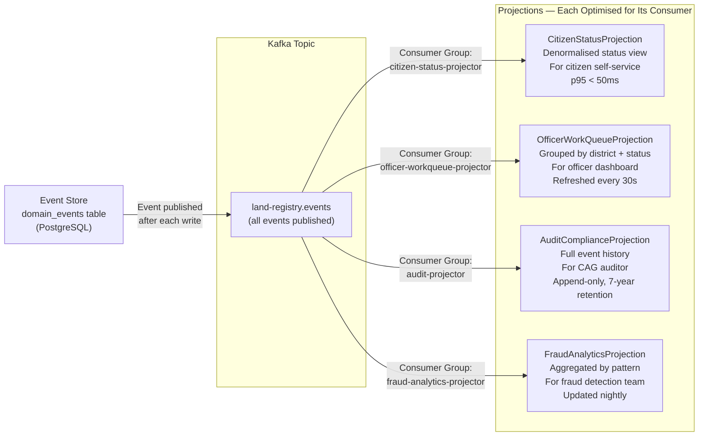
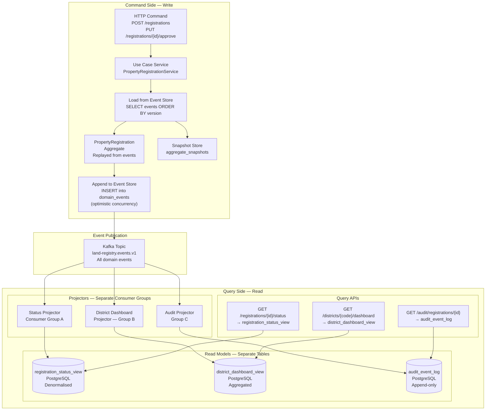
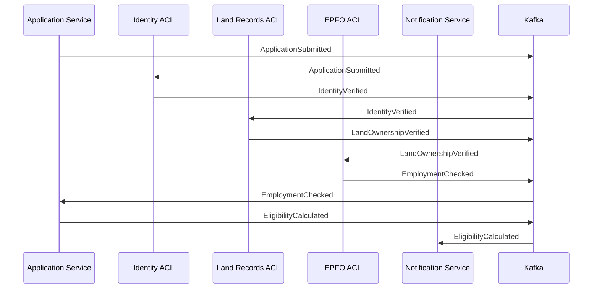
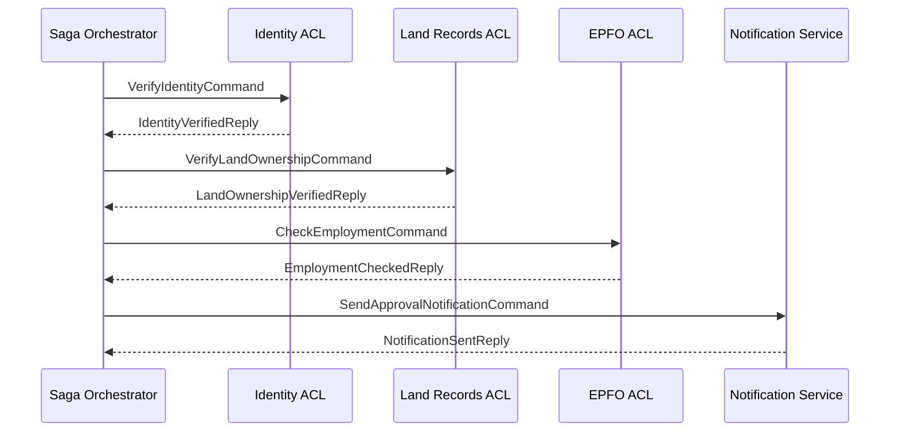
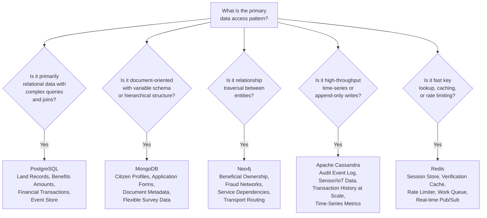
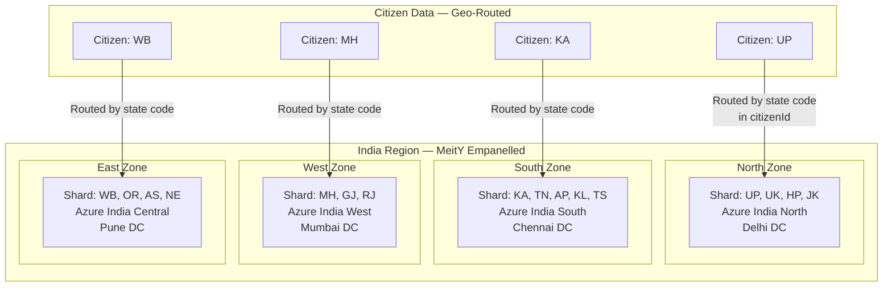
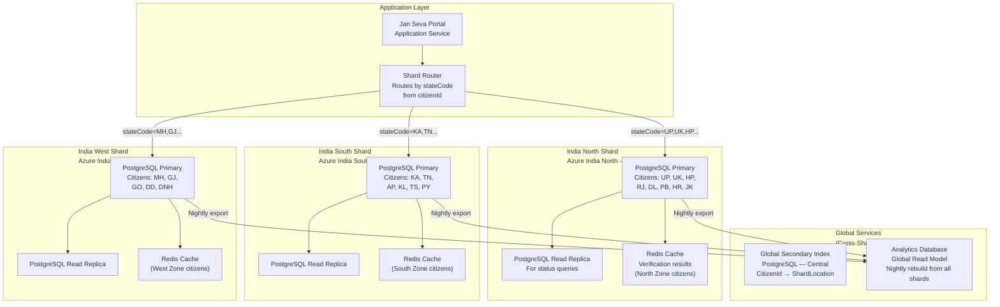
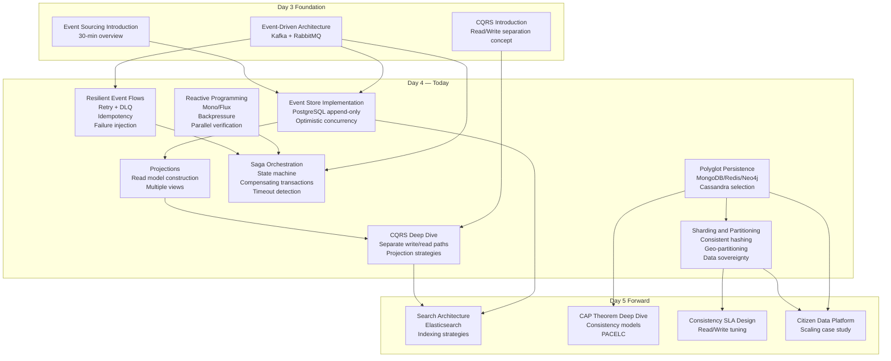

# STEP 1: COMPREHENSION SUMMARY — DAY 4

---

## Day 4: Event Sourcing, CQRS, Reactive Patterns, and Data Architecture Foundations

---

### Day Overview

**Day Title:** Distributed Systems Deep Dive — Event Sourcing, CQRS, Reactive Patterns, Workflow Engines, and Polyglot Persistence

**Total Duration:** 5.0 hours of structured content (within 6-8 hour workshop day, inclusive of breaks, Q&A, and group work)

---

### Modules, Topics, Sub-Topics, and Duration Allocation

| #   | Module                                          | Topic                                | Sub-Topic                                                                             | Duration           |
| --- | ----------------------------------------------- | ------------------------------------ | ------------------------------------------------------------------------------------- | ------------------ |
| 1   | Architectural Foundations — Distributed Systems | Event Sourcing & CQRS Deep Dive      | Event Sourcing: Event Store, Projections, Eventual Consistency, Benefits & Challenges | 1.0 hr             |
| 2   | Architectural Foundations — Distributed Systems | Event Sourcing & CQRS Deep Dive      | CQRS: Read/Write Separation, Projection Patterns, Snapshot Strategies                 | included in 1.0 hr |
| 3   | Architectural Foundations — Distributed Systems | Non-Blocking I/O & Reactive Patterns | Asynchronous Processing, Reactive Streams, Project Reactor Fundamentals               | 1.0 hr             |
| 4   | Architectural Foundations — Distributed Systems | Workflow Engines                     | Saga Orchestration with Camunda/Temporal, Long-Running Processes                      | included in 1.0 hr |
| 5   | Architectural Foundations — Distributed Systems | Hands-on: Resilient Event Flows      | Retries, Dead-Letter Queues, Idempotency, Failure-Injection Testing                   | 1.0 hr             |
| 6   | Architectural Foundations — Data Architecture   | Polyglot Persistence                 | MongoDB, Redis, Neo4j, Cassandra Use Cases and Data Model Selection                   | 1.0 hr             |
| 7   | Architectural Foundations — Data Architecture   | Sharding & Partitioning              | Horizontal Scaling, Consistent Hashing, Geo-Partitioning, Data Sovereignty            | 1.0 hr             |

---

### Key Focus Areas

- **Event Sourcing Deep Dive:** Building a working event store in PostgreSQL; implementing event projections that build read models from event streams; snapshot patterns for performance; schema evolution challenges; the relationship between Event Sourcing and audit compliance
- **CQRS Implementation:** Separate write model (command side with aggregate + event store) and read model (query side with denormalised projections); synchronous vs. asynchronous projection updates; multiple projections from the same event stream
- **Reactive Patterns:** Project Reactor (`Mono`, `Flux`), backpressure, non-blocking database access with R2DBC; when reactive is appropriate and when it is overkill; the impedance mismatch between reactive and traditional Spring
- **Workflow Engines:** Saga orchestration using a Camunda-inspired state machine pattern (Camunda itself is too heavy for a lab — we implement a lightweight orchestrator); Temporal concepts explained; compensating transactions; long-running process management
- **Resilient Event Flows:** Retry policies with exponential backoff; dead-letter queue patterns in Kafka and RabbitMQ; idempotency keys and exactly-once semantics; chaos engineering by deliberately injecting failures
- **Polyglot Persistence:** MongoDB for document storage (citizen profiles); Redis for caching and session management; Neo4j concepts for relationship data (benefit dependency graphs); Cassandra for wide-column time-series (audit events at scale)
- **Sharding and Partitioning:** Consistent hashing mathematics; Cassandra partition key design; geo-partitioning for data sovereignty compliance (DPDP Act 2023 data localisation); multi-region deployment patterns

---

### Learning Outcomes (Day 4)

1. Design and implement a PostgreSQL-backed event store with projection support
2. Implement CQRS with separate read and write models in Spring Boot
3. Apply reactive programming patterns using Project Reactor for non-blocking I/O
4. Design a saga orchestrator for long-running, multi-step government workflows
5. Build fault-tolerant event-driven microservices with retry, DLQ, and idempotency
6. Select appropriate NoSQL databases based on data model and access pattern analysis
7. Design sharding and partitioning strategies for government-scale data with geo-compliance

---

### Lab Project Theme / Narrative

**"DigiGov Service Gateway — Event Store + Polyglot Data Layer"**

Day 4's lab extends the existing DigiGov mesh with:
1. **Event Store** — PostgreSQL-backed event store replacing direct state storage in the Land Registry Service
2. **CQRS Read Model** — A separate `RegistrationStatusProjection` database table built from events
3. **MongoDB Integration** — Citizen profile document store added to Docker Compose
4. **Redis Integration** — Verification result cache in the Citizen Identity Service
5. **Resilience Patterns** — Retry and DLQ configuration with deliberate failure injection
6. **Saga Orchestrator** — Lightweight saga state machine for the multi-verification workflow

---

### Dependencies on Previous Days

- Day 2: Land Registry Service hexagonal architecture (event store replaces the JPA state store)
- Day 3: Citizen Identity Service (Redis cache added), Notification Service (resilience patterns added), Docker Compose mesh (MongoDB and Redis added)
- Day 4 feeds forward into: Day 5 (Search Architecture, CAP theorem, consistency models) and Day 7 (Outbox Pattern, CDC, advanced idempotency)

---

### Tech Stack Components Used Today

| Category    | Technology                                                 |
| ----------- | ---------------------------------------------------------- |
| Language    | Java 17 + Spring Boot 3.x + Maven                          |
| Reactive    | Spring WebFlux + Project Reactor                           |
| Event Store | PostgreSQL 15+ (append-only table)                         |
| Document DB | MongoDB 7+ (citizen profiles)                              |
| Cache       | Redis 7+ (verification results)                            |
| Wide-Column | Apache Cassandra concepts (theory; Cassandra lab in Day 5) |
| Containers  | Docker Desktop + Docker Compose                            |
| Messaging   | Apache Kafka (existing)                                    |
| AI Assist   | Microsoft Copilot / ChatGPT                                |

---

### Confirmation

> This comprehension summary accurately reflects the Day 4 curriculum. Proceeding to **Theory Document Generation**.
>
> **Note on length:** The Day 4 Theory Document is the most technically dense so far — covering 7 major topic areas across 5 hours. It will be generated in **4 parts**. Please respond with **"continue"** at each prompt to proceed.

---

# DAY 4 — THEORY DOCUMENT
## Senior Engineer to Solution Architect Program
### Document Type: Trainer's Master Reference | Day 4 of 12

---

# PART 1 OF 4: Event Sourcing and CQRS Deep Dive

---

# Section 1: Event Sourcing and CQRS — Full Implementation

## 1.1 Topic Title and Learning Objectives

**Topic:** Event Sourcing Architecture — Event Store Design, Projections, Snapshots, and CQRS Read/Write Separation

**Duration:** 1.0 hour

**Learning Objectives** — By the end of this section, participants will be able to:

1. **Design** a production-grade event store schema in PostgreSQL with optimistic concurrency control
2. **Implement** domain event persistence using the append-only pattern with version-based conflict detection
3. **Build** event projections that construct read models from event streams
4. **Apply** the snapshot pattern to prevent unbounded event log replay performance degradation
5. **Evaluate** the trade-offs of Event Sourcing in government systems — specifically the tension between auditability (pro) and schema evolution complexity (con)
6. **Distinguish** between synchronous and asynchronous projection update strategies and select appropriately

---

## 1.2 Concept Explanation

### The Analogy: The Ledger vs. The Balance Sheet

Every bank operates two accounting records simultaneously:

The **Ledger** (Event Sourcing) records every transaction in chronological order: *"Jan 1: +INR 5,000 deposit. Jan 3: -INR 1,200 withdrawal. Jan 5: +INR 10,000 salary credit."* The ledger is append-only — you never erase a transaction. If you made an error, you add a correcting entry. The ledger is the source of truth.

The **Balance Sheet** (CQRS Read Model / Projection) shows the current balance: *"INR 13,800."* It is derived from the ledger by summing all transactions. It is NOT the source of truth — it is a convenience view computed from the ledger. If the balance sheet is destroyed, it can be reconstructed from the ledger. The ledger cannot be reconstructed from the balance sheet alone.

This is the fundamental distinction between Event Sourcing and traditional state storage, and it maps directly to **CQRS**:
- **Command Side (Write):** Append new events to the ledger (event store)
- **Query Side (Read):** Read from the balance sheet (projection/read model)

In government systems, this pattern is not just a technical choice — it is a compliance requirement. The CAG audit requires the equivalent of a ledger: every state change with actor, timestamp, and business context. Event Sourcing provides this by design.

---

### 1.2.1 Event Store Design

An **Event Store** is an append-only database that records every state change as an immutable event. The key design principles are:

**Principle 1: Append-Only**
Events are never updated or deleted. A mistake is corrected by appending a compensating event. This is what makes the event store an auditable record — there is no history of deletions.

**Principle 2: Ordered by Aggregate and Version**
Events within an aggregate are ordered by version number. The version is the sequence number of events for a specific aggregate (not a global sequence). `PropertyRegistration abc-123` has events at versions 1, 2, 3... regardless of what other aggregates are doing.

**Principle 3: Optimistic Concurrency Control**
When saving events, the writer specifies the expected current version. If two processes try to save events for the same aggregate simultaneously, only one wins — the other receives a concurrency conflict error and must reload the aggregate and retry.

**Principle 4: Rich Metadata**
Every event carries metadata: `eventId` (UUID for idempotency), `occurredAt` (business timestamp), `recordedAt` (when stored — different from occurred for replayed/corrected events), `actorId` (who caused this), `correlationId` (distributed trace), `causationId` (which command caused this event).

**Event Store Schema:**

```sql
CREATE TABLE domain_events (
    -- Identity
    event_id            UUID            NOT NULL,

    -- Aggregate identification
    aggregate_id        VARCHAR(36)     NOT NULL,
    aggregate_type      VARCHAR(100)    NOT NULL,

    -- Ordering and concurrency control
    aggregate_version   INTEGER         NOT NULL,

    -- Event classification
    event_type          VARCHAR(200)    NOT NULL,
    event_version       VARCHAR(10)     NOT NULL DEFAULT '1.0',

    -- Payload
    event_data          JSONB           NOT NULL,

    -- Metadata
    occurred_at         TIMESTAMP WITH TIME ZONE    NOT NULL,
    recorded_at         TIMESTAMP WITH TIME ZONE    NOT NULL DEFAULT NOW(),
    actor_id            VARCHAR(200),
    correlation_id      VARCHAR(36),
    causation_id        UUID,

    -- Constraints
    CONSTRAINT pk_domain_events PRIMARY KEY (event_id),
    CONSTRAINT uq_aggregate_version
        UNIQUE (aggregate_id, aggregate_type, aggregate_version)
    -- This unique constraint IS the optimistic concurrency lock:
    -- Two writers cannot both insert version 3 for the same aggregate.
    -- PostgreSQL's unique constraint enforcement prevents the race condition.
);
```

> **Architect's Note:** The `UNIQUE (aggregate_id, aggregate_type, aggregate_version)` constraint is the most important line in the event store schema. It is NOT just a data quality constraint — it is the distributed concurrency control mechanism. When two transactions both try to INSERT version 3 for aggregate `abc-123`, PostgreSQL's unique constraint serialises them — one succeeds, one receives a `duplicate key` error. The application catches this error, reloads the aggregate from events 1-3, and retries. This is optimistic concurrency control without any explicit locking.

---

### 1.2.2 Loading and Saving Aggregates via Event Store

**Saving an Aggregate (Command Side):**

```
1. Load all events for aggregate_id from event_store (ordered by version)
2. Reconstruct current aggregate state by replaying events
3. Invoke domain command (enforces invariants, generates new events)
4. INSERT new events with version = (current_max_version + 1, +2, ...)
5. If INSERT fails with duplicate key → concurrency conflict → reload & retry
6. Publish events to Kafka (after successful INSERT)
```

**Loading an Aggregate:**

```
1. SELECT * FROM domain_events
   WHERE aggregate_id = ? AND aggregate_type = ?
   ORDER BY aggregate_version ASC
2. Apply each event in order to reconstruct the aggregate state
3. Return the fully reconstructed aggregate
```

**Performance Concern — Unbounded Replay:**
As an aggregate accumulates events over time (a property registration that is transferred, mortgaged, encumbered, released, and transferred again over 20 years could have hundreds of events), loading it from the full event history becomes progressively slower.

**Solution: Snapshots**

A **Snapshot** is a point-in-time serialisation of the aggregate state stored alongside the event log. Instead of replaying ALL events from the beginning, we:
1. Load the most recent snapshot (if one exists)
2. Replay only events that occurred AFTER the snapshot
3. This reduces replay from O(n) total events to O(events since last snapshot)

```sql
CREATE TABLE aggregate_snapshots (
    snapshot_id         UUID            NOT NULL DEFAULT gen_random_uuid(),
    aggregate_id        VARCHAR(36)     NOT NULL,
    aggregate_type      VARCHAR(100)    NOT NULL,
    aggregate_version   INTEGER         NOT NULL,
    snapshot_data       JSONB           NOT NULL,
    created_at          TIMESTAMP WITH TIME ZONE DEFAULT NOW(),

    CONSTRAINT pk_snapshots PRIMARY KEY (snapshot_id),
    CONSTRAINT uq_snapshot_version
        UNIQUE (aggregate_id, aggregate_type, aggregate_version)
);
```

**Snapshot Strategy:**
- Take a snapshot every N events (e.g., every 50 events) — time-based or event-count-based
- Take a snapshot after a significant state transition (e.g., after `PropertyRegistered` — the terminal state)
- Keep only the most recent snapshot per aggregate (older snapshots can be archived)

---

### 1.2.3 Projections — Building Read Models from Events

A **Projection** is a function that processes a stream of events and produces a read model — a denormalised, query-optimised representation of the data. Projections are the Query Side of CQRS.

**Projection Types:**

| Type                           | Description                                      | Update Strategy                                 | Government Use Case                                  |
| ------------------------------ | ------------------------------------------------ | ----------------------------------------------- | ---------------------------------------------------- |
| **Current State Projection**   | Represents the current state of an aggregate     | Updated on every relevant event                 | Application status for citizen self-service          |
| **Aggregation Projection**     | Summarises data across multiple aggregates       | Updated incrementally                           | District officer dashboard — count by status         |
| **Historical Projection**      | Represents state at a specific point in time     | Built on demand by replaying to timestamp       | Fraud investigation — "what was the state on Jan 5?" |
| **Cross-Aggregate Projection** | Joins data from multiple aggregate event streams | Updated when any contributing aggregate changes | Combined citizen + property view for officer UI      |

**Projection Update Strategies:**

| Strategy                          | Mechanism                                                      | Consistency           | Complexity                       | Government Fit                             |
| --------------------------------- | -------------------------------------------------------------- | --------------------- | -------------------------------- | ------------------------------------------ |
| **Synchronous (in-transaction)**  | Projection updated in same DB transaction as event INSERT      | Strong                | Low                              | Small systems, simple projections          |
| **Asynchronous (Kafka consumer)** | Projection updated by a Kafka consumer reading the event topic | Eventual (seconds)    | Medium                           | Recommended for most government systems    |
| **On-demand (query-time)**        | Projection rebuilt from event store at query time              | Strong                | High (slow for large aggregates) | Audit/compliance queries, historical state |
| **Background rebuild**            | Projection periodically rebuilt from scratch                   | Eventually consistent | Medium                           | Analytics dashboards, reporting            |

---

### 1.2.4 Event Schema Evolution

The most significant operational challenge with Event Sourcing is **schema evolution** — what happens when the structure of an event changes after events of that type are already stored?

**Challenge:** Event `PropertyRegistrationSubmitted` version 1.0 has payload: `{ownerName, aadhaarId, districtCode}`. Three months later, a new field `landHoldingAcres` is added. Old events in the store do NOT have this field. The projection code now expects it.

**Solutions:**

| Approach                          | Mechanism                                                                                              | Complexity | Risk                                      |
| --------------------------------- | ------------------------------------------------------------------------------------------------------ | ---------- | ----------------------------------------- |
| **Weak Schema (Tolerant Reader)** | Projection code handles missing fields with defaults                                                   | Low        | Easy to miss required fields              |
| **Event Upcasting**               | When loading old events, apply a transformation to add missing fields with defaults                    | Medium     | Transformation must be maintained forever |
| **New Event Version**             | Create `PropertyRegistrationSubmitted.v2` with the new field; old code handles v1, new code handles v2 | Medium     | Dual code paths                           |
| **Schema Registry**               | All event schemas registered centrally; consumers validate against schema                              | High       | Requires additional infrastructure        |

**Government Recommendation:** Use **Event Upcasting** for non-breaking additions (new optional fields) and **New Event Version** for breaking changes. Document every schema change in the ADR. Never delete old event handling code — old events persist indefinitely.

> **Anti-Pattern Warning:** The "just use `Object` for the payload" anti-pattern — storing events as completely unstructured JSON with no schema enforcement — makes projection code impossible to maintain and breaks silently when event structure changes. Always define explicit Java classes or JSON Schema for event payloads, even if the event store itself uses JSONB.

---

### 1.2.5 CQRS — Read/Write Separation in Depth

**CQRS** separates the application into two distinct sides:

**Command Side (Write Model):**
- Accepts commands (CreateRegistration, ApproveRegistration)
- Loads aggregate from event store by replaying events
- Invokes domain logic (invariant checking, business rules)
- Appends new events to event store
- Returns a result (the new aggregate ID, or void for updates)
- Does NOT return data to the client — only success/failure

**Query Side (Read Model):**
- Accepts queries (GetRegistrationStatus, GetDistrictDashboard)
- Reads from pre-computed, denormalised projection tables
- Returns data to the client immediately — no domain logic
- Never modifies state

**Why this matters:**

```
TRADITIONAL APPROACH:
GET /registrations/abc-123
  → Load PropertyRegistration aggregate (replay 47 events)
  → Return aggregate state as JSON
  → p95 latency: 150ms (47 event replay)

CQRS APPROACH:
GET /registrations/abc-123/status
  → SELECT status, updated_at FROM registration_status_view WHERE id = ?
  → Return denormalised view
  → p95 latency: 8ms (single indexed lookup)
```

The 18x latency difference compounds at scale. For a government portal with 10 million status checks per day, CQRS reduces database load proportionally.

---

### 1.2.6 Multiple Projections from One Event Stream

One of Event Sourcing's most powerful capabilities — and most underutilised — is building multiple, purpose-specific read models from the same event stream:



> **Architect's Note:** Each projection is owned by a DIFFERENT team or consumer. The citizen status projection is optimised for the citizen-facing API (sub-50ms reads). The fraud analytics projection is optimised for batch analysis (rebuilt nightly). The audit projection is optimised for regulatory compliance (append-only, tamper-evident). No single projection can serve all these needs well — Event Sourcing with multiple projections is the architecture that allows each consumer to have exactly the data model it needs, without coupling to the others.

---

## 1.3 High-Level Design: Event Sourcing + CQRS Architecture



---

## 1.4 Design Rationale and Trade-off Analysis

### Trade-off: Event Sourcing vs. Traditional State Storage

| Dimension             | Traditional State                                | Event Sourcing                                                   | Government Verdict                            |
| --------------------- | ------------------------------------------------ | ---------------------------------------------------------------- | --------------------------------------------- |
| **Audit trail**       | Requires separate audit table (often incomplete) | Built-in — every event is a timestamped, actor-attributed record | Event Sourcing wins for CAG compliance        |
| **Query performance** | Single indexed lookup for current state          | Requires projection; projection lookup is equally fast           | Tie (with projections)                        |
| **Write complexity**  | Simple INSERT/UPDATE                             | Event append + projection update                                 | Traditional wins for simple CRUD              |
| **Read flexibility**  | Fixed schema, hard to add new views              | New projection = new read model from existing events             | Event Sourcing wins for evolving requirements |
| **Schema evolution**  | ALTER TABLE — straightforward                    | Event upcasting — complex                                        | Traditional wins                              |
| **Temporal queries**  | Requires audit table + complex reconstruction    | Native — replay events to any timestamp                          | Event Sourcing wins                           |
| **Storage cost**      | Low — current state only                         | Higher — full event history                                      | Traditional wins                              |
| **Team complexity**   | Low — familiar to all developers                 | High — requires training and discipline                          | Traditional wins for small teams              |
| **Regulatory fit**    | Poor (requires manual audit implementation)      | Excellent (audit by default)                                     | Event Sourcing wins for government            |

> **Trade-off Alert:** `[Auditability and Temporal Queries] vs [Operational Complexity]` — Event Sourcing's benefits are highest in government systems where audit compliance is mandatory, regulatory investigation is common, and fraud detection requires historical data. The operational complexity is a one-time investment. The audit compliance value is continuous. For government systems with 15-year operational lifetimes, the ROI of Event Sourcing is positive. For a simple internal admin tool, it is overkill.

---

## 1.5 Implementation Walkthrough — Event Store in Java 17 + PostgreSQL

### 1.5.1 Event Store Port Interface

```java
// EventStore.java — Secondary Port
package gov.landregistry.application.port.out;

import gov.landregistry.domain.events.DomainEvent;
import java.util.List;
import java.util.Optional;

/**
 * SECONDARY PORT: EventStore
 *
 * The event store is a SECONDARY PORT — the application core defines
 * what it needs (append events, load events); the PostgreSQL adapter
 * implements how it is done.
 *
 * WHY A SEPARATE PORT FROM PropertyRepository:
 * When using Event Sourcing, the "repository" concept changes:
 * instead of storing the current aggregate state, we store events.
 * The EventStore port explicitly communicates this architectural intent.
 * A developer reading EventStore immediately understands: this is
 * an append-only log, not a traditional CRUD repository.
 */
public interface EventStore {

    /**
     * Append new events for an aggregate.
     * Implements optimistic concurrency: if expectedVersion does not match
     * the actual current version, throws OptimisticConcurrencyException.
     *
     * @param aggregateId      The aggregate's unique identifier
     * @param aggregateType    The aggregate class name (e.g., "PropertyRegistration")
     * @param events           The new events to append (in order)
     * @param expectedVersion  The version the caller expects the aggregate
     *                         to currently be at (0 for new aggregates)
     * @throws OptimisticConcurrencyException if expectedVersion != actual version
     */
    void appendEvents(
        String aggregateId,
        String aggregateType,
        List<DomainEvent> events,
        int expectedVersion
    );

    /**
     * Load all events for an aggregate, ordered by version.
     * Returns empty list for unknown aggregates (not an error).
     */
    List<StoredEvent> loadEvents(String aggregateId, String aggregateType);

    /**
     * Load events after a specific version (used with snapshots).
     * Returns events with version > afterVersion.
     */
    List<StoredEvent> loadEventsAfterVersion(
        String aggregateId,
        String aggregateType,
        int afterVersion
    );

    /**
     * A stored event — wraps the domain event with persistence metadata.
     */
    record StoredEvent(
        String eventId,
        String aggregateId,
        String aggregateType,
        int aggregateVersion,
        String eventType,
        String eventVersion,
        String eventDataJson,       // Serialised event payload
        java.time.Instant occurredAt,
        java.time.Instant recordedAt,
        String actorId,
        String correlationId
    ) {}

    /**
     * Thrown when optimistic concurrency check fails.
     * The caller must reload the aggregate and retry.
     */
    class OptimisticConcurrencyException extends RuntimeException {
        private final String aggregateId;
        private final int expectedVersion;
        private final int actualVersion;

        public OptimisticConcurrencyException(
                String aggregateId,
                int expectedVersion,
                int actualVersion) {
            super(String.format(
                "Optimistic concurrency conflict for aggregate %s. " +
                "Expected version %d but actual version is %d. " +
                "Reload the aggregate and retry.",
                aggregateId, expectedVersion, actualVersion
            ));
            this.aggregateId = aggregateId;
            this.expectedVersion = expectedVersion;
            this.actualVersion = actualVersion;
        }

        public String getAggregateId() { return aggregateId; }
        public int getExpectedVersion() { return expectedVersion; }
        public int getActualVersion() { return actualVersion; }
    }
}
```

### 1.5.2 PostgreSQL Event Store Adapter

```java
// PostgresEventStoreAdapter.java — Secondary Adapter
package gov.landregistry.adapter.out.eventstore;

import com.fasterxml.jackson.core.JsonProcessingException;
import com.fasterxml.jackson.databind.ObjectMapper;
import com.fasterxml.jackson.datatype.jsr310.JavaTimeModule;
import gov.landregistry.application.port.out.EventStore;
import gov.landregistry.domain.events.DomainEvent;
import org.slf4j.Logger;
import org.slf4j.LoggerFactory;
import org.springframework.dao.DuplicateKeyException;
import org.springframework.jdbc.core.JdbcTemplate;
import org.springframework.jdbc.core.RowMapper;
import org.springframework.stereotype.Component;

import java.sql.ResultSet;
import java.sql.SQLException;
import java.sql.Timestamp;
import java.time.Instant;
import java.util.List;
import java.util.UUID;

/**
 * SECONDARY ADAPTER: PostgresEventStoreAdapter
 *
 * Implements EventStore using PostgreSQL with the JSONB column type.
 *
 * WHY JDBC TEMPLATE (not JPA/Hibernate):
 * The event store requires precise control over the INSERT statement —
 * specifically, we need PostgreSQL to raise a duplicate key error when
 * the optimistic concurrency check fails. JPA's abstraction layer can
 * absorb or remap this error in unexpected ways.
 * JdbcTemplate gives us direct SQL control with Spring's exception
 * translation — exactly what we need for the event store pattern.
 *
 * WHY JSONB (not JSON):
 * JSONB stores the payload in a binary decomposed format.
 * Advantages over JSON: indexable (can create GIN indexes on event payload
 * fields), faster reads (parsed once on INSERT, not on every SELECT),
 * supports JSONPath queries for ad-hoc event analysis.
 * For a government audit system that needs ad-hoc queries
 * ("show all events where officerId = 'OFF-001'"), JSONB is essential.
 */
@Component
public class PostgresEventStoreAdapter implements EventStore {

    private static final Logger log =
        LoggerFactory.getLogger(PostgresEventStoreAdapter.class);

    private final JdbcTemplate jdbcTemplate;
    private final ObjectMapper objectMapper;

    public PostgresEventStoreAdapter(JdbcTemplate jdbcTemplate) {
        this.jdbcTemplate = jdbcTemplate;
        this.objectMapper = new ObjectMapper()
            .registerModule(new JavaTimeModule());
    }

    @Override
    public void appendEvents(
            String aggregateId,
            String aggregateType,
            List<DomainEvent> events,
            int expectedVersion) {

        if (events == null || events.isEmpty()) {
            log.debug("No events to append for aggregate {}", aggregateId);
            return;
        }

        // Validate expected version before attempting insert
        // This is an optimisation — the DB constraint catches concurrent
        // writes, but this catches single-threaded logic errors early
        validateExpectedVersion(aggregateId, aggregateType, expectedVersion);

        int currentVersion = expectedVersion;

        for (DomainEvent event : events) {
            currentVersion++;
            String eventDataJson = serialiseEvent(event);

            try {
                jdbcTemplate.update(
                    """
                    INSERT INTO domain_events (
                        event_id,
                        aggregate_id,
                        aggregate_type,
                        aggregate_version,
                        event_type,
                        event_version,
                        event_data,
                        occurred_at,
                        recorded_at,
                        actor_id,
                        correlation_id,
                        causation_id
                    ) VALUES (?, ?, ?, ?, ?, ?, ?::jsonb, ?, NOW(), ?, ?, ?)
                    """,
                    event.getEventId(),          // event_id
                    aggregateId,                  // aggregate_id
                    aggregateType,                // aggregate_type
                    currentVersion,               // aggregate_version
                    event.getEventType(),         // event_type
                    "1.0",                        // event_version
                    eventDataJson,                // event_data (JSONB)
                    Timestamp.from(event.getOccurredAt()), // occurred_at
                    null,                         // actor_id (enhanced in production)
                    null,                         // correlation_id
                    null                          // causation_id
                );

                log.debug("Appended event {} type={} version={} for aggregate {}",
                    event.getEventId(), event.getEventType(),
                    currentVersion, aggregateId);

            } catch (DuplicateKeyException e) {
                // The unique constraint (aggregate_id, aggregate_type, aggregate_version)
                // was violated — a concurrent writer appended the same version first.
                // This IS the optimistic concurrency control working correctly.
                throw new OptimisticConcurrencyException(
                    aggregateId,
                    expectedVersion,
                    getCurrentVersion(aggregateId, aggregateType)
                );
            }
        }

        log.info("Appended {} events for aggregate {} (versions {}-{})",
            events.size(), aggregateId, expectedVersion + 1, currentVersion);
    }

    @Override
    public List<StoredEvent> loadEvents(
            String aggregateId,
            String aggregateType) {

        return jdbcTemplate.query(
            """
            SELECT event_id, aggregate_id, aggregate_type,
                   aggregate_version, event_type, event_version,
                   event_data::text AS event_data_text,
                   occurred_at, recorded_at,
                   actor_id, correlation_id
            FROM domain_events
            WHERE aggregate_id = ?
              AND aggregate_type = ?
            ORDER BY aggregate_version ASC
            """,
            new StoredEventRowMapper(),
            aggregateId,
            aggregateType
        );
    }

    @Override
    public List<StoredEvent> loadEventsAfterVersion(
            String aggregateId,
            String aggregateType,
            int afterVersion) {

        return jdbcTemplate.query(
            """
            SELECT event_id, aggregate_id, aggregate_type,
                   aggregate_version, event_type, event_version,
                   event_data::text AS event_data_text,
                   occurred_at, recorded_at,
                   actor_id, correlation_id
            FROM domain_events
            WHERE aggregate_id = ?
              AND aggregate_type = ?
              AND aggregate_version > ?
            ORDER BY aggregate_version ASC
            """,
            new StoredEventRowMapper(),
            aggregateId,
            aggregateType,
            afterVersion
        );
    }

    // ── Private helpers ──────────────────────────────────────

    private void validateExpectedVersion(
            String aggregateId,
            String aggregateType,
            int expectedVersion) {

        int actual = getCurrentVersion(aggregateId, aggregateType);
        if (actual != expectedVersion) {
            throw new OptimisticConcurrencyException(
                aggregateId, expectedVersion, actual
            );
        }
    }

    private int getCurrentVersion(String aggregateId, String aggregateType) {
        Integer version = jdbcTemplate.queryForObject(
            """
            SELECT COALESCE(MAX(aggregate_version), 0)
            FROM domain_events
            WHERE aggregate_id = ? AND aggregate_type = ?
            """,
            Integer.class,
            aggregateId,
            aggregateType
        );
        return version != null ? version : 0;
    }

    private String serialiseEvent(DomainEvent event) {
        try {
            return objectMapper.writeValueAsString(event);
        } catch (JsonProcessingException e) {
            throw new RuntimeException(
                "Failed to serialise event " + event.getEventId() +
                " of type " + event.getEventType(), e
            );
        }
    }

    // ── Row Mapper ────────────────────────────────────────────

    private static class StoredEventRowMapper implements RowMapper<StoredEvent> {
        @Override
        public StoredEvent mapRow(ResultSet rs, int rowNum) throws SQLException {
            return new StoredEvent(
                rs.getString("event_id"),
                rs.getString("aggregate_id"),
                rs.getString("aggregate_type"),
                rs.getInt("aggregate_version"),
                rs.getString("event_type"),
                rs.getString("event_version"),
                rs.getString("event_data_text"),
                rs.getTimestamp("occurred_at").toInstant(),
                rs.getTimestamp("recorded_at").toInstant(),
                rs.getString("actor_id"),
                rs.getString("correlation_id")
            );
        }
    }
}
```

### 1.5.3 Projection — Registration Status Read Model

```java
// RegistrationStatusProjector.java
package gov.landregistry.adapter.out.projection;

import com.fasterxml.jackson.databind.JsonNode;
import com.fasterxml.jackson.databind.ObjectMapper;
import com.fasterxml.jackson.datatype.jsr310.JavaTimeModule;
import org.apache.kafka.clients.consumer.ConsumerRecord;
import org.slf4j.Logger;
import org.slf4j.LoggerFactory;
import org.springframework.jdbc.core.JdbcTemplate;
import org.springframework.kafka.annotation.KafkaListener;
import org.springframework.stereotype.Component;

/**
 * PROJECTOR: RegistrationStatusProjector
 *
 * Consumes Land Registry domain events from Kafka and maintains the
 * registration_status_view read model.
 *
 * WHY KAFKA CONSUMER (not database trigger or synchronous update):
 * Kafka consumer provides:
 * 1. Independent scalability — the projector can be scaled separately
 * 2. Replay capability — if the read model is corrupted, delete it and
 *    replay all events from beginning of Kafka topic
 * 3. Decoupling — the write side (event store) has no knowledge of
 *    the read model; adding a new projection = new consumer group
 * 4. Technology flexibility — the read model database can be different
 *    from the write database (PostgreSQL write, Elasticsearch read, etc.)
 *
 * CONSUMER GROUP: registration-status-projector-group
 * This is SEPARATE from notification-service-group — each consumer
 * group reads the full event stream independently.
 *
 * IDEMPOTENCY:
 * The projector uses UPSERT (INSERT ON CONFLICT UPDATE) — if the same
 * event is processed twice (Kafka at-least-once delivery), the result
 * is the same as processing it once. Idempotent projections are essential
 * for reliable eventual consistency.
 */
@Component
public class RegistrationStatusProjector {

    private static final Logger log =
        LoggerFactory.getLogger(RegistrationStatusProjector.class);

    private final JdbcTemplate jdbcTemplate;
    private final ObjectMapper objectMapper;

    public RegistrationStatusProjector(JdbcTemplate jdbcTemplate) {
        this.jdbcTemplate = jdbcTemplate;
        this.objectMapper = new ObjectMapper()
            .registerModule(new JavaTimeModule());
    }

    @KafkaListener(
        topics = {
            "land-registry.property-registration.submitted",
            "land-registry.property-registration.approved"
        },
        groupId = "registration-status-projector-group"
    )
    public void onLandRegistryEvent(ConsumerRecord<String, String> record) {
        try {
            JsonNode envelope = objectMapper.readTree(record.value());
            String eventType = envelope.get("eventType").asText();
            String aggregateId = envelope.get("aggregateId").asText();
            String occurredAt = envelope.get("occurredAt").asText();

            log.debug("Projecting event: type={} aggregateId={}",
                eventType, aggregateId);

            switch (eventType) {
                case "PropertyRegistrationSubmitted" -> projectSubmitted(
                    aggregateId, envelope, occurredAt
                );
                case "PropertyRegistrationApproved" -> projectApproved(
                    aggregateId, occurredAt
                );
                default -> log.debug("Projector ignoring event type: {}", eventType);
            }

        } catch (Exception e) {
            log.error("Projection failed for record at offset {}: {}",
                record.offset(), e.getMessage());
            // In production: send to projection DLQ; do NOT crash the projector
        }
    }

    private void projectSubmitted(
            String propertyId,
            JsonNode envelope,
            String occurredAt) {

        JsonNode payload = envelope.get("payload");

        // UPSERT — idempotent: safe to process the same event twice
        jdbcTemplate.update(
            """
            INSERT INTO registration_status_view (
                property_id,
                owner_aadhaar_id,
                district_code,
                status,
                submitted_at,
                last_updated_at
            ) VALUES (?, ?, ?, 'UNDER_REVIEW', ?::timestamptz, ?::timestamptz)
            ON CONFLICT (property_id) DO UPDATE
                SET status = EXCLUDED.status,
                    submitted_at = EXCLUDED.submitted_at,
                    last_updated_at = EXCLUDED.last_updated_at
            """,
            propertyId,
            payload.has("ownerAadhaarId")
                ? payload.get("ownerAadhaarId").asText() : null,
            payload.has("districtCode")
                ? payload.get("districtCode").asText() : null,
            occurredAt,
            occurredAt
        );

        log.info("Projected UNDER_REVIEW status for propertyId={}", propertyId);
    }

    private void projectApproved(String propertyId, String occurredAt) {
        jdbcTemplate.update(
            """
            UPDATE registration_status_view
            SET status = 'APPROVED',
                approved_at = ?::timestamptz,
                last_updated_at = ?::timestamptz
            WHERE property_id = ?
            """,
            occurredAt,
            occurredAt,
            propertyId
        );

        log.info("Projected APPROVED status for propertyId={}", propertyId);
    }
}
```

---

## 1.6 Real-World Case Study: US Social Security Administration — Event Sourcing for Benefit History

**Context:** The US Social Security Administration (SSA) manages benefit records for approximately 70 million recipients (publicly reported figure). Each recipient's benefit history involves dozens of state changes over decades: application, award, adjustment, suspension, reinstatement, appeal, and termination.

**The Traditional Architecture Problem (Illustrative):**

The SSA's legacy systems store the CURRENT state of benefits — the current payment amount, the current status. Investigative queries like "What was this recipient's benefit amount on March 15, 2019, and what caused it to change that day?" required forensic database archaeology — correlating timestamps across multiple tables, audit logs that may be incomplete, and paper records in federal archives.

**The Event Sourcing Solution (Illustrative — based on published digital transformation principles):**

Modern SSA digital transformation efforts focus on building an event log alongside existing state tables — the "event ledger" pattern. Every state change generates an immutable event: `BenefitAwarded`, `BenefitAdjusted`, `BenefitSuspended`, `AppealFiled`, `AppealResolved`.

**Outcomes (Hypothetical, based on published digital government patterns):**

| Problem                                          | Before Event Sourcing             | After Event Sourcing                       |
| ------------------------------------------------ | --------------------------------- | ------------------------------------------ |
| Time to answer "what was the benefit on date X?" | Days (manual record research)     | Seconds (replay events to timestamp)       |
| Fraud investigation time                         | Weeks (cross-system correlation)  | Hours (single event stream per recipient)  |
| Regulatory audit preparation                     | Months (manual report generation) | Days (automated event log export)          |
| Appeal resolution support                        | Weeks (assembling paper trail)    | Instant (full event history per recipient) |

**Architectural Lessons:**

1. **Event Sourcing does not require replacing the existing system.** The SSA pattern adds an event log ALONGSIDE the existing state tables — the "dual write" approach. During the transition, both the state table and the event log are maintained. Eventually, the state table becomes a projection of the event log.

2. **The business value of temporal queries is often underestimated.** Programme managers initially saw Event Sourcing as a technical architecture choice. After deployment, the most transformative benefit was discovered by the fraud investigation team — the ability to see the complete causal history of any benefit change turned weeks-long investigations into hours.

3. **Schema evolution is the real long-term cost.** After 5 years of event logging, the team had 47 different event types with 3-4 version variants each. Managing the upcasting logic for all historical event versions became a significant maintenance burden. Invest in schema governance from day one.

---

## 1.7 Food for Thought — Event Sourcing and CQRS

> **Provocation:** Greg Young, one of the pioneers of Event Sourcing, said in a 2014 talk: *"Event Sourcing is not a silver bullet. There are very few systems where Event Sourcing is the right answer. Most systems that use Event Sourcing should not."*
>
> Yet in government systems, Event Sourcing aligns naturally with regulatory requirements that have existed for centuries — ledger accounting, audit trails, immutable records. The oldest Event Sourcing system in the world is double-entry bookkeeping, invented in 15th century Italy.
>
> **The question is:** Is your government system a ledger (every state change is a meaningful, auditable business event) or is it a whiteboard (a scratchpad of current state that gets erased and rewritten)? If it is a ledger, Event Sourcing is natural. If it is a whiteboard, Event Sourcing is forced.
>
> Research prompt for Copilot/ChatGPT: *"What is the 'Event Sourcing is not for everything' argument? Describe five types of systems where Event Sourcing is clearly inappropriate and explain why. For each, describe what the appropriate alternative is. Then describe the one type of government system where Event Sourcing is clearly the right choice — and explain the architectural reasoning."*

---

## 1.8 Questionnaire — Section 1

**Conceptual Questions**

1. What is the difference between an event store and a traditional relational database table? Specifically, what constraints are placed on the event store that are not placed on a traditional table, and why are those constraints architecturally significant?

2. Explain optimistic concurrency control in the context of an event store. Why is the `UNIQUE (aggregate_id, aggregate_type, aggregate_version)` database constraint the implementation of optimistic concurrency — not just a data integrity rule?

3. What is an Event Sourcing projection? Distinguish between a "current state projection," an "aggregation projection," and a "historical projection." Give a government example of each.

**Application Questions**

4. Design the event store schema for a government benefits system. The `BenefitApplication` aggregate has the following event types: `BenefitApplicationSubmitted`, `EligibilityAssessed`, `BenefitGranted`, `BenefitAmountAdjusted`, `BenefitSuspended`, `BenefitReinstatated`, `BenefitTerminated`. Write the CREATE TABLE statement for the event store and for one projection table — the `current_benefit_status_view`.

5. The `PropertyRegistration` aggregate in the Jan Seva Portal has been live for 6 months. A new requirement arrives: add a `landHoldingAcres` field to the `PropertyRegistrationSubmitted` event. Old events (6 months of production data) do not have this field. Describe the event upcasting strategy you would implement: show the upcast logic in pseudocode and explain how the projection code handles both old and new event versions.

6. You are building the officer work queue projection for the Jan Seva Portal. Officers need to see: a list of applications in UNDER_REVIEW status, grouped by district, sorted by submission date (oldest first), with the count per district. Write the SQL for the projection table and the SQL query the API would execute.

**Analysis Questions**

7. A team argues: "CQRS is overengineering. We can make our read queries fast with proper indexes on the write model database. Why maintain two separate models?" Analyse this argument. Under what conditions is the team right? Under what conditions is CQRS clearly justified? Use the Jan Seva Portal's performance requirements (p95 submission < 2s, p95 status check < 200ms) to make the case.

8. Compare synchronous projection updates (update the read model in the same database transaction as the event store write) versus asynchronous projection updates (Kafka consumer updates the read model after the event is published). Analyse: consistency guarantees, failure modes, scalability, and operational complexity. Which is more appropriate for the Jan Seva Portal?

**Scenario-Based Questions**

9. The Jan Seva Portal's Kafka cluster experiences a 2-hour outage. During this time, 50,000 new applications are submitted — they are saved to the event store but the Kafka events are never published. The registration_status_view projection is now 2 hours behind. When Kafka recovers: (a) how do you reconcile the projection with the event store? (b) what is the citizen experience during the 2-hour gap? (c) what architectural pattern would prevent this gap from occurring?

10. An Indian CAG auditor requests: "For all property registrations approved by Officer OFF-2024-001 between January 1 and March 31, 2024, show the complete event history for each registration — including every state change, the actor responsible, and the timestamp." Write the SQL query that would satisfy this request against the event store schema defined in this section. What index would you create to make this query performant?

**Answer Key — Section 1**

| Q   | Answer Summary                                                                                                                                                                                                                                                                                                                                                                                                                                                                                                                                                                                                                                                                                                                                                                                                                                                                                                                                                                                          |
| --- | ------------------------------------------------------------------------------------------------------------------------------------------------------------------------------------------------------------------------------------------------------------------------------------------------------------------------------------------------------------------------------------------------------------------------------------------------------------------------------------------------------------------------------------------------------------------------------------------------------------------------------------------------------------------------------------------------------------------------------------------------------------------------------------------------------------------------------------------------------------------------------------------------------------------------------------------------------------------------------------------------------- |
| 1   | Event store constraints: (1) Append-only — no UPDATE or DELETE operations; (2) Version uniqueness — UNIQUE(aggregate_id, aggregate_type, aggregate_version) prevents concurrent overwrites; (3) Immutability — events represent historical facts, not current state. Traditional table: mutable (UPDATE/DELETE allowed), no version ordering requirement, current state only. Architectural significance: append-only + immutability = natural audit trail; version uniqueness = optimistic concurrency control without explicit locking.                                                                                                                                                                                                                                                                                                                                                                                                                                                               |
| 2   | Optimistic concurrency: each event insertion specifies the next sequential version number. The UNIQUE constraint ensures only one writer can insert version N for a given aggregate. If two concurrent writers both try to insert version 3, PostgreSQL serialises them — one succeeds, one receives a duplicate key error. The application catches this error, reloads the aggregate (now at version 3), and retries with version 4. This achieves concurrency safety without pessimistic locking (no SELECT FOR UPDATE, no mutex). It is not just a data integrity rule because it is the ONLY concurrency control mechanism — removing the constraint would allow concurrent overwrites producing an inconsistent event log.                                                                                                                                                                                                                                                                         |
| 3   | Current state projection: SELECT-equivalent of the aggregate's current state — e.g., `registration_status_view` showing current status for a single registration. Government example: "What is the current status of application abc-123?" Aggregation projection: aggregates across multiple aggregates — e.g., `district_workqueue_view` showing count of UNDER_REVIEW applications per district. Government example: "How many applications are pending in Bengaluru district today?" Historical projection: rebuilt on-demand by replaying events to a specific timestamp — e.g., "What was the status of application abc-123 on January 15, 2024 at 14:00 UTC?" Government example: fraud investigation or regulatory audit.                                                                                                                                                                                                                                                                       |
| 4   | Event store: same schema as defined in Section 1.2.1 with appropriate aggregate_type = 'BenefitApplication'. Projection: `CREATE TABLE current_benefit_status_view (application_id VARCHAR(36) PRIMARY KEY, recipient_id VARCHAR(36) NOT NULL, status VARCHAR(30) NOT NULL CHECK (status IN ('SUBMITTED', 'ELIGIBLE', 'INELIGIBLE', 'GRANTED', 'SUSPENDED', 'REINSTATED', 'TERMINATED')), monthly_amount DECIMAL(10,2), effective_date DATE, last_updated_at TIMESTAMPTZ NOT NULL, last_event_type VARCHAR(100));` Indexes: `CREATE INDEX ON current_benefit_status_view (recipient_id); CREATE INDEX ON current_benefit_status_view (status);`                                                                                                                                                                                                                                                                                                                                                         |
| 5   | Upcast strategy: Create `EventUpcaster` class with method `upcast(eventType, version, jsonNode) → JsonNode`. For `PropertyRegistrationSubmitted` version 1.0 (missing `landHoldingAcres`): `if (eventType.equals("PropertyRegistrationSubmitted") && version.equals("1.0")) { return addField(jsonNode, "landHoldingAcres", 0.0); }`. The projection code checks: `double acres = payload.has("landHoldingAcres") ? payload.get("landHoldingAcres").asDouble() : 0.0;`. Apply upcasting when loading from event store BEFORE passing to domain or projection logic. New events in the store always have `event_version = "1.1"` with the field present.                                                                                                                                                                                                                                                                                                                                                 |
| 6   | Projection table: `CREATE TABLE officer_workqueue_view (property_id VARCHAR(36) PRIMARY KEY, district_code VARCHAR(20) NOT NULL, status VARCHAR(20) NOT NULL, submitted_at TIMESTAMPTZ NOT NULL, owner_name VARCHAR(200));` Index: `CREATE INDEX idx_workqueue_district_status ON officer_workqueue_view (district_code, status, submitted_at ASC);`. Query: `SELECT district_code, COUNT(*) as pending_count, MIN(submitted_at) as oldest_submission FROM officer_workqueue_view WHERE status = 'UNDER_REVIEW' GROUP BY district_code ORDER BY oldest_submission ASC;`                                                                                                                                                                                                                                                                                                                                                                                                                                 |
| 7   | Team is right when: single-team system, well-understood query patterns, consistent read/write ratio, small dataset, no separate scaling requirements for reads vs. writes. CQRS is justified when: read patterns differ fundamentally from write patterns (10M status checks/day vs. 2M applications/year); write model requires complex aggregate replay (event sourcing) while reads need simple lookups; different consistency requirements (strong for writes, eventual acceptable for reads); different teams own read vs. write; read model needs denormalisation that would violate write model normalisation. Jan Seva Portal: 10M status checks at p95 < 200ms = simple indexed lookup on denormalised table. Write model with event replay cannot achieve this. CQRS is justified.                                                                                                                                                                                                            |
| 8   | Synchronous: strong consistency (read model updated in same transaction as write — never stale), but: single transaction spanning event store + read model = larger transaction = higher lock contention; if read model update fails, event is rolled back (write also fails); cannot scale read model independently. Asynchronous (Kafka): eventual consistency (projection updates within seconds), but: independent scalability; failure in projector does not affect write path; replay capability; multiple projections from one event stream. Jan Seva Portal: asynchronous is appropriate. Citizens can tolerate 1-2 second eventual consistency on status checks (their application was just submitted — they do not need microsecond updates). The independent scalability and replay capability outweigh the consistency delay.                                                                                                                                                               |
| 9   | (a) Reconciliation: when Kafka recovers, events in the event store that were not published must be replayed. Approach: query event store for events with `recorded_at` during the outage window where no corresponding Kafka event exists (identified by checking projection `last_event_id` vs. event store). Republish these events to Kafka. Projection catches up automatically. Alternative (better): Transactional Outbox Pattern (Day 7) — events are written to an `outbox` table in the same transaction as the event store; a separate process reads the outbox and publishes to Kafka; Kafka outage only delays publishing, events are never lost. (b) Citizen experience: application submission returns 201 successfully (event store write succeeded). Status check shows stale data or "Pending" for up to 2 hours. Citizen SMS is delayed (Notification Service also affected). This is acceptable for a government benefits portal. (c) Transactional Outbox Pattern prevents the gap. |
| 10  | SQL: `SELECT de.event_id, de.aggregate_id AS property_id, de.event_type, de.event_data->>'officerId' AS officer_id, de.occurred_at, de.actor_id FROM domain_events de WHERE de.aggregate_type = 'PropertyRegistration' AND de.event_type = 'PropertyRegistrationApproved' AND de.event_data->>'approvedByOfficerId' = 'OFF-2024-001' AND de.occurred_at BETWEEN '2024-01-01' AND '2024-03-31 23:59:59';` — then for each property_id, `SELECT * FROM domain_events WHERE aggregate_id = ? ORDER BY aggregate_version ASC;`. Index: `CREATE INDEX idx_events_type_officer ON domain_events USING GIN (event_data) WHERE event_type = 'PropertyRegistrationApproved';` — GIN index on JSONB allows efficient filtering on `event_data->>'approvedByOfficerId'`.                                                                                                                                                                                                                                           |

---

# Section 2: Non-Blocking I/O and Reactive Patterns

## 2.1 Topic Title and Learning Objectives

**Topic:** Asynchronous Processing, Project Reactor, Reactive Streams, and When Reactive is the Right Choice

**Duration:** 0.5 hour (within the combined 1.0-hour session with Workflow Engines)

**Learning Objectives** — By the end of this section, participants will be able to:

1. **Explain** the fundamental difference between blocking I/O (thread-per-request) and non-blocking I/O (event loop) and why this distinction matters at government scale
2. **Identify** the core Project Reactor types — `Mono<T>` and `Flux<T>` — and describe when each is appropriate
3. **Apply** backpressure concepts to prevent fast producers from overwhelming slow consumers
4. **Evaluate** the conditions under which reactive programming is justified versus when traditional imperative Spring MVC is sufficient
5. **Recognise** the impedance mismatch between reactive and blocking code and the architectural consequences of mixing them

---

## 2.2 Concept Explanation

### The Analogy: The Restaurant Kitchen

**Blocking I/O (Traditional Spring MVC)** is like a restaurant where each waiter is dedicated to ONE table for the entire meal. The waiter takes the order, walks to the kitchen, stands at the kitchen counter waiting for the food to be prepared (doing nothing while waiting), picks up the food, and returns to the table. If the restaurant has 200 tables, it needs 200 waiters — even though most of them are standing idle in the kitchen at any given moment.

**Non-Blocking I/O (Reactive / WebFlux)** is like a modern restaurant where one waiter manages MULTIPLE tables simultaneously. The waiter takes an order, submits it to the kitchen, immediately moves to take another table's order, then returns when notified that the first table's food is ready. Ten waiters can serve 200 tables because they are never idle — they always have another task to pick up while waiting for I/O to complete.

The "I/O" in a government system is not just disk reads — it is UIDAI API calls (300ms average), database queries (5-50ms), Kafka produce confirmations (10ms), and NPCI payment calls (500ms). Every millisecond a thread spends waiting for these operations is a thread that cannot serve another citizen request.

---

### 2.2.1 Thread-Per-Request vs. Event Loop

**Thread-Per-Request Model (Spring MVC — Blocking):**

```
Request arrives → Thread allocated from pool → Thread processes request →
Thread waits for DB query (blocked — doing nothing) →
Thread waits for external API call (blocked — doing nothing) →
Thread sends response → Thread returned to pool

Thread pool: typically 200 threads
Maximum concurrent requests: 200
Memory per thread: ~1MB stack = 200MB for 200 threads
During peak: 201st request waits for a thread to free up
```

**Event Loop Model (Spring WebFlux — Non-Blocking):**

```
Request arrives → Event loop thread picks it up →
Non-blocking DB query initiated → Event loop thread immediately picks up next request →
(event loop continues processing other requests) →
DB query completes → callback fires → event loop thread handles the response →
Response sent

Event loop threads: typically 2 × CPU cores (e.g., 16 threads on 8-core machine)
Maximum concurrent requests: limited by memory, not threads
Memory: 16 threads × 1MB = 16MB regardless of concurrent request count
```

**When does this matter?**

| Scenario                                                   | Thread-Per-Request                  | Event Loop                                  |
| ---------------------------------------------------------- | ----------------------------------- | ------------------------------------------- |
| 100 concurrent requests, each taking 10ms                  | 100 threads, 100ms total            | 16 threads, 100ms total — no difference     |
| 10,000 concurrent requests, each taking 500ms (UIDAI call) | Need 10,000 threads — impossible    | 16 threads handle all — I/O time is "free"  |
| CPU-intensive work (PDF generation, encryption)            | Works well — threads doing CPU work | No benefit — CPU work blocks the event loop |

**Government Scale Relevance:** The Jan Seva Portal's multi-agency verification involves 5 external API calls averaging 300-800ms each. With blocking I/O, each in-flight application occupies a thread for the full verification duration. With non-blocking I/O, the same threads handle hundreds of in-flight applications simultaneously.

---

### 2.2.2 Project Reactor — Core Types

**Project Reactor** is the reactive programming library underlying Spring WebFlux. It implements the **Reactive Streams** specification — a standard for asynchronous stream processing with non-blocking backpressure.

**`Mono<T>`** — A publisher that emits 0 or 1 item, then completes or errors:

```java
// Mono represents a single async value — like CompletableFuture<T>
// But with operators for transformation and composition

// Creating a Mono
Mono<String> greeting = Mono.just("Hello, Citizen");
Mono<PropertyRegistration> registration = Mono.fromCallable(
    () -> repository.findById(propertyId)  // called on a scheduler, not blocking
);
Mono<Void> empty = Mono.empty();  // completes with no value

// Transforming a Mono
Mono<RegistrationResponse> response = registration
    .map(reg -> new RegistrationResponse(reg.getId().getValue(), reg.getStatus()))
    .defaultIfEmpty(RegistrationResponse.notFound());

// Composing Monos (non-blocking sequential calls)
Mono<EligibilityResult> eligibility = identityService.verifyCitizen(aadhaarId)
    .flatMap(citizenId -> landService.verifyOwnership(citizenId))
    .flatMap(ownership -> eligibilityService.calculate(ownership));
```

**`Flux<T>`** — A publisher that emits 0 to N items, then completes or errors:

```java
// Flux represents an async stream — like a reactive List or Stream

// Creating a Flux
Flux<PropertyRegistration> allRegistrations = Flux.fromIterable(registrationList);
Flux<DomainEvent> eventStream = Flux.fromStream(
    () -> eventStore.loadAllEvents().stream()
);

// Processing a Flux
Flux<RegistrationSummary> summaries = allRegistrations
    .filter(reg -> reg.getStatus() == RegistrationStatus.UNDER_REVIEW)
    .map(reg -> new RegistrationSummary(reg.getId(), reg.getDistrictCode()))
    .take(100);  // Only first 100 results

// Collecting a Flux to a Mono
Mono<List<RegistrationSummary>> collected = summaries.collectList();
```

---

### 2.2.3 Backpressure

**Backpressure** is the mechanism by which a consumer signals to a producer how much data it can handle. Without backpressure, a fast producer overwhelms a slow consumer — the equivalent of a news printer printing 1,000 pages per second while the reader can only read 1 page per second. The unread pages pile up until memory is exhausted.

```java
// Without backpressure — producer doesn't care about consumer speed
// This can cause OutOfMemoryError if producer is faster than consumer
Flux<ApplicationEvent> events = Flux.interval(Duration.ofMillis(1))  // 1000/sec
    .map(i -> new ApplicationEvent());

// WITH backpressure — consumer requests only what it can handle
events
    .onBackpressureBuffer(1000)  // Buffer up to 1000 items
    .subscribe(
        event -> processEvent(event),  // Process one at a time
        error -> log.error("Stream error", error)
    );

// Alternative: drop strategy for non-critical streams (e.g., live dashboards)
events
    .onBackpressureDrop(dropped -> log.warn("Dropped event: {}", dropped))
    .subscribe(this::updateDashboard);
```

**Government Relevance:** When the Kharif season begins and 50,000 farmers submit applications in the first hour, the event stream flowing into the eligibility calculation service becomes a high-throughput publisher. Without backpressure, the eligibility service is overwhelmed. With backpressure, it processes at its capacity and signals the upstream to slow down — preventing out-of-memory crashes.

---

### 2.2.4 When NOT to Use Reactive Programming

This is the most important sub-section for architects — reactive programming is frequently over-applied.

**DO use reactive (WebFlux) when:**
- High concurrency with many concurrent I/O-bound operations (thousands of simultaneous external API calls)
- Streaming responses (Server-Sent Events, live dashboards, real-time status feeds)
- Reactive data access layer (R2DBC for non-blocking PostgreSQL, Reactive MongoDB)
- The team has reactive programming expertise

**DO NOT use reactive when:**
- The application is primarily CPU-bound (PDF generation, cryptography, report generation)
- The team lacks reactive programming experience — the learning curve is steep and bugs are subtle
- You mix blocking and non-blocking code — blocking inside a reactive pipeline is worse than not using reactive at all
- The database driver is not reactive (JDBC is blocking — using JDBC in a WebFlux app defeats the purpose)
- Simple CRUD applications with moderate concurrency — Spring MVC is faster to develop and equally performant

> **Anti-Pattern Warning:** The "Reactive Everything" anti-pattern — applying WebFlux to every Spring Boot service regardless of whether the concurrency pattern justifies it — is rampant in enterprise Java. A government form submission service that processes 100 concurrent requests per second does NOT need WebFlux. The code complexity increase is not justified. Use WebFlux selectively for the services where the concurrency profile clearly benefits from non-blocking I/O.

> **Production Insight:** Mixing blocking code inside a reactive pipeline is the #1 source of subtle production bugs in reactive Spring applications. When you call a blocking JDBC repository inside a `flatMap()`, you block the event loop thread — the very problem reactive was meant to solve. If you must use blocking code, always subscribe on a `Schedulers.boundedElastic()` scheduler which uses a dedicated thread pool for blocking operations.

---

### 2.2.5 Reactive Pattern: Parallel Verification Calls

The most compelling reactive use case in the Jan Seva Portal is the multi-agency parallel verification:

```java
// NON-REACTIVE (blocking, sequential) — total time = sum of all calls
// If each call takes 300ms: 5 × 300ms = 1500ms
public VerificationBundle verifyAll(String aadhaarId) {
    IdentityResult identity = uidaiService.verify(aadhaarId);  // 300ms
    DocumentResult docs = digilockerService.fetch(aadhaarId);  // 400ms
    LandResult land = revenueService.checkOwnership(aadhaarId); // 600ms
    EmploymentResult emp = epfoService.checkStatus(aadhaarId);  // 350ms
    // Total: 1650ms
    return new VerificationBundle(identity, docs, land, emp);
}

// REACTIVE (non-blocking, parallel) — total time = max of all calls
// All 4 calls execute simultaneously: max(300, 400, 600, 350) = 600ms
public Mono<VerificationBundle> verifyAllParallel(String citizenId) {
    Mono<IdentityResult> identity = identityClient.verify(citizenId)
        .subscribeOn(Schedulers.boundedElastic());

    Mono<DocumentResult> docs = digilockerClient.fetch(citizenId)
        .subscribeOn(Schedulers.boundedElastic());

    Mono<LandResult> land = revenueClient.checkOwnership(citizenId)
        .subscribeOn(Schedulers.boundedElastic());

    Mono<EmploymentResult> emp = epfoClient.checkStatus(citizenId)
        .subscribeOn(Schedulers.boundedElastic());

    // Zip combines all four Monos — completes when ALL complete
    return Mono.zip(identity, docs, land, emp)
        .map(tuple -> new VerificationBundle(
            tuple.getT1(),  // identity
            tuple.getT2(),  // docs
            tuple.getT3(),  // land
            tuple.getT4()   // employment
        ));
}
// 2.75x faster: 1650ms → 600ms
```

---

## 2.3 Questionnaire — Section 2

**Conceptual Questions**

1. Explain the thread-per-request model and the event loop model. What resource does each model consume under high concurrency, and why does the event loop model scale better for I/O-bound workloads?

2. What is the difference between `Mono<T>` and `Flux<T>` in Project Reactor? Give one government system example where each would be the appropriate return type from a service method.

3. What is backpressure in reactive streams? Why is it essential for government systems that experience burst traffic patterns (e.g., Kharif season applications)? What happens without it?

**Application Questions**

4. A government portal service receives 10,000 concurrent status check requests. Each request requires one PostgreSQL query taking 20ms. Calculate: (a) the number of threads required with blocking Spring MVC (assuming each thread is occupied for the full 20ms), (b) the number of threads required with non-blocking WebFlux + R2DBC, and (c) the memory difference assuming 1MB per thread stack.

5. Rewrite the following blocking code as a non-blocking reactive chain using Project Reactor. The original code: loads a citizen profile from MongoDB (100ms), verifies their eligibility (50ms CPU), then calls the NPCI payment API (400ms). Use `Mono`, `flatMap`, and `subscribeOn` appropriately.

6. A developer on your team has written the following WebFlux controller method: `Flux.fromIterable(jdbcRepository.findAll()).map(this::toDto)`. Identify the architectural problem and explain why this is worse than not using WebFlux at all.

**Analysis Questions**

7. A government team is building a new Land Records portal that must handle 500 concurrent users at peak with each request requiring: one PostgreSQL query, one Redis cache check, and one external State Revenue API call (average 800ms). Should this service use Spring MVC (blocking) or Spring WebFlux (non-blocking)? Justify your answer with quantitative reasoning.

8. Compare `Mono.zip()` (parallel composition) with `Mono.flatMap()` chaining (sequential composition) for the multi-agency verification scenario. When would sequential composition be preferable to parallel, even if parallel is faster?

**Answer Key — Section 2**

| Q   | Answer Summary                                                                                                                                                                                                                                                                                                                                                                                                                                                                                                                                                                                                                                                                                                                                                                                                                                                                                                                          |
| --- | --------------------------------------------------------------------------------------------------------------------------------------------------------------------------------------------------------------------------------------------------------------------------------------------------------------------------------------------------------------------------------------------------------------------------------------------------------------------------------------------------------------------------------------------------------------------------------------------------------------------------------------------------------------------------------------------------------------------------------------------------------------------------------------------------------------------------------------------------------------------------------------------------------------------------------------- |
| 1   | Thread-per-request: one thread per active request — thread is blocked during I/O (sleeping, consuming memory but no CPU). Under high concurrency, thread pool exhaustion causes request queuing. Typical limit: 200 threads = 200 concurrent requests. Event loop: small fixed pool of threads (2 × CPU cores), non-blocking I/O — when I/O is pending, thread immediately handles another request. Under high concurrency: same 16 threads handle thousands of concurrent I/O-bound requests. Scales better because I/O wait time is "free" — no thread consumed during wait.                                                                                                                                                                                                                                                                                                                                                          |
| 2   | `Mono<T>`: single async result — `Mono<CitizenVerification>` from `findCitizenById()`, or `Mono<Void>` from `approveBenefit()`. `Flux<T>`: stream of results — `Flux<ApplicationSummary>` from `findApplicationsByDistrict()` returning potentially thousands of records. Government examples: `Mono<BenefitStatus>` = "Get current benefit status for one recipient." `Flux<AuditEvent>` = "Stream all audit events for a CAG report generation."                                                                                                                                                                                                                                                                                                                                                                                                                                                                                      |
| 3   | Backpressure: consumer signals to producer how many items it can handle next. Without it: producer emits faster than consumer processes → in-memory buffer grows → OutOfMemoryError → service crash. Government burst scenario: at Kharif season peak, 50,000 applications submitted in first hour (14 per second). Without backpressure, the event stream into the eligibility service overwhelms its processing capacity. With backpressure (e.g., `onBackpressureBuffer(10000)`), the eligibility service buffers up to 10,000 events and signals upstream to slow down — preventing crash while maintaining throughput.                                                                                                                                                                                                                                                                                                             |
| 4   | (a) Blocking Spring MVC: 10,000 requests × 20ms each. With a thread pool of 200: 10,000 ÷ 200 = 50 batches × 20ms = 1000ms total elapsed time. Actually needs 10,000 threads if all arrive simultaneously — thread pool exhaustion for pool < 10,000. (b) Non-blocking WebFlux + R2DBC: 16 threads (8-core machine). All 10,000 queries initiated simultaneously non-blocking; threads freed during I/O wait; 10,000 responses processed as queries complete. Total elapsed: ~20ms (not 1000ms). (c) Memory: blocking at 10,000 threads = 10,000 × 1MB = 10GB thread stack memory. WebFlux: 16 × 1MB = 16MB. Difference: 9,984MB — nearly 10GB saved.                                                                                                                                                                                                                                                                                   |
| 5   | Reactive chain: `Mono<CitizenProfile> profile = mongoReactiveRepository.findByCitizenId(citizenId); Mono<EligibilityResult> eligibility = profile.map(p -> eligibilityService.check(p)).subscribeOn(Schedulers.boundedElastic()); // CPU — offload to bounded elastic Mono<PaymentResult> payment = eligibility.filter(EligibilityResult::isEligible).flatMap(e -> npciWebClient.initiatePayment(e)); // non-blocking HTTP client return payment;` Key points: `subscribeOn(boundedElastic())` for CPU work; `WebClient` (non-blocking) for NPCI call — not RestTemplate; `flatMap` not `map` for Mono-returning operations.                                                                                                                                                                                                                                                                                                            |
| 6   | Problem: `jdbcRepository.findAll()` is a BLOCKING JDBC call. It executes synchronously and returns a `List` — this blocks the event loop thread while waiting for the database. Wrapping it in `Flux.fromIterable()` does NOT make it non-blocking — the blocking happens before Flux even starts. This is the "blocking inside reactive" anti-pattern: the event loop thread is blocked for the full JDBC query duration, worse than Spring MVC because: (a) event loop threads are fewer (16 vs. 200), so blocking one is proportionally more damaging; (b) it gives the illusion of reactive architecture while having all the downsides of blocking I/O. Fix: use R2DBC (reactive PostgreSQL driver) for truly non-blocking database access, or offload the blocking call: `Mono.fromCallable(() -> jdbcRepository.findAll()).subscribeOn(Schedulers.boundedElastic()).flatMapMany(Flux::fromIterable)`.                            |
| 7   | 500 concurrent users × 800ms State Revenue API call = effectively 500 threads occupied for 800ms each. Default Spring MVC thread pool (200 threads) is insufficient — 301st concurrent user waits 800ms for a thread. WebFlux: 500 concurrent I/O-bound requests handled by 16 threads non-blocking. State Revenue API wait is "free." Total throughput: 500+ concurrent with 16 threads. Decision: WebFlux is justified here specifically because of the 800ms external API call. The high I/O wait time (800ms) with high concurrency (500) is exactly the WebFlux sweet spot. Quantitative: with blocking, 200-thread pool means p99 latency = 800ms + queuing time for requests 201-500. With WebFlux: p99 ≈ 800ms (only the API call, no queuing).                                                                                                                                                                                 |
| 8   | `Mono.zip()` parallel: all verification calls initiated simultaneously; total time = slowest call. Use when: (a) calls are independent (no dependency between them); (b) all must succeed before proceeding; (c) minimising total latency is the primary goal. Sequential `flatMap()`: next call depends on result of previous. Use when: (a) result of verification step A is INPUT to verification step B (e.g., CitizenId from identity verification is needed for land ownership lookup by CitizenId); (b) cost of making all calls is high and early failure of one should prevent later calls (fail-fast: if identity fails, no point fetching documents); (c) ordering matters for business rules. Government application: if the UIDAI verification returns a CitizenId that is then used as the key for DigiLocker lookup, sequential is required. If all lookups use the same Aadhaar key independently, parallel is correct. |

---

# Section 3: Workflow Engines — Saga Orchestration and Long-Running Processes

## 3.1 Topic Title and Learning Objectives

**Topic:** Saga Pattern Deep Dive — Orchestration vs. Choreography, Compensating Transactions, and Workflow Engine Patterns

**Duration:** 0.5 hour (within the combined 1.0-hour session with Reactive Patterns)

**Learning Objectives** — By the end of this section, participants will be able to:

1. **Design** a saga orchestrator that manages a multi-step government workflow with explicit compensation logic
2. **Distinguish** between the orchestration and choreography saga implementation strategies and justify the choice for a given scenario
3. **Implement** compensating transactions for saga rollback without violating immutability
4. **Explain** how workflow engines (Camunda, Temporal) differ from hand-rolled saga orchestrators and when the investment in a workflow engine is justified
5. **Apply** long-running process patterns to government workflows that span days or weeks

---

## 3.2 Concept Explanation

### The Analogy: The Planning Permission Process

A government planning permission application is a **long-running process**. It does not complete in milliseconds — it takes weeks or months. It involves multiple parties: the applicant, the planning officer, the environmental reviewer, the traffic engineer, the public consultation process, and the final committee. Each step is an independent transaction. If the environmental review REJECTS an application that has already passed the traffic engineering check, the traffic engineering approval must be WITHDRAWN (compensated) — not by deleting it (that would violate the audit trail) but by issuing a new "PlanningApprovalWithdrawn" event.

This is a **Saga** — a sequence of local transactions coordinated across multiple services where each step either completes successfully (moving the process forward) or triggers compensating transactions that undo the completed steps in reverse order.

---

### 3.2.1 Saga Pattern Fundamentals

**Definition:** A **Saga** is a sequence of local transactions where each local transaction updates a single service's data and publishes an event or message. If a local transaction fails, the saga executes a series of compensating transactions that undo the changes made by the preceding local transactions.

**Why sagas exist:** Distributed systems cannot use ACID transactions across service boundaries. The database `BEGIN TRANSACTION / COMMIT` construct works within one database. When a business operation spans 5 microservices and 5 databases, no single transaction manager can coordinate them. Sagas provide **eventual consistency** — the business operation either eventually completes fully or eventually compensates fully.

**Key Saga Properties:**

| Property         | Description                                                                          |
| ---------------- | ------------------------------------------------------------------------------------ |
| **Atomicity**    | The saga as a whole either completes or compensates — no partial completion          |
| **Isolation**    | Other operations can observe intermediate states — no isolation between saga steps   |
| **Durability**   | Each step persists its changes durably before the next step begins                   |
| **Compensation** | Every forward step has a corresponding compensating step that semantically undoes it |

---

### 3.2.2 Choreography vs. Orchestration Saga

**Choreography Saga:**
Each service subscribes to events and decides independently what to do. No central coordinator exists.



**Orchestration Saga:**
A central Saga Orchestrator service coordinates all steps explicitly.



**Comparison:**

| Dimension            | Choreography                                        | Orchestration                                                |
| -------------------- | --------------------------------------------------- | ------------------------------------------------------------ |
| **Coupling**         | Loose — services only know about events             | Tighter — services know about orchestrator                   |
| **Visibility**       | Hard to see the overall flow                        | Easy — orchestrator is the single source of truth            |
| **Failure handling** | Distributed — each service handles its own failures | Centralised — orchestrator handles all failure paths         |
| **Adding a step**    | Add a new subscriber — no other changes             | Modify orchestrator logic                                    |
| **Compensation**     | Each service publishes compensating events          | Orchestrator sends compensating commands                     |
| **Government fit**   | Cross-agency workflows where autonomy is critical   | Single-agency multi-step workflows with complex compensation |
| **Testability**      | Hard — must test the entire event chain             | Easier — orchestrator logic is in one place                  |

---

### 3.2.3 Compensating Transactions

A **compensating transaction** is a domain operation that semantically undoes a previously committed local transaction. It is NOT a database rollback — the original transaction stays committed (it is in the event store and audit log). The compensation is a NEW forward-moving step that neutralises the effect of the original step.

**Government Example — Property Registration Saga Compensation:**

| Saga Step | Forward Transaction                             | Compensating Transaction                             |
| --------- | ----------------------------------------------- | ---------------------------------------------------- |
| 1         | `RegistrationSubmitted` event recorded          | `RegistrationCancelled` event recorded               |
| 2         | `IdentityVerified` recorded by Identity ACL     | `IdentityVerificationRevoked` event (UIDAI informed) |
| 3         | `LandOwnershipVerified` recorded by Revenue ACL | `LandVerificationRevoked` (Revenue ACL notified)     |
| 4         | `EligibilityCalculated` — eligible              | `EligibilityRevoked` event                           |

If step 4 fails (land verification data was fraudulent, discovered after eligibility calculation), the saga compensates steps 3, 2, and 1 in reverse order. Each compensation is a NEW domain event — the original events remain in the event store as an immutable record of what happened and why it was reversed.

---

### 3.2.4 Saga State Machine Implementation

```java
// SagaState.java — Models the state machine of a multi-step saga
package gov.landregistry.application.saga;

/**
 * Saga State Machine for Property Registration Verification
 *
 * States:
 * STARTED → IDENTITY_VERIFICATION_PENDING → LAND_VERIFICATION_PENDING →
 * EMPLOYMENT_VERIFICATION_PENDING → ELIGIBILITY_CALCULATION_PENDING →
 * COMPLETED
 *
 * On failure at any state: → COMPENSATING → COMPENSATED (or FAILED)
 *
 * WHY AN EXPLICIT STATE MACHINE (not implicit via event sequencing):
 * With choreography, the saga state is implicit — it is the combination
 * of which events have been published. This is hard to query ("what step
 * is application abc-123 currently at?"). An explicit state machine stored
 * in a database table makes the saga's current state queryable, observable,
 * and debuggable. The state table is also the mechanism for saga timeout
 * detection: "find all sagas that have been in IDENTITY_VERIFICATION_PENDING
 * for more than 2 hours and trigger a timeout compensation."
 */
public enum SagaState {
    STARTED,
    IDENTITY_VERIFICATION_PENDING,
    LAND_VERIFICATION_PENDING,
    EMPLOYMENT_VERIFICATION_PENDING,
    ELIGIBILITY_CALCULATION_PENDING,
    COMPLETED,
    COMPENSATING,
    COMPENSATED,
    FAILED  // Terminal failure — requires manual intervention
}
```

```java
// RegistrationVerificationSaga.java — Saga Orchestrator
package gov.landregistry.application.saga;

import org.slf4j.Logger;
import org.slf4j.LoggerFactory;
import org.springframework.jdbc.core.JdbcTemplate;
import org.springframework.kafka.annotation.KafkaListener;
import org.springframework.kafka.core.KafkaTemplate;
import org.springframework.scheduling.annotation.Scheduled;
import org.springframework.stereotype.Component;
import org.springframework.transaction.annotation.Transactional;

import java.time.Instant;
import java.time.temporal.ChronoUnit;
import java.util.List;
import java.util.Map;

/**
 * SAGA ORCHESTRATOR: RegistrationVerificationSaga
 *
 * Orchestrates the multi-agency verification process for property
 * registration applications using a choreography-based approach
 * with explicit saga state tracking.
 *
 * WHY CHOREOGRAPHY WITH STATE TRACKING (not pure orchestration):
 * - Each ACL service (Identity, Land, EPFO) is owned by a different team
 *   → pure orchestration would centralise control in one team
 * - But we need visibility of overall saga state
 *   → choreography alone makes this invisible
 * - Solution: choreography for inter-service communication (ACL services
 *   react to events autonomously) + explicit saga state table for
 *   visibility, timeout detection, and compensation coordination
 *
 * TIMEOUT HANDLING:
 * A scheduled job (@Scheduled) checks for sagas stuck in any verification
 * state for > 2 hours. These are escalated to the officer queue for manual
 * review. This handles the most common government failure mode: an external
 * API (State Revenue SOAP) is permanently down.
 *
 * IDEMPOTENCY:
 * All saga state transitions use ON CONFLICT DO NOTHING or check current
 * state before updating. If the same event is processed twice (Kafka
 * at-least-once delivery), the saga state is not corrupted.
 */
@Component
public class RegistrationVerificationSaga {

    private static final Logger log =
        LoggerFactory.getLogger(RegistrationVerificationSaga.class);

    // Timeout: 2 hours per verification step
    private static final int STEP_TIMEOUT_HOURS = 2;

    private final JdbcTemplate jdbcTemplate;
    private final KafkaTemplate<String, String> kafkaTemplate;

    public RegistrationVerificationSaga(
            JdbcTemplate jdbcTemplate,
            KafkaTemplate<String, String> kafkaTemplate) {
        this.jdbcTemplate = jdbcTemplate;
        this.kafkaTemplate = kafkaTemplate;
    }

    /**
     * Step 1: Application submitted — begin saga, initiate identity verification
     */
    @KafkaListener(
        topics = "land-registry.property-registration.submitted",
        groupId = "saga-orchestrator-group"
    )
    @Transactional
    public void onApplicationSubmitted(String eventJson) {
        try {
            String propertyId = extractAggregateId(eventJson);
            log.info("Saga started for application: {}", propertyId);

            // Create saga state record
            jdbcTemplate.update(
                """
                INSERT INTO registration_saga_state (
                    application_id, current_state, started_at, updated_at
                ) VALUES (?, ?, NOW(), NOW())
                ON CONFLICT (application_id) DO NOTHING
                """,
                propertyId,
                SagaState.IDENTITY_VERIFICATION_PENDING.name()
            );

            // Publish IdentityVerificationRequested command
            // (Identity ACL subscribes and calls UIDAI)
            String command = buildIdentityCommand(propertyId, eventJson);
            kafkaTemplate.send(
                "citizen-identity.verification-requested.v1",
                propertyId,
                command
            );

            log.info("Identity verification command sent for: {}", propertyId);

        } catch (Exception e) {
            log.error("Saga step 1 failed: {}", e.getMessage());
        }
    }

    /**
     * Step 2: Identity verified — advance to land verification
     */
    @KafkaListener(
        topics = "citizen-identity.citizen-verified.v1",
        groupId = "saga-orchestrator-group"
    )
    @Transactional
    public void onIdentityVerified(String eventJson) {
        try {
            String citizenId = extractAggregateId(eventJson);
            String applicationId = lookupApplicationByCitizenId(citizenId);

            if (applicationId == null) {
                log.debug("No saga found for citizenId: {}", citizenId);
                return;
            }

            // Advance saga state
            int updated = jdbcTemplate.update(
                """
                UPDATE registration_saga_state
                SET current_state = ?,
                    identity_verified_at = NOW(),
                    updated_at = NOW()
                WHERE application_id = ?
                  AND current_state = ?
                """,
                SagaState.LAND_VERIFICATION_PENDING.name(),
                applicationId,
                SagaState.IDENTITY_VERIFICATION_PENDING.name()
            );

            if (updated == 0) {
                log.warn("Saga state transition rejected for {}." +
                         " Expected IDENTITY_VERIFICATION_PENDING", applicationId);
                return; // Idempotency: already advanced
            }

            // Publish LandOwnershipVerificationRequested command
            String command = buildLandVerificationCommand(applicationId, citizenId);
            kafkaTemplate.send(
                "land-registry.land-verification-requested.v1",
                applicationId,
                command
            );

            log.info("Land verification command sent for: {}", applicationId);

        } catch (Exception e) {
            log.error("Saga step 2 failed: {}", e.getMessage());
        }
    }

    /**
     * Timeout detection — runs every 15 minutes
     * Finds sagas stuck in pending states and escalates them
     */
    @Scheduled(fixedDelay = 900000) // 15 minutes
    @Transactional
    public void detectSagaTimeouts() {
        Instant timeoutThreshold = Instant.now().minus(STEP_TIMEOUT_HOURS, ChronoUnit.HOURS);

        List<Map<String, Object>> timedOutSagas = jdbcTemplate.queryForList(
            """
            SELECT application_id, current_state, started_at
            FROM registration_saga_state
            WHERE current_state IN (
                'IDENTITY_VERIFICATION_PENDING',
                'LAND_VERIFICATION_PENDING',
                'EMPLOYMENT_VERIFICATION_PENDING'
            )
            AND updated_at < ?
            """,
            timeoutThreshold
        );

        for (Map<String, Object> saga : timedOutSagas) {
            String applicationId = (String) saga.get("application_id");
            String state = (String) saga.get("current_state");

            log.warn("SAGA TIMEOUT: application {} stuck in {} since before {}",
                applicationId, state, timeoutThreshold);

            // Update to FAILED state for manual intervention
            jdbcTemplate.update(
                """
                UPDATE registration_saga_state
                SET current_state = 'FAILED',
                    failure_reason = ?,
                    updated_at = NOW()
                WHERE application_id = ?
                """,
                "Verification step " + state + " timed out after " +
                STEP_TIMEOUT_HOURS + " hours",
                applicationId
            );

            // Publish SagaTimedOut event — officer receives manual review task
            kafkaTemplate.send(
                "land-registry.saga-timed-out.v1",
                applicationId,
                buildTimeoutEvent(applicationId, state)
            );
        }

        if (!timedOutSagas.isEmpty()) {
            log.warn("Escalated {} timed-out sagas for manual review",
                timedOutSagas.size());
        }
    }

    // ── Private helpers ──────────────────────────────────────────

    private String extractAggregateId(String eventJson) {
        // Simplified extraction — production would use ObjectMapper
        int start = eventJson.indexOf("\"aggregateId\":\"") + 15;
        int end = eventJson.indexOf("\"", start);
        return eventJson.substring(start, end);
    }

    private String lookupApplicationByCitizenId(String citizenId) {
        try {
            return jdbcTemplate.queryForObject(
                "SELECT application_id FROM registration_saga_state " +
                "WHERE citizen_id = ?",
                String.class,
                citizenId
            );
        } catch (Exception e) {
            return null;
        }
    }

    private String buildIdentityCommand(String propertyId, String eventJson) {
        return String.format(
            "{\"commandType\":\"VerifyIdentity\",\"propertyId\":\"%s\"," +
            "\"requestedAt\":\"%s\"}",
            propertyId, Instant.now()
        );
    }

    private String buildLandVerificationCommand(
            String applicationId, String citizenId) {
        return String.format(
            "{\"commandType\":\"VerifyLandOwnership\",\"applicationId\":\"%s\"," +
            "\"citizenId\":\"%s\",\"requestedAt\":\"%s\"}",
            applicationId, citizenId, Instant.now()
        );
    }

    private String buildTimeoutEvent(String applicationId, String state) {
        return String.format(
            "{\"eventType\":\"SagaTimedOut\",\"applicationId\":\"%s\"," +
            "\"timedOutState\":\"%s\",\"occurredAt\":\"%s\"}",
            applicationId, state, Instant.now()
        );
    }
}
```

---

### 3.2.5 Workflow Engines — Camunda and Temporal

**When a hand-rolled saga orchestrator is insufficient:**

The `RegistrationVerificationSaga` above handles the happy path and basic timeout detection. In production government systems, the complexity grows rapidly:
- Parallel branches (identity verification AND document verification simultaneously)
- Dynamic compensation (compensation logic depends on which steps completed)
- Human tasks (officer review within the workflow)
- SLA enforcement (regulatory deadlines — application must be processed within 5 days)
- Retry policies per step (exponential backoff with different limits per ACL)
- Audit trail of every workflow state transition
- Visual workflow designer for non-technical stakeholders

This is where **workflow engines** become valuable:

**Camunda 8 (Cloud-Native):**
- BPMN 2.0 visual workflow designer
- Native support for human tasks, timers, and message correlation
- Zeebe as the execution engine (Kafka-based, cloud-native)
- Strong government adoption in Europe (German digital administration)
- Audit log built-in (every workflow instance state change logged)

**Temporal:**
- Code-first workflow definition (Java, Python, Go SDK)
- Durable execution — workflow code runs to completion even across failures
- Built-in retry, timeout, and compensation primitives
- Activity timeouts and heartbeats
- Used by Stripe, Netflix, Uber for long-running workflows

**Workflow Engine vs. Hand-Rolled Saga:**

| Dimension                   | Hand-Rolled Saga                   | Workflow Engine                 |
| --------------------------- | ---------------------------------- | ------------------------------- |
| **Initial complexity**      | Low                                | High (operational overhead)     |
| **Business visibility**     | Low — requires custom dashboards   | High — built-in monitoring UI   |
| **Human task support**      | Manual implementation              | Native (Camunda Task Manager)   |
| **SLA enforcement**         | Manual timer implementation        | Native timer events             |
| **Compensation complexity** | High — manual for each step        | Lower — framework patterns      |
| **Audit trail**             | Manual                             | Built-in                        |
| **Government fit**          | Proof-of-concept, simple workflows | Production government workflows |

> **Production Insight:** For government systems where workflows involve human actors (officers reviewing applications), SLA enforcement (5-day processing mandate), and regulatory audit requirements, Camunda 8 or Temporal add significant value. For purely automated workflows (the Jan Seva Portal's automated verification saga), a well-designed hand-rolled orchestrator is sufficient and avoids the operational overhead of a workflow engine cluster. The decision threshold: if non-technical stakeholders need to see workflow state in a business-readable format, invest in a workflow engine.

---

## 3.3 Questionnaire — Section 3

**Conceptual Questions**

1. What is a saga pattern and why is it necessary in distributed systems? What guarantee does a saga provide that a distributed transaction (2-phase commit) also provides, and what guarantee does it NOT provide?

2. What is a compensating transaction? Explain why compensating a saga step is NOT the same as a database rollback. Use the property registration saga as an example.

3. What is the difference between a choreography saga and an orchestration saga? Give a specific government scenario where each approach is more appropriate.

**Application Questions**

4. Design the saga state table schema for the Jan Seva Portal's `RegistrationVerificationSaga`. Include all relevant states, timestamps for each verification step, and fields for timeout detection. Write the CREATE TABLE statement.

5. The Jan Seva Portal's EPFO verification step fails after identity and land verification have already succeeded. Describe the complete compensation sequence: which compensating transactions are triggered, in what order, what events are published, and how the citizen is notified.

6. A government visa application process has these steps: (1) Biometric capture, (2) Criminal background check (3-5 days), (3) Financial verification (1-2 days), (4) Embassy approval (up to 30 days), (5) Visa issuance. Should this workflow use a hand-rolled saga or a workflow engine? Justify with specific reasons related to the characteristics of this process.

**Analysis Questions**

7. The Saga pattern provides Atomicity and Durability but NOT Isolation. Explain what "lack of isolation" means in the context of the Jan Seva Portal's verification saga. What is an "intermediate state" that another process might observe, and what are the business consequences?

8. Compare the timeout detection approach in the `RegistrationVerificationSaga` (polling the saga state table every 15 minutes) with a timer-based approach (scheduling a timeout event at saga creation time). What are the trade-offs in terms of precision, database load, and operational complexity?

**Answer Key — Section 3**

| Q   | Answer Summary                                                                                                                                                                                                                                                                                                                                                                                                                                                                                                                                                                                                                                                                                                                                                                                                                                                                                                                                                                                                                                         |
| --- | ------------------------------------------------------------------------------------------------------------------------------------------------------------------------------------------------------------------------------------------------------------------------------------------------------------------------------------------------------------------------------------------------------------------------------------------------------------------------------------------------------------------------------------------------------------------------------------------------------------------------------------------------------------------------------------------------------------------------------------------------------------------------------------------------------------------------------------------------------------------------------------------------------------------------------------------------------------------------------------------------------------------------------------------------------ |
| 1   | Saga: sequence of local transactions with compensation logic for failures. Provides: Atomicity (saga eventually completes fully or compensates fully) and Durability (each step committed durably). Does NOT provide: Isolation — other operations can observe intermediate saga states (an application that is mid-verification shows as "PENDING" to a citizen; an officer might try to manually approve it). 2PC provides isolation by holding locks across all participants — Sagas explicitly trade isolation for availability and scalability.                                                                                                                                                                                                                                                                                                                                                                                                                                                                                                   |
| 2   | Compensating transaction: a NEW forward-moving domain operation that semantically undoes a previously committed step. NOT a DB rollback because: (1) the original transaction is already committed and immutable — it cannot be rolled back; (2) the original event is in the event store and Kafka — it cannot be deleted. Property registration example: if step 3 (LandVerificationPending) fails, compensation publishes `LandVerificationRevoked` event (NEW event, does not delete the original `LandOwnershipVerified`). The audit trail shows: LandOwnershipVerified was issued, then LandVerificationRevoked was issued — complete history preserved.                                                                                                                                                                                                                                                                                                                                                                                         |
| 3   | Choreography: services react to events independently, no central coordinator. Government scenario: multi-agency verification where 5 agencies own 5 services — no single team has authority to orchestrate all agencies; choreography preserves team autonomy. Orchestration: central coordinator sends commands and receives replies. Government scenario: single-agency visa processing where all steps are owned by one department, complex compensation logic must be centralised, SLA enforcement requires a single point of timeout management, and the Home Office needs a dashboard showing every application's current step.                                                                                                                                                                                                                                                                                                                                                                                                                  |
| 4   | `CREATE TABLE registration_saga_state (application_id VARCHAR(36) PRIMARY KEY, citizen_id VARCHAR(36), current_state VARCHAR(50) NOT NULL DEFAULT 'STARTED', identity_verification_requested_at TIMESTAMPTZ, identity_verified_at TIMESTAMPTZ, land_verification_requested_at TIMESTAMPTZ, land_verified_at TIMESTAMPTZ, employment_verification_requested_at TIMESTAMPTZ, employment_verified_at TIMESTAMPTZ, eligibility_calculated_at TIMESTAMPTZ, completed_at TIMESTAMPTZ, failure_reason VARCHAR(500), started_at TIMESTAMPTZ NOT NULL DEFAULT NOW(), updated_at TIMESTAMPTZ NOT NULL DEFAULT NOW()); CREATE INDEX idx_saga_state_pending ON registration_saga_state (current_state, updated_at) WHERE current_state IN ('IDENTITY_VERIFICATION_PENDING', 'LAND_VERIFICATION_PENDING', 'EMPLOYMENT_VERIFICATION_PENDING');`                                                                                                                                                                                                                      |
| 5   | Compensation sequence (reverse order): (1) EPFO step failed → saga enters COMPENSATING state. (2) Compensate Land Verification: publish `LandVerificationRevoked` event → Revenue ACL receives it and marks their record as revoked. (3) Compensate Identity Verification: publish `IdentityVerificationRevoked` event → Identity ACL receives and revokes UIDAI session reference. (4) Publish `ApplicationCancelled` event → Notification Service receives and sends SMS to citizen: "Your application abc-123 could not be processed due to a technical issue. Please resubmit." (5) Saga state → COMPENSATED. Audit trail: all original events remain; compensation events added with references to original event IDs. Officer receives alert for review.                                                                                                                                                                                                                                                                                         |
| 6   | Workflow engine (Camunda/Temporal) is clearly appropriate. Reasons: (1) Human tasks — steps 2, 3, 4 involve human decision-makers in different departments who need a task inbox; (2) Duration — 30-day embassy approval requires durable workflow state that survives system restarts over multiple weeks; (3) SLA enforcement — regulatory deadline for visa processing requires timer events and escalation; (4) Business visibility — consul officers and applicants need workflow status in a readable format; (5) Complex compensation — if step 4 rejects after steps 1-3 completed, specific compensation per step; (6) External event correlation — embassy approval arrives as an external message correlated to a specific workflow instance. A hand-rolled saga can handle none of these robustly.                                                                                                                                                                                                                                         |
| 7   | Lack of isolation: during the verification saga (which takes minutes to hours), the application is in an intermediate state. Observable consequence: a citizen queries their application status and sees "IDENTITY_VERIFICATION_PENDING" — a state that will eventually either advance (to land verification) or compensate (cancelled). An officer might mistakenly manually process an application that is mid-saga. A duplicate application detection service might not see the in-progress application and allow a second submission. Business consequences: (1) Citizen confusion — application appears "stuck" during verification; (2) Double processing risk — officer and saga both process same application; (3) Inconsistent dashboards — district summary shows application counts mid-saga. Mitigations: (a) citizen status UI shows "Verification in Progress" not raw saga state; (b) officer UI filters out SAGA_IN_PROGRESS applications; (c) saga state table is the authority for whether an application can be manually processed. |
| 8   | Polling (current approach): check every 15 minutes → maximum 15-minute latency before timeout detection. Simple to implement. Database load: one query every 15 minutes across all pending sagas. False positives if query runs slightly late. Timer-based: at saga creation, schedule a specific timeout event for T+2h using Spring's `@Scheduled(fixedDelay)` with task scheduler or a dedicated scheduler service. Precision: fires exactly at T+2h. Complexity: requires a persistent task scheduler (e.g., Spring's `TaskScheduler` with persistence, or Quartz) that survives restarts. Database load: lower — only fires when a timeout actually occurs. Trade-off: polling is simpler and sufficient for 15-minute tolerance; timer-based is more precise but requires persistent scheduler infrastructure. For a government system where the SLA is "5 working days," 15-minute polling precision is more than adequate.                                                                                                                     |

---

# Section 4: Hands-on — Building Resilient Event Flows with Failure Simulation

## 4.1 Topic Title and Learning Objectives

**Topic:** Fault-Tolerant Event-Driven Microservices — Retry Policies, Dead-Letter Queues, Idempotency, and Failure Injection

**Duration:** 1.0 hour

**Learning Objectives** — By the end of this section, participants will be able to:

1. **Implement** retry policies with exponential backoff for Kafka consumer failures
2. **Configure** dead-letter queues (DLQ) in Kafka to capture failed events without blocking consumer progress
3. **Design** idempotent event handlers that produce the same result regardless of how many times the same event is processed
4. **Apply** the idempotency key pattern to prevent duplicate processing in at-least-once delivery systems
5. **Simulate** production failures deliberately (failure injection) to verify resilience mechanisms function correctly

---

## 4.2 Concept Explanation

### The Analogy: The Post Office's Undeliverable Mail System

A postal worker attempts to deliver a letter. The recipient is not home. The postal worker does not give up — they retry the next day. If delivery fails 3 times, the letter goes to a "Returns to Sender" pile (DLQ). The Returns pile is reviewed by a supervisor who either tries a different delivery method or contacts the sender. The system is resilient — a single failed delivery does not block all other deliveries on the route.

In event-driven systems:
- **Retry:** Re-attempt event processing after a transient failure (UIDAI API temporarily down)
- **Dead-Letter Queue:** After N retries, move the failed event to a quarantine topic for manual review
- **Idempotency:** If the same event is delivered twice (postal worker delivers a copy by mistake), processing it twice produces the same result as processing it once — no duplicate side effects

---

### 4.2.1 Retry Policies

**Why retry?** Transient failures are the most common failure mode in distributed systems: network timeouts, temporary API unavailability, database connection pool exhaustion. These failures resolve themselves within seconds or minutes. Retrying after a brief wait often succeeds without human intervention.

**Exponential Backoff with Jitter:**

```
Attempt 1: immediate
Attempt 2: wait 1s  + random(0-1s) jitter
Attempt 3: wait 2s  + random(0-2s) jitter
Attempt 4: wait 4s  + random(0-4s) jitter
Attempt 5: wait 8s  + random(0-8s) jitter
Attempt 6: → Dead Letter Queue
```

**Why jitter?** Without jitter, all consumers that fail at the same time (e.g., when the UIDAI API briefly goes down) retry at exactly the same intervals — creating a "thundering herd" that overwhelms the recovering API with a burst of simultaneous requests. Jitter spreads the retry attempts across time, preventing the herd.

**Why exponential (not fixed interval)?** Fixed interval: if the failure takes 5 minutes to resolve, you have made 300 failed retry attempts in that time (one every second). Exponential: you make 6 attempts in that time with progressively longer waits — much lower overhead on the failing system.

---

### 4.2.2 Idempotency

**Definition:** An operation is **idempotent** if applying it multiple times produces the same result as applying it once. In event-driven systems, idempotency ensures that processing the same event twice (due to Kafka's at-least-once delivery guarantee) does not produce duplicate side effects.

**Why at-least-once?** Kafka guarantees that events are delivered at-least-once (not exactly-once). A consumer may receive the same event twice if:
- The consumer commits its offset AFTER processing, but crashes between processing and committing
- The broker fails and the consumer receives events from the last committed offset (which may include already-processed events)
- Network partitioning causes message redelivery

**Idempotency Implementation Patterns:**

**Pattern 1: Database Unique Constraint**
```java
// Use the eventId as a unique key in the write operation
// If the same event is processed twice, the second INSERT fails with
// a unique constraint violation — caught and ignored
jdbcTemplate.update(
    """
    INSERT INTO processed_events (event_id, processed_at)
    VALUES (?, NOW())
    ON CONFLICT (event_id) DO NOTHING
    """,
    eventId
);
// If ON CONFLICT → event already processed → skip processing
```

**Pattern 2: Check-Then-Process**
```java
// Check if the event has already been applied to the projection
String existingStatus = jdbcTemplate.queryForObject(
    "SELECT status FROM registration_status_view WHERE property_id = ?",
    String.class, propertyId
);
if ("APPROVED".equals(existingStatus) && "PropertyRegistrationApproved".equals(eventType)) {
    log.info("Idempotency: registration {} already APPROVED. Skipping.", propertyId);
    return; // Already processed — no duplicate side effect
}
```

**Pattern 3: UPSERT (INSERT ON CONFLICT UPDATE)**
```java
// The UPSERT is naturally idempotent — applying the same data twice
// produces the same final state
jdbcTemplate.update(
    """
    INSERT INTO registration_status_view (property_id, status, updated_at)
    VALUES (?, 'APPROVED', ?)
    ON CONFLICT (property_id) DO UPDATE
        SET status = EXCLUDED.status,
            updated_at = EXCLUDED.updated_at
    WHERE registration_status_view.status != 'APPROVED'
    """,
    propertyId, occurredAt
);
// Applying this twice: first time UPSERTs correctly,
// second time: WHERE clause prevents update since status is already APPROVED
```

---

### 4.2.3 Kafka Dead Letter Queue Pattern

```java
// KafkaResilienceConfig.java
package gov.landregistry.config;

import org.apache.kafka.clients.consumer.ConsumerRecord;
import org.slf4j.Logger;
import org.slf4j.LoggerFactory;
import org.springframework.context.annotation.Bean;
import org.springframework.context.annotation.Configuration;
import org.springframework.kafka.core.KafkaTemplate;
import org.springframework.kafka.listener.DefaultErrorHandler;
import org.springframework.kafka.listener.DeadLetterPublishingRecoverer;
import org.springframework.util.backoff.ExponentialBackOff;

/**
 * Kafka Resilience Configuration
 *
 * Configures:
 * 1. Exponential backoff retry for transient failures
 * 2. Dead Letter Publishing Recoverer — after N retries, publishes
 *    the failed record to a DLQ topic for manual review
 *
 * DLQ TOPIC NAMING CONVENTION:
 * DLQ topic = original topic + ".DLQ"
 * e.g., "land-registry.property-registration.submitted.DLQ"
 *
 * WHY DLQ INSTEAD OF INFINITE RETRY:
 * Infinite retry blocks the consumer from advancing to the next event.
 * If event #100 is poisoned (will always fail — bad schema), the consumer
 * is stuck at offset 100 forever and never processes events 101, 102, etc.
 * DLQ moves the poisoned event to a quarantine topic, allowing the consumer
 * to advance. The DLQ is monitored separately; a human investigates the
 * poisoned event.
 */
@Configuration
public class KafkaResilienceConfig {

    private static final Logger log =
        LoggerFactory.getLogger(KafkaResilienceConfig.class);

    @Bean
    public DefaultErrorHandler kafkaErrorHandler(
            KafkaTemplate<Object, Object> kafkaTemplate) {

        // DLQ publisher: failed records sent to {original-topic}.DLQ
        DeadLetterPublishingRecoverer recoverer =
            new DeadLetterPublishingRecoverer(
                kafkaTemplate,
                (record, exception) -> {
                    // Log the failure before DLQ
                    log.error(
                        "EVENT PROCESSING FAILED after retries. " +
                        "Moving to DLQ. " +
                        "Topic={} Partition={} Offset={} Error={}",
                        record.topic(),
                        record.partition(),
                        record.offset(),
                        exception.getMessage()
                    );
                    // Route to DLQ topic
                    return new org.apache.kafka.common.TopicPartition(
                        record.topic() + ".DLQ",
                        record.partition()
                    );
                }
            );

        // Exponential backoff:
        // Initial interval: 1 second
        // Multiplier: 2.0 (doubles each retry)
        // Max interval: 30 seconds
        // Max elapsed time: 5 minutes (then → DLQ)
        ExponentialBackOff backOff = new ExponentialBackOff(1000L, 2.0);
        backOff.setMaxInterval(30_000L);       // Max 30s between retries
        backOff.setMaxElapsedTime(300_000L);   // Give up after 5 minutes total

        DefaultErrorHandler errorHandler = new DefaultErrorHandler(
            recoverer, backOff
        );

        // Do NOT retry on these exceptions — they are programming errors,
        // not transient failures. Retrying a deserialization error will
        // always fail — send directly to DLQ without retrying.
        errorHandler.addNotRetryableExceptions(
            com.fasterxml.jackson.core.JsonParseException.class,
            com.fasterxml.jackson.databind.exc.MismatchedInputException.class,
            IllegalArgumentException.class
        );

        return errorHandler;
    }
}
```

---

### 4.2.4 Failure Injection Testing

**Failure injection** (also called "chaos engineering") is the practice of deliberately introducing failures into a running system to verify that resilience mechanisms function correctly. It answers the question: "Does our retry/DLQ/circuit breaker actually work when we need it?"

**Failure scenarios to test:**

| Failure Scenario                     | Injection Method                               | Expected Behaviour                                                                                           |
| ------------------------------------ | ---------------------------------------------- | ------------------------------------------------------------------------------------------------------------ |
| UIDAI API unavailable                | Stop the SimulatedUidaiAdapter container       | Citizen Identity Service retries; after timeout, publishes failure event; citizen receives "retry later" SMS |
| Kafka broker down                    | `docker stop digigov-kafka`                    | Producer buffers; consumer pauses; system recovers when Kafka restarts                                       |
| PostgreSQL connection pool exhausted | Set pool max = 1, send 10 concurrent requests  | 9 requests queue; none fail; all eventually complete                                                         |
| Malformed event in Kafka             | Manually produce invalid JSON to topic         | Consumer fails deserialization; DLQ immediately (no retry for parse errors)                                  |
| Duplicate event delivery             | Produce the same event twice with same eventId | Second processing produces no side effect (idempotency); no duplicate SMS                                    |
| Consumer lag spike                   | Pause consumer for 10 minutes, resume          | Consumer processes backlog without data loss                                                                 |

---

## 4.3 Real-World Case Study: India's NACH Mandate Processing — Resilience at Scale

**Context:** NACH (National Automated Clearing House), operated by NPCI, processes recurring payment mandates for 50+ million active mandates (SIP investments, loan EMIs, insurance premiums). Each mandate involves: bank registration, sponsor verification, utility registration, and recurring debit execution. A single processing failure in this chain can delay payments for thousands of customers.

**Resilience Patterns Applied (Illustrative, based on public NPCI documentation):**

1. **Idempotency at every step:** Each mandate execution is identified by a unique reference number. If the processing system receives the same debit instruction twice (network retry), the duplicate is detected and discarded. Only one debit actually executes.

2. **DLQ for failed mandates:** Mandates that fail processing (insufficient funds, account closed) go to a "return" queue. A separate reconciliation process reviews returns and notifies the sponsor (mutual fund house, insurance company).

3. **Retry with circuit breaker:** Individual bank API failures trigger exponential backoff retry. If a specific bank's API fails consistently (circuit opens), NACH stops sending to that bank and queues mandates for batch processing when the bank recovers — preventing the retry storm.

4. **Partition-based idempotency:** Mandates are partitioned by bank code. All mandates for SBI go to partition 0. All mandates for HDFC go to partition 1. This ensures ordering within a bank (mandates processed in registration order) while allowing parallel processing across banks.

**Lessons for Government Architecture:**

1. Idempotency is not optional in financial government systems — it is a regulatory requirement. A double-debited EMI or a duplicate benefit payment are not just bugs; they are consumer protection violations.

2. DLQs are the operational dashboard for resilience. The DLQ depth is a real-time indicator of system health. NPCI monitors DLQ depth and triggers escalation when it exceeds thresholds.

3. Circuit breakers protect BOTH the caller and the callee. When a bank's API is degraded, the circuit breaker prevents NACH from overwhelming the bank with retry storms — which would delay recovery. This is cooperative resilience.

---

## 4.4 Food for Thought — Resilient Event Flows

> **Provocation:** The idempotency requirement in event-driven systems creates a philosophical tension: if processing the same event twice produces the same result as processing it once, is the event really meaningful as a business fact? If `ApplicationSubmitted` can be processed any number of times without additional side effects, does the event actually represent an action that happened, or just a signal that the action MIGHT have happened?
>
> More concretely: if the Notification Service sends an SMS on the first processing of `PropertyRegistrationApproved`, and the idempotency check prevents a second SMS on duplicate delivery — is the idempotency check happening at the right layer? What if the FIRST SMS failed to deliver (SMS gateway error) and the "duplicate" is actually a legitimate retry?
>
> Research prompt for Copilot/ChatGPT: *"What is the difference between idempotency at the event processing layer versus idempotency at the external side effect layer (SMS delivery, payment)? Why are these two different concerns, and how do you implement both correctly in an event-driven notification system? Give a concrete code example."*

---

## 4.5 Questionnaire — Section 4

**Conceptual Questions**

1. What is exponential backoff with jitter? Why is jitter necessary, and what specific production failure does it prevent? Explain the "thundering herd" problem.

2. What is a Dead Letter Queue in the context of Kafka consumer resilience? Distinguish between a "poison pill" event (should go to DLQ immediately) and a "transient failure" event (should be retried). Give one example of each in a government system context.

3. What is idempotency in event processing and why is Kafka's at-least-once delivery guarantee the reason it is mandatory? Describe three different implementation patterns for idempotent event handlers.

**Application Questions**

4. Configure the exponential backoff for the Jan Seva Portal's UIDAI ACL service. The UIDAI API typically recovers from outages within 2-5 minutes. Design the retry policy: specify initial interval, multiplier, maximum interval, maximum elapsed time, and which exceptions should bypass retry entirely (go directly to DLQ).

5. Write an idempotent Kafka consumer method for the `PropertyRegistrationApproved` event that updates the `registration_status_view` read model. The method must be safe to call multiple times with the same event without producing incorrect state. Use the UPSERT approach and explain why it is idempotent.

6. A DLQ for the land-registry topic has accumulated 1,500 events over 3 days. As the on-call architect, describe your investigation and recovery process: (a) how you identify the root cause, (b) how you verify the fix, (c) how you replay the DLQ events back to the original topic without causing duplicate processing, and (d) what monitoring you add to prevent recurrence.

**Analysis Questions**

7. Compare the DLQ implementation in Kafka (Spring's `DefaultErrorHandler` with `DeadLetterPublishingRecoverer`) with the DLQ implementation in RabbitMQ (Dead Letter Exchange with x-dead-letter-exchange queue argument). What are the architectural differences in how failures are detected, where failed messages land, and how they are monitored?

8. A team proposes: "Instead of idempotency checks, we should configure Kafka for exactly-once semantics (EOS). Then we don't need to implement idempotency in our consumers." Evaluate this proposal. What does Kafka's exactly-once semantics actually guarantee? What does it NOT guarantee? Are there scenarios where even EOS does not prevent duplicate side effects?

**Answer Key — Section 4**

| Q   | Answer Summary                                                                                                                                                                                                                                                                                                                                                                                                                                                                                                                                                                                                                                                                                                                                                                                                                                                                                                                                                                                                                                                        |
| --- | --------------------------------------------------------------------------------------------------------------------------------------------------------------------------------------------------------------------------------------------------------------------------------------------------------------------------------------------------------------------------------------------------------------------------------------------------------------------------------------------------------------------------------------------------------------------------------------------------------------------------------------------------------------------------------------------------------------------------------------------------------------------------------------------------------------------------------------------------------------------------------------------------------------------------------------------------------------------------------------------------------------------------------------------------------------------- |
| 1   | Exponential backoff: wait time doubles between retries (1s → 2s → 4s → 8s → 16s). Jitter: add random variation to the wait time. Thundering herd: when 1,000 consumers all fail simultaneously (e.g., UIDAI goes down), without jitter they all retry at exactly the same time (1s, 2s, 4s) — sending synchronized bursts of 1,000 requests to the recovering UIDAI API. Each burst may overwhelm the partially-recovered API, preventing full recovery. With jitter, each consumer retries at a slightly different time — the load is spread across the recovery window, allowing the API to recover gracefully.                                                                                                                                                                                                                                                                                                                                                                                                                                                     |
| 2   | DLQ: a quarantine topic where failed events are sent after exhausting retries. Poison pill: a malformed event that will ALWAYS fail — e.g., a Kafka message where the JSON is syntactically invalid (missing closing brace) or where the event schema is completely wrong (wrong event type in the payload). No amount of retrying will fix this. Send directly to DLQ. Transient failure: an event that fails due to a temporary condition — e.g., UIDAI API returns 503 Service Unavailable. The same event, processed 5 minutes later when the API recovers, will succeed. Retry with backoff; send to DLQ only after maximum retries exceeded.                                                                                                                                                                                                                                                                                                                                                                                                                    |
| 3   | Idempotency: processing the same event multiple times produces the same result as processing it once. Necessary because Kafka's at-least-once guarantee means a consumer may receive the same event more than once (after restart from last committed offset). Three patterns: (1) Processed events table with eventId as unique key — INSERT ON CONFLICT DO NOTHING; if conflict, skip; (2) Check-then-act — query current state; if already in target state, skip update; (3) UPSERT — INSERT ON CONFLICT UPDATE — naturally idempotent as writing the same data twice produces the same final state.                                                                                                                                                                                                                                                                                                                                                                                                                                                               |
| 4   | UIDAI retry policy: `ExponentialBackOff backOff = new ExponentialBackOff(2000L, 2.0); backOff.setMaxInterval(60_000L); backOff.setMaxElapsedTime(600_000L);` — initial 2s, doubles each retry, max 60s between retries, max 10 minutes total (UIDAI typically recovers within 2-5 min, 10min gives buffer). Exceptions bypassing retry (direct to DLQ): `JsonParseException` (malformed event), `IllegalArgumentException` (invalid Aadhaar format — will always fail), `org.springframework.web.client.HttpClientErrorException.class` (4xx from UIDAI — not retryable). Retry: `IOException`, `HttpServerErrorException` (5xx — transient server error), `ConnectTimeoutException`.                                                                                                                                                                                                                                                                                                                                                                                 |
| 5   | `@KafkaListener(topics = "land-registry.property-registration.approved", groupId = "status-projector-group") public void onApproved(String eventJson) { String propertyId = extractPropertyId(eventJson); String occurredAt = extractOccurredAt(eventJson); int rowsUpdated = jdbcTemplate.update(""" UPDATE registration_status_view SET status = 'APPROVED', approved_at = ?::timestamptz, last_updated_at = ?::timestamptz WHERE property_id = ? AND status != 'APPROVED' """, occurredAt, occurredAt, propertyId); if (rowsUpdated == 0) { log.info("Idempotency: registration {} already APPROVED or not found. No update.", propertyId); } }` Idempotent: the `WHERE status != 'APPROVED'` clause means the second execution finds 0 rows to update — no state change, no error.                                                                                                                                                                                                                                                                                |
| 6   | Investigation: (a) Check DLQ event samples — `kafka-console-consumer --topic land-registry.property-registration.submitted.DLQ --from-beginning --max-messages 10`. Identify: is it always the same event type? Same error? Schema change in event that broke deserialization? (b) Fix verification: fix the consumer code; deploy to staging; produce one test event identical to the DLQ events; verify it processes successfully. (c) DLQ replay: create a DLQ replay consumer that reads from the DLQ topic and republishes to the original topic. Key: include the original eventId in the republished event. The consumer's idempotency check will handle any events already partially processed. Never directly modify Kafka offsets. (d) Monitoring add: DLQ topic consumer lag alert (alert if DLQ depth > 0 for > 5 minutes); Grafana dashboard showing DLQ depth per topic; pagerduty alert for DLQ growth rate > 10 events/minute.                                                                                                                        |
| 7   | Kafka DLQ: failure detected by `DefaultErrorHandler` after N retries; failed ConsumerRecord published to a new Kafka topic (`{topic}.DLQ`) via `DeadLetterPublishingRecoverer`; DLQ topic is a normal Kafka topic — monitored via consumer lag, topic offset, and custom consumer reading the DLQ for alerting. Replay: consume DLQ topic and republish to original topic. RabbitMQ DLX: failure detected by RabbitMQ when message is rejected (nack), expired (TTL), or queue is full; failed message moved to the Dead Letter Exchange (not a queue — a routing exchange) which routes to a DLQ queue; DLQ queue is a normal RabbitMQ queue — monitored via management UI, queue depth metrics. Replay: use RabbitMQ management API to move messages from DLQ queue back to original exchange. Architectural difference: Kafka DLQ is a topic (ordered, replayable, retentable); RabbitMQ DLQ is a queue (can be consumed once, dequeued on read).                                                                                                                  |
| 8   | Kafka EOS guarantees: within the Kafka producer-broker-consumer chain, exactly-once delivery of records from producer to consumer — no duplicates in the Kafka offset log. What it does NOT guarantee: (a) exactly-once execution of the consumer's BUSINESS LOGIC — if the consumer processes the event and then crashes before committing (but after executing business logic), Kafka EOS redelivers the event. Business logic runs again. EOS only prevents duplicates in the Kafka log itself, not in application state changes. (b) Exactly-once for external side effects — if the consumer processes an event and calls the UIDAI API (external system outside Kafka's transaction boundary), Kafka EOS does not prevent the UIDAI call from being made twice. Conclusion: EOS reduces (but does not eliminate) the need for consumer-level idempotency. Consumer idempotency is still required for external side effects (API calls, SMS delivery, database writes outside Kafka's transactional boundary). The proposal is partially correct but incomplete. |

---


# Section 5: Polyglot Persistence — MongoDB, Redis, Neo4j, and Cassandra

## 5.1 Topic Title and Learning Objectives

**Topic:** Selecting the Right Data Store for Each Bounded Context — Document, Key-Value, Graph, and Wide-Column Databases

**Duration:** 1.0 hour

**Learning Objectives** — By the end of this section, participants will be able to:

1. **Explain** why "one database for all problems" is an architectural anti-pattern and when polyglot persistence is justified
2. **Select** MongoDB as the appropriate data store for document-oriented government data with flexible schema requirements
3. **Apply** Redis as a caching layer, session store, and distributed rate limiter in government API architectures
4. **Describe** Neo4j's graph data model and identify government use cases where relationship traversal is the primary query pattern
5. **Explain** Apache Cassandra's wide-column data model and its design philosophy of optimising for write throughput and time-series queries
6. **Map** government data requirements to the appropriate database technology using a structured decision framework

---

## 5.2 Concept Explanation

### The Analogy: The Right Tool for the Right Job

A carpenter does not use a hammer for every task. A hammer drives nails. A saw cuts wood. A chisel carves joints. A drill creates holes. Each tool is designed for a specific problem. Using a hammer to cut wood is technically possible — but produces poor results with significant effort.

Database selection follows the same principle. A relational database (PostgreSQL) excels at: complex queries with joins, ACID transactions, normalised data, structured schemas, and referential integrity. But it struggles with: flexible/dynamic schemas, massive write throughput (millions/second), hierarchical document data with variable structure, and graph traversal queries.

**Polyglot Persistence** — using multiple database technologies within one system, each chosen for the specific data problem it solves — is not complexity for its own sake. It is using the right tool for each job. The architect's responsibility is knowing which tool fits which job.

---

### 5.2.1 MongoDB — Document Database

**What it is:** MongoDB is a document-oriented database that stores data as BSON (Binary JSON) documents in collections. Documents within a collection do not need to share the same structure — each document can have different fields.

**The Document Model:**

```json
{
  "_id": "citizen-uuid-123",
  "citizenId": "citizen-uuid-123",
  "nationalId": "NRIC-S1234567A",
  "personalDetails": {
    "fullName": "Tan Wei Ming",
    "dateOfBirth": "1985-03-15",
    "gender": "M"
  },
  "contactDetails": {
    "mobile": "+65-9123-4567",
    "email": "tanweiming@example.sg",
    "preferredLanguage": "en"
  },
  "addresses": [
    {
      "type": "RESIDENTIAL",
      "block": "123",
      "street": "Ang Mo Kio Avenue 3",
      "unit": "#05-45",
      "postalCode": "560123",
      "validFrom": "2020-01-01"
    },
    {
      "type": "MAILING",
      "block": "456",
      "street": "Bishan Street 13",
      "postalCode": "570456",
      "validFrom": "2022-06-01"
    }
  ],
  "enrolledServices": ["CPF", "HDB", "LTA", "MOM"],
  "consentRecord": {
    "pdpaConsent": true,
    "consentDate": "2023-01-15",
    "purposesConsented": ["BENEFITS", "HOUSING", "TRANSPORT"]
  },
  "metadata": {
    "createdAt": "2020-01-01T08:00:00Z",
    "lastUpdated": "2024-01-10T14:32:00Z",
    "dataVersion": 3
  }
}
```

**Why MongoDB for citizen profiles:**

| Requirement                                   | PostgreSQL Approach                  | MongoDB Approach                                 |
| --------------------------------------------- | ------------------------------------ | ------------------------------------------------ |
| Citizen has 0-N addresses                     | `addresses` table with FK            | Embedded array in document                       |
| Different citizen types have different fields | Nullable columns or EAV anti-pattern | Different document shapes in same collection     |
| Schema evolves as new services added          | ALTER TABLE — coordination required  | Add field to new documents — backward compatible |
| Retrieve full citizen profile                 | JOIN across 5+ tables                | Single document fetch                            |
| Query by any nested field                     | Limited without JSON columns         | Native index on any nested path                  |

**MongoDB Query Patterns:**

```javascript
// Find all citizens enrolled in CPF service in Singapore
db.citizens.find({
  "enrolledServices": "CPF",
  "contactDetails.preferredLanguage": "en"
})

// Find citizens with MAILING address in specific postal district
db.citizens.find({
  "addresses": {
    "$elemMatch": {
      "type": "MAILING",
      "postalCode": { "$regex": "^56" }  // Ang Mo Kio postal district
    }
  }
})

// Aggregation: count citizens by enrolled service
db.citizens.aggregate([
  { "$unwind": "$enrolledServices" },
  { "$group": { "_id": "$enrolledServices", "count": { "$sum": 1 } } },
  { "$sort": { "count": -1 } }
])
```

**When NOT to use MongoDB:**

- When data is highly relational with many cross-document joins required (use PostgreSQL)
- When ACID transactions across multiple documents are critical (PostgreSQL — though MongoDB 4.0+ supports multi-document ACID transactions, they are slower and should be a last resort)
- When the schema is completely stable and well-understood from the start (PostgreSQL's strong typing is an advantage)
- When reporting queries with complex aggregations across many dimensions are the primary workload (use a columnar analytical database)

> **Anti-Pattern Warning:** Using MongoDB for everything because "it's flexible" is the document database equivalent of the relational database overuse problem. MongoDB's schema flexibility is powerful for genuinely variable-structure data. For data that is structurally stable (land records, financial transactions), the flexibility is a liability — you lose referential integrity, type safety, and the ability to enforce consistency rules at the database level.

---

### 5.2.2 Redis — Key-Value Store and Cache

**What it is:** Redis (Remote Dictionary Server) is an in-memory data structure store that supports strings, hashes, lists, sets, sorted sets, bitmaps, and streams. It is used primarily as a cache, session store, rate limiter, and pub/sub message broker.

**Redis Data Structures and Government Use Cases:**

| Redis Type         | Description                                | Government Use Case                                               |
| ------------------ | ------------------------------------------ | ----------------------------------------------------------------- |
| **String**         | Binary-safe string, max 512MB              | Cache rendered HTML fragments for public government pages         |
| **Hash**           | Map of field-value pairs                   | Cache citizen session data (citizenId → {name, roles, lastLogin}) |
| **List**           | Ordered list with push/pop from either end | Work queue for PDF generation jobs                                |
| **Set**            | Unordered collection of unique strings     | Track which officers are currently logged in                      |
| **Sorted Set**     | Set ordered by a score                     | Rate limiter: officer ID → request count with timestamp as score  |
| **TTL (any type)** | Automatic expiry after N seconds           | Session expiry (30 minutes), verification result cache (24 hours) |
| **Pub/Sub**        | Message publish and subscribe              | Real-time dashboard updates for district officer screens          |

**Redis as Cache — The Cache-Aside Pattern:**

```java
// CachedCitizenVerificationService.java
package gov.identity.adapter.out.cache;

import gov.identity.application.port.out.UidaiVerificationPort;
import org.slf4j.Logger;
import org.slf4j.LoggerFactory;
import org.springframework.data.redis.core.RedisTemplate;
import org.springframework.stereotype.Component;

import java.time.Duration;

/**
 * SECONDARY ADAPTER: CachedCitizenVerificationService
 *
 * Implements the Cache-Aside pattern for UIDAI verification results.
 *
 * CACHE-ASIDE PATTERN:
 * 1. Check cache for verification result by Aadhaar key (pseudonymous hash)
 * 2. If found (cache HIT) → return cached result (no UIDAI API call)
 * 3. If not found (cache MISS) → call real UIDAI adapter
 * 4. Store result in cache with TTL
 * 5. Return result
 *
 * WHY CACHE VERIFICATION RESULTS:
 * UIDAI has rate limits (varies by API tier). A citizen might verify
 * their identity multiple times in one day (session expiry, multiple
 * government portals). Caching the verification result (valid for 24h)
 * reduces UIDAI API calls, reduces latency (Redis: ~1ms vs UIDAI: ~300ms),
 * and protects against UIDAI downtime for recently-verified citizens.
 *
 * DPDP ACT 2023 COMPLIANCE:
 * The cache key is a HASH of the Aadhaar ID (not the Aadhaar itself).
 * We use SHA-256(aadhaarId + salt) as the cache key.
 * The cached VALUE contains only the verification result (boolean +
 * transaction ID) — NOT the Aadhaar number itself.
 * Cache TTL is 24 hours — matches the verification validity window.
 *
 * WHY 24-HOUR TTL:
 * A verification result is valid for one working day. After 24 hours,
 * re-verification is required to ensure the Aadhaar is still active.
 * This matches UIDAI's recommended verification freshness window.
 */
@Component
public class CachedCitizenVerificationService implements UidaiVerificationPort {

    private static final Logger log =
        LoggerFactory.getLogger(CachedCitizenVerificationService.class);

    // Cache TTL: 24 hours
    private static final Duration CACHE_TTL = Duration.ofHours(24);

    // Cache key prefix for namespace isolation in Redis
    private static final String CACHE_PREFIX = "uidai:verification:";

    private final UidaiVerificationPort realUidaiAdapter;
    private final RedisTemplate<String, String> redisTemplate;

    public CachedCitizenVerificationService(
            UidaiVerificationPort realUidaiAdapter,
            RedisTemplate<String, String> redisTemplate) {
        this.realUidaiAdapter = realUidaiAdapter;
        this.redisTemplate = redisTemplate;
    }

    @Override
    public VerificationResult verify(String aadhaarId, String citizenName) {

        // Create DPDP-compliant cache key: hash of Aadhaar, not Aadhaar itself
        String cacheKey = CACHE_PREFIX + hashAadhaar(aadhaarId);

        // Step 1: Check cache
        String cachedResult = redisTemplate.opsForValue().get(cacheKey);

        if (cachedResult != null) {
            log.debug("Cache HIT for verification. Key={}", cacheKey);
            return deserialiseResult(cachedResult);
        }

        log.debug("Cache MISS for verification. Calling UIDAI API.");

        // Step 2: Call real UIDAI adapter
        VerificationResult result = realUidaiAdapter.verify(aadhaarId, citizenName);

        // Step 3: Cache the result (only cache successes — do not cache failures)
        // WHY: A failed verification might succeed on the next attempt
        // (citizen corrected a typo). Caching failures would cause
        // the citizen to get a cached failure even after correcting their details.
        if (result.successful()) {
            String serialised = serialiseResult(result);
            redisTemplate.opsForValue().set(cacheKey, serialised, CACHE_TTL);
            log.debug("Cached verification result for 24h. Key={}", cacheKey);
        }

        return result;
    }

    private String hashAadhaar(String aadhaarId) {
        try {
            java.security.MessageDigest digest =
                java.security.MessageDigest.getInstance("SHA-256");
            // Use a fixed salt to prevent rainbow table attacks
            // In production: use a securely stored application secret as salt
            String salted = aadhaarId + ":digigov:salt:v1";
            byte[] hash = digest.digest(salted.getBytes(java.nio.charset.StandardCharsets.UTF_8));
            return java.util.HexFormat.of().formatHex(hash);
        } catch (java.security.NoSuchAlgorithmException e) {
            throw new RuntimeException("SHA-256 not available", e);
        }
    }

    private String serialiseResult(VerificationResult result) {
        // Simple serialisation: "true|UIDAI-TXN-12345678"
        // In production: use Jackson ObjectMapper for proper JSON
        return result.successful() + "|" +
               (result.uidaiTransactionId() != null
                   ? result.uidaiTransactionId() : "");
    }

    private VerificationResult deserialiseResult(String cached) {
        String[] parts = cached.split("\\|", 2);
        boolean successful = Boolean.parseBoolean(parts[0]);
        String txId = parts.length > 1 ? parts[1] : null;
        return new VerificationResult(successful, txId, null);
    }
}
```

**Redis as Rate Limiter:**

```java
// RedisRateLimiter.java
package gov.identity.adapter.in.ratelimit;

import org.springframework.data.redis.core.RedisTemplate;
import org.springframework.stereotype.Component;

import java.time.Duration;

/**
 * Redis-based sliding window rate limiter.
 *
 * Limits API calls per officer to prevent abuse and protect UIDAI quota.
 * Implementation: Redis Sorted Set with timestamp as score.
 * Each request adds a member to the set with the current timestamp.
 * Requests older than the window are removed.
 * If set size > limit, reject the request.
 *
 * WHY REDIS FOR RATE LIMITING (not database):
 * Rate limiting requires sub-millisecond read-modify-write operations.
 * PostgreSQL adds 5-20ms per check — too slow for a rate limiter that
 * must respond before the actual request is processed.
 * Redis: ~0.1ms per rate limit check.
 *
 * WHY SORTED SET (not simple counter):
 * A simple counter resets at a fixed boundary (e.g., 10 requests per minute
 * resets at :00 each minute). A user could make 10 requests at :59 and
 * 10 more at :01 — effectively 20 requests in 2 seconds.
 * Sliding window (sorted set) prevents this by looking at the last 60
 * seconds from NOW, not from the last minute boundary.
 */
@Component
public class RedisRateLimiter {

    private static final String RATE_LIMIT_PREFIX = "ratelimit:officer:";
    private static final int MAX_REQUESTS_PER_MINUTE = 60;
    private static final Duration WINDOW = Duration.ofMinutes(1);

    private final RedisTemplate<String, String> redisTemplate;

    public RedisRateLimiter(RedisTemplate<String, String> redisTemplate) {
        this.redisTemplate = redisTemplate;
    }

    /**
     * Check if the officer is within rate limits.
     * @return true if allowed, false if rate limit exceeded
     */
    public boolean isAllowed(String officerId) {
        String key = RATE_LIMIT_PREFIX + officerId;
        long now = System.currentTimeMillis();
        long windowStart = now - WINDOW.toMillis();

        // Use Redis pipeline for atomic read-modify-write
        return Boolean.TRUE.equals(
            redisTemplate.execute(connection -> {
                // Remove entries older than the window
                connection.zRemRangeByScore(
                    key.getBytes(),
                    0, windowStart
                );

                // Count current requests in window
                Long count = connection.zCard(key.getBytes());
                if (count == null || count < MAX_REQUESTS_PER_MINUTE) {
                    // Add current request
                    connection.zAdd(
                        key.getBytes(),
                        now,
                        String.valueOf(now).getBytes()
                    );
                    // Set key expiry to window duration (cleanup)
                    connection.expire(key.getBytes(), WINDOW.getSeconds());
                    return true;
                }
                return false;
            }, true)
        );
    }
}
```

---

### 5.2.3 Neo4j — Graph Database

**What it is:** Neo4j is a graph database that stores data as nodes (entities) and relationships (edges connecting nodes). Both nodes and relationships can have properties. Queries traverse the graph following relationship paths.

**The Graph Model:**

```
(Citizen:Person {citizenId: "abc-123", name: "Priya Sharma"})
    -[:OWNS]->
(Property:Land {propertyId: "xyz-789", surveyNumber: "123/4A"})
    -[:ENCUMBERED_BY]->
(Encumbrance:Loan {lenderName: "SBI", amount: 5000000})
    -[:HELD_BY]->
(Bank:Institution {name: "State Bank of India", ifscPrefix: "SBIN"})

(Citizen:Person {citizenId: "abc-123"})
    -[:RELATED_TO {relationship: "SPOUSE"}]->
(Citizen:Person {citizenId: "def-456", name: "Rajesh Sharma"})
    -[:CO_OWNS]->
(Property:Land {propertyId: "xyz-789"})
```

**When graph queries outperform relational:**

| Query                                                                                    | SQL Approach                                                               | Neo4j Approach                                                                          |
| ---------------------------------------------------------------------------------------- | -------------------------------------------------------------------------- | --------------------------------------------------------------------------------------- |
| Find all properties owned (directly or indirectly) by a citizen and their family members | Multiple recursive JOINs across 4 tables — exponential complexity at depth | Single graph traversal: `MATCH (c:Citizen {id: $id})-[:RELATED_TO*0..3]-(family)-[:OWNS | CO_OWNS]->(p:Property) RETURN p` |
| Find circular ownership chains (fraud detection)                                         | Recursive CTE — difficult, slow                                            | `MATCH path = (c:Citizen)-[:OWNS]->(p:Property)<-[:MORTGAGED_BY*1..5]-(c) RETURN path`  |
| Identify all citizens affected if a specific bank fails                                  | JOIN chain through 4+ tables                                               | Graph traversal following relationships                                                 |

**Government Use Cases for Neo4j:**

1. **Beneficial ownership registry:** Who ultimately owns/controls a company? Corporate ownership chains in India's MCA21 registry involve circular shareholding, nominee directors, and subsidiary chains — a graph traversal problem.

2. **Fraud network detection:** In a benefits system, identify clusters of applications submitted from the same device, by related citizens, for the same property — classic graph fraud pattern detection.

3. **Public transport route planning:** Singapore's LTA transit network — optimal routes, connection points, capacity analysis — is a graph traversal problem.

4. **Dependency mapping for digital infrastructure:** Which government services depend on which APIs? Impact analysis for planned maintenance — a dependency graph.

**When NOT to use Neo4j:**

- When data is primarily tabular with few relationships — PostgreSQL handles this better
- When relationships are few and simple — a JOIN in PostgreSQL is cheaper than a graph database
- When the primary workload is high-throughput writes — Neo4j optimises for traversal, not write throughput
- When the team lacks graph database expertise — the learning curve is significant

---

### 5.2.4 Apache Cassandra — Wide-Column Database

**What it is:** Apache Cassandra is a distributed wide-column database designed for extreme write throughput, high availability (no single point of failure), and linear horizontal scalability. It was designed by Facebook for write-heavy workloads where availability is more important than strong consistency.

**The Wide-Column Model:**

Unlike a relational table (rows and fixed columns), Cassandra tables have a **partition key** that determines data placement, a **clustering key** that determines ordering within a partition, and wide rows that can have many columns.

```sql
-- Cassandra Table: Audit Events (time-series write-heavy workload)
CREATE TABLE audit_events (
    -- Partition Key: determines which node stores this data
    -- WHY month bucket: prevents "hot partition" — if we partition by day,
    -- on a busy day millions of rows go to ONE node. Monthly bucket spreads
    -- writes across many partitions while keeping time-ordered reads efficient.
    service_name    TEXT,
    month_bucket    TEXT,    -- e.g., "2024-01"

    -- Clustering Key: determines ordering within the partition
    -- Time UUID ensures global uniqueness AND chronological ordering
    event_time      TIMEUUID,

    -- Regular columns
    event_id        UUID,
    aggregate_id    TEXT,
    event_type      TEXT,
    actor_id        TEXT,
    event_data      TEXT,   -- JSON blob

    -- Composite Partition Key
    PRIMARY KEY ((service_name, month_bucket), event_time)
)
WITH CLUSTERING ORDER BY (event_time DESC)  -- Newest first
AND compaction = {
    'class': 'TimeWindowCompactionStrategy',
    'compaction_window_unit': 'DAYS',
    'compaction_window_size': 1
};

-- Query: Get last 100 audit events for land-registry service this month
SELECT * FROM audit_events
WHERE service_name = 'land-registry'
  AND month_bucket = '2024-01'
ORDER BY event_time DESC
LIMIT 100;
```

**Cassandra Design Philosophy — "Design Queries First":**

In PostgreSQL, you design the schema and let the query planner figure out how to answer any question. In Cassandra, you MUST design the table around the specific queries you will execute. Cassandra does not support joins, does not support arbitrary WHERE clauses (only on partition key and clustering key), and does not support ORDER BY on non-clustering columns.

This seems like a limitation — but it is actually what enables Cassandra's extreme performance: every query goes directly to the relevant partition (data locality), with no query planning overhead, no joins, no sorting at query time.

**Cassandra vs. PostgreSQL for Government Audit Logs:**

| Dimension                | PostgreSQL                                  | Cassandra                                             |
| ------------------------ | ------------------------------------------- | ----------------------------------------------------- |
| **Write throughput**     | ~10,000 writes/sec (single node)            | 1,000,000+ writes/sec (cluster)                       |
| **Read pattern**         | Any query (flexible)                        | Only defined query patterns                           |
| **Consistency**          | Strong (ACID)                               | Tunable (ONE to ALL)                                  |
| **Availability**         | Single point of failure without HA          | No SPOF — masterless ring                             |
| **Schema evolution**     | ALTER TABLE                                 | ADD COLUMN only (no DROP, no type change)             |
| **Storage**              | Row-oriented (bad for time-series)          | Column-oriented (good for time-series)                |
| **Government audit fit** | Good for audit queries with complex filters | Excellent for high-volume append-only audit ingestion |

---

### 5.2.5 Polyglot Persistence Decision Framework

Use the following framework to select the appropriate database for each bounded context:



**Government Bounded Context to Database Mapping (Jan Seva Portal):**

| Bounded Context       | Primary Data                    | Recommended DB                            | Justification                                                             |
| --------------------- | ------------------------------- | ----------------------------------------- | ------------------------------------------------------------------------- |
| Land Registry (write) | Property registration events    | PostgreSQL (Event Store)                  | ACID, optimistic concurrency, JSONB for events                            |
| Land Registry (read)  | Registration status projections | PostgreSQL (Read Model)                   | Simple indexed reads, relational joins for officer dashboard              |
| Citizen Identity      | Verification records            | PostgreSQL                                | Structured, relational, audit trail                                       |
| Citizen Identity      | Verification cache              | Redis                                     | Sub-millisecond lookup, TTL-based expiry                                  |
| Citizen Profile       | Full citizen data               | MongoDB                                   | Variable schema (different data per citizen type), hierarchical addresses |
| Notification          | Notification history            | MongoDB                                   | Variable notification templates, event-driven schema                      |
| Audit Compliance      | All domain events at scale      | Cassandra (or PostgreSQL for lower scale) | High write throughput (millions/day), time-ordered queries                |
| Benefits Eligibility  | Eligibility rules               | PostgreSQL                                | Relational rule tables, complex joins for eligibility calculation         |
| Fraud Analytics       | Pattern data                    | Neo4j                                     | Relationship traversal for fraud network detection                        |

---

## 5.3 Real-World Case Study: Singapore's MyInfo — Polyglot Persistence in Practice

**Context:** Singapore's MyInfo platform (operated by GovTech) serves as the personal data portability backbone for over 4 million Singapore residents. Citizens' personal data (profiles, addresses, income, vehicle ownership, HDB residency) is stored in MyInfo and shared — with consent — with government agencies and private-sector companies (banks, insurance companies, telcos).

**Data Architecture Challenges (Illustrative):**

1. **Citizen profiles with variable structure:** A citizen who owns a vehicle has vehicle registration data in their profile. A citizen who owns an HDB flat has HDB data. A foreign professional has employment pass data. A retiree has CPF withdrawal data. No two profiles have identical structure. MongoDB's document model handles this naturally — each citizen has a document with only the data relevant to their life circumstances.

2. **Consent tracking at scale:** Every consent record (citizen X consented to share Y data with organisation Z for purpose P on date D) is a relationship between three entities — a graph data structure. Neo4j or a PostgreSQL-based graph model handles consent chain queries efficiently.

3. **API call rate limiting:** MyInfo receives tens of millions of API calls per day from private-sector integrators. Redis rate limiting (per integrator, sliding window) prevents any single integrator from exhausting the UIDAI-equivalent quota.

4. **Audit trail at national scale:** Every data access event (who accessed whose data, when, for what purpose) must be logged for PDPA compliance. At 50 million data access events per day, Cassandra's write throughput is the appropriate choice for audit ingestion.

**Architecture Pattern:**

```
Citizen Profile Data     → MongoDB (flexible document per citizen)
Consent Relationships    → PostgreSQL (structured consent records with FK integrity)
Rate Limiting            → Redis (per-integrator sliding window)
Audit Log               → Cassandra (high-throughput time-series append)
Financial/Tax Data      → PostgreSQL (IRAS data, strong ACID requirement)
```

**Lessons Learned:**

1. The database selection conversation in government projects is often dominated by procurement and vendor relationships ("we always use Oracle"). Architects must present data-driven justification: this query pattern requires graph traversal; this write volume requires Cassandra's throughput; this schema variability requires MongoDB's flexibility. The "why" must be quantifiable.

2. Operational complexity of polyglot persistence is real — each database requires separate expertise, monitoring, backup strategies, and upgrade cycles. The payoff must exceed the operational cost. MyInfo's scale (millions of citizens, billions of data points) justifies polyglot persistence. A district-level government portal serving 10,000 users does not.

3. Data sovereignty requirements (PDPA — all personal data must be stored in Singapore) apply to EVERY database in the polyglot stack, not just the primary database. Redis caches that persist citizen data, Cassandra audit logs that contain personal data identifiers — all must comply.

---

## 5.4 Food for Thought — Polyglot Persistence

> **Provocation:** Martin Fowler coined the term "Polyglot Persistence" in 2011. In 2023, he noted in an interview that many teams who adopted polyglot persistence in the 2010s are now consolidating back to fewer databases because the operational overhead of maintaining multiple database stacks exceeded the architectural benefits for their scale.
>
> The question is not "which database is best" but "which database is best FOR THIS SCALE AND TEAM." A government portal serving 50 million citizens benefits from polyglot persistence. A district office portal serving 50,000 citizens may be better served by PostgreSQL alone with JSONB for document data and a carefully designed schema for graph-like queries.
>
> Research prompt for Copilot/ChatGPT: *"What is the 'database consolidation' trend in enterprise architecture? Which organisations have moved from polyglot persistence back to fewer databases, and why? What specific operational costs drove the consolidation? What scale threshold justifies polyglot persistence vs. a single RDBMS with JSONB and graph extensions?"*

---

## 5.5 Questionnaire — Section 5

**Conceptual Questions**

1. What is polyglot persistence and what architectural principle justifies it? Under what conditions is polyglot persistence a net benefit, and under what conditions does it introduce more complexity than it resolves?

2. Explain the CAP theorem (Consistency, Availability, Partition tolerance) and classify each of the four databases covered in this section (MongoDB, Redis, Cassandra, Neo4j) according to which two of the three CAP properties they prioritise. How does this classification inform database selection for government systems?

3. What is Cassandra's "design queries first" philosophy? Explain why Cassandra does not support arbitrary WHERE clauses and how this constraint produces its performance advantage over PostgreSQL for time-series workloads.

**Application Questions**

4. Design the MongoDB document schema for a citizen profile in India's DigiLocker equivalent. The profile must support: variable enrolled government services (Aadhaar, PAN, Driving Licence, Voter ID — not every citizen has all), multiple addresses (permanent, temporary, office), document metadata (type, issuing authority, issue date, expiry), and DPDP Act 2023 consent records. Show a sample document.

5. Design the Redis data structures for the following three Jan Seva Portal requirements: (a) Cache citizen verification results for 24 hours, (b) Track officer session state (logged-in officer details accessible by session token), (c) Rate limit officer API calls to 100 per minute per officer. Specify the Redis data type, key naming convention, TTL, and the operations used for each.

6. Design the Cassandra table schema for the Jan Seva Portal's audit event log. The primary query is: "Get all audit events for a specific service in a specific month, ordered by time, with a limit." Secondary query: "Get all audit events for a specific aggregateId." Show both CREATE TABLE statements and explain why each is necessary.

**Analysis Questions**

7. A government land registry team is debating whether to store property ownership history in PostgreSQL (with a separate `property_ownership_history` table) or Neo4j (as a graph of ownership relationships). The primary query is: "Find all current and historical owners of property X and any properties they also own." Analyse both approaches in terms of query complexity, performance at 10 million properties, and operational overhead. Which would you recommend?

8. Compare Redis and Apache Kafka as messaging/streaming technologies. Both can be used for pub/sub and event streaming — what are the fundamental architectural differences? When would you choose Redis Streams over Kafka, and when would you choose Kafka over Redis Streams?

**Scenario-Based Questions**

9. The Jan Seva Portal is receiving 500,000 audit events per day (averaging 6 per second, peaking at 50 per second during Kharif season). The legal team requires these events to be queryable for 7 years. The finance team requires the solution to be cost-optimised. Design a tiered storage architecture for audit events using the databases covered in this section. Specify: which database for each storage tier, the retention period and query capability at each tier, and the automated transition mechanism between tiers.

10. You are presenting a polyglot persistence architecture to a CIO of an Indian state government. They say: "We already have Oracle 19c licences. Why do we need MongoDB, Redis, and Cassandra? Just put everything in Oracle." Respond as an architect. What Oracle features would you evaluate as alternatives to each proposed database? Under what conditions would an Oracle-only approach be acceptable? Under what conditions is it clearly insufficient?

**Answer Key — Section 5**

| Q   | Answer Summary                                                                                                                                                                                                                                                                                                                                                                                                                                                                                                                                                                                                                                                                                                                                                                                                                                                                                                                                                                                                                                                                                                                                                                                                                                                                                                                                                                                                                                                              |
| --- | --------------------------------------------------------------------------------------------------------------------------------------------------------------------------------------------------------------------------------------------------------------------------------------------------------------------------------------------------------------------------------------------------------------------------------------------------------------------------------------------------------------------------------------------------------------------------------------------------------------------------------------------------------------------------------------------------------------------------------------------------------------------------------------------------------------------------------------------------------------------------------------------------------------------------------------------------------------------------------------------------------------------------------------------------------------------------------------------------------------------------------------------------------------------------------------------------------------------------------------------------------------------------------------------------------------------------------------------------------------------------------------------------------------------------------------------------------------------------- |
| 1   | Polyglot persistence: using multiple database technologies within one system, each chosen for the specific data problem it solves. Justified by: the "right tool for the right job" principle — no single database excels at all data patterns simultaneously. Net benefit when: different bounded contexts have genuinely different data patterns (relational vs. document vs. graph vs. time-series) AND the team has operational maturity to manage multiple database stacks AND the scale justifies the specialisation. Net negative when: scale is small enough that PostgreSQL handles all patterns adequately, team lacks expertise to operate multiple databases, or operational overhead exceeds performance benefits.                                                                                                                                                                                                                                                                                                                                                                                                                                                                                                                                                                                                                                                                                                                                             |
| 2   | CAP theorem: any distributed system can guarantee at most 2 of 3 properties. Classifications: MongoDB — CP (Consistency + Partition tolerance; sacrifices Availability — during partition, returns error rather than stale data). However, with readPreference=nearest it becomes more AP. Redis (clustered) — CP (strong consistency within a shard, but during partition some data may be unavailable). Redis Sentinel — AP. Cassandra — AP (Availability + Partition tolerance; tunable consistency — default is eventual, but quorum reads achieve consistency at cost of availability). Neo4j (single) — CA (no partition tolerance — not designed for horizontal distribution in the traditional CAP sense). Government implication: for citizen-facing systems requiring high availability (benefits portal during peak), AP databases (Cassandra, Redis) are preferred; for financial/legal records requiring strong consistency, CP (PostgreSQL, MongoDB with majority writeConcern) is required.                                                                                                                                                                                                                                                                                                                                                                                                                                                                  |
| 3   | Cassandra's design-queries-first: the table schema is designed around specific query access patterns, not normalised data relationships. Cassandra does not support arbitrary WHERE clauses because: all data is stored in distributed partitions — each query must specify the partition key to go directly to the relevant node. Without partition key, Cassandra would need to query ALL nodes (full cluster scan) — destroying performance. Performance advantage: every query resolves to one (or a small set of) nodes with no coordination overhead. No query planning, no index scan, no sort at query time — data is pre-sorted by clustering key during write. Trade-off: inflexible — new query pattern requires new table (denormalisation); data duplication is intentional and expected in Cassandra.                                                                                                                                                                                                                                                                                                                                                                                                                                                                                                                                                                                                                                                         |
| 4   | Sample MongoDB document: `{ "_id": "CIT-IN-2024-UUID", "citizenId": "CIT-IN-2024-UUID", "nationalIds": { "aadhaarRef": "AADHAAR-VERIFIED-TXID", "panNumber": "ABCDE1234F", "voterIdNumber": "ABC1234567", "drivingLicenceNumber": "KA01-2020-1234567" }, "personalDetails": { "fullName": "Priya Sharma", "dateOfBirth": "1990-05-15", "gender": "F", "maritalStatus": "MARRIED" }, "addresses": [ { "type": "PERMANENT", "line1": "45 MG Road", "city": "Bengaluru", "state": "KA", "pincode": "560001", "validFrom": "2018-01-01" } ], "enrolledServices": ["AADHAAR", "PAN", "DIGILOCKER"], "documents": [ { "type": "DRIVING_LICENCE", "issuingAuthority": "RTO Bengaluru", "issueDate": "2020-06-01", "expiryDate": "2040-06-01", "digilockerRef": "DL-REF-UUID" } ], "consentRecord": { "dpdpConsent": true, "consentDate": "2024-01-10", "purposesConsented": ["BENEFITS", "LAND_REGISTRY"], "consentVersion": "2.0" }, "metadata": { "createdAt": "2024-01-10T08:00:00Z", "lastUpdated": "2024-01-15T14:30:00Z" } }`                                                                                                                                                                                                                                                                                                                                                                                                                                                |
| 5   | (a) Verification cache: String type. Key: `"uidai:ver:{SHA256(aadhaarId+salt)}"`. Value: `"true                                                                                                                                                                                                                                                                                                                                                                                                                                                                                                                                                                                                                                                                                                                                                                                                                                                                                                                                                                                                                                                                                                                                                                                                                                                                                                                                                                             | UIDAI-TXN-12345"`. TTL: 86400 (24 hours). Operations: `GET`, `SETEX`. (b) Officer session: Hash type. Key: `"session:{sessionToken}"`. Fields: officerId, officerName, district, roles, lastActivity. TTL: 1800 (30 minutes, refreshed on each request). Operations: `HGETALL`, `HSET`, `EXPIRE`. (c) Rate limiting: Sorted Set type. Key: `"ratelimit:officer:{officerId}"`. Score: Unix timestamp milliseconds. Value: UUID per request. Window: 60 seconds. Operations: `ZREMRANGEBYSCORE` (remove old), `ZCARD` (count), `ZADD` (add new), `EXPIRE`. Max score before rejection: 100. |
| 6   | Primary query table: `CREATE TABLE audit_events_by_service (service_name TEXT, month_bucket TEXT, event_time TIMEUUID, event_id UUID, aggregate_id TEXT, event_type TEXT, actor_id TEXT, event_data TEXT, PRIMARY KEY ((service_name, month_bucket), event_time)) WITH CLUSTERING ORDER BY (event_time DESC);` Secondary query table: `CREATE TABLE audit_events_by_aggregate (aggregate_id TEXT, event_time TIMEUUID, service_name TEXT, event_type TEXT, actor_id TEXT, event_data TEXT, PRIMARY KEY (aggregate_id, event_time)) WITH CLUSTERING ORDER BY (event_time DESC);` Two tables necessary because Cassandra requires different partition keys for different query patterns — denormalisation and data duplication are Cassandra's intended design approach.                                                                                                                                                                                                                                                                                                                                                                                                                                                                                                                                                                                                                                                                                                      |
| 7   | PostgreSQL (history table): query = `SELECT * FROM property_ownership_history WHERE property_id = ? ORDER BY effective_from DESC` then `SELECT * FROM property_ownership_history WHERE owner_citizen_id IN (...)` — two queries with potential IN clause of arbitrary size. At 10M properties: with proper indexes (property_id, owner_citizen_id), individual lookups are fast. Cross-ownership query requires recursive CTE or application-level graph traversal. Neo4j: single Cypher query `MATCH (p:Property {id: $id})<-[:OWNS                                                                                                                                                                                                                                                                                                                                                                                                                                                                                                                                                                                                                                                                                                                                                                                                                                                                                                                                        | OWNED]-(c:Citizen)-[:OWNS                                                                                                                                                                                                                                                                                                                                                                                                                                                                                                                                                                 | OWNED]->(other:Property) RETURN c, other`. At 10M properties: Neo4j traversal depth 2 is still fast (microseconds per hop). Recommendation: PostgreSQL if the cross-ownership query is rare (audit use case, run monthly); Neo4j if cross-ownership query is frequent and depth > 2 (fraud detection, real-time). Operational overhead: PostgreSQL — familiar, existing team skills; Neo4j — specialised expertise required. For a standard land registry without fraud detection requirements: PostgreSQL. For fraud detection: Neo4j. |
| 8   | Redis Streams: in-memory (with AOF persistence option), lower latency (~0.1ms), simpler operational model, consumer groups supported, retention limited by memory, no replication across data centres natively, smaller ecosystem. Choose Redis Streams when: ultra-low latency required (< 1ms), stream size is manageable in memory, simple pub/sub within one data centre, team already uses Redis. Kafka: disk-based (persistent), higher latency (1-10ms), complex operational model (ZooKeeper/KRaft), consumer groups with independent offsets, configurable retention (days to years), multi-DC replication via MirrorMaker, rich ecosystem (Kafka Connect, Kafka Streams, ksqlDB). Choose Kafka when: long retention required (government audit = 7 years — Redis cannot do this), multiple independent consumer groups needed, regulatory audit log, cross-DC replication, high throughput (millions/sec). Government verdict: Kafka for event bus and audit (retention, replay, multiple consumers); Redis for real-time caching, rate limiting, session management.                                                                                                                                                                                                                                                                                                                                                                                             |
| 9   | Tiered audit storage: Tier 1 (Hot — 0-6 months): PostgreSQL (for Jan Seva Portal at current scale). Queryable by any field, full SQL capabilities. 500K events/day × 180 days = 90M rows. With partitioning by month: manageable. Tier 2 (Warm — 6 months-2 years): Cassandra. Events exported from PostgreSQL (batch job, monthly). Queryable by service + month + time range. Write throughput handles backlog ingestion. Tier 3 (Cold — 2-7 years): Azure Blob Storage (Archive tier). Parquet format for cost-efficient storage. Queryable via Azure Synapse Analytics (serverless SQL). Automated transition: pg_cron job monthly — SELECT and INSERT into Cassandra, then DELETE from PostgreSQL (after verification). Cassandra-to-Blob: Spark job quarterly. Cost estimate: PostgreSQL 90M rows ≈ 50GB → $1/month Azure DB. Cassandra 360M rows (6mo-2yr) ≈ 200GB → $4/month. Azure Blob Archive 2.5TB (2-7yr) ≈ $5/month. Total: ~$10/month for 7-year compliant audit storage.                                                                                                                                                                                                                                                                                                                                                                                                                                                                                    |
| 10  | Oracle alternatives to evaluate: MongoDB alternative → Oracle JSON Relational Duality (21c+) — stores and queries JSON documents with relational guarantees; may be adequate for citizen profiles if team already knows Oracle. Redis alternative → Oracle TimesTen In-Memory Database for caching; or Oracle Database In-Memory option — but at significantly higher cost than Redis. Cassandra alternative → Oracle Exadata for high-throughput writes; or TimesTen for time-series — but neither matches Cassandra's operational simplicity and linear scalability at Cassandra's price point. Neo4j alternative → Oracle Spatial and Graph (part of standard licence) — supports property graph queries via PGQL; viable for moderate graph workloads. Oracle-only acceptable when: team has deep Oracle expertise, Oracle licences are already paid (marginal cost = 0), scale is below Oracle's limits, and regulatory procurement mandates existing vendor. Clearly insufficient when: write throughput exceeds single Oracle instance capacity (> 50,000 writes/sec), document schema variability is high and JSON Duality adds unacceptable complexity, or graph traversal depth > 3 is required frequently. Present TCO: Oracle Enterprise licence (₹50L+/year) vs. open-source stack (₹0 licence + operational cost). At state government scale, open-source polyglot persistence with proper operational investment is typically 60-80% lower TCO over 5 years. |

---

# Section 6: Sharding, Partitioning, and Geo-Unit Design for Global Scale

## 6.1 Topic Title and Learning Objectives

**Topic:** Horizontal Scaling Through Data Distribution — Consistent Hashing, Geo-Partitioning, and Data Sovereignty

**Duration:** 1.0 hour

**Learning Objectives** — By the end of this section, participants will be able to:

1. **Explain** the difference between vertical scaling and horizontal scaling and identify the architectural threshold at which horizontal scaling becomes necessary
2. **Describe** consistent hashing and explain why it minimises data movement when nodes are added or removed from a distributed cluster
3. **Design** a sharding strategy for a government citizen database that satisfies both performance and data sovereignty requirements
4. **Apply** geo-partitioning principles to comply with data localisation mandates (DPDP Act 2023, Singapore PDPA, US FedRAMP)
5. **Identify** the trade-offs between shard key choices and the consequences of poor shard key selection (hot partitions, cross-shard queries)

---

## 6.2 Concept Explanation

### The Analogy: The Post Office Sorting System

A single postal sorting office handles all mail for a city. As the city grows to 10 million people, one sorting office is overwhelmed — the problem is vertical scaling (bigger sorting machines have a ceiling). The solution: open 10 regional sorting offices, each handling mail for specific postal districts. Each letter is sorted to the correct regional office based on its postal code. This is **horizontal scaling through partitioning**.

The architectural question is: HOW do you decide which regional office handles which postal code? Options:
- **Range partitioning:** Districts 1-100 → Office A, 101-200 → Office B. Simple, but Office A might handle the densely populated downtown area while Office B handles the sparse countryside — uneven load.
- **Hash partitioning:** Apply a hash function to the postal code, divide by number of offices, use the remainder to determine the office. Distributes evenly but loses geographic locality.
- **Geo-partitioning:** Northern districts → Northern Office (physically close to senders). Reduces delivery time and keeps mail within its geographic region.

In database architecture, these correspond to **range sharding**, **hash sharding**, and **geo-partitioning**.

---

### 6.2.1 Vertical vs. Horizontal Scaling

**Vertical Scaling (Scale Up):**
- Increase the resources of a single server (more CPU, more RAM, faster disk)
- Limits: hardware has a ceiling (you cannot add infinite RAM); single point of failure; expensive at the top end
- Government example: upgrading the NIC data centre server from 16-core to 64-core for a state portal

**Horizontal Scaling (Scale Out):**
- Add more servers, distributing the workload across multiple machines
- Benefits: theoretically unlimited scaling; fault tolerance (one node fails, others continue); commodity hardware
- Challenge: data must be distributed across nodes — requires a sharding or partitioning strategy
- Government example: distributing a 500-million-citizen database across 10 database nodes

**When to move from vertical to horizontal:**

| Signal                                      | Threshold                                                                                                  |
| ------------------------------------------- | ---------------------------------------------------------------------------------------------------------- |
| Single database node CPU consistently > 70% | Investigate query optimisation first, then consider read replicas (horizontal read scaling), then sharding |
| Database size exceeds single-node storage   | Horizontal sharding required                                                                               |
| Write throughput exceeds single-node IOPS   | Horizontal write sharding required                                                                         |
| Replication lag on read replicas > 1 second | Data volume too high for replication — consider sharding                                                   |
| Government scale: national citizen database | Above 100M rows with high write frequency — evaluate sharding                                              |

---

### 6.2.2 Consistent Hashing

**The Problem with Simple Hash Partitioning:**

Simple hash: `shard = hash(key) % num_shards`

Works fine when num_shards is fixed. But when you add a shard (num_shards: 4 → 5), EVERY key remaps: `hash(key) % 4` gives a completely different distribution than `hash(key) % 5`. You must move nearly all data from old shards to new shards — causing massive data movement, downtime, and rebalancing overhead.

**Consistent Hashing — The Solution:**

Consistent hashing arranges all possible hash values in a ring (0 to 2^32 - 1). Database nodes are assigned positions on the ring. Each data item is assigned to the node at the nearest clockwise position on the ring.

```
Ring positions (simplified, 0-100):
Node A: position 10
Node B: position 35
Node C: position 65
Node D: position 85

Data item with hash 20 → Node B (nearest clockwise from 20 is 35)
Data item with hash 40 → Node C (nearest clockwise from 40 is 65)
Data item with hash 90 → Node A (wraps around ring: nearest clockwise from 90 is 10)
```

**Adding a node (E at position 50):**
- Only items with hash between 35 and 50 move from Node C to Node E
- All other items remain on their current nodes
- Data movement: 1/N of total data (not all data)

This is why Cassandra and DynamoDB use consistent hashing — adding nodes during peak load is safe because minimal data moves.

**Virtual Nodes (VNodes):**
A single physical node is assigned MULTIPLE positions on the ring (e.g., 256 virtual positions per physical node). This ensures more even distribution across nodes even when node capacities differ, and makes rebalancing smoother when nodes are added or removed.

---

### 6.2.3 Shard Key Design

The **shard key** is the field (or combination of fields) used to determine which shard stores a particular record. Shard key selection is the most consequential data architecture decision for a distributed system — it cannot be changed without complete data migration.

**Shard Key Selection Criteria:**

| Criterion              | Description                                | Bad Choice                                                | Good Choice                                     |
| ---------------------- | ------------------------------------------ | --------------------------------------------------------- | ----------------------------------------------- |
| **Cardinality**        | Number of distinct values                  | Boolean field (only 2 values)                             | UUID or phone number                            |
| **Uniformity**         | Even distribution across shards            | State code in India (UP has 200M people, Sikkim has 600K) | Citizen ID hash                                 |
| **Query alignment**    | Most queries specify the shard key         | Shard by state, queries by aadhaarId → cross-shard        | Shard by hashed citizenId, queries by citizenId |
| **Write distribution** | Writes spread evenly                       | Sequential auto-increment ID → all writes to one shard    | UUID or hash                                    |
| **Data sovereignty**   | Legal requirement for geographic placement | Hashed key ignores geography                              | Geo-aware shard key for data localisation       |

**Hot Partition Anti-Pattern:**

A **hot partition** occurs when a poor shard key choice causes disproportionate traffic to flow to one shard:

```
Anti-pattern: Shard by application_date (date the application was submitted)
Effect: All today's applications go to the "today" shard
Result: The current-day shard receives 100% of writes;
        historical shards receive only read queries
        The current-day shard is overwhelmed while historical shards idle

Better choice: Shard by hash(citizenId)
Effect: Each citizen's data always goes to the same shard (locality)
        Write load distributed evenly across shards
```

---

### 6.2.4 Geo-Partitioning for Data Sovereignty

**Data Sovereignty** — the principle that data is subject to the laws of the country where it is stored — is a regulatory requirement for government data in all three program geographies:

| Jurisdiction      | Regulation                  | Data Localisation Requirement                                                                                         |
| ----------------- | --------------------------- | --------------------------------------------------------------------------------------------------------------------- |
| **India**         | DPDP Act 2023 + IT Act 2000 | "Critical personal data" must be stored in India only; sensitive personal data may be stored abroad with restrictions |
| **India**         | MeitY Cloud Policy          | Government data must be stored in MeitY-empanelled cloud (Azure India, AWS Mumbai, NIC Cloud)                         |
| **Singapore**     | PDPA (amended 2020)         | No blanket localisation, but financial sector MAS regulations require data in Singapore                               |
| **Singapore**     | IM8                         | Government data classified RESTRICTED or above must be stored in Singapore government cloud                           |
| **United States** | FedRAMP                     | Federal government data must be stored in FedRAMP-authorised cloud regions (US-only for most data classifications)    |

**Geo-Partitioning Design:**



**Geo-Partition Key Design for India:**

```
citizenId format: {stateCode}-{districtCode}-{UUID}
Example: KA-BLR-a1b2c3d4-e5f6-7890-abcd-ef1234567890

Shard key: stateCode (extracted from citizenId prefix)
Routing rule: stateCode → AzureRegion lookup table
            KA → India South (Chennai)
            MH → India West (Mumbai)
            UP → India North (Delhi)
```

**Cross-Shard Query Handling:**

Geo-partitioning creates a challenge: queries that span state boundaries (e.g., "find all citizens who own property in Karnataka but are registered in Maharashtra") require cross-shard queries — expensive operations that coordinate across multiple geographic nodes.

**Mitigation strategies:**

1. **Scatter-Gather:** Send the query to all shards in parallel; aggregate results. Expensive but sometimes unavoidable. Acceptable for rare administrative queries; not for citizen-facing real-time queries.

2. **Global Index:** Maintain a global secondary index (in a single region) that maps cross-shard query keys to shard locations. Adds write overhead but enables efficient cross-shard lookups.

3. **CQRS + Global Projection:** The write side is geo-partitioned per state. A nightly batch job builds a global read model in a central analytics database for cross-state queries. Citizen-facing queries use the geo-partitioned shard; administrative reporting uses the global projection.

4. **Design to avoid cross-shard:** The best cross-shard query is the one you never write. Design bounded contexts to avoid requiring cross-shard queries for their primary use cases. Cross-state property ownership is a rare edge case — handle it with the scatter-gather pattern for the rare administrative query rather than optimising the entire shard key design around it.

---

### 6.2.5 PostgreSQL Partitioning (Without Sharding)

Before adopting full horizontal sharding (which requires significant operational investment), consider PostgreSQL's native **table partitioning** — dividing a large table into smaller physical sub-tables based on a partition key. All partitions are on the same PostgreSQL instance but are managed as separate physical tables.

```sql
-- Range partitioning by month (for audit events table)
-- WHY: Queries always include a time range (CAG audits specify date ranges)
-- Partition pruning: PostgreSQL eliminates irrelevant partitions automatically

CREATE TABLE domain_events (
    event_id        UUID        NOT NULL,
    aggregate_id    VARCHAR(36) NOT NULL,
    aggregate_type  VARCHAR(100),
    aggregate_version INTEGER   NOT NULL,
    event_type      VARCHAR(200),
    event_data      JSONB,
    occurred_at     TIMESTAMP WITH TIME ZONE NOT NULL,
    recorded_at     TIMESTAMP WITH TIME ZONE NOT NULL
) PARTITION BY RANGE (recorded_at);

-- Create monthly partitions
CREATE TABLE domain_events_2024_01
    PARTITION OF domain_events
    FOR VALUES FROM ('2024-01-01') TO ('2024-02-01');

CREATE TABLE domain_events_2024_02
    PARTITION OF domain_events
    FOR VALUES FROM ('2024-02-01') TO ('2024-03-01');

-- Index created on parent table applies to all partitions
CREATE INDEX idx_domain_events_aggregate
    ON domain_events (aggregate_id, aggregate_type);

-- Query with partition pruning — PostgreSQL scans only Jan partition
SELECT * FROM domain_events
WHERE recorded_at BETWEEN '2024-01-01' AND '2024-01-31'
  AND aggregate_type = 'PropertyRegistration';

-- Partition maintenance: drop old partitions for retention compliance
DROP TABLE domain_events_2017_01;  -- 7-year retention: drop after 7 years
```

**PostgreSQL Partitioning vs. Full Sharding:**

| Dimension                     | PostgreSQL Partitioning      | Full Horizontal Sharding             |
| ----------------------------- | ---------------------------- | ------------------------------------ |
| **Implementation complexity** | Low — built into PostgreSQL  | High — requires sharding middleware  |
| **Scale limit**               | Single server capacity       | Near unlimited (add nodes)           |
| **Cross-partition queries**   | Fast (same instance)         | Slow (network round-trips)           |
| **Operational overhead**      | Low (one database to manage) | High (N databases to manage)         |
| **Data sovereignty**          | Single location              | Geo-distributed                      |
| **Government fit**            | Recommended first approach   | When single-server capacity exceeded |

> **Production Insight:** Most government systems at state level (up to 100 million records) can be served by a single properly tuned PostgreSQL instance with partitioning — without full sharding. Full sharding is required for national-scale systems (500M+ records with high write frequency, like Aadhaar's 1.3 billion records or India's GST system). Architects must resist premature sharding — the operational overhead is significant and the benefits are only realised at genuine scale.

---

## 6.3 High-Level Design: Geo-Partitioned Citizen Database



---

## 6.4 Real-World Case Study: India's GST Network (GSTN) — Sharding at National Scale

**Context:** India's GST Network (GSTN) processes tax filings for approximately 14 million registered taxpayers (publicly reported). During peak filing periods (monthly return deadlines), the system receives millions of concurrent submissions. The GSTN system, managed by a private company under government mandate, is one of the largest transaction processing systems in India.

**Sharding Challenges (Illustrative, based on public information about GSTN's scale challenges):**

1. **Hot partition during deadlines:** In early GSTN implementations, the system experienced severe performance degradation during the last days of each filing month — the "thundering herd" effect. All 14 million taxpayers trying to file on the same day created hotspot conditions. The architectural response included time-based load spreading incentives (reduced penalty for early filing), coupled with better partition distribution across database nodes.

2. **State-wise partitioning for regulatory compliance:** GST is a dual-structure tax (Central GST + State GST). Tax data for transactions within a state must be accessible to both the central government and the relevant state government. This regulatory requirement drove geo-aware partitioning — each state's transaction data is stored in a partition accessible to both the central GSTN and the state's commercial tax department.

3. **Cross-shard reconciliation:** A business might be registered in Maharashtra but supply goods to Karnataka. The inter-state GST credit mechanism requires reconciling data across the Maharashtra partition and the Karnataka partition — a cross-shard query. The GSTN architecture handles this through a central reconciliation database updated by batch jobs, not real-time cross-shard queries.

**Lessons for Government Architects:**

1. **Regulatory requirements DRIVE partition design.** The dual GST structure (central + state) made geo-partitioning not just a performance choice but a legal requirement. Architects must read the regulatory framework before designing the data architecture.

2. **Cross-shard queries are the primary operational pain point.** The inter-state reconciliation took 2-3 days in early GSTN implementations because of the complexity of cross-shard coordination. Modern implementations use dedicated reconciliation microservices with their own data stores built specifically for this query pattern.

3. **Partition key changes require complete data migration.** GSTN underwent significant data reorganisation in its early years as the partition key assumptions proved incorrect under actual load patterns. The lesson: invest heavily in shard key analysis BEFORE going live — changing it post-launch is extremely costly.

---

## 6.5 Food for Thought — Sharding and Partitioning

> **Provocation:** Jeff Dean (Google Senior Fellow) has observed that "the problem with distributed systems is that they fail in ways that individual computers do not." When you shard a database across 10 nodes, you have created a system where any of those 10 nodes can fail independently, network partitions between nodes can occur, and clock skew between nodes can cause ordering anomalies.
>
> The question for government architects is: **at what point does the complexity of a distributed database become more dangerous than the performance limitations of a well-tuned single database?**
>
> For context: Instagram served 1 billion users for years on PostgreSQL with aggressive partitioning and no sharding. Uber processed millions of trips per day on PostgreSQL before (controversially) migrating to MySQL. WhatsApp served 900 million users on FreeBSD + Erlang on a small number of servers.
>
> Research prompt for Copilot/ChatGPT: *"What is the 'premature sharding' anti-pattern? Describe three real-world cases where teams sharded too early, the problems it caused, and what they did instead. What specific metrics or thresholds should trigger a sharding evaluation vs. alternatives like vertical scaling, read replicas, caching, and query optimisation?"*

---

## 6.6 Questionnaire — Section 6

**Conceptual Questions**

1. What is consistent hashing and what problem does it solve compared to simple modulo hash partitioning? Specifically, what happens to data distribution when a node is added to a consistent hash ring versus when a node is added to a modulo-based hash system?

2. What is a "hot partition" in a sharded database? Give two examples of shard key choices that would create hot partitions in a government citizen database, and explain why each creates uneven load distribution.

3. What is geo-partitioning and what regulatory requirements in India, Singapore, and the US make it a mandatory architectural consideration for government databases?

**Application Questions**

4. Design a shard key for the Jan Seva Portal's subsidy application database. The system processes 2 million applications per year, distributed across 12 states. Applications are submitted primarily by state (Kharif-season farmers are concentrated in specific agricultural states). Requirements: (a) even write distribution during peak season, (b) most queries specify the applicationId or the farmerId, (c) state-level regulatory queries ("show all applications for Karnataka") are acceptable as scatter-gather. Propose a shard key, justify your choice, and identify any trade-offs.

5. A government database has grown to 300 million rows in its primary `citizen_registrations` table. Query performance has degraded to 8 seconds for p95 (target: < 500ms). Before recommending sharding, describe FIVE optimisation steps you would attempt first and explain what each step addresses. Only if all five steps are insufficient would you recommend sharding.

6. Design the geo-partitioning strategy for India's proposed National Digital Health Mission (NDHM) patient health records database. India's DPDP Act 2023 requires sensitive health data to be processed within India. The system must serve 1.4 billion citizens across 28 states and 8 UTs. Specify: partition key, number of partitions, Azure India regions for each partition, and how cross-state medical referrals are handled.

**Analysis Questions**

7. Compare PostgreSQL native table partitioning with full horizontal sharding across multiple database instances. For a state-level government portal with 50 million citizen records, which approach is more appropriate? What would cause you to reconsider and move to full sharding?

8. The GSTN case study mentions that cross-shard reconciliation for inter-state GST credits took 2-3 days in early implementations. Analyse why cross-shard queries are expensive and propose three architectural patterns that reduce cross-shard query frequency without changing the shard key design.

**Scenario-Based Questions**

9. You are the data architect for Singapore's national digital identity system (Singpass-equivalent). The system stores biometric data, identity documents, and consent records for 4 million Singapore residents and 1 million foreign residents. Singapore's IM8 mandates that government data classified RESTRICTED must not leave Singapore. However, a new API integration requires sharing identity verification results with ASEAN partner nations for cross-border digital identity. Design the data partitioning strategy that satisfies both the Singpass functionality and the cross-border integration requirement without violating IM8 data residency.

10. A government agriculture ministry is designing a crop insurance database. India has 140 million farming households. Each household may have 1-5 plots of land, each with separate insurance policies, annual premium records, and claim histories. During the kharif and rabi crop seasons, all 140 million households potentially submit claims simultaneously. Design: (a) the sharding strategy, (b) the partition key, (c) the number of shards, (d) the handling of claim surge, and (e) the cross-shard query strategy for national aggregate reporting (total claims by crop type by state).

**Answer Key — Section 6**

| Q   | Answer Summary                                                                                                                                                                                                                                                                                                                                                                                                                                                                                                                                                                                                                                                                                                                                                                                                                                                                                                                                                                                                                                                                                                                                                                                                                                                                                                                                                                                             |
| --- | ---------------------------------------------------------------------------------------------------------------------------------------------------------------------------------------------------------------------------------------------------------------------------------------------------------------------------------------------------------------------------------------------------------------------------------------------------------------------------------------------------------------------------------------------------------------------------------------------------------------------------------------------------------------------------------------------------------------------------------------------------------------------------------------------------------------------------------------------------------------------------------------------------------------------------------------------------------------------------------------------------------------------------------------------------------------------------------------------------------------------------------------------------------------------------------------------------------------------------------------------------------------------------------------------------------------------------------------------------------------------------------------------------------- |
| 1   | Consistent hashing: arranges hash space (0 to 2^32) as a ring; nodes assigned positions on ring; each key maps to the nearest clockwise node. Problem solved: when a node is added to a consistent hash ring, only keys between the new node's position and its predecessor move — approximately 1/N of all data. Modulo hash: adding a node changes the formula (% N → % N+1), causing virtually all keys to remap to different nodes — ~(N-1)/N of all data must move, requiring massive rebalancing downtime. For a government database with hundreds of millions of records, modulo hash rebalancing would take days and require downtime; consistent hash rebalancing moves only the affected fraction, often online without downtime.                                                                                                                                                                                                                                                                                                                                                                                                                                                                                                                                                                                                                                                                |
| 2   | Hot partition: one shard receives disproportionately more traffic than others. Example 1: Shard by `submission_date` (date of application). During Kharif season, all submissions go to "today's" shard — 100% of writes to one shard while all historical shards are idle. Example 2: Shard by `state_code` with a state that has disproportionately large population (UP has 240M people — 18% of India's population). A shard containing UP receives 18% of all traffic while a shard containing Goa receives < 0.1% — an 180:1 imbalance. Both fail the uniformity criterion for shard key selection.                                                                                                                                                                                                                                                                                                                                                                                                                                                                                                                                                                                                                                                                                                                                                                                                  |
| 3   | Geo-partitioning: distributing data across geographically-separated nodes based on the data's geographic origin or the regulatory jurisdiction it falls under. India: DPDP Act 2023 classifies certain personal data as "sensitive" requiring storage within India; MeitY Cloud Policy mandates government data in MeitY-empanelled infrastructure (physically located in India). Singapore: IM8 mandates RESTRICTED government data stays in Singapore government cloud; MAS regulations for financial data require Singapore residency. US: FedRAMP Moderate/High requires data to remain in US-based authorised cloud regions; some classifications prohibit non-US cloud even for backups. Without geo-partitioning, a single global database cluster might store data in a non-compliant region, violating all three regulatory frameworks.                                                                                                                                                                                                                                                                                                                                                                                                                                                                                                                                                           |
| 4   | Proposed shard key: `hash(farmerId) % num_shards`. Justification: (a) Even write distribution — farmerId is a UUID with high cardinality and uniform distribution; hashing ensures even spread regardless of which states are peak-submitting; (b) Primary queries by farmerId or applicationId — farmerId is the partition key, so single-farmer queries are always local to one shard; applicationId can be prefixed with the sharded farmerId to route correctly. (c) State-level queries — acceptable scatter-gather to all shards, filtering by stateCode within each. Alternative rejected: shard by stateCode — creates hot partition for agricultural states during Kharif season (UP, Punjab, Haryana submit 40% of all applications in 30 days). Trade-off: state-level regulatory queries require scatter-gather (but these are administrative, not citizen-facing, so performance tolerance is higher).                                                                                                                                                                                                                                                                                                                                                                                                                                                                                        |
| 5   | Five optimisation steps before sharding: (1) Query analysis — use `EXPLAIN ANALYZE` to identify which queries are slow; add missing indexes for common filter columns. (2) Table partitioning — partition `citizen_registrations` by `registration_year` or `state_code`; PostgreSQL partition pruning eliminates irrelevant partitions from scans. (3) Read replicas — add 2-3 read replicas; route all read queries to replicas (status queries, search) and only writes to primary. (4) Caching layer — add Redis cache for frequently-accessed citizen records (top 10% of citizens account for 80% of lookups in government systems — cache-aside pattern reduces DB load dramatically). (5) Vertical scaling — upgrade PostgreSQL instance from 16GB to 64GB RAM; increase shared_buffers and effective_cache_size; PostgreSQL benefits significantly from larger working set in memory. Only if these five steps still produce p95 > 500ms at expected peak load would sharding be recommended.                                                                                                                                                                                                                                                                                                                                                                                                     |
| 6   | NDHM geo-partitioning: Partition key: `stateCode` prefix of health record ID (HR-{stateCode}-UUID). Partitions (4 zones, 2 Azure regions each for HA): North Zone (UP, UK, HP, JK, RJ, DL, PB, HR, CH) → Azure India North primary + Azure India Central secondary; South Zone (KA, TN, AP, KL, TS, PY) → Azure India South primary + Azure India Central secondary; West Zone (MH, GJ, GO, DD, DNH) → Azure India West primary + Azure India South secondary; East Zone (WB, OR, AS, NE states, JH, CG, MP, BR) → Azure India Central primary + Azure India North secondary. Cross-state referrals: patient health record ID (and shard location) stored in global secondary index (Central region, PostgreSQL). Referring hospital queries global index for patient's shard location, then reads from correct regional shard. Cross-state: health record is READ (not moved) from origin state's shard. DPDP compliance: all shards in MeitY-empanelled Azure India regions — data never leaves India.                                                                                                                                                                                                                                                                                                                                                                                                   |
| 7   | PostgreSQL partitioning for 50M records: appropriate. 50M rows is manageable for a properly tuned PostgreSQL instance (128GB RAM, NVMe SSD). Partitioning by month or state_code provides partition pruning for time-range and state queries. Read replicas handle read scale. No operational complexity of multi-instance sharding. Would reconsider and move to full sharding when: (a) single-instance write throughput consistently exceeds 10,000 TPS; (b) data size exceeds available RAM × 4 (working set no longer fits in memory-resident pages); (c) RPO/RTO requirements mandate geo-redundancy that replication alone cannot provide; (d) data sovereignty requires physical storage in different geographic locations (partition pruning on one instance doesn't satisfy regulatory geo-requirements).                                                                                                                                                                                                                                                                                                                                                                                                                                                                                                                                                                                        |
| 8   | Cross-shard queries expensive because: each shard is a separate database instance; cross-shard query requires: (1) sending query to all relevant shards, (2) each shard executing independently, (3) results returned to coordinator, (4) coordinator merging, deduplicating, and sorting results. Network latency between shards (even within one data centre): 1-5ms per round trip. For GSTN with 100+ shards, cross-shard reconciliation = 100 parallel queries + merge = 50-200ms per reconciliation record × millions of records = hours. Three architectural patterns to reduce cross-shard frequency: (1) Global secondary index — store (sellerGSTIN, buyerGSTIN, invoiceReference) in a central reconciliation index; reduces cross-shard to single-lookup for the key then one targeted shard read. (2) Pre-computed reconciliation projection — nightly batch computes all inter-state credits and stores result in a dedicated reconciliation read model (single-instance, optimised for credit lookup); eliminates real-time cross-shard reconciliation entirely. (3) Event-driven denormalisation — when a transaction is committed to the seller's shard, publish an event; the buyer's shard maintains a local copy of relevant cross-state transactions (eventual consistency acceptable for tax credit — credits are batched monthly).                                                  |
| 9   | Singpass data partitioning with cross-border integration: Core partitioning: All 5M resident identity records stored in Singapore Government Cloud (GCC) — satisfies IM8 RESTRICTED classification. Partition by residency type: Singapore citizens/PRs (4M) → GCC Tier 1; Foreign residents (1M) → GCC Tier 2 (still Singapore-hosted). Cross-border ASEAN integration: Do NOT send raw identity data to ASEAN systems. Instead: (1) Verification result endpoint — Singapore-hosted API that receives a verification request from an ASEAN partner, processes it within Singapore (against local data), and returns only a boolean result + verification token. No personal data leaves Singapore. (2) Zero-knowledge proof pattern — Singpass issues a cryptographic proof that a citizen meets a criterion (age > 21, valid passport) without revealing the actual data. ASEAN system validates the proof without seeing the data. (3) ASEAN integration layer hosted in Singapore — partner nation's queries come to a Singapore-hosted API gateway that performs verification locally. The API gateway is the boundary — no raw data crosses. IM8 compliance maintained: all citizen data stays in Singapore; only derived non-personal verification signals cross borders.                                                                                                                          |
| 10  | Crop insurance sharding design: (a) Sharding strategy: hash-based sharding with geographic awareness. (b) Partition key: `hash(farmHouseholdId) % 20` — household ID is a national government-issued identifier with high cardinality. Farmer's state is encoded in the prefix for geo-routing. (c) Number of shards: 20 shards (each handling ~7M households). Size per shard: 7M households × 5 plots × 10 records/plot = 350M records per shard — manageable with Cassandra's wide-column model (designed for billions of rows). Use Cassandra for this workload (high write throughput during claim season). (d) Claim surge handling: Cassandra's write-optimised LSM tree storage handles burst writes natively — designed for this pattern. Add read replicas per shard (RF=3). API gateway implements exponential backoff + claim queue (RabbitMQ or Kafka) to absorb burst and smooth writes across time. (e) Cross-shard national reporting: CQRS + nightly materialized view — batch job reads from all 20 shards, writes to a central PostgreSQL analytical database partitioned by crop_type and state_code. National aggregate query: `SELECT crop_type, state_code, SUM(claim_amount), COUNT(*) FROM crop_insurance_summary GROUP BY crop_type, state_code`. This runs against the central analytical DB (not the shards), delivering sub-second response without cross-shard coordination. |

---


# Day 4 Master Summary

## Learning Journey Recap

| #   | Curriculum Learning Outcome                             | Section | Key Concept                                                              | Validating Question |
| --- | ------------------------------------------------------- | ------- | ------------------------------------------------------------------------ | ------------------- |
| 1   | Design and implement a PostgreSQL-backed event store    | 1       | Event Store Schema, Optimistic Concurrency, Append-Only                  | Q1.4, Q1.10         |
| 2   | Implement CQRS with separate read and write models      | 1       | Projections, Read Model, Multiple Views from One Event Stream            | Q1.6, Q1.7          |
| 3   | Apply reactive programming with Project Reactor         | 2       | Mono, Flux, Backpressure, Non-Blocking I/O                               | Q2.4, Q2.7          |
| 4   | Design saga orchestrator for government workflows       | 3       | Choreography vs. Orchestration, Compensating Transactions, State Machine | Q3.4, Q3.6          |
| 5   | Build fault-tolerant event flows with retry and DLQ     | 4       | Exponential Backoff, Dead Letter Queue, Idempotency                      | Q4.4, Q4.6          |
| 6   | Select NoSQL databases by data model and access pattern | 5       | MongoDB, Redis, Neo4j, Cassandra Decision Framework                      | Q5.4, Q5.9          |
| 7   | Design sharding strategies with geo-compliance          | 6       | Consistent Hashing, Shard Key Selection, Geo-Partitioning                | Q6.4, Q6.9          |

---

## Concept Dependency Map



---

## Key Vocabulary Master Reference (Day 4)

| Term                         | Full Form / Definition                                                                                                 | First Introduced       |
| ---------------------------- | ---------------------------------------------------------------------------------------------------------------------- | ---------------------- |
| **Event Store**              | Append-only database recording every state change as an immutable event, ordered by aggregate and version              | Section 1              |
| **Optimistic Concurrency**   | Concurrency control that detects conflicts at write time (via version mismatch) rather than preventing them with locks | Section 1              |
| **Aggregate Version**        | The sequential number of events for a specific aggregate — used as the optimistic concurrency token                    | Section 1              |
| **Snapshot**                 | A point-in-time serialisation of aggregate state stored to avoid replaying the full event history                      | Section 1              |
| **Projection**               | A function that processes an event stream to produce a denormalised read model                                         | Section 1              |
| **Event Upcasting**          | Transformation applied to old events when loading from the store to add missing fields added in newer versions         | Section 1              |
| **Mono**                     | Project Reactor type for a publisher emitting 0 or 1 item asynchronously                                               | Section 2              |
| **Flux**                     | Project Reactor type for a publisher emitting 0 to N items asynchronously                                              | Section 2              |
| **Backpressure**             | Mechanism by which a consumer signals to a producer how much data it can handle                                        | Section 2              |
| **R2DBC**                    | Reactive Relational Database Connectivity — non-blocking database driver for PostgreSQL                                | Section 2              |
| **Saga**                     | A sequence of local transactions with compensating transactions for rollback in distributed systems                    | Section 3              |
| **Compensating Transaction** | A new domain operation that semantically undoes a previously committed step — not a database rollback                  | Section 3              |
| **Choreography Saga**        | Saga implementation where each service reacts to events independently — no central coordinator                         | Section 3              |
| **Orchestration Saga**       | Saga implementation where a central coordinator sends commands and receives replies                                    | Section 3              |
| **DLQ**                      | Dead Letter Queue — destination for events that fail processing after exhausting retry attempts                        | Section 4              |
| **Exponential Backoff**      | Retry strategy where wait time between attempts doubles — prevents thundering herd on recovery                         | Section 4              |
| **Idempotency**              | Property of an operation that produces the same result regardless of how many times it is applied                      | Section 4              |
| **Hot Partition**            | A shard that receives disproportionately more traffic than others due to poor shard key selection                      | Section 6              |
| **Consistent Hashing**       | Hash ring-based data distribution that minimises data movement when nodes are added or removed                         | Section 6              |
| **VNode**                    | Virtual Node — a physical node assigned multiple positions on a consistent hash ring for even distribution             | Section 6              |
| **Geo-Partitioning**         | Distributing data based on geographic origin to satisfy data sovereignty regulations                                   | Section 6              |
| **Data Sovereignty**         | The principle that data is subject to the laws of the country where it is physically stored                            | Section 6              |
| **PACELC**                   | Extension of CAP theorem — even when no Partition, trade-off between Latency and Consistency exists                    | Section 5 (referenced) |
| **Scatter-Gather**           | Cross-shard query pattern — send query to all shards in parallel, aggregate results at coordinator                     | Section 6              |
| **LSM Tree**                 | Log-Structured Merge Tree — Cassandra's write-optimised storage engine                                                 | Section 5              |
| **Wide-Column**              | Database model where rows can have different column sets — Cassandra's primary model                                   | Section 5              |

---

## Architectural Principles Reinforced Today

**1. The Event Log is the System of Record**
> In Event Sourcing, events are the source of truth — not the current state stored in a table. Every projection, every read model, every dashboard is derived from the event log. If a projection is corrupted, delete it and rebuild from events. The event log cannot be rebuilt from a projection.

**2. Commands Return Nothing; Queries Return Data**
> CQRS's most important rule: the command side (write) acknowledges success or failure — it does not return data. The query side returns data — it never modifies state. Violating this separation (returning the updated aggregate from a command) couples the command path to the read model and defeats the purpose of CQRS.

**3. Design for Failure — Not Just for the Happy Path**
> Retry, DLQ, idempotency, circuit breaker, saga timeout detection — these are not optional "nice-to-haves." In distributed systems, failure is not the exception — it is a design input. An architecture with no failure handling strategy is not a resilient architecture — it is an architecture that has not been finished.

**4. Database Selection is an Architecture Decision — Not a Technology Preference**
> The choice between PostgreSQL, MongoDB, Redis, Cassandra, and Neo4j must be driven by data access patterns, consistency requirements, write throughput, and regulatory constraints — not team familiarity or industry trends. Document the reasoning in an ADR. A database change post-launch is one of the most expensive architectural corrections.

**5. Shard Keys Cannot Be Changed After Launch**
> The shard key selection decision is effectively irreversible without complete data migration. Invest disproportionately in shard key analysis before the system goes live. A wrong shard key discovered after launch means either living with hot partitions (poor performance) or executing a complete data migration (massive cost and risk).

**6. Reactive Programming is a Tool — Not a Paradigm Shift**
> Apply reactive programming where the concurrency profile (high I/O-bound concurrent requests) justifies the additional complexity. Mixing blocking and non-blocking code in the same pipeline is worse than not using reactive at all. If you cannot commit to a fully reactive stack (reactive DB driver, reactive HTTP client, reactive message consumer), the benefits of WebFlux are significantly diminished.

---

## Common Trainer Questions and Answers (Day 4 FAQ)

**Q: "Event Sourcing sounds like it would make our system slow — replaying hundreds of events just to load an aggregate?"**

> This concern is valid for high-frequency aggregates without snapshots. The mitigation: snapshots. Take a snapshot every 50 events. When loading, retrieve the most recent snapshot and replay only events since the snapshot. For the Land Registry Service, a property registration rarely accumulates more than 10-15 events in its entire lifetime (submitted, reviewed, approved, registered, transferred). Replaying 15 events takes microseconds. Event Sourcing performance concerns are legitimate at aggregate event counts of thousands — not tens.

**Q: "Why not just use Kafka as the event store instead of PostgreSQL?"**

> Kafka is excellent as the event publication bus but poor as the primary event store. Reasons: (1) Kafka queries by partition + offset, not by aggregate ID — loading all events for a specific aggregate requires consuming the full partition, which is prohibitively slow; (2) Kafka's retention is time-based or size-based — you cannot guarantee events survive indefinitely without manual management; (3) Kafka does not enforce the optimistic concurrency constraint (unique per aggregate + version); (4) Kafka does not support JSONB queries for ad-hoc audit analysis. PostgreSQL is the event store (primary storage with rich query capability). Kafka is the publication mechanism (broadcasting events to all consumers). They are complementary, not alternatives.

**Q: "Is there a government system that actually uses Neo4j?"**

> Several documented cases: (1) The UK's Companies House (beneficial ownership registry) uses a graph database to map corporate ownership chains — the same problem Neo4j solves. (2) Several national fraud detection bureaus use graph databases for anti-money-laundering link analysis. (3) Singapore's LTA uses graph algorithms for public transport route optimisation. (4) ICIJ (International Consortium of Investigative Journalists) uses Neo4j for the Panama Papers and Pandora Papers — mapping beneficial ownership of offshore entities — the closest publicly known equivalent to what a government beneficial ownership registry would require. In India, MCA21 version 3.0 is designed to expose beneficial ownership data in a structured way — graph database analysis is the natural query tool for this data.

**Q: "When we deploy multiple shards, how does the application know which shard to query?"**

> Three common approaches: (1) Client-side routing — the application contains a shard router that maps shard keys to database connections. Used by: MongoDB's mongos router, Vitess (used by YouTube). Advantage: no middleware; disadvantage: all application instances must know the shard topology. (2) Proxy-based routing — a middleware proxy (ProxySQL for MySQL, pgPool for PostgreSQL) receives all queries and routes to the correct shard. Application sees a single database endpoint. Advantage: transparent to application; disadvantage: proxy becomes a potential bottleneck. (3) Database-native routing — some databases (CockroachDB, YugabyteDB, CassandraDB) handle routing internally — the application connects to any node and the database cluster routes the query to the correct shard. Advantage: simplest for the application; disadvantage: requires a distributed database system.

---

## Day 4 Assignment Summary

| Assignment                         | Section | Description                                                                                                                                                                                                                                                          | Output                                                 |
| ---------------------------------- | ------- | -------------------------------------------------------------------------------------------------------------------------------------------------------------------------------------------------------------------------------------------------------------------- | ------------------------------------------------------ |
| **A4-1: Event Store Schema**       | 1       | Write the complete PostgreSQL event store schema for your capstone domain. Include: `domain_events` table, `aggregate_snapshots` table, all indexes, and comments with data classification.                                                                          | SQL file committed to Git                              |
| **A4-2: Projection Design**        | 1       | Design TWO projections for your capstone: one current-state projection and one aggregation projection. Write the CREATE TABLE statements, the UPSERT logic for each event type, and the API query that reads each projection.                                        | SQL file + Java projection class skeleton              |
| **A4-3: Saga Design**              | 3       | Draw the complete saga state machine for your capstone's primary multi-step workflow. Include: all states, all transitions, all compensating transactions, and the timeout detection strategy.                                                                       | State machine diagram (Mermaid) + saga state table SQL |
| **A4-4: Database Selection ADR**   | 5       | Write an ADR for each bounded context in your capstone that justifies the database choice (PostgreSQL, MongoDB, Redis, Cassandra, or Neo4j). Each ADR must include: data access pattern analysis, alternatives considered, regulatory constraints, and consequences. | One ADR per bounded context                            |
| **A4-5: Shard Key Analysis**       | 6       | For your capstone's primary data store: (a) identify the most common query patterns, (b) propose a shard key, (c) calculate the partition distribution at expected scale, (d) identify cross-shard query scenarios and their handling strategy.                      | Shard key analysis document (1 page)                   |
| **A4-6: Resilience Configuration** | 4       | Write the Spring Boot configuration (application.yml + Java config class) for retry policy, DLQ routing, and idempotency for your capstone's primary Kafka consumer. Include the specific exception classes that bypass retry.                                       | application.yml + KafkaResilienceConfig.java           |

---

## Day 5 Preview and Preparation

**Day 5 begins with** the Search Architecture and Data Consistency Models session. Participants should arrive with:

1. Their Day 4 assignments (event store schema, projection designs, saga diagrams)
2. Their capstone's database selection ADRs — Day 5 adds search architecture as a potential additional data store
3. Familiarity with the Jan Seva Portal's current data architecture — Day 5 adds Elasticsearch-based search to the stack

**Day 5 Topics:**
- Search Architecture: Elasticsearch, full-text search, indexing strategies, faceted search (1.0 hr)
- Data Consistency Models: CAP theorem revisited, PACELC, strong vs. eventual consistency trade-offs (0.5 hr)
- Case Study: Scaling a Citizen Data Platform Across Regions (1.0 hr)
- Zero Trust Architecture: Identity, Device, Network, Application layers (1.5 hr)
- API Gateway Security: Keycloak, RBAC, mTLS, Secret Management (1.0 hr)
- Rapid Threat Modelling and Security Gate Design (0.5 hr)

**Bridge concepts from Day 4 to Day 5:**
- Today's polyglot persistence discussion (MongoDB, Redis, Cassandra) feeds into Day 5's consistency model analysis — each database has a different position on the CAP triangle
- Today's geo-partitioning discussion feeds into Day 5's multi-region citizen data platform case study
- Today's event store (PostgreSQL JSONB) introduces the search challenge: JSONB full-text search in PostgreSQL vs. dedicated Elasticsearch — Day 5 answers when to use each

---

## Trainer Delivery Notes — Day 4

### Timing Guide

| Section   | Topic                                               | Duration | Teaching Mode              |
| --------- | --------------------------------------------------- | -------- | -------------------------- |
| 0:00–0:10 | Day 3 Recap + Day 4 Agenda                          | 10 min   | Interactive quiz           |
| 0:10–1:10 | Section 1: Event Sourcing + CQRS Deep Dive          | 60 min   | Lecture + code walkthrough |
| 1:10–1:20 | Break                                               | 10 min   | —                          |
| 1:20–2:20 | Section 2+3: Reactive Patterns + Workflow Engines   | 60 min   | Lecture + demo             |
| 2:20–2:30 | Break                                               | 10 min   | —                          |
| 2:30–3:30 | Section 4: Resilient Event Flows Lab                | 60 min   | Hands-on                   |
| 3:30–3:40 | Break                                               | 10 min   | —                          |
| 3:40–4:40 | Section 5: Polyglot Persistence                     | 60 min   | Lecture + group exercise   |
| 4:40–4:50 | Break                                               | 10 min   | —                          |
| 4:50–5:50 | Section 6: Sharding + Partitioning                  | 60 min   | Lecture + design exercise  |
| 5:50–6:10 | Day Wrap-up: Principles, Assignments, Day 5 Preview | 20 min   | —                          |

**Total: 6.5 hours** (within 6-8 hour target)

### Energy Management Tips

- **Section 1 (Event Sourcing):** The most conceptually dense section. Open with the ledger analogy — write it on the whiteboard, not on a slide. Draw the event store table by hand, showing what each column contains for a real `PropertyRegistrationApproved` event. Making the abstract concrete accelerates understanding.

- **Section 2+3 (Reactive + Workflows):** Section 2 (reactive) is best demonstrated with the parallel verification code — show the timing difference between sequential (1650ms) and parallel (600ms) live in an IDE. Section 3 (saga) uses the planning permission analogy — draw the state machine on the whiteboard with participant input before showing the code.

- **Section 4 (Resilience Lab):** The failure injection exercise is the highest energy moment of Day 4. Stop the SimulatedUidaiAdapter container mid-request, show the retry logs scrolling, then show the DLQ receiving the failed event. Make it theatrical — this moment sticks.

- **Section 5 (Polyglot):** Use the carpenter tool analogy verbally, then show the decision flowchart. The group exercise ("which database for each Jan Seva Portal bounded context — and why") generates good debate. Give teams 10 minutes, then present their choices. The disagreements between teams are the richest learning moments.

- **Section 6 (Sharding):** The consistent hashing ring is best drawn on the whiteboard (not shown on slide). Draw a circle, place four nodes, add data items, show where they land. Then add a fifth node and show how only the adjacent items move. The visual makes the mathematical concept immediately intuitive.

### Difficult Participant Profiles and Responses

**The "Event Sourcing solves everything" participant:**
> "Event Sourcing is powerful — but it is not a silver bullet. Ask yourself: for the `NotificationTemplate` table (stores SMS message templates — rarely changes, no audit requirement), do you need Event Sourcing? The answer is no. Use simple state storage for simple data. Reserve Event Sourcing for aggregates where the event history has genuine business value. Over-applying Event Sourcing creates unnecessary complexity."

**The "We should use MongoDB for everything because it's flexible" participant:**
> "MongoDB's flexibility is genuinely valuable for variable-structure data. But flexibility without structure is a liability for data that SHOULD be structured. A land registration record has a well-defined, stable schema — the government defines it in the Registration Act. Using MongoDB for land records gives you schema flexibility you do not need and loses the referential integrity you absolutely do need."

**The "Microservices are too complex — let's just use a monolith with a single PostgreSQL" participant:**
> "You are partially right. For many government systems at state level, a well-designed monolith with PostgreSQL partitioning, Redis caching, and event-driven Kafka integration handles everything we discussed today. The patterns we are learning — Event Sourcing, CQRS, polyglot persistence — are not microservices-only. You can apply Event Sourcing to a modular monolith. You can add Redis caching to a monolith. You can partition PostgreSQL in a monolith. These are DATA architecture decisions, not deployment decisions."

---

## Day 4 Theory Document — Completion Confirmation

**Coverage Verification:**

| Curriculum Item                                 | Covered | Section                           |
| ----------------------------------------------- | ------- | --------------------------------- |
| Event Sourcing: Event Store Design              | Yes     | Section 1.2.1                     |
| Event Sourcing: Optimistic Concurrency          | Yes     | Section 1.2.1 (unique constraint) |
| Event Sourcing: Projections                     | Yes     | Section 1.2.3                     |
| Event Sourcing: Snapshots                       | Yes     | Section 1.2.2                     |
| Event Sourcing: Schema Evolution                | Yes     | Section 1.2.4                     |
| CQRS: Read/Write Separation                     | Yes     | Section 1.2.5                     |
| CQRS: Multiple Projections from One Stream      | Yes     | Section 1.2.6                     |
| CQRS: Synchronous vs. Asynchronous Projections  | Yes     | Section 1.2.3                     |
| Non-Blocking I/O: Thread vs. Event Loop         | Yes     | Section 2.2.1                     |
| Project Reactor: Mono and Flux                  | Yes     | Section 2.2.2                     |
| Backpressure                                    | Yes     | Section 2.2.3                     |
| When NOT to use Reactive                        | Yes     | Section 2.2.4                     |
| Reactive: Parallel Verification Pattern         | Yes     | Section 2.2.5                     |
| Saga Pattern: Choreography vs. Orchestration    | Yes     | Section 3.2.2                     |
| Compensating Transactions                       | Yes     | Section 3.2.3                     |
| Saga State Machine Implementation               | Yes     | Section 3.2.4                     |
| Workflow Engines: Camunda and Temporal          | Yes     | Section 3.2.5                     |
| Retry with Exponential Backoff                  | Yes     | Section 4.2.1                     |
| Idempotency Patterns                            | Yes     | Section 4.2.2                     |
| Kafka Dead Letter Queue                         | Yes     | Section 4.2.3                     |
| Failure Injection Testing                       | Yes     | Section 4.2.4                     |
| MongoDB: Document Model                         | Yes     | Section 5.2.1                     |
| Redis: Cache, Rate Limiter, Session             | Yes     | Section 5.2.2                     |
| Neo4j: Graph Model                              | Yes     | Section 5.2.3                     |
| Cassandra: Wide-Column, Design Queries First    | Yes     | Section 5.2.4                     |
| Polyglot Persistence Decision Framework         | Yes     | Section 5.2.5                     |
| Vertical vs. Horizontal Scaling                 | Yes     | Section 6.2.1                     |
| Consistent Hashing                              | Yes     | Section 6.2.2                     |
| Shard Key Design                                | Yes     | Section 6.2.3                     |
| Geo-Partitioning for Data Sovereignty           | Yes     | Section 6.2.4                     |
| PostgreSQL Native Partitioning                  | Yes     | Section 6.2.5                     |
| DPDP Act 2023 / FedRAMP / IM8 Data Localisation | Yes     | Section 6.2.4                     |

---
