# DAY 5 — THEORY DOCUMENT
## Senior Engineer to Solution Architect Program
### Part 1 of 4: Search Architecture & Data Consistency Models

---

# Table of Contents (Day 5 Theory Document)

- **Part 1** — Search Architecture & Data Consistency Models (Strong vs. Eventual)
- **Part 2** — Case Study: Scaling a Citizen Data Platform Across Regions
- **Part 3** — Zero Trust Architecture: Identity, Device, Network, App Layers
- **Part 4** — API Gateway Security, Keycloak/RBAC, mTLS, Secret Management + Rapid Threat Modeling

---

# TOPIC 1: Search Architecture & Data Consistency Models

## Learning Objectives

By the end of this topic, participants will be able to:

1. **Design** a full-text search architecture using Elasticsearch, including index mapping, analyzer configuration, and query strategies appropriate for government data workloads
2. **Evaluate** the trade-offs between strong and eventual consistency models using the CAP theorem and PACELC framework
3. **Select** an appropriate consistency model for a given government service scenario based on its NFRs (Non-Functional Requirements — the quality attributes a system must satisfy, such as performance, reliability, and availability)
4. **Define** a consistency SLA (Service Level Agreement — a formal contract specifying the level of service a provider commits to deliver) for a public-facing search portal
5. **Analyze** the operational implications of indexing strategies on search latency, relevance, and write throughput

---

## Section A: Concept Foundation

### A.1 — What Is Search Architecture?

**Analogy:** Imagine a public library with 50 million books. A traditional relational database is like a librarian who can find a book if you give the exact catalogue number (primary key lookup). But a citizen looking for "land registration offices near Bengaluru that handle agricultural disputes" doesn't know catalogue numbers — they need a librarian who understands language, context, and relevance ranking. That is what a search engine provides.

**Definition:** Search architecture is the design of systems that enable **relevance-ranked, full-text retrieval** across large, heterogeneous datasets. Unlike relational queries that require exact predicate matching, search engines use **inverted indexes** — data structures that map terms to the documents containing them — to support fuzzy matching, stemming, synonyms, and relevance scoring.

In government contexts, search is not a luxury feature. It is a core capability:
- GeM (Government e-Marketplace, India) serves millions of tender searches daily
- SAM.gov (System for Award Management, US) indexes billions in federal procurement data
- GeBIZ (Government Electronic Business, Singapore) enables supplier discovery across 1,500+ government entities

**Why It Matters:**
- Citizens cannot navigate complex hierarchical menus — they search
- Auditors need full-text search across policy documents and transaction logs
- Compliance officers need to cross-reference regulations against system behavior
- Procurement officers need ranked results, not just exact matches

**When to Use Search Architecture:**
- Free-text query requirements (user types natural language)
- Relevance ranking is required (not just filter-and-sort)
- Data volume exceeds what a relational LIKE query can handle at acceptable latency
- Faceted navigation (filter by category, date range, agency, status simultaneously)
- Autocomplete and type-ahead suggestions

**When NOT to Use Search Architecture:**
- When you need transactional consistency (Elasticsearch is not an ACID database)
- When queries are always structured and exact (use PostgreSQL with proper indexes)
- As a primary data store (Elasticsearch is an index, not a system of record)
- When data changes are extremely high-frequency and index lag is unacceptable

> **Anti-Pattern Warning:** A common mistake by engineers transitioning to architects is treating Elasticsearch as a database replacement. Elasticsearch has no transactions, limited join support, and eventual consistency between shards. It must be paired with a system of record (PostgreSQL, MongoDB) through a synchronization pipeline.

---

### A.2 — Elasticsearch Core Concepts (Architect-Level)

#### A.2.1 — The Inverted Index

An **inverted index** is the foundational data structure of search engines. Unlike a forward index (document → terms), an inverted index maps each unique term to the list of documents containing it, along with position and frequency metadata.

```
Forward Index:
  Doc1: "government tender for road construction"
  Doc2: "road safety tender evaluation"

Inverted Index:
  "government" → [Doc1]
  "tender"     → [Doc1, Doc2]
  "road"       → [Doc1, Doc2]
  "construction" → [Doc1]
  "safety"     → [Doc2]
  "evaluation" → [Doc2]
```

When a user searches "road tender", Elasticsearch:
1. Looks up both terms in the inverted index
2. Finds the union or intersection of document lists
3. Scores each document using **BM25** (Best Match 25 — a probabilistic relevance ranking algorithm that considers term frequency and document length normalization)
4. Returns results ranked by score

#### A.2.2 — Elasticsearch Cluster Anatomy

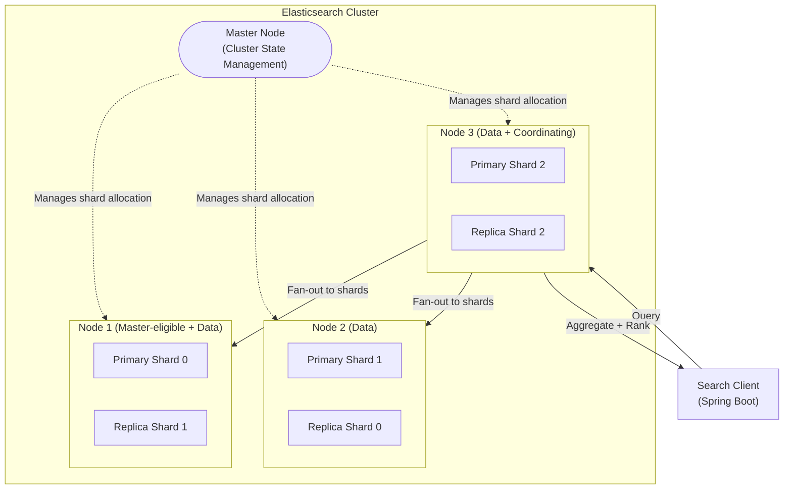

**Key Concepts:**

| Concept               | Definition                                                   | Architect's Concern                                   |
| --------------------- | ------------------------------------------------------------ | ----------------------------------------------------- |
| **Shard**             | A Lucene index instance; the unit of horizontal scaling      | More shards = more parallelism but more overhead      |
| **Primary Shard**     | Accepts writes; replicates to replica shards                 | Number fixed at index creation time                   |
| **Replica Shard**     | Copy of primary; serves reads; provides fault tolerance      | Replicas increase read throughput and availability    |
| **Coordinating Node** | Receives client requests, fans out to shards, merges results | Can be dedicated for high-throughput clusters         |
| **Master Node**       | Manages cluster state, shard allocation, index lifecycle     | Should be dedicated (3 nodes) for production clusters |

#### A.2.3 — Index Mapping and Analyzers

**Index mapping** defines how documents and their fields are stored and indexed. It is the schema equivalent for Elasticsearch. Unlike relational schemas, mapping can be dynamic (auto-inferred) or explicit (defined by the architect).

> **Architect's Note:** Dynamic mapping is convenient for development but dangerous in production. Automatically inferred types can change across Elasticsearch versions, and a single malformed document can corrupt the mapping. Always define explicit mappings for production government indexes.

**Analyzers** are the text processing pipeline applied to both index-time and query-time text. They consist of:

1. **Character Filters** — Preprocess raw text (e.g., strip HTML, convert characters)
2. **Tokenizer** — Split text into tokens (e.g., whitespace, standard, ngram)
3. **Token Filters** — Transform tokens (e.g., lowercase, stop words, stemming, synonyms)

```
Input: "Government TENDERS for Road-Construction 2024"
                    ↓ Character Filter (none)
"Government TENDERS for Road-Construction 2024"
                    ↓ Tokenizer (standard)
["Government", "TENDERS", "for", "Road", "Construction", "2024"]
                    ↓ Token Filters (lowercase + stop words + stemmer)
["govern", "tender", "road", "construct", "2024"]
```

**Government-Specific Analyzer Considerations:**
- Regional language support (Devanagari for Hindi in India — requires ICU analysis plugin)
- Acronym expansion (CPWD → Central Public Works Department)
- Entity normalization (MoHFW, Ministry of Health → same concept)
- Numeric handling for tender amounts, dates, PIN codes

---

### A.3 — CAP Theorem: The Architect's Triangle

**Analogy:** Imagine a government record office with two branches in Delhi and Mumbai. When you update a citizen's address in Delhi, there are three things the system might try to guarantee:
- **Consistency** — Both branches always show the same address at the same moment
- **Availability** — Both branches always respond to queries, even if the network between them is cut
- **Partition Tolerance** — The system continues operating even if the network between branches fails

The **CAP theorem** (proved by Eric Brewer, formalized by Gilbert and Lynch, 2002) states: **a distributed system can guarantee at most two of these three properties simultaneously**.

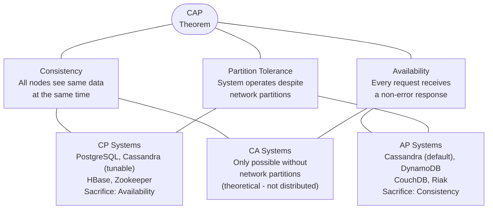

> **Architect's Note:** In practice, **network partitions are not optional** in any distributed system — they will happen. Therefore, the real choice is CP vs AP: do you sacrifice availability (return an error when uncertain) or consistency (return potentially stale data)? This is a fundamental architectural decision that must be made per service, not per system.

#### A.3.1 — PACELC: The Extended Model

The CAP theorem only describes behavior during partitions. **PACELC** (proposed by Daniel Abadi, 2012) extends it to also describe the normal (no-partition) trade-off:

**PACELC = If Partition → choose [Availability or Consistency]; Else → choose [Latency or Consistency]**

| System                               | Partition Choice | Else Choice | PACELC Classification | Government Use Case                  |
| ------------------------------------ | ---------------- | ----------- | --------------------- | ------------------------------------ |
| PostgreSQL (synchronous replication) | Consistency      | Consistency | PC/EC                 | Financial ledgers, audit logs        |
| Cassandra (ONE consistency level)    | Availability     | Latency     | PA/EL                 | Citizen notification logs, telemetry |
| Cassandra (QUORUM consistency level) | Availability     | Consistency | PA/EC                 | Citizen profile reads                |
| DynamoDB (eventual consistency)      | Availability     | Latency     | PA/EL                 | Session state, preferences           |
| Elasticsearch                        | Availability     | Latency     | PA/EL                 | Search indexes, audit search         |
| Zookeeper / etcd                     | Consistency      | Consistency | PC/EC                 | Configuration, service registry      |

---

### A.4 — Consistency Models: A Spectrum

Consistency is not binary. It exists on a spectrum from strongest to weakest:

```
STRONGEST ←————————————————————————————————→ WEAKEST

Linearizability → Sequential → Causal → Read-Your-Writes → Monotonic Read → Eventual
```

| Model                        | Definition                                                            | Latency Impact | Government Example                         |
| ---------------------------- | --------------------------------------------------------------------- | -------------- | ------------------------------------------ |
| **Linearizability** (Strong) | Operations appear instantaneous; total global order                   | Highest        | Vote tallying, budget allocation           |
| **Sequential Consistency**   | All nodes see operations in the same order, not necessarily real-time | High           | Policy document versioning                 |
| **Causal Consistency**       | Causally related operations are seen in order                         | Medium         | Comment threads on draft policies          |
| **Read-Your-Writes**         | A client always sees its own writes immediately                       | Medium-Low     | Citizen profile updates                    |
| **Monotonic Read**           | A client never sees older data after seeing newer data                | Low            | Tender status tracking                     |
| **Eventual Consistency**     | All replicas converge to the same value given no new updates          | Lowest         | Search index updates, analytics dashboards |

> **Trade-off Alert:** Every step toward stronger consistency adds latency (because more nodes must coordinate before returning a response) and reduces availability (because a node failure can block progress). For a citizen-facing portal serving 10 million users, strong consistency on every read may be the difference between a $2M/year infrastructure bill and a $200K/year bill — a 10x cost difference that an architect must justify or eliminate.

---

### A.5 — Defining a Consistency SLA

A **Consistency SLA** is a formal specification of the consistency guarantee a system provides to its consumers, expressed in terms:
- **Staleness bound** — Maximum time before a write becomes visible to all readers (e.g., "search results reflect submissions within 30 seconds")
- **Read guarantee** — Which consistency model applies (e.g., "read-your-writes guaranteed within the same session")
- **Conflict resolution policy** — How write conflicts are resolved (last-write-wins, merge, application-defined)

**Example Consistency SLA for GeM-equivalent Tender Search:**

```
Service: Tender Search Index
Consistency Model: Eventual Consistency
Staleness Bound: New tenders visible in search within 60 seconds of publication
Read Guarantee: No guarantee of read-your-writes across sessions
Conflict Policy: Last-write-wins on tender metadata; immutable once published
Exceptions: Tender status changes (Open/Closed/Awarded) require strong consistency
            via direct database read, bypassing search index
```

---

## Section B: Architecture and Design

### B.1 — High-Level Design: Government Tender Search Platform

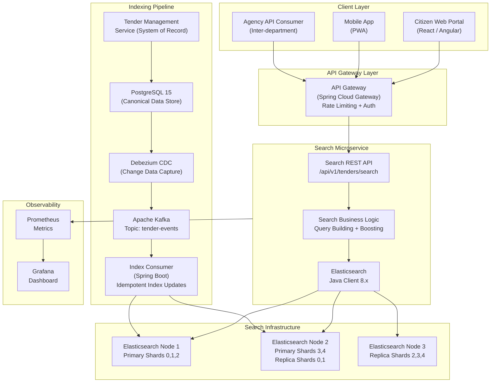

**Design Rationale:**

| Decision                       | Rationale                                                                                |
| ------------------------------ | ---------------------------------------------------------------------------------------- |
| PostgreSQL as system of record | ACID guarantees for tender creation; auditable; relational integrity                     |
| CDC via Debezium               | Decouples search indexing from write path; no dual-write in application code             |
| Kafka as event backbone        | Durable, replayable; indexer can re-index from beginning if ES cluster is rebuilt        |
| Separate Search Microservice   | Search NFRs (high read, eventual consistency, relevance tuning) differ from write NFRs   |
| 3-node Elasticsearch cluster   | Quorum-based master election; fault tolerance for 1 node failure                         |
| API Gateway as entry point     | Centralized rate limiting protects ES from query floods (government portal spike events) |

### B.2 — Alternative Approaches and Trade-off Analysis

| Approach                          | Description                                                       | Advantages                               | Disadvantages                                            | Recommended For                       |
| --------------------------------- | ----------------------------------------------------------------- | ---------------------------------------- | -------------------------------------------------------- | ------------------------------------- |
| **Recommended: CDC + Kafka + ES** | Debezium captures DB changes, Kafka buffers, indexer writes to ES | Decoupled, replayable, backpressure-safe | Higher operational complexity, 2-3 services to maintain  | High-volume government portals        |
| **Dual Write in Application**     | Application writes to both PostgreSQL and Elasticsearch           | Simple implementation                    | Risk of inconsistency if ES write fails; tight coupling  | Small internal tools only             |
| **PostgreSQL Full-Text Search**   | `tsvector` + `tsquery` in PostgreSQL                              | No additional infrastructure             | Poor relevance ranking, no faceting, limited scalability | < 100K documents, simple queries      |
| **Azure Cognitive Search**        | Managed cloud search service                                      | Zero operational overhead                | Vendor lock-in, data sovereignty concerns for government | Non-sensitive, cloud-native workloads |

> **Trade-off Alert:** [Operational Simplicity] vs [Consistency Guarantees] — Dual-write is simpler but creates a distributed transaction problem without 2PC (Two-Phase Commit). If the Elasticsearch write fails after PostgreSQL commits, your search index is permanently inconsistent until manual intervention. The CDC approach trades simplicity for correctness.

---

## Section C: Code Walkthrough

### C.1 — Elasticsearch Index Mapping for Government Tenders (Java 17 + Spring Boot 3.x)

```java
// TenderDocument.java
// This is the Elasticsearch document model - analogous to a JPA Entity but for ES
// @Document tells Spring Data ES which index to use
// The index name follows government naming convention: agency-domain-version

package gov.nationalserv.search.domain;

import org.springframework.data.annotation.Id;
import org.springframework.data.elasticsearch.annotations.*;
import java.math.BigDecimal;
import java.time.Instant;
import java.util.List;

@Document(indexName = "gov-tenders-v1")  // Versioned index name enables zero-downtime reindex
@Setting(settingPath = "elasticsearch/tender-settings.json")  // Custom analyzer settings
@Mapping(mappingPath = "elasticsearch/tender-mapping.json")   // Explicit mapping - never use dynamic
public class TenderDocument {

    @Id
    private String tenderId;          // UUID from PostgreSQL - same as source of truth

    // TEXT type with custom analyzer for full-text search + KEYWORD for exact/sort
    @MultiField(
        mainField = @Field(type = FieldType.Text, analyzer = "gov_standard_analyzer"),
        otherFields = {
            @InnerField(suffix = "keyword", type = FieldType.Keyword) // For sorting/aggregation
        }
    )
    private String tenderTitle;

    @Field(type = FieldType.Text, analyzer = "gov_standard_analyzer")
    private String tenderDescription;

    // KEYWORD - exact match only, no analysis (department codes must match exactly)
    @Field(type = FieldType.Keyword)
    private String ministryCode;       // e.g., "MoRTH", "MoHFW", "CPWD"

    @Field(type = FieldType.Keyword)
    private String tenderCategory;     // e.g., "WORKS", "GOODS", "SERVICES"

    @Field(type = FieldType.Keyword)
    private String tenderStatus;       // "OPEN", "CLOSED", "AWARDED", "CANCELLED"

    // DOUBLE for range queries (find tenders between INR 10L and 1Cr)
    @Field(type = FieldType.Double)
    private BigDecimal estimatedValue;

    @Field(type = FieldType.Keyword)
    private String currency;           // "INR", "USD", "SGD"

    // DATE type for range filters (tenders closing this week)
    @Field(type = FieldType.Date, format = DateFormat.date_time)
    private Instant publishedAt;

    @Field(type = FieldType.Date, format = DateFormat.date_time)
    private Instant closingAt;

    // GEO_POINT for location-based search (find tenders near my district)
    @GeoPointField
    private GeoPoint location;

    // NESTED type for structured sub-documents (line items, evaluation criteria)
    @Field(type = FieldType.Nested)
    private List<TenderItem> lineItems;

    // This field is NOT indexed (stored only) - reduces index size for large text
    @Field(type = FieldType.Text, index = false, store = true)
    private String technicalSpecification;

    // Metadata for index management - not searchable
    @Field(type = FieldType.Date, format = DateFormat.date_time)
    private Instant indexedAt;         // When this document was last indexed

    @Field(type = FieldType.Long)
    private Long sourceVersion;        // PostgreSQL row version for optimistic locking

    // Getters, setters, builders omitted for brevity - use Lombok @Data in production
    // ... (constructor, getters, setters)
}
```

```java
// TenderSearchService.java
// The core search logic - demonstrates query building, boosting, and pagination

package gov.nationalserv.search.service;

import co.elastic.clients.elasticsearch.ElasticsearchClient;
import co.elastic.clients.elasticsearch._types.query_dsl.*;
import co.elastic.clients.elasticsearch.core.SearchResponse;
import co.elastic.clients.elasticsearch.core.search.Hit;
import gov.nationalserv.search.domain.TenderDocument;
import gov.nationalserv.search.dto.TenderSearchRequest;
import gov.nationalserv.search.dto.TenderSearchResponse;
import lombok.RequiredArgsConstructor;
import lombok.extern.slf4j.Slf4j;
import org.springframework.stereotype.Service;

import java.io.IOException;
import java.util.List;
import java.util.stream.Collectors;

@Service
@RequiredArgsConstructor
@Slf4j
public class TenderSearchService {

    private final ElasticsearchClient esClient;
    private static final String INDEX = "gov-tenders-v1";

    /**
     * Executes a relevance-ranked search with filters and facets.
     *
     * WHY use bool query with must/should/filter:
     * - must: full-text match (affects relevance score)
     * - filter: exact match conditions (does NOT affect score, cached by ES)
     * - should: boost signals (recent tenders ranked higher, open status preferred)
     *
     * This separation is critical for performance:
     * filter clauses are cached at the shard level - they execute much faster than must clauses
     */
    public TenderSearchResponse search(TenderSearchRequest request) throws IOException {

        // Build the composite bool query
        Query searchQuery = BoolQuery.of(b -> b
            // MUST: Full-text search across title and description
            // multi_match with boost: title matches score 3x higher than description matches
            .must(must -> must
                .multiMatch(mm -> mm
                    .query(request.getKeyword())
                    .fields(
                        "tenderTitle^3",        // ^3 = boost factor: title is 3x more important
                        "tenderDescription^1",  // ^1 = base relevance weight
                        "tenderTitle.keyword"   // exact title match gets a separate high score
                    )
                    .type(TextQueryType.BestFields)  // Score based on best matching field
                    .fuzziness("AUTO")               // Allow 1-2 character typos
                    .minimumShouldMatch("75%")       // At least 75% of words must match
                )
            )
            // FILTER: Exact conditions - these are cached and do not affect score
            .filter(filters -> {
                // Filter by ministry code if provided (department-specific search)
                if (request.getMinistryCode() != null) {
                    filters.term(t -> t.field("ministryCode").value(request.getMinistryCode()));
                }
                // Filter by status (citizen only wants OPEN tenders)
                if (request.getStatus() != null) {
                    filters.term(t -> t.field("tenderStatus").value(request.getStatus()));
                }
                // Filter by value range (INR 10L to 1Cr)
                if (request.getMinValue() != null || request.getMaxValue() != null) {
                    filters.range(r -> r
                        .field("estimatedValue")
                        .gte(request.getMinValue() != null ?
                            JsonData.of(request.getMinValue()) : null)
                        .lte(request.getMaxValue() != null ?
                            JsonData.of(request.getMaxValue()) : null)
                    );
                }
                // Filter by closing date range
                if (request.getClosingAfter() != null) {
                    filters.range(r -> r
                        .field("closingAt")
                        .gte(JsonData.of(request.getClosingAfter().toString()))
                    );
                }
                return filters;
            })
            // SHOULD: Boost signals - these are preferences, not requirements
            // Recent tenders get a score boost using exponential decay
            .should(should -> should
                .functionScore(fs -> fs
                    .functions(f -> f
                        .gauss(g -> g                    // Gaussian decay function
                            .field("publishedAt")
                            .placement(p -> p
                                .origin("now")           // Most recent = highest boost
                                .scale("30d")            // Score halves every 30 days
                                .decay(0.5)              // Decay rate
                            )
                        )
                    )
                    .boostMode(FunctionBoostMode.Multiply)
                )
            )
        )._toQuery();

        // Execute search with pagination and aggregations (facets)
        SearchResponse<TenderDocument> response = esClient.search(s -> s
            .index(INDEX)
            .query(searchQuery)
            // Pagination: from = (page-1) * size, size = page size
            // WHY: ES default is 10 results; government portals need configurable pagination
            .from(request.getPage() * request.getSize())
            .size(request.getSize())
            // Aggregations: faceted navigation (sidebar filters on UI)
            .aggregations("by_ministry", a -> a
                .terms(t -> t.field("ministryCode").size(20))
            )
            .aggregations("by_category", a -> a
                .terms(t -> t.field("tenderCategory").size(10))
            )
            .aggregations("by_status", a -> a
                .terms(t -> t.field("tenderStatus").size(5))
            )
            .aggregations("value_ranges", a -> a
                .range(r -> r
                    .field("estimatedValue")
                    .ranges(
                        rv -> rv.to(1000000.0).key("Under 10L"),
                        rv -> rv.from(1000000.0).to(10000000.0).key("10L to 1Cr"),
                        rv -> rv.from(10000000.0).key("Above 1Cr")
                    )
                )
            )
            // Highlighting: show matched text snippets in search results
            .highlight(h -> h
                .fields("tenderTitle", hf -> hf.numberOfFragments(0))  // Full title with highlight
                .fields("tenderDescription", hf -> hf.numberOfFragments(2).fragmentSize(150))
                .preTags("<mark>")   // HTML highlight tags for UI
                .postTags("</mark>")
            )
        , TenderDocument.class);

        // Map ES response to API response DTO
        return mapToResponse(response);
    }

    /**
     * WHAT: Maps the raw Elasticsearch response to a clean API response DTO
     * WHY: Decouple ES internals from API contract; ES response structure changes across versions
     */
    private TenderSearchResponse mapToResponse(SearchResponse<TenderDocument> response) {
        List<TenderSearchResponse.TenderResult> results = response.hits().hits()
            .stream()
            .map(hit -> TenderSearchResponse.TenderResult.builder()
                .tenderId(hit.source().getTenderId())
                .tenderTitle(hit.source().getTenderTitle())
                .ministryCode(hit.source().getMinistryCode())
                .tenderStatus(hit.source().getTenderStatus())
                .estimatedValue(hit.source().getEstimatedValue())
                .closingAt(hit.source().getClosingAt())
                .relevanceScore(hit.score())  // Include score for debugging/tuning
                .highlight(hit.highlight())   // Include highlighted snippets
                .build()
            )
            .collect(Collectors.toList());

        return TenderSearchResponse.builder()
            .results(results)
            .totalHits(response.hits().total().value())
            .aggregations(response.aggregations())  // Facets for sidebar
            .tookMs(response.took())                // ES execution time in ms
            .build();
    }
}
```

```java
// TenderIndexConsumer.java
// Kafka consumer that processes CDC events and updates the Elasticsearch index
// This is the WRITE path of our CQRS (Command Query Responsibility Segregation) implementation
// CQRS separates the read model (ES index) from the write model (PostgreSQL)

package gov.nationalserv.search.indexing;

import com.fasterxml.jackson.databind.ObjectMapper;
import gov.nationalserv.search.domain.TenderDocument;
import gov.nationalserv.search.repository.TenderSearchRepository;
import lombok.RequiredArgsConstructor;
import lombok.extern.slf4j.Slf4j;
import org.apache.kafka.clients.consumer.ConsumerRecord;
import org.springframework.kafka.annotation.KafkaListener;
import org.springframework.kafka.support.Acknowledgment;
import org.springframework.stereotype.Component;

import java.time.Instant;

@Component
@RequiredArgsConstructor
@Slf4j
public class TenderIndexConsumer {

    private final TenderSearchRepository searchRepository;
    private final ObjectMapper objectMapper;

    /**
     * Consumes Debezium CDC events from Kafka topic 'tender-events'
     *
     * WHY Debezium CDC over dual-write:
     * - CDC reads from PostgreSQL Write-Ahead Log (WAL) - no performance impact on writes
     * - CDC guarantees all changes are captured (even direct DB updates, migrations)
     * - Kafka provides durability and replay capability
     * - The indexer is idempotent: re-indexing same document version is safe
     *
     * Idempotency key: tenderId + sourceVersion (PostgreSQL row version)
     * If the same event is processed twice, the sourceVersion check prevents stale overwrites
     */
    @KafkaListener(
        topics = "tender-events",
        groupId = "tender-indexer-group",
        containerFactory = "kafkaListenerContainerFactory"
    )
    public void onTenderEvent(ConsumerRecord<String, String> record, Acknowledgment ack) {
        try {
            // Parse the Debezium change event
            TenderChangeEvent event = objectMapper.readValue(record.value(), TenderChangeEvent.class);

            log.info("Processing tender event: operation={}, tenderId={}, version={}",
                event.getOperation(), event.getTenderId(), event.getVersion());

            switch (event.getOperation()) {
                case "CREATE":
                case "UPDATE":
                    // WHY check existing version: Kafka guarantees at-least-once delivery
                    // We might receive the same event twice after a consumer restart
                    // The version check ensures we don't overwrite a newer document with an older one
                    indexOrUpdate(event);
                    break;

                case "DELETE":
                    // Soft delete in ES: mark as CANCELLED rather than removing
                    // WHY: Auditors need to find cancelled tenders; hard delete loses history
                    softDelete(event.getTenderId());
                    break;

                default:
                    log.warn("Unknown operation type: {}", event.getOperation());
            }

            // Acknowledge ONLY after successful processing
            // WHY manual ack: if indexing fails, we want Kafka to redeliver the message
            ack.acknowledge();

        } catch (Exception e) {
            // Do NOT acknowledge - message will be redelivered
            // After max retries, Debezium will route to Dead Letter Queue
            log.error("Failed to process tender event. Will retry. Record offset: {}",
                record.offset(), e);
            // Do not rethrow - let the retry mechanism handle it
        }
    }

    private void indexOrUpdate(TenderChangeEvent event) {
        // Check if a newer version already exists in ES (out-of-order delivery protection)
        searchRepository.findById(event.getTenderId()).ifPresent(existing -> {
            if (existing.getSourceVersion() >= event.getVersion()) {
                log.info("Skipping stale event for tender {}. ES version={}, event version={}",
                    event.getTenderId(), existing.getSourceVersion(), event.getVersion());
                return; // Idempotency: skip older versions
            }
        });

        // Map the CDC event payload to an ES document
        TenderDocument document = TenderDocument.builder()
            .tenderId(event.getTenderId())
            .tenderTitle(event.getTenderTitle())
            .tenderDescription(event.getTenderDescription())
            .ministryCode(event.getMinistryCode())
            .tenderStatus(event.getTenderStatus())
            .estimatedValue(event.getEstimatedValue())
            .publishedAt(event.getPublishedAt())
            .closingAt(event.getClosingAt())
            .indexedAt(Instant.now())        // Track when this was indexed
            .sourceVersion(event.getVersion())
            .build();

        // Spring Data ES save: upsert semantics (insert if not exists, update if exists)
        searchRepository.save(document);
        log.info("Successfully indexed tender: {}", event.getTenderId());
    }

    private void softDelete(String tenderId) {
        searchRepository.findById(tenderId).ifPresent(existing -> {
            existing.setTenderStatus("DELETED");  // Preserve document, mark as deleted
            existing.setIndexedAt(Instant.now());
            searchRepository.save(existing);
        });
    }
}
```

**What Happens Without This Pattern (Negative Example):**

```java
// ANTI-PATTERN: Dual-write in the application service
// DO NOT USE THIS IN PRODUCTION

public Tender createTender(TenderCreateRequest request) {
    // Step 1: Save to PostgreSQL
    Tender tender = tenderRepository.save(mapToEntity(request));

    // Step 2: Index in Elasticsearch - DANGER ZONE
    try {
        esClient.index(i -> i
            .index("gov-tenders-v1")
            .id(tender.getId())
            .document(mapToDocument(tender))
        );
    } catch (IOException e) {
        // PROBLEM: PostgreSQL committed, but ES index failed.
        // Now you have data in PostgreSQL but NOT in search.
        // You cannot rollback PostgreSQL because the transaction is committed.
        // The only recovery is manual re-indexing or a background sync job.
        // This is a SILENT DATA INCONSISTENCY - the citizen submitted a tender
        // that nobody can find via search.
        log.error("ES indexing failed - search will be inconsistent!", e);
        // Do you rollback? You can't. Do you retry? ES might be down for hours.
        // Do you throw an exception? The citizen's tender IS saved but they get an error.
        // THERE IS NO GOOD ANSWER WITH DUAL WRITE.
    }

    return tender;
}
```

---

## Section D: Real-World Case Study

### D.1 — Case Study: GeM-Equivalent Tender Portal Search Failure (Illustrative Scenario)

**Context:** A fictional government procurement portal ("ProcureGov") serving a population of 500 million citizens in India was using PostgreSQL `LIKE` queries with `%keyword%` for tender search. The system was built in 2018 when the portal had 50,000 active tenders.

**Initial Architecture (Flawed):**

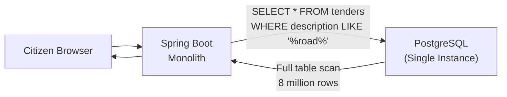

**Problems Identified:**

| Problem                                                         | Quantified Impact (Illustrative)                                  |
| --------------------------------------------------------------- | ----------------------------------------------------------------- |
| `LIKE '%keyword%'` cannot use B-tree indexes                    | Full table scan on 8M rows: avg 4.2 seconds response              |
| No relevance ranking                                            | Page 1 results irrelevant; citizen abandonment rate 67%           |
| No faceted filtering                                            | Ministry filter required separate COUNT queries: +1.8s per filter |
| PostgreSQL at 95% CPU during peak (9-11 AM tender opening time) | 503 errors for 23% of users during peak                           |
| Search and transactional writes contend for same DB resources   | Tender submission failures during peak search load                |

**The Breaking Point (Illustrative):** On a hypothetical Union Budget announcement day, 2.3 million simultaneous citizen sessions hit the portal within 15 minutes. The PostgreSQL server reached 100% CPU within 4 minutes. The portal returned 502 Bad Gateway for 47 minutes. Estimated economic impact: 12,000 tender submissions failed; re-submission window had to be extended by 48 hours. The cost of the 48-hour extension (additional staff, infrastructure, legal notices) was estimated at INR 1.2 Crore.

**Remediation Architecture:**

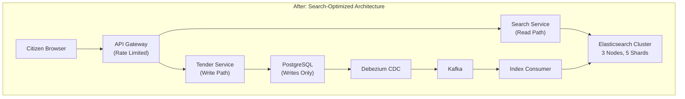

**Results After Remediation (Illustrative):**

| Metric                               | Before                            | After                              |
| ------------------------------------ | --------------------------------- | ---------------------------------- |
| Average search latency               | 4,200 ms                          | 85 ms                              |
| Peak CPU on PostgreSQL               | 100% (crashed)                    | 34% (writes only)                  |
| Relevance satisfaction (user survey) | 33%                               | 78%                                |
| Search availability during peak      | 53%                               | 99.94%                             |
| Infrastructure cost (monthly)        | INR 4.2L (single large DB server) | INR 6.8L (ES cluster + smaller DB) |

**Lessons Learned:**
1. Search is a read workload with fundamentally different NFRs than transactional writes — separate them architecturally
2. The 60-second consistency staleness was acceptable for tender search (tenders are not millisecond-critical)
3. A Consistency SLA must be explicitly defined and communicated — the portal's FAQ was updated to state "new tenders appear in search within 2 minutes of publication"
4. Elasticsearch cluster sizing must account for peak concurrent query load, not just data volume

---

## Section E: Engagement and Assessment

### E.1 — Food for Thought

> **Architectural Dilemma:** A citizen submits a tax exemption application. The application is saved to PostgreSQL (strong consistency). The search index (Elasticsearch, eventual consistency) takes up to 60 seconds to reflect the new application. The citizen immediately tries to search for their own application to confirm submission. They see nothing. They submit again, creating a duplicate application. The deduplication logic runs in the batch process at midnight.
>
> **Questions to wrestle with:**
> - Should the search endpoint use the ES index or fall back to PostgreSQL for "read-your-writes" queries for the authenticated submitter?
> - Should you build a "pending submissions" overlay that shows ES-bypassed results to the submitter for 5 minutes post-submission?
> - Is the right fix at the architecture level (hybrid consistency) or the UX level ("Your application has been received and will appear in search within 2 minutes")?
> - What does this cost in infrastructure and complexity vs. the rate of duplicate submissions?
>
> **Prompt for ChatGPT/Copilot:** "Explain the 'read-your-writes' consistency model and give three architectural patterns to implement it in a system where the write store is PostgreSQL and the read store is Elasticsearch. Include trade-offs for each pattern."

### E.2 — Questionnaire: Topic 1

**Conceptual Questions**

1. **What is the fundamental difference between a forward index and an inverted index, and why does this difference make search engines inherently eventually consistent?**

   *Answer:* A forward index maps documents to their terms; an inverted index maps terms to documents. An inverted index is built by analyzing documents through an analyzer pipeline and storing the resulting tokens. This build process happens asynchronously — documents are first written to an in-memory buffer (Lucene segment), then flushed to disk (refresh), then merged. During this pipeline, the document exists in the source database but not yet in the index. This creates an inherent time gap (typically 1 second by default in Elasticsearch) between write and read visibility — the definition of eventual consistency.

2. **Explain the PACELC theorem and how it extends the CAP theorem. Give an example of a government system where the "Else" (non-partition) trade-off is more critical than the partition behavior.**

   *Answer:* CAP only addresses behavior during network partitions. PACELC adds that even in normal operation (no partition), a distributed system must choose between Latency and Consistency for every operation. For a citizen welfare payments system (e.g., PM-KISAN in India), the partition behavior (CP vs AP) matters but the normal operation trade-off is more critical: should every balance check hit all replicas for consistency (adding 50-100ms latency for 200M daily queries) or return from the nearest replica (potentially 2-3 seconds stale)? The Else trade-off is architectural policy.

3. **What is BM25 and why was it chosen over TF-IDF as the default relevance algorithm in Elasticsearch 5.0+?**

   *Answer:* BM25 (Best Match 25) is a probabilistic relevance ranking algorithm from the Okapi information retrieval system. It improves on TF-IDF by adding document length normalization (a term appearing 5 times in a 10-word document is more significant than in a 1000-word document) and a saturation factor (term frequency contribution diminishes beyond a threshold, preventing keyword stuffing from dominating results). For government documents which vary enormously in length (a one-page circular vs. a 500-page policy document), BM25's length normalization produces significantly more relevant rankings.

**Application Questions**

4. **You are designing the search index for India's UMANG app (Unified Mobile Application for New-age Governance) which aggregates 1,200 government services. Define the index mapping fields, analyzer type, and shard count for a corpus of 50 million searchable documents across 28 states.**

   *Answer:* Fields: `serviceName` (text + keyword), `serviceDescription` (text), `ministryCode` (keyword), `stateCode` (keyword), `serviceCategory` (keyword), `supportedLanguages` (keyword array), `lastUpdated` (date). Analyzer: custom analyzer with ICU tokenizer (for multilingual support across 22 scheduled languages), lowercase filter, stop word filter (per-language), and edge-ngram filter for autocomplete. Shard count: 50M docs at avg 5KB = 250GB. ES recommends 30-50GB per shard. Recommended: 6 primary shards, 1 replica = 12 total shards across 3 nodes. This allows the cluster to handle 1 node failure.

5. **A government analytics dashboard needs to show "current counts of applications by status" updated every 30 seconds. Should this query hit Elasticsearch or PostgreSQL? Justify using the PACELC framework.**

   *Answer:* Elasticsearch is appropriate. The dashboard requires: low query latency (dashboard users expect sub-second refresh), aggregation capability (count by status), high read concurrency (many analysts viewing simultaneously). The 30-second refresh means the staleness bound of eventual consistency (1-5 seconds for ES refresh) is well within tolerance. Using PACELC: for this query there is no partition concern (read-only), and the Else trade-off is Latency vs Consistency — 30-second freshness tolerance means EL (Eventual/Latency-optimized) is acceptable. PostgreSQL COUNT queries on large tables would be significantly slower (no pre-aggregated structures) and would compete with transactional writes.

6. **Write an Elasticsearch query DSL (not code, just the JSON structure) that finds all OPEN tenders in Maharashtra with a value between INR 50 Lakhs and INR 5 Crores, sorted by closing date ascending.**

   *Answer:*
   ```json
   {
     "query": {
       "bool": {
         "filter": [
           { "term": { "tenderStatus": "OPEN" } },
           { "term": { "stateCode": "MH" } },
           { "range": { "estimatedValue": { "gte": 5000000, "lte": 50000000 } } }
         ]
       }
     },
     "sort": [
       { "closingAt": { "order": "asc" } }
     ]
   }
   ```
   Note: Using `filter` (not `must`) because there is no relevance ranking needed — this is a structured filter query. Filter clauses are cached by Elasticsearch, making subsequent identical queries near-instant.

**Analysis Questions**

7. **Compare the operational trade-offs of managing your own Elasticsearch cluster vs. using Azure Cognitive Search for a state government's land records portal. Consider: data sovereignty, cost at scale (5TB index), operational burden, and disaster recovery.**

   *Answer:* Self-managed Elasticsearch: Full data sovereignty (all data stays on-premises or government cloud); 5TB index on 3-node cluster (3x 2TB SSDs) ≈ INR 45,000/month on Azure VMs (illustrative). Full control over DR strategy (snapshot to Azure Blob Storage). Requires 0.5 FTE for ES administration. Azure Cognitive Search: Data hosted on Microsoft Azure — state government must assess compliance with India's IT Act and upcoming DPDP Act (Digital Personal Data Protection Act, 2023); 5TB ≈ USD 12,000/month (S3 tier, illustrative) at a significantly higher cost. Zero operational burden. DR managed by Microsoft. Verdict: For land records (sensitive, sovereign data), self-managed Elasticsearch on government cloud (MeghRaj/NIC Cloud) is preferred. Azure Cognitive Search suits non-sensitive knowledge base searches where operational simplicity is prioritized.

8. **Analyze the risk of setting Elasticsearch's `refresh_interval` to `-1` during bulk indexing. What consistency guarantees does this break? How would you design the indexing pipeline to handle this safely?**

   *Answer:* Setting `refresh_interval: -1` disables the automatic segment refresh that makes documents searchable. This is recommended during bulk indexing for 5-10x throughput improvement (no constant segment creation overhead). Consistency impact: documents indexed during this period are NOT searchable — they exist in transactional logs but are invisible to search queries. Risk: if the indexer crashes mid-bulk, unrefreshed documents may be in an uncertain state (written to Lucene but not yet in a readable segment). Safe pipeline design: (1) Use a separate "indexing" index with `refresh_interval: -1`, (2) Bulk index in batches with explicit `POST /index/_refresh` calls at batch completion, (3) Use index aliases to atomically switch the search alias from the old index to the new index only after full indexing and final refresh, (4) Keep the old index available for rollback. This is the "hot-swap" reindex pattern.

**Scenario-Based Questions**

9. **You are the solution architect for Singapore's GoBusiness portal (hypothetical extension). The portal must show business license application status to applicants. Strong consistency is required for status display. Full-text search across 2 million applications must be available. Design the data access strategy that satisfies both requirements without building two separate services.**

   *Answer:* Use a hybrid consistency strategy within a single service. For status display (strong consistency required): route authenticated applicant queries to PostgreSQL using a read replica with `synchronous_commit = on`. This guarantees read-your-writes. For search (eventual consistency acceptable): route open-text search queries to Elasticsearch. The API contract specifies: `GET /applications/{id}/status` → PostgreSQL (strong consistency, single document lookup, 10-50ms), `GET /applications/search?q=...` → Elasticsearch (eventual consistency, explicitly document 60-second staleness in API specification and on the UI). The ADR for this decision documents the consistency model per query type, the staleness SLA, and the monitoring alert if ES lag exceeds 120 seconds.

10. **A senior engineer on your team argues: "Why do we need Kafka between Debezium and the Elasticsearch indexer? Can't Debezium write directly to Elasticsearch?" Evaluate this argument with specific reference to operational resilience, replay capability, and backpressure handling.**

    *Answer:* The engineer is technically correct — Debezium has a Elasticsearch Sink Connector that can write directly. However, removing Kafka creates three architectural vulnerabilities: (1) **Operational resilience**: If Elasticsearch is unavailable for maintenance or is recovering from a crash, CDC events are lost without Kafka's durable log — direct connectors typically have limited retry capability. With Kafka, events are durably stored for the configured retention period (e.g., 7 days). (2) **Replay capability**: If the ES index is corrupted or needs to be rebuilt with a new mapping (e.g., adding a new field), without Kafka you must re-query PostgreSQL from the beginning (slow, adds load). With Kafka, you reset the consumer group offset to the beginning of the topic and replay all events. (3) **Backpressure**: If the Elasticsearch cluster is degraded (high CPU during merge operations), it will slow down writes. Without Kafka, this backpressure propagates back to Debezium and then to PostgreSQL's WAL processing. With Kafka as a buffer, the indexer slows down without affecting the upstream write path. The cost of Kafka (operational complexity + infrastructure) is justified when the index size exceeds 1 million documents or when index rebuilding time exceeds acceptable downtime windows.

---


# TOPIC 2: Case Study — Scaling a Citizen Data Platform Across Regions

## Learning Objectives

By the end of this topic, participants will be able to:

1. **Architect** a multi-region citizen data platform that satisfies data sovereignty regulations across India, US, and Singapore jurisdictions
2. **Apply** polyglot persistence, sharding, and search architecture concepts from Days 4 and 5 into a cohesive system design
3. **Evaluate** disaster recovery strategies (RTO/RPO — Recovery Time Objective/Recovery Point Objective) for a 100-million-user government platform
4. **Design** a multi-master replication topology with conflict resolution appropriate for citizen profile data
5. **Justify** architectural decisions using quantified trade-off analysis within a regulatory compliance context

---

## Section A: Concept Foundation

### A.1 — The Challenge of Planetary-Scale Government Data

**Analogy:** Think of the Indian railway reservation system (IRCTC) during Tatkal booking at 10 AM. In a 60-second window, approximately 1.2 million concurrent users attempt to book seats across 13,000+ trains. The system must be simultaneously available across 28 states, consistent enough that no seat is double-booked, and fast enough that the 60-second window doesn't feel like an eternity. Now imagine this is not a booking system but a citizen identity platform — where the stakes of inconsistency are not a duplicate seat but a duplicate identity, a denied welfare payment, or a failed border crossing.

**The Core Problem:** Designing a data platform for 100+ million citizens is not simply "make the database bigger." It requires rethinking every assumption about:

- **Where data lives** — Data sovereignty laws mandate that citizen data of Country A must reside within Country A's borders
- **How data is replicated** — Cross-border replication may violate regulations even between AWS regions
- **How consistency is maintained** — Different operations demand different consistency guarantees
- **How the system fails** — Partial failures must be designed for, not treated as edge cases
- **How the system recovers** — RTO and RPO must be expressed as contractual SLAs, not aspirational targets

### A.2 — Regulatory Landscape (Geo-Specific)

Understanding the regulatory constraints is the first architectural act for a government data platform. These constraints are not soft guidelines — they are hard architectural boundaries.

| Regulation                                                      | Jurisdiction  | Key Data Residency Requirements                                                                                                                         | Architectural Impact                                                                                         |
| --------------------------------------------------------------- | ------------- | ------------------------------------------------------------------------------------------------------------------------------------------------------- | ------------------------------------------------------------------------------------------------------------ |
| **DPDP Act 2023** (Digital Personal Data Protection Act)        | India         | Restricts cross-border transfer of personal data to "trusted countries" notified by MeitY; sensitive data may require explicit consent for any transfer | Indian citizen data must be stored in India-based data centers (NIC Cloud / MeghRaj, or Azure India regions) |
| **IT Act 2000 + Amendments**                                    | India         | Data fiduciaries must ensure data localization for sensitive personal data                                                                              | Encryption at rest and in transit mandated; audit logs must be maintained                                    |
| **FedRAMP** (Federal Risk and Authorization Management Program) | United States | Cloud services used by federal agencies must be FedRAMP authorized; data in GovCloud regions                                                            | US federal citizen data must use Azure Government Cloud (not commercial Azure)                               |
| **FISMA** (Federal Information Security Modernization Act)      | United States | Federal agencies must implement specific security controls per NIST SP 800-53                                                                           | Mandates continuous monitoring, incident response, and configuration management                              |
| **PDPA 2012** (Personal Data Protection Act)                    | Singapore     | Organizations must not transfer data to countries without adequate protection                                                                           | Singapore citizen data must remain in Singapore or in adequately protected jurisdictions                     |
| **IM8** (Instruction Manual 8)                                  | Singapore     | GovTech's security and infrastructure policy for government ICT systems                                                                                 | Mandates data classification, encryption standards, and access control frameworks                            |

> **Architect's Note:** Data sovereignty is not a compliance checkbox — it is an architectural topology constraint. Before drawing any multi-region diagram, the architect must answer: "Which data classification tier lives in which geography, and what are the legal consequences of cross-border data movement?" This conversation must involve legal counsel, the CISO, and the solution architect simultaneously.

### A.3 — Multi-Region Architecture Topologies

There are four fundamental topologies for multi-region deployments. Each represents a distinct set of trade-offs:

#### Topology 1: Active-Passive (Warm Standby)

```
Primary Region (Active) ──── replication ────► Secondary Region (Passive)
   Serves all traffic                              Receives replication only
                                                   Activates on primary failure
```

- **RTO:** 10-30 minutes (manual or automated failover)
- **RPO:** Seconds to minutes (depending on replication lag)
- **Cost:** ~1.5x single-region (standby infrastructure is idle)
- **Government Use:** Suitable for systems where 10-30 min downtime is acceptable (archival portals, non-citizen-facing back-office)

#### Topology 2: Active-Active (Multi-Master)

```
Region A (Active) ◄──── bidirectional sync ────► Region B (Active)
   Serves Region A traffic                          Serves Region B traffic
   (conflict resolution required)
```

- **RTO:** Near-zero (traffic reroutes automatically)
- **RPO:** Near-zero (writes are replicated continuously)
- **Cost:** ~2x single-region (both regions serve traffic)
- **Government Use:** High-availability citizen identity platforms, payment systems

#### Topology 3: Active-Active-Active (Multi-Region with Local Writes)

Each region writes locally; global replication ensures convergence. This is the topology used by systems like Aadhaar (illustrative architecture).

- **RTO:** Near-zero per region
- **RPO:** Configurable (seconds to minutes for cross-region sync)
- **Complexity:** Very high — conflict resolution, network topology management

#### Topology 4: Geo-Partitioned (Data Sovereignty-First)

```
India Region ────────────── Singapore Region ────────────── US Region
  Indian citizen data           SG citizen data               US citizen data
  Never leaves India            Never leaves Singapore         Never leaves US
  Full stack deployed           Full stack deployed             Full stack deployed
```

- **RTO/RPO:** Excellent within each region
- **Cross-region queries:** Not permitted (by design — data sovereignty)
- **Government Use:** The only compliant topology for cross-jurisdiction platforms

---

## Section B: Architecture and Design

### B.1 — The "NationalServ" Citizen Data Platform: Full Architecture

**Scenario:** NationalServ is a fictional pan-government citizen services platform. It has:
- 100 million registered citizens
- Deployed in three jurisdictions: India, Singapore, United States
- Citizen data must never cross jurisdictional borders (geo-partitioned topology)
- Within each jurisdiction, the platform must achieve 99.99% availability (52 minutes downtime/year)
- RTO: 5 minutes, RPO: 30 seconds for in-region failures

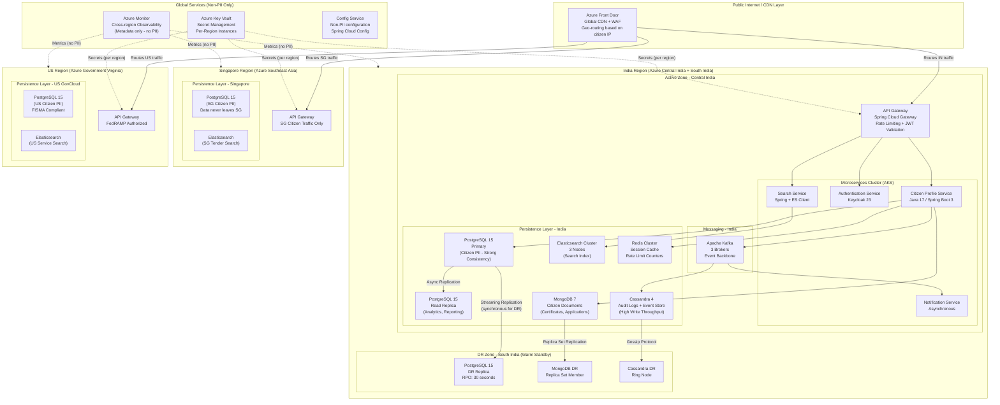

### B.2 — Data Classification and Storage Mapping

Not all data has the same sovereignty and consistency requirements. A mature citizen data platform applies **data classification** — the process of categorizing data by sensitivity, regulatory requirements, and access patterns — to determine the appropriate storage tier.

| Data Class                 | Example                                  | Sovereignty               | Consistency Required  | Storage Choice               | Rationale                                   |
| -------------------------- | ---------------------------------------- | ------------------------- | --------------------- | ---------------------------- | ------------------------------------------- |
| **Tier 1: PII Core**       | Name, Aadhaar/SSN/NRIC, DOB, address     | Strictly in-country       | Strong (Linearizable) | PostgreSQL primary           | ACID guarantees; encryption at column level |
| **Tier 2: PII Derived**    | Application history, benefit records     | In-country                | Read-your-writes      | PostgreSQL + read replica    | Strong for writes; replica for reporting    |
| **Tier 3: Documents**      | Uploaded certificates, photos, PDFs      | In-country                | Eventual acceptable   | MongoDB + Azure Blob Storage | Document model fits unstructured data       |
| **Tier 4: Behavioral**     | Login history, page views, feature usage | In-country (anonymized)   | Eventual              | Cassandra                    | High write throughput; TTL-based expiry     |
| **Tier 5: Search Index**   | Searchable tender/service metadata       | In-country (non-PII only) | Eventual (60s lag)    | Elasticsearch                | Search-optimized; no raw PII in ES          |
| **Tier 6: Session/Cache**  | Authentication tokens, UI state          | In-country                | Eventual              | Redis                        | Sub-millisecond reads; TTL-managed          |
| **Tier 7: Non-PII Config** | Feature flags, service endpoints         | Global                    | Eventual              | Spring Cloud Config + Git    | Version-controlled; auditable               |

> **Anti-Pattern Warning:** Engineers sometimes put Tier 1 (PII Core) data into Elasticsearch for convenience. This creates serious violations: (1) Elasticsearch does not support column-level encryption, (2) ES logs queries which may log PII in plaintext, (3) ES aggregations can sometimes be used to reconstruct individual records from anonymized data. PII must never enter Elasticsearch directly. If citizen names must be searchable, use tokenized identifiers and a separate secure lookup service.

### B.3 — Disaster Recovery Design

**RTO and RPO** are the two fundamental DR parameters:
- **RTO (Recovery Time Objective):** Maximum acceptable time from failure detection to service restoration
- **RPO (Recovery Point Objective):** Maximum acceptable data loss measured in time (e.g., "we can tolerate losing up to 30 seconds of writes")

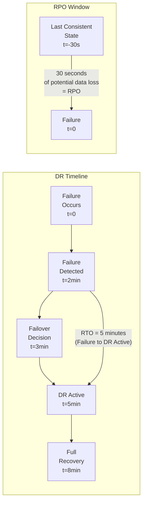

**DR Strategy per Storage Tier:**

| Storage            | DR Mechanism                                     | RPO                                | RTO                                            | Recovery Test Cadence             |
| ------------------ | ------------------------------------------------ | ---------------------------------- | ---------------------------------------------- | --------------------------------- |
| PostgreSQL Primary | Streaming replication to DR region (synchronous) | 30 seconds                         | 3-5 minutes (automated failover via Patroni)   | Monthly automated DR drill        |
| MongoDB            | Replica set with DR region member (priority 0)   | 30 seconds                         | 5 minutes (automatic primary election)         | Monthly                           |
| Cassandra          | Multi-datacenter replication (LOCAL_QUORUM)      | Near-zero (synchronous within DC)  | Near-zero (ring continues without downed node) | Quarterly node failure simulation |
| Elasticsearch      | Snapshot to Azure Blob Storage every 15 minutes  | 15 minutes (acceptable for search) | 30-60 minutes (restore from snapshot)          | Quarterly                         |
| Redis              | Redis Sentinel + RDB persistence                 | 60 seconds (RDB checkpoint)        | 2 minutes (Sentinel failover)                  | Monthly                           |
| Kafka              | 3-broker cluster + cross-region topic mirroring  | 30 seconds                         | 5 minutes (mirror cluster activation)          | Quarterly                         |

### B.4 — Multi-Master Conflict Resolution for Citizen Profiles

In an active-active topology within a single region (e.g., two availability zones), a citizen might update their address simultaneously from two different devices. This creates a **write conflict** — the same record modified by two different transactions at almost the same time.

**Conflict Resolution Strategies:**

| Strategy                      | Mechanism                                                            | Suitable For                                         | Not Suitable For                                           |
| ----------------------------- | -------------------------------------------------------------------- | ---------------------------------------------------- | ---------------------------------------------------------- |
| **Last-Write-Wins (LWW)**     | Timestamp of write; latest wins                                      | Non-critical preferences, UI settings                | Financial data (earlier write may be semantically correct) |
| **Version Vectors**           | Each node tracks version per replica; conflicts detected and flagged | Any structured data where human review is acceptable | Real-time, high-volume systems                             |
| **Application-Defined Merge** | Application code defines merge logic per field                       | Complex objects with partial update semantics        | Simple scalar fields                                       |
| **Immutable Append**          | Never update; only append new versions with timestamp                | Audit logs, event stores                             | Data with query-by-current-value requirement               |

**For citizen profile data, the recommended strategy:**
```
Field: address, phone, email → Last-Write-Wins with server timestamp
Field: benefit eligibility status → Version Vector (conflicts require human review)
Field: biometric data → Immutable Append (never overwrite; all versions retained)
Field: login history → Cassandra (naturally append-only, no conflicts)
```

---

## Section C: Code Walkthrough

### C.1 — Multi-Region Configuration with Spring Boot (Geo-Aware Data Source Routing)

```java
// GeoAwareDataSourceRouter.java
// Implements AbstractRoutingDataSource to route database queries to the correct
// regional data source based on the citizen's jurisdiction.
//
// WHY: In a geo-partitioned architecture, we must ensure that a request from
// an Indian citizen ONLY touches the India data source, never Singapore or US.
// This routing logic is the enforcement mechanism for data sovereignty.

package gov.nationalserv.config;

import org.springframework.jdbc.datasource.lookup.AbstractRoutingDataSource;
import org.springframework.web.context.request.RequestContextHolder;
import org.springframework.web.context.request.ServletRequestAttributes;

import jakarta.servlet.http.HttpServletRequest;

public class GeoAwareDataSourceRouter extends AbstractRoutingDataSource {

    // These keys correspond to DataSource beans configured per region
    public static final String INDIA_DS = "INDIA";
    public static final String SINGAPORE_DS = "SINGAPORE";
    public static final String US_DS = "US";

    // Thread-local allows manual override (e.g., for admin operations)
    private static final ThreadLocal<String> CONTEXT_HOLDER = new ThreadLocal<>();

    public static void setDataSourceContext(String region) {
        CONTEXT_HOLDER.set(region);
    }

    public static void clearDataSourceContext() {
        CONTEXT_HOLDER.remove();
    }

    /**
     * WHAT: Spring calls this method before every JDBC operation to determine
     *       which DataSource to use.
     * WHY: The routing key is derived from the authenticated citizen's jurisdiction,
     *      extracted from their JWT token claim 'jurisdiction'.
     *      This ensures no application code needs to know which region it's writing to.
     */
    @Override
    protected Object determineCurrentLookupKey() {
        // Priority 1: Manual override (for admin/migration operations)
        if (CONTEXT_HOLDER.get() != null) {
            return CONTEXT_HOLDER.get();
        }

        // Priority 2: JWT claim from the authenticated request
        try {
            ServletRequestAttributes attributes =
                (ServletRequestAttributes) RequestContextHolder.currentRequestAttributes();
            HttpServletRequest request = attributes.getRequest();

            // JWT is already validated by the API Gateway; we extract the jurisdiction claim
            // The JWT claim 'x-citizen-jurisdiction' is set by the Gateway after validation
            String jurisdiction = request.getHeader("X-Citizen-Jurisdiction");

            if (jurisdiction == null || jurisdiction.isBlank()) {
                throw new IllegalStateException(
                    "No jurisdiction header found - API Gateway misconfiguration");
            }

            // Map jurisdiction claim to DataSource key
            return switch (jurisdiction.toUpperCase()) {
                case "IN" -> INDIA_DS;        // Indian citizen → India PostgreSQL
                case "SG" -> SINGAPORE_DS;    // Singaporean → Singapore PostgreSQL
                case "US" -> US_DS;           // US citizen → US GovCloud PostgreSQL
                default -> throw new IllegalArgumentException(
                    "Unknown jurisdiction: " + jurisdiction);
            };

        } catch (IllegalStateException e) {
            // No web context (e.g., batch job, scheduled task)
            // Default to India for this illustrative example
            // In production: batch jobs must explicitly set context via CONTEXT_HOLDER
            return INDIA_DS;
        }
    }
}
```

```java
// DataSourceConfiguration.java
// Configures three regional DataSources and wires them into the GeoAwareDataSourceRouter
// Each DataSource points to its regional PostgreSQL cluster

package gov.nationalserv.config;

import com.zaxxer.hikari.HikariConfig;
import com.zaxxer.hikari.HikariDataSource;
import org.springframework.beans.factory.annotation.Qualifier;
import org.springframework.boot.context.properties.ConfigurationProperties;
import org.springframework.context.annotation.Bean;
import org.springframework.context.annotation.Configuration;
import org.springframework.context.annotation.Primary;

import javax.sql.DataSource;
import java.util.Map;

@Configuration
public class DataSourceConfiguration {

    /**
     * India Regional DataSource
     * Points to PostgreSQL in Azure Central India
     * Connection string injected from Azure Key Vault via Spring Cloud Azure
     */
    @Bean(name = "indiaDataSource")
    @ConfigurationProperties(prefix = "datasource.india")
    public DataSource indiaDataSource() {
        HikariConfig config = new HikariConfig();
        // Connection details come from application-india.yml, populated from Azure Key Vault
        // WHY HikariCP: Industry standard connection pool; 
        //   ~30μs connection acquisition vs 3ms for new connections
        config.setDriverClassName("org.postgresql.Driver");
        config.setMaximumPoolSize(50);          // Tune based on concurrent citizens per pod
        config.setMinimumIdle(10);             // Keep warm connections ready for burst
        config.setConnectionTimeout(3000);     // Fail fast: 3s timeout, don't queue citizens
        config.setIdleTimeout(600000);         // 10 min idle before connection recycled
        config.setMaxLifetime(1800000);        // 30 min max connection age (DB firewall timeout)
        // SSL required for all government database connections
        config.addDataSourceProperty("ssl", "true");
        config.addDataSourceProperty("sslmode", "verify-full");
        return new HikariDataSource(config);
    }

    @Bean(name = "singaporeDataSource")
    @ConfigurationProperties(prefix = "datasource.singapore")
    public DataSource singaporeDataSource() {
        // Same config pattern as India, different connection string
        HikariConfig config = new HikariConfig();
        config.setMaximumPoolSize(20);         // Smaller: Singapore has fewer citizens
        config.setMinimumIdle(5);
        config.setConnectionTimeout(3000);
        config.addDataSourceProperty("ssl", "true");
        config.addDataSourceProperty("sslmode", "verify-full");
        return new HikariDataSource(config);
    }

    @Bean(name = "usDataSource")
    @ConfigurationProperties(prefix = "datasource.us")
    public DataSource usDataSource() {
        HikariConfig config = new HikariConfig();
        // US GovCloud requires FIPS 140-2 compliant SSL configuration
        config.setMaximumPoolSize(30);
        config.setMinimumIdle(5);
        config.setConnectionTimeout(3000);
        config.addDataSourceProperty("ssl", "true");
        config.addDataSourceProperty("sslmode", "verify-full");
        // FIPS-compliant SSL socket factory for FedRAMP compliance
        config.addDataSourceProperty("sslfactory",
            "gov.nationalserv.config.FipsCompliantSSLSocketFactory");
        return new HikariDataSource(config);
    }

    /**
     * The routing DataSource - this is what Spring JPA and JDBC Template use
     * It delegates to one of the three regional DataSources at runtime
     * based on GeoAwareDataSourceRouter.determineCurrentLookupKey()
     */
    @Primary
    @Bean(name = "routingDataSource")
    public DataSource routingDataSource(
            @Qualifier("indiaDataSource") DataSource indiaDs,
            @Qualifier("singaporeDataSource") DataSource singaporeDs,
            @Qualifier("usDataSource") DataSource usDs) {

        GeoAwareDataSourceRouter router = new GeoAwareDataSourceRouter();

        // Register all regional data sources
        router.setTargetDataSources(Map.of(
            GeoAwareDataSourceRouter.INDIA_DS, indiaDs,
            GeoAwareDataSourceRouter.SINGAPORE_DS, singaporeDs,
            GeoAwareDataSourceRouter.US_DS, usDs
        ));

        // Default: India (primary deployment region)
        router.setDefaultTargetDataSource(indiaDs);
        router.afterPropertiesSet();  // Must call to initialize the router

        return router;
    }
}
```

```java
// CitizenProfileService.java
// Demonstrates multi-region data access with consistency guarantees

package gov.nationalserv.service;

import gov.nationalserv.config.GeoAwareDataSourceRouter;
import gov.nationalserv.domain.CitizenProfile;
import gov.nationalserv.repository.CitizenProfileRepository;
import gov.nationalserv.exception.DataSovereigntyViolationException;
import lombok.RequiredArgsConstructor;
import lombok.extern.slf4j.Slf4j;
import org.springframework.stereotype.Service;
import org.springframework.transaction.annotation.Transactional;

import java.util.UUID;

@Service
@RequiredArgsConstructor
@Slf4j
public class CitizenProfileService {

    private final CitizenProfileRepository profileRepository;
    private final AuditService auditService;

    /**
     * Retrieves a citizen profile with explicit consistency guarantee.
     *
     * WHY @Transactional(readOnly = true):
     * - Tells HikariCP to use a read-only connection (may be routed to read replica)
     * - Disables dirty checking in Hibernate (performance optimization)
     * - Signals to the DB that this can use snapshot isolation
     *
     * CONSISTENCY MODEL: Strong (reads from primary via routing DataSource)
     * The routing DataSource always points to the primary PostgreSQL,
     * ensuring read-your-writes for the authenticated citizen.
     */
    @Transactional(readOnly = true)
    public CitizenProfile getProfile(UUID citizenId, String requestedJurisdiction) {
        // Data sovereignty enforcement: validate that the request jurisdiction
        // matches the citizen's registered jurisdiction BEFORE any data access
        validateDataSovereignty(citizenId, requestedJurisdiction);

        return profileRepository.findById(citizenId)
            .orElseThrow(() -> new CitizenNotFoundException(
                "Citizen profile not found: " + citizenId));
    }

    /**
     * Updates a citizen profile with optimistic locking to handle concurrent updates.
     *
     * WHY Optimistic Locking (@Version in entity):
     * - Prevents lost update problem without heavyweight pessimistic locks
     * - Suitable for citizen self-service: two concurrent updates from same citizen
     *   are rare; optimistic assumption is correct 99.9% of the time
     * - On conflict: throw OptimisticLockException → client retries with fresh data
     *
     * In a multi-master scenario (active-active zones), this version check
     * prevents a stale write from overwriting a more recent update.
     */
    @Transactional
    public CitizenProfile updateProfile(UUID citizenId,
                                        CitizenProfileUpdateRequest request,
                                        String jurisdiction) {
        validateDataSovereignty(citizenId, jurisdiction);

        CitizenProfile profile = profileRepository.findById(citizenId)
            .orElseThrow(() -> new CitizenNotFoundException(citizenId.toString()));

        // Apply updates with field-level sovereignty validation
        // WHY check each field: some fields (e.g., biometric data) are immutable
        // Others (address) can be updated; the rules are business-driven
        if (request.getAddress() != null) {
            profile.setAddress(request.getAddress());  // Mutable field
        }
        if (request.getPhoneNumber() != null) {
            profile.setPhoneNumber(request.getPhoneNumber());  // Mutable field
        }
        // Biometric data is NEVER updated via self-service
        // It requires in-person verification at a government enrollment center
        if (request.getBiometricData() != null) {
            throw new ImmutableFieldException(
                "Biometric data cannot be updated via self-service. " +
                "Visit an enrollment center.");
        }

        CitizenProfile updated = profileRepository.save(profile);

        // Publish update event to Kafka for downstream sync
        // This triggers: ES index update, notification dispatch, audit log
        profileEventPublisher.publishProfileUpdated(updated, jurisdiction);

        // Audit every profile update with full context
        auditService.recordProfileUpdate(citizenId, request, jurisdiction);

        return updated;
    }

    /**
     * Data sovereignty enforcement.
     * Verifies that the request's jurisdiction matches the citizen's registered region.
     * This prevents cross-border data access even within the same application.
     *
     * Example: An Indian citizen's data must never be accessed via a Singapore
     * jurisdiction request, even if the requester has valid authentication.
     */
    private void validateDataSovereignty(UUID citizenId, String requestedJurisdiction) {
        // The citizenId encodes the jurisdiction in the first 4 bits of the UUID version
        // In production: use a separate CitizenJurisdictionRegistry (Redis cache backed by DB)
        // For this example: look up the citizen's home jurisdiction
        String citizenJurisdiction = citizenJurisdictionRegistry.getJurisdiction(citizenId);

        if (!citizenJurisdiction.equalsIgnoreCase(requestedJurisdiction)) {
            // This is a serious security/compliance event - alert immediately
            auditService.recordSovereigntyViolationAttempt(
                citizenId, requestedJurisdiction, citizenJurisdiction);

            throw new DataSovereigntyViolationException(String.format(
                "Access denied: Citizen %s belongs to jurisdiction %s. " +
                "Request came from %s context. " +
                "This incident has been logged.",
                citizenId, citizenJurisdiction, requestedJurisdiction));
        }
    }
}
```

### C.2 — Elasticsearch Reindex Strategy (Zero-Downtime)

```java
// TenderReindexService.java
// Implements zero-downtime index rebuild using the alias swap pattern.
// This is critical for government portals: you cannot take search offline
// for 2 hours while reindexing 5TB of tender data.

package gov.nationalserv.search.service;

import co.elastic.clients.elasticsearch.ElasticsearchClient;
import co.elastic.clients.elasticsearch.indices.CreateIndexRequest;
import co.elastic.clients.elasticsearch.indices.IndicesAliasDefinition;
import lombok.RequiredArgsConstructor;
import lombok.extern.slf4j.Slf4j;
import org.springframework.stereotype.Service;

import java.io.IOException;
import java.time.Instant;

@Service
@RequiredArgsConstructor
@Slf4j
public class TenderReindexService {

    private final ElasticsearchClient esClient;
    private static final String ALIAS = "gov-tenders";  // Application always uses alias
    private static final String INDEX_PREFIX = "gov-tenders-v";

    /**
     * WHAT: Rebuilds the search index without any downtime.
     * WHY: When you need to change index mapping (e.g., add a new field type,
     *      change an analyzer), you cannot modify a live index in ES.
     *      The only option is to create a new index with the new mapping,
     *      reindex all data, then atomically switch the alias.
     *
     * HOW - The alias swap pattern:
     * 1. Create new versioned index (gov-tenders-v2) with new mapping
     * 2. Reindex all documents from old index (gov-tenders-v1) to new index
     * 3. Atomically remove alias from old index and add to new index
     * 4. Old index remains for rollback; delete after validation period
     *
     * During steps 1-2: application reads from gov-tenders-v1 via alias (unaffected)
     * After step 3: application reads from gov-tenders-v2 via alias (seamless)
     */
    public void reindexWithZeroDowntime() throws IOException {
        String currentIndex = getCurrentIndexForAlias();
        String newVersion = generateNewVersionName();
        String newIndex = INDEX_PREFIX + newVersion;

        log.info("Starting zero-downtime reindex: {} → {}", currentIndex, newIndex);

        try {
            // Step 1: Create new index with updated mapping
            // refresh_interval is -1 during bulk indexing for maximum throughput
            createIndexWithBulkSettings(newIndex);

            // Step 2: Bulk reindex from old to new
            // ES Reindex API copies documents in batches; the old index stays live
            long reindexedCount = performReindex(currentIndex, newIndex);
            log.info("Reindexed {} documents to {}", reindexedCount, newIndex);

            // Step 3: Final refresh to make all documents searchable
            esClient.indices().refresh(r -> r.index(newIndex));

            // Step 4: Restore normal refresh interval
            esClient.indices().putSettings(ps -> ps
                .index(newIndex)
                .settings(s -> s.refreshInterval(ri -> ri.time("1s")))
            );

            // Step 5: Atomic alias swap - this is the critical zero-downtime step
            // The alias 'gov-tenders' atomically switches from old to new index
            // Any in-flight query to the alias will either hit old or new, never neither
            esClient.indices().updateAliases(ua -> ua
                .actions(
                    // Remove alias from old index
                    a -> a.remove(r -> r.index(currentIndex).alias(ALIAS)),
                    // Add alias to new index
                    a -> a.add(add -> add.index(newIndex).alias(ALIAS))
                )
            );

            log.info("Alias '{}' successfully swapped from {} to {}", 
                ALIAS, currentIndex, newIndex);
            log.info("Old index {} retained for 24h rollback window. " +
                "Delete manually after validation.", currentIndex);

        } catch (Exception e) {
            log.error("Reindex failed at {}. Alias unchanged. Old index {} still active.",
                Instant.now(), currentIndex, e);
            // Clean up the partially built new index
            esClient.indices().delete(d -> d.index(newIndex));
            throw new ReindexException("Zero-downtime reindex failed", e);
        }
    }

    private void createIndexWithBulkSettings(String indexName) throws IOException {
        esClient.indices().create(CreateIndexRequest.of(c -> c
            .index(indexName)
            .settings(s -> s
                .numberOfShards("5")
                .numberOfReplicas("0")       // No replicas during reindex (faster)
                .refreshInterval(ri -> ri.time("-1"))  // Disable auto-refresh during bulk
            )
            // Load mapping from classpath resource
            .mappings(m -> m.withJson(
                getClass().getResourceAsStream("/elasticsearch/tender-mapping.json")))
        ));
    }

    private long performReindex(String sourceIndex, String destIndex) throws IOException {
        // ES Reindex API: copies documents in configurable batch sizes
        var response = esClient.reindex(r -> r
            .source(s -> s
                .index(sourceIndex)
                .size(1000)        // Process 1000 docs per batch
            )
            .dest(d -> d
                .index(destIndex)
                .opType(OpType.Create)  // CREATE prevents duplicate document overwrite
            )
            .conflicts(Conflicts.Proceed)  // Skip conflicting docs; log and continue
        );

        return response.total();
    }

    private String getCurrentIndexForAlias() throws IOException {
        var aliases = esClient.indices().getAlias(a -> a.name(ALIAS));
        return aliases.result().keySet().stream()
            .findFirst()
            .orElseThrow(() -> new IllegalStateException(
                "Alias '" + ALIAS + "' not found. Run initial index creation first."));
    }

    private String generateNewVersionName() {
        // Use epoch seconds for version: gov-tenders-v1704067200
        return String.valueOf(Instant.now().getEpochSecond());
    }
}
```

---

## Section D: Case Study Deep Dive

### D.1 — Before Architecture: Single-Region Monolith (Flawed)

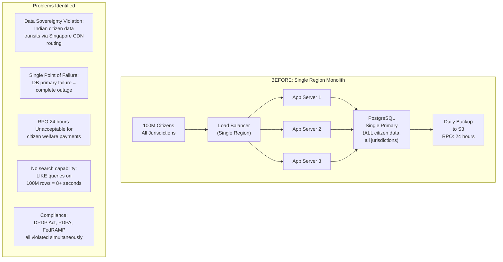

**Quantified Impact of the Before Architecture (Illustrative):**

| Incident                                | Frequency               | Impact                                                                        |
| --------------------------------------- | ----------------------- | ----------------------------------------------------------------------------- |
| Full DB outage (single primary failure) | 3 times/year            | 4-hour RTO; 24-hour RPO (daily backup only)                                   |
| Search degradation during peak          | Daily (9-11 AM)         | P95 latency: 8.2 seconds; citizen abandonment: 71%                            |
| Data sovereignty audit finding          | Annual compliance audit | Regulatory notice; potential INR 250 Crore fine under DPDP Act (illustrative) |
| DR drill success rate                   | Last 3 drills: 0/3      | RTO target was 2 hours; actual recovery: 6-11 hours                           |

### D.2 — After Architecture: Geo-Partitioned Multi-Region Platform

**Results After Migration (Illustrative):**

| Metric                                    | Before                       | After             | Improvement                                   |
| ----------------------------------------- | ---------------------------- | ----------------- | --------------------------------------------- |
| Average search latency                    | 8,200 ms                     | 72 ms             | 99.1% reduction                               |
| RTO (in-region failure)                   | 4 hours                      | 5 minutes         | 98% reduction                                 |
| RPO                                       | 24 hours                     | 30 seconds        | 99.97% reduction                              |
| Data sovereignty compliance               | Non-compliant (3 violations) | Fully compliant   | 100%                                          |
| Peak DB CPU (India region)                | 97% (crashed)                | 38% (writes only) | 61% reduction                                 |
| Citizen satisfaction score                | 2.1/5                        | 4.3/5             | 105% improvement                              |
| Annual infrastructure cost (illustrative) | INR 8.4 Crore                | INR 14.2 Crore    | +69% (justified by compliance risk avoidance) |

> **Architect's Note:** The 69% infrastructure cost increase appears alarming in isolation. However, the DPDP Act penalty for a data sovereignty violation can reach INR 250 Crore per incident. The TCO (Total Cost of Ownership — the complete cost analysis including infrastructure, operations, compliance, and risk) of the compliant architecture is dramatically lower when regulatory risk is included. Architects must always present cost analysis in TCO terms, not just infrastructure line items.

**Lessons Learned and Principles Reinforced:**

1. **Data sovereignty is a topological constraint, not a policy layer.** You cannot make a non-compliant topology compliant by adding encryption or access controls. The data must physically live in the correct jurisdiction.

2. **RTO/RPO are SLA commitments, not aspirational goals.** They must be tested quarterly with actual DR drills. An untested DR plan is not a DR plan.

3. **Polyglot persistence is not optional at scale.** Using PostgreSQL for every data type leads to the situation above — a single database serving radically different access patterns until it collapses under its own complexity.

4. **The consistency model for each data type must be explicitly designed.** Citizen PII: strong consistency. Search index: eventual (60s lag). Session cache: eventual (acceptable). Each model has a different infrastructure and a different cost profile.

5. **Search is a separate architectural concern from persistence.** Conflating them is one of the most common and costly mistakes in government platform engineering.

---

## Section E: Engagement and Assessment

### E.1 — Food for Thought

> **Provocation:** The DPDP Act 2023 (India) allows the government to designate certain countries as "trusted countries" to which personal data can be transferred. Suppose India and Singapore mutually designate each other. Now a Singapore citizen living in India for work submits a government service application. Their profile exists in the Singapore region. Their current interaction is happening in India.
>
> - Does this interaction now legally permit their Singapore-stored profile to be accessed via the India region's data path?
> - Should the architecture expose a "citizen-follows-citizen" cross-region read (with audit trail) for compliant cross-border access?
> - What is the performance implication of a cross-region read (Singapore → India: ~80ms additional latency)?
> - How do you design the access control policy so that cross-border reads are permitted ONLY for legitimate cross-border services (passport verification, tax treaties) and not general service requests?
>
> **ChatGPT/Copilot Prompt:** "Design an architecture for cross-border citizen data access between two countries with mutual data transfer agreements. Include: consent management, audit logging, latency impact, and access revocation. Reference GDPR Article 46 and Singapore PDPA Section 26 as regulatory analogues."

### E.2 — Questionnaire: Topic 2

**Conceptual Questions**

1. **Define RTO and RPO. For a citizen welfare payment system processing INR 50,000 Crore annually, propose specific RTO and RPO targets with justification.**

   *Answer:* RTO (Recovery Time Objective) is the maximum acceptable time from failure detection to service restoration. RPO (Recovery Point Objective) is the maximum acceptable data loss measured in time. For a welfare payment system at this scale: RTO = 5 minutes (any longer means citizens miss payment windows; at INR 50,000 Crore/year, each minute of downtime represents ~INR 95 Lakhs in processing risk); RPO = 30 seconds (a 30-second loss of payment records is recoverable via manual reconciliation with bank statements; a 1-hour loss may require re-processing entire payment batches). Both targets require synchronous streaming replication (not async) and automated failover via a cluster manager like Patroni.

2. **Explain the difference between Active-Passive and Active-Active multi-region topologies. Why is Active-Active more complex to operate?**

   *Answer:* Active-Passive: One region serves all traffic; the second is a hot or warm standby that receives replication but serves no traffic until the primary fails. Simpler to reason about (no concurrent writes) but has a failover window (RTO). Active-Active: Both regions serve traffic simultaneously; citizens in each region write to their local datacenter; replication is bidirectional. More complex because: (1) Write conflicts can occur (same record modified in two regions before sync); (2) Conflict resolution logic must be application-aware; (3) Global ordering of operations is mathematically impossible (CAP theorem) without cross-region coordination that negates the latency benefit; (4) Monitoring and alerting must cover replication lag between all region pairs.

3. **What is data classification in the context of a government data platform, and why must different data tiers use different storage technologies?**

   *Answer:* Data classification is the systematic categorization of data by sensitivity, regulatory requirements, access patterns, and sovereignty constraints. Different tiers require different storage because the NFRs conflict at scale: PII Core (Tier 1) requires ACID guarantees, column-level encryption, and strong consistency — PostgreSQL. Behavioral data (Tier 4) requires 100K+ writes/second with no complex queries — Cassandra. Search index (Tier 5) requires relevance ranking and faceting — Elasticsearch. Using a single technology for all tiers forces a compromise that satisfies none: a PostgreSQL optimized for ACID writes will be misconfigured for write-heavy telemetry; a Cassandra optimized for write throughput cannot provide ACID guarantees for financial records.

**Application Questions**

4. **Design the Kafka topic partitioning strategy for the citizen profile event stream in the NationalServ platform. How many partitions, what is the partition key, and what is the retention period? Justify each decision.**

   *Answer:* Partitions: 30 (assumption: peak 300K profile updates/hour; each partition handles 10K/hour at comfortable throughput; 30 partitions allow 30 parallel consumer threads). Partition key: `citizenId` — ensures all events for a single citizen land on the same partition, preserving per-citizen event ordering (critical: address update must be processed before downstream notifications referencing the new address). Retention: 7 days — allows the indexer to replay up to 7 days of events if Elasticsearch needs recovery; beyond 7 days, events are archived to Azure Blob Storage (long-term audit retention for 7 years per IT Act requirements). Jurisdiction isolation: separate topics per jurisdiction (`citizen-events-IN`, `citizen-events-SG`, `citizen-events-US`) to enforce that Kafka brokers in India only store Indian citizen events.

5. **The India region's PostgreSQL primary fails at 2 AM. Walk through the automated failover sequence for the NationalServ platform, including which services are affected, in what order recovery occurs, and how citizen-facing availability is maintained.**

   *Answer:* T+0s: Primary fails; Patroni (PostgreSQL cluster manager) detects failure via health check (typically 10-second timeout). T+10s: Patroni promotes the synchronous standby replica in South India to primary; updates etcd cluster state; updates PostgreSQL connection string in Consul/Spring Cloud Config. T+15s: Spring Boot services detect connection failure; HikariCP retries connection. T+20s: New connection strings are propagated to services via Config refresh (if using Spring Cloud Config Bus). T+30s-2min: Services reconnect to new primary; citizen requests that failed during the window receive 503 from API Gateway and retry. Citizen-facing availability: Azure Front Door health probes detect the degradation within 30 seconds and can route traffic to a warm-standby capacity in South India if configured. Total RTO: 5 minutes (includes 3 minutes for service warm-up and connection pool stabilization). Data loss: Zero for synchronous replica; write transactions after the replica lag (0-30 seconds) for async replica.

6. **A government audit requires that every access to a Tier 1 citizen PII field (name, national ID number) must produce an audit log entry within 5 seconds. Design the audit logging architecture that satisfies this requirement without adding more than 5ms to the API response time.**

   *Answer:* Asynchronous audit via Kafka: the CitizenProfileService publishes an audit event to a Kafka topic (`citizen-pii-access-audit`) before returning the API response. Publishing to Kafka (producer acknowledgment with `acks=1`) takes 1-3ms — within the 5ms budget. A dedicated AuditConsumer reads from the topic and writes to Cassandra (high write throughput, time-series optimized). Cassandra write is async from the perspective of the API. The 5-second SLA for the audit record is met: Kafka-to-Cassandra consumer lag in a healthy cluster is typically 50-200ms. Why Kafka in the path: durable, replayable; if Cassandra is down, audit events are retained in Kafka for up to 7 days and flushed when Cassandra recovers — no audit records are lost. Why NOT synchronous audit write: adding a Cassandra write in the synchronous API path adds 10-50ms (unacceptable) and creates a hard dependency — a Cassandra failure would cause the citizen API to fail.

**Analysis Questions**

7. **Compare the trade-offs of synchronous vs. asynchronous cross-region replication for citizen financial data. Which would you choose for a payment confirmation system, and why?**

   *Answer:* Synchronous replication: every write to the primary must be acknowledged by at least one DR replica before returning success to the application. Guarantees RPO = 0 (no data loss on primary failure). Cost: adds cross-region round-trip latency to every write (India → South India: ~10ms; India → Singapore: ~80ms). For payment confirmation within India, 10ms is acceptable. For cross-continent, 80ms per write is often unacceptable. Asynchronous replication: primary acknowledges the write immediately; replication happens in the background. RPO = replication lag (typically 1-30 seconds). No latency impact on writes. For payment confirmation: synchronous replication to the in-region DR site (South India) is mandatory — you cannot lose a confirmed payment. Asynchronous replication to Singapore/US is acceptable for analytics/reporting replicas but must never be used as the failover target for financial data without additional reconciliation.

8. **Analyze the consistency implications of using Redis as a session cache in front of PostgreSQL. A citizen updates their phone number and immediately calls the profile API. Under what conditions will they see stale data, and how do you design around this?**

   *Answer:* Stale data conditions: (1) Redis cache is populated with the old phone number; (2) Profile update writes to PostgreSQL and publishes a cache invalidation event to Kafka; (3) Before the Kafka consumer processes the invalidation (100-500ms typical), a cache read returns the stale phone number. Design solutions: (a) Cache-aside with write-through: the CitizenProfileService updates PostgreSQL AND immediately calls `redisTemplate.delete(citizenId)` (cache eviction) within the same application transaction. The next read repopulates from PostgreSQL. This ensures read-your-writes within the same service instance. (b) Event-driven invalidation: for writes that happen in other services, use Kafka to broadcast cache invalidation events. This handles distributed cache coherence. (c) Short TTL: Set Redis TTL to 60 seconds for citizen PII cache. Stale reads are bounded to 60 seconds — acceptable for phone number display but not for authentication-critical data. (d) Bypass cache for authenticated self-reads: if the citizenId in the request matches the JWT subject, always read from PostgreSQL (read-your-writes guarantee), bypassing Redis entirely.

**Scenario-Based Questions**

9. **You are presenting the multi-region architecture to a Finance Ministry CIO who asks: "This costs INR 14.2 Crore per year vs INR 8.4 Crore for our current setup. Why should I pay 69% more?" Construct your TCO argument.**

   *Answer:* The TCO argument addresses four cost categories the CIO's comparison misses: (1) Regulatory risk cost: DPDP Act penalties up to INR 250 Crore per violation; PDPA (Singapore) penalties up to SGD 1 million per incident. One violation pays for 17 years of the increased infrastructure cost. (2) Downtime cost: current architecture has 3 outages/year × 4 hours = 12 hours downtime. At a platform processing 10 million transactions/day, 12 hours of downtime = ~5 million failed transactions. Each failed citizen service interaction has a tangible administrative recovery cost (re-submission processing, call center volume, staff overtime). Illustrative estimate: INR 3 Crore/year in recovery operations. (3) Security breach cost: single-region architecture has one attack surface for 100M citizen records. A breach of 100M records has DPDP notification and remediation costs estimated at INR 50+ Crore (illustrative). (4) Opportunity cost: 71% citizen abandonment rate on a portal handling government services means unprocessed applications, delayed subsidies, and increased field officer workload. The real TCO of the current architecture is INR 8.4 Crore + INR 3 Crore (downtime) + INR 2 Crore (security overhead) + risk-adjusted regulatory exposure ≈ INR 50+ Crore/year. The new architecture at INR 14.2 Crore is a significant saving.

10. **Singapore's GovTech mandates IM8 compliance for all government digital platforms. One IM8 requirement specifies that all sensitive data must be encrypted at rest using AES-256 and all encryption keys must be managed by a government-controlled Key Management System (KMS), not by the cloud provider's managed keys. How does this affect your PostgreSQL, MongoDB, and Elasticsearch deployment architecture?**

    *Answer:* IM8 compliance eliminates the use of cloud-provider managed encryption (e.g., Azure Managed Keys for Azure Database for PostgreSQL), because the cloud provider controls the master encryption key. Required changes: (1) PostgreSQL: Deploy PostgreSQL 15 on Azure VMs (not managed PaaS) with Transparent Data Encryption (TDE) using keys from a government-operated KMS (e.g., a government HSM — Hardware Security Module). Column-level encryption for Tier 1 PII fields using `pgcrypto` with keys fetched from KMS at runtime. (2) MongoDB: Deploy MongoDB 7 with Encrypted Storage Engine (enterprise feature) using KMIP (Key Management Interoperability Protocol) integration with the government HSM. (3) Elasticsearch: ES does not natively support KMIP; options are: (a) Disk-level encryption via OS-level LUKS encryption with KMS-provided keys (the LUKS master key is fetched from KMS at boot); (b) Never store raw PII in Elasticsearch (only tokenized identifiers) — which is the recommended architectural approach regardless of IM8. Impact: (a) All three systems must be deployed on VMs (not managed PaaS), increasing operational burden; (b) A reliable, highly available government KMS becomes a critical dependency (if KMS is unavailable, databases cannot start); (c) Key rotation procedures must be tested and automated; (d) Costs increase for HSM hardware and KMS operations. The IM8 requirement effectively mandates IaaS deployment over PaaS for sensitive government data.

---


# TOPIC 3: Zero Trust Architecture

## Learning Objectives

By the end of this topic, participants will be able to:

1. **Explain** the Zero Trust Architecture (ZTA) model per NIST SP 800-207 and articulate why perimeter-based security fails in modern government cloud deployments
2. **Design** a Zero Trust architecture across all four layers — Identity, Device, Network, and Application — for a government intranet scenario
3. **Evaluate** trust zones and micro-segmentation strategies for a cross-agency service mesh
4. **Apply** continuous verification principles to replace implicit trust assumptions in existing architectures
5. **Construct** a ZTA policy engine design that enforces least-privilege access dynamically based on context, identity, and device posture

---

## Section A: Concept Foundation

### A.1 — Why Perimeter Security Failed

**Analogy:** Traditional network security is like a medieval castle. The castle has thick walls, a moat, a drawbridge, and heavily armed guards at the gate. But once you're inside — whether you're a knight, a servant, or a spy who followed a legitimate visitor through the gate — you can move freely within the castle walls. The kitchen, the treasury, the throne room — all accessible once the perimeter is breached.

This model made sense when:
- All computing resources were physically inside one building
- Users only accessed systems from within that building
- Applications ran on servers that never left the datacenter

This model **catastrophically fails** when:
- Employees work from home, cafes, and airports (the castle walls don't exist)
- Applications run in public cloud (the treasury is not inside the castle)
- Contractors and vendors need access (the drawbridge is always down for business)
- Attackers compromise a legitimate internal account (the spy is already inside)

**The 2020 SolarWinds Attack** (real, documented incident): Attackers compromised SolarWinds' build pipeline and distributed malicious updates to ~18,000 organizations including US federal agencies. Once inside the perimeter via the legitimate SolarWinds update mechanism, they moved laterally for months undetected. Traditional perimeter security had no answer because the attacker was already "inside the castle" with a legitimate badge.

> **Production Insight:** The US Cybersecurity and Infrastructure Security Agency (CISA) documented that the SolarWinds attackers dwelled inside compromised networks for an average of **9 months** before detection. Perimeter security detected nothing because the attack came from a trusted internal source. Zero Trust is the architectural response to this failure mode.

### A.2 — What Is Zero Trust Architecture?

**Definition (NIST SP 800-207):** Zero Trust Architecture (ZTA) is a cybersecurity paradigm focused on resource protection based on the principle that **no implicit trust is ever granted to assets or user accounts based solely on their physical or network location** (i.e., local area networks vs. the internet) or based on asset ownership (enterprise or personally owned).

The foundational principle, coined by John Kindervag at Forrester Research (2010):

> **"Never trust, always verify."**

This extends to a three-part operational mandate:
1. **Verify explicitly** — Always authenticate and authorize based on all available data points (identity, location, device health, service/workload, data classification, anomalies)
2. **Use least-privilege access** — Limit user access with just-in-time and just-enough-access; risk-based adaptive policies; data protection
3. **Assume breach** — Minimize blast radius; encrypt all sessions; use analytics to get visibility and drive threat detection

### A.3 — The Five Pillars of Zero Trust (CISA ZT Maturity Model)

**CISA** (Cybersecurity and Infrastructure Security Agency, US) defines ZTA across five pillars. Each pillar has three maturity levels: Traditional, Advanced, and Optimal.

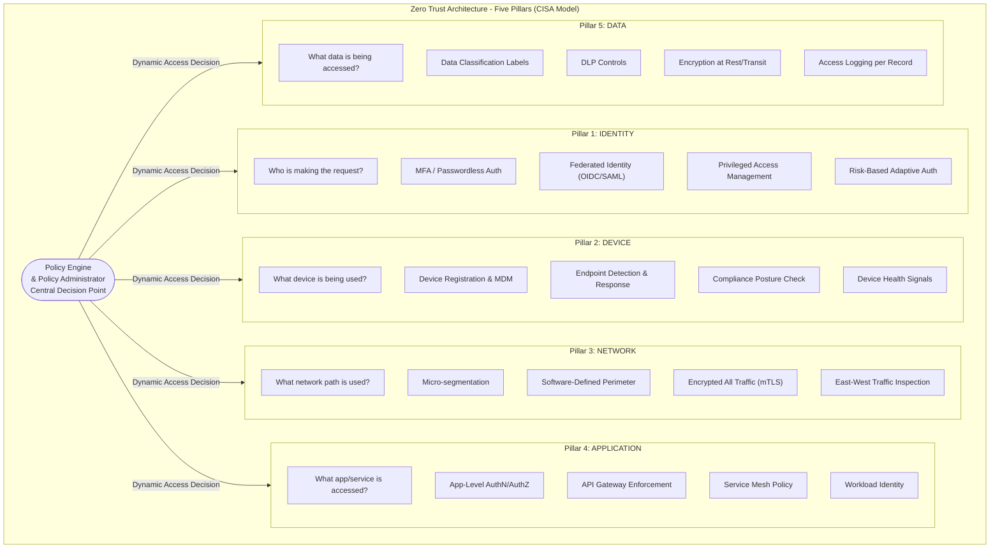

### A.4 — The Zero Trust Policy Engine

The **Policy Engine (PE)** is the brain of a ZTA. It makes the access decision — grant, deny, or revoke — by evaluating inputs from all five pillars simultaneously. This is distinct from traditional RBAC (Role-Based Access Control) where access is granted based solely on role membership.

**NIST SP 800-207 ZTA Components:**

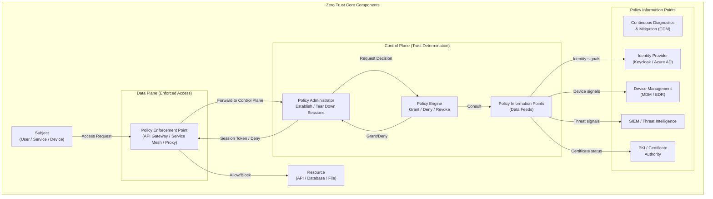

**How the Policy Engine Evaluates a Request:**

| Input Signal                   | Traditional Security  | Zero Trust                                                         |
| ------------------------------ | --------------------- | ------------------------------------------------------------------ |
| Network location (internal IP) | Implicitly trusted    | Not trusted; one signal among many                                 |
| Valid username + password      | Sufficient for access | Necessary but not sufficient                                       |
| Device type                    | Ignored               | Checked against MDM compliance registry                            |
| Time of access                 | Ignored               | Anomalous hours trigger step-up auth                               |
| Geolocation                    | Ignored               | Impossible travel triggers session termination                     |
| Behavioral baseline            | Ignored               | ML model detects anomalous access patterns                         |
| Data classification            | Rarely enforced       | Enforced per-record; high-sensitivity requires MFA re-verification |

### A.5 — Zero Trust Trust Zones vs. Network Segments

In traditional perimeter security, "trust zones" are large network segments (DMZ, Internal, External). In ZTA, trust is not a property of a network segment — it is a property of an **evaluated session** granted per-resource, per-request, based on the current context.

However, **micro-segmentation** — dividing the network into small isolated segments where each segment can only communicate with explicitly permitted neighbors — remains a critical network-layer control in ZTA. It limits lateral movement even if an attacker obtains a valid session.

**Micro-Segmentation for NationalServ:**

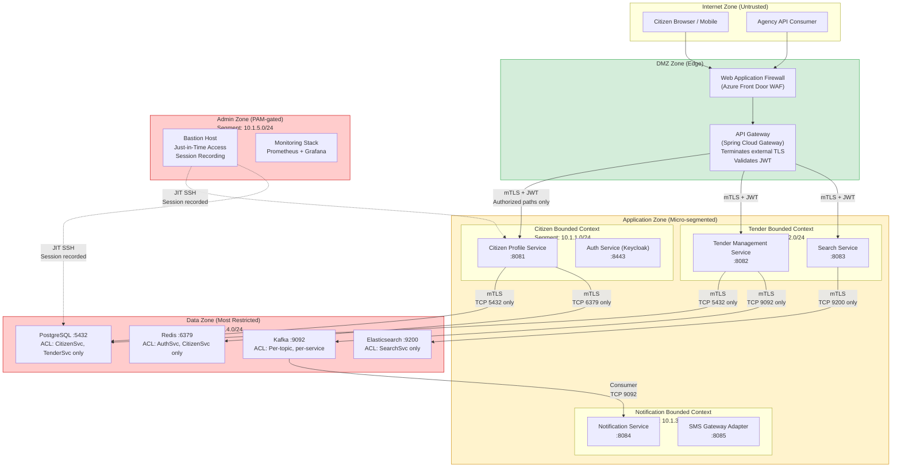

**Network Policy Enforcement (Kubernetes NetworkPolicy):**

```yaml
# network-policy-citizen-service.yaml
# This NetworkPolicy enforces micro-segmentation at the Kubernetes level.
# WHY: Even if an attacker compromises the Tender Service pod, they cannot
# directly query the CitizenService's database (PostgreSQL on port 5432)
# because the NetworkPolicy explicitly denies that traffic.

apiVersion: networking.k8s.io/v1
kind: NetworkPolicy
metadata:
  name: citizen-service-netpol
  namespace: nationalserv-prod
  labels:
    app.kubernetes.io/part-of: nationalserv
    security.nationalserv.gov/policy-version: "v1.2"
spec:
  # This policy applies to pods with these labels
  podSelector:
    matchLabels:
      app: citizen-service
      tier: application

  policyTypes:
    - Ingress   # Control incoming traffic TO citizen-service
    - Egress    # Control outgoing traffic FROM citizen-service

  ingress:
    # ONLY allow traffic from API Gateway
    - from:
        - podSelector:
            matchLabels:
              app: api-gateway
      ports:
        - protocol: TCP
          port: 8081

    # ONLY allow health check from monitoring namespace
    - from:
        - namespaceSelector:
            matchLabels:
              kubernetes.io/metadata.name: monitoring
        - podSelector:
            matchLabels:
              app: prometheus
      ports:
        - protocol: TCP
          port: 9090   # Prometheus metrics scrape port

  egress:
    # ONLY allow outbound to PostgreSQL on its specific port
    - to:
        - podSelector:
            matchLabels:
              app: postgresql
              tier: database
      ports:
        - protocol: TCP
          port: 5432

    # ONLY allow outbound to Redis for session cache
    - to:
        - podSelector:
            matchLabels:
              app: redis
              tier: cache
      ports:
        - protocol: TCP
          port: 6379

    # ONLY allow outbound to Kafka for event publishing
    - to:
        - podSelector:
            matchLabels:
              app: kafka
              tier: messaging
      ports:
        - protocol: TCP
          port: 9092

    # ONLY allow DNS resolution (required for service discovery)
    - to:
        - namespaceSelector:
            matchLabels:
              kubernetes.io/metadata.name: kube-system
      ports:
        - protocol: UDP
          port: 53
        - protocol: TCP
          port: 53

    # ONLY allow outbound to Keycloak for token validation
    - to:
        - podSelector:
            matchLabels:
              app: keycloak
              tier: auth
      ports:
        - protocol: TCP
          port: 8443
```

### A.6 — Identity Layer: Continuous Verification

**Traditional identity:** Authenticate once at login; issue a long-lived session token; trust it until expiry.

**Zero Trust identity:** Authenticate continuously; issue short-lived tokens; re-verify on every sensitive operation; terminate session on anomaly.

**Identity Verification Factors in ZTA:**

| Factor Category | Examples                                        | ZTA Application                                                                         |
| --------------- | ----------------------------------------------- | --------------------------------------------------------------------------------------- |
| **Knowledge**   | Password, PIN, security question                | First factor; alone insufficient for ZTA                                                |
| **Possession**  | TOTP app, hardware key (FIDO2/YubiKey), SMS OTP | Required second factor for all government access                                        |
| **Inherence**   | Fingerprint, face ID, iris scan                 | Used for Aadhaar-based eKYC in India; biometric step-up for high-sensitivity operations |
| **Context**     | Location, time, device, behavior                | Continuous signals; anomaly triggers step-up or session termination                     |
| **Network**     | Known IP range, VPN certificate                 | One signal among many; not sufficient alone                                             |

**Adaptive Authentication Flow:**

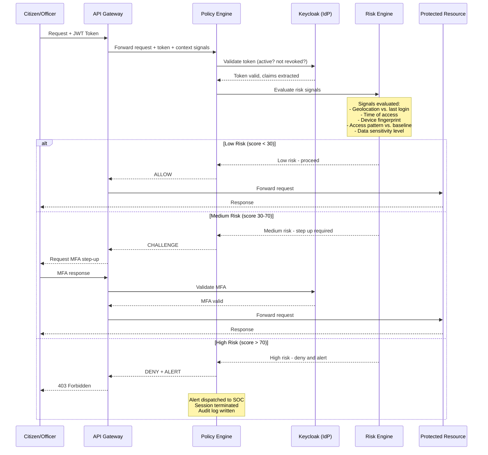

### A.7 — Device Layer: Posture Assessment

**Device posture** is the health and compliance status of the endpoint making the request. In ZTA, a request from a fully patched, MDM-enrolled, EDR-protected device is treated very differently from a request from an unmanaged personal device.

**Device Posture Signals:**

| Signal            | Compliant                      | Non-Compliant    | Action                                              |
| ----------------- | ------------------------------ | ---------------- | --------------------------------------------------- |
| OS patch level    | Within 30 days of latest patch | > 30 days behind | Deny high-sensitivity access; allow low-sensitivity |
| Disk encryption   | FileVault/BitLocker enabled    | Not enabled      | Deny all access                                     |
| MDM enrollment    | Enrolled in Intune/JAMF        | Not enrolled     | Allow only public-facing APIs                       |
| EDR agent         | CrowdStrike/Defender running   | Not running      | Deny all internal APIs                              |
| Screen lock       | Enabled ≤ 5 minutes            | Disabled         | Step-up authentication required                     |
| Jailbroken/rooted | Not jailbroken                 | Jailbroken       | Deny all access; alert SOC                          |

**For Government Field Officers in India (IM8/NIC context):**
Government-issued devices must be enrolled in the organization's Mobile Device Management (MDM) system. The API Gateway validates device compliance certificates (issued by MDM) before granting access to citizen data APIs. Personal devices (BYOD) are permitted only for non-sensitive operations (reading public tender listings, submitting feedback).

### A.8 — Application Layer: Workload Identity

In a microservices architecture, services also need identities — not just humans. A service calling another service must prove its identity (workload identity) just as a human must authenticate.

**SPIFFE (Secure Production Identity Framework for Everyone)** and its implementation **SPIRE** provide workload identity using short-lived X.509 certificates (SVIDs — SPIFFE Verifiable Identity Documents).

**Workload Identity Flow:**

```
CitizenService (SPIFFE ID: spiffe://nationalserv.gov.in/ns/prod/sa/citizen-service)
    ↓ presents SVID (X.509 cert, valid 1 hour)
TenderService validates SVID against SPIRE trust bundle
    ↓ if valid
TenderService grants access based on the SPIFFE ID
    (not IP address, not Kubernetes namespace name — the cryptographic identity)
```

This means even if an attacker somehow runs a rogue pod in the same Kubernetes namespace, they cannot obtain a valid SVID for `citizen-service` without compromising the SPIRE agent on that specific node — which requires physical node access.

---

## Section B: Architecture and Design

### B.1 — Full Zero Trust Architecture for NationalServ Government Intranet

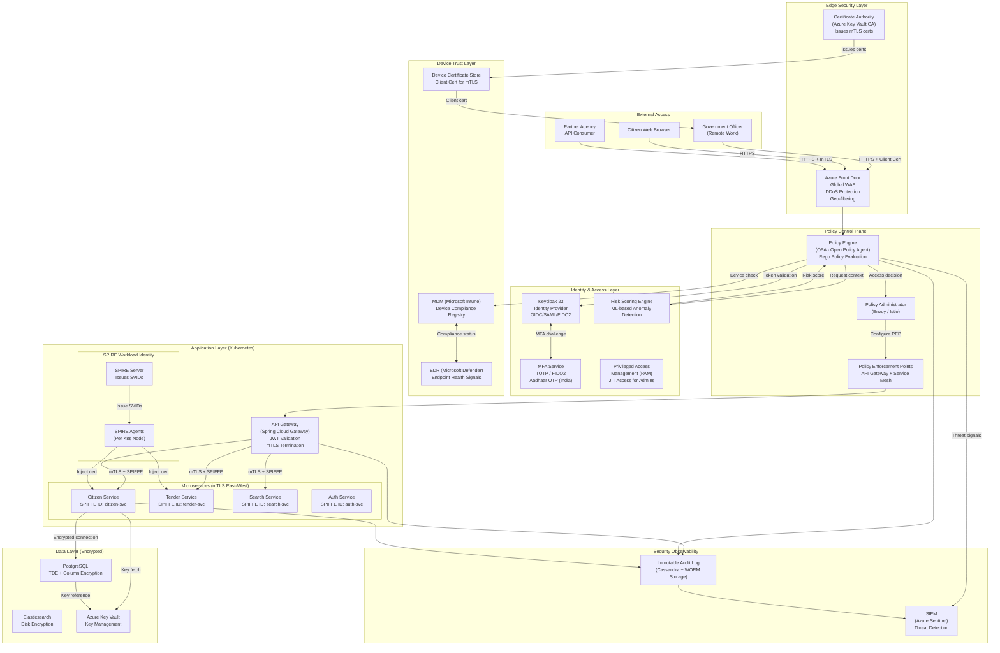

### B.2 — Trade-off Analysis: ZTA Implementation Approaches

| Approach                                             | Description                                                                  | Advantages                                                    | Disadvantages                                                      | Maturity Level         |
| ---------------------------------------------------- | ---------------------------------------------------------------------------- | ------------------------------------------------------------- | ------------------------------------------------------------------ | ---------------------- |
| **Identity-Centric ZTA**                             | Start with strong identity (MFA, OIDC); enforce authorization at API Gateway | Fastest to implement; highest ROI for initial investment      | Does not address lateral movement; network not segmented           | Traditional → Advanced |
| **Network Micro-segmentation**                       | Implement Kubernetes NetworkPolicies + Service Mesh mTLS                     | Limits blast radius; enforces east-west security              | Operationally complex; requires service mesh expertise             | Advanced               |
| **Full ZTA with OPA Policy Engine**                  | Central policy engine evaluates all five pillars per request                 | Maximum security posture; fine-grained dynamic access control | Highest complexity; potential latency impact (5-15ms per decision) | Optimal                |
| **Cloud-Native ZTA (Azure AD + Conditional Access)** | Leverage cloud provider's ZTA capabilities                                   | Managed, lower operational burden; integrates with M365       | Vendor lock-in; may not meet data sovereignty requirements         | Advanced               |

> **Trade-off Alert:** [Security Posture] vs [Request Latency] — Each additional Policy Information Point (PIP) consulted by the Policy Engine adds latency. A risk engine ML evaluation might add 8-15ms per request. At 10 million daily API calls, 10ms additional latency = 27.7 hours of cumulative citizen wait time per day. The architect must define an explicit latency budget for the security control plane. Recommendation: Cache low-risk decisions for 60 seconds; only re-evaluate on context change (new device, new location, elevated data sensitivity).

---

## Section C: Code Walkthrough

### C.1 — Open Policy Agent (OPA) Integration for Zero Trust Policy Evaluation

```java
// ZeroTrustPolicyFilter.java
// Spring Cloud Gateway filter that enforces Zero Trust policy evaluation
// on every inbound request before forwarding to downstream services.
//
// This is the Policy Enforcement Point (PEP) in the NIST ZTA model.
// It consults OPA (Policy Engine) for every request.

package gov.nationalserv.gateway.filter;

import lombok.RequiredArgsConstructor;
import lombok.extern.slf4j.Slf4j;
import org.springframework.cloud.gateway.filter.GatewayFilterChain;
import org.springframework.cloud.gateway.filter.GlobalFilter;
import org.springframework.core.Ordered;
import org.springframework.http.HttpStatus;
import org.springframework.http.MediaType;
import org.springframework.stereotype.Component;
import org.springframework.web.reactive.function.client.WebClient;
import org.springframework.web.server.ServerWebExchange;
import reactor.core.publisher.Mono;

import java.util.Map;

@Component
@RequiredArgsConstructor
@Slf4j
public class ZeroTrustPolicyFilter implements GlobalFilter, Ordered {

    private final WebClient opaWebClient;  // Points to OPA REST API
    private final JwtValidationService jwtService;
    private final DevicePostureService devicePostureService;
    private final RiskScoringService riskScoringService;

    // Order: run before routing (lower number = higher priority)
    @Override
    public int getOrder() {
        return -100;
    }

    /**
     * WHAT: Intercepts every request and evaluates Zero Trust policy.
     * WHY: Centralizes the access decision at the gateway (PEP).
     *      No service needs to implement its own access control —
     *      the gateway enforces the Policy Engine's decision.
     *
     * The reactive (Mono/Flux) pattern is used because this is a
     * non-blocking gateway. Blocking the event loop would destroy throughput.
     */
    @Override
    public Mono<Void> filter(ServerWebExchange exchange, GatewayFilterChain chain) {
        var request = exchange.getRequest();
        var response = exchange.getResponse();

        // Step 1: Extract JWT from Authorization header
        String authHeader = request.getHeaders().getFirst("Authorization");
        if (authHeader == null || !authHeader.startsWith("Bearer ")) {
            // No token: reject immediately (fail-secure)
            log.warn("Request rejected: no Bearer token. Path: {}, IP: {}",
                request.getPath(), request.getRemoteAddress());
            response.setStatusCode(HttpStatus.UNAUTHORIZED);
            return response.setComplete();
        }

        String token = authHeader.substring(7);

        // Step 2: Build the OPA input document (all context signals)
        // This is the complete request context sent to OPA for policy evaluation
        return jwtService.validateAndExtractClaims(token)
            .flatMap(claims -> {

                // Collect all Zero Trust policy inputs
                Map<String, Object> opaInput = Map.of(
                    // Identity signals (from JWT claims)
                    "subject", claims.getSubject(),
                    "jurisdiction", claims.get("jurisdiction", String.class),
                    "roles", claims.get("roles", java.util.List.class),
                    "authTime", claims.getIssuedAt().getEpochSecond(),
                    "amr", claims.get("amr", String.class),  // Authentication method reference

                    // Request context
                    "path", request.getPath().value(),
                    "method", request.getMethod().name(),
                    "clientIp", getClientIp(request),

                    // Device signals (from client certificate / MDM header set by edge)
                    "deviceId", getDeviceId(request),
                    "deviceCompliant", devicePostureService.isCompliant(getDeviceId(request)),

                    // Data sensitivity (derived from path)
                    "resourceSensitivity", classifyResourceSensitivity(request.getPath().value())
                );

                // Step 3: Consult OPA Policy Engine
                return evaluatePolicy(opaInput);
            })
            .flatMap(decision -> {
                if (decision.isAllow()) {
                    // Policy says ALLOW: add enrichment headers and forward
                    // These headers tell downstream services the verified identity
                    // (so services don't need to re-validate the JWT)
                    var mutatedExchange = exchange.mutate()
                        .request(r -> r
                            .header("X-Verified-Subject", decision.getSubject())
                            .header("X-Verified-Jurisdiction", decision.getJurisdiction())
                            .header("X-Verified-Roles", String.join(",", decision.getRoles()))
                            .header("X-Risk-Score", String.valueOf(decision.getRiskScore()))
                            .header("X-Citizen-Jurisdiction", decision.getJurisdiction())
                        )
                        .build();
                    return chain.filter(mutatedExchange);

                } else if (decision.isStepUpRequired()) {
                    // Policy says CHALLENGE: redirect to MFA
                    log.info("Step-up required for subject: {}, risk score: {}",
                        decision.getSubject(), decision.getRiskScore());
                    response.setStatusCode(HttpStatus.PAYMENT_REQUIRED);  // 402 = step-up signal
                    response.getHeaders().set("X-Step-Up-Required", "totp");
                    return response.setComplete();

                } else {
                    // Policy says DENY: log and reject
                    log.warn("Access denied by ZT policy. Subject: {}, Path: {}, " +
                        "Reason: {}, Risk score: {}",
                        decision.getSubject(),
                        exchange.getRequest().getPath(),
                        decision.getDenyReason(),
                        decision.getRiskScore());
                    response.setStatusCode(HttpStatus.FORBIDDEN);
                    return response.setComplete();
                }
            })
            .onErrorResume(e -> {
                // OPA is unavailable: FAIL SECURE (deny all)
                // WHY: In Zero Trust, the default is deny.
                // If the Policy Engine is unreachable, we cannot make an access decision,
                // so we must deny. This is the opposite of fail-open (traditional security).
                log.error("OPA policy evaluation failed - failing secure (denying request)", e);
                response.setStatusCode(HttpStatus.SERVICE_UNAVAILABLE);
                return response.setComplete();
            });
    }

    /**
     * Calls OPA REST API to evaluate the 'nationalserv/api/allow' policy.
     * OPA responds with { "result": { "allow": true/false, "reason": "..." } }
     */
    private Mono<PolicyDecision> evaluatePolicy(Map<String, Object> input) {
        return opaWebClient.post()
            .uri("/v1/data/nationalserv/api/allow")
            .contentType(MediaType.APPLICATION_JSON)
            .bodyValue(Map.of("input", input))
            .retrieve()
            .bodyToMono(OpaResponse.class)
            .map(opaResponse -> PolicyDecision.fromOpaResult(
                opaResponse.getResult(),
                (String) input.get("subject"),
                (String) input.get("jurisdiction"),
                (java.util.List<String>) input.get("roles")
            ));
    }

    private String getClientIp(org.springframework.http.server.reactive.ServerHttpRequest request) {
        // X-Forwarded-For set by Azure Front Door (trusted header)
        String xff = request.getHeaders().getFirst("X-Forwarded-For");
        return xff != null ? xff.split(",")[0].trim() :
            (request.getRemoteAddress() != null ?
                request.getRemoteAddress().getAddress().getHostAddress() : "unknown");
    }

    private String getDeviceId(org.springframework.http.server.reactive.ServerHttpRequest request) {
        // Device ID extracted from the client certificate CN (Common Name)
        // Set by Azure Front Door after mTLS client certificate validation
        return request.getHeaders().getFirst("X-Client-Device-Id");
    }

    private String classifyResourceSensitivity(String path) {
        // Classify the sensitivity of the resource being accessed
        // WHY: Higher sensitivity = stricter policy evaluation
        if (path.contains("/citizens/") && path.contains("/pii")) return "RESTRICTED";
        if (path.contains("/citizens/")) return "SENSITIVE";
        if (path.contains("/tenders/")) return "OFFICIAL";
        if (path.contains("/public/")) return "PUBLIC";
        return "SENSITIVE";  // Default to SENSITIVE for unknown paths
    }
}
```

```rego
# nationalserv_policy.rego
# OPA (Open Policy Agent) policy written in Rego language.
# This is the Policy Engine logic - the brain of the Zero Trust system.
#
# WHY OPA: 
# - Policy as Code: policies are version-controlled, reviewed, tested like code
# - Decoupled: policy logic lives outside the application
# - Portable: same OPA engine can enforce policies across Gateway, K8s, Terraform
# - Auditable: every policy evaluation is logged with inputs and outputs

package nationalserv.api

import future.keywords.if
import future.keywords.in

# Default: DENY all access (Zero Trust default-deny principle)
# This is the most important line in this file.
# Every request is denied UNLESS a rule below explicitly allows it.
default allow = false
default deny_reason = "no matching policy rule"
default step_up_required = false
default risk_score = 0

# ─────────────────────────────────────────────────────────
# RULE 1: Allow PUBLIC resources without authentication
# Citizens can browse public tender listings without login
# ─────────────────────────────────────────────────────────
allow if {
    input.path startswith "/api/v1/public/"
    input.method in ["GET", "HEAD"]
}

# ─────────────────────────────────────────────────────────
# RULE 2: Allow authenticated citizens to access their own profile
# Enforces: jurisdictional matching + role check + device compliance
# ─────────────────────────────────────────────────────────
allow if {
    # Requester must have the citizen role
    "ROLE_CITIZEN" in input.roles

    # Path must be the citizen's OWN profile (no horizontal privilege escalation)
    citizen_id_from_path := get_citizen_id_from_path(input.path)
    citizen_id_from_path == input.subject  # JWT subject must match path parameter

    # Jurisdiction must match (data sovereignty enforcement)
    input.jurisdiction == get_jurisdiction_from_path(input.path)

    # Device must be compliant for citizen PII access
    input.deviceCompliant == true

    # Risk score must be below threshold
    calculated_risk_score <= 50
}

# ─────────────────────────────────────────────────────────
# RULE 3: Allow government officers to access citizen data
# Stricter: requires MFA completion (amr contains "otp" or "hwk")
# ─────────────────────────────────────────────────────────
allow if {
    # Must be a government officer role
    "ROLE_GOV_OFFICER" in input.roles

    # Officer must have completed MFA (authentication method reference)
    # "otp" = TOTP/SMS OTP, "hwk" = hardware key (FIDO2/YubiKey)
    input.amr in ["otp", "hwk", "otp hwk"]

    # Device must be government-managed and compliant
    input.deviceCompliant == true

    # Access only within officer's authorized jurisdiction
    input.jurisdiction == get_resource_jurisdiction(input.path)

    # Risk score threshold is stricter for officers (they access more sensitive data)
    calculated_risk_score <= 30

    # Time-based access: government officers only during 0600-2200 local time
    # WHY: Anomalous access times are a strong indicator of account compromise
    is_business_hours
}

# ─────────────────────────────────────────────────────────
# RULE 4: Step-up required for RESTRICTED resources
# Citizen accessing their own restricted data (biometric status, medical)
# must re-authenticate even if they have a valid session
# ─────────────────────────────────────────────────────────
step_up_required if {
    input.resourceSensitivity == "RESTRICTED"
    "ROLE_CITIZEN" in input.roles
    # If MFA was not completed in the last 5 minutes, require step-up
    now_epoch := time.now_ns() / 1000000000
    (now_epoch - input.authTime) > 300  # 300 seconds = 5 minutes
}

# ─────────────────────────────────────────────────────────
# RISK SCORE CALCULATION
# Composite risk score 0-100 based on signals from all pillars
# Higher score = higher risk = stricter policy enforcement
# ─────────────────────────────────────────────────────────
calculated_risk_score := score if {
    score := sum([
        # Device signals
        device_risk,
        # Temporal signals
        time_risk,
        # Geographic signals
        geo_risk
    ])
}

device_risk := 40 if { input.deviceCompliant == false }
device_risk := 0  if { input.deviceCompliant == true }

time_risk := 20 if { not is_business_hours }
time_risk := 0  if { is_business_hours }

# Geo risk: if request IP geolocation does not match claimed jurisdiction
geo_risk := 30 if {
    input.jurisdiction == "IN"
    not startswith(input.clientIp, "103.")   # Illustrative: Indian IP range
    not startswith(input.clientIp, "117.")
    not startswith(input.clientIp, "10.")    # Internal / VPN
}
geo_risk := 0 if {
    true  # Default: no geo risk if above condition not met
}

# ─────────────────────────────────────────────────────────
# HELPER FUNCTIONS
# ─────────────────────────────────────────────────────────
is_business_hours if {
    # Get current hour in UTC (adjust for timezone in production)
    now_ns := time.now_ns()
    hour := (now_ns / 3600000000000) % 24
    hour >= 0    # 0600 IST = 0030 UTC; simplified here
    hour <= 22
}

get_citizen_id_from_path(path) := id if {
    # Extract citizen UUID from path like /api/v1/citizens/{id}/profile
    parts := split(path, "/")
    count(parts) >= 5
    id := parts[4]
}

get_jurisdiction_from_path(path) := "IN" if {
    contains(path, "/in/")
}
get_jurisdiction_from_path(path) := "SG" if {
    contains(path, "/sg/")
}
get_jurisdiction_from_path(path) := "US" if {
    contains(path, "/us/")
}

get_resource_jurisdiction(path) := get_jurisdiction_from_path(path)

# Deny reason provides audit-friendly explanation of denials
deny_reason := "Device non-compliant - enroll in MDM" if {
    not allow
    input.deviceCompliant == false
}
deny_reason := "MFA required for government officer access" if {
    not allow
    "ROLE_GOV_OFFICER" in input.roles
    not input.amr in ["otp", "hwk", "otp hwk"]
}
deny_reason := "Jurisdiction mismatch - data sovereignty enforcement" if {
    not allow
    input.jurisdiction != get_resource_jurisdiction(input.path)
}
deny_reason := "Access outside permitted hours" if {
    not allow
    "ROLE_GOV_OFFICER" in input.roles
    not is_business_hours
}
```

```java
// OPA Policy Unit Tests using OPA's built-in test framework
// Save as: nationalserv_policy_test.rego
// Run with: opa test . -v

// In Java: we write integration tests that call OPA REST API
// to verify policy behavior before deployment

package gov.nationalserv.gateway.policy;

import com.fasterxml.jackson.databind.ObjectMapper;
import org.junit.jupiter.api.*;
import org.springframework.beans.factory.annotation.Autowired;
import org.springframework.boot.test.context.SpringBootTest;
import org.springframework.web.reactive.function.client.WebClient;

import java.util.List;
import java.util.Map;

import static org.assertj.core.api.Assertions.assertThat;

@SpringBootTest
@TestMethodOrder(MethodOrderer.OrderAnnotation.class)
class ZeroTrustPolicyTest {

    @Autowired
    private WebClient opaWebClient;

    @Autowired
    private ObjectMapper objectMapper;

    /**
     * Test: Public endpoints must be accessible without authentication
     * ZT Principle: Public resources should not require identity verification
     */
    @Test
    @Order(1)
    void publicEndpoint_shouldAllow_withoutAuthentication() {
        var input = Map.of(
            "path", "/api/v1/public/tenders",
            "method", "GET",
            "roles", List.of(),
            "subject", "",
            "jurisdiction", "",
            "deviceCompliant", false,  // Even non-compliant devices can access public data
            "amr", "",
            "clientIp", "103.21.244.1",
            "resourceSensitivity", "PUBLIC",
            "authTime", 0L
        );

        var result = evaluatePolicy(input);
        assertThat(result.get("allow")).isEqualTo(true);
    }

    /**
     * Test: Non-compliant device must be denied access to citizen PII
     * ZT Principle: Device posture is a mandatory signal for sensitive data
     */
    @Test
    @Order(2)
    void nonCompliantDevice_shouldDeny_citizenPIIAccess() {
        var input = Map.of(
            "path", "/api/v1/in/citizens/citizen-uuid-123/pii",
            "method", "GET",
            "roles", List.of("ROLE_CITIZEN"),
            "subject", "citizen-uuid-123",
            "jurisdiction", "IN",
            "deviceCompliant", false,  // Non-compliant device
            "amr", "otp",
            "clientIp", "103.21.244.1",
            "resourceSensitivity", "RESTRICTED",
            "authTime", System.currentTimeMillis() / 1000L
        );

        var result = evaluatePolicy(input);
        assertThat(result.get("allow")).isEqualTo(false);
        assertThat(result.get("deny_reason").toString())
            .contains("Device non-compliant");
    }

    /**
     * Test: Officer accessing citizen data must have completed MFA
     * ZT Principle: Privileged access requires stronger authentication
     */
    @Test
    @Order(3)
    void officerWithoutMFA_shouldDeny_citizenAccess() {
        var input = Map.of(
            "path", "/api/v1/in/citizens/citizen-uuid-456/profile",
            "method", "GET",
            "roles", List.of("ROLE_GOV_OFFICER"),
            "subject", "officer-uuid-789",
            "jurisdiction", "IN",
            "deviceCompliant", true,
            "amr", "pwd",  // Password only - NO MFA
            "clientIp", "10.0.1.100",
            "resourceSensitivity", "SENSITIVE",
            "authTime", System.currentTimeMillis() / 1000L
        );

        var result = evaluatePolicy(input);
        assertThat(result.get("allow")).isEqualTo(false);
        assertThat(result.get("deny_reason").toString())
            .contains("MFA required");
    }

    /**
     * Test: Jurisdiction mismatch must be denied (data sovereignty)
     * ZT Principle: Data sovereignty is enforced at the policy engine level
     */
    @Test
    @Order(4)
    void jurisdictionMismatch_shouldDeny_sovereigntyViolation() {
        var input = Map.of(
            "path", "/api/v1/sg/citizens/sg-citizen-uuid/profile",  // SG resource
            "method", "GET",
            "roles", List.of("ROLE_GOV_OFFICER"),
            "subject", "in-officer-uuid",
            "jurisdiction", "IN",    // Indian officer claiming access to SG resource
            "deviceCompliant", true,
            "amr", "otp",
            "clientIp", "10.0.1.100",
            "resourceSensitivity", "SENSITIVE",
            "authTime", System.currentTimeMillis() / 1000L
        );

        var result = evaluatePolicy(input);
        assertThat(result.get("allow")).isEqualTo(false);
        assertThat(result.get("deny_reason").toString())
            .contains("Jurisdiction mismatch");
    }

    @SuppressWarnings("unchecked")
    private Map<String, Object> evaluatePolicy(Map<String, Object> input) {
        return opaWebClient.post()
            .uri("/v1/data/nationalserv/api")
            .bodyValue(Map.of("input", input))
            .retrieve()
            .bodyToMono(Map.class)
            .map(response -> (Map<String, Object>) response.get("result"))
            .block();
    }
}
```

---

## Section D: Real-World Case Study

### D.1 — Case Study: Government Agency Lateral Movement Attack (Illustrative Scenario)

**Context:** A fictional state government agency ("StateRevenueDept") in India managing GST reconciliation data for 2 million registered businesses was operating a traditional perimeter-based security model. The internal network was treated as fully trusted — once a user authenticated via VPN, they had broad access to internal services.

**Attack Scenario (Illustrative):**

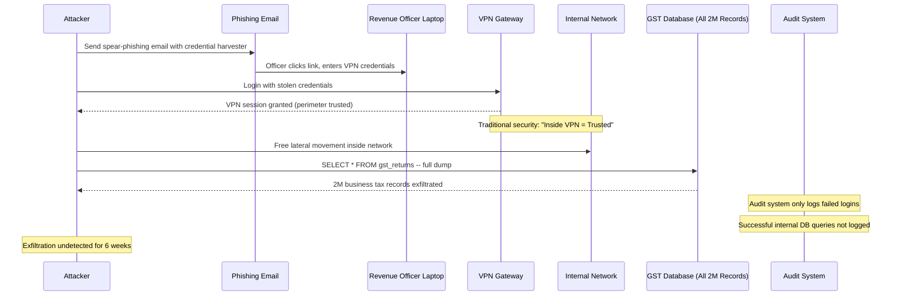

**Impact (Illustrative):**

| Impact Category        | Details                                                                    |
| ---------------------- | -------------------------------------------------------------------------- |
| Data compromised       | 2 million business GST filings including financials                        |
| Discovery timeline     | 6 weeks post-breach (detected by an external tip, not internal monitoring) |
| Regulatory consequence | IT Act Section 43A: potential liability; mandatory MeitY notification      |
| Remediation cost       | INR 8 Crore (forensics, notification, legal, infrastructure rebuild)       |
| Reputational damage    | State government portal taken offline for 72 hours                         |

**What Zero Trust Would Have Prevented:**

| ZT Control                     | How It Blocks the Attack                                                                                                                            |
| ------------------------------ | --------------------------------------------------------------------------------------------------------------------------------------------------- |
| Continuous device verification | Officer's laptop showed unusual process activity (keylogger); EDR flag would trigger session termination                                            |
| Behavior-based risk scoring    | Login from a new IP at 2 AM = risk score 70+; step-up MFA required; attacker doesn't have the OTP                                                   |
| Micro-segmentation             | Even with VPN access, the attacker's session (posing as a junior officer) would only have access to their assigned tax circle's records, not all 2M |
| Audit logging per query        | Every database query logged to immutable Cassandra store; anomalous bulk SELECT immediately triggers SIEM alert                                     |
| Least-privilege access         | The officer's role only permits reading/writing their assigned 500 taxpayer records; the bulk dump query would be denied by OPA policy              |

**After: Zero Trust Remediation Architecture:**

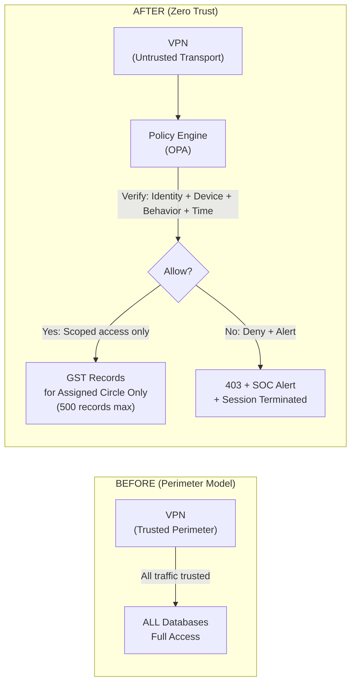

---

## Section E: Engagement and Assessment

### E.1 — Food for Thought

> **Architectural Dilemma:** Singapore's IM8 policy requires that all government systems implement Zero Trust. However, a legacy core system — a 20-year-old COBOL-based tax processing system — cannot be modified to implement OIDC, cannot install an agent, and cannot be placed behind a service mesh. It communicates over IBM MQ (Message Queue) using a proprietary binary protocol.
>
> - How do you bring this system into a Zero Trust architecture without modifying it?
> - Is a "ZT Proxy" (a sidecar or wrapper that enforces ZT controls at the network boundary of the legacy system) sufficient, or does it create a false sense of security?
> - The COBOL system has one service account that all 12 downstream services use. How do you implement the principle of least privilege without individual workload identity on the legacy side?
> - What is the minimum viable ZT control set for a system that cannot be modified?
>
> **ChatGPT/Copilot Prompt:** "Design a Zero Trust integration pattern for a legacy system that cannot implement OIDC or install agents. Include: network-level controls, proxy-based identity injection, audit logging, and the residual risk that remains. Reference NIST SP 800-207 Section 3.3 on ZTA deployment models."

### E.2 — Questionnaire: Topic 3

**Conceptual Questions**

1. **Define Zero Trust Architecture per NIST SP 800-207. What are the three core operational mandates, and how do they differ from traditional perimeter security?**

   *Answer:* NIST SP 800-207 defines ZTA as a paradigm where no implicit trust is granted based on network location. The three mandates are: (1) Verify Explicitly — authenticate and authorize using all available data points (identity, device, location, behavior, data sensitivity) for every request, not just at login; (2) Use Least-Privilege Access — grant minimal access rights necessary for the task, with just-in-time provisioning and time-limited sessions; (3) Assume Breach — design as if the attacker is already inside; minimize blast radius; encrypt all sessions; implement continuous monitoring. Traditional perimeter security differs by: granting implicit trust to all traffic originating from the internal network; authenticating once and maintaining long-lived sessions; focusing all security investment at the network boundary.

2. **Explain the role of the Policy Engine (PE), Policy Administrator (PA), and Policy Enforcement Point (PEP) in a Zero Trust architecture. Give a concrete example of each in the NationalServ context.**

   *Answer:* Policy Engine (PE): The decision-making component that evaluates access requests against policy and data from Policy Information Points. In NationalServ: OPA evaluating the Rego policy, consulting risk scores, device compliance, and JWT claims to decide ALLOW/DENY/CHALLENGE. Policy Administrator (PA): Establishes or tears down sessions between subjects and resources based on PE decisions. In NationalServ: Istio/Envoy receiving the PE decision and configuring the network path (creating or blocking the mTLS session between API Gateway and Citizen Service). Policy Enforcement Point (PEP): The component that intercepts requests, forwards to PA for decision, and enforces the outcome. In NationalServ: Spring Cloud Gateway's ZeroTrustPolicyFilter, which intercepts every API request, calls OPA, and either forwards or rejects the request.

3. **What is SPIFFE and how does it solve the workload identity problem in a Kubernetes microservices environment?**

   *Answer:* SPIFFE (Secure Production Identity Framework for Everyone) is an open standard for workload identity. It assigns cryptographic identities to workloads via SPIFFE IDs (URI format: `spiffe://trust-domain/path`) and SPIFFE Verifiable Identity Documents (SVIDs) — short-lived X.509 certificates issued by a SPIRE server. In Kubernetes: each pod receives an SVID from the SPIRE agent running on its node. The SVID is valid for 1 hour and automatically rotated. When CitizenService calls TenderService, it presents its SVID; TenderService validates the SVID against the SPIRE trust bundle (a shared CA certificate). This eliminates the need for static API keys or long-lived service account credentials. If a pod is compromised, its SVID expires in at most 1 hour, limiting the attacker's window of impersonation.

**Application Questions**

4. **Design the OPA policy rule for the following government scenario: A state health department officer must be able to read (not write) patient records ONLY for patients in their assigned district, ONLY between 0800-1800 IST, ONLY from an enrolled government device, and ONLY after completing FIDO2 authentication. Write the Rego rule structure.**

   *Answer:*
   ```rego
   allow if {
       "ROLE_HEALTH_OFFICER" in input.roles
       input.method == "GET"
       input.amr == "hwk"  # Hardware key (FIDO2)
       input.deviceCompliant == true
       input.districtCode == get_district_from_path(input.path)
       is_working_hours_ist
   }

   is_working_hours_ist if {
       now_ns := time.now_ns()
       hour_utc := (now_ns / 3600000000000) % 24
       # IST = UTC + 5:30, so 0800 IST = 0230 UTC, 1800 IST = 1230 UTC
       hour_utc >= 2
       hour_utc <= 12
   }

   get_district_from_path(path) := district if {
       parts := split(path, "/")
       district := parts[5]  # /api/v1/health/districts/{districtCode}/patients
   }
   ```

5. **A government portal receives 5 million API requests per day. The OPA Policy Engine evaluation takes 8ms per request (including network round-trip to OPA). Calculate the total latency overhead per day. Propose an optimization strategy that reduces this to under 2ms average without compromising the Zero Trust model.**

   *Answer:* Total latency overhead: 5,000,000 × 8ms = 40,000 seconds = 11.1 hours of cumulative latency per day. To reduce to < 2ms average: (1) Embed OPA as an in-process library (Go/Java) rather than a separate service — eliminates network round-trip (saves 5-6ms); residual evaluation time: 1-2ms. (2) Policy caching: cache ALLOW decisions with a 60-second TTL keyed on (subjectId + path + deviceId + ipHash). Cache hit rate of 90%+ means 90% of requests skip OPA entirely. Cache invalidation: publish to cache on role change, device de-enrollment, or active session revocation. (3) Fast-path for low-sensitivity resources: public endpoints (/api/v1/public/*) bypass OPA entirely via gateway configuration. (4) Bundle OPA policy compilation: precompile Rego policies to optimized plans at startup; runtime evaluation is plan execution, not interpretation.

6. **Map the five CISA Zero Trust pillars to specific technologies in the NationalServ architecture. For each pillar, name one metric you would monitor to ensure the pillar is functioning correctly.**

   *Answer:*

   | Pillar      | Technology                                     | Monitoring Metric                                                                                                               |
   | ----------- | ---------------------------------------------- | ------------------------------------------------------------------------------------------------------------------------------- |
   | Identity    | Keycloak + MFA + OPA                           | MFA completion rate (target: 100% for officer roles); alert if < 98%                                                            |
   | Device      | Microsoft Intune MDM + Defender EDR            | Device compliance rate (target: > 99%); alert on non-compliant device accessing SENSITIVE resources                             |
   | Network     | Kubernetes NetworkPolicy + Istio mTLS          | mTLS handshake failure rate (target: < 0.01%); unauthorized east-west connection attempts (target: 0)                           |
   | Application | OPA Policy Engine + SPIFFE/SPIRE               | Policy denial rate by reason (monitor for spikes indicating attack or misconfiguration); SVID rotation failure rate (target: 0) |
   | Data        | PostgreSQL column encryption + Azure Key Vault | Key access audit events per hour; unauthorized column-level decryption attempts (target: 0)                                     |

**Analysis Questions**

7. **Analyze the trade-off between Zero Trust security posture and developer productivity. A developer cannot test locally because OPA requires device compliance certificates and the risk engine uses production IP intelligence. How do you design a Zero Trust implementation that maintains security in production while not making local development impossible?**

   *Answer:* This is a fundamental ZTA operational challenge. Recommended approach: (1) Environment-aware policy evaluation: OPA policy reads an environment tag from the JWT issuer. In development JWTs (issued by a local Keycloak instance), device compliance and geo-risk checks are bypassed. Production JWTs (issued by the production Keycloak) enforce all checks. The policy issuer is validated by cryptographic signature — developers cannot forge production JWTs. (2) Policy stub mode: in the development Spring profile, replace OpaWebClient with a stub that always returns ALLOW. The ZeroTrustPolicyFilter is still present in code (no drift between environments) but the OPA client is mocked. (3) Integration testing against OPA: CI/CD pipeline runs the actual OPA policy against realistic inputs. Developers run `opa test` locally against the Rego files without needing the full infrastructure. (4) Developer sandbox Keycloak: A separate Keycloak realm with relaxed MFA requirements (TOTP instead of FIDO2) allows developers to test authentication flows. The trade-off accepted: developer environments are never truly Zero Trust; the risk is accepted because developers have no access to production data.

8. **Compare OPA (Open Policy Agent) as a Policy Engine against a custom Java-based policy service. Evaluate on: policy auditability, performance, operational complexity, and policy expressiveness for government use cases.**

   *Answer:*

   | Criterion               | OPA (Rego)                                                                                                                                          | Custom Java Policy Service                                                                                             |
   | ----------------------- | --------------------------------------------------------------------------------------------------------------------------------------------------- | ---------------------------------------------------------------------------------------------------------------------- |
   | Auditability            | Rego policies are declarative, human-readable, version-controlled; OPA Decision Logs provide structured audit trail per evaluation                  | Java code is auditable but harder for non-developers (legal, compliance) to review; requires documentation effort      |
   | Performance             | Embedded OPA: 1-2ms; sidecar OPA: 6-10ms (network); Wasm compiled: <1ms                                                                             | Java in-process: 0.1-0.5ms; no network overhead; maximum performance                                                   |
   | Operational Complexity  | Separate OPA deployment to manage; Rego learning curve; requires CI for policy testing                                                              | No additional infrastructure; but policy logic mixed with business logic; harder to change policy without redeployment |
   | Policy Expressiveness   | Purpose-built for policy: set operations, partial evaluation, data import from external sources (LDAP, DB) natively                                 | Unlimited expressiveness (it's code) but risk of overly complex, untestable logic                                      |
   | Government Use Case Fit | Government policies change frequently (minister orders, regulation changes); OPA allows policy update without application redeployment (hot reload) | Policy change requires code change, PR, CI/CD, deployment — 2-5 hour minimum cycle                                     |
   | Recommendation          | OPA for dynamic, frequently-changing policies (access control, data classification rules)                                                           | Custom Java for performance-critical, rarely-changing rules (JWT signature validation)                                 |

**Scenario-Based Questions**

9. **You are designing Zero Trust for a cross-agency portal in Singapore where four agencies (MOH, MOE, MOM, HDB) each have their own identity systems (Active Directory, Singpass, internal LDAP). A citizen must be able to log in once and access services from all four agencies without re-authenticating. How do you design the federated identity layer to satisfy both ZT and the single-sign-on requirement?**

   *Answer:* This requires a federated identity broker (Keycloak in its identity broker role) acting as the central OIDC/SAML hub. Architecture: (1) Keycloak as the portal's Identity Provider: all four agencies configure Keycloak as a trusted OIDC Relying Party (or SAML SP). Citizens authenticate to Keycloak once. (2) Agency identity systems as Identity Providers upstream of Keycloak: MOH's AD connects via LDAP federation; Singpass integrates via OIDC; internal LDAP systems connect via Kerberos/LDAP. Keycloak maps external identities to a canonical portal identity. (3) Zero Trust preservation: despite SSO, each agency's resources still enforce ZT policy. The SSO session establishes identity; the Policy Engine re-evaluates device posture, risk score, and least-privilege access for each agency's resources independently. (4) Claim transformation: Keycloak's identity broker transforms agency-specific claims (MOH employee ID, Singpass NRIC) into canonical JWT claims (`sub`, `jurisdiction`, `roles`). Each agency's OPA policy reads the appropriate claim. (5) Session timeout alignment: the SSO session has a 1-hour maximum lifetime (IM8 compliant); individual service tokens have 15-minute lifetimes with refresh. Risk-based events (anomalous behavior) trigger global SSO session termination across all four agencies simultaneously.

10. **A government CISO asks: "We implemented Zero Trust 6 months ago. How do I know it's actually working?" Design a Zero Trust effectiveness measurement framework with specific metrics, measurement methods, and acceptable thresholds for a national government platform.**

    *Answer:*

    | Metric                                             | Measurement Method                                                      | Acceptable Threshold    | Alert Threshold                                                   |
    | -------------------------------------------------- | ----------------------------------------------------------------------- | ----------------------- | ----------------------------------------------------------------- |
    | **Mean Time to Detect (MTTD) lateral movement**    | Red team exercises quarterly; SIEM correlation rules                    | < 15 minutes            | > 30 minutes                                                      |
    | **Policy denial rate with valid credentials**      | OPA decision log analysis; denied-but-authenticated requests            | 0.1-2% (noise floor)    | > 5% (policy misconfiguration) or < 0.01% (policy too permissive) |
    | **Device compliance rate**                         | MDM compliance dashboard                                                | > 99% enrolled devices  | < 97%                                                             |
    | **Unauthorized east-west connections**             | Istio/Envoy mTLS rejection metrics                                      | 0 per day               | > 0 (immediate alert)                                             |
    | **Privilege escalation attempts**                  | SIEM: OPA logs showing ROLE_CITIZEN attempting ROLE_GOV_OFFICER paths   | 0 successful            | Any successful = critical incident                                |
    | **MFA bypass rate**                                | Keycloak: sessions without MFA for protected roles                      | 0% for ROLE_GOV_OFFICER | Any > 0 = critical                                                |
    | **SVID rotation failures**                         | SPIRE server metrics: certificates not rotated within lifetime          | 0 failures              | > 0 (SPIRE health alert)                                          |
    | **Mean Time to Revoke (MTTR) compromised account** | Measure from SIEM alert to Keycloak session termination                 | < 5 minutes (automated) | > 15 minutes                                                      |
    | **Policy coverage**                                | % of API paths with explicit OPA policy rule (vs. hitting default-deny) | 100% explicit rules     | < 100% (default-deny is safe but means missing policy)            |
    | **Audit log completeness**                         | % of PII field accesses with corresponding audit record                 | 100%                    | < 99.99%                                                          |

---


# TOPIC 4: API Gateway Security, Keycloak/RBAC, mTLS, and Secret Management

## Learning Objectives

By the end of this topic, participants will be able to:

1. **Configure** a Keycloak realm with RBAC policies, client scopes, and protocol mappers for a government API security model
2. **Implement** mutual TLS (mTLS) between microservices and explain the certificate lifecycle management process
3. **Design** a secret management architecture using Azure Key Vault with rotation policies compliant with government security standards
4. **Evaluate** OAuth2 grant types and select the appropriate flow for citizen-facing, machine-to-machine, and government officer scenarios
5. **Apply** API Gateway security patterns including JWT validation, rate limiting, and request signing for a production government API

---

## Section A: Concept Foundation

### A.1 — API Gateway Security: The Southern Wall

**Analogy:** If Zero Trust Architecture is the overall security philosophy of a government building, then the API Gateway is the southern wall — the primary controlled entry point that every visitor must pass through. Unlike a firewall (which operates at the network packet level), the API Gateway operates at the HTTP/application level. It understands JWT tokens, OAuth2 scopes, HTTP methods, request bodies, and API versioning. It can make intelligent, context-aware decisions about each request.

**What an API Gateway Does (Security Perspective):**

| Function               | Description                                         | Implementation                                                |
| ---------------------- | --------------------------------------------------- | ------------------------------------------------------------- |
| **Authentication**     | Verify the identity of the caller                   | JWT validation against Keycloak JWKS endpoint                 |
| **Authorization**      | Verify the caller has permission for this operation | Scope validation, OPA policy evaluation                       |
| **Rate Limiting**      | Prevent abuse and DoS attacks                       | Token bucket / sliding window per client ID                   |
| **Request Validation** | Reject malformed or malicious requests              | JSON Schema validation, size limits, content-type enforcement |
| **TLS Termination**    | Decrypt HTTPS from clients; re-encrypt to services  | North-South TLS termination; East-West mTLS forwarding        |
| **Request Signing**    | Ensure request integrity                            | HMAC signature validation for inter-agency calls              |
| **Audit Logging**      | Record every API call with context                  | Structured JSON logs to SIEM                                  |
| **DDoS Protection**    | Absorb volumetric attacks                           | Combined with Azure Front Door WAF                            |

### A.2 — OAuth2 and OpenID Connect: The Identity Foundation

**OAuth2** is an authorization framework (RFC 6749) that allows a resource owner to grant limited access to their protected resources to a third party, without sharing credentials. **OpenID Connect (OIDC)** is an identity layer built on top of OAuth2 that adds authentication — it tells you not just "this client is authorized" but "this specific person is authenticated."

> **Architect's Note:** OAuth2 alone is an authorization protocol — it issues access tokens that say "you can do X." OIDC adds authentication — it issues ID tokens that say "you are person Y." For government systems, you need both: you must know WHO is making the request (OIDC) and WHAT they are allowed to do (OAuth2 scopes + RBAC).

**OAuth2 Grant Types and Government Applicability:**

| Grant Type                               | Flow Description                                                           | Government Use Case                                                   | Security Level           |
| ---------------------------------------- | -------------------------------------------------------------------------- | --------------------------------------------------------------------- | ------------------------ |
| **Authorization Code + PKCE**            | Browser redirects to IdP; citizen authenticates; code exchanged for tokens | Citizen self-service portal (most secure for human users)             | Highest                  |
| **Client Credentials**                   | Service authenticates with client ID + secret; receives access token       | Service-to-service (M2M): Tender Service calling Notification Service | High (with mTLS binding) |
| **Device Authorization**                 | Device displays code; user authorizes on separate device                   | Government IoT devices, smart kiosks                                  | High                     |
| **Implicit** (DEPRECATED)                | Token returned directly in browser redirect                                | Do not use in new systems                                             | Lowest                   |
| **Resource Owner Password** (DEPRECATED) | User sends credentials directly to client                                  | Do not use in new systems                                             | Lowest                   |

**Token Types in Government Context:**

```
Access Token (JWT):
{
  "sub": "citizen-uuid-12345",           // Subject: unique citizen identifier
  "iss": "https://auth.nationalserv.gov.in",  // Issuer: Keycloak realm
  "aud": ["citizen-api", "tender-api"],  // Audience: permitted resource servers
  "exp": 1704070800,                     // Expiry: 15 minutes (short-lived for ZT)
  "iat": 1704069900,                     // Issued at
  "jti": "unique-token-id-uuid",         // JWT ID: for replay prevention
  "scope": "profile:read tender:read",   // OAuth2 scopes: what operations are permitted
  "roles": ["ROLE_CITIZEN"],             // Custom claim: RBAC roles
  "jurisdiction": "IN",                  // Custom claim: data sovereignty
  "amr": ["otp"],                        // Authentication method reference
  "azp": "citizen-portal-client"         // Authorized party: which client
}

ID Token (JWT - OIDC):
{
  "sub": "citizen-uuid-12345",
  "name": "Priya Sharma",               // Display name (not in access token for ZT)
  "email": "priya@example.com",         // Only in ID token, not access token
  "phone_number_verified": true,
  "aadhaar_verified": true,             // India-specific: Aadhaar eKYC completed
  "nonce": "random-value-prevents-replay"
}

Refresh Token:
- Opaque string (not JWT) - cannot be decoded
- Valid for 24 hours (government: 8 hours max per work shift)
- Single-use: exchanged for new access token + new refresh token
- Stored server-side in Keycloak; can be revoked immediately
```

### A.3 — RBAC vs. ABAC: The Authorization Model Choice

**RBAC (Role-Based Access Control)** grants permissions based on a user's role. A role is a collection of permissions. Users are assigned roles.

**ABAC (Attribute-Based Access Control)** grants permissions based on attributes of the subject (user), resource, environment, and action. Policies evaluate attribute combinations dynamically.

| Dimension                     | RBAC                                           | ABAC                                                                                                                      |
| ----------------------------- | ---------------------------------------------- | ------------------------------------------------------------------------------------------------------------------------- |
| **Decision basis**            | Role membership                                | Attribute combination (who + what + where + when + how)                                                                   |
| **Granularity**               | Coarse (role-level)                            | Fine-grained (attribute-level)                                                                                            |
| **Implementation complexity** | Low                                            | High                                                                                                                      |
| **Policy management**         | Simple: assign/remove roles                    | Complex: write and maintain attribute policies                                                                            |
| **Dynamic conditions**        | Hard to express (e.g., "only between 9-5")     | Natural (time is just another attribute)                                                                                  |
| **Government fit**            | Good for clearly defined staff hierarchies     | Essential for citizen data (sensitivity varies per record)                                                                |
| **Example**                   | "ROLE_HEALTH_OFFICER can read patient records" | "A health officer from district D can read patient records from district D during business hours from a compliant device" |

> **Architect's Note:** In practice, government platforms use **RBAC for coarse-grained authorization** (enforced at the API Gateway: "this token has the right role to call this endpoint") combined with **ABAC at the service layer** (enforced by OPA or service logic: "this officer can only access records in their assigned district"). Pure RBAC leads to role explosion (thousands of fine-grained roles). Pure ABAC is complex to manage and audit. The hybrid is the enterprise standard.

### A.4 — Mutual TLS (mTLS): Two-Way Certificate Verification

**Standard TLS (One-Way):** The client verifies the server's identity via the server's X.509 certificate. The server does not verify the client's identity (anonymous client).

**mTLS (Mutual TLS, Two-Way):** Both the client and the server present X.509 certificates. Both verify each other's identity cryptographically. Neither party trusts the other without certificate validation.

**Why mTLS for Microservices:**

```
Without mTLS (East-West):
  CitizenService → [plaintext or one-way TLS] → TenderService
  Problem: Any pod that can reach TenderService's port can call its APIs
  An attacker who compromises one pod can impersonate CitizenService

With mTLS (East-West):
  CitizenService presents cert: "I am spiffe://nationalserv.gov.in/citizen-service"
  TenderService validates cert against trust bundle
  TenderService policy: only accept calls from known SPIFFE IDs
  An attacker pod has no valid cert → connection rejected at TLS handshake
```

**mTLS Certificate Lifecycle:**

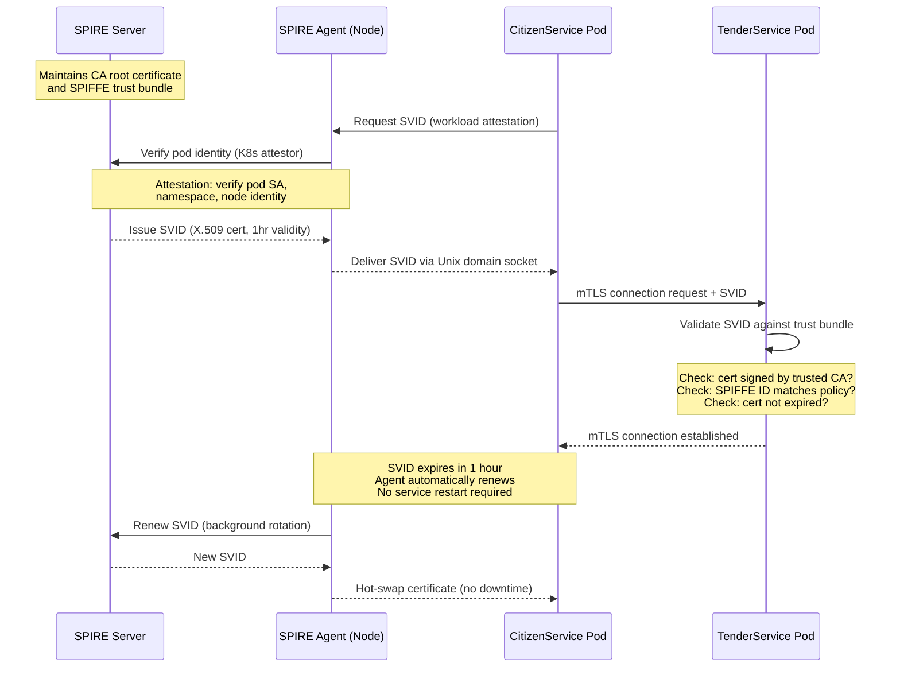

### A.5 — Secret Management: The Hierarchy of Secrets

**Secret** — any piece of sensitive configuration data that grants access to a protected resource: database passwords, API keys, TLS private keys, OAuth2 client secrets, encryption keys.

**The Secret Management Maturity Model:**

```
Level 0: Hardcoded in source code (NEVER acceptable)
  → Secrets in git history forever; any contributor can extract

Level 1: Environment variables set manually
  → Better, but secrets in shell history; hard to rotate; no audit trail

Level 2: .env files / config files excluded from git
  → Still manual; no rotation; if file is leaked, secret is compromised

Level 3: CI/CD secret variables (GitHub Actions Secrets, GitLab CI Variables)
  → Automated injection; masked in logs; but CI platform has all secrets

Level 4: Centralized Secret Manager (Azure Key Vault, HashiCorp Vault)
  → Centralized control; rotation; audit trail; access policy; the standard for production

Level 5: Dynamic Secrets + Short-Lived Credentials
  → Database credentials generated on-demand; expire after use; maximum security
  → HashiCorp Vault database secrets engine; Azure Managed Identity
```

**Azure Key Vault Architecture for NationalServ:**

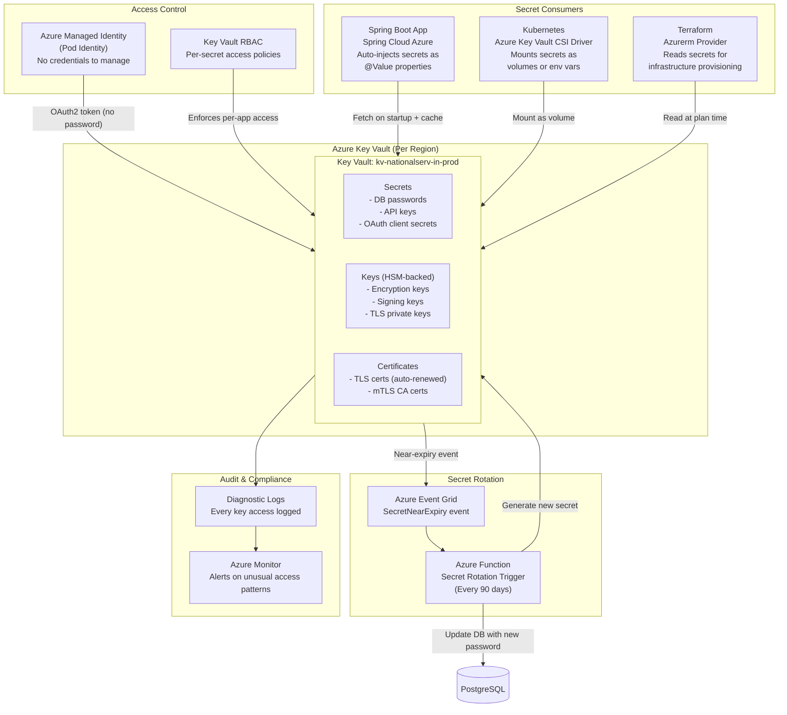

---

## Section B: Architecture and Design

### B.1 — Complete API Security Architecture for NationalServ

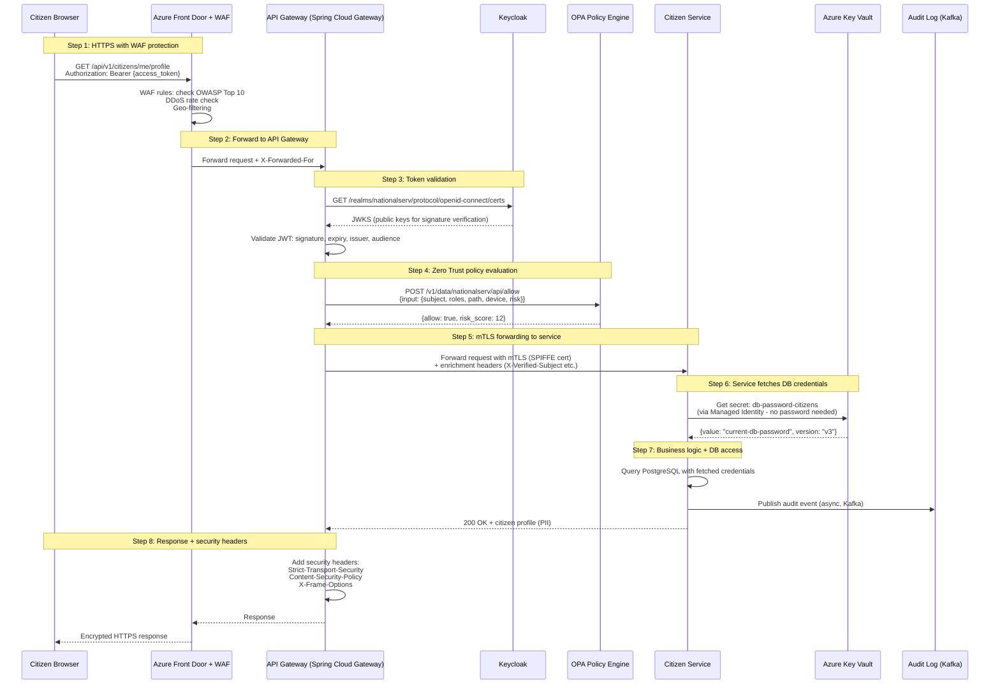

### B.2 — Keycloak Realm Design for NationalServ

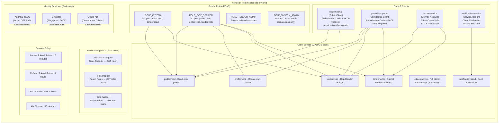

---

## Section C: Code Walkthrough

### C.1 — Keycloak Configuration via Terraform (IaC)

```hcl
# keycloak.tf
# Provisions the NationalServ Keycloak realm, clients, roles, and scopes via Terraform.
# WHY IaC for Keycloak: Keycloak configuration must be version-controlled, reproducible,
# and auditable. Manual UI configuration leads to configuration drift between environments.
# Every change is a git commit, reviewed, and traceable to a ticket.

terraform {
  required_providers {
    keycloak = {
      source  = "mrparkers/keycloak"
      version = "~> 4.3"
    }
    azurerm = {
      source  = "hashicorp/azurerm"
      version = "~> 3.85"
    }
  }
}

provider "keycloak" {
  client_id     = "terraform"
  client_secret = var.keycloak_terraform_secret  # Fetched from Azure Key Vault
  url           = var.keycloak_url
  realm         = "master"
}

# ─────────────────────────────────────────────────────────────────
# REALM: The top-level security domain for NationalServ
# ─────────────────────────────────────────────────────────────────
resource "keycloak_realm" "nationalserv" {
  realm   = "nationalserv-prod"
  enabled = true

  display_name     = "NationalServ Government Portal"
  display_name_html = "<strong>NationalServ</strong> — Secured by Zero Trust"

  # Login settings
  registration_allowed         = false  # Citizens registered via Aadhaar/Singpass only
  remember_me                  = false  # Government security policy: no persistent sessions
  verify_email                 = true
  login_with_email_allowed     = true
  duplicate_emails_allowed     = false

  # Session lifetimes (aligned with government shift hours)
  # WHY short-lived: Zero Trust principle; compromised token expires quickly
  access_token_lifespan                    = "900"    # 15 minutes
  access_token_lifespan_for_implicit_flow  = "900"    # 15 minutes (legacy support)
  sso_session_idle_timeout                 = "1800"   # 30 minutes idle
  sso_session_max_lifespan                 = "28800"  # 8 hours maximum (one shift)
  offline_session_idle_timeout             = "0"      # No offline sessions for government
  offline_session_max_lifespan_enabled     = false

  # Password policy (NIST SP 800-63B compliant)
  # WHY these specific rules: NIST recommends length over complexity;
  # dictionary check prevents common passwords; no forced periodic expiry
  # (NIST: forced expiry leads to weaker passwords like "Password2024!")
  password_policy = join(" and ", [
    "length(12)",                    # Minimum 12 characters
    "notUsername",                   # Cannot contain username
    "notEmail",                      # Cannot contain email
    "blacklist(common_passwords)",   # Block top 10K common passwords
    "hashIterations(210000)"         # PBKDF2 iterations for bcrypt strength
  ])

  # Brute force protection
  brute_force_protected          = true
  permanent_lockout              = false
  max_failure_wait_seconds       = 900   # 15 minute lockout after failures
  minimum_quick_login_wait_seconds = 60
  wait_increment_seconds         = 60
  quick_login_check_milli_seconds = 1000
  max_delta_time_seconds         = 43200 # 12 hour failure tracking window
  failure_factor                 = 5     # Lock after 5 failed attempts

  # OTP (TOTP) policy for MFA
  otp_policy_type              = "totp"
  otp_policy_algorithm         = "HmacSHA256"  # SHA-256 (more secure than SHA-1)
  otp_policy_digits            = 6
  otp_policy_period            = 30            # 30-second TOTP window
  otp_policy_look_ahead_window = 1             # Allow 1 window tolerance for clock skew

  # SSL required for all connections
  ssl_required = "all"

  # Internationalization (India: multiple official languages)
  internationalization_enabled = true
  supported_locales            = ["en", "hi", "ta", "te", "bn", "mr"]
  default_locale               = "en"
}

# ─────────────────────────────────────────────────────────────────
# CLIENT SCOPES: Granular OAuth2 permissions
# ─────────────────────────────────────────────────────────────────
resource "keycloak_openid_client_scope" "profile_read" {
  realm_id    = keycloak_realm.nationalserv.id
  name        = "profile:read"
  description = "Read own citizen profile (name, address, contact)"
  include_in_token_scope = true
  consent_screen_text    = "Allow reading your profile information"
}

resource "keycloak_openid_client_scope" "tender_read" {
  realm_id    = keycloak_realm.nationalserv.id
  name        = "tender:read"
  description = "Read published government tenders"
  include_in_token_scope = true
  # No consent required: public tender data
}

resource "keycloak_openid_client_scope" "tender_write" {
  realm_id    = keycloak_realm.nationalserv.id
  name        = "tender:write"
  description = "Submit and manage tender applications"
  include_in_token_scope = true
  consent_screen_text    = "Allow submitting tender applications on your behalf"
}

# ─────────────────────────────────────────────────────────────────
# CLIENT: Citizen Portal (Browser-based, Public Client)
# ─────────────────────────────────────────────────────────────────
resource "keycloak_openid_client" "citizen_portal" {
  realm_id  = keycloak_realm.nationalserv.id
  client_id = "citizen-portal"
  name      = "NationalServ Citizen Portal"
  enabled   = true

  # Public client: no client secret (browser-based SPA cannot keep secrets)
  # WHY: A secret embedded in JavaScript is not a secret
  access_type = "PUBLIC"

  # Authorization Code + PKCE (the only secure flow for public clients)
  standard_flow_enabled        = true   # Authorization Code flow
  implicit_flow_enabled        = false  # DEPRECATED: never enable
  direct_access_grants_enabled = false  # Resource Owner Password: never enable
  service_accounts_enabled     = false  # M2M only

  # Strict redirect URI validation (XSS protection)
  # Only allow redirects to the official portal domain
  valid_redirect_uris = [
    "https://portal.nationalserv.gov.in/*",
    "https://portal-staging.nationalserv.gov.in/*"  # Staging environment
  ]

  # CORS: Only allow requests from official portal origins
  web_origins = [
    "https://portal.nationalserv.gov.in",
    "https://portal-staging.nationalserv.gov.in"
  ]

  # Suppress consent screen for first-party portal
  # WHY: Consent screen is for third-party clients accessing user data
  # The government's own portal doesn't need user consent to access government data
  consent_required = false

  # PKCE: Proof Key for Code Exchange (prevents authorization code interception)
  pkce_code_challenge_method = "S256"  # SHA-256 PKCE (stronger than plain)

  # Token settings
  access_token_lifespan = "900"  # 15 minutes (override realm default)
}

# ─────────────────────────────────────────────────────────────────
# CLIENT: Tender Service (Machine-to-Machine, Confidential)
# ─────────────────────────────────────────────────────────────────
resource "keycloak_openid_client" "tender_service" {
  realm_id  = keycloak_realm.nationalserv.id
  client_id = "tender-service"
  name      = "Tender Management Service (Internal)"
  enabled   = true

  # Confidential client: has a client secret
  # For M2M: client authenticates with client_id + client_secret
  # Enhanced security: use mTLS client authentication instead of secret
  access_type = "CONFIDENTIAL"

  # Service account only: no human users authenticate via this client
  service_accounts_enabled     = true
  standard_flow_enabled        = false
  direct_access_grants_enabled = false

  # Client secret rotated every 90 days via Azure Key Vault rotation policy
  # The secret itself is stored in Azure Key Vault, not in Terraform state
  client_secret_rotation_not_before = "0"
}

# Service Account Role Assignment: Tender Service can only use tender scopes
resource "keycloak_openid_client_service_account_role" "tender_service_role" {
  realm_id                = keycloak_realm.nationalserv.id
  service_account_user_id = keycloak_openid_client.tender_service.service_account_user_id
  client_id               = keycloak_openid_client.tender_service.id
  role                    = keycloak_role.tender_service_role.name
}

# ─────────────────────────────────────────────────────────────────
# REALM ROLES: RBAC roles assigned to users/service accounts
# ─────────────────────────────────────────────────────────────────
resource "keycloak_role" "citizen_role" {
  realm_id    = keycloak_realm.nationalserv.id
  name        = "ROLE_CITIZEN"
  description = "Authenticated citizen: read own profile, read public tenders"
}

resource "keycloak_role" "gov_officer_role" {
  realm_id    = keycloak_realm.nationalserv.id
  name        = "ROLE_GOV_OFFICER"
  description = "Government officer: read/write tenders, read assigned citizen records"
  # Composite role: includes all citizen permissions plus officer-specific ones
  composite_roles = [keycloak_role.citizen_role.id]
}

resource "keycloak_role" "tender_admin_role" {
  realm_id    = keycloak_realm.nationalserv.id
  name        = "ROLE_TENDER_ADMIN"
  description = "Tender administrator: full tender lifecycle management"
  composite_roles = [keycloak_role.gov_officer_role.id]
}

# ─────────────────────────────────────────────────────────────────
# PROTOCOL MAPPERS: Inject custom claims into JWT
# ─────────────────────────────────────────────────────────────────
resource "keycloak_openid_user_attribute_protocol_mapper" "jurisdiction_mapper" {
  realm_id  = keycloak_realm.nationalserv.id
  client_id = keycloak_openid_client.citizen_portal.id
  name      = "jurisdiction-mapper"

  user_attribute   = "jurisdiction"  # Stored in Keycloak user profile
  claim_name       = "jurisdiction"  # Added to JWT as 'jurisdiction' claim
  claim_value_type = "String"
  add_to_id_token      = false  # Not in ID token (not needed for auth)
  add_to_access_token  = true   # Yes in access token (needed for ZT policy)
  add_to_userinfo      = true   # Yes in userinfo endpoint
}

resource "keycloak_openid_user_realm_role_protocol_mapper" "roles_mapper" {
  realm_id  = keycloak_realm.nationalserv.id
  client_id = keycloak_openid_client.citizen_portal.id
  name      = "roles-mapper"

  claim_name       = "roles"  # JWT claim name
  claim_value_type = "String"
  multivalued      = true     # Array of role strings
  add_to_id_token     = false
  add_to_access_token = true
  add_to_userinfo     = false
}
```

### C.2 — Spring Boot JWT Validation and RBAC

```java
// SecurityConfiguration.java
// Spring Security configuration for JWT-based stateless authentication.
// The service trusts JWTs issued by Keycloak; it does NOT manage sessions.
// WHY stateless: microservices should not maintain session state;
// each request is self-contained with the JWT carrying all needed claims.

package gov.nationalserv.citizenservice.config;

import org.springframework.context.annotation.Bean;
import org.springframework.context.annotation.Configuration;
import org.springframework.security.config.annotation.method.configuration.EnableMethodSecurity;
import org.springframework.security.config.annotation.web.builders.HttpSecurity;
import org.springframework.security.config.annotation.web.configuration.EnableWebSecurity;
import org.springframework.security.config.http.SessionCreationPolicy;
import org.springframework.security.oauth2.server.resource.authentication.JwtAuthenticationConverter;
import org.springframework.security.oauth2.server.resource.authentication.JwtGrantedAuthoritiesConverter;
import org.springframework.security.web.SecurityFilterChain;

@Configuration
@EnableWebSecurity
@EnableMethodSecurity(prePostEnabled = true)  // Enables @PreAuthorize on methods
public class SecurityConfiguration {

    /**
     * Security filter chain configuration.
     *
     * WHY JWT Resource Server (not session-based):
     * - Microservices are stateless by design (12-Factor App principle)
     * - No sticky sessions needed; any pod can handle any request
     * - JWT carries all needed claims; no database lookup per request
     * - Horizontal scaling is trivial without session affinity
     *
     * The JWT is validated by the API Gateway BEFORE reaching this service.
     * WHY validate again here:
     * - Defense in depth: if somehow a request bypasses the gateway, the service still rejects it
     * - Service-level claims validation (audience, specific scope requirements)
     * - Zero Trust principle: every service validates identity independently
     */
    @Bean
    public SecurityFilterChain securityFilterChain(HttpSecurity http) throws Exception {
        http
            // Disable CSRF: JWT-based APIs are not vulnerable to CSRF
            // (CSRF exploits browser cookie auto-send; JWTs are sent explicitly)
            .csrf(csrf -> csrf.disable())

            // Stateless: no server-side session; every request must carry a valid JWT
            .sessionManagement(session ->
                session.sessionCreationPolicy(SessionCreationPolicy.STATELESS))

            // Request authorization rules
            .authorizeHttpRequests(auth -> auth
                // Actuator health: allow without auth (for K8s liveness probe)
                .requestMatchers("/actuator/health", "/actuator/info").permitAll()
                // Prometheus metrics: allow only from monitoring namespace
                // (enforced by NetworkPolicy; this is belt-and-suspenders)
                .requestMatchers("/actuator/prometheus").permitAll()
                // All other requests: must have valid JWT
                .anyRequest().authenticated()
            )

            // Configure as OAuth2 Resource Server (validates JWT from Keycloak)
            .oauth2ResourceServer(oauth2 -> oauth2
                .jwt(jwt -> jwt
                    // Keycloak's JWKS endpoint for JWT signature validation
                    // Spring caches these keys; refreshes if key ID not found
                    .jwkSetUri("${keycloak.jwks-uri}")
                    // Custom converter to extract roles from 'roles' claim
                    .jwtAuthenticationConverter(jwtAuthenticationConverter())
                )
            );

        return http.build();
    }

    /**
     * Converts JWT 'roles' claim to Spring Security GrantedAuthorities.
     *
     * WHY custom converter:
     * Keycloak puts roles in a custom 'roles' array claim.
     * Spring Security's default converter looks for 'scope' claim only.
     * We need to map our custom 'roles' claim to Spring's authority model.
     */
    @Bean
    public JwtAuthenticationConverter jwtAuthenticationConverter() {
        JwtGrantedAuthoritiesConverter grantedAuthoritiesConverter =
            new JwtGrantedAuthoritiesConverter();

        // Tell Spring to read authorities from the 'roles' claim
        grantedAuthoritiesConverter.setAuthoritiesClaimName("roles");

        // Prefix with ROLE_ (Spring Security convention for role-based checks)
        // WHY: @PreAuthorize("hasRole('CITIZEN')") requires ROLE_CITIZEN in authorities
        // Our JWT already has "ROLE_CITIZEN" so we use empty prefix
        grantedAuthoritiesConverter.setAuthorityPrefix("");

        JwtAuthenticationConverter jwtAuthenticationConverter = new JwtAuthenticationConverter();
        jwtAuthenticationConverter.setJwtGrantedAuthoritiesConverter(grantedAuthoritiesConverter);
        return jwtAuthenticationConverter;
    }
}
```

```java
// CitizenProfileController.java
// Demonstrates method-level RBAC using @PreAuthorize
// and jurisdiction-based data access control

package gov.nationalserv.citizenservice.controller;

import gov.nationalserv.citizenservice.service.CitizenProfileService;
import gov.nationalserv.citizenservice.dto.*;
import lombok.RequiredArgsConstructor;
import lombok.extern.slf4j.Slf4j;
import org.springframework.http.ResponseEntity;
import org.springframework.security.access.prepost.PreAuthorize;
import org.springframework.security.core.annotation.AuthenticationPrincipal;
import org.springframework.security.oauth2.jwt.Jwt;
import org.springframework.web.bind.annotation.*;

import jakarta.validation.Valid;
import java.util.UUID;

@RestController
@RequestMapping("/api/v1/citizens")
@RequiredArgsConstructor
@Slf4j
public class CitizenProfileController {

    private final CitizenProfileService profileService;

    /**
     * GET own profile: Citizen can only read their own profile.
     *
     * @PreAuthorize: Method-level security evaluated BEFORE the method executes.
     * - hasRole('ROLE_CITIZEN'): JWT must contain ROLE_CITIZEN in roles claim
     * - #jwt.subject == #citizenId.toString(): JWT subject (citizen UUID) must match
     *   the path parameter. This prevents horizontal privilege escalation:
     *   Citizen A cannot read Citizen B's profile even with a valid ROLE_CITIZEN token.
     *
     * WHY SpEL expression (not just role check):
     * Role alone is insufficient for citizen self-service.
     * Any authenticated citizen would be able to read any other citizen's profile
     * with just a role check. The subject == citizenId check enforces
     * ownership-based access control.
     */
    @GetMapping("/{citizenId}/profile")
    @PreAuthorize("hasRole('ROLE_CITIZEN') and #jwt.subject == #citizenId.toString()")
    public ResponseEntity<CitizenProfileResponse> getProfile(
            @PathVariable UUID citizenId,
            @AuthenticationPrincipal Jwt jwt) {

        // Extract jurisdiction from JWT claim (set by Keycloak protocol mapper)
        String jurisdiction = jwt.getClaimAsString("jurisdiction");

        log.info("Profile read request: citizenId={}, jurisdiction={}, " +
            "requester={}", citizenId, jurisdiction, jwt.getSubject());

        CitizenProfileResponse profile = profileService.getProfile(citizenId, jurisdiction);
        return ResponseEntity.ok(profile);
    }

    /**
     * GET any citizen profile: Government officers can read any citizen in their jurisdiction.
     *
     * @PreAuthorize:
     * - hasRole('ROLE_GOV_OFFICER'): Must be a government officer
     * - @jurisdictionValidator.validate(#jwt, #citizenId): Custom security expression
     *   that calls a Spring bean to validate the officer's jurisdiction matches
     *   the citizen's registered jurisdiction.
     *   WHY bean reference: Complex validation logic should not live in SpEL strings;
     *   it becomes unmaintainable and untestable. Extract to a named Spring bean.
     */
    @GetMapping("/admin/{citizenId}/profile")
    @PreAuthorize("hasRole('ROLE_GOV_OFFICER') and " +
                  "@jurisdictionValidator.validate(#jwt, #citizenId)")
    public ResponseEntity<CitizenProfileResponse> getProfileAsOfficer(
            @PathVariable UUID citizenId,
            @AuthenticationPrincipal Jwt jwt) {

        String jurisdiction = jwt.getClaimAsString("jurisdiction");
        String officerId = jwt.getSubject();

        log.info("Officer profile access: officerId={}, targetCitizenId={}, jurisdiction={}",
            officerId, citizenId, jurisdiction);

        // Audit: officer access to citizen data is always logged at INFO level
        // The audit service writes to Kafka for immutable storage
        CitizenProfileResponse profile = profileService.getProfileAsOfficer(
            citizenId, jurisdiction, officerId);
        return ResponseEntity.ok(profile);
    }

    /**
     * UPDATE own profile: Citizen can only update their own profile.
     *
     * Additional constraint: 'profile:write' scope must be present in the token.
     * WHY scope check + role check:
     * A citizen might authenticate via a third-party app (not the official portal).
     * The third-party app may only be granted 'profile:read' scope by the citizen.
     * Even if the citizen has ROLE_CITIZEN, the write operation is blocked
     * because the scope is not present. This implements the principle of
     * least privilege at the OAuth2 authorization layer.
     */
    @PutMapping("/{citizenId}/profile")
    @PreAuthorize("hasRole('ROLE_CITIZEN') " +
                  "and #jwt.subject == #citizenId.toString() " +
                  "and #jwt.getClaimAsStringList('scope').contains('profile:write')")
    public ResponseEntity<CitizenProfileResponse> updateProfile(
            @PathVariable UUID citizenId,
            @Valid @RequestBody CitizenProfileUpdateRequest request,
            @AuthenticationPrincipal Jwt jwt) {

        String jurisdiction = jwt.getClaimAsString("jurisdiction");
        CitizenProfileResponse updated = profileService.updateProfile(
            citizenId, request, jurisdiction);
        return ResponseEntity.ok(updated);
    }

    /**
     * ADMIN operation: Break-glass access for system administrators.
     *
     * WHY @PreAuthorize with multiple conditions:
     * - ROLE_SYSTEM_ADMIN: only the most privileged role
     * - 'citizen:admin' scope: explicitly granted scope (not default for any role)
     * - amr contains 'hwk': Hardware key authentication required
     *   (FIDO2/YubiKey — the strongest MFA available)
     * - No one should routinely call this endpoint.
     *   It exists for data correction by authorized staff only.
     */
    @GetMapping("/admin/break-glass/{citizenId}")
    @PreAuthorize("hasRole('ROLE_SYSTEM_ADMIN') " +
                  "and #jwt.getClaimAsStringList('scope').contains('citizen:admin') " +
                  "and #jwt.getClaimAsString('amr').contains('hwk')")
    public ResponseEntity<CitizenProfileResponse> breakGlassAccess(
            @PathVariable UUID citizenId,
            @AuthenticationPrincipal Jwt jwt) {

        // Break-glass: every access logged as WARN (triggers SOC alert)
        log.warn("BREAK-GLASS ACCESS: adminId={}, targetCitizenId={}, " +
            "time={}, ip={}",
            jwt.getSubject(), citizenId,
            java.time.Instant.now(),
            "extracted-from-request-context");

        return ResponseEntity.ok(
            profileService.getProfileBreakGlass(citizenId, jwt.getSubject()));
    }
}
```

### C.3 — Secret Management with Azure Key Vault

```java
// KeyVaultSecretService.java
// Demonstrates fetching secrets from Azure Key Vault using Managed Identity.
// No credentials are stored in code, config files, or environment variables.
// The pod's Azure Managed Identity IS the authentication mechanism.

package gov.nationalserv.citizenservice.config;

import com.azure.identity.DefaultAzureCredentialBuilder;
import com.azure.security.keyvault.secrets.SecretClient;
import com.azure.security.keyvault.secrets.SecretClientBuilder;
import com.azure.security.keyvault.secrets.models.KeyVaultSecret;
import lombok.extern.slf4j.Slf4j;
import org.springframework.beans.factory.annotation.Value;
import org.springframework.context.annotation.Bean;
import org.springframework.context.annotation.Configuration;
import org.springframework.scheduling.annotation.Scheduled;
import org.springframework.stereotype.Service;

import java.time.Instant;
import java.util.concurrent.ConcurrentHashMap;

@Configuration
@Slf4j
public class KeyVaultConfiguration {

    @Value("${azure.keyvault.uri}")  // e.g., https://kv-nationalserv-in-prod.vault.azure.net/
    private String keyVaultUri;

    /**
     * SecretClient bean using DefaultAzureCredential.
     *
     * DefaultAzureCredential tries multiple authentication methods in order:
     * 1. Environment variables (AZURE_CLIENT_ID, AZURE_CLIENT_SECRET) - for local dev
     * 2. Azure Managed Identity - for production (pod identity, no secrets needed)
     * 3. Azure CLI (az login) - for developer machines
     * 4. Visual Studio / IntelliJ Azure plugin
     *
     * WHY DefaultAzureCredential:
     * The same code works in all environments without modification.
     * In production, Managed Identity provides credentials automatically.
     * Zero secrets to manage for the Key Vault client itself.
     */
    @Bean
    public SecretClient secretClient() {
        return new SecretClientBuilder()
            .vaultUrl(keyVaultUri)
            .credential(new DefaultAzureCredentialBuilder().build())
            .buildClient();
    }
}

@Service
@Slf4j
public class KeyVaultSecretService {

    private final SecretClient secretClient;

    // Local cache to avoid Key Vault rate limits (429 Too Many Requests)
    // Key Vault has a rate limit of ~2000 requests/10 seconds per vault
    // With 50 pods each fetching secrets on every request = rate limit exceeded
    // Cache with TTL is the production solution
    private final ConcurrentHashMap<String, CachedSecret> secretCache =
        new ConcurrentHashMap<>();

    private static final long CACHE_TTL_SECONDS = 300;  // 5-minute cache for secrets

    public KeyVaultSecretService(SecretClient secretClient) {
        this.secretClient = secretClient;
    }

    /**
     * Fetches a secret from Azure Key Vault with local caching.
     *
     * WHY cache with TTL (not cache indefinitely):
     * Secret rotation happens every 90 days.
     * If we cache indefinitely, we'll use the old secret after rotation
     * and DB connections will fail.
     * 5-minute TTL ensures we pick up rotated secrets within 5 minutes.
     *
     * WHY not cache forever:
     * If a secret is compromised and revoked, we need to stop using it quickly.
     * 5-minute TTL limits the window of using a compromised secret.
     */
    public String getSecret(String secretName) {
        CachedSecret cached = secretCache.get(secretName);

        if (cached != null && !cached.isExpired()) {
            log.debug("Secret cache hit: {}", secretName);
            return cached.getValue();
        }

        // Cache miss or expired: fetch from Key Vault
        log.info("Fetching secret from Key Vault: {}", secretName);
        try {
            KeyVaultSecret secret = secretClient.getSecret(secretName);
            String value = secret.getValue();

            // Store in cache with expiry time
            secretCache.put(secretName, new CachedSecret(value, CACHE_TTL_SECONDS));
            log.info("Secret fetched and cached: {} (expires in {}s)",
                secretName, CACHE_TTL_SECONDS);

            return value;

        } catch (Exception e) {
            log.error("Failed to fetch secret '{}' from Key Vault: {}",
                secretName, e.getMessage());

            // If Key Vault is unavailable but we have a cached value (even expired),
            // use the cached value rather than failing completely
            // WHY: Key Vault availability is ~99.99% but not 100%;
            // circuit breaker pattern: prefer stale secret over complete failure
            if (cached != null) {
                log.warn("Using expired cached secret for '{}' due to Key Vault unavailability",
                    secretName);
                return cached.getValue();
            }

            throw new SecretFetchException(
                "Cannot fetch secret '" + secretName + "' and no cache available", e);
        }
    }

    /**
     * Scheduled secret refresh: proactively refresh secrets before cache expiry.
     * This prevents cold-start latency spikes when many pods refresh simultaneously.
     * WHY scheduled refresh:
     * Without this, 50 pods would all hit Key Vault at the same moment
     * when their 5-minute TTL expires (thundering herd problem).
     * Scheduled refresh at random jitter intervals prevents this.
     */
    @Scheduled(fixedDelayString = "#{T(java.util.concurrent.ThreadLocalRandom)" +
                                   ".current().nextLong(240000, 280000)}")
    public void refreshSecretCache() {
        log.info("Proactive secret cache refresh starting for {} cached secrets",
            secretCache.size());
        secretCache.keySet().forEach(secretName -> {
            try {
                KeyVaultSecret secret = secretClient.getSecret(secretName);
                secretCache.put(secretName,
                    new CachedSecret(secret.getValue(), CACHE_TTL_SECONDS));
                log.debug("Proactively refreshed secret: {}", secretName);
            } catch (Exception e) {
                log.warn("Failed to proactively refresh secret '{}': {}",
                    secretName, e.getMessage());
                // Don't remove from cache; keep using existing value
            }
        });
    }

    private record CachedSecret(String value, Instant expiresAt) {
        CachedSecret(String value, long ttlSeconds) {
            this(value, Instant.now().plusSeconds(ttlSeconds));
        }

        boolean isExpired() {
            return Instant.now().isAfter(expiresAt);
        }
    }
}
```

```hcl
# azure_key_vault.tf
# Provisions Azure Key Vault with government-grade security configuration.
# HSM-backed keys, RBAC access control, and audit logging.

resource "azurerm_key_vault" "nationalserv_kv" {
  name                = "kv-nationalserv-in-prod"
  location            = azurerm_resource_group.main.location
  resource_group_name = azurerm_resource_group.main.name
  tenant_id           = data.azurerm_client_config.current.tenant_id

  # Standard tier: software-protected keys
  # Premium tier: HSM-backed keys (required for government SECRET/TOP SECRET data)
  # WHY Premium for government: HSM ensures private keys never leave hardware
  sku_name = "premium"

  # Soft delete: deleted secrets recoverable for 90 days
  # WHY: Accidental deletion of a production secret is a Severity-1 incident;
  # soft delete provides a safety net
  soft_delete_retention_days = 90
  purge_protection_enabled   = true  # Prevents permanent deletion even by vault owner

  # RBAC authorization model (not legacy access policies)
  # WHY RBAC over access policies:
  # - Per-secret permissions (not per-vault)
  # - Standard Azure RBAC tooling
  # - Audit trail in Azure Activity Log
  enable_rbac_authorization = true

  # Network access: only from Azure resources (private endpoint)
  # WHY: Key Vault should NOT be accessible from the public internet
  # All access must go through private Azure network
  network_acls {
    default_action             = "Deny"   # Deny all by default
    bypass                     = "AzureServices"  # Allow Azure Monitor, etc.
    virtual_network_subnet_ids = [azurerm_subnet.app_subnet.id]
    ip_rules                   = []       # No public IP access
  }

  tags = {
    Environment     = "production"
    DataSovereignty = "IN"            # India data residency
    Compliance      = "DPDP-2023"     # DPDP Act compliance tag
    CostCenter      = "nationalserv-platform"
  }
}

# Diagnostic logging: every secret access goes to Log Analytics
resource "azurerm_monitor_diagnostic_setting" "kv_diagnostics" {
  name               = "kv-audit-logs"
  target_resource_id = azurerm_key_vault.nationalserv_kv.id
  log_analytics_workspace_id = azurerm_log_analytics_workspace.main.id

  enabled_log {
    category = "AuditEvent"  # All key/secret operations
  }

  enabled_log {
    category = "AzurePolicyEvaluationDetails"
  }

  metric {
    category = "AllMetrics"
    enabled  = true
  }
}

# RBAC: Citizen Service can only READ secrets (not list, not write)
resource "azurerm_role_assignment" "citizen_svc_kv_reader" {
  scope                = azurerm_key_vault.nationalserv_kv.id
  role_definition_name = "Key Vault Secrets User"  # Read-only secret access
  principal_id         = azurerm_user_assigned_identity.citizen_service.principal_id
}

# RBAC: Platform engineering team can manage secrets (but not access secret values)
resource "azurerm_role_assignment" "platform_team_kv_officer" {
  scope                = azurerm_key_vault.nationalserv_kv.id
  role_definition_name = "Key Vault Secrets Officer"  # Manage, not read values
  principal_id         = data.azuread_group.platform_engineering.object_id
}

# Store the PostgreSQL password as a Key Vault secret
# Value is injected via Terraform variable (from CI/CD secrets)
resource "azurerm_key_vault_secret" "db_password" {
  name         = "db-password-citizens"
  value        = var.citizen_db_password  # From CI/CD; never in Terraform state
  key_vault_id = azurerm_key_vault.nationalserv_kv.id

  content_type = "text/plain"

  # Secret expiry: 90 days; rotation event triggers Azure Function
  expiration_date = timeadd(timestamp(), "2160h")  # 90 days in hours

  tags = {
    RotationPolicy = "90-days"
    Owner          = "platform-engineering"
    LastRotated    = timestamp()
  }

  lifecycle {
    ignore_changes = [expiration_date, tags["LastRotated"]]
  }
}
```

---

# TOPIC 5: Rapid Threat Modeling & Security Gate Design

## Learning Objectives

By the end of this topic, participants will be able to:

1. **Apply** the STRIDE threat modeling methodology to a government API flow
2. **Identify** and prioritize threats using a risk matrix (likelihood × impact)
3. **Design** security gates in a CI/CD pipeline that enforce security requirements automatically
4. **Map** security controls to specific threats with clear rationale

---

## Section A: Concept Foundation

### A.1 — What Is Threat Modeling?

**Definition:** Threat modeling is a structured process for identifying, analyzing, and prioritizing potential security threats to a system before they are exploited. It answers four key questions:

1. **What are we building?** (System decomposition)
2. **What can go wrong?** (Threat identification)
3. **What are we going to do about it?** (Mitigations)
4. **Did we do a good enough job?** (Validation)

**When to Threat Model:**
- During the design phase (cheapest to fix)
- When adding new features that change the attack surface
- After a security incident (retrospective)
- When regulatory requirements mandate it (FedRAMP, IM8)

**STRIDE Methodology:**

**STRIDE** is a threat classification framework developed at Microsoft. Each letter represents a category of threat:

| Letter | Threat                     | Property Violated | Government Example                                                   |
| ------ | -------------------------- | ----------------- | -------------------------------------------------------------------- |
| **S**  | **Spoofing**               | Authentication    | Attacker uses a stolen citizen JWT to access their welfare records   |
| **T**  | **Tampering**              | Integrity         | Attacker modifies a tender bid amount in transit                     |
| **R**  | **Repudiation**            | Non-repudiation   | Officer denies approving a welfare payment; no audit trail           |
| **I**  | **Information Disclosure** | Confidentiality   | Search query logs accidentally expose PII of other citizens          |
| **D**  | **Denial of Service**      | Availability      | Scripted bot floods the tender submission API before deadline        |
| **E**  | **Elevation of Privilege** | Authorization     | Citizen exploits a broken access control to access officer functions |

### A.2 — STRIDE Applied to Citizen Portal Login Flow

**System Decomposition: What Are We Modeling?**

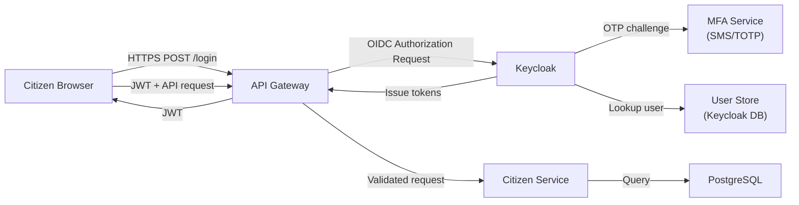

**STRIDE Threat Analysis:**

| #   | Component       | Threat Category            | Threat Description                                                                          | Risk     | Mitigation                                                                           | Residual Risk |
| --- | --------------- | -------------------------- | ------------------------------------------------------------------------------------------- | -------- | ------------------------------------------------------------------------------------ | ------------- |
| T1  | Browser→Gateway | S - Spoofing               | Attacker intercepts auth code and exchanges it for tokens (authorization code interception) | High     | PKCE (S256) prevents code interception attack; code is bound to verifier             | Low           |
| T2  | Browser→Gateway | T - Tampering              | Man-in-the-middle modifies the request body (e.g., changes citizenId in the request)        | High     | HTTPS with HSTS; certificate pinning in mobile app                                   | Low           |
| T3  | Keycloak        | S - Spoofing               | Phishing site mimics Keycloak login page; citizen enters credentials                        | High     | FIDO2/WebAuthn: credentials are origin-bound; won't work on phishing site            | Low           |
| T4  | MFA Service     | D - Denial of Service      | Attacker floods MFA SMS endpoint with OTP requests; exhausts SMS credits                    | Medium   | Rate limiting: 5 OTP requests per phone per hour; CAPTCHA after 3 failures           | Low           |
| T5  | Keycloak        | I - Information Disclosure | Token endpoint error messages reveal whether a username exists                              | Medium   | Generic error messages ("Invalid credentials") regardless of failure reason          | Low           |
| T6  | API Gateway     | E - Elevation of Privilege | JWT with tampered 'roles' claim used to gain officer privileges                             | Critical | JWT signature validation (RS256); Keycloak signs tokens; tampering detectable        | Low           |
| T7  | API Gateway     | R - Repudiation            | Citizen denies submitting a tender; no proof of action                                      | Medium   | Immutable audit log with JWT subject, timestamp, request hash; Kafka+Cassandra       | Low           |
| T8  | Citizen Service | I - Information Disclosure | SQL injection returns other citizens' data                                                  | High     | Parameterized queries (Spring Data JPA); input validation; DB user has no DELETE     | Low           |
| T9  | PostgreSQL      | D - Denial of Service      | Connection pool exhaustion from slow queries blocks all citizen requests                    | Medium   | Connection pool limits (HikariCP max=50); query timeout (5s max); circuit breaker    | Low           |
| T10 | All Services    | T - Tampering              | Attacker modifies secrets in environment variables on a compromised pod                     | High     | Azure Key Vault (secrets not in env vars); Pod Security Policy; immutable containers | Low           |

### A.3 — Security Gates in CI/CD

A **security gate** is an automated check in the CI/CD pipeline that blocks the pipeline if a security threshold is not met. Security gates implement **shift-left security** — moving security validation earlier in the development lifecycle where defects are cheaper to fix.

**Security Gate Architecture:**

```mermaid
graph LR
    subgraph Pipeline["CI/CD Pipeline (GitHub Actions / GitLab CI)"]
        Commit["Code Commit"] --> SAST
        
        subgraph Gate1["Gate 1: SAST\n(Static Application Security Testing)"]
            SAST["SonarQube\nCode Analysis\nOWASP Rules"]
            SAST -->|"Critical vuln found"| Block1["PIPELINE BLOCKED\nPR cannot merge"]
            SAST -->|"Clean"| SCA
        end

        subgraph Gate2["Gate 2: SCA\n(Software Composition Analysis)"]
            SCA["OWASP Dependency Check\nSnyk\nCVE Database Scan"]
            SCA -->|"CVSS > 7.0 dependency"| Block2["PIPELINE BLOCKED\nUpdate dependency first"]
            SCA -->|"Clean"| SecretScan
        end

        subgraph Gate3["Gate 3: Secret Scanning"]
            SecretScan["GitLeaks\nTruffleHog\nScan for:\n- API Keys\n- Passwords\n- Certs in code"]
            SecretScan -->|"Secret detected"| Block3["PIPELINE BLOCKED\nRotate secret immediately"]
            SecretScan -->|"Clean"| Build
        end

        subgraph Gate4["Gate 4: Container Security"]
            Build["Docker Build"] --> ImageScan
            ImageScan["Trivy\nContainer Image Scan\nBase image CVEs\nPackage vulnerabilities"]
            ImageScan -->|"Critical CVE in image"| Block4["PIPELINE BLOCKED\nUpdate base image"]
            ImageScan -->|"Clean"| Deploy
        end

        subgraph Gate5["Gate 5: DAST\n(Dynamic Application Security Testing)"]
            Deploy["Deploy to Staging"] --> DAST
            DAST["OWASP ZAP\nActive Scan\nRunning application"]
            DAST -->|"OWASP Top 10 vuln found"| Block5["PIPELINE BLOCKED\nFix before production"]
            DAST -->|"Clean"| IaCScan
        end

        subgraph Gate6["Gate 6: IaC Security"]
            IaCScan["Checkov\nTFSec\nTerraform Security Scan\nMisconfiguration detection"]
            IaCScan -->|"S3 public, no encryption"| Block6["PIPELINE BLOCKED\nFix IaC first"]
            IaCScan -->|"Clean"| Prod["Deploy to Production"]
        end
    end
```

**Security Gate Policy as Code (GitHub Actions):**

```yaml
# .github/workflows/security-gates.yml
# Complete security gate pipeline for NationalServ.
# Every pull request to main must pass ALL security gates.
# WHY GitHub Actions: integrates with existing git workflow;
# security is enforced as part of the development process, not a separate step.

name: NationalServ Security Gates

on:
  pull_request:
    branches: [ main, release/* ]
  push:
    branches: [ main ]

# Permissions: minimal required for security scanning
permissions:
  contents: read
  security-events: write  # Required to upload SARIF results to GitHub Security tab
  pull-requests: write    # Required to post security comments on PRs

jobs:

  # ─────────────────────────────────────────────────────────
  # GATE 1: Secret Scanning (run first - fastest; blocks everything if failed)
  # ─────────────────────────────────────────────────────────
  secret-scanning:
    name: "Gate 1: Secret Scanning"
    runs-on: ubuntu-22.04
    steps:
      - name: Checkout code
        uses: actions/checkout@v4
        with:
          fetch-depth: 0  # Full history for secret scanning across all commits

      - name: Run GitLeaks
        uses: gitleaks/gitleaks-action@v2
        env:
          GITHUB_TOKEN: ${{ secrets.GITHUB_TOKEN }}
        with:
          # Custom config for government-specific secret patterns
          config-path: .gitleaks.toml

      # WHY fail-fast on secrets: a leaked secret needs immediate rotation.
      # Blocking the pipeline prevents the code from reaching any environment.

  # ─────────────────────────────────────────────────────────
  # GATE 2: SAST - Static Analysis
  # ─────────────────────────────────────────────────────────
  sast-analysis:
    name: "Gate 2: SAST Analysis"
    runs-on: ubuntu-22.04
    needs: secret-scanning  # Only run if secrets gate passes
    steps:
      - name: Checkout code
        uses: actions/checkout@v4

      - name: Set up Java 17
        uses: actions/setup-java@v4
        with:
          java-version: '17'
          distribution: 'temurin'

      - name: Build with Maven (skip tests for SAST phase)
        run: mvn -B compile --no-transfer-progress

      - name: Run SonarQube Analysis
        uses: SonarSource/sonarqube-scan-action@master
        env:
          SONAR_TOKEN: ${{ secrets.SONAR_TOKEN }}
          SONAR_HOST_URL: ${{ secrets.SONAR_HOST_URL }}
        with:
          args: >
            -Dsonar.projectKey=nationalserv-citizen-service
            -Dsonar.java.source=17
            -Dsonar.qualitygate.wait=true
            -Dsonar.security.hotspots.inheritFromParent=false

      # Quality Gate configuration in SonarQube server:
      # - Zero blocker issues
      # - Zero critical security hotspots unreviewed
      # - Security rating: A (no vulnerabilities)
      # - Coverage: >= 80% (enforced separately)

  # ─────────────────────────────────────────────────────────
  # GATE 3: SCA - Dependency Vulnerability Scanning
  # ─────────────────────────────────────────────────────────
  sca-scanning:
    name: "Gate 3: Dependency Vulnerability Scan"
    runs-on: ubuntu-22.04
    needs: secret-scanning
    steps:
      - name: Checkout code
        uses: actions/checkout@v4

      - name: Set up Java 17
        uses: actions/setup-java@v4
        with:
          java-version: '17'
          distribution: 'temurin'

      - name: Run OWASP Dependency Check
        run: |
          mvn -B org.owasp:dependency-check-maven:check \
            -DfailBuildOnCVSS=7 \
            -DsuppressionsFile=.owasp-suppressions.xml \
            --no-transfer-progress
        # -DfailBuildOnCVSS=7: Block pipeline if any dependency has CVSS score >= 7.0
        # WHY 7.0 threshold: CVSS 7-8.9 = High; 9-10 = Critical. Both block the pipeline.
        # .owasp-suppressions.xml: Documented false positives with approval trail

      - name: Upload OWASP Report
        uses: actions/upload-artifact@v4
        if: always()  # Upload even if the gate fails (for review)
        with:
          name: owasp-dependency-check-report
          path: target/dependency-check-report.html

  # ─────────────────────────────────────────────────────────
  # GATE 4: Container Image Security Scanning
  # ─────────────────────────────────────────────────────────
  container-security:
    name: "Gate 4: Container Image Scan"
    runs-on: ubuntu-22.04
    needs: [sast-analysis, sca-scanning]
    steps:
      - name: Checkout code
        uses: actions/checkout@v4

      - name: Set up Java 17
        uses: actions/setup-java@v4
        with:
          java-version: '17'
          distribution: 'temurin'

      - name: Build application JAR
        run: mvn -B package -DskipTests --no-transfer-progress

      - name: Build Docker image
        run: |
          docker build \
            --build-arg BUILD_DATE=$(date -u +"%Y-%m-%dT%H:%M:%SZ") \
            --build-arg VCS_REF=${{ github.sha }} \
            -t nationalserv/citizen-service:${{ github.sha }} .

      - name: Run Trivy container scan
        uses: aquasecurity/trivy-action@master
        with:
          image-ref: 'nationalserv/citizen-service:${{ github.sha }}'
          format: 'sarif'
          output: 'trivy-results.sarif'
          severity: 'CRITICAL,HIGH'
          exit-code: '1'  # Fail pipeline on CRITICAL or HIGH CVEs
          ignore-unfixed: true  # Only flag CVEs with available fixes

      - name: Upload Trivy results to GitHub Security
        uses: github/codeql-action/upload-sarif@v3
        if: always()
        with:
          sarif_file: 'trivy-results.sarif'

  # ─────────────────────────────────────────────────────────
  # GATE 5: IaC Security Scanning
  # ─────────────────────────────────────────────────────────
  iac-security:
    name: "Gate 5: IaC Security Scan"
    runs-on: ubuntu-22.04
    needs: secret-scanning
    steps:
      - name: Checkout code
        uses: actions/checkout@v4

      - name: Run Checkov on Terraform
        uses: bridgecrewio/checkov-action@master
        with:
          directory: infrastructure/
          framework: terraform
          output_format: sarif
          output_file_path: checkov-results.sarif
          # Government-specific checks
          check: |
            CKV_AZURE_1,CKV_AZURE_2,CKV_AZURE_3
          soft_fail: false  # Hard fail on policy violations
          # Custom policies for government compliance
          external-checks-dir: .checkov-custom-policies/

      - name: Upload Checkov results
        uses: github/codeql-action/upload-sarif@v3
        if: always()
        with:
          sarif_file: checkov-results.sarif

  # ─────────────────────────────────────────────────────────
  # FINAL: Security Summary Report
  # ─────────────────────────────────────────────────────────
  security-summary:
    name: "Security Gate Summary"
    runs-on: ubuntu-22.04
    needs: [secret-scanning, sast-analysis, sca-scanning, container-security, iac-security]
    if: always()
    steps:
      - name: Security Gate Results Summary
        run: |
          echo "## Security Gate Summary" >> $GITHUB_STEP_SUMMARY
          echo "| Gate | Status |" >> $GITHUB_STEP_SUMMARY
          echo "|------|--------|" >> $GITHUB_STEP_SUMMARY
          echo "| Secret Scanning | ${{ needs.secret-scanning.result }} |" >> $GITHUB_STEP_SUMMARY
          echo "| SAST Analysis | ${{ needs.sast-analysis.result }} |" >> $GITHUB_STEP_SUMMARY
          echo "| SCA Scanning | ${{ needs.sca-scanning.result }} |" >> $GITHUB_STEP_SUMMARY
          echo "| Container Security | ${{ needs.container-security.result }} |" >> $GITHUB_STEP_SUMMARY
          echo "| IaC Security | ${{ needs.iac-security.result }} |" >> $GITHUB_STEP_SUMMARY
```

---

## Section D: Real-World Case Study

### D.1 — Case Study: API Security Failure in a Government Benefits Portal (Illustrative)

**Context:** A fictional US state government benefits portal ("StateBenefitsGov") implemented OAuth2 but made several critical security implementation mistakes. The portal handled welfare payment eligibility for 800,000 citizens.

**Security Failures Identified (Illustrative):**

```mermaid
graph TB
    subgraph Failures["Security Implementation Failures"]
        F1["Failure 1: Implicit Flow Used\nAccess token in URL fragment\nLogged by nginx access logs\nAll tokens exposed in log files"]
        F2["Failure 2: Long-lived Tokens\nAccess token: 24-hour lifetime\nCompromised token valid for 24h\nNo revocation mechanism"]
        F3["Failure 3: No Audience Validation\nTokens issued for Portal A\naccepted by API B\nToken confusion attack possible"]
        F4["Failure 4: RBAC Only, No Ownership Check\nAny citizen could read\nany other citizen's benefits\nby changing citizenId in URL\nIDAT: Insecure Direct Object Reference"]
        F5["Failure 5: Client Secret in JavaScript\nSPA had confidential client config\nClient secret visible in browser DevTools\nAny user could impersonate the app"]
        F6["Failure 6: No Rate Limiting on Token Endpoint\nBrute force of refresh tokens\n1M requests in 4 hours\nServers crashed"]
    end
```

**Impact (Illustrative):**

| Failure                            | Citizens Affected                                   | Financial Impact                          |
| ---------------------------------- | --------------------------------------------------- | ----------------------------------------- |
| IDOR: Benefits data exposed        | ~12,000 citizens' data accessible                   | USD 2.1M breach notification cost         |
| Token logging (Failure 1)          | 800K tokens in log files                            | Full portal credential reset required     |
| DoS via token endpoint (Failure 6) | 800K citizens unable to access benefits for 6 hours | USD 450K SLA penalty to state legislature |

**Remediation Mapped to Security Principles:**

| Failure                | Remediation                                      | Principle                                   |
| ---------------------- | ------------------------------------------------ | ------------------------------------------- |
| Implicit Flow          | Authorization Code + PKCE                        | OAuth2 BCP (Best Current Practice) RFC 9700 |
| 24-hour tokens         | 15-minute access tokens + 8-hour refresh         | Zero Trust: short-lived credentials         |
| No audience validation | Validate `aud` claim in every service            | JWT validation best practices               |
| IDOR                   | @PreAuthorize with subject == pathVariable       | OWASP A01: Broken Access Control            |
| Secret in SPA          | Public client (no secret); PKCE only             | OAuth2: public vs. confidential clients     |
| No rate limiting       | 5 token requests/minute/IP; Redis-backed counter | OWASP A04: Insecure Design                  |

---

## Section E: Engagement and Assessment

### E.1 — Food for Thought

> **Provocation:** India's DPDP Act 2023 requires that a data fiduciary (your government portal) must be able to fulfill a citizen's "Right to Erasure" — delete all personal data upon verified request — within a specified timeframe.
>
> Your NationalServ platform stores citizen data in:
> - PostgreSQL (primary PII)
> - MongoDB (document history)
> - Elasticsearch (search index — tokenized but cross-referenceable)
> - Cassandra (audit logs — immutable by design for compliance)
> - Redis (session cache — TTL-managed)
> - Kafka (event streams — retained 7 days)
> - Azure Blob Storage (uploaded documents)
> - SIEM (log aggregation — retained 2 years for security)
>
> **Questions to wrestle with:**
> - Which of these stores can be fully erased? Which cannot (legal hold)?
> - Cassandra audit logs exist specifically BECAUSE of regulatory requirements (IT Act) — but DPDP says erase. What do you do?
> - Is "cryptographic erasure" (deleting the encryption key so the data is permanently unreadable) acceptable as "erasure" under DPDP?
> - How do you design the erasure orchestration workflow across 8 different data stores without introducing race conditions or partial erasure states?
>
> **ChatGPT/Copilot Prompt:** "Design a 'Right to Erasure' workflow for a government platform with 8 data stores including immutable audit logs. Address: legal hold conflicts, cryptographic erasure as a DPDP-compliant alternative, orchestration patterns, and verification of completeness. Reference GDPR Article 17 as an analogous regulation."

### E.2 — Questionnaire: Topics 4 and 5

**Conceptual Questions**

1. **Explain the difference between OAuth2 and OpenID Connect. Why does a government citizen portal need both?**

   *Answer:* OAuth2 (RFC 6749) is an authorization framework — it enables a client to obtain limited access to a resource on behalf of a resource owner, expressed as scopes (e.g., `profile:read`, `tender:write`). It does not tell you WHO the user is; it tells you WHAT they are authorized to do. OpenID Connect (OIDC) is an authentication layer built on top of OAuth2 — it adds the concept of identity via the ID token (a JWT containing claims about the authenticated user: sub, name, email, phone_number_verified). A government citizen portal needs both because: (1) It must verify the citizen's identity before granting any access (OIDC: "You are citizen 12345678, Aadhaar-verified, jurisdiction India") and (2) It must grant only the specific permissions the citizen needs for each operation (OAuth2: "You are authorized to read your own profile and read public tenders"). Without OIDC you have authorization without identity. Without OAuth2 you have identity without fine-grained access control.

2. **What is mTLS and how does it provide stronger security than one-way TLS for microservice-to-microservice communication? What is the primary operational challenge of mTLS at scale?**

   *Answer:* One-way TLS: the client verifies the server's certificate; the server accepts any connecting client. The server knows it is "the real server" but cannot verify the client's identity. mTLS (Mutual TLS): both parties present X.509 certificates; both verify each other's identity cryptographically before establishing the connection. The server can enforce that only known, authorized services (with valid certificates) can connect. This prevents: rogue pods from impersonating legitimate services; lateral movement by attackers who compromise one pod; man-in-the-middle attacks between services. Primary operational challenge at scale: certificate lifecycle management. Each service needs a certificate, each certificate expires (typically 1-90 days), and each must be rotated without service downtime. With 50 microservices × 10 replicas = 500 certificate holders, manual rotation is impossible. The solution is a workload identity system (SPIFFE/SPIRE) that automates certificate issuance and rotation without service restarts.

3. **Describe the STRIDE threat modeling methodology. For the 'Elevation of Privilege' threat category, give two distinct attack scenarios specific to a government welfare payment system.**

   *Answer:* STRIDE classifies threats into six categories: Spoofing (impersonating identity), Tampering (modifying data), Repudiation (denying actions), Information Disclosure (exposing confidential data), Denial of Service (making system unavailable), and Elevation of Privilege (gaining unauthorized permissions). Two EoP scenarios for a welfare payment system: (1) Parameter tampering in API call: A citizen receiving a Standard welfare payment (INR 2,000/month) discovers that the API call `POST /payments/request` has a `paymentType` field. By changing the value from "STANDARD" to "PREMIUM" (which they discovered by examining the API with browser DevTools), they receive a INR 5,000/month payment. Mitigation: payment type must be determined server-side from the citizen's eligibility record, never accepted from client input. (2) JWT role claim forgery: If the system uses symmetric JWT signing (HS256 with a weak secret), an attacker can brute-force the signing key offline using known JWT samples, then forge a new JWT with `"roles": ["ROLE_PAYMENT_ADMIN"]` and approve their own escalated payment tier. Mitigation: Use asymmetric JWT signing (RS256); private key never leaves Keycloak; public key validation at every service.

**Application Questions**

4. **Design the Keycloak client configuration for a third-party government-approved tax filing application (not the official portal) that needs to access a citizen's tax records on their behalf. Specify: client type, grant type, scopes, token lifetimes, and consent requirements.**

   *Answer:* Client type: Confidential (the third-party app is server-side, can keep a secret). Grant type: Authorization Code + PKCE (citizen must explicitly authorize the third-party app; PKCE protects the code exchange). Scopes: `tax:read` only (principle of least privilege; the app reads but does not modify tax records); explicitly NOT granted `profile:write`, `profile:pii:read`, or any payment scope. Token lifetime: Access token 5 minutes (shorter than government's own portal because third-party has higher risk); Refresh token 1 hour (citizen must re-authorize after 1 hour, limiting exposure if refresh token is compromised). Consent: Required = true (citizen must explicitly see and approve the consent screen listing exactly what the app will access; this is mandatory for third-party access). Redirect URIs: Only the exact registered callback URL (no wildcards). Additional: The third-party app must be registered and approved by the government; a separate API approval process (API gateway key) governs which endpoints they can call regardless of OAuth2 scope.

5. **A government API receives 10,000 requests per second during peak filing season. Design a multi-layer rate limiting strategy that protects the system while ensuring legitimate citizens are not unfairly blocked.**

   *Answer:* Four-layer rate limiting strategy: (1) Layer 1 — Azure Front Door WAF: Global rate limiting at 50,000 requests/second per source IP block (/24 subnet). Purpose: blocks volumetric DDoS. Threshold is set high enough that no legitimate user hits it. (2) Layer 2 — API Gateway: Per-client-ID rate limit of 60 requests/minute (1/second sustained) for citizen clients. Implemented with Redis sliding window counter. Citizens filing taxes typically make 5-10 API calls total; 60/minute is 6x headroom. Burst allowance: 20 requests in any 10-second window (token bucket). (3) Layer 3 — API Gateway: Per-endpoint rate limit for expensive operations. `/api/v1/tax/calculate` (CPU-intensive): 5 requests/minute per citizen. `/api/v1/tax/submit`: 2 requests/hour per citizen (a citizen should not submit more than twice). (4) Layer 4 — Application: Idempotency keys on submit operations prevent duplicate processing if the citizen retries. Fair treatment: Citizens on slow connections (rural India) get a retry-after header with the exact time they can retry. The rate limit headers (`X-RateLimit-Remaining`, `X-RateLimit-Reset`) allow the portal UI to show a countdown rather than a generic error.

6. **What is the difference between SAST, DAST, and SCA in a security gate pipeline? Give a specific vulnerability that each would catch in a Spring Boot government application that DAST alone would miss.**

   *Answer:* SAST (Static Application Security Testing): Analyzes source code without execution. Finds vulnerabilities in the code logic itself. Example caught by SAST but not DAST: A `String.format()` SQL construction like `"SELECT * FROM citizens WHERE name = '" + userInput + "'"` in a service class that is never directly reachable via an HTTP endpoint (it is called internally by a scheduled batch job). DAST cannot reach batch job code; SAST finds it by reading the source. SCA (Software Composition Analysis): Scans third-party dependencies (pom.xml, package.json) against CVE databases. Finds vulnerabilities in libraries, not your code. Example caught by SCA but not DAST: A transitive dependency `spring-security-core:5.7.3` has CVE-2022-31692 (authorization bypass). DAST tests running endpoints; it cannot detect that an unpatched library is present. You must update the dependency. DAST (Dynamic Application Security Testing): Tests the running application by sending malicious HTTP requests. Finds runtime vulnerabilities. Example caught by DAST but not SAST or SCA: A misconfigured CORS policy that allows `Access-Control-Allow-Origin: *` on an authenticated endpoint. This is a configuration issue in `application.yml`, not a code vulnerability and not a dependency issue. DAST sends a cross-origin request and observes the permissive header in the response.

**Analysis Questions**

7. **Analyze the security trade-off between short-lived JWT access tokens (5-minute expiry) and user experience in a citizen-facing government portal. How do you implement token refresh transparently so citizens do not experience repeated login prompts?**

   *Answer:* The trade-off: 5-minute access tokens minimize the window of token misuse (stolen token expires quickly) but require frequent token refresh. Without transparent refresh, citizens would need to log in every 5 minutes — catastrophic UX. Solution — Silent Token Refresh: (1) The citizen portal (SPA) tracks the access token's `exp` claim. At T-60 seconds (4 minutes after issue), the portal proactively calls Keycloak's token endpoint with the refresh token to obtain a new access token. This happens in the background, invisible to the citizen. (2) The refresh is done via a hidden iframe or a background fetch from the SPA. The new access token is stored in memory (not localStorage, which is XSS-vulnerable). (3) If the citizen's browser tab is inactive for longer than the refresh token lifetime (8 hours for a government shift), the next request triggers a re-login. The portal saves the citizen's current page state to sessionStorage so after login they return to where they were. (4) For mobile apps: the OAuth2 token endpoint is called directly (no iframe needed); the refresh token is stored in the device's secure keychain (not app storage). Trade-off accepted: 5-minute token = maximum 5 minutes of misuse window. Complexity cost: ~50 lines of token management code in the portal. This is the correct trade-off for a system handling welfare payments and citizen PII.

8. **A junior engineer proposes storing all microservice secrets as Kubernetes Secrets (base64-encoded). Evaluate this proposal against using Azure Key Vault with Managed Identity. Address: security, auditability, rotation, and operational complexity.**

   *Answer:*

   | Dimension              | Kubernetes Secrets                                                                                                                                                                                                          | Azure Key Vault + Managed Identity                                                                                                                 |
   | ---------------------- | --------------------------------------------------------------------------------------------------------------------------------------------------------------------------------------------------------------------------- | -------------------------------------------------------------------------------------------------------------------------------------------------- |
   | Security               | Base64 is encoding, NOT encryption. By default, K8s Secrets are stored unencrypted in etcd. Anyone with `kubectl get secret` permission reads the value in plaintext. Requires etcd encryption configuration (not default). | Secrets encrypted at rest with HSM-backed keys. Accessible only via Azure RBAC. Network access restricted to private endpoint.                     |
   | Auditability           | K8s audit log shows secret access but requires careful configuration. Not integrated with SIEM by default.                                                                                                                  | Every secret access logged to Azure Monitor with: timestamp, identity (Managed Identity), secret name, version. SIEM integration native.           |
   | Rotation               | Manual process: create new secret, update K8s Secret object, restart pods to pick up new value. Downtime risk.                                                                                                              | Automated rotation via Azure Function trigger on `SecretNearExpiry` event. App cache TTL ensures pickup within 5 minutes. No pod restart required. |
   | Operational Complexity | Low initial setup; high long-term: managing etcd encryption, RBAC for secrets, ensuring no secrets in logs                                                                                                                  | Moderate initial setup (Managed Identity, Key Vault RBAC); low long-term: rotation is automated; no credentials to manage                          |
   | Government Compliance  | Requires additional hardening to meet DPDP/FedRAMP requirements (etcd encryption, audit configuration)                                                                                                                      | Meets DPDP, FedRAMP, IM8 requirements out of the box with premium tier (HSM)                                                                       |
   | Verdict                | Acceptable for non-sensitive configuration (feature flags, URLs). Never acceptable for passwords, private keys, OAuth secrets in government systems.                                                                        | Required for any secret that grants access to citizen PII or financial systems.                                                                    |

**Scenario-Based Questions**

9. **You are conducting a threat modeling session for Singapore's Singpass mobile app (hypothetical extension adding a new "Digital Will" feature). A citizen can nominate beneficiaries and store their legal will digitally, accessible by designated government officers after death verification. Apply STRIDE to identify the top 3 threats and their mitigations.**

   *Answer:* Top 3 STRIDE threats: (1) S — Spoofing: An attacker impersonates the deceased citizen using their compromised Singpass credentials to alter the will before death verification is complete. Mitigation: Will becomes immutable (read-only, cryptographically sealed with citizen's private key) the moment it is submitted. Any modification attempt creates a new draft requiring fresh biometric authentication. Deceased status from Registry of Births and Deaths triggers automatic lock within 24 hours. (2) T — Tampering: A malicious actor (including a corrupt government officer) alters the beneficiary list in the database after the citizen's death. Mitigation: The will is stored as a hash-chained document (similar to a blockchain entry) — any modification changes the hash, detectable by any verifier. The original document is also stored in an immutable write-once storage (Azure Blob Storage with WORM policy). Two-officer approval required for any posthumous access, creating an audit trail. (3) E — Elevation of Privilege: A government officer who handles "housing grants" accesses the Digital Will feature, which should only be accessible to "estate administration" officers. Mitigation: The Digital Will API enforces `ROLE_ESTATE_OFFICER` which is a separate, specifically granted role not included in the composite role hierarchy of other officer types. OPA policy additionally checks that the specific officer's case assignment includes the deceased citizen's case number — preventing bulk unauthorized access.

10. **Design a security incident response procedure for the following scenario: At 2:17 AM, the NationalServ SIEM raises an alert that a single citizen JWT token has been used to make 847 API calls in 60 seconds from 12 different IP addresses simultaneously. Walk through the automated response, the manual escalation steps, and the post-incident architecture changes.**

    *Answer:* Automated Response (T+0 to T+2 minutes): (1) SIEM correlation rule triggers: "Single JWT from > 3 concurrent IPs within 60 seconds." (2) Azure Logic App / AWS Lambda triggered automatically: calls Keycloak Admin REST API to revoke the specific JWT's session (by `jti` claim) and invalidate all refresh tokens for that citizen's session. Keycloak's token introspection will now return `active: false`. (3) API Gateway Redis rate limiter: adds the citizen's UUID to a "temporary block" list for 15 minutes (blocks new token requests, pending investigation). (4) Alert dispatched to on-call engineer via PagerDuty with: JWT subject, 12 source IPs, endpoint list called, timeline. Manual Escalation (T+2 to T+30 minutes): (1) On-call engineer triages: are the 12 IPs known VPN exit nodes (possible legitimate VPN split)? Or are they distributed globally (token theft)? (2) If token theft confirmed: preserve all logs (tamper-evident), notify citizen via registered mobile/email, trigger DPDP mandatory breach assessment (72-hour notification requirement if PII accessed). (3) CISO notified; legal team engaged if > 100 citizen records were accessed. (4) Forensic snapshot of audit logs (immutable Cassandra) preserved with timestamp integrity. Post-Incident Architecture Changes: (1) Implement token binding: bind JWT to the TLS session's client certificate fingerprint. Token stolen from one TLS session is unusable in another — eliminates the attack entirely. (2) Reduce access token lifetime from 15 to 5 minutes for endpoints accessing PII. (3) Add impossible travel detection: if two requests with the same JWT come from geographically distant IPs within a physically impossible timeframe (Delhi and Singapore within 10 seconds), trigger automatic session termination. (4) Add JWT jitter: include a cryptographically random nonce in each JWT bound to the citizen's device fingerprint — limits reuse across devices even within the expiry window.

---

# DAY 5 — THEORY DOCUMENT COMPLETE

## Day 5 Summary

| Topic                                                        | Duration | Status   |
| ------------------------------------------------------------ | -------- | -------- |
| Search Architecture & Data Consistency Models                | 1.0 hr   | Complete |
| Case Study: Scaling a Citizen Data Platform                  | 1.0 hr   | Complete |
| Zero Trust Architecture (All 4 Layers)                       | 1.5 hrs  | Complete |
| API Gateway Security, Keycloak/RBAC, mTLS, Secret Management | 1.0 hr   | Complete |
| Rapid Threat Modeling & Security Gate Design                 | 0.5 hr   | Complete |

---

**Day 5 Theory Document is complete.**
