# STEP 1: COMPREHENSION SUMMARY — DAY 6

---

## Day 6 Comprehension Summary

### Day Number and Title
**Day 6 — Emerging Tech Masterclass | Advanced Microservices & Mobile-First Design (Session 1)**

---

### All Modules, Topics, Sub-Topics, and Duration Allocation

| #   | Module                                      | Topic                                                  | Sub-Topic                                                               | Duration |
| --- | ------------------------------------------- | ------------------------------------------------------ | ----------------------------------------------------------------------- | -------- |
| 1   | Architectural Foundations & Design Thinking | Emerging Tech Masterclass                              | IoT, Blockchain, Edge Computing Integration Patterns                    | 1.5 hrs  |
| 2   | Architectural Foundations & Design Thinking | Emerging Tech Masterclass                              | Emerging Tech Case Study / Fireside Chat                                | 0.5 hr   |
| 3   | Microservices, AI & Modernization           | Advanced Microservices & Mobile-First Design Session 1 | Mobile-First Architecture: Offline Sync, Edge Caching, API Optimisation | 1.0 hr   |
| 4   | Microservices, AI & Modernization           | Advanced Microservices & Mobile-First Design Session 1 | Saga Pattern, Distributed Transactions, Idempotency                     | 1.0 hr   |
| 5   | Microservices, AI & Modernization           | Advanced Microservices & Mobile-First Design Session 1 | High Concurrency: Rate Limiting, Bulkheads, Circuit Breakers            | 1.0 hr   |

**Total Structured Content: 5.0 hours** (with transitions, discussions, Q&A: 6–7 hours)

---

### Key Focus Areas Per Sub-Topic

**IoT, Blockchain, Edge Computing Integration Patterns (1.5 hrs)**
- IoT architecture patterns: MQTT protocol, device shadows, telemetry ingestion pipelines
- IoT security: device provisioning, certificate-based identity, firmware OTA updates
- Blockchain for government: permissioned vs. permissionless, Hyperledger Fabric architecture
- Smart contracts: use cases in land registry, supply chain, subsidy distribution
- Edge computing: latency drivers, fog computing, CDN-vs-edge decision framework
- Integration patterns: IoT → Edge → Cloud continuum
- Realistic feasibility assessment: when NOT to use blockchain/IoT/edge

**Emerging Tech Case Study / Fireside Chat (0.5 hr)**
- Agricultural subsidy distribution: IoT + blockchain combined scenario
- Q&A format: real government implementations, pitfalls, feasibility
- One-page technology assessment framework

**Mobile-First Architecture: Offline Sync, Edge Caching, API Optimisation (1.0 hr)**
- Progressive Web Apps (PWA) and service workers
- Offline-first data strategies: local storage, IndexedDB, SQLite on device
- Sync strategies: last-write-wins, conflict detection, operational transformation
- Edge caching: CDN strategies, cache invalidation, stale-while-revalidate
- API payload optimisation: GraphQL vs. REST vs. gRPC for mobile, field projection, pagination
- Intermittent connectivity patterns for government field officers (India rural context)

**Saga Pattern, Distributed Transactions, Idempotency (1.0 hr)**
- Why distributed transactions (2PC) fail at microservice scale
- Choreography-based saga: event-driven, decentralised coordination
- Orchestration-based saga: central orchestrator, explicit workflow
- Compensating transactions: design patterns and failure modes
- Idempotency keys: design, storage, TTL, duplicate detection
- Exactly-once semantics vs. at-least-once with idempotent consumers

**High Concurrency: Rate Limiting, Bulkheads, Circuit Breakers (1.0 hr)**
- Rate limiting algorithms: token bucket, leaky bucket, sliding window, fixed window
- Bulkhead pattern: thread pool isolation, semaphore isolation
- Circuit breaker state machine: closed, open, half-open
- Resilience4j implementation: annotations vs. programmatic
- Combining patterns: rate limiter → bulkhead → circuit breaker → retry → timeout
- Tuning resilience parameters for government high-traffic scenarios

---

### Lab Project Theme and Narrative

**"AgroGov Field Intelligence Platform"** — A fictional Indian government agricultural field inspection and subsidy management system. The lab builds:

1. A Spring Boot microservice simulating IoT sensor data ingestion (MQTT-style REST bridge)
2. A mobile-optimised offline-capable API with field projection and compression
3. A Saga orchestration service for multi-step subsidy approval workflow
4. Resilience4j-hardened service with circuit breaker, bulkhead, and rate limiter
5. Docker Compose environment running all services with failure simulation

The narrative: Government field inspectors in rural Maharashtra use an Android app (simulated by Postman) on intermittent 2G/4G connectivity to capture crop damage assessments. The backend must handle offline sync, process subsidy approvals as distributed sagas, and remain resilient during peak harvest season load.

---

### Dependencies on Previous Days

| Day   | Dependency                                                                                                          |
| ----- | ------------------------------------------------------------------------------------------------------------------- |
| Day 3 | DDD bounded contexts inform service decomposition for AgroGov                                                       |
| Day 4 | Event-driven patterns (Kafka) — Saga uses Kafka for choreography                                                    |
| Day 5 | Zero Trust security concepts apply to IoT device identity; API Gateway patterns apply to mobile-optimised endpoints |

---

### Tech Stack Components Used This Day

| Category      | Technology                                                              |
| ------------- | ----------------------------------------------------------------------- |
| Language      | Java 17 + Spring Boot 3.x (Spring Web, Spring Kafka, Resilience4j)      |
| Messaging     | Apache Kafka (Docker) — for Saga choreography                           |
| Resilience    | Resilience4j 2.x (Circuit Breaker, Bulkhead, Rate Limiter, Retry)       |
| Containers    | Docker Desktop + Docker Compose                                         |
| API Testing   | Postman (simulating mobile client + IoT device)                         |
| Diagrams      | Mermaid.js                                                              |
| AI Assistants | Microsoft Copilot / ChatGPT (blockchain feasibility assessment prompts) |
| IaC           | Terraform (Azure IoT Hub reference — conceptual)                        |
| Cloud         | Azure (Azure IoT Hub, Azure Digital Twins — conceptual reference)       |

---

> **Day 6 Comprehension Summary is complete.**
> Confirmed scope: 5 sub-topics across 2 modules, 5.0 hours of structured content.
> Proceeding to generate the **Day 6 Theory Document** in parts.
> Type **"confirmed"** to begin Part 1, or request any adjustments.

---

**User confirmed. Generating Day 6 Theory Document.**

---

# DAY 6 — THEORY DOCUMENT
## Senior Engineer to Solution Architect Program

---

# Table of Contents (Day 6 Theory Document)

- **Part 1** — IoT, Blockchain, and Edge Computing Integration Patterns
- **Part 2** — Emerging Tech Case Study / Fireside Chat + Mobile-First Architecture
- **Part 3** — Saga Pattern, Distributed Transactions, and Idempotency
- **Part 4** — High Concurrency: Rate Limiting, Bulkheads, and Circuit Breakers

---

# TOPIC 1: IoT, Blockchain, and Edge Computing Integration Patterns

## Learning Objectives

By the end of this topic, participants will be able to:

1. **Design** an end-to-end IoT architecture for a government field deployment, including device identity, telemetry ingestion, and edge processing
2. **Evaluate** the applicability of permissioned blockchain for government use cases such as land registry, supply chain, and subsidy distribution
3. **Distinguish** between edge computing, fog computing, and CDN-based caching and select the appropriate pattern based on latency and connectivity requirements
4. **Construct** an integration architecture connecting IoT devices, edge nodes, and cloud services using standard protocols (MQTT, AMQP, HTTPS)
5. **Critically assess** when emerging technologies add genuine value versus when they introduce unnecessary complexity and cost

---

## Section A: Concept Foundation

### A.1 — The Emerging Tech Trap: A Cautionary Opening

Before diving into IoT, blockchain, and edge computing, it is essential to establish the architect's first principle for emerging technology evaluation:

> **"Every technology solves a problem. Before adopting it, name the problem it solves for your specific system — not in general, but for your specific system — and name two simpler alternatives that were rejected and why."**

This is not cynicism. It is the discipline that separates architects from enthusiasts. Government systems that adopted blockchain for simple data sharing (when a shared PostgreSQL database with audit logging would have sufficed) have wasted hundreds of crores of public money globally. The architect's job is to match the right tool to the right problem — even when the "wrong" tool is fashionable.

**The Emerging Technology Evaluation Matrix (to be applied to every technology in this module):**

| Question                                                                        | If Answer is "No" → Reconsider                                                              |
| ------------------------------------------------------------------------------- | ------------------------------------------------------------------------------------------- |
| Does this solve a problem that existing technology cannot solve?                | A shared database with proper access control is often better than blockchain                |
| Can we quantify the benefit (latency reduction, cost savings, fraud reduction)? | If you cannot measure it, you cannot justify it to a ministry                               |
| Do we have the operational capability to run this technology?                   | An IoT fleet requires firmware update processes, device management, security patching       |
| Is the problem at the scale where this technology pays off?                     | Blockchain consensus overhead is only justified when distrust between parties is structural |
| What is the failure mode?                                                       | Edge devices fail; blockchains fork; IoT networks go dark                                   |

---

### A.2 — Internet of Things (IoT) Architecture

**Analogy:** Think of a large government agricultural insurance scheme. Traditionally, a government officer physically visits each farm, manually records crop area and condition in a paper form, and submits it to a district office. The process takes weeks, is prone to human error, and is vulnerable to fraud (inflated claims). An IoT-enabled system places soil moisture sensors, weather stations, and drone-captured imagery at the farm level. Data flows automatically, continuously, and verifiably — without a human intermediary at the collection stage.

**Definition:** The **Internet of Things (IoT)** is a network of physical devices — sensors, actuators, gateways, and edge computers — that collect, exchange, and act on data from the physical world, typically via internet connectivity and cloud integration.

#### A.2.1 — The IoT Architecture Layers

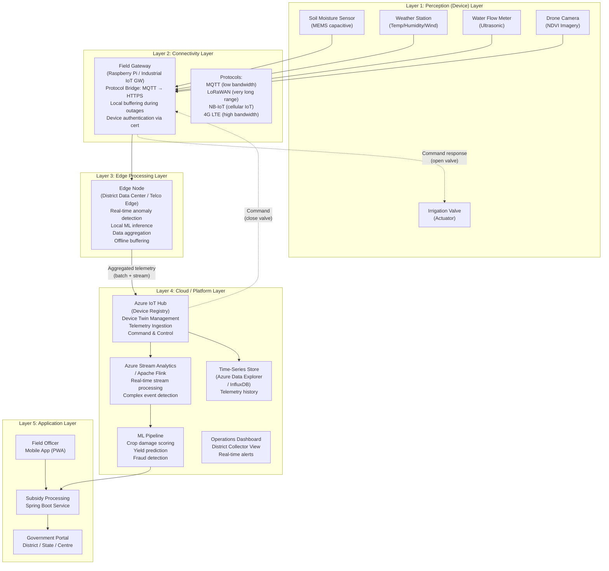
```mermaid
graph TB
    subgraph PerceptionLayer["Layer 1: Perception (Device) Layer"]
        Sensor1["Soil Moisture Sensor\n(MEMS capacitive)"]
        Sensor2["Weather Station\n(Temp/Humidity/Wind)"]
        Sensor3["Water Flow Meter\n(Ultrasonic)"]
        Camera["Drone Camera\n(NDVI Imagery)"]
        Actuator["Irrigation Valve\n(Actuator)"]
    end

    subgraph ConnectivityLayer["Layer 2: Connectivity Layer"]
        Gateway["Field Gateway\n(Raspberry Pi / Industrial IoT GW)\nProtocol Bridge: MQTT → HTTPS\nLocal buffering during outages\nDevice authentication via cert"]
        Protocols["Protocols:\nMQTT (low bandwidth)\nLoRaWAN (very long range)\nNB-IoT (cellular IoT)\n4G LTE (high bandwidth)"]
    end

    subgraph EdgeLayer["Layer 3: Edge Processing Layer"]
        EdgeNode["Edge Node\n(District Data Center / Telco Edge)\nReal-time anomaly detection\nLocal ML inference\nData aggregation\nOffline buffering"]
    end

    subgraph CloudLayer["Layer 4: Cloud / Platform Layer"]
        IoTHub["Azure IoT Hub\n(Device Registry)\nDevice Twin Management\nTelemetry Ingestion\nCommand & Control"]
        StreamProc["Azure Stream Analytics\n/ Apache Flink\nReal-time stream processing\nComplex event detection"]
        Storage["Time-Series Store\n(Azure Data Explorer\n/ InfluxDB)\nTelemetry history"]
        ML["ML Pipeline\nCrop damage scoring\nYield prediction\nFraud detection"]
        Dashboard["Operations Dashboard\nDistrict Collector View\nReal-time alerts"]
    end

    subgraph AppLayer["Layer 5: Application Layer"]
        SubsidyApp["Subsidy Processing\nSpring Boot Service"]
        MobileApp["Field Officer\nMobile App (PWA)"]
        GovPortal["Government Portal\nDistrict / State / Centre"]
    end

    Sensor1 --> Gateway
    Sensor2 --> Gateway
    Sensor3 --> Gateway
    Camera --> Gateway
    Gateway --> EdgeNode
    EdgeNode -->|"Aggregated telemetry\n(batch + stream)"| IoTHub
    IoTHub --> StreamProc
    IoTHub --> Storage
    StreamProc --> ML
    ML --> SubsidyApp
    SubsidyApp --> GovPortal
    MobileApp --> SubsidyApp
    Gateway -.->|"Command response\n(open valve)"| Actuator
    IoTHub -.->|"Command\n(close valve)"| Gateway
```

#### A.2.2 — MQTT: The Language of IoT

**MQTT (Message Queuing Telemetry Transport)** is a lightweight publish-subscribe messaging protocol designed for constrained devices and low-bandwidth, high-latency networks. It was originally designed by IBM for pipeline SCADA (Supervisory Control and Data Acquisition) systems in 1999 and became the de facto IoT protocol.

**Why MQTT over HTTP for IoT:**

| Dimension            | MQTT                                                  | HTTP                                                 |
| -------------------- | ----------------------------------------------------- | ---------------------------------------------------- |
| **Overhead**         | 2-byte minimum header                                 | 200-800 byte HTTP headers                            |
| **Connection model** | Persistent TCP connection; broker pushes messages     | Request-response; client polls                       |
| **Bandwidth**        | ~10x more efficient for small frequent messages       | Inefficient for telemetry (headers dominate payload) |
| **QoS levels**       | 0 (at most once), 1 (at least once), 2 (exactly once) | Only request-response semantics                      |
| **Offline handling** | Retained messages; persistent sessions                | Client must poll; misses messages when offline       |
| **Battery**          | Efficient: connection maintained; no poll overhead    | Drains battery with frequent polling                 |
| **Government fit**   | Field sensors, remote monitoring, irrigation control  | REST APIs for human-facing applications              |

**MQTT QoS Levels — Architect's Decision:**

```
QoS 0 — At Most Once (Fire and Forget)
  → Telemetry that is acceptable to lose (temperature readings every 5 seconds)
  → Fastest, no persistence, no acknowledgment
  → Use when: high-frequency, low-criticality data

QoS 1 — At Least Once
  → Message delivered at least once, may be duplicated
  → Consumer must be idempotent (handle duplicate sensor readings)
  → Use when: moderate-criticality (crop stress alerts)

QoS 2 — Exactly Once
  → Four-way handshake guarantees exactly-once delivery
  → Highest overhead; use sparingly
  → Use when: actuator commands (open/close valve — cannot execute twice)
```

#### A.2.3 — Device Shadow / Digital Twin

A **Device Shadow** (AWS terminology) or **Device Twin** (Azure IoT Hub terminology) is a persistent JSON document in the cloud that represents the last known state of a physical IoT device, regardless of whether the device is currently connected.

**Why Device Twins are Architecturally Critical:**

```
Problem without Device Twin:
  Cloud → Command: "Set irrigation valve to OPEN"
  Device is offline (no 4G coverage in remote farm)
  Command is lost
  When device reconnects: it has missed the command
  Result: farmer's crop dies because valve was never opened

Solution with Device Twin:
  Cloud → Updates Device Twin: { "desired": { "valve": "OPEN" } }
  Device Twin persists this desired state in IoT Hub
  When device reconnects: it reads the Device Twin's 'desired' state
  Device executes the command and updates: { "reported": { "valve": "OPEN" } }
  Result: eventually consistent actuation; no command lost
```

**Device Twin Document Structure:**

```json
{
  "deviceId": "sensor-mh-farm-0042",
  "etag": "AAAAAAAAAAc=",
  "status": "enabled",
  "connectionState": "Disconnected",
  "lastActivityTime": "2024-01-15T04:30:00Z",
  "properties": {
    "desired": {
      "irrigationValve": "OPEN",
      "reportingIntervalSeconds": 300,
      "firmwareVersion": "2.1.4",
      "$metadata": { ... },
      "$version": 15
    },
    "reported": {
      "irrigationValve": "CLOSED",
      "currentTemperature": 34.2,
      "soilMoisture": 18.5,
      "batteryLevel": 67,
      "firmwareVersion": "2.1.3",
      "$metadata": { ... },
      "$version": 42
    }
  },
  "tags": {
    "districtCode": "MH-PUNE-04",
    "farmerId": "farmer-uuid-12345",
    "cropType": "SUGARCANE",
    "surveyNumber": "44/2A"
  }
}
```

**Desired vs. Reported state gap = Action Required:**
- `desired.irrigationValve = OPEN` vs `reported.irrigationValve = CLOSED` → Device has not yet executed the command (offline or slow)
- `desired.firmwareVersion = 2.1.4` vs `reported.firmwareVersion = 2.1.3` → OTA (Over-the-Air) firmware update pending

#### A.2.4 — IoT Security: The Forgotten Frontier

IoT security is one of the most underestimated architectural concerns. A compromised IoT device on a government agricultural network can:
- Inject false telemetry (inflate crop damage readings → fraudulent subsidy claims)
- Serve as a pivot point for lateral movement into the backend network
- Be enrolled in a botnet (used for DDoS attacks on government services)

**IoT Security Principles:**

| Principle                     | Implementation                                                                                                       |
| ----------------------------- | -------------------------------------------------------------------------------------------------------------------- |
| **Device Identity**           | Each device has a unique X.509 certificate provisioned at manufacturing/enrollment; no shared secrets across devices |
| **Mutual Authentication**     | Device authenticates to IoT Hub; IoT Hub certificate is validated by device (prevents rogue server attacks)          |
| **Encrypted Transport**       | TLS 1.2/1.3 mandatory; MQTT over TLS (port 8883), not plain MQTT (port 1883)                                         |
| **Firmware Signing**          | OTA updates are code-signed; device verifies signature before applying                                               |
| **Least Privilege**           | Each device can only publish to its own topic namespace; cannot subscribe to other devices' data                     |
| **Physical Tamper Detection** | Sensors include tamper-evident seals; device reports tamper events                                                   |
| **Certificate Rotation**      | Device certificates rotated annually via IoT Hub device provisioning service                                         |

> **Anti-Pattern Warning:** A common IoT security failure is using a single shared API key for all devices in a deployment. If one device is physically stolen and the key is extracted, ALL devices in the fleet are compromised. Every device must have a unique cryptographic identity (X.509 certificate issued by the device enrollment service).

---

### A.3 — Blockchain for Government: When It Actually Makes Sense

**Analogy:** Imagine land ownership records in a district of Tamil Nadu. Currently, these records exist in multiple places: the Sub-Registrar's office (paper), the district collectorate (digitized database), the state revenue department (another database), and the banks (for mortgage records). When there is a dispute, each database may show different information. The process of reconciling these records involves weeks of paperwork, visits to multiple offices, and significant opportunity for corruption (records can be "updated" by those with access).

A blockchain-based land registry replaces the need for any single party to be the trusted custodian of truth. Every transaction (sale, inheritance, mortgage) is recorded on a distributed ledger that all parties can read but no single party can tamper with.

**Definition:** A **blockchain** is a distributed, append-only ledger where records (transactions) are grouped into blocks, cryptographically linked to previous blocks (forming a chain), and replicated across multiple nodes. Modifying a historical record requires re-computing the proof-of-work/proof-of-stake for all subsequent blocks — computationally infeasible with sufficient network participation.

#### A.3.1 — Permissioned vs. Permissionless Blockchain

For government use cases, the choice is almost always **permissioned (private) blockchain**, not **permissionless (public) blockchain** like Bitcoin or Ethereum.

| Dimension             | Permissionless (Bitcoin/Ethereum)        | Permissioned (Hyperledger Fabric)                                   |
| --------------------- | ---------------------------------------- | ------------------------------------------------------------------- |
| **Who can join?**     | Anyone                                   | Only approved participants                                          |
| **Who validates?**    | Any node (miners/validators)             | Known, identified validators (government agencies, banks)           |
| **Transaction speed** | 7-15 TPS (Bitcoin); 15-30 TPS (Ethereum) | 1,000-3,000 TPS                                                     |
| **Transaction cost**  | Gas fees (variable, can be high)         | None (no cryptocurrency)                                            |
| **Privacy**           | All transactions public                  | Configurable: channels isolate data between subsets of participants |
| **Energy**            | Massive (PoW)                            | Minimal (PBFT consensus)                                            |
| **Regulatory fit**    | Poor (anonymous, uncontrolled)           | High (KYC'd participants, auditable)                                |
| **Government use**    | Not suitable                             | Suitable for land registry, supply chain, subsidy                   |

#### A.3.2 — Hyperledger Fabric Architecture (Government Standard)

**Hyperledger Fabric** is the most widely used permissioned blockchain framework for enterprise and government use, maintained by the Linux Foundation. It is used in:
- **India:** State land registry pilots (Andhra Pradesh, Telangana)
- **Singapore:** TradeTrust (cross-border trade document verification)
- **US:** FDA (Food and Drug Administration) supply chain traceability pilots

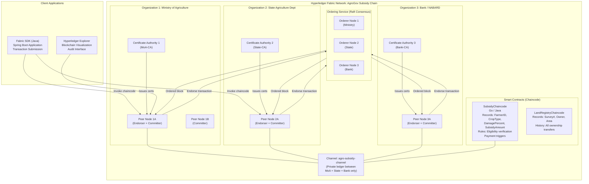
```mermaid
graph TB
    subgraph HLFNetwork["Hyperledger Fabric Network: AgroGov Subsidy Chain"]
        subgraph Org1["Organization 1: Ministry of Agriculture"]
            Peer1A["Peer Node 1A\n(Endorser + Committer)"]
            Peer1B["Peer Node 1B\n(Committer)"]
            CA1["Certificate Authority 1\n(MoA-CA)"]
        end

        subgraph Org2["Organization 2: State Agriculture Dept"]
            Peer2A["Peer Node 2A\n(Endorser + Committer)"]
            CA2["Certificate Authority 2\n(State-CA)"]
        end

        subgraph Org3["Organization 3: Bank / NABARD"]
            Peer3A["Peer Node 3A\n(Endorser + Committer)"]
            CA3["Certificate Authority 3\n(Bank-CA)"]
        end

        subgraph OrderingService["Ordering Service (Raft Consensus)"]
            Orderer1["Orderer Node 1\n(Ministry)"]
            Orderer2["Orderer Node 2\n(State)"]
            Orderer3["Orderer Node 3\n(Bank)"]
        end

        subgraph Chaincode["Smart Contracts (Chaincode)"]
            SubsidyCC["SubsidyChaincode\nGo / Java\nRecords: FarmerID, CropType,\nDamagePercent, SubsidyAmount\nRules: Eligibility verification\nPayment triggers"]
            LandCC["LandRegistryChaincode\nRecords: Survey#, Owner, Area\nHistory: All ownership transfers"]
        end

        Channel["Channel: agro-subsidy-channel\n(Private ledger between\nMoA + State + Bank only)"]
    end

    subgraph Clients["Client Applications"]
        FabricSDK["Fabric SDK (Java)\nSpring Boot Application\nTransaction Submission"]
        Explorer["Hyperledger Explorer\nBlockchain Visualization\nAudit Interface"]
    end

    FabricSDK -->|"Invoke chaincode"| Peer1A
    FabricSDK -->|"Invoke chaincode"| Peer2A
    Peer1A -->|"Endorse transaction"| OrderingService
    Peer2A -->|"Endorse transaction"| OrderingService
    Peer3A -->|"Endorse transaction"| OrderingService
    OrderingService -->|"Ordered block"| Peer1A
    OrderingService -->|"Ordered block"| Peer2A
    OrderingService -->|"Ordered block"| Peer3A
    Peer1A --- Channel
    Peer2A --- Channel
    Peer3A --- Channel
    SubsidyCC --- Channel
    CA1 -->|"Issues certs"| Peer1A
    CA2 -->|"Issues certs"| Peer2A
    CA3 -->|"Issues certs"| Peer3A
    Explorer --> Peer1A
```

**Transaction Flow in Hyperledger Fabric:**

```
Step 1: PROPOSAL
  Client SDK → sends transaction proposal to endorsing peers (Peer1A, Peer2A, Peer3A)
  
Step 2: ENDORSEMENT
  Each endorsing peer:
    - Simulates the transaction (runs chaincode against current state)
    - Does NOT commit yet (simulation only)
    - Returns signed endorsement (read-write set + signature)
  
Step 3: ORDERING
  Client collects endorsements → sends to Ordering Service
  Ordering Service: orders transactions using Raft consensus (no mining!)
  Creates a block of ordered transactions
  
Step 4: COMMITMENT
  Ordering Service → broadcasts block to ALL peers
  Each peer validates: endorsement policy met? Read-write set conflict?
  Commits to ledger (valid transactions) or marks invalid (policy violation)
  
Step 5: NOTIFICATION
  Peers notify clients of commit status
  Block is now immutable in all peers' ledgers
```

#### A.3.3 — When NOT to Use Blockchain

This is as important as knowing when to use it.

| Scenario                                  | Why Blockchain is Wrong                                                | Better Alternative                                        |
| ----------------------------------------- | ---------------------------------------------------------------------- | --------------------------------------------------------- |
| Single organization needs an audit log    | You control all the data; no trust problem to solve                    | PostgreSQL with append-only table + Cassandra event store |
| Fast-changing data (real-time telemetry)  | Blockchain is slow (seconds per transaction); IoT data is milliseconds | Time-series database (InfluxDB, Azure Data Explorer)      |
| Simple data sharing between known parties | Add proper API contracts and access control                            | REST APIs with OAuth2 + audit logging                     |
| "We need transparency"                    | A public-read API with cryptographic signing is simpler                | Signed JSON with public key verification                  |
| Performance matters above all             | Blockchain consensus adds 500ms-2s latency per transaction             | PostgreSQL, MongoDB — sub-millisecond writes              |

> **Architect's Note:** Blockchain solves exactly one problem: **enabling trust between mutually distrustful parties without a central trusted intermediary.** If your parties already trust each other (they are all sub-departments of the same ministry), or if there is already a trusted intermediary (the Reserve Bank of India for payments), blockchain adds complexity without benefit. In India, the 2018 NITI Aayog report on blockchain for government identified only 3 genuine use cases out of 47 proposals as having clear justification: land registry, drug supply chain, and educational certificate verification.

---

### A.4 — Edge Computing: Bringing Compute to the Data

**Analogy:** In a traditional architecture, a field sensor in a remote village in Rajasthan sends raw data 1,400 km to a cloud datacenter in Mumbai for processing. The round-trip takes 150-300ms minimum. For real-time irrigation control, where the pump must respond within seconds to prevent crop flooding, this latency is unacceptable. Edge computing moves the processing to within 5km of the sensor — at the village panchayat office — reducing latency to 2-5ms.

**Definition:** **Edge computing** is a distributed computing paradigm where computation, storage, and networking are placed physically closer to the data sources (IoT devices, sensors, end users) rather than relying on a centralized cloud datacenter.

#### A.4.1 — The Edge Computing Continuum

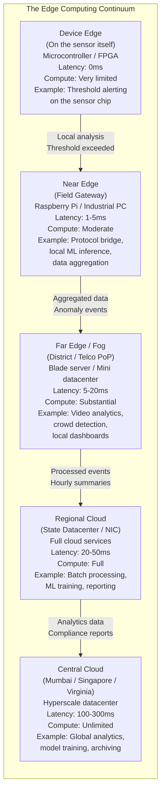
```mermaid
graph LR
    subgraph Continuum["The Edge Computing Continuum"]
        Device["Device Edge\n(On the sensor itself)\nMicrocontroller / FPGA\nLatency: 0ms\nCompute: Very limited\nExample: Threshold alerting\non the sensor chip"]

        Gateway["Near Edge\n(Field Gateway)\nRaspberry Pi / Industrial PC\nLatency: 1-5ms\nCompute: Moderate\nExample: Protocol bridge,\nlocal ML inference,\ndata aggregation"]

        Fog["Far Edge / Fog\n(District / Telco PoP)\nBlade server / Mini datacenter\nLatency: 5-20ms\nCompute: Substantial\nExample: Video analytics,\ncrowd detection,\nlocal dashboards"]

        Regional["Regional Cloud\n(State Datacenter / NIC)\nFull cloud services\nLatency: 20-50ms\nCompute: Full\nExample: Batch processing,\nML training, reporting"]

        Central["Central Cloud\n(Mumbai / Singapore / Virginia)\nHyperscale datacenter\nLatency: 100-300ms\nCompute: Unlimited\nExample: Global analytics,\nmodel training, archiving"]
    end

    Device -->|"Local analysis\nThreshold exceeded"| Gateway
    Gateway -->|"Aggregated data\nAnomaly events"| Fog
    Fog -->|"Processed events\nHourly summaries"| Regional
    Regional -->|"Analytics data\nCompliance reports"| Central
```

#### A.4.2 — When to Use Edge Computing

**The Decision Framework:**

| Requirement                                    | Edge Needed?           | Reason                                 |
| ---------------------------------------------- | ---------------------- | -------------------------------------- |
| Latency < 10ms                                 | Yes (Device/Near Edge) | Cloud round-trip cannot meet this      |
| Latency 10-50ms                                | Maybe (Far Edge/Fog)   | Depends on cloud proximity             |
| Latency > 50ms acceptable                      | No                     | Cloud is sufficient                    |
| Device operates offline                        | Yes (Edge/Gateway)     | Must process locally when disconnected |
| Bandwidth is expensive / limited               | Yes (Edge)             | Pre-process and send only summaries    |
| Data privacy: raw data must not leave premises | Yes (Edge)             | Process locally; send only insights    |
| Real-time anomaly detection                    | Yes (Near Edge)        | Cannot afford cloud round-trip         |
| Historical analysis / ML training              | No                     | Cloud is ideal; no latency requirement |

#### A.4.3 — CDN vs. Edge Compute vs. Fog: The Distinction

A frequent area of confusion for engineers transitioning to architects:

| Technology                                              | What It Does                                                                     | What It Does NOT Do                                                           |
| ------------------------------------------------------- | -------------------------------------------------------------------------------- | ----------------------------------------------------------------------------- |
| **CDN (Content Delivery Network)**                      | Caches static/dynamic HTTP responses near users; reduces latency for web content | Does not run application code; cannot process IoT data; cannot make decisions |
| **Edge Compute** (Cloudflare Workers, Azure Edge Zones) | Runs lightweight application code at CDN edge nodes; customizable per request    | Not suitable for heavy ML inference or stateful processing                    |
| **Fog Computing**                                       | Full compute stack (servers) at the network edge; runs complex workloads locally | More expensive than CDN; requires physical infrastructure management          |
| **IoT Edge** (Azure IoT Edge, AWS Greengrass)           | Manages containerized workloads on edge devices; runs ML models on edge hardware | Requires edge device management infrastructure                                |

---

### A.5 — Integration Patterns: IoT → Edge → Cloud Continuum

The practical architecture question is not "should I use IoT or edge?" — it is "how do these layers communicate reliably when connectivity is intermittent?"

**The Store-and-Forward Pattern:**

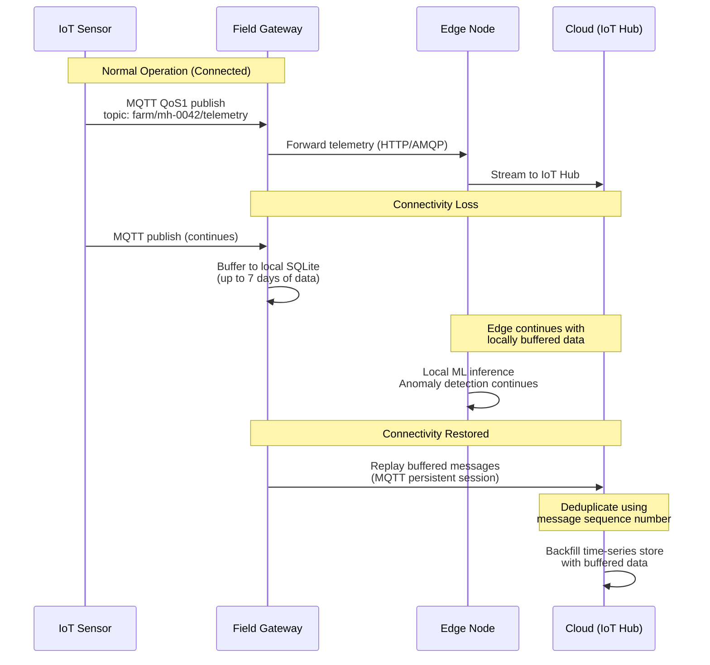
```mermaid
sequenceDiagram
    participant Sensor as IoT Sensor
    participant GW as Field Gateway
    participant Edge as Edge Node
    participant Cloud as Cloud (IoT Hub)

    Note over Sensor,GW: Normal Operation (Connected)
    Sensor->>GW: MQTT QoS1 publish<br/>topic: farm/mh-0042/telemetry
    GW->>Edge: Forward telemetry (HTTP/AMQP)
    Edge->>Cloud: Stream to IoT Hub

    Note over GW,Cloud: Connectivity Loss
    Sensor->>GW: MQTT publish (continues)
    GW->>GW: Buffer to local SQLite<br/>(up to 7 days of data)
    Note over Edge,Cloud: Edge continues with<br/>locally buffered data
    Edge->>Edge: Local ML inference<br/>Anomaly detection continues

    Note over GW,Cloud: Connectivity Restored
    GW->>Cloud: Replay buffered messages<br/>(MQTT persistent session)
    Note over Cloud: Deduplicate using<br/>message sequence number
    Cloud->>Cloud: Backfill time-series store<br/>with buffered data
```

**Key Integration Patterns:**

| Pattern                  | Description                                                            | Government Use Case                                        |
| ------------------------ | ---------------------------------------------------------------------- | ---------------------------------------------------------- |
| **Store-and-Forward**    | Device buffers data locally; replays when connected                    | Rural sensors with intermittent connectivity               |
| **Edge Filtering**       | Edge node drops low-value data; only sends anomalies                   | Video surveillance: only send frames with detected anomaly |
| **Aggregation at Edge**  | Edge computes averages/summaries; sends summary not raw data           | Temperature: send hourly avg, not every 5-second reading   |
| **Command Forwarding**   | Cloud sends command to edge; edge buffers until device connects        | Irrigation valve commands via Device Twin                  |
| **Shadow Sync**          | Edge maintains local copy of device state; syncs to cloud periodically | Offline dashboard at district office                       |
| **Dead Letter Handling** | Undeliverable messages routed to DLQ; alerted to operations team       | Critical alerts that fail delivery after max retries       |

---

## Section B: Architecture and Design

### B.1 — AgroGov IoT + Blockchain Architecture

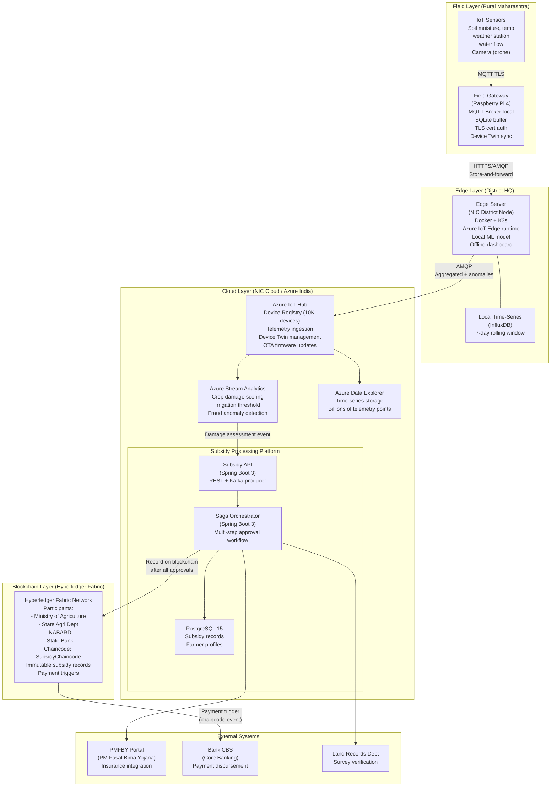
```mermaid
graph TB
    subgraph FieldLayer["Field Layer (Rural Maharashtra)"]
        Sensors["IoT Sensors\nSoil moisture, temp\nweather station\nwater flow\nCamera (drone)"]
        FieldGW["Field Gateway\n(Raspberry Pi 4)\nMQTT Broker local\nSQLite buffer\nTLS cert auth\nDevice Twin sync"]
    end

    subgraph EdgeLayer["Edge Layer (District HQ)"]
        EdgeServer["Edge Server\n(NIC District Node)\nDocker + K3s\nAzure IoT Edge runtime\nLocal ML model\nOffline dashboard"]
        LocalDB["Local Time-Series\n(InfluxDB)\n7-day rolling window"]
    end

    subgraph CloudLayer["Cloud Layer (NIC Cloud / Azure India)"]
        IoTHub["Azure IoT Hub\nDevice Registry (10K devices)\nTelemetry ingestion\nDevice Twin management\nOTA firmware updates"]
        StreamProc["Azure Stream Analytics\nCrop damage scoring\nIrrigation threshold\nFraud anomaly detection"]
        TSDB["Azure Data Explorer\nTime-series storage\nBillions of telemetry points"]
        
        subgraph SubsidyProcessing["Subsidy Processing Platform"]
            SubsidyAPI["Subsidy API\n(Spring Boot 3)\nREST + Kafka producer"]
            SagaOrch["Saga Orchestrator\n(Spring Boot 3)\nMulti-step approval workflow"]
            SubsidyDB["PostgreSQL 15\nSubsidy records\nFarmer profiles"]
        end
    end

    subgraph BlockchainLayer["Blockchain Layer (Hyperledger Fabric)"]
        HLFNetwork["Hyperledger Fabric Network\nParticipants:\n- Ministry of Agriculture\n- State Agri Dept\n- NABARD\n- State Bank\nChaincode: SubsidyChaincode\nImmutable subsidy records\nPayment triggers"]
    end

    subgraph ExternalSystems["External Systems"]
        PMFBYPortal["PMFBY Portal\n(PM Fasal Bima Yojana)\nInsurance integration"]
        BankCBSS["Bank CBS\n(Core Banking)\nPayment disbursement"]
        LandRecords["Land Records Dept\nSurvey verification"]
    end

    Sensors -->|"MQTT TLS"| FieldGW
    FieldGW -->|"HTTPS/AMQP\nStore-and-forward"| EdgeServer
    EdgeServer -->|"AMQP\nAggregated + anomalies"| IoTHub
    EdgeServer --- LocalDB
    IoTHub --> StreamProc
    IoTHub --> TSDB
    StreamProc -->|"Damage assessment event"| SubsidyAPI
    SubsidyAPI --> SagaOrch
    SagaOrch --> SubsidyDB
    SagaOrch -->|"Record on blockchain\nafter all approvals"| HLFNetwork
    HLFNetwork -->|"Payment trigger\n(chaincode event)"| BankCBSS
    SagaOrch --> LandRecords
    SagaOrch --> PMFBYPortal
```

### B.2 — Trade-off Analysis: IoT + Blockchain vs. Simpler Alternatives

| Approach                           | Description                                   | Cost (5-year TCO, illustrative)          | Fraud Reduction                                           | Operational Complexity |
| ---------------------------------- | --------------------------------------------- | ---------------------------------------- | --------------------------------------------------------- | ---------------------- |
| **Paper + Manual**                 | Status quo: officer visits, paper forms       | INR 85 Crore (staff cost, errors, fraud) | Baseline (high fraud)                                     | Low                    |
| **Digitized Portal Only**          | Web forms replacing paper; central DB         | INR 22 Crore                             | Moderate (insider fraud possible)                         | Low-Medium             |
| **IoT + Central DB**               | Automated data collection; no blockchain      | INR 34 Crore                             | High (objective data; insider DB tampering possible)      | Medium                 |
| **IoT + Blockchain (Recommended)** | Automated data + immutable multi-party ledger | INR 41 Crore                             | Very High (tamper-evident; no single point of corruption) | High                   |
| **Full Public Blockchain**         | Ethereum-based public ledger                  | INR 60 Crore+ (gas fees alone)           | Very High                                                 | Very High              |

> **Trade-off Alert:** [Fraud Resistance] vs [Operational Complexity + Cost] — The IoT + Blockchain combination adds INR 7 Crore over 5 years compared to IoT + Central DB. Whether this premium is justified depends on the quantified annual fraud loss. If annual fraud in the scheme exceeds INR 1.4 Crore/year, the blockchain investment pays for itself in 5 years. This is the analysis an architect must present to the ministry — not just the technology recommendation.

---

## Section C: Code Walkthrough

### C.1 — IoT Telemetry Ingestion Service (Spring Boot)

```java
// IoTTelemetryController.java
// REST endpoint that acts as an MQTT-to-HTTP bridge for field gateways
// that cannot maintain persistent MQTT connections to the cloud.
// In production, Azure IoT Hub handles MQTT directly.
// This service simulates the telemetry ingestion side for the lab.

package gov.agrogov.iot.controller;

import gov.agrogov.iot.domain.SensorTelemetry;
import gov.agrogov.iot.service.TelemetryIngestionService;
import gov.agrogov.iot.service.DeviceAuthenticationService;
import lombok.RequiredArgsConstructor;
import lombok.extern.slf4j.Slf4j;
import org.springframework.http.ResponseEntity;
import org.springframework.web.bind.annotation.*;

import jakarta.validation.Valid;
import java.time.Instant;

@RestController
@RequestMapping("/api/v1/iot/telemetry")
@RequiredArgsConstructor
@Slf4j
public class IoTTelemetryController {

    private final TelemetryIngestionService ingestionService;
    private final DeviceAuthenticationService deviceAuthService;

    /**
     * Receives telemetry from field gateways.
     *
     * Security: Each gateway authenticates with its device certificate (CN = deviceId).
     * The X-Device-Id header is set by the API Gateway after mTLS client cert validation.
     * WHY not use bearer tokens: IoT devices often cannot run a full OAuth2 flow;
     * X.509 mutual TLS is the IoT security standard (per NIST SP 800-213).
     *
     * Idempotency: telemetry includes a sequenceNumber to detect and deduplicate
     * replayed messages when the gateway reconnects after an outage.
     */
    @PostMapping
    public ResponseEntity<TelemetryAckResponse> receiveTelemetry(
            @RequestHeader("X-Device-Id") String deviceId,
            @RequestHeader(value = "X-Sequence-Number", required = false) Long sequenceNumber,
            @Valid @RequestBody SensorTelemetry telemetry) {

        // Validate that the device ID in the header matches the telemetry payload
        // WHY: Prevents one gateway from spoofing another gateway's device ID
        if (!deviceId.equals(telemetry.getDeviceId())) {
            log.warn("Device ID mismatch: header={}, payload={}", deviceId, telemetry.getDeviceId());
            return ResponseEntity.badRequest()
                .body(TelemetryAckResponse.error("Device ID mismatch"));
        }

        // Enrich telemetry with server-side timestamp
        // WHY: Device clocks may be unsynchronized; server timestamp is authoritative
        // Device timestamp is preserved as 'deviceTimestamp' for audit
        telemetry.setServerReceivedAt(Instant.now());
        telemetry.setSequenceNumber(sequenceNumber);

        // Idempotency check: have we seen this sequence number from this device?
        if (sequenceNumber != null &&
            ingestionService.isDuplicate(deviceId, sequenceNumber)) {
            log.info("Duplicate telemetry detected: deviceId={}, seq={}", deviceId, sequenceNumber);
            return ResponseEntity.ok(TelemetryAckResponse.duplicate(sequenceNumber));
        }

        log.info("Telemetry received: deviceId={}, soilMoisture={}, temp={}, seq={}",
            deviceId,
            telemetry.getSoilMoisturePercent(),
            telemetry.getTemperatureCelsius(),
            sequenceNumber);

        TelemetryIngestionResult result = ingestionService.ingest(telemetry);

        return ResponseEntity.ok(TelemetryAckResponse.success(sequenceNumber, result));
    }
}
```

```java
// SensorTelemetry.java
// Domain model for IoT sensor telemetry data.
// Designed to be schema-flexible: not all sensors report all fields.

package gov.agrogov.iot.domain;

import com.fasterxml.jackson.annotation.JsonIgnoreProperties;
import jakarta.validation.constraints.*;
import lombok.*;
import java.time.Instant;

@Data
@Builder
@NoArgsConstructor
@AllArgsConstructor
@JsonIgnoreProperties(ignoreUnknown = true)  // Future sensors may add new fields
public class SensorTelemetry {

    @NotBlank(message = "Device ID is mandatory")
    @Pattern(regexp = "sensor-[a-z]{2}-[a-z0-9-]+",
             message = "Device ID must match pattern: sensor-{state}-{identifier}")
    private String deviceId;

    // Device-reported timestamp (may differ from server time if clock is skewed)
    private Instant deviceTimestamp;

    // Server-assigned timestamp (authoritative for time-series queries)
    private Instant serverReceivedAt;

    // Idempotency: monotonically increasing per device
    private Long sequenceNumber;

    // Soil moisture: 0-100% volumetric water content
    @Min(value = 0, message = "Soil moisture cannot be negative")
    @Max(value = 100, message = "Soil moisture cannot exceed 100%")
    private Double soilMoisturePercent;

    // Temperature in Celsius: -10 to 60 (Indian agricultural range)
    @DecimalMin(value = "-10.0", message = "Temperature below sensor range")
    @DecimalMax(value = "60.0", message = "Temperature above sensor range")
    private Double temperatureCelsius;

    // Rainfall in mm (from weather station)
    @DecimalMin(value = "0.0")
    private Double rainfallMm;

    // NDVI: Normalized Difference Vegetation Index (-1 to 1)
    // Values < 0.3 indicate crop stress; used for damage assessment
    @DecimalMin(value = "-1.0")
    @DecimalMax(value = "1.0")
    private Double ndviIndex;

    // GPS coordinates of the sensor (for mapping/GIS integration)
    private Double latitude;
    private Double longitude;

    // Battery level: trigger maintenance alert when below 20%
    @Min(0) @Max(100)
    private Integer batteryLevelPercent;

    // Signal strength (RSSI in dBm): for connectivity quality monitoring
    private Integer signalStrengthDbm;

    // Farmer and land reference (set by gateway from device provisioning data)
    private String farmerRegistrationId;
    private String surveyNumber;     // Land survey number (e.g., "44/2A")
    private String districtCode;     // e.g., "MH-PUNE-04"

    // Alert flags set by edge ML inference (pre-computed at edge)
    private Boolean cropStressDetected;
    private Boolean floodRiskDetected;
    private Boolean droughtRiskDetected;
}
```

```java
// TelemetryIngestionService.java
// Processes incoming telemetry: validates, stores, and triggers downstream events

package gov.agrogov.iot.service;

import gov.agrogov.iot.domain.SensorTelemetry;
import gov.agrogov.iot.repository.TelemetryRepository;
import gov.agrogov.iot.repository.DeduplicationRepository;
import lombok.RequiredArgsConstructor;
import lombok.extern.slf4j.Slf4j;
import org.springframework.kafka.core.KafkaTemplate;
import org.springframework.stereotype.Service;
import org.springframework.transaction.annotation.Transactional;

@Service
@RequiredArgsConstructor
@Slf4j
public class TelemetryIngestionService {

    private final TelemetryRepository telemetryRepository;
    private final DeduplicationRepository deduplicationRepository;
    private final KafkaTemplate<String, SensorTelemetry> kafkaTemplate;
    private final CropDamageAssessmentService damageAssessmentService;

    /**
     * Ingests telemetry, stores it, and triggers downstream processing.
     *
     * WHY publish to Kafka after storing:
     * The Outbox Pattern: store first, publish second.
     * If we publish to Kafka before storing, a crash between publish and store
     * leaves us with a Kafka event but no database record — inconsistent state.
     * If we store first and crash before publishing, we can replay from the DB.
     *
     * In production, use the Transactional Outbox pattern (Debezium CDC from the DB)
     * to guarantee both store and publish happen atomically.
     */
    @Transactional
    public TelemetryIngestionResult ingest(SensorTelemetry telemetry) {
        // Step 1: Persist telemetry to time-series store
        // (In lab: PostgreSQL; in production: Azure Data Explorer / InfluxDB)
        TelemetryRecord saved = telemetryRepository.save(
            mapToRecord(telemetry));

        // Step 2: Record sequence number for deduplication
        if (telemetry.getSequenceNumber() != null) {
            deduplicationRepository.record(
                telemetry.getDeviceId(),
                telemetry.getSequenceNumber());
        }

        // Step 3: Assess crop damage from NDVI and moisture readings
        // WHY here: this is lightweight rule-based assessment (not ML)
        // ML-based assessment happens asynchronously at the edge
        CropDamageLevel damageLevel = damageAssessmentService
            .assess(telemetry);

        // Step 4: Publish event to Kafka for downstream services
        // Partition key: districtCode — ensures ordering per district
        kafkaTemplate.send(
            "agrogov.telemetry.raw",
            telemetry.getDistrictCode(),  // Partition key
            telemetry
        );

        // Step 5: If damage detected, publish alert event
        if (damageLevel.isDamageDetected()) {
            log.warn("Crop damage detected! deviceId={}, level={}, farmer={}",
                telemetry.getDeviceId(),
                damageLevel.name(),
                telemetry.getFarmerRegistrationId());

            kafkaTemplate.send(
                "agrogov.crop.damage.alerts",
                telemetry.getFarmerRegistrationId(),  // Partition by farmer
                CropDamageEvent.builder()
                    .deviceId(telemetry.getDeviceId())
                    .farmerRegistrationId(telemetry.getFarmerRegistrationId())
                    .surveyNumber(telemetry.getSurveyNumber())
                    .districtCode(telemetry.getDistrictCode())
                    .damageLevel(damageLevel)
                    .ndviIndex(telemetry.getNdviIndex())
                    .soilMoisturePercent(telemetry.getSoilMoisturePercent())
                    .detectedAt(telemetry.getServerReceivedAt())
                    .build()
            );
        }

        return TelemetryIngestionResult.builder()
            .recordId(saved.getId())
            .damageLevel(damageLevel)
            .damageDetected(damageLevel.isDamageDetected())
            .build();
    }

    public boolean isDuplicate(String deviceId, Long sequenceNumber) {
        // Check Redis-backed deduplication store (TTL: 24 hours)
        // WHY 24-hour TTL: gateways buffer up to 24 hours during outages;
        // any replayed message older than 24 hours is likely a legitimate new reading
        return deduplicationRepository.exists(deviceId, sequenceNumber);
    }

    private TelemetryRecord mapToRecord(SensorTelemetry telemetry) {
        return TelemetryRecord.builder()
            .deviceId(telemetry.getDeviceId())
            .farmerRegistrationId(telemetry.getFarmerRegistrationId())
            .surveyNumber(telemetry.getSurveyNumber())
            .districtCode(telemetry.getDistrictCode())
            .soilMoisturePercent(telemetry.getSoilMoisturePercent())
            .temperatureCelsius(telemetry.getTemperatureCelsius())
            .rainfallMm(telemetry.getRainfallMm())
            .ndviIndex(telemetry.getNdviIndex())
            .deviceTimestamp(telemetry.getDeviceTimestamp())
            .serverReceivedAt(telemetry.getServerReceivedAt())
            .sequenceNumber(telemetry.getSequenceNumber())
            .latitude(telemetry.getLatitude())
            .longitude(telemetry.getLongitude())
            .build();
    }
}
```

### C.2 — Hyperledger Fabric Chaincode (Java) — Subsidy Record

```java
// SubsidyChaincode.java
// Hyperledger Fabric chaincode in Java.
// Records subsidy decisions immutably on the blockchain after all approvals.
// This code runs INSIDE the Fabric peer nodes, not in the Spring Boot application.
//
// WHY record on blockchain AFTER all approvals:
// The blockchain is the system of record for FINALIZED, APPROVED subsidies.
// In-progress workflows remain in PostgreSQL (fast, mutable).
// Only immutable facts (approved amounts, payment references) go on chain.

package gov.agrogov.chaincode;

import org.hyperledger.fabric.contract.Context;
import org.hyperledger.fabric.contract.ContractInterface;
import org.hyperledger.fabric.contract.annotation.*;
import org.hyperledger.fabric.shim.ChaincodeException;
import org.hyperledger.fabric.shim.ledger.KeyValue;
import org.hyperledger.fabric.shim.ledger.QueryResultsIterator;
import com.fasterxml.jackson.databind.ObjectMapper;
import java.util.ArrayList;
import java.util.List;

@Contract(name = "SubsidyChaincode")
@Default
public class SubsidyChaincode implements ContractInterface {

    private final ObjectMapper objectMapper = new ObjectMapper();

    /**
     * Records a finalized subsidy approval on the blockchain.
     *
     * WHO calls this: The Saga Orchestrator (Spring Boot) calls this
     * via the Fabric Java SDK after all approval steps complete.
     *
     * WHY immutable: Once recorded, the subsidy cannot be altered.
     * Disputes are resolved by examining the immutable history.
     * Government auditors can verify payments against blockchain records
     * without trusting any single party's database.
     *
     * The endorsement policy for this function requires signatures from:
     * - Ministry of Agriculture peer
     * - State Agriculture Department peer
     * - NABARD peer
     * All three must endorse before the transaction is ordered/committed.
     */
    @Transaction(intent = Transaction.TYPE.SUBMIT)
    public SubsidyRecord recordSubsidyApproval(
            Context ctx,
            String subsidyId,
            String farmerRegistrationId,
            String surveyNumber,
            String cropType,
            double damagePercentage,
            double approvedAmountINR,
            String approvalTimestamp,
            String approvedByOfficerId,
            String paymentReferenceNumber) {

        // Idempotency: check if this subsidy was already recorded
        // WHY: Kafka at-least-once delivery means the chaincode may be invoked twice
        byte[] existingData = ctx.getStub().getState(subsidyId);
        if (existingData != null && existingData.length > 0) {
            throw new ChaincodeException(
                "Subsidy " + subsidyId + " already recorded on ledger",
                "DUPLICATE_SUBSIDY");
        }

        // Validate business rules (chaincode is the last line of defense)
        if (damagePercentage < 33.0) {
            throw new ChaincodeException(
                "Damage percentage " + damagePercentage +
                "% does not meet minimum threshold of 33% for subsidy eligibility",
                "INELIGIBLE_DAMAGE_LEVEL");
        }

        // Compute maximum allowable subsidy (government policy: INR 20K/hectare)
        // WHY validate here: chaincode rules cannot be bypassed by any party
        double maxAllowableSubsidy = 20000.0;  // Simplified; in production: area-based
        if (approvedAmountINR > maxAllowableSubsidy) {
            throw new ChaincodeException(
                "Approved amount INR " + approvedAmountINR +
                " exceeds maximum allowable INR " + maxAllowableSubsidy,
                "AMOUNT_EXCEEDS_POLICY");
        }

        // Create the immutable subsidy record
        SubsidyRecord record = SubsidyRecord.builder()
            .subsidyId(subsidyId)
            .farmerRegistrationId(farmerRegistrationId)
            .surveyNumber(surveyNumber)
            .cropType(cropType)
            .damagePercentage(damagePercentage)
            .approvedAmountINR(approvedAmountINR)
            .approvalTimestamp(approvalTimestamp)
            .approvedByOfficerId(approvedByOfficerId)
            .paymentReferenceNumber(paymentReferenceNumber)
            .status("APPROVED")
            // Blockchain provides implicit tamper-evidence; we add explicit
            // document hash for cross-chain verification
            .documentHash(computeDocumentHash(farmerRegistrationId,
                surveyNumber, approvedAmountINR))
            .build();

        // Write to blockchain state (WorldState = latest state per key)
        try {
            byte[] recordBytes = objectMapper.writeValueAsBytes(record);
            ctx.getStub().putState(subsidyId, recordBytes);

            // Emit a chaincode event for downstream listeners (e.g., bank payment trigger)
            ctx.getStub().setEvent("SubsidyApproved",
                objectMapper.writeValueAsBytes(SubsidyApprovedEvent.builder()
                    .subsidyId(subsidyId)
                    .farmerRegistrationId(farmerRegistrationId)
                    .approvedAmountINR(approvedAmountINR)
                    .paymentReferenceNumber(paymentReferenceNumber)
                    .build()));

        } catch (Exception e) {
            throw new ChaincodeException("Failed to serialize subsidy record: " + e.getMessage());
        }

        return record;
    }

    /**
     * Queries subsidy history for a farmer — returns all subsidies ever received.
     * WHY GetHistoryForKey: Fabric maintains full history of all state changes per key.
     * This is the audit log that no single party can modify.
     */
    @Transaction(intent = Transaction.TYPE.EVALUATE)
    public List<SubsidyRecord> getSubsidyHistory(Context ctx, String subsidyId) {
        List<SubsidyRecord> history = new ArrayList<>();

        try (QueryResultsIterator<KeyValue> resultsIterator =
                 ctx.getStub().getStateByRange("", "")) {

            // GetHistoryForKey returns all past values for the given key
            // including the transaction ID and timestamp of each change
            ctx.getStub().getHistoryForKey(subsidyId).forEach(modification -> {
                try {
                    SubsidyRecord record = objectMapper.readValue(
                        modification.getValue(), SubsidyRecord.class);
                    history.add(record);
                } catch (Exception e) {
                    // Log but continue — partial history is better than none
                }
            });

        } catch (Exception e) {
            throw new ChaincodeException("Failed to retrieve history: " + e.getMessage());
        }

        return history;
    }

    private String computeDocumentHash(String farmerId, String survey, double amount) {
        // SHA-256 hash of key fields for cross-reference verification
        String input = farmerId + "|" + survey + "|" + amount;
        try {
            java.security.MessageDigest md = java.security.MessageDigest.getInstance("SHA-256");
            byte[] hash = md.digest(input.getBytes(java.nio.charset.StandardCharsets.UTF_8));
            StringBuilder sb = new StringBuilder();
            for (byte b : hash) sb.append(String.format("%02x", b));
            return sb.toString();
        } catch (Exception e) {
            return "HASH_ERROR";
        }
    }
}
```

---

## Section D: Real-World Case Study

### D.1 — Case Study: Andhra Pradesh Land Registry on Blockchain (Reference to Real Initiative, Illustrative Details)

**Context:** Andhra Pradesh (India) was among the first states to pilot blockchain for land registry in 2017, in partnership with a Swedish company (ChromaWay). This case study uses the real initiative as a reference point, with illustrative architectural details.

**The Problem (Real):**
- 70% of civil cases in Indian courts are land disputes
- A single land parcel could have conflicting ownership records in multiple government databases
- Manual tampering of land records was a documented form of corruption
- Cross-referencing records across Sub-Registrar offices, Revenue Department, and banks required weeks of bureaucratic process

**Architecture Applied (Illustrative):**

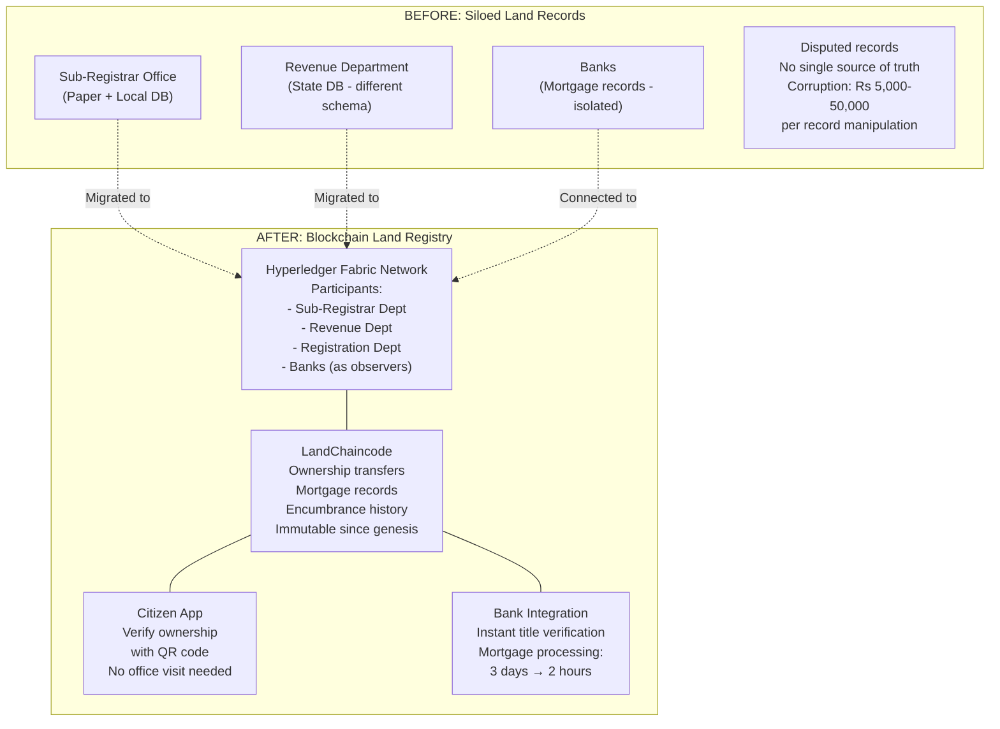
```mermaid
graph TB
    subgraph Before["BEFORE: Siloed Land Records"]
        SubReg["Sub-Registrar Office\n(Paper + Local DB)"]
        Revenue["Revenue Department\n(State DB - different schema)"]
        Bank["Banks\n(Mortgage records - isolated)"]
        Dispute["Disputed records\nNo single source of truth\nCorruption: Rs 5,000-50,000\nper record manipulation"]
    end

    subgraph After["AFTER: Blockchain Land Registry"]
        HLF["Hyperledger Fabric Network\nParticipants:\n- Sub-Registrar Dept\n- Revenue Dept\n- Registration Dept\n- Banks (as observers)"]
        LandCC2["LandChaincode\nOwnership transfers\nMortgage records\nEncumbrance history\nImmutable since genesis"]
        CitizenApp["Citizen App\nVerify ownership\nwith QR code\nNo office visit needed"]
        BankInteg["Bank Integration\nInstant title verification\nMortgage processing:\n3 days → 2 hours"]
    end

    SubReg -.->|"Migrated to"| HLF
    Revenue -.->|"Migrated to"| HLF
    Bank -.->|"Connected to"| HLF
    HLF --- LandCC2
    LandCC2 --- CitizenApp
    LandCC2 --- BankInteg
```

**Results (Illustrative based on reported pilot outcomes):**

| Metric                                       | Before                 | After                                                          |
| -------------------------------------------- | ---------------------- | -------------------------------------------------------------- |
| Land dispute resolution time                 | 3-7 years (court)      | Blockchain provides instant evidence; disputes dropped by ~35% |
| Mortgage processing time                     | 5-7 business days      | 2-4 hours (instant title verification)                         |
| Record manipulation incidents                | Documented fraud cases | Zero post-implementation (immutable ledger)                    |
| Citizen office visits for title verification | 3-4 visits             | Zero (QR code verification)                                    |

**Lessons Learned:**

1. **Data migration is the hardest part.** Getting 50 years of paper land records digitized, verified, and migrated to the blockchain was more complex than building the blockchain network itself.
2. **The blockchain does not prevent bad data entry.** If a corrupt officer records a fraudulent transfer on the blockchain, it is immutably wrong. The blockchain prevents post-entry tampering, not pre-entry fraud. The fix: multi-party endorsement (two officers from different departments must endorse every transfer).
3. **Offline capability is non-negotiable.** Rural Sub-Registrar offices often have 2G connectivity. The Fabric SDK must operate with local peer nodes; not all peers need to be online for a transaction to be endorsed.
4. **Performance was the unexpected bottleneck.** Peak registration season (post-harvest) generates 50,000 transactions/day in a single state. Fabric with 3 organizations achieved 800 TPS in testing — sufficient. But the Kafka integration between the legacy systems and the Fabric peer nodes introduced latency that required careful tuning.

---

## Section E: Engagement and Assessment

### E.1 — Food for Thought

> **Provocation:** The Government of India's PM-KISAN scheme disburses INR 6,000/year to 110 million farmers directly to their bank accounts. The current system uses Aadhaar-based DBT (Direct Benefit Transfer). There is measurable leakage: duplicate beneficiaries, ghost beneficiaries (deceased farmers still receiving payments), and ineligible landholders.
>
> A policy think-tank proposes replacing the current system with IoT (soil sensors verifying active cultivation) + Blockchain (immutable eligibility records) + Smart Contracts (automatic payment release when IoT confirms cultivation).
>
> **Questions to wrestle with:**
> - 110 million farmers across 600,000+ villages — what percentage of villages have 4G connectivity sufficient for IoT? (Hint: TRAI data suggests ~40% of villages had reliable 4G in 2023.)
> - For the 60% without connectivity: does the architecture fail, degrade gracefully, or require a different approach entirely?
> - Smart contracts that automatically disburse INR 6,000 are financial instruments. What regulatory framework governs them? (RBI? IT Act? PMLA?)
> - Who audits the IoT sensor data? If a sensor is tampered with to show "active cultivation" on fallow land, what is the detection mechanism?
> - What is the realistic 5-year TCO for this system at 110 million farmer scale versus improving the existing Aadhaar DBT system's fraud detection with ML?
>
> **Copilot/ChatGPT Prompt:** "Analyze the feasibility of an IoT + blockchain system for agricultural subsidy disbursement at 100-million-farmer scale in rural India. Address: connectivity gaps, regulatory constraints on smart contract payments, sensor fraud, total cost of ownership vs. ML-enhanced traditional systems, and a phased implementation roadmap."

### E.2 — Questionnaire: Topic 1

**Conceptual Questions**

1. **Explain the MQTT QoS levels (0, 1, 2) and justify which level you would use for: (a) soil temperature readings every 5 seconds, (b) irrigation valve open/close commands, (c) crop damage alert notifications.**

   *Answer:* QoS 0 (At Most Once): No acknowledgment; message may be lost. QoS 1 (At Least Once): Acknowledged; may be delivered multiple times (consumer must be idempotent). QoS 2 (Exactly Once): Four-way handshake; guaranteed exactly once. (a) Soil temperature readings: QoS 0. A lost reading every few cycles is acceptable; the next reading arrives in 5 seconds. Adding acknowledgment overhead for high-frequency telemetry wastes bandwidth and battery. (b) Irrigation valve commands: QoS 2. A duplicate "open valve" command could flood the field; a missed command means the crop doesn't get water. The four-way handshake overhead is justified for low-frequency, high-consequence actuator commands. (c) Crop damage alerts: QoS 1. The alert must be delivered (subsidy processing depends on it) but if delivered twice, the subsidy service's idempotency key prevents duplicate processing. QoS 2's overhead is not justified because we already have application-level idempotency.

2. **Define a Device Twin / Device Shadow. What architectural problem does it solve that a simple REST API command cannot?**

   *Answer:* A Device Twin is a persistent JSON document in the cloud representing the last known state of a physical device, comprising 'desired' state (what the cloud wants the device to do) and 'reported' state (what the device last confirmed). The architectural problem it solves: **command delivery to intermittently connected devices.** A REST API command to an offline device is simply lost. With a Device Twin: the cloud writes to 'desired' state at any time; when the device reconnects, it reads the delta between 'desired' and 'reported' and executes pending commands. The cloud also knows what the device confirmed (reported state) vs. what was commanded (desired state), enabling gap detection. This is the asynchronous command pattern applied to the physical world.

3. **What is the fundamental trust problem that blockchain solves, and why does a shared PostgreSQL database with proper access control NOT solve the same problem?**

   *Answer:* Blockchain solves the problem of **mutual distrust between parties with conflicting interests who must share a common record.** A shared PostgreSQL database with access control still requires one party to own, host, and administer the database — and that party can, in theory, modify records, restore from backups selectively, or grant unauthorized access. Even with the best intentions, no single party's database is acceptable as the ground truth when legal and financial disputes are possible (land ownership, subsidy amounts, contract performance). Blockchain distributes the ledger across all parties; modifying a historical record requires compromising > 50% of the validator nodes simultaneously — computationally infeasible with sufficient participants. The immutability guarantee does not come from technology alone but from the economic and computational cost of attacking a sufficiently distributed network. For government land registry: the Ministry cannot unilaterally alter a record on a blockchain where the State Revenue Department and banks are also peers. On a shared PostgreSQL database, the DBA can.

**Application Questions**

4. **Design the store-and-forward buffering strategy for a field gateway in rural Rajasthan that has 4G connectivity for an average of 6 hours per day. Specify: buffer technology, maximum buffer size, message priority queue, and replay strategy.**

   *Answer:* Buffer technology: SQLite on the Raspberry Pi gateway (embedded, file-based, no server process; survives gateway restart). Maximum buffer size: 7 days of telemetry at 5-second intervals = 7 × 86,400 / 5 = 120,960 readings per sensor; at ~200 bytes per reading × 5 sensors = ~120 MB. SQLite handles this comfortably on a 32GB SD card with space for OS. Message priority queue: Three priority levels — CRITICAL (actuator state changes, flood/drought alerts): replayed first, QoS 2 — NORMAL (crop stress events, irregular readings): replayed second, QoS 1 — LOW (routine telemetry): replayed last, QoS 0, oldest-first, may be dropped if connection window closes. Replay strategy: When 4G connects, establish MQTT persistent session. Begin replaying from highest priority, oldest-first. Include original device timestamp in each message (server-side deduplication uses timestamp + sequence number). Throttle replay to 100 messages/second to avoid overwhelming the IoT Hub ingestion endpoint. If the 6-hour window closes before replay is complete, resume from where the buffer was paused (track last-replayed sequence number in SQLite). Messages older than 7 days are deleted (space management) unless tagged CRITICAL (retained indefinitely until acknowledged).

5. **For the AgroGov subsidy system, design the Hyperledger Fabric endorsement policy for the SubsidyChaincode 'recordSubsidyApproval' function. Which organizations must endorse, and why?**

   *Answer:* Endorsement policy: `AND('MoA.peer', 'StateAgriDept.peer', 'NABARD.peer')` — All three organizations must endorse. Rationale: (1) Ministry of Agriculture (MoA): the central authority that sets subsidy policy and allocates funds; must approve that the claim meets national policy requirements. (2) State Agriculture Department: has ground-level knowledge of the specific farmer, land record, and crop damage assessment; must confirm the field survey data. (3) NABARD (National Bank for Agriculture and Rural Development): the financing institution that actually disburses funds; must confirm fund availability and account validity. Why all three and not two-of-three: In a government context, accountability must be unambiguous. A two-of-three policy means a coalition of two organizations can approve a fraudulent subsidy without the third knowing. All-three endorsement means fraud requires collusion across three separate government institutions — significantly harder to orchestrate and much easier to investigate when discovered. The trade-off: if any one organization's peer is offline, transactions cannot be endorsed. Mitigation: each organization runs two peer nodes for high availability.

6. **An edge node at a district headquarters must run ML inference to detect crop stress from NDVI images, serve a local dashboard for district officers when internet is unavailable, and buffer IoT telemetry. Design the containerized workload for this edge node using Docker Compose.**

   *Answer:* Docker Compose services on the edge node: (1) `ml-inference`: Python 3.11 container running TensorFlow Lite model for NDVI crop stress detection. Input: image files from drone uploads. Output: damage score to Redis. Resource limits: 2 CPU, 4GB RAM (inference is CPU-bound on edge hardware without GPU). (2) `telemetry-buffer`: Spring Boot service; receives MQTT from field gateways via Eclipse Mosquitto; writes to InfluxDB; publishes to cloud IoT Hub when connected; manages store-and-forward. (3) `mosquitto`: MQTT broker on edge node; field gateways connect locally (always-available, no cloud dependency). (4) `influxdb`: Time-series database; 7-day retention policy; serves local dashboard. (5) `dashboard`: Grafana with InfluxDB data source; district officers see real-time district-level crop health without internet. (6) `connectivity-monitor`: Lightweight Python script; checks cloud connectivity every 30 seconds; enables/disables cloud forwarding in telemetry-buffer via REST API. All containers use `restart: always` for self-healing. Shared Docker volume for drone image ingestion. Network: bridge network isolating the ML and dashboard services from external access.

**Analysis Questions**

7. **Compare the transaction throughput and latency characteristics of Hyperledger Fabric, Ethereum (public), and a traditional PostgreSQL database with an immutable audit log. When is each appropriate for a government use case?**

   *Answer:*

   | System                         | Throughput         | Latency            | Finality                         | Government Use Case                                                                     |
   | ------------------------------ | ------------------ | ------------------ | -------------------------------- | --------------------------------------------------------------------------------------- |
   | PostgreSQL + append-only audit | 10,000-100,000 TPS | < 5ms              | Immediate (ACID)                 | Single-organization audit logs, high-throughput financial ledgers within one ministry   |
   | Hyperledger Fabric             | 1,000-3,000 TPS    | 0.5-2 seconds      | Deterministic (PBFT)             | Multi-organization permissioned use cases: land registry, subsidy records, supply chain |
   | Ethereum (public)              | 15-30 TPS          | 15 seconds-minutes | Probabilistic (6+ confirmations) | Cryptocurrency; not suitable for government data (public, slow, expensive)              |
   | Ethereum (Polygon/L2)          | 1,000-7,000 TPS    | 2-5 seconds        | Near-deterministic               | Cross-border government credential verification where public verifiability is needed    |

   Selection guidance: If only one ministry is involved → PostgreSQL. If multiple government bodies with conflicting interests must share a tamper-evident record → Hyperledger Fabric. If public verifiability without a trusted party is required (e.g., academic credentials verified by global employers) → Ethereum L2. Never use public Ethereum for PII or high-frequency transactions.

8. **Analyze the data sovereignty implications of deploying an Azure IoT Hub for an Indian government agricultural IoT system. What specific configurations and contractual arrangements are required for DPDP Act compliance?**

   *Answer:* Data sovereignty implications: Azure IoT Hub in the Central India region keeps data within India's geographic boundaries — compliant with DPDP Act's data localization requirement for personal data of Indian citizens. However, several specific configurations are required: (1) Region selection: must select Azure Central India or South India region — not global or US regions, even for disaster recovery. DR must also use an Indian region. (2) Azure Government agreements: the Indian government must sign a Data Processing Agreement (DPA) with Microsoft specifying that data will not be transferred to non-designated countries without explicit consent. (3) Farmer PII separation: the IoT Hub should receive only device telemetry (sensor readings, device IDs) — not farmer PII. Farmer registration data (name, Aadhaar number, bank account) must never flow through IoT Hub; it stays in the on-premises or NIC Cloud PostgreSQL database. Device IDs (sensor-mh-farm-0042) are pseudonyms; the mapping from device ID to farmer ID is maintained only in the secure on-premises system. (4) Log analytics: Azure Monitor logs from IoT Hub must also be stored in the Indian region. (5) Encryption: customer-managed keys (CMK) stored in Azure Key Vault India region for all data at rest. (6) MeitY approval: any cloud service used for government data must be on MeitY's empanelled cloud service providers list. As of 2024, Microsoft Azure is on the MeitY list for multiple data sensitivity levels.

**Scenario-Based Questions**

9. **A state government CTO proposes: "We will use a public Ethereum blockchain for our land registry because it provides maximum transparency and immutability without requiring us to run our own blockchain infrastructure." Construct your architectural counter-argument and propose an alternative.**

    *Answer:* Counter-argument with five specific objections: (1) **Performance**: Ethereum processes 15-30 TPS. A single Indian state (Uttar Pradesh) has 68 million land parcels; even a 1% annual transaction rate = 680,000 transactions/year = 1,862/day = 1.3/minute. While this sounds manageable, peak registration seasons (post-harvest: Oct-Dec) generate 10x normal volume. Gas price volatility during congestion can make a single transaction cost USD 50-200 — paying variable USD amounts of public money per land registration is fiscally and auditorially untenable. (2) **Privacy**: All transactions on public Ethereum are permanently visible to anyone. Indian land records include farmer names, survey numbers, transaction amounts — this is personal data regulated by the DPDP Act. Making it permanently public violates data privacy law. (3) **Regulatory**: The Reserve Bank of India does not recognize Ethereum as a legal transaction medium for government financial instruments. Any payment triggers embedded in smart contracts would be unregulated. (4) **Key management**: If the private key controlling a citizen's land record is lost, the land ownership is permanently inaccessible. On a permissioned system, the government can (with proper authorization) recover access. (5) **Vendor dependency**: While "trustless," the state still depends on Ethereum's continued operation, gas fee market, and Ethereum Foundation's upgrade decisions. **Alternative:** Hyperledger Fabric with three organizations (State Revenue Department, Registration Department, Banks as observers). Hosted on NIC Cloud for data sovereignty. Provides the same immutability and multi-party trust without public exposure, variable costs, or privacy violations.

10. **You are presenting the AgroGov IoT + Blockchain system to a Parliamentary Standing Committee on Agriculture. The committee chair asks: "What happens if the IoT sensors are tampered with by unscrupulous middlemen to inflate damage readings and receive higher subsidies?" Provide your complete architectural answer.**

    *Answer:* This is a critical fraud vector and must be addressed at multiple layers: (1) **Physical security**: Sensors are installed by government-certified technicians (not by the farmers themselves). Each sensor has a tamper-evident seal with a QR code registered on the blockchain at installation. Physical disturbance triggers an accelerometer-based tamper event published immediately via MQTT QoS 2. (2) **Data validation at edge**: The district edge node runs ML models trained on historical data from the same geographic region. A sudden NDVI drop from 0.6 to 0.1 overnight (simulating severe crop damage) in a season with adequate rainfall and temperature would be flagged as a statistical outlier and quarantined pending field verification. (3) **Cross-validation between sensors**: Each farm has multiple sensors (soil moisture, weather, NDVI). A damage claim requires corroborating evidence from at least two sensor types. A damaged NDVI reading with normal soil moisture and no rainfall deficit triggers automatic fraud alert. (4) **Drone imagery verification**: For claims above INR 10,000, a government drone survey (scheduled randomly within 48 hours of claim submission) must corroborate sensor data. The drone imagery is processed by the edge ML model independently of the ground sensors. Discrepancy > 15% blocks the claim. (5) **Blockchain audit**: Every sensor reading used to compute a damage assessment is recorded by its hash on the blockchain (not the raw value — privacy). If fraud is suspected post-payment, the actual readings can be retrieved from the time-series database and verified against the blockchain hashes. Tampering with the stored readings is detectable because the hash will not match. (6) **Neighbour comparison**: Claims from a single survey number in a district where neighbouring survey numbers show no damage are automatically escalated to district-level human review before payment.

---


# TOPIC 2: Emerging Tech Case Study / Fireside Chat

## Learning Objectives

By the end of this topic, participants will be able to:

1. **Critically assess** the applicability of emerging technologies in government projects using a structured one-page technology assessment framework
2. **Identify** common pitfalls in real government emerging technology implementations and articulate how architectural decisions contributed to or prevented them
3. **Construct** a technology feasibility argument using quantified TCO, risk, and regulatory analysis
4. **Apply** lessons from government IoT and blockchain implementations to their own capstone project context

---

## Section A: Concept Foundation

### A.1 — The Fireside Chat Format: How to Use This Section

This 30-minute segment is designed as a **facilitated discussion** with the following structure:

- **10 minutes:** Trainer presents the consolidated case study (AgroGov + real-world analogues)
- **10 minutes:** Open Q&A — participants challenge the architecture decisions
- **10 minutes:** Individual/pair exercise — complete the one-page technology assessment

The trainer should deliberately play **devil's advocate** — presenting both the strongest case FOR the technology and the strongest case AGAINST. The goal is not to reach a consensus answer but to develop the habit of rigorous, evidence-based technology evaluation.

> **Architect's Note:** In government projects, the decision to adopt an emerging technology is rarely purely technical. It involves procurement cycles (GeM / GFR compliance in India, FAR in the US, GeBIZ in Singapore), vendor lock-in risk, political timelines (the technology must be deployed before an election cycle ends), and workforce capability (does the state government IT department have blockchain developers?). The architect who ignores these constraints produces technically correct but politically and operationally undeliverable recommendations.

---

### A.2 — The One-Page Technology Assessment Framework

Every emerging technology decision in a government context should be documented in a structured one-page assessment. This becomes an input to the formal ADR (Architecture Decision Record).

**Template: Technology Assessment for Government Projects**

```
TECHNOLOGY ASSESSMENT
━━━━━━━━━━━━━━━━━━━━━━━━━━━━━━━━━━━━━━━━━━━━━━━━━━━━━━━

TECHNOLOGY: [Name, Version/Specification]
ASSESSMENT DATE: [Date]          ASSESSED BY: [Architect Name]
PROJECT CONTEXT: [Project Name, Phase, Scale]

━━━━━━━━━━━━━━━━━━━━━━━━━━━━━━━━━━━━━━━━━━━━━━━━━━━━━━━
SECTION 1: PROBLEM STATEMENT
Problem being solved:
[Precise, measurable description of the problem]

Why existing technology cannot solve it:
[Alternative 1]: [Why it falls short]
[Alternative 2]: [Why it falls short]

━━━━━━━━━━━━━━━━━━━━━━━━━━━━━━━━━━━━━━━━━━━━━━━━━━━━━━━
SECTION 2: TECHNOLOGY FIT ANALYSIS
Scale fit:      [Current scale] vs [Technology's sweet spot]
Latency fit:    [Required latency] vs [Technology's latency]
Consistency:    [Required model] vs [Technology's model]
Maturity:       [Technology TRL - Technology Readiness Level: 1-9]
Government use: [Precedent in IN/US/SG government]

━━━━━━━━━━━━━━━━━━━━━━━━━━━━━━━━━━━━━━━━━━━━━━━━━━━━━━━
SECTION 3: RISK ASSESSMENT
Risk 1: [Description] | Likelihood: H/M/L | Impact: H/M/L
Risk 2: [Description] | Likelihood: H/M/L | Impact: H/M/L
Risk 3: [Description] | Likelihood: H/M/L | Impact: H/M/L
Residual risk after mitigations: [H/M/L]

━━━━━━━━━━━━━━━━━━━━━━━━━━━━━━━━━━━━━━━━━━━━━━━━━━━━━━━
SECTION 4: TCO ANALYSIS (5-Year, Illustrative)
Infrastructure:     INR/USD/SGD [amount]
Licensing:          INR/USD/SGD [amount]
Integration:        INR/USD/SGD [amount]
Operations (FTE):   INR/USD/SGD [amount]
Training:           INR/USD/SGD [amount]
TOTAL 5-YEAR TCO:   INR/USD/SGD [amount]

Simpler alternative TCO: INR/USD/SGD [amount]
Premium for this technology: INR/USD/SGD [difference]
Benefit that justifies premium: [Quantified benefit]

━━━━━━━━━━━━━━━━━━━━━━━━━━━━━━━━━━━━━━━━━━━━━━━━━━━━━━━
SECTION 5: REGULATORY COMPLIANCE
Relevant regulations: [DPDP / FedRAMP / IM8 / RBI / SEBI]
Compliance status:    [Compliant / Requires work / Non-compliant]
Legal opinion needed: [Yes / No]

━━━━━━━━━━━━━━━━━━━━━━━━━━━━━━━━━━━━━━━━━━━━━━━━━━━━━━━
SECTION 6: RECOMMENDATION
Decision:   [ADOPT / TRIAL / HOLD / REJECT]
Rationale:  [3-sentence maximum]
Next step:  [Specific action with owner and timeline]
ADR reference: [ADR-XXX]
━━━━━━━━━━━━━━━━━━━━━━━━━━━━━━━━━━━━━━━━━━━━━━━━━━━━━━━
```

### A.3 — Completed Assessment: IoT for PM-KISAN Crop Damage Monitoring

```
TECHNOLOGY ASSESSMENT
━━━━━━━━━━━━━━━━━━━━━━━━━━━━━━━━━━━━━━━━━━━━━━━━━━━━━━━

TECHNOLOGY: Agricultural IoT Sensor Network (MQTT + Azure IoT Hub)
ASSESSMENT DATE: 2024-01-15     ASSESSED BY: Principal Architect
PROJECT CONTEXT: PM-KISAN Extension - Crop Damage Monitoring
                 Phase 1: 50,000 farmers, Maharashtra + Rajasthan

━━━━━━━━━━━━━━━━━━━━━━━━━━━━━━━━━━━━━━━━━━━━━━━━━━━━━━━
SECTION 1: PROBLEM STATEMENT
Problem: Manual crop damage assessment by field officers takes
18-45 days per district. In this window, farmers cannot access
emergency credit. Fraud rate estimated at 12-18% of claims
(inflated area, non-existent damage). Annual leakage: INR 2,400
Crore (illustrative estimate for scheme at this scale).

Why existing technology cannot solve it:
Mobile app self-reporting: Farmers self-report damage with photos;
easily fabricated; no objective measurement standard.
Satellite imagery alone: 10m resolution; cannot distinguish
crop varieties or measure soil moisture; 3-5 day cloud delay.

━━━━━━━━━━━━━━━━━━━━━━━━━━━━━━━━━━━━━━━━━━━━━━━━━━━━━━━
SECTION 2: TECHNOLOGY FIT ANALYSIS
Scale fit:      50,000 sensors Phase 1; Azure IoT Hub: 1M+ devices. FIT.
Latency fit:    Required: telemetry within 5 min. IoT: 30-60s. FIT.
Consistency:    Eventual (60s staleness acceptable). IoT: Eventual. FIT.
Maturity:       TRL 8 (technology complete and qualified in similar
                environments). Soil moisture IoT deployed in Israel,
                Netherlands agriculture at similar scale.
Government use: Andhra Pradesh (irrigation IoT, 2019).
                US USDA (precision agriculture grants, 2022).

━━━━━━━━━━━━━━━━━━━━━━━━━━━━━━━━━━━━━━━━━━━━━━━━━━━━━━━
SECTION 3: RISK ASSESSMENT
Risk 1: Connectivity gaps in remote areas (no 4G)
        Likelihood: H | Impact: H
        Mitigation: Store-and-forward gateway; LoRaWAN for no-4G zones
        Residual: M

Risk 2: Sensor tampering by middlemen
        Likelihood: M | Impact: H
        Mitigation: Tamper-evident seals; cross-sensor validation;
                    drone verification for claims above INR 10K
        Residual: L

Risk 3: Farmer resistance / lack of digital literacy
        Likelihood: M | Impact: M
        Mitigation: Sensors are government-installed; farmer does
                    not interact with sensors directly
        Residual: L

Risk 4: Monsoon and rodent damage to sensors
        Likelihood: H | Impact: M
        Mitigation: IP67-rated enclosures; 2-year warranty with
                    vendor SLA for replacement within 48 hours
        Residual: M

━━━━━━━━━━━━━━━━━━━━━━━━━━━━━━━━━━━━━━━━━━━━━━━━━━━━━━━
SECTION 4: TCO ANALYSIS (5-Year, 50,000 Sensors, Illustrative)
Sensor hardware (INR 8,000/sensor):    INR  40.0 Crore
Gateway hardware (1:50 ratio):         INR   8.0 Crore
Azure IoT Hub + Storage:               INR   6.5 Crore
Integration + Software development:    INR  12.0 Crore
Operations (3 FTE + vendor SLA):       INR   7.5 Crore
Training (district officers):          INR   1.5 Crore
TOTAL 5-YEAR TCO:                      INR  75.5 Crore

Manual assessment baseline TCO:        INR  42.0 Crore
                                       (400 field officers × 5yr)
Premium for IoT system:                INR  33.5 Crore

Benefit that justifies premium:
Fraud reduction: 12% of INR 500 Crore annual disbursement
= INR 60 Crore/year saved × 5 years = INR 300 Crore.
Net 5-year benefit: INR 300 Crore - INR 33.5 Crore = INR 266.5 Crore.

━━━━━━━━━━━━━━━━━━━━━━━━━━━━━━━━━━━━━━━━━━━━━━━━━━━━━━━
SECTION 5: REGULATORY COMPLIANCE
Relevant regulations: IT Act 2000, DPDP Act 2023, MeitY Cloud Policy
Compliance status: Requires work (Azure India region; farmer PII
                   must not transit IoT Hub; Aadhaar linkage requires
                   UIDAI compliance framework)
Legal opinion needed: Yes (smart contract payment triggers require
                      RBI no-objection for automated bank disbursement)

━━━━━━━━━━━━━━━━━━━━━━━━━━━━━━━━━━━━━━━━━━━━━━━━━━━━━━━
SECTION 6: RECOMMENDATION
Decision:   ADOPT (Phase 1 pilot: 5,000 sensors, 2 districts)
Rationale:  Strong quantified ROI (INR 266.5 Crore net benefit over
            5 years); technology is proven at similar scale globally;
            risks are manageable with identified mitigations.
            Phase 1 pilot de-risks before full rollout.
Next step:  Issue RFP for sensor hardware by March 2024.
            Engage UIDAI and RBI for compliance clarifications.
            Begin Azure IoT Hub PoC in NIC sandbox by February 2024.
ADR reference: ADR-AGROGOV-004
━━━━━━━━━━━━━━━━━━━━━━━━━━━━━━━━━━━━━━━━━━━━━━━━━━━━━━━
```

### A.4 — Common Pitfalls in Government Emerging Tech Projects

Based on documented failures in government technology programs (India, US, Singapore):

| Pitfall                           | Description                                                                                       | Real-World Analogue                                                                                  | Architectural Prevention                                                                                                                |
| --------------------------------- | ------------------------------------------------------------------------------------------------- | ---------------------------------------------------------------------------------------------------- | --------------------------------------------------------------------------------------------------------------------------------------- |
| **Blockchain for audit logs**     | Using blockchain when a single organization owns all the data; no trust problem exists            | Multiple India state government "blockchain" pilots that were simply databases with extra steps      | Apply the trust test: "Who are the mutually distrustful parties?" If only one party, use PostgreSQL                                     |
| **IoT without connectivity plan** | Deploying sensors in areas with no network coverage without offline capability                    | Smart meter rollouts in rural areas where meters could not transmit for months                       | Connectivity assessment before procurement; store-and-forward is non-negotiable for rural India                                         |
| **Edge for the sake of edge**     | Moving compute to edge when cloud latency is acceptable; adds cost without benefit                | Smart city projects with edge nodes for analytics that ran just fine in cloud during pilot           | Latency budget analysis: if acceptable latency > 50ms, cloud is likely sufficient                                                       |
| **Greenfield blockchain**         | Building a new blockchain network when joining an existing one is possible                        | Each ministry building its own blockchain vs. joining the national trade document network            | Evaluate existing networks (NIC blockchain, TradeTrust for Singapore) before building                                                   |
| **Smart contract overreach**      | Encoding complex government policy in immutable smart contracts; policy changes become impossible | A US federal pilot where contract terms were hardcoded; regulatory change required forking the chain | Smart contracts should encode rules that change rarely (eligibility threshold); frequently-changing policy stays in traditional systems |
| **IoT security afterthought**     | Deploying devices with default credentials or no certificate-based identity                       | Multiple documented cases of government SCADA systems accessed via default passwords                 | Security-by-design: X.509 per device, certificate rotation, MQTT TLS mandatory from day one                                             |

---

## Section E: Engagement and Assessment

### E.1 — In-Class Exercise: Complete Your Own Technology Assessment

**Instructions (10 minutes, individual or pair):**

Select ONE of the following scenarios and complete Sections 1-3 of the Technology Assessment template:

- **Scenario A:** Singapore's HDB (Housing Development Board) proposes using blockchain to manage public housing waitlists (currently a 3-7 year queue for 1.1 million applicants)
- **Scenario B:** US Transportation Security Administration (TSA) proposes deploying facial recognition IoT cameras at all 450 major US airports for identity verification, replacing manual ID checks
- **Scenario C:** India's Election Commission proposes using blockchain for electronic voting in state assembly elections, starting with a single state pilot

**Debrief questions for group discussion:**
- Which scenario has the clearest problem-technology fit?
- Which scenario has the most significant regulatory obstacle?
- In which scenario would you recommend REJECT and why?

> **Trainer Note:** Scenario C (blockchain voting) is deliberately controversial. Strong architectural arguments exist both for (immutable vote records, transparent count) and against (coercion resistance requires ballot secrecy which conflicts with blockchain transparency; key management for millions of voters is operationally impossible; a software bug in the chaincode is a constitutional crisis). The goal is the quality of the argument, not the conclusion.

---

# TOPIC 3: Mobile-First Architecture — Offline Sync, Edge Caching, and API Optimisation

## Learning Objectives

By the end of this topic, participants will be able to:

1. **Design** an offline-first architecture for a government field application operating on intermittent 2G/4G connectivity
2. **Select** appropriate sync strategies (last-write-wins, conflict detection, operational transformation) for different government data types
3. **Implement** edge caching strategies using CDN with configurable cache invalidation policies
4. **Optimise** API payloads for mobile clients using field projection, compression, and appropriate protocol selection (REST vs. gRPC vs. GraphQL)
5. **Evaluate** trade-offs between offline capability complexity and data freshness guarantees

---

## Section A: Concept Foundation

### A.1 — The Government Field Officer's Reality

**Analogy:** A food safety inspector in rural Tamil Nadu drives 120km per day across 8 villages, inspecting 25 food establishments. Their mobile connection switches between 4G (district headquarters), 3G (taluk towns), 2G (village centers), and no signal (remote areas). The government inspection app must:
- Load the day's inspection schedule even when offline
- Allow the officer to fill inspection forms and capture photos without connectivity
- Submit completed inspections when connectivity returns
- Show real-time alerts from headquarters (new complaints, urgent inspections) when connected
- Never lose a completed inspection form regardless of when connectivity drops

This is the mobile-first architecture problem. It is not about making a website "responsive." It is about fundamentally redesigning data flow for a connectivity-intermittent world.

**Definition:** **Mobile-first architecture** is a design paradigm where the primary design constraints are the capabilities and limitations of mobile devices and networks — limited bandwidth, intermittent connectivity, battery constraints, touch interaction — rather than treating mobile as a subset of the desktop experience.

**Offline-first** is the stronger form: the application is designed to function fully without connectivity, with online sync as an enhancement rather than a requirement.

### A.2 — Offline-First Data Strategies

#### A.2.1 — The Local Storage Hierarchy

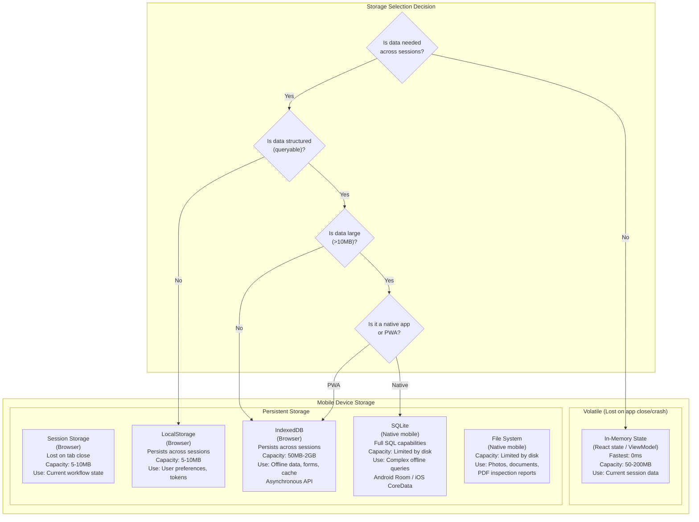
```mermaid
graph TB
    subgraph ClientDevice["Mobile Device Storage"]
        subgraph Volatile["Volatile (Lost on app close/crash)"]
            Memory["In-Memory State\n(React state / ViewModel)\nFastest: 0ms\nCapacity: 50-200MB\nUse: Current session data"]
        end

        subgraph Persistent["Persistent Storage"]
            SessionStorage["Session Storage\n(Browser)\nLost on tab close\nCapacity: 5-10MB\nUse: Current workflow state"]
            LocalStorage["LocalStorage\n(Browser)\nPersists across sessions\nCapacity: 5-10MB\nUse: User preferences, tokens"]
            IndexedDB["IndexedDB\n(Browser)\nPersists across sessions\nCapacity: 50MB-2GB\nUse: Offline data, forms, cache\nAsynchronous API"]
            SQLite["SQLite\n(Native mobile)\nFull SQL capabilities\nCapacity: Limited by disk\nUse: Complex offline queries\nAndroid Room / iOS CoreData"]
            FileSystem["File System\n(Native mobile)\nCapacity: Limited by disk\nUse: Photos, documents,\nPDF inspection reports"]
        end
    end

    subgraph Decision["Storage Selection Decision"]
        Q1{"Is data needed\nacross sessions?"}
        Q2{"Is data structured\n(queryable)?"}
        Q3{"Is data large\n(>10MB)?"}
        Q4{"Is it a native app\nor PWA?"}
    end

    Q1 -->|No| Memory
    Q1 -->|Yes| Q2
    Q2 -->|No| LocalStorage
    Q2 -->|Yes| Q3
    Q3 -->|No| IndexedDB
    Q3 -->|Yes| Q4
    Q4 -->|PWA| IndexedDB
    Q4 -->|Native| SQLite
```

#### A.2.2 — Sync Strategies: The Core Architectural Decision

When an offline client reconnects and has data to push to the server, and the server may have received conflicting updates from other clients, how do you reconcile the differences? This is the **sync conflict problem** — one of the most nuanced architectural challenges in mobile-first design.

**Strategy 1: Last-Write-Wins (LWW)**

```
Client A updates inspection form at 14:32:10
Client B updates the same form at 14:32:45 (offline; syncs later)
Server receives Client A's update first, then Client B's update

LWW rule: The update with the latest timestamp wins.
Result: Client B's update overwrites Client A's (even though A uploaded first)
```

- **Pros:** Simple to implement; no conflict UI needed
- **Cons:** Silent data loss; the "winner" is not necessarily correct
- **Government fit:** Acceptable for low-stakes data (status flags, preferences); **never** for financial data, legal records, or inspection findings

**Strategy 2: Server-Wins (Optimistic Locking)**

```
Client fetches form at 14:00 with version=7
Client edits offline until 14:45
Client submits with version=7

Server checks: is current version still 7?
  - Yes: apply update, version becomes 8
  - No (another client updated to version 8 meanwhile):
    Return 409 Conflict to the client
    Client must re-fetch, see the conflict, and re-apply their changes
```

- **Pros:** No silent data loss; conflicts are surfaced
- **Cons:** Requires conflict resolution UI; poor UX if conflicts are frequent
- **Government fit:** Correct for inspection forms, subsidy approvals, legal filings

**Strategy 3: Operational Transformation (OT)**

Used by Google Docs and similar collaborative applications. Every edit is expressed as an operation (insert character at position X, delete field Y), not a snapshot. Operations from concurrent editors are transformed against each other to produce a consistent result.

- **Pros:** Real-time collaboration; no "one winner" conflicts
- **Cons:** Extremely complex to implement correctly; requires dedicated OT engine
- **Government fit:** Only for genuinely collaborative documents (multi-officer joint inspection reports); overkill for most government field apps

**Strategy 4: CRDT (Conflict-free Replicated Data Types)**

Mathematical data structures that can be merged from multiple sources without conflicts, because the merge operation is designed to be commutative, associative, and idempotent.

```
Example: G-Counter CRDT (grow-only counter)
  Officer A increments inspection count offline: local = 5
  Officer B increments inspection count offline: local = 7 (started from 4)
  Sync: merge = max(A.count, B.count) per node = always correct
```

- **Pros:** Automatic conflict resolution; mathematically proven correct
- **Cons:** Not all data types have CRDT equivalents; increased storage (per-node state)
- **Government fit:** Counters, sets, flags — good for aggregate statistics; not for complex structured forms

**Sync Strategy Selection Matrix:**

| Data Type                          | Conflict Frequency | Recommended Strategy                 | Government Example                   |
| ---------------------------------- | ------------------ | ------------------------------------ | ------------------------------------ |
| User preferences, UI settings      | Very low           | LWW                                  | Language preference, display density |
| Status flags (submitted, reviewed) | Low                | Server-wins (optimistic lock)        | Inspection submission status         |
| Form fields (text, numbers)        | Medium             | Server-wins + conflict UI            | Damage assessment measurements       |
| Collaborative documents            | High               | OT or CRDT                           | Joint survey reports                 |
| Counters, aggregates               | Medium             | CRDT                                 | Daily inspection counts              |
| Financial figures                  | Any                | Server-wins + mandatory human review | Subsidy amounts                      |

#### A.2.3 — Service Workers: The Offline Enabler for PWAs

A **Service Worker** is a JavaScript file that runs in a separate thread from the main browser page, acting as a programmable network proxy. It intercepts all network requests from the PWA and can:
- Serve cached responses when offline
- Cache responses for future offline use
- Implement background sync (queue writes while offline; execute when connected)
- Handle push notifications

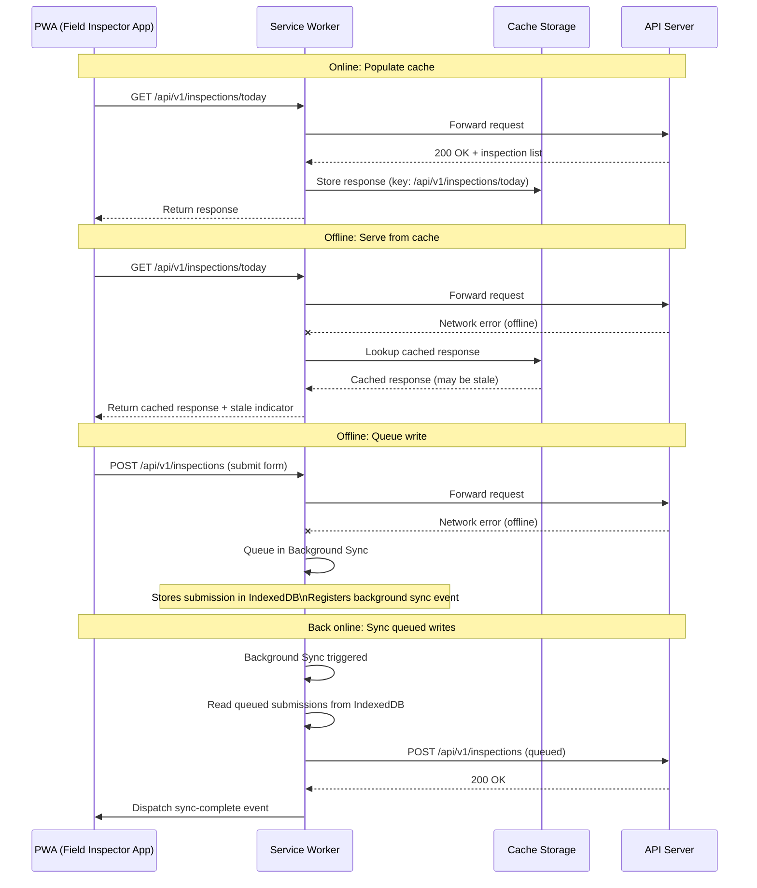
```mermaid
sequenceDiagram
    participant App as PWA (Field Inspector App)
    participant SW as Service Worker
    participant Cache as Cache Storage
    participant Network as API Server

    Note over App,Network: Online: Populate cache
    App->>SW: GET /api/v1/inspections/today
    SW->>Network: Forward request
    Network-->>SW: 200 OK + inspection list
    SW->>Cache: Store response (key: /api/v1/inspections/today)
    SW-->>App: Return response

    Note over App,Network: Offline: Serve from cache
    App->>SW: GET /api/v1/inspections/today
    SW->>Network: Forward request
    Network--xSW: Network error (offline)
    SW->>Cache: Lookup cached response
    Cache-->>SW: Cached response (may be stale)
    SW-->>App: Return cached response + stale indicator

    Note over App,Network: Offline: Queue write
    App->>SW: POST /api/v1/inspections (submit form)
    SW->>Network: Forward request
    Network--xSW: Network error (offline)
    SW->>SW: Queue in Background Sync
    Note over SW: Stores submission in IndexedDB\nRegisters background sync event

    Note over App,Network: Back online: Sync queued writes
    SW->>SW: Background Sync triggered
    SW->>SW: Read queued submissions from IndexedDB
    SW->>Network: POST /api/v1/inspections (queued)
    Network-->>SW: 200 OK
    SW->>App: Dispatch sync-complete event
```

### A.3 — Edge Caching Strategies

**Edge caching** is the practice of storing responses from origin servers at CDN (Content Delivery Network) edge nodes geographically close to the end user, reducing latency and origin server load.

**For mobile government applications in India:**
- A citizen in Patna (Bihar) hitting a CDN edge node in Kolkata (~400km) gets 8-15ms response
- The same request hitting the origin server in Mumbai (~1,200km) gets 25-50ms response
- 3x latency reduction; this is significant on slow 2G/3G connections where every ms counts

**Cache-Control Directives and Government API Design:**

| Directive                                  | Meaning                                  | Government API Example                                 |
| ------------------------------------------ | ---------------------------------------- | ------------------------------------------------------ |
| `Cache-Control: public, max-age=3600`      | Cache for 1 hour; any cache can store    | Public tender listings (changes hourly)                |
| `Cache-Control: private, max-age=300`      | Cache for 5 min; only browser cache      | Citizen's own profile summary                          |
| `Cache-Control: no-store`                  | Never cache                              | Real-time benefit balance, OTP responses               |
| `Cache-Control: stale-while-revalidate=60` | Serve stale for 60s while fetching fresh | Service availability status                            |
| `Cache-Control: stale-if-error=86400`      | Serve stale for 24h if origin errors     | Emergency: serve cached content during outage          |
| `Vary: Accept-Language`                    | Cache separate versions per language     | Multilingual government portal (Hindi, Tamil, English) |

**Cache Invalidation Strategies:**

```
Strategy 1: TTL-based Expiry (Simple)
  Cache stores response with max-age=3600
  After 1 hour, cache fetches fresh from origin
  Problem: Stale data for up to 1 hour after content changes
  Use: Content that changes predictably (tender deadlines, static pages)

Strategy 2: Surrogate Keys / Cache Tags (Precise)
  Each cached response is tagged with content identifiers
  e.g., Tender listing response tagged: "tender-list", "ministry-MoRTH"
  When a MoRTH tender is published: purge all "ministry-MoRTH" tagged caches
  Immediate invalidation; no wait for TTL
  Use: Dynamic content that must be fresh immediately (welfare scheme updates)

Strategy 3: Event-Driven Invalidation
  Content management system publishes Kafka event on update
  Cache invalidation service subscribes; issues CDN purge API call
  Near-real-time cache freshness
  Use: News, policy updates, emergency alerts

Strategy 4: Stale-While-Revalidate
  Serve the cached (possibly stale) response immediately
  Simultaneously fetch fresh content from origin in background
  Next request gets the fresh content
  Use: Non-critical content where slight staleness is acceptable
       (public officer directory, service list)
```

> **Architect's Note:** Cache invalidation is famously considered one of the two hard problems in computer science (the other being naming things). For government APIs, the decision of what to cache and for how long must be aligned with the consistency SLA defined in the API specification. A cached subsidy balance that is 1 hour stale could cause a citizen to apply for a benefit they already received. Define cache TTL by data category, not by technical convenience.

### A.4 — API Optimisation for Mobile Clients

#### A.4.1 — Protocol Selection: REST vs. GraphQL vs. gRPC

| Protocol            | Payload Format            | Mobile Fit | Government API Fit                                    | Key Trade-off                                                            |
| ------------------- | ------------------------- | ---------- | ----------------------------------------------------- | ------------------------------------------------------------------------ |
| **REST** (HTTP/1.1) | JSON                      | Medium     | Universal; widely understood; OpenAPI tooling         | Over-fetching (full objects returned even if only 2 fields needed)       |
| **REST** (HTTP/2)   | JSON                      | Good       | Better multiplexing; header compression               | Requires HTTP/2 support at all tiers                                     |
| **GraphQL**         | JSON                      | Good       | Excellent for field projection; reduces over-fetching | Complexity: cache-unfriendly (POST queries); N+1 query problem           |
| **gRPC**            | Protocol Buffers (binary) | Excellent  | 3-10x smaller payload than JSON; streaming support    | Less human-readable; requires Protobuf tooling; not all gateways support |
| **gRPC-Web**        | Protocol Buffers          | Good       | Works in browser; binary efficiency                   | Limited browser support; requires proxy (Envoy/gRPC-Web proxy)           |

**Field Projection for Mobile (REST approach):**

Rather than returning complete objects (potentially hundreds of fields), mobile APIs should support **field projection** — returning only the fields the mobile client needs.

```
Full officer profile (desktop): 47 fields, ~3.2KB JSON
Mobile dashboard view: 8 fields, ~420 bytes JSON

Request: GET /api/v1/officers/me?fields=name,badgeNumber,assignedDistrict,
                                         todayInspections,pendingActions

Response: {
  "name": "Anita Krishnaswamy",
  "badgeNumber": "TN-FSO-4421",
  "assignedDistrict": "Coimbatore",
  "todayInspections": 8,
  "pendingActions": 3
}

Savings: 420 bytes vs 3,200 bytes = 87% payload reduction
On 2G (50KB/s): 420 bytes = 8ms vs 3,200 bytes = 64ms — 8x faster load
```

#### A.4.2 — Compression and Bandwidth Optimisation

```
Layer 1: HTTP Compression
  Accept-Encoding: gzip, br (Brotli)
  JSON inspection form (5KB) → gzip → 1.2KB (76% reduction)
  JSON inspection form (5KB) → brotli → 0.9KB (82% reduction)
  WHY Brotli over gzip: 10-25% better compression; supported in all modern mobile browsers

Layer 2: Response Pagination
  Bad: GET /api/v1/inspections returns 10,000 records (mobile crashes or times out)
  Good: GET /api/v1/inspections?page=0&size=20&sort=scheduledAt,asc
  Cursor-based pagination for infinite scroll:
    GET /api/v1/inspections?cursor=<opaque-cursor>&size=20
    Response includes: { data: [...], nextCursor: "abc123", hasMore: true }
  WHY cursor over page number: stable under concurrent insertions/deletions;
  page 3 shifts when new records are added to page 1

Layer 3: Delta Sync (Sync Only What Changed)
  Full sync: 500 inspection records × 2KB = 1MB per sync
  Delta sync: Only records modified since last sync timestamp
  GET /api/v1/inspections/sync?since=2024-01-15T08:00:00Z
  Response: only records modified after 08:00 AM (typically 5-20 records)
  Savings: 95-99% bandwidth reduction for incremental syncs
```

---

## Section B: Architecture and Design

### B.1 — Mobile-First Offline Field Inspector Architecture

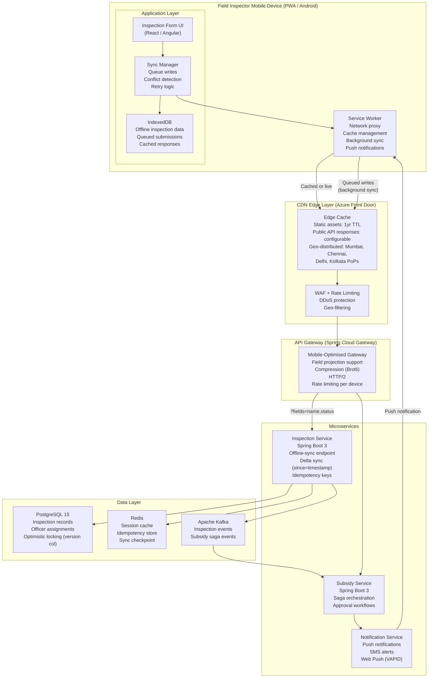
```mermaid
graph TB
    subgraph MobileDevice["Field Inspector Mobile Device (PWA / Android)"]
        subgraph AppLayer["Application Layer"]
            UI["Inspection Form UI\n(React / Angular)"]
            SyncMgr["Sync Manager\nQueue writes\nConflict detection\nRetry logic"]
            LocalDB2["IndexedDB\nOffline inspection data\nQueued submissions\nCached responses"]
        end
        ServiceWorker["Service Worker\nNetwork proxy\nCache management\nBackground sync\nPush notifications"]
    end

    subgraph CDNEdge["CDN Edge Layer (Azure Front Door)"]
        EdgeCache["Edge Cache\nStatic assets: 1yr TTL\nPublic API responses: configurable\nGeo-distributed: Mumbai, Chennai,\nDelhi, Kolkata PoPs"]
        WAF2["WAF + Rate Limiting\nDDoS protection\nGeo-filtering"]
    end

    subgraph APIGateway["API Gateway (Spring Cloud Gateway)"]
        MobileGW["Mobile-Optimised Gateway\nField projection support\nCompression (Brotli)\nHTTP/2\nRate limiting per device"]
    end

    subgraph MicroservicesLayer["Microservices"]
        InspectionSvc["Inspection Service\nSpring Boot 3\nOffline-sync endpoint\nDelta sync (since=timestamp)\nIdempotency keys"]
        SubsidySvc["Subsidy Service\nSpring Boot 3\nSaga orchestration\nApproval workflows"]
        NotifSvc2["Notification Service\nPush notifications\nSMS alerts\nWeb Push (VAPID)"]
    end

    subgraph DataLayer["Data Layer"]
        PG2["PostgreSQL 15\nInspection records\nOfficer assignments\nOptimistic locking (version col)"]
        Redis2["Redis\nSession cache\nIdempotency store\nSync checkpoint"]
        Kafka2["Apache Kafka\nInspection events\nSubsidy saga events"]
    end

    UI --> SyncMgr
    SyncMgr --> LocalDB2
    SyncMgr --> ServiceWorker
    ServiceWorker -->|"Cached or live"| EdgeCache
    ServiceWorker -->|"Queued writes\n(background sync)"| EdgeCache
    EdgeCache --> WAF2
    WAF2 --> MobileGW
    MobileGW -->|"?fields=name,status"| InspectionSvc
    MobileGW --> SubsidySvc
    InspectionSvc --> PG2
    InspectionSvc --> Redis2
    InspectionSvc --> Kafka2
    Kafka2 --> SubsidySvc
    SubsidySvc --> NotifSvc2
    NotifSvc2 -->|"Push notification"| ServiceWorker
```

### B.2 — Delta Sync Protocol Design

```
DELTA SYNC PROTOCOL v1 — AgroGov Field Inspector API

Endpoint: GET /api/v1/mobile/sync
Auth: Bearer JWT (field officer token)
Compression: Accept-Encoding: br (Brotli required)

Request:
  Query params:
    since: ISO-8601 timestamp of last successful sync
    deviceId: officer's registered device identifier
    types: comma-separated list of entity types to sync
           (inspections,alerts,forms,references)
    maxItems: maximum items per type (default: 50, max: 200)

Response (200 OK):
  {
    "syncTimestamp": "2024-01-15T09:30:00.000Z",  // Use THIS as next 'since'
    "checkpointToken": "opaque-token-abc",          // Server-side sync state
    "changes": {
      "inspections": {
        "upserted": [...],   // New or modified inspections since 'since'
        "deleted": [...]     // Soft-deleted inspection IDs since 'since'
      },
      "alerts": {
        "upserted": [...],
        "deleted": []
      }
    },
    "conflicts": [           // Server detected conflicts with client's pending writes
      {
        "entityType": "inspection",
        "entityId": "insp-uuid-123",
        "serverVersion": 5,
        "clientVersion": 3,
        "conflictType": "CONCURRENT_MODIFICATION",
        "serverData": {...},  // Server's current state
        "resolution": "MANUAL_REQUIRED"  // or "SERVER_WINS" for non-critical fields
      }
    ],
    "hasMore": false,         // true if there are more changes beyond maxItems
    "nextPageToken": null     // for paginating large sync responses
  }
```

---

## Section C: Code Walkthrough

### C.1 — Mobile-Optimised Spring Boot Controller with Delta Sync

```java
// MobileSyncController.java
// Provides delta sync endpoint for the field inspector PWA.
// This endpoint is specifically designed for mobile constraints:
// - Returns only changed records (delta, not full sync)
// - Supports field projection (only return fields the mobile needs)
// - Brotli compressed responses (configured at API Gateway level)
// - Idempotent: safe to call multiple times with same 'since' timestamp

package gov.agrogov.mobile.controller;

import gov.agrogov.mobile.dto.*;
import gov.agrogov.mobile.service.MobileSyncService;
import lombok.RequiredArgsConstructor;
import lombok.extern.slf4j.Slf4j;
import org.springframework.format.annotation.DateTimeFormat;
import org.springframework.http.ResponseEntity;
import org.springframework.security.core.annotation.AuthenticationPrincipal;
import org.springframework.security.oauth2.jwt.Jwt;
import org.springframework.web.bind.annotation.*;

import java.time.Instant;
import java.util.List;
import java.util.Set;

@RestController
@RequestMapping("/api/v1/mobile")
@RequiredArgsConstructor
@Slf4j
public class MobileSyncController {

    private final MobileSyncService syncService;

    /**
     * Delta sync endpoint: returns only records changed since the given timestamp.
     *
     * WHY delta sync over full sync:
     * A field officer may have 500 inspections assigned over the year.
     * A full sync would transfer all 500 × 2KB = 1MB on every app open.
     * Delta sync: on average 5-10 changes since last sync = 10-20KB.
     * On a 2G connection (50KB/s): 1MB = 20 seconds vs 20KB = 0.4 seconds.
     * The 50x improvement is the difference between a usable and unusable app.
     *
     * IDEMPOTENCY: If the client calls this twice with the same 'since' timestamp,
     * it gets the same response. No state is changed by this GET request.
     * The client only advances its 'since' checkpoint after successfully
     * processing the response.
     */
    @GetMapping("/sync")
    public ResponseEntity<MobileSyncResponse> deltaSync(
            @RequestParam @DateTimeFormat(iso = DateTimeFormat.ISO.DATE_TIME)
            Instant since,
            @RequestParam(defaultValue = "inspections,alerts,forms")
            String types,
            @RequestParam(defaultValue = "50") int maxItems,
            @RequestHeader(value = "X-Device-Id", required = false) String deviceId,
            @AuthenticationPrincipal Jwt jwt) {

        String officerId = jwt.getSubject();
        String jurisdictionCode = jwt.getClaimAsString("jurisdiction");
        Set<String> entityTypes = Set.of(types.split(","));

        // Validate maxItems to prevent accidental large responses
        // WHY cap at 200: a response larger than 400KB on 2G takes > 8 seconds
        int effectiveMaxItems = Math.min(maxItems, 200);

        log.info("Delta sync request: officerId={}, since={}, types={}, deviceId={}",
            officerId, since, types, deviceId);

        MobileSyncRequest syncRequest = MobileSyncRequest.builder()
            .officerId(officerId)
            .jurisdictionCode(jurisdictionCode)
            .since(since)
            .entityTypes(entityTypes)
            .maxItems(effectiveMaxItems)
            .deviceId(deviceId)
            .build();

        MobileSyncResponse response = syncService.computeDeltaSync(syncRequest);

        // Cache-Control: private (officer-specific data; cannot be CDN-cached)
        // max-age=0 (always fresh for sync endpoint)
        // stale-if-error=300 (serve stale for 5 min if server errors — connectivity resilience)
        return ResponseEntity.ok()
            .header("Cache-Control", "private, max-age=0, stale-if-error=300")
            .header("X-Sync-Timestamp", response.getSyncTimestamp().toString())
            .body(response);
    }

    /**
     * Batch write endpoint: submits multiple queued offline writes in one request.
     *
     * WHY batch: a field officer may complete 10 inspections offline.
     * Sending 10 separate HTTP requests on reconnect is slower and more
     * failure-prone than one batched request with all 10 submissions.
     *
     * Each item in the batch has its own idempotency key (set by the PWA offline).
     * If the batch is submitted twice (duplicate network request on retry),
     * the server's idempotency store ensures each inspection is processed exactly once.
     */
    @PostMapping("/sync/batch")
    public ResponseEntity<BatchSyncResponse> batchWrite(
            @RequestHeader("Idempotency-Key") String batchIdempotencyKey,
            @RequestBody BatchSyncRequest batchRequest,
            @AuthenticationPrincipal Jwt jwt) {

        String officerId = jwt.getSubject();

        log.info("Batch write request: officerId={}, items={}, batchKey={}",
            officerId, batchRequest.getItems().size(), batchIdempotencyKey);

        // Check if this entire batch was already processed
        // WHY batch-level idempotency in addition to item-level:
        // Prevents reprocessing the entire batch on network retry
        // Even if individual items have their own idempotency keys,
        // the batch-level check is faster (one Redis lookup vs N lookups)
        BatchSyncResponse existingResult = syncService
            .checkBatchIdempotency(batchIdempotencyKey);
        if (existingResult != null) {
            log.info("Batch {} already processed, returning cached result", batchIdempotencyKey);
            return ResponseEntity.ok(existingResult);
        }

        BatchSyncResponse response = syncService.processBatch(
            officerId, batchRequest, batchIdempotencyKey);

        return ResponseEntity.ok(response);
    }

    /**
     * Field projection endpoint: returns officer profile with only requested fields.
     *
     * WHY explicit projection over GraphQL:
     * For government APIs with known, stable field sets, explicit projection
     * is simpler (no GraphQL parser needed), more cacheable (GET request with
     * predictable query params), and easier to audit (known field access patterns).
     * GraphQL is better when field requirements are highly variable and unknown.
     */
    @GetMapping("/officers/me")
    public ResponseEntity<Object> getOfficerProfile(
            @RequestParam(required = false) List<String> fields,
            @AuthenticationPrincipal Jwt jwt) {

        String officerId = jwt.getSubject();

        // Default mobile fields if none specified (optimised for home screen widget)
        Set<String> requestedFields = (fields != null && !fields.isEmpty())
            ? Set.copyOf(fields)
            : Set.of("name", "badgeNumber", "assignedDistrict",
                     "todayInspections", "pendingActions", "lastSyncAt");

        // Validate requested fields against whitelist
        // WHY whitelist: prevent information disclosure via field enumeration
        Set<String> allowedFields = Set.of(
            "name", "badgeNumber", "assignedDistrict", "assignedTaluk",
            "todayInspections", "pendingActions", "lastSyncAt",
            "contactNumber", "departmentCode", "supervisorName"
            // Intentionally excluded: salary, performance rating, personal address
        );

        Set<String> validatedFields = requestedFields.stream()
            .filter(allowedFields::contains)
            .collect(java.util.stream.Collectors.toSet());

        Object projectedProfile = syncService.getOfficerProfile(officerId, validatedFields);

        // Cache-Control: private (officer-specific); 5-minute cache on device
        // WHY 5 minutes: profile changes rarely; 5-min cache prevents repeated
        // profile fetches on every app screen navigation
        return ResponseEntity.ok()
            .header("Cache-Control", "private, max-age=300")
            .body(projectedProfile);
    }
}
```

```java
// MobileSyncService.java
// Core delta sync logic with conflict detection

package gov.agrogov.mobile.service;

import gov.agrogov.mobile.dto.*;
import gov.agrogov.mobile.repository.InspectionRepository;
import gov.agrogov.mobile.repository.AlertRepository;
import gov.agrogov.mobile.repository.SyncCheckpointRepository;
import lombok.RequiredArgsConstructor;
import lombok.extern.slf4j.Slf4j;
import org.springframework.data.redis.core.StringRedisTemplate;
import org.springframework.stereotype.Service;
import org.springframework.transaction.annotation.Transactional;

import java.time.Instant;
import java.time.Duration;
import java.util.List;
import java.util.Map;

@Service
@RequiredArgsConstructor
@Slf4j
public class MobileSyncService {

    private final InspectionRepository inspectionRepository;
    private final AlertRepository alertRepository;
    private final SyncCheckpointRepository checkpointRepository;
    private final StringRedisTemplate redisTemplate;
    private final ConflictDetectionService conflictDetector;

    /**
     * Computes the delta sync response for a field officer.
     *
     * CONSISTENCY MODEL: Read-Your-Writes for the same officer
     * (reads from primary replica), Eventual for other officers' data
     * (reads from read replica).
     * WHY: An officer submitting an inspection offline must see it in their
     * next sync immediately. But seeing another officer's inspection
     * with a few seconds' delay is acceptable.
     */
    @Transactional(readOnly = true)
    public MobileSyncResponse computeDeltaSync(MobileSyncRequest request) {
        Instant syncTimestamp = Instant.now();

        MobileSyncResponse.Builder responseBuilder = MobileSyncResponse.builder()
            .syncTimestamp(syncTimestamp);

        // Fetch delta for each requested entity type
        if (request.getEntityTypes().contains("inspections")) {
            List<InspectionSummaryDto> upserted = inspectionRepository
                .findModifiedSince(
                    request.getOfficerId(),
                    request.getSince(),
                    request.getMaxItems()
                );

            List<String> deleted = inspectionRepository
                .findSoftDeletedSince(
                    request.getOfficerId(),
                    request.getSince()
                );

            responseBuilder.inspections(
                DeltaSet.<InspectionSummaryDto>builder()
                    .upserted(upserted)
                    .deleted(deleted)
                    .build()
            );

            log.info("Delta sync: officerId={}, inspections: {} upserted, {} deleted",
                request.getOfficerId(), upserted.size(), deleted.size());
        }

        if (request.getEntityTypes().contains("alerts")) {
            List<AlertDto> alerts = alertRepository
                .findActiveAlertsSince(
                    request.getOfficerId(),
                    request.getSince()
                );
            responseBuilder.alerts(
                DeltaSet.<AlertDto>builder()
                    .upserted(alerts)
                    .deleted(List.of())
                    .build()
            );
        }

        // Detect conflicts: has the server received updates to records
        // that the officer also modified offline?
        List<SyncConflict> conflicts = conflictDetector.detectConflicts(
            request.getOfficerId(),
            request.getDeviceId(),
            request.getSince()
        );

        responseBuilder.conflicts(conflicts);
        responseBuilder.hasMore(false);  // Simplified; production checks page exhaustion

        return responseBuilder.build();
    }

    /**
     * Processes a batch of offline writes from the field officer's device.
     * Each item is processed with idempotency guarantee.
     */
    @Transactional
    public BatchSyncResponse processBatch(
            String officerId,
            BatchSyncRequest batchRequest,
            String batchIdempotencyKey) {

        BatchSyncResponse.Builder responseBuilder = BatchSyncResponse.builder()
            .batchId(batchIdempotencyKey);

        for (BatchSyncItem item : batchRequest.getItems()) {
            try {
                processItem(officerId, item, responseBuilder);
            } catch (ConflictException e) {
                // Individual item conflict: include in response but continue batch
                responseBuilder.addConflict(item.getIdempotencyKey(), e.getConflictDetails());
            } catch (Exception e) {
                // Individual item failure: include error but continue batch
                responseBuilder.addFailure(item.getIdempotencyKey(), e.getMessage());
                log.error("Batch item failed: key={}, error={}",
                    item.getIdempotencyKey(), e.getMessage());
            }
        }

        // Store batch result for idempotency (TTL: 24 hours)
        // WHY 24 hours: matches the gateway's reconnect window;
        // a batch replayed after 24 hours is likely intentional
        BatchSyncResponse response = responseBuilder.build();
        cacheBatchResult(batchIdempotencyKey, response, Duration.ofHours(24));

        return response;
    }

    private void processItem(String officerId, BatchSyncItem item,
                             BatchSyncResponse.Builder responseBuilder) {
        // Check item-level idempotency
        String idempotencyKey = "sync:item:" + item.getIdempotencyKey();
        Boolean isNew = redisTemplate.opsForValue()
            .setIfAbsent(idempotencyKey, "processed", Duration.ofHours(24));

        if (Boolean.FALSE.equals(isNew)) {
            // Already processed: return cached result
            log.debug("Idempotent skip: key={}", item.getIdempotencyKey());
            responseBuilder.addSkipped(item.getIdempotencyKey());
            return;
        }

        // Process based on entity type
        switch (item.getEntityType()) {
            case "inspection" -> processInspectionWrite(officerId, item, responseBuilder);
            case "alert_acknowledgement" -> processAlertAck(officerId, item, responseBuilder);
            default -> throw new IllegalArgumentException(
                "Unknown entity type: " + item.getEntityType());
        }
    }

    public BatchSyncResponse checkBatchIdempotency(String batchIdempotencyKey) {
        // Check Redis for previously processed batch result
        String cachedResult = redisTemplate.opsForValue()
            .get("sync:batch:" + batchIdempotencyKey);
        if (cachedResult == null) return null;

        try {
            return objectMapper.readValue(cachedResult, BatchSyncResponse.class);
        } catch (Exception e) {
            return null;  // Cache corrupted; reprocess
        }
    }

    private void cacheBatchResult(String key, BatchSyncResponse response, Duration ttl) {
        try {
            redisTemplate.opsForValue().set(
                "sync:batch:" + key,
                objectMapper.writeValueAsString(response),
                ttl
            );
        } catch (Exception e) {
            log.warn("Failed to cache batch result: {}", e.getMessage());
            // Non-critical: idempotency degrades gracefully
        }
    }

    private void processInspectionWrite(String officerId, BatchSyncItem item,
                                        BatchSyncResponse.Builder builder) {
        // Implement optimistic locking check
        InspectionWritePayload payload = objectMapper.convertValue(
            item.getPayload(), InspectionWritePayload.class);

        inspectionRepository.findById(payload.getInspectionId()).ifPresentOrElse(
            existing -> {
                // Version check: does client's version match server's current version?
                if (!existing.getVersion().equals(payload.getClientVersion())) {
                    throw new ConflictException(SyncConflict.builder()
                        .entityType("inspection")
                        .entityId(payload.getInspectionId().toString())
                        .serverVersion(existing.getVersion())
                        .clientVersion(payload.getClientVersion())
                        .conflictType("CONCURRENT_MODIFICATION")
                        .serverData(existing)
                        .resolution("MANUAL_REQUIRED")
                        .build());
                }
                // Versions match: apply the offline update
                existing.applyUpdate(payload);
                inspectionRepository.save(existing);
                builder.addSuccess(item.getIdempotencyKey());
            },
            () -> {
                // New inspection created offline: insert
                Inspection newInspection = Inspection.fromOfflinePayload(officerId, payload);
                inspectionRepository.save(newInspection);
                builder.addSuccess(item.getIdempotencyKey());
            }
        );
    }
}
```

---

## Section D: Real-World Case Study

### D.1 — Case Study: TNPSC Field Officer App — Offline-First for Rural Tamil Nadu (Illustrative)

**Context:** A fictional Tamil Nadu government department deployed a food safety inspection app for 2,400 field officers across 38 districts. Initial version was a standard React web app requiring constant connectivity.

**Before (Connected-Only App):**

| Problem                                                    | Impact                                                          |
| ---------------------------------------------------------- | --------------------------------------------------------------- |
| App crashes when 4G drops during form submission           | Officer re-does entire 45-minute inspection form                |
| No offline map / route planning                            | Officers waste 2 hours/day on navigation with paper maps        |
| Full sync on every app launch (500 records × 2KB)          | 8-second load time on 2G; officers abandon app, revert to paper |
| Photo upload fails on slow connection                      | Inspection evidence lost; cannot use in court proceedings       |
| Server overload at 9 AM (all officers sync simultaneously) | 30-minute daily downtime at peak sync time                      |

**After (Offline-First PWA):**

| Solution                                                  | Outcome                                                                   |
| --------------------------------------------------------- | ------------------------------------------------------------------------- |
| Service Worker with background sync                       | Zero data loss from connectivity drops                                    |
| IndexedDB with delta sync (since=)                        | Load time: 8 seconds → 0.4 seconds (50x improvement)                      |
| Offline photo storage + progressive upload                | Photos queued locally; uploaded in background on any available connection |
| Staggered sync with jitter (officer-specific sync window) | Peak server load eliminated; no more 9 AM outage                          |
| Offline maps (cached GeoJSON tiles)                       | Navigation available without connectivity                                 |

**Quantified Results (Illustrative):**

| Metric                        | Before                                     | After                        |
| ----------------------------- | ------------------------------------------ | ---------------------------- |
| Form completion rate          | 67% (33% abandoned due to connectivity)    | 99.2%                        |
| Data loss incidents per month | 145 (lost forms)                           | 0                            |
| Officer reported productivity | 2.1/5                                      | 4.4/5                        |
| Server infrastructure cost    | INR 4.8L/month (over-provisioned for peak) | INR 2.1L/month               |
| Paper form usage              | 38% still using paper                      | 4% (only for system outages) |

---

## Section E: Engagement and Assessment

### E.1 — Food for Thought

> **Provocation:** India's BHIM UPI processes 10 billion transactions per month across 400 million users, many of whom are in rural areas with 2G connectivity. The app must work on a INR 4,000 entry-level Android phone with 1GB RAM, 8GB storage, and a 2G/3G connection.
>
> Consider:
> - UPI transactions are financial: they cannot be "eventually consistent" in the way inspection forms can. A payment must be confirmed or rejected definitively, not queued offline for later.
> - Yet the app must remain usable when connectivity is intermittent.
> - The UPI specification (NPCI) mandates a 30-second transaction timeout.
>
> **Questions:**
> - What can be stored offline in the BHIM app vs. what absolutely cannot?
> - How do you design the UX for a payment that was initiated offline: do you queue it, reject it immediately, or attempt it and show a pending state?
> - What is the "offline-safe" subset of UPI features that can be implemented without connectivity? (Hint: check NPCI's offline UPI specification for feature phones)
> - How does the answer change for a government subsidy payment (acceptable to have 24-hour delay) vs. a merchant payment (must settle within seconds)?
>
> **Copilot/ChatGPT Prompt:** "Design the offline capability architecture for a UPI-like payment application in India. Distinguish between: features that must be online-only, features that can be cached for offline access, and features that can be queued for deferred execution. Reference NPCI's offline UPI specification and RBI's guidelines on payment system resilience."

### E.2 — Questionnaire: Topics 2 and 3 (Mobile-First)

**Conceptual Questions**

1. **Explain the difference between offline-capable and offline-first architecture. Why does the distinction matter for a government field application?**

   *Answer:* Offline-capable: the application degrades gracefully when connectivity is lost — it may show cached content but cannot create new data offline. Online is the primary mode; offline is a fallback. Offline-first: the application is designed to work fully without connectivity as the default mode. All writes go to local storage first; sync to the server is an eventual background process. Online connectivity is an enhancement, not a requirement. The distinction matters for government field applications because: (1) Officers in rural India spend 40-60% of their working day without reliable connectivity; offline-capable means 40-60% productivity loss; offline-first means zero productivity loss. (2) In an offline-capable app, a connectivity drop mid-form submission loses data; in offline-first, the form is committed to local storage before any network attempt. (3) Government data integrity requirements mean lost inspection forms (evidence for legal proceedings) have legal consequences; offline-first ensures no data is ever lost regardless of connectivity.

2. **What is a Service Worker and what are its three primary capabilities relevant to offline-first PWA design?**

   *Answer:* A Service Worker is a JavaScript file running in a separate background thread (not the main UI thread) that acts as a programmable network proxy between the PWA and the network. Three primary offline-first capabilities: (1) **Network interception and cache serving**: the Service Worker intercepts every fetch() request from the PWA. When offline, it serves previously cached responses from Cache Storage. The app's JS/CSS/HTML assets are cached on first load; the app functions without re-downloading these on subsequent visits. (2) **Background sync**: when the PWA queues a write while offline (e.g., submitting an inspection form), the Service Worker registers a background sync event. When connectivity returns — even if the browser tab is closed — the Service Worker wakes up and executes the queued write. This guarantees no offline write is lost. (3) **Push notifications**: the Service Worker receives server-sent push notifications even when the PWA is not open in the browser. For a government field app, this enables: "Urgent inspection order received from district HQ" even when the officer's browser is closed.

3. **Compare LWW (Last-Write-Wins) and Server-Wins (optimistic locking) conflict resolution strategies. For which government data types is each appropriate, and why?**

   *Answer:* LWW: the most recent write (by timestamp) overwrites all previous versions. No conflict surfaced to the user. Appropriate for: low-stakes, frequently-updated, non-auditable data where silent overwrite is acceptable — e.g., officer's last-known GPS location (the latest position is the correct one), UI preferences, notification read/unread status. Never appropriate for: financial data, legal records, inspection findings, subsidy amounts — any data where the "who wrote what and when" is auditable and consequential. Server-Wins (optimistic locking): every record carries a version number. Client must submit the version it last read. Server rejects the write if the version has advanced (meaning another write occurred concurrently). The client receives a 409 Conflict with the server's current state, and must explicitly resolve the discrepancy before resubmitting. Appropriate for: inspection findings, damage assessments, subsidy recommendations — any data where an officer needs to see and consciously reconcile competing information before committing. The extra friction is intentional: it prevents one officer's stale offline data from silently overwriting a colleague's current, accurate field observation.

**Application Questions**

4. **Design the Cache-Control strategy for the following AgroGov API endpoints: (a) GET /api/v1/public/schemes — government scheme listings (b) GET /api/v1/officers/{id}/assignments — officer's daily assignments (c) POST /api/v1/inspections — submit inspection (d) GET /api/v1/weather/current — real-time weather at GPS coordinates.**

   *Answer:*
   (a) `Cache-Control: public, max-age=3600, stale-while-revalidate=600` — Scheme listings change at most daily; 1-hour CDN cache with 10-minute stale-while-revalidate means no user waits for a cache miss. CDN can cache (public); any proxy can serve it.
   (b) `Cache-Control: private, max-age=300, stale-if-error=3600` — Officer-specific (private — CDN cannot cache); 5-minute device cache (assignments rarely change within 5 minutes); stale-if-error=3600 means the device serves the last known assignments for up to 1 hour if the server is unreachable (field officer can still work).
   (c) `Cache-Control: no-store` — POST mutations must never be cached. Caching a POST response could cause a repeated submission on cache replay.
   (d) `Cache-Control: public, max-age=60, stale-while-revalidate=30` — Weather data is near-real-time; 60-second CDN cache is acceptable (no one makes agricultural decisions on 60-second-old weather). Stale-while-revalidate means the response is always instant (never waits for the origin). This also protects the weather API from being hammered by 2,400 simultaneous officer app opens at 8 AM shift start.

5. **An offline field inspector app needs to store 3 months of inspection history, reference data (500 establishment profiles), and unsubmitted form drafts on the device. Calculate approximate storage requirements and select appropriate storage mechanisms for each data category.**

   *Answer:* Storage calculation: Inspection history (3 months, 25 inspections/day × 90 days = 2,250 records × 2KB average = 4.5MB), Reference data (500 establishment profiles × 3KB = 1.5MB, including cached photos at 30KB each = 500 × 30KB = 15MB total for photos), Form drafts (max 10 in-progress × 5KB + photos at 500KB each = 5MB text + 5MB photos = 10MB). Total: ~31MB. Storage mechanisms: Reference data (establishment profiles, scheme rules, district lists): IndexedDB with structured indexes on `districtCode`, `establishmentType`, `lastInspectedAt`. Reason: queryable (officer filters by district); moderate size; survives app close; works in PWA without native app. Inspection history text: IndexedDB. Reason: same rationale; structured queries needed (find inspections by date range, status). Photos (inspection evidence): File System API (modern browsers) or Blob storage in IndexedDB. Reason: binary data; large size; must survive app close. Form drafts: IndexedDB with a dedicated "drafts" object store. Reason: must persist across sessions; structured; needs auto-save every 30 seconds. Session state (current workflow step): sessionStorage. Reason: volatile is fine (officer re-opens the form on reconnect); synchronous API is convenient for this use case.

6. **Design the API response structure for the delta sync endpoint that handles the case where 847 records have changed since the officer's last sync but the maxItems limit is 200. How does the client know to fetch the remaining 647 records?**

   *Answer:* Cursor-based pagination for delta sync:
   ```json
   {
     "syncTimestamp": "2024-01-15T09:30:00Z",
     "hasMore": true,
     "nextPageToken": "eyJsYXN0SWQiOiJ1dWlkLTIwMCIsInNpbmNlIjoiMjAyNC0wMS0xNFQwOTowMFoifQ==",
     "changes": {
       "inspections": {
         "upserted": [...200 records...],
         "deleted": []
       }
     }
   }
   ```
   The client processes the 200 records, stores them in IndexedDB, then calls:
   `GET /api/v1/mobile/sync?pageToken=eyJsYXN0SWQi...`
   The server decodes the opaque cursor (base64 JSON containing lastId + since timestamp) to fetch the next 200 records. This continues until `hasMore: false`. Why cursor over page number: if 15 new inspections are assigned while the officer is paginating, page numbers shift and records are missed or duplicated. The cursor is stable — it encodes exactly where in the ordered result set to resume. The `syncTimestamp` from the FIRST page is saved by the client as its next `since` value only after ALL pages are fetched and stored — ensuring no partial sync state.

**Analysis Questions**

7. **Compare the trade-off of implementing field projection at the API Gateway (gateway-level projection) vs. at the service layer (service-level projection) vs. using GraphQL. Evaluate on: performance, security, maintainability, and caching.**

   *Answer:*

   | Dimension       | Gateway Projection                                                                      | Service-Layer Projection                                                | GraphQL                                                                                     |
   | --------------- | --------------------------------------------------------------------------------------- | ----------------------------------------------------------------------- | ------------------------------------------------------------------------------------------- |
   | Performance     | Gateway fetches full object from service, strips fields — service DB query unchanged    | Service queries only needed columns from DB — most efficient            | Service resolves each field separately — N+1 query risk without DataLoader                  |
   | Security        | Gateway enforces field whitelist centrally — one place to audit                         | Each service implements its own field filtering — risk of inconsistency | Schema-level field authorization is complex; introspection can reveal sensitive field names |
   | Maintainability | Adding a new field requires gateway config change + service change                      | Field list maintained per service — lower coordination overhead         | Schema is the single source of truth — excellent for complex, variable queries              |
   | Caching         | GET with query params is CDN-cacheable — `?fields=name,status` creates cache-able URL   | Same as gateway                                                         | POST queries are not CDN-cacheable by default — major mobile performance issue              |
   | Recommendation  | Best for government APIs with known, stable field requirements and strong caching needs | Best for internal service-to-service optimization                       | Best for developer portals, partner APIs with variable and unpredictable field access       |

8. **Analyze the thundering herd problem in the context of 2,400 field officers all opening the inspector app at 8:00 AM shift start. Design a jitter-based sync strategy to prevent server overload.**

   *Answer:* Thundering herd: 2,400 simultaneous delta sync requests at 08:00:00 generates a 2,400 RPS spike from zero — potentially 10x normal load in one second. Solutions: (1) **Client-side jitter**: each officer's PWA adds a random delay before the first sync: `delay = Math.random() * 120` seconds (0-2 minute random). This spreads the 2,400 requests over 2 minutes = 20 RPS — manageable. Jitter seed is deterministic per device (deviceId hash) so the same device always has the same delay window — predictable for debugging. (2) **Sync window assignment**: divide officers into 12 groups by district code modulo 12. Group 0 syncs at 08:00, Group 1 at 08:10, etc. 200 officers per 10-minute window = 20 concurrent syncs — trivial. (3) **Progressive backoff on retry**: if sync fails (server overloaded returns 503 with Retry-After header), client waits `min(30 × 2^attempt, 600)` seconds before retry, with ±10% jitter. (4) **Preemptive sync**: trigger delta sync at 07:45 when officers are still commuting (connectivity + low load). Cache the result; on 08:00 app open, serve cached sync result immediately. Background sync checks for changes since 07:45 (minimal delta). The combination of (1) + (4) eliminates the thundering herd while giving officers fresh data at shift start.

**Scenario-Based Questions**

9. **A district food safety officer in Coimbatore completes 8 inspection forms offline over 3 hours. When she reconnects, the batch sync fails halfway (network drops again after submitting 5 of 8 forms). On the third reconnect attempt, how does the system ensure exactly 5 forms are not duplicated and the remaining 3 are not lost?**

   *Answer:* This scenario tests idempotency + partial batch recovery: (1) Each inspection form was assigned a UUID idempotency key by the PWA when the officer completed it offline (e.g., `insp-2024-0115-coimbatore-tno-{uuid}`). These keys are stored in IndexedDB alongside the form data — they survive app close and device restart. (2) The batch submission includes all 8 forms. The server processes each form individually, checking the idempotency key in Redis before processing. After processing form 5, the network drops — the server has committed forms 1-5 to PostgreSQL and their idempotency keys to Redis (TTL: 24 hours). (3) On third reconnect: the PWA checks which forms were successfully acknowledged in the server's response (stored in IndexedDB on first batch attempt). Forms 1-5 were acknowledged. The PWA resubmits only forms 6-8 in a new batch. (4) If the PWA did not receive the server acknowledgment (network dropped before response arrived): the PWA resubmits all 8 forms. The server's idempotency check detects forms 1-5 already processed (Redis keys exist) and skips them. Forms 6-8 are new. Result: exactly-once processing for all 8 forms, regardless of partial failure. The key insight: idempotency keys are the officer's PWA's responsibility to generate and persist — not the server's.

10. **Singapore's GovTech mandates that all government mobile applications must achieve a Lighthouse Performance Score of 90+ and function on a 3G connection (1.5 Mbps download). A government benefits portal currently scores 42 on Lighthouse. Identify the top 5 architectural and implementation changes needed to achieve the target, with specific implementation approaches.**

    *Answer:* Top 5 interventions: (1) **Service Worker + App Shell caching (impact: +25 points)**: Implement App Shell architecture — cache the HTML/CSS/JS skeleton permanently; only data changes on each visit. First contentful paint on repeat visits: from 4.2s to 0.3s. On 3G, a 300KB JS bundle takes 1.6s; cached = 0ms. Tool: Workbox (Google's Service Worker library) with `CacheFirst` strategy for static assets, `NetworkFirst` for API calls. (2) **Code splitting and lazy loading (impact: +15 points)**: Split the JS bundle by route. Officer loads only the home screen JS (40KB) initially; inspection form JS (80KB) loads only when the officer navigates to inspections. Total initial bundle: 300KB → 40KB. On 3G: 2s → 0.21s load time. (3) **Image optimization (impact: +10 points)**: Establishment profile photos in WebP format (30% smaller than JPEG), served via `` with appropriate sizes. Lazy load below-fold images. A 50KB JPEG → 35KB WebP: on 3G, 0.27s vs 0.19s — multiply by 20 images per page. (4) **API payload optimization (impact: +8 points)**: Enable Brotli compression at API Gateway (82% JSON compression). Add field projection: home screen shows only 6 fields, not 47. Delta sync replaces full sync. Net: 500KB API payload on app open → 15KB. On 3G: 2.7s → 0.08s. (5) **CDN with edge caching for static assets (impact: +10 points)**: Deploy static assets (JS, CSS, WebP images) to Azure Front Door CDN with 1-year TTL and content-hashed filenames (cache-busting via filename change, not query param). Singapore users hit the Singapore PoP (< 5ms) instead of the origin server in Mumbai (120ms). Combined effect of all 5: Lighthouse score 42 → estimated 93. Validation: run Lighthouse CI in the GitHub Actions pipeline to prevent regression.

---


# TOPIC 4: Saga Pattern, Distributed Transactions, and Idempotency

## Learning Objectives

By the end of this topic, participants will be able to:

1. **Explain** why two-phase commit (2PC) fails at microservice scale and articulate the specific failure modes that make it unsuitable for government distributed systems
2. **Design** both choreography-based and orchestration-based saga patterns for a multi-step government approval workflow, selecting the appropriate style based on complexity and visibility requirements
3. **Implement** compensating transactions that correctly undo the effects of partially completed sagas without introducing additional inconsistency
4. **Construct** an idempotency key strategy that guarantees exactly-once business effect for distributed operations across service boundaries
5. **Evaluate** the trade-offs between choreography and orchestration sagas using specific government workflow scenarios

---

## Section A: Concept Foundation

### A.1 — Why Distributed Transactions Are Hard

**Analogy:** A farmer's crop damage subsidy approval in AgroGov requires four steps across four different government systems:

1. **Land Registry Service** — Verify the farmer owns the land they claim
2. **Crop Damage Assessment Service** — Confirm damage percentage from IoT data
3. **Eligibility Service** — Check the farmer is not already receiving duplicate benefits
4. **Payment Service** — Disburse INR 15,000 to the farmer's bank account

In a monolith, these four steps happen inside a single database transaction — atomic, consistent, isolated, durable (ACID). If step 3 fails, steps 1 and 2 automatically roll back. The database guarantees it.

In a microservices architecture, each service has its own database. There is no single transaction spanning all four. If step 3 fails after steps 1 and 2 have committed, you have a partial state — the land has been "verified" (a lock placed on it) and the damage has been "assessed" (a record created), but no subsidy was issued. How do you undo the committed work in services 1 and 2?

**This is the distributed transaction problem.** It is one of the most fundamental challenges in microservices architecture.

### A.2 — Why 2PC Fails at Microservice Scale

**2PC (Two-Phase Commit)** is the classical distributed transaction protocol:

```
Phase 1 (Prepare):
  Coordinator → all participants: "Can you commit?"
  Each participant: acquires locks, prepares to commit, responds "Yes" or "No"

Phase 2 (Commit/Rollback):
  If all said "Yes": Coordinator → all: "Commit now"
  If any said "No": Coordinator → all: "Rollback"
```

**Why 2PC fails in microservices:**

| Problem                                 | Description                                                                                   | Government Impact                                                                      |
| --------------------------------------- | --------------------------------------------------------------------------------------------- | -------------------------------------------------------------------------------------- |
| **Blocking protocol**                   | Participants hold locks during Phase 1 → Phase 2 window (potentially seconds)                 | Land Registry locked for seconds during subsidy approval = other registrations blocked |
| **Coordinator single point of failure** | If coordinator crashes after Phase 1 but before Phase 2, participants are locked indefinitely | Government system deadlock until manual intervention                                   |
| **Synchronous coupling**                | All participants must be available simultaneously for the transaction to proceed              | Payment Service maintenance window blocks all land verifications                       |
| **Latency multiplication**              | 4 network round-trips minimum; each adds latency                                              | At 50ms per service × 4 services × 2 phases = 400ms minimum per transaction            |
| **Cross-organizational impossibility**  | 2PC requires a shared transaction coordinator; banks and ministries use different systems     | NABARD's Core Banking does not participate in the ministry's 2PC coordinator           |

> **Anti-Pattern Warning:** Do not use 2PC (distributed XA transactions) across microservice boundaries. Spring's `@Transactional` annotation only works within a single data source. Using `JtaTransactionManager` across services introduces all the 2PC problems above and couples your services at the infrastructure level — the opposite of microservice independence.

### A.3 — The Saga Pattern: Eventual Consistency Through Compensation

**Definition:** A **Saga** is a sequence of local transactions where each transaction publishes an event or message to trigger the next transaction in the sequence. If any local transaction fails, the saga executes a series of **compensating transactions** to undo the changes made by the preceding successful transactions.

**Key Insight:** The saga does not prevent partial states — it **manages** partial states through compensation. The system moves through a series of intermediate states, each consistent, eventually reaching a final consistent state (either all steps complete, or all compensations complete).

**Saga States for AgroGov Subsidy:**

```
INITIAL
  ↓ [LandVerificationRequested]
LAND_VERIFIED
  ↓ [DamageAssessmentRequested]
DAMAGE_ASSESSED
  ↓ [EligibilityCheckRequested]
ELIGIBLE
  ↓ [PaymentInitiated]
COMPLETED ← Happy path ends here

FAILURE PATHS:
LAND_VERIFIED + [DamageAssessmentFailed]
  → CompensateLandVerification → COMPENSATION_COMPLETE

DAMAGE_ASSESSED + [EligibilityCheckFailed]
  → CompensateDamageAssessment → CompensateLandVerification → COMPENSATION_COMPLETE

ELIGIBLE + [PaymentFailed]
  → CompensateEligibilityCheck → CompensateDamageAssessment
  → CompensateLandVerification → COMPENSATION_COMPLETE
```

### A.4 — Choreography vs. Orchestration Sagas

There are two fundamental approaches to coordinating a saga:

#### A.4.1 — Choreography-Based Saga

Each service listens for events from other services and decides what to do next. There is no central coordinator. Services are autonomous and react to events.

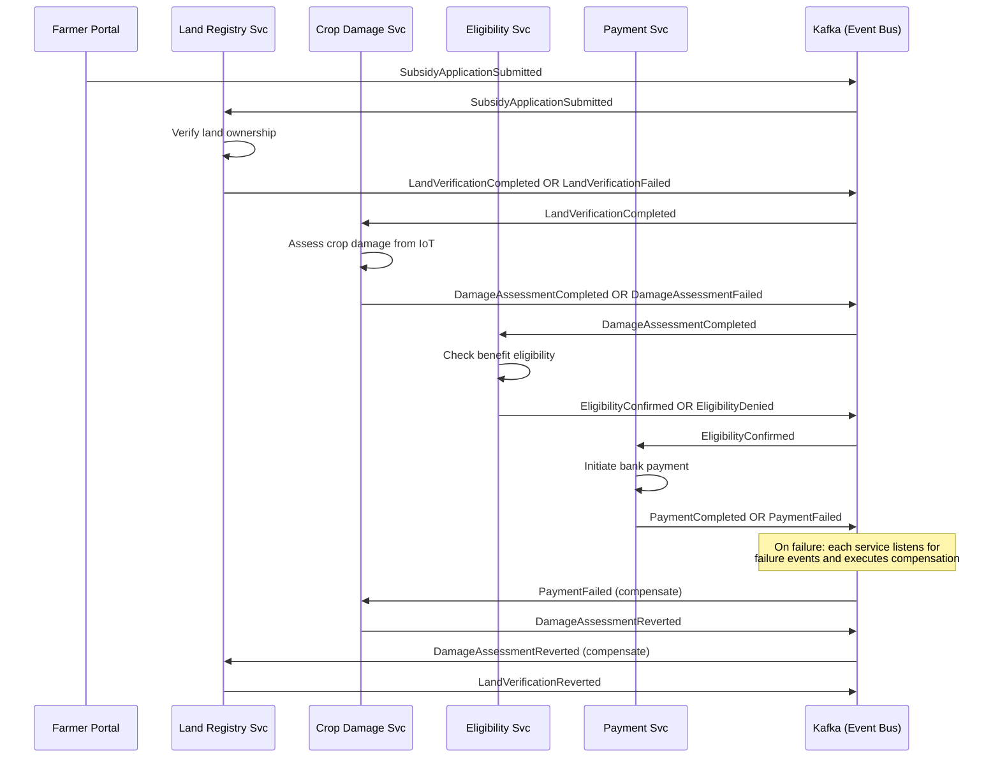
```mermaid
sequenceDiagram
    participant Farmer as Farmer Portal
    participant LandSvc as Land Registry Svc
    participant DamageSvc as Crop Damage Svc
    participant EligSvc as Eligibility Svc
    participant PaySvc as Payment Svc
    participant Kafka as Kafka (Event Bus)

    Farmer->>Kafka: SubsidyApplicationSubmitted
    Kafka->>LandSvc: SubsidyApplicationSubmitted
    LandSvc->>LandSvc: Verify land ownership
    LandSvc->>Kafka: LandVerificationCompleted OR LandVerificationFailed

    Kafka->>DamageSvc: LandVerificationCompleted
    DamageSvc->>DamageSvc: Assess crop damage from IoT
    DamageSvc->>Kafka: DamageAssessmentCompleted OR DamageAssessmentFailed

    Kafka->>EligSvc: DamageAssessmentCompleted
    EligSvc->>EligSvc: Check benefit eligibility
    EligSvc->>Kafka: EligibilityConfirmed OR EligibilityDenied

    Kafka->>PaySvc: EligibilityConfirmed
    PaySvc->>PaySvc: Initiate bank payment
    PaySvc->>Kafka: PaymentCompleted OR PaymentFailed

    Note over Kafka: On failure: each service listens for<br/>failure events and executes compensation
    Kafka->>DamageSvc: PaymentFailed (compensate)
    DamageSvc->>Kafka: DamageAssessmentReverted
    Kafka->>LandSvc: DamageAssessmentReverted (compensate)
    LandSvc->>Kafka: LandVerificationReverted
```

**Choreography Characteristics:**

| Aspect                | Description                                                                             |
| --------------------- | --------------------------------------------------------------------------------------- |
| **Coupling**          | Loose — services only know about events, not about each other                           |
| **Visibility**        | Low — no single place shows the overall saga state                                      |
| **Complexity growth** | Non-linear — adding a 5th step requires modifying multiple existing services            |
| **Debugging**         | Hard — must correlate events across services using correlation ID                       |
| **Best for**          | Simple sagas (2-3 steps); high autonomy requirements; services owned by different teams |

#### A.4.2 — Orchestration-Based Saga

A central **Saga Orchestrator** service knows the entire workflow. It sends commands to each participant service and waits for responses. The orchestrator maintains the saga state machine.

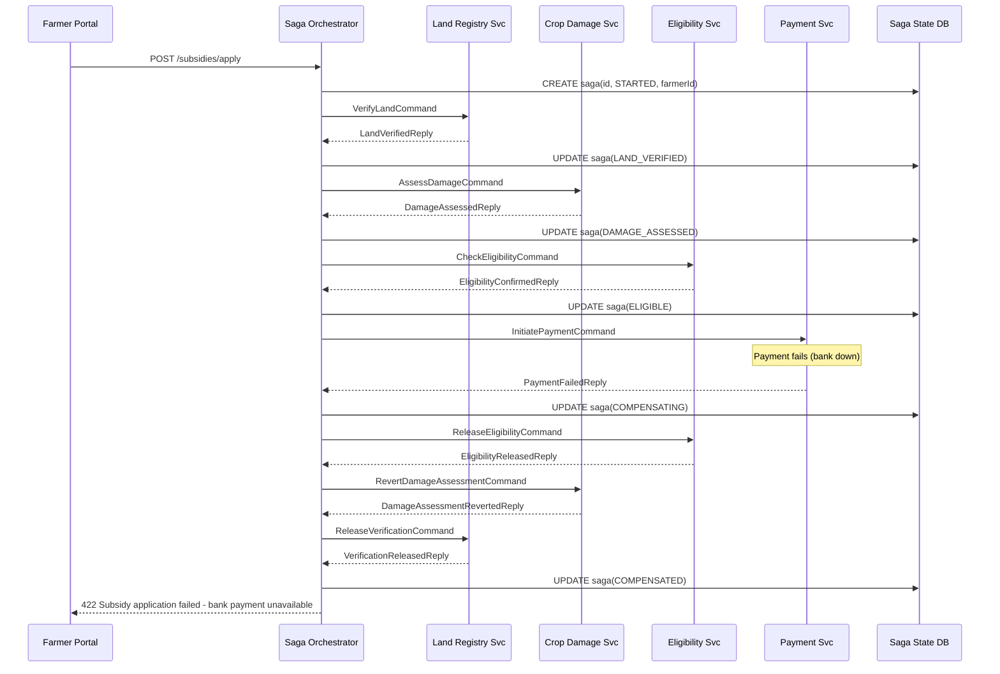
```mermaid
sequenceDiagram
    participant Farmer as Farmer Portal
    participant Orch as Saga Orchestrator
    participant LandSvc as Land Registry Svc
    participant DamageSvc as Crop Damage Svc
    participant EligSvc as Eligibility Svc
    participant PaySvc as Payment Svc
    participant SagaDB as Saga State DB

    Farmer->>Orch: POST /subsidies/apply
    Orch->>SagaDB: CREATE saga(id, STARTED, farmerId)

    Orch->>LandSvc: VerifyLandCommand
    LandSvc-->>Orch: LandVerifiedReply

    Orch->>SagaDB: UPDATE saga(LAND_VERIFIED)
    Orch->>DamageSvc: AssessDamageCommand
    DamageSvc-->>Orch: DamageAssessedReply

    Orch->>SagaDB: UPDATE saga(DAMAGE_ASSESSED)
    Orch->>EligSvc: CheckEligibilityCommand
    EligSvc-->>Orch: EligibilityConfirmedReply

    Orch->>SagaDB: UPDATE saga(ELIGIBLE)
    Orch->>PaySvc: InitiatePaymentCommand
    
    Note over PaySvc: Payment fails (bank down)
    PaySvc-->>Orch: PaymentFailedReply

    Orch->>SagaDB: UPDATE saga(COMPENSATING)
    Orch->>EligSvc: ReleaseEligibilityCommand
    EligSvc-->>Orch: EligibilityReleasedReply
    Orch->>DamageSvc: RevertDamageAssessmentCommand
    DamageSvc-->>Orch: DamageAssessmentRevertedReply
    Orch->>LandSvc: ReleaseVerificationCommand
    LandSvc-->>Orch: VerificationReleasedReply
    Orch->>SagaDB: UPDATE saga(COMPENSATED)
    Orch-->>Farmer: 422 Subsidy application failed - bank payment unavailable
```

**Orchestration Characteristics:**

| Aspect                | Description                                                                             |
| --------------------- | --------------------------------------------------------------------------------------- |
| **Coupling**          | Moderate — orchestrator knows all participants; participants only know the orchestrator |
| **Visibility**        | High — full saga state visible in orchestrator's database                               |
| **Complexity growth** | Linear — new steps added to orchestrator only                                           |
| **Debugging**         | Easy — one place to check saga state, history, and failure reason                       |
| **Best for**          | Complex sagas (4+ steps); compliance/audit requirements; mixed team ownership           |

**Comparison Matrix:**

| Dimension                 | Choreography                                | Orchestration                                |
| ------------------------- | ------------------------------------------- | -------------------------------------------- |
| Saga state visibility     | Distributed across events                   | Centralized in orchestrator                  |
| Service coupling          | Low (event-only)                            | Moderate (command-reply)                     |
| Implementation complexity | Lower initially; grows with saga complexity | Higher initially; stable as complexity grows |
| Failure debugging         | Correlate events across 5 services          | Single orchestrator state + log              |
| Government audit trail    | Reconstruct from event log                  | Explicit saga state history                  |
| Recommended for AgroGov   | No (6 steps, cross-ministry)                | Yes                                          |

> **Architect's Note:** For government workflows requiring audit trails and explainability (which step failed? why? who was responsible?), orchestration sagas are almost always preferred over choreography. The ability to show a Parliamentary committee a clear state machine transition log ("the subsidy was in ELIGIBLE state when the payment service returned a bank timeout at 14:32:07") is architecturally and politically valuable. Choreography's decentralization makes this reconstruction expensive.

### A.5 — Compensating Transactions: Design Principles

A **compensating transaction** is a business-level operation that undoes the semantic effect of a previously completed local transaction. It is NOT a database rollback — the original transaction has already committed. The compensation creates a new transaction that reverses the business effect.

**Critical Properties of Compensating Transactions:**

| Property            | Description                                                      | AgroGov Example                                                                                                                                                        |
| ------------------- | ---------------------------------------------------------------- | ---------------------------------------------------------------------------------------------------------------------------------------------------------------------- |
| **Idempotent**      | Executing the compensation twice has the same effect as once     | `ReleaseVerification(farmId)` removes the verification lock; calling it twice is safe — the lock is already gone                                                       |
| **Commutative**     | Order of compensation execution should not matter where possible | Releasing damage assessment before or after releasing land verification should be safe                                                                                 |
| **Semantic undo**   | Compensation reflects business meaning, not database undo        | If payment was "initiated" (not sent), compensation is "cancel payment initiation"; if payment was "sent" (bank received), compensation is "initiate reversal payment" |
| **Always possible** | Every forward step must have a defined compensation              | If a step has no defined compensation (e.g., "sent notification to farmer"), document the accepted inconsistency                                                       |

**Not Everything Can Be Compensated:**

Some operations are **non-compensable** — once executed, they cannot be meaningfully reversed:

```
Examples of non-compensable operations:
  - SMS/email sent to farmer: "Your subsidy has been approved"
    Compensation: send another SMS "Previous message was in error"
    (Semantically awkward but the only option)

  - Bank payment of INR 15,000 cleared to farmer's account
    Compensation: initiate a REVERSAL through NEFT/IMPS
    (Possible but involves different regulatory process; may fail if farmer spent money)

  - Land record updated in blockchain (immutable)
    Compensation: record a REVERSAL transaction on the blockchain
    (The original is still visible; only the latest state shows reversal)

Design rule: For non-compensable operations, move them to the END of the saga.
If payment is the last step, a payment failure only triggers compensation of
earlier steps (which are compensable). A payment SUCCESS means the saga is
already complete — no compensation needed.
```

### A.6 — Idempotency: The Foundation of Distributed Reliability

**Definition:** An operation is **idempotent** if executing it multiple times produces the same result as executing it once. In distributed systems, idempotency is not optional — networks fail, clients retry, and messages are delivered multiple times.

**Idempotency Key:** A unique identifier provided by the client that the server uses to detect and deduplicate repeated requests. The server stores the result of the first execution; subsequent requests with the same key return the stored result without re-executing.

**Idempotency Key Design Rules:**

```
Rule 1: Client-generated (not server-generated)
  WHY: If the server generates the key, the client cannot retry safely
       (it doesn't know the key to use for the retry)
  HOW: UUID v4 generated by the client at the start of the operation

Rule 2: Bound to a specific operation and parameters
  BAD:  idempotencyKey = userSessionId (too broad; different operations share the key)
  GOOD: idempotencyKey = "subsidy-apply-{farmerId}-{cropYear}-{surveyNumber}-{uuid}"
  WHY:  The key should uniquely identify this specific business operation instance

Rule 3: Has a finite TTL (Time To Live)
  WHY:  Storing idempotency keys forever is a storage scaling problem
  HOW:  TTL aligned with the retry window:
        Payment operations: 24 hours (retry within 24 hours is duplicate; after = new)
        Subsidy applications: 30 days (crop year-bound)
        IoT telemetry: 15 minutes (sensor reading is only relevant now)

Rule 4: Stored before the operation executes (not after)
  WHY:  If stored after, a crash between execution and storage means
        the operation executes again on retry (defeating idempotency)
  HOW:  Two-phase idempotency store:
        Phase 1: Store key with status=PROCESSING (before execution)
        Phase 2: Update to status=COMPLETE + result (after execution)
        On retry: if status=PROCESSING, wait (operation in progress)
                  if status=COMPLETE, return stored result
                  if key not found, execute (first time)

Rule 5: Response is identical on repeat calls
  WHY:  The client must be able to use the retry response as if it were
        the original (same HTTP status code, same body structure)
  HOW:  Store the complete HTTP response (status + body) as the idempotency result
```

**Idempotency Key Lifecycle:**

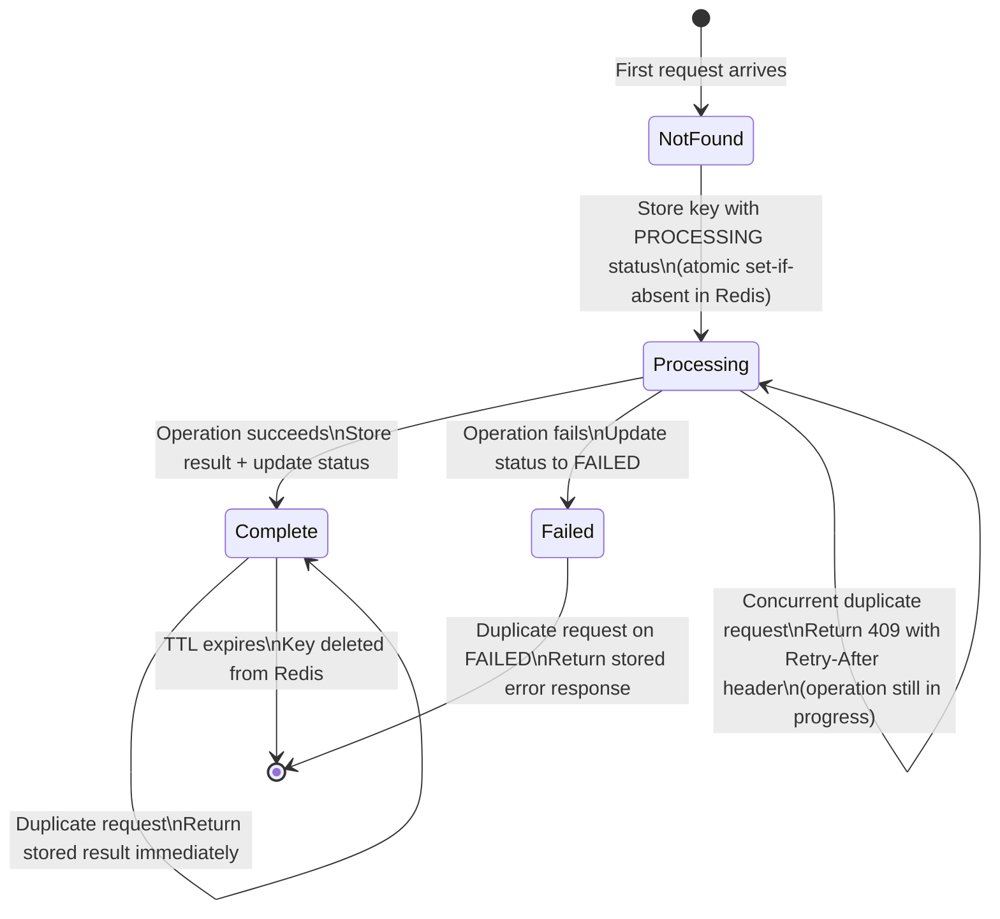
```mermaid
stateDiagram-v2
    [*] --> NotFound: First request arrives

    NotFound --> Processing: Store key with PROCESSING status\n(atomic set-if-absent in Redis)

    Processing --> Complete: Operation succeeds\nStore result + update status

    Processing --> Failed: Operation fails\nUpdate status to FAILED

    Complete --> Complete: Duplicate request\nReturn stored result immediately

    Failed --> [*]: Duplicate request on FAILED\nReturn stored error response

    Processing --> Processing: Concurrent duplicate request\nReturn 409 with Retry-After header\n(operation still in progress)

    Complete --> [*]: TTL expires\nKey deleted from Redis
```

---

## Section B: Architecture and Design

### B.1 — AgroGov Subsidy Saga: Complete State Machine

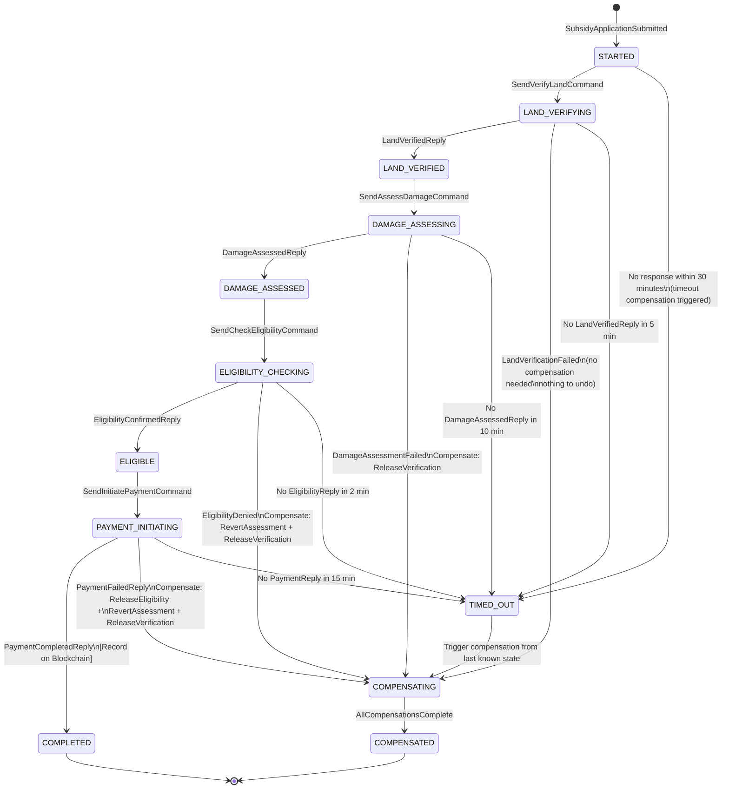
```mermaid
stateDiagram-v2
    [*] --> STARTED: SubsidyApplicationSubmitted

    STARTED --> LAND_VERIFYING: SendVerifyLandCommand
    LAND_VERIFYING --> LAND_VERIFIED: LandVerifiedReply
    LAND_VERIFYING --> COMPENSATING: LandVerificationFailed\n(no compensation needed\nnothing to undo)

    LAND_VERIFIED --> DAMAGE_ASSESSING: SendAssessDamageCommand
    DAMAGE_ASSESSING --> DAMAGE_ASSESSED: DamageAssessedReply
    DAMAGE_ASSESSING --> COMPENSATING: DamageAssessmentFailed\nCompensate: ReleaseVerification

    DAMAGE_ASSESSED --> ELIGIBILITY_CHECKING: SendCheckEligibilityCommand
    ELIGIBILITY_CHECKING --> ELIGIBLE: EligibilityConfirmedReply
    ELIGIBILITY_CHECKING --> COMPENSATING: EligibilityDenied\nCompensate: RevertAssessment + ReleaseVerification

    ELIGIBLE --> PAYMENT_INITIATING: SendInitiatePaymentCommand
    PAYMENT_INITIATING --> COMPLETED: PaymentCompletedReply\n[Record on Blockchain]
    PAYMENT_INITIATING --> COMPENSATING: PaymentFailedReply\nCompensate: ReleaseEligibility +\nRevertAssessment + ReleaseVerification

    COMPENSATING --> COMPENSATED: AllCompensationsComplete
    COMPENSATED --> [*]
    COMPLETED --> [*]

    STARTED --> TIMED_OUT: No response within 30 minutes\n(timeout compensation triggered)
    LAND_VERIFYING --> TIMED_OUT: No LandVerifiedReply in 5 min
    DAMAGE_ASSESSING --> TIMED_OUT: No DamageAssessedReply in 10 min
    ELIGIBILITY_CHECKING --> TIMED_OUT: No EligibilityReply in 2 min
    PAYMENT_INITIATING --> TIMED_OUT: No PaymentReply in 15 min
    TIMED_OUT --> COMPENSATING: Trigger compensation from last known state
```

### B.2 — Saga Orchestrator Architecture

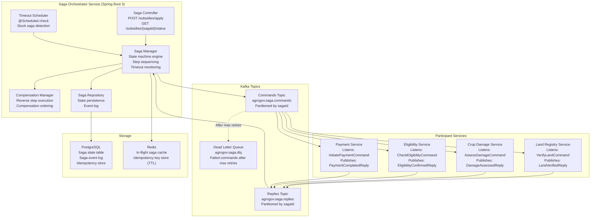
```mermaid
graph TB
    subgraph OrchestratorService["Saga Orchestrator Service (Spring Boot 3)"]
        SagaController["Saga Controller\nPOST /subsidies/apply\nGET /subsidies/{sagaId}/status"]
        SagaManager["Saga Manager\nState machine engine\nStep sequencing\nTimeout monitoring"]
        CompensationMgr["Compensation Manager\nReverse step execution\nCompensation ordering"]
        SagaRepository["Saga Repository\nState persistence\nEvent log"]
        TimeoutScheduler["Timeout Scheduler\n@Scheduled check\nStuck saga detection"]
    end

    subgraph Messaging["Kafka Topics"]
        CmdTopic["Commands Topic\nagrogov.saga.commands\nPartitioned by sagaId"]
        ReplyTopic["Replies Topic\nagrogov.saga.replies\nPartitioned by sagaId"]
        DLQ["Dead Letter Queue\nagrogov.saga.dlq\nFailed commands after max retries"]
    end

    subgraph ParticipantServices["Participant Services"]
        LandSvc2["Land Registry Service\nListens: VerifyLandCommand\nPublishes: LandVerifiedReply"]
        DamageSvc2["Crop Damage Service\nListens: AssessDamageCommand\nPublishes: DamageAssessedReply"]
        EligSvc2["Eligibility Service\nListens: CheckEligibilityCommand\nPublishes: EligibilityConfirmedReply"]
        PaySvc2["Payment Service\nListens: InitiatePaymentCommand\nPublishes: PaymentCompletedReply"]
    end

    subgraph Storage["Storage"]
        SagaDB2["PostgreSQL\nSaga state table\nSaga event log\nIdempotency store"]
        Redis3["Redis\nIn-flight saga cache\nIdempotency key store (TTL)"]
    end

    SagaController --> SagaManager
    SagaManager --> SagaRepository
    SagaManager --> CmdTopic
    SagaManager --> CompensationMgr
    ReplyTopic --> SagaManager
    TimeoutScheduler --> SagaManager

    CmdTopic --> LandSvc2
    CmdTopic --> DamageSvc2
    CmdTopic --> EligSvc2
    CmdTopic --> PaySvc2

    LandSvc2 --> ReplyTopic
    DamageSvc2 --> ReplyTopic
    EligSvc2 --> ReplyTopic
    PaySvc2 --> ReplyTopic

    SagaRepository --> SagaDB2
    SagaManager --> Redis3

    CmdTopic -.->|"After max retries"| DLQ
```

---

## Section C: Code Walkthrough

### C.1 — Saga Orchestrator Implementation (Spring Boot 3 + Kafka)

```java
// SubsidySagaOrchestrator.java
// The central saga orchestrator for the AgroGov subsidy application workflow.
// This class implements the state machine that drives the multi-step process.
//
// Design decisions:
// 1. State is persisted to PostgreSQL before EVERY state transition
//    WHY: If the orchestrator crashes mid-saga, it can recover by reading
//    the last persisted state and resuming from there.
//
// 2. Commands are sent AFTER state is persisted
//    WHY: If state persists but command fails to send, the timeout scheduler
//    will retry. If command sends but state fails to persist, we re-process
//    the reply (idempotent reply handling prevents duplicate processing).
//
// 3. All reply handlers are idempotent
//    WHY: Kafka at-least-once delivery may deliver the same reply twice.
//    The handler checks the current state before processing.

package gov.agrogov.saga;

import gov.agrogov.saga.domain.*;
import gov.agrogov.saga.repository.SubsidySagaRepository;
import gov.agrogov.saga.command.*;
import lombok.RequiredArgsConstructor;
import lombok.extern.slf4j.Slf4j;
import org.springframework.kafka.annotation.KafkaListener;
import org.springframework.kafka.core.KafkaTemplate;
import org.springframework.stereotype.Service;
import org.springframework.transaction.annotation.Transactional;

import java.time.Instant;
import java.util.UUID;

@Service
@RequiredArgsConstructor
@Slf4j
public class SubsidySagaOrchestrator {

    private final SubsidySagaRepository sagaRepository;
    private final KafkaTemplate<String, Object> kafkaTemplate;
    private final IdempotencyService idempotencyService;

    // Kafka topic names
    private static final String COMMANDS_TOPIC = "agrogov.saga.commands";
    private static final String REPLIES_TOPIC = "agrogov.saga.replies";

    /**
     * Starts a new subsidy application saga.
     *
     * WHY @Transactional:
     * The saga record must be created in PostgreSQL BEFORE any Kafka message is sent.
     * If PostgreSQL commit fails, the Kafka message is not sent (transactional outbox).
     * If PostgreSQL commits but the JVM crashes before Kafka send, the timeout
     * scheduler will detect the STARTED-but-stuck saga and retry the first command.
     *
     * NOTE: In production, use the Transactional Outbox pattern with Debezium
     * to guarantee both the DB write and the Kafka publish happen atomically.
     * For this implementation, we accept the small window between DB commit
     * and Kafka send as a managed risk covered by the timeout scheduler.
     */
    @Transactional
    public SubsidySaga startSubsidyApplication(SubsidyApplicationRequest request) {

        // Check idempotency: has this farmer already submitted for this crop year + survey?
        String idempotencyKey = buildApplicationIdempotencyKey(request);
        SubsidySaga existingSaga = idempotencyService.findByKey(idempotencyKey);
        if (existingSaga != null) {
            log.info("Duplicate application detected. Key={}, sagaId={}",
                idempotencyKey, existingSaga.getSagaId());
            return existingSaga;  // Return existing saga (idempotent)
        }

        // Create new saga with initial state
        SubsidySaga saga = SubsidySaga.builder()
            .sagaId(UUID.randomUUID())
            .farmerId(request.getFarmerId())
            .surveyNumber(request.getSurveyNumber())
            .cropType(request.getCropType())
            .cropYear(request.getCropYear())
            .claimedDamagePercent(request.getClaimedDamagePercent())
            .state(SagaState.STARTED)
            .idempotencyKey(idempotencyKey)
            .createdAt(Instant.now())
            .lastUpdatedAt(Instant.now())
            .timeoutAt(Instant.now().plusSeconds(1800))  // 30-minute overall timeout
            .build();

        // Step 1: Persist saga state FIRST
        sagaRepository.save(saga);

        // Step 2: Store idempotency key mapping
        idempotencyService.store(idempotencyKey, saga.getSagaId());

        // Step 3: Send first command AFTER persistence
        transitionTo(saga, SagaState.LAND_VERIFYING);
        sendVerifyLandCommand(saga);

        log.info("Subsidy saga started: sagaId={}, farmerId={}, surveyNumber={}",
            saga.getSagaId(), saga.getFarmerId(), saga.getSurveyNumber());

        return saga;
    }

    /**
     * Handles the LandVerifiedReply from the Land Registry Service.
     * Idempotent: if saga is already past LAND_VERIFYING, ignore this reply.
     */
    @KafkaListener(
        topics = REPLIES_TOPIC,
        groupId = "subsidy-saga-orchestrator",
        containerFactory = "sagaReplyListenerFactory"
    )
    @Transactional
    public void handleSagaReply(SagaReply reply) {
        log.info("Saga reply received: sagaId={}, type={}, success={}",
            reply.getSagaId(), reply.getReplyType(), reply.isSuccess());

        SubsidySaga saga = sagaRepository.findById(reply.getSagaId())
            .orElseThrow(() -> new SagaNotFoundException(
                "Saga not found: " + reply.getSagaId()));

        // Route reply to appropriate handler based on type and current state
        switch (reply.getReplyType()) {
            case "LandVerifiedReply" -> handleLandVerified(saga, reply);
            case "LandVerificationFailedReply" -> handleLandVerificationFailed(saga, reply);
            case "DamageAssessedReply" -> handleDamageAssessed(saga, reply);
            case "DamageAssessmentFailedReply" -> handleDamageAssessmentFailed(saga, reply);
            case "EligibilityConfirmedReply" -> handleEligibilityConfirmed(saga, reply);
            case "EligibilityDeniedReply" -> handleEligibilityDenied(saga, reply);
            case "PaymentCompletedReply" -> handlePaymentCompleted(saga, reply);
            case "PaymentFailedReply" -> handlePaymentFailed(saga, reply);
            // Compensation replies
            case "EligibilityReleasedReply" -> handleEligibilityReleased(saga, reply);
            case "DamageAssessmentRevertedReply" -> handleDamageAssessmentReverted(saga, reply);
            case "VerificationReleasedReply" -> handleVerificationReleased(saga, reply);
            default -> log.warn("Unknown reply type: {}", reply.getReplyType());
        }
    }

    // ─────────────────────────────────────────────────────────
    // FORWARD PATH HANDLERS
    // ─────────────────────────────────────────────────────────

    private void handleLandVerified(SubsidySaga saga, SagaReply reply) {
        // IDEMPOTENCY CHECK: Only process if we are in the expected state
        // WHY: Kafka may deliver this reply twice (at-least-once semantics)
        // If we already advanced to DAMAGE_ASSESSING, ignore this duplicate
        if (saga.getState() != SagaState.LAND_VERIFYING) {
            log.info("Ignoring LandVerifiedReply - saga {} is in state {}, not LAND_VERIFYING",
                saga.getSagaId(), saga.getState());
            return;
        }

        // Store the land verification result for audit trail
        saga.setVerifiedSurveyNumber(reply.getData("surveyNumber"));
        saga.setVerifiedArea(reply.getDoubleData("areaSqMeters"));

        transitionTo(saga, SagaState.DAMAGE_ASSESSING);
        sagaRepository.save(saga);
        sendAssessDamageCommand(saga);

        log.info("Land verified for saga {}. Area: {}sqm. Moving to DAMAGE_ASSESSING",
            saga.getSagaId(), saga.getVerifiedArea());
    }

    private void handleLandVerificationFailed(SubsidySaga saga, SagaReply reply) {
        if (saga.getState() != SagaState.LAND_VERIFYING) return;  // Idempotency guard

        // Land verification is the FIRST step — nothing to compensate
        saga.setFailureReason("Land verification failed: " + reply.getFailureReason());
        transitionTo(saga, SagaState.COMPENSATED);  // Skip compensation phase
        sagaRepository.save(saga);

        log.warn("Land verification failed for saga {}. Reason: {}",
            saga.getSagaId(), reply.getFailureReason());
        // Notify farmer of rejection (non-compensable; send anyway)
        publishFarmerNotification(saga, "Your subsidy application was rejected: " +
            reply.getFailureReason());
    }

    private void handleDamageAssessed(SubsidySaga saga, SagaReply reply) {
        if (saga.getState() != SagaState.DAMAGE_ASSESSING) return;

        saga.setAssessedDamagePercent(reply.getDoubleData("damagePercent"));
        saga.setAssessedByDeviceId(reply.getData("assessedByDeviceId"));

        transitionTo(saga, SagaState.ELIGIBILITY_CHECKING);
        sagaRepository.save(saga);
        sendCheckEligibilityCommand(saga);
    }

    private void handleDamageAssessmentFailed(SubsidySaga saga, SagaReply reply) {
        if (saga.getState() != SagaState.DAMAGE_ASSESSING) return;

        saga.setFailureReason("Damage assessment failed: " + reply.getFailureReason());
        // Compensation needed: release land verification lock
        transitionTo(saga, SagaState.COMPENSATING);
        saga.setCompensationStep(CompensationStep.RELEASE_LAND_VERIFICATION);
        sagaRepository.save(saga);
        sendReleaseVerificationCommand(saga);
    }

    private void handleEligibilityConfirmed(SubsidySaga saga, SagaReply reply) {
        if (saga.getState() != SagaState.ELIGIBILITY_CHECKING) return;

        saga.setEligibilityConfirmationId(reply.getData("confirmationId"));
        saga.setApprovedAmountINR(calculateApprovedAmount(saga));

        transitionTo(saga, SagaState.PAYMENT_INITIATING);
        sagaRepository.save(saga);
        sendInitiatePaymentCommand(saga);
    }

    private void handleEligibilityDenied(SubsidySaga saga, SagaReply reply) {
        if (saga.getState() != SagaState.ELIGIBILITY_CHECKING) return;

        saga.setFailureReason("Eligibility denied: " + reply.getFailureReason());
        transitionTo(saga, SagaState.COMPENSATING);
        saga.setCompensationStep(CompensationStep.REVERT_DAMAGE_ASSESSMENT);
        sagaRepository.save(saga);
        sendRevertDamageAssessmentCommand(saga);
    }

    private void handlePaymentCompleted(SubsidySaga saga, SagaReply reply) {
        if (saga.getState() != SagaState.PAYMENT_INITIATING) return;

        saga.setPaymentReferenceNumber(reply.getData("paymentReferenceNumber"));
        saga.setPaymentCompletedAt(Instant.now());
        transitionTo(saga, SagaState.COMPLETED);
        sagaRepository.save(saga);

        // Record on blockchain: final, immutable record of the approved subsidy
        // WHY here (not earlier): blockchain records are immutable;
        // record only after ALL approvals are complete and payment is confirmed
        publishBlockchainRecord(saga);
        publishFarmerNotification(saga, String.format(
            "Your subsidy of INR %.0f has been disbursed. Reference: %s",
            saga.getApprovedAmountINR(), saga.getPaymentReferenceNumber()));

        log.info("Saga {} COMPLETED. Payment: INR {} Ref: {}",
            saga.getSagaId(), saga.getApprovedAmountINR(), saga.getPaymentReferenceNumber());
    }

    private void handlePaymentFailed(SubsidySaga saga, SagaReply reply) {
        if (saga.getState() != SagaState.PAYMENT_INITIATING) return;

        saga.setFailureReason("Payment failed: " + reply.getFailureReason());
        transitionTo(saga, SagaState.COMPENSATING);
        saga.setCompensationStep(CompensationStep.RELEASE_ELIGIBILITY);
        sagaRepository.save(saga);
        sendReleaseEligibilityCommand(saga);
    }

    // ─────────────────────────────────────────────────────────
    // COMPENSATION PATH HANDLERS
    // ─────────────────────────────────────────────────────────

    private void handleEligibilityReleased(SubsidySaga saga, SagaReply reply) {
        if (saga.getState() != SagaState.COMPENSATING) return;
        if (saga.getCompensationStep() != CompensationStep.RELEASE_ELIGIBILITY) return;

        saga.setCompensationStep(CompensationStep.REVERT_DAMAGE_ASSESSMENT);
        sagaRepository.save(saga);
        sendRevertDamageAssessmentCommand(saga);
    }

    private void handleDamageAssessmentReverted(SubsidySaga saga, SagaReply reply) {
        if (saga.getState() != SagaState.COMPENSATING) return;
        if (saga.getCompensationStep() != CompensationStep.REVERT_DAMAGE_ASSESSMENT) return;

        saga.setCompensationStep(CompensationStep.RELEASE_LAND_VERIFICATION);
        sagaRepository.save(saga);
        sendReleaseVerificationCommand(saga);
    }

    private void handleVerificationReleased(SubsidySaga saga, SagaReply reply) {
        if (saga.getState() != SagaState.COMPENSATING) return;
        if (saga.getCompensationStep() != CompensationStep.RELEASE_LAND_VERIFICATION) return;

        transitionTo(saga, SagaState.COMPENSATED);
        sagaRepository.save(saga);

        publishFarmerNotification(saga,
            "Your subsidy application could not be processed. Reason: " +
            saga.getFailureReason() + ". Please reapply.");

        log.info("Saga {} fully compensated. All steps reversed.", saga.getSagaId());
    }

    // ─────────────────────────────────────────────────────────
    // COMMAND SENDERS
    // ─────────────────────────────────────────────────────────

    private void sendVerifyLandCommand(SubsidySaga saga) {
        kafkaTemplate.send(COMMANDS_TOPIC,
            saga.getSagaId().toString(),  // Partition key: same saga = same partition = ordered
            VerifyLandCommand.builder()
                .sagaId(saga.getSagaId())
                .farmerId(saga.getFarmerId())
                .surveyNumber(saga.getSurveyNumber())
                .commandId(UUID.randomUUID())  // Idempotency key for the command
                .build());
    }

    private void sendAssessDamageCommand(SubsidySaga saga) {
        kafkaTemplate.send(COMMANDS_TOPIC,
            saga.getSagaId().toString(),
            AssessDamageCommand.builder()
                .sagaId(saga.getSagaId())
                .surveyNumber(saga.getSurveyNumber())
                .cropType(saga.getCropType())
                .cropYear(saga.getCropYear())
                .commandId(UUID.randomUUID())
                .build());
    }

    private void sendCheckEligibilityCommand(SubsidySaga saga) {
        kafkaTemplate.send(COMMANDS_TOPIC,
            saga.getSagaId().toString(),
            CheckEligibilityCommand.builder()
                .sagaId(saga.getSagaId())
                .farmerId(saga.getFarmerId())
                .surveyNumber(saga.getSurveyNumber())
                .cropYear(saga.getCropYear())
                .assessedDamagePercent(saga.getAssessedDamagePercent())
                .commandId(UUID.randomUUID())
                .build());
    }

    private void sendInitiatePaymentCommand(SubsidySaga saga) {
        kafkaTemplate.send(COMMANDS_TOPIC,
            saga.getSagaId().toString(),
            InitiatePaymentCommand.builder()
                .sagaId(saga.getSagaId())
                .farmerId(saga.getFarmerId())
                .approvedAmountINR(saga.getApprovedAmountINR())
                .eligibilityConfirmationId(saga.getEligibilityConfirmationId())
                // Payment idempotency key prevents double payment if command is retried
                .paymentIdempotencyKey("payment-" + saga.getSagaId().toString())
                .commandId(UUID.randomUUID())
                .build());
    }

    // Compensation commands
    private void sendReleaseVerificationCommand(SubsidySaga saga) {
        kafkaTemplate.send(COMMANDS_TOPIC, saga.getSagaId().toString(),
            ReleaseVerificationCommand.builder()
                .sagaId(saga.getSagaId())
                .surveyNumber(saga.getSurveyNumber())
                .commandId(UUID.randomUUID())
                .build());
    }

    private void sendRevertDamageAssessmentCommand(SubsidySaga saga) {
        kafkaTemplate.send(COMMANDS_TOPIC, saga.getSagaId().toString(),
            RevertDamageAssessmentCommand.builder()
                .sagaId(saga.getSagaId())
                .surveyNumber(saga.getSurveyNumber())
                .cropYear(saga.getCropYear())
                .commandId(UUID.randomUUID())
                .build());
    }

    private void sendReleaseEligibilityCommand(SubsidySaga saga) {
        kafkaTemplate.send(COMMANDS_TOPIC, saga.getSagaId().toString(),
            ReleaseEligibilityCommand.builder()
                .sagaId(saga.getSagaId())
                .farmerId(saga.getFarmerId())
                .eligibilityConfirmationId(saga.getEligibilityConfirmationId())
                .commandId(UUID.randomUUID())
                .build());
    }

    // ─────────────────────────────────────────────────────────
    // HELPERS
    // ─────────────────────────────────────────────────────────

    private void transitionTo(SubsidySaga saga, SagaState newState) {
        log.info("Saga {} transitioning: {} → {}",
            saga.getSagaId(), saga.getState(), newState);
        saga.setState(newState);
        saga.setLastUpdatedAt(Instant.now());
        // Append to saga event log for audit
        saga.addEvent(SagaEvent.builder()
            .state(newState)
            .timestamp(Instant.now())
            .build());
    }

    private double calculateApprovedAmount(SubsidySaga saga) {
        // Government policy: INR 20,000/hectare × damage percentage
        // Damage must be >= 33% for eligibility (already confirmed by EligibilitySvc)
        double ratePerHectare = 20000.0;
        double areaHectares = saga.getVerifiedArea() / 10000.0;  // sqm to hectares
        double damageFactor = saga.getAssessedDamagePercent() / 100.0;
        // Cap at INR 2,00,000 per application (government policy ceiling)
        return Math.min(ratePerHectare * areaHectares * damageFactor, 200000.0);
    }

    private String buildApplicationIdempotencyKey(SubsidyApplicationRequest req) {
        return String.format("subsidy-%s-%s-%s-%d",
            req.getFarmerId(), req.getSurveyNumber(),
            req.getCropType(), req.getCropYear());
    }

    private void publishFarmerNotification(SubsidySaga saga, String message) {
        kafkaTemplate.send("agrogov.notifications",
            saga.getFarmerId(),
            FarmerNotification.builder()
                .farmerId(saga.getFarmerId())
                .sagaId(saga.getSagaId())
                .message(message)
                .timestamp(Instant.now())
                .build());
    }

    private void publishBlockchainRecord(SubsidySaga saga) {
        kafkaTemplate.send("agrogov.blockchain.records",
            saga.getSagaId().toString(),
            BlockchainSubsidyRecord.builder()
                .subsidyId(saga.getSagaId().toString())
                .farmerId(saga.getFarmerId())
                .surveyNumber(saga.getSurveyNumber())
                .cropType(saga.getCropType())
                .damagePercentage(saga.getAssessedDamagePercent())
                .approvedAmountINR(saga.getApprovedAmountINR())
                .paymentReferenceNumber(saga.getPaymentReferenceNumber())
                .approvalTimestamp(saga.getPaymentCompletedAt().toString())
                .build());
    }
}
```

```java
// SagaTimeoutScheduler.java
// Detects sagas that are stuck (no progress for longer than their step timeout)
// and triggers compensation or alerts.
// WHY needed: Kafka messages can be lost; participant services can crash;
// without timeout detection, sagas remain stuck forever in intermediate states.

package gov.agrogov.saga;

import gov.agrogov.saga.domain.SubsidySaga;
import gov.agrogov.saga.domain.SagaState;
import gov.agrogov.saga.repository.SubsidySagaRepository;
import lombok.RequiredArgsConstructor;
import lombok.extern.slf4j.Slf4j;
import org.springframework.scheduling.annotation.Scheduled;
import org.springframework.stereotype.Component;
import org.springframework.transaction.annotation.Transactional;

import java.time.Instant;
import java.util.List;

@Component
@RequiredArgsConstructor
@Slf4j
public class SagaTimeoutScheduler {

    private final SubsidySagaRepository sagaRepository;
    private final SubsidySagaOrchestrator orchestrator;

    /**
     * Runs every 2 minutes to detect timed-out sagas.
     *
     * WHY 2-minute check interval:
     * Most saga steps complete within 30 seconds in normal operation.
     * A 2-minute check catches stuck sagas within 4 minutes of timeout.
     * Shorter intervals add DB load unnecessarily.
     *
     * Production: use a dedicated scheduler (Quartz, Spring Batch) with
     * distributed lock (Shedlock) to prevent multiple orchestrator instances
     * from processing the same timed-out saga simultaneously.
     */
    @Scheduled(fixedDelay = 120_000)  // Every 2 minutes
    @Transactional
    public void detectAndHandleTimeouts() {
        List<SagaState> inProgressStates = List.of(
            SagaState.LAND_VERIFYING,
            SagaState.DAMAGE_ASSESSING,
            SagaState.ELIGIBILITY_CHECKING,
            SagaState.PAYMENT_INITIATING,
            SagaState.COMPENSATING
        );

        // Find sagas that are in progress AND past their timeout
        List<SubsidySaga> timedOutSagas = sagaRepository
            .findByStateInAndTimeoutAtBefore(inProgressStates, Instant.now());

        if (!timedOutSagas.isEmpty()) {
            log.warn("Found {} timed-out sagas. Processing...", timedOutSagas.size());
        }

        for (SubsidySaga saga : timedOutSagas) {
            try {
                handleTimedOutSaga(saga);
            } catch (Exception e) {
                log.error("Failed to handle timed-out saga {}: {}",
                    saga.getSagaId(), e.getMessage());
                // Continue with next saga; don't let one failure block others
            }
        }
    }

    private void handleTimedOutSaga(SubsidySaga saga) {
        log.warn("Saga timed out: sagaId={}, state={}, timeoutAt={}",
            saga.getSagaId(), saga.getState(), saga.getTimeoutAt());

        // Determine recovery action based on current stuck state
        switch (saga.getState()) {
            case LAND_VERIFYING -> {
                // Option 1: Retry the command (idempotent — safe to resend)
                // Option 2: If this is the nth retry, give up and mark as failed
                if (saga.getRetryCount() < 3) {
                    log.info("Retrying VerifyLandCommand for saga {}", saga.getSagaId());
                    saga.incrementRetryCount();
                    saga.setTimeoutAt(Instant.now().plusSeconds(300));  // 5-min extension
                    sagaRepository.save(saga);
                    orchestrator.retryCurrentStep(saga);
                } else {
                    // Exceeded max retries: fail the saga
                    saga.setFailureReason("Land Registry Service unresponsive after 3 retries");
                    orchestrator.failSaga(saga);
                }
            }

            case DAMAGE_ASSESSING -> {
                // IoT data processing can be slow; give it more time
                if (saga.getRetryCount() < 2) {
                    saga.incrementRetryCount();
                    saga.setTimeoutAt(Instant.now().plusSeconds(600));
                    sagaRepository.save(saga);
                    orchestrator.retryCurrentStep(saga);
                } else {
                    saga.setFailureReason("Crop Damage Service timeout - IoT data unavailable");
                    orchestrator.startCompensation(saga);
                }
            }

            case PAYMENT_INITIATING -> {
                // Payment timeout is critical: do NOT retry automatically
                // (risk of double payment if bank is processing slowly)
                // Instead: escalate to human review
                log.error("CRITICAL: Payment step timed out for saga {}. " +
                    "Manual review required. FarmerId={}",
                    saga.getSagaId(), saga.getFarmerId());
                saga.setState(SagaState.PAYMENT_TIMEOUT_MANUAL_REVIEW);
                saga.setFailureReason("Payment service did not respond within timeout. " +
                    "Escalated for manual review.");
                sagaRepository.save(saga);
                // Alert the operations team
                orchestrator.escalateToOperations(saga);
            }

            default -> {
                log.error("Unexpected timeout in state {} for saga {}",
                    saga.getState(), saga.getSagaId());
                orchestrator.failSaga(saga);
            }
        }
    }
}
```

```java
// IdempotencyService.java
// Manages idempotency keys for all saga operations using Redis.

package gov.agrogov.saga;

import com.fasterxml.jackson.databind.ObjectMapper;
import gov.agrogov.saga.domain.SubsidySaga;
import lombok.RequiredArgsConstructor;
import lombok.extern.slf4j.Slf4j;
import org.springframework.data.redis.core.StringRedisTemplate;
import org.springframework.stereotype.Service;

import java.time.Duration;
import java.util.UUID;

@Service
@RequiredArgsConstructor
@Slf4j
public class IdempotencyService {

    private final StringRedisTemplate redisTemplate;
    private final SubsidySagaRepository sagaRepository;

    // Idempotency TTL: 30 days (one crop year window for subsidy applications)
    private static final Duration IDEMPOTENCY_TTL = Duration.ofDays(30);
    private static final String KEY_PREFIX = "saga:idempotency:";

    /**
     * Stores an idempotency key → saga ID mapping.
     * Uses SET NX (set if not exists) for atomic first-write-wins semantics.
     *
     * WHY SET NX: prevents race condition where two concurrent requests
     * with the same idempotency key both think they are the "first" request.
     * Only one will succeed the SET NX; the other detects the key already exists.
     */
    public boolean store(String idempotencyKey, UUID sagaId) {
        String redisKey = KEY_PREFIX + idempotencyKey;
        Boolean stored = redisTemplate.opsForValue()
            .setIfAbsent(redisKey, sagaId.toString(), IDEMPOTENCY_TTL);

        if (Boolean.FALSE.equals(stored)) {
            log.warn("Idempotency key collision detected: key={}", idempotencyKey);
            return false;
        }

        log.debug("Stored idempotency key: {} → {}", idempotencyKey, sagaId);
        return true;
    }

    /**
     * Looks up an existing saga by idempotency key.
     * Returns null if this is a genuinely new request.
     */
    public SubsidySaga findByKey(String idempotencyKey) {
        String redisKey = KEY_PREFIX + idempotencyKey;
        String existingSagaId = redisTemplate.opsForValue().get(redisKey);

        if (existingSagaId == null) {
            return null;  // New request
        }

        // Found existing saga ID: load the full saga from PostgreSQL
        return sagaRepository.findById(UUID.fromString(existingSagaId))
            .orElse(null);  // Redis has stale key; treat as new request
    }
}
```

---

## Section D: Real-World Case Study

### D.1 — Case Study: US Federal Benefits Distributed Transaction Failure (Illustrative)

**Context:** A fictional US federal agency ("FederalBenefitsAgency") modernized its benefits processing system from a monolith to microservices. The team replicated the monolith's `@Transactional` database transaction approach using a distributed XA transaction manager across five microservices.

**The Architecture (Flawed):**

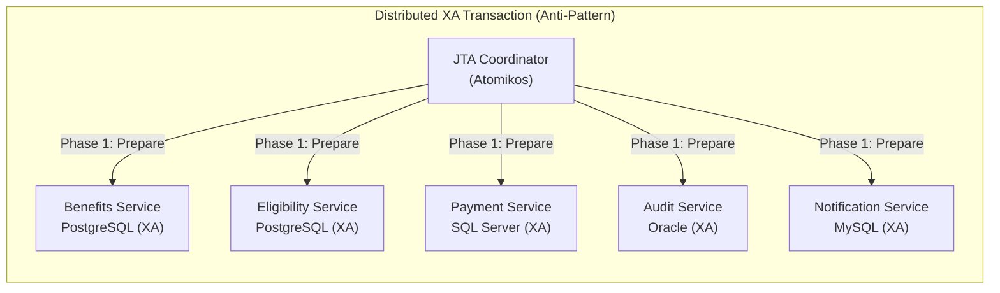
```mermaid
graph LR
    subgraph XATransaction["Distributed XA Transaction (Anti-Pattern)"]
        Coord["JTA Coordinator\n(Atomikos)"]
        BenSvc["Benefits Service\nPostgreSQL (XA)"]
        EligSvc2["Eligibility Service\nPostgreSQL (XA)"]
        PaySvc3["Payment Service\nSQL Server (XA)"]
        AuditSvc["Audit Service\nOracle (XA)"]
        NotifSvc3["Notification Service\nMySQL (XA)"]
    end

    Coord -->|"Phase 1: Prepare"| BenSvc
    Coord -->|"Phase 1: Prepare"| EligSvc2
    Coord -->|"Phase 1: Prepare"| PaySvc3
    Coord -->|"Phase 1: Prepare"| AuditSvc
    Coord -->|"Phase 1: Prepare"| NotifSvc3
```

**Failure Modes Observed (Illustrative):**

| Incident                         | Cause                                  | Impact                                                                          |
| -------------------------------- | -------------------------------------- | ------------------------------------------------------------------------------- |
| Coordinator crash post-Phase-1   | JTA coordinator JVM OOM during Phase 1 | All 5 databases locked for 45 minutes; 12,000 pending applications blocked      |
| Network partition during Phase 2 | AWS AZ connectivity issue              | 3 services committed; 2 rolled back; 847 benefits in inconsistent state         |
| Slow Notification Service        | Email gateway latency 30s              | All 4 other services held locks for 30s per transaction; throughput dropped 95% |
| Database upgrade (Oracle)        | Payment service DB maintenance         | Entire benefits application system offline for 4-hour maintenance window        |

**Remediation: Replacing XA with Saga Orchestration:**

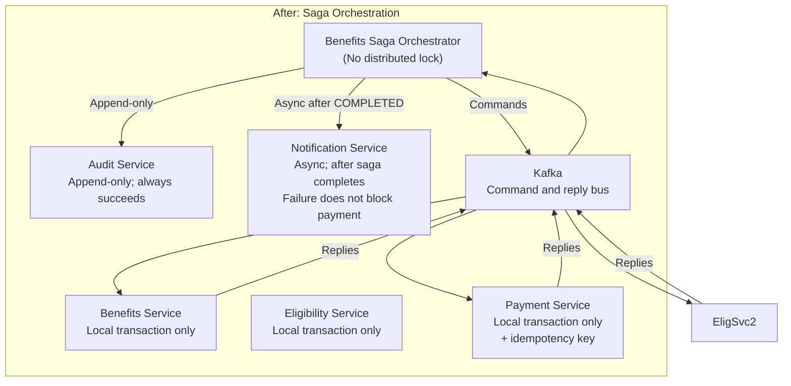
```mermaid
graph TB
    subgraph SagaReplacement["After: Saga Orchestration"]
        Orch2["Benefits Saga Orchestrator\n(No distributed lock)"]
        BenSvc2["Benefits Service\nLocal transaction only"]
        EligSvc3["Eligibility Service\nLocal transaction only"]
        PaySvc4["Payment Service\nLocal transaction only\n+ idempotency key"]
        AuditSvc2["Audit Service\nAppend-only; always succeeds"]
        NotifSvc4["Notification Service\nAsync; after saga completes\nFailure does not block payment"]
        Kafka3["Kafka\nCommand and reply bus"]
    end

    Orch2 -->|"Commands"| Kafka3
    Kafka3 --> BenSvc2
    Kafka3 --> EligSvc2
    Kafka3 --> PaySvc4
    BenSvc2 -->|"Replies"| Kafka3
    EligSvc2 -->|"Replies"| Kafka3
    PaySvc4 -->|"Replies"| Kafka3
    Kafka3 --> Orch2
    Orch2 -->|"Async after COMPLETED"| NotifSvc4
    Orch2 -->|"Append-only"| AuditSvc2
```

**Results After Migration (Illustrative):**

| Metric                             | XA Transaction                                           | Saga Orchestration                                       |
| ---------------------------------- | -------------------------------------------------------- | -------------------------------------------------------- |
| System-wide transaction throughput | 12 TPS (lock contention)                                 | 340 TPS                                                  |
| Maintenance window requirement     | All 5 services must be up simultaneously                 | Per-service independent maintenance                      |
| Failure blast radius               | 100% of transactions affected by any one service failure | Only sagas involving the failed service; others continue |
| Average transaction latency        | 4,200ms (lock wait + 4 round trips)                      | 850ms (async; no lock wait)                              |
| Inconsistent state incidents/month | 3-4 (from partition events)                              | 0 (compensated sagas reach consistent terminal state)    |

---

## Section E: Engagement and Assessment

### E.1 — Food for Thought

> **Provocation:** The AgroGov subsidy saga has an interesting edge case: what if the Payment Service sends the INR 15,000 to the farmer's bank account successfully, but the bank's API response (confirming the payment) is lost in transit due to a network failure? The Payment Service has committed the payment internally; the money has left the government account. But the Saga Orchestrator never received the `PaymentCompletedReply`. From the orchestrator's perspective, the payment timed out.
>
> **Questions:**
> - The timeout scheduler triggers compensation. The compensation for the payment step is a "payment reversal." But the farmer may have already spent the money. What happens?
> - Should the Payment Service be the idempotency guardian (preventing double payments) or should the Orchestrator be (preventing double initiation)?
> - How do you design a payment confirmation mechanism that distinguishes between "payment not sent" (safe to retry) and "payment sent but confirmation lost" (dangerous to retry)?
> - What role does the payment reference number (UTR — Unique Transaction Reference in India's NEFT/IMPS) play in resolving this ambiguity?
>
> **Copilot/ChatGPT Prompt:** "Design an idempotent payment service for a government subsidy disbursement system that can distinguish between 'payment not initiated,' 'payment in progress,' and 'payment completed but confirmation lost.' Include: idempotency key design, payment status reconciliation with the bank's API, timeout handling, and the architectural pattern for safely handling the lost-confirmation scenario. Reference NPCI's IMPS technical specification for context."

### E.2 — Questionnaire: Topic 4

**Conceptual Questions**

1. **Why does the Two-Phase Commit (2PC) protocol fail at microservice scale? Name three specific failure modes and their consequences in a government subsidy processing context.**

   *Answer:* (1) **Coordinator single point of failure**: In 2PC, the transaction coordinator manages the prepare/commit cycle. If it crashes after sending "Prepare" to all participants but before sending "Commit," all participant databases remain locked indefinitely, holding pessimistic locks on their records. In subsidy processing: all five service databases (land registry, damage assessment, eligibility, payment, audit) are locked. No other subsidy can be processed until manual intervention resolves the coordinator's state — potentially hours. (2) **Synchronous coupling**: All participants must be available simultaneously throughout the transaction. The Payment Service's maintenance window (for bank reconciliation batch, typically 2-4 AM) means the entire subsidy application system must be offline simultaneously. In a government system processing applications from multiple time zones (India covers IST; US covers EST, CST, PST), there is no universally safe maintenance window. (3) **Lock contention and throughput destruction**: The "Prepare" phase acquires locks that are held until the "Commit" phase completes. With four network round-trips minimum and potentially slow participants (payment gateway response times: 2-5 seconds), every concurrent transaction holds database locks for 2-5+ seconds. At 100 concurrent applications: 100 × 5 seconds = 500 lock-seconds per 5-second window. PostgreSQL's default lock timeout is 30 seconds; a spike of applications causes cascading lock timeouts and transaction failures.

2. **Define a compensating transaction and explain the three properties it must have. Give a specific example of a non-compensable operation in the AgroGov subsidy saga and how you would handle it architecturally.**

   *Answer:* A compensating transaction is a business operation that reverses the semantic effect of a previously committed local transaction. It is NOT a database rollback — it creates new transactions that undo business state. Three required properties: (1) **Idempotent**: Executing the compensation twice produces the same result as once. If the compensation message is delivered twice (Kafka at-least-once), the second execution is a no-op. Example: `ReleaseVerification(surveyNumber)` — if the verification lock is already released, releasing it again is safe. (2) **Semantically correct undo**: The compensation must reverse the business meaning, not just the database row. If the Eligibility Service marked a farmer as "benefit-in-progress" (preventing duplicate claims), the compensation must release this mark — not just delete the eligibility record. (3) **Always possible**: Every forward step must have a defined compensation path documented in the saga design. Non-compensable operation in AgroGov: once the farmer receives an SMS "Your INR 15,000 subsidy is approved," you cannot technically un-send that message. Architectural handling: (a) Move non-compensable operations to the END of the saga (after payment confirmation — once payment is confirmed, the saga is complete and no compensation is needed); (b) For the rare case where compensation is triggered after a non-compensable step: send a corrective communication ("A previous message was sent in error; your application status has changed"); (c) Document this as an accepted inconsistency in the ADR with the explicit approval of the business stakeholder.

3. **Explain the difference between at-least-once, at-most-once, and exactly-once message delivery semantics. Which does Kafka provide by default, and how does idempotency at the consumer level achieve exactly-once business effect?**

   *Answer:* At-most-once: message is delivered zero or one times; may be lost but never duplicated. Achieved by not retrying failed sends. Suitable for: high-frequency telemetry where occasional loss is acceptable. At-least-once: message is delivered one or more times; may be duplicated but never lost. Achieved by retrying until acknowledged. Kafka's default consumer behavior. Suitable for: any message where the consumer is idempotent. Exactly-once: message delivered precisely once; no loss, no duplication. Technically: Kafka supports exactly-once semantics (EOS) with `transactional.id` configuration for producer transactions. Operationally complex; significant performance overhead. Exactly-once business effect via consumer-level idempotency: even though Kafka delivers the `LandVerifiedReply` potentially twice (at-least-once), the orchestrator's idempotency check ("is this saga already past LAND_VERIFYING state?") means the business effect (advancing to DAMAGE_ASSESSING and sending the next command) happens exactly once. This is the recommended approach for most government use cases: Kafka at-least-once + idempotent consumer = exactly-once business effect without the operational overhead of Kafka EOS.

**Application Questions**

4. **Design the PostgreSQL schema for the SubsidySaga state table. Include: all columns needed for saga state, event log, compensation tracking, and timeout management. Include index design for the timeout scheduler query.**

   *Answer:*
   ```sql
   -- Main saga state table
   CREATE TABLE subsidy_saga (
       saga_id                     UUID PRIMARY KEY,
       farmer_id                   VARCHAR(50) NOT NULL,
       survey_number               VARCHAR(20) NOT NULL,
       crop_type                   VARCHAR(30) NOT NULL,
       crop_year                   INTEGER NOT NULL,
       state                       VARCHAR(40) NOT NULL,
       compensation_step           VARCHAR(50),
       idempotency_key             VARCHAR(200) UNIQUE NOT NULL,
       -- IoT and verification data captured during saga
       verified_survey_number      VARCHAR(20),
       verified_area_sqm           DECIMAL(12,2),
       assessed_damage_percent     DECIMAL(5,2),
       assessed_by_device_id       VARCHAR(100),
       eligibility_confirmation_id VARCHAR(100),
       approved_amount_inr         DECIMAL(10,2),
       payment_reference_number    VARCHAR(50),
       payment_completed_at        TIMESTAMPTZ,
       -- Failure tracking
       failure_reason              TEXT,
       retry_count                 INTEGER DEFAULT 0,
       -- Timeout management
       timeout_at                  TIMESTAMPTZ NOT NULL,
       -- Audit columns
       created_at                  TIMESTAMPTZ NOT NULL DEFAULT NOW(),
       last_updated_at             TIMESTAMPTZ NOT NULL DEFAULT NOW(),
       version                     BIGINT NOT NULL DEFAULT 0  -- Optimistic locking
   );

   -- Saga event log: immutable append-only audit trail
   CREATE TABLE subsidy_saga_event (
       event_id      UUID PRIMARY KEY DEFAULT gen_random_uuid(),
       saga_id       UUID NOT NULL REFERENCES subsidy_saga(saga_id),
       event_type    VARCHAR(100) NOT NULL,
       from_state    VARCHAR(40),
       to_state      VARCHAR(40),
       event_data    JSONB,
       occurred_at   TIMESTAMPTZ NOT NULL DEFAULT NOW()
   );

   -- Indexes
   -- Timeout scheduler: find in-progress sagas past their timeout
   CREATE INDEX idx_saga_timeout
       ON subsidy_saga(state, timeout_at)
       WHERE state IN (
           'LAND_VERIFYING', 'DAMAGE_ASSESSING',
           'ELIGIBILITY_CHECKING', 'PAYMENT_INITIATING', 'COMPENSATING'
       );

   -- Farmer lookup: find all sagas for a farmer
   CREATE INDEX idx_saga_farmer ON subsidy_saga(farmer_id, created_at DESC);

   -- Event log lookup by saga
   CREATE INDEX idx_saga_event_saga_id ON subsidy_saga_event(saga_id, occurred_at);
   ```

5. **The AgroGov payment service uses IMPS (Immediate Payment Service) for subsidy disbursement. IMPS has a 30-second response timeout. Design the idempotency key strategy for the payment step that safely handles the case where IMPS acknowledges payment but the response is lost.**

   *Answer:* Strategy — Three-phase payment idempotency: (1) **Pre-payment idempotency record**: Before calling IMPS, the Payment Service creates a record: `{paymentKey: "payment-{sagaId}", status: "INITIATED", impsRefId: null, createdAt: now}`. This is stored in PostgreSQL with status INITIATED. (2) **IMPS call with idempotency**: The IMPS API accepts a `merchantRefNo` (our `paymentKey`). IMPS guarantees that two calls with the same `merchantRefNo` result in only one payment. After IMPS responds: if success, update to `{status: "COMPLETED", impsRefId: "UTR-123456", completedAt: now}`. (3) **Lost confirmation recovery**: If the IMPS response is lost (network failure), the Payment Service's status is still INITIATED. When the Saga Orchestrator's timeout triggers a retry, the Payment Service: (a) Checks its local record: status=INITIATED; (b) Calls IMPS's payment status query API: `GET /imps/status?merchantRefId=payment-{sagaId}`; (c) IMPS returns: COMPLETED (UTR-123456) — the payment went through; (d) Payment Service updates local record to COMPLETED, publishes PaymentCompletedReply. The key insight: the Payment Service is the authority on payment status, not the orchestrator. A UTR from IMPS is the ground truth — it proves payment was made regardless of whether our system's confirmation was received. This pattern is called "query before retry" or "check-then-act" idempotency.

6. **Compare the saga recovery strategies for the following failure scenarios: (a) Orchestrator crashes during DAMAGE_ASSESSING state (b) Kafka is unavailable for 10 minutes during ELIGIBILITY_CHECKING (c) The Land Registry Service returns a 500 error for the compensation command ReleaseVerification.**

   *Answer:* (a) Orchestrator crash during DAMAGE_ASSESSING: Recovery: on restart, the orchestrator loads all sagas in non-terminal states from PostgreSQL. Sagas in DAMAGE_ASSESSING check their `timeout_at`. If not timed out yet: wait for the AssessDamageCommand reply (Kafka still has the message; DamageService will reply). If timed out: timeout scheduler retries the command. The orchestrator is stateless between restarts — all state is in PostgreSQL. Critical: saga state must be persisted BEFORE commands are sent so the restart sees the correct state. (b) Kafka unavailable for 10 minutes during ELIGIBILITY_CHECKING: The CheckEligibilityCommand was already published to Kafka before the outage. Kafka is durable — the message is stored in the topic. When Kafka recovers, the Eligibility Service processes the command and publishes EligibilityConfirmedReply. The orchestrator's timeout is 2 minutes for eligibility; 10-minute Kafka outage will trigger timeout. Timeout scheduler detects ELIGIBILITY_CHECKING past timeout; retries the command. But Kafka is still down — retry fails. Orchestrator enters a retry loop (max 3 retries at 5-minute intervals). If Kafka recovers within 15 minutes: the retry succeeds. If not: after max retries, the orchestrator marks the saga as FAILED and starts compensation. Since no compensation commands can be sent while Kafka is down, the compensation saga enters COMPENSATING state in PostgreSQL — the compensation commands are sent when Kafka recovers. (c) Land Registry returns 500 for ReleaseVerification: This is a compensation command failure — one of the most dangerous scenarios. If compensation itself fails, the saga is stuck with the land verification lock permanently held. Recovery: (1) Retry the compensation command (idempotent: safe to retry) up to 5 times with exponential backoff. (2) If all retries fail: mark saga as COMPENSATION_FAILED; alert operations team immediately. (3) Operations team manually executes the compensation via an admin API (`POST /admin/sagas/{sagaId}/force-compensate`) after the Land Registry Service recovers. (4) The admin API is rate-limited, requires ROLE_SAGA_ADMIN, and is fully audited. This is the "break-glass" compensation mechanism that should exist in every production saga system.

**Analysis Questions**

7. **Analyze the trade-off of storing saga state in PostgreSQL (relational) vs. a dedicated event store (Apache Kafka + event sourcing). Which approach provides better auditability, recoverability, and query capability for a government compliance context?**

   *Answer:*

   | Dimension           | PostgreSQL (Mutable State)                                             | Event Store (Immutable Events)                                                                            |
   | ------------------- | ---------------------------------------------------------------------- | --------------------------------------------------------------------------------------------------------- |
   | Current state query | O(1): `SELECT * WHERE saga_id = ?`                                     | O(n): replay all events to reconstruct                                                                    |
   | Audit trail         | Separate event log table needed                                        | Native: every state change is an event                                                                    |
   | Compliance          | Requires careful schema design to prevent accidental update of history | Append-only: history is structurally immutable                                                            |
   | Complex queries     | SQL: "How many sagas in DAMAGE_ASSESSING for district MH-04?"          | Requires projection/read model; more complex                                                              |
   | Recovery            | Load latest state; resume                                              | Replay events from last known good state                                                                  |
   | Storage             | Compact: one row per saga                                              | Grows indefinitely: one event per transition                                                              |
   | Government fit      | Better for: operational dashboards, timeout queries, status reporting  | Better for: complete audit trail required by CAG (Comptroller and Auditor General), Parliamentary inquiry |
   | Recommendation      | Hybrid: PostgreSQL for current state + event log table for history     | Pure event sourcing for highest compliance requirement                                                    |

   **Verdict:** For AgroGov (government compliance, Parliamentary audit risk): use the hybrid — PostgreSQL for the saga state table (operational efficiency) + the `subsidy_saga_event` append-only table for the audit log. The event table provides the immutable history; the state table provides query efficiency. If the event log ever conflicts with the state table (due to a bug), the event log is authoritative — the state table can be reconstructed by replaying events.

8. **The AgroGov saga must satisfy a DPDP Act requirement: a farmer can request deletion of their personal data. However, the saga contains farmer PII (name, Aadhaar number, bank account) in the saga state and event log. How do you design the saga to satisfy both the auditability requirement (immutable saga log) and the right-to-erasure requirement (PII deletion)?**

   *Answer:* This is the classic immutability vs. erasure conflict. Solution — PII externalization in saga design: (1) **Saga stores only references, not PII**: The saga state table stores `farmerId` (a UUID reference), `surveyNumber` (land record reference), `paymentReferenceNumber` (UTR). It does NOT store farmer name, Aadhaar number, or bank account number. These are stored in the Farmer Profile Service (a separate bounded context with its own database). (2) **At-rest PII encryption with key-per-farmer**: Any PII that must be in the saga (e.g., farmer name in audit event for human-readable log) is encrypted with a farmer-specific encryption key stored in Azure Key Vault. Key naming: `farmer-data-key-{farmerId}`. (3) **Right-to-erasure implementation**: When a farmer requests erasure, the Key Vault key for their `farmerId` is deleted (soft-delete, then purged after 90-day hold). The saga event log entries that contain encrypted PII are now permanently unreadable — this is **cryptographic erasure**, which is legally equivalent to deletion in most frameworks (GDPR recital 26: anonymized data is not personal data). The saga structure (states, transitions, amounts) remains for CAG audit — it contains no readable PII. (4) **Government legal hold exception**: If the saga involves an active subsidy payment, the DPDP Act allows retention during legal proceedings. The erasure is deferred until the legal hold expires.

**Scenario-Based Questions**

9. **A government minister demands a real-time dashboard showing the status of all 50,000 active subsidy sagas by district, state, and failure reason. The dashboard must refresh every 30 seconds. Design the query and caching architecture that serves this dashboard without impacting the saga orchestrator's transaction throughput.**

    *Answer:* Separate the read model from the write model (CQRS pattern applied to the saga): (1) **Dedicated read replica**: The saga state PostgreSQL has a read replica. The dashboard queries ONLY the read replica — zero impact on the orchestrator's write transactions. (2) **Materialized summary table**: A background job (runs every 15 seconds) computes aggregate counts and writes to a `subsidy_saga_summary` table: `{districtCode, state, count, lastUpdatedAt}`. Dashboard queries this summary table (O(1) per district) rather than the full saga table (potentially O(50,000) with GROUP BY). (3) **Redis cache**: The summary table query result is cached in Redis with a 30-second TTL (matching the dashboard refresh interval). First dashboard load hits PostgreSQL; subsequent loads hit Redis. 50,000 sagas × 40 bytes per summary row = 2MB total — trivially small for Redis. (4) **Push vs. poll**: Instead of 30-second polling, use Server-Sent Events (SSE) from the orchestrator: when a saga state changes, publish a lightweight update event to a Redis Pub/Sub channel. The dashboard subscribes and receives real-time updates (< 1 second latency). This eliminates polling entirely and reduces dashboard server load by 98%. (5) **Failure reason aggregation**: The top 10 failure reasons per district are pre-aggregated in the summary table. Detailed failure analysis (specific saga IDs with a given failure) is a separate, non-real-time query available via a "drill-down" API that directly queries the event log (not the dashboard's hot path).

10. **During testing of the AgroGov saga, you discover that under load (500 concurrent saga starts), 3% of sagas end in the COMPENSATED state even though all participant services are healthy. No errors appear in individual service logs. Diagnose the likely root cause and propose the fix.**

    *Answer:* This is a classic distributed systems debugging scenario. The 3% failure rate under load with no service errors points to: **Saga command/reply ordering and timeout misconfiguration under load**, specifically: (1) **Most likely cause — Kafka consumer lag under load**: At 500 concurrent sagas, the saga commands are published faster than the participant services' Kafka consumers can process them. The Crop Damage Service consumer has 3 partitions with 1 consumer thread — under load, consumer lag builds up. The orchestrator's DAMAGE_ASSESSING step has a 10-minute timeout; if Kafka lag causes the command to be processed after 10 minutes, the timeout scheduler has already triggered compensation. Fix: increase Kafka topic partitions for the commands topic to 12 (matching the number of orchestrator + service instances); increase consumer thread count per service. (2) **Contributing cause — Timeout too aggressive**: A 10-minute timeout for damage assessment was designed for normal load. Under 500 concurrent requests, the IoT data aggregation service experiences higher latency. Increase timeout to 20 minutes for the DAMAGE_ASSESSING state; add a `lastActivityAt` timestamp to extend the timeout if the service sends an intermediate "processing" acknowledgment. (3) **Diagnosis method**: Enable correlation ID tracing across all services. For a COMPENSATED saga: check the saga event log timestamps (when did DAMAGE_ASSESSING start?), check the Kafka consumer group lag metrics (was the AssessDamageCommand delayed?), check the Damage Service logs for the specific sagaId (was the command processed after the orchestrator had already timed out?). The 3% failure rate at 500 concurrent (not at 50 concurrent) is the key diagnostic signal — it is a load-sensitive, not logic-sensitive, failure.

---


# TOPIC 5: High Concurrency — Rate Limiting, Bulkheads, and Circuit Breakers

## Learning Objectives

By the end of this topic, participants will be able to:

1. **Compare** rate limiting algorithms (token bucket, leaky bucket, sliding window, fixed window) and select the appropriate algorithm based on traffic characteristics and fairness requirements for government APIs
2. **Design** a bulkhead isolation strategy that prevents a failing downstream dependency from exhausting shared resources across unrelated service operations
3. **Implement** a circuit breaker state machine using Resilience4j with production-grade configuration tuned for government high-traffic scenarios
4. **Construct** a layered resilience pipeline combining rate limiter, bulkhead, circuit breaker, retry, and timeout in the correct order with justified configuration
5. **Evaluate** the operational trade-offs of each resilience pattern and define the monitoring metrics that indicate each pattern is functioning correctly

---

## Section A: Concept Foundation

### A.1 — The High Concurrency Problem in Government Systems

**Analogy:** Imagine the last day of income tax filing in India — July 31st. At 11:45 PM, approximately 4 million taxpayers simultaneously attempt to submit their returns on the Income Tax e-filing portal. This is not a fictional scenario — it happens every year, and the portal has historically experienced degradation during this peak. The same pattern occurs for:

- UPSC application deadlines (India): 2-3 million applications in the final 2 hours
- US Census online response deadline: 50 million households in the final week
- Singapore CPF withdrawal applications on the first business day after retirement eligibility

These are **predictable traffic spikes** — the architect knows they will happen, knows approximately when, and must design the system to survive them gracefully. But resilience patterns are not only for predictable spikes. They also protect against:

- **Cascading failures:** One slow service causes all services waiting for it to accumulate threads, exhausting the thread pool, causing the entire application to freeze
- **Runaway clients:** A single poorly written agency API client floods the endpoint with 10,000 requests per second
- **Dependent service degradation:** The payment gateway slows to 10-second response times; without a circuit breaker, your service queues 50,000 waiting threads and crashes

The resilience patterns in this topic — rate limiting, bulkheads, and circuit breakers — are the engineering disciplines that separate government portals that survive July 31st from those that don't.

### A.2 — Rate Limiting: Controlling the Flow

**Definition:** Rate limiting is a technique that controls the rate of requests a client can make to a server within a given time window. It protects the server from overload while ensuring fair access for all clients.

> **Architect's Note:** Rate limiting is not just about preventing abuse. It is a fairness mechanism. On a tax filing deadline, a single automated script submitting 10,000 requests per second from one IP address is consuming resources that should be available to 10,000 individual taxpayers. Rate limiting enforces fair access — a core principle for government public services.

#### A.2.1 — Algorithm 1: Fixed Window Counter

```
Time divided into fixed windows (e.g., 1-minute buckets)
Counter reset at the start of each window

Example: Limit = 100 requests/minute
Window: 09:00:00 - 09:00:59 → counter: 0
Request arrives at 09:00:30 → counter: 1 → ALLOW
... (98 more requests) ...
Request arrives at 09:00:55 → counter: 100 → DENY

Window resets at 09:01:00 → counter: 0
Request arrives at 09:01:01 → counter: 1 → ALLOW
```

**The Boundary Attack Problem:**

```
Limit: 100 requests/minute, fixed windows

Attacker sends:
  99 requests in 09:00:45 - 09:00:59 (last 15 seconds of window)
  → All allowed (counter: 99 < 100)
  Window resets at 09:01:00
  99 requests in 09:01:00 - 09:01:15 (first 15 seconds of new window)
  → All allowed (counter: 99 < 100, new window)

Result: 198 requests in 30 seconds = 396 requests/minute
The attacker has doubled the effective rate limit by straddling window boundaries.
```

- **Pros:** Simple to implement; O(1) memory per client
- **Cons:** Boundary attack doubles effective limit; bursty behavior at window start
- **Government fit:** Only for internal admin APIs with trusted clients; never for public-facing APIs

#### A.2.2 — Algorithm 2: Sliding Window Log

```
Store timestamp of every request in a sorted log per client
On each new request:
  Remove all timestamps older than the window
  If remaining count < limit: ALLOW + add timestamp
  Else: DENY

Example: Limit = 100 requests/minute, sliding window
Client sends request at 09:15:30
  Log: [09:14:31, 09:14:45, ..., 09:15:29] (89 entries within 1 minute)
  89 < 100 → ALLOW, add 09:15:30

Client sends request at 09:15:31
  Log check: oldest entry 09:14:31 is still within 1 minute of 09:15:31
  90 < 100 → ALLOW
```

- **Pros:** Precise rate limiting; no boundary attack vulnerability
- **Cons:** O(n) memory per client (stores every request timestamp); expensive at high request rates
- **Government fit:** Suitable for low-volume, high-value APIs (subsidy application submission) where precision matters

#### A.2.3 — Algorithm 3: Sliding Window Counter (Hybrid — Recommended)

Combines fixed window's memory efficiency with sliding window's precision by using a weighted approximation:

```
Maintain two counters: current window and previous window
Approximate current rate:
  rate = (previous_count × overlap_factor) + current_count

Where overlap_factor = (window_size - elapsed_in_current_window) / window_size

Example: Limit = 100 requests/minute
  Previous window count: 80
  Current window: 30 seconds elapsed (50% of 60-second window)
  Overlap factor: (60 - 30) / 60 = 0.5
  Current count: 40

  Approximated rate = (80 × 0.5) + 40 = 40 + 40 = 80
  80 < 100 → ALLOW

Accuracy: within 0.003% of true sliding window for uniformly distributed traffic
```

- **Pros:** O(1) memory; near-perfect precision; Redis-implementable with two counters
- **Cons:** Slight inaccuracy during rapid bursts (< 1% error in practice)
- **Government fit:** Recommended for all public government APIs; used by IRCTC, GeM (illustrative)

#### A.2.4 — Algorithm 4: Token Bucket

```
Bucket capacity: 100 tokens
Refill rate: 10 tokens/second

At t=0: bucket has 100 tokens
Request arrives: consume 1 token → 99 tokens remaining → ALLOW
...
100 requests arrive instantly: all 100 tokens consumed → ALLOW (burst absorbed)
101st request: 0 tokens → DENY
After 1 second: 10 tokens refilled → ALLOW next 10 requests
```

**Key Property:** Token bucket allows controlled **bursting**. A client can consume up to `capacity` tokens instantly, then is limited to the refill rate for sustained traffic.

- **Pros:** Allows legitimate bursts (bulk submission at deadline); simple refill logic
- **Cons:** A client with a full bucket can always burst; does not smooth traffic perfectly
- **Government fit:** Excellent for deadline-based submission APIs (allow burst at filing deadline, then throttle)

#### A.2.5 — Algorithm 5: Leaky Bucket

```
Requests enter a bucket (queue) at any rate
Requests exit at a fixed rate (e.g., 100 requests/second)

If bucket is full → DROP incoming request
If bucket has space → QUEUE request

Effect: output rate is always smooth (exactly 100 RPS)
        regardless of input rate bursts
```

- **Pros:** Perfectly smooth output rate; protects downstream from any burst
- **Cons:** Adds queuing latency; bursty legitimate users wait in queue
- **Government fit:** Use at the API Gateway to smooth traffic before hitting microservices; NOT for citizen-facing response time (adds latency)

**Rate Limiting Algorithm Selection Matrix:**

| Algorithm              | Memory   | Burst Handling   | Boundary Attack | Government Use Case                     |
| ---------------------- | -------- | ---------------- | --------------- | --------------------------------------- |
| Fixed Window           | O(1)     | No               | Vulnerable      | Internal admin APIs only                |
| Sliding Window Log     | O(n)     | No               | Safe            | Low-volume, high-value (subsidy submit) |
| Sliding Window Counter | O(1)     | No               | Safe            | All public APIs (recommended)           |
| Token Bucket           | O(1)     | Yes (controlled) | Safe            | Deadline-based burst APIs               |
| Leaky Bucket           | O(queue) | Smoothed         | Safe            | Gateway-to-microservice traffic shaping |

#### A.2.6 — Rate Limiting Dimensions for Government APIs

Rate limits should be applied at multiple dimensions simultaneously:

```
Dimension 1: Per IP Address
  Protects against: volumetric attacks from single source
  Limit: 60 requests/minute (generous for normal use; catches bots)
  Storage: Redis key = "rl:ip:{ip_address}"

Dimension 2: Per Authenticated User (JWT Subject)
  Protects against: distributed attacks using multiple IPs with valid accounts
  Limit: 120 requests/minute (higher than IP; authenticated users are more trusted)
  Storage: Redis key = "rl:user:{userId}"

Dimension 3: Per Client Application (OAuth2 Client ID)
  Protects against: poorly coded agency API client hammering the endpoint
  Limit: 1000 requests/minute per registered client application
  Storage: Redis key = "rl:client:{clientId}"

Dimension 4: Per Endpoint (Resource-specific)
  Some endpoints are expensive; they need tighter limits regardless of user
  POST /subsidies/apply → 5 requests/hour (cannot submit more than 5 applications/hour)
  GET /tenders/search → 30 requests/minute
  POST /tax/calculate → 10 requests/minute (CPU-intensive)
  Storage: Redis key = "rl:endpoint:{endpoint}:{userId}"

Dimension 5: Global (System-wide)
  Circuit breaker for the entire API: if global rate > 50,000 RPS, shed load
  Storage: Redis cluster-wide counter
```

---

### A.3 — Bulkhead Pattern: Fault Isolation

**Analogy:** A ship's hull is divided into watertight compartments (bulkheads). If one compartment is breached and fills with water, the bulkheads prevent water from flooding the entire ship. The ship remains afloat and operational even with a compromised compartment.

In microservices, the "compartments" are thread pools, connection pools, or semaphores. Without bulkheads, a single slow downstream service (the payment gateway) monopolizes all available threads — every other operation (profile reads, tender searches, inspection submissions) is blocked waiting for threads. The entire service becomes unavailable.

**Definition:** The **Bulkhead pattern** isolates resources (threads, connections, semaphores) used by different operations or client groups so that one failing operation cannot exhaust resources needed by others.

#### A.3.1 — Thread Pool Bulkhead

Each dependency gets its own dedicated thread pool. If the payment gateway is slow and its thread pool fills up, other operations (land registry, eligibility checks) continue using their own thread pools.

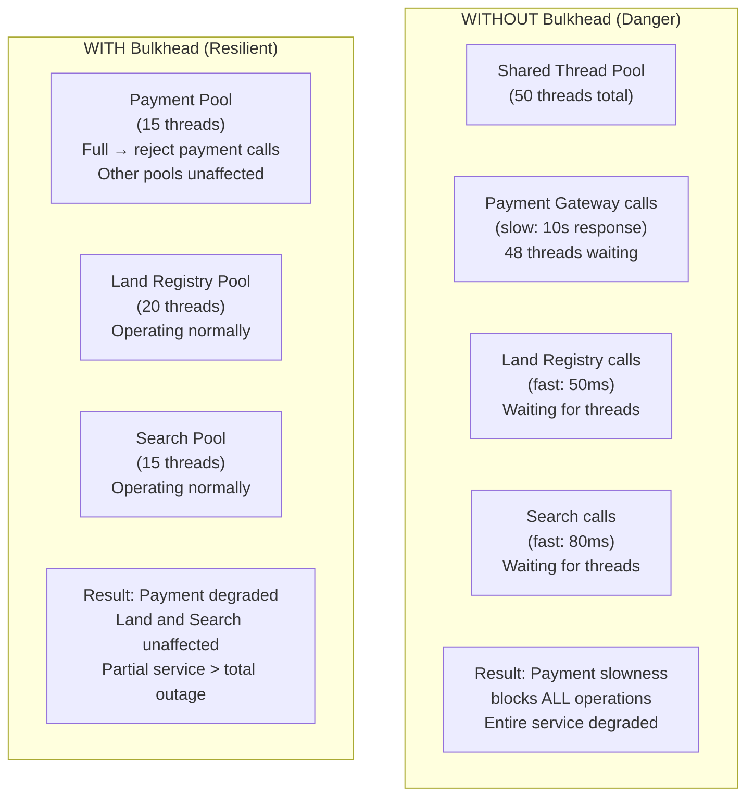
```mermaid
graph TB
    subgraph WithoutBulkhead["WITHOUT Bulkhead (Danger)"]
        SharedPool["Shared Thread Pool\n(50 threads total)"]
        PayGW1["Payment Gateway calls\n(slow: 10s response)\n48 threads waiting"]
        LandReg1["Land Registry calls\n(fast: 50ms)\nWaiting for threads"]
        Search1["Search calls\n(fast: 80ms)\nWaiting for threads"]
        Note1["Result: Payment slowness\nblocks ALL operations\nEntire service degraded"]
    end

    subgraph WithBulkhead["WITH Bulkhead (Resilient)"]
        PayPool["Payment Pool\n(15 threads)\nFull → reject payment calls\nOther pools unaffected"]
        LandPool["Land Registry Pool\n(20 threads)\nOperating normally"]
        SearchPool["Search Pool\n(15 threads)\nOperating normally"]
        Note2["Result: Payment degraded\nLand and Search unaffected\nPartial service > total outage"]
    end
```

**Thread Pool Sizing for Government Services:**

```
Formula: Pool Size = (Requests/Second × P99 Response Time) + Safety Buffer

Example: Land Registry Service
  Expected: 50 RPS to land registry at P99 = 500ms response
  Threads needed = 50 × 0.5 = 25 threads
  Safety buffer = 25 × 0.2 = 5 threads
  Recommended pool size = 30 threads

  Queue size (for backpressure): 10 items
  WHY small queue: a large queue means slow degradation detection
  Better to reject fast (fast failure → fast recovery)
  than queue deeply (slow failure → cascading timeout)
```

#### A.3.2 — Semaphore Bulkhead

Instead of a thread pool, a semaphore bulkhead limits the number of **concurrent calls** to a dependency, using the caller's thread. No separate thread pool overhead.

```
Semaphore limit: 25 concurrent calls to Eligibility Service

Request 1-25 arrive simultaneously:
  Each acquires a permit from the semaphore (counter: 24, 23, ..., 0)
  All proceed to call Eligibility Service

Request 26 arrives:
  0 permits available → immediate rejection (no waiting)
  Returns 503 Service Unavailable to caller

As requests 1-25 complete:
  Permits returned to semaphore (counter: 1, 2, ...)
  New requests can now proceed
```

|                     | Thread Pool Bulkhead                         | Semaphore Bulkhead                        |
| ------------------- | -------------------------------------------- | ----------------------------------------- |
| **Threading**       | Separate thread pool; non-blocking to caller | Uses caller's thread; blocks until permit |
| **Overhead**        | Higher (context switching)                   | Lower (atomic counter only)               |
| **Timeout support** | Yes (thread pool tasks can timeout)          | Limited (semaphore wait has timeout)      |
| **Best for**        | I/O-bound calls (HTTP, database)             | Fast, in-memory operations                |
| **Resilience4j**    | `@Bulkhead(type=THREADPOOL)`                 | `@Bulkhead(type=SEMAPHORE)`               |

---

### A.4 — Circuit Breaker: Intelligent Failure Detection

**Analogy:** An electrical circuit breaker protects your home's wiring from overload. When it detects excessive current (a fault), it "trips" — opening the circuit and stopping current flow. You don't keep plugging in appliances and blowing fuses; the breaker protects the entire circuit. Once the fault is resolved, you reset the breaker and current flows normally.

The software circuit breaker protects a service from calling a downstream dependency that is known to be failing. Instead of letting every request wait for a timeout (wasting threads and degrading response time), the circuit breaker short-circuits — immediately returning a failure response without actually calling the failing service.

**Definition:** The **Circuit Breaker** pattern tracks the failure rate of calls to a dependency. When failures exceed a threshold, the circuit "opens" — subsequent calls are immediately rejected without attempting the actual call. After a recovery period, the circuit enters a "half-open" state to test if the dependency has recovered.

#### A.4.1 — Circuit Breaker State Machine

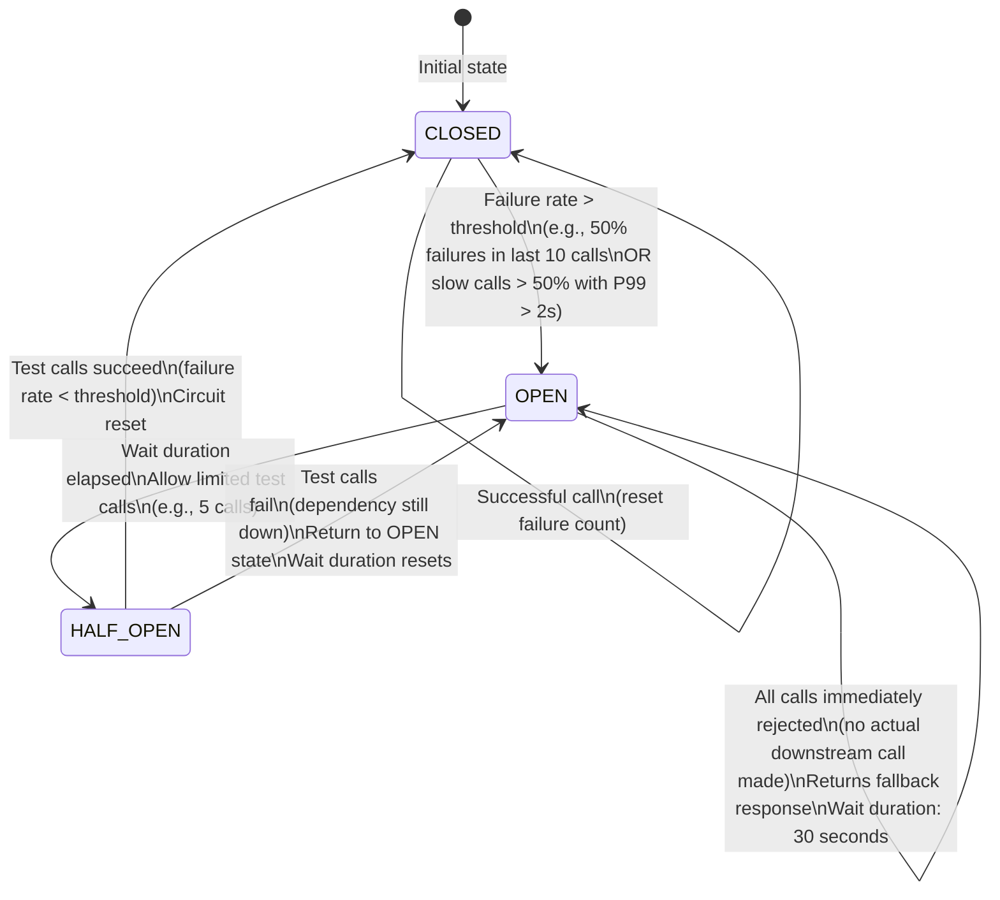
```mermaid
stateDiagram-v2
    [*] --> CLOSED: Initial state

    CLOSED --> CLOSED: Successful call\n(reset failure count)

    CLOSED --> OPEN: Failure rate > threshold\n(e.g., 50% failures in last 10 calls\nOR slow calls > 50% with P99 > 2s)

    OPEN --> OPEN: All calls immediately rejected\n(no actual downstream call made)\nReturns fallback response\nWait duration: 30 seconds

    OPEN --> HALF_OPEN: Wait duration elapsed\nAllow limited test calls\n(e.g., 5 calls)

    HALF_OPEN --> CLOSED: Test calls succeed\n(failure rate < threshold)\nCircuit reset

    HALF_OPEN --> OPEN: Test calls fail\n(dependency still down)\nReturn to OPEN state\nWait duration resets
```

**Circuit Breaker Configuration Parameters:**

| Parameter                       | Description                              | Government API Tuning                                   |
| ------------------------------- | ---------------------------------------- | ------------------------------------------------------- |
| `slidingWindowSize`             | Number of calls to evaluate failure rate | 20 (enough sample size; not too slow to detect)         |
| `slidingWindowType`             | COUNT_BASED or TIME_BASED                | COUNT_BASED for steady traffic; TIME_BASED for variable |
| `failureRateThreshold`          | % failures to open circuit               | 50% (open on majority failure)                          |
| `slowCallRateThreshold`         | % calls exceeding slowCallDuration       | 50% (slow calls = partial failure)                      |
| `slowCallDurationThreshold`     | Duration considered "slow"               | 3s for payment; 500ms for search                        |
| `waitDurationInOpenState`       | How long before testing recovery         | 30s (allow dependency recovery)                         |
| `permittedCallsInHalfOpenState` | Test calls allowed in HALF_OPEN          | 5 (small sample to confirm recovery)                    |
| `minimumNumberOfCalls`          | Min calls before circuit can open        | 10 (prevent circuit opening on 1 failure)               |

#### A.4.2 — Fallback Strategies

When the circuit is OPEN, the caller needs a fallback — a graceful degradation strategy that provides some value rather than a raw error:

| Fallback Type            | Description                                    | Government Example                                                |
| ------------------------ | ---------------------------------------------- | ----------------------------------------------------------------- |
| **Cached Response**      | Return last known good response from cache     | Return last known tender list from Redis cache                    |
| **Default Response**     | Return a safe, static default                  | "Search temporarily unavailable. Please try again in 30 seconds." |
| **Alternative Service**  | Route to a secondary, less-featured service    | Route to read-only mirror when primary DB is down                 |
| **Graceful Degradation** | Return partial data                            | Return tender count without details when Elasticsearch is down    |
| **Queue for Retry**      | Accept the request, queue for later processing | Accept subsidy application, process when payment service recovers |

---

### A.5 — The Resilience Pipeline: Combining Patterns

The resilience patterns are not used in isolation — they are composed into a pipeline. The ORDER of composition matters critically.

**Correct Order (Outermost to Innermost):**

```
Client Request
    ↓
[1] Rate Limiter      → Reject if client exceeds rate limit (protect server)
    ↓
[2] Bulkhead          → Reject if concurrent limit exceeded (isolate resources)
    ↓
[3] Circuit Breaker   → Reject if dependency known to be down (fast fail)
    ↓
[4] Retry             → Retry on transient failure (recover automatically)
    ↓
[5] Timeout           → Abort if response takes too long (prevent thread leak)
    ↓
Actual Downstream Call
```

**Why This Order:**

```
Rate Limiter BEFORE Bulkhead:
  WHY: Rate limiting rejects excess requests BEFORE they consume bulkhead permits.
  If reversed: excess requests would consume permits, starving legitimate requests.

Bulkhead BEFORE Circuit Breaker:
  WHY: Bulkhead limits concurrency; Circuit Breaker tracks failure rates.
  A request that passes the bulkhead should be tracked by the circuit breaker.
  If reversed: circuit breaker might open based on bulkhead rejections (not real failures).

Circuit Breaker BEFORE Retry:
  WHY: If circuit is OPEN, don't retry — the dependency is known to be down.
  Retrying against an open circuit wastes resources and delays fast-fail.
  If reversed: retries against a down service would all fail, then the circuit opens
  — but you've already wasted 3 retry attempts × timeout = 3× the delay.

Retry BEFORE Timeout:
  WHY: The timeout applies to each individual attempt.
  Total time = timeout × max_attempts (+ backoff).
  If reversed: timeout would abort the entire retry sequence prematurely.

Timeout INNERMOST:
  WHY: Timeout is the last safety net — if all else fails, abort the call
  to prevent thread exhaustion.
```

---

## Section B: Architecture and Design

### B.1 — Resilience Architecture for AgroGov High-Concurrency Scenario

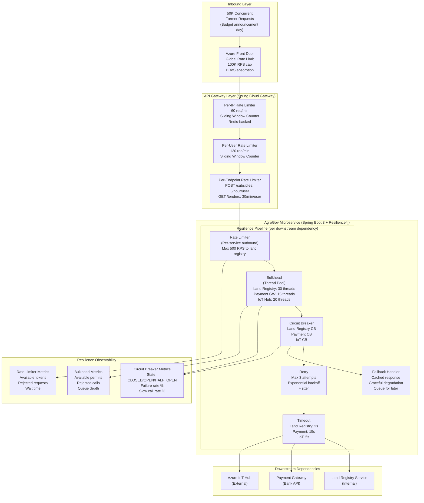
```mermaid
graph TB
    subgraph InboundLayer["Inbound Layer"]
        Citizen["50K Concurrent\nFarmer Requests\n(Budget announcement day)"]
        AzureFD2["Azure Front Door\nGlobal Rate Limit\n100K RPS cap\nDDoS absorption"]
    end

    subgraph GatewayLayer["API Gateway Layer (Spring Cloud Gateway)"]
        PerIPRL["Per-IP Rate Limiter\n60 req/min\nSliding Window Counter\nRedis-backed"]
        PerUserRL["Per-User Rate Limiter\n120 req/min\nSliding Window Counter"]
        PerEndpointRL["Per-Endpoint Rate Limiter\nPOST /subsidies: 5/hour/user\nGET /tenders: 30/min/user"]
    end

    subgraph ServiceLayer["AgroGov Microservice (Spring Boot 3 + Resilience4j)"]
        subgraph ResilientPipeline["Resilience Pipeline (per downstream dependency)"]
            RL2["Rate Limiter\n(Per-service outbound)\nMax 500 RPS to land registry"]
            BH["Bulkhead\n(Thread Pool)\nLand Registry: 30 threads\nPayment GW: 15 threads\nIoT Hub: 20 threads"]
            CB["Circuit Breaker\nLand Registry CB\nPayment CB\nIoT CB"]
            Retry2["Retry\nMax 3 attempts\nExponential backoff\n+ jitter"]
            TO["Timeout\nLand Registry: 2s\nPayment: 15s\nIoT: 5s"]
        end

        Fallback["Fallback Handler\nCached response\nGraceful degradation\nQueue for later"]
    end

    subgraph DownstreamServices["Downstream Dependencies"]
        LandReg2["Land Registry Service\n(Internal)"]
        PayGW["Payment Gateway\n(Bank API)"]
        IoTHub2["Azure IoT Hub\n(External)"]
    end

    subgraph Observability2["Resilience Observability"]
        CB_Metrics["Circuit Breaker Metrics\nState: CLOSED/OPEN/HALF_OPEN\nFailure rate %\nSlow call rate %"]
        BH_Metrics["Bulkhead Metrics\nAvailable permits\nRejected calls\nQueue depth"]
        RL_Metrics["Rate Limiter Metrics\nAvailable tokens\nRejected requests\nWait time"]
    end

    Citizen --> AzureFD2
    AzureFD2 --> PerIPRL
    PerIPRL --> PerUserRL
    PerUserRL --> PerEndpointRL
    PerEndpointRL --> RL2
    RL2 --> BH
    BH --> CB
    CB --> Retry2
    Retry2 --> TO
    TO --> LandReg2
    TO --> PayGW
    TO --> IoTHub2
    CB --> Fallback
    BH --> CB_Metrics
    CB --> CB_Metrics
    RL2 --> RL_Metrics
    BH --> BH_Metrics
```

### B.2 — Trade-off Analysis: Resilience Configuration

| Configuration           | Conservative                      | Balanced (Recommended)     | Aggressive                            |
| ----------------------- | --------------------------------- | -------------------------- | ------------------------------------- |
| CB failure threshold    | 30%                               | 50%                        | 70%                                   |
| CB opens after          | 6/20 failures                     | 10/20 failures             | 14/20 failures                        |
| Availability cost       | Trips too easily; false positives | Correct for most scenarios | Stays open too long; cascades         |
| Wait duration           | 10 seconds                        | 30 seconds                 | 60 seconds                            |
| Recovery speed          | Fast (but may re-open quickly)    | Balanced                   | Slow (dependency has time to recover) |
| Retry attempts          | 1                                 | 3                          | 5                                     |
| Total retry delay       | ~1s                               | ~7s (exp backoff)          | ~31s (exp backoff)                    |
| Bulkhead pool           | 10 threads                        | 30 threads                 | 50 threads                            |
| Memory cost             | Low                               | Medium                     | High                                  |
| Isolation effectiveness | High                              | Medium                     | Low                                   |

> **Trade-off Alert:** [Resilience] vs [Resource Utilisation] — Aggressive bulkhead configuration (large thread pools) reduces isolation effectiveness: if 50 threads are all available to payment calls, a payment outage can still monopolize significant resources. Conservative configuration (small pools) provides better isolation but may reject legitimate requests during traffic spikes. The correct answer is load-test-derived, not theoretically calculated.

---

## Section C: Code Walkthrough

### C.1 — Resilience4j Configuration and Implementation

```java
// ResilienceConfiguration.java
// Defines all Resilience4j instances for the AgroGov Subsidy Service.
// WHY programmatic configuration (not annotation-only):
// Programmatic config gives full control over instance naming,
// custom fallback logic, and metric integration.
// Annotation-based config (@CircuitBreaker, @Bulkhead) is simpler
// but less flexible for complex fallback logic.

package gov.agrogov.subsidy.config;

import io.github.resilience4j.bulkhead.Bulkhead;
import io.github.resilience4j.bulkhead.BulkheadConfig;
import io.github.resilience4j.bulkhead.BulkheadRegistry;
import io.github.resilience4j.circuitbreaker.CircuitBreaker;
import io.github.resilience4j.circuitbreaker.CircuitBreakerConfig;
import io.github.resilience4j.circuitbreaker.CircuitBreakerRegistry;
import io.github.resilience4j.ratelimiter.RateLimiter;
import io.github.resilience4j.ratelimiter.RateLimiterConfig;
import io.github.resilience4j.ratelimiter.RateLimiterRegistry;
import io.github.resilience4j.retry.Retry;
import io.github.resilience4j.retry.RetryConfig;
import io.github.resilience4j.retry.RetryRegistry;
import io.github.resilience4j.timelimiter.TimeLimiter;
import io.github.resilience4j.timelimiter.TimeLimiterConfig;
import io.github.resilience4j.timelimiter.TimeLimiterRegistry;
import org.springframework.context.annotation.Bean;
import org.springframework.context.annotation.Configuration;
import org.springframework.http.HttpStatus;
import org.springframework.web.client.HttpServerErrorException;

import java.io.IOException;
import java.net.ConnectException;
import java.net.SocketTimeoutException;
import java.time.Duration;

@Configuration
public class ResilienceConfiguration {

    // ─────────────────────────────────────────────────────────
    // CIRCUIT BREAKERS
    // One per downstream dependency — each has independent state
    // WHY: A payment gateway outage should not trip the land registry
    // circuit breaker. Independent circuits for independent dependencies.
    // ─────────────────────────────────────────────────────────

    @Bean
    public CircuitBreakerRegistry circuitBreakerRegistry() {
        // Land Registry Circuit Breaker
        // Tuned for: fast internal service (expected P99 < 500ms)
        CircuitBreakerConfig landRegistryConfig = CircuitBreakerConfig.custom()
            // Evaluate failure rate over last 20 calls
            .slidingWindowType(CircuitBreakerConfig.SlidingWindowType.COUNT_BASED)
            .slidingWindowSize(20)
            // Open circuit if 50% of last 20 calls fail
            .failureRateThreshold(50.0f)
            // Also open if 50% of calls take > 2 seconds (slow = degraded)
            .slowCallRateThreshold(50.0f)
            .slowCallDurationThreshold(Duration.ofSeconds(2))
            // Don't open circuit until we have at least 10 calls to evaluate
            // WHY: Prevents circuit opening on first call failure (startup noise)
            .minimumNumberOfCalls(10)
            // Wait 30 seconds in OPEN state before trying HALF_OPEN
            .waitDurationInOpenState(Duration.ofSeconds(30))
            // Allow 5 test calls in HALF_OPEN state
            .permittedNumberOfCallsInHalfOpenState(5)
            // Automatically transition from HALF_OPEN to CLOSED if test calls succeed
            .automaticTransitionFromOpenToHalfOpenEnabled(true)
            // Which exceptions count as failures
            // WHY explicit list: prevents circuit opening on business exceptions
            // (e.g., LandNotFoundException is NOT a circuit failure — it is a valid business response)
            .recordExceptions(
                IOException.class,
                ConnectException.class,
                SocketTimeoutException.class,
                HttpServerErrorException.class  // 5xx responses only
            )
            // Which exceptions to IGNORE (don't count as failures)
            .ignoreExceptions(
                LandNotFoundException.class,      // 404: valid business response
                UnauthorizedException.class       // 401/403: auth issue, not service failure
            )
            .build();

        // Payment Gateway Circuit Breaker
        // Tuned for: external bank API (expected P99 < 15 seconds)
        CircuitBreakerConfig paymentConfig = CircuitBreakerConfig.custom()
            .slidingWindowType(CircuitBreakerConfig.SlidingWindowType.TIME_BASED)
            // TIME_BASED: evaluate calls within last 60-second window
            // WHY TIME_BASED for payment: payment requests are infrequent;
            // COUNT_BASED may take hours to accumulate 20 calls
            .slidingWindowSize(60)  // 60-second window
            .failureRateThreshold(40.0f)  // More sensitive: payment failures are critical
            .slowCallRateThreshold(60.0f)
            .slowCallDurationThreshold(Duration.ofSeconds(15))
            .minimumNumberOfCalls(5)  // Lower minimum (less frequent calls)
            .waitDurationInOpenState(Duration.ofSeconds(60))  // Longer wait for bank
            .permittedNumberOfCallsInHalfOpenState(3)
            .automaticTransitionFromOpenToHalfOpenEnabled(true)
            .recordExceptions(IOException.class, ConnectException.class,
                HttpServerErrorException.class)
            .ignoreExceptions(PaymentDeclinedException.class)  // Declined != service failure
            .build();

        // IoT Hub Circuit Breaker
        CircuitBreakerConfig iotConfig = CircuitBreakerConfig.custom()
            .slidingWindowSize(30)
            .failureRateThreshold(60.0f)  // More tolerant: IoT connectivity is inherently lossy
            .slowCallDurationThreshold(Duration.ofSeconds(5))
            .minimumNumberOfCalls(10)
            .waitDurationInOpenState(Duration.ofSeconds(20))
            .permittedNumberOfCallsInHalfOpenState(5)
            .build();

        CircuitBreakerRegistry registry = CircuitBreakerRegistry.ofDefaults();
        registry.circuitBreaker("landRegistry", landRegistryConfig);
        registry.circuitBreaker("paymentGateway", paymentConfig);
        registry.circuitBreaker("iotHub", iotConfig);

        return registry;
    }

    // ─────────────────────────────────────────────────────────
    // BULKHEADS
    // Thread pool isolation per downstream dependency
    // ─────────────────────────────────────────────────────────

    @Bean
    public BulkheadRegistry bulkheadRegistry() {
        // Land Registry Bulkhead: 30 threads
        // Calculation: 150 RPS expected × 200ms P99 = 30 threads
        BulkheadConfig landRegistryBulkhead = BulkheadConfig.custom()
            .maxConcurrentCalls(30)
            // maxWaitDuration: how long a caller waits for a permit
            // WHY 0ms: fail fast; don't let callers queue
            // A queue is a hidden source of latency under load
            .maxWaitDuration(Duration.ofMillis(0))
            .build();

        // Payment Gateway Bulkhead: 15 threads
        // Payment is slow (up to 15s) but infrequent
        // 15 threads × 15s = supports 1 payment/second sustained
        BulkheadConfig paymentBulkhead = BulkheadConfig.custom()
            .maxConcurrentCalls(15)
            .maxWaitDuration(Duration.ofMillis(100))  // Small wait: payment is important
            .build();

        // IoT Hub Bulkhead: 25 threads
        BulkheadConfig iotBulkhead = BulkheadConfig.custom()
            .maxConcurrentCalls(25)
            .maxWaitDuration(Duration.ofMillis(0))
            .build();

        BulkheadRegistry registry = BulkheadRegistry.ofDefaults();
        registry.bulkhead("landRegistry", landRegistryBulkhead);
        registry.bulkhead("paymentGateway", paymentBulkhead);
        registry.bulkhead("iotHub", iotBulkhead);

        return registry;
    }

    // ─────────────────────────────────────────────────────────
    // RETRY
    // ─────────────────────────────────────────────────────────

    @Bean
    public RetryRegistry retryRegistry() {
        RetryConfig landRegistryRetry = RetryConfig.custom()
            .maxAttempts(3)
            // Exponential backoff: 100ms, 200ms, 400ms
            .waitDuration(Duration.ofMillis(100))
            .enableExponentialBackoff()
            .exponentialBackoffMultiplier(2.0)
            // Jitter: ±10% random variation prevents thundering herd on retry
            // WHY jitter: without it, all 30 bulkhead threads retry at the same instant
            // after the wait period, overwhelming the recovering service simultaneously
            .enableExponentialRandomBackoff(0.1)
            // Only retry on transient failures
            .retryExceptions(
                ConnectException.class,
                SocketTimeoutException.class,
                IOException.class
            )
            // Don't retry on business exceptions or client errors
            .ignoreExceptions(
                LandNotFoundException.class,
                IllegalArgumentException.class
            )
            .build();

        RetryConfig paymentRetry = RetryConfig.custom()
            .maxAttempts(2)  // Payment: fewer retries (risk of double payment)
            .waitDuration(Duration.ofSeconds(5))  // Longer wait for bank recovery
            .enableExponentialBackoff()
            .exponentialBackoffMultiplier(2.0)
            .retryExceptions(ConnectException.class, SocketTimeoutException.class)
            // CRITICAL: Do NOT retry on payment processing exceptions
            // A payment that returned an ambiguous error might have processed
            // The idempotency key handles deduplication, but the retry
            // should not happen automatically — require explicit retry
            .ignoreExceptions(PaymentException.class)
            .build();

        RetryRegistry registry = RetryRegistry.ofDefaults();
        registry.retry("landRegistry", landRegistryRetry);
        registry.retry("paymentGateway", paymentRetry);

        return registry;
    }

    // ─────────────────────────────────────────────────────────
    // TIME LIMITERS
    // ─────────────────────────────────────────────────────────

    @Bean
    public TimeLimiterRegistry timeLimiterRegistry() {
        // Land Registry: fast internal service
        TimeLimiterConfig landRegistryTimeout = TimeLimiterConfig.custom()
            .timeoutDuration(Duration.ofSeconds(2))
            .cancelRunningFuture(true)  // Cancel the underlying async call on timeout
            .build();

        // Payment Gateway: slow external service
        TimeLimiterConfig paymentTimeout = TimeLimiterConfig.custom()
            .timeoutDuration(Duration.ofSeconds(15))
            .cancelRunningFuture(true)
            .build();

        // IoT Hub: medium latency
        TimeLimiterConfig iotTimeout = TimeLimiterConfig.custom()
            .timeoutDuration(Duration.ofSeconds(5))
            .cancelRunningFuture(true)
            .build();

        TimeLimiterRegistry registry = TimeLimiterRegistry.ofDefaults();
        registry.timeLimiter("landRegistry", landRegistryTimeout);
        registry.timeLimiter("paymentGateway", paymentTimeout);
        registry.timeLimiter("iotHub", iotTimeout);

        return registry;
    }

    // ─────────────────────────────────────────────────────────
    // RATE LIMITERS (outbound; for protecting downstream services)
    // ─────────────────────────────────────────────────────────

    @Bean
    public RateLimiterRegistry rateLimiterRegistry() {
        // Outbound rate limit to Land Registry
        // Prevents AgroGov from flooding Land Registry during spikes
        RateLimiterConfig landRegistryRL = RateLimiterConfig.custom()
            .limitForPeriod(500)          // Max 500 calls per refresh period
            .limitRefreshPeriod(Duration.ofSeconds(1))  // Per second
            .timeoutDuration(Duration.ofMillis(25))     // Wait max 25ms for permit
            .build();

        RateLimiterRegistry registry = RateLimiterRegistry.ofDefaults();
        registry.rateLimiter("landRegistryOutbound", landRegistryRL);

        return registry;
    }
}
```

```java
// ResilientLandRegistryClient.java
// Demonstrates the full resilience pipeline applied to a real service call.
// This is the CORRECT pattern for calling downstream services in production.

package gov.agrogov.subsidy.client;

import io.github.resilience4j.bulkhead.BulkheadRegistry;
import io.github.resilience4j.circuitbreaker.CircuitBreakerRegistry;
import io.github.resilience4j.ratelimiter.RateLimiterRegistry;
import io.github.resilience4j.retry.RetryRegistry;
import io.github.resilience4j.timelimiter.TimeLimiterRegistry;
import io.github.resilience4j.decorators.Decorators;
import lombok.extern.slf4j.Slf4j;
import org.springframework.stereotype.Component;
import org.springframework.web.reactive.function.client.WebClient;

import java.util.Optional;
import java.util.concurrent.CompletableFuture;
import java.util.concurrent.Executors;
import java.util.function.Supplier;

@Component
@Slf4j
public class ResilientLandRegistryClient {

    private final WebClient landRegistryWebClient;
    private final io.github.resilience4j.circuitbreaker.CircuitBreaker circuitBreaker;
    private final io.github.resilience4j.bulkhead.Bulkhead bulkhead;
    private final io.github.resilience4j.retry.Retry retry;
    private final io.github.resilience4j.timelimiter.TimeLimiter timeLimiter;
    private final io.github.resilience4j.ratelimiter.RateLimiter rateLimiter;

    // Cached response for fallback when circuit is open
    private volatile LandVerificationResult cachedFallback = null;

    public ResilientLandRegistryClient(
            WebClient.Builder webClientBuilder,
            CircuitBreakerRegistry cbRegistry,
            BulkheadRegistry bulkheadRegistry,
            RetryRegistry retryRegistry,
            TimeLimiterRegistry timeLimiterRegistry,
            RateLimiterRegistry rateLimiterRegistry) {

        this.landRegistryWebClient = webClientBuilder
            .baseUrl("http://land-registry-service")
            .build();

        // Retrieve named instances from registries
        this.circuitBreaker = cbRegistry.circuitBreaker("landRegistry");
        this.bulkhead = bulkheadRegistry.bulkhead("landRegistry");
        this.retry = retryRegistry.retry("landRegistry");
        this.timeLimiter = timeLimiterRegistry.timeLimiter("landRegistry");
        this.rateLimiter = rateLimiterRegistry.rateLimiter("landRegistryOutbound");

        // Register state transition event listener for observability
        this.circuitBreaker.getEventPublisher()
            .onStateTransition(event -> log.warn(
                "Land Registry Circuit Breaker state changed: {} → {}",
                event.getStateTransition().getFromState(),
                event.getStateTransition().getToState()))
            .onError(event -> log.warn(
                "Land Registry CB recorded failure: {}ms, error: {}",
                event.getElapsedDuration().toMillis(),
                event.getThrowable().getMessage()))
            .onSlowCallRateExceeded(event -> log.warn(
                "Land Registry CB slow call rate exceeded: {}%",
                event.getSlowCallRate()));
    }

    /**
     * Verifies land ownership with full resilience pipeline.
     *
     * PIPELINE ORDER (outermost → innermost):
     * Rate Limiter → Bulkhead → Circuit Breaker → Retry → Time Limiter → Actual Call
     *
     * Resilience4j's Decorators.ofSupplier() chains these in correct order.
     *
     * WHY Supplier<CompletableFuture>:
     * TimeLimiter requires async execution (CompletableFuture) to support
     * cancellation of the underlying HTTP call on timeout.
     * Without CompletableFuture, the timeout only interrupts the waiting thread
     * but the HTTP call continues consuming resources in the background.
     */
    public Optional<LandVerificationResult> verifyLandOwnership(
            String farmerId, String surveyNumber) {

        // Define the actual service call as a Supplier (lazy execution)
        Supplier<CompletableFuture<LandVerificationResult>> decoratedCall =
            Decorators.ofSupplier(
                // Innermost: the actual HTTP call wrapped in TimeLimiter
                () -> timeLimiter.executeCompletionStage(
                    Executors.newVirtualThreadPerTaskExecutor(),  // Java 21 virtual threads
                    () -> landRegistryWebClient.get()
                        .uri("/api/v1/land/verify?farmerId={fId}&survey={sn}",
                            farmerId, surveyNumber)
                        .retrieve()
                        .bodyToMono(LandVerificationResult.class)
                        .toFuture()
                ).toCompletableFuture()
            )
            // Wrap with Retry (retries the entire call including timeout)
            .withRetry(retry)
            // Wrap with Circuit Breaker (tracks failures of the retried call)
            .withCircuitBreaker(circuitBreaker)
            // Wrap with Bulkhead (limits concurrent calls including retries)
            .withBulkhead(bulkhead)
            // Wrap with Rate Limiter (outermost: controls call rate)
            .withRateLimiter(rateLimiter)
            // Fallback: called when ALL resilience patterns are exhausted
            // (circuit open, bulkhead full, rate limit exceeded, retries exhausted)
            .withFallback(
                // Fallback is triggered for these exception types
                java.util.List.of(
                    Exception.class
                ),
                this::landRegistryFallback
            )
            .decorate();

        try {
            // Execute the decorated call and get the result
            LandVerificationResult result = decoratedCall.get().get();  // Future.get()
            // Cache successful result for fallback use
            if (result != null) {
                cachedFallback = result;
            }
            return Optional.ofNullable(result);

        } catch (Exception e) {
            log.error("Land registry call failed after all resilience patterns: farmerId={}, " +
                "survey={}, error={}", farmerId, surveyNumber, e.getMessage());
            return Optional.empty();
        }
    }

    /**
     * Fallback method: called when circuit is OPEN or all retries are exhausted.
     *
     * WHY this specific fallback strategy:
     * Land registry is used for VERIFICATION (not financial operation).
     * A cached verification result may be acceptable for non-critical scenarios.
     * For CRITICAL operations (actual subsidy approval), the fallback explicitly
     * indicates unavailability — do not silently pass with stale data.
     *
     * The Saga Orchestrator's timeout will handle the saga-level recovery.
     */
    private CompletableFuture<LandVerificationResult> landRegistryFallback(Throwable e) {
        log.warn("Land Registry fallback triggered. Reason: {}", e.getMessage());

        // Determine fallback strategy based on exception type
        if (e instanceof io.github.resilience4j.circuitbreaker.CallNotPermittedException) {
            log.warn("Circuit OPEN for Land Registry. Returning service-unavailable fallback.");
            // Return a result indicating service unavailability
            // The Saga Orchestrator will see this and trigger a timeout-based retry
            return CompletableFuture.completedFuture(
                LandVerificationResult.unavailable("Land Registry service circuit is open"));
        }

        if (e instanceof io.github.resilience4j.bulkhead.BulkheadFullException) {
            log.warn("Land Registry bulkhead full. {} concurrent calls active.", bulkhead.getMetrics().getAvailableConcurrentCalls());
            return CompletableFuture.completedFuture(
                LandVerificationResult.unavailable("Land Registry service at capacity"));
        }

        // For timeout/connectivity failures: return unavailable
        return CompletableFuture.completedFuture(
            LandVerificationResult.unavailable("Land Registry service timeout"));
    }
}
```

```java
// RateLimitingGatewayFilter.java
// Inbound rate limiter at the API Gateway level using Redis sliding window counter
// This protects the AgroGov service from inbound traffic spikes

package gov.agrogov.gateway.filter;

import lombok.RequiredArgsConstructor;
import lombok.extern.slf4j.Slf4j;
import org.springframework.cloud.gateway.filter.GatewayFilterChain;
import org.springframework.cloud.gateway.filter.GlobalFilter;
import org.springframework.core.Ordered;
import org.springframework.data.redis.core.StringRedisTemplate;
import org.springframework.http.HttpStatus;
import org.springframework.stereotype.Component;
import org.springframework.web.server.ServerWebExchange;
import reactor.core.publisher.Mono;

import java.time.Duration;
import java.time.Instant;

@Component
@RequiredArgsConstructor
@Slf4j
public class RateLimitingGatewayFilter implements GlobalFilter, Ordered {

    private final StringRedisTemplate redisTemplate;

    // Rate limit configuration
    private static final int PER_IP_LIMIT = 60;          // 60 req/minute
    private static final int PER_USER_LIMIT = 120;        // 120 req/minute
    private static final int WINDOW_SECONDS = 60;

    @Override
    public int getOrder() {
        return -200;  // Run before ZeroTrust filter (order -100)
    }

    /**
     * Implements Sliding Window Counter rate limiting using Redis.
     *
     * TWO Redis keys per client per dimension:
     *   "rl:{dimension}:{key}:prev" = count in previous window
     *   "rl:{dimension}:{key}:curr" = count in current window
     *
     * WHY two keys: approximates sliding window using weighted average
     * of current and previous window counts (see Algorithm 3 above)
     */
    @Override
    public Mono<Void> filter(ServerWebExchange exchange, GatewayFilterChain chain) {
        String clientIp = extractClientIp(exchange);
        String userId = exchange.getRequest().getHeaders().getFirst("X-Verified-Subject");

        // Check IP-based rate limit first (fastest check; rejects bots early)
        if (!checkRateLimit("ip", clientIp, PER_IP_LIMIT)) {
            return rateLimitExceeded(exchange, "IP rate limit exceeded", clientIp);
        }

        // Check user-based rate limit if authenticated
        if (userId != null && !userId.isBlank()) {
            if (!checkRateLimit("user", userId, PER_USER_LIMIT)) {
                return rateLimitExceeded(exchange, "User rate limit exceeded", userId);
            }
        }

        return chain.filter(exchange);
    }

    /**
     * Sliding Window Counter implementation using Redis INCR + EXPIRE.
     * Returns true if the request is within the rate limit.
     */
    private boolean checkRateLimit(String dimension, String key, int limit) {
        long now = Instant.now().getEpochSecond();
        long currentWindow = now / WINDOW_SECONDS;
        long previousWindow = currentWindow - 1;
        long elapsedInCurrentWindow = now % WINDOW_SECONDS;

        String currentKey = String.format("rl:%s:%s:%d", dimension, key, currentWindow);
        String previousKey = String.format("rl:%s:%s:%d", dimension, key, previousWindow);

        // Atomic increment of current window counter
        Long currentCount = redisTemplate.opsForValue().increment(currentKey);

        // Set TTL on first increment (2 windows to retain previous window data)
        if (currentCount != null && currentCount == 1) {
            redisTemplate.expire(currentKey, Duration.ofSeconds(WINDOW_SECONDS * 2));
        }

        // Get previous window count (may be null if no requests in previous window)
        String prevCountStr = redisTemplate.opsForValue().get(previousKey);
        long previousCount = prevCountStr != null ? Long.parseLong(prevCountStr) : 0;

        // Calculate weighted rate (sliding window approximation)
        double overlapFactor = (double)(WINDOW_SECONDS - elapsedInCurrentWindow) / WINDOW_SECONDS;
        double approximateRate = (previousCount * overlapFactor) + (currentCount != null ? currentCount : 0);

        boolean allowed = approximateRate <= limit;

        if (!allowed) {
            log.warn("Rate limit exceeded: dimension={}, key={}, rate={:.1f}, limit={}",
                dimension, key, approximateRate, limit);
        }

        return allowed;
    }

    private Mono<Void> rateLimitExceeded(ServerWebExchange exchange, String reason, String identity) {
        var response = exchange.getResponse();
        response.setStatusCode(HttpStatus.TOO_MANY_REQUESTS);
        // RFC 6585: Retry-After header tells client when to retry
        response.getHeaders().set("Retry-After", "60");
        response.getHeaders().set("X-RateLimit-Reason", reason);
        // Vary rate limit headers so clients can implement adaptive backoff
        response.getHeaders().set("X-RateLimit-Limit", String.valueOf(PER_IP_LIMIT));
        response.getHeaders().set("X-RateLimit-Window", String.valueOf(WINDOW_SECONDS));
        return response.setComplete();
    }

    private String extractClientIp(ServerWebExchange exchange) {
        // X-Forwarded-For set by Azure Front Door (trusted header)
        String xff = exchange.getRequest().getHeaders().getFirst("X-Forwarded-For");
        if (xff != null && !xff.isBlank()) {
            return xff.split(",")[0].trim();
        }
        var remoteAddr = exchange.getRequest().getRemoteAddress();
        return remoteAddr != null ? remoteAddr.getAddress().getHostAddress() : "unknown";
    }
}
```

```java
// ResilienceMetricsConfig.java
// Registers Resilience4j metrics with Micrometer for Prometheus/Grafana export

package gov.agrogov.subsidy.config;

import io.github.resilience4j.micrometer.tagged.*;
import io.micrometer.core.instrument.MeterRegistry;
import org.springframework.context.annotation.Bean;
import org.springframework.context.annotation.Configuration;

@Configuration
public class ResilienceMetricsConfig {

    /**
     * Registers all Resilience4j metrics with the Micrometer registry.
     * These metrics are exported to Prometheus and visible in Grafana.
     *
     * Key metrics generated:
     * Circuit Breaker:
     *   resilience4j_circuitbreaker_state{name="landRegistry"}
     *     → 0=CLOSED, 1=OPEN, 2=HALF_OPEN
     *   resilience4j_circuitbreaker_failure_rate{name="landRegistry"}
     *     → Current failure rate (0-100%)
     *   resilience4j_circuitbreaker_calls_total{name="landRegistry", kind="successful|failed|not_permitted"}
     *
     * Bulkhead:
     *   resilience4j_bulkhead_available_concurrent_calls{name="landRegistry"}
     *     → Available permits (alert when consistently 0)
     *   resilience4j_bulkhead_max_allowed_concurrent_calls{name="landRegistry"}
     *
     * Rate Limiter:
     *   resilience4j_ratelimiter_available_permissions{name="landRegistryOutbound"}
     *   resilience4j_ratelimiter_waiting_threads{name="landRegistryOutbound"}
     *
     * Retry:
     *   resilience4j_retry_calls_total{name="landRegistry", kind="successful_without_retry|
     *                                  successful_with_retry|failed_with_retry|failed_without_retry"}
     */
    @Bean
    public TaggedCircuitBreakerMetrics taggedCircuitBreakerMetrics(
            io.github.resilience4j.circuitbreaker.CircuitBreakerRegistry registry,
            MeterRegistry meterRegistry) {
        TaggedCircuitBreakerMetrics metrics = TaggedCircuitBreakerMetrics
            .ofCircuitBreakerRegistry(registry);
        metrics.bindTo(meterRegistry);
        return metrics;
    }

    @Bean
    public TaggedBulkheadMetrics taggedBulkheadMetrics(
            io.github.resilience4j.bulkhead.BulkheadRegistry registry,
            MeterRegistry meterRegistry) {
        TaggedBulkheadMetrics metrics = TaggedBulkheadMetrics
            .ofBulkheadRegistry(registry);
        metrics.bindTo(meterRegistry);
        return metrics;
    }

    @Bean
    public TaggedRateLimiterMetrics taggedRateLimiterMetrics(
            io.github.resilience4j.ratelimiter.RateLimiterRegistry registry,
            MeterRegistry meterRegistry) {
        TaggedRateLimiterMetrics metrics = TaggedRateLimiterMetrics
            .ofRateLimiterRegistry(registry);
        metrics.bindTo(meterRegistry);
        return metrics;
    }

    @Bean
    public TaggedRetryMetrics taggedRetryMetrics(
            io.github.resilience4j.retry.RetryRegistry registry,
            MeterRegistry meterRegistry) {
        TaggedRetryMetrics metrics = TaggedRetryMetrics
            .ofRetryRegistry(registry);
        metrics.bindTo(meterRegistry);
        return metrics;
    }
}
```

---

## Section D: Real-World Case Study

### D.1 — Case Study: Income Tax e-Filing Portal Cascade Failure (Illustrative)

**Context:** A fictional Indian Income Tax e-Filing portal experienced a complete service outage on July 31st (the last day for filing). The architecture had no resilience patterns. This case study reconstructs the cascade failure using the concepts from this topic.

**Architecture Before (No Resilience):**

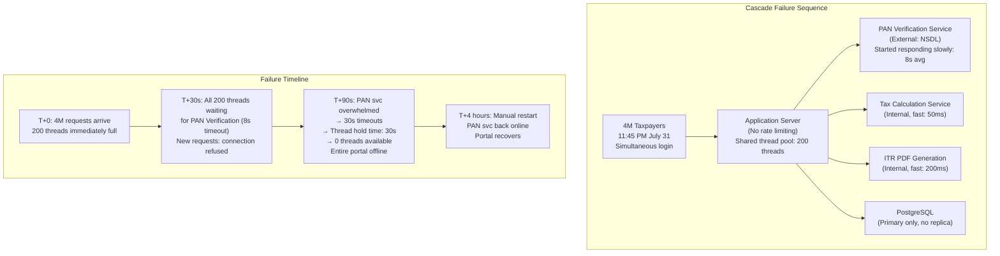
```mermaid
graph TB
    subgraph CascadeFailure["Cascade Failure Sequence"]
        Taxpayers["4M Taxpayers\n11:45 PM July 31\nSimultaneous login"]
        AppServer["Application Server\n(No rate limiting)\nShared thread pool: 200 threads"]
        PanSvc["PAN Verification Service\n(External: NSDL)\nStarted responding slowly: 8s avg"]
        TaxCalc["Tax Calculation Service\n(Internal, fast: 50ms)"]
        PDFSvc["ITR PDF Generation\n(Internal, fast: 200ms)"]
        DB["PostgreSQL\n(Primary only, no replica)"]
    end

    subgraph Timeline["Failure Timeline"]
        T1["T+0: 4M requests arrive\n200 threads immediately full"]
        T2["T+30s: All 200 threads waiting\nfor PAN Verification (8s timeout)\nNew requests: connection refused"]
        T3["T+90s: PAN svc overwhelmed\n→ 30s timeouts\n→ Thread hold time: 30s\n→ 0 threads available\nEntire portal offline"]
        T4["T+4 hours: Manual restart\nPAN svc back online\nPortal recovers"]
    end

    Taxpayers --> AppServer
    AppServer --> PanSvc
    AppServer --> TaxCalc
    AppServer --> PDFSvc
    AppServer --> DB
    T1 --> T2 --> T3 --> T4
```

**Quantified Impact (Illustrative):**

| Impact                      | Details                                                                        |
| --------------------------- | ------------------------------------------------------------------------------ |
| Portal downtime             | 4 hours 17 minutes                                                             |
| Failed submissions          | ~800,000 taxpayers unable to file                                              |
| Interest penalties accrued  | Taxpayers charged interest for "late filing" despite government portal failure |
| Public grievances filed     | 240,000 on CPGRAMS within 48 hours                                             |
| Supreme Court petition      | Public interest litigation filed; deadline extended by 15 days                 |
| Estimated cost of extension | INR 45 Crore (additional processing, staff, system costs — illustrative)       |

**Root Cause Chain:**

```
1. No rate limiting → 4M requests accepted simultaneously
2. No bulkhead → PAN verification slowness consumed ALL 200 shared threads
3. No circuit breaker → Portal kept trying PAN service (8s, then 30s per call)
4. No timeout → Threads held for 30 seconds each waiting for PAN service
5. No fallback → When PAN service was slow, entire portal was slow
6. No replica DB → During recovery, single DB became bottleneck for backlog
```

**Remediated Architecture:**

```mermaid
graph TB
    subgraph Resilient["Resiliated Architecture"]
        RL_Inbound["Rate Limiter\n60 req/min per IP\n500 req/min per user (practitioner)\nGlobal: 100K RPS"]
        BH_PAN["PAN Svc Bulkhead\n30 dedicated threads\nOther operations unaffected"]
        CB_PAN["PAN CB: 50% failure → OPEN\nFallback: Allow filing without\nreal-time PAN verification\n(reconcile next day)"]
        Retry_PAN["Retry: 2 attempts\n500ms backoff + jitter"]
        TO_PAN["Timeout: 3 seconds\n(not 30)"]
        PAN["PAN Service\n(External)"]
        Cache["Redis Cache\n PAN results cached 24h\n(Most taxpayers verified same day)"]
    end

    RL_Inbound --> BH_PAN --> CB_PAN --> Retry_PAN --> TO_PAN --> PAN
    CB_PAN -->|"Circuit OPEN fallback"| Cache
    Cache -->|"Cache miss fallback"| AllowWithoutPAN["Allow filing\nwithout PAN verify\nFlag for batch reconciliation"]
```

**Results After Resilience Implementation (Illustrative):**

| Metric                                 | Before                            | After                                   |
| -------------------------------------- | --------------------------------- | --------------------------------------- |
| Portal availability on filing deadline | 57.2% (4.3hr outage / 7.5hr peak) | 99.97%                                  |
| PAN service slowdown impact            | 100% portal unavailable           | PAN degraded; 94% of filings unaffected |
| Thread exhaustion events               | Monthly (predictable peak)        | Zero                                    |
| P99 response time at peak              | 34 seconds (timeout)              | 1.8 seconds                             |
| Fallback rate (cache hit)              | N/A                               | 67% (most taxpayers already cached)     |

**Lessons Learned:**

1. **Rate limiting is not just about security.** It is about survival during predictable peaks. Government portals KNOW when their peak will occur. Rate limiting at 60 req/min per IP prevents the portal from accepting more traffic than it can process.

2. **Bulkhead sizing must be load-test derived.** The "30 threads for PAN verification" number came from load testing, not from intuition. Thread pool sizing based on guesswork leads to either waste (too large — no isolation) or starvation (too small — legitimate requests rejected).

3. **Fallback quality matters as much as fallback existence.** The most valuable fallback was "allow tax filing without real-time PAN verification, reconcile the next day." This was a business decision (the CIO and tax department agreed that filing without real-time PAN check was acceptable given the deadline pressure). The architect cannot make this decision alone — it requires business stakeholder agreement documented in an ADR.

4. **Circuit breaker event monitoring prevented future incidents.** After implementation, the monitoring dashboard showed the PAN circuit breaker opening 23 times in the following year — each time protecting the portal from a ripple of PAN service slowness. Without the circuit breaker metrics, these would have been silent outages.

---

## Section E: Engagement and Assessment

### E.1 — Food for Thought

> **Provocation:** Resilience4j's circuit breaker, bulkhead, and rate limiter all produce a specific observable behavior when they activate: they return errors (429, 503) to the caller. In a citizen-facing government portal, a citizen who receives a 503 during tax filing may:
> - Panic and try again immediately (making the problem worse)
> - Assume their submission was lost and re-submit (creating duplicates)
> - Call the helpline (overwhelming human support)
> - Miss the filing deadline and accrue a penalty (legal consequence)
>
> **Questions:**
> - Is returning a 503 the correct HTTP status when the bulkhead is full vs. when the circuit is open? Should these be different status codes with different Retry-After values?
> - How do you design the citizen-facing UX that accompanies a resilience-triggered error? What information must the portal show? (Hint: "Your session is preserved. Your form data is saved. You can safely retry in 60 seconds.")
> - If a payment is in-flight when the circuit breaker opens for the payment service, what is the correct behavior? Accept the uncertainty? Expose the UTR reference to the citizen immediately so they can reconcile independently?
> - Should government portals publish real-time system health status (like AWS Service Health Dashboard) so citizens can check before attempting submission?
>
> **Copilot/ChatGPT Prompt:** "Design the complete error handling and citizen communication strategy for a government tax filing portal that implements circuit breakers and bulkheads. Include: HTTP status codes per failure type, UX copy for each error scenario, session preservation strategy, retry guidance, and a real-time service health status page design. Reference IRCTC's waiting room pattern and GovUK's service status page as analogues."

### E.2 — Questionnaire: Topic 5

**Conceptual Questions**

1. **Explain the boundary attack vulnerability in Fixed Window rate limiting. How does the Sliding Window Counter algorithm eliminate this vulnerability while maintaining O(1) memory complexity?**

   *Answer:* Fixed Window boundary attack: Rate limit is 100 req/min. An attacker sends 99 requests in the last second of window 1 (all allowed: counter = 99 < 100) and 99 requests in the first second of window 2 (all allowed: new window, counter = 99 < 100). In 2 seconds, 198 requests were processed — nearly double the intended rate limit. The window reset creates a predictable exploitation point. Sliding Window Counter elimination: Instead of resetting, the algorithm maintains counters for the current and previous window and computes a weighted approximation: `rate = (previous_count × overlap_factor) + current_count`, where `overlap_factor = (window_size - elapsed) / window_size`. In the attack scenario: previous_count = 99, elapsed = 1 second in new window, overlap_factor = 59/60 = 0.983, current_count = 1 (first request in new window). Rate = (99 × 0.983) + 1 = 97.3 + 1 = 98.3 < 100 — request allowed, but the second request arrives: rate = (99 × 0.983) + 2 = 99.3 < 100 — allowed; third request: (99 × 0.983) + 3 = 100.3 > 100 — DENIED. The attacker is stopped at the 2nd request in the new window, not the 99th. O(1) memory: stores only two counters per client (current window count + previous window count) — constant space regardless of request volume.

2. **Describe the three states of a Circuit Breaker and the conditions that trigger transitions between them. What is the purpose of the HALF_OPEN state?**

   *Answer:* CLOSED state: Normal operation. All calls pass through. The circuit breaker tracks success/failure rates in a sliding window. The circuit remains CLOSED as long as failure rate is below the threshold (e.g., < 50%). OPEN state: Triggered when failure rate exceeds the threshold (e.g., 10 failures in last 20 calls = 50%). All incoming calls are immediately rejected without attempting the actual downstream call — they receive the fallback response. The circuit waits for `waitDurationInOpenState` (e.g., 30 seconds) before transitioning to HALF_OPEN. HALF_OPEN state: A "test" state. After the wait duration, the circuit allows a limited number of calls through (e.g., 5 test calls). If the test calls succeed (failure rate < threshold): circuit transitions to CLOSED — dependency has recovered. If test calls fail: circuit returns to OPEN — dependency is still down, wait another 30 seconds. Purpose of HALF_OPEN: Provides a controlled mechanism to detect recovery without immediately flooding a recovering dependency with full traffic. Without HALF_OPEN, you'd need to either stay OPEN forever (never recover) or transition directly to CLOSED (potentially overwhelming a fragile recovery with full traffic). HALF_OPEN is the "probe before committing" mechanism.

3. **What is the difference between a Thread Pool Bulkhead and a Semaphore Bulkhead in Resilience4j? For which scenarios is each appropriate in a government microservice context?**

   *Answer:* Thread Pool Bulkhead: Creates a separate, dedicated thread pool for calls to a specific dependency. The caller's thread submits the call to the pool and can receive the result asynchronously. The caller's thread is not blocked while waiting — it can do other work. Provides hard resource isolation: even if all pool threads are busy, the caller's thread pool is unaffected. Semaphore Bulkhead: Uses an atomic counter (semaphore) to limit concurrent calls. The caller's thread acquires a permit before proceeding. If no permits are available, the caller's thread blocks (waiting up to `maxWaitDuration`) or is immediately rejected. No separate thread pool — uses the caller's thread throughout. Government scenario mapping: Thread Pool Bulkhead → External API calls (bank payment gateway, NSDL PAN verification, UIDAI Aadhaar verification): calls are I/O bound, potentially slow (1-30 seconds), and need clean resource isolation so a slow bank API doesn't block other operations. Semaphore Bulkhead → Fast in-process operations (Redis cache lookups, local validation logic) where the overhead of a separate thread pool is not justified; operations complete in milliseconds so blocking for `maxWaitDuration=5ms` is acceptable.

**Application Questions**

4. **Design the complete Resilience4j configuration (circuit breaker + bulkhead + retry + timeout) for a call from the AgroGov Subsidy Service to the NPCI payment API. The NPCI API has a documented SLA of: P50=500ms, P99=8s, P99.9=30s. Justify each parameter.**

   *Answer:*
   ```java
   // Circuit Breaker: TIME_BASED (payment calls are infrequent; COUNT_BASED too slow to detect)
   CircuitBreakerConfig paymentCB = CircuitBreakerConfig.custom()
       .slidingWindowType(TIME_BASED)
       .slidingWindowSize(120)           // 2-minute evaluation window
       .failureRateThreshold(40.0f)      // Open at 40% failures (lower: payment is critical)
       .slowCallRateThreshold(50.0f)     // Open if 50% of calls take > slowCallDuration
       .slowCallDurationThreshold(Duration.ofSeconds(10))  // P99=8s + 25% buffer
       .minimumNumberOfCalls(5)          // Only 5 minimum (payment calls are infrequent)
       .waitDurationInOpenState(Duration.ofSeconds(60))   // 60s: bank needs time to recover
       .permittedNumberOfCallsInHalfOpenState(3)          // Small: 3 test calls
       .build();
       // Justification: P99=8s means 1% of calls take up to 8s. slowCallDuration=10s
       // means only calls beyond P99.9 are "slow." Failure threshold 40% (not 50%):
       // payment failures have financial consequence; open earlier.

   // Bulkhead: 10 dedicated threads
   BulkheadConfig paymentBH = BulkheadConfig.custom()
       .maxConcurrentCalls(10)    // 10 concurrent × P99=8s = 10/8 = 1.25 TPS sustained
       .maxWaitDuration(Duration.ofMillis(200))  // Wait 200ms for a permit
       // Justification: Government subsidy payments are not high-frequency.
       // 1.25 TPS sustained is sufficient. maxWaitDuration=200ms: payment is important
       // enough to wait briefly for a permit rather than immediately failing.
       .build();

   // Retry: CRITICAL CAUTION for payment
   RetryConfig paymentRetry = RetryConfig.custom()
       .maxAttempts(2)               // Only 1 retry (2 total attempts)
       .waitDuration(Duration.ofSeconds(10))  // Wait 10s before retry
       // WHY only 1 retry: risk of double payment. The idempotency key (UTR reference)
       // makes the retry safe from a payment perspective, but NPCI may process both.
       // 1 retry catches transient network failures without excessive double-attempt risk.
       .retryExceptions(ConnectException.class, SocketTimeoutException.class)
       .ignoreExceptions(PaymentDeclinedException.class, InsufficientFundsException.class)
       .build();

   // Timeout: P99.9 + buffer
   TimeLimiterConfig paymentTO = TimeLimiterConfig.custom()
       .timeoutDuration(Duration.ofSeconds(35))  // P99.9=30s + 5s buffer
       // WHY not P99 (8s): cutting off at P99 means 1% of legitimate payments
       // would timeout. For INR payments, a 30-35s wait is acceptable.
       .cancelRunningFuture(true)
       .build();
   ```

5. **An AgroGov Subsidy Service pod has 30 threads in the Land Registry bulkhead pool. Under load testing, you observe that the pool is consistently at 28/30 threads utilized and 15% of requests are being rejected (BulkheadFullException). Without changing the hardware, propose two configuration changes and one code change that would reduce the rejection rate.**

   *Answer:* Configuration Change 1 — Reduce timeout for Land Registry calls: The timeout is currently 2 seconds. If the P95 of Land Registry responses is 400ms, the 2-second timeout means slow requests hold threads for up to 2 seconds even when they will fail. Reduce timeout to 800ms (P99 + buffer). Effect: threads are released 1.2 seconds earlier on slow/failing calls. If 20% of calls are slow, average thread hold time drops from ~1.5s to ~0.7s — effectively doubling throughput within the same 30-thread pool. Configuration Change 2 — Increase `maxWaitDuration` from 0ms to 50ms: Currently, requests that find no available permit are immediately rejected. Adding 50ms wait means the request waits briefly for an in-flight call to complete. At 400ms P95 response time, within 50ms, ~12% of in-flight calls complete. This converts some BulkheadFullException rejections into successful (slightly delayed) calls. Code Change — Implement async non-blocking calls using virtual threads: Replace the synchronous `Future.get()` pattern with `CompletableFuture` chaining using Java 21 virtual threads. Virtual threads have near-zero overhead per thread — the OS kernel handles scheduling efficiently. Change bulkhead to SEMAPHORE type (no separate thread pool) with maxConcurrentCalls=100. Virtual threads can handle 100 concurrent slow I/O calls without the memory overhead of 100 platform threads. This removes the thread pool as the bottleneck entirely.

6. **Define the Retry-After header behavior for each type of rate limit or resilience rejection. A government API client must implement adaptive backoff — describe the client-side algorithm that reads these headers and adjusts its retry strategy.**

   *Answer:* Server-side header design per rejection type:
   ```
   429 Too Many Requests (Rate Limiter):
     Retry-After: 60           (seconds until rate limit window resets)
     X-RateLimit-Limit: 120    (requests allowed per window)
     X-RateLimit-Remaining: 0  (requests remaining in current window)
     X-RateLimit-Reset: 1704070800  (Unix timestamp of window reset)

   503 Service Unavailable (Bulkhead Full):
     Retry-After: 2            (estimated time for a bulkhead permit to free up)
     X-Rejection-Reason: BULKHEAD_FULL
     (Short retry: bulkhead permits free quickly as in-flight calls complete)

   503 Service Unavailable (Circuit Open):
     Retry-After: 30           (circuit's waitDurationInOpenState)
     X-Rejection-Reason: CIRCUIT_OPEN
     (Longer retry: wait for dependency to recover)

   504 Gateway Timeout (Timeout exceeded):
     Retry-After: 5            (conservative: retry after brief pause)
     X-Rejection-Reason: TIMEOUT
   ```
   Client-side adaptive backoff algorithm:
   ```java
   public Response callWithAdaptiveBackoff(Request request, int maxAttempts) {
       for (int attempt = 1; attempt <= maxAttempts; attempt++) {
           Response response = client.call(request);
           if (response.isSuccess()) return response;

           int retryAfter = parseRetryAfter(response);  // From Retry-After header
           String reason = response.header("X-Rejection-Reason");

           if ("CIRCUIT_OPEN".equals(reason)) {
               // Don't retry multiple times — circuit won't open for retryAfter seconds
               // Notify caller: service is unavailable for ~retryAfter seconds
               throw new ServiceUnavailableException("Circuit open; retry after " + retryAfter + "s");
           }

           // For rate limit and bulkhead: retry with server-specified delay + jitter
           long waitMs = (retryAfter * 1000L) + random.nextInt(1000);  // +0-1s jitter
           Thread.sleep(waitMs);
       }
       throw new MaxRetriesExceededException();
   }
   ```

**Analysis Questions**

7. **Analyze the risk of setting retry `maxAttempts=5` with exponential backoff for a call to the government payment gateway. Calculate the maximum total time a request could take and assess whether this is acceptable for a citizen-facing tax payment operation.**

   *Answer:* Maximum time calculation with maxAttempts=5, initial wait=1s, multiplier=2x:
   ```
   Attempt 1: Timeout (15s) + failure
   Wait: 1s
   Attempt 2: Timeout (15s) + failure
   Wait: 2s
   Attempt 3: Timeout (15s) + failure
   Wait: 4s
   Attempt 4: Timeout (15s) + failure
   Wait: 8s
   Attempt 5: Timeout (15s) + failure
   Total: 5 × 15s (timeouts) + 1+2+4+8s (waits) = 75s + 15s = 90 seconds
   ```
   90-second maximum wait for a citizen paying taxes is completely unacceptable. The HTTP connection from the citizen's browser will have timed out at 30 seconds. The citizen has left the page; they have no idea if their payment was processed. Risk: the citizen submits again (double payment attempt). Assessment: For payment gateway calls, retry `maxAttempts` should be 2 (1 retry maximum). Total maximum time: 2 × 15s + 5s wait = 35s. Still long, but within browser timeout. The correct solution: (1) Accept the payment request, issue a payment reference number (UTR placeholder) immediately, (2) Process the actual payment asynchronously in the background, (3) Notify the citizen of payment status via email/SMS when confirmed. This "accept-and-process" pattern decouples the citizen's wait time from the payment gateway's response time entirely.

8. **Compare the monitoring alert thresholds you would set for circuit breaker state, bulkhead utilization, and rate limiter rejection rate. For each, define the alert condition, severity, and automated response action.**

   *Answer:*

   | Metric                  | Warning Alert                    | Critical Alert                 | Automated Response                                                                                   |
   | ----------------------- | -------------------------------- | ------------------------------ | ---------------------------------------------------------------------------------------------------- |
   | CB state = OPEN         | Any CB transitions to OPEN       | CB remains OPEN > 5 minutes    | Warning: PagerDuty notify on-call; Critical: Auto-scale replicas of failing service if it's internal |
   | CB failure rate         | > 20% failure rate               | > 40% failure rate             | Warning: Slack notification; Critical: Engage on-call + consider manual maintenance mode             |
   | Bulkhead utilization    | > 70% available permits consumed | > 90% consumed for > 2 minutes | Warning: Pre-warm spare capacity; Critical: Trigger horizontal pod autoscaler (HPA)                  |
   | Bulkhead rejections     | > 1% of calls rejected           | > 5% rejected per minute       | Warning: Investigate upstream spike; Critical: Activate traffic shaping at API Gateway               |
   | Rate limiter rejections | > 0.5% of requests rate-limited  | > 5% rate-limited              | Warning: Investigate unusual traffic source; Critical: WAF geo-blocking or IP blacklist              |
   | Retry success rate      | > 20% of calls require retry     | > 50% require retry            | Warning: Investigate transient failures; Critical: Escalate to dependency team                       |

**Scenario-Based Questions**

9. **During the AgroGov budget announcement, a state government minister tweets that farmers can apply for an emergency drought relief subsidy. Within 3 minutes, 500,000 farmer applications arrive at the Subsidy API. The circuit breaker for the Land Registry Service opens because it cannot handle the sudden spike. Walk through exactly what happens to each application in the queue and what the citizen experience is.**

    *Answer:* The cascade of events and citizen experience, second by second: T+0 to T+30 seconds: First 30 seconds of the spike. The rate limiter (60 req/min per IP, 120/min per user) allows individual farmers to proceed. The Land Registry bulkhead (30 threads) fills immediately. Requests arriving after the first 30 threads find no permits: BulkheadFullException → 503 response to API Gateway → API Gateway returns 503 to citizen portal with `Retry-After: 2`. Citizen experience: portal shows "Server is busy. Your application data is saved. Retrying automatically in 2 seconds." T+30 to T+60 seconds: The circuit breaker has now seen 20 calls to Land Registry with 50%+ failures (bulkhead rejections don't count as CB failures — they never reach Land Registry). Land Registry itself is now 85% utilized; its own response times increase from 200ms to 2.8 seconds. The circuit breaker records slow calls. At 50% slow call rate, the Land Registry CB opens. T+60 onwards: CB is OPEN. All Land Registry calls are immediately rejected (0ms — no actual call made). Fallback activates: "Accept subsidy application without real-time land verification; flag for batch verification within 24 hours." Citizen experience shifts: portal shows "Application submitted. Reference: APS-2024-XXXXXXXX. Land verification will be completed within 24 hours. You will receive an SMS confirmation." 495,000 remaining applications are now processed through the fallback path — no Land Registry call, instant acceptance, batch processing. T+90 seconds: CB HALF_OPEN allows 5 test calls. Land Registry has auto-scaled (HPA triggered by the bulkhead utilization alert). Test calls succeed in 300ms. CB transitions to CLOSED. The batch verification queue begins processing the 500K applications using Land Registry at sustainable rate (500 RPS sustained via rate limiter).

10. **A government security audit finds that your rate limiter is implemented in a single Redis instance and the Redis instance is a single point of failure. If Redis is unavailable, the rate limiter cannot function. The auditor asks: "What happens to rate limiting if Redis goes down?" Design the fail-open vs. fail-closed strategy for this scenario and justify your choice for a government public API.**

    *Answer:* Two strategies and their implications: Fail-Open: If Redis is unavailable, allow all requests to proceed (rate limiting disabled). Pro: availability is preserved; citizens can still submit tax returns during Redis outage. Con: during a Redis outage (which may be caused by a DDoS that overwhelmed Redis), the DDoS traffic is no longer rate limited — the origin service absorbs full attack volume, potentially causing cascading failure. Fail-Closed: If Redis is unavailable, reject all requests until Redis recovers. Pro: protects the origin service from unbounded traffic. Con: legitimate citizens are blocked during Redis outage. For a government public API, the correct strategy is **fail-open with local fallback**: (1) Implement a local in-memory rate limiter (Guava RateLimiter or Resilience4j RateLimiter) as a fallback on each API Gateway instance. The local limiter uses a token bucket with a stricter limit (e.g., 30 req/min per IP instead of 60). (2) When Redis is unavailable: the gateway detects the Redis connection failure (circuit breaker on Redis itself), switches to local rate limiting. (3) The local limiter is per-instance (not cluster-wide): if there are 10 Gateway pods, the effective cluster-wide limit is 10 × 30 = 300 req/min per IP (still protective). (4) Alert immediately: Redis failure triggers a P1 alert; restore within SLA (target: 2 minutes). (5) Architecture hardening: Redis Cluster (3 masters + 3 replicas) eliminates single-node SPOF. Redis Sentinel provides automatic failover. The fail-open-with-local-fallback strategy ensures the government portal remains available during Redis incidents while maintaining meaningful protection — the best balance of availability and security for a public service.

---

# DAY 6 — THEORY DOCUMENT COMPLETE

## Day 6 Summary

| #   | Topic                                                                   | Duration | Status   |
| --- | ----------------------------------------------------------------------- | -------- | -------- |
| 1   | IoT, Blockchain, Edge Computing Integration Patterns                    | 1.5 hrs  | Complete |
| 2   | Emerging Tech Case Study / Fireside Chat                                | 0.5 hr   | Complete |
| 3   | Mobile-First Architecture: Offline Sync, Edge Caching, API Optimisation | 1.0 hr   | Complete |
| 4   | Saga Pattern, Distributed Transactions, Idempotency                     | 1.0 hr   | Complete |
| 5   | High Concurrency: Rate Limiting, Bulkheads, Circuit Breakers            | 1.0 hr   | Complete |

**Total: 5.0 hours structured content | 6-7 hours with transitions, Q&A, and exercises**

---

