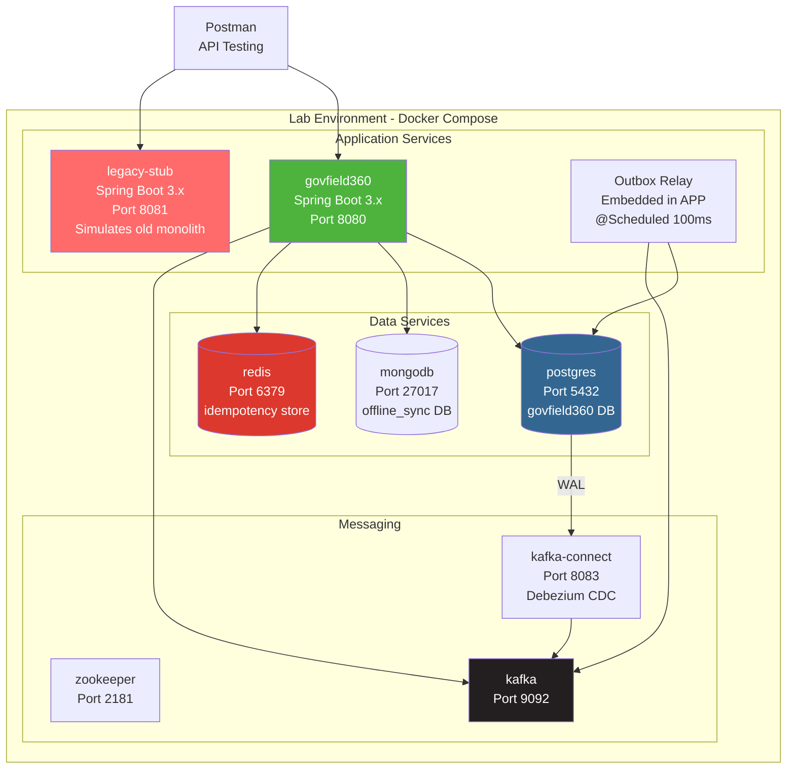

# DAY 7 — LAB DOCUMENT (Part 1 of 4)

**Program:** Senior Engineer to Solution Architect
**Day:** 7 of 12
**Lab Title:** GovField360 — Building a Mobile-Optimised Microservice with Outbox Pattern, CDC Sync, and Zero-Downtime Migration
**Part:** 1 of 4 — Project Scaffold + Environment Setup + PowerShell Automation Script

---

## Lab Header

### Lab Title and Day Reference
**Lab:** GovField360 — Government Field Inspection Microservice
**Day:** 7 of 12
**Theory Sections Covered:** Sections 1, 2, 3, and 4 of Day 7 Theory Document

---

### Prerequisites Checklist

Verify ALL of the following before class:

```powershell
# Run this verification block in PowerShell 7.x before class

# Java 17
java -version
# Expected: openjdk version "17.x.x"

# Maven
mvn -version
# Expected: Apache Maven 3.9.x

# Docker Desktop
docker --version
# Expected: Docker version 24.x or 25.x

# Docker Compose
docker compose version
# Expected: Docker Compose version v2.x

# Git
git --version
# Expected: git version 2.4x.x

# PowerShell version
$PSVersionTable.PSVersion
# Expected: Major version 7

# Postman (manual check - open application)
# Expected: Postman v10.x or later installed

# Azure CLI (optional for Day 7 lab - used in teardown)
az --version
# Expected: azure-cli 2.5x.x
```

**Required accounts and access:**
- [ ] Docker Hub account (for pulling images)
- [ ] Git configured with user name and email
- [ ] At least 8GB free disk space (PostgreSQL + MongoDB + Kafka + Zookeeper images)
- [ ] Ports available: 8080, 5432, 27017, 9092, 2181, 6379, 8083

---

### Estimated Time

| Phase                                          | Time           |
| ---------------------------------------------- | -------------- |
| Offline setup (trainer, before class)          | 45-60 minutes  |
| PowerShell scaffold generation                 | 5 minutes      |
| Docker environment startup                     | 10 minutes     |
| Section 1: Offline sync + delta sync demo      | 45 minutes     |
| Section 2: Outbox pattern + relay demo         | 40 minutes     |
| Section 3: Strangler fig + feature flag demo   | 30 minutes     |
| Section 4: Flyway zero-downtime migration demo | 35 minutes     |
| Postman testing and verification               | 20 minutes     |
| Cleanup                                        | 10 minutes     |
| **Total in-class demonstration time**          | **~3.5 hours** |

---

### Learning Objectives (matching Theory Document)

1. Build and run a mobile-optimised microservice with delta sync and idempotency
2. Implement the transactional outbox pattern and observe event publishing in real time
3. Simulate dual-write failure vs. outbox-protected submission
4. Configure and observe Flyway running Expand/Contract migrations
5. Demonstrate zero-downtime schema evolution with a live PostgreSQL database
6. Simulate strangler fig routing using Docker Compose service aliases

---

### Project Architecture Overview



---

## POWERSHELL AUTOMATED PROJECT SCAFFOLD SCRIPT

Save the following as `scaffold-govfield360.ps1` and run it from your desired workspace directory. This script creates the **complete project folder structure and all files** for the Day 7 lab.

```powershell
# scaffold-govfield360.ps1
# Day 7 Lab - GovField360 Complete Project Scaffold
# Run from: C:\training\day7\ or your preferred workspace
# Usage: .\scaffold-govfield360.ps1

param(
    [string]$ProjectRoot = "govfield360"
)

Write-Host "========================================" -ForegroundColor Cyan
Write-Host " GovField360 - Day 7 Lab Scaffold" -ForegroundColor Cyan
Write-Host " Senior Engineer to Solution Architect" -ForegroundColor Cyan
Write-Host "========================================" -ForegroundColor Cyan
Write-Host ""

# Helper function to create file with content
function New-FileWithContent {
    param(
        [string]$Path,
        [string]$Content
    )
    $dir = Split-Path -Parent $Path
    if (-not (Test-Path $dir)) {
        New-Item -ItemType Directory -Path $dir -Force | Out-Null
    }
    Set-Content -Path $Path -Value $Content -Encoding UTF8
    Write-Host "  [CREATED] $Path" -ForegroundColor Green
}

# Create root directory
if (Test-Path $ProjectRoot) {
    Write-Host "WARNING: $ProjectRoot already exists. Files will be overwritten." `
        -ForegroundColor Yellow
} else {
    New-Item -ItemType Directory -Path $ProjectRoot -Force | Out-Null
}

Set-Location $ProjectRoot
Write-Host "Working directory: $(Get-Location)" -ForegroundColor Gray
Write-Host ""

# ─────────────────────────────────────────────
# DIRECTORY STRUCTURE
# ─────────────────────────────────────────────
$dirs = @(
    "src\main\java\gov\field360",
    "src\main\java\gov\field360\domain",
    "src\main\java\gov\field360\application",
    "src\main\java\gov\field360\adapter\inbound",
    "src\main\java\gov\field360\adapter\outbound",
    "src\main\java\gov\field360\infrastructure\idempotency",
    "src\main\java\gov\field360\infrastructure\outbox",
    "src\main\java\gov\field360\infrastructure\resilience",
    "src\main\java\gov\field360\config",
    "src\main\resources\db\migration",
    "src\test\java\gov\field360",
    "legacy-stub\src\main\java\gov\legacy",
    "legacy-stub\src\main\resources",
    "docker",
    "postman",
    "scripts"
)

Write-Host "Creating directory structure..." -ForegroundColor Yellow
foreach ($dir in $dirs) {
    New-Item -ItemType Directory -Path $dir -Force | Out-Null
    Write-Host "  [DIR] $dir" -ForegroundColor DarkGray
}
Write-Host ""

Write-Host "Creating project files..." -ForegroundColor Yellow

# ─────────────────────────────────────────────
# pom.xml
# ─────────────────────────────────────────────
New-FileWithContent "pom.xml" @'
<?xml version="1.0" encoding="UTF-8"?>
<project xmlns="http://maven.apache.org/POM/4.0.0"
         xmlns:xsi="http://www.w3.org/2001/XMLSchema-instance"
         xsi:schemaLocation="http://maven.apache.org/POM/4.0.0
         https://maven.apache.org/xsd/maven-4.0.0.xsd">
    <modelVersion>4.0.0</modelVersion>

    <parent>
        <groupId>org.springframework.boot</groupId>
        <artifactId>spring-boot-starter-parent</artifactId>
        <version>3.2.0</version>
        <relativePath/>
    </parent>

    <groupId>gov.field360</groupId>
    <artifactId>govfield360</artifactId>
    <version>1.0.0-SNAPSHOT</version>
    <name>GovField360 - Day 7 Lab</name>
    <description>Mobile-Optimised Government Field Inspection Microservice</description>

    <properties>
        <java.version>17</java.version>
        <resilience4j.version>2.1.0</resilience4j.version>
    </properties>

    <dependencies>
        <!-- Spring Boot Core -->
        <dependency>
            <groupId>org.springframework.boot</groupId>
            <artifactId>spring-boot-starter-web</artifactId>
        </dependency>

        <!-- Spring Data JPA -->
        <dependency>
            <groupId>org.springframework.boot</groupId>
            <artifactId>spring-boot-starter-data-jpa</artifactId>
        </dependency>

        <!-- Spring Data Redis -->
        <dependency>
            <groupId>org.springframework.boot</groupId>
            <artifactId>spring-boot-starter-data-redis</artifactId>
        </dependency>

        <!-- Spring Kafka -->
        <dependency>
            <groupId>org.springframework.kafka</groupId>
            <artifactId>spring-kafka</artifactId>
        </dependency>

        <!-- Spring Actuator -->
        <dependency>
            <groupId>org.springframework.boot</groupId>
            <artifactId>spring-boot-starter-actuator</artifactId>
        </dependency>

        <!-- Resilience4j -->
        <dependency>
            <groupId>io.github.resilience4j</groupId>
            <artifactId>resilience4j-spring-boot3</artifactId>
            <version>${resilience4j.version}</version>
        </dependency>

        <!-- PostgreSQL Driver -->
        <dependency>
            <groupId>org.postgresql</groupId>
            <artifactId>postgresql</artifactId>
            <scope>runtime</scope>
        </dependency>

        <!-- Flyway -->
        <dependency>
            <groupId>org.flywaydb</groupId>
            <artifactId>flyway-core</artifactId>
        </dependency>

        <!-- Jackson for JSON -->
        <dependency>
            <groupId>com.fasterxml.jackson.core</groupId>
            <artifactId>jackson-databind</artifactId>
        </dependency>

        <!-- Lombok (optional convenience) -->
        <dependency>
            <groupId>org.projectlombok</groupId>
            <artifactId>lombok</artifactId>
            <optional>true</optional>
        </dependency>

        <!-- Test Dependencies -->
        <dependency>
            <groupId>org.springframework.boot</groupId>
            <artifactId>spring-boot-starter-test</artifactId>
            <scope>test</scope>
        </dependency>
        <dependency>
            <groupId>org.springframework.kafka</groupId>
            <artifactId>spring-kafka-test</artifactId>
            <scope>test</scope>
        </dependency>
        <dependency>
            <groupId>com.h2database</groupId>
            <artifactId>h2</artifactId>
            <scope>test</scope>
        </dependency>
    </dependencies>

    <build>
        <plugins>
            <plugin>
                <groupId>org.springframework.boot</groupId>
                <artifactId>spring-boot-maven-plugin</artifactId>
                <configuration>
                    <excludes>
                        <exclude>
                            <groupId>org.projectlombok</groupId>
                            <artifactId>lombok</artifactId>
                        </exclude>
                    </excludes>
                </configuration>
            </plugin>
        </plugins>
    </build>
</project>
'@

# ─────────────────────────────────────────────
# docker-compose.yml
# ─────────────────────────────────────────────
New-FileWithContent "docker-compose.yml" @'
version: "3.9"

# GovField360 - Day 7 Lab Docker Compose
# Starts: PostgreSQL, MongoDB, Redis, Kafka, Zookeeper, Kafka Connect (Debezium)
# The Spring Boot application runs locally via: mvn spring-boot:run

services:

  # ─── PostgreSQL ───────────────────────────────
  postgres:
    image: postgres:15-alpine
    container_name: govfield360-postgres
    environment:
      POSTGRES_DB: govfield360
      POSTGRES_USER: govfield360_user
      POSTGRES_PASSWORD: govfield360_dev_password
    ports:
      - "5432:5432"
    volumes:
      - postgres_data:/var/lib/postgresql/data
      - ./docker/postgres-init.sql:/docker-entrypoint-initdb.d/init.sql
    command: >
      postgres
      -c wal_level=logical
      -c max_replication_slots=5
      -c max_wal_senders=5
    healthcheck:
      test: ["CMD-SHELL", "pg_isready -U govfield360_user -d govfield360"]
      interval: 10s
      timeout: 5s
      retries: 5

  # ─── MongoDB ──────────────────────────────────
  mongodb:
    image: mongo:7.0
    container_name: govfield360-mongodb
    environment:
      MONGO_INITDB_ROOT_USERNAME: govfield360_user
      MONGO_INITDB_ROOT_PASSWORD: govfield360_dev_password
      MONGO_INITDB_DATABASE: offline_sync
    ports:
      - "27017:27017"
    volumes:
      - mongodb_data:/data/db
    healthcheck:
      test: ["CMD", "mongosh", "--eval", "db.adminCommand('ping')"]
      interval: 10s
      timeout: 5s
      retries: 5

  # ─── Redis ────────────────────────────────────
  redis:
    image: redis:7.2-alpine
    container_name: govfield360-redis
    ports:
      - "6379:6379"
    command: redis-server --requirepass govfield360_redis_password
    healthcheck:
      test: ["CMD", "redis-cli", "-a", "govfield360_redis_password", "ping"]
      interval: 10s
      timeout: 5s
      retries: 5

  # ─── Zookeeper ────────────────────────────────
  zookeeper:
    image: confluentinc/cp-zookeeper:7.5.0
    container_name: govfield360-zookeeper
    environment:
      ZOOKEEPER_CLIENT_PORT: 2181
      ZOOKEEPER_TICK_TIME: 2000
    ports:
      - "2181:2181"
    healthcheck:
      test: ["CMD", "nc", "-z", "localhost", "2181"]
      interval: 10s
      timeout: 5s
      retries: 5

  # ─── Kafka ────────────────────────────────────
  kafka:
    image: confluentinc/cp-kafka:7.5.0
    container_name: govfield360-kafka
    depends_on:
      zookeeper:
        condition: service_healthy
    ports:
      - "9092:9092"
    environment:
      KAFKA_BROKER_ID: 1
      KAFKA_ZOOKEEPER_CONNECT: zookeeper:2181
      KAFKA_ADVERTISED_LISTENERS: PLAINTEXT://localhost:9092
      KAFKA_OFFSETS_TOPIC_REPLICATION_FACTOR: 1
      KAFKA_AUTO_CREATE_TOPICS_ENABLE: "true"
      KAFKA_LOG_RETENTION_HOURS: 24
    healthcheck:
      test: ["CMD", "kafka-topics", "--bootstrap-server", "localhost:9092", "--list"]
      interval: 15s
      timeout: 10s
      retries: 10

  # ─── Kafka Connect (Debezium) ─────────────────
  kafka-connect:
    image: debezium/connect:2.4
    container_name: govfield360-kafka-connect
    depends_on:
      kafka:
        condition: service_healthy
      postgres:
        condition: service_healthy
    ports:
      - "8083:8083"
    environment:
      BOOTSTRAP_SERVERS: kafka:9092
      GROUP_ID: debezium-connect-group
      CONFIG_STORAGE_TOPIC: debezium_connect_configs
      OFFSET_STORAGE_TOPIC: debezium_connect_offsets
      STATUS_STORAGE_TOPIC: debezium_connect_statuses
      CONFIG_STORAGE_REPLICATION_FACTOR: 1
      OFFSET_STORAGE_REPLICATION_FACTOR: 1
      STATUS_STORAGE_REPLICATION_FACTOR: 1
    healthcheck:
      test: ["CMD-SHELL", "curl -sf http://localhost:8083/ || exit 1"]
      interval: 15s
      timeout: 10s
      retries: 10

  # ─── Legacy Stub ──────────────────────────────
  # Simulates the old monolith for strangler fig demonstration
  legacy-stub:
    build:
      context: ./legacy-stub
      dockerfile: Dockerfile
    container_name: govfield360-legacy
    ports:
      - "8081:8081"
    environment:
      SERVER_PORT: 8081

volumes:
  postgres_data:
  mongodb_data:
'@

# ─────────────────────────────────────────────
# docker/postgres-init.sql
# ─────────────────────────────────────────────
New-FileWithContent "docker\postgres-init.sql" @'
-- PostgreSQL initialisation script
-- Creates the replication user for Debezium CDC

-- Grant replication privileges to the application user
ALTER ROLE govfield360_user REPLICATION LOGIN;

-- Create a dedicated replication slot for Debezium
-- (Debezium will also create this automatically, but pre-creating
--  it here ensures it is available immediately)
SELECT pg_create_logical_replication_slot(
    ''debezium_slot'',
    ''pgoutput''
) WHERE NOT EXISTS (
    SELECT 1 FROM pg_replication_slots
    WHERE slot_name = ''debezium_slot''
);
'@

# ─────────────────────────────────────────────
# Dockerfile (main app)
# ─────────────────────────────────────────────
New-FileWithContent "Dockerfile" @'
# Multi-stage Dockerfile for GovField360
# Stage 1: Build
FROM maven:3.9.5-eclipse-temurin-17 AS builder
WORKDIR /build
COPY pom.xml .
# Download dependencies first (layer caching)
RUN mvn dependency:go-offline -q
COPY src ./src
RUN mvn package -DskipTests -q

# Stage 2: Runtime
FROM eclipse-temurin:17-jre-alpine AS runtime
WORKDIR /app

# Security: run as non-root user
RUN addgroup -S govfield && adduser -S govfield -G govfield
USER govfield

COPY --from=builder /build/target/govfield360-*.jar app.jar

EXPOSE 8080

ENTRYPOINT ["java", \
    "-Djava.security.egd=file:/dev/./urandom", \
    "-Dspring.profiles.active=docker", \
    "-jar", "app.jar"]
'@

Write-Host ""
Write-Host "Scaffold complete. Summary:" -ForegroundColor Cyan
Write-Host "  Root: $(Get-Location)" -ForegroundColor White
Write-Host ""
Write-Host "Next step: Generate source files (see lab document Part 2)" -ForegroundColor Yellow
Write-Host "========================================" -ForegroundColor Cyan
```

---


---

## All Java Source Files, Migration Scripts, and Configuration

The following section continues the PowerShell scaffold script. Each `New-FileWithContent` call creates a complete, compilable file. Run these blocks sequentially after Part 1, or append them to the same `scaffold-govfield360.ps1` script.

---

### Block 2A: Application Entry Point and Configuration

```powershell
# ─────────────────────────────────────────────
# Main Application Class
# ─────────────────────────────────────────────
New-FileWithContent "src\main\java\gov\field360\GovField360Application.java" @'
package gov.field360;

import org.springframework.boot.SpringApplication;
import org.springframework.boot.autoconfigure.SpringBootApplication;
import org.springframework.scheduling.annotation.EnableScheduling;
import org.springframework.transaction.annotation.EnableTransactionManagement;

// WHY: @EnableScheduling activates the outbox relay's @Scheduled method.
// Without this annotation, @Scheduled methods are silently ignored.
// @EnableTransactionManagement is explicit here for clarity —
// Spring Boot auto-configures it, but making it explicit signals
// to future maintainers that transactions are central to this service.
@SpringBootApplication
@EnableScheduling
@EnableTransactionManagement
public class GovField360Application {

    public static void main(String[] args) {
        SpringApplication.run(GovField360Application.class, args);
    }
}
'@

# ─────────────────────────────────────────────
# application.yml
# ─────────────────────────────────────────────
New-FileWithContent "src\main\resources\application.yml" @'
spring:
  application:
    name: govfield360

  datasource:
    url: jdbc:postgresql://localhost:5432/govfield360
    username: govfield360_user
    password: govfield360_dev_password
    hikari:
      maximum-pool-size: 20
      minimum-idle: 5
      connection-timeout: 30000
      idle-timeout: 600000
      max-lifetime: 1800000
      connection-test-query: SELECT 1

  jpa:
    hibernate:
      ddl-auto: validate
    properties:
      hibernate:
        dialect: org.hibernate.dialect.PostgreSQLDialect
        format_sql: false
        default_batch_fetch_size: 50
    show-sql: false

  flyway:
    enabled: true
    baseline-on-migrate: true
    baseline-version: "1"
    out-of-order: false
    validate-on-migrate: true
    locations: classpath:db/migration
    table: govfield360_schema_history
    connect-retries: 5

  data:
    redis:
      host: localhost
      port: 6379
      password: govfield360_redis_password
      timeout: 2000ms

  kafka:
    bootstrap-servers: localhost:9092
    producer:
      key-serializer: org.apache.kafka.common.serialization.StringSerializer
      value-serializer: org.apache.kafka.common.serialization.StringSerializer
      acks: all
      retries: 3
      properties:
        retry.backoff.ms: 1000
        enable.idempotence: true
    consumer:
      group-id: govfield360-sync-group
      auto-offset-reset: earliest
      enable-auto-commit: false
      key-deserializer: org.apache.kafka.common.serialization.StringDeserializer
      value-deserializer: org.apache.kafka.common.serialization.StringDeserializer

resilience4j:
  circuitbreaker:
    instances:
      downstreamServices:
        failure-rate-threshold: 50
        minimum-number-of-calls: 10
        wait-duration-in-open-state: 30s
        permitted-number-of-calls-in-half-open-state: 5
        sliding-window-type: COUNT_BASED
        sliding-window-size: 10
  ratelimiter:
    instances:
      syncApi:
        limit-for-period: 100
        limit-refresh-period: 1m
        timeout-duration: 0s

management:
  endpoints:
    web:
      exposure:
        include: health,metrics,info,flyway
  endpoint:
    health:
      show-details: always

# Feature flags for strangler fig demonstration
feature:
  flags:
    new-inspection-service-enabled: true
    new-service-percentage: 100
    emergency-rollback: false

logging:
  level:
    gov.field360: DEBUG
    org.flywaydb: INFO
    org.springframework.kafka: WARN
'@

# ─────────────────────────────────────────────
# application-test.yml (for unit tests)
# ─────────────────────────────────────────────
New-FileWithContent "src\main\resources\application-test.yml" @'
spring:
  datasource:
    url: jdbc:h2:mem:testdb;DB_CLOSE_DELAY=-1;MODE=PostgreSQL
    username: sa
    password:
    driver-class-name: org.h2.Driver
  jpa:
    hibernate:
      ddl-auto: create-drop
    properties:
      hibernate:
        dialect: org.hibernate.dialect.H2Dialect
  flyway:
    enabled: false
  kafka:
    bootstrap-servers: localhost:9092
  data:
    redis:
      host: localhost
      port: 6379
      password:
'@
```

---

### Block 2B: Domain Layer — Complete

```powershell
# ─────────────────────────────────────────────
# InspectionStatus enum
# ─────────────────────────────────────────────
New-FileWithContent "src\main\java\gov\field360\domain\InspectionStatus.java" @'
package gov.field360.domain;

// WHY: Enum with explicit names ensures the database stores
// human-readable strings (DRAFT, SUBMITTED) not ordinal numbers (0, 1).
// If we ever reorder the enum values, ordinal-based storage would
// silently corrupt all existing data.
public enum InspectionStatus {
    DRAFT,
    IN_PROGRESS,
    SUBMITTED,
    APPROVED,
    REJECTED,
    CONFLICT
}
'@

# ─────────────────────────────────────────────
# SyncToken — opaque cursor for delta sync
# ─────────────────────────────────────────────
New-FileWithContent "src\main\java\gov\field360\domain\SyncToken.java" @'
package gov.field360.domain;

import java.util.Base64;
import java.nio.charset.StandardCharsets;

// WHY: SyncToken wraps a raw sequence number in a Base64-encoded
// JSON string. This "opaque token" design decouples the API contract
// from the storage implementation. Clients never see raw sequence
// numbers — they just pass the token back unchanged on the next call.
// If we change from sequence numbers to Kafka offsets in the future,
// the API contract does not change.
public final class SyncToken {

    private SyncToken() {
        // Utility class — no instantiation
    }

    // Encode a sequence number into an opaque Base64 token
    public static String encode(long sequence) {
        String json = "{\"seq\":" + sequence + "}";
        return Base64.getUrlEncoder()
            .withoutPadding()
            .encodeToString(json.getBytes(StandardCharsets.UTF_8));
    }

    // Decode an opaque token back to a sequence number
    // Returns 0 if token is null or malformed (start from beginning)
    public static long decode(String token) {
        if (token == null || token.isBlank()) {
            return 0L;
        }
        try {
            byte[] decoded = Base64.getUrlDecoder().decode(token);
            String json = new String(decoded, StandardCharsets.UTF_8);
            // Parse {"seq":12345} — simple extraction without full JSON parse
            String seqStr = json.replaceAll(".*\"seq\":(\\d+).*", "$1");
            return Long.parseLong(seqStr);
        } catch (Exception e) {
            // WHY: Return 0 on malformed token rather than throwing.
            // A client sending a corrupted token gets a full re-sync
            // (seq=0 means fetch everything). This is safer than
            // returning a 400 error which might strand a field device.
            return 0L;
        }
    }
}
'@

# ─────────────────────────────────────────────
# Inspection — Aggregate Root
# ─────────────────────────────────────────────
New-FileWithContent "src\main\java\gov\field360\domain\Inspection.java" @'
package gov.field360.domain;

import jakarta.persistence.*;
import java.time.Instant;
import java.util.UUID;

@Entity
@Table(name = "inspections")
public class Inspection {

    @Id
    @Column(name = "id", updatable = false, nullable = false)
    private UUID id;

    // Legacy field — will be migrated to inspector_id via Expand/Contract
    // Kept here to demonstrate the dual-write phase in Section 4
    @Column(name = "inspector_code")
    private String inspectorCode;

    // New field — added via V3 Expand migration
    @Column(name = "inspector_id")
    private String inspectorId;

    @Column(name = "facility_id", nullable = false)
    private String facilityId;

    @Enumerated(EnumType.STRING)
    @Column(name = "status", nullable = false)
    private InspectionStatus status;

    @Column(name = "findings", columnDefinition = "TEXT")
    private String findings;

    // WHY: @Version enables JPA Optimistic Locking.
    // When two transactions try to update the same row concurrently,
    // JPA reads the current version, increments it, and includes it
    // in the WHERE clause of the UPDATE. If another transaction already
    // incremented the version, the UPDATE affects 0 rows and JPA throws
    // OptimisticLockException — signalling a conflict without database locks.
    @Version
    @Column(name = "version", nullable = false)
    private Long version;

    @Column(name = "client_device_id")
    private String clientDeviceId;

    @Column(name = "submitted_at")
    private Instant submittedAt;

    @Column(name = "last_synced_at")
    private Instant lastSyncedAt;

    // WHY: sequence is assigned from a PostgreSQL SEQUENCE object.
    // It is monotonically increasing and never reused — safe for delta sync.
    // We use insertable=false, updatable=false because PostgreSQL assigns
    // the value via DEFAULT nextval('inspection_sequence') in the DDL.
    @Column(name = "sequence", nullable = false, insertable = false, updatable = false)
    private Long sequence;

    @Column(name = "legacy_id")
    private String legacyId;

    @Column(name = "created_at", nullable = false, updatable = false)
    private Instant createdAt;

    @Column(name = "updated_at")
    private Instant updatedAt;

    // ─── Factory Methods ───────────────────────

    public static Inspection create(String inspectorId,
                                     String facilityId,
                                     String clientDeviceId) {
        Inspection i = new Inspection();
        i.id = UUID.randomUUID();
        i.inspectorId = inspectorId;
        i.inspectorCode = inspectorId; // dual-write during migrate phase
        i.facilityId = facilityId;
        i.status = InspectionStatus.DRAFT;
        i.clientDeviceId = clientDeviceId;
        i.createdAt = Instant.now();
        i.updatedAt = Instant.now();
        return i;
    }

    // Factory method for creating from legacy CDC sync data
    public static Inspection fromLegacy(String legacyId,
                                         String inspectorCode,
                                         String facilityId,
                                         InspectionStatus status,
                                         String findings) {
        Inspection i = new Inspection();
        i.id = UUID.randomUUID();
        i.legacyId = legacyId;
        i.inspectorCode = inspectorCode;
        i.inspectorId = inspectorCode; // ACL translation
        i.facilityId = facilityId;
        i.status = status;
        i.findings = findings;
        i.createdAt = Instant.now();
        i.updatedAt = Instant.now();
        return i;
    }

    // ─── Domain Behaviour ──────────────────────

    public void submit(String findings) {
        if (this.status != InspectionStatus.DRAFT
                && this.status != InspectionStatus.IN_PROGRESS) {
            throw new IllegalStateException(
                "Cannot submit inspection in status: " + this.status);
        }
        this.findings = findings;
        this.status = InspectionStatus.SUBMITTED;
        this.submittedAt = Instant.now();
        this.updatedAt = Instant.now();
    }

    public void markConflict() {
        this.status = InspectionStatus.CONFLICT;
        this.updatedAt = Instant.now();
    }

    public boolean hasConflictWith(Long incomingVersion) {
        return this.version != null
            && incomingVersion != null
            && !this.version.equals(incomingVersion);
    }

    // ─── Getters ───────────────────────────────

    public UUID getId() { return id; }
    public String getInspectorId() { return inspectorId; }
    public String getInspectorCode() { return inspectorCode; }
    public String getFacilityId() { return facilityId; }
    public InspectionStatus getStatus() { return status; }
    public String getFindings() { return findings; }
    public Long getVersion() { return version; }
    public String getClientDeviceId() { return clientDeviceId; }
    public Instant getSubmittedAt() { return submittedAt; }
    public Instant getLastSyncedAt() { return lastSyncedAt; }
    public Long getSequence() { return sequence; }
    public String getLegacyId() { return legacyId; }
    public Instant getCreatedAt() { return createdAt; }
    public Instant getUpdatedAt() { return updatedAt; }

    // ─── Setters (minimal — prefer domain methods) ─

    public void setLastSyncedAt(Instant lastSyncedAt) {
        this.lastSyncedAt = lastSyncedAt;
    }
    public void setUpdatedAt(Instant updatedAt) {
        this.updatedAt = updatedAt;
    }
    public void setInspectorId(String inspectorId) {
        this.inspectorId = inspectorId;
    }
    public void setInspectorCode(String inspectorCode) {
        this.inspectorCode = inspectorCode;
    }
}
'@

# ─────────────────────────────────────────────
# OutboxEvent — Domain Object
# ─────────────────────────────────────────────
New-FileWithContent "src\main\java\gov\field360\domain\OutboxEvent.java" @'
package gov.field360.domain;

import jakarta.persistence.*;
import java.time.Instant;
import java.util.UUID;

@Entity
@Table(name = "outbox_events")
public class OutboxEvent {

    @Id
    @GeneratedValue(strategy = GenerationType.AUTO)
    @Column(name = "id", updatable = false, nullable = false)
    private UUID id;

    @Column(name = "aggregate_id", nullable = false)
    private UUID aggregateId;

    @Column(name = "aggregate_type", nullable = false)
    private String aggregateType;

    @Column(name = "event_type", nullable = false)
    private String eventType;

    @Column(name = "payload", columnDefinition = "TEXT", nullable = false)
    private String payload;

    @Column(name = "status", nullable = false)
    private String status = "PENDING";

    @Column(name = "created_at", nullable = false, updatable = false)
    private Instant createdAt = Instant.now();

    @Column(name = "published_at")
    private Instant publishedAt;

    public static OutboxEvent of(UUID aggregateId,
                                  String aggregateType,
                                  String eventType,
                                  String jsonPayload) {
        OutboxEvent e = new OutboxEvent();
        e.aggregateId = aggregateId;
        e.aggregateType = aggregateType;
        e.eventType = eventType;
        e.payload = jsonPayload;
        e.status = "PENDING";
        e.createdAt = Instant.now();
        return e;
    }

    public void markPublished() {
        this.status = "PUBLISHED";
        this.publishedAt = Instant.now();
    }

    public void markFailed() {
        this.status = "FAILED";
    }

    // Getters
    public UUID getId() { return id; }
    public UUID getAggregateId() { return aggregateId; }
    public String getAggregateType() { return aggregateType; }
    public String getEventType() { return eventType; }
    public String getPayload() { return payload; }
    public String getStatus() { return status; }
    public Instant getCreatedAt() { return createdAt; }
    public Instant getPublishedAt() { return publishedAt; }
}
'@
```

---

### Block 2C: Repository Layer

```powershell
# ─────────────────────────────────────────────
# InspectionRepository
# ─────────────────────────────────────────────
New-FileWithContent "src\main\java\gov\field360\adapter\outbound\InspectionRepository.java" @'
package gov.field360.adapter.outbound;

import gov.field360.domain.Inspection;
import org.springframework.data.jpa.repository.JpaRepository;
import org.springframework.data.jpa.repository.Query;
import org.springframework.data.repository.query.Param;
import org.springframework.stereotype.Repository;
import java.util.List;
import java.util.Optional;
import java.util.UUID;

@Repository
public interface InspectionRepository extends JpaRepository<Inspection, UUID> {

    // WHY: Custom query for delta sync — fetches only records belonging
    // to this inspector with sequence > fromSequence.
    // The LIMIT is applied in the query (not via Pageable) to allow
    // the limit+1 trick for hasMore detection in SyncService.
    @Query(value = """
        SELECT * FROM inspections
        WHERE inspector_id = :inspectorId
          AND sequence > :fromSequence
        ORDER BY sequence ASC
        LIMIT :limit
        """, nativeQuery = true)
    List<Inspection> findByInspectorIdAndSequenceGreaterThan(
        @Param("inspectorId") String inspectorId,
        @Param("fromSequence") long fromSequence,
        @Param("limit") int limit
    );

    // For legacy CDC sync adapter — check by legacy system ID
    Optional<Inspection> findByLegacyId(String legacyId);

    boolean existsByLegacyId(String legacyId);

    // For strangler fig demo — find by facility
    List<Inspection> findByFacilityId(String facilityId);

    // Count pending (DRAFT/IN_PROGRESS) inspections for an inspector
    @Query("SELECT COUNT(i) FROM Inspection i WHERE i.inspectorId = :inspectorId AND i.status IN ('DRAFT', 'IN_PROGRESS')")
    long countPendingByInspectorId(@Param("inspectorId") String inspectorId);
}
'@

# ─────────────────────────────────────────────
# OutboxRepository
# ─────────────────────────────────────────────
New-FileWithContent "src\main\java\gov\field360\adapter\outbound\OutboxRepository.java" @'
package gov.field360.adapter.outbound;

import gov.field360.domain.OutboxEvent;
import org.springframework.data.jpa.repository.JpaRepository;
import org.springframework.data.jpa.repository.Query;
import org.springframework.data.repository.query.Param;
import org.springframework.stereotype.Repository;
import java.util.List;
import java.util.UUID;

@Repository
public interface OutboxRepository extends JpaRepository<OutboxEvent, UUID> {

    // WHY: SELECT FOR UPDATE SKIP LOCKED is the critical mechanism
    // that allows multiple relay instances to safely process different
    // subsets of outbox events concurrently without duplicate publishing.
    // This native query cannot be expressed in JPQL.
    @Query(value = """
        SELECT *
        FROM outbox_events
        WHERE status = 'PENDING'
        ORDER BY created_at ASC
        LIMIT :limit
        FOR UPDATE SKIP LOCKED
        """, nativeQuery = true)
    List<OutboxEvent> findPendingWithLock(@Param("limit") int limit);

    // For monitoring — count events by status
    @Query("SELECT COUNT(o) FROM OutboxEvent o WHERE o.status = :status")
    long countByStatus(@Param("status") String status);

    // For cleanup — find old published events (for archival)
    @Query(value = """
        SELECT * FROM outbox_events
        WHERE status = 'PUBLISHED'
          AND published_at < NOW() - INTERVAL '24 hours'
        LIMIT 1000
        """, nativeQuery = true)
    List<OutboxEvent> findPublishedOlderThan24Hours();
}
'@
```

---

### Block 2D: Application (Service) Layer

```powershell
# ─────────────────────────────────────────────
# IdempotencyStore
# ─────────────────────────────────────────────
New-FileWithContent "src\main\java\gov\field360\infrastructure\idempotency\IdempotencyStore.java" @'
package gov.field360.infrastructure.idempotency;

import com.fasterxml.jackson.databind.ObjectMapper;
import org.slf4j.Logger;
import org.slf4j.LoggerFactory;
import org.springframework.data.redis.core.RedisTemplate;
import org.springframework.stereotype.Component;
import java.time.Duration;

@Component
public class IdempotencyStore {

    private static final Logger log =
        LoggerFactory.getLogger(IdempotencyStore.class);

    // WHY: Key prefix namespaces our idempotency keys in Redis.
    // This prevents collision with other services using the same Redis instance.
    private static final String KEY_PREFIX = "idem:govfield360:";

    // WHY: 24-hour TTL. A mobile client retrying within 24 hours
    // receives the cached result. After 24 hours, the key expires
    // and a retry is treated as a fresh submission (correct behaviour
    // — a 24-hour delay between attempts is a new business action).
    private static final Duration TTL = Duration.ofHours(24);

    private final RedisTemplate<String, String> redisTemplate;
    private final ObjectMapper objectMapper;

    public IdempotencyStore(RedisTemplate<String, String> redisTemplate,
                             ObjectMapper objectMapper) {
        this.redisTemplate = redisTemplate;
        this.objectMapper = objectMapper;
    }

    public boolean hasProcessed(String idempotencyKey) {
        try {
            return Boolean.TRUE.equals(
                redisTemplate.hasKey(KEY_PREFIX + idempotencyKey));
        } catch (Exception e) {
            // WHY: If Redis is down, we cannot check idempotency.
            // Return false (assume not processed) so the request proceeds.
            // The worst case is a duplicate — better than a 500 error.
            log.warn("Redis unavailable for idempotency check: {}",
                e.getMessage());
            return false;
        }
    }

    public <T> void store(String idempotencyKey, T result) {
        try {
            String json = objectMapper.writeValueAsString(result);
            redisTemplate.opsForValue().set(
                KEY_PREFIX + idempotencyKey, json, TTL);
        } catch (Exception e) {
            log.warn("Failed to store idempotency result for key {}: {}",
                idempotencyKey, e.getMessage());
            // WHY: Do not rethrow — idempotency store failure should not
            // fail the primary operation. Availability > perfect idempotency.
        }
    }

    public <T> T getResult(String idempotencyKey, Class<T> type) {
        try {
            String json = redisTemplate.opsForValue()
                .get(KEY_PREFIX + idempotencyKey);
            if (json == null) return null;
            return objectMapper.readValue(json, type);
        } catch (Exception e) {
            log.warn("Failed to retrieve idempotency result for key {}: {}",
                idempotencyKey, e.getMessage());
            return null;
        }
    }
}
'@

# ─────────────────────────────────────────────
# InspectionService
# ─────────────────────────────────────────────
New-FileWithContent "src\main\java\gov\field360\application\InspectionService.java" @'
package gov.field360.application;

import com.fasterxml.jackson.databind.ObjectMapper;
import gov.field360.domain.Inspection;
import gov.field360.domain.InspectionStatus;
import gov.field360.domain.OutboxEvent;
import gov.field360.adapter.outbound.InspectionRepository;
import gov.field360.adapter.outbound.OutboxRepository;
import gov.field360.infrastructure.idempotency.IdempotencyStore;
import org.slf4j.Logger;
import org.slf4j.LoggerFactory;
import org.springframework.stereotype.Service;
import org.springframework.transaction.annotation.Transactional;
import java.util.*;

@Service
public class InspectionService {

    private static final Logger log =
        LoggerFactory.getLogger(InspectionService.class);

    private final InspectionRepository inspectionRepository;
    private final OutboxRepository outboxRepository;
    private final IdempotencyStore idempotencyStore;
    private final ObjectMapper objectMapper;

    public InspectionService(InspectionRepository inspectionRepository,
                              OutboxRepository outboxRepository,
                              IdempotencyStore idempotencyStore,
                              ObjectMapper objectMapper) {
        this.inspectionRepository = inspectionRepository;
        this.outboxRepository = outboxRepository;
        this.idempotencyStore = idempotencyStore;
        this.objectMapper = objectMapper;
    }

    // ── Submit Inspection (with idempotency + outbox) ──────────────────

    // WHY: @Transactional wraps BOTH the Inspection save AND the OutboxEvent
    // save in a single ACID transaction. If Kafka goes down between the
    // two saves, both roll back. The dual-write problem is eliminated.
    @Transactional
    public Inspection submitInspection(String inspectorId,
                                        String facilityId,
                                        String deviceId,
                                        String findings,
                                        String idempotencyKey) {

        // Step 1: Idempotency check — was this exact request already processed?
        if (idempotencyStore.hasProcessed(idempotencyKey)) {
            log.info("Duplicate request detected for key: {}. " +
                "Returning cached result.", idempotencyKey);
            Inspection cached = idempotencyStore.getResult(
                idempotencyKey, Inspection.class);
            if (cached != null) return cached;
            // If cache miss (Redis evicted it), fall through to re-process
        }

        // Step 2: Create and persist the Inspection aggregate
        Inspection inspection = Inspection.create(inspectorId,
                                                   facilityId, deviceId);
        inspection.submit(findings);
        Inspection saved = inspectionRepository.save(inspection);

        // Step 3: Write OutboxEvent in THE SAME TRANSACTION
        // WHY: This is the core of the outbox pattern.
        // The event is written to the DATABASE, not sent to Kafka.
        // The relay will pick it up and send it to Kafka separately.
        String payload = buildEventPayload(saved, idempotencyKey);
        OutboxEvent outboxEvent = OutboxEvent.of(
            saved.getId(),
            "INSPECTION",
            "InspectionSubmitted",
            payload
        );
        outboxRepository.save(outboxEvent);

        // Step 4: Store result in idempotency cache
        idempotencyStore.store(idempotencyKey, saved);

        log.info("Inspection {} submitted. OutboxEvent created. " +
            "Kafka publish will follow asynchronously.", saved.getId());

        return saved;
    }

    // ── Submit WITHOUT idempotency (anti-pattern demo) ──────────────────
    // WHY: This method exists to demonstrate the anti-pattern in class.
    // Calling this endpoint twice with the same data creates duplicate records.
    @Transactional
    public Inspection submitInspectionUnsafe(String inspectorId,
                                              String facilityId,
                                              String deviceId,
                                              String findings) {
        log.warn("UNSAFE SUBMIT called — no idempotency check! " +
            "This will create duplicates on retry.");
        Inspection inspection = Inspection.create(inspectorId, facilityId, deviceId);
        inspection.submit(findings);
        return inspectionRepository.save(inspection);
        // WHY: No outbox event written — this also demonstrates
        // the dual-write risk. If we added a Kafka send here,
        // a crash between save and send would cause event loss.
    }

    // ── Get all inspections for an inspector ────────────────────────────
    @Transactional(readOnly = true)
    public List<Inspection> getInspectionsForInspector(String inspectorId) {
        return inspectionRepository
            .findByInspectorIdAndSequenceGreaterThan(inspectorId, 0L, 1000);
    }

    // ── Get single inspection ───────────────────────────────────────────
    @Transactional(readOnly = true)
    public Optional<Inspection> getInspection(UUID id) {
        return inspectionRepository.findById(id);
    }

    // ── Build JSON event payload ─────────────────────────────────────────
    private String buildEventPayload(Inspection inspection,
                                      String idempotencyKey) {
        try {
            Map<String, Object> payload = new LinkedHashMap<>();
            payload.put("inspectionId", inspection.getId().toString());
            payload.put("inspectorId", inspection.getInspectorId());
            payload.put("facilityId", inspection.getFacilityId());
            payload.put("status", inspection.getStatus().name());
            payload.put("idempotencyKey", idempotencyKey);
            payload.put("occurredAt",
                java.time.Instant.now().toString());
            return objectMapper.writeValueAsString(payload);
        } catch (Exception e) {
            throw new RuntimeException(
                "Failed to serialize event payload", e);
        }
    }
}
'@

# ─────────────────────────────────────────────
# SyncService
# ─────────────────────────────────────────────
New-FileWithContent "src\main\java\gov\field360\application\SyncService.java" @'
package gov.field360.application;

import gov.field360.adapter.outbound.InspectionRepository;
import gov.field360.domain.Inspection;
import gov.field360.domain.InspectionStatus;
import gov.field360.domain.SyncToken;
import gov.field360.infrastructure.idempotency.IdempotencyStore;
import org.slf4j.Logger;
import org.slf4j.LoggerFactory;
import org.springframework.stereotype.Service;
import org.springframework.transaction.annotation.Transactional;
import java.util.*;

@Service
public class SyncService {

    private static final Logger log =
        LoggerFactory.getLogger(SyncService.class);

    private final InspectionRepository inspectionRepository;
    private final InspectionService inspectionService;
    private final IdempotencyStore idempotencyStore;

    public SyncService(InspectionRepository inspectionRepository,
                        InspectionService inspectionService,
                        IdempotencyStore idempotencyStore) {
        this.inspectionRepository = inspectionRepository;
        this.inspectionService = inspectionService;
        this.idempotencyStore = idempotencyStore;
    }

    // ── Delta Sync — Pull (server → client) ─────────────────────────────

    @Transactional(readOnly = true)
    public DeltaResult getDelta(String inspectorId,
                                 String syncToken,
                                 int limit) {

        // Decode the opaque token to a raw sequence number
        long fromSequence = SyncToken.decode(syncToken);

        // Fetch limit+1 to detect if there are more pages
        List<Inspection> found = inspectionRepository
            .findByInspectorIdAndSequenceGreaterThan(
                inspectorId, fromSequence, limit + 1);

        boolean hasMore = found.size() > limit;
        List<Inspection> page = hasMore
            ? found.subList(0, limit)
            : found;

        // The next sync token is the sequence of the last record in this page
        long nextSequence = page.isEmpty()
            ? fromSequence
            : page.get(page.size() - 1).getSequence();

        log.debug("Delta sync for inspector {}: fromSeq={}, returned={}, " +
            "hasMore={}", inspectorId, fromSequence, page.size(), hasMore);

        return new DeltaResult(
            page.stream().map(this::toDto).toList(),
            SyncToken.encode(nextSequence),
            hasMore
        );
    }

    // ── Push Sync — (client → server) ───────────────────────────────────

    @Transactional
    public PushResult processPush(String inspectorId,
                                   String idempotencyKey,
                                   List<SyncItem> items) {

        // WHY: Check idempotency for the entire batch.
        // A retry of the same batch (same idempotency key) returns
        // the cached result without reprocessing any items.
        if (idempotencyStore.hasProcessed("push:" + idempotencyKey)) {
            PushResult cached = idempotencyStore.getResult(
                "push:" + idempotencyKey, PushResult.class);
            if (cached != null) {
                log.info("Duplicate push batch {} — returning cached result",
                    idempotencyKey);
                return cached;
            }
        }

        List<String> accepted = new ArrayList<>();
        List<ConflictDetail> conflicts = new ArrayList<>();
        List<String> rejected = new ArrayList<>();

        for (SyncItem item : items) {
            try {
                processOnePushItem(inspectorId, item,
                    accepted, conflicts, rejected);
            } catch (Exception e) {
                log.error("Failed to process sync item {}: {}",
                    item.id(), e.getMessage());
                rejected.add(item.id());
            }
        }

        PushResult result = new PushResult(accepted, conflicts, rejected);
        idempotencyStore.store("push:" + idempotencyKey, result);
        return result;
    }

    private void processOnePushItem(String inspectorId,
                                     SyncItem item,
                                     List<String> accepted,
                                     List<ConflictDetail> conflicts,
                                     List<String> rejected) {
        UUID itemId;
        try {
            itemId = UUID.fromString(item.id());
        } catch (IllegalArgumentException e) {
            rejected.add(item.id());
            return;
        }

        Optional<Inspection> existing =
            inspectionRepository.findById(itemId);

        if (existing.isEmpty()) {
            // New record created offline — create server-side
            Inspection newInspection = Inspection.create(
                inspectorId, item.facilityId(), item.clientDeviceId());
            newInspection.submit(item.findings());
            inspectionRepository.save(newInspection);
            accepted.add(item.id());

        } else if (existing.get().hasConflictWith(item.clientVersion())) {
            // Conflict: server version differs from client's known version
            Inspection serverInspection = existing.get();
            conflicts.add(new ConflictDetail(
                item.id(),
                serverInspection.getVersion(),
                item.clientVersion(),
                "VERSION_MISMATCH"
            ));

        } else {
            // No conflict: apply client's update
            Inspection toUpdate = existing.get();
            toUpdate.submit(item.findings());
            inspectionRepository.save(toUpdate);
            accepted.add(item.id());
        }
    }

    private InspectionDto toDto(Inspection i) {
        return new InspectionDto(
            i.getId().toString(),
            i.getInspectorId(),
            i.getFacilityId(),
            i.getStatus().name(),
            i.getFindings(),
            i.getVersion(),
            i.getSequence()
        );
    }

    // ── Records (DTOs) ──────────────────────────────────────────────────

    public record DeltaResult(
        List<InspectionDto> records,
        String nextSyncToken,
        boolean hasMore
    ) {}

    public record PushResult(
        List<String> accepted,
        List<ConflictDetail> conflicts,
        List<String> rejected
    ) {}

    public record InspectionDto(
        String id,
        String inspectorId,
        String facilityId,
        String status,
        String findings,
        Long version,
        Long sequence
    ) {}

    public record SyncItem(
        String id,
        String facilityId,
        String findings,
        Long clientVersion,
        String clientDeviceId
    ) {}

    public record ConflictDetail(
        String inspectionId,
        Long serverVersion,
        Long clientVersion,
        String conflictType
    ) {}
}
'@
```

---

### Block 2E: Infrastructure Layer — Outbox Relay and Config

```powershell
# ─────────────────────────────────────────────
# OutboxRelayService
# ─────────────────────────────────────────────
New-FileWithContent "src\main\java\gov\field360\infrastructure\outbox\OutboxRelayService.java" @'
package gov.field360.infrastructure.outbox;

import gov.field360.adapter.outbound.OutboxRepository;
import gov.field360.domain.OutboxEvent;
import org.slf4j.Logger;
import org.slf4j.LoggerFactory;
import org.springframework.kafka.core.KafkaTemplate;
import org.springframework.scheduling.annotation.Scheduled;
import org.springframework.stereotype.Service;
import org.springframework.transaction.annotation.Transactional;
import java.util.List;
import java.util.concurrent.ExecutionException;
import java.util.concurrent.TimeUnit;
import java.util.concurrent.TimeoutException;

@Service
public class OutboxRelayService {

    private static final Logger log =
        LoggerFactory.getLogger(OutboxRelayService.class);

    private final OutboxRepository outboxRepository;
    private final KafkaTemplate<String, String> kafkaTemplate;

    // Metrics counters for Actuator exposure
    private volatile long totalPublished = 0;
    private volatile long totalFailed = 0;

    public OutboxRelayService(OutboxRepository outboxRepository,
                               KafkaTemplate<String, String> kafkaTemplate) {
        this.outboxRepository = outboxRepository;
        this.kafkaTemplate = kafkaTemplate;
    }

    // WHY: fixedDelay (not fixedRate) ensures the next execution starts
    // only AFTER the current one completes. This prevents overlapping
    // relay runs if Kafka is temporarily slow.
    // 100ms delay gives near-real-time event publishing.
    @Scheduled(fixedDelay = 100)
    @Transactional
    public void relay() {
        // WHY: SELECT FOR UPDATE SKIP LOCKED (inside findPendingWithLock)
        // ensures safe concurrent relay if this service is scaled to
        // multiple instances in Kubernetes.
        List<OutboxEvent> pending = outboxRepository.findPendingWithLock(50);

        if (pending.isEmpty()) return;

        log.debug("Outbox relay: processing {} pending events", pending.size());

        for (OutboxEvent event : pending) {
            publishEvent(event);
        }
    }

    private void publishEvent(OutboxEvent event) {
        try {
            String topic = resolveTopicName(event.getEventType());

            // WHY: aggregateId is the Kafka message KEY.
            // All events for the same inspection go to the same partition
            // (Kafka partitions by key hash) → ordered delivery per inspection.
            kafkaTemplate.send(
                topic,
                event.getAggregateId().toString(), // partition key
                event.getPayload()                  // message value
            ).get(5, TimeUnit.SECONDS);
            // WHY: .get(5s) blocks until Kafka acknowledges.
            // Without this, we would mark events as PUBLISHED before
            // confirming Kafka received them — losing events on Kafka restart.

            event.markPublished();
            outboxRepository.save(event);
            totalPublished++;

            log.debug("Published event {} [{}] to topic {}",
                event.getId(), event.getEventType(), topic);

        } catch (ExecutionException | InterruptedException
                 | TimeoutException e) {
            log.error("Failed to publish outbox event {} to Kafka: {}",
                event.getId(), e.getMessage());
            event.markFailed();
            outboxRepository.save(event);
            totalFailed++;

            if (e instanceof InterruptedException) {
                Thread.currentThread().interrupt();
            }
        }
    }

    private String resolveTopicName(String eventType) {
        return switch (eventType) {
            case "InspectionSubmitted" -> "inspection.submitted";
            case "InspectionSynced"    -> "inspection.synced";
            case "InspectionConflict"  -> "inspection.conflict";
            default -> "inspection.events";
        };
    }

    // Expose metrics for demo
    public long getTotalPublished() { return totalPublished; }
    public long getTotalFailed()    { return totalFailed; }
}
'@

# ─────────────────────────────────────────────
# KafkaConfig
# ─────────────────────────────────────────────
New-FileWithContent "src\main\java\gov\field360\config\KafkaConfig.java" @'
package gov.field360.config;

import org.apache.kafka.clients.admin.NewTopic;
import org.springframework.context.annotation.Bean;
import org.springframework.context.annotation.Configuration;
import org.springframework.kafka.config.TopicBuilder;

@Configuration
public class KafkaConfig {

    // WHY: Declaring topics as Spring Beans ensures they are created
    // automatically on startup if they do not exist.
    // Without this, publishing to a non-existent topic either fails
    // or creates an unpartitioned topic with default settings.

    @Bean
    public NewTopic inspectionSubmittedTopic() {
        return TopicBuilder.name("inspection.submitted")
            .partitions(3)
            // WHY: partitions=3 allows 3 parallel consumer instances.
            // For the lab, 1 partition would suffice, but 3 reflects
            // production practice for a high-throughput government system.
            .replicas(1) // 1 replica for lab (no Kafka cluster)
            .build();
    }

    @Bean
    public NewTopic inspectionSyncedTopic() {
        return TopicBuilder.name("inspection.synced")
            .partitions(3)
            .replicas(1)
            .build();
    }

    @Bean
    public NewTopic inspectionConflictTopic() {
        return TopicBuilder.name("inspection.conflict")
            .partitions(1)
            .replicas(1)
            .build();
    }

    @Bean
    public NewTopic inspectionEventsTopic() {
        return TopicBuilder.name("inspection.events")
            .partitions(3)
            .replicas(1)
            .build();
    }
}
'@

# ─────────────────────────────────────────────
# RedisConfig
# ─────────────────────────────────────────────
New-FileWithContent "src\main\java\gov\field360\config\RedisConfig.java" @'
package gov.field360.config;

import org.springframework.context.annotation.Bean;
import org.springframework.context.annotation.Configuration;
import org.springframework.data.redis.connection.RedisConnectionFactory;
import org.springframework.data.redis.core.RedisTemplate;
import org.springframework.data.redis.serializer.StringRedisSerializer;

@Configuration
public class RedisConfig {

    @Bean
    public RedisTemplate<String, String> redisTemplate(
            RedisConnectionFactory connectionFactory) {
        RedisTemplate<String, String> template = new RedisTemplate<>();
        template.setConnectionFactory(connectionFactory);

        // WHY: Use StringRedisSerializer for both key and value.
        // Default JDK serialization produces binary-encoded keys
        // that are unreadable in Redis CLI — making debugging impossible.
        // String serialization keeps keys human-readable:
        // "idem:govfield360:a3f9-..." instead of binary garbage.
        StringRedisSerializer stringSerializer = new StringRedisSerializer();
        template.setKeySerializer(stringSerializer);
        template.setValueSerializer(stringSerializer);
        template.setHashKeySerializer(stringSerializer);
        template.setHashValueSerializer(stringSerializer);
        template.afterPropertiesSet();
        return template;
    }
}
'@

# ─────────────────────────────────────────────
# DatabaseMigrationConfig
# ─────────────────────────────────────────────
New-FileWithContent "src\main\java\gov\field360\config\DatabaseMigrationConfig.java" @'
package gov.field360.config;

import org.flywaydb.core.api.output.MigrateResult;
import org.slf4j.Logger;
import org.slf4j.LoggerFactory;
import org.springframework.boot.autoconfigure.flyway.FlywayMigrationStrategy;
import org.springframework.context.annotation.Bean;
import org.springframework.context.annotation.Configuration;

@Configuration
public class DatabaseMigrationConfig {

    private static final Logger log =
        LoggerFactory.getLogger(DatabaseMigrationConfig.class);

    @Bean
    public FlywayMigrationStrategy govFlywayMigrationStrategy() {
        return flyway -> {
            log.info("=== GovField360 Database Migration Starting ===");

            // Validate: detect tampered migration scripts
            flyway.validate();
            log.info("Migration scripts validated — no tampering detected.");

            // Apply pending migrations
            MigrateResult result = flyway.migrate();

            if (result.migrationsExecuted > 0) {
                log.info("Applied {} migration(s). Target version: {}",
                    result.migrationsExecuted,
                    result.targetSchemaVersion);
                result.migrations.forEach(m ->
                    log.info("  >> Applied: V{} - {}",
                        m.version, m.description));
            } else {
                log.info("Schema up-to-date. No migrations needed.");
            }

            log.info("=== Database Migration Complete ===");
        };
    }
}
'@
```

---

### Block 2F: REST Controllers

```powershell
# ─────────────────────────────────────────────
# InspectionController
# ─────────────────────────────────────────────
New-FileWithContent "src\main\java\gov\field360\adapter\inbound\InspectionController.java" @'
package gov.field360.adapter.inbound;

import gov.field360.application.InspectionService;
import gov.field360.domain.Inspection;
import org.springframework.http.HttpStatus;
import org.springframework.http.ResponseEntity;
import org.springframework.web.bind.annotation.*;
import java.util.List;
import java.util.Map;
import java.util.UUID;

@RestController
@RequestMapping("/api/v1/inspections")
public class InspectionController {

    private final InspectionService inspectionService;

    public InspectionController(InspectionService inspectionService) {
        this.inspectionService = inspectionService;
    }

    // ── SAFE submit: with idempotency + outbox ─────────────────────────
    @PostMapping
    public ResponseEntity<Inspection> submit(
            @RequestBody SubmitRequest request,
            @RequestHeader(value = "X-Idempotency-Key",
                           required = false,
                           defaultValue = "") String idempotencyKey,
            @RequestHeader(value = "X-Inspector-Id",
                           required = false,
                           defaultValue = "DEMO-INS-001") String inspectorId) {

        if (idempotencyKey.isBlank()) {
            idempotencyKey = UUID.randomUUID().toString();
        }

        Inspection saved = inspectionService.submitInspection(
            inspectorId,
            request.facilityId(),
            request.clientDeviceId(),
            request.findings(),
            idempotencyKey
        );
        return ResponseEntity.status(HttpStatus.CREATED).body(saved);
    }

    // ── UNSAFE submit: anti-pattern demo (no idempotency, no outbox) ───
    @PostMapping("/unsafe")
    public ResponseEntity<Inspection> submitUnsafe(
            @RequestBody SubmitRequest request,
            @RequestHeader(value = "X-Inspector-Id",
                           defaultValue = "DEMO-INS-001") String inspectorId) {

        Inspection saved = inspectionService.submitInspectionUnsafe(
            inspectorId,
            request.facilityId(),
            request.clientDeviceId(),
            request.findings()
        );
        return ResponseEntity.status(HttpStatus.CREATED).body(saved);
    }

    // ── Get all inspections for inspector ──────────────────────────────
    @GetMapping
    public ResponseEntity<List<Inspection>> getAll(
            @RequestHeader(value = "X-Inspector-Id",
                           defaultValue = "DEMO-INS-001") String inspectorId) {
        return ResponseEntity.ok(
            inspectionService.getInspectionsForInspector(inspectorId));
    }

    // ── Get single inspection ──────────────────────────────────────────
    @GetMapping("/{id}")
    public ResponseEntity<Inspection> getOne(@PathVariable UUID id) {
        return inspectionService.getInspection(id)
            .map(ResponseEntity::ok)
            .orElse(ResponseEntity.notFound().build());
    }

    // ── Health check ───────────────────────────────────────────────────
    @GetMapping("/health")
    public ResponseEntity<Map<String, String>> health() {
        return ResponseEntity.ok(Map.of(
            "service", "govfield360",
            "status", "UP",
            "version", "1.0.0"
        ));
    }

    // ── Request DTO ────────────────────────────────────────────────────
    public record SubmitRequest(
        String facilityId,
        String clientDeviceId,
        String findings
    ) {}
}
'@

# ─────────────────────────────────────────────
# SyncController
# ─────────────────────────────────────────────
New-FileWithContent "src\main\java\gov\field360\adapter\inbound\SyncController.java" @'
package gov.field360.adapter.inbound;

import gov.field360.application.SyncService;
import org.springframework.http.ResponseEntity;
import org.springframework.web.bind.annotation.*;
import java.util.List;

@RestController
@RequestMapping("/api/v1/sync")
public class SyncController {

    private final SyncService syncService;

    public SyncController(SyncService syncService) {
        this.syncService = syncService;
    }

    // ── Pull: get delta changes since last sync ────────────────────────
    @GetMapping("/delta")
    public ResponseEntity<SyncService.DeltaResult> getDelta(
            @RequestHeader(value = "X-Inspector-Id",
                           defaultValue = "DEMO-INS-001") String inspectorId,
            @RequestParam(required = false) String syncToken,
            @RequestParam(defaultValue = "20") int limit) {

        SyncService.DeltaResult result =
            syncService.getDelta(inspectorId, syncToken, limit);
        return ResponseEntity.ok(result);
    }

    // ── Push: client sends offline changes ────────────────────────────
    @PostMapping("/push")
    public ResponseEntity<SyncService.PushResult> push(
            @RequestHeader(value = "X-Inspector-Id",
                           defaultValue = "DEMO-INS-001") String inspectorId,
            @RequestHeader(value = "X-Idempotency-Key") String idempotencyKey,
            @RequestBody List<SyncService.SyncItem> items) {

        SyncService.PushResult result =
            syncService.processPush(inspectorId, idempotencyKey, items);
        return ResponseEntity.ok(result);
    }
}
'@

# ─────────────────────────────────────────────
# OutboxMonitorController (for demo visibility)
# ─────────────────────────────────────────────
New-FileWithContent "src\main\java\gov\field360\adapter\inbound\OutboxMonitorController.java" @'
package gov.field360.adapter.inbound;

import gov.field360.adapter.outbound.OutboxRepository;
import gov.field360.infrastructure.outbox.OutboxRelayService;
import org.springframework.http.ResponseEntity;
import org.springframework.web.bind.annotation.*;
import java.util.Map;

// WHY: This controller exists purely for the training demonstration.
// It exposes outbox metrics so the class can watch events move from
// PENDING → PUBLISHED in real time during the demo.
// In production, this data would be exposed via Actuator/Prometheus.
@RestController
@RequestMapping("/api/v1/admin/outbox")
public class OutboxMonitorController {

    private final OutboxRepository outboxRepository;
    private final OutboxRelayService outboxRelayService;

    public OutboxMonitorController(OutboxRepository outboxRepository,
                                    OutboxRelayService outboxRelayService) {
        this.outboxRepository = outboxRepository;
        this.outboxRelayService = outboxRelayService;
    }

    @GetMapping("/stats")
    public ResponseEntity<Map<String, Object>> stats() {
        return ResponseEntity.ok(Map.of(
            "pending",   outboxRepository.countByStatus("PENDING"),
            "published", outboxRepository.countByStatus("PUBLISHED"),
            "failed",    outboxRepository.countByStatus("FAILED"),
            "relayPublishedTotal", outboxRelayService.getTotalPublished(),
            "relayFailedTotal",   outboxRelayService.getTotalFailed()
        ));
    }
}
'@
```

---

### Block 2G: Flyway Migration Scripts

```powershell
# ─────────────────────────────────────────────
# V1 — Initial Schema
# ─────────────────────────────────────────────
New-FileWithContent "src\main\resources\db\migration\V1__create_inspections.sql" @'
-- V1: Initial inspections schema
-- GovField360 - Day 7 Lab

CREATE SEQUENCE IF NOT EXISTS inspection_sequence
    START 1
    INCREMENT 1
    NO MAXVALUE
    CACHE 10;

CREATE TABLE IF NOT EXISTS inspections (
    id               UUID         PRIMARY KEY DEFAULT gen_random_uuid(),
    inspector_code   VARCHAR(50),
    facility_id      VARCHAR(100) NOT NULL,
    status           VARCHAR(30)  NOT NULL DEFAULT ''DRAFT'',
    findings         TEXT,
    version          BIGINT       NOT NULL DEFAULT 0,
    client_device_id VARCHAR(100),
    submitted_at     TIMESTAMP WITH TIME ZONE,
    last_synced_at   TIMESTAMP WITH TIME ZONE,
    sequence         BIGINT       NOT NULL DEFAULT nextval(''inspection_sequence''),
    legacy_id        VARCHAR(100),
    created_at       TIMESTAMP WITH TIME ZONE DEFAULT NOW(),
    updated_at       TIMESTAMP WITH TIME ZONE DEFAULT NOW(),

    CONSTRAINT inspections_status_check
        CHECK (status IN (
            ''DRAFT'',''IN_PROGRESS'',''SUBMITTED'',
            ''APPROVED'',''REJECTED'',''CONFLICT''
        ))
);

CREATE INDEX IF NOT EXISTS idx_inspections_inspector_code
    ON inspections(inspector_code);

CREATE INDEX IF NOT EXISTS idx_inspections_sequence
    ON inspections(sequence);

CREATE INDEX IF NOT EXISTS idx_inspections_status
    ON inspections(status);

CREATE INDEX IF NOT EXISTS idx_inspections_legacy_id
    ON inspections(legacy_id)
    WHERE legacy_id IS NOT NULL;

CREATE OR REPLACE FUNCTION update_updated_at_column()
RETURNS TRIGGER AS $$
BEGIN
    NEW.updated_at = NOW();
    RETURN NEW;
END;
$$ LANGUAGE plpgsql;

CREATE TRIGGER set_updated_at
    BEFORE UPDATE ON inspections
    FOR EACH ROW EXECUTE FUNCTION update_updated_at_column();
'@

# ─────────────────────────────────────────────
# V2 — Outbox Table
# ─────────────────────────────────────────────
New-FileWithContent "src\main\resources\db\migration\V2__create_outbox.sql" @'
-- V2: Transactional outbox table
-- Events written here atomically with business data,
-- then relayed to Kafka by OutboxRelayService.

CREATE TABLE IF NOT EXISTS outbox_events (
    id             UUID        PRIMARY KEY DEFAULT gen_random_uuid(),
    aggregate_id   UUID        NOT NULL,
    aggregate_type VARCHAR(100) NOT NULL,
    event_type     VARCHAR(200) NOT NULL,
    payload        TEXT        NOT NULL,
    status         VARCHAR(20)  NOT NULL DEFAULT ''PENDING'',
    created_at     TIMESTAMP WITH TIME ZONE DEFAULT NOW(),
    published_at   TIMESTAMP WITH TIME ZONE,

    CONSTRAINT outbox_status_check
        CHECK (status IN (''PENDING'', ''PUBLISHED'', ''FAILED''))
);

-- Index for polling relay: fetch PENDING events in creation order
CREATE INDEX IF NOT EXISTS idx_outbox_pending_created
    ON outbox_events(created_at ASC)
    WHERE status = ''PENDING'';

-- Index for monitoring queries by aggregate
CREATE INDEX IF NOT EXISTS idx_outbox_aggregate
    ON outbox_events(aggregate_type, aggregate_id);

COMMENT ON TABLE outbox_events IS
    ''Transactional outbox for reliable Kafka event publishing. ''
    ''Written atomically with business data. Relayed by OutboxRelayService.'';
'@

# ─────────────────────────────────────────────
# V3 — Expand: Add inspector_id column
# ─────────────────────────────────────────────
New-FileWithContent "src\main\resources\db\migration\V3__expand_add_inspector_id.sql" @'
-- V3: EXPAND PHASE — Add inspector_id alongside inspector_code
-- Both columns coexist. Application dual-writes to both.
-- inspector_code remains for old application instances.
-- inspector_id is the target column for the new design.

ALTER TABLE inspections
    ADD COLUMN IF NOT EXISTS inspector_id VARCHAR(50);

-- WHY: CONCURRENTLY prevents table lock during index creation.
-- Without CONCURRENTLY, an ACCESS SHARE LOCK blocks writes
-- for the duration of index build on large tables.
CREATE INDEX CONCURRENTLY IF NOT EXISTS idx_inspections_inspector_id
    ON inspections(inspector_id);

COMMENT ON COLUMN inspections.inspector_id IS
    ''New inspector identifier. Expand phase (V3). ''
    ''Replaces inspector_code. NOT NULL constraint added in Contract phase (V5).'';
'@

# ─────────────────────────────────────────────
# V4 — Migrate: Backfill inspector_id
# ─────────────────────────────────────────────
New-FileWithContent "src\main\resources\db\migration\V4__migrate_backfill_inspector_id.sql" @'
-- V4: MIGRATE PHASE — Backfill inspector_id from inspector_code
-- Runs in small batches with a sleep between each batch
-- to avoid locking rows and impacting live application traffic.
-- Resumable: WHERE inspector_id IS NULL skips already-migrated rows.

DO $$
DECLARE
    batch_size   CONSTANT INT := 500;
    rows_updated INT := 1;
    total        BIGINT := 0;
BEGIN
    RAISE NOTICE ''V4 Backfill starting at %'', NOW();

    WHILE rows_updated > 0 LOOP
        UPDATE inspections
        SET    inspector_id = inspector_code
        WHERE  id IN (
                   SELECT id
                   FROM   inspections
                   WHERE  inspector_id IS NULL
                     AND  inspector_code IS NOT NULL
                   LIMIT  batch_size
               );

        GET DIAGNOSTICS rows_updated = ROW_COUNT;
        total := total + rows_updated;

        IF rows_updated > 0 THEN
            RAISE NOTICE ''  Batch: % rows migrated. Running total: %'',
                rows_updated, total;
            PERFORM pg_sleep(0.005);
        END IF;
    END LOOP;

    RAISE NOTICE ''V4 Backfill complete. Total rows migrated: %'', total;
END $$;
'@

# ─────────────────────────────────────────────
# V5 — Contract: Drop inspector_code
# ─────────────────────────────────────────────
New-FileWithContent "src\main\resources\db\migration\V5__contract_drop_inspector_code.sql" @'
-- V5: CONTRACT PHASE — Remove inspector_code column
-- PRECONDITIONS (must be verified before running):
--   1. SELECT COUNT(*) FROM inspections WHERE inspector_id IS NULL = 0
--   2. No application code references inspector_code
--   3. Point-in-time backup taken and verified
--   4. DBA + Architect sign-off obtained

-- Add NOT NULL constraint now that backfill is complete
ALTER TABLE inspections
    ALTER COLUMN inspector_id SET NOT NULL;

-- Drop the legacy column
ALTER TABLE inspections
    DROP COLUMN IF EXISTS inspector_code;

-- Drop the legacy index
DROP INDEX IF EXISTS idx_inspections_inspector_code;

COMMENT ON COLUMN inspections.inspector_id IS
    ''Inspector identifier (Singpass/NIC format). Contract phase complete (V5). ''
    ''inspector_code removed.'';
'@
```

---

### Block 2H: Legacy Stub Service (for Strangler Fig Demo)

```powershell
# ─────────────────────────────────────────────
# Legacy Stub pom.xml
# ─────────────────────────────────────────────
New-FileWithContent "legacy-stub\pom.xml" @'
<?xml version="1.0" encoding="UTF-8"?>
<project xmlns="http://maven.apache.org/POM/4.0.0"
         xmlns:xsi="http://www.w3.org/2001/XMLSchema-instance"
         xsi:schemaLocation="http://maven.apache.org/POM/4.0.0
         https://maven.apache.org/xsd/maven-4.0.0.xsd">
    <modelVersion>4.0.0</modelVersion>
    <parent>
        <groupId>org.springframework.boot</groupId>
        <artifactId>spring-boot-starter-parent</artifactId>
        <version>3.2.0</version>
        <relativePath/>
    </parent>
    <groupId>gov.legacy</groupId>
    <artifactId>legacy-stub</artifactId>
    <version>1.0.0</version>
    <name>Legacy Inspection System Stub</name>
    <properties>
        <java.version>17</java.version>
    </properties>
    <dependencies>
        <dependency>
            <groupId>org.springframework.boot</groupId>
            <artifactId>spring-boot-starter-web</artifactId>
        </dependency>
    </dependencies>
    <build>
        <plugins>
            <plugin>
                <groupId>org.springframework.boot</groupId>
                <artifactId>spring-boot-maven-plugin</artifactId>
            </plugin>
        </plugins>
    </build>
</project>
'@

# ─────────────────────────────────────────────
# Legacy Stub Application
# ─────────────────────────────────────────────
New-FileWithContent "legacy-stub\src\main\java\gov\legacy\LegacyApplication.java" @'
package gov.legacy;

import org.springframework.boot.SpringApplication;
import org.springframework.boot.autoconfigure.SpringBootApplication;

@SpringBootApplication
public class LegacyApplication {
    public static void main(String[] args) {
        SpringApplication.run(LegacyApplication.class, args);
    }
}
'@

# ─────────────────────────────────────────────
# Legacy Stub Controller
# ─────────────────────────────────────────────
New-FileWithContent "legacy-stub\src\main\java\gov\legacy\LegacyInspectionController.java" @'
package gov.legacy;

import org.springframework.http.ResponseEntity;
import org.springframework.web.bind.annotation.*;
import java.time.Instant;
import java.util.*;

// WHY: This stub simulates the old monolith.
// It uses a different response format (snake_case, numeric status codes,
// pipe-delimited findings) to demonstrate the Anti-Corruption Layer (ACL)
// translation that the Sync Adapter must perform.
@RestController
@RequestMapping("/api/v1/inspections")
public class LegacyInspectionController {

    // In-memory store — simulates legacy Oracle DB
    private final List<Map<String, Object>> store = new ArrayList<>();

    @PostMapping
    public ResponseEntity<Map<String, Object>> submit(
            @RequestBody Map<String, Object> request) {

        // Legacy system uses numeric status codes and pipe-delimited findings
        Map<String, Object> record = new LinkedHashMap<>();
        record.put("inspection_id", "LEG-" + System.currentTimeMillis());
        record.put("officer_code", request.get("officer_code"));
        record.put("premise_id", request.get("facility_id"));
        record.put("status_code", 2); // 2 = Submitted in legacy system
        record.put("findings_raw",   // pipe-delimited
            String.join("|",
                "FIRE_EXIT_CLEAR",
                "SMOKE_DETECTOR_OK",
                request.getOrDefault("findings", "").toString()
            ));
        record.put("created_dt", Instant.now().toString());
        record.put("system", "LEGACY-v1.0");

        store.add(record);

        return ResponseEntity.ok(record);
    }

    @GetMapping
    public ResponseEntity<Map<String, Object>> list() {
        return ResponseEntity.ok(Map.of(
            "total_records", store.size(),
            "records", store,
            "system", "LEGACY-v1.0",
            "message", "This is the LEGACY system. " +
                "Notice different field names and data formats."
        ));
    }

    @GetMapping("/health")
    public ResponseEntity<Map<String, String>> health() {
        return ResponseEntity.ok(Map.of(
            "service", "legacy-inspection-system",
            "version", "1.0-LEGACY",
            "status", "UP",
            "warning", "This system is being strangled. DO NOT add new features here."
        ));
    }
}
'@

# ─────────────────────────────────────────────
# Legacy Stub application.properties
# ─────────────────────────────────────────────
New-FileWithContent "legacy-stub\src\main\resources\application.properties" @'
server.port=8081
spring.application.name=legacy-inspection-system
'@

# ─────────────────────────────────────────────
# Legacy Stub Dockerfile
# ─────────────────────────────────────────────
New-FileWithContent "legacy-stub\Dockerfile" @'
FROM maven:3.9.5-eclipse-temurin-17 AS builder
WORKDIR /build
COPY pom.xml .
RUN mvn dependency:go-offline -q
COPY src ./src
RUN mvn package -DskipTests -q

FROM eclipse-temurin:17-jre-alpine AS runtime
WORKDIR /app
RUN addgroup -S govlegacy && adduser -S govlegacy -G govlegacy
USER govlegacy
COPY --from=builder /build/target/legacy-stub-*.jar app.jar
EXPOSE 8081
ENTRYPOINT ["java", "-jar", "app.jar"]
'@
```

---

### Block 2I: Test Classes

```powershell
# ─────────────────────────────────────────────
# InspectionServiceTest
# ─────────────────────────────────────────────
New-FileWithContent "src\test\java\gov\field360\InspectionServiceTest.java" @'
package gov.field360;

import gov.field360.application.InspectionService;
import gov.field360.domain.Inspection;
import gov.field360.domain.InspectionStatus;
import gov.field360.domain.OutboxEvent;
import gov.field360.adapter.outbound.InspectionRepository;
import gov.field360.adapter.outbound.OutboxRepository;
import gov.field360.infrastructure.idempotency.IdempotencyStore;
import com.fasterxml.jackson.databind.ObjectMapper;
import org.junit.jupiter.api.BeforeEach;
import org.junit.jupiter.api.DisplayName;
import org.junit.jupiter.api.Test;
import org.junit.jupiter.api.extension.ExtendWith;
import org.mockito.ArgumentCaptor;
import org.mockito.Mock;
import org.mockito.junit.jupiter.MockitoExtension;
import java.util.UUID;
import static org.assertj.core.api.Assertions.*;
import static org.mockito.ArgumentMatchers.*;
import static org.mockito.Mockito.*;

@ExtendWith(MockitoExtension.class)
@DisplayName("InspectionService — Unit Tests")
class InspectionServiceTest {

    @Mock private InspectionRepository inspectionRepository;
    @Mock private OutboxRepository outboxRepository;
    @Mock private IdempotencyStore idempotencyStore;

    private InspectionService service;

    @BeforeEach
    void setUp() {
        service = new InspectionService(
            inspectionRepository,
            outboxRepository,
            idempotencyStore,
            new ObjectMapper()
        );
    }

    @Test
    @DisplayName("Submit creates inspection AND outbox event in same operation")
    void submitCreatesInspectionAndOutboxEvent() {
        // Arrange
        String idempotencyKey = UUID.randomUUID().toString();
        when(idempotencyStore.hasProcessed(idempotencyKey)).thenReturn(false);
        when(inspectionRepository.save(any(Inspection.class)))
            .thenAnswer(inv -> inv.getArgument(0));
        when(outboxRepository.save(any(OutboxEvent.class)))
            .thenAnswer(inv -> inv.getArgument(0));

        // Act
        Inspection result = service.submitInspection(
            "INS-001", "FAC-100", "DEVICE-X",
            "All clear", idempotencyKey
        );

        // Assert: inspection was saved
        verify(inspectionRepository, times(1)).save(any(Inspection.class));

        // Assert: outbox event was also saved (core of outbox pattern)
        ArgumentCaptor<OutboxEvent> outboxCaptor =
            ArgumentCaptor.forClass(OutboxEvent.class);
        verify(outboxRepository, times(1)).save(outboxCaptor.capture());

        OutboxEvent capturedEvent = outboxCaptor.getValue();
        assertThat(capturedEvent.getEventType())
            .isEqualTo("InspectionSubmitted");
        assertThat(capturedEvent.getAggregateType())
            .isEqualTo("INSPECTION");
        assertThat(capturedEvent.getStatus())
            .isEqualTo("PENDING");
        assertThat(capturedEvent.getPayload())
            .contains("InspectionSubmitted");

        // Assert: inspection state
        assertThat(result.getStatus()).isEqualTo(InspectionStatus.SUBMITTED);
        assertThat(result.getInspectorId()).isEqualTo("INS-001");
    }

    @Test
    @DisplayName("Duplicate request returns cached result without DB write")
    void duplicateRequestReturnsCachedResult() {
        // Arrange: idempotency key already processed
        String idempotencyKey = "already-processed-key";
        Inspection cachedResult = Inspection.create(
            "INS-001", "FAC-100", "DEVICE-X");

        when(idempotencyStore.hasProcessed(idempotencyKey)).thenReturn(true);
        when(idempotencyStore.getResult(idempotencyKey, Inspection.class))
            .thenReturn(cachedResult);

        // Act
        Inspection result = service.submitInspection(
            "INS-001", "FAC-100", "DEVICE-X",
            "All clear", idempotencyKey
        );

        // Assert: database was NOT touched
        verify(inspectionRepository, never()).save(any());
        verify(outboxRepository, never()).save(any());

        // Assert: cached result was returned
        assertThat(result).isSameAs(cachedResult);
    }

    @Test
    @DisplayName("Cannot submit an already SUBMITTED inspection")
    void cannotSubmitAlreadySubmittedInspection() {
        // Arrange
        Inspection inspection = Inspection.create(
            "INS-001", "FAC-100", "DEVICE-X");
        inspection.submit("First findings");

        // Act + Assert: second submit throws domain exception
        assertThatThrownBy(() -> inspection.submit("Second findings"))
            .isInstanceOf(IllegalStateException.class)
            .hasMessageContaining("Cannot submit inspection in status: SUBMITTED");
    }

    @Test
    @DisplayName("SyncToken encodes and decodes sequence correctly")
    void syncTokenRoundTrip() {
        long originalSequence = 45231L;
        String token = gov.field360.domain.SyncToken.encode(originalSequence);
        long decoded = gov.field360.domain.SyncToken.decode(token);
        assertThat(decoded).isEqualTo(originalSequence);
    }

    @Test
    @DisplayName("SyncToken decode returns 0 for null input")
    void syncTokenDecodeNullReturnsZero() {
        assertThat(gov.field360.domain.SyncToken.decode(null)).isEqualTo(0L);
    }

    @Test
    @DisplayName("SyncToken decode returns 0 for malformed token")
    void syncTokenDecodeMalformedReturnsZero() {
        assertThat(gov.field360.domain.SyncToken.decode("NOT_VALID_BASE64!!"))
            .isEqualTo(0L);
    }
}
'@

# ─────────────────────────────────────────────
# SyncServiceTest
# ─────────────────────────────────────────────
New-FileWithContent "src\test\java\gov\field360\SyncServiceTest.java" @'
package gov.field360;

import gov.field360.application.SyncService;
import gov.field360.adapter.outbound.InspectionRepository;
import gov.field360.application.InspectionService;
import gov.field360.infrastructure.idempotency.IdempotencyStore;
import org.junit.jupiter.api.BeforeEach;
import org.junit.jupiter.api.DisplayName;
import org.junit.jupiter.api.Test;
import org.junit.jupiter.api.extension.ExtendWith;
import org.mockito.Mock;
import org.mockito.junit.jupiter.MockitoExtension;
import java.util.Collections;
import java.util.UUID;
import static org.assertj.core.api.Assertions.*;
import static org.mockito.ArgumentMatchers.*;
import static org.mockito.Mockito.*;

@ExtendWith(MockitoExtension.class)
@DisplayName("SyncService — Unit Tests")
class SyncServiceTest {

    @Mock private InspectionRepository inspectionRepository;
    @Mock private InspectionService inspectionService;
    @Mock private IdempotencyStore idempotencyStore;

    private SyncService syncService;

    @BeforeEach
    void setUp() {
        syncService = new SyncService(
            inspectionRepository, inspectionService, idempotencyStore);
    }

    @Test
    @DisplayName("getDelta with no records returns empty result with same token")
    void getDeltaNoRecordsReturnsEmptyResult() {
        when(inspectionRepository
            .findByInspectorIdAndSequenceGreaterThan(any(), anyLong(), anyInt()))
            .thenReturn(Collections.emptyList());

        SyncService.DeltaResult result =
            syncService.getDelta("INS-001", null, 20);

        assertThat(result.records()).isEmpty();
        assertThat(result.hasMore()).isFalse();
        assertThat(result.nextSyncToken()).isNotNull();
    }

    @Test
    @DisplayName("Push with duplicate idempotency key returns cached result")
    void pushDuplicateKeyReturnsCachedResult() {
        String idempotencyKey = "batch-key-123";
        SyncService.PushResult cachedResult =
            new SyncService.PushResult(
                java.util.List.of("id-1"),
                Collections.emptyList(),
                Collections.emptyList()
            );

        when(idempotencyStore.hasProcessed("push:" + idempotencyKey))
            .thenReturn(true);
        when(idempotencyStore.getResult(
            "push:" + idempotencyKey, SyncService.PushResult.class))
            .thenReturn(cachedResult);

        SyncService.PushResult result = syncService.processPush(
            "INS-001", idempotencyKey, Collections.emptyList());

        assertThat(result.accepted()).containsExactly("id-1");
        verify(inspectionRepository, never()).save(any());
    }
}
'@

Write-Host ""
Write-Host "==========================================" -ForegroundColor Cyan
Write-Host " All source files created successfully!" -ForegroundColor Green
Write-Host "==========================================" -ForegroundColor Cyan
Write-Host ""
Write-Host "Files created:" -ForegroundColor White
Write-Host "  - pom.xml" -ForegroundColor Gray
Write-Host "  - docker-compose.yml" -ForegroundColor Gray
Write-Host "  - Dockerfile" -ForegroundColor Gray
Write-Host "  - src/main/java/gov/field360/** (all Java sources)" -ForegroundColor Gray
Write-Host "  - src/main/resources/db/migration/V1-V5 (Flyway scripts)" -ForegroundColor Gray
Write-Host "  - src/test/java/gov/field360/** (test classes)" -ForegroundColor Gray
Write-Host "  - legacy-stub/** (strangler fig demo service)" -ForegroundColor Gray
Write-Host ""
Write-Host "Next: Run Part 3 to generate Postman collection and scripts" -ForegroundColor Yellow
```

---


## Block 3A: Postman Collection (Complete JSON Export)

```powershell
# ─────────────────────────────────────────────
# Postman Collection — GovField360 Day 7
# ─────────────────────────────────────────────
New-FileWithContent "postman\GovField360-Day7.postman_collection.json" @'
{
  "info": {
    "name": "GovField360 - Day 7 Lab",
    "description": "Senior Engineer to Solution Architect - Day 7\nTests: Offline Sync, Outbox Pattern, Strangler Fig, Flyway Migrations",
    "schema": "https://schema.getpostman.com/json/collection/v2.1.0/collection.json"
  },
  "variable": [
    { "key": "base_url",    "value": "http://localhost:8080" },
    { "key": "legacy_url",  "value": "http://localhost:8081" },
    { "key": "inspector_id","value": "INS-DEMO-001" },
    { "key": "sync_token",  "value": "" },
    { "key": "last_inspection_id", "value": "" }
  ],
  "item": [
    {
      "name": "01 - Health Checks",
      "item": [
        {
          "name": "New Service Health",
          "request": {
            "method": "GET",
            "url": "{{base_url}}/api/v1/inspections/health",
            "description": "Verify GovField360 (new service) is UP"
          }
        },
        {
          "name": "Legacy Service Health",
          "request": {
            "method": "GET",
            "url": "{{legacy_url}}/api/v1/inspections/health",
            "description": "Verify legacy stub is UP — notice different response format"
          }
        },
        {
          "name": "Outbox Stats (baseline)",
          "request": {
            "method": "GET",
            "url": "{{base_url}}/api/v1/admin/outbox/stats",
            "description": "Baseline outbox metrics before any submissions"
          }
        },
        {
          "name": "Actuator Health",
          "request": {
            "method": "GET",
            "url": "{{base_url}}/actuator/health",
            "description": "Spring Boot Actuator health — shows DB, Redis, Kafka status"
          }
        },
        {
          "name": "Flyway Migration History",
          "request": {
            "method": "GET",
            "url": "{{base_url}}/actuator/flyway",
            "description": "Shows which migrations have been applied and their status"
          }
        }
      ]
    },
    {
      "name": "02 - Section 1: Idempotency Demo",
      "item": [
        {
          "name": "Safe Submit (with idempotency key)",
          "event": [
            {
              "listen": "test",
              "script": {
                "exec": [
                  "pm.test('Status 201', () => pm.response.to.have.status(201));",
                  "const body = pm.response.json();",
                  "pm.collectionVariables.set('last_inspection_id', body.id);",
                  "pm.test('Status is SUBMITTED', () => pm.expect(body.status).to.eql('SUBMITTED'));",
                  "console.log('Inspection ID:', body.id);"
                ]
              }
            }
          ],
          "request": {
            "method": "POST",
            "url": "{{base_url}}/api/v1/inspections",
            "header": [
              { "key": "Content-Type",      "value": "application/json" },
              { "key": "X-Inspector-Id",    "value": "{{inspector_id}}" },
              { "key": "X-Idempotency-Key", "value": "demo-idem-key-001" }
            ],
            "body": {
              "mode": "raw",
              "raw": "{\n  \"facilityId\": \"FAC-CHANGI-EAST-001\",\n  \"clientDeviceId\": \"DEVICE-IPAD-001\",\n  \"findings\": \"Fire exits clear. Smoke detectors functional. Electrical panel OK.\"\n}"
            },
            "description": "Submit with idempotency key. Run this request TWICE with the same X-Idempotency-Key header — should get same response, no duplicate record."
          }
        },
        {
          "name": "Safe Submit RETRY (same idempotency key)",
          "request": {
            "method": "POST",
            "url": "{{base_url}}/api/v1/inspections",
            "header": [
              { "key": "Content-Type",      "value": "application/json" },
              { "key": "X-Inspector-Id",    "value": "{{inspector_id}}" },
              { "key": "X-Idempotency-Key", "value": "demo-idem-key-001" }
            ],
            "body": {
              "mode": "raw",
              "raw": "{\n  \"facilityId\": \"FAC-CHANGI-EAST-001\",\n  \"clientDeviceId\": \"DEVICE-IPAD-001\",\n  \"findings\": \"Fire exits clear. Smoke detectors functional. Electrical panel OK.\"\n}"
            },
            "description": "IDENTICAL to previous request. Same X-Idempotency-Key.\nEXPECTED: Exactly the same inspection ID returned. No new record created.\nTEACHING POINT: This simulates a mobile client retrying after network timeout."
          }
        },
        {
          "name": "UNSAFE Submit (no idempotency — anti-pattern)",
          "request": {
            "method": "POST",
            "url": "{{base_url}}/api/v1/inspections/unsafe",
            "header": [
              { "key": "Content-Type",   "value": "application/json" },
              { "key": "X-Inspector-Id", "value": "{{inspector_id}}" }
            ],
            "body": {
              "mode": "raw",
              "raw": "{\n  \"facilityId\": \"FAC-UNSAFE-DEMO\",\n  \"clientDeviceId\": \"DEVICE-IPAD-001\",\n  \"findings\": \"UNSAFE SUBMIT — run this twice to create duplicates!\"\n}"
            },
            "description": "ANTI-PATTERN DEMO: Run this request TWICE.\nEXPECTED: Two different inspection IDs created for the same physical inspection.\nTEACHING POINT: Without idempotency, retries create duplicates."
          }
        },
        {
          "name": "Get All Inspections (verify duplicate count)",
          "request": {
            "method": "GET",
            "url": "{{base_url}}/api/v1/inspections",
            "header": [
              { "key": "X-Inspector-Id", "value": "{{inspector_id}}" }
            ],
            "description": "After running UNSAFE twice: compare total count.\nAfter running SAFE twice with same key: count should only increase by 1."
          }
        }
      ]
    },
    {
      "name": "03 - Section 2: Outbox Pattern Demo",
      "item": [
        {
          "name": "Check Outbox BEFORE Submit",
          "request": {
            "method": "GET",
            "url": "{{base_url}}/api/v1/admin/outbox/stats",
            "description": "Record baseline pending/published counts before submitting"
          }
        },
        {
          "name": "Submit Inspection (triggers outbox)",
          "request": {
            "method": "POST",
            "url": "{{base_url}}/api/v1/inspections",
            "header": [
              { "key": "Content-Type",      "value": "application/json" },
              { "key": "X-Inspector-Id",    "value": "{{inspector_id}}" },
              { "key": "X-Idempotency-Key", "value": "outbox-demo-key-{{$timestamp}}" }
            ],
            "body": {
              "mode": "raw",
              "raw": "{\n  \"facilityId\": \"FAC-OUTBOX-DEMO-001\",\n  \"clientDeviceId\": \"DEVICE-FIELD-002\",\n  \"findings\": \"Outbox pattern demo submission. Check outbox stats immediately after.\"\n}"
            },
            "description": "Submit an inspection. The outbox event is written to the DB atomically.\nThen check outbox/stats: pending count increases by 1.\nWait 200ms: the relay publishes to Kafka. pending decreases, published increases."
          }
        },
        {
          "name": "Check Outbox AFTER Submit (within 100ms)",
          "request": {
            "method": "GET",
            "url": "{{base_url}}/api/v1/admin/outbox/stats",
            "description": "Run immediately after submit.\nEXPECTED: pending count increased by 1 (event not yet relayed to Kafka).\nRun again after 200ms: pending=0, published increased by 1.\nTEACHING POINT: The relay fires every 100ms, so the event moves quickly."
          }
        }
      ]
    },
    {
      "name": "04 - Section 3: Delta Sync Demo",
      "item": [
        {
          "name": "First Sync (no token = full sync from beginning)",
          "event": [
            {
              "listen": "test",
              "script": {
                "exec": [
                  "pm.test('Status 200', () => pm.response.to.have.status(200));",
                  "const body = pm.response.json();",
                  "pm.collectionVariables.set('sync_token', body.nextSyncToken);",
                  "console.log('Records returned:', body.records.length);",
                  "console.log('Next sync token:', body.nextSyncToken);",
                  "console.log('Has more:', body.hasMore);"
                ]
              }
            }
          ],
          "request": {
            "method": "GET",
            "url": {
              "raw": "{{base_url}}/api/v1/sync/delta?limit=5",
              "host": ["{{base_url}}"],
              "path": ["api","v1","sync","delta"],
              "query": [{ "key": "limit", "value": "5" }]
            },
            "header": [
              { "key": "X-Inspector-Id", "value": "{{inspector_id}}" }
            ],
            "description": "First sync — no syncToken means start from sequence 0.\nObserve: nextSyncToken is an opaque Base64 string.\nThe test script automatically saves it for the next request."
          }
        },
        {
          "name": "Incremental Sync (using saved token)",
          "request": {
            "method": "GET",
            "url": {
              "raw": "{{base_url}}/api/v1/sync/delta?syncToken={{sync_token}}&limit=5",
              "host": ["{{base_url}}"],
              "path": ["api","v1","sync","delta"],
              "query": [
                { "key": "syncToken", "value": "{{sync_token}}" },
                { "key": "limit",     "value": "5" }
              ]
            },
            "header": [
              { "key": "X-Inspector-Id", "value": "{{inspector_id}}" }
            ],
            "description": "Incremental sync using token from previous response.\nEXPECTED: Only records created/updated AFTER the previous sync are returned.\nSubmit a new inspection between First Sync and this request to see the delta."
          }
        },
        {
          "name": "Push Offline Changes to Server",
          "request": {
            "method": "POST",
            "url": "{{base_url}}/api/v1/sync/push",
            "header": [
              { "key": "Content-Type",      "value": "application/json" },
              { "key": "X-Inspector-Id",    "value": "{{inspector_id}}" },
              { "key": "X-Idempotency-Key", "value": "push-batch-demo-001" }
            ],
            "body": {
              "mode": "raw",
              "raw": "[\n  {\n    \"id\": \"00000000-0000-0000-0000-000000000001\",\n    \"facilityId\": \"FAC-OFFLINE-001\",\n    \"findings\": \"Recorded offline during 3G outage. Syncing now.\",\n    \"clientVersion\": null,\n    \"clientDeviceId\": \"DEVICE-FIELD-003\"\n  }\n]"
            },
            "description": "Simulate pushing an inspection created offline.\nThe server creates it (new ID, no conflict).\nRun AGAIN with same X-Idempotency-Key: returns cached result, no duplicate."
          }
        }
      ]
    },
    {
      "name": "05 - Section 4: Strangler Fig Demo",
      "item": [
        {
          "name": "POST to Legacy System",
          "request": {
            "method": "POST",
            "url": "{{legacy_url}}/api/v1/inspections",
            "header": [
              { "key": "Content-Type", "value": "application/json" }
            ],
            "body": {
              "mode": "raw",
              "raw": "{\n  \"officer_code\": \"OFF-2347\",\n  \"facility_id\": \"FAC-LEGACY-001\",\n  \"findings\": \"Legacy submission\"\n}"
            },
            "description": "POST to LEGACY system (port 8081).\nNotice: different request fields (officer_code not inspector_id),\ndifferent response (status_code: 2, pipe-delimited findings_raw).\nTEACHING POINT: This is why the Anti-Corruption Layer is needed."
          }
        },
        {
          "name": "GET from Legacy System",
          "request": {
            "method": "GET",
            "url": "{{legacy_url}}/api/v1/inspections",
            "description": "GET from LEGACY system.\nCompare response format with new system GET.\nThis demonstrates the model mismatch that the ACL must translate."
          }
        },
        {
          "name": "Same path, New Service (feature flag ON)",
          "request": {
            "method": "POST",
            "url": "{{base_url}}/api/v1/inspections",
            "header": [
              { "key": "Content-Type",      "value": "application/json" },
              { "key": "X-Inspector-Id",    "value": "{{inspector_id}}" },
              { "key": "X-Idempotency-Key", "value": "strangler-demo-001" }
            ],
            "body": {
              "mode": "raw",
              "raw": "{\n  \"facilityId\": \"FAC-NEW-001\",\n  \"clientDeviceId\": \"DEVICE-NEW-001\",\n  \"findings\": \"New service handling this request\"\n}"
            },
            "description": "Same /api/v1/inspections path, but hitting NEW service (port 8080).\nIn a real strangler fig, the API Gateway would route this transparently.\nTEACHING POINT: Client sees the same path; routing is internal."
          }
        }
      ]
    },
    {
      "name": "06 - Section 5: Flyway Migration Demo",
      "item": [
        {
          "name": "Check Migration History (V1-V3 applied)",
          "request": {
            "method": "GET",
            "url": "{{base_url}}/actuator/flyway",
            "description": "Shows migration history.\nExpect V1 (create_inspections), V2 (create_outbox), V3 (expand_add_inspector_id).\nV4 and V5 are applied but can be demonstrated sequentially in class."
          }
        },
        {
          "name": "Verify inspector_id column exists",
          "request": {
            "method": "POST",
            "url": "{{base_url}}/api/v1/inspections",
            "header": [
              { "key": "Content-Type",      "value": "application/json" },
              { "key": "X-Inspector-Id",    "value": "FLYWAY-TEST-INS-001" },
              { "key": "X-Idempotency-Key", "value": "flyway-verify-001" }
            ],
            "body": {
              "mode": "raw",
              "raw": "{\n  \"facilityId\": \"FAC-FLYWAY-TEST\",\n  \"clientDeviceId\": \"DEVICE-TEST\",\n  \"findings\": \"Testing inspector_id column from V3 Expand migration\"\n}"
            },
            "description": "After V3 migration: inspector_id column exists.\nThe Inspection entity writes to BOTH inspector_code and inspector_id (dual-write).\nVerify in DB: SELECT inspector_code, inspector_id FROM inspections LIMIT 5;"
          }
        }
      ]
    }
  ]
}
'@
```

---

## Block 3B: Helper and Demo Scripts

```powershell
# ─────────────────────────────────────────────
# scripts/start-environment.ps1
# ─────────────────────────────────────────────
New-FileWithContent "scripts\start-environment.ps1" @'
# start-environment.ps1
# Starts all Docker Compose services and waits for health checks
# Run from govfield360 project root

param(
    [switch]$SkipBuild,
    [switch]$Verbose
)

Write-Host "============================================" -ForegroundColor Cyan
Write-Host " GovField360 - Starting Lab Environment" -ForegroundColor Cyan
Write-Host "============================================" -ForegroundColor Cyan
Write-Host ""

Set-Location $PSScriptRoot\..

# Step 1: Build legacy stub image
if (-not $SkipBuild) {
    Write-Host "[1/5] Building legacy stub Docker image..." -ForegroundColor Yellow
    docker compose build legacy-stub
    if ($LASTEXITCODE -ne 0) {
        Write-Host "ERROR: Legacy stub build failed!" -ForegroundColor Red
        exit 1
    }
    Write-Host "  Legacy stub built OK" -ForegroundColor Green
}

# Step 2: Start infrastructure services
Write-Host "[2/5] Starting infrastructure (postgres, mongodb, redis, zookeeper, kafka)..." -ForegroundColor Yellow
docker compose up -d postgres mongodb redis zookeeper kafka
Start-Sleep -Seconds 5

# Step 3: Wait for Kafka to be healthy
Write-Host "[3/5] Waiting for Kafka to be ready (up to 60 seconds)..." -ForegroundColor Yellow
$maxWait = 60
$waited = 0
do {
    $kafkaHealth = docker inspect --format="{{.State.Health.Status}}" govfield360-kafka 2>$null
    if ($kafkaHealth -eq "healthy") { break }
    Write-Host "  Kafka status: $kafkaHealth — waiting..." -ForegroundColor DarkGray
    Start-Sleep -Seconds 5
    $waited += 5
} while ($waited -lt $maxWait)

if ($kafkaHealth -ne "healthy") {
    Write-Host "WARNING: Kafka did not become healthy in ${maxWait}s. Continuing..." -ForegroundColor Yellow
} else {
    Write-Host "  Kafka is healthy" -ForegroundColor Green
}

# Step 4: Start Kafka Connect (Debezium)
Write-Host "[4/5] Starting Kafka Connect (Debezium CDC)..." -ForegroundColor Yellow
docker compose up -d kafka-connect
Start-Sleep -Seconds 10

# Step 5: Start legacy stub
Write-Host "[5/5] Starting legacy stub service..." -ForegroundColor Yellow
docker compose up -d legacy-stub
Start-Sleep -Seconds 5

Write-Host ""
Write-Host "============================================" -ForegroundColor Green
Write-Host " Environment Ready!" -ForegroundColor Green
Write-Host "============================================" -ForegroundColor Green
Write-Host ""
Write-Host "Services:" -ForegroundColor White
Write-Host "  PostgreSQL:    localhost:5432  (govfield360_user / govfield360_dev_password)" -ForegroundColor Gray
Write-Host "  MongoDB:       localhost:27017 (govfield360_user / govfield360_dev_password)" -ForegroundColor Gray
Write-Host "  Redis:         localhost:6379  (password: govfield360_redis_password)" -ForegroundColor Gray
Write-Host "  Kafka:         localhost:9092" -ForegroundColor Gray
Write-Host "  Kafka Connect: localhost:8083" -ForegroundColor Gray
Write-Host "  Legacy Stub:   localhost:8081" -ForegroundColor Gray
Write-Host ""
Write-Host "Next: Start the Spring Boot application:" -ForegroundColor Yellow
Write-Host "  cd govfield360" -ForegroundColor Cyan
Write-Host "  mvn spring-boot:run" -ForegroundColor Cyan
Write-Host ""
Write-Host "Then import postman\GovField360-Day7.postman_collection.json" -ForegroundColor Yellow
'@

# ─────────────────────────────────────────────
# scripts/verify-environment.ps1
# ─────────────────────────────────────────────
New-FileWithContent "scripts\verify-environment.ps1" @'
# verify-environment.ps1
# Pre-demonstration verification script
# Run this BEFORE class to confirm everything works

Write-Host "========================================" -ForegroundColor Cyan
Write-Host " GovField360 - Pre-Demo Verification" -ForegroundColor Cyan
Write-Host "========================================" -ForegroundColor Cyan
Write-Host ""

$allPassed = $true

function Test-Service {
    param([string]$Name, [string]$Url, [string]$ExpectedContent)
    try {
        $response = Invoke-RestMethod -Uri $Url -TimeoutSec 5 -ErrorAction Stop
        $responseStr = $response | ConvertTo-Json -Depth 1
        if ($ExpectedContent -and -not ($responseStr -match $ExpectedContent)) {
            Write-Host "  [WARN] $Name responded but content unexpected" -ForegroundColor Yellow
            Write-Host "    Expected: $ExpectedContent" -ForegroundColor DarkGray
            Write-Host "    Got: $responseStr" -ForegroundColor DarkGray
        } else {
            Write-Host "  [PASS] $Name is UP" -ForegroundColor Green
        }
    } catch {
        Write-Host "  [FAIL] $Name is DOWN: $_" -ForegroundColor Red
        $script:allPassed = $false
    }
}

function Test-DockerContainer {
    param([string]$ContainerName)
    $status = docker inspect --format="{{.State.Status}}" $ContainerName 2>$null
    if ($status -eq "running") {
        Write-Host "  [PASS] $ContainerName is running" -ForegroundColor Green
    } else {
        Write-Host "  [FAIL] $ContainerName status: $status" -ForegroundColor Red
        $script:allPassed = $false
    }
}

# ── Docker Container Checks ───────────────────────────────────────────
Write-Host "Docker Containers:" -ForegroundColor Yellow
Test-DockerContainer "govfield360-postgres"
Test-DockerContainer "govfield360-mongodb"
Test-DockerContainer "govfield360-redis"
Test-DockerContainer "govfield360-kafka"
Test-DockerContainer "govfield360-kafka-connect"
Test-DockerContainer "govfield360-legacy"

Write-Host ""

# ── Service API Checks ────────────────────────────────────────────────
Write-Host "Service APIs:" -ForegroundColor Yellow

# New service health
Test-Service "GovField360 (new service)" `
    "http://localhost:8080/api/v1/inspections/health" `
    "govfield360"

# Legacy stub health
Test-Service "Legacy Stub" `
    "http://localhost:8081/api/v1/inspections/health" `
    "LEGACY"

# Actuator
Test-Service "Actuator Health" `
    "http://localhost:8080/actuator/health" `
    "UP"

# Outbox monitor
Test-Service "Outbox Monitor" `
    "http://localhost:8080/api/v1/admin/outbox/stats" `
    "pending"

# Kafka Connect
Test-Service "Kafka Connect" `
    "http://localhost:8083/" `
    "version"

Write-Host ""

# ── PostgreSQL Checks ─────────────────────────────────────────────────
Write-Host "Database Schema:" -ForegroundColor Yellow

$pgChecks = @(
    "SELECT COUNT(*) FROM information_schema.tables WHERE table_name = 'inspections'",
    "SELECT COUNT(*) FROM information_schema.tables WHERE table_name = 'outbox_events'",
    "SELECT COUNT(*) FROM information_schema.columns WHERE table_name = 'inspections' AND column_name = 'inspector_id'",
    "SELECT COUNT(*) FROM govfield360_schema_history"
)

$pgQueries = @(
    "inspections table exists",
    "outbox_events table exists",
    "inspector_id column exists (V3 Expand)",
    "Flyway history table exists"
)

for ($i = 0; $i -lt $pgChecks.Count; $i++) {
    $result = docker exec govfield360-postgres psql `
        -U govfield360_user -d govfield360 `
        -t -c $pgChecks[$i] 2>$null
    $count = ($result -replace '\s','')
    if ($count -eq "1" -or [int]$count -gt 0) {
        Write-Host "  [PASS] $($pgQueries[$i])" -ForegroundColor Green
    } else {
        Write-Host "  [FAIL] $($pgQueries[$i]) — count: $count" -ForegroundColor Red
        $script:allPassed = $false
    }
}

Write-Host ""

# ── Flyway Migration Status ───────────────────────────────────────────
Write-Host "Flyway Migrations:" -ForegroundColor Yellow
$flywayHistory = docker exec govfield360-postgres psql `
    -U govfield360_user -d govfield360 `
    -t -c "SELECT version, description, success FROM govfield360_schema_history ORDER BY installed_rank;" 2>$null
if ($flywayHistory) {
    $flywayHistory -split "`n" | Where-Object { $_.Trim() } | ForEach-Object {
        Write-Host "  $_" -ForegroundColor Gray
    }
} else {
    Write-Host "  [WARN] Could not read Flyway history" -ForegroundColor Yellow
}

Write-Host ""

# ── Redis Connectivity ────────────────────────────────────────────────
Write-Host "Redis:" -ForegroundColor Yellow
$redisPing = docker exec govfield360-redis redis-cli `
    -a govfield360_redis_password ping 2>$null
if ($redisPing -match "PONG") {
    Write-Host "  [PASS] Redis responds to PING" -ForegroundColor Green
} else {
    Write-Host "  [FAIL] Redis not responding: $redisPing" -ForegroundColor Red
    $allPassed = $false
}

Write-Host ""

# ── Kafka Topics ──────────────────────────────────────────────────────
Write-Host "Kafka Topics:" -ForegroundColor Yellow
$topics = docker exec govfield360-kafka kafka-topics `
    --bootstrap-server localhost:9092 --list 2>$null
$expectedTopics = @(
    "inspection.submitted",
    "inspection.synced",
    "inspection.conflict",
    "inspection.events"
)
foreach ($topic in $expectedTopics) {
    if ($topics -match $topic) {
        Write-Host "  [PASS] Topic: $topic" -ForegroundColor Green
    } else {
        Write-Host "  [WARN] Topic not yet created: $topic (created on first publish)" -ForegroundColor Yellow
    }
}

Write-Host ""

# ── Summary ───────────────────────────────────────────────────────────
Write-Host "========================================" -ForegroundColor Cyan
if ($allPassed) {
    Write-Host " ALL CHECKS PASSED - Ready for class!" -ForegroundColor Green
} else {
    Write-Host " SOME CHECKS FAILED - Review above" -ForegroundColor Red
    Write-Host " Run: .\scripts\troubleshoot.ps1 for help" -ForegroundColor Yellow
}
Write-Host "========================================" -ForegroundColor Cyan
'@

# ─────────────────────────────────────────────
# scripts/troubleshoot.ps1
# ─────────────────────────────────────────────
New-FileWithContent "scripts\troubleshoot.ps1" @'
# troubleshoot.ps1
# Common issues and fixes for GovField360 Day 7 Lab

Write-Host "========================================" -ForegroundColor Cyan
Write-Host " GovField360 - Troubleshooting Guide" -ForegroundColor Cyan
Write-Host "========================================" -ForegroundColor Cyan
Write-Host ""

Write-Host "ISSUE 1: Spring Boot fails with 'Connection refused' on port 5432" -ForegroundColor Yellow
Write-Host "  CAUSE: PostgreSQL container not ready or not started" -ForegroundColor White
Write-Host "  FIX:" -ForegroundColor Green
Write-Host "    docker compose up -d postgres"
Write-Host "    docker compose logs postgres --tail=20"
Write-Host "    # Wait for: 'database system is ready to accept connections'"
Write-Host ""

Write-Host "ISSUE 2: Spring Boot fails with Flyway checksum validation error" -ForegroundColor Yellow
Write-Host "  CAUSE: A migration script was modified after being applied" -ForegroundColor White
Write-Host "  FIX: (DEVELOPMENT ONLY — never do this in production)" -ForegroundColor Green
Write-Host "    docker exec govfield360-postgres psql -U govfield360_user -d govfield360 \"
Write-Host "      -c ""DELETE FROM govfield360_schema_history WHERE version = '3';"""
Write-Host "    mvn spring-boot:run"
Write-Host "    # Flyway will re-apply V3"
Write-Host ""

Write-Host "ISSUE 3: Kafka topics not created (inspection.submitted missing)" -ForegroundColor Yellow
Write-Host "  CAUSE: Kafka started but application has not connected yet" -ForegroundColor White
Write-Host "  FIX:" -ForegroundColor Green
Write-Host "    # Wait for Spring Boot to fully start (look for 'Started GovField360Application')"
Write-Host "    # Topics are created by KafkaConfig @Bean declarations on startup"
Write-Host "    docker exec govfield360-kafka kafka-topics --bootstrap-server localhost:9092 --list"
Write-Host ""

Write-Host "ISSUE 4: Redis auth error in application logs" -ForegroundColor Yellow
Write-Host "  CAUSE: Redis password in application.yml does not match docker-compose.yml" -ForegroundColor White
Write-Host "  FIX:" -ForegroundColor Green
Write-Host "    # Verify: application.yml -> spring.data.redis.password"
Write-Host "    # Must match: docker-compose.yml -> redis command --requirepass <value>"
Write-Host "    # Both should be: govfield360_redis_password"
Write-Host ""

Write-Host "ISSUE 5: OutboxRelayService logs 'Failed to publish outbox event'" -ForegroundColor Yellow
Write-Host "  CAUSE: Kafka not reachable from application (connectivity issue)" -ForegroundColor White
Write-Host "  FIX:" -ForegroundColor Green
Write-Host "    docker compose logs kafka --tail=20"
Write-Host "    # Ensure KAFKA_ADVERTISED_LISTENERS: PLAINTEXT://localhost:9092"
Write-Host "    # Application must be running on the host, not inside Docker"
Write-Host ""

Write-Host "ISSUE 6: Port 8080 already in use" -ForegroundColor Yellow
Write-Host "  CAUSE: Another Spring Boot application or Tomcat is running" -ForegroundColor White
Write-Host "  FIX:" -ForegroundColor Green
Write-Host "    netstat -ano | findstr :8080"
Write-Host "    # Kill the process using the PID shown"
Write-Host "    taskkill /F /PID <PID>"
Write-Host ""

Write-Host "ISSUE 7: docker compose build legacy-stub fails" -ForegroundColor Yellow
Write-Host "  CAUSE: Maven cannot download dependencies (proxy/network issue)" -ForegroundColor White
Write-Host "  FIX:" -ForegroundColor Green
Write-Host "    # Pre-build locally first:"
Write-Host "    cd legacy-stub"
Write-Host "    mvn package -DskipTests"
Write-Host "    cd .."
Write-Host "    docker compose build legacy-stub"
Write-Host ""

Write-Host "ISSUE 8: Flyway fails with 'relation already exists'" -ForegroundColor Yellow
Write-Host "  CAUSE: Database was created manually before Flyway ran" -ForegroundColor White
Write-Host "  FIX:" -ForegroundColor Green
Write-Host "    # Drop and recreate the database (DEVELOPMENT ONLY)"
Write-Host "    docker exec govfield360-postgres psql -U govfield360_user -c 'DROP DATABASE govfield360;'"
Write-Host "    docker exec govfield360-postgres psql -U govfield360_user -c 'CREATE DATABASE govfield360;'"
Write-Host "    mvn spring-boot:run  # Flyway recreates all tables"
Write-Host ""

Write-Host "QUICK RESET (if everything is broken):" -ForegroundColor Red
Write-Host "  docker compose down -v          # Removes containers AND volumes"
Write-Host "  docker compose up -d postgres mongodb redis zookeeper kafka"
Write-Host "  Start-Sleep 15"
Write-Host "  docker compose up -d kafka-connect legacy-stub"
Write-Host "  mvn spring-boot:run"
'@

# ─────────────────────────────────────────────
# scripts/demo-kafka-consumer.ps1
# Watch Kafka messages live during the demo
# ─────────────────────────────────────────────
New-FileWithContent "scripts\demo-kafka-consumer.ps1" @'
# demo-kafka-consumer.ps1
# Opens a live Kafka consumer in the terminal
# Run this in a SEPARATE PowerShell window during the outbox demo
# so the class can see events arriving in Kafka in real time

param(
    [string]$Topic = "inspection.submitted"
)

Write-Host "========================================" -ForegroundColor Cyan
Write-Host " Kafka Live Consumer - $Topic" -ForegroundColor Cyan
Write-Host " Press Ctrl+C to stop" -ForegroundColor Yellow
Write-Host "========================================" -ForegroundColor Cyan
Write-Host ""
Write-Host "Waiting for messages on topic: $Topic" -ForegroundColor Gray
Write-Host ""

docker exec -it govfield360-kafka `
    kafka-console-consumer `
    --bootstrap-server localhost:9092 `
    --topic $Topic `
    --from-beginning `
    --property print.key=true `
    --property key.separator=" | "
'@

# ─────────────────────────────────────────────
# scripts/demo-outbox-watch.ps1
# Poll outbox stats every second for live demo
# ─────────────────────────────────────────────
New-FileWithContent "scripts\demo-outbox-watch.ps1" @'
# demo-outbox-watch.ps1
# Polls outbox stats every second for live demonstration
# Run in a SEPARATE PowerShell window alongside the main demo
# Shows PENDING → PUBLISHED transition in real time

Write-Host "========================================" -ForegroundColor Cyan
Write-Host " Outbox Monitor - Live View" -ForegroundColor Cyan
Write-Host " Refreshes every second. Ctrl+C to stop" -ForegroundColor Yellow
Write-Host "========================================" -ForegroundColor Cyan
Write-Host ""

while ($true) {
    try {
        $stats = Invoke-RestMethod `
            -Uri "http://localhost:8080/api/v1/admin/outbox/stats" `
            -TimeoutSec 2

        $timestamp = Get-Date -Format "HH:mm:ss"
        $pending   = $stats.pending
        $published = $stats.published
        $failed    = $stats.failed

        # Color-coded output for classroom visibility
        Write-Host "[$timestamp] " -NoNewline -ForegroundColor Gray
        Write-Host "PENDING: " -NoNewline -ForegroundColor Yellow
        Write-Host "$pending  " -NoNewline -ForegroundColor White
        Write-Host "PUBLISHED: " -NoNewline -ForegroundColor Green
        Write-Host "$published  " -NoNewline -ForegroundColor White
        Write-Host "FAILED: " -NoNewline -ForegroundColor Red
        Write-Host "$failed" -ForegroundColor White

    } catch {
        Write-Host "[$(Get-Date -Format 'HH:mm:ss')] Cannot reach service..." `
            -ForegroundColor DarkGray
    }
    Start-Sleep -Seconds 1
}
'@

# ─────────────────────────────────────────────
# scripts/demo-flyway-migration.ps1
# Step through Flyway migrations one at a time
# ─────────────────────────────────────────────
New-FileWithContent "scripts\demo-flyway-migration.ps1" @'
# demo-flyway-migration.ps1
# Demonstrates Flyway Expand/Contract migration sequence
# Run AFTER the application is started with V1-V3 applied

param(
    [ValidateSet("show-history","show-columns","verify-backfill","show-indices")]
    [string]$Action = "show-history"
)

$PG_CMD = "docker exec govfield360-postgres psql -U govfield360_user -d govfield360"

switch ($Action) {

    "show-history" {
        Write-Host "=== Flyway Migration History ===" -ForegroundColor Cyan
        Invoke-Expression "$PG_CMD -c 'SELECT version, description, type, success, installed_on FROM govfield360_schema_history ORDER BY installed_rank;'"
    }

    "show-columns" {
        Write-Host "=== inspections Table Columns ===" -ForegroundColor Cyan
        Write-Host "Teaching Point: Both inspector_code AND inspector_id exist during Expand phase" -ForegroundColor Yellow
        Invoke-Expression "$PG_CMD -c 'SELECT column_name, data_type, is_nullable FROM information_schema.columns WHERE table_name = ''inspections'' ORDER BY ordinal_position;'"
    }

    "verify-backfill" {
        Write-Host "=== Backfill Verification ===" -ForegroundColor Cyan
        Write-Host "Rows where inspector_id IS NULL (should be 0 after V4):" -ForegroundColor Yellow
        Invoke-Expression "$PG_CMD -c 'SELECT COUNT(*) as rows_needing_backfill FROM inspections WHERE inspector_id IS NULL;'"
        Write-Host ""
        Write-Host "Sample: both columns side by side" -ForegroundColor Yellow
        Invoke-Expression "$PG_CMD -c 'SELECT id, inspector_code, inspector_id, status FROM inspections LIMIT 5;'"
    }

    "show-indices" {
        Write-Host "=== Indices on inspections table ===" -ForegroundColor Cyan
        Invoke-Expression "$PG_CMD -c 'SELECT indexname, indexdef FROM pg_indexes WHERE tablename = ''inspections'' ORDER BY indexname;'"
    }
}
'@

# ─────────────────────────────────────────────
# scripts/seed-demo-data.ps1
# Creates sample data for a richer demo
# ─────────────────────────────────────────────
New-FileWithContent "scripts\seed-demo-data.ps1" @'
# seed-demo-data.ps1
# Creates sample inspection records for demonstration
# Run AFTER Spring Boot application starts

Write-Host "========================================" -ForegroundColor Cyan
Write-Host " GovField360 - Seeding Demo Data" -ForegroundColor Cyan
Write-Host "========================================" -ForegroundColor Cyan
Write-Host ""

$baseUrl    = "http://localhost:8080"
$inspectorId = "DEMO-INS-001"

$facilities = @(
    @{ id = "FAC-MARINA-BAY-001"; findings = "Marina Bay construction site: scaffolding secure, fire exits clear, safety signage compliant." },
    @{ id = "FAC-JURONG-EAST-002"; findings = "Jurong East factory: electrical panel updated, smoke detectors tested, fire suppression OK." },
    @{ id = "FAC-TAMPINES-003"; findings = "Tampines warehouse: loading dock safety compliant, CCTV operational, emergency lighting tested." },
    @{ id = "FAC-WOODLANDS-004"; findings = "Woodlands industrial park: hazmat storage non-compliant. Issued corrective notice." },
    @{ id = "FAC-CHANGI-005"; findings = "Changi Business Park: all systems nominal. Certificate of compliance issued." }
)

$counter = 1
foreach ($facility in $facilities) {
    $idemKey = "seed-data-key-$(Get-Date -Format 'yyyyMMddHHmmss')-$counter"
    $body = @{
        facilityId     = $facility.id
        clientDeviceId = "SEED-DEVICE-001"
        findings       = $facility.findings
    } | ConvertTo-Json

    try {
        $response = Invoke-RestMethod `
            -Method POST `
            -Uri "$baseUrl/api/v1/inspections" `
            -Body $body `
            -ContentType "application/json" `
            -Headers @{
                "X-Inspector-Id"    = $inspectorId
                "X-Idempotency-Key" = $idemKey
            }
        Write-Host "  [OK] Created: $($facility.id) -> $($response.id)" -ForegroundColor Green
    } catch {
        Write-Host "  [FAIL] $($facility.id): $_" -ForegroundColor Red
    }
    $counter++
    Start-Sleep -Milliseconds 200
}

Write-Host ""
Write-Host "Done. Verify with:" -ForegroundColor Yellow
Write-Host "  GET http://localhost:8080/api/v1/inspections" -ForegroundColor Cyan
Write-Host "  Header: X-Inspector-Id: $inspectorId" -ForegroundColor Cyan
Write-Host ""
Write-Host "Then run a delta sync to see all 5 records:" -ForegroundColor Yellow
Write-Host "  GET http://localhost:8080/api/v1/sync/delta" -ForegroundColor Cyan
Write-Host "  Header: X-Inspector-Id: $inspectorId" -ForegroundColor Cyan
'@
```

---

## Block 3C: Pre-Demonstration Verification Checklist

```powershell
# ─────────────────────────────────────────────
# scripts/pre-class-checklist.ps1
# Final verification script — run 30 min before class
# ─────────────────────────────────────────────
New-FileWithContent "scripts\pre-class-checklist.ps1" @'
# pre-class-checklist.ps1
# TRAINER: Run this 30 minutes before class starts
# All items must pass before beginning the demonstration

Write-Host ""
Write-Host "============================================" -ForegroundColor Cyan
Write-Host "  DAY 7 LAB - PRE-CLASS CHECKLIST" -ForegroundColor Cyan
Write-Host "  Senior Engineer to Solution Architect" -ForegroundColor Cyan
Write-Host "============================================" -ForegroundColor Cyan
Write-Host ""

$checks = [System.Collections.Generic.List[hashtable]]::new()
$passed = 0
$failed = 0

function Add-CheckResult {
    param([string]$Name, [bool]$Result, [string]$Detail = "")
    if ($Result) {
        Write-Host "  [PASS] $Name" -ForegroundColor Green
        if ($Detail) {
            Write-Host "         $Detail" -ForegroundColor DarkGray
        }
        $script:passed++
    } else {
        Write-Host "  [FAIL] $Name" -ForegroundColor Red
        if ($Detail) {
            Write-Host "         $Detail" -ForegroundColor Yellow
        }
        $script:failed++
    }
}

# ── Check 1: Docker containers ─────────────────────────────────────
Write-Host "INFRASTRUCTURE:" -ForegroundColor Yellow
$containers = @(
    "govfield360-postgres",
    "govfield360-mongodb",
    "govfield360-redis",
    "govfield360-kafka",
    "govfield360-kafka-connect",
    "govfield360-legacy"
)
foreach ($c in $containers) {
    $status = docker inspect --format="{{.State.Status}}" $c 2>$null
    Add-CheckResult "$c" ($status -eq "running") "status: $status"
}

Write-Host ""

# ── Check 2: API endpoints ─────────────────────────────────────────
Write-Host "API ENDPOINTS:" -ForegroundColor Yellow

function Test-Endpoint {
    param([string]$Name, [string]$Url)
    try {
        $r = Invoke-RestMethod -Uri $Url -TimeoutSec 5
        Add-CheckResult $Name $true
    } catch {
        Add-CheckResult $Name $false "Error: $($_.Exception.Message)"
    }
}

Test-Endpoint "New service health (8080)" "http://localhost:8080/api/v1/inspections/health"
Test-Endpoint "Legacy stub health (8081)" "http://localhost:8081/api/v1/inspections/health"
Test-Endpoint "Actuator health"           "http://localhost:8080/actuator/health"
Test-Endpoint "Outbox stats endpoint"     "http://localhost:8080/api/v1/admin/outbox/stats"
Test-Endpoint "Flyway actuator endpoint"  "http://localhost:8080/actuator/flyway"
Test-Endpoint "Kafka Connect API"         "http://localhost:8083/"

Write-Host ""

# ── Check 3: Database schema ───────────────────────────────────────
Write-Host "DATABASE SCHEMA:" -ForegroundColor Yellow

function Test-DbQuery {
    param([string]$Name, [string]$Query, [string]$ExpectedMin = "1")
    $result = docker exec govfield360-postgres psql `
        -U govfield360_user -d govfield360 -t -c $Query 2>$null
    $val = ($result -replace '\s','')
    Add-CheckResult $Name ([int]$val -ge [int]$ExpectedMin) "count: $val"
}

Test-DbQuery "inspections table"       "SELECT COUNT(*) FROM information_schema.tables WHERE table_name='inspections'"
Test-DbQuery "outbox_events table"     "SELECT COUNT(*) FROM information_schema.tables WHERE table_name='outbox_events'"
Test-DbQuery "inspector_id column"     "SELECT COUNT(*) FROM information_schema.columns WHERE table_name='inspections' AND column_name='inspector_id'"
Test-DbQuery "Flyway V1 applied"       "SELECT COUNT(*) FROM govfield360_schema_history WHERE version='1' AND success=true"
Test-DbQuery "Flyway V2 applied"       "SELECT COUNT(*) FROM govfield360_schema_history WHERE version='2' AND success=true"
Test-DbQuery "Flyway V3 applied"       "SELECT COUNT(*) FROM govfield360_schema_history WHERE version='3' AND success=true"
Test-DbQuery "Seed data present"       "SELECT COUNT(*) FROM inspections" "1"

Write-Host ""

# ── Check 4: Idempotency demo ──────────────────────────────────────
Write-Host "IDEMPOTENCY DEMO VERIFICATION:" -ForegroundColor Yellow

# Submit with fixed idempotency key
$body = '{"facilityId":"FAC-PRECHECK","clientDeviceId":"DEVICE-CHECK","findings":"Pre-class verification submission"}'
$headers = @{
    "Content-Type"      = "application/json"
    "X-Inspector-Id"    = "PRECHECK-INS"
    "X-Idempotency-Key" = "precheck-idem-key-FIXED"
}

try {
    $r1 = Invoke-RestMethod -Method POST -Uri "http://localhost:8080/api/v1/inspections" `
        -Body $body -Headers $headers
    $r2 = Invoke-RestMethod -Method POST -Uri "http://localhost:8080/api/v1/inspections" `
        -Body $body -Headers $headers

    $sameId = ($r1.id -eq $r2.id)
    Add-CheckResult "Idempotency: same ID returned on retry" $sameId `
        "ID1: $($r1.id) | ID2: $($r2.id)"
} catch {
    Add-CheckResult "Idempotency demo" $false "Error: $($_.Exception.Message)"
}

Write-Host ""

# ── Check 5: Outbox relay ──────────────────────────────────────────
Write-Host "OUTBOX RELAY:" -ForegroundColor Yellow

Start-Sleep -Seconds 2  # Wait for relay to process

try {
    $stats = Invoke-RestMethod -Uri "http://localhost:8080/api/v1/admin/outbox/stats"
    $pending   = [int]$stats.pending
    $published = [int]$stats.published

    Add-CheckResult "Outbox relay is publishing" ($published -gt 0) `
        "published: $published, pending: $pending"

    if ($pending -gt 10) {
        Write-Host "  [WARN] High pending count ($pending) — relay may be slow" `
            -ForegroundColor Yellow
    }
} catch {
    Add-CheckResult "Outbox stats reachable" $false $_
}

Write-Host ""

# ── Check 6: Delta sync ────────────────────────────────────────────
Write-Host "DELTA SYNC:" -ForegroundColor Yellow
try {
    $deltaResult = Invoke-RestMethod `
        -Uri "http://localhost:8080/api/v1/sync/delta?limit=5" `
        -Headers @{ "X-Inspector-Id" = "DEMO-INS-001" }

    Add-CheckResult "Delta sync returns records" `
        ($deltaResult.records.Count -ge 0) `
        "records: $($deltaResult.records.Count), token: $($deltaResult.nextSyncToken.Substring(0,[Math]::Min(20,$deltaResult.nextSyncToken.Length)))..."
    Add-CheckResult "Sync token is non-empty" `
        (-not [string]::IsNullOrEmpty($deltaResult.nextSyncToken)) ""
} catch {
    Add-CheckResult "Delta sync endpoint" $false $_
}

Write-Host ""

# ── Summary ────────────────────────────────────────────────────────
Write-Host "============================================" -ForegroundColor Cyan
Write-Host " RESULTS: $passed passed, $failed failed" -ForegroundColor $(if ($failed -eq 0) { "Green" } else { "Red" })

if ($failed -eq 0) {
    Write-Host " READY FOR CLASS!" -ForegroundColor Green
    Write-Host ""
    Write-Host " Suggested demo windows to open:" -ForegroundColor White
    Write-Host "   Window 1: This terminal (main demo)" -ForegroundColor Gray
    Write-Host "   Window 2: .\scripts\demo-outbox-watch.ps1" -ForegroundColor Gray
    Write-Host "   Window 3: .\scripts\demo-kafka-consumer.ps1" -ForegroundColor Gray
    Write-Host "   Window 4: Postman (GovField360-Day7 collection)" -ForegroundColor Gray
} else {
    Write-Host " FIX FAILURES BEFORE CLASS" -ForegroundColor Red
    Write-Host " Run: .\scripts\troubleshoot.ps1" -ForegroundColor Yellow
}
Write-Host "============================================" -ForegroundColor Cyan
'@

Write-Host ""
Write-Host "==========================================" -ForegroundColor Cyan
Write-Host " Part 3 files created successfully!" -ForegroundColor Green
Write-Host "==========================================" -ForegroundColor Cyan
Write-Host ""
Write-Host "Files created in scripts\:" -ForegroundColor White
Write-Host "  - start-environment.ps1" -ForegroundColor Gray
Write-Host "  - verify-environment.ps1" -ForegroundColor Gray
Write-Host "  - troubleshoot.ps1" -ForegroundColor Gray
Write-Host "  - demo-kafka-consumer.ps1" -ForegroundColor Gray
Write-Host "  - demo-outbox-watch.ps1" -ForegroundColor Gray
Write-Host "  - demo-flyway-migration.ps1" -ForegroundColor Gray
Write-Host "  - seed-demo-data.ps1" -ForegroundColor Gray
Write-Host "  - pre-class-checklist.ps1" -ForegroundColor Gray
Write-Host ""
Write-Host "Files created in postman\:" -ForegroundColor White
Write-Host "  - GovField360-Day7.postman_collection.json" -ForegroundColor Gray
Write-Host ""
Write-Host "Next: Run Part 4 for Trainer Playbook + Cleanup Script" -ForegroundColor Yellow
```

---


# TRAINER'S PLAYBOOK

## Overview — How to Deliver Day 7 Lab

```
Total Demo Time:  ~3.5 hours (interleaved with theory discussion)
Terminal Windows: 4 (see setup below)
Browser Tabs:     2 (Postman + Chrome DevTools optional)
Key Prop:         Two PowerShell windows side-by-side showing outbox stats
                  and Kafka consumer simultaneously
```

### Classroom Terminal Setup (Do This First)

Open **4 PowerShell 7 windows** and arrange them on screen before class:

```
┌─────────────────────────┬─────────────────────────┐
│  Window 1               │  Window 2               │
│  MAIN DEMO TERMINAL     │  OUTBOX LIVE WATCHER    │
│  (commands + Spring     │  demo-outbox-watch.ps1  │
│   Boot logs)            │  (auto-refreshes 1s)    │
├─────────────────────────┼─────────────────────────┤
│  Window 3               │  Window 4               │
│  KAFKA CONSUMER         │  POSTMAN / DB QUERIES   │
│  demo-kafka-consumer    │  psql commands          │
│  .ps1                   │  ad-hoc verification    │
└─────────────────────────┴─────────────────────────┘
```

---

## DEMO SEGMENT 1: Environment Startup and Project Walkthrough
**Duration:** 15 minutes
**Theory Section Reference:** Section 1.2 (Architecture overview)

---

### What to Show

Walk participants through the project structure **before running anything**. This grounds them in what they are about to see.

### Step-by-Step Commands

**Window 1 — Main Terminal:**

```powershell
# Navigate to project root
cd C:\training\day7\govfield360

# Show the project structure
Get-ChildItem -Recurse -Name | Where-Object { $_ -notmatch "target|\.class" }
```

### Talking Points While Showing Structure

**Say to the class:**

> "Notice the package structure: `domain`, `application`, `adapter`, `infrastructure`. This is Hexagonal Architecture — the same pattern from Day 2. The `domain` package has zero Spring annotations. The `application` package has the business logic. The `adapter` package connects us to the outside world. The `infrastructure` package contains technical concerns like Redis and the outbox relay."

> "Every file you see here was generated by a PowerShell script in under 5 minutes. In your teams, consider doing the same — a scaffold script is documentation that also generates code."

**Start the environment:**

```powershell
# Window 1: Start Docker infrastructure
.\scripts\start-environment.ps1
```

**Expected output — watch for these key lines:**

```
[EXPECTED: "[5/5] Starting legacy stub service..."]
[EXPECTED: "Environment Ready!"]
[EXPECTED: All services listed with ports]
```

**Start the Spring Boot application:**

```powershell
# Window 1: Start application (keep this running — do NOT close)
mvn spring-boot:run
```

**Watch for these lines in the Spring Boot startup log:**

```
[EXPECTED: "=== GovField360 Database Migration Starting ==="]
[EXPECTED: "Applied 5 migration(s). Target version: 5"]
[EXPECTED: ">> Applied: V1 - create_inspections"]
[EXPECTED: ">> Applied: V2 - create_outbox"]
[EXPECTED: ">> Applied: V3 - expand_add_inspector_id"]
[EXPECTED: ">> Applied: V4 - migrate_backfill_inspector_id"]
[EXPECTED: ">> Applied: V5 - contract_drop_inspector_code"]
[EXPECTED: "Started GovField360Application in X.XXX seconds"]
```

> **TRAINER NOTE:** The V4 backfill migration takes 1-3 seconds on an empty database. On a database with millions of rows, this would run as a background job. Point this out explicitly — "On a production database with 40 million rows, we would NOT run this in a Flyway migration. We would run it as a separate batch job and only include the Flyway script to track that it has been done."

**Start the monitoring windows:**

```powershell
# Window 2: Start outbox watcher (new PowerShell window)
cd C:\training\day7\govfield360
.\scripts\demo-outbox-watch.ps1

# Window 3: Start Kafka consumer (new PowerShell window)
cd C:\training\day7\govfield360
.\scripts\demo-kafka-consumer.ps1 -Topic inspection.submitted
```

**Seed demo data:**

```powershell
# Window 4: Seed 5 sample records
.\scripts\seed-demo-data.ps1
```

**Expected Window 2 output after seeding:**

```
[EXPECTED: "[HH:mm:ss] PENDING: 0  PUBLISHED: 5  FAILED: 0"]
```

**Ask the class:**

> "Window 2 shows PENDING going from 5 to 0 within a second of seeding. Window 3 shows 5 Kafka messages arriving. What mechanism caused this? Give me 10 seconds."
>
> *(Wait for answers — expected: "the outbox relay")*
>
> "Correct. The relay runs every 100 milliseconds. The seed script created 5 inspection records. Each creation wrote one PENDING outbox event to PostgreSQL. The relay picked up all 5 within its next 100ms cycle and published them to Kafka. You can observe this entire chain without touching a single Kafka API from the application."

---

## DEMO SEGMENT 2: Idempotency — Safe vs. Unsafe Submit
**Duration:** 20 minutes
**Theory Section Reference:** Sections 1.3.4, 2.2.5

---

### What to Build / Show

Demonstrate the **exact failure mode** of non-idempotent submission, then show how idempotency keys prevent it.

### Step 1: Show the Anti-Pattern First

**In Postman — open folder "02 - Section 1: Idempotency Demo":**

```
Request: UNSAFE Submit (no idempotency — anti-pattern)
```

**Say to the class:**

> "Before I run this, look at the endpoint: `/api/v1/inspections/unsafe`. In the code, this method has no idempotency check and no outbox event. It simply creates a record. Watch what happens when I simulate a mobile client that retries after a network timeout."

**Run the UNSAFE request TWICE:**

```
[EXPECTED: First run  → HTTP 201, new UUID in response, e.g. id: "aaa-111"]
[EXPECTED: Second run → HTTP 201, DIFFERENT UUID,       e.g. id: "bbb-222"]
```

**Then run GET All Inspections:**

```
[EXPECTED: Two records with facilityId "FAC-UNSAFE-DEMO" in the list]
```

**Say to the class:**

> "Two inspection records. One physical inspection. One inspector pressed submit once. The retry created a second record silently. In a building permit system, this means two permits issued for one building. In a tax system, this means the taxpayer is debited twice. In a health system, this means a vaccination is recorded twice — inflating coverage statistics."
>
> "This is not a hypothetical. This is documented in the NHM ASHA worker case study in the theory document — 12-18% duplicate record rate before the fix."

**Highlight the anti-pattern code in Window 1:**

```powershell
# Show the unsafe method in InspectionController
# Navigate to line containing "submitUnsafe" in the source
Get-Content src\main\java\gov\field360\adapter\inbound\InspectionController.java |
    Select-String -Pattern "unsafe|UNSAFE" -Context 2,2
```

### Step 2: Show the Safe Pattern

**In Postman — run "Safe Submit (with idempotency key)":**

**Important:** Both runs use **the exact same** `X-Idempotency-Key: demo-idem-key-001` header.

```
[EXPECTED: First run  → HTTP 201, id: "ccc-333"]
[EXPECTED: Second run → HTTP 201, SAME id: "ccc-333"]
```

**Then run GET All Inspections:**

```
[EXPECTED: Only ONE record with facilityId "FAC-CHANGI-EAST-001"]
```

**Ask the class:**

> "The second request returned the same inspection ID. The database was not touched a second time. How do we know? Look at Window 2 — outbox PUBLISHED count increased by exactly 1 after both requests, not 2."

**Show what happened in Redis:**

```powershell
# Window 4: Inspect Redis idempotency key
docker exec govfield360-redis redis-cli `
    -a govfield360_redis_password `
    KEYS "idem:govfield360:demo-idem-key-001"

# Show the stored result
docker exec govfield360-redis redis-cli `
    -a govfield360_redis_password `
    GET "idem:govfield360:demo-idem-key-001"

# Show TTL remaining
docker exec govfield360-redis redis-cli `
    -a govfield360_redis_password `
    TTL "idem:govfield360:demo-idem-key-001"
```

```
[EXPECTED: KEY exists: "idem:govfield360:demo-idem-key-001"]
[EXPECTED: GET returns JSON with the inspection ID]
[EXPECTED: TTL shows ~86400 seconds (24 hours) remaining]
```

**Say to the class:**

> "The Redis key has a 24-hour TTL. If the mobile client retries within 24 hours — whether it is 5 seconds or 23 hours later — it gets back the same response. After 24 hours, Redis evicts the key and a new submission would create a new record. This is correct business behavior: a 24-hour delay between attempts is a genuinely new inspection, not a retry."

### Definition of Done — Segment 2

- [ ] UNSAFE submit creates duplicate records (demonstrated)
- [ ] SAFE submit with same idempotency key returns identical response
- [ ] Redis key visible with correct TTL
- [ ] Class can articulate WHY idempotency is required for mobile systems

---

## DEMO SEGMENT 3: Outbox Pattern — Guaranteed Event Publishing
**Duration:** 25 minutes
**Theory Section Reference:** Sections 2.2.2, 2.2.3, 2.3

---

### What to Show

Demonstrate the outbox pattern working correctly, then simulate Kafka being down to show that the inspection is still saved (no data loss) and the event is published when Kafka recovers.

### Step 1: Normal Outbox Operation

**Ensure Window 2 (outbox watcher) and Window 3 (Kafka consumer) are visible.**

**In Postman — folder "03 - Section 2: Outbox Pattern Demo":**

Run "Check Outbox BEFORE Submit":

```
[EXPECTED: {"pending": 0, "published": N, "failed": 0}]
```

**Say to the class:**

> "Note the current published count. We are about to submit one inspection. Watch both windows simultaneously — Window 2 shows the outbox table, Window 3 shows Kafka. I want you to predict the sequence of events."

Run "Submit Inspection (triggers outbox)":

```
[EXPECTED: HTTP 201 with new inspection ID]
```

**Immediately run "Check Outbox AFTER Submit":**

```
[EXPECTED: pending: 1 (event written to outbox, relay not yet fired)]
```

**Wait 200ms, run again:**

```
[EXPECTED: pending: 0, published: N+1 (relay fired, event in Kafka)]
```

**In Window 3:**

```
[EXPECTED: New Kafka message appears with inspection UUID as key]
[EXPECTED: JSON payload with inspectionId, inspectorId, status: SUBMITTED]
```

**Say to the class:**

> "Here is the exact sequence that happened in the last 200 milliseconds. One: the HTTP POST arrived. Two: Spring opened a transaction. Three: The inspection record was written to the `inspections` table. Four: An OutboxEvent was written to the `outbox_events` table with status PENDING. Five: The transaction committed. Six: We returned HTTP 201 to Postman. Seven: 100 milliseconds later, the OutboxRelayService woke up, found 1 PENDING event, published it to Kafka with aggregateId as the partition key, marked it PUBLISHED, committed that update. Eight: Kafka delivered the message to the consumer in Window 3. This entire sequence from POST to Kafka delivery took under 200 milliseconds."

### Step 2: Simulate Kafka Outage (Key Demo Moment)

**Say to the class:**

> "Now watch what happens when Kafka goes down. I am going to stop Kafka while the application is running and submit an inspection. This simulates a Kafka broker failure — common during maintenance windows and network partitions."

**Stop Kafka:**

```powershell
# Window 4: Stop Kafka container
docker compose stop kafka
```

```
[EXPECTED: Window 3 Kafka consumer shows disconnect/error]
[EXPECTED: Window 1 Spring Boot logs show Kafka connection warnings]
```

**In Postman — submit a new inspection:**

```powershell
# Run "Submit Inspection" from Postman folder 03
# Use a unique idempotency key, e.g.: kafka-down-test-001
```

```
[EXPECTED: HTTP 201 — inspection IS created despite Kafka being down]
[EXPECTED: Window 2 shows pending: 1 (relay failing to publish to Kafka)]
```

**Check outbox stats in Window 2:**

```
[EXPECTED: pending count stays at 1 (relay retrying but Kafka is down)]
[EXPECTED: Window 1 logs: "Failed to publish outbox event ... to Kafka"]
```

**Ask the class:**

> "The inspection was saved. The inspector gets a success response. Kafka is completely down. Where is the event right now?"
>
> *(Expected: "In the outbox_events table with status PENDING")*

**Verify in database:**

```powershell
# Window 4: Query outbox table
docker exec govfield360-postgres psql `
    -U govfield360_user -d govfield360 `
    -c "SELECT id, event_type, status, created_at FROM outbox_events WHERE status = 'PENDING';"
```

```
[EXPECTED: 1 row with status PENDING, event_type InspectionSubmitted]
```

**Restart Kafka:**

```powershell
# Window 4: Restart Kafka
docker compose start kafka
```

**Wait 15-20 seconds for Kafka to become healthy, then watch Window 2:**

```
[EXPECTED: Within 15-20 seconds, pending: 0, published increases by 1]
[EXPECTED: Window 3 shows the delayed Kafka message arriving]
```

**Say to the class:**

> "The event published itself automatically when Kafka came back. No human intervention. No data loss. No duplicate. The inspector never knew Kafka was down. This is the outbox pattern's guarantee: if the database write succeeded, the event will eventually be published, regardless of Kafka availability."

**Show the dual-write anti-pattern code alongside:**

```powershell
# Window 1: Show the anti-pattern in InspectionController
# Point to the /unsafe endpoint which has no outbox event
# Ask: "What would have happened to the event if we used dual-write here?"
# Answer: The Spring transaction would have rolled back both the DB write
# AND the Kafka send would never have been retried. Complete data loss.
```

### Definition of Done — Segment 3

- [ ] Normal outbox flow demonstrated (PENDING → PUBLISHED in ~100ms)
- [ ] Kafka outage demonstrated (inspection saved, event queued in outbox)
- [ ] Kafka recovery demonstrated (event auto-published, no manual intervention)
- [ ] Class can explain why dual-write fails and outbox succeeds
- [ ] Redis idempotency verified in terminal

---

## DEMO SEGMENT 4: Delta Sync — Mobile Offline Sync
**Duration:** 20 minutes
**Theory Section Reference:** Sections 1.3.1, 1.3.2

---

### What to Show

Demonstrate that the delta sync API returns only changed records since the last sync, using opaque tokens — not timestamps.

### Step-by-Step Commands

**In Postman — folder "04 - Section 3: Delta Sync Demo":**

**Run "First Sync (no token = full sync from beginning)":**

```
[EXPECTED: HTTP 200]
[EXPECTED: records: array of 5-6 inspections (from seed data + demos)]
[EXPECTED: nextSyncToken: "eyJzZXEi..." (Base64 opaque token)]
[EXPECTED: hasMore: false (all records fit in limit=5 or more)]
```

**Point to the sync token in the response:**

**Say to the class:**

> "Look at the nextSyncToken value. It is Base64-encoded JSON. Let me decode it."

```powershell
# Window 4: Decode the sync token
# Replace TOKEN with the actual value from Postman response
$token = "eyJzZXEiOjV9"  # example — use actual token from response
[System.Text.Encoding]::UTF8.GetString(
    [System.Convert]::FromBase64String($token))
```

```
[EXPECTED: {"seq":5} or similar — shows the raw sequence number inside]
```

**Say to the class:**

> "The token encodes a sequence number — not a timestamp. The client never sees the raw sequence number. If we change our database from PostgreSQL sequences to Kafka offsets tomorrow, the token format changes internally but the API contract stays identical. This is the opaque cursor design pattern."

**Now submit a new inspection, then run "Incremental Sync":**

```powershell
# Window 4: Submit a new inspection quickly
Invoke-RestMethod -Method POST `
    -Uri "http://localhost:8080/api/v1/inspections" `
    -Body '{"facilityId":"FAC-DELTA-TEST","clientDeviceId":"DEVICE-DELTA","findings":"Created AFTER first sync — should appear in incremental sync only"}' `
    -ContentType "application/json" `
    -Headers @{
        "X-Inspector-Id"    = "DEMO-INS-001"
        "X-Idempotency-Key" = "delta-test-$(Get-Date -Format yyyyMMddHHmmss)"
    }
```

**In Postman — run "Incremental Sync (using saved token)":**

```
[EXPECTED: records: array containing ONLY the new inspection]
[EXPECTED: The 5 seed records do NOT appear — they were before the token]
[EXPECTED: nextSyncToken: new token with higher sequence number]
```

**Say to the class:**

> "This is the power of delta sync. A field inspector with 50,000 records who has been offline for 8 hours syncs only the records that changed during those 8 hours — not all 50,000. In rural India on a 2G connection at 50Kbps, the difference between a 50MB full sync and a 50KB delta sync is 15 minutes vs 8 seconds."

**Run "Push Offline Changes to Server":**

```
[EXPECTED: HTTP 200 with accepted: ["00000000-0000-0000-0000-000000000001"]]
```

**Run the SAME push request again with the SAME idempotency key:**

```
[EXPECTED: HTTP 200 with identical accepted list — no new record created]
```

**Ask the class:**

> "How does the server know this is a duplicate push batch? What data structure is used?"
>
> *(Expected: "The Redis idempotency store, keyed by `push:` + the idempotency key")*

### Definition of Done — Segment 4

- [ ] First sync returns all records from sequence 0
- [ ] Opaque token decoded to show internal sequence number
- [ ] New inspection created between syncs
- [ ] Incremental sync returns ONLY the new inspection
- [ ] Push idempotency demonstrated (same batch, same result)

---

## DEMO SEGMENT 5: Strangler Fig — Legacy vs. New Service
**Duration:** 20 minutes
**Theory Section Reference:** Sections 3.2.3, 3.2.4

---

### What to Show

Demonstrate the model mismatch between legacy and new systems, and explain why this necessitates the Anti-Corruption Layer during migration.

### Step-by-Step Commands

**In Postman — folder "05 - Section 4: Strangler Fig Demo":**

**Run "POST to Legacy System" (port 8081):**

```
[EXPECTED: Response with officer_code, premise_id, status_code: 2, findings_raw: "FIRE_EXIT_CLEAR|SMOKE_DETECTOR_OK|..."]
[EXPECTED: "system": "LEGACY-v1.0"]
```

**Run "POST to New Service" (port 8080) with same path:**

```
[EXPECTED: Response with inspector_id, facility_id, status: "SUBMITTED", findings as plain text]
[EXPECTED: UUID-based id, version field, createdAt timestamp]
```

**Put responses side by side in Postman and say:**

> "These are two responses to the exact same logical operation — 'submit an inspection'. Look at the differences: the legacy system uses `officer_code`, the new system uses `inspector_id`. Legacy uses numeric `status_code: 2`, the new system uses the string `SUBMITTED`. Legacy stores findings as pipe-delimited `FIRE_EXIT_CLEAR|SMOKE_DETECTOR_OK`, the new system stores plain text. This is the domain model mismatch that necessitates the Anti-Corruption Layer."

**Show the legacy stub code:**

```powershell
# Window 1: Show legacy stub response format
Get-Content legacy-stub\src\main\java\gov\legacy\LegacyInspectionController.java |
    Select-String -Pattern "status_code|officer_code|findings_raw|pipe" -Context 1,1
```

**Say to the class:**

> "In the strangler fig migration, when a CDC event arrives from the legacy Oracle database, it looks like the legacy format. The Sync Adapter — our Anti-Corruption Layer — must translate: `officer_code` → `inspector_id`, `status_code 2` → `InspectionStatus.SUBMITTED`, pipe-delimited findings → structured text. If we skip this translation, the legacy model's technical debt leaks into our clean new domain model."

**Demonstrate feature flag concept:**

```powershell
# Window 4: Show the feature flag configuration
Get-Content src\main\resources\application.yml |
    Select-String -Pattern "feature|flags|emergency" -Context 0,2
```

**Say to the class:**

> "In a real strangler fig deployment, the API Gateway reads `new-inspection-service-enabled: true` and routes to port 8080. Changing it to `false` routes all traffic back to port 8081 — the legacy system. This rollback takes seconds and requires zero code deployment. This is why feature flags are called the 'control plane' of a migration."

**Simulate emergency rollback:**

```powershell
# Window 4: Show what the routing decision looks like conceptually
Write-Host ""
Write-Host "Feature Flag State:" -ForegroundColor Yellow
Write-Host "  emergency-rollback: FALSE  →  Traffic goes to NEW service (8080)" -ForegroundColor Green
Write-Host ""
Write-Host "If we set emergency-rollback: TRUE:" -ForegroundColor Yellow
Write-Host "  emergency-rollback: TRUE   →  Traffic goes to LEGACY (8081)" -ForegroundColor Red
Write-Host ""
Write-Host "No deployment. No code change. Instant rollback." -ForegroundColor Cyan
```

### Definition of Done — Segment 5

- [ ] Legacy and new service both running and responding
- [ ] Model mismatch clearly demonstrated (field names, status codes, data formats)
- [ ] ACL translation explained with reference to the code
- [ ] Feature flag rollback concept explained

---

## DEMO SEGMENT 6: Flyway Expand/Contract Migration
**Duration:** 25 minutes
**Theory Section Reference:** Section 4.2.3, 4.2.7

---

### What to Show

Walk through the Expand/Contract migration sequence using the already-applied migrations (V1-V5), showing each phase in the database.

### Step-by-Step Commands

**Show Flyway migration history:**

```powershell
# Window 4: Show what Flyway applied
.\scripts\demo-flyway-migration.ps1 -Action show-history
```

```
[EXPECTED: Table showing V1 through V5, all success=true]
[EXPECTED: V3 description: expand_add_inspector_id]
[EXPECTED: V4 description: migrate_backfill_inspector_id]
[EXPECTED: V5 description: contract_drop_inspector_code]
```

**Say to the class:**

> "All 5 migrations ran automatically when Spring Boot started. But in production, we would NOT run V3, V4, and V5 together in the same deployment. They would be applied across 3 separate deployment windows, potentially weeks apart. Let me show you WHY."

**Demonstrate what the Expand phase added:**

```powershell
# Window 4: Show current column structure
.\scripts\demo-flyway-migration.ps1 -Action show-columns
```

```
[EXPECTED: inspector_id column listed with data_type: character varying]
[EXPECTED: inspector_code column is ABSENT (dropped by V5 Contract)]
```

**Say to the class:**

> "V5 already ran — we are in the post-Contract state. Both `inspector_code` and `inspector_id` existed simultaneously only during the Expand and Migrate phases. The Contract phase removed `inspector_code`. Let me show you the migration scripts to make this concrete."

**Walk through each migration file:**

```powershell
# Window 1: V3 — Expand
Get-Content src\main\resources\db\migration\V3__expand_add_inspector_id.sql
```

**Point out:**

> "V3 uses `ADD COLUMN IF NOT EXISTS` — idempotent, safe to run twice. It uses `CREATE INDEX CONCURRENTLY` — no table lock. Notice the column is nullable — the old application instances (which do not know about `inspector_id`) can still INSERT rows without supplying this column. This is the key to zero-downtime: old and new code coexist."

```powershell
# Window 1: V4 — Migrate/Backfill
Get-Content src\main\resources\db\migration\V4__migrate_backfill_inspector_id.sql
```

**Point out:**

> "V4 copies `inspector_code` to `inspector_id` for all existing rows. It does this in batches of 500 with a 5ms sleep between batches. The `WHERE inspector_id IS NULL` clause makes it resumable — if it stops halfway, restarting V4 skips already-migrated rows. For our lab database with 6 rows, this runs instantly. For 40 million rows, this runs as a background job over hours."

```powershell
# Window 1: V5 — Contract
Get-Content src\main\resources\db\migration\V5__contract_drop_inspector_code.sql
```

**Point out:**

> "V5 is the dangerous migration. It first adds NOT NULL — safe because V4 guaranteed no nulls. Then it drops `inspector_code`. This is irreversible without a backup. Read the comment at the top: four preconditions must be verified before running V5 in production. In a government system, these preconditions require written approval from the DBA and solution architect."

**Show Flyway actuator endpoint in Postman:**

```
Run: "Check Migration History (V1-V3 applied)" from folder 06
[EXPECTED: JSON list of migration records with version, description, state: SUCCESS]
```

**Say to the class:**

> "This Actuator endpoint lets your operations team verify which migrations have been applied to any running instance — without database access. In a government audit context, this is your evidence that the schema is at the correct version for compliance purposes."

**Demonstrate what happens with a modified migration script:**

```powershell
# Window 4: Simulate the tampering detection
# Add a space to V1 migration file
$v1Path = "src\main\resources\db\migration\V1__create_inspections.sql"
Add-Content -Path $v1Path -Value "-- MODIFIED AFTER APPLY"

Write-Host "Modified V1 migration. Now watch what Flyway does on validation..." `
    -ForegroundColor Yellow
Write-Host "Running: mvn flyway:validate" -ForegroundColor Cyan
mvn flyway:validate -pl . 2>&1 | Select-String -Pattern "checksum|ERROR|FAILED|Validate"
```

```
[EXPECTED: Flyway reports checksum mismatch error for V1]
[EXPECTED: "ERROR: Migration checksum mismatch for migration version 1"]
```

**Say to the class:**

> "Flyway detected that V1 was modified after it was applied. This is your safety net against a developer accidentally editing a historical migration file. In a government system, this is also your integrity verification — nobody can silently alter a historical schema change."

**Restore V1:**

```powershell
# Window 4: Remove the added line
$content = Get-Content $v1Path
$content = $content | Where-Object { $_ -ne "-- MODIFIED AFTER APPLY" }
Set-Content $v1Path $content
Write-Host "V1 restored." -ForegroundColor Green
```

### Definition of Done — Segment 6

- [ ] Flyway migration history shown and explained
- [ ] V3 (Expand), V4 (Migrate), V5 (Contract) scripts walked through
- [ ] CONCURRENTLY keyword explained for index creation
- [ ] Flyway checksum tamper detection demonstrated
- [ ] Flyway Actuator endpoint shown in Postman

---

## DEMO SEGMENT 7: Breaking It — Post-Demonstration Anti-Pattern Demo
**Duration:** 10 minutes
**Theory Section Reference:** Sections 2.2.1, 4.2.9

---

### How to Break It and Fix It

These breakages reinforce the key concepts by showing failure modes.

**Breakage 1: Remove idempotency header and show duplicates**

```powershell
# Run the UNSAFE submit endpoint 3 times rapidly
1..3 | ForEach-Object {
    Invoke-RestMethod -Method POST `
        -Uri "http://localhost:8080/api/v1/inspections/unsafe" `
        -Body '{"facilityId":"FAC-BREAK-TEST","clientDeviceId":"BREAK","findings":"Intentional duplicate"}' `
        -ContentType "application/json" `
        -Headers @{ "X-Inspector-Id" = "BREAK-INS" }
    Write-Host "Submission $_ complete"
}

# Check duplicate count
Invoke-RestMethod `
    -Uri "http://localhost:8080/api/v1/inspections" `
    -Headers @{ "X-Inspector-Id" = "BREAK-INS" } |
    ConvertTo-Json -Depth 2
```

```
[EXPECTED: 3 inspection records with identical facilityId but different UUIDs]
[TEACHING POINT: This is what happens without idempotency on mobile retry]
```

**Fix it:**

```
[Show that the SAFE endpoint with same idempotency key returns exactly 1 record]
```

**Breakage 2: Simulate outbox relay disabled (show event accumulation)**

```powershell
# Temporarily demonstrate what happens if relay is slow
# by checking the outbox table directly

# Submit 10 inspections rapidly
1..10 | ForEach-Object {
    $idemKey = "break-outbox-$_-$(Get-Date -Format HHmmss)"
    Invoke-RestMethod -Method POST `
        -Uri "http://localhost:8080/api/v1/inspections" `
        -Body "{`"facilityId`":`"FAC-BATCH-$_`",`"clientDeviceId`":`"BATCH`",`"findings`":`"Batch submission $_`"}" `
        -ContentType "application/json" `
        -Headers @{
            "X-Inspector-Id"    = "BATCH-INS"
            "X-Idempotency-Key" = $idemKey
        }
}

# Check outbox immediately — see PENDING events before relay fires
Start-Sleep -Milliseconds 50
Invoke-RestMethod -Uri "http://localhost:8080/api/v1/admin/outbox/stats"
```

```
[EXPECTED: pending: 5-10 (relay has not fired yet)]
[Wait 200ms — pending drops to 0 as relay processes them]
[TEACHING POINT: Events accumulate safely in DB, relay drains them]
```

---

## CLEANUP SCRIPT

Save as `scripts\cleanup.ps1`:

```powershell
# cleanup.ps1
# Complete teardown of GovField360 Day 7 Lab environment
# Run at end of class or to reset for next run

param(
    [switch]$RemoveVolumes,   # Also removes all database data
    [switch]$RemoveImages,    # Also removes Docker images (slow to re-pull)
    [switch]$Force            # Skip confirmation prompts
)

Write-Host "========================================" -ForegroundColor Cyan
Write-Host " GovField360 - Lab Cleanup" -ForegroundColor Cyan
Write-Host "========================================" -ForegroundColor Cyan
Write-Host ""

Set-Location $PSScriptRoot\..

# Confirmation
if (-not $Force) {
    $confirm = Read-Host "This will stop and remove all lab containers. Continue? (y/N)"
    if ($confirm -notmatch "^[Yy]$") {
        Write-Host "Cleanup cancelled." -ForegroundColor Yellow
        exit 0
    }
}

# Step 1: Stop Spring Boot application
Write-Host "[1/7] Stopping Spring Boot application..." -ForegroundColor Yellow
Get-Process -Name "java" -ErrorAction SilentlyContinue |
    Where-Object { $_.CommandLine -match "govfield360" } |
    Stop-Process -Force -ErrorAction SilentlyContinue
Write-Host "  Spring Boot stopped (if running)" -ForegroundColor Green

# Step 2: Stop all Docker Compose services
Write-Host "[2/7] Stopping Docker Compose services..." -ForegroundColor Yellow
docker compose stop
Write-Host "  All services stopped" -ForegroundColor Green

# Step 3: Remove containers
Write-Host "[3/7] Removing containers..." -ForegroundColor Yellow
docker compose rm -f
Write-Host "  Containers removed" -ForegroundColor Green

# Step 4: Remove volumes (optional — removes database data)
if ($RemoveVolumes) {
    Write-Host "[4/7] Removing Docker volumes (database data)..." -ForegroundColor Yellow
    docker compose down -v
    Write-Host "  Volumes removed — database data deleted" -ForegroundColor Green
} else {
    Write-Host "[4/7] Keeping Docker volumes (database data preserved)" -ForegroundColor Gray
    Write-Host "  To remove data: run with -RemoveVolumes flag" -ForegroundColor DarkGray
}

# Step 5: Remove Docker images (optional — slow to re-pull)
if ($RemoveImages) {
    Write-Host "[5/7] Removing Docker images..." -ForegroundColor Yellow
    $images = @(
        "govfield360-legacy-stub",
        "confluentinc/cp-kafka:7.5.0",
        "confluentinc/cp-zookeeper:7.5.0",
        "debezium/connect:2.4",
        "postgres:15-alpine",
        "mongo:7.0",
        "redis:7.2-alpine"
    )
    foreach ($img in $images) {
        docker rmi $img 2>$null
        Write-Host "  Removed: $img" -ForegroundColor DarkGray
    }
} else {
    Write-Host "[5/7] Keeping Docker images (faster restart next time)" -ForegroundColor Gray
}

# Step 6: Clean Maven build artifacts
Write-Host "[6/7] Cleaning Maven build artifacts..." -ForegroundColor Yellow
if (Test-Path "target") {
    Remove-Item -Recurse -Force "target" -ErrorAction SilentlyContinue
}
if (Test-Path "legacy-stub\target") {
    Remove-Item -Recurse -Force "legacy-stub\target" -ErrorAction SilentlyContinue
}
Write-Host "  Maven target directories removed" -ForegroundColor Green

# Step 7: Clear Redis data (if container still accessible)
Write-Host "[7/7] Redis cleanup verification..." -ForegroundColor Yellow
$redisRunning = docker inspect --format="{{.State.Status}}" `
    govfield360-redis 2>$null
if ($redisRunning -eq "running") {
    docker exec govfield360-redis redis-cli `
        -a govfield360_redis_password FLUSHDB 2>$null
    Write-Host "  Redis FLUSHDB executed" -ForegroundColor Green
} else {
    Write-Host "  Redis not running — skipped" -ForegroundColor DarkGray
}

# Verification
Write-Host ""
Write-Host "Verifying cleanup..." -ForegroundColor Yellow
$containers = docker ps -a --format "{{.Names}}" 2>$null |
    Where-Object { $_ -match "govfield360" }
if ($containers) {
    Write-Host "  WARNING: Some containers still present:" -ForegroundColor Yellow
    $containers | ForEach-Object { Write-Host "    $_" -ForegroundColor DarkGray }
    Write-Host "  Run: docker compose down -v --remove-orphans" -ForegroundColor Yellow
} else {
    Write-Host "  No govfield360 containers remaining" -ForegroundColor Green
}

Write-Host ""
Write-Host "========================================" -ForegroundColor Cyan
Write-Host " Cleanup Complete" -ForegroundColor Green
Write-Host ""
Write-Host " To restart the lab:" -ForegroundColor White
Write-Host "   .\scripts\start-environment.ps1" -ForegroundColor Cyan
Write-Host "   mvn spring-boot:run" -ForegroundColor Cyan
Write-Host "========================================" -ForegroundColor Cyan
```

---

## FINAL REPOSITORY STRUCTURE

```
govfield360/
│
├── pom.xml
├── Dockerfile
├── docker-compose.yml
│
├── docker/
│   └── postgres-init.sql
│
├── legacy-stub/
│   ├── pom.xml
│   ├── Dockerfile
│   └── src/
│       └── main/
│           ├── java/gov/legacy/
│           │   ├── LegacyApplication.java
│           │   └── LegacyInspectionController.java
│           └── resources/
│               └── application.properties
│
├── postman/
│   └── GovField360-Day7.postman_collection.json
│
├── scripts/
│   ├── start-environment.ps1
│   ├── verify-environment.ps1
│   ├── pre-class-checklist.ps1
│   ├── troubleshoot.ps1
│   ├── seed-demo-data.ps1
│   ├── demo-outbox-watch.ps1
│   ├── demo-kafka-consumer.ps1
│   ├── demo-flyway-migration.ps1
│   └── cleanup.ps1
│
└── src/
    ├── main/
    │   ├── java/gov/field360/
    │   │   ├── GovField360Application.java
    │   │   ├── domain/
    │   │   │   ├── Inspection.java
    │   │   │   ├── InspectionStatus.java
    │   │   │   ├── OutboxEvent.java
    │   │   │   └── SyncToken.java
    │   │   ├── application/
    │   │   │   ├── InspectionService.java
    │   │   │   └── SyncService.java
    │   │   ├── adapter/
    │   │   │   ├── inbound/
    │   │   │   │   ├── InspectionController.java
    │   │   │   │   ├── SyncController.java
    │   │   │   │   └── OutboxMonitorController.java
    │   │   │   └── outbound/
    │   │   │       ├── InspectionRepository.java
    │   │   │       └── OutboxRepository.java
    │   │   ├── infrastructure/
    │   │   │   ├── idempotency/
    │   │   │   │   └── IdempotencyStore.java
    │   │   │   └── outbox/
    │   │   │       └── OutboxRelayService.java
    │   │   └── config/
    │   │       ├── DatabaseMigrationConfig.java
    │   │       ├── KafkaConfig.java
    │   │       └── RedisConfig.java
    │   └── resources/
    │       ├── application.yml
    │       ├── application-test.yml
    │       └── db/migration/
    │           ├── V1__create_inspections.sql
    │           ├── V2__create_outbox.sql
    │           ├── V3__expand_add_inspector_id.sql
    │           ├── V4__migrate_backfill_inspector_id.sql
    │           └── V5__contract_drop_inspector_code.sql
    └── test/
        └── java/gov/field360/
            ├── InspectionServiceTest.java
            └── SyncServiceTest.java
```

---

## QUICK REFERENCE CARD

### Key URLs

| Service         | URL                                               | Notes                            |
| --------------- | ------------------------------------------------- | -------------------------------- |
| GovField360 API | `http://localhost:8080/api/v1/inspections`        | Main service                     |
| Legacy Stub     | `http://localhost:8081/api/v1/inspections`        | Strangler fig demo               |
| Outbox Monitor  | `http://localhost:8080/api/v1/admin/outbox/stats` | Live outbox stats                |
| Delta Sync      | `http://localhost:8080/api/v1/sync/delta`         | Requires `X-Inspector-Id` header |
| Push Sync       | `http://localhost:8080/api/v1/sync/push`          | Requires both headers            |
| Actuator Health | `http://localhost:8080/actuator/health`           | Spring Boot health               |
| Flyway History  | `http://localhost:8080/actuator/flyway`           | Migration audit                  |
| Kafka Connect   | `http://localhost:8083/`                          | Debezium CDC                     |

### Key Headers

| Header              | Example Value      | Required For                |
| ------------------- | ------------------ | --------------------------- |
| `X-Inspector-Id`    | `DEMO-INS-001`     | All inspection APIs         |
| `X-Idempotency-Key` | `uuid-v4-string`   | POST submit, POST sync/push |
| `Content-Type`      | `application/json` | All POST requests           |

### Essential PostgreSQL Queries (for Window 4)

```sql
-- View inspections with dual-write columns
SELECT id, inspector_code, inspector_id, status, sequence
FROM inspections ORDER BY sequence DESC LIMIT 10;

-- View outbox events by status
SELECT id, aggregate_id, event_type, status, created_at, published_at
FROM outbox_events ORDER BY created_at DESC LIMIT 10;

-- Count by outbox status
SELECT status, COUNT(*) FROM outbox_events GROUP BY status;

-- Flyway migration history
SELECT version, description, type, success, installed_on
FROM govfield360_schema_history ORDER BY installed_rank;

-- Check inspector_id backfill completeness
SELECT COUNT(*) AS not_migrated
FROM inspections WHERE inspector_id IS NULL;

-- Verify CONCURRENTLY index exists
SELECT indexname, indexdef
FROM pg_indexes WHERE tablename = 'inspections';
```

### Essential Docker Commands

```powershell
# Start all services
docker compose up -d

# Stop specific service (simulate outage)
docker compose stop kafka

# Restart specific service (simulate recovery)
docker compose start kafka

# View logs for a service
docker compose logs kafka --tail=20 -f

# Enter PostgreSQL shell
docker exec -it govfield360-postgres psql -U govfield360_user -d govfield360

# Enter Redis CLI
docker exec -it govfield360-redis redis-cli -a govfield360_redis_password

# List Kafka topics
docker exec govfield360-kafka kafka-topics --bootstrap-server localhost:9092 --list

# Watch Kafka topic live
docker exec govfield360-kafka kafka-console-consumer `
    --bootstrap-server localhost:9092 `
    --topic inspection.submitted `
    --from-beginning --property print.key=true
```

### Maven Commands

```powershell
# Build and run application
mvn spring-boot:run

# Run tests only
mvn test

# Build JAR only
mvn package -DskipTests

# Clean and rebuild
mvn clean package -DskipTests

# Flyway info (show pending migrations)
mvn flyway:info

# Flyway validate (check for tampering)
mvn flyway:validate
```

### Definition of Done — Complete Day 7 Lab

- [ ] Docker environment starts cleanly with all 6 containers healthy
- [ ] Spring Boot applies all 5 Flyway migrations on startup
- [ ] UNSAFE submit creates duplicate records on retry (anti-pattern demonstrated)
- [ ] SAFE submit with idempotency key returns same ID on retry
- [ ] Redis stores idempotency keys with 24-hour TTL (verified in CLI)
- [ ] Outbox events transition PENDING → PUBLISHED within 200ms of submit
- [ ] Kafka consumer (Window 3) receives messages after outbox relay fires
- [ ] Kafka outage simulation: inspection saved, event queued, auto-recovers
- [ ] Delta sync returns only changed records since last sync token
- [ ] Opaque sync token decoded to show internal sequence number
- [ ] Push sync idempotency demonstrated (same batch, same result)
- [ ] Legacy stub running on port 8081 with different response format
- [ ] Model mismatch between legacy and new service explained
- [ ] Flyway migration history shown in Actuator endpoint
- [ ] Expand/Contract scripts explained line-by-line
- [ ] Flyway checksum tampering detection demonstrated
- [ ] All unit tests pass: `mvn test`
- [ ] Cleanup script runs without errors

---


