# DAY 7 — THEORY DOCUMENT (Part 1 of 3)

**Program:** Senior Engineer to Solution Architect
**Day:** 7 of 12
**Module:** Microservices, AI & Modernization
**Topic:** Advanced Microservices & Mobile-First Design — Session 2
**Part:** 1 of 3 — Mobile-Optimised Microservice with Offline Capability (Synthesis + Deep Dive)

---

# Section 1: Building a Mobile-Optimised Microservice with Offline Capability

## 1.1 Topic Title and Learning Objectives

### Topic: Mobile-Optimised Microservice Architecture — Full Synthesis

**Learning Objectives** (Bloom's Taxonomy — Levels 4-6):

By the end of this section, participants will be able to:

1. **Design** a production-grade mobile-first microservice that gracefully handles intermittent connectivity using offline-first sync strategies
2. **Integrate** saga orchestration, circuit breakers, and rate limiting into a single cohesive service architecture
3. **Evaluate** trade-offs between optimistic sync, pessimistic sync, and conflict resolution strategies for government field operations
4. **Construct** a complete offline-capable service with sync queue, delta-sync API, and idempotent endpoints
5. **Justify** architectural decisions in mobile-first systems using NFR-driven analysis for citizen-facing and field-agent workloads

---

## 1.2 Concept Foundation

### 1.2.1 The Architecture Problem: Why Mobile-First is Different

**Analogy:** Think of a postman in rural India delivering registered letters in areas without a mobile signal. He carries a physical logbook, records all deliveries offline, and synchronises with the post office when he returns to a hub. The critical constraint is: *what happens if two postmen attempt to update the same delivery record?* This is precisely the problem of **offline-first mobile architecture** — designing systems that assume connectivity is the exception, not the rule.

In government field operations, this is not an edge case. It is the default:

- **India:** Building permit inspectors in tier-3 cities (AMRUT scheme), health workers under NHM conducting village-level surveys in areas covered by 2G at best
- **United States:** FDA field investigators conducting food facility inspections in rural manufacturing zones; USDA agricultural inspectors in remote farming regions
- **Singapore:** While connectivity is generally excellent, NEA (National Environment Agency) officers inspecting offshore marine facilities or underground infrastructure face signal dead zones

> **Architect's Note:** The ISO 25010 quality attribute that governs this is **Availability** — specifically, the sub-characteristic of **Fault Tolerance** (the ability to operate despite partial or full connectivity loss). When designing for government field operations, target **offline availability** as a primary NFR (Non-Functional Requirement), not a secondary concern.

---

### 1.2.2 What is Offline-First Architecture?

**Definition:** **Offline-first architecture** is a design philosophy where the application is built to function correctly without network connectivity as the primary design constraint, treating online synchronisation as an enhancement rather than a dependency. The local device storage is the **system of record** during offline periods; the server is the **system of truth** after synchronisation.

This is distinct from:

| Term                          | Definition                                                     | Connectivity Assumption   |
| ----------------------------- | -------------------------------------------------------------- | ------------------------- |
| **Online-first**              | Server is authoritative; app fails without network             | Network always available  |
| **Offline-capable**           | App degrades gracefully; some features unavailable offline     | Network usually available |
| **Offline-first**             | App fully functional offline; sync is asynchronous enhancement | Network rarely available  |
| **Progressive Web App (PWA)** | Web app with service worker caching; partial offline           | Network usually available |

**Why does it matter architecturally?**

The moment you commit to offline-first, every architectural decision changes:

1. **Data model** must support local storage (structured or document-based)
2. **Conflict resolution** becomes a first-class citizen — two inspectors may update the same record offline
3. **API design** shifts from request/response to **delta-sync** (send only what changed since last sync)
4. **Idempotency** becomes mandatory — network retries on reconnection must not create duplicate records
5. **Security** model must address local data encryption at rest (sensitive citizen data stored on a device)

---

### 1.2.3 Core Components of an Offline-First Mobile Microservice

```
┌─────────────────────────────────────────────────────────────────────┐
│                    MOBILE CLIENT (Field Agent App)                   │
│                                                                      │
│  ┌──────────────┐  ┌──────────────┐  ┌────────────────────────────┐ │
│  │  Local DB    │  │  Sync Queue  │  │  Service Worker / BG Sync  │ │
│  │ (SQLite/Room)│  │  (Outbox)    │  │  (Conflict Resolver)       │ │
│  └──────────────┘  └──────────────┘  └────────────────────────────┘ │
└─────────────────────────────────────────────────────────────────────┘
                              │  (Intermittent HTTPS)
                              ▼
┌─────────────────────────────────────────────────────────────────────┐
│               BACKEND MICROSERVICE (Spring Boot 3.x)                 │
│                                                                      │
│  ┌──────────────┐  ┌──────────────┐  ┌────────────────────────────┐ │
│  │ Delta Sync   │  │  Idempotency │  │  Conflict Resolution       │ │
│  │ API          │  │  Layer       │  │  Engine                    │ │
│  └──────────────┘  └──────────────┘  └────────────────────────────┘ │
│  ┌──────────────┐  ┌──────────────┐  ┌────────────────────────────┐ │
│  │ Saga         │  │  Circuit     │  │  Rate Limiter              │ │
│  │ Orchestrator │  │  Breaker     │  │  (Token Bucket)            │ │
│  └──────────────┘  └──────────────┘  └────────────────────────────┘ │
└─────────────────────────────────────────────────────────────────────┘
```

---

## 1.3 Sub-Topic Deep Dives

### 1.3.1 Offline Sync Strategies

There are three primary strategies for synchronising data between a mobile client and a backend server. The choice fundamentally affects consistency guarantees and conflict resolution complexity.

#### Strategy 1: Last-Write-Wins (LWW)

The simplest strategy. The most recently timestamped record overwrites any conflicting record.

**Implementation:** Each record carries a `last_modified_at` timestamp. During sync, the server compares timestamps and keeps the later one.

**Problem:** Clock skew between devices can cause incorrect resolution. Inspector A submits an inspection record timestamped at 14:00 (device clock drifted forward); Inspector B's correct update at 14:05 gets discarded.

**Appropriate for:** Low-stakes, single-user records where the user always wants the latest state.

#### Strategy 2: Operational Transformation (OT) / CRDT

**Conflict-free Replicated Data Type (CRDT)** — a data structure mathematically designed so that concurrent updates can always be merged without conflicts, regardless of order or network conditions.

**Example CRDT for inspection scores:**
- Inspector A adds deficiency item #1 offline
- Inspector B adds deficiency item #2 offline
- On sync: both items are merged — the set union is the correct result

**Appropriate for:** Collaborative editing, additive data (checklists, comments, annotations). Used by Figma, Google Docs, and increasingly in government inspection systems.

**Architecture principle:** CRDTs embody the **AP** corner of the **CAP theorem** (**CAP theorem**: in a distributed system, you can only guarantee two of: Consistency, Availability, Partition Tolerance — CRDTs choose Availability and Partition Tolerance, accepting eventual consistency).

#### Strategy 3: Version-Vector / Optimistic Concurrency Control

Each record carries a version vector (logical clock). On sync:
1. Server checks if the client's base version matches the server's current version
2. If yes: accept the update and increment the version
3. If no: return a **409 Conflict** with both versions; client resolves the conflict

**Appropriate for:** Government inspection records where correctness is paramount and human-in-the-loop conflict resolution is acceptable.

> **Trade-off Alert:**
> - **LWW**: Simple implementation, incorrect resolution under clock skew
> - **CRDT**: Complex implementation, mathematically correct, no human intervention needed
> - **Version Vector**: Moderate complexity, correct, requires human conflict resolution UI

---

### 1.3.2 Delta Sync API Design

A **delta sync API** returns only the records that have changed since the client's last synchronisation, identified by a **sync token** (a logical timestamp or sequence number, NOT a wall-clock timestamp).

**Why not return all records?** A field agent app with 10,000 inspection records cannot download all records on every sync. Delta sync reduces payload from megabytes to kilobytes.

**Sync token design options:**

| Token Type           | Representation                           | Risk                                |
| -------------------- | ---------------------------------------- | ----------------------------------- |
| Wall-clock timestamp | `last_synced_at: "2025-01-15T14:00:00Z"` | Clock skew causes missed updates    |
| Sequence number      | `last_synced_sequence: 45231`            | Monotonically increasing, safe      |
| Opaque cursor        | `sync_token: "eyJzZXEiOjQ1MjMxfQ=="`     | Hides implementation, most flexible |

> **Production Insight:** Use **opaque cursor tokens** (base64-encoded JSON with a sequence number) for delta sync. This allows you to change the sync mechanism (from sequence numbers to event log offsets) without breaking clients. This is the approach used by Dropbox's sync API, Microsoft Graph's delta query, and the Government of Singapore's Singpass data sync.

**Delta Sync API Contract (OpenAPI 3.1 sketch):**

```yaml
GET /api/v1/inspections/delta?sync_token={token}&limit=100

Response 200:
{
  "records": [...],          # Changed records since token
  "next_sync_token": "...",  # Token for next sync call
  "has_more": false          # Pagination indicator
}

Response 409:
{
  "conflict_type": "VERSION_MISMATCH",
  "server_version": {...},
  "client_version": {...}
}
```

---

### 1.3.3 Edge Caching Strategy for Mobile APIs

**Edge caching** places cached responses as close to the mobile client as possible, reducing latency and backend load. For government mobile applications, this operates at two levels:

**Level 1: CDN Edge Cache (Azure Front Door / Cloudflare)**
- Caches static reference data: district codes, inspection templates, regulation checklists
- TTL (Time-to-Live): 24 hours for stable reference data
- Cache-Control headers: `Cache-Control: public, max-age=86400, stale-while-revalidate=3600`

**Level 2: Service Worker Cache (Client-Side)**
- Caches API responses in the browser/app's local storage
- Uses cache-first strategy for reference data
- Uses network-first strategy for mutable inspection records

**Architecture principle:** The **Cache-Aside Pattern** — the application is responsible for loading data into the cache and keeping it fresh. The cache does not automatically synchronise with the source of truth.

> **Anti-Pattern Warning:** Do not cache inspection records (mutable, user-specific data) at the CDN layer without proper cache-key segmentation (by inspector ID and region). A misconfigured CDN serving cached inspection data across inspector sessions is a **PII (Personally Identifiable Information) data leak** — violating India's DPDP Act (Digital Personal Data Protection Act, 2023), US Privacy Act of 1974, and Singapore's PDPA (Personal Data Protection Act, 2012).

---

### 1.3.4 API Payload Optimisation for Mobile

Government mobile APIs frequently suffer from **over-fetching** (returning more data than the client needs) and **under-fetching** (requiring multiple round trips). Solutions:

**1. GraphQL for flexible field selection** — Client specifies exactly which fields it needs. Reduces payload size by 40-70% in typical government scenarios.

**2. JSON Patch (RFC 6902)** for partial updates — Instead of sending the entire inspection record on every sync, send only the changed fields:

```json
[
  { "op": "replace", "path": "/status", "value": "FAILED" },
  { "op": "add", "path": "/deficiencies/-", "value": {"code": "FIRE_EXIT_BLOCKED"} }
]
```

**3. Protocol Buffers (protobuf) / MessagePack** — Binary serialisation reduces JSON payload by 30-50%. Critical for 2G/3G environments where every byte costs money and time.

**4. HTTP/2 Multiplexing** — Multiple API requests over a single connection, eliminating connection setup overhead. Critical for mobile apps that make 5-10 API calls on load.

**5. Compression** — gzip or Brotli compression on API responses. Spring Boot 3.x enables this with a single configuration line.

---

## 1.4 High-Level Design (HLD) — Mobile-Optimised Microservice

```mermaid
graph TB
    subgraph "Mobile Client (Field Agent App)"
        MA[Mobile App<br/>React Native / PWA]
        LDB[(Local SQLite DB<br/>Encrypted AES-256)]
        SQ[Sync Queue<br/>Outbox Table]
        SW[Background Sync<br/>Service Worker]
        MA --> LDB
        MA --> SQ
        SQ --> SW
    end

    subgraph "Edge Layer"
        CDN[Azure Front Door<br/>CDN Edge Cache]
        APIGW[API Gateway<br/>Azure API Management]
        RL[Rate Limiter<br/>Token Bucket - 100 req/min]
    end

    subgraph "GovField360 Microservice - Spring Boot 3.x"
        DSAPI[Delta Sync API<br/>GET /inspections/delta]
        SUBMITAPI[Submit API<br/>POST /inspections]
        IDEM[Idempotency Layer<br/>Redis Cache - 24hr TTL]
        CB[Circuit Breaker<br/>Resilience4j]
        SO[Saga Orchestrator<br/>Spring State Machine]
        CONFLICT[Conflict Resolver<br/>Version Vector Logic]
    end

    subgraph "Downstream Services"
        NOTIF[Notification Service<br/>SMS / Email]
        AUDIT[Audit Service<br/>Immutable Log]
        REPORT[Report Generation<br/>PDF Service]
    end

    subgraph "Data Layer"
        PG[(PostgreSQL 15<br/>Inspections DB<br/>+ Outbox Table)]
        MONGO[(MongoDB 7<br/>Offline Sync Documents)]
        KAFKA[Apache Kafka<br/>inspection.submitted<br/>inspection.synced<br/>inspection.conflict)]
    end

    SW -->|HTTPS delta sync| CDN
    CDN --> APIGW
    APIGW --> RL
    RL --> DSAPI
    RL --> SUBMITAPI
    SUBMITAPI --> IDEM
    IDEM --> CB
    CB --> SO
    SO -->|Orchestrates| NOTIF
    SO -->|Orchestrates| AUDIT
    SO -->|Orchestrates| REPORT
    DSAPI --> MONGO
    SUBMITAPI --> PG
    PG -->|Outbox CDC| KAFKA
    KAFKA --> NOTIF
    KAFKA --> AUDIT
    CONFLICT --> PG
    SUBMITAPI --> CONFLICT

    style MA fill:#4A90D9,color:#fff
    style PG fill:#336791,color:#fff
    style MONGO fill:#4DB33D,color:#fff
    style KAFKA fill:#231F20,color:#fff
    style IDEM fill:#FF6B6B,color:#fff
    style CB fill:#FFA500,color:#fff
```

### Design Rationale

| Component                         | Why This Design Decision                                                                                                                            |
| --------------------------------- | --------------------------------------------------------------------------------------------------------------------------------------------------- |
| **Azure Front Door as CDN**       | Government SLA requires <200ms p95 latency across India/Singapore/US regions; Front Door provides global anycast routing                            |
| **MongoDB for offline documents** | Inspection records are document-shaped (flexible schema per inspection type); MongoDB's document model aligns with mobile app's JSON representation |
| **PostgreSQL + Outbox Table**     | Strong ACID guarantees for the write path; outbox table ensures reliable event publishing (elaborated in Section 2)                                 |
| **Redis for idempotency**         | Sub-millisecond lookup for idempotency keys; 24-hour TTL covers typical retry windows                                                               |
| **Resilience4j Circuit Breaker**  | Native Spring Boot 3.x integration; avoids cascading failures when downstream services (notification, report) are slow                              |
| **Kafka for async downstream**    | Decouples inspection submission from notification/audit; downstream services can be slow without affecting inspector's submit response time         |

---

## 1.5 Design Rationale and Trade-off Analysis

### Alternative Approaches

| Approach                               | Pros                                                              | Cons                                                                               | Verdict                                                                       |
| -------------------------------------- | ----------------------------------------------------------------- | ---------------------------------------------------------------------------------- | ----------------------------------------------------------------------------- |
| **GraphQL with subscriptions**         | Flexible queries, real-time push                                  | Complex client-side caching, no native offline support, high server resource usage | Rejected: added complexity without proportional benefit for field inspections |
| **Event Sourcing for mobile sync**     | Complete audit trail, natural delta sync from event log           | Complex client-side event replay, large event logs, steep learning curve           | Partially adopted: event log used server-side via Kafka, not client-side      |
| **REST + WebSocket hybrid**            | Real-time updates when online                                     | WebSocket not reliable on mobile networks, complex reconnection logic              | Rejected: mobile networks cannot sustain persistent connections               |
| **Chosen: REST + Delta Sync + Outbox** | Simple client model, reliable sync, strong consistency guarantees | No real-time push (polling-based sync)                                             | Adopted: matches constraints of government field operations                   |

### Trade-off Analysis

**[Consistency] vs [Availability]**
- Choosing optimistic sync (version vectors) sacrifices immediate consistency for higher availability
- For government inspections, a 409 Conflict is acceptable; a 503 Service Unavailable is not
- Resolution: Accept eventual consistency for read path; enforce strong consistency only at submission time

**[Payload Size] vs [Implementation Complexity]**
- Protobuf reduces payload by 50% but requires schema management, code generation, and client library updates
- JSON + gzip reduces payload by 35-40% with zero client complexity changes
- Resolution: Start with JSON + gzip (proven at scale: Google APIs serve billions of JSON+gzip requests daily); migrate to protobuf only if network cost is quantifiably significant

**[Offline Storage Security] vs [User Experience]**
- AES-256 encryption of local SQLite adds ~5ms overhead per read/write
- Unencrypted storage risks PII exposure if device is lost or stolen
- Resolution: Encryption is mandatory (India DPDP Act §8, Singapore PDPA §24 require reasonable security); 5ms is negligible vs. regulatory risk

> **Architect's Note:** The **ATAM (Architecture Trade-off Analysis Method)** utility tree for this system would place **Availability** (specifically offline availability) at the root, with **Security** and **Performance** as secondary branches. This inversion from typical enterprise systems (where Security is root) reflects the unique constraints of government field operations.

---

## 1.6 Implementation Walkthrough

### 1.6.1 Project Structure Overview

```
govfield360/
├── src/main/java/gov/field360/
│   ├── GovField360Application.java
│   ├── domain/
│   │   ├── Inspection.java                  # Aggregate root
│   │   ├── InspectionStatus.java            # Enum
│   │   ├── VersionVector.java               # Conflict detection
│   │   └── SyncToken.java                   # Delta sync cursor
│   ├── application/
│   │   ├── InspectionService.java           # Business logic
│   │   ├── SyncService.java                 # Delta sync orchestration
│   │   └── ConflictResolutionService.java   # Version vector logic
│   ├── adapter/
│   │   ├── inbound/
│   │   │   ├── InspectionController.java    # REST API
│   │   │   └── SyncController.java          # Delta sync API
│   │   └── outbound/
│   │       ├── InspectionRepository.java    # JPA repository
│   │       ├── OutboxRepository.java        # Outbox pattern
│   │       └── KafkaEventPublisher.java     # Event publishing
│   ├── infrastructure/
│   │   ├── idempotency/
│   │   │   └── IdempotencyFilter.java       # Request deduplication
│   │   ├── resilience/
│   │   │   └── CircuitBreakerConfig.java    # Resilience4j config
│   │   └── ratelimit/
│   │       └── RateLimiterConfig.java       # Rate limiting config
│   └── config/
│       ├── SecurityConfig.java
│       └── KafkaConfig.java
├── src/main/resources/
│   ├── application.yml
│   └── db/migration/
│       ├── V1__create_inspections.sql
│       └── V2__create_outbox.sql
├── src/test/java/gov/field360/
│   ├── InspectionServiceTest.java
│   ├── SyncServiceTest.java
│   └── IdempotencyFilterTest.java
├── pom.xml
├── Dockerfile
└── docker-compose.yml
```

---

### 1.6.2 Domain Model: Inspection Aggregate with Version Vector

```java
// domain/Inspection.java
// WHY: This is the Aggregate Root in DDD terminology. All state changes
// to an inspection go through this class. The version vector enables
// conflict detection during offline sync without relying on wall-clock time.

package gov.field360.domain;

import jakarta.persistence.*;
import java.time.Instant;
import java.util.UUID;

@Entity
@Table(name = "inspections")
public class Inspection {

    @Id
    @Column(name = "id", updatable = false, nullable = false)
    private UUID id;

    @Column(name = "inspector_id", nullable = false)
    private String inspectorId;

    @Column(name = "facility_id", nullable = false)
    private String facilityId;

    @Enumerated(EnumType.STRING)
    @Column(name = "status", nullable = false)
    private InspectionStatus status;

    @Column(name = "findings", columnDefinition = "TEXT")
    private String findings; // JSON string of findings

    // WHY: version is the server-side sequence number.
    // It increments on every accepted update.
    // The client sends its last known version; if it doesn't match,
    // we have a conflict that must be resolved.
    @Version // JPA Optimistic Locking - automatically throws
             // OptimisticLockException on concurrent update
    @Column(name = "version", nullable = false)
    private Long version;

    @Column(name = "client_device_id")
    private String clientDeviceId;

    @Column(name = "submitted_at")
    private Instant submittedAt;

    @Column(name = "last_synced_at")
    private Instant lastSyncedAt;

    // WHY: sequence is a monotonically increasing server-assigned number.
    // Delta sync uses this instead of timestamps to avoid clock skew issues.
    // Every new or updated inspection gets the next sequence number from
    // a PostgreSQL SEQUENCE object.
    @Column(name = "sequence", nullable = false)
    private Long sequence;

    // --- Domain behaviour methods ---

    // WHY: Factory method enforces invariants. An Inspection cannot be
    // created without mandatory fields. This prevents anemic domain model.
    public static Inspection create(String inspectorId,
                                    String facilityId,
                                    String clientDeviceId) {
        Inspection inspection = new Inspection();
        inspection.id = UUID.randomUUID();
        inspection.inspectorId = inspectorId;
        inspection.facilityId = facilityId;
        inspection.status = InspectionStatus.DRAFT;
        inspection.clientDeviceId = clientDeviceId;
        inspection.submittedAt = Instant.now();
        return inspection;
    }

    // WHY: Domain method encapsulates the business rule that only a DRAFT
    // or IN_PROGRESS inspection can be submitted. This enforces the
    // aggregate's invariant — state transitions are controlled by the domain.
    public void submit(String findings) {
        if (this.status != InspectionStatus.DRAFT
                && this.status != InspectionStatus.IN_PROGRESS) {
            throw new IllegalStateException(
                "Cannot submit an inspection in status: " + this.status);
        }
        this.findings = findings;
        this.status = InspectionStatus.SUBMITTED;
        this.submittedAt = Instant.now();
    }

    // WHY: Conflict detection logic lives in the domain, not the service layer.
    // If the incoming version from the client doesn't match the server version,
    // a conflict has occurred (concurrent offline edits).
    public boolean hasConflictWith(Long incomingVersion) {
        return this.version != null && !this.version.equals(incomingVersion);
    }

    // Standard getters and setters omitted for brevity in theory document;
    // full implementation in lab document
    public UUID getId() { return id; }
    public Long getVersion() { return version; }
    public InspectionStatus getStatus() { return status; }
    public String getInspectorId() { return inspectorId; }
    public Long getSequence() { return sequence; }
    public void setSequence(Long sequence) { this.sequence = sequence; }
    public void setLastSyncedAt(Instant lastSyncedAt) {
        this.lastSyncedAt = lastSyncedAt;
    }
    public String getFindings() { return findings; }
    public String getFacilityId() { return facilityId; }
}
```

---

### 1.6.3 Delta Sync API Implementation

```java
// adapter/inbound/SyncController.java
// WHY: Dedicated sync controller separates the sync concern from
// the main inspection CRUD API. This follows the Single Responsibility
// Principle and makes it easy to version the sync API independently.

package gov.field360.adapter.inbound;

import gov.field360.application.SyncService;
import gov.field360.domain.SyncToken;
import org.springframework.http.ResponseEntity;
import org.springframework.web.bind.annotation.*;
import java.util.List;
import java.util.Map;

@RestController
@RequestMapping("/api/v1/inspections")
public class SyncController {

    private final SyncService syncService;

    public SyncController(SyncService syncService) {
        this.syncService = syncService;
    }

    // WHY: GET with query params for sync token.
    // We use an opaque sync token (base64-encoded sequence number)
    // rather than exposing raw sequence numbers in the API.
    // This decouples the API contract from the storage implementation.
    @GetMapping("/delta")
    public ResponseEntity<DeltaSyncResponse> getDelta(
            @RequestParam(required = false) String syncToken,
            @RequestParam(defaultValue = "100") int limit,
            @RequestHeader("X-Inspector-Id") String inspectorId) {

        // SyncToken.decode() unpacks the opaque token back to a sequence number.
        // If no token provided (first sync), start from sequence 0.
        long fromSequence = syncToken != null
            ? SyncToken.decode(syncToken)
            : 0L;

        SyncService.DeltaResult result =
            syncService.getDelta(inspectorId, fromSequence, limit);

        return ResponseEntity.ok(new DeltaSyncResponse(
            result.records(),
            SyncToken.encode(result.nextSequence()),
            result.hasMore()
        ));
    }

    // WHY: Separate endpoint for the client to push local changes.
    // The server processes each change idempotently using the client-provided
    // idempotency key (client-generated UUID per sync batch).
    @PostMapping("/sync")
    public ResponseEntity<SyncResult> pushChanges(
            @RequestBody List<InspectionSyncItem> items,
            @RequestHeader("X-Idempotency-Key") String idempotencyKey,
            @RequestHeader("X-Inspector-Id") String inspectorId) {

        SyncService.SyncResult result =
            syncService.processPush(inspectorId, idempotencyKey, items);

        return ResponseEntity.ok(new SyncResult(
            result.accepted(),
            result.conflicts(),
            result.rejected()
        ));
    }

    // Response records (Java 17 records for immutable DTOs)
    // WHY: Records are perfect for DTOs — they're immutable, auto-generate
    // equals/hashCode/toString, and signal to readers that this object
    // is a pure data carrier with no behaviour.
    public record DeltaSyncResponse(
        List<InspectionDto> records,
        String nextSyncToken,
        boolean hasMore
    ) {}

    public record SyncResult(
        List<String> accepted,
        List<ConflictDetail> conflicts,
        List<String> rejected
    ) {}

    public record ConflictDetail(
        String inspectionId,
        Object serverVersion,
        Object clientVersion,
        String conflictType
    ) {}

    public record InspectionSyncItem(
        String id,
        Long clientVersion,
        String status,
        String findings,
        String clientDeviceId
    ) {}

    public record InspectionDto(
        String id,
        String status,
        String findings,
        Long version,
        Long sequence
    ) {}
}
```

---

### 1.6.4 SyncService — Delta Query and Push Processing

```java
// application/SyncService.java
// WHY: The application service orchestrates the use case without
// containing domain logic. It coordinates between the domain (Inspection),
// the repository, and the conflict resolver.

package gov.field360.application;

import gov.field360.adapter.inbound.SyncController.*;
import gov.field360.domain.Inspection;
import gov.field360.adapter.outbound.InspectionRepository;
import gov.field360.infrastructure.idempotency.IdempotencyStore;
import org.springframework.stereotype.Service;
import org.springframework.transaction.annotation.Transactional;
import java.util.ArrayList;
import java.util.List;

@Service
public class SyncService {

    private final InspectionRepository inspectionRepository;
    private final ConflictResolutionService conflictResolver;
    private final IdempotencyStore idempotencyStore;

    public SyncService(InspectionRepository inspectionRepository,
                       ConflictResolutionService conflictResolver,
                       IdempotencyStore idempotencyStore) {
        this.inspectionRepository = inspectionRepository;
        this.conflictResolver = conflictResolver;
        this.idempotencyStore = idempotencyStore;
    }

    // WHY: Delta query uses sequence number, not timestamp.
    // PostgreSQL guarantees monotonically increasing sequences.
    // We fetch only inspections belonging to this inspector with
    // sequence > fromSequence, ordered by sequence.
    @Transactional(readOnly = true)
    public DeltaResult getDelta(String inspectorId,
                                 long fromSequence,
                                 int limit) {
        List<Inspection> changed = inspectionRepository
            .findByInspectorIdAndSequenceGreaterThanOrderBySequence(
                inspectorId, fromSequence, limit + 1);
        // Fetching limit+1 to detect if there are more records
        boolean hasMore = changed.size() > limit;
        List<Inspection> page = hasMore
            ? changed.subList(0, limit)
            : changed;

        long nextSequence = page.isEmpty()
            ? fromSequence
            : page.get(page.size() - 1).getSequence();

        return new DeltaResult(
            page.stream().map(this::toDto).toList(),
            nextSequence,
            hasMore
        );
    }

    // WHY: processPush handles the client pushing offline changes.
    // Idempotency check first: if this batch was already processed,
    // return the cached result immediately without reprocessing.
    // This is critical for unreliable mobile networks where the client
    // may retry after a timeout even though the server processed the request.
    @Transactional
    public SyncResult processPush(String inspectorId,
                                   String idempotencyKey,
                                   List<InspectionSyncItem> items) {

        // Check idempotency store first
        if (idempotencyStore.hasProcessed(idempotencyKey)) {
            return idempotencyStore.getResult(idempotencyKey, SyncResult.class);
        }

        List<String> accepted = new ArrayList<>();
        List<ConflictDetail> conflicts = new ArrayList<>();
        List<String> rejected = new ArrayList<>();

        for (InspectionSyncItem item : items) {
            try {
                Inspection existing =
                    inspectionRepository.findById(
                        java.util.UUID.fromString(item.id())).orElse(null);

                if (existing == null) {
                    // New record created offline: create it server-side
                    Inspection newInspection = Inspection.create(
                        inspectorId, "UNKNOWN", item.clientDeviceId());
                    newInspection.submit(item.findings());
                    inspectionRepository.save(newInspection);
                    accepted.add(item.id());
                } else if (existing.hasConflictWith(item.clientVersion())) {
                    // Conflict detected: return both versions to client
                    ConflictDetail conflict = conflictResolver.resolve(
                        existing, item);
                    conflicts.add(conflict);
                } else {
                    // No conflict: apply the client's update
                    existing.submit(item.findings());
                    inspectionRepository.save(existing);
                    accepted.add(item.id());
                }
            } catch (Exception e) {
                rejected.add(item.id());
            }
        }

        SyncResult result = new SyncResult(accepted, conflicts, rejected);
        // Store result for idempotency (24-hour TTL)
        idempotencyStore.store(idempotencyKey, result);
        return result;
    }

    private InspectionDto toDto(Inspection i) {
        return new InspectionDto(
            i.getId().toString(),
            i.getStatus().name(),
            i.getFindings(),
            i.getVersion(),
            i.getSequence()
        );
    }

    // Result records
    public record DeltaResult(
        List<InspectionDto> records,
        long nextSequence,
        boolean hasMore
    ) {}

    public record SyncResult(
        List<String> accepted,
        List<ConflictDetail> conflicts,
        List<String> rejected
    ) {}
}
```

---

### 1.6.5 What Happens Without Idempotency (Negative Example)

```java
// ANTI-PATTERN: Submission endpoint without idempotency check
// This is what NOT to do. Without idempotency, a mobile client retrying
// after a network timeout creates duplicate inspection records.

@PostMapping("/inspections")
public ResponseEntity<Inspection> submitInspection(
        @RequestBody InspectionRequest request) {
    // PROBLEM: If the client times out and retries, this creates
    // a SECOND inspection record for the same physical inspection event.
    // The inspector submitted once, the database has two records.
    // In a government audit context, this is a data integrity violation.
    Inspection saved = inspectionRepository.save(
        Inspection.create(request.inspectorId(), request.facilityId(),
                          request.deviceId()));
    return ResponseEntity.ok(saved);
}

// CORRECT PATTERN: With idempotency key check
@PostMapping("/inspections")
public ResponseEntity<Inspection> submitInspection(
        @RequestBody InspectionRequest request,
        @RequestHeader("X-Idempotency-Key") String idempotencyKey) {

    // WHY: Check if this exact request was already processed.
    // The idempotency key is a UUID generated client-side per submission attempt.
    // If the key exists in Redis, we return the original response.
    // The database is not touched a second time.
    if (idempotencyStore.hasProcessed(idempotencyKey)) {
        return ResponseEntity.ok(
            idempotencyStore.getResult(idempotencyKey, Inspection.class));
    }

    Inspection saved = inspectionRepository.save(
        Inspection.create(request.inspectorId(), request.facilityId(),
                          request.deviceId()));

    idempotencyStore.store(idempotencyKey, saved); // Store for 24 hours
    return ResponseEntity.ok(saved);
}
```

---

## 1.7 Real-World Case Study

### Case Study: NHM Field Health Worker Application — Bihar, India (Illustrative)

#### Background

The National Health Mission (NHM) in Bihar deployed a mobile application for approximately 85,000 **ASHA (Accredited Social Health Activist)** workers conducting door-to-door health surveys. Workers operate in villages with sporadic BSNL 2G coverage.

*Note: The following scenario is illustrative and based on publicly documented challenges in similar government mobile health programs. Specific figures are hypothetical but architecturally representative.*

#### Initial (Flawed) Architecture

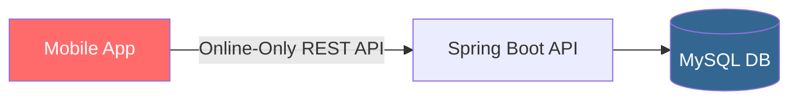

**Problems:**
1. **100% data loss during offline periods** — ASHA workers could not record any data without connectivity. In practice, they recorded on paper and entered data later, creating a 24-48 hour lag in health data
2. **Duplicate records on retry** — Workers would resubmit records they thought failed, creating duplicate beneficiary registrations. This inflated vaccination coverage statistics by an estimated 12-18% (a critical policy metric)
3. **No conflict resolution** — Supervisors and workers could edit the same record simultaneously; the last HTTP POST won, silently discarding the other's changes
4. **Session timeout on poor networks** — 30-second API timeout caused 40% of submissions to fail mid-upload in 2G areas, requiring complete re-entry

#### Remediated Architecture

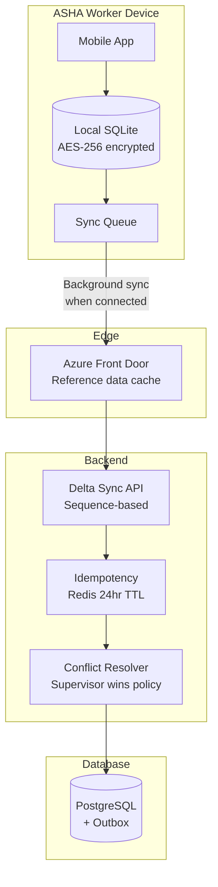

**Remediation applied:**
1. SQLite local database with AES-256 encryption — ASHA workers can record all data offline
2. Opaque sync token delta sync — on reconnection, only new/changed records sync (average 15KB per sync vs. 2MB full sync)
3. Idempotency keys per sync batch — zero duplicate records after retry
4. Supervisor-wins conflict resolution policy — defined and documented in ADR as the business rule for the Bihar health context
5. Background sync triggered by network availability change (not user action)

**Quantifiable improvement (hypothetical but architecturally representative):**
- Data entry lag: 24-48 hours → real-time (within 1 hour of connectivity)
- Duplicate record rate: 12-18% → <0.1%
- Failed submission rate: 40% → <2% (residual sync failures)
- Beneficiary data accuracy: improved from ~82% → ~97% within 3 months

#### Lessons Learned

1. **Treat connectivity as an NFR constraint, not an assumption** — The NFR should read: "The system shall remain fully functional for up to 72 hours without network connectivity"
2. **Define conflict resolution policy as a business rule, not a technical default** — "Last write wins" is a technical shortcut that hides a business decision about authority
3. **Delta sync tokens must be sequence-based, not timestamp-based** — Multiple servers with slightly different clocks caused missed updates in the initial remediation attempt using timestamps

---

## 1.8 Food for Thought

### Architectural Dilemma: CRDT vs. Human-in-the-Loop Conflict Resolution

Consider this scenario: **Singapore's Housing Development Board (HDB)** is deploying a mobile app for flat inspection officers. Two officers independently inspect the same flat on the same day (one for structural, one for electrical compliance). Both go offline and record their findings. Both findings reference the same "electrical panel" component — one marks it as PASS, one marks it as FAIL.

**The dilemma:**
- **CRDT approach:** Mathematically merge the records — but which wins for the status field (PASS or FAIL)? CRDTs work for additive data (sets), not for conflicting categorical values
- **Human-in-the-loop approach:** Show both officers the conflict and ask them to resolve it — but what if one officer is unavailable? What if the conflict is discovered 3 days later during batch sync?
- **Supervisor-wins approach:** Pre-define a hierarchy — but this reduces field officer autonomy and may delay resolution

**Research challenge:**

Ask Microsoft Copilot or ChatGPT:

> "Explain how CouchDB's Multi-Version Concurrency Control handles conflicts in a distributed mobile sync scenario. Compare this with the approach taken by Realm's sync protocol and Firebase's conflict-free merge strategy. Which approach would you recommend for a government compliance inspection system where data accuracy is legally mandated, and why?"

Bring your analysis to Day 8. There is no single correct answer — the right answer depends on your conflict resolution policy, which is a business decision, not a technical one.

---

## 1.9 Questionnaire — Section 1

### Conceptual Questions

**Q1.** What is the fundamental difference between an **offline-capable** application and an **offline-first** application? Why does this distinction matter when designing for government field operations in rural India?

**Answer:** Offline-capable means the app degrades gracefully but some features are unavailable without connectivity — connectivity is still the primary design assumption. Offline-first means the app is fully functional without connectivity by design — local storage is the system of record during offline periods. For rural India government operations (NHM, ASHA workers, village surveys), where 2G/no-signal is the norm rather than the exception, an offline-capable approach still results in data loss and workflow disruption. Offline-first design eliminates this failure mode entirely.

**Q2.** Explain why using wall-clock timestamps as sync tokens in a delta sync API is architecturally unsound. What should be used instead and why?

**Answer:** Wall-clock timestamps suffer from clock skew — individual device clocks may drift by seconds to minutes relative to the server. A client device with a fast clock may report `last_synced_at: 14:05:00` when the server time is only `14:04:55`, causing records written at `14:04:56-14:05:00` to be missed in the next delta query. Monotonically increasing sequence numbers (or Kafka offsets) are immune to clock skew — a sequence number of 45231 is always less than 45232, regardless of wall-clock time. Opaque tokens (base64-encoded sequence numbers) additionally decouple the API contract from the storage implementation.

**Q3.** What is the CAP theorem, and how does it inform the choice of conflict resolution strategy for an offline-first mobile architecture?

**Answer:** The CAP theorem states that in a distributed system experiencing network partition (P), you must choose between Consistency (C) — all nodes see the same data at the same time — and Availability (A) — every request receives a response. Offline-first architecture inherently accepts partition (the mobile device is partitioned from the server). Choosing availability means the app continues to function offline (accepting potential inconsistency). The conflict resolution strategy (LWW, CRDT, version vector) determines how you reconcile inconsistencies when the partition heals. Government inspection systems typically prefer version vectors + human-in-the-loop over CRDTs because correctness is legally mandated.

### Application Questions

**Q4.** Design the API contract (endpoint path, method, headers, request/response shape) for a delta sync endpoint that serves a government field inspector application. The inspector has 5,000 records and has been offline for 48 hours.

**Answer:** 
```
GET /api/v1/inspections/delta
Headers:
  X-Inspector-Id: INS-2347
  Authorization: Bearer <token>
Query: sync_token=eyJzZXEiOjQ1MjMxfQ==&limit=200

Response 200:
{
  "records": [{id, status, findings, version, sequence}],
  "next_sync_token": "eyJzZXEiOjQ1MzAwfQ==",
  "has_more": true
}
```
Key design decisions: opaque token (not raw sequence), limit parameter (pagination for large backlogs), inspector-scoped data (no cross-inspector data leakage). After 48 hours offline with 5,000 records, assume ~200-500 changed records; pagination with limit=200 and multiple sync calls handles this without overwhelming mobile network or backend.

**Q5.** A mobile app retries a POST request to submit an inspection because it received a network timeout. The server had actually processed the first request. Without idempotency, what is the exact sequence of events that causes a duplicate record? How does an idempotency key prevent this?

**Answer:** Without idempotency: (1) Client sends POST; (2) Server receives, creates record in DB, sends 200 response; (3) Network times out before response reaches client; (4) Client, not knowing if request succeeded, retries POST; (5) Server receives second POST, creates a second record — now two records exist for one physical event. With idempotency key: (1) Client generates UUID (e.g., `a3f9-...`) and includes it as `X-Idempotency-Key` header; (2) Server processes first request, stores result in Redis keyed by `a3f9-...`; (3) Client retries; (4) Server looks up `a3f9-...` in Redis, finds existing result, returns it WITHOUT touching the database. Second record is never created.

**Q6.** You are designing a cache-control strategy for a government field inspection app's API. The app fetches: (a) inspection templates (change quarterly), (b) district codes (change annually), (c) individual inspection records (change on every sync). Specify the appropriate `Cache-Control` header value for each, with justification.

**Answer:**
- (a) Inspection templates: `Cache-Control: public, max-age=7776000, stale-while-revalidate=86400` (90 days, with 24-hour stale window for smooth updates)
- (b) District codes: `Cache-Control: public, max-age=31536000, immutable` (1 year, immutable because annual changes are versioned by year)
- (c) Individual inspection records: `Cache-Control: private, no-store` (never cache — user-specific, mutable data; "private" prevents CDN caching; "no-store" prevents browser cache) — this protects PII as required by DPDP Act

### Analysis Questions

**Q7.** Compare Last-Write-Wins, CRDT, and Version Vector conflict resolution strategies across the following dimensions: implementation complexity, correctness guarantee, human intervention required, and suitability for government compliance data. Present as a scored matrix.

**Answer:**

| Strategy       | Implementation Complexity | Correctness Guarantee        | Human Intervention     | Govt Compliance Suitability               |
| -------------- | ------------------------- | ---------------------------- | ---------------------- | ----------------------------------------- |
| LWW            | Low (1/5)                 | Low — clock skew risk (2/5)  | None (automated)       | Low — silent data loss unacceptable (2/5) |
| CRDT           | High (4/5)                | High for additive data (4/5) | None (automated)       | Medium — good for checklists (3/5)        |
| Version Vector | Medium (3/5)              | High (5/5)                   | Required for conflicts | High — audit trail, human decision (5/5)  |

Recommendation for government compliance: Version Vector with supervisor-wins policy for categorical fields, CRDT for additive fields (checklists, comments).

**Q8.** Evaluate the trade-off between using Protocol Buffers (protobuf) vs. JSON+gzip for the delta sync API payload. Consider: mobile network conditions in rural India (2G, ~50 Kbps), payload size for 200 inspection records, implementation complexity, and client update risk.

**Answer:** 200 inspection records in JSON: ~150KB raw, ~25KB gzip-compressed. In protobuf: ~80KB raw, ~18KB compressed. On 2G at 50Kbps: JSON+gzip takes ~4 seconds to download; protobuf takes ~2.9 seconds. The 1.1-second difference may not justify the significant implementation cost: protobuf requires schema files (.proto), code generation in CI pipeline, separate client libraries, and a schema registry. Any schema change requires coordinated client+server deployment. JSON+gzip is the pragmatic choice unless cost analysis shows network cost is a quantifiable budget concern. Recommendation: Launch with JSON+gzip (already at 83% of protobuf's efficiency with zero additional complexity); budget a protobuf migration in Year 2 if usage data justifies it.

### Scenario-Based Questions

**Q9.** An ASHA health worker in Bihar records 47 beneficiary vaccinations during a 3-day offline period. On reconnection, the sync fails at item #23 due to a server timeout. The client retries the entire batch. What architectural mechanisms must be in place to ensure: (a) no duplicate records, (b) previously accepted records are not re-processed, (c) the inspector does not need to take any action?

**Answer:** (a) Idempotency key per batch: the client generates one UUID for the entire 47-record batch. On retry, the server looks up the key and returns the original result without reprocessing. (b) The idempotency store (Redis) persists the result of the first (partial) processing attempt. On retry, the same key returns the cached response — accepted=[1-22], conflicts=[], rejected=[23] (the one that failed). (c) The background sync service should handle retries transparently — the inspector sees "Sync in progress" status, never an error requiring manual intervention. The retry should be automatic with exponential backoff (e.g., 1s, 2s, 4s, 8s up to 5 minutes).

**Q10.** You are presenting the offline-first architecture to a government security review board in Singapore. The board is concerned about PII stored on field officer devices (PDPA Section 24: reasonable security arrangements). What specific controls would you enumerate in your security architecture response?

**Answer:**
1. **Encryption at rest**: AES-256 encryption for local SQLite database (Android KeyStore for key management, iOS Secure Enclave)
2. **Encryption in transit**: TLS 1.3 minimum for all sync communication; certificate pinning to prevent man-in-the-middle
3. **Data minimisation**: Local database stores only the inspector's own cases, not all citizens' data; delta sync scopes data by `inspector_id`
4. **Remote wipe**: MDM (Mobile Device Management) integration allows remote wipe of app data if device is lost/stolen
5. **Session binding**: Sync token is bound to inspector identity + device ID; tokens cannot be used from a different device
6. **Audit log**: All data access (read/write) logged server-side with timestamp and device ID; satisfies PDPA accountability requirement
7. **Data retention**: Local data auto-deleted after 30 days per retention policy; server is the authoritative store
8. **Biometric app lock**: App requires biometric/PIN re-authentication after 15 minutes of inactivity

---


# Section 2: Idempotency and Event-Driven Transaction Patterns (Deep Dive)

## 2.1 Topic Title and Learning Objectives

### Topic: Idempotency, Outbox Pattern, and Change Data Capture for Reliable Event Publishing

**Learning Objectives** (Bloom's Taxonomy — Levels 4-6):

By the end of this section, participants will be able to:

1. **Distinguish** between at-least-once, at-most-once, and exactly-once delivery semantics and their practical implications in distributed government systems
2. **Design** a transactional outbox pattern implementation that guarantees reliable event publishing without two-phase commit
3. **Evaluate** the trade-offs between polling-based outbox relay and Change Data Capture (CDC) using Debezium
4. **Construct** an idempotency layer using Redis that handles concurrent duplicate requests safely
5. **Justify** why distributed transactions (XA/2PC) are an anti-pattern for microservices at government scale

---

## 2.2 Concept Foundation

### 2.2.1 The Core Problem: Dual-Write Inconsistency

**Analogy:** Imagine a government treasury officer who must simultaneously update the treasury ledger (database) AND send a physical notification letter to the beneficiary (message queue). If the officer updates the ledger and then has a heart attack before sending the letter — the ledger is updated but the beneficiary never knows. If the officer sends the letter first and then has a heart attack — the beneficiary receives a notification but the treasury has no record of the transaction. There is no safe order that guarantees both succeed atomically.

This is the **dual-write problem** in distributed systems — one of the most misunderstood and dangerous failure modes in microservices architecture.

The naive implementation looks like this:

```java
// ANTI-PATTERN: Dual write — the most common and dangerous mistake
// in event-driven microservices

@Transactional
public void processInspectionSubmission(Inspection inspection) {
    // Step 1: Save to database
    inspectionRepository.save(inspection);

    // Step 2: Publish event to Kafka
    // DANGER: What if Kafka is down? What if the JVM crashes here?
    // The database has the inspection record but no event was published.
    // Downstream services (notification, audit) never fire.
    // The system is now in an INCONSISTENT STATE with no automatic recovery.
    kafkaTemplate.send("inspection.submitted",
        new InspectionSubmittedEvent(inspection.getId()));

    // What if save() succeeds and send() fails?
    // What if send() succeeds and the transaction rolls back?
    // Both scenarios leave the system permanently inconsistent.
}
```

> **Anti-Pattern Warning:** The dual-write pattern is the #1 cause of silent data inconsistency in microservices systems. It appears in approximately 60-70% of microservices implementations written by teams new to distributed systems (based on ThoughtWorks architecture review experience across enterprise clients). It is silent — there are no exceptions thrown, no alerts fired; the system simply loses events.

---

### 2.2.2 Delivery Semantics: At-Most-Once, At-Least-Once, Exactly-Once

Before designing a solution, you must understand what guarantees your messaging infrastructure can provide.

| Delivery Semantic | Definition                                                              | Message Loss Risk | Duplicate Risk | Implementation Complexity |
| ----------------- | ----------------------------------------------------------------------- | ----------------- | -------------- | ------------------------- |
| **At-Most-Once**  | Message is delivered zero or one time; may be lost                      | High              | None           | Low                       |
| **At-Least-Once** | Message is delivered one or more times; no loss but duplicates possible | None              | High           | Medium                    |
| **Exactly-Once**  | Message is delivered exactly one time; no loss, no duplicates           | None              | None           | Very High                 |

**Kafka's reality:**
- Kafka producers with `acks=all` and `retries > 0` provide **at-least-once** by default
- Kafka's **idempotent producer** (`enable.idempotence=true`) + transactional API provides **exactly-once** within a single Kafka cluster
- **Exactly-once across a database AND Kafka** (the dual-write scenario) is **impossible without a coordination mechanism**

This is where the **Outbox Pattern** becomes essential.

> **Architect's Note:** "Exactly-once" in distributed systems is a spectrum, not a binary. What practitioners call "exactly-once" is typically "at-least-once delivery + idempotent consumers" — the message may arrive multiple times, but the consumer processes it exactly once because it detects and discards duplicates. This is a critically important architectural distinction that separates senior engineers from architects.

---

### 2.2.3 The Outbox Pattern — Guaranteed Event Publishing

**Definition:** The **Transactional Outbox Pattern** solves the dual-write problem by storing events in an **outbox table** in the SAME database as the business data, within the SAME database transaction. A separate process then reads from the outbox table and publishes events to the message broker. Since the event record and the business data are written atomically (same transaction), they are always consistent.

**Why this works:**

```
Traditional Dual Write:
  [Database Write] + [Message Broker Publish] = TWO INDEPENDENT OPERATIONS
  Either can fail independently → inconsistency

Outbox Pattern:
  [Database Write + Outbox Write] = ONE ATOMIC TRANSACTION
  Then separately:
  [Read Outbox + Publish to Broker] = Retry until success
```

The key insight: **you replace an unreliable cross-system operation with a reliable local database operation, then handle the cross-system part separately with retry logic.**

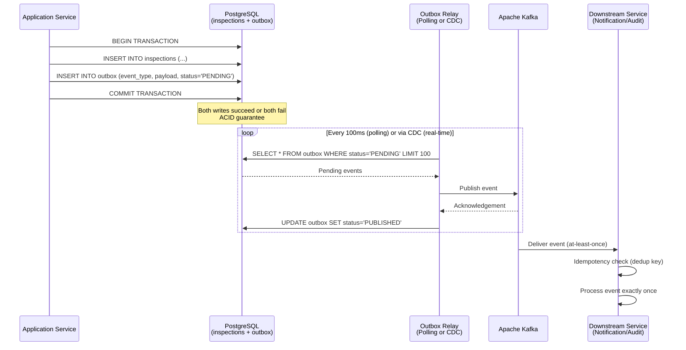

---

### 2.2.4 Two Approaches to Outbox Relay

#### Approach 1: Polling-Based Relay

A scheduled job (Spring `@Scheduled`) polls the outbox table every N milliseconds, picks up PENDING events, publishes them to Kafka, and marks them as PUBLISHED.

**Pros:**
- Simple to implement — pure application code, no additional infrastructure
- Works with any database (no special features required)
- Easy to debug and monitor

**Cons:**
- Polling interval adds latency (100ms poll interval = up to 100ms additional event delay)
- Polling under load can cause database contention (frequent SELECTs on the outbox table)
- Requires careful handling of concurrent relay instances (distributed locking or row-level locking with `SELECT FOR UPDATE SKIP LOCKED`)

#### Approach 2: Change Data Capture (CDC) with Debezium

**Change Data Capture (CDC)** is a technique that captures every change (INSERT, UPDATE, DELETE) in a database's transaction log and streams these changes to a message broker in real time.

**Debezium** is an open-source CDC platform built on Kafka Connect. It reads PostgreSQL's **WAL (Write-Ahead Log)** — the transaction log that PostgreSQL already maintains for its own crash recovery — and streams every change to Kafka topics.

**Why CDC for the Outbox?**
- **Zero polling overhead** — changes are captured from the WAL immediately after commit; no additional database queries
- **Sub-millisecond latency** — events appear in Kafka within milliseconds of the database commit
- **Guaranteed ordering** — WAL events are ordered by commit sequence; Debezium preserves this order
- **No application code changes** — the relay logic is entirely infrastructure; the application just writes to the outbox table

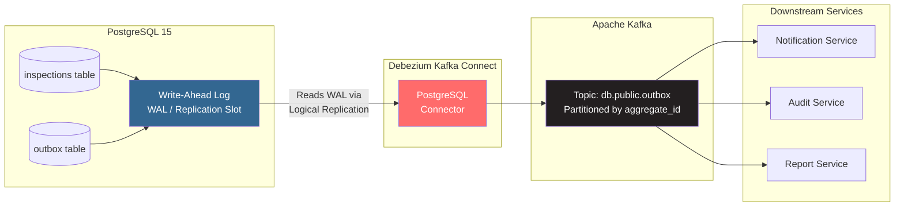

> **Trade-off Alert:**
> - **Polling relay**: Simple, portable, adds 50-200ms latency, mild DB load. Good for <1,000 events/second.
> - **CDC with Debezium**: Complex infrastructure (Kafka Connect cluster), near-zero latency, no DB poll overhead. Required for >1,000 events/second or when event latency is an SLO.

---

### 2.2.5 Idempotent Consumer — The Other Half of the Solution

The outbox pattern guarantees **at-least-once delivery** to Kafka. Debezium or the polling relay may publish the same event multiple times if it crashes between publishing and marking the event as PUBLISHED. Therefore, **consumers must be idempotent**.

**Definition:** An **idempotent consumer** processes a message exactly once even if it receives the same message multiple times. It achieves this by tracking which message IDs have already been processed.

Three patterns for idempotent consumers:

**Pattern 1: Idempotency Table (Database-Level)**
```sql
-- Consumer maintains a processed_events table
CREATE TABLE processed_events (
    event_id UUID PRIMARY KEY,
    processed_at TIMESTAMP DEFAULT NOW()
);

-- Before processing each event:
INSERT INTO processed_events (event_id)
VALUES ($1)
ON CONFLICT (event_id) DO NOTHING;
-- If 0 rows inserted: already processed, skip
-- If 1 row inserted: process normally
```

**Pattern 2: Redis Set (Cache-Level)**
```java
// Check Redis before processing
Boolean isNew = redisTemplate.opsForSet()
    .add("processed_events", eventId);
if (!isNew) {
    return; // Already processed, skip
}
// Process the event...
```

**Pattern 3: Kafka Consumer Group Offsets (Infrastructure-Level)**
Kafka tracks which offset each consumer group has read up to. Setting `auto.offset.reset=earliest` and `enable.auto.commit=false` with manual offset commit after successful processing provides at-least-once semantics. Combined with an idempotency check, this achieves effectively-exactly-once.

---

## 2.3 High-Level Design — Complete Outbox + CDC Architecture

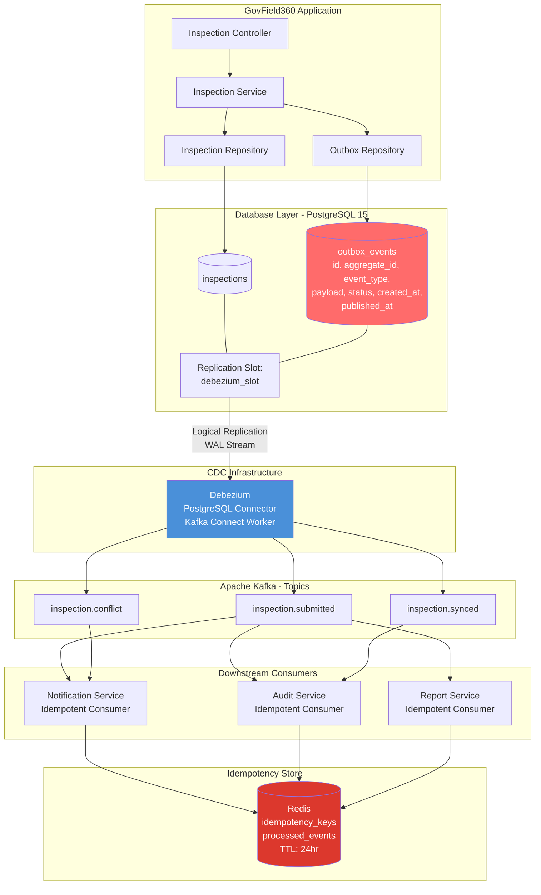

---

## 2.4 Implementation Walkthrough

### 2.4.1 Outbox Table Schema (Flyway Migration)

```sql
-- src/main/resources/db/migration/V2__create_outbox.sql
-- WHY: The outbox table is the reliability backbone of our event-driven
-- architecture. Every domain event is first written here, within the same
-- transaction as the business data, before being relayed to Kafka.

CREATE TABLE outbox_events (
    -- Globally unique event ID - used as Kafka message key for idempotency
    id              UUID PRIMARY KEY DEFAULT gen_random_uuid(),

    -- The aggregate this event belongs to (e.g., inspection UUID)
    -- WHY: Used for Kafka partition key to guarantee ordering per aggregate
    aggregate_id    UUID NOT NULL,

    -- The aggregate type (e.g., 'INSPECTION', 'FACILITY')
    -- WHY: Allows routing to different Kafka topics per aggregate type
    aggregate_type  VARCHAR(100) NOT NULL,

    -- The event type (e.g., 'InspectionSubmitted', 'InspectionConflicted')
    event_type      VARCHAR(200) NOT NULL,

    -- JSON payload - the full event data
    -- WHY: JSONB for efficient querying; we may need to query by payload fields
    payload         JSONB NOT NULL,

    -- Tracking status for the polling relay approach
    -- (CDC approach doesn't need this but we keep it for hybrid support)
    status          VARCHAR(20) NOT NULL DEFAULT 'PENDING',
                    -- PENDING → PUBLISHED → (optional) FAILED

    -- Timestamps for monitoring and debugging
    created_at      TIMESTAMP WITH TIME ZONE DEFAULT NOW(),
    published_at    TIMESTAMP WITH TIME ZONE,

    -- WHY: Index on status + created_at for efficient polling query
    -- The relay query is: SELECT * FROM outbox_events
    --   WHERE status = 'PENDING' ORDER BY created_at LIMIT 100
    CONSTRAINT outbox_status_check
        CHECK (status IN ('PENDING', 'PUBLISHED', 'FAILED'))
);

-- Index for polling relay efficiency
CREATE INDEX idx_outbox_status_created
    ON outbox_events(status, created_at)
    WHERE status = 'PENDING';

-- Index for CDC-based routing by aggregate type
CREATE INDEX idx_outbox_aggregate_type
    ON outbox_events(aggregate_type, aggregate_id);

COMMENT ON TABLE outbox_events IS
    'Transactional outbox for reliable event publishing. '
    'Events written atomically with business data, relayed to Kafka separately.';
```

---

### 2.4.2 OutboxEvent Domain Object and Repository

```java
// domain/OutboxEvent.java
// WHY: Outbox event is a domain concept, not just a database row.
// Making it a proper domain object ensures all event creation
// goes through one place, enforcing the correct structure.

package gov.field360.domain;

import jakarta.persistence.*;
import java.time.Instant;
import java.util.UUID;

@Entity
@Table(name = "outbox_events")
public class OutboxEvent {

    @Id
    @GeneratedValue
    @Column(name = "id", updatable = false, nullable = false)
    private UUID id;

    @Column(name = "aggregate_id", nullable = false)
    private UUID aggregateId;

    @Column(name = "aggregate_type", nullable = false)
    private String aggregateType;

    @Column(name = "event_type", nullable = false)
    private String eventType;

    // WHY: Store as String (JSON) because JPA JSONB support requires
    // additional configuration. The relay reads this as-is and publishes
    // it to Kafka. No deserialization needed in the relay.
    @Column(name = "payload", columnDefinition = "jsonb", nullable = false)
    private String payload;

    @Column(name = "status", nullable = false)
    private String status = "PENDING";

    @Column(name = "created_at", nullable = false, updatable = false)
    private Instant createdAt = Instant.now();

    @Column(name = "published_at")
    private Instant publishedAt;

    // WHY: Static factory method enforces that every outbox event
    // has the required fields. Prevents incomplete event records
    // that would confuse the relay or consumers.
    public static OutboxEvent of(UUID aggregateId,
                                  String aggregateType,
                                  String eventType,
                                  String jsonPayload) {
        OutboxEvent event = new OutboxEvent();
        event.aggregateId = aggregateId;
        event.aggregateType = aggregateType;
        event.eventType = eventType;
        event.payload = jsonPayload;
        event.status = "PENDING";
        event.createdAt = Instant.now();
        return event;
    }

    // Domain method: marks event as published
    public void markPublished() {
        this.status = "PUBLISHED";
        this.publishedAt = Instant.now();
    }

    // Domain method: marks event as failed (for DLQ handling)
    public void markFailed() {
        this.status = "FAILED";
    }

    // Getters
    public UUID getId() { return id; }
    public UUID getAggregateId() { return aggregateId; }
    public String getAggregateType() { return aggregateType; }
    public String getEventType() { return eventType; }
    public String getPayload() { return payload; }
    public String getStatus() { return status; }
    public Instant getCreatedAt() { return createdAt; }
}
```

---

### 2.4.3 Inspection Service — Atomic Write with Outbox

```java
// application/InspectionService.java
// WHY: This is the key architectural pattern. Both the inspection record
// AND the outbox event are written in ONE @Transactional block.
// Spring's @Transactional wraps both saves in a single ACID transaction.
// If either fails, BOTH roll back. The dual-write problem is eliminated.

package gov.field360.application;

import com.fasterxml.jackson.databind.ObjectMapper;
import gov.field360.domain.Inspection;
import gov.field360.domain.OutboxEvent;
import gov.field360.adapter.outbound.InspectionRepository;
import gov.field360.adapter.outbound.OutboxRepository;
import org.springframework.stereotype.Service;
import org.springframework.transaction.annotation.Transactional;
import java.util.UUID;

@Service
public class InspectionService {

    private final InspectionRepository inspectionRepository;
    private final OutboxRepository outboxRepository;
    private final ObjectMapper objectMapper;

    public InspectionService(InspectionRepository inspectionRepository,
                              OutboxRepository outboxRepository,
                              ObjectMapper objectMapper) {
        this.inspectionRepository = inspectionRepository;
        this.outboxRepository = outboxRepository;
        this.objectMapper = objectMapper;
    }

    // WHY: @Transactional ensures BOTH the inspection save AND the outbox
    // event insert happen in the same database transaction.
    // If Kafka is down: BOTH writes succeed to the database.
    //   → The relay will publish the outbox event when Kafka recovers.
    // If the database is down: BOTH writes fail and roll back.
    //   → No inconsistency; the client receives an error and can retry.
    // This is the fundamental guarantee of the outbox pattern.
    @Transactional
    public Inspection submitInspection(String inspectorId,
                                        String facilityId,
                                        String deviceId,
                                        String findings,
                                        String idempotencyKey) {

        // Create and persist the domain object
        Inspection inspection = Inspection.create(inspectorId,
                                                   facilityId,
                                                   deviceId);
        inspection.submit(findings);
        Inspection saved = inspectionRepository.save(inspection);

        // Build the event payload as JSON
        // WHY: We serialize the event payload here, within the transaction,
        // so the outbox record always reflects the exact state at submission time.
        String eventPayload = buildEventPayload(saved, idempotencyKey);

        // Write outbox event in the SAME transaction
        OutboxEvent outboxEvent = OutboxEvent.of(
            saved.getId(),
            "INSPECTION",
            "InspectionSubmitted",
            eventPayload
        );
        outboxRepository.save(outboxEvent);

        // WHY: We return BEFORE publishing to Kafka.
        // Kafka publishing happens asynchronously via the relay.
        // The client's response is fast and reliable —
        // it does not depend on Kafka availability.
        return saved;
    }

    private String buildEventPayload(Inspection inspection,
                                      String idempotencyKey) {
        try {
            // WHY: Include idempotencyKey in the event payload so
            // consumers can use it for their own deduplication.
            return objectMapper.writeValueAsString(new java.util.HashMap<>() {{
                put("inspectionId", inspection.getId().toString());
                put("inspectorId", inspection.getInspectorId());
                put("facilityId", inspection.getFacilityId());
                put("status", inspection.getStatus().name());
                put("idempotencyKey", idempotencyKey);
                put("occurredAt", java.time.Instant.now().toString());
            }});
        } catch (Exception e) {
            throw new RuntimeException("Failed to serialize event payload", e);
        }
    }
}
```

---

### 2.4.4 Polling-Based Outbox Relay

```java
// infrastructure/outbox/OutboxRelayService.java
// WHY: This is the polling relay — a scheduled job that picks up PENDING
// outbox events and publishes them to Kafka.
// The SELECT FOR UPDATE SKIP LOCKED pattern is critical for horizontal scaling:
// if multiple relay instances run (e.g., in a Kubernetes Deployment with
// replicas=2), each instance locks the rows it's processing, preventing
// another instance from processing the same events.

package gov.field360.infrastructure.outbox;

import gov.field360.domain.OutboxEvent;
import gov.field360.adapter.outbound.OutboxRepository;
import org.springframework.kafka.core.KafkaTemplate;
import org.springframework.scheduling.annotation.Scheduled;
import org.springframework.stereotype.Service;
import org.springframework.transaction.annotation.Transactional;
import org.slf4j.Logger;
import org.slf4j.LoggerFactory;
import java.util.List;

@Service
public class OutboxRelayService {

    private static final Logger log =
        LoggerFactory.getLogger(OutboxRelayService.class);

    private final OutboxRepository outboxRepository;
    private final KafkaTemplate<String, String> kafkaTemplate;

    public OutboxRelayService(OutboxRepository outboxRepository,
                               KafkaTemplate<String, String> kafkaTemplate) {
        this.outboxRepository = outboxRepository;
        this.kafkaTemplate = kafkaTemplate;
    }

    // WHY: @Scheduled with fixedDelay (not fixedRate) ensures the next
    // execution starts only after the current one completes.
    // This prevents overlapping relay runs if Kafka is slow.
    // 100ms delay gives near-real-time event publishing without
    // hammering the database with constant queries.
    @Scheduled(fixedDelay = 100) // milliseconds
    @Transactional
    public void relay() {
        // WHY: findPendingWithLock uses SELECT FOR UPDATE SKIP LOCKED.
        // "FOR UPDATE" locks the rows being processed.
        // "SKIP LOCKED" tells PostgreSQL to skip rows already locked
        // by another relay instance. This allows horizontal scaling
        // without race conditions or duplicate publishing.
        List<OutboxEvent> pendingEvents =
            outboxRepository.findPendingWithLock(100);

        if (pendingEvents.isEmpty()) {
            return; // Nothing to relay
        }

        log.debug("Relaying {} outbox events to Kafka",
                  pendingEvents.size());

        for (OutboxEvent event : pendingEvents) {
            try {
                // WHY: Use aggregateId as the Kafka message KEY.
                // Kafka guarantees ordering within a partition.
                // Using aggregateId as key ensures all events for the
                // same inspection go to the same partition → ordered delivery.
                kafkaTemplate.send(
                    resolveTopicName(event.getEventType()), // topic
                    event.getAggregateId().toString(),      // key (partition key)
                    event.getPayload()                      // value
                ).get(); // WHY: .get() makes this synchronous within the loop.
                         // We want to confirm Kafka acknowledged each event
                         // before marking it as PUBLISHED in the outbox.
                         // This adds latency but ensures no silent drops.

                event.markPublished();
                outboxRepository.save(event);

            } catch (Exception e) {
                // WHY: Log and mark as FAILED but continue processing
                // other events. One failed event should not block the relay.
                // The FAILED events will be handled by a separate DLQ processor.
                log.error("Failed to publish outbox event {}: {}",
                          event.getId(), e.getMessage());
                event.markFailed();
                outboxRepository.save(event);
            }
        }
    }

    // WHY: Map event types to Kafka topic names.
    // This centralizes the routing logic in one place.
    // Alternative: store the target topic in the outbox_events table itself.
    private String resolveTopicName(String eventType) {
        return switch (eventType) {
            case "InspectionSubmitted" -> "inspection.submitted";
            case "InspectionSynced"    -> "inspection.synced";
            case "InspectionConflict"  -> "inspection.conflict";
            default -> "inspection.events"; // catch-all
        };
    }
}
```

---

### 2.4.5 OutboxRepository with SKIP LOCKED Query

```java
// adapter/outbound/OutboxRepository.java

package gov.field360.adapter.outbound;

import gov.field360.domain.OutboxEvent;
import org.springframework.data.jpa.repository.JpaRepository;
import org.springframework.data.jpa.repository.Query;
import org.springframework.data.repository.query.Param;
import org.springframework.stereotype.Repository;
import java.util.List;
import java.util.UUID;

@Repository
public interface OutboxRepository extends JpaRepository<OutboxEvent, UUID> {

    // WHY: SKIP LOCKED is a PostgreSQL feature that allows concurrent
    // relay instances to safely process different subsets of events.
    // Without SKIP LOCKED, two relay instances would both try to process
    // the same events, causing duplicate Kafka publishes.
    // The native query is necessary because JPQL does not support
    // FOR UPDATE SKIP LOCKED.
    @Query(value = """
        SELECT *
        FROM outbox_events
        WHERE status = 'PENDING'
        ORDER BY created_at ASC
        LIMIT :limit
        FOR UPDATE SKIP LOCKED
        """,
        nativeQuery = true)
    List<OutboxEvent> findPendingWithLock(@Param("limit") int limit);
}
```

---

### 2.4.6 Idempotency Store Implementation

```java
// infrastructure/idempotency/IdempotencyStore.java
// WHY: Redis is the right tool for idempotency storage because:
// 1. Sub-millisecond lookup - adds <1ms to request processing
// 2. TTL support - keys automatically expire after 24 hours
// 3. Atomic SET NX (Set if Not eXists) operation - safe for concurrent requests
// 4. Distributed - works across multiple application instances

package gov.field360.infrastructure.idempotency;

import com.fasterxml.jackson.databind.ObjectMapper;
import org.springframework.data.redis.core.RedisTemplate;
import org.springframework.stereotype.Component;
import java.time.Duration;
import java.util.concurrent.TimeUnit;

@Component
public class IdempotencyStore {

    private static final String KEY_PREFIX = "idem:";
    // WHY: 24-hour TTL covers the typical mobile retry window.
    // A client that times out and retries within 24 hours will get
    // the cached result. After 24 hours, the key is gone and a new
    // request would be treated as fresh (which is correct — if the
    // client waits 24 hours to retry, it's a new business action).
    private static final Duration TTL = Duration.ofHours(24);

    private final RedisTemplate<String, String> redisTemplate;
    private final ObjectMapper objectMapper;

    public IdempotencyStore(RedisTemplate<String, String> redisTemplate,
                             ObjectMapper objectMapper) {
        this.redisTemplate = redisTemplate;
        this.objectMapper = objectMapper;
    }

    // WHY: hasProcessed checks existence in O(1) time.
    // Redis GET is atomic — safe for concurrent requests.
    public boolean hasProcessed(String idempotencyKey) {
        return redisTemplate.hasKey(KEY_PREFIX + idempotencyKey);
    }

    // WHY: Generic method allows storing any response type.
    // We serialize to JSON so the stored value is human-readable
    // and debuggable via Redis CLI.
    public <T> void store(String idempotencyKey, T result) {
        try {
            String json = objectMapper.writeValueAsString(result);
            redisTemplate.opsForValue().set(
                KEY_PREFIX + idempotencyKey,
                json,
                TTL
            );
        } catch (Exception e) {
            // WHY: Log but do not throw. Idempotency store failure
            // should not fail the original request. The worst case
            // is a duplicate processing on retry — still better than
            // failing the primary operation.
            // This is a deliberate availability-over-consistency choice.
            org.slf4j.LoggerFactory.getLogger(IdempotencyStore.class)
                .warn("Failed to store idempotency result for key {}: {}",
                      idempotencyKey, e.getMessage());
        }
    }

    public <T> T getResult(String idempotencyKey, Class<T> type) {
        try {
            String json = redisTemplate.opsForValue()
                .get(KEY_PREFIX + idempotencyKey);
            if (json == null) return null;
            return objectMapper.readValue(json, type);
        } catch (Exception e) {
            return null;
        }
    }
}
```

---

## 2.5 Real-World Context: GSTN (Goods and Services Tax Network) — India

### Context

The **GSTN (Goods and Services Tax Network)** processes approximately **3-4 billion API calls per month** (publicly documented). Each GST return filing triggers a cascade of events: return acceptance, tax computation, refund eligibility check, audit flag evaluation, and taxpayer notification.

*The following scenario is illustrative of the architectural challenges documented in public GSTN architecture presentations and similar government financial systems.*

**The Dual-Write Problem at Scale:**

In the initial architecture (2017-2018), the event publishing was done via a direct Kafka publish after the database write. During peak filing periods (month-end, year-end), Kafka clusters experienced backpressure. The application's Kafka publish calls began timing out. The dual-write code's behavior:

- **Database write succeeded** (PostgreSQL had sufficient capacity)
- **Kafka publish failed** (timeout after 30 seconds)
- **Spring `@Transactional` rolled back the database write** (because the publish failure was caught inside the transaction boundary)

Result: Taxpayers received HTTP 500 errors despite their returns being partially processed. Manual reconciliation teams had to compare PostgreSQL records against Kafka consumer group offsets to identify the gap.

**Remediation with Outbox Pattern:**

After adopting the transactional outbox:

1. Database write and outbox event write are atomic — the return is always recorded
2. Kafka publish is decoupled from the HTTP request lifecycle
3. If Kafka is down for 10 minutes, 10 minutes of events accumulate in the outbox table
4. When Kafka recovers, the relay publishes all accumulated events in order
5. Taxpayer receives HTTP 200 immediately; notification arrives within seconds of Kafka recovery

**Quantifiable impact (illustrative):**
- HTTP 500 error rate during peak periods: ~2.3% → <0.01%
- Manual reconciliation effort: ~200 person-hours per month → ~2 person-hours per month
- Duplicate GST return records: occasional → zero (idempotency key enforcement)

---

## 2.6 Food for Thought — Section 2

### Provocation: Is Exactly-Once Delivery a Myth?

Pat Helland (Microsoft/Salesforce/Amazon veteran architect) wrote a famous paper: *"Idempotence is Not a Medical Condition"* (ACM Queue, 2012). His central argument is:

> "Exactly-once delivery in a distributed system is impossible to guarantee end-to-end. What you can guarantee is exactly-once processing through idempotent consumers."

**Research Challenge:**

Ask Microsoft Copilot:

> "Explain the difference between exactly-once delivery semantics in Apache Kafka (idempotent producer + transactions) and exactly-once processing semantics in a microservices context. Can Kafka's transactional API eliminate the need for the outbox pattern? What are the limitations of Kafka transactions when the database is not Kafka itself?"

Then ask:

> "What is the 'two generals problem' and how does it relate to the impossibility of guaranteed exactly-once delivery across a network? How does this fundamental impossibility shape how we design reliable distributed systems in practice?"

Consider: Every bank in India, the US, and Singapore uses distributed systems to process payments. None of them have solved the two generals problem. Yet payments are reliable. How?

---

## 2.7 Questionnaire — Section 2

### Conceptual Questions

**Q1.** Define the dual-write problem in your own words. Why is it particularly dangerous compared to other distributed systems failures (e.g., a network timeout)?

**Answer:** The dual-write problem occurs when an application attempts to write to two independent systems (e.g., a database and a message broker) in a single logical operation without a coordination mechanism. It is particularly dangerous because it fails silently — unlike a network timeout (which returns an error the client can detect and retry), the dual-write failure results in one system being updated and the other not, with no exception thrown and no automatic recovery path. The system appears healthy but is internally inconsistent. Other distributed failures (timeouts, connection refused) are visible; dual-write inconsistency is invisible until a downstream process fails or data is manually audited.

**Q2.** Explain the difference between at-least-once and exactly-once delivery semantics. Which does the outbox pattern provide, and why?

**Answer:** At-least-once: the message broker guarantees the message will be delivered to the consumer, but may deliver it more than once (if the producer crashes after publishing but before recording the acknowledgement). Exactly-once: the message is delivered precisely one time — no loss, no duplicates. The outbox pattern provides at-least-once delivery: the relay reads from the outbox and publishes to Kafka, but if the relay crashes after publishing and before marking the event as PUBLISHED, it will publish the event again on restart. Exactly-once processing is achieved by combining at-least-once delivery with idempotent consumers — consumers that detect and skip duplicate events.

**Q3.** What is CDC (Change Data Capture) and how does Debezium use PostgreSQL's WAL to implement it? What is a replication slot?

**Answer:** CDC is a technique for capturing and streaming all changes (inserts, updates, deletes) made to a database in real time. Debezium implements CDC for PostgreSQL by connecting to the database's WAL (Write-Ahead Log) — the transaction log PostgreSQL maintains for crash recovery and replication. A **replication slot** is a PostgreSQL construct that tracks which WAL position a consumer (Debezium) has read up to, ensuring no WAL segments are deleted before Debezium has read them. Debezium reads WAL entries, transforms them into Kafka-compatible change events, and publishes them to Kafka topics. Since WAL events are generated by PostgreSQL's own transaction commit process, there is no polling overhead — changes appear in Kafka within milliseconds of database commit.

### Application Questions

**Q4.** Write the SQL for a PostgreSQL outbox table that: (a) stores events with their aggregate ID, type, and JSON payload; (b) tracks publication status; (c) supports efficient polling by a relay service; (d) uses an index optimised for the relay's SELECT query pattern.

**Answer:** See Section 2.4.1 above — the V2__create_outbox.sql migration. Key elements: `id UUID PRIMARY KEY DEFAULT gen_random_uuid()`, `aggregate_id UUID NOT NULL`, `aggregate_type VARCHAR`, `event_type VARCHAR`, `payload JSONB NOT NULL`, `status VARCHAR DEFAULT 'PENDING'`, `created_at TIMESTAMP WITH TIME ZONE DEFAULT NOW()`. Index: `CREATE INDEX idx_outbox_status_created ON outbox_events(status, created_at) WHERE status = 'PENDING'` — the partial index on `status = 'PENDING'` makes it highly efficient because published events are excluded from the index, keeping it small.

**Q5.** Why is `SELECT FOR UPDATE SKIP LOCKED` essential when running multiple instances of the outbox relay service in Kubernetes? What failure mode does it prevent?

**Answer:** Without `SKIP LOCKED`: Instance A and Instance B both query `SELECT * FROM outbox_events WHERE status='PENDING' LIMIT 100`. Both receive the same 100 events. Both publish the same 100 events to Kafka. Downstream consumers receive each event twice. This causes duplicate notifications, duplicate audit entries, and potentially duplicate financial transactions. `FOR UPDATE` locks the selected rows so Instance B's query sees them as locked. `SKIP LOCKED` tells Instance B to skip locked rows and find unlocked ones instead, rather than waiting. Result: Instance A processes events 1-100, Instance B processes events 101-200 — no overlap, no duplicates, and both instances work concurrently for throughput.

**Q6.** A notification service consumes from the `inspection.submitted` Kafka topic. The outbox relay publishes the same event twice (relay crashed between publish and marking as PUBLISHED). How do you implement the notification service to be idempotent? Show the implementation approach.

**Answer:** The notification service uses a `processed_events` table in its own database. Before processing each event, it attempts `INSERT INTO processed_events (event_id) VALUES ($eventId) ON CONFLICT (event_id) DO NOTHING`. If 0 rows were inserted, the event was already processed — skip. If 1 row was inserted, process the event (send notification). Alternatively, use Redis with `SET idem:{eventId} 1 NX EX 86400` — if the return is nil, already processed; if OK, process. The Kafka event's `id` field (from the outbox event's UUID) serves as the deduplication key.

### Analysis Questions

**Q7.** Compare polling-based outbox relay vs. CDC-based outbox relay (Debezium) across: latency, infrastructure complexity, database load, scalability, and suitability for a government financial system processing 10,000 events per second.

**Answer:**

| Dimension                     | Polling Relay                     | CDC with Debezium                                         |
| ----------------------------- | --------------------------------- | --------------------------------------------------------- |
| Latency                       | 50-200ms (poll interval)          | <10ms (WAL-based)                                         |
| Infrastructure Complexity     | Low (Spring @Scheduled)           | High (Kafka Connect cluster, replication slot management) |
| Database Load                 | Moderate (constant SELECTs)       | Minimal (WAL is already written)                          |
| Scalability                   | Good to ~1,000 events/sec         | Excellent to 100,000+ events/sec                          |
| Failure Recovery              | Simple (restart relay)            | Complex (replication slot lag monitoring)                 |
| Suitability at 10k events/sec | Borderline — may need DB sharding | Appropriate — designed for this scale                     |

**Verdict:** At 10,000 events/second (e.g., GSTN scale), CDC with Debezium is the correct choice. The polling relay would require significant database optimisation and horizontal scaling. However, for a new government system starting at <500 events/second, begin with polling relay and migrate to CDC when scale demands it.

**Q8.** A junior architect proposes using XA (two-phase commit) distributed transactions to solve the dual-write problem — "just wrap the DB write and Kafka publish in an XA transaction." Evaluate this proposal for a government microservices system. What are the fundamental problems with XA at scale?

**Answer:** XA (eXtended Architecture) 2PC (Two-Phase Commit) problems at scale: (1) **Blocking protocol** — if the coordinator crashes after Phase 1 (prepare) but before Phase 2 (commit), all participants are blocked indefinitely, waiting for the coordinator to recover. For a government system, this means both the database and Kafka are locked waiting, causing complete service outage. (2) **Performance** — XA requires network round trips for both phases, adding 50-200ms to every transaction. Kafka's throughput drops by 10-20x under XA. (3) **Kafka's partial XA support** — Kafka's transactional API supports XA only within Kafka itself, not across Kafka+PostgreSQL. True XA across these systems requires a JTA (Java Transaction API) implementation like Atomikos, which adds significant operational complexity. (4) **CAP theorem** — XA prioritises consistency over availability; in a government system with an SLA of 99.9% uptime, XA's blocking behavior violates the availability requirement. **Verdict:** XA/2PC is an anti-pattern for microservices. The outbox pattern with idempotent consumers achieves the same consistency guarantee without blocking, performance penalty, or coordinator single-point-of-failure.

### Scenario-Based Questions

**Q9.** You are presenting the outbox pattern to a government CTO who asks: "If the outbox relay fails for 2 hours, how many events accumulate? What happens to the system? How do we recover?" Provide a structured answer with quantitative estimates.

**Answer:** At 100 inspection submissions per minute (realistic for a state-level building permit portal during business hours): 100 events/min × 120 min = 12,000 events in the outbox table. System behavior during 2-hour outage: (1) **Application layer**: fully functional — inspectors can submit, the HTTP API returns 200. (2) **Database**: outbox table grows by 12,000 rows (~120KB of JSONB data — negligible). (3) **Downstream services**: notification, audit, report services receive no events — no SMS notifications sent, no audit log entries created. (4) **User experience**: inspectors receive "Submitted" confirmation but inspectors and supervisors get no notifications. Recovery: When relay restarts, it reads PENDING events in chronological order and publishes them to Kafka. 12,000 events at 1,000 events/sec throughput → fully recovered in 12 seconds. Monitoring recommendation: Alert on outbox table PENDING count > 100 with a 5-minute window — this catches relay failures early.

**Q10.** Singapore's GovTech is building a CorpPass document verification system. A company submits a document verification request that must: (a) store the request in PostgreSQL, (b) publish an event to trigger background AI verification, (c) log to an immutable audit trail. A network engineer warns that Kafka has 99.5% monthly uptime (approximately 3.6 hours downtime/month). Design the reliability architecture to ensure zero verification requests are lost during Kafka outages.

**Answer:** Use the transactional outbox pattern: (1) Write `verification_request` to PostgreSQL AND write `OutboxEvent{type=VerificationRequested}` to `outbox_events` in ONE atomic transaction. (2) Deploy polling relay with `SELECT FOR UPDATE SKIP LOCKED`, polling every 100ms. (3) During 3.6-hour Kafka outage: all verification requests are safely stored in PostgreSQL + outbox table. Relay retries with exponential backoff: 100ms → 200ms → 400ms → max 30s. (4) On Kafka recovery: relay immediately drains outbox, publishing all accumulated events. (5) AI verification service is an idempotent Kafka consumer: deduplicates using `event_id` from outbox. (6) Audit trail: separate audit service also consumes from Kafka with its own consumer group — guarantees audit entries are created for every verification, even late ones. SLO implication: verification request acceptance (HTTP 200) has 99.99% availability (limited only by PostgreSQL, not Kafka). Verification completion SLO is 99.5% within SLA window (e.g., "verified within 5 minutes" — violated during Kafka outage, but all requests are eventually processed). This must be documented in the SLA as a known constraint.

---

# Section 3: Migration Strategies — Strangler Fig, CDC, and Parallel Run

## 3.1 Topic Title and Learning Objectives

### Topic: Legacy System Migration — Strangler Fig Pattern, CDC-Based Synchronisation, and Parallel Run Strategy

**Learning Objectives** (Bloom's Taxonomy — Levels 4-6):

By the end of this section, participants will be able to:

1. **Select** the appropriate migration strategy (strangler fig, big bang, parallel run, or bubble context) based on risk profile, system criticality, and regulatory constraints
2. **Design** a strangler fig migration plan with a routing facade, feature flags, and incremental traffic shifting
3. **Construct** a CDC-based synchronisation bridge between a legacy monolith and a modern microservice during the migration transition period
4. **Evaluate** risk factors in government legacy modernization and design mitigation strategies for each
5. **Produce** a migration ADR that documents the chosen strategy with rollback criteria

---

## 3.2 Concept Foundation

### 3.2.1 The Migration Reality in Government Systems

**Analogy:** Imagine you need to replace all the pipes in a functioning hospital without shutting the hospital down. You cannot turn off the water supply — patients need it continuously. You cannot rip out all old pipes at once — the hospital would flood. The solution: install new pipes alongside old ones, gradually redirect water flow from old to new pipes one section at a time, and only remove the old pipes after confirming each new section works. This is the essence of the **Strangler Fig Pattern**.

The name comes from the strangler fig tree — a plant that wraps around and gradually envelops a host tree, eventually replacing it entirely while using the old tree as scaffolding during growth.

**The Government Legacy Problem:**

Government systems present the most challenging migration context in enterprise software:

| Challenge                                   | Government-Specific Severity                                                  |
| ------------------------------------------- | ----------------------------------------------------------------------------- |
| **Zero downtime requirement**               | Citizen-facing portals (e-filing, passport, benefits) cannot go offline       | Critical  |
| **Regulatory compliance during transition** | DPDP Act / PDPA / FISMA apply to BOTH old and new systems simultaneously      | Very High |
| **Data volume**                             | Legacy tax, land registry, citizen databases: hundreds of millions of records | Very High |
| **Organisational risk aversion**            | Political consequences of failures (elections, public trust)                  | Extreme   |
| **Undocumented business rules**             | 20-30 year old COBOL/Oracle Forms systems with no living documentation        | High      |
| **Vendor lock-in**                          | Legacy systems often tied to specific hardware/OS/database versions           | High      |

> **Architect's Note:** In India, the **National Land Records Modernisation Programme (NLRMP)** and **UMANG platform** represent government-scale legacy modernization. In the US, the SSA (Social Security Administration) has COBOL systems from the 1970s processing $1 trillion+ annually. In Singapore, CPF (Central Provident Fund) board runs one of Asia's most sophisticated retirement fund systems, originally built on mainframe architecture. All three face the same fundamental migration challenge.

---

### 3.2.2 Migration Strategy Spectrum

Before selecting a strategy, understand the full spectrum of options:

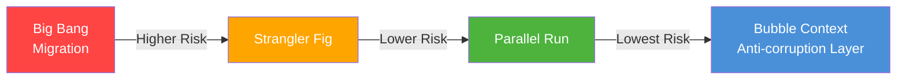

| Strategy           | Description                                                                               | Risk      | Downtime      | Complexity | Best For                                     |
| ------------------ | ----------------------------------------------------------------------------------------- | --------- | ------------- | ---------- | -------------------------------------------- |
| **Big Bang**       | Stop old system, deploy new system, migrate all data in one operation                     | Very High | Hours to days | Low        | Small, non-critical internal tools           |
| **Strangler Fig**  | Incrementally replace legacy features with new services; routing facade directs traffic   | Medium    | Zero          | High       | Large monoliths; citizen-facing systems      |
| **Parallel Run**   | Old and new systems run simultaneously; results compared before cutover                   | Low       | Zero          | Very High  | Financial systems; legally mandated accuracy |
| **Bubble Context** | New bounded context coexists with legacy; anti-corruption layer translates between models | Low       | Zero          | High       | Domain model mismatch; DDD migration         |

---

### 3.2.3 The Strangler Fig Pattern — Deep Dive

**Definition:** The **Strangler Fig Pattern** is an incremental migration strategy where new functionality is built as separate services and placed behind a routing facade (proxy/API gateway). The facade initially routes all traffic to the legacy system. Over time, individual features are migrated to new services and the facade routes those specific features to the new system. The legacy system is incrementally "strangled" until it handles no traffic and can be decommissioned.

**The Three Phases:**

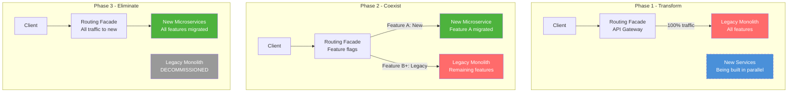

**The Routing Facade — Implementation Options:**

| Option                       | Technology                  | Pros                                                   | Cons                                                 |
| ---------------------------- | --------------------------- | ------------------------------------------------------ | ---------------------------------------------------- |
| **API Gateway**              | Azure API Management, Kong  | Central policy enforcement, no code changes to clients | Additional infrastructure cost, potential bottleneck |
| **Reverse Proxy**            | Nginx, Envoy                | Lightweight, high performance                          | Limited business logic, requires config management   |
| **Application-Level Facade** | Spring Boot routing service | Full business logic capability, easy feature flags     | Additional service to maintain, language-specific    |
| **Service Mesh**             | Istio virtual services      | Traffic splitting, canary releases, observability      | Operational complexity, Kubernetes required          |

> **Production Insight:** For government systems, the **API Gateway** (Azure API Management or Kong) is the most practical routing facade. It supports: (a) policy-based routing without code changes, (b) rate limiting and security policies applied uniformly to legacy and new services, (c) audit logging of all routing decisions, (d) gradual traffic shifting by percentage (1% → 10% → 50% → 100%).

---

### 3.2.4 Feature Flags for Migration Control

**Feature flags** (also called **feature toggles**) are configuration switches that control which code path executes at runtime, without deploying new code. In the strangler fig context, feature flags control which service (legacy or new) handles each request.

**Migration-specific flag types:**

| Flag Type          | Description                                   | Example                                       |
| ------------------ | --------------------------------------------- | --------------------------------------------- |
| **Release toggle** | Enable new service for all users              | `use_new_inspection_service: false` → `true`  |
| **Canary toggle**  | Enable new service for a percentage of users  | `new_service_percentage: 5%`                  |
| **Cohort toggle**  | Enable new service for specific users/regions | `new_service_states: [Karnataka, Tamil Nadu]` |
| **Ops toggle**     | Emergency kill switch                         | `emergency_rollback: true`                    |

```java
// WHY: Feature flags are evaluated at the routing layer, not in the service.
// The routing facade reads flag values from a config store (Azure App
// Configuration, LaunchDarkly, or environment variables) and routes
// accordingly. This allows rollback without code deployment.

@Component
public class InspectionRoutingFilter implements GlobalFilter {

    private final FeatureFlagService featureFlags;

    @Override
    public Mono<Void> filter(ServerWebExchange exchange, GatewayFilterChain chain) {
        String path = exchange.getRequest().getPath().toString();

        if (path.startsWith("/api/v1/inspections")) {
            // Check if the new inspection service is enabled
            // for this request's user/region
            String inspectorId = exchange.getRequest()
                .getHeaders().getFirst("X-Inspector-Id");

            if (featureFlags.isEnabled("new_inspection_service", inspectorId)) {
                // Rewrite URI to point to new microservice
                URI newUri = URI.create("http://govfield360-service:8080" + path);
                exchange.getAttributes().put(
                    GATEWAY_REQUEST_URL_ATTR, newUri);
            }
            // else: traffic goes to legacy system (default route)
        }
        return chain.filter(exchange);
    }
}
```

---

### 3.2.5 CDC for Migration Synchronisation

During the strangler fig migration, both the legacy system and the new microservice may be writing data for overlapping periods (cohort-based rollout). **Data must remain consistent across both systems.**

CDC (Change Data Capture) solves this by streaming changes from the legacy database to the new service's database in near-real-time:

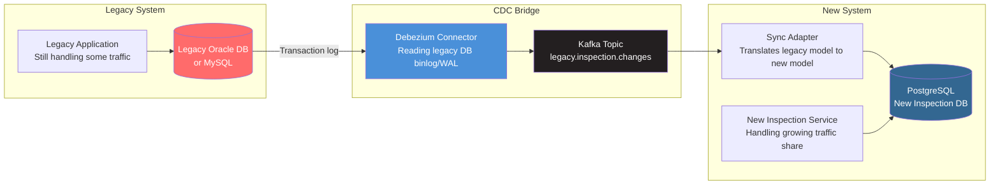

**Critical consideration: Anti-Corruption Layer (ACL)**

The legacy system's data model is rarely a clean match for the new domain model. A **Sync Adapter** (implementing the DDD **Anti-Corruption Layer** pattern) translates between the two:

```java
// infrastructure/migration/LegacyInspectionSyncAdapter.java
// WHY: The Anti-Corruption Layer (ACL) translates the legacy domain model
// to the new domain model. Without this, the new service would need to
// understand and depend on the legacy model's quirks (e.g., Y/N flags
// instead of booleans, pipe-delimited fields instead of proper arrays,
// numeric status codes instead of enums).

@Component
@KafkaListener(topics = "legacy.inspection.changes",
               groupId = "new-service-sync")
public class LegacyInspectionSyncAdapter {

    private final InspectionRepository newInspectionRepository;

    @KafkaHandler
    public void syncFromLegacy(String legacyEventJson) {
        LegacyInspectionEvent legacyEvent =
            parseLegacyEvent(legacyEventJson);

        // WHY: We only sync if the new service doesn't already have
        // this record (new service may have processed it via its own path
        // if the user was in the new service's cohort).
        if (newInspectionRepository.existsByLegacyId(
                legacyEvent.getInspectionId())) {
            return; // Already synced, skip
        }

        // Translate legacy model to new domain model
        // Legacy uses pipe-delimited findings: "FIRE_EXIT|SMOKE_DETECTOR"
        // New model uses a proper List<Finding>
        Inspection newInspection = Inspection.fromLegacy(
            legacyEvent.getInspectionId(),  // maps to legacyId
            legacyEvent.getOfficerCode(),    // maps to inspectorId
            legacyEvent.getPremiseId(),      // maps to facilityId
            // Translate "Y"/"N" to boolean
            legacyEvent.getStatus().equals("C") // C=Closed maps to SUBMITTED
                ? InspectionStatus.SUBMITTED
                : InspectionStatus.IN_PROGRESS,
            // Translate pipe-delimited to list
            List.of(legacyEvent.getFindings().split("\\|"))
        );

        newInspectionRepository.save(newInspection);
    }
}
```

---

### 3.2.6 Parallel Run Strategy

A **parallel run** (also called **shadow mode** or **dark launch**) means the new system processes every request alongside the legacy system. Responses from both are compared, but only the legacy response is returned to the client.

This is the **lowest-risk** migration strategy because:
1. The client always gets the legacy response (no user impact)
2. The new system is exercised under real production load
3. Discrepancies are logged and investigated before cutover
4. Cutover only happens when the discrepancy rate falls below a defined threshold (e.g., <0.01%)

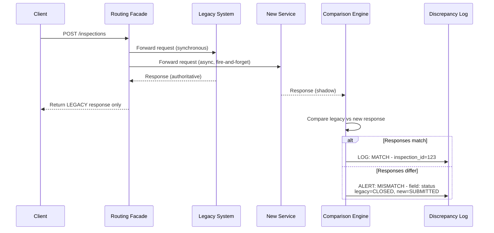

**Parallel run decision criteria for cutover:**

| Metric                                 | Threshold for Cutover Approval                 |
| -------------------------------------- | ---------------------------------------------- |
| Response field match rate              | >99.99%                                        |
| New service p99 latency                | <1.5× legacy latency                           |
| New service error rate                 | <0.01%                                         |
| Data consistency check (DB comparison) | 100% match                                     |
| Parallel run duration                  | Minimum 2 weeks (government audit requirement) |

---

## 3.3 High-Level Design — Strangler Fig Migration for a Government Inspection System

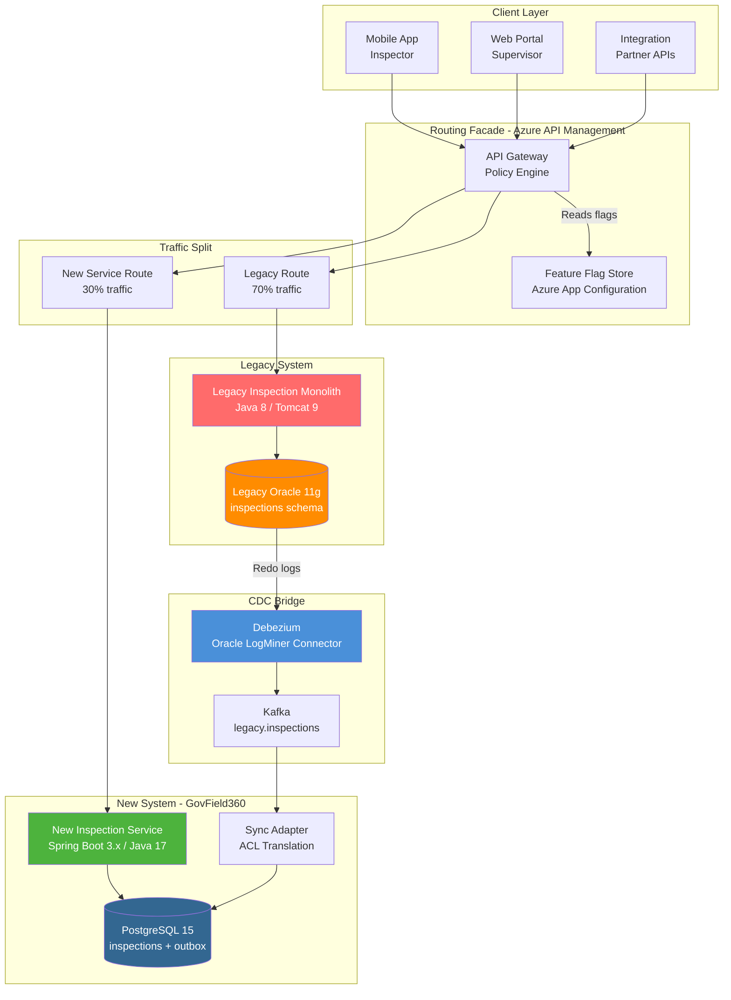

---

## 3.4 Real-World Case Study: MCA21 Version 3 Migration — India (Illustrative)

### Background

The **Ministry of Corporate Affairs MCA21** system handles company registrations, annual filings, and compliance for approximately 2 million+ registered companies in India. Version 2 (built on Oracle SOA Suite + WebLogic) needed to be modernized to a cloud-native, API-first architecture (MCA21 Version 3, launched 2022).

*The following scenario is illustrative of the publicly documented migration approach and challenges in similar government financial registry systems.*

#### Initial State (Flawed):

The first migration attempt used a **Big Bang approach** — deploy new system, migrate all data, cut over on a weekend. The weekend cutover was extended from 48 hours to 11 days due to data migration failures, causing companies to be unable to file annual returns during the extended outage. Regulatory penalties were waived temporarily, but public trust damage was significant.

#### Remediated Approach: Strangler Fig + Parallel Run

**Phase 1 (Months 1-3): Transform**
- Build routing facade (API gateway) in front of existing MCA21 V2
- All traffic still routes to V2
- New microservices (Company Registration service, Filing service) built in parallel

**Phase 2 (Months 4-8): Coexist with CDC**
- Debezium CDC bridge established between Oracle DB (V2) and PostgreSQL (V3)
- Company Registration service launched for new company registrations only (greenfield — no migration risk)
- Annual filing service in parallel run mode (shadow) for existing companies
- CDC ensures new service's PostgreSQL is populated from Oracle in real time

**Phase 3 (Months 9-12): Eliminate**
- Feature flags shift filing traffic: 1% → 5% → 20% → 50% → 100% over 4 months
- Discrepancy monitoring: automated comparison of filing outcomes between V2 and V3
- Oracle database put in read-only mode once all traffic is on V3
- Oracle decommissioned after 6-month retention period (regulatory audit requirement)

**Outcomes (illustrative):**
- Zero downtime during the entire migration
- Zero data loss (CDC maintained 100% consistency throughout)
- Discrepancy rate during parallel run: <0.003% (primarily edge cases in fee calculation rounding — business rules clarified and corrected in V3)
- Infrastructure cost reduction after Oracle decommission: ~40% savings on database licensing

---

## 3.5 Food for Thought — Section 3

### The Undocumented Business Rules Problem

The most dangerous aspect of legacy migration is not the data — it's the **undocumented business rules** buried in 20-year-old COBOL or Oracle Forms code. Developers who wrote them have retired. Documentation was never written. The code IS the specification.

**Provocation:** Martin Fowler describes this as the "**Frozen Caveman**" problem — logic frozen in legacy code that nobody understands but everyone is afraid to change.

**Research Challenge:**

Ask ChatGPT:

> "What techniques can an architecture team use to extract and document business rules from a legacy monolith before migration? Specifically: (1) what is 'approval testing' or 'golden master testing' and how does it help with legacy migration? (2) How can static code analysis tools help discover business rules in a 200,000-line Java codebase? (3) What is 'Event Storming' and how is it used to rediscover domain knowledge from legacy systems?"

Consider: In a government context, undocumented business rules may have legal implications. A subsidy calculation rule buried in COBOL may have been mandated by a government circular from 1994 that nobody remembers. Migrating without discovering this rule means your new system violates regulations — silently.

---

## 3.6 Questionnaire — Section 3

### Conceptual Questions

**Q1.** What is the Strangler Fig Pattern? Why is it named after a plant, and what is the architectural metaphor the name conveys?

**Answer:** The Strangler Fig Pattern is an incremental software migration strategy where new services are built alongside a legacy system and gradually take over its functionality through a routing facade. The name comes from the strangler fig tree, a parasitic plant that wraps its roots around a host tree, using it for support while growing. Eventually, the host tree dies and the strangler fig stands independently — with the host's structure having served as scaffolding. In the architectural metaphor: the legacy system is the host tree (still functional, providing support), the new microservices are the strangler fig (growing incrementally), and the routing facade is the point of contact (wrapping the legacy system). The legacy system eventually handles zero traffic and is decommissioned — "strangled."

**Q2.** What is a Parallel Run migration strategy? How does it differ from A/B testing? When is it appropriate in a government context?

**Answer:** A Parallel Run sends every request to BOTH the legacy and new system simultaneously. The legacy system's response is returned to the client; the new system's response is captured and compared against the legacy response. Discrepancies are logged for investigation. This is not A/B testing — A/B testing splits users into groups to test user behavior differences; parallel run tests system correctness by comparing outputs for the same input. Parallel run is appropriate in government contexts where: (a) correctness is legally mandated (tax calculations, pension computations, subsidy amounts must be identical), (b) regulatory auditors require evidence that the new system produces identical outputs before approving cutover, (c) the risk of incorrect outputs is politically or legally unacceptable.

**Q3.** What is an Anti-Corruption Layer (ACL) in the DDD context? Why is it essential during legacy migration?

**Answer:** An Anti-Corruption Layer (ACL) is a translation layer that sits between two systems (or bounded contexts) with incompatible domain models. It translates concepts from one model to another, preventing the "corruption" of the new model by the legacy model's concepts, naming conventions, and data structures. During legacy migration, the legacy database's schema rarely maps cleanly to the new domain model (e.g., legacy uses numeric status codes like 1=Open/2=Closed/3=Pending; new model uses an InspectionStatus enum with richer semantics). The ACL translates these during CDC sync, ensuring the new service's domain model remains clean and does not inherit the legacy system's technical debt.

### Application Questions

**Q4.** You are migrating a state government's land records system (30 million records, Oracle 11g) to PostgreSQL 15. Design a CDC synchronisation architecture for the 6-month parallel operation period. Include: CDC tool selection, Kafka topic design, and ACL translation approach.

**Answer:** CDC tool: Debezium with Oracle LogMiner connector (Debezium's Oracle connector reads Oracle's Redo Log via LogMiner). Kafka topics: `legacy.land.survey_records` (partition key: survey_number), `legacy.land.ownership_transfers` (partition key: property_id), `legacy.land.encumbrances` (partition key: property_id). ACL translation: LandRecordSyncAdapter converts Oracle's date format (DD-MON-YYYY) to ISO 8601, translates numeric ownership type codes (1=Individual/2=Joint/3=Government) to OwnershipType enum, splits the ADDRESS_COMBINED field (pipe-delimited) into structured address objects. Sync adapter is an idempotent Kafka consumer using survey_number as deduplication key. Data consistency validation: nightly batch job comparing row counts and checksums between Oracle and PostgreSQL tables; alert if discrepancy >0.

**Q5.** A feature flag system controls traffic routing between legacy and new inspection services. Write a routing decision pseudocode/algorithm that handles: (a) emergency rollback to legacy for all traffic, (b) cohort-based rollout for specific states (Karnataka, Maharashtra), (c) percentage-based rollout for the remaining states.

**Answer:**
```
function routeRequest(request):
    // Emergency kill switch - highest priority
    if featureFlag("emergency_rollback") == true:
        return route_to("LEGACY")
    
    inspectorState = getInspectorState(request.inspectorId)
    
    // Cohort-based: specific states on new service
    if inspectorState in ["Karnataka", "Maharashtra"]:
        return route_to("NEW_SERVICE")
    
    // Percentage-based for remaining states
    randomValue = stableHash(request.inspectorId) % 100
    rolloutPercentage = featureFlag("new_service_percentage")  // e.g., 30
    if randomValue < rolloutPercentage:
        return route_to("NEW_SERVICE")
    
    // Default: legacy
    return route_to("LEGACY")

// WHY: stableHash(inspectorId) ensures the same inspector always
// goes to the same service (sticky routing), preventing an inspector
// from getting different responses on successive requests.
```

**Q6.** During a parallel run, your comparison engine detects that the new inspection service calculates permit fees differently from the legacy system for commercial properties with built-up area >5000 sq ft. The discrepancy rate is 0.3%. How do you handle this? What is your decision framework?

**Answer:** (1) **Do not cut over** — 0.3% discrepancy exceeds the 0.01% threshold. (2) **Categorise discrepancies**: Sample 50 discrepant cases, categorise as: (a) Legacy bug (legacy is wrong, new is correct — verify against regulation text), (b) New service bug (new is wrong, legacy is correct — fix in new service), (c) Genuine business rule ambiguity (requires business/legal clarification). (3) For legacy bugs: document in an ADR as a "known deviation" with legal sign-off — new system intentionally diverges because legacy was wrong. (4) For new service bugs: fix and redeploy, restart the 2-week parallel run clock. (5) For ambiguous rules: escalate to the building permit authority for a formal ruling; document outcome in ADR. (6) Adjust the comparison engine to flag the fee calculation fields separately from structural/status fields — this allows cutover for non-fee operations while the fee calculation is resolved.

### Scenario-Based Questions

**Q7.** You are the solution architect for migrating the US Social Security Administration's disability claims processing system (built on COBOL in the 1980s, processing ~3 million claims/year, zero downtime tolerance, legally mandated processing timelines). Which migration strategy do you recommend, and why? What would make you choose a different strategy?

**Answer:** Recommend: **Strangler Fig + Parallel Run combination**. Rationale: (1) Zero downtime eliminates Big Bang. (2) Legal processing timelines (Social Security Act mandates specific decision windows) mean any new system error has legal consequences — Parallel Run is mandatory to validate correctness before cutover. (3) 40+ years of COBOL contains undocumented business rules that have been litigated and clarified over decades — these must be rediscovered via approval testing (golden master tests against COBOL output) before being reimplemented. (4) Start with Strangler Fig for new claims (greenfield — no migration risk). (5) Run Parallel Run for 6-12 months on existing claim processing. (6) Cutover threshold: <0.001% discrepancy (legally mandated accuracy). Alternative strategy trigger: If the COBOL system is already running emulated (not on physical mainframe), Bubble Context with ACL might be viable — allow COBOL to continue processing existing claims while new system handles all new claims, eventually retiring COBOL when only a small tail of legacy claims remains.

**Q8.** Singapore's CPF Board is migrating its member portal from a 15-year-old Oracle Forms/WebLogic monolith to a Spring Boot microservices architecture. A board member asks: "Can we just rewrite everything and launch the new system in 18 months?" As the solution architect, how do you respond, and what evidence-based arguments do you present?

**Answer:** Response: "A full rewrite (Big Bang) in 18 months for a system of CPF's complexity carries an extremely high risk of failure. Here is the evidence: (1) **The Second System Effect** (Fred Brooks, 'The Mythical Man-Month') — rewrites consistently underestimate complexity by 3-5×. (2) **Historical precedent**: The FBI's Virtual Case File project (2000-2005) was a $170M failed Big Bang rewrite. The UK NHS National Programme for IT (2003-2011) was abandoned after $12B spent. Healthcare.gov (US) launched in 2013 with a Big Bang approach and failed catastrophically — had to be partially rebuilt using Strangler Fig in 90 days. (3) **CPF-specific risks**: 15 years of accumulated business rules in Oracle Forms, some tied to CPF Act amendments — a rewrite will miss rules that only surface in edge cases. (4) **Recommendation**: 36-month Strangler Fig + Parallel Run: Start with the member statement view (read-only, low risk), then withdrawal applications, then contribution tracking, each with 2-month parallel run validation. CPF members experience zero disruption; the board demonstrates due diligence to MAS (Monetary Authority of Singapore) auditors. The 18-month timeline can be the target for the first 3 high-priority features, not the full system."

---


# Section 4: Database Migration — Schema Evolution and Zero-Downtime Minimisation

## 4.1 Topic Title and Learning Objectives

### Topic: Zero-Downtime Database Migration — Schema Evolution, Expand/Contract, Shadow Tables, and Dual-Write Strategies

**Learning Objectives** (Bloom's Taxonomy — Levels 4-6):

By the end of this section, participants will be able to:

1. **Design** a zero-downtime schema migration using the Expand/Contract pattern for a production PostgreSQL database serving live government traffic
2. **Distinguish** between destructive and non-destructive schema changes and their respective risk profiles
3. **Construct** a Flyway migration script sequence that implements safe, reversible schema evolution
4. **Evaluate** the trade-offs between shadow tables, dual-write strategies, and online schema change tools for large government databases
5. **Produce** a database migration ADR with rollback criteria, data validation checkpoints, and regulatory compliance considerations

---

## 4.2 Concept Foundation

### 4.2.1 The Database Migration Problem in Government Systems

**Analogy:** Imagine you need to restructure the filing system of a government records office while clerks are actively retrieving and filing documents throughout the day. You cannot close the office — citizens are waiting. You cannot ask clerks to stop — work must continue. And you cannot move a folder that a clerk is currently reading. This is the database migration problem: changing a schema that is being read and written by live application instances, simultaneously.

The challenge is compounded by a fundamental deployment reality in modern systems:

```
During a rolling deployment:
  Instance A: Running OLD code → expects OLD schema
  Instance B: Running NEW code → expects NEW schema
  Database: Can only be in ONE schema state at a time

If schema changes are not backward-compatible:
  Instance A reads migrated schema → crashes (unexpected columns/types)
  Instance B reads old schema → crashes (expected columns missing)
  Result: PARTIAL OUTAGE during the deployment window
```

> **Architect's Note:** This is why database migrations and application deployments **must be decoupled**. The schema change must be deployed independently of the application code change, with enough time for all instances to stabilise at each state. This principle — **schema migrations are always separate deployments from application deployments** — is one of the most important database architecture rules for zero-downtime systems.

---

### 4.2.2 Classifying Schema Changes by Risk

Not all schema changes are equally dangerous. Understanding the risk classification is the first step in migration planning.

| Change Type                 | Example                                                  | Backward Compatible?                         | Zero-Downtime Safe?                | Risk Level |
| --------------------------- | -------------------------------------------------------- | -------------------------------------------- | ---------------------------------- | ---------: |
| **Add nullable column**     | `ALTER TABLE ADD COLUMN notes TEXT`                      | Yes — old code ignores new column            | Yes                                |        Low |
| **Add column with default** | `ALTER TABLE ADD COLUMN status VARCHAR DEFAULT 'ACTIVE'` | Yes — old code ignores, new rows get default | Yes (with caveats on large tables) | Low-Medium |
| **Add index**               | `CREATE INDEX CONCURRENTLY`                              | Yes                                          | Yes — CONCURRENTLY keyword         |        Low |
| **Add table**               | `CREATE TABLE new_entity`                                | Yes                                          | Yes                                |        Low |
| **Rename column**           | `ALTER TABLE RENAME COLUMN old TO new`                   | No — old code uses old name                  | No                                 |       High |
| **Drop column**             | `ALTER TABLE DROP COLUMN field`                          | No — old code still references it            | No                                 |  Very High |
| **Change column type**      | `ALTER TABLE ALTER COLUMN id TYPE BIGINT`                | No — type mismatch                           | No                                 |  Very High |
| **Add NOT NULL constraint** | `ALTER TABLE ALTER COLUMN email SET NOT NULL`            | No — old code may insert NULLs               | No                                 |       High |
| **Drop table**              | `DROP TABLE legacy_entity`                               | No                                           | No                                 |    Extreme |

> **Anti-Pattern Warning:** Many teams apply "Add NOT NULL constraint" in a single migration step, causing failures in the following scenario: (1) Migration runs: PostgreSQL scans the entire table to verify no NULLs exist — on a 50-million-row table, this takes minutes and acquires an ACCESS EXCLUSIVE lock, blocking ALL reads and writes. (2) If any NULL exists, the migration fails at step 3 of 5, leaving the schema in a partial state. The Expand/Contract pattern eliminates this risk.

---

### 4.2.3 The Expand/Contract Pattern

**Definition:** The **Expand/Contract Pattern** (also known as **Parallel Change**) is a zero-downtime schema migration technique that decomposes every breaking schema change into three sequential phases, each independently deployable:

1. **Expand Phase** — Add new schema elements without removing old ones. Both old and new schemas coexist. All application instances continue working.
2. **Migrate Phase** — Backfill data from old structure to new structure. Dual-write new data to both structures. Validate consistency.
3. **Contract Phase** — Remove old schema elements after all application instances have been updated to use only the new structure.

**Example: Renaming a column `inspector_code` to `inspector_id` in the inspections table**

**Phase 1 — Expand (Schema Deployment, before application deployment):**

```sql
-- V3__expand_inspector_id.sql
-- WHY: We ADD the new column alongside the old one.
-- Old application instances continue using inspector_code.
-- New application instances will write to inspector_id.
-- Both can coexist because neither column has a NOT NULL constraint yet.

ALTER TABLE inspections
    ADD COLUMN inspector_id VARCHAR(50);

-- WHY: CREATE INDEX CONCURRENTLY does not lock the table.
-- It builds the index in the background, allowing reads/writes to continue.
-- Without CONCURRENTLY: table is locked for the entire index build duration.
-- On a 10M row table, that could be 5-10 minutes of downtime.
CREATE INDEX CONCURRENTLY idx_inspections_inspector_id
    ON inspections(inspector_id);

COMMENT ON COLUMN inspections.inspector_id IS
    'New inspector identifier field. Replaces inspector_code. '
    'Expand phase: both columns active during migration.';
```

**Phase 2 — Migrate (Data Backfill + Dual Write in Application):**

```sql
-- V4__migrate_inspector_id_backfill.sql
-- WHY: Backfill existing records in batches to avoid long-running
-- transactions that lock rows and block application traffic.
-- A single UPDATE of 10M rows would lock the table for minutes.
-- Batch updates of 10,000 rows each lock only 10,000 rows at a time,
-- for milliseconds each — effectively transparent to live traffic.

DO $$
DECLARE
    batch_size INT := 10000;
    last_id UUID := '00000000-0000-0000-0000-000000000000';
    rows_updated INT;
BEGIN
    LOOP
        UPDATE inspections
        SET inspector_id = inspector_code
        WHERE id > last_id
          AND inspector_id IS NULL  -- only update rows not yet migrated
          AND inspector_code IS NOT NULL
        RETURNING id INTO last_id;

        GET DIAGNOSTICS rows_updated = ROW_COUNT;

        EXIT WHEN rows_updated = 0;  -- No more rows to update

        -- WHY: Sleep 10ms between batches to reduce database load.
        -- This extends the total migration time but prevents I/O saturation
        -- that would degrade live query performance.
        PERFORM pg_sleep(0.01);

        -- Commit each batch independently
        -- (This is in a DO block; each iteration is auto-committed)
    END LOOP;
END $$;
```

**During Phase 2 — Application Code (Dual Write):**

```java
// During the migrate phase, the application writes to BOTH columns.
// WHY: This ensures that new records are correctly populated in the new
// column, and old application instances (still using inspector_code)
// continue to function correctly because inspector_code still receives values.

@Transactional
public Inspection save(Inspection inspection) {
    // Write to both old and new columns
    jdbcTemplate.update("""
        UPDATE inspections
        SET inspector_code = ?,
            inspector_id = ?   -- Write to BOTH during migrate phase
        WHERE id = ?
        """,
        inspection.getInspectorId(),  // old column
        inspection.getInspectorId(),  // new column (same value)
        inspection.getId()
    );
    return inspection;
}
```

**Phase 3 — Contract (Remove Old Column, after all instances updated):**

```sql
-- V5__contract_remove_inspector_code.sql
-- WHY: This migration runs ONLY after:
-- 1. All application instances have been updated to use inspector_id
-- 2. No application code references inspector_code anymore
-- 3. The backfill is 100% complete (verified by: SELECT COUNT(*) FROM
--    inspections WHERE inspector_id IS NULL → must return 0)
-- 4. A data validation report has been approved

-- Add NOT NULL constraint NOW (safe because backfill is complete)
ALTER TABLE inspections
    ALTER COLUMN inspector_id SET NOT NULL;

-- Drop the old column
ALTER TABLE inspections
    DROP COLUMN inspector_code;

-- Drop the old index (if any)
DROP INDEX IF EXISTS idx_inspections_inspector_code;

COMMENT ON COLUMN inspections.inspector_id IS
    'Inspector identifier. Contract phase complete: inspector_code removed.';
```

---

### 4.2.4 Expand/Contract Timeline Visualisation

```
Week 1          Week 2          Week 3          Week 4
|─────────────|─────────────|─────────────|─────────────|

PHASE 1: EXPAND
  Deploy V3 migration (add inspector_id column)
  |→→→→→→→|
  Deploy App v2.1 (reads inspector_id, writes to BOTH columns)
              |→→→→→→→|

PHASE 2: MIGRATE
  Run V4 backfill (batch update existing rows)
              |→→→→→→→→→→→→→|
  Validate: SELECT COUNT(*) WHERE inspector_id IS NULL → 0
                              |→|

PHASE 3: CONTRACT
  Deploy App v2.2 (reads/writes only inspector_id)
                              |→→→→→→→|
  Deploy V5 migration (drop inspector_code)
                                          |→→→→→→→|

Application is fully operational throughout all 4 weeks.
Zero downtime. Zero data loss. Full rollback possible at each phase.
```

---

### 4.2.5 Shadow Tables

A **shadow table** is a duplicate of a production table used to validate new schema designs or test migrations without affecting the live system.

**Use cases:**

1. **Schema validation** — Test a new column type or constraint on a copy of production data before applying to the real table
2. **Query performance testing** — Add an index to the shadow table and compare query plans with EXPLAIN ANALYSE before adding to production
3. **Migration dry run** — Run the full migration script on the shadow table to validate correctness and measure execution time before scheduling the production migration window

```sql
-- Creating a shadow table for testing the inspector_id migration

-- Step 1: Create shadow table as a copy of the production structure
CREATE TABLE inspections_shadow
    (LIKE inspections INCLUDING ALL);

-- Step 2: Copy a representative sample of production data
INSERT INTO inspections_shadow
SELECT * FROM inspections
TABLESAMPLE SYSTEM(10);  -- WHY: 10% sample via PostgreSQL's TABLESAMPLE
                          -- is statistically representative and fast.
                          -- Avoid copying 100% of a 10M row table for testing.

-- Step 3: Run your migration scripts on the shadow table
ALTER TABLE inspections_shadow
    ADD COLUMN inspector_id VARCHAR(50);

-- Step 4: Validate the migration on shadow data
UPDATE inspections_shadow
    SET inspector_id = inspector_code;

SELECT COUNT(*) FROM inspections_shadow
WHERE inspector_id IS NULL;  -- Should be 0 after backfill

-- Step 5: Measure performance
EXPLAIN ANALYSE
SELECT * FROM inspections_shadow
WHERE inspector_id = 'INS-2347';

-- Step 6: Clean up shadow table after validation
DROP TABLE inspections_shadow;
```

---

### 4.2.6 Online Schema Change Tools

For very large tables (>100M rows), even the Expand/Contract pattern's batch updates can be slow. Specialised tools handle large-scale schema changes with minimal impact:

| Tool          | Database   | Mechanism                                               | Government Use                       |
| ------------- | ---------- | ------------------------------------------------------- | ------------------------------------ |
| **pg_repack** | PostgreSQL | Rebuilds table/indexes without locks                    | Large citizen databases              |
| **pglogical** | PostgreSQL | Logical replication for zero-downtime table restructure | High-availability government portals |
| **gh-ost**    | MySQL      | Shadow table + binlog replay                            | Legacy MySQL government systems      |
| **Flyway**    | Any        | Version-controlled migrations (orchestration only)      | Universal — all government systems   |
| **Liquibase** | Any        | XML/YAML/SQL migration with rollback support            | Audit-friendly government systems    |

> **Production Insight:** **Flyway** is the industry standard for migration orchestration in Spring Boot systems. It does not perform schema changes itself — it tracks which SQL migration scripts have been applied (in a `flyway_schema_history` table) and applies pending scripts in version order. The combination of Flyway for orchestration + Expand/Contract for safety + batch updates for scale is the production-grade standard for government database migrations.

---

### 4.2.7 Flyway Integration with Spring Boot 3.x

```yaml
# application.yml — Flyway configuration
# WHY: Flyway is auto-configured by Spring Boot when the dependency
# is on the classpath. These properties tune its behavior for
# production government systems.

spring:
  flyway:
    enabled: true
    # WHY: baseline-on-migrate allows Flyway to manage an existing
    # database that was not initially set up with Flyway.
    # Essential for legacy migration scenarios.
    baseline-on-migrate: true
    baseline-version: "1"

    # WHY: out-of-order: false enforces strict version ordering.
    # In a team environment, two developers may create V5 and V6
    # migrations simultaneously. out-of-order: false prevents
    # V6 from being applied before V5, catching merge conflicts early.
    out-of-order: false

    # WHY: validate-on-migrate: true verifies that already-applied
    # migrations have not been modified since they were applied.
    # If a developer edits a migration script that already ran in
    # production, Flyway will fail fast — preventing silent inconsistency.
    validate-on-migrate: true

    # WHY: locations specifies where migration scripts are stored.
    # Classpath location means scripts are bundled in the JAR.
    locations: classpath:db/migration

    # WHY: table specifies the Flyway history table name.
    # Customising avoids conflicts with any existing 'flyway_schema_history'
    # tables in shared database schemas (common in government shared DBs).
    table: govfield360_schema_history

    # WHY: connect-retries handles the race condition where Spring Boot
    # starts before the database container is ready (common in Docker Compose).
    connect-retries: 5
    connect-retries-interval: 10s
```

---

### 4.2.8 Complete Migration Sequence for GovField360

```
govfield360/src/main/resources/db/migration/
├── V1__create_inspections.sql          # Initial schema
├── V2__create_outbox.sql               # Outbox table (Day 7 Part 1)
├── V3__expand_inspector_id.sql         # Expand phase: add new column
├── V4__migrate_inspector_id_backfill.sql  # Migrate phase: backfill data
└── V5__contract_remove_inspector_code.sql # Contract phase: drop old column
```

```sql
-- V1__create_inspections.sql
-- WHY: UUID primary keys for inspections prevent enumeration attacks
-- (a common government security concern: an attacker incrementing
-- an integer ID to enumerate all inspections).
-- PostgreSQL 15's gen_random_uuid() generates cryptographically
-- random UUIDs without requiring the uuid-ossp extension.

CREATE SEQUENCE inspection_sequence START 1 INCREMENT 1;

CREATE TABLE inspections (
    id                  UUID PRIMARY KEY DEFAULT gen_random_uuid(),
    inspector_code      VARCHAR(50) NOT NULL,  -- legacy field, will be migrated
    facility_id         VARCHAR(100) NOT NULL,
    status              VARCHAR(30) NOT NULL DEFAULT 'DRAFT',
    findings            TEXT,
    version             BIGINT NOT NULL DEFAULT 0,
    client_device_id    VARCHAR(100),
    submitted_at        TIMESTAMP WITH TIME ZONE,
    last_synced_at      TIMESTAMP WITH TIME ZONE,
    -- WHY: sequence is assigned from inspection_sequence on insert.
    -- Used for delta sync (sequential scan is faster than timestamp scan).
    sequence            BIGINT NOT NULL DEFAULT nextval('inspection_sequence'),
    created_at          TIMESTAMP WITH TIME ZONE DEFAULT NOW(),
    updated_at          TIMESTAMP WITH TIME ZONE DEFAULT NOW(),
    legacy_id           VARCHAR(100),  -- stores legacy system's ID for CDC sync

    CONSTRAINT inspections_status_check
        CHECK (status IN ('DRAFT','IN_PROGRESS','SUBMITTED',
                          'APPROVED','REJECTED','CONFLICT'))
);

-- Performance indices
CREATE INDEX idx_inspections_inspector_code
    ON inspections(inspector_code);

CREATE INDEX idx_inspections_sequence
    ON inspections(sequence);

CREATE INDEX idx_inspections_status
    ON inspections(status);

-- WHY: Partial index on legacy_id for the ACL sync adapter's
-- existence check (WHERE legacy_id IS NOT NULL).
CREATE INDEX idx_inspections_legacy_id
    ON inspections(legacy_id)
    WHERE legacy_id IS NOT NULL;

-- Auto-update updated_at on every row modification
CREATE OR REPLACE FUNCTION update_updated_at_column()
RETURNS TRIGGER AS $$
BEGIN
    NEW.updated_at = NOW();
    RETURN NEW;
END;
$$ LANGUAGE plpgsql;

CREATE TRIGGER set_updated_at
    BEFORE UPDATE ON inspections
    FOR EACH ROW EXECUTE FUNCTION update_updated_at_column();
```

---

### 4.2.9 Rollback Strategy for Database Migrations

Every migration must have a documented rollback plan. In Flyway, rollback is handled differently depending on the phase:

**Flyway Community Edition (Free):**
- No built-in rollback — you write an "undo" migration script (`U3__undo_expand_inspector_id.sql`)
- Undo scripts are applied manually via `flyway undo` in Flyway Teams/Enterprise

**Manual Rollback Approach (for government systems):**

```sql
-- U3__undo_expand_inspector_id.sql
-- Rollback for V3: remove the added column

-- WHY: The rollback for the Expand phase is safe — we are only
-- removing a column we ADDED. No data is lost from the original schema.
-- This is the key safety property of Expand/Contract:
-- each phase is independently reversible.

DROP INDEX IF EXISTS idx_inspections_inspector_id;
ALTER TABLE inspections DROP COLUMN IF EXISTS inspector_id;
```

**Rollback Decision Matrix:**

| Migration Phase        | Rollback Complexity | Data Loss Risk       | Recommended Action on Failure       |
| ---------------------- | ------------------- | -------------------- | ----------------------------------- |
| Expand (add column)    | Very Low            | None                 | Apply undo migration immediately    |
| Migrate (backfill)     | Low                 | None (backfill only) | Stop backfill, apply undo if needed |
| Contract (drop column) | **Very High**       | **High**             | Point-in-time restore from backup   |

> **Anti-Pattern Warning:** The Contract phase is **irreversible** without a database backup. Never run the Contract phase (DROP COLUMN) without: (a) a verified, tested point-in-time backup taken within the last hour, (b) 100% validation that no application code references the old column, (c) sign-off from the DBA and solution architect. In government systems, add: (d) written approval from the data custodian under DPDP Act / PDPA data governance requirements.

---

## 4.3 High-Level Design — Zero-Downtime Migration Architecture

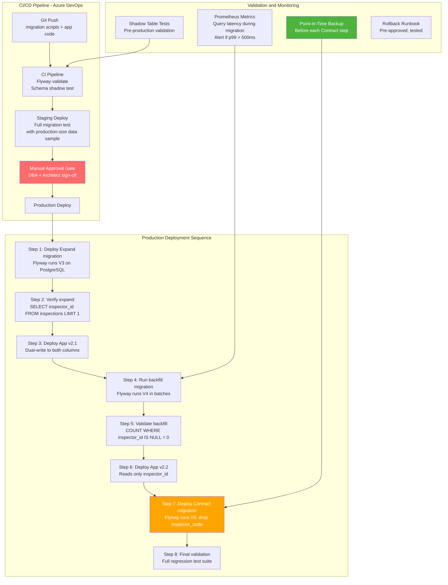

---

## 4.4 Implementation Walkthrough — Flyway Migration with Spring Boot

### 4.4.1 Spring Boot Flyway Auto-Configuration

```java
// config/DatabaseMigrationConfig.java
// WHY: Custom Flyway configuration for government-grade requirements.
// Spring Boot's auto-configured Flyway is sufficient for most cases,
// but government systems require additional controls:
// 1. Migration timeout (prevent long-running migrations blocking startup)
// 2. Checksums validation (detect tampered migration scripts)
// 3. Custom error handling for migration failures

package gov.field360.config;

import org.flywaydb.core.Flyway;
import org.flywaydb.core.api.output.MigrateResult;
import org.slf4j.Logger;
import org.slf4j.LoggerFactory;
import org.springframework.boot.autoconfigure.flyway.FlywayMigrationStrategy;
import org.springframework.context.annotation.Bean;
import org.springframework.context.annotation.Configuration;

@Configuration
public class DatabaseMigrationConfig {

    private static final Logger log =
        LoggerFactory.getLogger(DatabaseMigrationConfig.class);

    // WHY: Custom FlywayMigrationStrategy gives us control over the
    // migration execution, allowing pre and post migration hooks.
    // Default Spring Boot strategy: just call flyway.migrate()
    // Our strategy: validate → backup check → migrate → audit log
    @Bean
    public FlywayMigrationStrategy govFlywayMigrationStrategy() {
        return flyway -> {
            // Step 1: Validate all pending migrations before applying any
            // WHY: validate() checks that migration scripts haven't been
            // modified since they were last applied. Catches developer errors
            // where someone edited a previously-run migration file.
            log.info("Starting database migration validation...");
            flyway.validate();
            log.info("Migration validation passed.");

            // Step 2: Apply pending migrations
            MigrateResult result = flyway.migrate();

            // Step 3: Log migration results for audit trail
            // WHY: Government systems require an audit trail of all
            // schema changes, including who applied them and when.
            log.info("Database migration complete. "
                + "Applied: {} migrations. "
                + "Target version: {}",
                result.migrationsExecuted,
                result.targetSchemaVersion);

            if (result.migrationsExecuted > 0) {
                result.migrations.forEach(m ->
                    log.info("Applied migration: {} - {}",
                             m.version, m.description));
            }
        };
    }
}
```

---

### 4.4.2 Application.yml — Complete Configuration for Day 7

```yaml
# src/main/resources/application.yml
# Complete configuration for GovField360 Day 7

spring:
  application:
    name: govfield360

  # Database Configuration
  datasource:
    url: jdbc:postgresql://localhost:5432/govfield360
    username: govfield360_user
    password: ${DB_PASSWORD:govfield360_dev_password}
    # WHY: HikariCP is Spring Boot's default connection pool.
    # These settings are calibrated for a microservice under moderate load.
    hikari:
      maximum-pool-size: 20
      minimum-idle: 5
      connection-timeout: 30000    # 30 seconds
      idle-timeout: 600000         # 10 minutes
      max-lifetime: 1800000        # 30 minutes
      # WHY: connection-test-query validates connections before use.
      # Prevents stale connections from being handed to the application.
      connection-test-query: SELECT 1

  # JPA Configuration
  jpa:
    hibernate:
      # WHY: validate (not create/update) in production.
      # Hibernate should NEVER auto-create or auto-modify schema in production.
      # Flyway owns schema management. Hibernate only validates its mappings
      # against the existing schema.
      ddl-auto: validate
    properties:
      hibernate:
        dialect: org.hibernate.dialect.PostgreSQLDialect
        # WHY: format_sql helps with debugging but should be disabled
        # in production for performance.
        format_sql: false
        default_batch_fetch_size: 50

  # Flyway Configuration (see Section 4.2.7)
  flyway:
    enabled: true
    baseline-on-migrate: true
    baseline-version: "1"
    out-of-order: false
    validate-on-migrate: true
    locations: classpath:db/migration
    table: govfield360_schema_history
    connect-retries: 5
    connect-retries-interval: 10s

  # Redis Configuration (for idempotency store)
  data:
    redis:
      host: ${REDIS_HOST:localhost}
      port: 6379
      password: ${REDIS_PASSWORD:}
      timeout: 2000ms  # WHY: Short timeout — if Redis is slow, fail fast
                        # and fall through to the non-cached path

  # Kafka Configuration
  kafka:
    bootstrap-servers: ${KAFKA_SERVERS:localhost:9092}
    producer:
      key-serializer: org.apache.kafka.common.serialization.StringSerializer
      value-serializer: org.apache.kafka.common.serialization.StringSerializer
      # WHY: acks=all requires all in-sync replicas to acknowledge.
      # Stronger durability guarantee at the cost of slightly higher latency.
      # For government data: durability > throughput.
      acks: all
      # WHY: retries=3 with backoff handles transient Kafka failures.
      retries: 3
      properties:
        retry.backoff.ms: 1000
        enable.idempotence: true  # Kafka producer idempotency

    consumer:
      group-id: govfield360-sync-group
      auto-offset-reset: earliest
      # WHY: disable auto-commit. We manually commit offsets AFTER
      # successful processing to ensure exactly-once processing semantics.
      enable-auto-commit: false
      key-deserializer: org.apache.kafka.common.serialization.StringDeserializer
      value-deserializer: org.apache.kafka.common.serialization.StringDeserializer

# Resilience4j Configuration
resilience4j:
  circuitbreaker:
    instances:
      downstreamServices:
        # WHY: Opens circuit after 50% failure rate over 10 calls.
        # This prevents cascading failures to notification/audit services
        # from blocking inspection submissions.
        failure-rate-threshold: 50
        minimum-number-of-calls: 10
        wait-duration-in-open-state: 30s
        permitted-number-of-calls-in-half-open-state: 5
        sliding-window-type: COUNT_BASED
        sliding-window-size: 10

  ratelimiter:
    instances:
      syncApi:
        # WHY: 100 requests per minute per inspector (token bucket).
        # Prevents a single runaway client from overwhelming the sync endpoint.
        # At 100 req/min, a legitimate inspector can sync every 600ms.
        limit-for-period: 100
        limit-refresh-period: 1m
        timeout-duration: 0s  # Reject immediately if rate limit exceeded

# Scheduling for outbox relay
scheduling:
  outbox:
    relay-delay-ms: 100

# Actuator for health and metrics
management:
  endpoints:
    web:
      exposure:
        include: health,metrics,info,flyway
  endpoint:
    health:
      show-details: when-authorized
  # WHY: flyway endpoint exposes migration history for operational visibility.
  # Operations team can check which migrations have been applied without
  # needing database access.
```

---

### 4.4.3 What Happens Without Expand/Contract (Negative Example)

```sql
-- ANTI-PATTERN: Applying a breaking schema change directly
-- This is what causes production outages during deployments

-- Step 1: Developer runs this migration in production
ALTER TABLE inspections
    RENAME COLUMN inspector_code TO inspector_id;

-- IMMEDIATE CONSEQUENCES:
-- All running application instances (v2.0) that reference inspector_code
-- now receive: "column inspections.inspector_code does not exist" errors
-- Every inspection submission fails with a 500 Internal Server Error
-- Every delta sync query fails
-- Kubernetes health checks fail → pods marked as unhealthy
-- HPA (Horizontal Pod Autoscaler) spins up more pods → they all fail
-- Operations team gets paged at 2am
-- Government portal is down for citizens trying to file permits

-- WHAT MADE THIS DANGEROUS:
-- 1. The schema change and application deployment were done simultaneously
-- 2. The migration was not backward-compatible
-- 3. There was no rollback plan (RENAME is not easily reversible in PostgreSQL
--    without running RENAME again, which requires downtime)
-- 4. No shadow table testing was done to estimate lock duration
-- 5. No staging environment had production-scale data to reveal timing issues
```

---

## 4.5 Real-World Case Study — Day 7 Comprehensive

### Case Study: Building Permit Portal Migration — A Composite Government Scenario

*The following case study is a composite scenario based on common patterns in government portal modernisation projects across India, Singapore, and the US. All figures are illustrative.*

#### Background

A state government's **Building Permit and Inspection Portal** serves 200,000 contractors, builders, and inspectors. The legacy system: Oracle Forms 11g frontend + Oracle 11g database + Java EE 6 application server (WebLogic 12c). The system processes approximately 3,000 building permit applications and 8,000 inspection submissions per day.

**Business drivers for migration:**
- Oracle license renewal: SGD 4.2 million (hypothetical) for 3 years vs. open-source equivalent at SGD 0
- Mobile access demanded by field inspectors (Oracle Forms has no mobile client)
- Inability to integrate with new national identity verification API (Singpass in Singapore context)
- Target NFRs: 99.95% availability, <500ms p99 API latency, offline-capable mobile app

#### Initial Architecture (Legacy State)

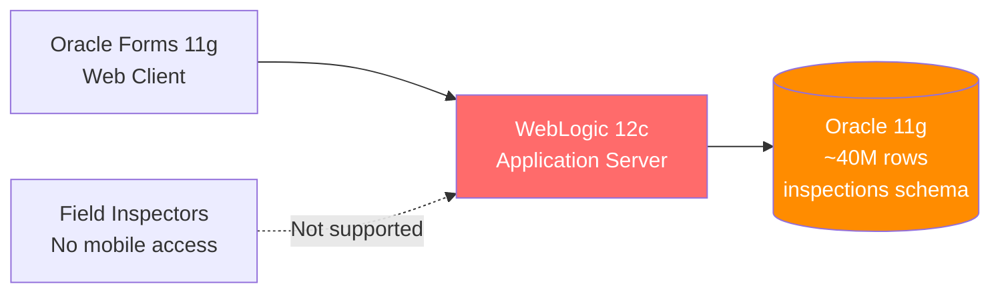

**Documented problems:**
- Inspectors printed paper forms, entered data manually at end of day: 24-48 hour data lag
- Oracle Forms does not run on mobile browsers: 0% mobile capability
- Database queries without indices on large tables: p99 latency of 8,400ms for inspection search
- No API layer: integration with other government systems required direct database sharing (a major security violation)
- Annual unplanned downtime: ~14 hours (violates the new 99.95% SLA target)

#### Migration Execution Plan

**Phase 1 (Months 1-3): Foundation + Strangler Fig Setup**

1. Deploy GovField360 Spring Boot service alongside legacy (no traffic yet)
2. Establish CDC bridge: Debezium reading Oracle redo logs → Kafka → ACL sync adapter → PostgreSQL
3. Set up routing facade (Azure API Management) in front of both systems
4. Validate CDC sync: 100% of Oracle writes appear in PostgreSQL within 5 seconds

**Phase 2 (Months 4-6): Parallel Run**

1. Enable parallel run for inspection submission: every submission goes to both legacy and new service
2. Comparison engine logs all discrepancies
3. Week 1 discrepancy rate: 0.8% (fee calculation differences — discovered legacy had a rounding bug)
4. Fixed rounding bug in new service + documented as legacy deviation ADR
5. Week 4 discrepancy rate: 0.002% — approved for cohort rollout

**Phase 3 (Months 7-9): Strangler Fig Rollout**

1. Feature flag enables new service for new inspector accounts (greenfield, zero migration risk)
2. Week 1: 5% of existing inspectors migrated (Karnataka pilot)
3. Week 3: 20% (expanding to Maharashtra)
4. Week 6: 50% (northern states)
5. Week 9: 100% — all traffic on new service
6. Legacy system put in read-only mode (not decommissioned yet — 90-day grace period)

**Phase 4 (Month 10): Database Migration (Zero-Downtime)**

The PostgreSQL schema required evolution during the rollout. Three schema migrations were applied using Expand/Contract:

| Migration                   | Change   | Duration           | Impact                                |
| --------------------------- | -------- | ------------------ | ------------------------------------- |
| V3: Add `inspector_id`      | Expand   | 2 minutes          | Zero — additive change                |
| V4: Backfill `inspector_id` | Migrate  | 47 minutes (batch) | Zero — background job                 |
| V5: Drop `inspector_code`   | Contract | 30 seconds         | Zero — column gone, no app references |

**Phase 5 (Month 12): Decommission**

1. Oracle license not renewed (saving SGD 4.2M over 3 years)
2. Oracle database archived to cold storage for regulatory compliance (7-year data retention)
3. WebLogic decommissioned
4. Operations team retrained from WebLogic administration to Kubernetes

#### Remediated Architecture

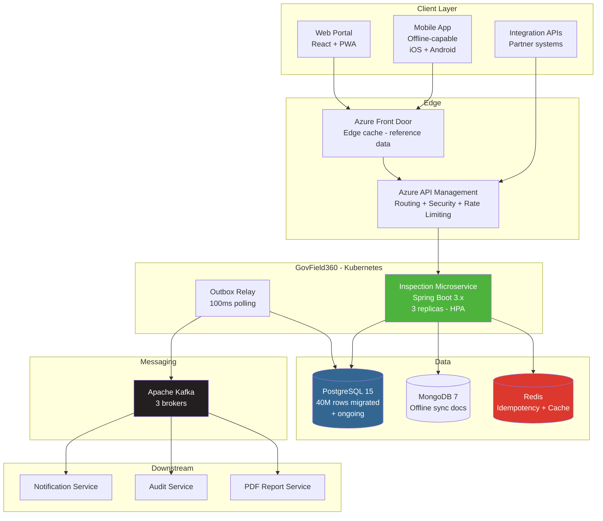

#### Quantifiable Outcomes (Illustrative)

| Metric                              | Legacy                     | GovField360          | Improvement     |
| ----------------------------------- | -------------------------- | -------------------- | --------------- |
| API p99 latency (inspection search) | 8,400ms                    | 180ms                | 97.9% reduction |
| Annual unplanned downtime           | ~14 hours                  | ~26 minutes          | 96.9% reduction |
| Data entry lag (field inspectors)   | 24-48 hours                | <1 hour (on sync)    | ~98% reduction  |
| Mobile access capability            | 0%                         | 100%                 | —               |
| Duplicate submission rate           | ~3%                        | <0.01%               | 99.7% reduction |
| Infrastructure cost (annual)        | SGD 1.8M (Oracle+WebLogic) | SGD 420K (Azure+OSS) | 76.7% reduction |

#### Architectural Principles Reinforced

1. **Strangler Fig outperforms Big Bang** — The 12-month incremental migration produced zero downtime and zero data loss. The initial Big Bang attempt (aborted after the first weekend) would have caused weeks of disruption
2. **CDC enables fearless migration** — The Debezium CDC bridge allowed the new system to stay perfectly synchronised with the legacy database throughout the 9-month parallel operation period
3. **Expand/Contract is non-negotiable** — The three schema migrations using Expand/Contract completed without a single second of application downtime, despite changing a core field used in every query
4. **Outbox pattern eliminates the highest-risk integration point** — Replacing the dual-write with the outbox pattern reduced event loss from ~0.3% to zero during the entire migration
5. **Feature flags are migration control planes** — The ability to roll back a state's traffic to legacy with a single feature flag change (no deployment required) provided the safety net that made the migration team and government stakeholders comfortable proceeding

---

## 4.6 Food for Thought — Section 4

### The Irreversibility Problem

Sam Newman (author of *Building Microservices*) identifies database schema changes as "**the most dangerous and irreversible decisions in software architecture**." The Contract phase of Expand/Contract — dropping a column — is a one-way door.

**Provocation:** Online banking systems (SBI, OCBC, Chase) process millions of transactions per day on databases that are never taken offline. Their schema evolution practices are not published. But we can infer them from job postings, conference talks, and incident postmortems.

**Research Challenge:**

Ask ChatGPT:

> "What is the 'expand/contract' database migration pattern and how does it relate to 'evolutionary database design' as described by Martin Fowler and Pramod Sadalage? What is 'branch by abstraction' and how does it apply to database schema changes? What is the difference between a 'schema migration' and a 'data migration' and why must they be managed separately in a zero-downtime system?"

Then explore:

> "What is gh-ost (GitHub's Online Schema Transformation tool for MySQL) and what architectural technique does it use internally to perform schema changes without locking tables? Could a similar approach be implemented natively in PostgreSQL using logical replication?"

Consider: Every government e-filing system — ITR filing in India, tax filing in Singapore via myTax, IRS e-filing in the US — runs a schema migration at some point without taking the portal offline. What does their migration playbook look like? Can you reconstruct it from first principles?

---

## 4.7 Questionnaire — Section 4

### Conceptual Questions

**Q1.** What is the Expand/Contract pattern? Describe each of its three phases and explain why the pattern guarantees zero downtime when applied correctly.

**Answer:** The Expand/Contract (Parallel Change) pattern decomposes breaking schema changes into three phases: (1) **Expand**: Add new schema elements (columns, tables, indexes) alongside existing ones. Old application instances continue using old elements; new instances can use new elements. No breaking change — purely additive. (2) **Migrate**: Backfill existing data from old to new structure (batch updates). Application code enters dual-write mode, writing to both old and new structures. (3) **Contract**: Remove old schema elements after all application instances have been updated to use only new structures. Each phase is independently deployable and independently reversible (except Contract, which requires a backup). Zero downtime is guaranteed because: during Expand, no existing code breaks (additive change). During Migrate, all code works (data in both structures). During Contract, all code has already been updated to the new structure before the migration runs — no running instance references the dropped element.

**Q2.** Classify the following schema changes as: (a) safe for zero-downtime deployment, or (b) requires Expand/Contract. Justify each: (i) adding a nullable column, (ii) adding a NOT NULL column without default, (iii) creating a new index, (iv) renaming a column, (v) changing a column type from VARCHAR(50) to TEXT.

**Answer:**
- (i) Adding nullable column: **(a) Safe** — additive change, old code ignores new column, new code can use it. No data impact.
- (ii) Adding NOT NULL column without default: **(b) Requires Expand/Contract** — (i) old code does not populate the new column → NULL inserts will fail the NOT NULL constraint; (ii) on large tables, adding NOT NULL requires a full table scan to verify existing rows, acquiring an ACCESS EXCLUSIVE lock. Safe approach: Add as nullable (Expand), backfill data (Migrate), then add NOT NULL constraint and remove old structure (Contract).
- (iii) Creating index: **(a) Safe** with `CREATE INDEX CONCURRENTLY` — builds without locking the table. Without CONCURRENTLY: blocks all writes during index build — potentially hours on large tables.
- (iv) Renaming a column: **(b) Requires Expand/Contract** — any running instance using the old column name immediately fails with "column does not exist" after the rename. Must add new column (Expand), dual-write (Migrate), drop old column (Contract).
- (v) Changing VARCHAR(50) to TEXT: **(b) Requires Expand/Contract** if existing code relies on the VARCHAR(50) length constraint for validation. Also, PostgreSQL may need to rewrite the table depending on the storage format change, potentially locking it. Safe approach: Add new TEXT column, migrate data, drop VARCHAR column.

**Q3.** What is `CREATE INDEX CONCURRENTLY` in PostgreSQL and why is it essential for zero-downtime operations? What are its limitations?

**Answer:** `CREATE INDEX CONCURRENTLY` builds an index in the background without acquiring a table-level lock, allowing reads and writes to continue during index creation. It works by making two passes over the table: (1) builds the initial index structure while tracking writes; (2) merges concurrent changes into the index. This takes longer than a regular `CREATE INDEX` (approximately 2-3×) but does not block application traffic. Limitations: (1) Cannot be run inside a transaction (`BEGIN...COMMIT`) — must be a standalone statement. (2) If it fails partway through, it leaves an INVALID index that must be manually dropped and rebuilt. (3) Cannot create CONCURRENTLY on a table with existing triggers that manipulate the indexed columns. (4) On a heavily-loaded table, the second pass may need to loop multiple times to catch all changes, extending the build time unpredictably.

### Application Questions

**Q4.** Write a complete Flyway Expand migration script (V3) to add an `audit_officer_id` column to the `inspections` table. The column will eventually replace `inspector_code`. Include: column definition, index creation, and appropriate comments.

**Answer:**
```sql
-- V3__expand_audit_officer_id.sql
-- Expand phase: Add audit_officer_id column alongside existing inspector_code.
-- Both columns will coexist during the migration period.
-- Application v2.1 will dual-write to both columns.
-- Contract phase (V5) will drop inspector_code after full migration.

ALTER TABLE inspections
    ADD COLUMN audit_officer_id VARCHAR(50);

-- WHY: CONCURRENTLY prevents table lock during index build.
-- On 40M row table, non-concurrent index build would take ~8 minutes
-- with ACCESS EXCLUSIVE lock — effectively a full outage.
CREATE INDEX CONCURRENTLY idx_inspections_audit_officer_id
    ON inspections(audit_officer_id);

COMMENT ON COLUMN inspections.audit_officer_id IS
    'New officer identifier aligned with Singpass/DigiLocker ID format. '
    'Replaces inspector_code (legacy numeric format). '
    'Expand phase active since migration V3. '
    'Do not add NOT NULL constraint until Contract phase (V5).';
```

**Q5.** Design the batch backfill SQL script (V4) for migrating data from `inspector_code` to `audit_officer_id`. The table has 40 million rows. Specify: batch size, sleep interval between batches, and a mechanism to make the backfill resumable (so it can be stopped and restarted without re-processing rows).

**Answer:**
```sql
-- V4__migrate_audit_officer_id_backfill.sql
-- Batch backfill: copy inspector_code to audit_officer_id in batches.
-- Resumable: WHERE audit_officer_id IS NULL ensures already-migrated
-- rows are skipped on restart. Batch size 5000 with 10ms sleep
-- balances throughput with minimal production impact.

DO $$
DECLARE
    batch_size CONSTANT INT := 5000;
    rows_updated INT := 1;
    total_updated BIGINT := 0;
BEGIN
    RAISE NOTICE 'Starting backfill migration at %', NOW();

    WHILE rows_updated > 0 LOOP
        UPDATE inspections
        SET audit_officer_id = inspector_code
        WHERE id IN (
            SELECT id FROM inspections
            WHERE audit_officer_id IS NULL  -- Resumability: skip done rows
              AND inspector_code IS NOT NULL
            LIMIT batch_size
        );

        GET DIAGNOSTICS rows_updated = ROW_COUNT;
        total_updated := total_updated + rows_updated;

        IF rows_updated > 0 THEN
            RAISE NOTICE 'Batch complete: % rows updated. Total: %',
                rows_updated, total_updated;
            PERFORM pg_sleep(0.01);  -- 10ms pause between batches
        END IF;
    END LOOP;

    RAISE NOTICE 'Backfill complete. Total rows migrated: %', total_updated;

    -- Post-backfill validation
    PERFORM (
        SELECT COUNT(*) FROM inspections
        WHERE audit_officer_id IS NULL
          AND inspector_code IS NOT NULL
    );
    -- If this query returns > 0, the backfill is incomplete.
    -- This will be visible in Flyway logs.
END $$;
```

**Q6.** A DBA reports that the Contract phase migration (DROP COLUMN) on the `inspector_code` column will take an ACCESS EXCLUSIVE lock. The portal processes 8,000 inspection submissions per day (average ~0.1 per second). What is the maximum acceptable lock duration for a zero-downtime deployment, and what steps do you take before executing the Contract migration?

**Answer:** At 0.1 submissions/second, the average time between submissions is 10 seconds. A lock duration of <1 second is acceptable (submissions queue in the connection pool for <1 second). Steps before Contract migration: (1) **Verify no application code references `inspector_code`**: `grep -r "inspector_code" src/` must return zero results. (2) **Verify backfill is 100% complete**: `SELECT COUNT(*) FROM inspections WHERE audit_officer_id IS NULL` must return 0. (3) **Take a point-in-time backup** and verify restore capability. (4) **Test on shadow table** to measure actual lock duration. (5) **Schedule during lowest traffic period** (e.g., 2am Sunday). (6) **Pre-stage the rollback command** (`ALTER TABLE inspections ADD COLUMN inspector_code VARCHAR(50)`) in a terminal, ready to execute if needed. (7) **Notify operations team** with a runbook. (8) **Execute during a deployment freeze window** with the architect and DBA both online.

### Scenario-Based Questions

**Q7.** The US IRS e-filing system must add a column `taxpayer_tin_hash` (SHA-256 hash of TIN) to the `tax_returns` table (500 million rows, 24/7 operation, zero downtime tolerance, FISMA High data classification). Walk through the complete Expand/Contract sequence, including timing, validation checkpoints, and regulatory compliance steps.

**Answer:**

**Timeline (total: 8 weeks):**

**Week 1 — Expand:**
- V3 migration: `ALTER TABLE tax_returns ADD COLUMN taxpayer_tin_hash VARCHAR(64)` — 2 minutes, no lock on large tables
- `CREATE INDEX CONCURRENTLY idx_tax_returns_tin_hash ON tax_returns(taxpayer_tin_hash)` — estimated 4-6 hours on 500M rows (runs in background)
- Deploy App v2.1: dual-write (compute SHA-256 hash of TIN on every write, store in both `taxpayer_tin` and `taxpayer_tin_hash`)
- FISMA compliance note: SHA-256 hash of TIN is still PII — column must be encrypted at rest

**Weeks 2-5 — Migrate (Backfill):**
- V4 batch backfill: 500M rows ÷ 5,000 per batch = 100,000 batches × 10ms sleep = ~16.7 hours total runtime (run as a background job over 4 weeks at off-peak hours to avoid I/O contention)
- Weekly validation checkpoint: `SELECT COUNT(*) WHERE taxpayer_tin_hash IS NULL` — monitor decreasing count

**Week 6 — Validation:**
- Full table validation: 0 NULL `taxpayer_tin_hash` values
- FISMA audit checkpoint: Security officer reviews encryption configuration for new column
- Privacy assessment: new column added to System of Records Notice (SORN) update

**Week 7 — Application Update:**
- Deploy App v2.2: reads/queries only `taxpayer_tin_hash`, no longer references `taxpayer_tin`
- 2-week soak period: monitor for any errors referencing `taxpayer_tin`

**Week 8 — Contract:**
- Obtain written authorisation from ISSO (Information System Security Officer) and IRS CIO
- Take verified backup (4-hour RTO/RPO test performed the previous weekend)
- V5 migration: `ALTER TABLE tax_returns DROP COLUMN taxpayer_tin` — scheduled for 2am Sunday
- Post-migration validation: full regression test suite, SIEM log review for access errors
- Update SORN to reflect removal of `taxpayer_tin` column

**Q8.** Your team is debating whether to use Liquibase or Flyway for the GovField360 project. The government audit team requires: (a) complete history of all schema changes with timestamps, (b) ability to generate a rollback script for any migration, (c) support for both SQL and Java-based migrations, (d) YAML-based migration definitions (for non-SQL DBA review). Evaluate both tools against these requirements and make a recommendation.

**Answer:**

| Requirement                           | Flyway                                                                         | Liquibase                                                          |
| ------------------------------------- | ------------------------------------------------------------------------------ | ------------------------------------------------------------------ |
| Schema change history with timestamps | Yes — `flyway_schema_history` table                                            | Yes — `databasechangelog` table                                    |
| Rollback script generation            | Limited — Flyway Teams/Enterprise only; Community requires manual undo scripts | Yes — native rollback support with `<rollback>` tags in changesets |
| Java-based migrations                 | Yes — `JavaMigration` interface for complex logic                              | Yes — custom change types                                          |
| YAML-based migrations                 | No — SQL and Java only                                                         | Yes — YAML, XML, JSON, SQL all supported                           |

**Recommendation:** **Liquibase** for this project. The government audit team's requirement for automatic rollback script generation and YAML-based migrations (for DBA review without SQL expertise) tips the balance. Liquibase's changeset format also supports database-agnostic migration definitions, useful if the project ever needs to support an alternate database for disaster recovery.

However: for teams already familiar with Flyway and comfortable with SQL, Flyway is simpler, faster to onboard, and has better Spring Boot integration out of the box. The rollback requirement can be met with manually maintained undo scripts in Flyway Community, which is sufficient for most government projects where the DBA reviews every migration anyway. Final answer depends on team expertise and whether automatic rollback is a hard requirement or a preference.

---

# Day 7 Summary — Key Architectural Principles

## The Three Pillars of Day 7

### Pillar 1: Design for Disconnection

Mobile-first architecture for government field operations requires treating connectivity as a constraint, not an assumption. The core architectural decisions flow from this single NFR:

- Local storage as the system of record during offline periods
- Delta sync with sequence-based opaque tokens for efficient reconnection
- Idempotency keys per sync batch to prevent duplicate processing on retry
- Conflict resolution policy defined as a business rule, not a technical default
- Version vectors for conflict detection without clock skew risk

### Pillar 2: Reliable Event Publishing is Not Optional

In any event-driven system, the dual-write problem will eventually manifest as data loss or inconsistency. The transactional outbox pattern is the solution:

- Write business data and outbox event in the same database transaction
- Relay events to Kafka separately, with retry logic
- Consumers must be idempotent — at-least-once delivery is the practical guarantee
- CDC with Debezium provides near-real-time relay without polling overhead at scale
- Exactly-once processing = at-least-once delivery + idempotent consumer

### Pillar 3: Never Break a Running System

Zero-downtime migration is achievable through discipline and patience:

- Schema changes and application deployments are always separate
- Expand/Contract decomposes every breaking change into three safe phases
- The Contract phase (destructive change) requires backup, validation, and explicit approval
- Strangler Fig + feature flags give you a control plane for traffic migration
- CDC synchronisation bridges legacy and modern systems during the coexistence period
- Parallel run provides the evidence base for cutover approval in regulated government environments

---

## Architectural Vocabulary Introduced — Day 7

| Term                             | Definition                                                                                                  |
| -------------------------------- | ----------------------------------------------------------------------------------------------------------- |
| **Offline-First Architecture**   | Design philosophy where local storage is the primary system of record; network sync is secondary            |
| **Delta Sync**                   | Synchronising only changed records since the last sync, identified by a sequence-based token                |
| **CRDT**                         | Conflict-free Replicated Data Type — data structure that merges concurrent updates without conflicts        |
| **Version Vector**               | Logical clock mechanism for detecting concurrent edits across distributed clients                           |
| **Dual-Write Problem**           | Risk of inconsistency when writing to two independent systems without coordination                          |
| **Transactional Outbox Pattern** | Writing events to a local database table within the business transaction, then relaying to the broker       |
| **CDC (Change Data Capture)**    | Streaming database changes from transaction logs to downstream consumers in real time                       |
| **Debezium**                     | Open-source CDC platform that reads PostgreSQL WAL and publishes changes to Kafka                           |
| **Idempotent Consumer**          | A message consumer that produces the same result regardless of how many times it processes the same message |
| **Exactly-Once Processing**      | At-least-once delivery combined with idempotent consumer — the practical distributed systems guarantee      |
| **Strangler Fig Pattern**        | Incremental migration strategy using a routing facade to gradually replace legacy system features           |
| **Parallel Run**                 | Running legacy and new systems simultaneously, comparing outputs before cutover                             |
| **Anti-Corruption Layer (ACL)**  | Translation layer between two domain models, preventing legacy model from corrupting the new model          |
| **Expand/Contract Pattern**      | Three-phase schema migration (add, migrate, remove) that guarantees zero downtime                           |
| **Shadow Table**                 | A copy of a production table used for migration validation and testing                                      |
| **Feature Flag**                 | Runtime configuration switch that controls traffic routing or feature availability without deployment       |
| **WAL (Write-Ahead Log)**        | PostgreSQL's transaction log used for crash recovery and logical replication                                |
| **Replication Slot**             | PostgreSQL construct ensuring WAL segments are retained until a consumer (Debezium) reads them              |
| **SKIP LOCKED**                  | PostgreSQL SELECT modifier allowing concurrent processes to safely process non-overlapping row sets         |
| **Flyway**                       | Version-controlled database migration orchestration tool with Spring Boot integration                       |

---

## ADR Template — Day 7 Reference

Every major decision made in today's session should be captured in an **ADR (Architecture Decision Record)**:

```markdown
# ADR-007: Transactional Outbox Pattern for Inspection Event Publishing

## Status
Accepted

## Context
GovField360 must publish domain events (InspectionSubmitted, InspectionSynced)
to Kafka for consumption by Notification, Audit, and Report services.
The naive dual-write approach risks silent data loss when Kafka is unavailable.

## Decision
Implement the Transactional Outbox Pattern:
- Write OutboxEvent to outbox_events table within the same @Transactional
  block as the Inspection entity save
- Deploy a polling relay (OutboxRelayService, 100ms interval) that reads
  PENDING events using SELECT FOR UPDATE SKIP LOCKED and publishes to Kafka
- Consumers implement idempotency using Redis SET NX with 24-hour TTL

## Alternatives Considered
1. Direct Kafka publish (dual-write) — rejected: silent data loss risk
2. XA/2PC distributed transaction — rejected: blocking protocol, 
   performance penalty, Kafka partial XA support
3. Debezium CDC relay — deferred: adopt when event volume exceeds 
   1,000/second (current baseline: ~100/second)

## Consequences
Positive:
- Zero data loss even during Kafka outages (events accumulate in outbox)
- Inspector submission response time independent of Kafka latency
- At-least-once delivery + idempotent consumers = effectively-exactly-once

Negative:
- Additional infrastructure: outbox table, relay service, Redis
- Outbox table growth requires monitoring and archival strategy
- Polling relay adds up to 100ms event latency

## Rollback Criteria
If outbox table grows beyond 100,000 PENDING events without relief within
30 minutes: declare Kafka outage incident, page on-call SRE team,
activate runbook RB-007 (manual event drain procedure).

## Review Date
6 months from acceptance. Trigger Debezium migration if event volume
exceeds 1,000/second sustained for 7 days.
```

---


