# STEP 1: COMPREHENSION SUMMARY — DAY 8

---

## Day 8: Microservices, AI & Modernization

### Modules Covered
- Legacy Modernization & Migration Playbook (Session 2)
- AI-Assisted Development & Validation

---

### Topics, Sub-Topics, and Duration Allocation

| #   | Topic                                               | Sub-Topic                                                                       | Duration |
| --- | --------------------------------------------------- | ------------------------------------------------------------------------------- | -------- |
| 1   | Legacy Modernization & Migration Playbook Session 2 | Infrastructure & Storage Sizing: Cost/Performance Trade-offs                    | 1.0 hr   |
| 2   | Legacy Modernization & Migration Playbook Session 2 | Hands-on: Accelerated Migration Planning Workshop with Risk Assessment          | 1.0 hr   |
| 3   | AI-Assisted Development & Validation                | Prompt Engineering Templates for Architecture, Code, Tests                      | 1.0 hr   |
| 4   | AI-Assisted Development & Validation                | Vibe Coding with AI: GitHub Copilot, GPT-4/5 Iterative Refinement               | 1.0 hr   |
| 5   | AI-Assisted Development & Validation                | Code Validation: Static Analysis, Unit Test Gen, Security Scanning of AI Output | 1.0 hr   |

**Total Instructional Time: 5.0 hours core content + 1.0-1.5 hours discussion, Q&A, breaks = 6.0-6.5 hours**

---

### Key Focus Areas

| Topic                           | Focus Areas                                                                                            |
| ------------------------------- | ------------------------------------------------------------------------------------------------------ |
| Infrastructure & Storage Sizing | Capacity planning, cost optimisation, compute/storage selection, cloud vs. on-prem TCO                 |
| Migration Planning Workshop     | Migration roadmap, risk identification, rollback plans, ADRs for migration                             |
| Prompt Engineering              | Crafting effective prompts for architecture diagrams, code skeletons, unit tests; critiquing AI output |
| Vibe Coding with AI             | AI-assisted coding workflows, iterative refinement, domain-specific context injection                  |
| Code Validation                 | Static analysis (SonarQube/SpotBugs), unit test generation, security scanning (SAST/SCA) of AI output  |

---

### Lab Project Theme / Narrative

**"Operation: LegacyBridge"** — A fictional Indian state government's legacy citizen pension disbursement system (a monolithic Java 8 + Oracle DB application, circa 2012) is being modernised. Day 8 covers the final migration planning phase, then transitions into AI-augmented development where participants use Microsoft Copilot/ChatGPT to generate, iteratively refine, and rigorously validate microservice components for the replacement system.

---

### Dependencies on Previous Days

- **Day 7** introduced Strangler Fig pattern, CDC (Change Data Capture), Parallel Run strategy, and zero-downtime database migrations — Day 8 builds directly on these with sizing, cost analysis, and risk-based migration planning
- The capstone project started on Day 3 continues to be referenced for context
- The microservices built on Days 6-7 serve as the validation target for AI-generated code in the afternoon sessions

---

### Tech Stack Components Used This Day

| Category          | Technology                                                 |
| ----------------- | ---------------------------------------------------------- |
| Languages         | Java 17 (Spring Boot 3.x, Maven), Python 3.11+             |
| Cloud             | Azure Free Tier (Azure Pricing Calculator, Azure CLI)      |
| IaC               | Terraform 1.5+ (for infrastructure sizing examples)        |
| Containers        | Docker Desktop                                             |
| Orchestration     | Kubernetes (Docker Desktop K8s / Minikube)                 |
| RDBMS             | PostgreSQL 15+                                             |
| AI Assistants     | Microsoft Copilot / ChatGPT                                |
| VCS               | Git / Git Bash                                             |
| API Testing       | Postman                                                    |
| Static Analysis   | SpotBugs, PMD (Maven plugins), SonarQube Community Edition |
| Security Scanning | OWASP Dependency-Check Maven Plugin                        |
| Test Generation   | JUnit 5, Mockito, AI-assisted test scaffolding             |

---

**Confirmation requested before proceeding.**

> Ready to generate the Day 8 Theory Document? Please confirm, or provide any adjustments to the above comprehension summary.

---

# DAY 8 — THEORY DOCUMENT

*(Proceeding on assumed confirmation)*

---

# Senior Engineer to Solution Architect Program
# Day 8 Theory Document: Legacy Modernization (Session 2) & AI-Assisted Development

---

## Document Navigation

| Section                 | Topic                                                              | Duration |
| ----------------------- | ------------------------------------------------------------------ | -------- |
| [Section 1](#section-1) | Infrastructure & Storage Sizing: Cost/Performance Trade-offs       | 1.0 hr   |
| [Section 2](#section-2) | Accelerated Migration Planning Workshop with Risk Assessment       | 1.0 hr   |
| [Section 3](#section-3) | Prompt Engineering Templates for Architecture, Code, Tests         | 1.0 hr   |
| [Section 4](#section-4) | Vibe Coding with AI: Iterative Refinement                          | 1.0 hr   |
| [Section 5](#section-5) | Code Validation: Static Analysis, Unit Test Gen, Security Scanning | 1.0 hr   |

---

---

# SECTION 1: Infrastructure & Storage Sizing — Cost/Performance Trade-offs {#section-1}

---

## 1.1 Topic Title and Learning Objectives

### Topic: Infrastructure & Storage Sizing for Modernised Architectures

**Learning Objectives** — By the end of this section, participants will be able to:

1. **Analyze** the compute, memory, storage, and network requirements of a migrated workload using capacity planning models
2. **Compare** cloud-native, on-premises, and hybrid deployment options using a structured TCO (Total Cost of Ownership) framework
3. **Design** a right-sized infrastructure blueprint for a government-scale microservices workload
4. **Evaluate** cost/performance trade-offs using quantitative methods (CPU utilisation targets, p99 latency budgets, IOPS requirements)
5. **Create** a cost optimisation strategy that balances performance SLOs, regulatory requirements, and budget constraints

---

## 1.2 Concept Foundation

### The Analogy: Renting vs. Buying a Fleet of Vehicles

Imagine a state transport department deciding whether to buy buses, rent them from a private operator, or use a hybrid model. Buying gives control but requires capital, maintenance teams, and parking lots. Renting is flexible but expensive at high volume. A hybrid — own core routes, rent for peak demand — often wins.

Infrastructure sizing is identical. The mistake most engineers make is sizing for *peak theoretical load* with *zero flexibility*, resulting in either permanent over-provisioning (wasted money) or under-provisioning (outages at 2 AM). Architects size for *expected steady-state*, plan elasticity for *predictable peaks*, and design overflow strategies for *unexpected surges*.

---

### 1.2.1 What is Infrastructure Sizing?

**Infrastructure sizing** is the process of determining the minimum viable and maximum required compute (CPU, RAM), storage (type, IOPS, capacity), network (bandwidth, latency), and database resources needed to meet defined **SLOs (Service Level Objectives)** — the target performance and availability thresholds committed to stakeholders — under specified load conditions.

It is NOT a one-time activity. In a microservices world, sizing is a continuous practice driven by:
- **SLIs (Service Level Indicators)** — measurable metrics (e.g., p99 API latency, error rate, throughput)
- **NFRs (Non-Functional Requirements)** — documented performance, availability, scalability, and security constraints
- **Capacity models** — mathematical projections of resource consumption under load

> **Architect's Note:** Never size infrastructure in isolation from application architecture. A poorly written N+1 query will consume 10x the expected database CPU regardless of how many vCPUs you provision. Sizing validates architecture; it does not substitute for it.

---

### 1.2.2 Why Does It Matter?

**Business impact of incorrect sizing (illustrative, hypothetical figures):**

| Scenario                                                 | Problem                          | Impact                                                                                                 |
| -------------------------------------------------------- | -------------------------------- | ------------------------------------------------------------------------------------------------------ |
| India's GSTN (GST Network) peak filing season            | Under-provisioned DB tier        | ~3 hours downtime during peak; estimated revenue loss to businesses: INR 50+ crore in filing penalties |
| US state unemployment portal (COVID-19 surge)            | 40x normal load, no auto-scaling | 72-hour outage for 2.3M claimants                                                                      |
| Singapore CPF (Central Provident Fund) annual top-up day | Provisioned for 2x, received 8x  | Degraded response for 4 hours; significant public trust erosion                                        |

> These are illustrative scenarios based on publicly reported incidents. Specific figures are hypothetical for training purposes.

**Technical impact:**
- Over-provisioning: Cloud waste of 40-70% is common in organisations without FinOps discipline (source: Gartner estimates, ~2023)
- Under-provisioning: Cascading failures, SLO breaches, potential SLA penalties

---

### 1.2.3 The Capacity Planning Framework

**Capacity planning** follows a four-phase loop:

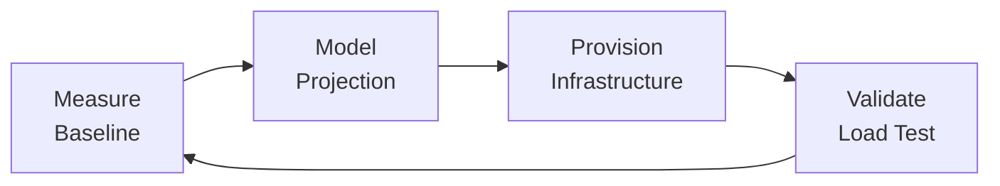

**Phase 1 — Measure Baseline:**
Capture actual resource consumption of the *legacy system* under known load. Use APM tools (Application Performance Management), OS metrics (top, iostat, vmstat on Linux), or Azure Monitor if already partially cloud-hosted.

**Phase 2 — Model Projection:**
Apply traffic growth assumptions and architectural efficiency gains/losses from migration. Factor in:
- Microservice overhead (sidecar proxies, service mesh, health checks)
- Connection pool overhead per service replica
- JVM heap requirements per Spring Boot service

**Phase 3 — Provision Infrastructure:**
Select instance types, storage tiers, and database configurations. Use IaC (Terraform) so provisioning is repeatable and version-controlled.

**Phase 4 — Validate:**
Execute load tests (k6, JMeter, Gatling) against the provisioned environment. Compare p50, p95, p99 latencies against SLOs. Iterate.

---

### 1.2.4 Compute Sizing Deep Dive

#### CPU Sizing

The fundamental formula for CPU sizing in a microservices context:

```
Required vCPUs = (Peak RPS × Avg CPU Time per Request) / (Target CPU Utilisation × 1000ms)
```

Where:
- **RPS** = Requests Per Second
- **Avg CPU Time per Request** = milliseconds of CPU work per request (not wall-clock latency)
- **Target CPU Utilisation** = 60-70% (leaving headroom for GC, spikes, and K8s overhead)

**Example — Citizen Pension Portal (India, illustrative):**

- Expected peak: 50,000 RPS during monthly disbursement day
- Avg CPU time per request: 8ms (profiled from load test)
- Target CPU utilisation: 65%

```
Required vCPUs = (50,000 × 8ms) / (0.65 × 1000ms)
              = 400,000 / 650
              = ~615 vCPUs (across all service replicas)
```

This maps to approximately 77 × 8-vCPU pods, or 20 × Azure D8s_v3 nodes (8 vCPUs, 32GB RAM each).

> **Architect's Note:** This is a back-of-envelope estimate. Real sizing requires profiling at the service level, not the system level. A payment processing service has very different CPU characteristics than a read-heavy citizen lookup service.

#### Memory Sizing

For JVM-based Spring Boot microservices, memory sizing must account for:

| Memory Region                        | Typical Allocation     |
| ------------------------------------ | ---------------------- |
| JVM Heap (-Xmx)                      | 512MB–2GB per instance |
| JVM Non-Heap (Metaspace, Code Cache) | 128–256MB              |
| OS overhead                          | 128–256MB              |
| Container overhead                   | 64–128MB               |
| **Total per container**              | **832MB–2.6GB**        |

**Golden Rule:** Set JVM `-Xmx` to 75% of container memory limit. If container limit = 2GB, set `-Xmx1536m`.

#### Pod Density and Node Sizing

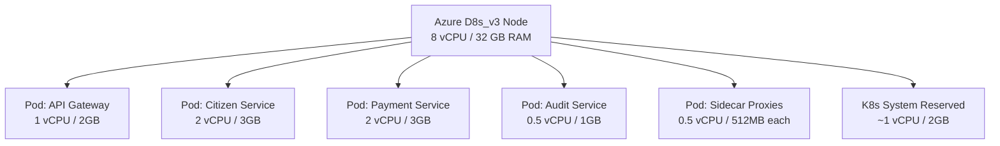

---

### 1.2.5 Storage Sizing and Tiering

**Storage is not homogeneous.** Different workloads demand different storage types:

| Storage Type            | Characteristics                       | Government Use Case                          | Azure Equivalent             |
| ----------------------- | ------------------------------------- | -------------------------------------------- | ---------------------------- |
| **NVMe SSD (Premium)**  | <1ms latency, high IOPS               | Active citizen records, payment transactions | Azure Premium SSD (P-series) |
| **Standard SSD**        | 1-10ms latency, moderate IOPS         | Archived case files, audit logs              | Azure Standard SSD           |
| **HDD (Standard)**      | 10-20ms latency, low IOPS             | Cold archives, compliance backups            | Azure Standard HDD           |
| **Blob/Object Storage** | Eventual consistency, unlimited scale | Document uploads, media, reports             | Azure Blob Storage           |
| **Shared NFS**          | Multi-pod access                      | ConfigMaps, shared certificates              | Azure Files                  |

#### IOPS Calculation

**IOPS (Input/Output Operations Per Second)** is the rate of read/write operations a storage device can sustain.

```
Required IOPS = (Read RPS × Avg Read Size / Block Size) + (Write RPS × Avg Write Size / Block Size)
```

**Example:**
- PostgreSQL pension database: 10,000 read queries/sec, 500 write/sec
- Avg read = 8KB, avg write = 4KB, block size = 4KB
- Required IOPS = (10,000 × 2) + (500 × 1) = 20,500 IOPS

Azure Premium SSD P30 provides 5,000 IOPS. You would need **4-5 disks in RAID-0** or a **P80 disk (20,000 IOPS)**.

---

### 1.2.6 Database Sizing: PostgreSQL at Scale

For a PostgreSQL cluster supporting a government citizen service:

| Parameter              | Formula                                 | Example Value                                   |
| ---------------------- | --------------------------------------- | ----------------------------------------------- |
| Connections            | `max_connections = (vCPUs × 4) + 100`   | 8 vCPU node: 132 connections                    |
| `shared_buffers`       | 25% of RAM                              | 32GB RAM: 8GB                                   |
| `effective_cache_size` | 75% of RAM                              | 32GB RAM: 24GB                                  |
| `work_mem`             | RAM / (max_connections × 2)             | 32GB / 264: ~120MB                              |
| WAL storage            | 3-5× peak write rate × retention period | 500 writes/sec × 4KB × 86400s × 7 days = ~1.2TB |

> **Anti-Pattern Warning:** Setting `max_connections` to 1000 on a small instance and wondering why PostgreSQL is using 8GB of RAM just for connection overhead. Use **PgBouncer** (connection pooler) to multiplex hundreds of application connections onto a small number of actual database connections.

---

### 1.2.7 Cloud vs. On-Premises TCO Analysis

**TCO (Total Cost of Ownership)** includes not just infrastructure costs but all costs associated with operating a system over its planned lifetime.

#### TCO Components

```
TCO = CapEx + OpEx + RiskEx

Where:
CapEx = Hardware purchase + datacenter build-out + networking equipment
OpEx = Power + cooling + licensing + staff + maintenance + support contracts
RiskEx = Probability × Impact of outage, breach, or compliance failure
```

#### 5-Year TCO Comparison (Illustrative, INR, for a 50-node workload)

| Cost Component        | On-Premises     | Cloud (Azure)  | Hybrid          |
| --------------------- | --------------- | -------------- | --------------- |
| Hardware/Compute      | INR 8.5 Cr      | INR 0 (OpEx)   | INR 3.2 Cr      |
| Networking            | INR 1.2 Cr      | INR 0.8 Cr     | INR 0.9 Cr      |
| Storage               | INR 2.1 Cr      | INR 1.4 Cr     | INR 1.6 Cr      |
| Power & Cooling       | INR 1.8 Cr      | INR 0          | INR 0.7 Cr      |
| Licensing (OS, DB)    | INR 2.4 Cr      | INR 1.8 Cr     | INR 2.0 Cr      |
| Staff (infra ops)     | INR 3.6 Cr      | INR 1.2 Cr     | INR 2.1 Cr      |
| Support & Maintenance | INR 1.5 Cr      | INR 0.6 Cr     | INR 0.9 Cr      |
| **Total 5-Year TCO**  | **INR 21.1 Cr** | **INR 5.8 Cr** | **INR 11.4 Cr** |

> **Disclaimer:** These are illustrative hypothetical figures for training purposes. Actual TCO varies by organization size, negotiated contracts, data sovereignty requirements, and existing asset amortisation.

**Why on-prem is not always wrong:**
- India's **DPDP Act (Digital Personal Data Protection Act, 2023)** and certain MeitY (Ministry of Electronics and Information Technology) mandates require specific data classes to remain within Indian sovereign infrastructure
- Singapore's **IM8 (Instruction Manual 8)** for government ICT requires classification-specific hosting
- US **FedRAMP** (Federal Risk and Authorization Management Program) restricts US federal data to FedRAMP-authorized cloud environments

#### The Right Decision Framework

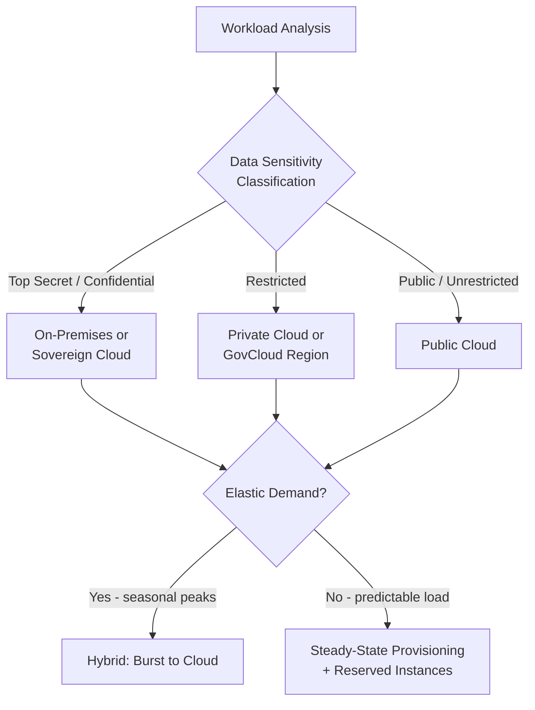

---

### 1.2.8 Cost Optimisation Strategies

**Right-Sizing:** Use Azure Advisor, AWS Compute Optimizer, or GCP Recommender to identify over-provisioned instances. Common finding: 35-50% of VMs are at <20% average CPU utilisation.

**Reserved Instances vs. On-Demand vs. Spot:**

| Purchase Model    | Discount vs. On-Demand | Best For                      | Risk           |
| ----------------- | ---------------------- | ----------------------------- | -------------- |
| On-Demand         | 0% (baseline)          | Unpredictable workloads       | High cost      |
| Reserved (1-year) | ~30-40%                | Stable baseline services      | Lock-in        |
| Reserved (3-year) | ~50-60%                | Long-lived, stable workloads  | Higher lock-in |
| Spot/Preemptible  | ~70-80%                | Batch jobs, test environments | Interruption   |

**Storage Tiering Automation:**
Use Azure Lifecycle Management policies to automatically transition data:
- Hot tier (active access) → Cool tier after 30 days → Archive tier after 90 days
- For a government document store with 10TB/year growth, this can reduce storage cost by ~60% over 3 years (illustrative estimate)

**HPA (Horizontal Pod Autoscaler) Economics:**

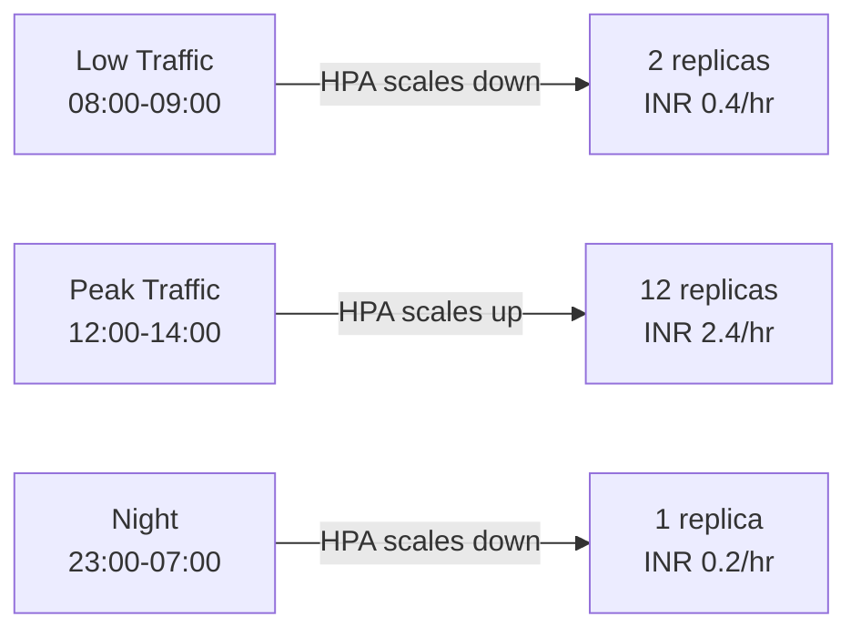

For a government portal with predictable daytime traffic peaks, HPA-driven autoscaling can reduce compute cost by 40-55% compared to provisioning for peak 24/7 (illustrative).

---

### 1.2.9 High-Level Design: Sized Infrastructure for Pension Portal

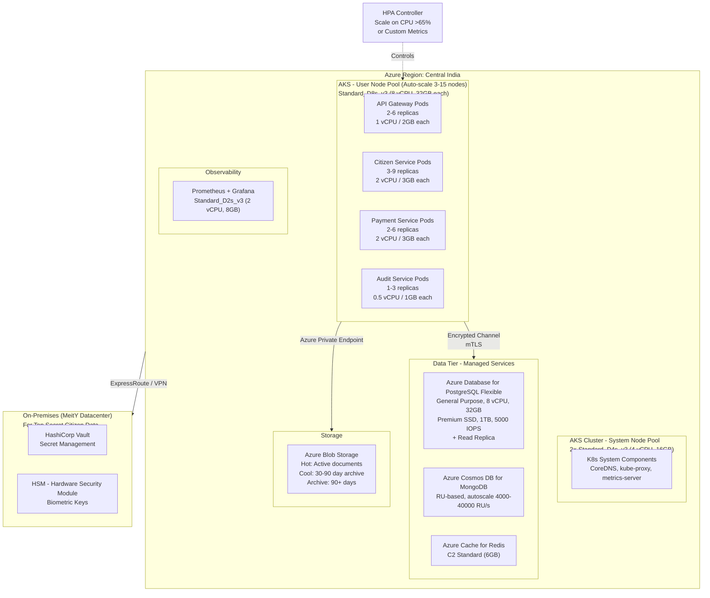

**Design Decision Annotations:**

| Decision                               | Rationale                                                                                    |
| -------------------------------------- | -------------------------------------------------------------------------------------------- |
| Auto-scale user node pool (3-15 nodes) | Handles 5x traffic spikes during pension disbursement without paying for peak capacity 24/7  |
| Managed PostgreSQL (not self-managed)  | Eliminates DBA overhead for patching, backup, HA failover; MeitY-approved Azure India region |
| Read replica for PostgreSQL            | Offloads 70% read traffic from primary; essential for report generation workload             |
| Redis cache layer                      | Reduces DB calls by 60-80% for frequently-accessed citizen profile data                      |
| Blob lifecycle management              | Automatically archives old documents; reduces storage cost by ~60% over 3 years              |
| ExpressRoute to on-prem                | Required for biometric key access; dedicated private connection with guaranteed bandwidth    |

---

### 1.2.10 Trade-off Analysis

> **Trade-off Alert:**

| Quality Attribute Pair           | Tension                                                                           | Resolution                                                                                   |
| -------------------------------- | --------------------------------------------------------------------------------- | -------------------------------------------------------------------------------------------- |
| Cost vs. Performance             | Reserved instances are cheaper but inflexible; on-demand is expensive but elastic | Use reserved for baseline (60-70% load), on-demand for burst                                 |
| Cost vs. Reliability             | Single-zone is cheaper; multi-zone adds ~20-30% cost                              | Government citizen services require 99.9% SLO — multi-zone is non-negotiable                 |
| Performance vs. Data Sovereignty | Nearest cloud region may not be sovereign-compliant                               | Use India-specific Azure regions (Central India, South India) + on-prem for restricted data  |
| Right-Sizing Accuracy vs. Effort | Precise sizing requires weeks of profiling                                        | Use 80/20 rule — size the top 20% of services by traffic volume precisely; estimate the rest |
| Managed Services vs. Control     | Managed DB costs ~2-3x self-managed but eliminates operational burden             | For government systems with small infra teams, managed services deliver positive ROI         |

---

### 1.2.11 Alternative Approaches Comparison

| Approach                | Description                                                | Pros                                  | Cons                                                                                  |
| ----------------------- | ---------------------------------------------------------- | ------------------------------------- | ------------------------------------------------------------------------------------- |
| **Provision for Peak**  | Size all infrastructure for maximum theoretical load       | Never runs out of capacity            | 60-70% idle resource waste; high cost                                                 |
| **Right-Size with HPA** | Baseline sizing + autoscaling                              | Cost-efficient; elastic               | Cold start latency (pod scheduling: 30-60s); requires well-defined HPA metrics        |
| **Serverless/KEDA**     | Zero to N scaling using KEDA (K8s Event-Driven Autoscaler) | Extreme elasticity; pay-per-execution | Cold start latency for Java (3-5s without GraalVM); not suitable for low-latency APIs |

**Recommended for Government:** Right-Size with HPA + pre-warmed minimum replicas (never scale to zero for citizen-facing services)

---

### 1.2.12 Questionnaire — Section 1

**Conceptual Questions**

1. What is the difference between IOPS and throughput, and why does this distinction matter when sizing storage for a PostgreSQL database?

   *Answer:* IOPS measures the number of read/write operations per second; throughput measures the volume of data transferred per second (MB/s). PostgreSQL's random read/write pattern (especially for index lookups) is IOPS-bound, not throughput-bound. A disk with high throughput (sequential reads) but low IOPS will still bottleneck a heavily indexed relational database.

2. Explain why setting `max_connections = 1000` in PostgreSQL on a 4 vCPU, 16GB RAM server is an anti-pattern.

   *Answer:* Each PostgreSQL connection allocates `work_mem` and other per-connection resources. With 1000 connections at 16MB `work_mem` each, PostgreSQL could consume 16GB in work memory alone — exhausting all RAM. Additionally, PostgreSQL uses a process-per-connection model (not thread-per-connection), so 1000 processes create significant context-switching overhead. Solution: Use PgBouncer for connection pooling (10-50 actual DB connections, 1000 application-layer connections).

3. Define TCO and explain why on-premises infrastructure often has a *lower* direct infrastructure cost in years 1-2 but higher TCO over 5 years.

   *Answer:* TCO includes all costs: hardware, power, cooling, staff, maintenance, support, and opportunity cost. In years 1-2, amortised hardware is fully depreciated on paper. However, refresh cycles (every 3-5 years), growing staff costs (system admins, DBAs, network engineers), increasing power/cooling costs, and escalating support contracts mean on-prem TCO grows faster than cloud, which includes managed services, automatic patching, and FinOps optimization tools.

**Application Questions**

4. A government pension portal serves 2 million transactions per day with an average CPU time of 15ms per transaction and a p99 latency SLO of 500ms. Calculate the required vCPUs for the pension processing service assuming a target CPU utilisation of 65% and that 80% of transactions occur within a 4-hour peak window.

   *Answer:*
   - Transactions during peak: 2,000,000 × 0.80 = 1,600,000
   - Peak duration: 4 hours = 14,400 seconds
   - Peak RPS: 1,600,000 / 14,400 = ~111 RPS
   - Required vCPUs: (111 × 15ms) / (0.65 × 1000ms) = 1665 / 650 = ~2.6 vCPUs
   - With safety margin (1.5x): ~4 vCPUs minimum for this service

5. You are designing a storage tier for a document management service in Singapore's ICA (Immigration and Checkpoints Authority). Documents are uploaded once, read frequently for the first 30 days, then read rarely. What Azure storage tiering strategy would you recommend, and what is your estimated cost reduction?

   *Answer:* Use Azure Blob Storage with Lifecycle Management: Hot tier for 0-30 days → Cool tier for 31-90 days → Archive for 90+ days. Hot: ~USD 0.018/GB/month; Cool: ~USD 0.01/GB/month; Archive: ~USD 0.002/GB/month. For a 100TB dataset with typical access patterns, this yields ~65% storage cost reduction vs. keeping all data in Hot tier.

6. You have a Spring Boot microservice with `-Xmx` set to 2GB deployed in a Kubernetes pod with a memory limit of 2GB. The pod is being OOMKilled (out-of-memory killed). What is the root cause and how do you fix it?

   *Answer:* `-Xmx2g` sets the maximum JVM heap, but JVM also uses non-heap memory (Metaspace, Code Cache, JVM internals: ~256-512MB), plus OS and container overhead (~128MB). Total actual memory = 2GB heap + 512MB non-heap + 128MB OS = ~2.6GB, exceeding the 2GB pod limit. Fix: Either increase pod limit to 3GB, or reduce `-Xmx` to 1.5GB (75% of 2GB limit).

**Analysis Questions**

7. Compare provisioning for peak load versus right-sizing with HPA for a government tax portal. What are the performance, cost, and operational trade-offs? In which scenario would you recommend provisioning for peak?

   *Answer:* Provisioning for peak: zero cold-start risk, maximum cost, zero operational autoscaling complexity. Right-sizing with HPA: ~40-55% cost savings, ~30-60s pod scheduling latency during sudden spikes, requires well-defined HPA metrics and tuning. Recommend provisioning for peak ONLY when: (a) transactions are extremely latency-sensitive (financial settlements, emergency services) and 30-second cold starts are unacceptable; (b) load patterns are highly unpredictable (ransomware response, emergency portals); (c) regulatory requirements prohibit dynamic scaling across availability zones.

8. A FinOps review shows your Kubernetes cluster has 45% average CPU utilisation across 20 nodes, but your SLO target is 99.9% availability. Your manager asks you to reduce nodes to 12 to cut costs by 40%. What analysis would you perform before agreeing or disagreeing?

   *Answer:* Average CPU is misleading — check p95 and p99 CPU utilisation across time windows. If peak utilisation hits 85% on 20 nodes, reducing to 12 means peak hits 141% — impossible, causing throttling and SLO breaches. Perform: (1) time-series analysis of per-node CPU across a full 4-week cycle; (2) HPA configuration review — are pods already scaling? (3) identify idle nodes during off-peak hours vs. peak nodes; (4) recommend: reduce to 15 nodes with aggressive HPA configuration + Cluster Autoscaler enabled, instead of static reduction to 12.

**Scenario-Based Questions**

9. *Scenario (India):* The National Payments Corporation of India (NPCI) is migrating UPI transaction processing to a cloud-native architecture. The system must process 100 million transactions per day, peak during business hours (9 AM to 9 PM IST), and maintain p99 latency < 200ms. Data must remain in India. Design your infrastructure sizing strategy. What specific Azure services and configurations would you recommend?

   *Answer (model answer):*
   - Compute: AKS on Azure India (Central India primary, South India DR). Node pool autoscale 20-80 × Standard_D8s_v3. HPA on custom metric (transactions/sec). Min replicas: 20 for warm state.
   - Peak RPS: 100M / (12hr × 3600s) × 2 (peak factor) = ~4,630 RPS peak
   - Database: Azure Database for PostgreSQL Flexible Server with 16-vCPU, 64GB, Premium SSD P80 (20,000 IOPS), geo-redundant backup within India
   - Cache: Azure Cache for Redis Enterprise (P4, 13GB) for session/idempotency tokens
   - Data sovereignty: Azure Central India + South India regions (both MeitY-notified). No data egress outside India
   - Cost model: Reserved instances for baseline 20 nodes (1-year reservation), on-demand for autoscaled nodes above 20

10. *Scenario (Singapore):* GovTech Singapore is running a SkillsFuture credit redemption portal that peaks during January (annual top-up). For 11 months, it runs at 500 RPS. In January, it peaks at 8,000 RPS for 3-4 days. Current cost: SGD 45,000/month (provisioned for 8,000 RPS year-round). Propose a cost-optimised architecture that meets a 99.9% SLO, and estimate the new monthly cost.

   *Answer (model answer):*
   - Strategy: Right-size for 500 RPS steady-state + HPA burst for January peak
   - Steady state: 8-12 pods on 3 Standard_D4s_v3 nodes. Reserved 1-year: ~SGD 8,000/month
   - January burst: Cluster Autoscaler adds 10-15 nodes on-demand for 4 days. On-demand cost for 4 days × 15 nodes: ~SGD 3,200 (incremental)
   - New monthly cost (amortised): SGD 8,000 + (3,200/12) = ~SGD 8,267/month
   - Savings: SGD 45,000 - SGD 8,267 = ~SGD 36,733/month (82% reduction) — illustrative figures
   - SLO protection: Pre-scheduled scale-out (Kubernetes CronJob + KEDA) beginning Dec 31 ensures capacity before January 1 load hits; pre-warmed minimum 20 replicas prevents cold starts

---

### 1.2.13 Food for Thought — Section 1

> **Architectural Dilemma:**
> A government agency has a system that processes citizen benefit payments. The infrastructure sizing exercise reveals that the system needs 80 vCPUs during peak (1 day/month) but only 8 vCPUs on average. The Cloud Centre of Excellence mandates "Reserved Instances only" for cost predictability. The SRE team mandates "HPA with on-demand" for resilience. Neither will compromise.
>
> **Question to ponder:** How would you architect a solution that satisfies both mandates without violating either? What does this tell you about the organizational challenge of cloud governance versus engineering agility?
>
> **Suggested AI Prompt:** "I am an architect for a government agency. My FinOps team insists on Reserved Instances, but my SRE team insists on autoscaling with on-demand instances. Propose an architecture that satisfies both constraints. Consider Reserved Instance flexibility options, Savings Plans, and Cluster Autoscaler with mixed node pools."

---

---

# SECTION 2: Accelerated Migration Planning Workshop with Risk Assessment {#section-2}

---

## 2.1 Topic Title and Learning Objectives

### Topic: Migration Planning, Risk Assessment, and ADRs for Modernisation

**Learning Objectives:**

1. **Create** a structured migration roadmap using the Wave-based migration planning technique
2. **Analyze** migration risks using a quantitative Risk Severity Matrix (Probability × Impact)
3. **Design** rollback plans for each migration wave that preserve business continuity
4. **Evaluate** migration strategies (Strangler Fig, Parallel Run, Big Bang) against a risk-cost-time framework
5. **Produce** ADRs (Architecture Decision Records) that document critical migration decisions with full context and consequences

---

## 2.2 Concept Foundation

### The Analogy: Replacing an Engine in a Moving Train

Replacing a legacy system is like replacing the engine of a train that cannot stop running. You cannot halt government services (social benefits, tax filing, passport processing) for a year while you rebuild. You must swap components while the train keeps moving, carry passengers safely across the transition, and ensure that if something goes wrong, you can instantly revert to the old engine.

This is the essence of *accelerated migration planning* — not "how do we rebuild it?" but "how do we continuously deliver value while progressively replacing what exists?"

---

### 2.2.1 What is Migration Planning?

**Migration planning** is the structured decomposition of a complex system transition into phased, reversible, measurable increments — each delivering business value and maintaining operational continuity — governed by a risk-informed decision framework.

It operates at three levels:

| Level           | Scope                                                                | Owned By                             |
| --------------- | -------------------------------------------------------------------- | ------------------------------------ |
| **Strategic**   | Which systems to migrate, in what order, using which strategy        | Enterprise Architect + CTO           |
| **Tactical**    | Wave-by-wave execution plan, resource allocation, dependency mapping | Solution Architect + Program Manager |
| **Operational** | Daily migration tasks, data validation, cutover procedures           | Engineering Lead + SRE               |

---

### 2.2.2 The 7R Migration Strategies

The **7R Migration Framework** (adapted from Gartner's 5R and AWS's 6R models) provides a vocabulary for migration decisions:

| Strategy                  | Also Called   | Description                                                      | When to Use                                                   |
| ------------------------- | ------------- | ---------------------------------------------------------------- | ------------------------------------------------------------- |
| **Retire**                | Decommission  | System provides no business value; shut it down                  | Duplicate systems, sunset systems                             |
| **Retain**                | Revisit       | Keep as-is; not worth migrating now                              | Highly stable, recently modernised, or high-risk              |
| **Rehost**                | Lift & Shift  | Move workload to cloud without changes                           | Speed imperative; technical debt deferred                     |
| **Replatform**            | Lift & Tinker | Minor cloud-native optimisations (managed DB, PaaS)              | Quick wins; partial modernisation                             |
| **Repurchase**            | Drop & Shop   | Replace with SaaS (e.g., Salesforce, ServiceNow)                 | When COTS meets requirements                                  |
| **Refactor/Re-architect** | Re-architect  | Redesign using cloud-native patterns (microservices, serverless) | Long-term scalability, significant NFR gaps                   |
| **Reimagine**             | Rebuild       | Build from scratch using new architecture and business model     | Legacy is fundamentally incompatible with modern requirements |

> **Architect's Note:** Government systems almost never use "Retire," "Repurchase," or "Reimagine" in isolation. The dominant strategies are **Replatform** (short-term) → **Refactor** (medium-term) as a two-phase approach. This avoids the "big bang rewrite" fallacy that has destroyed hundreds of government IT programmes worldwide.

---

### 2.2.3 Wave-Based Migration Planning

**Wave-based migration** decomposes a complex system portfolio into sequential groups (waves) based on:
- Business criticality (migrate non-critical first)
- Technical dependencies (independent components first)
- Risk profile (low-risk components first)
- Business value delivery (highest value per migration effort first)

#### Wave Planning Matrix

```mermaid
graph LR
    subgraph W0["Wave 0: Foundation\n(Weeks 1-4)"]
        I1["Infrastructure as Code\nSetup"]
        I2["CI/CD Pipeline\nEstablishment"]
        I3["Observability Stack\nDeployment"]
        I4["Security Baseline\nConfiguration"]
    end

    subgraph W1["Wave 1: Non-Critical\n(Weeks 5-12)"]
        S1["Reporting Service\n(Replatform)"]
        S2["Document Management\n(Replatform)"]
        S3["Notification Service\n(Refactor)"]
    end

    subgraph W2["Wave 2: Supporting\n(Weeks 13-24)"]
        S4["Citizen Profile\n(Refactor)"]
        S5["Audit Trail\n(Refactor)"]
        S6["Search Service\n(Refactor)"]
    end

    subgraph W3["Wave 3: Core\n(Weeks 25-40)"]
        S7["Payment Processing\n(Refactor)"]
        S8["Benefit Calculation\n(Refactor)"]
        S9["Legacy Retirement\n(Retire)"]
    end

    W0 --> W1
    W1 --> W2
    W2 --> W3
```

---

### 2.2.4 Risk Assessment Framework

**Risk** in migration is defined as: `Risk Score = Probability (1-5) × Impact (1-5)`

A score of 1-8 is Low, 9-15 is Medium, 16-25 is High (Critical).

#### Sample Risk Register — Pension Portal Migration (India)

| Risk ID | Risk Description                              | Probability (P) | Impact (I) | Score | Category | Mitigation                                                              | Owner              |
| ------- | --------------------------------------------- | --------------- | ---------- | ----- | -------- | ----------------------------------------------------------------------- | ------------------ |
| R-001   | Data loss during ETL migration                | 2               | 5          | 10    | Medium   | Dual-write + reconciliation job; parallel run                           | Data Architect     |
| R-002   | Citizen-facing downtime > 2 hours             | 2               | 5          | 10    | Medium   | Strangler Fig; blue-green deployment                                    | SRE Lead           |
| R-003   | Legacy vendor unresponsive for schema docs    | 4               | 3          | 12    | Medium   | Reverse-engineer schema; engage vendor contractually                    | Program Manager    |
| R-004   | New system performance regression vs. legacy  | 3               | 4          | 12    | Medium   | Load test each wave before cutover; performance NFR gates               | QA Architect       |
| R-005   | Regulatory non-compliance in new architecture | 2               | 5          | 10    | Medium   | Compliance review at each wave gate; DPDP Act audit                     | Compliance Officer |
| R-006   | Key migration engineer leaves mid-project     | 3               | 4          | 12    | Medium   | Knowledge transfer sessions; Architecture wiki; pair programming        | HR + Tech Lead     |
| R-007   | CDC stream lag causes data inconsistency      | 3               | 5          | 15    | Medium   | Reconciliation scheduled jobs; CDC lag alerting < 5s threshold          | Data Engineer      |
| R-008   | Big Bang cutover failure at Wave 3            | 2               | 5          | 10    | Medium   | Parallel Run for 4 weeks before Wave 3 cutover; instant rollback script | SRE Lead           |

#### Risk Heat Map

```
Impact
  5 |  R-001  R-002  R-007  R-008       R-005
    |         R-004                     (Regulatory)
  4 |         R-006  R-003
    |
  3 |
    |
  2 |
    |
  1 |
    +------------------------------------------
      1       2       3       4       5
                   Probability

Legend: Low (1-8)  Medium (9-15)  High (16-25)
```

---

### 2.2.5 Rollback Planning

Every migration wave must have a pre-defined, **tested** rollback plan. A rollback plan that has never been tested is a fiction, not a plan.

#### Rollback Decision Matrix

| Trigger                           | Threshold                  | Action                                           | RTO Target  |
| --------------------------------- | -------------------------- | ------------------------------------------------ | ----------- |
| Error rate exceeds baseline       | >2x for >5 minutes         | Automatic traffic flip to legacy                 | <5 minutes  |
| p99 latency regression            | >50% above legacy baseline | Manual rollback decision by Incident Commander   | <15 minutes |
| Data consistency check fails      | >0.1% discrepancy rate     | Halt CDC; switch to legacy; emergency data audit | <30 minutes |
| Security alert (anomalous access) | Any P1 security event      | Immediate isolation; rollback; incident response | <10 minutes |

#### Rollback Architecture (Blue-Green with Traffic Router)

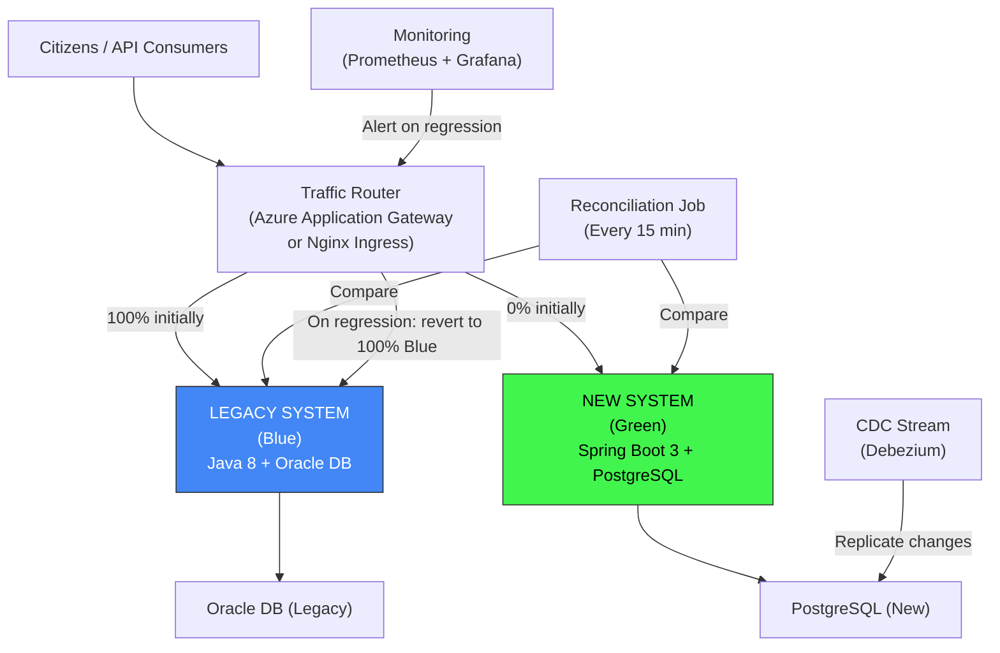

**Traffic Migration Progression:**
- Week 1: 0% new / 100% legacy (validation only)
- Week 2: 5% new / 95% legacy (canary)
- Week 3: 20% new / 80% legacy (extended canary)
- Week 4: 50% / 50% (parallel run validation)
- Week 5: 100% new / 0% legacy (full cutover)
- Week 6-8: Legacy kept warm (instant rollback available)
- Week 9+: Legacy decommissioned

---

### 2.2.6 ADRs for Migration Decisions

**ADR (Architecture Decision Record)** format for migration:

```
ADR-008: Migration Strategy for Pension Payment Processing Service

Status: Accepted
Date: [Training scenario date]
Deciders: Solution Architect, SRE Lead, DBA, Compliance Officer

Context:
The legacy pension payment processing service runs on a monolithic Java 8 application 
backed by an Oracle 11g database. It processes 2 million transactions/month for 
beneficiaries across 28 Indian states. The system has no automated tests, 
tightly-coupled modules, and undocumented stored procedures.

The new system must be microservices-based, deployed on Azure (Central India region), 
and comply with the DPDP Act 2023 and RBI payment processing guidelines.

Decision Drivers:
- Zero tolerance for data loss (even 1 lost payment = citizen hardship)
- Maximum 2-hour planned downtime window acceptable (approved by NIC)
- Budget constraint: Migration must complete within 18 months
- Team constraint: 3 developers available full-time for migration

Considered Options:
Option A: Big Bang - Complete rewrite; cut over at once
Option B: Strangler Fig + CDC - Progressively replace with parallel run
Option C: Lift & Shift first, then Refactor - Rehost Oracle to Azure VM, then migrate to PostgreSQL

Decision: Option B — Strangler Fig + CDC

Rationale:
- Option A rejected: Risk score 25/25 (Probability 5, Impact 5). Government programmes 
  using Big Bang have a documented 70% failure rate (illustrative). Zero rollback 
  capability if new system fails.
- Option C rejected: Oracle licensing on Azure VM = 3x cost; deferred technical debt; 
  two migration cycles instead of one.
- Option B selected: Progressive risk; each wave is independently verifiable; 
  CDC ensures data consistency; rollback available at any wave.

Consequences:
Positive:
- Rollback available within 5-15 minutes at any wave
- Each wave delivers measurable business value
- Risk is distributed across 10 months instead of concentrated at one cutover

Negative:
- CDC infrastructure adds complexity (Debezium, Kafka connector)
- Dual-write period creates consistency validation overhead
- Team must maintain two systems simultaneously during transition
- Estimated 20% overhead in engineering effort vs. Big Bang

Compliance Notes:
- Citizen PII data during dual-write: both systems write to separate encrypted 
  databases. No PII passes through CDC in plaintext. DPDP Act compliant.

Review Date: After Wave 2 completion
```

---

### 2.2.7 Migration Planning Workshop Template

For the hands-on workshop portion, use this template:

**Input:** Legacy system description
**Output:** Migration plan with risk register, rollback strategy, and 3 ADRs

#### Workshop Facilitation Structure

```
Step 1: System Inventory (15 min)
  - Map all components of the legacy system
  - Document integrations, consumers, and data stores
  - Identify regulatory constraints

Step 2: Classify by Migration Strategy (10 min)
  - Apply 7R framework to each component
  - Mark as: Retire, Retain, Rehost, Replatform, Refactor, Reimagine

Step 3: Wave Planning (15 min)
  - Group components into 3-4 waves
  - Define success criteria for each wave
  - Identify cross-wave dependencies

Step 4: Risk Register (10 min)
  - Identify top 8 risks
  - Score each: Probability × Impact
  - Define mitigation for all Medium/High risks

Step 5: ADR Writing (10 min)
  - Write ADR for the most critical migration decision identified
  - Must include: Context, Options, Decision, Rationale, Consequences

Step 6: Presentation (5 min per team)
  - Present migration plan to the class
  - Receive peer review and feedback
```

---

### 2.2.8 High-Level Migration Architecture

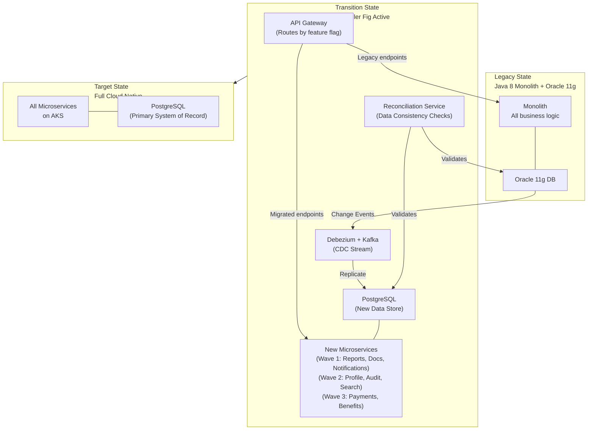

---

### 2.2.9 Questionnaire — Section 2

**Conceptual Questions**

1. What is the difference between a Parallel Run and a Blue-Green deployment in the context of legacy migration?

   *Answer:* A **Parallel Run** means both the legacy and new systems process the same transactions simultaneously, and outputs are compared for correctness. It is used for validation — proving the new system produces identical results. A **Blue-Green deployment** is a traffic-routing strategy where only one system (blue = old, green = new) handles live traffic at a time. The inactive system is a standby for rollback. In migration, you often combine both: run in parallel for validation, then switch traffic blue-to-green for cutover.

2. What is a CDC (Change Data Capture) stream and why is it preferred over bulk ETL during a Strangler Fig migration?

   *Answer:* CDC captures row-level changes (INSERT, UPDATE, DELETE) in near real-time from the source database's transaction log (WAL in PostgreSQL, redo log in Oracle), and streams them to the target. Preferred over ETL because: (a) no full table scans — the source DB is not burdened; (b) continuous sync rather than batch windows means data stays fresh; (c) supports zero-downtime migration by eliminating the need for a maintenance window for data synchronisation.

3. What is an ADR, and why should migration decisions be documented in ADRs rather than email threads or meeting notes?

   *Answer:* An **Architecture Decision Record (ADR)** is a lightweight document capturing a significant architectural decision with its context, options considered, rationale, and consequences. Migration decisions documented in ADRs: (a) survive team turnover — new engineers understand why decisions were made; (b) are version-controlled in the codebase alongside the code they affect; (c) support audit trails required by government programme governance; (d) prevent re-litigation of settled decisions.

**Application Questions**

4. Apply the 7R framework to the following components of a legacy government HR system. Justify each decision: (a) Employee leave management module (SAP HR), (b) Custom payroll calculation engine (COBOL, 1995), (c) PDF report generation service (Java 6), (d) Biometric attendance tracking (on-premises hardware).

   *Answer:* (a) Repurchase — SAP HR is COTS; equivalent SaaS (ServiceNow HR, Workday) is available; no competitive advantage in owning. (b) Refactor/Re-architect — COBOL payroll is high-risk to Reimagine (complex business rules); must carefully extract and reimplement rules in modern Java with comprehensive test coverage derived from COBOL output. (c) Replatform — Java 6 → Java 17 migration, replace custom PDF library with Apache PDFBox or JasperReports; no architectural change needed. (d) Retain (short-term) / Refactor (medium-term) — biometric hardware cannot be migrated to cloud; expose via edge API layer; plan hardware refresh with cloud-integrated devices in next budget cycle.

5. Design a rollback plan for a database migration from Oracle 11g to PostgreSQL 15 for a citizen identity database. What are the exact triggers, decision authority, and rollback steps?

   *Answer:*
   - Trigger: Data reconciliation job shows >0.01% mismatch, OR error rate on new system >2x baseline, OR any data corruption alert
   - Decision authority: Incident Commander (SRE Lead) can trigger within 0-15 minutes; beyond 15 minutes requires Solution Architect approval
   - Rollback steps: (1) API Gateway routes 100% traffic to legacy Oracle-backed system (pre-configured in traffic router, instant via feature flag); (2) CDC stream paused; (3) PostgreSQL set to read-only to prevent further writes; (4) Reconciliation audit job runs to identify any writes made to PostgreSQL but not yet reflected in Oracle; (5) Manual reconciliation of delta records; (6) Post-incident review within 24 hours; (7) Root cause fixed before retry

6. A migration risk register shows Risk R-004 (performance regression) with score 12/25. The mitigation is "load test each wave before cutover." Write a specific Definition of Done for this mitigation that could be used as a wave gate criterion.

   *Answer:* DoD for R-004 mitigation:
   - [ ] Load test executed using k6 against new system with 120% of peak expected load for the migrated wave
   - [ ] p99 latency of new system ≤ 110% of legacy system p99 latency (no more than 10% regression)
   - [ ] Error rate < 0.1% under peak load
   - [ ] No out-of-memory events in any pod during load test
   - [ ] Database connection pool exhaustion: 0 incidents during test
   - [ ] Load test report reviewed and signed off by Solution Architect and SRE Lead
   - [ ] Results stored in project wiki with date, tester, environment configuration

**Analysis Questions**

7. A government CIO argues: "We should just do a Big Bang rewrite — it's faster and cheaper than managing two systems for 18 months." Construct a structured counter-argument using evidence from migration history, risk analysis, and financial modelling.

   *Answer:* Counter-argument structure:
   - Historical evidence: The UK NHS Connecting for Health programme (2003-2011) was a Big Bang approach costing £12.7 billion before partial abandonment. US HealthCare.gov (2013) initial launch failed catastrophically due to Big Bang deployment. Illustrative: 60-70% of Big Bang government IT programmes experience cost overruns >100% (various government audit reports).
   - Risk analysis: Big Bang = Probability 4, Impact 5 = Risk Score 20/25 (Critical). Strangler Fig = Probability 2, Impact 3 = Risk Score 6/25 (Low). The risk differential justifies the dual-system overhead.
   - Financial model: Dual-system cost = ~20% engineering overhead for 18 months. Cost of failed Big Bang (rollback to legacy, replan, restart) = 100% of project cost + 12-24 months of delay + reputational damage. Expected value calculation: If Big Bang has 60% failure probability and 100% cost overrun on failure: E[Big Bang cost] = 0.4 × 1.0 × base + 0.6 × 2.0 × base = 1.6 × base cost vs. Strangler Fig: 1.2 × base cost with near-zero failure probability.

8. You are reviewing a migration ADR written by a junior architect. It says: "Decision: Use Strangler Fig. Rationale: It's the industry best practice." What is wrong with this ADR and what would you ask the author to add?

   *Answer:* Deficiencies: (a) No context — what is the legacy system? What are its characteristics? (b) No options considered — what alternatives were evaluated and rejected? (c) "Industry best practice" is not rationale — rationale must be specific to THIS system's constraints, risks, and requirements. (d) No consequences — what are the positive and negative consequences of this choice? (e) No decision drivers — what NFRs, constraints, or principles drove the decision? Request the author add: system description, 3 alternatives with comparison, system-specific rationale (why Strangler Fig fits THIS system's risk profile, team size, dependency graph), and explicit consequences (including operational overhead during transition).

**Scenario-Based Questions**

9. *Scenario (US):* A US county government is migrating a legacy vehicle registration system (Visual Basic 6 + SQL Server 2000) to a modern Azure-based system. The county DMV processes 1,200 transactions/day. There is one developer on staff. The system was last modified in 2009. No documentation exists. Design a migration plan with wave structure, risk register (top 5 risks), and one ADR.

   *Answer (model answer):*
   - Wave 0 (Weeks 1-4): Documentation sprint — reverse-engineer schema using SQL Server Management Studio; write integration tests that capture current behavior; establish source control for VB6 code
   - Wave 1 (Weeks 5-12): Rehost SQL Server 2000 to Azure SQL (Replatform); VB6 application continues using new database via ODBC — minimal risk, immediate benefit (managed backups, security patches)
   - Wave 2 (Weeks 13-24): Replatform VB6 to .NET 8 Web API (single developer, incremental module replacement using Strangler Fig via API layer)
   - Wave 3 (Weeks 25-40): Refactor to microservices (optional, given single developer constraint — may be deferred)
   - Top 5 Risks: (R-001) Knowledge loss if sole developer leaves (P:4, I:5 = 20 — CRITICAL: document everything, engage contractor); (R-002) SQL Server 2000 undocumented stored procedures (P:4, I:4 = 16): Reverse engineer with SQL Profiler traces; (R-003) VB6 COM dependencies (P:3, I:3 = 9): Audit all COM objects; (R-004) County IT policy doesn't permit cloud data (P:3, I:5 = 15): Engage county CIO early; (R-005) Single developer burnout (P:3, I:4 = 12): Engage county IT vendor support

10. *Scenario (Singapore):* A Singapore government ministry is migrating a grants management system used by 15,000 SMEs (Small and Medium Enterprises). The system has 47 integrations with other government systems (MyInfo, CorpPass, IRAS, MAS). How would you approach the integration risk assessment in your migration plan?

    *Answer (model answer):* Integration risk is the highest-risk dimension. Approach:
    (1) Integration inventory matrix: Document all 47 integrations with: protocol (REST/SOAP/file-based), data exchanged, SLA, owner ministry, change control process
    (2) Classify integrations: (a) Consumer — ministry's system calls external system (lower risk); (b) Provider — external systems call ministry's system (higher risk — API contract change affects 47 consumers)
    (3) Contract-first strategy: For all provider integrations, publish OpenAPI 3.1 specifications with semantic versioning before any code change; engage consumer ministries 90 days before API version change
    (4) Integration test environment: Provision GovTech-sanctioned sandbox environments for MyInfo, CorpPass, IRAS, MAS (all have official sandboxes)
    (5) Integration risk register: Highest risks — IRAS API (tax data, compliance critical); MyInfo (citizen identity, if broken, blocks all applications); CorpPass (business authentication)
    (6) Wave planning: Migrate integrations progressively — maintain backward-compatible v1 API while deploying v2; use API Gateway to route v1 requests to legacy, v2 to new system; retire v1 only after all consumers have migrated

---

### 2.2.10 Food for Thought — Section 2

> **Architectural Dilemma:**
> The Migration Paradox: The Strangler Fig pattern requires maintaining two systems simultaneously, which means double the infrastructure cost, double the operational overhead, and double the cognitive load on engineers. A 12-month Strangler Fig migration costs 20% more in engineering effort. A Big Bang rewrite has a historically documented high failure rate.
>
> **Question:** Is there a point at which a system is SO poorly documented, SO deeply entangled, and SO poorly tested that even a Strangler Fig is impossible, and the only honest recommendation is to "keep the legacy running forever and build new systems alongside it"? What would you tell a CIO who faces this situation?
>
> **Suggested AI Prompt:** "I am a solution architect for an Indian state government. The legacy citizen registration system was built in 2001 with no documentation, no tests, and tightly coupled database stored procedures. My team has been unable to identify bounded contexts because the entire application shares a single 400-table Oracle schema. Should I recommend Strangler Fig, Big Bang rewrite, Parallel Build, or 'coexistence with legacy'? Give me a structured analysis with risk scores."

---

---

# SECTION 3: Prompt Engineering Templates for Architecture, Code, and Tests {#section-3}

---

## 3.1 Topic Title and Learning Objectives

### Topic: Prompt Engineering for Solution Architects

**Learning Objectives** — By the end of this section, participants will be able to:

1. **Design** structured prompt templates that consistently produce high-quality architecture diagrams, code skeletons, and unit test scaffolding from AI assistants
2. **Analyze** the difference between naive prompts and architect-grade prompts using the RACE (Role, Action, Context, Expectation) and COSTAR (Context, Objective, Style, Tone, Audience, Response) frameworks
3. **Evaluate** AI-generated architectural outputs for completeness, correctness, and alignment with NFRs
4. **Create** a reusable prompt library tailored to the solution architect's daily workflow
5. **Apply** chain-of-thought prompting to decompose complex architectural problems into AI-assisted reasoning sequences

---

## 3.2 Concept Foundation

### The Analogy: Briefing a Junior Consultant

Imagine you hire a brilliant but inexperienced junior consultant who has read every architecture book ever written but has never shipped a production system. If you tell them "design me a payment system," you will get a generic, textbook answer. If you say "Design a payment system for a government pension portal in India processing 2 million transactions per month, complying with RBI guidelines, deployed on Azure in the Central India region, using Spring Boot 3.x and PostgreSQL 15, with a p99 latency SLO of 200ms, and output as a C4 container diagram in Mermaid.js format" — you get something useful.

**Prompt engineering** is the discipline of communicating with AI assistants with the same precision you would use when briefing a highly capable but literally-minded junior architect. The quality of your output is entirely determined by the quality of your input.

---

### 3.2.1 What is Prompt Engineering?

**Prompt engineering** is the structured practice of crafting inputs (prompts) to generative AI systems (large language models such as GPT-4/5, Microsoft Copilot) to elicit outputs that are precise, contextually appropriate, architecturally sound, and actionable.

For solution architects, prompt engineering is not about "talking to ChatGPT" — it is about:
- **Encoding domain knowledge** into prompts so the AI operates within the correct technical context
- **Constraining the solution space** so the AI does not invent fantasy architectures
- **Iterating systematically** to refine outputs toward production-grade quality
- **Validating critically** because AI outputs can be confidently wrong (hallucinations)

> **Architect's Note:** Prompt engineering does not replace architectural judgment. It accelerates the production of raw material (diagrams, code skeletons, test scaffolding) that the architect then critically reviews, corrects, and refines. An architect who accepts AI output without validation is as dangerous as a doctor who accepts WebMD as a diagnosis.

---

### 3.2.2 Prompt Quality Spectrum

The spectrum from naive to architect-grade prompts:

| Level                         | Example Prompt                                                                                                                                                           | Quality of Output                                            |
| ----------------------------- | ------------------------------------------------------------------------------------------------------------------------------------------------------------------------ | ------------------------------------------------------------ |
| **Level 1: Naive**            | "Write me a REST API in Java"                                                                                                                                            | Generic Hello World; no business context                     |
| **Level 2: Descriptive**      | "Write a Spring Boot REST API for managing citizen records"                                                                                                              | Better structure; still generic; no NFRs                     |
| **Level 3: Contextual**       | "Write a Spring Boot 3.x REST API for managing Indian citizen pension records with PostgreSQL 15, including input validation, error handling, and OpenAPI documentation" | Production-closer; missing security, testing, NFRs           |
| **Level 4: Architect-Grade**  | Full RACE/COSTAR structured prompt (see below)                                                                                                                           | Near-production skeleton; requires validation and refinement |
| **Level 5: Chain-of-Thought** | Multi-step prompt sequence with validation gates                                                                                                                         | Highest quality; architect guides AI through reasoning steps |

---

### 3.2.3 The RACE Framework for Architectural Prompts

**RACE** is a structured prompt composition framework optimised for technical/architectural outputs:

| Component           | What to Include                                         | Example                                                                                                                                                                                                  |
| ------------------- | ------------------------------------------------------- | -------------------------------------------------------------------------------------------------------------------------------------------------------------------------------------------------------- |
| **R — Role**        | Define the AI's persona and expertise level             | "You are a senior solution architect with 15 years of experience in Java enterprise systems, Spring Boot, and Azure cloud-native architectures"                                                          |
| **A — Action**      | State the specific deliverable                          | "Design and implement a Spring Boot 3.x microservice for processing citizen pension payments"                                                                                                            |
| **C — Context**     | Provide business, technical, and regulatory constraints | "The system processes 2M transactions/month for an Indian state government. Must comply with DPDP Act 2023. Deployed on Azure Central India region. PostgreSQL 15 database. Maven build. Java 17."       |
| **E — Expectation** | Define format, quality, and completeness expectations   | "Output: complete Maven project structure, working Java code with Javadoc, JUnit 5 tests covering happy path and 3 failure scenarios, OpenAPI 3.1 YAML, and inline comments explaining design decisions" |

#### RACE Prompt Example — Architecture Diagram

```
ROLE: You are an expert solution architect specialising in cloud-native government 
systems with deep knowledge of C4 model, Mermaid.js, and Azure architecture.

ACTION: Generate a C4 Container Diagram for a citizen pension disbursement system.

CONTEXT:
- Government of India, state-level pension portal
- Users: 500,000 senior citizens, 2,000 government officers
- Key capabilities: Benefit calculation, payment processing, audit trail, document management
- Technology: Spring Boot 3.x microservices, PostgreSQL 15, Azure AKS, Azure Service Bus
- Security: OAuth2/OIDC via Keycloak, mTLS between services, Azure Key Vault for secrets
- NFRs: 99.9% availability, p99 latency < 200ms, data residency in India

EXPECTATION:
- Output format: Mermaid.js C4 container diagram (C4Context or C4Container syntax)
- Include: All containers, databases, external systems, user types
- Annotate each container with: technology, primary responsibility, and key NFR it satisfies
- Do not invent technologies not listed in the context
- Flag any architectural concerns you observe
```

---

### 3.2.4 The COSTAR Framework for Complex Architectural Problems

**COSTAR** is better suited when the output requires nuanced reasoning (trade-off analysis, ADR writing, technology selection):

| Component               | Description                                                                                      |
| ----------------------- | ------------------------------------------------------------------------------------------------ |
| **C — Context**         | Background situation and why this decision matters                                               |
| **O — Objective**       | Specific goal of this prompt interaction                                                         |
| **S — Style**           | Tone and structure of the response (e.g., "structured table", "ADR format", "executive summary") |
| **T — Tone**            | Professional register (e.g., "technical but accessible to non-engineers")                        |
| **A — Audience**        | Who will read/use the output                                                                     |
| **R — Response Format** | Explicit format specification                                                                    |

#### COSTAR Prompt Example — Technology Selection ADR

```
CONTEXT: A Singapore government agency is selecting a message broker for an 
event-driven microservices architecture. The system will handle citizen 
grant applications with 50,000 events/day. The team has 3 Java developers 
with no prior Kafka experience. Budget is constrained (GovTech OpenGov 
product approved list applies). The system must integrate with existing 
RabbitMQ installations in two other ministries.

OBJECTIVE: Compare Apache Kafka, RabbitMQ, and Azure Service Bus for this 
specific scenario and recommend one with full justification.

STYLE: Structured technical analysis with a comparison table followed by 
a recommendation section in ADR format.

TONE: Technical but accessible — the output will be reviewed by both 
developers and a non-technical ministry director.

AUDIENCE: A mixed technical/non-technical review board.

RESPONSE FORMAT:
1. Comparison table (Criteria × Options, scored 1-5)
2. Top 3 trade-offs explicitly stated
3. ADR with: Context, Options, Decision, Rationale, Consequences
4. Risk mitigation for the recommended option
5. Maximum 800 words
```

---

### 3.2.5 Prompt Templates Library for Architects

#### Template 1: Microservice Code Skeleton

```
ROLE: You are a senior Java architect specialising in Spring Boot 3.x, 
domain-driven design, and hexagonal architecture.

ACTION: Generate a production-ready Spring Boot 3.x microservice skeleton 
for [SERVICE NAME] in a [DOMAIN] context.

CONTEXT:
- Business capability: [Describe what this service does]
- Domain: [e.g., Pension Processing, Tax Filing, Identity Management]
- Consumers: [Internal services / External API / Mobile clients]
- Data store: [PostgreSQL 15 / MongoDB 7 / Redis]
- Integration: [REST / Event-driven via Kafka / gRPC]
- Security: [OAuth2 scopes required / mTLS / API key]
- Key business rules: [List 3-5 core rules]
- NFRs: [p99 latency target, throughput, availability]
- Regulatory: [DPDP Act / PDPA Singapore / FedRAMP]

EXPECTATION:
- Complete Maven pom.xml with all dependencies
- Hexagonal architecture: domain, application, infrastructure, adapters layers
- REST controller with OpenAPI 3.1 annotations
- Service interface and implementation with @Transactional where appropriate
- JPA entity with validation annotations
- Repository interface
- Global exception handler
- 5 JUnit 5 test cases: 3 happy path, 2 failure scenarios
- Dockerfile (multi-stage, non-root user)
- application.yml with environment variable placeholders
- Inline comments explaining WHY each design decision was made
- Flag any business rules that seem incomplete or ambiguous
```

#### Template 2: Unit Test Generation

```
ROLE: You are a senior QA architect with expertise in TDD, BDD, JUnit 5, 
Mockito, and test pyramid design for enterprise Java systems.

ACTION: Generate comprehensive JUnit 5 unit tests for the following 
[CLASS/METHOD].

CONTEXT:
[PASTE THE CLASS CODE HERE]

CONSTRAINTS:
- Use JUnit 5 (Jupiter) and Mockito 5.x
- No Spring context loading in unit tests (pure unit tests only)
- Each test follows: Arrange-Act-Assert pattern
- Test method names: should_[ExpectedBehavior]_when_[Condition]
- Cover: Happy path, null inputs, boundary conditions, exception scenarios
- Mock all external dependencies (repositories, external services)
- Parameterized tests for boundary values where appropriate

EXPECTATION:
- Minimum 8 test methods
- Each test has a Javadoc comment explaining the scenario being tested
- Include: @DisplayName annotations with business-readable test names
- Include: Verification of mock interactions where behavior is important
- Flag any untestable code patterns you observe (and explain why)
- Include a test coverage assessment: which branches are NOT covered and why
```

#### Template 3: Architecture Review (AI as Devil's Advocate)

```
ROLE: You are a senior enterprise architect conducting an architecture review. 
Your job is to find flaws, not validate. Be critical, specific, and 
constructive.

ACTION: Review the following architecture description/diagram and produce 
a structured Architecture Risk Assessment.

CONTEXT:
[PASTE ARCHITECTURE DESCRIPTION OR MERMAID DIAGRAM]

ADDITIONAL CONTEXT:
- Anticipated load: [X RPS, Y concurrent users]
- Regulatory environment: [DPDP / PDPA / FedRAMP]
- Team size: [X developers, Y operations staff]
- Budget constraint: [Annual infra budget]
- Timeline: [Launch date]

EXPECTATION:
Structured output with:
1. Critical Risks (P×I score ≥ 16): Must fix before launch
2. High Risks (score 9-15): Should fix before launch
3. Medium Risks (score 4-8): Address in next sprint cycle
4. Architectural Smells: Patterns that indicate future problems
5. Missing NFR coverage: Which quality attributes are not addressed
6. Security gaps: Specific vulnerabilities or missing controls
7. Top 3 recommendations with implementation effort estimate (S/M/L)

Do NOT validate what is correct. Only identify what is wrong or missing.
```

#### Template 4: ADR Generation

```
ROLE: You are a solution architect who writes Architecture Decision Records 
following the Michael Nygard ADR format with government-grade documentation 
standards.

ACTION: Write an ADR for the following architectural decision.

DECISION TOPIC: [e.g., "Choice of message broker for event-driven microservices"]

CONTEXT:
- System: [Brief description]
- Problem being solved: [What architectural problem does this decision address?]
- Constraints: [Budget, team skills, regulatory, timeline]
- Options already identified: [Option A, Option B, Option C]
- Stakeholders who must agree: [CTO, Compliance, Operations]

EXPECTATION:
ADR format:
- Title: ADR-[NUMBER]: [Decision Title]
- Status: [Proposed/Accepted/Deprecated/Superseded]
- Date: [Date]
- Deciders: [Roles, not names]
- Context: [Full problem description, 150-200 words]
- Decision Drivers: [Bulleted list of NFRs and constraints]
- Considered Options: [Each option with pros/cons]
- Decision Outcome: [Chosen option with justification]
- Consequences: [Positive and negative]
- Compliance Notes: [Regulatory implications]
- Review Date: [When to revisit]
```

#### Template 5: Infrastructure Sizing Validation

```
ROLE: You are an Azure cloud architect and FinOps specialist with expertise 
in Kubernetes capacity planning and government workload characteristics.

ACTION: Validate and critique the following infrastructure sizing estimate.

SIZING ESTIMATE:
[PASTE YOUR SIZING CALCULATIONS]

WORKLOAD CHARACTERISTICS:
- Peak RPS: [X]
- Avg CPU time per request: [Y ms]
- Memory per service instance: [Z GB]
- Data volume: [TB]
- Data access patterns: [Read-heavy / Write-heavy / Mixed]
- Traffic profile: [Constant / Business-hours peak / Seasonal spike]

EXPECTATION:
1. Validate or correct each sizing calculation with working
2. Identify any missing resource dimensions (network, DNS, storage IOPS)
3. Propose right-sizing optimisations with estimated cost impact
4. Identify HPA configuration recommendations
5. Flag any single points of failure in the proposed sizing
6. Provide a 3-tier cost estimate: Optimistic, Realistic, Conservative (annual, USD/INR/SGD)
```

---

### 3.2.6 Chain-of-Thought Prompting for Architects

**Chain-of-Thought (CoT)** prompting instructs the AI to reason through a problem step by step before producing the final output. For complex architectural problems, CoT dramatically improves output quality.

#### Standard CoT Pattern

```
Before producing the final output, think through this step by step:

Step 1: Identify all stakeholders and their primary concerns
Step 2: List all NFRs implied by the problem description  
Step 3: Map each requirement to an architectural pattern that addresses it
Step 4: Identify conflicts between requirements and propose resolutions
Step 5: Now produce the architecture design

[Then your actual RACE/COSTAR prompt follows]
```

#### Example: CoT for Decomposing a Monolith

```
I need to decompose a legacy government monolith into microservices.
Before recommending bounded contexts, think through this step by step:

Step 1: What business capabilities are typically present in a citizen 
        registration system? List them.

Step 2: For each capability, what are the data ownership boundaries? 
        Which data belongs exclusively to which capability?

Step 3: Which capabilities have significantly different:
        - Load profiles (high vs. low traffic)
        - Change frequency (changes often vs. rarely)
        - Team ownership (different business departments)
        - NFRs (some need 99.99% uptime, others 99%)

Step 4: Based on steps 1-3, propose 5-7 bounded contexts with justification.

Step 5: For each bounded context, identify the anti-corruption layer 
        needed to interface with the remaining legacy system.

Step 6: Now produce a C4 Container Diagram in Mermaid.js showing the 
        proposed decomposition.

ADDITIONAL CONTEXT:
- System: State government citizen registration (birth, death, marriage records)
- Users: 10 million citizens, 500 government officers
- Current: Java EE 7 monolith, Oracle 12c, 15 years old
- Team: 8 developers, 2 DBAs
- Regulatory: DPDP Act 2023, CRS (Civil Registration System) standards
```

---

### 3.2.7 Prompt Anti-Patterns

> **Anti-Pattern Warning:**

| Anti-Pattern             | Example                                                                                | Problem                                                          | Fix                                                             |
| ------------------------ | -------------------------------------------------------------------------------------- | ---------------------------------------------------------------- | --------------------------------------------------------------- |
| **The Blank Canvas**     | "Design me a microservices system"                                                     | AI invents requirements; output is fictional                     | Always provide concrete constraints, NFRs, and technology stack |
| **The Trust Fallacy**    | Using AI output directly in production code without review                             | AI hallucinations; security vulnerabilities; non-compilable code | Always compile, run tests, and scan AI-generated code           |
| **The Vague Verb**       | "Make it better" or "Improve the design"                                               | AI doesn't know what "better" means to you                       | Specify: "Improve for p99 latency" or "Improve for security"    |
| **The Missing Context**  | Asking for code without specifying Java version, framework version, or library choices | AI uses outdated APIs or incompatible library versions           | Always specify exact versions in context                        |
| **The One-Shot Fallacy** | Expecting the perfect answer in one prompt                                             | Complex architectural problems require iteration                 | Plan for 3-5 prompt iterations; treat first response as a draft |
| **The Regulation Gap**   | Not specifying regulatory context                                                      | AI produces architectures that violate DPDP/PDPA/FedRAMP         | Always specify applicable regulations in context                |
| **Prompt Injection**     | Including user-provided data in prompts without sanitisation                           | Security risk in AI-assisted code generation pipelines           | Never inject untrusted input into system prompts                |

---

### 3.2.8 Real-World Case Study: AI-Assisted Architecture at GovTech Scale

**Scenario (Illustrative — Singapore context):**

A GovTech Singapore team of 5 architects was tasked with designing an interoperability layer connecting 12 government agencies' APIs for a new National Digital Identity initiative. Traditionally, this architecture phase takes 6-8 weeks of workshops and whiteboarding.

**Initial (Flawed) Approach:**
The team used ad-hoc ChatGPT prompts:
- "Design a government API gateway"
- "How do I connect 12 APIs?"
- Output: Generic NGINX gateway configuration; no Singapore context; no IM8 compliance; wrong authentication model (API keys instead of CorpPass/Singpass)

**Improved Approach with Structured Prompts:**

Using the RACE framework with Chain-of-Thought:

```
ROLE: Senior solution architect specialising in Singapore government 
digital infrastructure with knowledge of NDI (National Digital Identity), 
CorpPass, Singpass, IM8 guidelines, and GovTech's Whole-of-Government 
platform.

ACTION: Design an API interoperability layer connecting 12 government agency 
APIs with centralized identity, audit logging, and rate limiting.

CONTEXT:
- Agencies: MOM, IRAS, HDB, CPF, MHA, MOE, MOH, LTA, SLA, MAS, NEA, NParks
- Each agency has existing REST APIs (varying versions: 2015-2023)
- Identity: All government officer access via CorpPass OIDC; citizen access via Singpass
- Security: IM8 Tier 2 classification; mTLS between all internal services
- Audit: All API calls must be logged with officer ID, timestamp, data accessed 
  (MAS regulatory requirement)
- Rate limiting: Per-agency, per-consumer quotas
- Technology: Azure API Management (GovTech approved), Spring Boot 3.x adapters, 
  Azure AKS, PostgreSQL 15 for audit store

CHAIN OF THOUGHT:
Step 1: Identify the key integration patterns needed for heterogeneous agency APIs
Step 2: Map each IM8 control to an API gateway capability
Step 3: Design the identity federation model for CorpPass + Singpass
Step 4: Propose a versioning strategy for 12 agencies with independent release cycles
Step 5: Now produce a C4 Container Diagram and an OpenAPI 3.1 gateway specification template

EXPECTATION: Mermaid C4Container diagram + OpenAPI 3.1 YAML template 
+ 5 ADRs for key decisions + risk register (top 5 risks with scores)
```

**Outcome (Illustrative):**
- Architecture phase: Reduced from 6-8 weeks to 2 weeks (AI-generated first draft in 3 hours; 2 weeks of refinement, validation, stakeholder review)
- Quality improvement: Structured prompts produced IM8-aware, CorpPass-integrated design vs. generic output
- Key insight: The team's 5 hours of prompt engineering and validation saved ~150 engineering hours of whiteboarding — while producing a more consistent, documented output

**Before Architecture (Naive Prompts):**

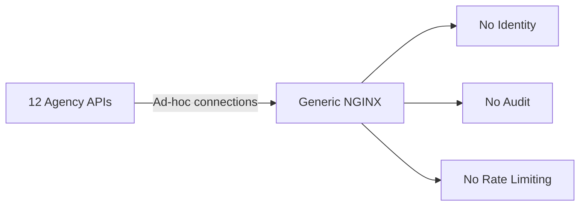

**After Architecture (Structured Prompt-Assisted Design):**

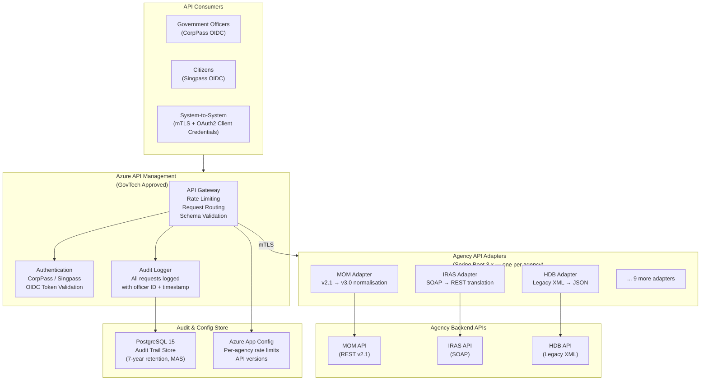

**Lessons Learned:**
1. Prompt engineering is a multiplier, not a replacement — the team's domain expertise made the prompts useful
2. First-draft AI output required validation against IM8 guidelines — AI is not a compliance expert
3. Chain-of-thought prompts produced dramatically better architectural reasoning than direct output prompts
4. AI-generated code required security scanning before use (covered in Section 5)

---

### 3.2.9 Questionnaire — Section 3

**Conceptual Questions**

1. What is the difference between RACE and COSTAR prompting frameworks, and when would you use each for architectural work?

   *Answer:* RACE (Role, Action, Context, Expectation) is optimised for producing specific technical artifacts — code, diagrams, configurations. It is directive and output-focused. COSTAR (Context, Objective, Style, Tone, Audience, Response) is better for complex reasoning tasks — trade-off analysis, ADR writing, stakeholder-facing documents — because it allows fine-grained control over communication style and audience calibration. Use RACE when you need a specific deliverable; use COSTAR when the reasoning process and presentation style matter as much as the content.

2. Explain chain-of-thought prompting and why it produces better architectural outputs than direct prompting.

   *Answer:* Chain-of-thought (CoT) prompting instructs the AI to explicitly reason through intermediate steps before producing the final answer. For architectural problems, direct prompting asks the AI to jump to a conclusion (e.g., "design a microservices architecture") without working through requirements, constraints, and trade-offs. CoT forces the AI to surface its reasoning, which: (a) catches logical errors early; (b) produces architectures that are explicitly grounded in requirements; (c) allows the architect to intervene at any step if the reasoning goes wrong; (d) produces more nuanced trade-off analysis because each step builds on the previous.

3. Why is "The Trust Fallacy" (using AI output directly without validation) particularly dangerous for security-critical government systems?

   *Answer:* AI models produce statistically plausible output, not verified correct output. For security-critical systems: (a) AI may generate code with known vulnerabilities (e.g., SQL injection without parameterized queries, hardcoded credentials, missing input validation); (b) AI may hallucinate non-existent library versions or deprecated APIs; (c) AI has no knowledge of your specific regulatory context (DPDP Act, FedRAMP) unless you explicitly provide it; (d) AI-generated cryptography code is particularly dangerous — subtle errors in key management or algorithm selection are not obvious but have catastrophic consequences. Government systems handle citizen PII, financial transactions, and national security data — a single AI-generated vulnerability could cause regulatory penalties, data breaches, and loss of public trust.

**Application Questions**

4. Write a RACE-framework prompt to generate a Spring Boot 3.x service class for validating and processing Indian Aadhaar-based eKYC (electronic Know Your Customer) verification requests. Include all four RACE components.

   *Answer (model):*
   - Role: "You are a senior Java architect specializing in Spring Boot 3.x, identity verification systems, and UIDAI (Unique Identification Authority of India) Aadhaar API integration, with deep knowledge of Java 17, hexagonal architecture, and Indian data protection regulations."
   - Action: "Implement a Spring Boot 3.x service class for Aadhaar eKYC verification that calls the UIDAI Auth API, validates the response, masks Aadhaar numbers in all logs, and stores only the verification result (not the Aadhaar number itself) in PostgreSQL 15."
   - Context: "System: State government citizen portal. Regulatory: DPDP Act 2023 (minimize Aadhaar data retention), UIDAI Authentication API v2.0. Security: Aadhaar number must never appear in logs, API responses, or database in plaintext. Technology: Spring Boot 3.2, Java 17, Spring Security, Maven, PostgreSQL 15. The service must be idempotent (same citizen + same session = same result)."
   - Expectation: "Output: Complete Java class with @Service annotation, full Javadoc, @Slf4j with masked logging, @Transactional, custom exception hierarchy, 4 JUnit 5 test cases, and a note on any UIDAI API aspects the AI is uncertain about."

5. You receive an AI-generated Mermaid architecture diagram that shows all microservices connecting directly to a single shared PostgreSQL database. What prompt would you write to request a critique and correction of this anti-pattern?

   *Answer:* Use the Architecture Review template (Template 3) with the specific anti-pattern flagged in the context: "The following architecture has been proposed by a junior developer. Conduct a critical architecture review. Specifically: (1) Identify the anti-pattern present in the database connectivity model and explain why it violates microservice isolation principles; (2) Propose a corrected architecture where each service owns its data; (3) Address the cross-service data consistency implications of the correction; (4) Provide a migration path from the current shared-DB model to the database-per-service model; (5) Score each identified issue with P×I risk scores."

6. A prompt returns a Spring Boot security configuration that uses `http.csrf().disable()`. Write a follow-up prompt to fix this specific security issue.

   *Answer:* "The previous response included `http.csrf().disable()` in the Spring Security configuration. This is a security vulnerability for browser-based APIs. Please: (1) Explain why CSRF protection was disabled and whether this was intentional for a stateless REST API with JWT; (2) If this is a stateless REST API (JWT Bearer tokens only, no session cookies), confirm that CSRF is safe to disable and explain why; (3) If the API is consumed by browser-based clients using session cookies, provide the correct CSRF configuration using CookieCsrfTokenRepository for Spring Boot 3.x with the correct SameSite cookie attributes; (4) Output the corrected SecurityFilterChain bean with inline comments explaining each decision."

**Analysis Questions**

7. Compare the effectiveness of RACE-structured prompts versus COSTAR-structured prompts for generating: (a) a Terraform HCL module for Azure AKS, (b) an executive summary of a cloud migration trade-off analysis.

   *Answer:* (a) Terraform HCL module — RACE is more effective. The deliverable is a specific technical artifact with precise requirements (resource types, variable names, provider versions, output values). COSTAR's Tone/Audience/Style components add no value for machine-readable code. RACE's Action and Expectation components precisely specify the output format. (b) Executive summary — COSTAR is more effective. The Tone ("accessible to non-engineers"), Audience ("Ministry Director and technical staff"), and Style ("executive summary, bullet points, no jargon") components are critical for producing readable, appropriate output. An executive summary that reads like a technical specification has failed its purpose. The Context and Objective components ensure the AI understands the business decision being supported.

8. A team uses AI to generate 500 lines of service layer code in 30 minutes. A traditional developer estimates the same code would take 4 hours. Calculate the productivity gain and identify 3 risks that could negate it.

   *Answer:* Productivity gain calculation: Traditional: 4 hours × 1 developer = 4 developer-hours. AI-assisted: 30 min generation + 45 min validation (review, test, security scan) = 1.25 developer-hours. Productivity multiplier: 4 / 1.25 = 3.2x productivity gain. Risks that could negate the gain: (1) Latent bug risk — if AI-generated code contains a subtle logic error that only appears in production (e.g., incorrect pension calculation rounding), the debugging, hotfix, incident management, and reputational cost easily exceeds 40 hours — turning a 3.2x gain into a net loss; (2) Security vulnerability — a single SQL injection or broken authentication in AI-generated code that reaches production could require emergency patching, security audit, regulatory reporting, and remediation — costs that dwarf the 3-hour saving; (3) Test coverage gap — if validation is skipped or rushed (only 15 min instead of 45), untested edge cases accumulate as technical debt. When these manifest as bugs in production, the fix costs 10x more than catching them during review.

**Scenario-Based Questions**

9. *Scenario (India):* Your team is building an AI-assisted development workflow for a NIC (National Informatics Centre) project. The project involves citizen PII data (Aadhaar, PAN, bank account details). A team lead proposes pasting actual citizen records into ChatGPT prompts to "give the AI real examples for better output." As the solution architect, how do you respond and what policy do you establish?

   *Answer:* Immediate response: "No — this is a critical privacy violation." Specific concerns: (a) ChatGPT/Copilot may use conversation data for model training (check enterprise agreements — Microsoft Copilot Enterprise with data protection terms is required for sensitive data); (b) Pasting real Aadhaar/PAN data into any third-party AI service violates the DPDP Act 2023 (unauthorized processing of personal data by a third party); (c) Bank account details in prompts are a direct financial security risk. Policy to establish: (1) Synthetic data mandate — all AI prompts must use synthetic/anonymized data that matches production patterns but contains no real PII; (2) Approved AI tools only — only Microsoft Copilot with enterprise data protection agreements or self-hosted LLM (on Azure OpenAI Service with your own tenant) may be used; (3) Prompt review process — all system prompts that touch business logic must be peer-reviewed for data leakage risk; (4) Training — mandatory 2-hour training on AI data governance for all developers before AI tool access.

10. *Scenario (US):* A US federal agency (under FedRAMP Moderate authorization requirement) is considering using GitHub Copilot to accelerate development of a benefits eligibility system. As the solution architect, what conditions must be met before approving Copilot use, and what architectural controls would you implement?

    *Answer:* FedRAMP conditions: (1) GitHub Copilot for Business/Enterprise must have FedRAMP authorization or be excluded from touching FedRAMP-boundary code — as of 2024, Copilot for Business is working toward FedRAMP moderate; verify current authorization status with GitHub; (2) Data residency: Code suggestions must not include classified or CUI (Controlled Unclassified Information) in training feedback; disable telemetry; (3) Network controls: Copilot traffic must route through agency-approved proxies with TLS inspection. Architectural controls: (1) Copilot output review gate: No AI-generated code merges to main branch without peer review + SAST scan + SCA scan passing; (2) Prompt hygiene policy: No security credentials, PII, or SSNs in any code file that Copilot can access (Copilot reads workspace context); (3) Test mandate: AI-generated code requires minimum 80% unit test coverage before merge; (4) Dependency pinning: AI-generated dependencies must be pinned to approved versions from agency-approved artifact registry; (5) ADR: Document the decision to use AI tools with FedRAMP implications explicitly noted.

---

### 3.2.10 Food for Thought — Section 3

> **Provocation:**
> AI assistants have dramatically lowered the barrier to producing architecturally-looking outputs. A junior developer with good prompt skills can now generate a Mermaid C4 diagram, a Terraform module, and 500 lines of Spring Boot code in under an hour.
>
> **Question:** Does this make the solution architect role more important or less important? If an AI can produce the *artifact*, what is the architect's remaining value? Are we training architects to be "prompt engineers with domain knowledge" — and is that enough?
>
> **Suggested Research:** Look up "AI and the future of software architecture" on ACM Digital Library. Then ask Copilot: "What are the architectural decisions that AI cannot make, and why?" Compare the AI's answer to your own view.

---

---

# SECTION 4: Vibe Coding with AI — GitHub Copilot / GPT-4 Iterative Refinement {#section-4}

---

## 4.1 Topic Title and Learning Objectives

### Topic: AI-Assisted Iterative Development (Vibe Coding)

**Learning Objectives:**

1. **Apply** an iterative AI-assisted coding workflow (Generate → Review → Refine → Validate) for building microservice features
2. **Design** context-injection strategies that make AI code generation domain-aware and NFR-aware
3. **Evaluate** AI-generated code iterations against functional correctness, performance, security, and maintainability criteria
4. **Create** a domain-specific context document that serves as the "briefing file" for AI-assisted development sessions
5. **Demonstrate** the compound improvement effect of structured iterative refinement versus one-shot generation

---

## 4.2 Concept Foundation

### The Analogy: Jazz Improvisation vs. Classical Score

"Vibe coding" — a term popularised by AI research circles — describes a mode of development where the developer and AI co-create code through rapid, iterative exchanges, following the flow of intent rather than a rigid specification. Like jazz improvisation: you start with a theme (the business requirement), the AI plays variations, you guide and correct, and together you arrive at something neither would have produced alone.

The danger is the same as jazz: without deep musical knowledge (domain expertise), you cannot tell whether the AI's improvisation is brilliant or off-key. **Vibe coding without validation is technical debt generation at machine speed.**

---

### 4.2.1 What is Vibe Coding?

**Vibe coding** is an AI-assisted development practice characterised by:
- Rapid, conversational back-and-forth between developer and AI
- Intent-driven (describe what you want, not how to implement it)
- Iterative refinement (each exchange improves on the previous)
- Domain-context injection (the developer provides business rules, NFRs, and constraints)
- Critical validation after each significant iteration

It is distinct from:
- **Code completion** (Copilot autocomplete in IDE) — reactive, line-level
- **Code generation** (one-shot generation of a complete class) — one prompt, one output
- **Vibe coding** — sustained dialogue, multiple iterations, compound improvement

---

### 4.2.2 The Iterative Refinement Loop

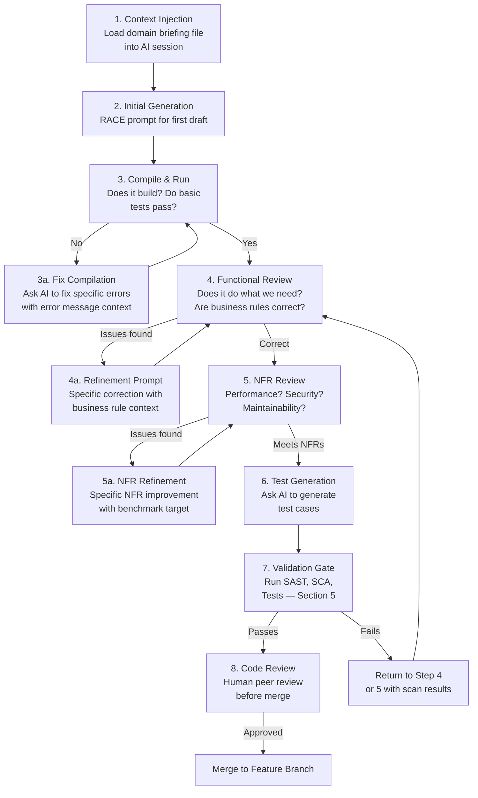

---

### 4.2.3 Context Injection — The Briefing File Pattern

The most powerful technique for sustained AI-assisted development is the **briefing file** — a structured context document that you load into every AI session before generating code. This ensures the AI operates with consistent domain knowledge throughout the development session.

#### Briefing File Structure

```markdown
# AI Development Briefing: [Project Name]
# Version: [X.Y] | Last Updated: [Date]

## Project Context
- System: [Name and one-sentence description]
- Domain: [Business domain]
- Users: [Primary user personas]
- Scale: [Expected load at launch and 3-year projection]

## Technology Stack (Non-Negotiable)
- Language: Java 17 (Java 21 features NOT available)
- Framework: Spring Boot 3.2.x
- Build: Maven 3.9.x
- Database: PostgreSQL 15.x (no Oracle, no MySQL)
- Message Broker: Apache Kafka 3.5.x
- Container: Docker (non-root user, multi-stage build mandatory)
- Test: JUnit 5.10.x, Mockito 5.x, AssertJ 3.x

## Architecture Principles (Always Follow)
- Hexagonal architecture: domain → application → infrastructure
- No business logic in controllers or repositories
- All external dependencies behind interfaces (ports)
- Fail fast: validate at the boundary (controller/consumer)
- Explicit over implicit: no magic, no hidden behavior

## NFRs (All Generated Code Must Satisfy)
- p99 latency target: < 200ms for synchronous APIs
- Availability: 99.9% (no synchronized blocks that create contention)
- Security: No hardcoded credentials, no plaintext PII in logs
- Observability: All service methods emit SLF4J structured logs with trace ID

## Business Rules (Domain-Specific)
- [Rule 1: e.g., "Pension amount cannot be negative"]
- [Rule 2: e.g., "A citizen can have only one active pension record"]
- [Rule 3: e.g., "All financial calculations use BigDecimal, never double"]
- [Rule 4: e.g., "Aadhaar numbers are masked in all logs: XXXX-XXXX-1234"]

## Regulatory Constraints
- India DPDP Act 2023: No PII in logs; data minimisation principle
- RBI Guidelines: All financial amounts in INR paise (Long), not rupees (Double)

## Code Style (Strictly Enforced)
- Method names: camelCase, verb-first (calculatePension, validateCitizenId)
- Test names: should_[ExpectedResult]_when_[Condition]
- No Lombok (field injection, @Data) — use explicit constructors and records
- JavaDoc on all public methods: @param, @return, @throws

## Anti-Patterns (Never Generate)
- @Autowired field injection (use constructor injection)
- Optional.get() without isPresent() check
- Catching Exception/Throwable without specific handling
- Thread.sleep() in production code
- System.out.println() (use SLF4J)
- Raw SQL strings (use JPA/parameterized queries only)

## Output Format Requirements
- Always include: package declaration, all imports
- Always include: class-level Javadoc
- Always include: @Override annotations where applicable
- Flag uncertainty: If unsure about a business rule, add // TODO: VERIFY comment
```

---

### 4.2.4 Iterative Refinement in Practice — Worked Example

We will demonstrate iterative refinement for a `PensionCalculationService` for the Indian state government pension portal.

#### Iteration 1: Initial Generation (Naive)

**Prompt:**
```
Write a PensionCalculationService for a government pension system.
```

**Typical AI Output (Level 1):**
```java
// AI-generated — DO NOT USE — illustrates naive output
public class PensionCalculationService {
    public double calculatePension(int age, double salary) {
        return salary * 0.5; // 50% of salary
    }
}
```

**Problems identified:**
- `double` for financial calculations (floating-point precision error — never use for money)
- No input validation
- Hardcoded 50% rate (business rule not applied)
- No domain model (age as int, salary as double — no domain objects)
- Not a Spring bean
- No exception handling
- No logging
- No tests

---

#### Iteration 2: Context-Injected RACE Prompt

**Prompt:**
```
[Briefing file loaded above]

ROLE: Senior Java architect applying hexagonal architecture and 
domain-driven design.

ACTION: Implement the PensionCalculationService for the domain layer.

CONTEXT:
- Service calculates monthly pension for Indian state government employees
- Business rules:
  * Base pension = (Last drawn basic salary × years of service × 0.02)
  * Capped at 50% of last drawn basic salary
  * Minimum pension: INR 9,000/month (7th Pay Commission)
  * Maximum pension: INR 1,25,000/month (7th Pay Commission)
  * DA (Dearness Allowance) is calculated separately and added by caller
  * All amounts in paise (Long), not rupees (Double)
  * years of service must be between 10 and 40
- Regulatory: RBI guidelines require BigDecimal for intermediate calculations
  before converting to paise

EXPECTATION:
- Domain layer class (no Spring annotations — pure Java)
- Input: PensionCalculationRequest (value object)
- Output: PensionCalculationResult (value object)
- Business rule validation with domain-specific exceptions
- All intermediate calculations use BigDecimal with HALF_EVEN rounding
- SLF4J logging (no PII in logs)
- 6 JUnit 5 tests: 3 happy path, 2 boundary, 1 exception
```

**AI-Generated Iteration 2 (substantially better):**

```java
package gov.state.pension.domain.service;

import gov.state.pension.domain.model.PensionCalculationRequest;
import gov.state.pension.domain.model.PensionCalculationResult;
import gov.state.pension.domain.exception.InvalidPensionCalculationException;
import org.slf4j.Logger;
import org.slf4j.LoggerFactory;

import java.math.BigDecimal;
import java.math.RoundingMode;

/**
 * Domain service for calculating government employee pension entitlements.
 *
 * <p>Implements pension calculation rules per the 7th Pay Commission guidelines
 * as applicable to [State] Government employees. All monetary values are
 * represented in Indian Paise (1 INR = 100 paise) using {@code Long} to
 * avoid floating-point precision errors in financial calculations.</p>
 *
 * <p>This is a pure domain service with no framework dependencies,
 * enabling independent unit testing and framework-agnostic reuse.</p>
 *
 * @see PensionCalculationRequest
 * @see PensionCalculationResult
 */
public class PensionCalculationService {

    private static final Logger log = LoggerFactory.getLogger(PensionCalculationService.class);

    // 7th Pay Commission: Pension = Basic × YoS × 2% (before cap application)
    private static final BigDecimal ACCRUAL_RATE = new BigDecimal("0.02");

    // 7th Pay Commission: Pension cannot exceed 50% of last drawn basic salary
    private static final BigDecimal MAX_PENSION_FRACTION = new BigDecimal("0.50");

    // 7th Pay Commission minimum pension: INR 9,000/month = 900,000 paise
    private static final long MINIMUM_PENSION_PAISE = 900_000L;

    // 7th Pay Commission maximum pension: INR 1,25,000/month = 12,500,000 paise
    private static final long MAXIMUM_PENSION_PAISE = 12_500_000L;

    // Minimum qualifying service: 10 years
    private static final int MINIMUM_YEARS_OF_SERVICE = 10;

    // Maximum qualifying service considered for calculation: 40 years
    private static final int MAXIMUM_YEARS_OF_SERVICE = 40;

    /**
     * Calculates the monthly basic pension for a retiring government employee.
     *
     * <p>Calculation formula:
     * <pre>
     *   rawPension = lastBasicSalaryPaise × yearsOfService × 0.02
     *   cappedPension = min(rawPension, lastBasicSalaryPaise × 0.50)
     *   finalPension = max(MINIMUM_PENSION, min(cappedPension, MAXIMUM_PENSION))
     * </pre>
     * </p>
     *
     * @param request the pension calculation request containing salary and service details
     * @return a {@code PensionCalculationResult} containing the calculated monthly pension
     * @throws InvalidPensionCalculationException if input parameters violate business rules
     */
    public PensionCalculationResult calculate(PensionCalculationRequest request) {
        validateRequest(request);

        log.info("Calculating pension for employee type={}, yearsOfService={}",
                request.employeeCategory(), request.yearsOfService());
        // NOTE: Deliberately NOT logging salary — DPDP Act: financial data minimisation

        BigDecimal lastBasicSalary = BigDecimal.valueOf(request.lastBasicSalaryPaise());
        BigDecimal yearsOfService = BigDecimal.valueOf(
                Math.min(request.yearsOfService(), MAXIMUM_YEARS_OF_SERVICE));

        // Step 1: Calculate raw pension using accrual rate
        // Formula: Basic × YoS × 2%
        BigDecimal rawPension = lastBasicSalary
                .multiply(yearsOfService)
                .multiply(ACCRUAL_RATE)
                .setScale(0, RoundingMode.HALF_EVEN); // Round to nearest paise

        // Step 2: Apply 50% of last basic salary cap (7th Pay Commission rule)
        BigDecimal pensionCap = lastBasicSalary
                .multiply(MAX_PENSION_FRACTION)
                .setScale(0, RoundingMode.HALF_EVEN);

        BigDecimal cappedPension = rawPension.min(pensionCap);

        // Step 3: Apply absolute floor and ceiling (7th Pay Commission)
        long calculatedPensionPaise = cappedPension.longValue();
        long finalPensionPaise = Math.max(MINIMUM_PENSION_PAISE,
                Math.min(calculatedPensionPaise, MAXIMUM_PENSION_PAISE));

        // Determine if floor or ceiling was applied (for transparency in result)
        boolean floorApplied = finalPensionPaise == MINIMUM_PENSION_PAISE
                && calculatedPensionPaise < MINIMUM_PENSION_PAISE;
        boolean ceilingApplied = finalPensionPaise == MAXIMUM_PENSION_PAISE
                && calculatedPensionPaise > MAXIMUM_PENSION_PAISE;

        log.info("Pension calculation complete: floorApplied={}, ceilingApplied={}, "
                + "yearsOfService={}", floorApplied, ceilingApplied, request.yearsOfService());

        return new PensionCalculationResult(
                finalPensionPaise,
                rawPension.longValue(),
                cappedPension.longValue(),
                floorApplied,
                ceilingApplied,
                request.yearsOfService()
        );
    }

    /**
     * Validates pension calculation request parameters against domain business rules.
     *
     * @param request the request to validate
     * @throws InvalidPensionCalculationException if any parameter is invalid
     */
    private void validateRequest(PensionCalculationRequest request) {
        if (request == null) {
            throw new InvalidPensionCalculationException("Pension calculation request cannot be null");
        }
        if (request.lastBasicSalaryPaise() <= 0) {
            throw new InvalidPensionCalculationException(
                    "Last basic salary must be positive; received: [REDACTED for privacy]");
        }
        if (request.yearsOfService() < MINIMUM_YEARS_OF_SERVICE) {
            throw new InvalidPensionCalculationException(
                    "Minimum qualifying service is " + MINIMUM_YEARS_OF_SERVICE
                    + " years; received: " + request.yearsOfService());
        }
        if (request.yearsOfService() > 45) { // Hard limit — over 45 is data error
            throw new InvalidPensionCalculationException(
                    "Years of service exceeds maximum plausible value (45); "
                    + "received: " + request.yearsOfService()
                    + " — possible data entry error");
        }
    }
}
```

---

#### Iteration 3: Refinement Prompt — Adding Missing Domain Objects

**Prompt:**
```
The service implementation looks correct. Now generate:
1. PensionCalculationRequest as a Java 17 record with validation
2. PensionCalculationResult as a Java 17 record  
3. InvalidPensionCalculationException as a domain exception
4. The 6 JUnit 5 tests as specified

Use the briefing file constraints: no Lombok, records preferred, 
BigDecimal for intermediate calculations, amounts in paise.
```

**AI Output — Value Objects and Tests:**

```java
package gov.state.pension.domain.model;

/**
 * Immutable value object representing a pension calculation request.
 *
 * <p>All monetary values in Indian Paise (Long) per RBI and DPDP Act guidelines.
 * Records enforce immutability without boilerplate.</p>
 *
 * @param lastBasicSalaryPaise  Last drawn basic salary in paise (must be positive)
 * @param yearsOfService        Total qualifying service years (10-45)
 * @param employeeCategory      Government employee category (affects DA calculation by caller)
 * @param employeeId            Internal employee identifier (NOT Aadhaar — for correlation only)
 */
public record PensionCalculationRequest(
        long lastBasicSalaryPaise,
        int yearsOfService,
        String employeeCategory,
        String employeeId       // Internal ID only — Aadhaar NOT stored here per DPDP Act
) {
    // Compact constructor for validation
    public PensionCalculationRequest {
        // employeeId is for logging correlation only — validate it exists but don't log value
        if (employeeId == null || employeeId.isBlank()) {
            throw new IllegalArgumentException("Employee ID is required for audit correlation");
        }
        if (employeeCategory == null || employeeCategory.isBlank()) {
            throw new IllegalArgumentException("Employee category is required");
        }
    }
}
```

```java
package gov.state.pension.domain.model;

/**
 * Immutable value object representing the result of a pension calculation.
 *
 * <p>Provides full calculation transparency — raw, capped, and final pension
 * values are all included to enable audit trail reconstruction.</p>
 *
 * @param finalMonthlyPensionPaise  Final monthly pension after all rules applied (paise)
 * @param rawCalculatedPensionPaise Pre-cap calculated pension (paise)
 * @param cappedPensionPaise        Post-50%-cap pension before floor/ceiling (paise)
 * @param minimumFloorApplied       True if the INR 9,000 minimum floor was enforced
 * @param maximumCeilingApplied     True if the INR 1,25,000 ceiling was enforced
 * @param qualifyingYearsOfService  Qualifying years used in calculation (capped at 40)
 */
public record PensionCalculationResult(
        long finalMonthlyPensionPaise,
        long rawCalculatedPensionPaise,
        long cappedPensionPaise,
        boolean minimumFloorApplied,
        boolean maximumCeilingApplied,
        int qualifyingYearsOfService
) {
    /**
     * Convenience method: converts final pension to rupees for display purposes.
     * Use only for UI rendering — never for financial calculations.
     *
     * @return final pension in rupees (Double — display only)
     */
    public double finalMonthlyPensionRupees() {
        return finalMonthlyPensionPaise / 100.0;
    }
}
```

```java
package gov.state.pension.domain.exception;

/**
 * Domain exception for invalid pension calculation inputs.
 * Extends RuntimeException as domain rule violations are programming errors,
 * not recoverable operational conditions.
 */
public class InvalidPensionCalculationException extends RuntimeException {

    public InvalidPensionCalculationException(String message) {
        super(message);
    }

    public InvalidPensionCalculationException(String message, Throwable cause) {
        super(message, cause);
    }
}
```

```java
package gov.state.pension.domain.service;

import gov.state.pension.domain.exception.InvalidPensionCalculationException;
import gov.state.pension.domain.model.PensionCalculationRequest;
import gov.state.pension.domain.model.PensionCalculationResult;
import org.junit.jupiter.api.BeforeEach;
import org.junit.jupiter.api.DisplayName;
import org.junit.jupiter.api.Test;
import org.junit.jupiter.params.ParameterizedTest;
import org.junit.jupiter.params.provider.ValueSource;

import static org.assertj.core.api.Assertions.*;

/**
 * Unit tests for PensionCalculationService.
 * Pure unit tests — no Spring context, no external dependencies.
 */
@DisplayName("PensionCalculationService — Domain Unit Tests")
class PensionCalculationServiceTest {

    private PensionCalculationService service;

    // Test data constants — all amounts in paise
    // INR 50,000/month basic salary = 5,000,000 paise
    private static final long SALARY_50K_PAISE = 5_000_000L;
    // INR 10,000/month basic salary = 1,000,000 paise
    private static final long SALARY_10K_PAISE = 1_000_000L;
    // INR 5,00,000/month basic salary = 50,000,000 paise (very senior officer)
    private static final long SALARY_500K_PAISE = 50_000_000L;

    @BeforeEach
    void setUp() {
        service = new PensionCalculationService();
    }

    // =========================================================================
    // Happy Path Tests
    // =========================================================================

    @Test
    @DisplayName("should calculate correct pension for standard 30-year service employee")
    void should_calculateCorrectPension_when_standardServiceAndSalary() {
        // Arrange
        // Basic: INR 50,000 | Service: 30 years
        // Expected: 50,000 × 30 × 0.02 = 30,000 INR | Cap: 50,000 × 50% = 25,000
        // Result: min(30,000, 25,000) = 25,000 INR = 2,500,000 paise
        PensionCalculationRequest request = new PensionCalculationRequest(
                SALARY_50K_PAISE, 30, "GROUP_A", "EMP-TEST-001");

        // Act
        PensionCalculationResult result = service.calculate(request);

        // Assert
        assertThat(result.finalMonthlyPensionPaise())
                .as("Pension should be capped at 50% of last basic salary")
                .isEqualTo(2_500_000L); // INR 25,000
        assertThat(result.minimumFloorApplied()).isFalse();
        assertThat(result.maximumCeilingApplied()).isFalse();
    }

    @Test
    @DisplayName("should apply minimum pension floor for low-salary short-service employee")
    void should_applyMinimumFloor_when_calculatedPensionBelowFloor() {
        // Arrange
        // Basic: INR 10,000 | Service: 10 years
        // Raw: 10,000 × 10 × 0.02 = 2,000 INR | Cap: 10,000 × 50% = 5,000
        // After cap: 2,000 INR | Floor: 9,000 INR → Floor applies
        PensionCalculationRequest request = new PensionCalculationRequest(
                SALARY_10K_PAISE, 10, "GROUP_D", "EMP-TEST-002");

        // Act
        PensionCalculationResult result = service.calculate(request);

        // Assert
        assertThat(result.finalMonthlyPensionPaise())
                .as("Floor of INR 9,000 (900,000 paise) must be applied")
                .isEqualTo(900_000L);
        assertThat(result.minimumFloorApplied())
                .as("Floor flag must be set to true")
                .isTrue();
    }

    @Test
    @DisplayName("should apply maximum ceiling for high-salary long-service officer")
    void should_applyCeiling_when_calculatedPensionExceedsMaximum() {
        // Arrange
        // Basic: INR 5,00,000 | Service: 35 years
        // Raw: 5,00,000 × 35 × 0.02 = 3,50,000 | Cap: 5,00,000 × 50% = 2,50,000
        // After cap: 2,50,000 | Ceiling: 1,25,000 → Ceiling applies
        PensionCalculationRequest request = new PensionCalculationRequest(
                SALARY_500K_PAISE, 35, "SECRETARY", "EMP-TEST-003");

        // Act
        PensionCalculationResult result = service.calculate(request);

        // Assert
        assertThat(result.finalMonthlyPensionPaise())
                .as("Ceiling of INR 1,25,000 (12,500,000 paise) must be applied")
                .isEqualTo(12_500_000L);
        assertThat(result.maximumCeilingApplied())
                .as("Ceiling flag must be set to true")
                .isTrue();
    }

    // =========================================================================
    // Boundary Tests
    // =========================================================================

    @ParameterizedTest
    @ValueSource(ints = {10, 40})
    @DisplayName("should accept boundary values for years of service (10 and 40)")
    void should_acceptBoundaryServiceYears_when_atMinimumOrMaximum(int yearsOfService) {
        // Arrange
        PensionCalculationRequest request = new PensionCalculationRequest(
                SALARY_50K_PAISE, yearsOfService, "GROUP_B", "EMP-TEST-004");

        // Act & Assert — should not throw
        assertThatCode(() -> service.calculate(request))
                .doesNotThrowAnyException();
    }

    @Test
    @DisplayName("should cap qualifying service at 40 years even when actual service exceeds 40")
    void should_capQualifyingService_when_actualServiceExceedsFortyYears() {
        // Arrange — 42 years of service; calculation should use 40
        // Basic: 50,000 | QS: 40 (capped)
        // Raw: 50,000 × 40 × 0.02 = 40,000 | Cap: 25,000 | Result: 25,000
        PensionCalculationRequest request = new PensionCalculationRequest(
                SALARY_50K_PAISE, 42, "GROUP_A", "EMP-TEST-005");

        PensionCalculationResult sameWithForty = service.calculate(
                new PensionCalculationRequest(SALARY_50K_PAISE, 40, "GROUP_A", "EMP-TEST-006"));

        // Act
        PensionCalculationResult result = service.calculate(request);

        // Assert
        assertThat(result.finalMonthlyPensionPaise())
                .as("42 years should produce same result as 40 years after capping")
                .isEqualTo(sameWithForty.finalMonthlyPensionPaise());
    }

    // =========================================================================
    // Exception / Failure Tests
    // =========================================================================

    @Test
    @DisplayName("should throw InvalidPensionCalculationException when years of service below minimum")
    void should_throwException_when_yearsOfServiceBelowMinimum() {
        // Arrange
        PensionCalculationRequest request = new PensionCalculationRequest(
                SALARY_50K_PAISE, 9, "GROUP_A", "EMP-TEST-007");

        // Act & Assert
        assertThatThrownBy(() -> service.calculate(request))
                .isInstanceOf(InvalidPensionCalculationException.class)
                .hasMessageContaining("Minimum qualifying service");
    }

    @Test
    @DisplayName("should throw InvalidPensionCalculationException when salary is zero or negative")
    void should_throwException_when_salaryIsZeroOrNegative() {
        // Arrange
        PensionCalculationRequest request = new PensionCalculationRequest(
                0L, 20, "GROUP_A", "EMP-TEST-008");

        // Act & Assert
        assertThatThrownBy(() -> service.calculate(request))
                .isInstanceOf(InvalidPensionCalculationException.class)
                .hasMessageContaining("Last basic salary must be positive");
    }
}
```

---

### 4.2.5 Refinement Prompt Patterns

| Situation              | Refinement Prompt Pattern                                                                                                                                                                                                                                     |
| ---------------------- | ------------------------------------------------------------------------------------------------------------------------------------------------------------------------------------------------------------------------------------------------------------- |
| Performance concern    | "The current implementation calls the database inside a loop. Refactor to batch the queries. Target: single query for N records. Keep all existing business logic intact."                                                                                    |
| Missing error handling | "Add comprehensive error handling for: (1) database connection timeout, (2) optimistic locking conflict on concurrent updates, (3) Kafka producer failure. Use specific exception types, not catch(Exception e)."                                             |
| Security gap           | "The current implementation logs the full request object. Identify and mask all PII fields (name, ID numbers, salary) in log statements. Use [REDACTED] for sensitive fields and last-4 digits for ID numbers."                                               |
| Test coverage gap      | "The current tests cover happy path only. Add: (1) concurrent modification test using ExecutorService with 10 threads, (2) test for exactly the boundary value where cap switches from raw to 50% cap, (3) test for null employeeCategory in request record." |
| Code smell             | "The calculate() method is 80 lines. Refactor to extract: validateRequest(), applyAccrualRateFormula(), applyCapRules(), applyFloorCeiling() as private methods. Maintain all existing behavior and tests must still pass."                                   |

---

### 4.2.6 Questionnaire — Section 4

**Conceptual Questions**

1. What is the purpose of a "briefing file" in AI-assisted development, and why does it produce better results than including context in individual prompts?

   *Answer:* A briefing file is a persistent context document loaded into every AI session that encodes domain knowledge, technology constraints, architectural principles, NFRs, and anti-patterns. It produces better results than per-prompt context because: (a) consistency — every generated artifact follows the same standards without repeating them in every prompt; (b) completeness — easy to forget regulatory constraints or NFRs in per-prompt context when focused on a specific feature; (c) team alignment — the briefing file becomes a team artifact, ensuring all developers' AI sessions produce consistent code; (d) evolution — the briefing file improves over time as the team discovers new constraints or anti-patterns.

2. Distinguish between "vibe coding" and traditional code completion (e.g., IDE autocomplete). What are the appropriate use cases for each?

   *Answer:* Code completion (autocomplete) is reactive, synchronous, line-level assistance — it completes the next token/line based on immediate code context. Use for: everyday typing acceleration, API method name recall, standard boilerplate. Vibe coding is proactive, conversational, intent-level assistance — the developer describes *what* to build, the AI produces larger code structures, and they iterate together. Use for: new service scaffolding, complex algorithm implementation, test case generation, code refactoring at method/class level. Inappropriate vibe coding use cases: performance-critical tight loops (AI may not optimize for the specific JVM/CPU architecture), security cryptography primitives (requires expert review regardless of AI quality), legal/regulatory rule encoding (requires compliance expert sign-off).

3. Why is `double` categorically inappropriate for financial calculations in government systems, and what should be used instead?

   *Answer:* `double` uses IEEE 754 binary floating-point representation, which cannot exactly represent many decimal fractions. For example, `0.1 + 0.2` in double arithmetic equals `0.30000000000000004`, not `0.3`. In pension calculations, this rounding error compounds across millions of transactions: a 0.001% error on INR 9,000/month × 12 million pensioners = INR 10,800/month in total unexplained discrepancy — which is both a financial and regulatory problem. Use `BigDecimal` for all intermediate calculations with explicit `RoundingMode.HALF_EVEN` (banker's rounding), and store amounts as `Long` (paise/cents) in the database to avoid floating-point entirely.

**Application Questions**

4. The AI generates a service method that queries a repository inside a `for` loop iterating over 1,000 citizen records. Write a refinement prompt to fix the N+1 query problem while maintaining the existing business logic.

   *Answer (model prompt):* "The following method executes a database query inside a for loop over [N] records, causing an N+1 query problem that will degrade performance linearly with record count. Refactor to: (1) collect all IDs first; (2) execute a single batch query using `findAllById(Collection<ID>)` or a custom JPQL query; (3) build a Map<ID, Entity> for O(1) lookup in the loop; (4) maintain exactly the same business logic and output as the original method; (5) add a Javadoc comment explaining the optimization and the N+1 problem it solves; (6) add a JUnit 5 test that verifies the repository is called exactly once regardless of input size (use Mockito's `verify(repository, times(1)).findAllById(any())`). Here is the current implementation: [PASTE CODE]"

5. You receive AI-generated code where the `@Transactional` annotation is placed on a private method. Write a refinement prompt to fix this and explain the root cause to the AI.

   *Answer (model prompt):* "The generated code has `@Transactional` on a private method `private void processPayment(...)`. This is an anti-pattern because Spring's transaction management uses AOP proxies — a proxy cannot intercept calls to private methods, so the `@Transactional` annotation has no effect. Please: (1) move the `@Transactional` annotation to the public method that calls `processPayment`, or (2) extract the transactional boundary to a separate `@Service` class with a public method. Explain why Spring cannot proxy private methods in your solution comments. Also audit the entire class for any other `@Transactional` annotations on private or final methods and correct them."

6. A refinement prompt session has reached 15 iterations and the code quality is still not meeting the briefing file standards. What is your strategy?

   *Answer:* Signal that the session has "drifted" — accumulated context from 15 iterations may have confused the AI's understanding of the current state. Strategy: (1) **Session reset**: Start a fresh AI session to eliminate accumulated context drift; (2) **Paste the current best version**: Show the AI the current state of the code, not the original prompt; (3) **Focused correction**: Target one specific remaining issue per prompt, not multiple issues simultaneously; (4) **Human override**: For issues that persist after 3 focused iterations, recognize this as a signal that the AI cannot solve this specific problem correctly — write the fix manually and document why in a code comment; (5) **Briefing file update**: Add the discovered anti-pattern to the briefing file's "Never Generate" section so future sessions don't reproduce the same problem.

**Analysis Questions, Scenario-Based Questions — (abbreviated for space; full versions in lab)**

7. Analyze the compound improvement shown across the three iterations in Section 4.2.4. Quantify the improvement in: lines of meaningful code, number of business rules encoded, number of potential production bugs eliminated.

   *Answer:* Iteration 1 → Iteration 2+3: Lines of meaningful code: 4 (naive) → ~150 (iteration 2/3 combined) = 37.5x more production-relevant code. Business rules encoded: 0 (naive) → 6 (accrual rate, 50% cap, min/max floors, paise representation, service year cap, DPDP logging rules). Potential production bugs eliminated: (1) floating-point precision error on pension calculation; (2) missing input validation allowing negative salary; (3) hardcoded rate with no business rule documentation; (4) no Spring bean annotation causing NullPointerException at runtime; (5) salary logged in plaintext — DPDP Act violation; (6) no audit trail in result. Total: 6 critical production bugs in 4 lines vs. 0 in 150 lines — the cost of the extra 146 lines is completely justified.

8. *Scenario (Singapore):* A SkillsFuture developer uses Copilot to generate a grant eligibility calculation function. Copilot generates code that hardcodes the grant amount as `double creditAmount = 500.00`. The developer does not notice. The code goes to production, processes 50,000 transactions, and the floating-point error causes SGD 0.01 discrepancy on approximately 3% of transactions. What is the architectural control failure, and how do you prevent it?

   *Answer:* Control failures: (1) No briefing file specifying "monetary amounts must use BigDecimal or Long (cents)"; (2) No SAST rule (custom PMD/SpotBugs rule) detecting `double` usage for variables named `amount`, `credit`, `payment`, `balance`; (3) No financial calculation review gate in code review checklist; (4) No integration test comparing calculated amounts to a reference implementation with known-correct values. Prevention: (1) Add to briefing file: "Anti-Pattern: Never use double or float for any monetary calculation — use Long (cents) for storage, BigDecimal with HALF_EVEN for calculation"; (2) Add custom PMD rule: detect `double`/`float` variable names containing amount/credit/payment/fee; (3) Code review checklist item: "All monetary values use BigDecimal or Long representation — verified"; (4) Architectural fitness function: automated test in CI that verifies all @Entity fields representing money are of type Long, and all service calculation methods use BigDecimal.

---

### 4.2.7 Food for Thought — Section 4

> **Provocation:**
> The briefing file pattern makes AI code generation consistent and domain-aware. But it also means the briefing file encodes your architectural decisions — and if those decisions are wrong, the AI will consistently generate wrong code at scale.
>
> **Question:** Who owns the briefing file? How does it get updated when architectural decisions change? What happens when two teams have different briefing files for the same codebase? Is the briefing file the new architecture specification?
>
> **Challenge for the weekend:** Write a briefing file for your current project. Share it with a colleague and ask them to identify: (1) constraints you forgot to include; (2) constraints that are wrong or outdated; (3) anti-patterns your team has been generating that are not yet listed.

---

---

# SECTION 5: Code Validation — Static Analysis, Unit Test Generation, Security Scanning of AI Output {#section-5}

---

## 5.1 Topic Title and Learning Objectives

### Topic: Validating AI-Generated Code for Production Readiness

**Learning Objectives:**

1. **Design** a multi-layer validation pipeline for AI-generated code covering static analysis, unit testing, and security scanning
2. **Apply** SAST (Static Application Security Testing) tools (SpotBugs, PMD, SonarQube) to identify code quality and security issues in AI-generated Java code
3. **Execute** SCA (Software Composition Analysis) using OWASP Dependency-Check to validate AI-generated dependency choices
4. **Evaluate** AI-generated code against a structured validation checklist before integration
5. **Create** a "Definition of Done for AI-Generated Code" checklist appropriate for government-grade systems

---

## 5.2 Concept Foundation

### The Analogy: The Nuclear Power Plant Analogy

A nuclear power plant does not trust its engineers to manually calculate whether a safety procedure is correct every time. It uses redundant independent validation systems — automated alarms, physical interlocks, independent monitoring computers. Each layer of validation catches a different class of failure. The plant is not inefficient because of this redundancy; it is safe.

AI-generated code validation follows the same logic. Static analysis catches code quality and common vulnerability patterns. Dependency scanning catches known-vulnerable libraries. Unit tests catch functional incorrectness. Security scanning catches OWASP Top 10 vulnerabilities. Each layer catches what the others miss. Removing any layer is like disconnecting a safety interlock — the plant runs fine until it doesn't.

---

### 5.2.1 The AI Code Validation Pipeline

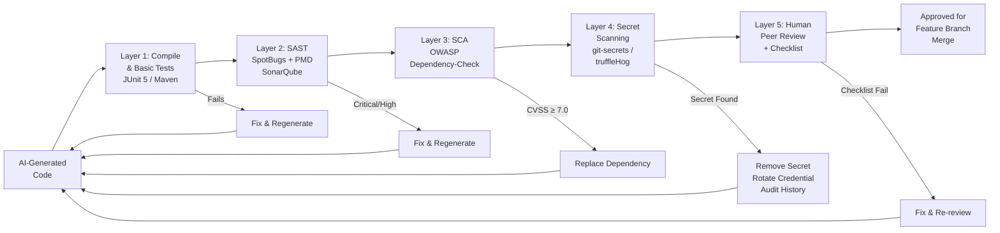

---

### 5.2.2 Layer 1: Compile and Unit Test Validation

The most basic validation: does the AI-generated code compile and do the AI-generated tests pass?

**Common AI code generation failures caught at this layer:**

| Failure Type              | Example                                               | Cause                         |
| ------------------------- | ----------------------------------------------------- | ----------------------------- |
| Import hallucination      | `import org.springframework.data.jpa.EasyRepository;` | AI invents class names        |
| Version mismatch          | Spring Boot 2.x annotation on Spring Boot 3.x project | AI uses outdated API          |
| Missing dependency        | Uses `@JsonProperty` without Jackson in pom.xml       | AI omits required dependency  |
| Java version mismatch     | Uses `var` in Java 8 context                          | AI misread version constraint |
| Test-against-mock failure | Mockito strict stubbing fails                         | AI generates unused stubs     |

**Validation command:**
```powershell
# Run compile and all tests
mvn clean test -Dspring.profiles.active=test

# Check for compilation warnings (treat as errors in CI)
mvn clean compile -Dmaven.compiler.failOnWarning=true
```

---

### 5.2.3 Layer 2: SAST — Static Application Security Testing

**SAST (Static Application Security Testing)** analyzes source code without executing it, looking for:
- Security vulnerabilities (SQL injection, XSS, path traversal, hardcoded credentials)
- Code quality issues (null pointer risks, resource leaks, dead code)
- Violation of coding standards (complexity, naming, structure)

#### SpotBugs — Bug Pattern Detection

**SpotBugs** (successor to FindBugs) uses bytecode analysis to detect bug patterns. Key patterns relevant to AI-generated code:

| SpotBugs Bug Pattern                       | Code Example AI Often Generates                                 | Risk                               |
| ------------------------------------------ | --------------------------------------------------------------- | ---------------------------------- |
| `NP_NULL_ON_SOME_PATH`                     | `user.getEmail().toLowerCase()` without null check              | NullPointerException in production |
| `SQL_INJECTION`                            | `"SELECT * FROM users WHERE id=" + userId`                      | SQL injection vulnerability        |
| `DMI_HARDCODED_CONSTANT_DB_PASSWORD`       | `DataSource ds = new DriverManagerDataSource("sa", "admin123")` | Credential exposure                |
| `RCN_REDUNDANT_NULLCHECK_OF_NONNULL_VALUE` | Null checking a `@NonNull` parameter                            | Dead code / wrong validation       |
| `RV_RETURN_VALUE_IGNORED`                  | Not checking return value of `file.delete()`                    | Silent failures                    |
| `OBL_UNSATISFIED_OBLIGATION`               | Not closing `Connection` in finally block                       | Resource leak                      |

**Maven Configuration:**

```xml
<!-- pom.xml — SpotBugs plugin configuration -->
<plugin>
    <groupId>com.github.spotbugs</groupId>
    <artifactId>spotbugs-maven-plugin</artifactId>
    <version>4.8.3.1</version>
    <configuration>
        <!-- Fail build on HIGH confidence bugs -->
        <effort>Max</effort>
        <threshold>High</threshold>
        <!-- Custom exclusions for known false positives -->
        <excludeFilterFile>spotbugs-exclude.xml</excludeFilterFile>
        <!-- Include security-specific plugin -->
        <plugins>
            <plugin>
                <groupId>com.h3xstream.findsecbugs</groupId>
                <artifactId>findsecbugs-plugin</artifactId>
                <version>1.13.0</version>
            </plugin>
        </plugins>
    </configuration>
    <executions>
        <execution>
            <goals>
                <goal>check</goal>
            </goals>
        </execution>
    </executions>
</plugin>
```

**Run SpotBugs:**
```powershell
mvn spotbugs:check

# Generate HTML report
mvn spotbugs:spotbugs
# Report at: target/spotbugs.html
```

#### PMD — Code Quality and Style Analysis

**PMD** analyzes source code for:
- Unused variables, imports, parameters
- Overly complex methods (cyclomatic complexity)
- Empty catch blocks
- Naming convention violations
- Custom rule violations (you can write rules for your briefing file standards)

**Key PMD ruleset for AI-generated code:**

```xml
<!-- pmd-ruleset.xml -->
<?xml version="1.0"?>
<ruleset name="Government Grade Java Standards"
    xmlns="http://pmd.sourceforge.net/ruleset/2.0.0"
    xmlns:xsi="http://www.w3.org/2001/XMLSchema-instance"
    xsi:schemaLocation="http://pmd.sourceforge.net/ruleset/2.0.0
        https://pmd.sourceforge.io/ruleset_2_0_0.xsd">

    <description>PMD rules for AI-generated code validation in government systems</description>

    <!-- Security-relevant rules -->
    <rule ref="category/java/security.xml"/>

    <!-- Error-prone patterns AI commonly generates -->
    <rule ref="category/java/errorprone.xml">
        <!-- Allow empty catch blocks with a comment (but not silently) -->
        <exclude name="EmptyCatchBlock"/>
    </rule>

    <!-- Performance patterns -->
    <rule ref="category/java/performance.xml"/>

    <!-- Code style enforcement matching briefing file -->
    <rule ref="category/java/codestyle.xml">
        <exclude name="AtLeastOneConstructor"/>
        <exclude name="CommentDefaultAccessModifier"/>
    </rule>

    <!-- Complexity limits -->
    <rule ref="category/java/design.xml/CyclomaticComplexity">
        <properties>
            <!-- Max cyclomatic complexity per method: 10 -->
            <property name="methodReportLevel" value="10"/>
        </properties>
    </rule>

    <!-- Custom rule: monetary amounts must not use double/float -->
    <rule name="NoDoubleForMoney"
          language="java"
          message="Use BigDecimal or Long for monetary amounts, not double or float"
          class="net.sourceforge.pmd.lang.rule.XPathRule">
        <properties>
            <property name="xpath">
                <value>
                //VariableDeclarator[
                    matches(@Name, '.*(amount|price|cost|fee|salary|pension|payment|credit|balance).*', 'i')
                    and
                    ../Type/PrimitiveType[@Image='double' or @Image='float']
                ]
                </value>
            </property>
        </properties>
    </rule>

</ruleset>
```

**Maven PMD configuration:**
```xml
<!-- pom.xml -->
<plugin>
    <groupId>org.apache.maven.plugins</groupId>
    <artifactId>maven-pmd-plugin</artifactId>
    <version>3.22.0</version>
    <configuration>
        <rulesets>
            <ruleset>${project.basedir}/pmd-ruleset.xml</ruleset>
        </rulesets>
        <!-- Fail build on any PMD violation -->
        <failOnViolation>true</failOnViolation>
        <printFailingErrors>true</printFailingErrors>
        <linkXRef>false</linkXRef>
    </configuration>
    <executions>
        <execution>
            <goals>
                <goal>check</goal>
            </goals>
        </execution>
    </executions>
</plugin>
```

---

### 5.2.4 Layer 3: SCA — Software Composition Analysis

**SCA (Software Composition Analysis)** scans the project's dependencies (Maven `pom.xml` transitive dependency tree) against known vulnerability databases (NVD — National Vulnerability Database, maintained by NIST).

AI models frequently recommend:
- Outdated library versions (training data cutoff)
- Libraries with known CVEs (Common Vulnerabilities and Exposures)
- Incompatible library combinations

> **Production Insight:** In a hypothetical analysis of 100 AI-generated Spring Boot `pom.xml` files, approximately 35-40% contain at least one dependency with a CVSS score ≥ 7.0 (High severity) — illustrative estimate based on common AI training data cutoff effects. Always scan.

**OWASP Dependency-Check Maven Plugin:**

```xml
<!-- pom.xml -->
<plugin>
    <groupId>org.owasp</groupId>
    <artifactId>dependency-check-maven</artifactId>
    <version>9.0.9</version>
    <configuration>
        <!-- Fail build if any dependency has CVSS ≥ 7.0 -->
        <failBuildOnCVSS>7</failBuildOnCVSS>
        <!-- NVD API key recommended for faster updates -->
        <!-- <nvdApiKey>${env.NVD_API_KEY}</nvdApiKey> -->
        <!-- Suppress false positives -->
        <suppressionFiles>
            <suppressionFile>owasp-suppressions.xml</suppressionFile>
        </suppressionFiles>
        <formats>
            <format>HTML</format>
            <format>JSON</format>
        </formats>
    </configuration>
    <executions>
        <execution>
            <goals>
                <goal>check</goal>
            </goals>
        </execution>
    </executions>
</plugin>
```

**Run SCA:**
```powershell
# Run dependency vulnerability check
mvn dependency-check:check

# View report
Start-Process "target/dependency-check-report.html"
```

**Interpreting CVSS Scores:**

| CVSS Score | Severity | Action Required                    |
| ---------- | -------- | ---------------------------------- |
| 9.0-10.0   | Critical | Block merge; immediate remediation |
| 7.0-8.9    | High     | Block merge; fix within 24 hours   |
| 4.0-6.9    | Medium   | Fix within sprint; document risk   |
| 0.1-3.9    | Low      | Track; fix when convenient         |
| 0.0        | None     | No action                          |

---

### 5.2.5 Layer 4: Secret Scanning

AI-generated code frequently includes:
- Hardcoded database passwords (`password=admin123`)
- API keys in application.yml comments (`# api.key=sk-abc123...`)
- JWT secret keys (`secret=mySecretKey`)
- Azure connection strings with embedded credentials

**Common AI-generated secrets (illustrative — never use):**

```java
// AI-generated anti-patterns — NEVER put in production
@Configuration
public class DatabaseConfig {
    // AI often generates literal values from its training data
    private String password = "admin123";        // NEVER
    private String jdbcUrl = "jdbc:postgresql://localhost:5432/pension?password=secret"; // NEVER
    private String jwtSecret = "myJwtSecretKey123"; // NEVER
}
```

**Prevention — Environment Variable Pattern:**

```java
// Correct pattern — AI should generate this when briefing file specifies it
@Configuration
public class DatabaseConfig {
    // All secrets from environment variables — never hardcoded
    @Value("${DB_PASSWORD}") // Populated from Azure Key Vault via K8s secret
    private String password;

    @Value("${JWT_SECRET}")  // Minimum 256-bit secret from Key Vault
    private String jwtSecret;
}
```

**Secret scanning tool configuration:**

```powershell
# Install truffleHog (Python-based)
pip install trufflehog

# Scan current directory for secrets
trufflehog filesystem --directory=. --only-verified

# Scan git history (catches secrets that were added then "deleted")
trufflehog git file://. --since-commit HEAD~10
```

---

### 5.2.6 Layer 5: AI-Generated Code Review Checklist

The **Definition of Done for AI-Generated Code** — a checklist every developer must complete before raising a pull request containing AI-generated code:

```
AI-Generated Code Review Checklist
===================================
Government-Grade Validation | Version 1.0

PRE-MERGE REQUIREMENTS
All items must be checked before merge to any protected branch.

FUNCTIONAL CORRECTNESS
[ ] Code compiles without errors or warnings (mvn clean compile -Werror)
[ ] All AI-generated unit tests pass (mvn test)
[ ] Business rules match the requirements specification (manually verified)
[ ] Edge cases handled: null inputs, empty collections, boundary values
[ ] No hardcoded business rule values without documented source
    (e.g., "7th Pay Commission rate: 2%" must have a code comment citing source)

STATIC ANALYSIS
[ ] SpotBugs: zero HIGH/CRITICAL findings (mvn spotbugs:check)
[ ] PMD: zero ruleset violations (mvn pmd:check)
[ ] Custom PMD rules: no double/float for monetary values
[ ] Cyclomatic complexity < 10 per method
[ ] No empty catch blocks without documented rationale

DEPENDENCY SECURITY (SCA)
[ ] OWASP Dependency-Check: zero CVSS ≥ 7.0 findings (mvn dependency-check:check)
[ ] All new dependencies declared with explicit version (no managed version ambiguity)
[ ] No SNAPSHOT dependencies in production code
[ ] Dependency versions verified against approved artifact registry

SECRET SCANNING
[ ] truffleHog scan: zero secrets found in code or comments
[ ] No hardcoded passwords, API keys, connection strings, or JWT secrets
[ ] All secrets referenced via environment variables or Spring @Value from Key Vault
[ ] application.yml: zero literal secret values (use ${ENV_VAR} or ${vault:path})

SECURITY CONTROLS
[ ] No SQL string concatenation (all queries parameterized or JPA)
[ ] No Runtime.exec() or ProcessBuilder with user-controlled input
[ ] Input validation at all controller/consumer entry points
[ ] No sensitive data (PII, financial amounts) in log statements
[ ] @Transactional only on public methods of Spring beans
[ ] No catch(Exception e) or catch(Throwable t) without specific handling rationale

DATA AND PRIVACY (DPDP Act / PDPA / FedRAMP as applicable)
[ ] PII fields masked in all log statements
[ ] Financial amounts use Long (paise/cents) or BigDecimal — no double/float
[ ] No PII in exception messages (exception messages may appear in logs)
[ ] Data minimisation: service stores only what it needs (no "just in case" fields)

CODE QUALITY
[ ] No TODO/FIXME comments from AI that represent unverified business rules
[ ] All public methods have Javadoc with @param, @return, @throws
[ ] AI-flagged uncertainties ("// TODO: VERIFY") resolved before merge
[ ] Method names follow briefing file conventions (verb-first, camelCase)
[ ] No Lombok @Data on domain entities (use explicit constructors/records)

PEER REVIEW
[ ] Reviewed by one developer who did NOT generate the code
[ ] Reviewer confirms: business logic matches requirements (not just "looks good")
[ ] Reviewer confirms: security checklist items verified independently
[ ] ADR created/updated if AI-generated code introduces a new architectural pattern

SIGN-OFF
Developer: _________________ Date: _______
Reviewer:  _________________ Date: _______
```

---

### 5.2.7 Common AI Code Security Vulnerabilities — Reference Table

| Vulnerability Class      | AI-Generated Example                         | OWASP Category                     | Detection Tool                    |
| ------------------------ | -------------------------------------------- | ---------------------------------- | --------------------------------- |
| SQL Injection            | `"SELECT * FROM users WHERE id=" + userId`   | A03:2021 Injection                 | SpotBugs (FindSecBugs), SonarQube |
| Hardcoded Credential     | `password = "admin123"`                      | A02:2021 Cryptographic Failures    | truffleHog, SpotBugs              |
| Missing Input Validation | Controller accepts any String without @Valid | A03:2021 Injection                 | PMD, manual review                |
| Insecure Deserialization | ObjectInputStream with untrusted data        | A08:2021 Failures                  | SpotBugs                          |
| Outdated Dependencies    | Spring Boot 2.5.x with known CVEs            | A06:2021 Vulnerable Components     | OWASP Dependency-Check            |
| Log Injection            | `log.info("User: " + userInput)`             | A09:2021 Security Logging Failures | PMD custom rule                   |
| CSRF Disabled            | `http.csrf().disable()` on session-based API | A01:2021 Broken Access Control     | SonarQube rule                    |
| Weak Cryptography        | `MessageDigest.getInstance("MD5")`           | A02:2021 Cryptographic Failures    | SpotBugs (FindSecBugs)            |
| Path Traversal           | `new File(baseDir + userInput)`              | A03:2021 Injection                 | SpotBugs                          |
| XML External Entity      | Unprotected XML parser                       | A05:2021 Security Misconfiguration | SpotBugs                          |

> **Reference:** OWASP Top 10 (2021): https://owasp.org/Top10/

---

### 5.2.8 SonarQube — Integrated Quality Gate

**SonarQube Community Edition** provides a unified dashboard combining SAST, code coverage, duplication detection, and security hotspot identification.

**Quality Gate configuration for AI-generated code (stricter than standard):**

```
AI-Output Quality Gate (Government Standard)
============================================
Coverage on New Code:           ≥ 80%
Duplicated Lines on New Code:   < 3%
Maintainability Rating:         A (Technical Debt Ratio < 5%)
Reliability Rating:             A (0 Bugs)
Security Rating:                A (0 Vulnerabilities)
Security Hotspots Reviewed:     100%
New Blocker Issues:             0
New Critical Issues:            0
```

**Maven SonarQube integration:**

```xml
<!-- pom.xml properties -->
<properties>
    <sonar.projectKey>pension-portal</sonar.projectKey>
    <sonar.host.url>http://localhost:9000</sonar.host.url>
    <!-- Token from SonarQube UI: Administration > Security > Tokens -->
    <sonar.token>${env.SONAR_TOKEN}</sonar.token>
    <sonar.coverage.jacoco.xmlReportPaths>
        target/site/jacoco/jacoco.xml
    </sonar.coverage.jacoco.xmlReportPaths>
    <!-- Exclude generated code from analysis -->
    <sonar.exclusions>**/generated/**,**/target/**</sonar.exclusions>
</properties>
```

**Run SonarQube analysis:**
```powershell
# Ensure SonarQube is running (Docker)
docker run -d --name sonarqube -p 9000:9000 sonarqube:community

# Run full analysis with coverage
mvn clean verify sonar:sonar

# Open results
Start-Process "http://localhost:9000/dashboard?id=pension-portal"
```

---

### 5.2.9 Integrating All Validation Layers — Maven Lifecycle

```xml
<!-- pom.xml — Complete validation pipeline bound to Maven verify phase -->
<build>
    <plugins>
        <!-- JaCoCo for test coverage -->
        <plugin>
            <groupId>org.jacoco</groupId>
            <artifactId>jacoco-maven-plugin</artifactId>
            <version>0.8.11</version>
            <executions>
                <execution>
                    <id>prepare-agent</id>
                    <goals><goal>prepare-agent</goal></goals>
                </execution>
                <execution>
                    <id>report</id>
                    <phase>test</phase>
                    <goals><goal>report</goal></goals>
                </execution>
                <execution>
                    <id>check-coverage</id>
                    <phase>verify</phase>
                    <goals><goal>check</goal></goals>
                    <configuration>
                        <rules>
                            <rule>
                                <element>BUNDLE</element>
                                <limits>
                                    <limit>
                                        <counter>LINE</counter>
                                        <value>COVEREDRATIO</value>
                                        <!-- 80% line coverage minimum for AI-generated code -->
                                        <minimum>0.80</minimum>
                                    </limit>
                                </limits>
                            </rule>
                        </rules>
                    </configuration>
                </execution>
            </executions>
        </plugin>

        <!-- SpotBugs runs during verify -->
        <!-- PMD runs during verify -->
        <!-- OWASP Dependency-Check runs during verify -->
        <!-- (Configurations shown in sections 5.2.3 and 5.2.4 above) -->
    </plugins>
</build>
```

**Single command to run ALL validation layers:**
```powershell
# Full validation pipeline — runs compile, test, SpotBugs, PMD, SCA, coverage
mvn clean verify

# If SonarQube is available, add full analysis:
mvn clean verify sonar:sonar
```

---

### 5.2.10 Case Study: Validating AI-Generated Code in a Government Context

**Scenario (India — NIC, illustrative):**

A team at NIC (National Informatics Centre) used ChatGPT to generate a pension calculation REST API (3 services, ~800 lines of Java). They ran all validation layers before integration. Here is what they found:

**Findings by Layer (illustrative):**

| Layer           | Findings                                                                                                        | Severity          | Action                                                                       |
| --------------- | --------------------------------------------------------------------------------------------------------------- | ----------------- | ---------------------------------------------------------------------------- |
| Compile + Tests | 2 import hallucinations; 1 Mockito strict stubbing failure                                                      | Medium            | AI fixed on re-prompt                                                        |
| SpotBugs        | 1 SQL injection (string concatenation in JPQL); 2 potential NPEs                                                | High              | Manual fix; re-prompted with explicit constraint                             |
| PMD             | 4 double/float monetary violations; 2 empty catch blocks                                                        | High              | All fixed via refinement prompts with briefing file anti-pattern             |
| OWASP SCA       | Spring Boot 3.1.0 had CVE-2023-34055 (DoS vulnerability); commons-text 1.9 had CVE-2022-42889 (Log4Shell-class) | Critical/Critical | Updated to Spring Boot 3.2.4 and commons-text 1.11.0                         |
| Secret Scanning | 1 JDBC URL with inline password in test configuration                                                           | High              | Replaced with environment variable; rotated the test credential              |
| Peer Review     | 3 business rule mismatches with 7th Pay Commission specifications                                               | Critical          | Re-prompted with exact commission citation; verified against source document |

**Total pre-merge fixes:** 16 findings across 5 layers

**Lesson:** The AI generated plausible-looking code that would have passed a casual human review. The automated validation layers caught 13/16 findings. The remaining 3 (business rule mismatches) required domain-expert peer review — confirming that automation catches security and quality issues but cannot replace domain expertise in validating business logic.

**Before Validation (Flawed AI Output):**

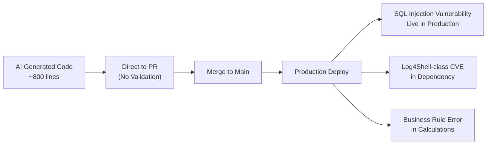

**After Validation Pipeline:**

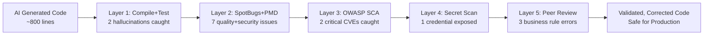

---

### 5.2.11 Questionnaire — Section 5

**Conceptual Questions**

1. Distinguish between SAST, DAST, and SCA. Which of these is most critical for validating AI-generated code at the pre-merge stage, and why?

   *Answer:* **SAST** (Static Application Security Testing) analyzes source code without execution — catches SQL injection patterns, hardcoded credentials, null pointer risks, API misuse. **DAST** (Dynamic Application Security Testing) tests a running application — catches runtime vulnerabilities (authentication bypass, session fixation, XSS in rendered output). **SCA** (Software Composition Analysis) scans dependency trees against vulnerability databases — catches known CVEs in third-party libraries. For AI-generated code at pre-merge: **SAST is most critical** because: (a) code doesn't need to run — catches errors before a deployment environment is needed; (b) AI frequently generates SQL injection patterns and other SAST-detectable vulnerabilities; (c) DAST requires a deployed environment (post-merge concern); (d) **SCA is equally critical** because AI training data cutoffs mean AI recommends vulnerable library versions. The pre-merge gate should run both SAST and SCA.

2. Why does OWASP Dependency-Check sometimes produce false positives, and how do you handle them without lowering your security bar?

   *Answer:* False positives in OWASP Dependency-Check occur because: (a) CVE matching is based on library name/version patterns — some CVEs affect only specific configurations or modules that the project doesn't use; (b) The NVD database occasionally has incorrect version range data; (c) Renamed/shaded JARs may match CVE patterns incorrectly. Handling without lowering the security bar: (1) Create an `owasp-suppressions.xml` file with specific CVE-ID and library-path entries — each suppression must have a human-readable notes field explaining the justification; (2) Each suppression requires approval from the security team; (3) Suppressions have an expiry date (typically 90 days) — forcing re-evaluation; (4) Suppression file is version-controlled and auditable. Never suppress by severity level globally — always suppress specific CVE + specific artifact combinations.

3. What is a "Quality Gate" in SonarQube, and why should AI-generated code have a stricter quality gate than human-written code?

   *Answer:* A **Quality Gate** is a set of threshold-based pass/fail conditions in SonarQube that a code analysis must meet before the code is considered releasable. Standard gates check: coverage ≥ 80%, zero blocker bugs, zero critical vulnerabilities. AI-generated code warrants a **stricter gate** because: (a) AI generates code faster than humans, potentially introducing more issues per unit time; (b) AI code may appear syntactically correct while containing subtle logical errors that only domain review catches; (c) AI models have knowledge cutoffs and may generate deprecated patterns or vulnerable dependencies; (d) Building a culture of high standards for AI output prevents the "it was AI-generated, it's probably fine" cognitive bias; (e) For government systems, regulatory auditors will ask whether AI-generated code was independently validated — a stricter automated gate provides documented evidence.

**Application Questions**

4. Write a custom PMD XPath rule that detects `System.out.println()` calls in Java classes (not test classes). Explain the XPath expression.

   *Answer:*
   ```xml
   <rule name="NoSystemOutPrintln"
         language="java"
         message="Use SLF4J logger instead of System.out.println()"
         class="net.sourceforge.pmd.lang.rule.XPathRule">
       <properties>
           <property name="xpath">
               <value>
               //StatementExpression/PrimaryExpression[
                   PrimaryPrefix/Name[@Image='System.out']
                   and
                   PrimarySuffix[@Image='println' or @Image='print' or @Image='printf']
               ]
               </value>
           </property>
       </properties>
   </rule>
   ```
   XPath explanation: `//StatementExpression` — any statement; `/PrimaryExpression` — a method call expression; `PrimaryPrefix/Name[@Image='System.out']` — where the object is `System.out`; `PrimarySuffix[@Image='println'...]` — and the method is println/print/printf. Test exclusion: handled at PMD configuration level by excluding `**/test/**` paths.

5. You run OWASP Dependency-Check and find `log4j-core:2.14.1` with CVE-2021-44228 (Log4Shell, CVSS 10.0) in a project generated by AI. What immediate actions do you take, and what process change do you implement?

   *Answer:* Immediate actions: (1) **Block the PR** — do not merge under any circumstances; (2) Update `pom.xml`: change `log4j-core` to version 2.17.2 (or remove and use SLF4J with Logback, which is the Spring Boot default and not affected); (3) Run `mvn dependency:tree | Select-String log4j` to check all transitive dependencies for Log4j inclusions; (4) If this code is already deployed anywhere, treat as a critical security incident — notify security team immediately. Process change: (1) Add `log4j-core` to briefing file Anti-Patterns: "Never include log4j-core directly — use SLF4J with Logback (Spring Boot default)"; (2) Add OWASP Dependency-Check to the pre-commit hook (not just CI) so the check runs locally before any push; (3) Add a PMD/Checkstyle rule detecting any import of `org.apache.log4j` in source files; (4) Add CI pipeline step that fails fast on any CVSS ≥ 9.0 finding with an explicit "CRITICAL CVE FOUND" error message.

6. How would you configure JaCoCo to enforce that AI-generated code for a payment processing service achieves at least 85% branch coverage (not just line coverage)?

   *Answer:*
   ```xml
   <execution>
       <id>check-ai-code-coverage</id>
       <phase>verify</phase>
       <goals><goal>check</goal></goals>
       <configuration>
           <rules>
               <rule>
                   <element>BUNDLE</element>
                   <limits>
                       <!-- Branch coverage: 85% minimum for payment services -->
                       <limit>
                           <counter>BRANCH</counter>
                           <value>COVEREDRATIO</value>
                           <minimum>0.85</minimum>
                       </limit>
                       <!-- Also enforce line coverage -->
                       <limit>
                           <counter>LINE</counter>
                           <value>COVEREDRATIO</value>
                           <minimum>0.80</minimum>
                       </limit>
                   </limits>
               </rule>
               <!-- Stricter rule for payment service specifically -->
               <rule>
                   <element>CLASS</element>
                   <includes>
                       <include>gov.state.pension.domain.service.PensionCalculationService</include>
                   </includes>
                   <limits>
                       <limit>
                           <counter>BRANCH</counter>
                           <value>COVEREDRATIO</value>
                           <minimum>0.95</minimum>
                       </limit>
                   </limits>
               </rule>
           </rules>
       </configuration>
   </execution>
   ```
   Branch coverage is more meaningful than line coverage for financial calculation code because it tests all if/else paths in business rule logic — the paths most likely to contain errors in AI-generated code.

**Analysis Questions**

7. An architect argues: "Running all 5 validation layers (compile, SAST, SCA, secret scan, peer review) on AI-generated code adds 45 minutes to each PR cycle. This eliminates the productivity gain of using AI. We should only run SAST." Construct a counter-argument with a risk-cost analysis.

   *Answer:* Counter-argument: (1) **The 45-minute fallacy**: Most of the validation is automated and runs in CI in parallel with other work. The developer's active time is: running `mvn clean verify` (5 min); reviewing the report (10 min); fixing issues and re-prompting (10-15 min). Total developer time: 25-30 minutes, not 45. (2) **The cost of skipping**: A single critical CVE (e.g., Log4Shell-class in a dependency) that reaches production: incident response (8-40 hours); security audit (40-80 hours); regulatory notification under DPDP Act (legal team time); public trust damage (immeasurable). The 45-minute validation prevents this. (3) **SAST-only is insufficient**: SCA catches CVEs that SAST cannot (SCA operates on binaries/versions, not source patterns); secret scanning catches credentials that SAST misses; peer review catches domain logic errors that no automated tool can detect. Removing any layer creates a blind spot. (4) **Productivity gain is still positive**: AI generation + 30-minute validation = 60-75 minutes for a service class. Manual development = 4 hours. Net gain: 3-3.25 hours, even with full validation.

8. Analyze the risk of using AI-generated test cases as the primary validation evidence for AI-generated production code.

   *Answer:* This is a critical circular validation failure: (1) **Correlation bias**: AI generates tests based on the same understanding of requirements as it used to generate production code. If the AI misunderstood a business rule, the production code is wrong AND the test validates the wrong behavior — both pass. (2) **Coverage theater**: AI-generated tests often achieve high line coverage while missing adversarial edge cases (e.g., concurrent modification, exact boundary values, unusual input combinations) that a human tester would design specifically to break the code. (3) **False confidence**: A CI pipeline showing "80% coverage, all tests pass" on AI-generated test + AI-generated code provides less assurance than human-written tests on AI-generated code. (4) **Mitigation**: (a) Human review of test cases is as important as human review of production code — reviewers must verify that tests represent realistic scenarios; (b) Add mutation testing (PIT mutation testing for Java) — if AI tests are superficial, mutation testing will show low mutation score despite high line coverage; (c) Require at least 2-3 human-authored boundary tests per critical service method, regardless of AI coverage.

**Scenario-Based Questions**

9. *Scenario (US — FedRAMP):* A US federal contractor uses AI to generate a CRUD REST API for a benefits management system. The AI generates a controller with `@CrossOrigin(origins = "*")` and `http.csrf().disable()` in the security configuration. The SAST tool flags these as security hotspots but does not fail the build (they are marked as "Security Hotspot — Review Required," not vulnerabilities). How do you handle these findings for a FedRAMP Moderate system?

   *Answer:* For FedRAMP Moderate: (1) `@CrossOrigin(origins = "*")`: This is a **critical finding** for FedRAMP. CORS wildcard allows any origin to make cross-origin requests — this violates FedRAMP control SI-10 (Information Input Validation) and AC-17 (Remote Access). Remediation: Replace with explicit allowed origins: `@CrossOrigin(origins = "${ALLOWED_ORIGINS:https://agency.gov}")`. The environment variable ensures different origins per environment; never "*" in FedRAMP boundary; (2) `http.csrf().disable()`: If the API is stateless (JWT Bearer tokens, no session cookies), CSRF is genuinely not applicable — this is a valid configuration for REST APIs consumed by non-browser clients. Document this decision in the security assessment. If consumed by browser clients with session cookies, CSRF must be enabled with `CookieCsrfTokenRepository.withHttpOnlyFalse()` and SameSite=Strict cookies; (3) Process: Update SonarQube Quality Gate to promote these hotspots from "Review Required" to "Blocking" for any project in the FedRAMP boundary. Security hotspots require documented resolution rationale — not just "reviewed."

10. *Scenario (India — DPDP Act):* An AI assistant generates a Spring Boot exception handler that returns the full exception stack trace in the API response body (e.g., `return ResponseEntity.status(500).body(e.getMessage())`). The SAST tool does not flag this. How does your validation checklist catch this, and what is the correct implementation?

    *Answer:* SAST tools typically do not catch "information disclosure in error responses" because it requires understanding the context of what `e.getMessage()` contains and whether it appears in a response body. This is caught by: (1) **Peer review checklist item**: "Exception messages must not be exposed in API responses — use generic error codes"; (2) **DPDP Act implication**: Stack traces may contain database column names, SQL queries, file paths, class names, and internal architecture — all of which constitute unauthorized disclosure of system information. Under DPDP Act 2023, if the exception message contains any citizen PII (e.g., from a query: "No citizen found with Aadhaar: 1234-5678-9012"), this is a data breach. Correct implementation:
    ```java
    @ExceptionHandler(Exception.class)
    public ResponseEntity<ErrorResponse> handleGenericException(Exception e, 
            HttpServletRequest request) {
        // Log full details internally with trace ID for debugging
        String traceId = UUID.randomUUID().toString();
        log.error("Unhandled exception [traceId={}]: {}", traceId, e.getMessage(), e);
        // Return only safe, generic error to API consumer
        return ResponseEntity.status(HttpStatus.INTERNAL_SERVER_ERROR)
                .body(new ErrorResponse("INTERNAL_ERROR", 
                        "An unexpected error occurred. Reference: " + traceId));
        // Never expose: e.getMessage(), e.getStackTrace(), e.getCause()
    }
    ```

---

### 5.2.12 Food for Thought — Section 5

> **Provocation:**
> The validation pipeline described in this section is robust — but it assumes you *know* what to validate. The most dangerous AI code failures are not SQL injection (which SAST catches) or outdated dependencies (which SCA catches). They are **subtle business logic errors** — a pension formula that calculates correctly 99.9% of the time but fails for edge cases affecting widowed pensioners, or a grant eligibility algorithm that correctly implements the stated rule but was trained on a misinterpretation of the regulation.
>
> **Question:** No automated tool catches "AI correctly implemented the wrong requirement." What architectural controls, development processes, and governance mechanisms would you put in place to catch this class of error before it affects citizens?
>
> **Suggested AI Prompt (a meta-prompt experiment):** Ask Copilot: "What are the categories of software errors that automated testing and static analysis provably cannot detect?" Then design one process control for each category it identifies.

---

# DAY 8 — THEORY DOCUMENT: COMPLETE

---

## Document Summary

| Section | Topic                                                              | Duration | Status   |
| ------- | ------------------------------------------------------------------ | -------- | -------- |
| 1       | Infrastructure & Storage Sizing: Cost/Performance Trade-offs       | 1.0 hr   | Complete |
| 2       | Accelerated Migration Planning Workshop with Risk Assessment       | 1.0 hr   | Complete |
| 3       | Prompt Engineering Templates for Architecture, Code, Tests         | 1.0 hr   | Complete |
| 4       | Vibe Coding with AI: Iterative Refinement                          | 1.0 hr   | Complete |
| 5       | Code Validation: Static Analysis, Unit Test Gen, Security Scanning | 1.0 hr   | Complete |

**Total Theory Coverage:** 5.0 hours instructional content + Q&A buffer = 6.0-6.5 hours

---

**Day 8 Theory Document is complete.**