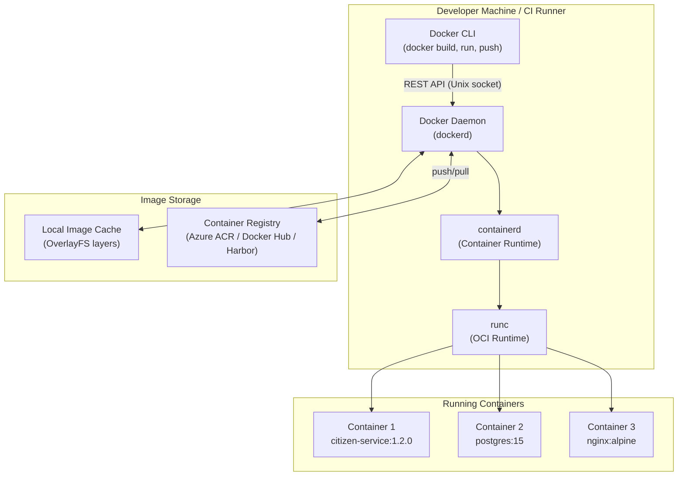
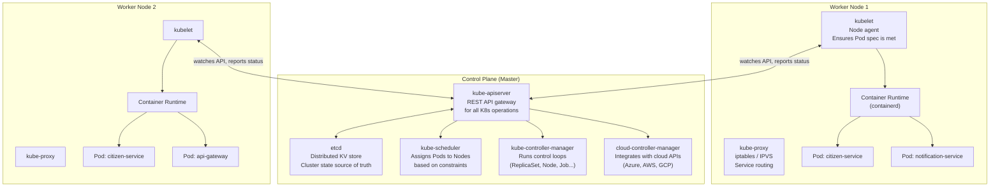
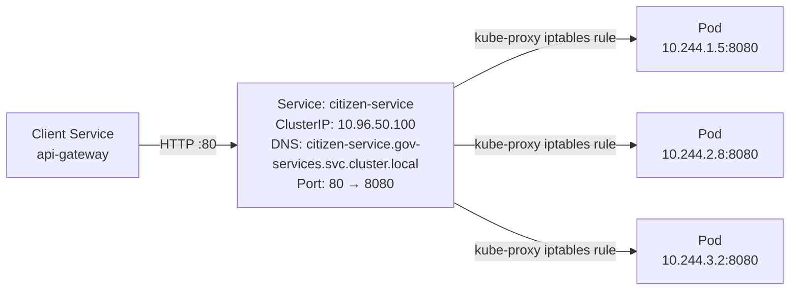
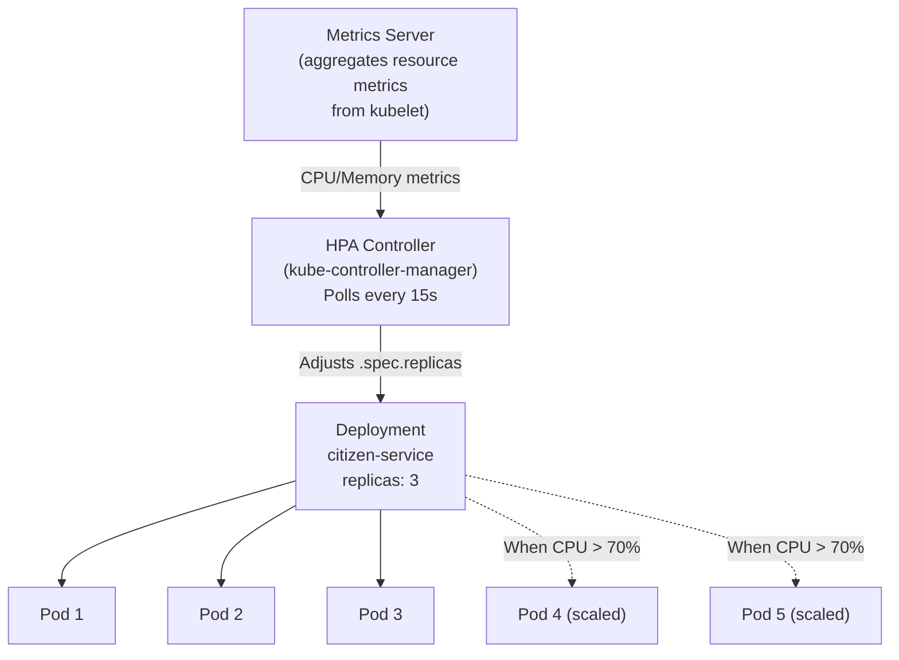
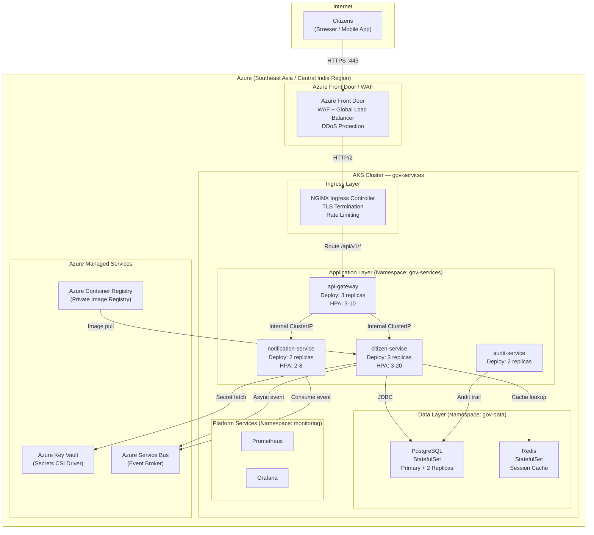
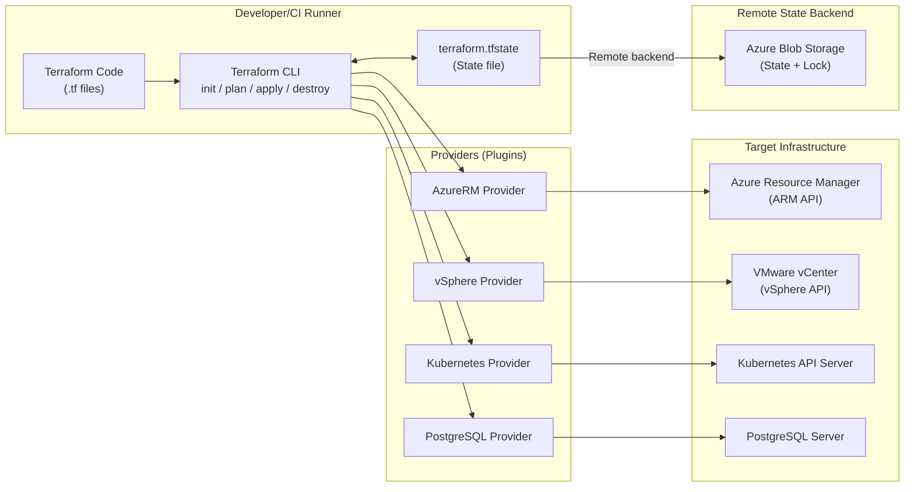
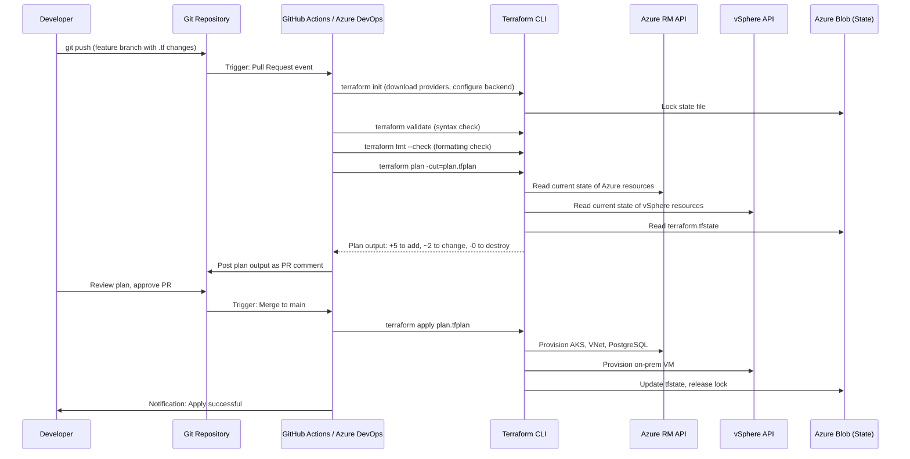
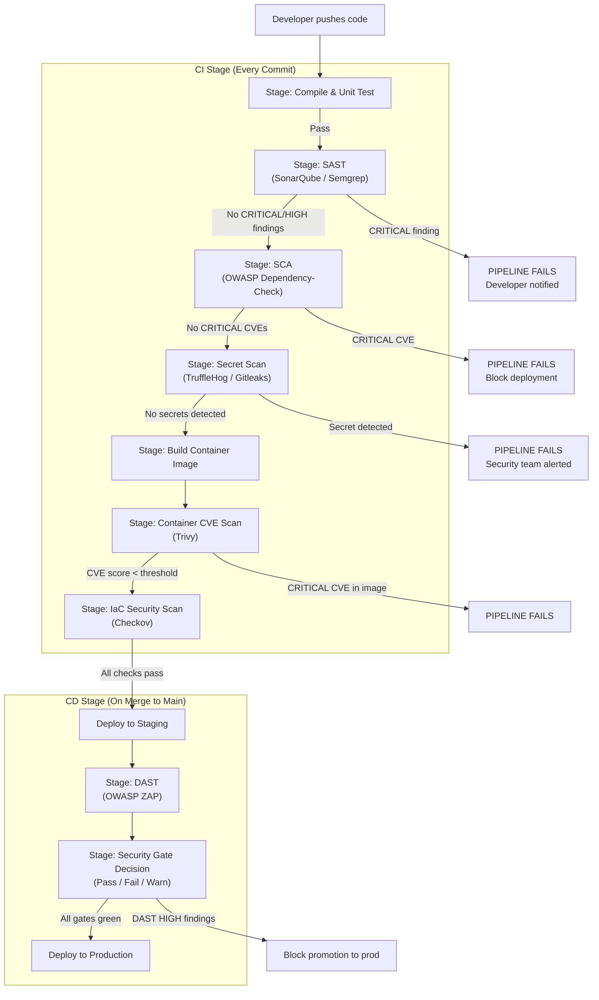

# Step 1: Summary of Understanding

---

# DAY 10 — THEORY DOCUMENT
## DevSecOps, Deployment & Excellence
### Containerization, IaC & Hybrid Deployment | DevSecOps & Secure CI/CD Pipelines

---

```
╔══════════════════════════════════════════════════════════════════════════════════╗
║           ENTERPRISE ARCHITECTURE TRAINING SERIES — DAY 10                     ║
║           CONTAINERIZATION, IaC, HYBRID DEPLOYMENT & SHIFT-LEFT SECURITY       ║
║           Trainer's Bible | Handbook | Reference | Guide                        ║
╚══════════════════════════════════════════════════════════════════════════════════╝
```

---

## Document Metadata

| Field         | Value                                                                            |
| ------------- | -------------------------------------------------------------------------------- |
| Day           | 10 of 12                                                                         |
| Module        | DevSecOps, Deployment & Excellence                                               |
| Duration      | 6-8 hours                                                                        |
| Audience      | Senior Software Engineers (4-10+ years)                                          |
| Trainer Role  | Architect-level facilitator                                                      |
| Prerequisites | Days 1-9 completed; familiarity with Linux CLI, YAML, basic networking           |
| Tech Stack    | Docker Desktop, Kubernetes, Terraform, Azure Free Tier, PowerShell, Java 17, Git |

---

## Day 10 Learning Objectives

By the end of this day, participants will be able to:

1. Package a production-grade microservice using multi-stage Dockerfiles with security hardening
2. Deploy, scale, and perform rolling updates on Kubernetes using Pods, Services, Deployments, and HPA (Horizontal Pod Autoscaler)
3. Author Terraform modules to provision hybrid infrastructure spanning on-premises and Azure cloud
4. Understand and articulate Shift-Left Security as an architectural practice, not a tooling afterthought
5. Map SAST (Static Application Security Testing), DAST (Dynamic Application Security Testing), and SCA (Software Composition Analysis) to phases in a CI/CD pipeline
6. Integrate a basic security scan gate into a CI/CD pipeline

---

## Day 10 Agenda

| Time Block    | Topic                                                 | Duration |
| ------------- | ----------------------------------------------------- | -------- |
| 09:00 - 09:15 | Recap of Days 1-9, Day 10 Orientation                 | 15 min   |
| 09:15 - 11:15 | Docker Deep Dive & Kubernetes Essentials              | 2.0 hrs  |
| 11:15 - 11:30 | Break                                                 | 15 min   |
| 11:30 - 13:00 | Terraform for Hybrid Infrastructure                   | 1.5 hrs  |
| 13:00 - 14:00 | Lunch                                                 | 1 hr     |
| 14:00 - 14:30 | Introduction to Shift-Left Security                   | 0.5 hrs  |
| 14:30 - 15:00 | Shift-Left Tools Overview & Pipeline Integration      | 0.5 hrs  |
| 15:00 - 15:15 | Break                                                 | 15 min   |
| 15:15 - 16:30 | Lab: Containerise, Deploy to K8s, HPA, Rolling Update | 1.25 hrs |
| 16:30 - 17:00 | Questionnaire, Feedback, Food for Thought             | 30 min   |

---

---

# SECTION 1: DOCKER DEEP DIVE & KUBERNETES ESSENTIALS

## 1.1 Opening Concept — Why Containers Changed Everything

### The Problem Before Containers

Cast your mind back to a pre-container world. A senior developer in a large Indian government bank writes a Java service that works perfectly on their local Windows machine. The QA team runs it on Red Hat Enterprise Linux 7. Production runs RHEL 8 with a different JDK patch version. The result: a classic "works on my machine" failure in production at 2 AM during tax-return processing season.

The fundamental problem was **environment mutability** — the runtime environment was not a versioned, immutable artefact. It was assembled by hand, documented in a 40-page Word document titled "Deployment Guide v3.2 FINAL FINAL (2).docx".

Containers solve this at the infrastructure layer by packaging not just the application binary but the **entire runtime environment** — OS libraries, JVM, configuration, dependencies — into a single immutable image. The image becomes a deployable unit that behaves identically across developer laptops, CI pipelines, staging, and production.

### What a Container Actually Is

A container is **not** a Virtual Machine (VM). This distinction matters architecturally.

```
┌─────────────────────────────────────────────────────────────────┐
│                     VIRTUAL MACHINE MODEL                        │
│                                                                   │
│  ┌───────────┐  ┌───────────┐  ┌───────────┐                    │
│  │  App A    │  │  App B    │  │  App C    │                    │
│  │  JVM      │  │  Python   │  │  Node     │                    │
│  │  Libs     │  │  Libs     │  │  Libs     │                    │
│  │  Guest OS │  │  Guest OS │  │  Guest OS │                    │
│  │  (4GB RAM)│  │  (4GB RAM)│  │  (4GB RAM)│                    │
│  └───────────┘  └───────────┘  └───────────┘                    │
│  ─────────────────────────────────────────────────────          │
│                   Hypervisor (Type 1 or Type 2)                  │
│  ─────────────────────────────────────────────────────          │
│                        Host OS                                    │
│                        Hardware                                   │
└─────────────────────────────────────────────────────────────────┘

┌─────────────────────────────────────────────────────────────────┐
│                     CONTAINER MODEL                              │
│                                                                   │
│  ┌───────────┐  ┌───────────┐  ┌───────────┐                    │
│  │  App A    │  │  App B    │  │  App C    │                    │
│  │  JVM      │  │  Python   │  │  Node     │                    │
│  │  Libs     │  │  Libs     │  │  Libs     │                    │
│  └───────────┘  └───────────┘  └───────────┘                    │
│  ─────────────────────────────────────────────────────          │
│              Container Runtime (Docker / containerd)             │
│  ─────────────────────────────────────────────────────          │
│                        Host OS Kernel                             │
│                        Hardware                                   │
└─────────────────────────────────────────────────────────────────┘
```

**Key Technical Difference:**
- VMs virtualise **hardware**; each VM has its own OS kernel (heavy, slow to start, GBs of overhead)
- Containers virtualise the **OS process space**; they share the host kernel using Linux **namespaces** (for isolation) and **cgroups** (for resource limiting), making them lightweight (MBs) and fast to start (milliseconds)

### Linux Primitives Underpinning Containers

| Primitive                         | Purpose                | Container Usage                                                          |
| --------------------------------- | ---------------------- | ------------------------------------------------------------------------ |
| **Namespaces**                    | Process isolation      | Each container has its own PID, network, mount, UTS, IPC, user namespace |
| **cgroups (Control Groups)**      | Resource quotas        | CPU, memory, disk I/O limits per container                               |
| **Union File System (OverlayFS)** | Layered image storage  | Efficient image sharing; copy-on-write for container writeable layer     |
| **seccomp**                       | Syscall filtering      | Block dangerous kernel calls from inside containers                      |
| **capabilities**                  | Fine-grained privilege | Drop unneeded root capabilities (e.g., NET_ADMIN, SYS_ADMIN)             |

> **For the SA/EA audience:** Containers are a **packaging and isolation primitive**, not a security boundary. The kernel is shared. Container escape vulnerabilities (e.g., CVE-2019-5736, runC vulnerability) exist. Never treat container isolation as equivalent to VM isolation for multi-tenant hostile environments.

---

## 1.2 Docker Architecture — Deep Dive

### Docker Component Architecture



**Flow explanation:**
1. `docker build` sends build context to `dockerd`
2. `dockerd` delegates to `containerd` for image layer management
3. `containerd` invokes `runc` (OCI-compliant runtime) to create the container process
4. The container process runs in isolated namespaces with cgroup limits applied

### Docker Image Layering — How OverlayFS Works

```
┌─────────────────────────────────────────┐
│      Container Writeable Layer          │  <-- Ephemeral, lost on stop
│      (copy-on-write from lower layers)  │
├─────────────────────────────────────────┤
│      Layer 4: ADD app.jar               │  <-- Application binary
├─────────────────────────────────────────┤
│      Layer 3: RUN mvn package           │  <-- Build output
├─────────────────────────────────────────┤
│      Layer 2: COPY pom.xml + src        │  <-- Source
├─────────────────────────────────────────┤
│      Layer 1: FROM eclipse-temurin:17   │  <-- Base JDK image
└─────────────────────────────────────────┘

Each layer is a SHA256-addressed, content-addressed, immutable blob.
Layers are SHARED across images that share a base — massive disk savings.
```

**Why this matters architecturally:**
- If 10 microservices use `eclipse-temurin:17-jre-alpine` as base, that layer is stored **once**
- Only the application-specific layers differ — efficient storage, efficient transfer
- Layer order in Dockerfile directly impacts **cache invalidation** — a critical build-time performance concern

---

## 1.3 Production-Grade Dockerfile — Multi-Stage Builds

### The Naive Dockerfile (What NOT to Do)

```dockerfile
# BAD: Single stage — ships build tools, source code, secrets into production image
FROM eclipse-temurin:17-jdk
WORKDIR /app
COPY . .
RUN apt-get install -y maven
RUN mvn package
EXPOSE 8080
CMD ["java", "-jar", "target/citizen-service.jar"]
```

**Problems with this approach:**
1. Image size: ~800MB (includes full JDK, Maven, source code, test dependencies)
2. Attack surface: Build tools (Maven, apt) are unnecessary in production
3. Source code exposure: `src/` is inside the production image
4. Secrets risk: If `.env` or `application.properties` is in context, it gets baked in
5. No non-root user: Runs as root by default — violates principle of least privilege

### Production Multi-Stage Dockerfile

```dockerfile
# ═══════════════════════════════════════════════════════════════
# STAGE 1: BUILD STAGE
# Purpose: Compile, test, package the application
# This stage is discarded — NOT shipped to production
# ═══════════════════════════════════════════════════════════════
FROM eclipse-temurin:17-jdk-alpine AS builder

# Set build working directory
WORKDIR /build

# LAYER CACHE OPTIMISATION: Copy dependency manifests first
# Maven downloads deps only when pom.xml changes, not on every src change
COPY pom.xml .
COPY mvnw .
COPY .mvn .mvn

# Download dependencies (cached layer — only re-runs when pom.xml changes)
RUN ./mvnw dependency:go-offline -B

# Copy source code (this layer invalidates only when src changes)
COPY src ./src

# Build and test — skip integration tests for CI speed (run separately)
RUN ./mvnw package -DskipTests=false -B

# ═══════════════════════════════════════════════════════════════
# STAGE 2: RUNTIME STAGE
# Purpose: Minimal, hardened production image
# Only the compiled JAR and JRE are included
# ═══════════════════════════════════════════════════════════════
FROM eclipse-temurin:17-jre-alpine AS runtime

# Security: Create non-root user and group
# UID 10001 is in the non-system, non-privileged range
RUN addgroup -S appgroup && adduser -S appuser -G appgroup -u 10001

# Security: Upgrade OS packages to patch known CVEs in base image
RUN apk upgrade --no-cache

# Security: Remove package manager to reduce attack surface
# (apk is still available via shell — this removes the cache, not apk itself)
RUN rm -rf /var/cache/apk/*

WORKDIR /app

# Copy ONLY the built JAR from the builder stage
# Note: Nothing from src/, pom.xml, .m2 cache reaches this image
COPY --from=builder /build/target/citizen-service-*.jar citizen-service.jar

# Security: Ensure appuser owns the app directory
RUN chown -R appuser:appgroup /app

# Switch to non-root user
USER appuser

# JVM tuning for containers:
# UseContainerSupport: Respects cgroup memory limits (JDK 10+, backported to JDK 8u191)
# MaxRAMPercentage: Use 75% of container memory for heap
# ExitOnOutOfMemoryError: Crash fast — let K8s restart rather than limp on OOM
ENV JAVA_OPTS="-XX:+UseContainerSupport \
               -XX:MaxRAMPercentage=75.0 \
               -XX:+ExitOnOutOfMemoryError \
               -Djava.security.egd=file:/dev/./urandom"

# Document exposed port (informational — does not publish)
EXPOSE 8080

# Health check: Docker engine monitors container health
# K8s ignores HEALTHCHECK in favour of liveness/readiness probes
HEALTHCHECK --interval=30s --timeout=3s --start-period=60s --retries=3 \
    CMD wget --no-verbose --tries=1 --spider http://localhost:8080/actuator/health || exit 1

# Use exec form (not shell form) to ensure signals propagate correctly
# Shell form: CMD java -jar ... --> runs as /bin/sh -c, PID 1 is shell, not Java
# Exec form: CMD ["java",...] --> Java is PID 1, receives SIGTERM directly
ENTRYPOINT ["sh", "-c", "java $JAVA_OPTS -jar citizen-service.jar"]
```

### Build and Verify

```powershell
# Build the image with a semantic version tag
docker build -t citizen-service:1.0.0 --target runtime .

# Inspect image layers — verify no source code or build tools leaked
docker history citizen-service:1.0.0

# Check image size — should be ~180-220MB for a JRE-based service
docker images citizen-service

# Security scan: Scan for known CVEs in image layers
# (Using Docker Scout or Trivy — see Shift-Left Security section)
docker scout cves citizen-service:1.0.0
```

**Expected output comparison:**

| Approach                    | Image Size | CVE Surface | Secrets Risk |
| --------------------------- | ---------- | ----------- | ------------ |
| Single-stage with JDK       | ~750MB     | High        | High         |
| Multi-stage with JRE        | ~180MB     | Medium      | None         |
| Multi-stage with distroless | ~120MB     | Low         | None         |

> **Distroless images** (from Google): No shell, no package manager, no OS utilities. Maximum security. Tradeoff: debugging is significantly harder — no `sh` to exec into. Use for production, keep a debug variant for incident response.

---

## 1.4 Container Security Hardening — Non-Negotiable Practices

### Security Checklist for Enterprise/Government Containers

```
CONTAINER SECURITY POSTURE CHECKLIST
━━━━━━━━━━━━━━━━━━━━━━━━━━━━━━━━━━━━

[ ] Run as non-root user (UID > 10000)
[ ] Read-only root filesystem (--read-only flag)
[ ] No privileged mode (--privileged=false)
[ ] Drop all Linux capabilities, add back only what is needed
[ ] No host network mode
[ ] No host PID namespace
[ ] Pinned base image tags (never use :latest in production)
[ ] Base image from approved internal registry (not public Docker Hub)
[ ] CVE scan integrated in CI pipeline (fail build on CRITICAL CVEs)
[ ] No secrets in Dockerfile ENV or ARG (use K8s Secrets / Vault)
[ ] HEALTHCHECK defined
[ ] Image signed (Docker Content Trust / Cosign)
```

### Capability Dropping in Practice

```dockerfile
# In Kubernetes manifest (preferred over Dockerfile):
securityContext:
  runAsNonRoot: true
  runAsUser: 10001
  readOnlyRootFilesystem: true
  allowPrivilegeEscalation: false
  capabilities:
    drop:
      - ALL
    add:
      - NET_BIND_SERVICE  # Only if service binds to port < 1024
```

---

## 1.5 Kubernetes Essentials — Architecture First

### Why Kubernetes?

Containers alone solve the **packaging problem**. Kubernetes (K8s) solves the **orchestration problem**:
- Where do containers run when you have 100 VMs/nodes?
- What happens when a container crashes?
- How do you scale from 2 instances to 20 when traffic spikes?
- How do you update 50 running instances without downtime?
- How do services discover each other?

K8s is the answer to all of these. It is an **open-source container orchestration platform** originally developed by Google, now a CNCF (Cloud Native Computing Foundation) graduated project.

### Kubernetes Architecture



### Control Plane Components Explained

| Component                   | Role                                                                               | Government Analogy                                                       |
| --------------------------- | ---------------------------------------------------------------------------------- | ------------------------------------------------------------------------ |
| **kube-apiserver**          | Central REST API — all CRUD operations on K8s objects go through here              | The Central Registry Office — all applications go through one counter    |
| **etcd**                    | Distributed, strongly consistent KV store — the cluster's ground truth             | The official government gazette — authoritative record                   |
| **kube-scheduler**          | Picks the right node for each Pod based on resources, affinity, taints/tolerations | HR department assigning work to employees based on skillset and workload |
| **kube-controller-manager** | Runs reconciliation loops — keeps actual state = desired state                     | Compliance officer ensuring rules are followed continuously              |
| **kubelet**                 | Node agent — receives Pod specs, manages container lifecycle on its node           | Field officer implementing headquarters' orders                          |
| **kube-proxy**              | Maintains network rules for Service routing                                        | Network router / traffic cop                                             |

---

## 1.6 Kubernetes Core Objects

### 1.6.1 Pod — The Atomic Unit

A **Pod** is the smallest deployable unit in K8s. It contains one or more containers that:
- Share the same network namespace (same IP, same `localhost`)
- Share the same storage volumes
- Are always co-scheduled on the same node

> **Important:** You almost never create Pods directly. You create Deployments, which create ReplicaSets, which create Pods. Direct Pod creation has no self-healing.

```yaml
# pod.yaml — Direct Pod (for learning only, not production)
apiVersion: v1
kind: Pod
metadata:
  name: citizen-service-pod
  namespace: gov-services
  labels:
    app: citizen-service
    version: "1.0.0"
    tier: backend
spec:
  containers:
    - name: citizen-service
      image: citizenregistry.azurecr.io/citizen-service:1.0.0
      ports:
        - containerPort: 8080
      resources:
        requests:
          memory: "256Mi"
          cpu: "250m"       # 250 millicores = 0.25 CPU core
        limits:
          memory: "512Mi"
          cpu: "500m"
      # Liveness probe: Is the container alive? Restart if not.
      livenessProbe:
        httpGet:
          path: /actuator/health/liveness
          port: 8080
        initialDelaySeconds: 60   # Give JVM time to start
        periodSeconds: 10
        failureThreshold: 3
      # Readiness probe: Is the container ready to receive traffic? Remove from LB if not.
      readinessProbe:
        httpGet:
          path: /actuator/health/readiness
          port: 8080
        initialDelaySeconds: 30
        periodSeconds: 5
        failureThreshold: 3
      env:
        - name: SPRING_PROFILES_ACTIVE
          value: "kubernetes"
        - name: DB_PASSWORD
          valueFrom:
            secretKeyRef:
              name: citizen-db-secret
              key: password
      securityContext:
        runAsNonRoot: true
        runAsUser: 10001
        readOnlyRootFilesystem: true
        allowPrivilegeEscalation: false
        capabilities:
          drop:
            - ALL
```

### Resource Requests vs. Limits — Critical for Production

```
REQUESTS: What the container is GUARANTEED (used for scheduling decisions)
LIMITS:   What the container can MAXIMUM use (enforced by cgroups)

CPU Throttling:   When container exceeds CPU limit → throttled (slowed down), NOT killed
Memory Eviction:  When container exceeds memory limit → OOMKilled (killed immediately)

If Requests == Limits → QoS class: Guaranteed (best for production, reserved resources)
If Requests < Limits  → QoS class: Burstable (allow burst, may be evicted under pressure)
If No Requests/Limits → QoS class: BestEffort (first to be evicted)
```

> **For government workloads**: Always set both requests and limits. BestEffort pods are evicted first during node pressure — unacceptable for citizen-facing services.

### 1.6.2 Deployment — Desired State Management

```yaml
# deployment.yaml — Production-grade Deployment
apiVersion: apps/v1
kind: Deployment
metadata:
  name: citizen-service
  namespace: gov-services
  labels:
    app: citizen-service
    managed-by: terraform    # Infrastructure traceability
spec:
  replicas: 3               # Desired number of Pod replicas
  
  # Selector: How the Deployment identifies its Pods
  selector:
    matchLabels:
      app: citizen-service
  
  # Rolling Update Strategy: Zero-downtime deployments
  strategy:
    type: RollingUpdate
    rollingUpdate:
      maxSurge: 1           # Create 1 extra Pod beyond desired during update
      maxUnavailable: 0     # Never take down existing Pods before new ones are ready
                            # With 3 replicas: update proceeds 1-at-a-time
  
  template:
    metadata:
      labels:
        app: citizen-service
        version: "1.0.0"
    spec:
      # Topology constraint: Spread Pods across availability zones
      topologySpreadConstraints:
        - maxSkew: 1
          topologyKey: topology.kubernetes.io/zone
          whenUnsatisfiable: DoNotSchedule
          labelSelector:
            matchLabels:
              app: citizen-service
      
      # Pod Disruption Budget alignment: ensure graceful termination
      terminationGracePeriodSeconds: 60
      
      containers:
        - name: citizen-service
          image: citizenregistry.azurecr.io/citizen-service:1.0.0
          imagePullPolicy: Always   # Always pull in production to catch registry updates
          
          ports:
            - name: http
              containerPort: 8080
            - name: management
              containerPort: 8081   # Separate management port for actuator
          
          resources:
            requests:
              memory: "256Mi"
              cpu: "250m"
            limits:
              memory: "512Mi"
              cpu: "500m"
          
          livenessProbe:
            httpGet:
              path: /actuator/health/liveness
              port: 8081
            initialDelaySeconds: 60
            periodSeconds: 10
            failureThreshold: 3
            
          readinessProbe:
            httpGet:
              path: /actuator/health/readiness
              port: 8081
            initialDelaySeconds: 30
            periodSeconds: 5
            failureThreshold: 3
          
          # Lifecycle hook: Drain in-flight requests before shutdown
          lifecycle:
            preStop:
              exec:
                command: ["sh", "-c", "sleep 5"]  # Allow LB to remove Pod from rotation
          
          envFrom:
            - configMapRef:
                name: citizen-service-config
          
          env:
            - name: DB_PASSWORD
              valueFrom:
                secretKeyRef:
                  name: citizen-db-secret
                  key: password
          
          securityContext:
            runAsNonRoot: true
            runAsUser: 10001
            readOnlyRootFilesystem: true
            allowPrivilegeEscalation: false
            capabilities:
              drop: [ALL]
          
          # Ephemeral writable volume for temp files (since root FS is read-only)
          volumeMounts:
            - name: tmp-dir
              mountPath: /tmp
      
      volumes:
        - name: tmp-dir
          emptyDir: {}
      
      imagePullSecrets:
        - name: acr-pull-secret
```

### 1.6.3 Service — Stable Network Identity

Pods are ephemeral — they come and go, their IP addresses change. A **Service** provides a stable virtual IP (ClusterIP) and DNS name that routes traffic to matching Pods via label selectors.



**Service Types:**

```yaml
# ClusterIP (default) — Internal only, accessible within cluster
apiVersion: v1
kind: Service
metadata:
  name: citizen-service
  namespace: gov-services
spec:
  type: ClusterIP
  selector:
    app: citizen-service      # Routes to all Pods with this label
  ports:
    - name: http
      protocol: TCP
      port: 80                # Service port (what clients call)
      targetPort: 8080        # Container port (where app listens)
    - name: management
      protocol: TCP
      port: 8081
      targetPort: 8081

---
# NodePort — Exposes on each node's IP:NodePort (30000-32767)
# Use case: On-premises clusters without cloud load balancer
spec:
  type: NodePort
  ports:
    - port: 80
      targetPort: 8080
      nodePort: 30080     # Fixed port on every node

---
# LoadBalancer — Provisions cloud LB (Azure LB, AWS ELB)
# In government: Usually fronted by an API Gateway or WAF
spec:
  type: LoadBalancer
  ports:
    - port: 443
      targetPort: 8080
```

### 1.6.4 ConfigMap and Secret — Externalise Configuration

```yaml
# configmap.yaml — Non-sensitive configuration
apiVersion: v1
kind: ConfigMap
metadata:
  name: citizen-service-config
  namespace: gov-services
data:
  SPRING_PROFILES_ACTIVE: "kubernetes"
  APP_MAX_CONNECTIONS: "100"
  CACHE_TTL_SECONDS: "300"
  LOG_LEVEL: "INFO"

---
# secret.yaml — Sensitive values (base64-encoded, NOT encrypted by default)
# In production: Use Azure Key Vault CSI driver or External Secrets Operator
apiVersion: v1
kind: Secret
metadata:
  name: citizen-db-secret
  namespace: gov-services
type: Opaque
data:
  # echo -n 'S3cur3P@ssw0rd' | base64
  password: UzNjdXIzUEBzc3cwcmQ=
  username: Y2l0aXplbl9zdmM=
```

> **Security Note for Government Systems:** Kubernetes Secrets are base64-encoded, not encrypted at rest by default. Mandatory security requirements:
> 1. Enable **etcd encryption at rest** (EncryptionConfiguration)
> 2. Use **Azure Key Vault with CSI driver** or **HashiCorp Vault** to inject secrets
> 3. Use **RBAC** to restrict `get/list` on Secret objects to service accounts only
> 4. Enable **audit logging** on Secret access

---

## 1.7 Horizontal Pod Autoscaler (HPA) — Scaling Under Load

### HPA Architecture



### HPA Manifest

```yaml
# hpa.yaml — Horizontal Pod Autoscaler
apiVersion: autoscaling/v2
kind: HorizontalPodAutoscaler
metadata:
  name: citizen-service-hpa
  namespace: gov-services
spec:
  scaleTargetRef:
    apiVersion: apps/v1
    kind: Deployment
    name: citizen-service
  
  minReplicas: 3      # Never scale below 3 (HA baseline)
  maxReplicas: 20     # Never scale above 20 (cost control + capacity ceiling)
  
  metrics:
    # CPU-based scaling: scale when average CPU across Pods > 70%
    - type: Resource
      resource:
        name: cpu
        target:
          type: Utilization
          averageUtilization: 70
    
    # Memory-based scaling
    - type: Resource
      resource:
        name: memory
        target:
          type: Utilization
          averageUtilization: 80
    
    # Custom metric: Scale based on HTTP requests per second (from Prometheus)
    # Requires: Prometheus Adapter installed in cluster
    - type: Pods
      pods:
        metric:
          name: http_requests_per_second
        target:
          type: AverageValue
          averageValue: "100"   # Scale when avg RPS per Pod > 100
  
  behavior:
    # Scale-up: Fast response to traffic spikes
    scaleUp:
      stabilizationWindowSeconds: 0    # Scale up immediately
      policies:
        - type: Pods
          value: 4                     # Add max 4 Pods per period
          periodSeconds: 60
    
    # Scale-down: Slow retraction to avoid flapping
    scaleDown:
      stabilizationWindowSeconds: 300  # Wait 5 minutes before scaling down
      policies:
        - type: Percent
          value: 25                    # Remove max 25% of Pods per period
          periodSeconds: 60
```

### HPA Scaling Algorithm

```
Desired Replicas = ceil( currentReplicas × (currentMetricValue / desiredMetricValue) )

Example:
  currentReplicas = 3
  currentCPUUtilization = 105%
  desiredCPUUtilization = 70%
  
  desiredReplicas = ceil( 3 × (105 / 70) ) = ceil( 3 × 1.5 ) = ceil(4.5) = 5

K8s will scale to 5 replicas.
```

### Scale-Down Cooldown (Stabilisation Window)

A critical real-world consideration: without a stabilisation window, a traffic spike that causes scale-up followed by a brief lull could cause immediate scale-down, only for traffic to spike again — a **flapping** pattern that wastes resources and causes latency spikes. The `scaleDown.stabilizationWindowSeconds` prevents this.

---

## 1.8 Rolling Updates and Rollback

### How Rolling Updates Work

With `maxSurge: 1` and `maxUnavailable: 0` on 3 replicas:

```
INITIAL STATE:
  Pod-1 (v1.0.0) RUNNING
  Pod-2 (v1.0.0) RUNNING
  Pod-3 (v1.0.0) RUNNING

STEP 1: Create new Pod (surge)
  Pod-1 (v1.0.0) RUNNING
  Pod-2 (v1.0.0) RUNNING
  Pod-3 (v1.0.0) RUNNING
  Pod-4 (v1.1.0) PENDING → RUNNING (readiness probe passes)

STEP 2: Terminate oldest Pod
  Pod-1 (v1.0.0) TERMINATING (preStop hook + graceful drain)
  Pod-2 (v1.0.0) RUNNING
  Pod-3 (v1.0.0) RUNNING
  Pod-4 (v1.1.0) RUNNING

STEP 3: Repeat for Pod-2, then Pod-3
  ...

FINAL STATE:
  Pod-4 (v1.1.0) RUNNING
  Pod-5 (v1.1.0) RUNNING
  Pod-6 (v1.1.0) RUNNING
```

Traffic is never interrupted because at least 3 Pods are always serving.

### Commands for Update and Rollback

```powershell
# Deploy new version
kubectl set image deployment/citizen-service `
    citizen-service=citizenregistry.azurecr.io/citizen-service:1.1.0 `
    --namespace=gov-services

# Watch rollout progress
kubectl rollout status deployment/citizen-service --namespace=gov-services

# View rollout history
kubectl rollout history deployment/citizen-service --namespace=gov-services

# Rollback to previous version (immediate)
kubectl rollout undo deployment/citizen-service --namespace=gov-services

# Rollback to specific revision
kubectl rollout undo deployment/citizen-service --to-revision=2 --namespace=gov-services
```

---

## 1.9 Kubernetes Networking — What the SA Needs to Know

### Pod-to-Pod Communication

Every Pod gets a unique IP from the **Pod CIDR** (e.g., `10.244.0.0/16`). All Pods can communicate with all other Pods without NAT (K8s networking model requirement fulfilled by CNI plugins: Calico, Flannel, Azure CNI).

### DNS in Kubernetes

K8s runs CoreDNS in-cluster. Service discovery is via DNS:

```
Service DNS pattern:
  <service-name>.<namespace>.svc.cluster.local

Example:
  citizen-service.gov-services.svc.cluster.local → resolves to 10.96.50.100

Short-form (within same namespace):
  citizen-service → resolves to same IP
```

### Network Policies — Micro-Segmentation

Default K8s behaviour: all Pods can talk to all Pods (flat network). In government environments, this is unacceptable. **NetworkPolicy** enforces L3/L4 micro-segmentation.

```yaml
# networkpolicy.yaml — Allow only api-gateway to reach citizen-service
apiVersion: networking.k8s.io/v1
kind: NetworkPolicy
metadata:
  name: citizen-service-ingress-policy
  namespace: gov-services
spec:
  podSelector:
    matchLabels:
      app: citizen-service    # This policy applies TO citizen-service Pods
  
  policyTypes:
    - Ingress
    - Egress
  
  ingress:
    - from:
        - podSelector:
            matchLabels:
              app: api-gateway   # Only allow ingress FROM api-gateway Pods
      ports:
        - protocol: TCP
          port: 8080
  
  egress:
    - to:
        - podSelector:
            matchLabels:
              app: postgres       # Allow egress TO postgres only
      ports:
        - protocol: TCP
          port: 5432
    - to:
        - namespaceSelector:
            matchLabels:
              kubernetes.io/metadata.name: kube-system  # Allow DNS resolution
      ports:
        - protocol: UDP
          port: 53
```

> **Architectural Note:** NetworkPolicy is only enforced if the CNI plugin supports it (Calico, Cilium — yes; Flannel — no). Azure AKS with Azure CNI supports NetworkPolicy. Always verify.

---

## 1.10 High-Level Design — Government Citizen Service on Kubernetes



**Why this design:**
- Azure Front Door + WAF: DDoS and L7 protection before traffic enters the cluster — government services are high-value targets
- HPA configured separately per service: notification-service scales differently than citizen-service
- Namespaces for isolation: NetworkPolicy enforcement at namespace boundary
- Azure Key Vault CSI: Secrets never stored in etcd; fetched at Pod startup from KV
- StatefulSet for databases: Stable Pod names, stable storage, ordered startup/shutdown — required for master-replica replication

**Alternatives considered and rejected:**

| Alternative                  | Reason Rejected                                                                                                     |
| ---------------------------- | ------------------------------------------------------------------------------------------------------------------- |
| Self-managed K8s on VMs      | Operational burden: etcd management, upgrades, certificate rotation. AKS handles this.                              |
| Docker Compose in production | No auto-scaling, no self-healing, no multi-node scheduling. Acceptable only for dev.                                |
| AWS EKS                      | Government data sovereignty mandates Azure in many India/Singapore contexts. Evaluated but ruled out by compliance. |
| Nomad by HashiCorp           | Simpler but less ecosystem support, less tooling, less community. K8s is the de facto standard.                     |

---

## 1.11 What Happens Without Proper K8s Configuration — A Real Failure Pattern

**Scenario:** A government payment gateway (anonymised) was deployed to K8s without resource limits. A traffic surge during a subsidy disbursement event caused one service to consume all memory on a node. The kubelet triggered node-pressure eviction, terminating all Pods on that node including unrelated services. The team had no pod disruption budgets, no HPA, and no topology spread constraints. All three replicas happened to land on the same node. Complete outage.

**Root causes:**
1. No resource limits → OOM cascade
2. No PodDisruptionBudget → eviction took all replicas simultaneously
3. No topologySpreadConstraints → all replicas co-located on one node
4. No readiness probes → replacement Pods received traffic before ready

**Mitigation applied:**
1. Set `requests` and `limits` on all containers
2. Added `PodDisruptionBudget` with `minAvailable: 2`
3. Added `topologySpreadConstraints` across zones
4. Added proper liveness and readiness probes with `initialDelaySeconds`

> **Food for Thought:** Look into **VPA (Vertical Pod Autoscaler)** — it recommends and optionally sets resource requests/limits based on actual observed usage. The combination of HPA (horizontal) + VPA (vertical) is sometimes called **Multidimensional Autoscaling**. How would you architect a system that uses both safely without conflicts? (HPA and VPA conflict on CPU-based metrics — VPA must be set to `updateMode: "Off"` when HPA scales on CPU.)

---

---

# SECTION 2: TERRAFORM FOR HYBRID INFRASTRUCTURE — INFRASTRUCTURE AS CODE

## 2.1 Opening Concept — Why IaC is an Architectural Discipline

Infrastructure as Code (IaC) is the practice of managing and provisioning infrastructure through machine-readable definition files (code), rather than through manual processes or interactive configuration tools.

This is not merely a DevOps tooling choice. From an SA/EA perspective, IaC is:
- **Reproducibility**: Any environment can be recreated identically from code — dev, staging, production, DR
- **Auditability**: Infrastructure changes are version-controlled, reviewed, and traceable (every `git blame` tells you who changed what and why)
- **Drift prevention**: `terraform plan` detects when actual infrastructure diverges from declared state
- **Cost governance**: Infrastructure policies (e.g., no expensive VM SKUs without approval) can be encoded as Sentinel policies
- **Disaster recovery**: The ability to rebuild an entire data centre from code in hours, not weeks

### The Hybrid Reality in Government

Government systems routinely operate in **hybrid environments**:
- **On-premises** (on-prem): Legacy systems, sensitive citizen data, compliance mandates (India: CERT-In requirements, Singapore: Government Managed Cloud zones, US: FedRAMP)
- **Cloud**: Scalability, managed services, global CDN
- **Multi-cloud**: Some agencies operate Azure + GovCloud combinations

Terraform's provider ecosystem allows a **single tool, single workflow** to manage both.

```
┌──────────────────────────────────────────────────────────────────┐
│                    HYBRID INFRASTRUCTURE                          │
│                                                                   │
│   On-Premises Data Centre          Azure Cloud                   │
│   ─────────────────────────        ────────────────────────      │
│   VMware vSphere VMs               AKS Cluster                  │
│   on-prem PostgreSQL (primary)     Azure PostgreSQL (replica)   │
│   Legacy mainframe (COBOL)         Azure API Management         │
│   Hardware HSM (Thales)            Azure Key Vault              │
│   Corporate LDAP/AD                Azure AD (Entra ID)          │
│                                                                   │
│   ◄────────────── ExpressRoute / VPN ───────────────────►       │
│         (Private, encrypted connectivity — not public internet)  │
└──────────────────────────────────────────────────────────────────┘
```

---

## 2.2 Terraform Architecture and Core Concepts



### Core Terraform Workflow

```
terraform init    → Download providers, initialise backend, install modules
terraform plan    → Compute diff between desired state (code) and actual state
                    Output: + (create), ~ (modify), - (destroy)
terraform apply   → Execute the plan, update state file
terraform destroy → Tear down all managed resources

NEVER run apply without reviewing plan output.
In CI pipelines: plan output is a PR review artefact.
```

### State Management — The Critical Concept

Terraform state (`terraform.tfstate`) is a JSON file that maps your HCL resource declarations to real infrastructure resource IDs. It is the **source of truth** for Terraform.

```
Without state: Terraform cannot know what it already created.
               Running apply twice would create duplicate resources.

State must be:
  - Stored remotely (Azure Blob, S3, Terraform Cloud) — never in local filesystem for teams
  - Locked during operations (prevent concurrent applies that corrupt state)
  - Encrypted at rest (contains sensitive values)
  - Version-controlled (not via git — use backend versioning)
  - Access-controlled (state contains secrets — restrict who can read it)
```

**Remote state backend configuration:**

```hcl
# backend.tf — Remote state in Azure Blob Storage
terraform {
  backend "azurerm" {
    resource_group_name  = "rg-terraform-state"
    storage_account_name = "govterraformstate"       # Must be globally unique
    container_name       = "tfstate"
    key                  = "gov-services/day10/terraform.tfstate"
    # State is encrypted at rest using Azure Storage Service Encryption
    # State access is locked using Azure Blob lease mechanism
  }
}
```

---

## 2.3 Terraform Project Structure — Enterprise Pattern

```
gov-infrastructure/
├── environments/
│   ├── dev/
│   │   ├── main.tf           # Environment-specific orchestration
│   │   ├── variables.tf      # Dev-specific variable overrides
│   │   ├── terraform.tfvars  # Dev values (in gitignore for secrets)
│   │   └── outputs.tf
│   ├── staging/
│   │   └── ...
│   └── prod/
│       └── ...
│
├── modules/
│   ├── aks-cluster/          # Reusable AKS module
│   │   ├── main.tf
│   │   ├── variables.tf
│   │   ├── outputs.tf
│   │   └── README.md
│   ├── azure-postgres/       # Reusable PostgreSQL Flexible Server module
│   ├── network/              # VNet, subnets, NSGs
│   └── vsphere-vm/           # On-prem VM provisioning
│
├── shared/
│   ├── backend.tf            # Remote backend config
│   └── versions.tf           # Provider version constraints
│
└── policies/
    └── sentinel/             # Policy-as-code (Terraform Cloud)
        └── no-public-databases.sentinel
```

> **Architectural principle:** Modules are the **unit of reuse** in Terraform. A module should represent a cohesive infrastructure component (an AKS cluster, a PostgreSQL server with its network rules, a VNet). Do not create modules for single resources — that is over-engineering.

---

## 2.4 Terraform Code — Hybrid Provisioning

### Provider Configuration

```hcl
# versions.tf — Pin provider versions for reproducibility
terraform {
  required_version = ">= 1.7.0"

  required_providers {
    azurerm = {
      source  = "hashicorp/azurerm"
      version = "~> 3.95"    # Allow patch updates, block major version bumps
    }
    vsphere = {
      source  = "hashicorp/vsphere"
      version = "~> 2.7"
    }
    kubernetes = {
      source  = "hashicorp/kubernetes"
      version = "~> 2.28"
    }
    helm = {
      source  = "hashicorp/helm"
      version = "~> 2.13"
    }
  }
}
```

```hcl
# providers.tf — Provider authentication configuration
provider "azurerm" {
  features {
    resource_group {
      prevent_deletion_if_contains_resources = true   # Safety net
    }
    key_vault {
      purge_soft_delete_on_destroy = false  # Retain KV secrets for 90 days after delete
    }
  }
  # Authentication: Service Principal with Client Secret (for CI)
  # Preferred: Workload Identity / Managed Identity (no secret to manage)
  # Variables injected via environment: ARM_CLIENT_ID, ARM_CLIENT_SECRET, etc.
}

provider "vsphere" {
  user                 = var.vsphere_user
  password             = var.vsphere_password
  vsphere_server       = var.vsphere_server
  allow_unverified_ssl = false   # Never true in production
}

# Kubernetes provider is configured AFTER AKS is created
# It reads the kubeconfig from the AKS output
provider "kubernetes" {
  host                   = module.aks.cluster_endpoint
  client_certificate     = base64decode(module.aks.client_certificate)
  client_key             = base64decode(module.aks.client_key)
  cluster_ca_certificate = base64decode(module.aks.cluster_ca_certificate)
}
```

### Module: AKS Cluster

```hcl
# modules/aks-cluster/variables.tf
variable "resource_group_name" {
  description = "Resource group for AKS cluster"
  type        = string
}

variable "location" {
  description = "Azure region (e.g., centralindia, southeastasia, eastus)"
  type        = string
}

variable "cluster_name" {
  description = "AKS cluster name"
  type        = string
}

variable "kubernetes_version" {
  description = "K8s version — pin to tested version, review quarterly"
  type        = string
  default     = "1.29"
}

variable "node_count" {
  description = "Initial node count for system node pool"
  type        = number
  default     = 3
}

variable "node_vm_size" {
  description = "VM SKU for nodes"
  type        = string
  default     = "Standard_D4s_v5"   # 4 vCPU, 16GB RAM — suitable for mixed workloads
}

variable "tags" {
  description = "Tags applied to all resources — mandatory for cost allocation"
  type        = map(string)
}
```

```hcl
# modules/aks-cluster/main.tf
resource "azurerm_resource_group" "aks_rg" {
  name     = var.resource_group_name
  location = var.location
  tags     = var.tags
}

# Virtual Network — AKS with Azure CNI requires pre-created VNet
resource "azurerm_virtual_network" "aks_vnet" {
  name                = "${var.cluster_name}-vnet"
  resource_group_name = azurerm_resource_group.aks_rg.name
  location            = azurerm_resource_group.aks_rg.location
  address_space       = ["10.10.0.0/16"]
  tags                = var.tags
}

resource "azurerm_subnet" "aks_subnet" {
  name                 = "${var.cluster_name}-nodes-subnet"
  resource_group_name  = azurerm_resource_group.aks_rg.name
  virtual_network_name = azurerm_virtual_network.aks_vnet.name
  address_prefixes     = ["10.10.1.0/24"]   # 254 usable IPs for nodes
}

resource "azurerm_subnet" "aks_pods_subnet" {
  name                 = "${var.cluster_name}-pods-subnet"
  resource_group_name  = azurerm_resource_group.aks_rg.name
  virtual_network_name = azurerm_virtual_network.aks_vnet.name
  address_prefixes     = ["10.10.32.0/19"]  # 8190 IPs for pods (Azure CNI)
  delegation {
    name = "aks-delegation"
    service_delegation {
      name = "Microsoft.ContainerService/managedClusters"
    }
  }
}

# AKS Cluster
resource "azurerm_kubernetes_cluster" "aks" {
  name                = var.cluster_name
  resource_group_name = azurerm_resource_group.aks_rg.name
  location            = azurerm_resource_group.aks_rg.location
  kubernetes_version  = var.kubernetes_version
  dns_prefix          = var.cluster_name
  
  # System node pool: runs kube-system Pods (CoreDNS, metrics-server, etc.)
  default_node_pool {
    name                 = "system"
    node_count           = var.node_count
    vm_size              = var.node_vm_size
    os_disk_size_gb      = 128
    os_disk_type         = "Managed"
    vnet_subnet_id       = azurerm_subnet.aks_subnet.id
    pod_subnet_id        = azurerm_subnet.aks_pods_subnet.id
    
    # Taint system pool — prevent user workloads from scheduling here
    node_taints = ["CriticalAddonsOnly=true:NoSchedule"]
    
    # Availability zones — spread nodes across zones
    zones = ["1", "2", "3"]
    
    upgrade_settings {
      max_surge = "33%"   # Allow 33% extra nodes during upgrades
    }
  }
  
  # Managed identity — no service principal credentials to rotate
  identity {
    type = "SystemAssigned"
  }
  
  # Azure CNI Overlay — scalable networking with pod-level Azure networking
  network_profile {
    network_plugin    = "azure"
    network_plugin_mode = "overlay"
    load_balancer_sku = "standard"
    outbound_type     = "loadBalancer"
    network_policy    = "azure"   # Enables NetworkPolicy enforcement
  }
  
  # RBAC with Azure AD integration — mandatory for enterprise
  azure_active_directory_role_based_access_control {
    managed            = true
    azure_rbac_enabled = true
  }
  
  # OIDC issuer — required for Workload Identity (replaces pod-level service principal)
  oidc_issuer_enabled       = true
  workload_identity_enabled = true
  
  # Disable local accounts — all access via Azure AD
  local_account_disabled = true
  
  # Maintenance window — avoid auto-upgrades during business hours
  maintenance_window {
    allowed {
      day   = "Saturday"
      hours = [1, 2, 3]   # 1 AM - 4 AM Saturday IST / SGT / EST — verify per region
    }
  }
  
  tags = var.tags
}

# Application node pool — for workloads (separate from system pool)
resource "azurerm_kubernetes_cluster_node_pool" "app" {
  name                  = "apppool"
  kubernetes_cluster_id = azurerm_kubernetes_cluster.aks.id
  vm_size               = "Standard_D8s_v5"   # 8 vCPU, 32GB for heavier workloads
  node_count            = 3
  min_count             = 3
  max_count             = 20
  enable_auto_scaling   = true
  vnet_subnet_id        = azurerm_subnet.aks_subnet.id
  zones                 = ["1", "2", "3"]
  
  node_labels = {
    "pool-type" = "application"
    "workload"  = "gov-services"
  }
  
  tags = var.tags
}
```

### Module: On-Premises VM (vSphere)

```hcl
# modules/vsphere-vm/main.tf
# Provision on-premises VMs in VMware vSphere
# Use case: Legacy integration middleware running on-prem

data "vsphere_datacenter" "dc" {
  name = var.datacenter
}

data "vsphere_datastore" "datastore" {
  name          = var.datastore
  datacenter_id = data.vsphere_datacenter.dc.id
}

data "vsphere_network" "network" {
  name          = var.network_name
  datacenter_id = data.vsphere_datacenter.dc.id
}

data "vsphere_virtual_machine" "template" {
  name          = var.template_name
  datacenter_id = data.vsphere_datacenter.dc.id
}

resource "vsphere_virtual_machine" "middleware_vm" {
  name             = var.vm_name
  resource_pool_id = data.vsphere_compute_cluster.cluster.resource_pool_id
  datastore_id     = data.vsphere_datastore.datastore.id

  num_cpus  = var.num_cpus    # e.g., 4
  memory    = var.memory_mb   # e.g., 8192 (8 GB)
  guest_id  = data.vsphere_virtual_machine.template.guest_id

  network_interface {
    network_id   = data.vsphere_network.network.id
    adapter_type = data.vsphere_virtual_machine.template.network_interface_types[0]
  }

  disk {
    label            = "disk0"
    size             = var.disk_size_gb   # e.g., 100
    eagerly_scrub    = false
    thin_provisioned = false  # Thick provision for consistent performance
  }

  # Clone from a hardened, pre-approved OS template
  clone {
    template_uuid = data.vsphere_virtual_machine.template.id
    customize {
      linux_options {
        host_name = var.vm_name
        domain    = var.domain
      }
      network_interface {
        ipv4_address = var.ip_address
        ipv4_netmask = 24
      }
      ipv4_gateway    = var.gateway
      dns_server_list = var.dns_servers
    }
  }
}
```

### Environments: Wiring Modules Together

```hcl
# environments/dev/main.tf — Orchestrating hybrid infrastructure

module "aks" {
  source              = "../../modules/aks-cluster"
  resource_group_name = "rg-gov-aks-dev"
  location            = "centralindia"
  cluster_name        = "gov-aks-dev"
  kubernetes_version  = "1.29"
  node_count          = 2    # Dev: smaller for cost saving
  node_vm_size        = "Standard_D4s_v5"
  tags                = local.tags
}

module "onprem_middleware" {
  source      = "../../modules/vsphere-vm"
  vm_name     = "gov-middleware-dev-01"
  num_cpus    = 4
  memory_mb   = 8192
  disk_size_gb = 100
  ip_address  = "192.168.10.50"
  gateway     = "192.168.10.1"
  dns_servers = ["192.168.1.10", "192.168.1.11"]
  # ... other vsphere variables
}

module "postgres" {
  source              = "../../modules/azure-postgres"
  server_name         = "gov-postgres-dev"
  resource_group_name = "rg-gov-data-dev"
  location            = "centralindia"
  sku_name            = "GP_Standard_D4s_v3"    # Dev: smaller SKU
  storage_mb          = 32768                    # 32 GB
  administrator_login = "pgadmin"
  # Password sourced from Key Vault, not hardcoded
  administrator_password = data.azurerm_key_vault_secret.pg_password.value
  tags                = local.tags
}

locals {
  tags = {
    Environment  = "dev"
    Project      = "gov-citizen-portal"
    CostCenter   = "DIT-2024-001"    # Budget code for financial governance
    Owner        = "platform-team"
    ManagedBy    = "terraform"
    DataClassification = "restricted"  # For compliance tagging
  }
}
```

### Variable Validation — Policy as Code in Terraform

```hcl
# modules/aks-cluster/variables.tf — Input validation
variable "location" {
  type = string
  validation {
    # Restrict to approved government cloud regions only
    condition = contains([
      "centralindia",
      "southindia",
      "westindia",
      "southeastasia",    # Singapore
      "eastus",
      "eastus2",
      "usgovvirginia",    # Azure Government (US FedRAMP)
      "usgovarizona"
    ], var.location)
    error_message = "Location must be an approved government cloud region."
  }
}

variable "kubernetes_version" {
  type = string
  validation {
    # Only allow supported K8s versions (update quarterly)
    condition = contains(["1.28", "1.29", "1.30"], var.kubernetes_version)
    error_message = "Kubernetes version must be a currently supported version."
  }
}

variable "node_vm_size" {
  type = string
  validation {
    # Block GPU and extreme SKUs without approval (cost control)
    condition = !can(regex("^Standard_N", var.node_vm_size))
    error_message = "GPU VM SKUs (Standard_N*) require explicit architecture approval."
  }
}
```

---

## 2.5 HLD — Terraform in a CI/CD Pipeline



**Architectural principles demonstrated:**
- Plan is **separated from apply** — plan on PR, apply on merge
- State is **locked** during operations — prevents concurrent apply corruption
- Plan output is **reviewed** before apply — mandatory for production
- Providers are **version-pinned** — reproducible builds

---

## 2.6 Infrastructure Drift Detection

```hcl
# In CI: Scheduled drift detection job
# Runs terraform plan daily and alerts if output != "No changes"

# .github/workflows/drift-detection.yml (conceptual)
# schedule:
#   - cron: '0 0 * * *'    # Daily at midnight UTC
# 
# steps:
#   - terraform plan -detailed-exitcode
#     Exit code 0 = no changes (no drift)
#     Exit code 1 = error
#     Exit code 2 = changes detected (drift!)
#   - If exit code 2: create incident ticket, notify platform team
```

> **Food for Thought:** What happens when a developer manually modifies an Azure resource (e.g., changes a firewall rule in the portal) without updating Terraform code? Terraform will detect this as drift on next plan and may **overwrite** the manual change on next apply. This is a governance problem in large teams. Look into **`terraform import`**, **`terraform state rm`**, and **Terraformer** (reverse-engineering existing infra into Terraform code). Also explore **Policy-as-Code with OPA (Open Policy Agent)** and Terraform Sentinel for enforcing architectural guardrails.

---

## 2.7 Use Case — The Consequences of No IaC

**Scenario (India government payments context):** A critical payment processing system was deployed manually by a team of 5 engineers over two weeks. The production environment was "configured by hand" with a 120-page runbook. When the DR drill was conducted, it took 9 days to reconstruct the environment — the runbook was outdated, one engineer who knew the network configuration had left, and multiple manual steps produced inconsistent results. The DR RTO (Recovery Time Objective) was contractually 4 hours.

**Post-incident mandates:**
1. All infrastructure defined in Terraform, reviewed via PR
2. Environment rebuild tested in DR drill quarterly — target: 2 hours
3. No manual infrastructure changes in production without an associated Terraform commit
4. Drift detection runs nightly; any drift triggers an incident

---

---

# SECTION 3: SHIFT-LEFT SECURITY — INTRODUCTION AND PHILOSOPHY

## 3.1 What Does "Shift-Left" Mean?

In traditional SDLC (Software Development Lifecycle), security was a **phase** — typically a penetration test or security audit conducted just before go-live. Visualise the SDLC as a timeline from left (requirements) to right (production). Security happened at the far right.

```
TRADITIONAL (SHIFT-RIGHT) SECURITY
━━━━━━━━━━━━━━━━━━━━━━━━━━━━━━━━━━━━━━━━━━━━━━━━━━━━━━━━━━━━

Requirements → Design → Code → Build → Test → Stage → PENTEST → Deploy

                                                          ↑
                                              Security happens HERE
                                         (Vulnerabilities found = expensive rework)

SHIFT-LEFT SECURITY
━━━━━━━━━━━━━━━━━━━━━━━━━━━━━━━━━━━━━━━━━━━━━━━━━━━━━━━━━━━━

SECURITY → SECURITY → SECURITY → SECURITY → SECURITY → SECURITY → SECURITY → Deploy
    ↑           ↑          ↑          ↑          ↑          ↑           ↑
Requirements  Design    Code IDE   Build     Unit Test   Stage     Pre-Prod

(Vulnerabilities found = cheap fix at the source)
```

The cost of fixing a security vulnerability increases exponentially the later it is discovered:

| Phase of Discovery    | Relative Fix Cost |
| --------------------- | ----------------- |
| Requirements / Design | 1x                |
| Development (IDE)     | 10x               |
| QA / Testing          | 100x              |
| Production            | 1000x             |

> These ratios are widely cited in security engineering literature (NIST, OWASP, IBM Systems Sciences Institute) as directional guidance. Exact multipliers vary by context.

**Shift-Left is not a tool. It is an architectural and cultural practice.**

The goal: make security feedback as fast as a failing unit test.

---

## 3.2 The Three Pillars of Shift-Left Security

### SAST — Static Application Security Testing

**What it does:** Analyses source code (or bytecode/binary) **without executing it** to find security vulnerabilities.

**When it runs:** In the developer's IDE, on every commit, on every PR.

**What it finds:**
- SQL injection vulnerabilities (unsanitised user input concatenated into SQL)
- XSS (Cross-Site Scripting) vulnerabilities
- Hardcoded secrets (API keys, passwords in source code)
- Insecure cryptographic usage (MD5, SHA1, ECB mode)
- OWASP Top 10 categories

**Tools:**
- **SonarQube** (open-source/community + commercial enterprise) — most widely adopted
- **Checkmarx SAST** — enterprise, widely used in government
- **Semgrep** — open-source, highly customisable, fast
- **SpotBugs + FindSecBugs** — Java-specific, lightweight
- **Bandit** — Python-specific

**Example SAST finding:**

```java
// VULNERABLE CODE: SQL Injection
public Citizen getCitizen(String nationalId) {
    // SAST ALERT: SQL_INJECTION — user input directly concatenated into query
    String query = "SELECT * FROM citizens WHERE national_id = '" + nationalId + "'";
    return jdbcTemplate.queryForObject(query, citizenRowMapper);
}

// FIXED CODE: Parameterised query
public Citizen getCitizen(String nationalId) {
    String query = "SELECT * FROM citizens WHERE national_id = ?";
    return jdbcTemplate.queryForObject(query, citizenRowMapper, nationalId);
}
```

**SAST Limitations:**
- High false positive rate — requires tuning and baseline suppression
- Cannot find runtime/configuration vulnerabilities
- Cannot find business logic flaws
- Language-specific tools required

---

### DAST — Dynamic Application Security Testing

**What it does:** Tests a **running application** by sending crafted HTTP requests and analysing responses. It is the automated equivalent of a penetration tester probing an application.

**When it runs:** Against a deployed instance (staging/pre-prod environment), in the CD pipeline before promotion to production.

**What it finds:**
- Injection vulnerabilities (SQLi, XSS, XXE, SSRF) — in the running application
- Authentication flaws (broken auth, session management)
- Security misconfigurations (exposed debug endpoints, verbose error messages)
- Missing security headers (Content-Security-Policy, HSTS, X-Frame-Options)
- Sensitive data exposure in API responses

**Tools:**
- **OWASP ZAP (Zed Attack Proxy)** — open-source, excellent for CI integration
- **Burp Suite Enterprise** — commercial, widely used in pentests
- **Nikto** — lightweight, quick scan
- **Nuclei** — template-based vulnerability scanner, fast

**DAST Limitations:**
- Requires a running environment — cannot run at development time
- Cannot see into code — treats application as a black box
- May cause side effects (sending test payloads to databases, triggering emails)
- Rate limiting and WAF can interfere with scanning

---

### SCA — Software Composition Analysis

**What it does:** Identifies **third-party open-source dependencies** in your application and checks them against vulnerability databases (CVE databases, NVD, OSS Index, GitHub Advisory Database).

**The problem it solves:** Modern applications are 70-80% third-party code (Spring Boot, Jackson, Netty, Log4j, etc.). The Log4Shell vulnerability (CVE-2021-44228) affected millions of applications because Log4j was a transitive dependency — teams didn't even know they were using it.

**When it runs:** On every build (check if new dependency introduces known CVE), on a schedule (daily/weekly to catch newly published CVEs against existing dependencies).

**What it finds:**
- Known CVEs in direct dependencies (your pom.xml / requirements.txt)
- Known CVEs in **transitive dependencies** (dependencies of your dependencies)
- License compliance violations (GPL-licensed library in commercial/proprietary product)
- Outdated dependency versions

**Tools:**
- **OWASP Dependency-Check** — open-source, integrates with Maven/Gradle
- **Snyk** — commercial with free tier, excellent developer experience
- **Mend (formerly WhiteSource)** — enterprise
- **GitHub Dependabot** — native to GitHub
- **Trivy** — also scans container images for SCA

**Example Dependency-Check finding:**

```
[ERROR] CVE-2021-44228 (CVSS 10.0 CRITICAL): 
  Dependency: log4j-core-2.14.1.jar
  Transitive path: your-service → spring-boot-starter → spring-boot-starter-logging → log4j-core
  Description: Apache Log4j2 JNDI lookups allow remote code execution.
  Fix: Upgrade to log4j-core 2.17.1+
```

---

## 3.3 Security Tool Taxonomy — Where Each Tool Fits

```mermaid
graph LR
    subgraph "Phase: Development"
        IDE["IDE Plugin<br/>(Snyk, SonarLint, Semgrep)"]
        SECRET["Secret Detection<br/>(git-secrets, TruffleHog)"]
    end

    subgraph "Phase: Build & CI"
        SAST["SAST<br/>(SonarQube, Checkmarx, Semgrep)"]
        SCA["SCA<br/>(OWASP Dep-Check, Snyk)"]
        CONTAINER["Container Scan<br/>(Trivy, Docker Scout)"]
        IaC_SCAN["IaC Scan<br/>(Checkov, tfsec, Terrascan)"]
    end

    subgraph "Phase: Deploy & Test"
        DAST["DAST<br/>(OWASP ZAP, Nuclei)"]
        PENTEST["Manual Pentest<br/>(Burp Suite, Kali)"]
    end

    subgraph "Phase: Production"
        RASP["RASP<br/>(Runtime Application Self-Protection)"]
        WAF["WAF<br/>(Azure WAF, ModSecurity)"]
        SIEM["SIEM<br/>(Azure Sentinel, Splunk)"]
    end

    IDE -->|"Commit triggers"| SAST
    SAST -->|"Build artifact"| SCA
    SCA -->|"Container built"| CONTAINER
    CONTAINER -->|"IaC planned"| IaC_SCAN
    IaC_SCAN -->|"Deploy to staging"| DAST
    DAST -->|"Human review"| PENTEST
    PENTEST -->|"Deploy to prod"| RASP
    RASP --> WAF
    WAF --> SIEM
```



---

## 3.4 Shift-Left Security in a CI/CD Pipeline — Architecture



---

## 3.5 Hands-On: Adding SAST to a Pipeline — Minimal Viable Integration

```yaml
# .github/workflows/security-ci.yml (GitHub Actions syntax)
# Conceptual — Azure DevOps YAML is structurally similar

name: Secure CI Pipeline

on:
  push:
    branches: [main, develop]
  pull_request:
    branches: [main]

jobs:
  build-and-scan:
    runs-on: ubuntu-latest
    
    steps:
      - name: Checkout code
        uses: actions/checkout@v4
        with:
          fetch-depth: 0    # Full history required by SonarQube for blame analysis
      
      - name: Set up Java 17
        uses: actions/setup-java@v4
        with:
          java-version: '17'
          distribution: 'temurin'
      
      - name: Build
        run: mvn compile -B
      
      # ─── SAST: SonarQube Scan ────────────────────────────────────────────
      - name: SonarQube Scan
        uses: SonarSource/sonarqube-scan-action@v2
        env:
          SONAR_TOKEN: ${{ secrets.SONAR_TOKEN }}
          SONAR_HOST_URL: ${{ secrets.SONAR_HOST_URL }}
        with:
          args: >
            -Dsonar.projectKey=citizen-service
            -Dsonar.sources=src/main
            -Dsonar.tests=src/test
            -Dsonar.java.binaries=target/classes
            -Dsonar.qualitygate.wait=true   # FAIL pipeline if quality gate fails
      
      # ─── SCA: OWASP Dependency-Check ────────────────────────────────────
      - name: OWASP Dependency-Check
        uses: dependency-check/Dependency-Check_Action@main
        with:
          project: 'citizen-service'
          path: '.'
          format: 'HTML'
          args: >
            --failOnCVSS 7    # Fail if any CVE with CVSS score >= 7.0
            --enableRetired   # Include retired CVEs
      
      - name: Upload Dependency-Check Report
        uses: actions/upload-artifact@v4
        with:
          name: dependency-check-report
          path: reports/
      
      # ─── Secret Scanning ─────────────────────────────────────────────────
      - name: Gitleaks Secret Scan
        uses: gitleaks/gitleaks-action@v2
        env:
          GITHUB_TOKEN: ${{ secrets.GITHUB_TOKEN }}
      
      # ─── Build and Push Container Image ─────────────────────────────────
      - name: Build Docker Image
        run: |
          docker build -t citizen-service:${{ github.sha }} \
            --target runtime \
            --label "git-commit=${{ github.sha }}" \
            --label "build-date=$(date -u +'%Y-%m-%dT%H:%M:%SZ')" \
            .
      
      # ─── Container CVE Scan ──────────────────────────────────────────────
      - name: Trivy Container Scan
        uses: aquasecurity/trivy-action@master
        with:
          image-ref: 'citizen-service:${{ github.sha }}'
          format: 'sarif'
          output: 'trivy-results.sarif'
          severity: 'CRITICAL,HIGH'
          exit-code: '1'    # Fail pipeline on CRITICAL or HIGH CVE
      
      - name: Upload Trivy Results to GitHub Security
        uses: github/codeql-action/upload-sarif@v3
        with:
          sarif_file: 'trivy-results.sarif'
```

---

## 3.6 Security Gates — Defining Pass/Fail Criteria

Security without enforcement is a suggestion. **Security gates** are automated policy checks that block pipeline progression when criteria are not met.

```
SECURITY GATE POLICY (EXAMPLE — Adapt to organisational risk tolerance)
━━━━━━━━━━━━━━━━━━━━━━━━━━━━━━━━━━━━━━━━━━━━━━━━━━━━━━━━━━━━━━━━━━━━━

SAST:
  CRITICAL severity findings:        BLOCK (fail pipeline)
  HIGH severity findings:            BLOCK (fail pipeline)
  MEDIUM severity findings:          WARN (create ticket, allow merge)
  LOW/INFO severity findings:        LOG (informational only)
  New findings vs. baseline:         BLOCK on new HIGH+ in PR delta

SCA:
  CVSS >= 9.0 (CRITICAL):            BLOCK immediately
  CVSS >= 7.0 (HIGH):                BLOCK, allow 72-hr exception with CISO approval
  CVSS >= 4.0 (MEDIUM):             WARN, fix within next sprint
  License violations (GPL in commercial): BLOCK

Container Scan:
  CRITICAL CVE in OS packages:       BLOCK (update base image)
  CRITICAL CVE in app dependency:    BLOCK (SCA should have caught this earlier)

Secret Detection:
  Any detected secret:               BLOCK + security incident raised
  
DAST (staging only):
  OWASP Top 10 HIGH findings:        BLOCK promotion to production
  MEDIUM findings:                   WARN, risk-accepted by security lead
```

---

## 3.7 IaC Security Scanning — Securing the Infrastructure Layer

```
# Checkov scans Terraform code for security misconfigurations
# Example findings on a naive Terraform configuration:

checkov -d ./environments/dev --framework terraform

Check: CKV_AZURE_1: "Ensure that 'OS disk' is encrypted with Customer Managed Key"
FAILED: azurerm_kubernetes_cluster.aks (disk encryption not configured)
Guide: https://docs.bridgecrew.io/docs/ensure-os-disk-is-encrypted

Check: CKV_AZURE_7: "Ensure AKS cluster has an API server authorized IP ranges"
FAILED: azurerm_kubernetes_cluster.aks (api_server_authorized_ip_ranges not set)
Guide: Restrict K8s API server access to known IP ranges (VPN, office)

Check: CKV_AZURE_5: "Ensure RBAC is enabled on AKS clusters"
PASSED: azurerm_kubernetes_cluster.aks

Check: CKV_AZURE_170: "Ensure AKS local admin accounts are disabled"
PASSED: azurerm_kubernetes_cluster.aks (local_account_disabled = true)

Passed checks: 18, Failed checks: 3, Skipped checks: 0
```

The Terraform code from Section 2 already addresses the common Checkov findings — because it was written with security in mind. This is what "security as code" looks like.

---

## 3.8 Use Case — The Log4Shell Impact on a Singapore Financial Institution

**Context (anonymised):** A Singapore-based financial services firm (regulated by MAS — Monetary Authority of Singapore) used Log4j as a transitive dependency in 14 microservices. When CVE-2021-44228 (Log4Shell, CVSS 10.0) was published in December 2021, they had no SCA tooling in their pipeline.

**Discovery:** Not through their own CI/CD, but through a MAS-issued security advisory, three days after public disclosure.

**Impact:** 48 hours of emergency patching, manual dependency audit across 14 services, hotfix deployments at 2 AM, three services temporarily taken offline as a precautionary measure. No breach detected, but the risk window was 72 hours.

**Root cause:** No SCA in pipeline. No SBOM (Software Bill of Materials). No automated CVE monitoring for production dependencies.

**Remediation:**
1. Implemented OWASP Dependency-Check in CI — blocks on CVSS >= 7.0
2. Implemented Trivy container scanning in CD — blocks on CRITICAL
3. Generated SBOM (CycloneDX format) for every released image
4. Subscribed to NVD and GitHub Advisory Database feeds with automated alerting
5. Implemented a dependency review process for new libraries

> **Ask ChatGPT:** "What is a Software Bill of Materials (SBOM)? How does the NTIA minimum elements guidance define it, and how do tools like Syft and CycloneDX help generate SBOMs from container images? How would an SBOM have helped the Log4Shell response?" — Then: implement SBOM generation in your project's Docker build pipeline.

---

## 3.9 Shift-Left Security — Summary Matrix

| Concern                             | Tool Category              | Phase              | Blocks Pipeline?     |
| ----------------------------------- | -------------------------- | ------------------ | -------------------- |
| Code-level vulnerabilities          | SAST (SonarQube)           | Build/PR           | Yes (CRITICAL/HIGH)  |
| Known CVEs in dependencies          | SCA (OWASP Dep-Check)      | Build              | Yes (CVSS >= 7)      |
| Secrets in code                     | Secret scanning (Gitleaks) | Pre-commit / Build | Yes (always)         |
| Container OS vulnerabilities        | Container scan (Trivy)     | Build              | Yes (CRITICAL)       |
| Infrastructure misconfigurations    | IaC scan (Checkov)         | Plan/Build         | Yes (CRITICAL)       |
| Runtime application vulnerabilities | DAST (ZAP)                 | Staging CD         | Yes (HIGH, pre-prod) |

---

---

# SECTION 4: QUESTIONNAIRE

## Student Progress Assessment — Day 10

*Instructions: Answer individually. This is not graded — it is diagnostic. Be honest.*

### Section A: Conceptual Understanding (Verify Comprehension)

**Q1.** Explain the difference between a Container and a Virtual Machine. What Linux kernel primitives make containers possible? Why does this difference matter when designing security boundaries in a multi-tenant government cloud?

**Q2.** What is the purpose of a multi-stage Dockerfile? A colleague argues that since the build stage is discarded, any secrets passed as build ARGs are safe. Evaluate this claim. Are they correct?

*(Hint: Consider `docker history`, Docker build cache, and registry storage behaviour.)*

**Q3.** Explain the difference between a Kubernetes **Liveness Probe** and a **Readiness Probe**. What is the consequence of a misconfigured liveness probe with too short an `initialDelaySeconds` for a Spring Boot application?

**Q4.** A Kubernetes Deployment has 5 replicas. The HPA is configured with `minReplicas: 3`, `maxReplicas: 10`, and a CPU target of 60%. Current average CPU is 90%. Calculate the desired replica count using the HPA formula. What factors might prevent the scale-up from reaching the calculated value?

**Q5.** What is Terraform state? Where should it be stored for a team of 10 engineers working on the same infrastructure? What is state locking and why is it critical?

**Q6.** Define SAST, DAST, and SCA. For each, provide one concrete example of a vulnerability it would catch that the others would NOT catch.

**Q7.** A developer argues: "We run a penetration test before every major release. We don't need SAST or SCA in our pipeline — the pentest will catch everything." Construct a rebuttal based on the shift-left security principle, cost of remediation, and specific categories of vulnerabilities each approach addresses.

### Section B: Applied Architecture (Design Thinking)

**Q8.** You are architecting a K8s deployment for India's Aadhaar verification service expecting 50,000 API calls per minute during peak hours. Design the HPA configuration (minReplicas, maxReplicas, metric, target). Justify each parameter. What additional K8s objects do you need to ensure reliability?

**Q9.** Your team's Terraform code provisions an AKS cluster and a PostgreSQL Flexible Server. A DBA makes a manual change to PostgreSQL's `max_connections` parameter via the Azure portal. Describe what happens on the next `terraform plan`. What are your options as an architect to handle this scenario? What would you recommend for a government-regulated environment?

**Q10.** Design a Shift-Left security strategy for a 12-microservice government portal. For each phase of the CI/CD pipeline, specify: the tool, what it scans, what constitutes a blocking vs. warning finding, and who receives the alert.

### Section C: Trade-Off Analysis (SA/EA Level Thinking)

**Q11.** Compare **Kubernetes NodePort** vs. **LoadBalancer** vs. **Ingress** for exposing a government citizen portal to the internet. Include: security implications, cost implications, operational complexity, and your recommendation with justification.

**Q12.** Your organisation uses Terraform for IaC. A platform team proposes migrating to **Pulumi** (IaC with general-purpose languages: TypeScript, Python). What are the architectural trade-offs? Under what circumstances would you recommend the migration? Under what circumstances would you advise against it?

**Q13.** SAST tools produce false positives that developers learn to ignore over time — a phenomenon called "alert fatigue." What architectural and process-level strategies would you implement to reduce false positive rate without reducing security coverage?

### Section D: Reflection

**Q14.** Before today, how did you (or your organisation) handle environment reproducibility? What specific changes from today's session would you implement in your current project?

**Q15.** What is the one concept from today that you will implement or experiment with in the next two weeks? What is your plan?

---

---

# SECTION 5: FOOD FOR THOUGHT

## Deep Dive Provocations for the Sleepless Engineer

### 1. The eBPF Revolution in Kubernetes Security

Traditional K8s networking and security operate at L3/L4 (iptables). **eBPF (extended Berkeley Packet Filter)** allows attaching programs directly to the Linux kernel — enabling **Cilium** (CNI plugin) to enforce L7 policies (HTTP method, path, headers) without a sidecar, and **Tetragon** to detect in-kernel security events with zero overhead.

**Ask ChatGPT:** "How does eBPF work at the kernel level? How does Cilium use eBPF to replace iptables for Kubernetes networking? What is Tetragon and how does it provide runtime security for containers without a sidecar? What are the kernel version requirements for eBPF in production AKS?"

**Experiment:** Enable Cilium on a local KinD cluster. Apply a CiliumNetworkPolicy that allows only HTTP GET /api/citizens/* from the api-gateway Pod. Try to make an HTTP POST from a test Pod and observe the L7 enforcement.

### 2. GitOps and the Separation of CI and CD

The CI/CD pipeline shown in this session is a **push-based** model: CI pushes a new image to the registry, then explicitly deploys to K8s. **GitOps** (Argo CD, Flux CD) inverts this: the cluster **pulls** its desired state from a Git repository. No external system has `kubectl apply` access to production.

**Ask ChatGPT:** "Explain GitOps in the context of Kubernetes. How does Argo CD implement the GitOps model? What is the difference between push-based and pull-based CD? How does GitOps improve auditability and security for government cloud deployments? What is the 'App of Apps' pattern in Argo CD?"

**Implement:** Set up Argo CD on your local K8s cluster. Create a Git repository with your Kubernetes manifests. Configure Argo CD to sync from the repository. Change a manifest in Git and observe the automatic reconciliation.

### 3. Terraform vs. Crossplane — K8s-Native IaC

**Crossplane** is an open-source K8s add-on that allows you to provision cloud infrastructure (Azure, AWS, GCP) using K8s custom resources (`kubectl apply -f azure-postgres.yaml`). It unifies infrastructure and application configuration in the same GitOps workflow.

**Ask ChatGPT:** "What is Crossplane? How does it compare to Terraform for provisioning cloud infrastructure? What are the architectural advantages of managing infrastructure as Kubernetes resources? What are the limitations of Crossplane compared to Terraform, particularly for hybrid (on-prem + cloud) scenarios?"

---

## Terms to Research Further

| Term                                                  | Why It Matters                                                                                                                          |
| ----------------------------------------------------- | --------------------------------------------------------------------------------------------------------------------------------------- |
| **OCI (Open Container Initiative)**                   | The standard your Dockerfile and container images conform to. Portability across runtimes.                                              |
| **SBOM (Software Bill of Materials)**                 | Inventory of all components in a software artefact. Increasingly mandatory in US (Executive Order 14028) and EU (Cyber Resilience Act). |
| **SLSA (Supply Chain Levels for Software Artifacts)** | Framework for supply chain integrity. Level 3+ requires signed provenance for every build.                                              |
| **Kyverno / OPA Gatekeeper**                          | Policy-as-code for Kubernetes. Enforce: "all containers must run as non-root", "all images must come from approved registry".           |
| **distroless images**                                 | Google's minimal container images with no shell, no package manager. Maximum security, minimum attack surface.                          |
| **VPA (Vertical Pod Autoscaler)**                     | Complement to HPA. Automatically adjusts CPU/memory requests/limits based on observed usage.                                            |
| **PodDisruptionBudget (PDB)**                         | Guarantees minimum available replicas during voluntary disruptions (node drains, upgrades).                                             |

---

# Day 10 Summary

```
DAY 10 KEY TAKEAWAYS
━━━━━━━━━━━━━━━━━━━━

DOCKER:
  Multi-stage builds separate build-time from runtime — smaller, safer images
  Non-root user, read-only FS, capability dropping = production container posture
  Image layering and cache optimisation = build speed

KUBERNETES:
  Pod → Deployment → Service is the core object triad
  Requests/Limits govern scheduling and QoS
  Liveness vs. Readiness probes = availability vs. correctness
  HPA scales horizontally based on metrics — configure scale-down stabilisation
  Rolling updates with maxUnavailable=0 = zero-downtime deployments
  NetworkPolicy = micro-segmentation = zero-trust at network layer

TERRAFORM:
  State is the source of truth — store remotely, lock during operations
  Modules = reusable, composable infrastructure components
  Plan before apply, always — plan is a PR review artefact
  Variable validation = policy-as-code in IaC

SHIFT-LEFT SECURITY:
  SAST = code analysis without execution (find SQL injection, XSS in IDE)
  DAST = dynamic testing of running app (find runtime vulnerabilities in staging)
  SCA = dependency CVE scanning (find Log4Shell before it finds you)
  Security gates = automated enforcement, not optional recommendations
  The cost of a vulnerability found in production >> cost found in development
```

---

---
