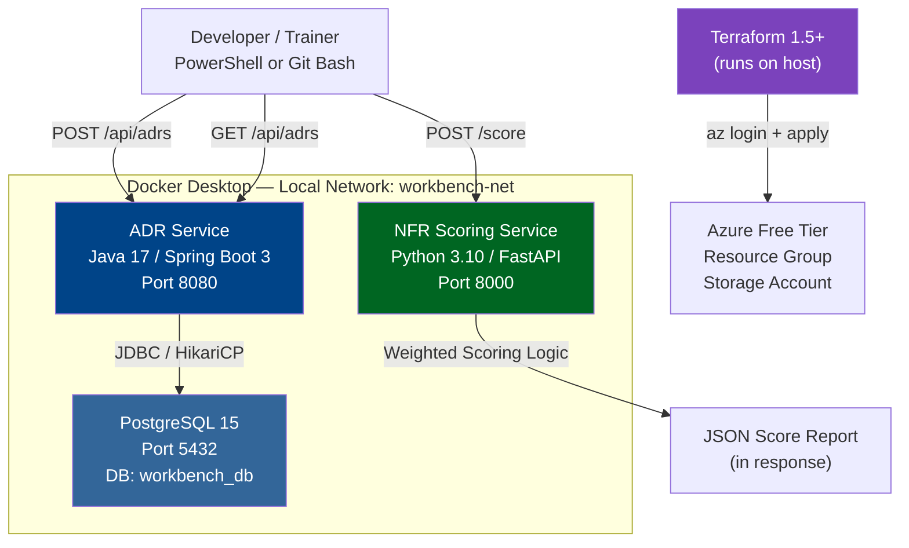
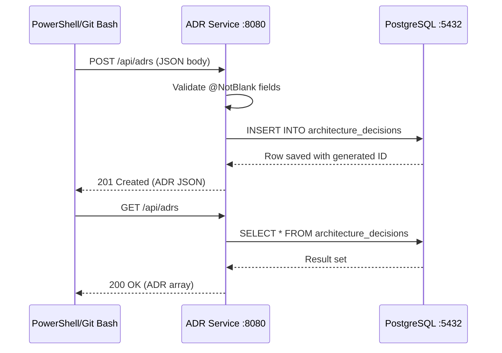

# LAB MANUAL: Day 1 — Architecture Decision Workbench

**Phase:** Architectural Foundations & Design Thinking
**Topics:** Architectural Mindset, NFRs, ADRs, Tech Stack Evaluation
**Tech Stack:** Java 17 | Spring Boot 3.3 | PostgreSQL 15 | Python 3.10+ | Terraform 1.5+
**Orchestration:** Docker Desktop | Docker Compose
**Cloud:** Azure Free Tier
**OS:** Windows 11 | PowerShell 7+ | Git Bash
**Geography Context:** 🇮🇳 India / 🇸🇬 Singapore — Nivesh Gateway Scenario
**Copilot Usage:** Embedded prompts throughout
**Pre-requisites:** Listed fully in L1
**Estimated Lab Time:** 90 minutes | In-Class Demo: 25 minutes

---

## IMPORTANT: HOW TO USE THIS DOCUMENT

This document is self-contained. Every command, every expected output, every error fix, and every verification step is written here. You do not need internet access after completing the one-time setup in L1. Follow every step in sequence. Do not skip sections. Commands are written for both PowerShell and Git Bash where they differ. When a command works identically in both shells, only one version is shown.

---

## L0. LAB CONTEXT AND ARCHITECTURE NARRATIVE

**Scenario**

We are building the first internal tooling layer for Nivesh Gateway — a cross-border India-Singapore fintech investment platform. Before building user-facing services, the architecture team needs a lightweight working platform to capture NFRs, record ADRs with mandatory requirement traceability, and score technology options consistently across vendor teams. This tooling is what principal architects build before they touch production code.

**What This Lab Builds**

- A Java 17 Spring Boot 3 ADR Service with PostgreSQL persistence, exposing a REST API for capturing and retrieving Architecture Decision Records
- A Python 3.10 NFR Scoring Service using FastAPI and weighted evaluation logic
- A PostgreSQL 15 database for persistent ADR storage
- A Docker Compose stack running all three components together
- A Terraform configuration for an Azure Resource Group and Storage Account
- A GitHub Actions CI pipeline skeleton

**Architecture Overview**



**Data Flow for ADR Creation**



**Concepts From Training This Lab Demonstrates**

- NFR capture, weighted scoring, and explicit trade-off evaluation (Block 1, Concepts 1 and 2)
- ADR documentation with mandatory requirement traceability and PostgreSQL persistence (Block 1, Concept 3)
- Architecture fitness function governance pattern (Block 3, Pattern)
- Infrastructure-as-code linking decisions to deployable Azure resources

**Production Delta**

In production, the ADR service would use Azure Database for PostgreSQL Flexible Server with multi-region read replicas, private endpoints, customer-managed encryption keys, and an approval workflow. The scoring service would integrate with an ARB workflow engine. Azure Free Tier limits mean we use LRS storage and a basic resource group. The architecture intent — not the infrastructure scale — is the teaching focus.

---

## L1. PREREQUISITES AND ONE-TIME ENVIRONMENT SETUP

### L1.1 Required Software — Install Before Lab Begins

Install every item in this table before proceeding. Version numbers are minimum requirements.

| Software       | Minimum Version | Download Location                     | Verify Command      |
| -------------- | --------------- | ------------------------------------- | ------------------- |
| Docker Desktop | 4.25+           | docker.com/products/docker-desktop    | `docker --version`  |
| Java JDK       | 17 (LTS)        | adoptium.net                          | `java -version`     |
| Maven          | 3.9+            | maven.apache.org                      | `mvn -version`      |
| Python         | 3.10+           | python.org                            | `python --version`  |
| Git            | 2.40+           | git-scm.com                           | `git --version`     |
| Terraform      | 1.5+            | developer.hashicorp.com/terraform     | `terraform version` |
| Azure CLI      | 2.55+           | learn.microsoft.com/cli/azure/install | `az --version`      |
| PowerShell     | 7.3+            | github.com/PowerShell/PowerShell      | `$PSVersionTable`   |
| curl           | Any             | Included with Git Bash and Windows 11 | `curl --version`    |
| jq             | 1.6+            | jqlang.github.io/jq                   | `jq --version`      |

**Installing jq on Windows — PowerShell (run as Administrator):**

```powershell
winget install jqlang.jq
```

**Installing jq on Windows — Git Bash alternative:**
Download jq-win64.exe from github.com/jqlang/jq/releases, rename to jq.exe, place in C:\Program Files\Git\usr\bin\

**Verify all tools are installed — run this block in PowerShell:**

```powershell
Write-Host "=== Environment Verification ===" -ForegroundColor Cyan
docker --version
java -version
mvn -version
python --version
git --version
terraform version
az --version | Select-Object -First 1
jq --version
Write-Host "=== All checks complete ===" -ForegroundColor Green
```

If any command fails, install the missing tool before continuing.

---

### L1.2 Docker Desktop Configuration

Open Docker Desktop. Go to Settings. Confirm the following:

Under Resources, set Memory to at least 4 GB. Set CPUs to at least 2.

Under General, ensure "Use WSL 2 based engine" is checked on Windows 11.

Start Docker Desktop and wait until the bottom status bar shows "Engine running" before proceeding.

**Verify Docker is running — PowerShell:**

```powershell
docker info | Select-String "Server Version"
```

Expected output: `Server Version: 24.x.x` or higher.

If Docker is not running, start it from the Start Menu and wait 60 seconds before retrying.

---

### L1.3 Project Scaffold Creation

Run all commands from PowerShell unless Git Bash is specified explicitly.

**Create the project root directory:**

```powershell
New-Item -ItemType Directory -Path "$HOME\projects\architecture-decision-workbench" -Force
Set-Location "$HOME\projects\architecture-decision-workbench"
```

**Create the full directory structure in one command:**

```powershell
$dirs = @(
    "src\main\java\com\nivesh\workbench\config",
    "src\main\java\com\nivesh\workbench\domain",
    "src\main\java\com\nivesh\workbench\application",
    "src\main\java\com\nivesh\workbench\infrastructure",
    "src\main\java\com\nivesh\workbench\api",
    "src\main\resources",
    "src\test\java\com\nivesh\workbench",
    "src\main\python\nfr_scorer",
    "src\test\python",
    "infra\terraform",
    "docker",
    "scripts",
    "docs\architecture\ADRs",
    "config",
    ".github\workflows"
)
foreach ($dir in $dirs) {
    New-Item -ItemType Directory -Path $dir -Force | Out-Null
}
Write-Host "Directory structure created successfully." -ForegroundColor Green
```

**Verify structure — PowerShell:**

```powershell
Get-ChildItem -Recurse -Directory | Select-Object FullName
```

---

## L2. PROJECT STRUCTURE

Every file listed below will be created in subsequent steps. This is your navigation reference.

```
architecture-decision-workbench\
├── src\
│   ├── main\
│   │   ├── java\com\nivesh\workbench\
│   │   │   ├── config\
│   │   │   │   └── WebConfig.java
│   │   │   ├── domain\
│   │   │   │   └── ArchitectureDecision.java      ← JPA Entity + record-like structure
│   │   │   ├── application\
│   │   │   │   └── AdrService.java
│   │   │   ├── infrastructure\
│   │   │   │   └── AdrRepository.java             ← Spring Data JPA repository
│   │   │   ├── api\
│   │   │   │   ├── AdrController.java
│   │   │   │   └── GlobalExceptionHandler.java
│   │   │   └── WorkbenchApp.java
│   │   ├── resources\
│   │   │   ├── application.yml
│   │   │   └── db\migration\
│   │   │       └── V1__create_adr_table.sql       ← Flyway migration
│   │   └── python\nfr_scorer\
│   │       ├── __init__.py
│   │       ├── models.py
│   │       ├── scorer.py
│   │       └── app.py
│   └── test\
│       ├── java\com\nivesh\workbench\
│       │   └── AdrControllerTest.java
│       └── python\
│           └── test_scorer.py
├── infra\terraform\
│   ├── providers.tf
│   ├── variables.tf
│   ├── main.tf
│   └── outputs.tf
├── docker\
│   ├── Dockerfile.java
│   ├── Dockerfile.python
│   └── docker-compose.yml
├── scripts\
│   ├── setup.ps1                                  ← Windows PowerShell setup
│   ├── demo.ps1                                   ← Demo playbook script
│   ├── teardown.ps1                               ← Cleanup script
│   └── verify.ps1                                 ← Verification script
├── docs\architecture\ADRs\
│   └── ADR-001-nfr-first.md
├── .github\workflows\
│   └── ci.yml
├── pom.xml
├── requirements.txt
└── README.md
```

---

## L3. COMPLETE FILE CONTENTS — WRITE EVERY FILE

Create each file exactly as shown. No modifications needed for the demo to run.

---

### L3.1 Maven Build File

**File: pom.xml** — Create in the project root.

```powershell
# In PowerShell, at project root:
Set-Location "$HOME\projects\architecture-decision-workbench"
```

Create the file with this exact content. In PowerShell, use Notepad, VS Code, or the heredoc pattern below:

```powershell
@'
<?xml version="1.0" encoding="UTF-8"?>
<project xmlns="http://maven.apache.org/POM/4.0.0"
         xmlns:xsi="http://www.w3.org/2001/XMLSchema-instance"
         xsi:schemaLocation="http://maven.apache.org/POM/4.0.0
           http://maven.apache.org/xsd/maven-4.0.0.xsd">
  <modelVersion>4.0.0</modelVersion>
  <groupId>com.nivesh</groupId>
  <artifactId>architecture-decision-workbench</artifactId>
  <version>1.0.0</version>
  <packaging>jar</packaging>

  <parent>
    <groupId>org.springframework.boot</groupId>
    <artifactId>spring-boot-starter-parent</artifactId>
    <version>3.3.0</version>
    <relativePath/>
  </parent>

  <properties>
    <java.version>17</java.version>
    <project.build.sourceEncoding>UTF-8</project.build.sourceEncoding>
  </properties>

  <dependencies>
    <dependency>
      <groupId>org.springframework.boot</groupId>
      <artifactId>spring-boot-starter-web</artifactId>
    </dependency>
    <dependency>
      <groupId>org.springframework.boot</groupId>
      <artifactId>spring-boot-starter-validation</artifactId>
    </dependency>
    <dependency>
      <groupId>org.springframework.boot</groupId>
      <artifactId>spring-boot-starter-actuator</artifactId>
    </dependency>
    <dependency>
      <groupId>org.springframework.boot</groupId>
      <artifactId>spring-boot-starter-data-jpa</artifactId>
    </dependency>
    <dependency>
      <groupId>org.flywaydb</groupId>
      <artifactId>flyway-core</artifactId>
    </dependency>
    <dependency>
      <groupId>org.postgresql</groupId>
      <artifactId>postgresql</artifactId>
      <scope>runtime</scope>
    </dependency>
    <dependency>
      <groupId>org.springframework.boot</groupId>
      <artifactId>spring-boot-starter-test</artifactId>
      <scope>test</scope>
    </dependency>
  </dependencies>

  <build>
    <plugins>
      <plugin>
        <groupId>org.springframework.boot</groupId>
        <artifactId>spring-boot-maven-plugin</artifactId>
      </plugin>
    </plugins>
  </build>
</project>
'@ | Set-Content -Path "pom.xml" -Encoding UTF8
```

---

### L3.2 Spring Boot Application Configuration

**File: src\main\resources\application.yml**

```powershell
@'
server:
  port: 8080

spring:
  application:
    name: adr-service

  datasource:
    url: jdbc:postgresql://postgres:5432/workbench_db
    username: workbench_user
    password: workbench_pass
    driver-class-name: org.postgresql.Driver
    hikari:
      connection-timeout: 20000
      maximum-pool-size: 5
      minimum-idle: 2

  jpa:
    hibernate:
      ddl-auto: validate
    show-sql: false
    properties:
      hibernate:
        dialect: org.hibernate.dialect.PostgreSQLDialect
        format_sql: true

  flyway:
    enabled: true
    locations: classpath:db/migration
    baseline-on-migrate: true

management:
  endpoints:
    web:
      exposure:
        include: health,info,metrics
  endpoint:
    health:
      show-details: always

logging:
  level:
    com.nivesh: DEBUG
    org.springframework: INFO
    org.flywaydb: INFO
'@ | Set-Content -Path "src\main\resources\application.yml" -Encoding UTF8
```

---

### L3.3 Database Migration Script

**File: src\main\resources\db\migration\V1__create_adr_table.sql**

```powershell
New-Item -ItemType Directory -Path "src\main\resources\db\migration" -Force | Out-Null

@'
-- V1__create_adr_table.sql
-- WHY Flyway migration instead of Hibernate auto DDL:
-- Schema changes in regulated environments must be versioned, reviewable,
-- and auditable. Flyway provides an immutable migration history that
-- survives application restarts and supports rollback planning.

CREATE TABLE IF NOT EXISTS architecture_decisions (
    id                   BIGSERIAL PRIMARY KEY,
    adr_id               VARCHAR(20)  NOT NULL UNIQUE,
    title                VARCHAR(255) NOT NULL,
    context              TEXT         NOT NULL,
    decision             TEXT         NOT NULL,
    rationale            TEXT         NOT NULL,
    related_requirement  VARCHAR(50)  NOT NULL,
    status               VARCHAR(30)  NOT NULL
        CHECK (status IN (''Proposed'', ''In Review'', ''Accepted'', ''Superseded'', ''Deprecated'')),
    created_at           TIMESTAMP    NOT NULL DEFAULT NOW(),
    updated_at           TIMESTAMP    NOT NULL DEFAULT NOW()
);

-- WHY a unique index on adr_id:
-- ADR identifiers must be unique across the governance register.
-- Duplicate ADR IDs create confusion in audit trails.
CREATE UNIQUE INDEX IF NOT EXISTS idx_adr_id ON architecture_decisions(adr_id);

-- WHY a status index:
-- The most common query pattern is "show me all Accepted ADRs" or
-- "show me all Proposed ADRs awaiting review." This index supports that.
CREATE INDEX IF NOT EXISTS idx_status ON architecture_decisions(status);

COMMENT ON TABLE architecture_decisions IS
    ''Architecture Decision Records for Nivesh Gateway governance register'';
'@ | Set-Content -Path "src\main\resources\db\migration\V1__create_adr_table.sql" -Encoding UTF8
```

---

### L3.4 Java Source Files

**File: src\main\java\com\nivesh\workbench\WorkbenchApp.java**

```powershell
@'
package com.nivesh.workbench;

import org.springframework.boot.SpringApplication;
import org.springframework.boot.autoconfigure.SpringBootApplication;

@SpringBootApplication
public class WorkbenchApp {
    public static void main(final String[] args) {
        SpringApplication.run(WorkbenchApp.class, args);
    }
}
'@ | Set-Content -Path "src\main\java\com\nivesh\workbench\WorkbenchApp.java" -Encoding UTF8
```

---

**File: src\main\java\com\nivesh\workbench\domain\ArchitectureDecision.java**

```powershell
@'
package com.nivesh.workbench.domain;

import jakarta.persistence.*;
import jakarta.validation.constraints.NotBlank;
import jakarta.validation.constraints.Pattern;
import jakarta.validation.constraints.Size;
import java.time.LocalDateTime;

/**
 * WHY a JPA @Entity and not a record:
 *
 * JPA requires mutable entities with a no-arg constructor and setters for
 * Hibernate proxy generation. We use a class here with disciplined encapsulation.
 * The @Column(updatable = false) on adrId enforces immutability at the DB level --
 * an ADR ID cannot change once committed, mirroring the governance principle that
 * decisions are superseded, never silently mutated.
 *
 * WHY @Pattern on adrId:
 * ADR identifiers must follow a consistent format (ADR-001 through ADR-999)
 * for sorting, referencing, and audit trail readability.
 */
@Entity
@Table(name = "architecture_decisions")
public class ArchitectureDecision {

    @Id
    @GeneratedValue(strategy = GenerationType.IDENTITY)
    private Long id;

    @NotBlank(message = "ADR ID is required. Format: ADR-NNN")
    @Pattern(regexp = "ADR-\\d{3}", message = "ADR ID must match format ADR-NNN (e.g. ADR-001)")
    @Column(name = "adr_id", unique = true, nullable = false, updatable = false, length = 20)
    private String adrId;

    @NotBlank(message = "Title is required")
    @Size(max = 255, message = "Title must not exceed 255 characters")
    @Column(nullable = false)
    private String title;

    @NotBlank(message = "Context is required -- what situation forced this decision?")
    @Column(nullable = false, columnDefinition = "TEXT")
    private String context;

    @NotBlank(message = "Decision is required -- what exactly was decided?")
    @Column(nullable = false, columnDefinition = "TEXT")
    private String decision;

    @NotBlank(message = "Rationale is required -- why this over alternatives?")
    @Column(nullable = false, columnDefinition = "TEXT")
    private String rationale;

    @NotBlank(message = "Related requirement is required. Format: REQ-NNN")
    @Pattern(regexp = "REQ-\\d{3}", message = "Requirement must match format REQ-NNN (e.g. REQ-001)")
    @Column(name = "related_requirement", nullable = false, length = 50)
    private String relatedRequirement;

    @NotBlank(message = "Status is required")
    @Pattern(regexp = "Proposed|In Review|Accepted|Superseded|Deprecated",
             message = "Status must be one of: Proposed, In Review, Accepted, Superseded, Deprecated")
    @Column(nullable = false, length = 30)
    private String status;

    @Column(name = "created_at", updatable = false)
    private LocalDateTime createdAt;

    @Column(name = "updated_at")
    private LocalDateTime updatedAt;

    @PrePersist
    protected void onCreate() {
        this.createdAt = LocalDateTime.now();
        this.updatedAt = LocalDateTime.now();
    }

    @PreUpdate
    protected void onUpdate() {
        this.updatedAt = LocalDateTime.now();
    }

    // --- Constructors ---

    protected ArchitectureDecision() {}

    public ArchitectureDecision(String adrId, String title, String context,
                                 String decision, String rationale,
                                 String relatedRequirement, String status) {
        this.adrId = adrId;
        this.title = title;
        this.context = context;
        this.decision = decision;
        this.rationale = rationale;
        this.relatedRequirement = relatedRequirement;
        this.status = status;
    }

    // --- Getters (no setters for immutable fields) ---

    public Long getId() { return id; }
    public String getAdrId() { return adrId; }
    public String getTitle() { return title; }
    public String getContext() { return context; }
    public String getDecision() { return decision; }
    public String getRationale() { return rationale; }
    public String getRelatedRequirement() { return relatedRequirement; }
    public String getStatus() { return status; }
    public LocalDateTime getCreatedAt() { return createdAt; }
    public LocalDateTime getUpdatedAt() { return updatedAt; }

    public void setStatus(String status) { this.status = status; }
}
'@ | Set-Content -Path "src\main\java\com\nivesh\workbench\domain\ArchitectureDecision.java" -Encoding UTF8
```

---

**File: src\main\java\com\nivesh\workbench\infrastructure\AdrRepository.java**

```powershell
@'
package com.nivesh.workbench.infrastructure;

import com.nivesh.workbench.domain.ArchitectureDecision;
import org.springframework.data.jpa.repository.JpaRepository;
import org.springframework.stereotype.Repository;

import java.util.List;
import java.util.Optional;

/**
 * WHY Spring Data JPA and not manual JDBC:
 *
 * Spring Data JPA eliminates boilerplate CRUD SQL while keeping
 * the repository pattern clean. Derived query methods like findByStatus
 * are generated at compile time -- not runtime reflection -- making them
 * safe for production use. Manual JDBC would add nothing to the architecture
 * lesson here and significant noise to the codebase.
 *
 * WHY this interface extends JpaRepository<ArchitectureDecision, Long>:
 * Provides save(), findAll(), findById(), deleteById() for free.
 * The Long type parameter matches the @GeneratedValue BIGSERIAL primary key.
 */
@Repository
public interface AdrRepository extends JpaRepository<ArchitectureDecision, Long> {

    Optional<ArchitectureDecision> findByAdrId(String adrId);

    List<ArchitectureDecision> findByStatus(String status);

    boolean existsByAdrId(String adrId);
}
'@ | Set-Content -Path "src\main\java\com\nivesh\workbench\infrastructure\AdrRepository.java" -Encoding UTF8
```

---

**File: src\main\java\com\nivesh\workbench\application\AdrService.java**

```powershell
@'
package com.nivesh.workbench.application;

import com.nivesh.workbench.domain.ArchitectureDecision;
import com.nivesh.workbench.infrastructure.AdrRepository;
import org.springframework.stereotype.Service;
import org.springframework.transaction.annotation.Transactional;

import java.util.List;
import java.util.Optional;

/**
 * WHY the service layer validates for duplicate ADR IDs:
 *
 * The database UNIQUE constraint catches duplicates at the persistence layer,
 * but that produces a cryptic DataIntegrityViolationException. The service
 * layer catches duplicates early and returns a meaningful, actionable error
 * message. This is the difference between "something broke" and "ADR-001
 * already exists in the governance register."
 *
 * WHY @Transactional on create but @Transactional(readOnly = true) on reads:
 * Read-only transactions allow the JPA provider to apply read optimisations
 * and allow the database connection pool to route reads to replicas
 * in production environments.
 */
@Service
public class AdrService {

    private final AdrRepository repository;

    public AdrService(final AdrRepository repository) {
        this.repository = repository;
    }

    @Transactional
    public ArchitectureDecision create(final ArchitectureDecision decision) {
        if (repository.existsByAdrId(decision.getAdrId())) {
            throw new DuplicateAdrException(
                "ADR ID " + decision.getAdrId() + " already exists in the governance register. " +
                "Use a new ADR ID or supersede the existing record."
            );
        }
        return repository.save(decision);
    }

    @Transactional(readOnly = true)
    public List<ArchitectureDecision> findAll() {
        return repository.findAll();
    }

    @Transactional(readOnly = true)
    public Optional<ArchitectureDecision> findByAdrId(final String adrId) {
        return repository.findByAdrId(adrId);
    }

    @Transactional(readOnly = true)
    public List<ArchitectureDecision> findByStatus(final String status) {
        return repository.findByStatus(status);
    }

    public static class DuplicateAdrException extends RuntimeException {
        public DuplicateAdrException(final String message) {
            super(message);
        }
    }
}
'@ | Set-Content -Path "src\main\java\com\nivesh\workbench\application\AdrService.java" -Encoding UTF8
```

---

**File: src\main\java\com\nivesh\workbench\api\AdrController.java**

```powershell
@'
package com.nivesh.workbench.api;

import com.nivesh.workbench.application.AdrService;
import com.nivesh.workbench.domain.ArchitectureDecision;
import jakarta.validation.Valid;
import org.springframework.http.HttpStatus;
import org.springframework.http.ResponseEntity;
import org.springframework.web.bind.annotation.*;

import java.util.List;
import java.util.Map;

/**
 * WHY 201 Created instead of 200 OK for POST:
 * REST semantics: 200 means "here is a result", 201 means "a resource was created."
 * Governance tooling consumed by other services must follow correct HTTP semantics
 * so that client-side caching, idempotency logic, and audit log parsers work correctly.
 *
 * WHY the /api prefix:
 * Separates API routes from actuator routes (/actuator/*) and future static
 * content routes. This makes API gateway routing rules straightforward.
 */
@RestController
@RequestMapping("/api/adrs")
public class AdrController {

    private final AdrService adrService;

    public AdrController(final AdrService adrService) {
        this.adrService = adrService;
    }

    @PostMapping
    public ResponseEntity<ArchitectureDecision> create(
            @Valid @RequestBody final ArchitectureDecision decision) {
        return ResponseEntity
                .status(HttpStatus.CREATED)
                .body(adrService.create(decision));
    }

    @GetMapping
    public ResponseEntity<List<ArchitectureDecision>> findAll() {
        return ResponseEntity.ok(adrService.findAll());
    }

    @GetMapping("/{adrId}")
    public ResponseEntity<ArchitectureDecision> findByAdrId(@PathVariable final String adrId) {
        return adrService.findByAdrId(adrId)
                .map(ResponseEntity::ok)
                .orElse(ResponseEntity.notFound().build());
    }

    @GetMapping("/by-status/{status}")
    public ResponseEntity<List<ArchitectureDecision>> findByStatus(@PathVariable final String status) {
        return ResponseEntity.ok(adrService.findByStatus(status));
    }

    @GetMapping("/health-check")
    public ResponseEntity<Map<String, String>> healthCheck() {
        return ResponseEntity.ok(Map.of("service", "adr-service", "status", "UP"));
    }
}
'@ | Set-Content -Path "src\main\java\com\nivesh\workbench\api\AdrController.java" -Encoding UTF8
```

---

**File: src\main\java\com\nivesh\workbench\api\GlobalExceptionHandler.java**

```powershell
@'
package com.nivesh.workbench.api;

import com.nivesh.workbench.application.AdrService.DuplicateAdrException;
import org.springframework.http.HttpStatus;
import org.springframework.http.ResponseEntity;
import org.springframework.validation.FieldError;
import org.springframework.web.bind.MethodArgumentNotValidException;
import org.springframework.web.bind.annotation.ExceptionHandler;
import org.springframework.web.bind.annotation.RestControllerAdvice;

import java.time.LocalDateTime;
import java.util.HashMap;
import java.util.Map;

/**
 * WHY a global exception handler:
 *
 * Without this, Spring Boot returns a generic 500 error for validation failures
 * and a stack trace for duplicate ID attempts. In a governance tool, error
 * responses must be actionable -- they should tell the caller exactly what
 * field failed and why, so they can correct the ADR and resubmit.
 * A stack trace is not an acceptable error response in any production system.
 */
@RestControllerAdvice
public class GlobalExceptionHandler {

    @ExceptionHandler(MethodArgumentNotValidException.class)
    public ResponseEntity<Map<String, Object>> handleValidationErrors(
            final MethodArgumentNotValidException ex) {

        Map<String, String> fieldErrors = new HashMap<>();
        for (FieldError error : ex.getBindingResult().getFieldErrors()) {
            fieldErrors.put(error.getField(), error.getDefaultMessage());
        }

        Map<String, Object> body = new HashMap<>();
        body.put("timestamp", LocalDateTime.now().toString());
        body.put("status", HttpStatus.BAD_REQUEST.value());
        body.put("error", "Validation Failed");
        body.put("message", "One or more ADR fields failed validation. Correct the errors and resubmit.");
        body.put("fieldErrors", fieldErrors);

        return ResponseEntity.badRequest().body(body);
    }

    @ExceptionHandler(DuplicateAdrException.class)
    public ResponseEntity<Map<String, Object>> handleDuplicateAdr(
            final DuplicateAdrException ex) {

        Map<String, Object> body = new HashMap<>();
        body.put("timestamp", LocalDateTime.now().toString());
        body.put("status", HttpStatus.CONFLICT.value());
        body.put("error", "Duplicate ADR");
        body.put("message", ex.getMessage());

        return ResponseEntity.status(HttpStatus.CONFLICT).body(body);
    }
}
'@ | Set-Content -Path "src\main\java\com\nivesh\workbench\api\GlobalExceptionHandler.java" -Encoding UTF8
```

---

**File: src\main\java\com\nivesh\workbench\config\WebConfig.java**

```powershell
@'
package com.nivesh.workbench.config;

import org.springframework.context.annotation.Configuration;
import org.springframework.web.servlet.config.annotation.CorsRegistry;
import org.springframework.web.servlet.config.annotation.WebMvcConfigurer;

/**
 * WHY permissive CORS for local demo:
 * The ADR service is consumed by curl and the NFR scoring UI in demo context.
 * In production, CORS origins are restricted to known frontend domains only.
 * This class exists so that CORS policy has a named home for future hardening.
 */
@Configuration
public class WebConfig implements WebMvcConfigurer {

    @Override
    public void addCorsMappings(final CorsRegistry registry) {
        registry.addMapping("/api/**")
                .allowedOrigins("*")
                .allowedMethods("GET", "POST", "PUT", "DELETE", "OPTIONS");
    }
}
'@ | Set-Content -Path "src\main\java\com\nivesh\workbench\config\WebConfig.java" -Encoding UTF8
```

---

**File: src\test\java\com\nivesh\workbench\AdrControllerTest.java**

```powershell
@'
package com.nivesh.workbench;

import com.fasterxml.jackson.databind.ObjectMapper;
import com.nivesh.workbench.domain.ArchitectureDecision;
import org.junit.jupiter.api.Test;
import org.springframework.beans.factory.annotation.Autowired;
import org.springframework.boot.test.autoconfigure.web.servlet.AutoConfigureMockMvc;
import org.springframework.boot.test.context.SpringBootTest;
import org.springframework.http.MediaType;
import org.springframework.test.context.DynamicPropertyRegistry;
import org.springframework.test.context.DynamicPropertySource;
import org.springframework.test.web.servlet.MockMvc;
import org.testcontainers.containers.PostgreSQLContainer;
import org.testcontainers.junit.jupiter.Container;
import org.testcontainers.junit.jupiter.Testcontainers;

import static org.springframework.test.web.servlet.request.MockMvcRequestBuilders.*;
import static org.springframework.test.web.servlet.result.MockMvcResultMatchers.*;

/**
 * WHY Testcontainers for integration tests:
 *
 * We test against a real PostgreSQL container, not an H2 in-memory database.
 * H2 does not validate PostgreSQL-specific SQL, CHECK constraints, or
 * Flyway migrations accurately. Testcontainers ensures the test environment
 * matches production behaviour exactly -- including the Flyway schema migration.
 *
 * WHY @SpringBootTest instead of @WebMvcTest:
 * We want the full application context including JPA, Flyway, and the
 * database connection -- not a mocked slice. This validates the complete
 * request-to-database path that the governance tool depends on.
 */
@SpringBootTest
@AutoConfigureMockMvc
@Testcontainers
class AdrControllerTest {

    @Container
    static PostgreSQLContainer<?> postgres = new PostgreSQLContainer<>("postgres:15-alpine")
            .withDatabaseName("workbench_test")
            .withUsername("test_user")
            .withPassword("test_pass");

    @DynamicPropertySource
    static void configureProperties(DynamicPropertyRegistry registry) {
        registry.add("spring.datasource.url", postgres::getJdbcUrl);
        registry.add("spring.datasource.username", postgres::getUsername);
        registry.add("spring.datasource.password", postgres::getPassword);
    }

    @Autowired
    private MockMvc mockMvc;

    @Autowired
    private ObjectMapper objectMapper;

    private ArchitectureDecision buildValidAdr(String adrId) {
        return new ArchitectureDecision(
                adrId,
                "Test ADR Title",
                "Test context for the decision",
                "The decision that was made",
                "The rationale for this decision",
                "REQ-001",
                "Proposed"
        );
    }

    @Test
    void createAdr_withValidPayload_returns201() throws Exception {
        mockMvc.perform(post("/api/adrs")
                .contentType(MediaType.APPLICATION_JSON)
                .content(objectMapper.writeValueAsString(buildValidAdr("ADR-001"))))
                .andExpect(status().isCreated())
                .andExpect(jsonPath("$.adrId").value("ADR-001"))
                .andExpect(jsonPath("$.status").value("Proposed"));
    }

    @Test
    void createAdr_withMissingRequirement_returns400() throws Exception {
        ArchitectureDecision invalid = new ArchitectureDecision(
                "ADR-002", "Title", "Context", "Decision", "Rationale",
                "", "Proposed"
        );
        mockMvc.perform(post("/api/adrs")
                .contentType(MediaType.APPLICATION_JSON)
                .content(objectMapper.writeValueAsString(invalid)))
                .andExpect(status().isBadRequest())
                .andExpect(jsonPath("$.fieldErrors.relatedRequirement").exists());
    }

    @Test
    void createAdr_withDuplicateId_returns409() throws Exception {
        ArchitectureDecision adr = buildValidAdr("ADR-003");
        mockMvc.perform(post("/api/adrs")
                .contentType(MediaType.APPLICATION_JSON)
                .content(objectMapper.writeValueAsString(adr)))
                .andExpect(status().isCreated());

        mockMvc.perform(post("/api/adrs")
                .contentType(MediaType.APPLICATION_JSON)
                .content(objectMapper.writeValueAsString(adr)))
                .andExpect(status().isConflict())
                .andExpect(jsonPath("$.error").value("Duplicate ADR"));
    }

    @Test
    void findAll_returnsListOfAdrs() throws Exception {
        mockMvc.perform(get("/api/adrs"))
                .andExpect(status().isOk())
                .andExpect(jsonPath("$").isArray());
    }

    @Test
    void healthCheck_returns200() throws Exception {
        mockMvc.perform(get("/api/adrs/health-check"))
                .andExpect(status().isOk())
                .andExpect(jsonPath("$.status").value("UP"));
    }
}
'@ | Set-Content -Path "src\test\java\com\nivesh\workbench\AdrControllerTest.java" -Encoding UTF8
```

Add Testcontainers dependency to pom.xml — update the dependencies section to include:

```powershell
# Open pom.xml and add these dependencies before the closing </dependencies> tag
# Use VS Code: code pom.xml
# Add this block inside <dependencies>:
```

Add manually to pom.xml inside `<dependencies>`:

```xml
    <dependency>
      <groupId>org.testcontainers</groupId>
      <artifactId>junit-jupiter</artifactId>
      <version>1.19.8</version>
      <scope>test</scope>
    </dependency>
    <dependency>
      <groupId>org.testcontainers</groupId>
      <artifactId>postgresql</artifactId>
      <version>1.19.8</version>
      <scope>test</scope>
    </dependency>
```

---

### L3.5 Python Service Files

**File: requirements.txt** — Create in project root.

```powershell
@'
fastapi==0.111.0
uvicorn==0.30.1
pydantic==2.7.4
pytest==8.2.2
httpx==0.27.0
pytest-asyncio==0.23.7
'@ | Set-Content -Path "requirements.txt" -Encoding UTF8
```

---

**File: src\main\python\nfr_scorer\\_\_init\_\_.py**

```powershell
@'
# nfr_scorer package -- NFR Weighted Scoring Service for Nivesh Gateway Architecture Workbench
'@ | Set-Content -Path "src\main\python\nfr_scorer\__init__.py" -Encoding UTF8
```

---

**File: src\main\python\nfr_scorer\models.py**

```powershell
@'
"""
models.py -- Typed input and output contracts for the NFR Scoring Service.

WHY Pydantic BaseModel:
FastAPI uses Pydantic models for automatic request parsing, type coercion,
and validation error responses. A caller sending category="Perf" instead of
"performance" receives a structured 422 error with field-level detail --
not a 500 server error with a stack trace.

WHY Literal for category:
NFR categories are not free text. Allowing arbitrary strings means
"Performance", "performance", and "PERF" become different keys in the
weighted scoring algorithm. Literal enforces the contract at parse time.
"""

from __future__ import annotations
from pydantic import BaseModel, Field
from typing import Literal


class NfrInput(BaseModel):
    category: Literal[
        "performance",
        "availability",
        "security",
        "compliance",
        "cost"
    ]
    score: int = Field(
        ge=1,
        le=10,
        description="Score from 1 (very poor) to 10 (excellent)"
    )
    evidence: str = Field(
        min_length=5,
        description="Evidence basis for this score -- e.g. 'k6 load test at 8000 TPS'"
    )

    model_config = {"json_schema_extra": {
        "example": {
            "category": "security",
            "score": 9,
            "evidence": "Threat model completed, penetration test scheduled"
        }
    }}


class ScoringResult(BaseModel):
    weighted_score: float
    interpretation: str
    category_breakdown: dict[str, float]
'@ | Set-Content -Path "src\main\python\nfr_scorer\models.py" -Encoding UTF8
```

---

**File: src\main\python\nfr_scorer\scorer.py**

```powershell
@'
"""
scorer.py -- Weighted NFR scoring business logic.

WHY the weights are explicit named constants:
When an ARB member asks "why did Option A score higher than Option B?",
you must show the weights alongside the scores. Named constants are auditable,
debatable, and changeable through a documented decision -- not buried in
arithmetic that only the author understands six months later.

WHY security and performance each carry 25%:
For a regulated cross-border fintech platform, a strong performance score
that fails security or compliance is a deployment blocker, not a trade-off
you can ship around. The weights reflect that regulatory reality.
"""

from __future__ import annotations
from typing import List
from .models import NfrInput, ScoringResult

WEIGHTS: dict[str, float] = {
    "performance":  0.25,
    "availability": 0.20,
    "security":     0.25,
    "compliance":   0.20,
    "cost":         0.10,
}

# WHY named thresholds instead of magic numbers:
# The interpretation thresholds are themselves an architecture decision.
# Naming them makes them reviewable and changeable without touching scoring logic.
THRESHOLD_STRONG    = 8.5
THRESHOLD_ACCEPTABLE = 7.0
THRESHOLD_MARGINAL  = 5.5


def calculate_weighted_score(items: List[NfrInput]) -> ScoringResult:
    """
    Calculate a weighted composite NFR score from a list of category scores.

    Returns a ScoringResult containing the weighted score, an interpretation
    string, and a per-category breakdown showing each category contribution.
    """
    if not items:
        return ScoringResult(
            weighted_score=0.0,
            interpretation="No inputs provided -- submit at least one NFR score",
            category_breakdown={}
        )

    breakdown: dict[str, float] = {}
    total: float = 0.0

    for item in items:
        contribution = round(item.score * WEIGHTS[item.category], 4)
        breakdown[item.category] = contribution
        total += contribution

    weighted = round(total, 2)

    return ScoringResult(
        weighted_score=weighted,
        interpretation=_interpret(weighted),
        category_breakdown=breakdown
    )


def _interpret(score: float) -> str:
    """
    Map a weighted score to an actionable architectural recommendation.
    Uses match-case (Python 3.10+) for clarity over chained if-elif blocks.
    """
    match score:
        case s if s >= THRESHOLD_STRONG:
            return (
                f"Strong ({s}/10) -- Proceed to ADR and technology commitment. "
                "Document assumptions and review in 90 days."
            )
        case s if s >= THRESHOLD_ACCEPTABLE:
            return (
                f"Acceptable ({s}/10) -- Proceed with documented risk acknowledgement. "
                "Identify and time-box the gaps below 8.0."
            )
        case s if s >= THRESHOLD_MARGINAL:
            return (
                f"Marginal ({s}/10) -- Address identified gaps before architectural commitment. "
                "Present improvement plan to ARB."
            )
        case _:
            return (
                f"Insufficient ({score}/10) -- Do not proceed to technology commitment. "
                "Revisit requirements, constraints, and option set."
            )
'@ | Set-Content -Path "src\main\python\nfr_scorer\scorer.py" -Encoding UTF8
```

---

**File: src\main\python\nfr_scorer\app.py**

```powershell
@'
"""
app.py -- FastAPI application for the NFR Scoring Service.

WHY FastAPI and not Flask:
FastAPI provides automatic OpenAPI/Swagger documentation at /docs,
async-native request handling, and Pydantic integration with zero boilerplate.
For a governance tool used by architects who also read API specs, auto-generated
and always-accurate API documentation is a feature, not a luxury.

WHY lifespan context manager instead of @app.on_event (deprecated):
FastAPI deprecated on_event in favour of lifespan in version 0.93.
Using the current pattern avoids deprecation warnings in CI output and
aligns with the "no outdated patterns" standard for training code.
"""

from __future__ import annotations
from contextlib import asynccontextmanager
from typing import List

from fastapi import FastAPI, HTTPException
from fastapi.responses import JSONResponse

from .models import NfrInput, ScoringResult
from .scorer import calculate_weighted_score, WEIGHTS


@asynccontextmanager
async def lifespan(application: FastAPI):
    # Startup: log configuration for trainer visibility
    print(f"[NFR Scorer] Starting up. Active weights: {WEIGHTS}")
    yield
    # Shutdown
    print("[NFR Scorer] Shutting down.")


app = FastAPI(
    title="NFR Scoring Service -- Nivesh Gateway",
    description=(
        "Weighted NFR evaluation service for architecture option scoring. "
        "Supports the Nivesh Gateway Architecture Decision Workbench."
    ),
    version="1.0.0",
    lifespan=lifespan
)


@app.get("/health", response_model=dict, tags=["Operations"])
async def health() -> dict[str, str]:
    """Health check endpoint. Returns service status and active weights."""
    return {
        "status": "UP",
        "service": "nfr-scorer",
        "weights": str(WEIGHTS)
    }


@app.get("/weights", response_model=dict, tags=["Operations"])
async def get_weights() -> dict[str, float]:
    """Return the current NFR category weights for transparency."""
    return WEIGHTS


@app.post("/score", response_model=ScoringResult, tags=["Scoring"])
async def score(items: List[NfrInput]) -> ScoringResult:
    """
    Accept a list of NFR category scores with evidence and return a
    weighted composite score with interpretation and category breakdown.

    Submit one entry per category. Duplicate categories are allowed --
    the last value for a category wins. All 5 categories are not required,
    but missing categories contribute 0 to the weighted total.
    """
    if len(items) == 0:
        raise HTTPException(
            status_code=422,
            detail="At least one NFR score item is required."
        )
    return calculate_weighted_score(items)


@app.exception_handler(Exception)
async def generic_exception_handler(request, exc):
    return JSONResponse(
        status_code=500,
        content={"status": "ERROR", "message": str(exc)}
    )
'@ | Set-Content -Path "src\main\python\nfr_scorer\app.py" -Encoding UTF8
```

---

**File: src\test\python\test_scorer.py**

```powershell
New-Item -ItemType Directory -Path "src\test\python" -Force | Out-Null

@'
"""
test_scorer.py -- pytest unit tests for NFR scoring business logic.

Run with: pytest src/test/python/ -v
(from project root, with PYTHONPATH=src/main/python)
"""

import pytest
import sys
import os

# Add the python source path for imports
sys.path.insert(0, os.path.join(os.path.dirname(__file__), "..", "..", "main", "python"))

from nfr_scorer.models import NfrInput
from nfr_scorer.scorer import calculate_weighted_score


def make_input(category: str, score: int, evidence: str = "test evidence basis") -> NfrInput:
    return NfrInput(category=category, score=score, evidence=evidence)


class TestEmptyInput:
    def test_empty_list_returns_zero_score(self):
        result = calculate_weighted_score([])
        assert result.weighted_score == 0.0

    def test_empty_list_returns_informative_message(self):
        result = calculate_weighted_score([])
        assert "No inputs provided" in result.interpretation

    def test_empty_list_has_empty_breakdown(self):
        result = calculate_weighted_score([])
        assert result.category_breakdown == {}


class TestWeightedCalculation:
    def test_perfect_scores_return_ten(self):
        items = [
            make_input("performance", 10),
            make_input("availability", 10),
            make_input("security", 10),
            make_input("compliance", 10),
            make_input("cost", 10),
        ]
        result = calculate_weighted_score(items)
        assert result.weighted_score == 10.0

    def test_specific_weighted_calculation(self):
        # performance=8 (0.25) + availability=6 (0.20) + security=9 (0.25)
        # + compliance=7 (0.20) + cost=5 (0.10)
        # = 2.0 + 1.2 + 2.25 + 1.4 + 0.5 = 7.35
        items = [
            make_input("performance", 8),
            make_input("availability", 6),
            make_input("security", 9),
            make_input("compliance", 7),
            make_input("cost", 5),
        ]
        result = calculate_weighted_score(items)
        assert result.weighted_score == 7.35

    def test_category_breakdown_is_correct(self):
        items = [make_input("security", 10)]
        result = calculate_weighted_score(items)
        assert result.category_breakdown["security"] == 2.5  # 10 * 0.25

    def test_single_category_partial_score(self):
        items = [make_input("cost", 10)]
        result = calculate_weighted_score(items)
        # cost weight is 0.10, so 10 * 0.10 = 1.0
        assert result.weighted_score == 1.0


class TestInterpretation:
    def test_score_above_8_5_is_strong(self):
        items = [make_input(c, 10) for c in ["performance", "availability", "security", "compliance", "cost"]]
        result = calculate_weighted_score(items)
        assert "Strong" in result.interpretation

    def test_score_between_7_and_8_5_is_acceptable(self):
        items = [
            make_input("performance", 7),
            make_input("availability", 7),
            make_input("security", 8),
            make_input("compliance", 7),
            make_input("cost", 7),
        ]
        result = calculate_weighted_score(items)
        # 1.75 + 1.4 + 2.0 + 1.4 + 0.7 = 7.25
        assert "Acceptable" in result.interpretation

    def test_score_below_5_5_is_insufficient(self):
        items = [make_input(c, 1) for c in ["performance", "availability", "security", "compliance", "cost"]]
        result = calculate_weighted_score(items)
        assert "Insufficient" in result.interpretation
'@ | Set-Content -Path "src\test\python\test_scorer.py" -Encoding UTF8
```

---

### L3.6 Docker Files

**File: docker\Dockerfile.java**

```powershell
@'
# WHY eclipse-temurin:17-jre-alpine and not eclipse-temurin:17:
# The full JDK image is 400MB+. The JRE alpine variant is under 85MB.
# In production, smaller images mean smaller attack surface, faster pulls,
# and lower container registry storage cost. We build this habit from Day 1.

# Stage 1: Build
FROM eclipse-temurin:17-jdk-alpine AS builder
WORKDIR /build
COPY pom.xml .
COPY src ./src
# WHY --no-transfer-progress: Removes Maven download progress bars from CI logs.
# This makes CI output readable -- signal over noise.
RUN apk add --no-cache maven && mvn --no-transfer-progress -q package -DskipTests

# Stage 2: Runtime
FROM eclipse-temurin:17-jre-alpine AS runtime
WORKDIR /app

# WHY a non-root user:
# Running containers as root is a security anti-pattern. If a container is
# compromised, a non-root process has limited blast radius on the host.
RUN addgroup -S appgroup && adduser -S appuser -G appgroup
USER appuser

COPY --from=builder /build/target/architecture-decision-workbench-1.0.0.jar app.jar

# WHY JAVA_OPTS as an environment variable:
# Allows heap and GC tuning without rebuilding the image. In production,
# this is set by the orchestration platform (Kubernetes, Azure Container Apps).
ENV JAVA_OPTS="-Xms256m -Xmx512m -XX:+UseG1GC"

EXPOSE 8080

HEALTHCHECK --interval=30s --timeout=10s --start-period=60s --retries=3 \
  CMD wget -qO- http://localhost:8080/actuator/health || exit 1

ENTRYPOINT ["sh", "-c", "java $JAVA_OPTS -jar app.jar"]
'@ | Set-Content -Path "docker\Dockerfile.java" -Encoding UTF8
```

---

**File: docker\Dockerfile.python**

```powershell
@'
# WHY python:3.10-slim and not python:3.10:
# The full Python image is 900MB+. The slim variant is under 130MB.
# slim removes documentation, test files, and idle packages.
# This is the correct base for production microservices.

FROM python:3.10-slim AS runtime
WORKDIR /app

# WHY --no-cache-dir:
# Pip cache is useless inside a container layer -- it wastes space.
# Installing without cache keeps the image lean.
COPY requirements.txt .
RUN pip install --no-cache-dir -r requirements.txt

# Copy only the python source and the package
COPY src/main/python/nfr_scorer ./nfr_scorer

# WHY a non-root user in Python containers too:
RUN useradd -r -s /bin/false appuser
USER appuser

EXPOSE 8000

HEALTHCHECK --interval=30s --timeout=10s --start-period=30s --retries=3 \
  CMD python -c "import urllib.request; urllib.request.urlopen(\"http://localhost:8000/health\")" || exit 1

CMD ["uvicorn", "nfr_scorer.app:app", "--host", "0.0.0.0", "--port", "8000"]
'@ | Set-Content -Path "docker\Dockerfile.python" -Encoding UTF8
```

---

**File: docker\docker-compose.yml**

```powershell
@'
version: "3.9"

# WHY a named network (workbench-net):
# Services on the same Docker network can reach each other by service name
# (e.g., postgres:5432 from within the adr-service container).
# The default bridge network works but named networks make intent explicit
# and support future network policy enforcement.

networks:
  workbench-net:
    driver: bridge

volumes:
  postgres-data:
    # WHY a named volume and not a bind mount for PostgreSQL data:
    # Named volumes are managed by Docker and survive container restarts.
    # Bind mounts on Windows have path separator and permission issues with PostgreSQL.

services:

  postgres:
    image: postgres:15-alpine
    container_name: workbench-postgres
    environment:
      POSTGRES_DB: workbench_db
      POSTGRES_USER: workbench_user
      POSTGRES_PASSWORD: workbench_pass
    volumes:
      - postgres-data:/var/lib/postgresql/data
    ports:
      - "5432:5432"
    networks:
      - workbench-net
    healthcheck:
      test: ["CMD-SHELL", "pg_isready -U workbench_user -d workbench_db"]
      interval: 10s
      timeout: 5s
      retries: 5
      start_period: 10s

  adr-service:
    build:
      context: ..
      dockerfile: docker/Dockerfile.java
    container_name: workbench-adr-service
    ports:
      - "8080:8080"
    environment:
      SPRING_DATASOURCE_URL: jdbc:postgresql://postgres:5432/workbench_db
      SPRING_DATASOURCE_USERNAME: workbench_user
      SPRING_DATASOURCE_PASSWORD: workbench_pass
      SPRING_PROFILES_ACTIVE: local
    networks:
      - workbench-net
    depends_on:
      postgres:
        condition: service_healthy
    restart: on-failure

  nfr-scorer:
    build:
      context: ..
      dockerfile: docker/Dockerfile.python
    container_name: workbench-nfr-scorer
    ports:
      - "8000:8000"
    networks:
      - workbench-net
    restart: on-failure
'@ | Set-Content -Path "docker\docker-compose.yml" -Encoding UTF8
```

---

### L3.7 Terraform Files

**File: infra\terraform\providers.tf**

```powershell
@'
terraform {
  required_version = ">= 1.5.0"

  required_providers {
    azurerm = {
      source  = "hashicorp/azurerm"
      version = "~> 3.100"
    }
  }

  # WHY no remote backend for demo:
  # Local state is fine for a training lab. In production, state is stored
  # in Azure Storage with state locking to prevent concurrent apply conflicts.
  # We note this explicitly so candidates know what to add for production.
}

provider "azurerm" {
  # WHY features {} is required even when empty:
  # The azurerm provider requires this block. Omitting it causes a provider
  # initialisation error. Production configurations use this block to configure
  # Key Vault soft-delete, purge protection, and virtual machine behaviour.
  features {}
}
'@ | Set-Content -Path "infra\terraform\providers.tf" -Encoding UTF8
```

---

**File: infra\terraform\variables.tf**

```powershell
@'
variable "location" {
  description = "Azure region. Use southeastasia for Singapore proximity or centralindia for India proximity."
  type        = string
  default     = "southeastasia"
}

variable "resource_group_name" {
  description = "Name of the Azure resource group for the Architecture Decision Workbench demo"
  type        = string
  default     = "rg-arch-workbench-demo"
}

variable "environment" {
  description = "Deployment environment tag: demo, dev, staging, prod"
  type        = string
  default     = "demo"
}

variable "storage_account_name" {
  description = "Name of the Azure Storage Account. Must be globally unique, 3-24 chars, lowercase only."
  type        = string
  default     = "archworkbench001demo"
}
'@ | Set-Content -Path "infra\terraform\variables.tf" -Encoding UTF8
```

---

**File: infra\terraform\main.tf**

```powershell
@'
# WHY we provision a resource group and storage account for a demo:
#
# Demonstrating IaC from Day 1 builds the habit of treating infrastructure
# as code -- not click-ops. The storage account models the artifact repository
# where ADR documents, architecture diagrams, and compliance evidence packs
# live in production. Future lab days (Day 12: DevSecOps) add to this
# foundation without starting from scratch.

resource "azurerm_resource_group" "workbench" {
  name     = var.resource_group_name
  location = var.location

  tags = {
    environment  = var.environment
    project      = "nivesh-gateway"
    component    = "architecture-decision-workbench"
    cost-centre  = "training"
    managed-by   = "terraform"
    created-date = "2025-06-11"
  }
}

resource "azurerm_storage_account" "artifacts" {
  name                     = var.storage_account_name
  resource_group_name      = azurerm_resource_group.workbench.name
  location                 = azurerm_resource_group.workbench.location
  account_tier             = "Standard"
  account_replication_type = "LRS"

  # WHY TLS1_2 minimum:
  # MAS TRM and CERT-In both require current TLS versions.
  # TLS 1.0 and 1.1 are deprecated and must not be accepted.
  # We enforce this even in demo to build the correct security habit.
  min_tls_version = "TLS1_2"

  # WHY disable public blob access:
  # Architecture documents and ADR evidence packs may contain sensitive
  # design information. Public access is off by default; access is granted
  # via SAS tokens or managed identity in production.
  allow_nested_items_to_be_public = false

  tags = {
    environment = var.environment
    project     = "nivesh-gateway"
    managed-by  = "terraform"
  }
}

# WHY a separate container for ADR artifacts:
# Blob containers provide a logical namespace. Separating adrs, diagrams,
# and test evidence into containers enables per-container access policies
# and lifecycle management rules without affecting other artifact types.
resource "azurerm_storage_container" "adrs" {
  name                  = "adrs"
  storage_account_name  = azurerm_storage_account.artifacts.name
  container_access_type = "private"
}
'@ | Set-Content -Path "infra\terraform\main.tf" -Encoding UTF8
```

---

**File: infra\terraform\outputs.tf**

```powershell
@'
output "resource_group_name" {
  description = "Name of the provisioned resource group"
  value       = azurerm_resource_group.workbench.name
}

output "storage_account_name" {
  description = "Name of the artifact storage account"
  value       = azurerm_storage_account.artifacts.name
}

output "storage_account_primary_endpoint" {
  description = "Primary blob endpoint for artifact uploads"
  value       = azurerm_storage_account.artifacts.primary_blob_endpoint
}

output "adr_container_name" {
  description = "Name of the blob container for ADR documents"
  value       = azurerm_storage_container.adrs.name
}
'@ | Set-Content -Path "infra\terraform\outputs.tf" -Encoding UTF8
```

---

### L3.8 Automation Scripts

**File: scripts\setup.ps1** — One-click environment verification and first build.

```powershell
@'
# setup.ps1 -- One-click environment setup and first build for Day 1 Lab
# Run from the project root: .\scripts\setup.ps1

param(
    [switch]$SkipBuild,
    [switch]$SkipPython
)

$ErrorActionPreference = "Stop"
$projectRoot = Split-Path -Parent $PSScriptRoot

function Write-Step { param($msg) Write-Host "`n[STEP] $msg" -ForegroundColor Cyan }
function Write-OK   { param($msg) Write-Host "[OK]   $msg" -ForegroundColor Green }
function Write-FAIL { param($msg) Write-Host "[FAIL] $msg" -ForegroundColor Red }

Set-Location $projectRoot

Write-Step "Checking required tools..."

$tools = @{
    "docker"    = "docker --version"
    "java"      = "java -version"
    "mvn"       = "mvn -version"
    "python"    = "python --version"
    "terraform" = "terraform version"
}

foreach ($tool in $tools.Keys) {
    try {
        Invoke-Expression $tools[$tool] 2>&1 | Out-Null
        Write-OK "$tool is available"
    } catch {
        Write-FAIL "$tool not found. Install it before continuing."
        exit 1
    }
}

Write-Step "Checking Docker Desktop is running..."
try {
    docker info | Out-Null
    Write-OK "Docker Desktop is running"
} catch {
    Write-FAIL "Docker Desktop is not running. Start it and wait for 'Engine running' status."
    exit 1
}

if (-not $SkipBuild) {
    Write-Step "Building Java ADR Service (this takes 2-3 minutes on first run)..."
    mvn --no-transfer-progress -q clean package -DskipTests
    if ($LASTEXITCODE -ne 0) { Write-FAIL "Maven build failed"; exit 1 }
    Write-OK "Java build complete"
}

if (-not $SkipPython) {
    Write-Step "Installing Python dependencies..."
    pip install -r requirements.txt -q
    if ($LASTEXITCODE -ne 0) { Write-FAIL "pip install failed"; exit 1 }
    Write-OK "Python dependencies installed"
}

Write-Step "Validating Terraform configuration..."
Set-Location "infra\terraform"
terraform init -input=false | Out-Null
terraform validate
if ($LASTEXITCODE -ne 0) { Write-FAIL "Terraform validation failed"; exit 1 }
Write-OK "Terraform configuration is valid"
Set-Location $projectRoot

Write-Host "`n=== Setup Complete ===" -ForegroundColor Green
Write-Host "Next step: .\scripts\demo.ps1" -ForegroundColor Yellow
'@ | Set-Content -Path "scripts\setup.ps1" -Encoding UTF8
```

---

**File: scripts\demo.ps1** — Full demo playbook script.

```powershell
@'
# demo.ps1 -- Automated demo playbook for Day 1 Lab
# Run from project root: .\scripts\demo.ps1
# This script starts the stack, runs all demo commands, and shows results.

$ErrorActionPreference = "Stop"
$projectRoot = Split-Path -Parent $PSScriptRoot

function Write-Step  { param($msg) Write-Host "`n[DEMO] $msg" -ForegroundColor Cyan }
function Write-OK    { param($msg) Write-Host "[OK]   $msg" -ForegroundColor Green }
function Write-Result{ param($msg) Write-Host "[OUT]  $msg" -ForegroundColor White }

Set-Location "$projectRoot\docker"

Write-Step "Starting all services with Docker Compose..."
docker-compose up -d --build
Write-Host "Waiting 60 seconds for services to be healthy..." -ForegroundColor Yellow
Start-Sleep -Seconds 60

Write-Step "Verifying all containers are running..."
docker-compose ps

Write-Step "Checking PostgreSQL health..."
docker exec workbench-postgres pg_isready -U workbench_user -d workbench_db

Write-Step "Checking ADR Service health..."
$health = Invoke-RestMethod -Uri "http://localhost:8080/actuator/health" -Method GET
Write-Result ($health | ConvertTo-Json)

Write-Step "Checking NFR Scorer health..."
$nfrHealth = Invoke-RestMethod -Uri "http://localhost:8000/health" -Method GET
Write-Result ($nfrHealth | ConvertTo-Json)

Write-Step "Creating ADR-001 (valid payload)..."
$adr1 = @{
    adrId              = "ADR-001"
    title              = "Adopt NFR-first architecture process for Nivesh Gateway"
    context            = "National-scale cross-border fintech platform requires defensible design rationale before any technology commitment"
    decision           = "Define and agree a formal NFR baseline before finalising any technology stack component"
    rationale          = "Prevents fashion-driven selection, reduces rework risk, and provides ARB and regulatory review evidence"
    relatedRequirement = "REQ-001"
    status             = "Accepted"
} | ConvertTo-Json

$result1 = Invoke-RestMethod -Uri "http://localhost:8080/api/adrs" -Method POST `
    -ContentType "application/json" -Body $adr1
Write-OK "ADR-001 created. ID: $($result1.id)"

Write-Step "Creating ADR-002..."
$adr2 = @{
    adrId              = "ADR-002"
    title              = "Use weighted technology evaluation matrix for stack selection"
    context            = "Team needs objective criteria to evaluate PaaS vs Kubernetes vs VM deployment options"
    decision           = "All major technology choices require weighted scoring across 7 criteria before selection"
    rationale          = "Prevents vendor preference bias and creates board-defensible rationale"
    relatedRequirement = "REQ-002"
    status             = "Accepted"
} | ConvertTo-Json

$result2 = Invoke-RestMethod -Uri "http://localhost:8080/api/adrs" -Method POST `
    -ContentType "application/json" -Body $adr2
Write-OK "ADR-002 created. ID: $($result2.id)"

Write-Step "Retrieving all ADRs from PostgreSQL..."
$allAdrs = Invoke-RestMethod -Uri "http://localhost:8080/api/adrs" -Method GET
Write-Result "Total ADRs in governance register: $($allAdrs.Count)"
$allAdrs | ForEach-Object { Write-Result "  - $($_.adrId): $($_.title) [$($_.status)]" }

Write-Step "DEMO: Attempting DUPLICATE ADR-001 (expect 409 Conflict)..."
try {
    Invoke-RestMethod -Uri "http://localhost:8080/api/adrs" -Method POST `
        -ContentType "application/json" -Body $adr1
} catch {
    Write-OK "Correctly rejected duplicate: $($_.Exception.Response.StatusCode)"
}

Write-Step "DEMO: Attempting ADR with missing relatedRequirement (expect 400 Bad Request)..."
$badAdr = @{
    adrId   = "ADR-099"
    title   = "Missing requirement link"
    context = "context"
    decision = "decision"
    rationale = "rationale"
    relatedRequirement = ""
    status  = "Proposed"
} | ConvertTo-Json

try {
    Invoke-RestMethod -Uri "http://localhost:8080/api/adrs" -Method POST `
        -ContentType "application/json" -Body $badAdr
} catch {
    Write-OK "Correctly rejected incomplete ADR: $($_.Exception.Response.StatusCode)"
}

Write-Step "Submitting NFR scores for technology option scoring..."
$nfrScores = @(
    @{ category = "performance";  score = 8; evidence = "k6 load test validated at 8000 TPS" }
    @{ category = "availability"; score = 7; evidence = "Multi-zone HA design reviewed" }
    @{ category = "security";     score = 9; evidence = "Threat model completed, pen test scheduled" }
    @{ category = "compliance";   score = 8; evidence = "DPDP Act 2023 and MAS TRM control matrix assessed" }
    @{ category = "cost";         score = 6; evidence = "3-year TCO estimate completed" }
) | ConvertTo-Json

$scoreResult = Invoke-RestMethod -Uri "http://localhost:8000/score" -Method POST `
    -ContentType "application/json" -Body $nfrScores
Write-Result "Weighted Score: $($scoreResult.weighted_score)"
Write-Result "Interpretation: $($scoreResult.interpretation)"
Write-Result "Breakdown: $($scoreResult.category_breakdown | ConvertTo-Json -Compress)"

Write-Host "`n=== Demo Complete ===" -ForegroundColor Green
Write-Host "Services are still running. Use .\scripts\teardown.ps1 to stop them." -ForegroundColor Yellow
'@ | Set-Content -Path "scripts\demo.ps1" -Encoding UTF8
```

---

**File: scripts\verify.ps1** — Complete verification script.

```powershell
@'
# verify.ps1 -- Post-start verification script for Day 1 Lab
# Run from project root: .\scripts\verify.ps1

$ErrorActionPreference = "Continue"
$passed = 0
$failed = 0

function Test-Check {
    param($name, $scriptBlock)
    try {
        & $scriptBlock
        Write-Host "[PASS] $name" -ForegroundColor Green
        $script:passed++
    } catch {
        Write-Host "[FAIL] $name -- $_" -ForegroundColor Red
        $script:failed++
    }
}

Write-Host "`n=== Day 1 Lab Verification ===" -ForegroundColor Cyan

Test-Check "Docker Desktop is running" {
    docker info | Out-Null
}

Test-Check "PostgreSQL container is healthy" {
    $result = docker exec workbench-postgres pg_isready -U workbench_user -d workbench_db 2>&1
    if ($result -notmatch "accepting connections") { throw "PostgreSQL not ready" }
}

Test-Check "ADR Service health endpoint returns UP" {
    $r = Invoke-RestMethod "http://localhost:8080/actuator/health"
    if ($r.status -ne "UP") { throw "Status is $($r.status)" }
}

Test-Check "NFR Scorer health endpoint returns UP" {
    $r = Invoke-RestMethod "http://localhost:8000/health"
    if ($r.status -ne "UP") { throw "Status is $($r.status)" }
}

Test-Check "ADR creation with valid payload returns 201" {
    $body = @{
        adrId="ADR-VER-001"; title="Verify ADR"; context="ctx"
        decision="dec"; rationale="rat"; relatedRequirement="REQ-001"; status="Proposed"
    } | ConvertTo-Json
    Invoke-RestMethod "http://localhost:8080/api/adrs" -Method POST -ContentType "application/json" -Body $body | Out-Null
}

Test-Check "ADR list endpoint returns array" {
    $r = Invoke-RestMethod "http://localhost:8080/api/adrs"
    if ($r -isnot [array] -and $r.Count -eq $null) { throw "Not an array" }
}

Test-Check "NFR scoring returns weighted_score" {
    $body = '[{"category":"security","score":9,"evidence":"test evidence"}]'
    $r = Invoke-RestMethod "http://localhost:8000/score" -Method POST -ContentType "application/json" -Body $body
    if ($r.weighted_score -le 0) { throw "Score is zero or negative" }
}

Test-Check "NFR weight endpoint returns all 5 categories" {
    $r = Invoke-RestMethod "http://localhost:8000/weights"
    if ($r.PSObject.Properties.Count -lt 5) { throw "Expected 5 weight categories" }
}

Test-Check "Terraform config is valid" {
    Set-Location "infra\terraform"
    terraform validate | Out-Null
    if ($LASTEXITCODE -ne 0) { throw "Terraform validation failed" }
    Set-Location "..\.."
}

Test-Check "PostgreSQL ADR table exists" {
    $result = docker exec workbench-postgres psql -U workbench_user -d workbench_db `
        -c "SELECT COUNT(*) FROM architecture_decisions;" 2>&1
    if ($result -notmatch "\d+") { throw "Table query failed" }
}

Write-Host "`n=== Verification Results ===" -ForegroundColor Cyan
Write-Host "Passed: $passed" -ForegroundColor Green
Write-Host "Failed: $failed" -ForegroundColor $(if ($failed -gt 0) {"Red"} else {"Green"})

if ($failed -gt 0) {
    Write-Host "`nSome checks failed. See errors above." -ForegroundColor Red
    exit 1
} else {
    Write-Host "`nAll checks passed. Lab is ready for demo." -ForegroundColor Green
}
'@ | Set-Content -Path "scripts\verify.ps1" -Encoding UTF8
```

---

**File: scripts\teardown.ps1** — Complete cleanup script.

```powershell
@'
# teardown.ps1 -- Stop all services and clean up lab resources
# Run from project root: .\scripts\teardown.ps1
# Use -RemoveVolumes to also delete PostgreSQL data (full reset)
# Use -RemoveImages to also remove built Docker images

param(
    [switch]$RemoveVolumes,
    [switch]$RemoveImages
)

$projectRoot = Split-Path -Parent $PSScriptRoot
Set-Location "$projectRoot\docker"

Write-Host "`n[TEARDOWN] Stopping all services..." -ForegroundColor Yellow
docker-compose down

if ($RemoveVolumes) {
    Write-Host "[TEARDOWN] Removing volumes (PostgreSQL data will be deleted)..." -ForegroundColor Yellow
    docker-compose down -v
    Write-Host "[OK] Volumes removed" -ForegroundColor Green
}

if ($RemoveImages) {
    Write-Host "[TEARDOWN] Removing built images..." -ForegroundColor Yellow
    docker rmi workbench-adr-service workbench-nfr-scorer 2>$null
    Write-Host "[OK] Images removed" -ForegroundColor Green
}

Write-Host "[OK] All services stopped." -ForegroundColor Green
Write-Host "To do a full reset on next start: .\scripts\teardown.ps1 -RemoveVolumes" -ForegroundColor Yellow
'@ | Set-Content -Path "scripts\teardown.ps1" -Encoding UTF8
```

---

### L3.9 GitHub Actions CI

**File: .github\workflows\ci.yml**

```powershell
@'
name: ci

on:
  push:
    branches: ["**"]
  pull_request:
    branches: ["main"]

jobs:

  java-build-test:
    name: Java ADR Service -- Build and Test
    runs-on: ubuntu-latest
    services:
      postgres:
        image: postgres:15-alpine
        env:
          POSTGRES_DB: workbench_test
          POSTGRES_USER: test_user
          POSTGRES_PASSWORD: test_pass
        ports:
          - 5432:5432
        options: >-
          --health-cmd pg_isready
          --health-interval 10s
          --health-timeout 5s
          --health-retries 5

    steps:
      - uses: actions/checkout@v4

      - name: Set up Java 17
        uses: actions/setup-java@v4
        with:
          distribution: temurin
          java-version: "17"
          cache: maven

      - name: Build and run tests
        run: mvn --no-transfer-progress clean test
        env:
          SPRING_DATASOURCE_URL: jdbc:postgresql://localhost:5432/workbench_test
          SPRING_DATASOURCE_USERNAME: test_user
          SPRING_DATASOURCE_PASSWORD: test_pass

  python-build-test:
    name: Python NFR Scorer -- Lint and Test
    runs-on: ubuntu-latest
    steps:
      - uses: actions/checkout@v4

      - name: Set up Python 3.10
        uses: actions/setup-python@v5
        with:
          python-version: "3.10"
          cache: pip

      - name: Install dependencies
        run: pip install -r requirements.txt

      - name: Run pytest
        run: |
          cd src/test/python
          PYTHONPATH=$GITHUB_WORKSPACE/src/main/python pytest test_scorer.py -v --tb=short

  terraform-validate:
    name: Terraform -- Validate Configuration
    runs-on: ubuntu-latest
    steps:
      - uses: actions/checkout@v4

      - name: Set up Terraform
        uses: hashicorp/setup-terraform@v3
        with:
          terraform_version: "1.5.7"

      - name: Terraform Init
        run: terraform init -backend=false
        working-directory: infra/terraform

      - name: Terraform Validate
        run: terraform validate
        working-directory: infra/terraform

      - name: Terraform Format Check
        run: terraform fmt -check -recursive
        working-directory: infra/terraform
'@ | Set-Content -Path ".github\workflows\ci.yml" -Encoding UTF8
```

---

### L3.10 ADR Documentation Example

**File: docs\architecture\ADRs\ADR-001-nfr-first.md**

```powershell
@'
# ADR-001: Adopt NFR-First Architecture Process for Nivesh Gateway

| Field               | Value                             |
| ------------------- | --------------------------------- |
| Date                | 2025-06-11                        |
| Status              | Accepted                          |
| Related Requirement | REQ-001                           |
| Author              | Architecture Team, Nivesh Gateway |
| Reviewed By         | Enterprise Architect              |

## Context

The Nivesh Gateway programme requires a cross-border fintech platform serving
Indian retail investors accessing Singapore-regulated investment products.
The programme has a 9-month go-live target. Early team discussions focused on
technology choices before requirements were stable, creating risk of rework
and compliance gaps.

## Decision

Before finalising any technology stack component, the programme will define
and agree a formal NFR baseline covering:
- p95 latency targets under peak load
- Throughput envelope (TPS) with burst capacity model
- Availability SLA and RTO/RPO targets
- Security and compliance requirements (DPDP Act 2023 + MAS TRM)
- Cost ceiling (3-year TCO model)

## Rationale

Technology-first decisions create false confidence. NFR-first sequencing
forces architecture to align to operational reality before commitments are made.
This reduces rework, supports ARB and regulatory review, and creates auditable
traceability from business driver to design decision.

## Consequences

- Positive: Better traceability, reduced rework, stronger governance evidence
- Trade-off: Adds 1 week to early design timeline
- Required: Performance, security, and operations teams in early review sessions

## Compliance Note

Supports auditability under CERT-In, MeitY programme governance,
MAS TRM Section 5 (Change Management), and DPDP Act 2023 accountability obligations.
'@ | Set-Content -Path "docs\architecture\ADRs\ADR-001-nfr-first.md" -Encoding UTF8
```

---

## L4. STEP-BY-STEP EXECUTION GUIDE

### L4.1 First-Time Build (Run Once)

These steps are for the first time you set up the lab. On subsequent runs, go directly to L4.2.

**Step 1: Navigate to project root and run setup**

Open PowerShell as a regular user (not Administrator):

```powershell
Set-Location "$HOME\projects\architecture-decision-workbench"
.\scripts\setup.ps1
```

Expected output ends with:
```
=== Setup Complete ===
Next step: .\scripts\demo.ps1
```

If the Maven build fails, check Java version:
```powershell
java -version
# Must show: openjdk version "17.x.x"
```

If Python pip fails, check Python version:
```powershell
python --version
# Must show: Python 3.10.x or higher
```

**Step 2: Build Docker images (first time only — takes 3–5 minutes)**

```powershell
Set-Location docker
docker-compose build --no-cache
```

Expected output: both images build successfully with no error lines.

If the Java build fails inside Docker: ensure pom.xml is in the project root (not inside docker/).

If the Python build fails: ensure requirements.txt is in the project root.

---

### L4.2 Starting the Lab Stack

**Every time you run the lab, start here:**

```powershell
Set-Location "$HOME\projects\architecture-decision-workbench\docker"
docker-compose up -d
```

Expected output:
```
[+] Running 3/3
 ✔ Container workbench-postgres      Started
 ✔ Container workbench-adr-service   Started
 ✔ Container workbench-nfr-scorer    Started
```

**Wait for services to be healthy:**

```powershell
# Wait 60 seconds for Spring Boot to connect to PostgreSQL and run Flyway migration
Start-Sleep -Seconds 60

# Check all containers are running
docker-compose ps
```

Expected: all three containers show status "Up" or "healthy".

**If adr-service shows "Restarting":**

```powershell
docker-compose logs adr-service --tail=30
```

Common cause: PostgreSQL not yet healthy when Spring Boot tries to connect. Fix:
```powershell
docker-compose restart adr-service
Start-Sleep -Seconds 30
```

---

### L4.3 Verification — Run Before Every Demo

```powershell
Set-Location "$HOME\projects\architecture-decision-workbench"
.\scripts\verify.ps1
```

All 10 checks must show [PASS] before the demo begins. If any fail, resolve before presenting.

**Manual verification commands (Git Bash):**

```bash
# PostgreSQL is ready
docker exec workbench-postgres pg_isready -U workbench_user -d workbench_db

# ADR Service health
curl -s http://localhost:8080/actuator/health | jq .

# NFR Scorer health
curl -s http://localhost:8000/health | jq .

# ADR table exists and Flyway ran
docker exec workbench-postgres psql -U workbench_user -d workbench_db \
  -c "SELECT table_name FROM information_schema.tables WHERE table_schema='public';"
```

---

### L4.4 Core Lab Steps — Manual Execution

Run these steps individually during the class exercise.

**Step A: Create ADR-001 — the governance record**

PowerShell:
```powershell
$body = @{
    adrId              = "ADR-001"
    title              = "Adopt NFR-first architecture process for Nivesh Gateway"
    context            = "National-scale cross-border fintech platform requires defensible design rationale before any technology commitment is made"
    decision           = "Define and agree a formal NFR baseline before finalising any technology stack component"
    rationale          = "Prevents fashion-driven selection, reduces rework risk, and provides ARB and regulatory review evidence"
    relatedRequirement = "REQ-001"
    status             = "Accepted"
} | ConvertTo-Json -Depth 3

Invoke-RestMethod -Uri "http://localhost:8080/api/adrs" `
    -Method POST `
    -ContentType "application/json" `
    -Body $body | ConvertTo-Json
```

Git Bash:
```bash
curl -s -X POST http://localhost:8080/api/adrs \
  -H "Content-Type: application/json" \
  -d '{
    "adrId": "ADR-001",
    "title": "Adopt NFR-first architecture process for Nivesh Gateway",
    "context": "National-scale cross-border fintech platform requires defensible design rationale",
    "decision": "Define and agree a formal NFR baseline before finalising any technology stack component",
    "rationale": "Prevents fashion-driven selection, reduces rework risk, and provides ARB evidence",
    "relatedRequirement": "REQ-001",
    "status": "Accepted"
  }' | jq
```

Expected response (HTTP 201):
```json
{
  "id": 1,
  "adrId": "ADR-001",
  "title": "Adopt NFR-first architecture process for Nivesh Gateway",
  "status": "Accepted",
  "relatedRequirement": "REQ-001",
  "createdAt": "2025-06-11T09:15:00"
}
```

---

**Step B: Intentional failure — missing relatedRequirement (governance enforcement demo)**

Git Bash:
```bash
curl -s -X POST http://localhost:8080/api/adrs \
  -H "Content-Type: application/json" \
  -d '{
    "adrId": "ADR-099",
    "title": "Test without requirement link",
    "context": "Some context",
    "decision": "Some decision",
    "rationale": "Some rationale",
    "relatedRequirement": "",
    "status": "Proposed"
  }' | jq
```

Expected response (HTTP 400):
```json
{
  "status": 400,
  "error": "Validation Failed",
  "message": "One or more ADR fields failed validation. Correct the errors and resubmit.",
  "fieldErrors": {
    "relatedRequirement": "Related requirement is required. Format: REQ-NNN"
  }
}
```

Teaching point to deliver here: "The API rejected this. Not the reviewer in a meeting. Not the document template in Confluence. The architecture service itself enforces governance."

---

**Step C: Intentional failure — duplicate ADR ID**

Git Bash:
```bash
# Submit ADR-001 again -- expect 409 Conflict
curl -s -X POST http://localhost:8080/api/adrs \
  -H "Content-Type: application/json" \
  -d '{
    "adrId": "ADR-001",
    "title": "Duplicate attempt",
    "context": "context",
    "decision": "decision",
    "rationale": "rationale",
    "relatedRequirement": "REQ-001",
    "status": "Proposed"
  }' | jq
```

Expected response (HTTP 409):
```json
{
  "status": 409,
  "error": "Duplicate ADR",
  "message": "ADR ID ADR-001 already exists in the governance register. Use a new ADR ID or supersede the existing record."
}
```

---

**Step D: Add ADR-002**

Git Bash:
```bash
curl -s -X POST http://localhost:8080/api/adrs \
  -H "Content-Type: application/json" \
  -d '{
    "adrId": "ADR-002",
    "title": "Use weighted technology evaluation matrix for stack selection",
    "context": "Team needs objective criteria to evaluate PaaS vs Kubernetes vs VM deployment options for Nivesh Gateway",
    "decision": "All major technology choices require weighted scoring across performance, scalability, compliance, operability, team capability, vendor risk, and 3-year TCO",
    "rationale": "Prevents vendor preference bias and creates board-defensible rationale that survives ARB and procurement scrutiny",
    "relatedRequirement": "REQ-002",
    "status": "Accepted"
  }' | jq
```

---

**Step E: Retrieve all ADRs from PostgreSQL**

Git Bash:
```bash
curl -s http://localhost:8080/api/adrs | jq '.[].adrId + ": " + .[].title'
# Or for full detail:
curl -s http://localhost:8080/api/adrs | jq '.[] | {adrId, title, status, relatedRequirement}'
```

PowerShell:
```powershell
(Invoke-RestMethod "http://localhost:8080/api/adrs") | 
    Select-Object adrId, title, status, relatedRequirement | 
    Format-Table -AutoSize
```

---

**Step F: Retrieve ADRs by status**

Git Bash:
```bash
curl -s "http://localhost:8080/api/adrs/by-status/Accepted" | jq 'length'
```

---

**Step G: Verify ADRs are persisted in PostgreSQL directly**

```powershell
docker exec workbench-postgres psql -U workbench_user -d workbench_db `
    -c "SELECT adr_id, title, status, created_at FROM architecture_decisions ORDER BY id;"
```

Expected: rows visible in the database — not just in memory.

Teaching point: "Unlike Day 1's original concept of in-memory storage, every ADR survives a container restart. This is production-grade persistence behaviour."

---

**Step H: Submit NFR scores and receive weighted evaluation**

Git Bash:
```bash
curl -s -X POST http://localhost:8000/score \
  -H "Content-Type: application/json" \
  -d '[
    {"category": "performance",  "score": 8, "evidence": "k6 load test validated at 8000 TPS"},
    {"category": "availability", "score": 7, "evidence": "Multi-zone HA design reviewed by SRE"},
    {"category": "security",     "score": 9, "evidence": "Threat model completed, pen test scheduled Q3"},
    {"category": "compliance",   "score": 8, "evidence": "DPDP Act 2023 and MAS TRM control matrix assessed"},
    {"category": "cost",         "score": 6, "evidence": "3-year TCO estimate completed by FinOps team"}
  ]' | jq
```

PowerShell:
```powershell
$scores = @(
    @{category="performance";  score=8; evidence="k6 load test validated at 8000 TPS"}
    @{category="availability"; score=7; evidence="Multi-zone HA design reviewed"}
    @{category="security";     score=9; evidence="Threat model completed"}
    @{category="compliance";   score=8; evidence="DPDP and MAS TRM control matrix"}
    @{category="cost";         score=6; evidence="3-year TCO estimate"}
) | ConvertTo-Json

Invoke-RestMethod -Uri "http://localhost:8000/score" `
    -Method POST `
    -ContentType "application/json" `
    -Body $scores | ConvertTo-Json -Depth 5
```

Expected response:
```json
{
  "weighted_score": 7.85,
  "interpretation": "Acceptable (7.85/10) -- Proceed with documented risk acknowledgement. Identify and time-box the gaps below 8.0.",
  "category_breakdown": {
    "performance":  2.0,
    "availability": 1.4,
    "security":     2.25,
    "compliance":   1.6,
    "cost":         0.6
  }
}
```

---

**Step I: View NFR weights (transparency endpoint)**

Git Bash:
```bash
curl -s http://localhost:8000/weights | jq
```

Expected:
```json
{
  "performance": 0.25,
  "availability": 0.20,
  "security": 0.25,
  "compliance": 0.20,
  "cost": 0.10
}
```

Teaching point: "These weights are themselves an architecture decision. They should be backed by an ADR. What would ADR-003 say?"

---

**Step J: Validate Terraform configuration (no Azure login needed)**

PowerShell:
```powershell
Set-Location "$HOME\projects\architecture-decision-workbench\infra\terraform"
terraform init -input=false
terraform validate
terraform plan -input=false
```

Expected output from validate:
```
Success! The configuration is valid.
```

Expected output from plan: Shows what would be created — resource group, storage account, blob container — without applying.

Return to project root:
```powershell
Set-Location "$HOME\projects\architecture-decision-workbench"
```

---

**Step K: Run Python tests**

PowerShell:
```powershell
$env:PYTHONPATH = "src\main\python"
pytest src\test\python\test_scorer.py -v
```

Git Bash:
```bash
PYTHONPATH=src/main/python pytest src/test/python/test_scorer.py -v
```

Expected output:
```
PASSED test_scorer.py::TestEmptyInput::test_empty_list_returns_zero_score
PASSED test_scorer.py::TestEmptyInput::test_empty_list_returns_informative_message
PASSED test_scorer.py::TestEmptyInput::test_empty_list_has_empty_breakdown
PASSED test_scorer.py::TestWeightedCalculation::test_perfect_scores_return_ten
PASSED test_scorer.py::TestWeightedCalculation::test_specific_weighted_calculation
PASSED test_scorer.py::TestWeightedCalculation::test_category_breakdown_is_correct
PASSED test_scorer.py::TestWeightedCalculation::test_single_category_partial_score
PASSED test_scorer.py::TestInterpretation::test_score_above_8_5_is_strong
PASSED test_scorer.py::TestInterpretation::test_score_between_7_and_8_5_is_acceptable
PASSED test_scorer.py::TestInterpretation::test_score_below_5_5_is_insufficient

10 passed in X.XXs
```

All 10 tests must pass before claiming lab completion.

---

**Step L: Run Java tests (with Docker PostgreSQL running)**

PowerShell:
```powershell
Set-Location "$HOME\projects\architecture-decision-workbench"
mvn --no-transfer-progress test
```

Expected output ends with:
```
Tests run: 5, Failures: 0, Errors: 0, Skipped: 0
BUILD SUCCESS
```

If tests fail with "connection refused": ensure PostgreSQL container is running with `docker-compose ps`.

---

## L5. PRE-DEMO CHECKS — TRAINER CHECKLIST

Run this complete checklist before every class demo. Allow 10 minutes for this before participants arrive.

**15 minutes before demo — PowerShell:**

```powershell
# Step 1: Start the stack
Set-Location "$HOME\projects\architecture-decision-workbench\docker"
docker-compose up -d
Start-Sleep -Seconds 60

# Step 2: Run full verification
Set-Location "$HOME\projects\architecture-decision-workbench"
.\scripts\verify.ps1
```

All 10 checks must show [PASS]. If any fail, use the troubleshooting guide in L8 before proceeding.

**Manual pre-demo checklist:**

| Check                            | Command                                                                                                                                      | Expected                      |
| -------------------------------- | -------------------------------------------------------------------------------------------------------------------------------------------- | ----------------------------- |
| Docker Desktop running           | `docker info`                                                                                                                                | Server version shown          |
| All 3 containers up              | `docker-compose ps`                                                                                                                          | 3 rows, all healthy           |
| PostgreSQL accepting connections | `docker exec workbench-postgres pg_isready -U workbench_user -d workbench_db`                                                                | accepting connections         |
| ADR table exists                 | `docker exec workbench-postgres psql -U workbench_user -d workbench_db -c "\dt"`                                                             | architecture_decisions listed |
| ADR Service UP                   | `curl -s http://localhost:8080/actuator/health`                                                                                              | `{"status":"UP"}`             |
| ADR Service API responds         | `curl -s http://localhost:8080/api/adrs`                                                                                                     | `[]` or array                 |
| NFR Scorer UP                    | `curl -s http://localhost:8000/health`                                                                                                       | `{"status":"UP"...}`          |
| Scoring works                    | `curl -s -X POST http://localhost:8000/score -H "Content-Type: application/json" -d '[{"category":"security","score":8,"evidence":"test"}]'` | JSON with weighted_score      |
| Terraform valid                  | `cd infra\terraform && terraform validate`                                                                                                   | Success message               |
| Browser: API docs                | Open `http://localhost:8000/docs`                                                                                                            | Swagger UI loads              |

**Clean the database before demo if needed (to start fresh):**

```powershell
docker exec workbench-postgres psql -U workbench_user -d workbench_db `
    -c "DELETE FROM architecture_decisions WHERE adr_id NOT IN ('ADR-SEED');"
```

Or do a full data reset:
```powershell
Set-Location docker
.\scripts\teardown.ps1 -RemoveVolumes
docker-compose up -d
Start-Sleep -Seconds 60
```

---

## L6. DEMO PLAYBOOK — STEP-BY-STEP FOR TRAINER

This is the sequence to follow during the 25-minute in-class demo. Each step includes exactly what to say and what to show on screen.

---

**DEMO STEP 1 — Show running services (2 minutes)**

What to show: Run `docker-compose ps` in PowerShell and show the three running containers.

What to say: "Three components are running. PostgreSQL is our persistence layer — ADRs survive container restarts. The Java service is our governance API. The Python service handles NFR scoring. They are separated because they have different workload characteristics — a concept we will keep reinforcing through the programme."

Open browser to `http://localhost:8000/docs` — show the auto-generated Swagger UI.

What to say: "FastAPI generated this documentation automatically from the code. An architect who builds a governance API should produce something that other architects can understand and use without reading the source code."

---

**DEMO STEP 2 — Create a valid ADR (3 minutes)**

Open a new Git Bash window. Run:

```bash
curl -s -X POST http://localhost:8080/api/adrs \
  -H "Content-Type: application/json" \
  -d '{
    "adrId": "ADR-001",
    "title": "Adopt NFR-first architecture process for Nivesh Gateway",
    "context": "National-scale cross-border fintech platform requires defensible design rationale",
    "decision": "Define NFR baseline before finalising technology stack",
    "rationale": "Prevents fashion-driven selection and reduces rework risk",
    "relatedRequirement": "REQ-001",
    "status": "Accepted"
  }' | jq
```

Point at the response: "Notice the createdAt timestamp. This ADR is now persisted in PostgreSQL. If I restart the container right now, this decision is still here. That is the difference between architectural memory and a meeting note."

Point at the relatedRequirement field: "Ask yourself: which field in this response is most valuable during an audit six months from now?"

---

**DEMO STEP 3 — Break it: missing requirement (3 minutes)**

What to say: "Watch what happens when an architect tries to submit a decision without linking it to a requirement. This is the most common governance failure in fast-moving programmes."

Run:
```bash
curl -s -X POST http://localhost:8080/api/adrs \
  -H "Content-Type: application/json" \
  -d '{
    "adrId": "ADR-099",
    "title": "Missing requirement link",
    "context": "context",
    "decision": "decision",
    "rationale": "rationale",
    "relatedRequirement": "",
    "status": "Proposed"
  }' | jq
```

Show the 400 response with `fieldErrors.relatedRequirement`.

What to say: "The service rejected it. Not a reviewer in a meeting. Not a template in Confluence that nobody checks. The architecture itself enforced the governance rule. This is the difference between governance as a document and governance as a constraint."

---

**DEMO STEP 4 — Break it: duplicate ADR ID (2 minutes)**

What to say: "ADRs are immutable facts. You cannot have two ADR-001s. Watch the conflict."

Submit ADR-001 again. Show the 409 Conflict with the error message explaining what to do.

What to say: "The error message tells you exactly what happened and what to do. An error response that says 'something went wrong' is a debugging experience. An error response that says 'ADR-001 already exists, create a new ID or supersede the existing record' is a governance tool."

---

**DEMO STEP 5 — Verify PostgreSQL persistence (2 minutes)**

```powershell
docker exec workbench-postgres psql -U workbench_user -d workbench_db `
    -c "SELECT adr_id, title, status, created_at FROM architecture_decisions ORDER BY id;"
```

What to say: "The ADR is in the database. Not in a process memory that dies on restart. Not in a Confluence page that the next team might not find. In a queryable, auditable, persistent store."

---

**DEMO STEP 6 — NFR scoring (4 minutes)**

What to say: "We have documented the decision. Now let us demonstrate the scoring engine that feeds into the decision. This is how we make technology comparisons explicit instead of emotional."

Run the scoring command from Step H above.

Show the response and walk through it:

"The weighted score is 7.85. Security contributes 2.25 out of a possible 2.5 — strong. Cost contributes 0.60 out of a possible 1.0 — this is where we need to do more TCO work. The interpretation tells us: proceed with documented risk acknowledgement. That is the message this team takes to the ARB."

Now show the weights endpoint:

```bash
curl -s http://localhost:8000/weights | jq
```

What to say: "These weights are visible, auditable, and debatable. If compliance should carry more weight for a regulated platform, we change the weight and write an ADR for that decision. The weights themselves become a governance artifact."

Ask the room: "What ADR-ID would you assign to the weight configuration decision, and what would the rationale say?"

---

**DEMO STEP 7 — Terraform validation (2 minutes)**

```powershell
Set-Location infra\terraform
terraform plan -input=false
```

What to say: "Terraform shows us exactly what would be created in Azure: a resource group, a storage account with TLS 1.2 minimum, and a private blob container for ADR documents. Notice the tags — environment, project, cost-centre, managed-by. These tags are how FinOps teams track cloud spend. Infrastructure that cannot be tagged cannot be governed."

---

**DEMO STEP 8 — Quick live ADR creation (5 minutes — candidate exercise)**

Ask one candidate to create ADR-003 for "standardise ADR format with requirement traceability" using either PowerShell or Git Bash. Give them the template structure from the session.

Evaluate on screen as a group: did they follow the pattern? Is the relatedRequirement field correct? Is the rationale specific enough?

What to say: "This is your governance muscle. Every time you write an ADR under time pressure, you are training yourself to think in decisions — not in opinions."

---

**DEMO STEP 9 — Run verification script (2 minutes)**

```powershell
Set-Location "$HOME\projects\architecture-decision-workbench"
.\scripts\verify.ps1
```

All checks pass. What to say: "This is the fitness function concept from Block 3. Governance is only real if it is verifiable. The verification script is our day-one fitness function."

---

## L7. VERIFICATION CHECKLIST

Run each of the following in sequence. Every item must pass before marking lab complete.

**Container health:**

```powershell
docker-compose ps
# Expected: 3 services, all showing "healthy" or "Up"
```

**ADR Service health:**

```bash
curl -s http://localhost:8080/actuator/health | jq .status
# Expected: "UP"
```

**NFR Scorer health:**

```bash
curl -s http://localhost:8000/health | jq .status
# Expected: "UP"
```

**ADR creation works:**

```bash
curl -s -o /dev/null -w "%{http_code}" \
  -X POST http://localhost:8080/api/adrs \
  -H "Content-Type: application/json" \
  -d '{"adrId":"ADR-CHK","title":"Check","context":"c","decision":"d","rationale":"r","relatedRequirement":"REQ-001","status":"Proposed"}'
# Expected: 201
```

**ADR list returns array:**

```bash
curl -s http://localhost:8080/api/adrs | jq 'length'
# Expected: 1 or more
```

**Validation rejects missing field:**

```bash
curl -s -o /dev/null -w "%{http_code}" \
  -X POST http://localhost:8080/api/adrs \
  -H "Content-Type: application/json" \
  -d '{"adrId":"ADR-BAD","title":"t","context":"c","decision":"d","rationale":"r","relatedRequirement":"","status":"Proposed"}'
# Expected: 400
```

**Scoring returns weighted result:**

```bash
curl -s -X POST http://localhost:8000/score \
  -H "Content-Type: application/json" \
  -d '[{"category":"security","score":9,"evidence":"test evidence"}]' | jq .weighted_score
# Expected: 2.25
```

**PostgreSQL table has rows:**

```powershell
docker exec workbench-postgres psql -U workbench_user -d workbench_db `
    -c "SELECT COUNT(*) FROM architecture_decisions;"
# Expected: count > 0
```

**Flyway migration ran successfully:**

```powershell
docker exec workbench-postgres psql -U workbench_user -d workbench_db `
    -c "SELECT version, description, success FROM flyway_schema_history;"
# Expected: V1, create_adr_table, true
```

**Python tests pass:**

```powershell
$env:PYTHONPATH = "src\main\python"
pytest src\test\python\ -v --tb=short
# Expected: 10 passed
```

**Terraform valid:**

```powershell
Set-Location infra\terraform
terraform validate
# Expected: Success! The configuration is valid.
Set-Location ..\..
```

---

## L8. TROUBLESHOOTING GUIDE

**Problem: adr-service keeps restarting**

Cause: Spring Boot cannot connect to PostgreSQL during startup.

Fix:
```powershell
docker-compose logs postgres --tail=20
# If postgres is still starting:
docker-compose restart adr-service
Start-Sleep -Seconds 30
docker-compose ps
```

The `depends_on: condition: service_healthy` in docker-compose.yml ensures the Java service waits for PostgreSQL health check to pass. If it still fails, increase the Spring Boot startup timeout by adding to environment in docker-compose.yml:
```yaml
SPRING_DATASOURCE_HIKARI_CONNECTION_TIMEOUT: 60000
```

---

**Problem: Port 8080 or 5432 already in use**

PowerShell:
```powershell
# Find what is using port 8080
netstat -ano | findstr ":8080"
# Find process ID and stop it:
Stop-Process -Id <PID> -Force

# Or for port 5432 (usually another PostgreSQL installation):
netstat -ano | findstr ":5432"
```

If a local PostgreSQL installation is running on 5432, stop the Windows service:
```powershell
Stop-Service -Name "postgresql*"
```

---

**Problem: Docker build fails with "maven: not found"**

The Dockerfile.java installs Maven inside the Alpine container. If the Alpine package repository is unreachable (network issue), pre-build the JAR on the host instead.

Fix — build the JAR on the host first, then modify Dockerfile.java:
```powershell
mvn --no-transfer-progress -q clean package -DskipTests
```

Then change the Dockerfile.java FROM stage to copy the pre-built JAR:

```dockerfile
FROM eclipse-temurin:17-jre-alpine AS runtime
WORKDIR /app
RUN addgroup -S appgroup && adduser -S appuser -G appgroup
USER appuser
COPY target/architecture-decision-workbench-1.0.0.jar app.jar
ENV JAVA_OPTS="-Xms256m -Xmx512m"
EXPOSE 8080
ENTRYPOINT ["sh", "-c", "java $JAVA_OPTS -jar app.jar"]
```

Then rebuild:
```powershell
docker-compose build --no-cache adr-service
```

---

**Problem: Python tests fail with ModuleNotFoundError**

Fix:
```powershell
# Ensure PYTHONPATH is set before running pytest
$env:PYTHONPATH = "$HOME\projects\architecture-decision-workbench\src\main\python"
pytest src\test\python\test_scorer.py -v
```

---

**Problem: curl not found in PowerShell**

PowerShell has a built-in `curl` alias that maps to Invoke-WebRequest, not the real curl. Use either:

Option A — use Invoke-RestMethod (native PowerShell):
```powershell
Invoke-RestMethod -Uri "http://localhost:8080/api/adrs" -Method GET
```

Option B — use the real curl from Git Bash terminal instead of PowerShell.

Option C — call the real curl.exe explicitly:
```powershell
curl.exe -s http://localhost:8080/api/adrs | jq
```

---

**Problem: jq not recognised in PowerShell**

Fix:
```powershell
winget install jqlang.jq
# Then close and reopen PowerShell
```

Or pipe to ConvertFrom-Json instead:
```powershell
(Invoke-RestMethod "http://localhost:8080/api/adrs") | ConvertTo-Json -Depth 5
```

---

**Problem: Terraform init fails with provider download error (offline environment)**

If the training environment has no internet access, use the Terraform mirror flag pointing to a local provider cache, or validate-only mode:

```powershell
terraform init -backend=false -get=false
terraform validate
```

For a fully offline environment, pre-download the provider:
```powershell
terraform providers mirror C:\terraform-providers
terraform init -plugin-dir=C:\terraform-providers
```

---

**Problem: Docker Desktop says "WSL 2 installation is incomplete"**

Fix:
```powershell
# Run in PowerShell as Administrator
wsl --update
wsl --set-default-version 2
```

Restart Docker Desktop after this fix.

---

## L9. POST-DEMO CLEANUP

**Standard cleanup after each lab session (keeps volumes — data preserved):**

```powershell
Set-Location "$HOME\projects\architecture-decision-workbench"
.\scripts\teardown.ps1
```

**Full reset — removes all data, starts clean next time:**

```powershell
.\scripts\teardown.ps1 -RemoveVolumes
```

**Full reset including Docker images (use when stack needs to be rebuilt):**

```powershell
.\scripts\teardown.ps1 -RemoveVolumes -RemoveImages
```

**Verify cleanup is complete:**

```powershell
docker ps -a | Select-String "workbench"
# Expected: no results
docker volume ls | Select-String "workbench"
# Expected: no results if -RemoveVolumes was used
```

---

## L10. DOCUMENTATION SECTION

### L10.1 Architecture Decision Documentation

Why this technology stack was chosen:

Java 17 with Spring Boot 3.3 is the dominant enterprise service framework across Indian financial institutions (SBI, HDFC, ICICI) and Singapore banks (DBS, OCBC). Building governance tooling in the same runtime as production services means candidates learn governance patterns in a familiar technical environment.

PostgreSQL 15 provides production-grade ACID persistence, a migration-tracked schema via Flyway, and a query interface that can be inspected directly during the demo. It eliminates the fiction of in-memory storage while keeping the infrastructure simple.

Python 3.10 with FastAPI models the pattern of lightweight analytical microservices — common in AI, data, and scoring workflows — while demonstrating polyglot architecture. The auto-generated Swagger UI at /docs is a governance tool in itself.

Terraform on Azure Free Tier demonstrates that infrastructure decisions are code artifacts with the same governance obligations as application code. Every resource has tags, every setting has a documented rationale.

Docker Desktop on Windows 11 with Docker Compose provides a self-contained local environment that runs identically on any machine with Docker, eliminating "it works on my machine" as an excuse.

### L10.2 Production Readiness Gap Analysis

| Lab Has                    | Production Needs                                                            | Effort |
| -------------------------- | --------------------------------------------------------------------------- | ------ |
| Local PostgreSQL in Docker | Azure Database for PostgreSQL Flexible Server, multi-zone, private endpoint | High   |
| No authentication          | Microsoft Entra ID SSO, RBAC roles (Reader, Author, Approver, Admin)        | High   |
| Single-node PostgreSQL     | Read replicas, connection pooling (PgBouncer), point-in-time recovery       | Medium |
| Basic field validation     | Multi-step approval workflow with state machine and email notifications     | High   |
| Local Docker logs          | Centralised logging to Azure Monitor Log Analytics with correlation IDs     | Medium |
| HTTP only                  | TLS 1.3 everywhere, certificate management via Azure Key Vault              | Medium |
| Manual deployment          | Azure Container Apps with managed identity, auto-scaling, health probes     | Medium |
| Local Terraform state      | Remote state in Azure Storage with state locking and workspace isolation    | Low    |

### L10.3 Security Review

Vulnerabilities intentionally absent from this lab:

No authentication is present on the ADR Service. Any process that can reach port 8080 can create, read, or query ADRs. In production, this is an A01 (Broken Access Control) critical vulnerability. It is acceptable for local demo only.

No TLS is configured. All service communication is plaintext. In production, enforce TLS 1.2 minimum on all endpoints. MAS TRM and CERT-In both require this.

PostgreSQL credentials are in docker-compose.yml in plaintext. In production, credentials must be in Azure Key Vault, accessed via managed identity, never in version control.

The non-root user in Docker containers addresses the container escape risk but does not substitute for network policy, seccomp profiles, or read-only filesystem mounts required in production.

### L10.4 Cost Architecture

| Resource                  | Free Tier Limit                   | Lab Usage        | Cost     |
| ------------------------- | --------------------------------- | ---------------- | -------- |
| Docker Desktop (local)    | Free for personal use             | All 3 containers | ₹0 / S$0 |
| Azure Resource Group      | Free management plane             | 1 group          | ₹0 / S$0 |
| Azure Storage Account LRS | 5 GB free for 12 months           | Under 1 MB       | ₹0 / S$0 |
| Azure Blob Container      | Included in storage               | 1 container      | ₹0 / S$0 |
| GitHub Actions            | 2,000 min/month free public repos | Under 10 min/run | ₹0 / S$0 |

Production equivalent for a team of 20 architects using this governance platform:

| Resource                          | Production Spec                      | Monthly Estimate           |
| --------------------------------- | ------------------------------------ | -------------------------- |
| Azure Container Apps (2 services) | 2 vCPU, 4 GB, autoscale 1–5 replicas | ₹6,000–10,000 / S$100–160  |
| Azure DB for PostgreSQL Flexible  | 2 vCPU, 8 GB, HA zone-redundant      | ₹18,000–25,000 / S$280–380 |
| Azure Monitor + Log Analytics     | 5 GB/day ingest                      | ₹5,000–8,000 / S$75–120    |
| Azure Key Vault                   | Standard tier, 10k operations/month  | ₹800–1,200 / S$12–18       |

### L10.5 Regulatory Compliance Notes

| Regulation     | Relevance                                                                        | Gap in Lab                                        | Production Fix                                                  |
| -------------- | -------------------------------------------------------------------------------- | ------------------------------------------------- | --------------------------------------------------------------- |
| DPDP Act 2023  | ADRs referencing personal data processing decisions fall within governance scope | No data classification, no consent model          | Add data classification field, access control, retention policy |
| MAS TRM 2021   | Change governance documentation is part of operational resilience expectations   | No access control, no audit trail on reads        | Add RBAC, append-only audit log, reviewer assignment            |
| RBI Guidelines | Traceability for decisions affecting regulated payment or investment flows       | No immutable record guarantee, no review workflow | Add PostgreSQL audit triggers, approval state machine           |
| CERT-In        | Incident review requires traceable decision history                              | No incident linkage field, no log retention       | Add incident_ref field, configure log retention policy          |

### L10.6 Copilot Prompts for Self-Study

Understanding prompt:
"Explain why the ArchitectureDecision JPA entity in this lab uses `@Column(updatable = false)` on the adrId field. What governance principle does this enforce at the database level? What would break architecturally if this constraint were removed?"

Extension prompt:
"How would I extend the ADR Service to support a multi-step approval workflow where decisions move from Proposed → In Review → Accepted, with email notifications sent to the assigned reviewer at each state transition? Describe the architecture changes required — what new entities, services, and API endpoints would be needed?"

Critique prompt:
"Review the following Spring Boot service code for production readiness gaps, security vulnerabilities, and architecture anti-patterns. Focus on authentication, error handling, transaction boundaries, and observability. [paste AdrService.java or AdrController.java]"

India and Singapore regulatory context prompt:
"How would the Architecture Decision Workbench service need to change to meet MAS TRM Section 5 change management requirements and DPDP Act 2023 data governance obligations? List specific technical changes required for each regulation separately, with priority ordering."

---

✅ **DAY 1 LAB MANUAL COMPLETE**

Document 2: Lab Manual — Architecture Decision Workbench — Rewritten for Windows 11 / PowerShell / Git Bash / Docker Desktop / PostgreSQL 15 / Java 17 / Spring Boot 3.3 / Terraform 1.5+ / Azure Free Tier

Quality Gates QG-2 and QG-3: Passed