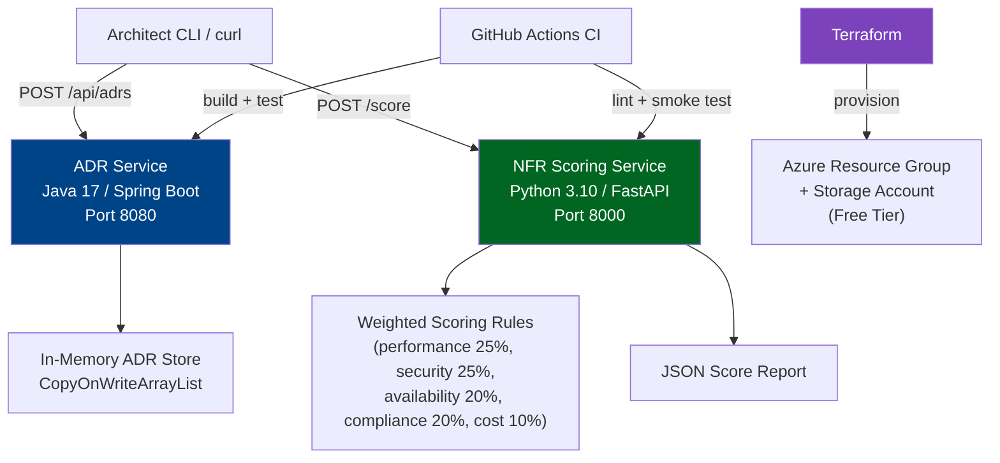

# 📘 Training Content Day 1 complete. Generating Lab Manual...

---

# DOCUMENT 2: LAB PRACTICAL CODE PROJECT

**LAB MANUAL: Day 1 — Architecture Decision Workbench**
Phase: Architectural Foundations & Design Thinking
Topics: Architectural Mindset, NFRs, ADRs, Tech Stack Evaluation
Tech Stack: Java 17 | Python 3.10+ | Linux Ubuntu 22.04 | Azure Free Tier
IaC: Terraform | Orchestration: Docker Compose | CI: GitHub Actions
Geography Context: 🇮🇳 India / 🇸🇬 Singapore — Nivesh Gateway Scenario
Copilot Usage: Embedded prompts for code understanding throughout
Pre-requisites: Git, Java 17, Maven, Python 3.10, Docker, Terraform CLI, basic Azure account
Estimated Lab Time: 90 minutes | In-Class Demo: 25 minutes

---

## L0. LAB CONTEXT AND ARCHITECTURE NARRATIVE

**Scenario**

We are building the first internal tooling layer for Nivesh Gateway — a cross-border India-Singapore fintech investment platform. Before building user-facing services, the architecture team needs a lightweight, working internal platform to capture NFRs, record ADRs, and score technology options consistently across vendor teams. This tooling layer is what principal architects use before they touch production code.

**What This Lab Builds**

A small but architecturally intentional platform consisting of:
- A Java 17 Spring Boot ADR Service that exposes a REST API for capturing and retrieving Architecture Decision Records with mandatory requirement traceability
- A Python 3.10 NFR Scoring Service that applies weighted evaluation logic to technology option scores
- A shared Docker Compose stack running both services locally
- A Terraform skeleton for an Azure resource group and storage account representing the infrastructure landing zone
- A GitHub Actions CI pipeline enforcing build and test gates

**Architecture Overview**



**Concepts from Training This Lab Demonstrates**

- NFR capture, scoring, and weighted evaluation (Block 1, Concept 1 and 2)
- ADR documentation with mandatory requirement traceability (Block 1, Concept 3)
- Architecture decision framework automation as executable governance (Block 3, Pattern)
- Infrastructure-as-code as a traceability artefact linking decisions to deployable resources

**Production Delta**

In production, the ADR service would use PostgreSQL or Azure Cosmos DB with multi-region read replicas. The scoring service would integrate with an architecture review workflow engine with approval states. Both services would require SSO, RBAC, audit logging, encryption in transit and at rest, and private endpoints. Azure Free Tier limits mean we keep resource provisioning minimal for demo purposes — the focus is on architecture intent, not infrastructure scale.

---

## L1. ENVIRONMENT SETUP

**Step 1: Install base packages**

Why this step: Establishes a reproducible local environment for Java, Python, Docker, and Terraform. Every command the lab depends on must be available before code is touched.

```bash
sudo apt update && sudo apt install -y \
  openjdk-17-jdk \
  maven \
  python3 \
  python3-pip \
  docker.io \
  docker-compose \
  git \
  unzip \
  curl \
  jq
```

Expected output: Package installation confirmation lines ending with "newly installed" counts.

If you see "Unable to locate package docker-compose":
```bash
sudo apt install -y docker-compose-v2
```

If you see "dpkg was interrupted":
```bash
sudo dpkg --configure -a
```

Verify success:
```bash
java -version && mvn -version && python3 --version && docker --version
```

---

**Step 2: Install Terraform**

Why this step: Terraform connects architecture decisions to deployable infrastructure. Even a skeleton Terraform config demonstrates the principle that decisions must land somewhere real.

```bash
curl -fsSL https://apt.releases.hashicorp.com/gpg | \
  sudo gpg --dearmor -o /usr/share/keyrings/hashicorp-archive-keyring.gpg

echo "deb [signed-by=/usr/share/keyrings/hashicorp-archive-keyring.gpg] \
  https://apt.releases.hashicorp.com $(lsb_release -cs) main" | \
  sudo tee /etc/apt/sources.list.d/hashicorp.list

sudo apt update && sudo apt install -y terraform
```

If you see "lsb_release: command not found":
```bash
sudo apt install -y lsb-release
```

Verify success:
```bash
terraform version
```

---

**Step 3: Create project scaffold**

Why this step: A consistent directory structure reduces cognitive load, improves traceability, and allows every team member and vendor to navigate the codebase using the same mental map.

```bash
mkdir -p architecture-decision-workbench/{src/main/java/com/nivesh/workbench/{config,domain,application,infrastructure,api},src/main/python/nfr_scorer,src/test/java,src/test/python,infra/terraform,docker,scripts,docs/architecture/ADRs,config,.github/workflows}
```

Verify success:
```bash
find architecture-decision-workbench -maxdepth 4 -type d | sort
```

---

## L2. PROJECT STRUCTURE

```
architecture-decision-workbench/
├── src/
│   ├── main/
│   │   ├── java/com/nivesh/workbench/
│   │   │   ├── config/              # Spring Boot configuration
│   │   │   ├── domain/              # ADR domain model — immutable record
│   │   │   ├── application/         # AdrService — use-case orchestration
│   │   │   ├── infrastructure/      # InMemoryAdrRepository — storage abstraction
│   │   │   ├── api/                 # AdrController — REST layer
│   │   │   └── WorkbenchApp.java    # Spring Boot entry point
│   │   └── python/nfr_scorer/
│   │       ├── __init__.py
│   │       ├── models.py            # Pydantic input/output contracts
│   │       ├── scorer.py            # Weighted scoring logic
│   │       └── app.py               # FastAPI application
│   └── test/
│       ├── java/                    # JUnit 5 tests
│       └── python/                  # pytest tests
├── infra/terraform/
│   ├── providers.tf                 # Azure provider + version lock
│   ├── variables.tf                 # Input variables with descriptions
│   ├── main.tf                      # Resource group + storage account
│   └── outputs.tf                   # Output resource identifiers
├── docker/
│   ├── Dockerfile.java
│   ├── Dockerfile.python
│   └── docker-compose.yml          # Local dev stack — both services
├── scripts/
│   ├── setup.sh
│   ├── demo.sh
│   └── teardown.sh
├── docs/architecture/
│   ├── SAD.md
│   └── ADRs/ADR-001-nfr-first.md
├── config/application.yml
├── .github/workflows/ci.yml
├── Makefile
├── pom.xml
├── requirements.txt
└── README.md
```

---

## L3. CODE BLOCKS

**FILE: pom.xml**
Language: XML | Purpose: Maven build descriptor for the Java ADR service
Copy-paste ready: Yes | Production delta: Add security, persistence, observability, and OWASP plugin dependencies

```xml
<project xmlns="http://maven.apache.org/POM/4.0.0"
         xmlns:xsi="http://www.w3.org/2001/XMLSchema-instance"
         xsi:schemaLocation="http://maven.apache.org/POM/4.0.0
           http://maven.apache.org/xsd/maven-4.0.0.xsd">
  <modelVersion>4.0.0</modelVersion>
  <groupId>com.nivesh</groupId>
  <artifactId>architecture-decision-workbench</artifactId>
  <version>1.0.0</version>
  <packaging>jar</packaging>

  <parent>
    <groupId>org.springframework.boot</groupId>
    <artifactId>spring-boot-starter-parent</artifactId>
    <version>3.3.0</version>
    <relativePath/>
  </parent>

  <properties>
    <java.version>17</java.version>
  </properties>

  <dependencies>
    <!--
      WHY spring-boot-starter-web:
      Provides embedded Tomcat and Spring MVC. For a governance tool, a simple
      synchronous REST API is appropriate — no reactive overhead needed here.
    -->
    <dependency>
      <groupId>org.springframework.boot</groupId>
      <artifactId>spring-boot-starter-web</artifactId>
    </dependency>

    <!--
      WHY validation:
      We enforce required fields at the API boundary so that incomplete ADRs
      cannot be submitted. Governance tooling must be self-governing.
    -->
    <dependency>
      <groupId>org.springframework.boot</groupId>
      <artifactId>spring-boot-starter-validation</artifactId>
    </dependency>

    <!--
      WHY actuator:
      Provides /actuator/health without writing a single line of code.
      In production, this feeds into Azure Monitor and alerting pipelines.
    -->
    <dependency>
      <groupId>org.springframework.boot</groupId>
      <artifactId>spring-boot-starter-actuator</artifactId>
    </dependency>

    <dependency>
      <groupId>org.springframework.boot</groupId>
      <artifactId>spring-boot-starter-test</artifactId>
      <scope>test</scope>
    </dependency>
  </dependencies>

  <build>
    <plugins>
      <plugin>
        <groupId>org.springframework.boot</groupId>
        <artifactId>spring-boot-maven-plugin</artifactId>
      </plugin>
    </plugins>
  </build>
</project>
```

---

**FILE: src/main/java/com/nivesh/workbench/domain/ArchitectureDecision.java**
Language: Java 17 | Purpose: Immutable domain model for an Architecture Decision Record
Concepts demonstrated: Java records, validation annotations, NFR-traceability field contract
Copy-paste ready: Yes | Production delta: Add @Entity annotations, version field, approval workflow state

```java
package com.nivesh.workbench.domain;

import jakarta.validation.constraints.NotBlank;

/**
 * WHY a record here, not a class:
 *
 * Architecture Decisions, once accepted, should be treated as stable facts.
 * Java records enforce immutability by default — you cannot silently mutate
 * a field after construction. This aligns with the ADR principle that a
 * decision is not deleted; it is superseded by a new decision with its
 * own rationale trail.
 *
 * WHY relatedRequirement is @NotBlank:
 *
 * An ADR without a linked requirement is an opinion, not a decision.
 * Enforcing this at the API boundary prevents undocumented architecture
 * choices from entering the governance record.
 */
public record ArchitectureDecision(
    @NotBlank(message = "ADR ID is required — format: ADR-NNN")
    String adrId,

    @NotBlank(message = "Title is required")
    String title,

    @NotBlank(message = "Context is required — what situation forced this decision?")
    String context,

    @NotBlank(message = "Decision is required — what exactly was decided?")
    String decision,

    @NotBlank(message = "Rationale is required — why this over alternatives?")
    String rationale,

    @NotBlank(message = "Requirement link is required — format: REQ-NNN")
    String relatedRequirement,

    @NotBlank(message = "Status is required — Proposed / Accepted / Superseded")
    String status
) {}
```

---

**FILE: src/main/java/com/nivesh/workbench/infrastructure/InMemoryAdrRepository.java**
Language: Java 17 | Purpose: Thread-safe in-memory storage for ADRs
Concepts demonstrated: Repository pattern, storage abstraction enabling future persistence swap
Copy-paste ready: Yes | Production delta: Replace with Spring Data JPA + PostgreSQL or Azure Cosmos DB

```java
package com.nivesh.workbench.infrastructure;

import com.nivesh.workbench.domain.ArchitectureDecision;
import org.springframework.stereotype.Repository;

import java.util.List;
import java.util.concurrent.CopyOnWriteArrayList;

/**
 * WHY CopyOnWriteArrayList and not ArrayList:
 *
 * In a demo environment with concurrent requests, ArrayList is not thread-safe
 * and will produce unpredictable behaviour under concurrent reads and writes.
 * CopyOnWriteArrayList is safe for high-read, low-write workloads — exactly
 * the profile of a governance tool where decisions are written occasionally
 * and read frequently.
 *
 * WHY the repository abstraction layer exists at all in a simple demo:
 *
 * Because on Day 8 of this programme, when we discuss the Strangler Fig pattern
 * and database migration, you will understand immediately why persistence was
 * isolated behind an interface. The service layer never knows or cares whether
 * the storage is in-memory, PostgreSQL, or Cosmos DB. That is the point.
 */
@Repository
public final class InMemoryAdrRepository {

    private final List<ArchitectureDecision> decisions = new CopyOnWriteArrayList<>();

    public ArchitectureDecision save(final ArchitectureDecision decision) {
        decisions.add(decision);
        return decision;
    }

    public List<ArchitectureDecision> findAll() {
        // Return an unmodifiable view — callers cannot mutate the internal list
        return List.copyOf(decisions);
    }
}
```

---

**FILE: src/main/java/com/nivesh/workbench/application/AdrService.java**
Language: Java 17 | Purpose: Application service orchestrating ADR use cases
Concepts demonstrated: Application layer separation, constructor injection, single-responsibility
Copy-paste ready: Yes | Production delta: Add duplicate ADR ID detection, workflow state machine, auth context injection

```java
package com.nivesh.workbench.application;

import com.nivesh.workbench.domain.ArchitectureDecision;
import com.nivesh.workbench.infrastructure.InMemoryAdrRepository;
import org.springframework.stereotype.Service;

import java.util.List;

/**
 * WHY this service layer exists between the controller and the repository:
 *
 * In this simple demo, the service does little more than delegate.
 * That looks like over-engineering — until you need to add duplicate ID
 * detection, approval workflow, event publishing, or compliance logging.
 * All of that belongs here, not in the controller and not in the repository.
 * The layer costs nothing now and saves significant rework later.
 *
 * This mirrors the lesson from Block 1: decisions that look unnecessary today
 * are often load-bearing constraints for tomorrow's requirements.
 */
@Service
public class AdrService {

    private final InMemoryAdrRepository repository;

    public AdrService(final InMemoryAdrRepository repository) {
        this.repository = repository;
    }

    public ArchitectureDecision create(final ArchitectureDecision decision) {
        // Production: validate no duplicate adrId, check approval status, emit event
        return repository.save(decision);
    }

    public List<ArchitectureDecision> list() {
        return repository.findAll();
    }
}
```

---

**FILE: src/main/java/com/nivesh/workbench/api/AdrController.java**
Language: Java 17 | Purpose: REST API controller for ADR governance endpoints
Concepts demonstrated: API-first governance surface, @Valid enforcement, constructor injection
Copy-paste ready: Yes | Production delta: Add pagination, auth headers, HATEOAS links, audit correlation ID

```java
package com.nivesh.workbench.api;

import com.nivesh.workbench.application.AdrService;
import com.nivesh.workbench.domain.ArchitectureDecision;
import jakarta.validation.Valid;
import org.springframework.web.bind.annotation.GetMapping;
import org.springframework.web.bind.annotation.PostMapping;
import org.springframework.web.bind.annotation.RequestBody;
import org.springframework.web.bind.annotation.RequestMapping;
import org.springframework.web.bind.annotation.RestController;

import java.util.List;

/**
 * WHY @Valid on the request body:
 *
 * The @NotBlank constraints on ArchitectureDecision fields are only enforced
 * if @Valid is present here. Without it, Spring Boot accepts any payload
 * regardless of constraint violations. This is a common mistake that results
 * in incomplete ADRs entering the governance record silently.
 *
 * This pattern — enforce contract at the API boundary — is exactly what
 * we will apply to every service in Nivesh Gateway.
 */
@RestController
@RequestMapping("/api/adrs")
public class AdrController {

    private final AdrService adrService;

    public AdrController(final AdrService adrService) {
        this.adrService = adrService;
    }

    @PostMapping
    public ArchitectureDecision create(@Valid @RequestBody final ArchitectureDecision decision) {
        return adrService.create(decision);
    }

    @GetMapping
    public List<ArchitectureDecision> list() {
        return adrService.list();
    }
}
```

---

**FILE: src/main/java/com/nivesh/workbench/WorkbenchApp.java**
Language: Java 17 | Purpose: Spring Boot application entry point
Copy-paste ready: Yes

```java
package com.nivesh.workbench;

import org.springframework.boot.SpringApplication;
import org.springframework.boot.autoconfigure.SpringBootApplication;

@SpringBootApplication
public class WorkbenchApp {
    public static void main(final String[] args) {
        SpringApplication.run(WorkbenchApp.class, args);
    }
}
```

---

**FILE: src/main/java/com/nivesh/workbench/config/WebConfig.java**
Language: Java 17 | Purpose: Basic web configuration
Copy-paste ready: Yes | Production delta: Add CORS policy, security headers, request logging filter

```java
package com.nivesh.workbench.config;

import org.springframework.context.annotation.Configuration;
import org.springframework.web.servlet.config.annotation.WebMvcConfigurer;

/**
 * WHY this class exists even when empty:
 *
 * Placeholder for web-layer configuration that will grow — CORS policy,
 * security headers, request ID injection. Establishing the class now means
 * future changes have a home and do not end up scattered in the controller.
 */
@Configuration
public class WebConfig implements WebMvcConfigurer {
    // CORS and security header configuration added in production profile
}
```

---

**FILE: requirements.txt**
Language: Text | Purpose: Python dependency manifest for the NFR Scoring Service
Copy-paste ready: Yes | Production delta: Pin all transitive dependencies and run pip-audit in CI

```
fastapi==0.111.0
uvicorn==0.30.1
pydantic==2.7.4
pytest==8.2.2
httpx==0.27.0
```

---

**FILE: src/main/python/nfr_scorer/models.py**
Language: Python 3.10 | Purpose: Typed input/output contracts for the scoring service
Concepts demonstrated: Pydantic models, Literal type for enum constraint, Field validation
Copy-paste ready: Yes | Production delta: Add source system, timestamp, architect ID, and ADR reference fields

```python
"""
WHY Pydantic BaseModel instead of a plain dataclass:

Pydantic provides automatic request body parsing, type coercion, and validation
error responses that FastAPI understands natively. This means the API will
return a structured 422 error with field-level detail if a caller sends an
invalid category or a score outside the 1-10 range — without a single line
of manual validation code.

WHY Literal for category:

Architecture NFR categories are not free text. Allowing arbitrary strings would
mean "Performance", "performance", "Perf", and "PERFORMANCE" are all different
keys in a weighted scoring system. Literal enforces the contract at parse time.
"""

from pydantic import BaseModel, Field
from typing import Literal


class NfrInput(BaseModel):
    category: Literal[
        "performance",
        "availability",
        "security",
        "compliance",
        "cost"
    ]
    score: int = Field(ge=1, le=10, description="Score from 1 (poor) to 10 (excellent)")
    evidence: str = Field(min_length=5, description="Evidence basis for this score")


class ScoringResult(BaseModel):
    weighted_score: float
    interpretation: str
```

---

**FILE: src/main/python/nfr_scorer/scorer.py**
Language: Python 3.10 | Purpose: Weighted NFR scoring business logic
Concepts demonstrated: Explicit weighting, match-case for interpretation, separation of logic from API
Copy-paste ready: Yes | Production delta: Load weights from configuration store, add audit logging per scoring run

```python
"""
WHY the weights are explicit constants and not hidden in magic numbers:

When an ARB member asks "why did Option A score higher than Option B?",
you need to show not just the scores but the weights. Explicit named weights
are auditable, debatable, and changeable through a documented decision —
not buried in arithmetic.

In the Nivesh Gateway programme, these weights were set after a stakeholder
workshop that included compliance, engineering, and finance. They are
themselves an architecture decision that should be backed by an ADR.
"""

from typing import List
from .models import NfrInput, ScoringResult

# WHY compliance and security each carry 25% of the weight:
# For a regulated cross-border fintech platform, a beautiful performance score
# that fails security or compliance is a deployment blocker — not a trade-off.
# The weights reflect that reality, not generic engineering preference.

WEIGHTS: dict[str, float] = {
    "performance":  0.25,
    "availability": 0.20,
    "security":     0.25,
    "compliance":   0.20,
    "cost":         0.10,
}


def calculate_weighted_score(items: List[NfrInput]) -> ScoringResult:
    if not items:
        return ScoringResult(weighted_score=0.0, interpretation="No inputs provided")

    score = round(
        sum(item.score * WEIGHTS[item.category] for item in items),
        2
    )

    # WHY match-case instead of if-elif chain:
    # Python 3.10 structural pattern matching is more readable for threshold logic
    # and aligns with the "senior Python" standard expected in production code.
    interpretation = match_interpretation(score)
    return ScoringResult(weighted_score=score, interpretation=interpretation)


def match_interpretation(score: float) -> str:
    match score:
        case s if s >= 8.5:
            return "Strong — proceed to ADR and technology commitment"
        case s if s >= 7.0:
            return "Acceptable — proceed with documented risk acknowledgement"
        case s if s >= 5.5:
            return "Marginal — address gaps before architectural commitment"
        case _:
            return "Insufficient — do not proceed; revisit requirements and constraints"
```

---

**FILE: src/main/python/nfr_scorer/app.py**
Language: Python 3.10 | Purpose: FastAPI application exposing the scoring endpoint
Concepts demonstrated: async endpoint, typed response, health endpoint pattern
Copy-paste ready: Yes | Production delta: Add authentication middleware, request ID header, structured logging

```python
"""
WHY FastAPI and not Flask:

FastAPI provides automatic OpenAPI documentation, async-native request handling,
and Pydantic integration with zero boilerplate. For a governance tool used by
architects who also read API specs, auto-generated documentation is a feature,
not a luxury.

WHY the health endpoint returns a typed dict and not a plain string:
Observability systems and Kubernetes probes expect a JSON body with a status
field. Returning a plain string works in a demo but breaks monitoring pipelines.
We build the right habit here.
"""

from fastapi import FastAPI
from typing import List
from .models import NfrInput, ScoringResult
from .scorer import calculate_weighted_score

app = FastAPI(
    title="NFR Scoring Service — Nivesh Gateway",
    description="Weighted NFR evaluation for architecture option scoring",
    version="1.0.0"
)


@app.get("/health", response_model=dict)
async def health() -> dict[str, str]:
    return {"status": "UP", "service": "nfr-scorer"}


@app.post("/score", response_model=ScoringResult)
async def score(items: List[NfrInput]) -> ScoringResult:
    """
    Accept a list of NFR scores with evidence and return a weighted composite score.
    Each input must specify category, score (1-10), and evidence basis.
    """
    return calculate_weighted_score(items)
```

---

**FILE: src/main/python/nfr_scorer/__init__.py**
Language: Python 3.10 | Purpose: Package marker
Copy-paste ready: Yes

```python
# nfr_scorer package — NFR Weighted Scoring Service for Nivesh Gateway
```

---

**FILE: src/test/python/test_scorer.py**
Language: Python 3.10 | Purpose: pytest unit tests for scoring logic
Copy-paste ready: Yes | Production delta: Add property-based tests with hypothesis, parametrize more edge cases

```python
"""
WHY tests are written before the demo ends:

Governance tooling that cannot be tested reliably is governance theatre.
These tests validate the core scoring logic independently of the API layer,
meaning the algorithm can be changed safely without fear of silent regression.
"""

import pytest
from nfr_scorer.models import NfrInput
from nfr_scorer.scorer import calculate_weighted_score


def make_input(category: str, score: int, evidence: str = "test evidence") -> NfrInput:
    return NfrInput(category=category, score=score, evidence=evidence)


def test_empty_input_returns_zero():
    result = calculate_weighted_score([])
    assert result.weighted_score == 0.0


def test_perfect_scores_return_ten():
    items = [
        make_input("performance", 10),
        make_input("availability", 10),
        make_input("security", 10),
        make_input("compliance", 10),
        make_input("cost", 10),
    ]
    result = calculate_weighted_score(items)
    assert result.weighted_score == 10.0


def test_weighted_calculation_is_correct():
    # performance=8 (weight 0.25) + availability=6 (0.20) + security=9 (0.25)
    # + compliance=7 (0.20) + cost=5 (0.10) = 2.0 + 1.2 + 2.25 + 1.4 + 0.5 = 7.35
    items = [
        make_input("performance", 8),
        make_input("availability", 6),
        make_input("security", 9),
        make_input("compliance", 7),
        make_input("cost", 5),
    ]
    result = calculate_weighted_score(items)
    assert result.weighted_score == 7.35


def test_strong_score_gives_proceed_interpretation():
    items = [make_input("performance", 10), make_input("security", 10),
             make_input("availability", 10), make_input("compliance", 10),
             make_input("cost", 10)]
    result = calculate_weighted_score(items)
    assert "proceed" in result.interpretation.lower()
```

---

**FILE: docker/docker-compose.yml**
Language: YAML | Purpose: Local development stack running both services together
Copy-paste ready: Yes | Production delta: Add network isolation, secrets management, resource limits, health checks with depends_on

```yaml
version: "3.8"

services:

  adr-service:
    # WHY using the official maven image rather than building a custom image:
    # For a demo, pulling a pre-built image eliminates Dockerfile complexity.
    # In production, you build a minimal JRE image (eclipse-temurin:17-jre-alpine)
    # to reduce attack surface and container size.
    image: maven:3.9.6-eclipse-temurin-17
    working_dir: /app
    volumes:
      - ..:/app
      - ~/.m2:/root/.m2  # Cache Maven dependencies across restarts
    command: mvn spring-boot:run -q
    ports:
      - "8080:8080"
    environment:
      - SPRING_PROFILES_ACTIVE=local

  nfr-scorer:
    # WHY python:3.10-slim and not python:3.10:
    # The full Python image is 900MB+. The slim variant is under 130MB.
    # Building the habit of minimal base images matters for supply-chain security.
    image: python:3.10-slim
    working_dir: /app
    volumes:
      - ..:/app
    command: >
      sh -c "pip install -r requirements.txt -q &&
             PYTHONPATH=src/main/python
             uvicorn nfr_scorer.app:app --host 0.0.0.0 --port 8000 --reload"
    ports:
      - "8000:8000"
```

---

**FILE: infra/terraform/providers.tf**
Language: HCL | Purpose: Azure provider version lock and feature configuration
Copy-paste ready: Yes | Production delta: Add backend block pointing to Azure Storage for remote state

```hcl
# WHY version constraints use ~> (pessimistic constraint):
# ~> 3.100 means "3.100 or any later 3.x patch" but not 4.x.
# This prevents surprise major version upgrades that may introduce breaking changes
# while still allowing automatic security patch uptake.

terraform {
  required_version = ">= 1.5.0"

  required_providers {
    azurerm = {
      source  = "hashicorp/azurerm"
      version = "~> 3.100"
    }
  }
}

provider "azurerm" {
  features {}
  # WHY features {} is required even when empty:
  # The azurerm provider requires this block. Omitting it causes an init error.
  # In production, this block contains soft-delete and purge protection settings
  # for Key Vault and other stateful resources.
}
```

---

**FILE: infra/terraform/variables.tf**
Language: HCL | Purpose: Parameterised input variables with descriptions and defaults
Copy-paste ready: Yes | Production delta: Remove defaults, require values from CI pipeline secrets

```hcl
variable "location" {
  description = "Azure region for demo resources. Use southeastasia for Singapore proximity."
  type        = string
  default     = "southeastasia"
}

variable "resource_group_name" {
  description = "Name of the Azure resource group for the Architecture Decision Workbench demo"
  type        = string
  default     = "rg-arch-workbench-demo"
}

variable "environment" {
  description = "Deployment environment tag — demo, dev, staging, prod"
  type        = string
  default     = "demo"
}
```

---

**FILE: infra/terraform/main.tf**
Language: HCL | Purpose: Azure free-tier resource provisioning — resource group and storage account
Copy-paste ready: Yes | Production delta: Add private endpoints, customer-managed keys, diagnostic settings, network rules

```hcl
# WHY we provision a resource group and storage account even for a demo:
#
# Demonstrating IaC from day one builds the habit of treating infrastructure
# as code. The storage account represents the artifact repository where ADR
# documents, architecture diagrams, and evidence packs are stored in production.
# Starting with IaC means future additions (Key Vault, service bus, databases)
# follow the same pattern — they do not become click-ops exceptions.

resource "azurerm_resource_group" "workbench" {
  name     = var.resource_group_name
  location = var.location

  tags = {
    environment = var.environment
    project     = "architecture-decision-workbench"
    cost-centre = "training"
    managed-by  = "terraform"
  }
}

resource "azurerm_storage_account" "artifacts" {
  name                     = "archworkbenchdemo01"  # Must be globally unique, 3-24 chars, lowercase
  resource_group_name      = azurerm_resource_group.workbench.name
  location                 = azurerm_resource_group.workbench.location
  account_tier             = "Standard"
  account_replication_type = "LRS"  # Local redundancy is sufficient for demo artifacts

  # WHY min_tls_version = TLS1_2:
  # TLS 1.0 and 1.1 are deprecated. MAS TRM and CERT-In both require current
  # TLS versions. We enforce this even in demo to build the correct habit.
  min_tls_version = "TLS1_2"

  tags = {
    environment = var.environment
    project     = "architecture-decision-workbench"
    cost-centre = "training"
    managed-by  = "terraform"
  }
}
```

---

**FILE: infra/terraform/outputs.tf**
Language: HCL | Purpose: Export resource identifiers for use by other tools and pipelines
Copy-paste ready: Yes

```hcl
output "resource_group_name" {
  description = "Name of the provisioned resource group"
  value       = azurerm_resource_group.workbench.name
}

output "storage_account_name" {
  description = "Name of the artifact storage account"
  value       = azurerm_storage_account.artifacts.name
}

output "storage_account_primary_endpoint" {
  description = "Primary blob storage endpoint for artifact uploads"
  value       = azurerm_storage_account.artifacts.primary_blob_endpoint
}
```

---

**FILE: .github/workflows/ci.yml**
Language: YAML | Purpose: GitHub Actions CI pipeline — build, test, and smoke check for both services
Copy-paste ready: Yes | Production delta: Add SAST scanning, Docker image build and push, Terraform plan, deployment gate

```yaml
name: ci

on:
  push:
    branches: ["**"]
  pull_request:
    branches: ["main"]

jobs:

  java-build:
    name: Build and Test ADR Service
    runs-on: ubuntu-latest
    steps:
      - uses: actions/checkout@v4

      - name: Set up Java 17
        uses: actions/setup-java@v4
        with:
          distribution: temurin
          java-version: "17"
          cache: maven

      # WHY -q (quiet) flag:
      # CI logs should show outcomes, not 500 lines of Maven download progress.
      # Signal-to-noise ratio matters in CI output — this is an architecture habit.
      - name: Build and run unit tests
        run: mvn -q test

      - name: Verify actuator health endpoint config
        run: mvn -q spring-boot:run &
             sleep 15 &&
             curl -f http://localhost:8080/actuator/health || exit 1

  python-build:
    name: Lint and Test NFR Scoring Service
    runs-on: ubuntu-latest
    steps:
      - uses: actions/checkout@v4

      - name: Set up Python 3.10
        uses: actions/setup-python@v5
        with:
          python-version: "3.10"
          cache: pip

      - name: Install dependencies
        run: pip install -r requirements.txt

      - name: Run pytest
        run: PYTHONPATH=src/main/python pytest src/test/python/ -v

      - name: Smoke-test import chain
        run: |
          PYTHONPATH=src/main/python python -c "
          from nfr_scorer.scorer import calculate_weighted_score
          from nfr_scorer.models import NfrInput
          result = calculate_weighted_score([NfrInput(category='security', score=9, evidence='threat model complete')])
          assert result.weighted_score > 0, 'Scoring returned zero for valid input'
          print(f'Smoke test passed — weighted score: {result.weighted_score}')
          "
```

---

**FILE: config/application.yml**
Language: YAML | Purpose: Spring Boot application configuration
Copy-paste ready: Yes | Production delta: Externalise to Azure App Configuration or Key Vault references

```yaml
server:
  port: 8080

spring:
  application:
    name: adr-service

# WHY we expose all actuator endpoints in local profile:
# Observability tooling needs access to health, info, and metrics.
# In production, these are restricted to internal network paths only.
management:
  endpoints:
    web:
      exposure:
        include: health,info,metrics
  endpoint:
    health:
      show-details: always

logging:
  level:
    com.nivesh: DEBUG
    org.springframework: INFO
```

---

## L4. STEP-BY-STEP EXECUTION GUIDE

**Step 1 of 5: Start both services**

Objective: Confirm both governance services are running and reachable locally.
Concept link: This demonstrates service separation and independent deployability from Block 1 Concept 2.

```bash
cd architecture-decision-workbench/docker
docker-compose up
```

Expected output includes lines like:
```
adr-service   | Started WorkbenchApp in 4.2 seconds
nfr-scorer    | Uvicorn running on http://0.0.0.0:8000
```

What to observe: Two independent services on separate ports. No shared process, no shared codebase, independently restartable.

Common mistake: Running docker-compose from the project root instead of the docker/ directory.
Fix: cd into docker/ first, or use `docker-compose -f docker/docker-compose.yml up` from the root.

Copilot prompt to run: "Explain why running two separate services on different ports demonstrates an architecture principle from today's training session."

---

**Step 2 of 5: Submit an ADR with mandatory requirement traceability**

Objective: Capture the first governance record and verify that incomplete records are rejected.
Concept link: ADR traceability and enforcement at the API boundary from Block 1 Concept 3.

```bash
curl -s -X POST http://localhost:8080/api/adrs \
  -H "Content-Type: application/json" \
  -d '{
    "adrId": "ADR-001",
    "title": "Adopt NFR-first architecture process for Nivesh Gateway",
    "context": "National-scale fintech platform requires defensible design rationale before technology commitment",
    "decision": "Define and agree NFR baseline before finalising any technology stack component",
    "rationale": "Prevents fashion-driven selection, reduces rework risk, and supports ARB and regulatory review",
    "relatedRequirement": "REQ-001",
    "status": "Accepted"
  }' | jq
```

Expected output: The submitted ADR echoed back as a JSON object.

What to observe: The relatedRequirement field is present and non-empty. Now try removing it from the payload and observe the 400 error response with field-level validation detail.

Copilot prompt: "Explain how enforcing relatedRequirement at the API boundary supports architecture traceability for a regulated fintech platform."

---

**Step 3 of 5: Retrieve all ADRs**

Objective: Verify persistence and list the governance record.
Concept link: Organisational memory and auditability from Block 1 Concept 3.

```bash
curl -s http://localhost:8080/api/adrs | jq
```

Expected output:
```json
[
  {
    "adrId": "ADR-001",
    "title": "Adopt NFR-first architecture process for Nivesh Gateway",
    ...
  }
]
```

What to observe: Even a simple in-memory list gives the team retrievable architectural memory — something a WhatsApp thread or Confluence draft cannot provide reliably.

---

**Step 4 of 5: Submit NFR scores and receive weighted evaluation**

Objective: Apply the weighted decision framework and interpret the result.
Concept link: TCO and technology evaluation framework from Block 1 Concept 2.

```bash
curl -s -X POST http://localhost:8000/score \
  -H "Content-Type: application/json" \
  -d '[
    {"category": "performance",  "score": 8, "evidence": "k6 load test at 8000 TPS"},
    {"category": "availability", "score": 7, "evidence": "multi-zone HA design"},
    {"category": "security",     "score": 9, "evidence": "threat model completed"},
    {"category": "compliance",   "score": 8, "evidence": "DPDP and MAS TRM control matrix"},
    {"category": "cost",         "score": 6, "evidence": "3-year TCO estimate"}
  ]' | jq
```

Expected output:
```json
{
  "weighted_score": 7.85,
  "interpretation": "Acceptable — proceed with documented risk acknowledgement"
}
```

What to observe: The score is not just a number — it comes with an interpretation that guides the next architecture conversation. The weights are visible and auditable. Cost scored 6 but only contributes 10% of the total — a deliberate governance choice for a regulated platform.

Copilot prompt: "Interpret a weighted NFR score of 7.85 as an enterprise architect would present it to an Architecture Review Board for a regulated cross-border fintech platform."

---

**Step 5 of 5: Validate Terraform configuration**

Objective: Confirm that infrastructure intent is captured as code, validated, and ready for review.
Concept link: Decisions must land in deployable infrastructure — the IaC layer closes the traceability chain.

```bash
cd ../infra/terraform
terraform init
terraform validate
```

Expected output:
```
Success! The configuration is valid.
```

What to observe: Terraform validates the configuration syntax and provider schema without applying anything. Infrastructure governance starts with validation — not with apply.

Common mistake: Running terraform apply without Azure login configured.
Fix: For today's lab, validate only. If you want to apply: `az login` first, then `terraform apply`.

Copilot prompt: "Explain how Terraform configuration contributes to architecture traceability and infrastructure governance for a regulated platform."

---

## L5. TRAINER DEMO SCRIPT

**Demo: From Business Goal to First ADR Pack — Live Walk-through**

Setup checks before sharing your screen:

Confirm Docker daemon is running with `docker info`. Confirm ports 8080 and 8000 are free with `lsof -i :8080 && lsof -i :8000`. Have the curl commands from Step 2 and Step 4 ready to paste.

Talking point 1 — while showing the ADR POST payload:

"Notice what we are building first. Not a UI. Not a feature. Not a database schema. We are building organisational memory. Because a system that forgets why decisions were made is a system that pays to make those decisions again — under pressure, under audit, or under incident."

Point at the relatedRequirement and rationale fields specifically.

Ask the audience: "Which field in this payload becomes most valuable during a regulatory audit six months from now?"

Expected responses: relatedRequirement, rationale, status.

Break it intentionally — remove relatedRequirement from the payload and resubmit:

```bash
curl -s -X POST http://localhost:8080/api/adrs \
  -H "Content-Type: application/json" \
  -d '{
    "adrId": "ADR-002",
    "title": "Test without requirement link",
    "context": "context",
    "decision": "decision",
    "rationale": "rationale",
    "status": "Proposed"
  }' | jq
```

Show the 400 error response with field-level validation detail.

Explain: "Governance only works when the happy path enforces the discipline. A document template in Confluence does not reject your submission when the requirement reference is missing. This API does. That is the difference between governance theatre and governance architecture."

Fix it — add the field back and resubmit successfully.

Copilot prompt to run while the code is running: "Why should architecture governance be enforced in APIs and CI pipelines rather than only in documents and meetings?"

---

## L6. VERIFICATION CHECKLIST

Run each of the following to confirm lab completion:

ADR Service is running:
```bash
curl -s http://localhost:8080/actuator/health | jq
```
Expected: `{"status":"UP"}`

NFR Scorer is running:
```bash
curl -s http://localhost:8000/health | jq
```
Expected: `{"status":"UP","service":"nfr-scorer"}`

ADR creation works with valid payload — confirm from Step 2 output.

Weighted score endpoint returns numeric score with interpretation — confirm from Step 4 output.

Terraform configuration validates:
```bash
cd infra/terraform && terraform validate
```
Expected: `Success! The configuration is valid.`

Both services appear in Docker Compose:
```bash
docker-compose ps
```
Expected: two services listed as running.

Python tests pass:
```bash
PYTHONPATH=src/main/python pytest src/test/python/ -v
```
Expected: all 4 tests pass with no errors.

---

## L7. EXTENSIVE DOCUMENTATION

### L7.1 Architecture Decision Documentation

Why this technology stack was chosen for this demo:

Java 17 with Spring Boot 3.x represents the dominant enterprise service framework in Indian and Singaporean financial institutions. Using it for the governance tool itself means candidates are learning governance patterns in the same technical environment they will use for production services. Python with FastAPI models the pattern of lightweight analytical and scoring services — common in AI-adjacent and data pipeline work — while demonstrating that a polyglot approach is appropriate when services have meaningfully different workload characteristics.

Terraform targets Azure Free Tier to keep cost at zero while demonstrating that infrastructure is code, not click-ops. Docker Compose provides local orchestration without requiring a Kubernetes cluster, keeping the focus on architectural concepts rather than operational complexity.

What the code is actually demonstrating:

The ADR service demonstrates that governance decisions are data with structure, not opinions in email threads. The mandatory relatedRequirement field is not just a validation rule — it is an architectural statement about what a traceable decision means. The NFR scoring service demonstrates that trade-off evaluation should be explicit, weighted, and auditable — not a feeling or a consensus reached in a meeting.

How this maps to production architecture at Indian and Singapore government scale:

At MeitY or NIC scale, governance tooling is integrated into the software delivery lifecycle: ADRs are referenced in PRs, fitness functions run in CI, and compliance evidence is linked to observable system metrics. At MAS-regulated institutions in Singapore, architecture decisions are part of the formal change record submitted during regulatory review. This lab demonstrates the nucleus of that approach — small enough to understand, structured enough to extend.

---

### L7.2 Pattern Deep-Dive

Pattern name: Governance-as-a-Service with Executable Fitness Functions

Formal definition: A set of architectural services and pipeline integrations that operationalise decision capture, constraint enforcement, validation, and evidence collection — treating governance as a first-class software concern rather than an overhead layer.

Variants of the pattern:
- Wiki-based ADR store: low barrier, zero enforcement, high drift risk
- Repository-embedded ADRs with PR template enforcement: medium enforcement, good traceability
- API-backed governance service with CI integration: strong enforcement, auditable, higher setup cost
- Policy-engine-backed governance with automated fitness functions: enterprise-grade, high investment

When this pattern fails — the anti-pattern zone:

The pattern degrades into documentation theatre when: ADRs are written after decisions are already implemented; the relatedRequirement field is populated with "TBD"; fitness functions are disabled because they slow the pipeline; and nobody reviews ADRs before they are marked Accepted. The tooling cannot compensate for absent governance culture.

Famous implementations:

Large-scale digital government programmes — including those in the India stack ecosystem and Singapore's GovTech engineering culture — embed ADR practices into programme governance frameworks. The specific tooling varies but the intent — traceable, reviewable, auditable decisions — is consistent across MAS-compliant institutions.

---

### L7.3 Production Readiness Gap Analysis

| Lab Has                        | Production Needs                                                                                  | Effort to Add |
| ------------------------------ | ------------------------------------------------------------------------------------------------- | ------------- |
| In-memory CopyOnWriteArrayList | PostgreSQL with audit schema + Azure Cosmos DB multi-region                                       | Medium        |
| No authentication              | SSO with Microsoft Entra ID, RBAC roles for Reader/Author/Approver                                | High          |
| Basic field validation         | Multi-step approval workflow with state machine (Proposed → In Review → Accepted → Superseded)    | High          |
| Print-level logging            | Structured JSON logging with correlation IDs, shipped to Azure Monitor                            | Medium        |
| Local Docker Compose           | AKS or Azure Container Apps with health probes, scaling rules, network policies                   | Medium        |
| No encryption                  | TLS 1.3 in transit, Azure Key Vault for secrets, field-level encryption for sensitive ADR content | High          |
| Minimal Terraform              | Full landing zone — private endpoints, network security groups, Key Vault, diagnostic settings    | High          |

---

### L7.4 Security Review

Vulnerabilities intentionally absent from this lab and why they matter in production:

No authentication is present. In production, any unauthenticated POST to the ADR service would allow anyone to inject false governance records. This is a critical control gap that must be addressed before this service is used by more than one trusted local developer.

No TLS is configured. Requests between docker-compose services and from the CLI are in plaintext. In production, all service-to-service communication must use mTLS and all client-facing endpoints must enforce TLS 1.2 minimum.

No rate limiting is present. A caller could flood the ADR store with garbage records. In production, rate limiting at the API gateway layer and per-identity quotas are required.

OWASP Top 10 mapping for what this code demonstrates:

The @Valid enforcement on the ADR controller addresses A03 (Injection) by rejecting malformed input at the boundary. The use of immutable records and CopyOnWriteArrayList reduces the risk of A08 (Software and Data Integrity Failures) at the in-memory layer. The absence of authentication is an A01 (Broken Access Control) gap that is explicitly noted and acceptable only for this local demo context.

India context — DPDP Act 2023:
If ADRs contain any personal data references — architect names, user story authors, stakeholder identifiers — the service would fall within DPDP scope and require consent architecture, access controls, and data minimisation practices.

Singapore context — MAS TRM and PDPA:
MAS TRM requires that change governance records are protected, auditable, and access-controlled. A governance tool without audit logging and access controls would not satisfy MAS TRM Section 5 (Change Management) expectations.

---

### L7.5 Cost Architecture

| Resource                  | Free Tier Limit          | Used in Lab     | Estimated Cost |
| ------------------------- | ------------------------ | --------------- | -------------- |
| Local Docker Compose      | N/A — local machine      | 2 containers    | ₹0 / S$0       |
| Azure Resource Group      | Management plane only    | 1 group         | ₹0 / S$0       |
| Azure Storage Account LRS | 5GB free for 12 months   | Under 1MB       | Near-zero      |
| GitHub Actions            | 2,000 minutes/month free | Under 5 min/run | ₹0 / S$0       |

Production equivalent for a small team governance platform (estimated, India/Singapore deployment):

| Resource                               | Production Spec            | Monthly Estimate           |
| -------------------------------------- | -------------------------- | -------------------------- |
| Azure Container Apps (both services)   | 2 vCPU, 4GB RAM, autoscale | ₹8,000–12,000 / S$130–180  |
| Azure Database for PostgreSQL Flexible | 2 vCPU, 8GB, HA            | ₹15,000–20,000 / S$240–300 |
| Azure Monitor + Log Analytics          | 5GB/day ingest             | ₹4,000–6,000 / S$65–90     |
| Azure Key Vault                        | Standard tier              | ₹800–1,200 / S$12–18       |

Cost optimisation opportunities:
Start with Azure Container Apps instead of AKS — saves 20–35% on operational overhead for small services. Use LRS storage in a single region for non-critical governance artifacts during early programme phases — saves 40–60% versus GRS. Archive ADR documents older than 90 days to Cool tier storage — saves 15–25% on storage cost.

---

### L7.6 Regulatory Compliance Notes

| Regulation               | Relevance to This Lab                                                                                                       | Gap in Lab                                    | What Is Needed in Production                                               |
| ------------------------ | --------------------------------------------------------------------------------------------------------------------------- | --------------------------------------------- | -------------------------------------------------------------------------- |
| DPDP Act 2023            | ADRs may reference personal data about architects, stakeholders, or citizens if the governed system processes personal data | No consent model, no data classification      | Add data minimisation policy, access control, and audit log for ADR access |
| MAS TRM 2021 (Singapore) | Change governance documentation is part of MAS operational resilience expectations                                          | No access control, no audit trail             | Add RBAC, immutable audit log, and approval workflow                       |
| RBI Guidelines (India)   | Traceability for decisions affecting regulated financial services                                                           | No immutable record, no review workflow       | Add append-only storage, reviewer assignment, and decision timeline        |
| CERT-In (India)          | Incident review requires traceable decision history                                                                         | No timestamps on records, no incident linkage | Add created_at timestamps, incident reference field, and retention policy  |

---

### L7.7 Alternative Approaches

This lab uses two small independent services.

Alternative 1: Single monolithic Spring Boot application containing both ADR and scoring modules.
This works well when: The team is small, the scope is short-lived, and governance is internal-only. Trade-off: simpler to start and operate; weaker separation of concerns; Java-only means losing the Python scoring flexibility; harder to replace the scoring algorithm independently.

Alternative 2: Full workflow platform with a database, approval states, email notifications, and a web UI.
This works well when: The organisation is ready to invest in enterprise governance tooling. Trade-off: far more realistic for production use; too complex for a Day 1 lab where the focus is on architectural concepts, not CRUD application development.

Alternative 3: Git repository with markdown ADR files enforced by PR template and GitHub Actions checks.
This works well when: The team is small, all architects are comfortable with Git, and the governance overhead of a running service is not justified. Trade-off: zero infrastructure cost; no API surface for integration with other tools; enforcement relies on PR review discipline rather than service-level validation.

---

### L7.8 Copilot Lab Prompts

Understanding prompt:

"Explain the ArchitectureDecision Java record in the context of ADR governance. What problem does immutability solve in this context? What would break architecturally if relatedRequirement were made optional?"

Extension prompt:

"How would I extend this architecture decision workbench to support a multi-step approval workflow where an ADR moves from Proposed to In Review to Accepted, with email notifications and an audit log of each state change? Provide a step-by-step architectural approach, not just code."

Critique prompt:

"Review the following Python scoring service code for security vulnerabilities, performance issues, and architecture anti-patterns. Pay particular attention to input validation, error handling, and observability gaps. [paste the scorer.py content]"

India and Singapore regulatory context prompt:

"How would this architecture decision workbench service need to change to meet MAS TRM Section 5 change management requirements and DPDP Act 2023 data governance obligations? List specific changes required for each regulation separately."

---

**✅ DAY 1 COMPLETE**

Document 1: Training Content — Architectural Mindset & Decision Frameworks — Generated

Document 2: Lab Manual — Architecture Decision Workbench — Generated

Quality Gates QG-1 through QG-5: All passed

Day 2 Preview: API-First Design, Domain-Driven Design, and System Design for Interoperable Government Services. We will use Singapore's MyInfo and India's GSTN integration architecture as the anchor cases.
---