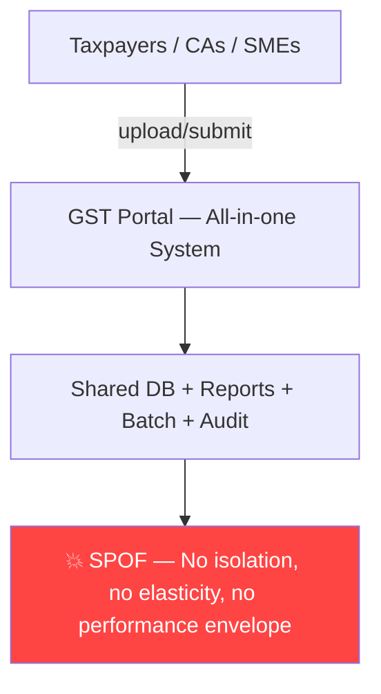
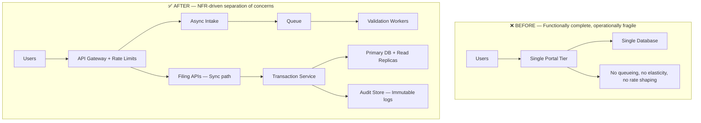
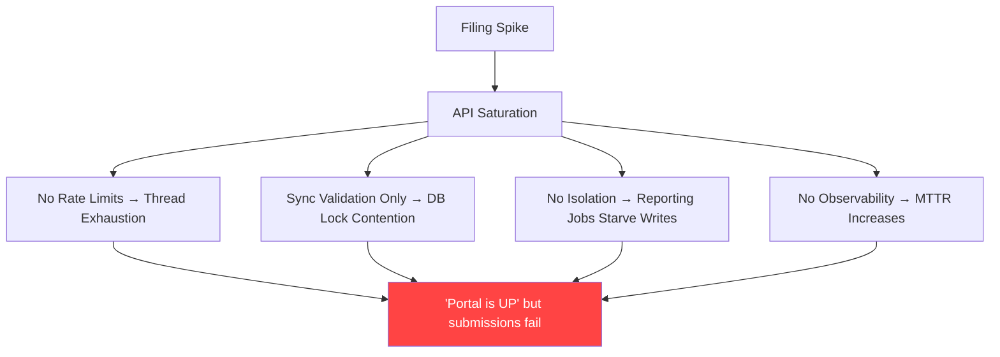
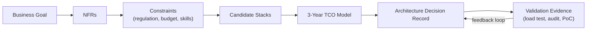
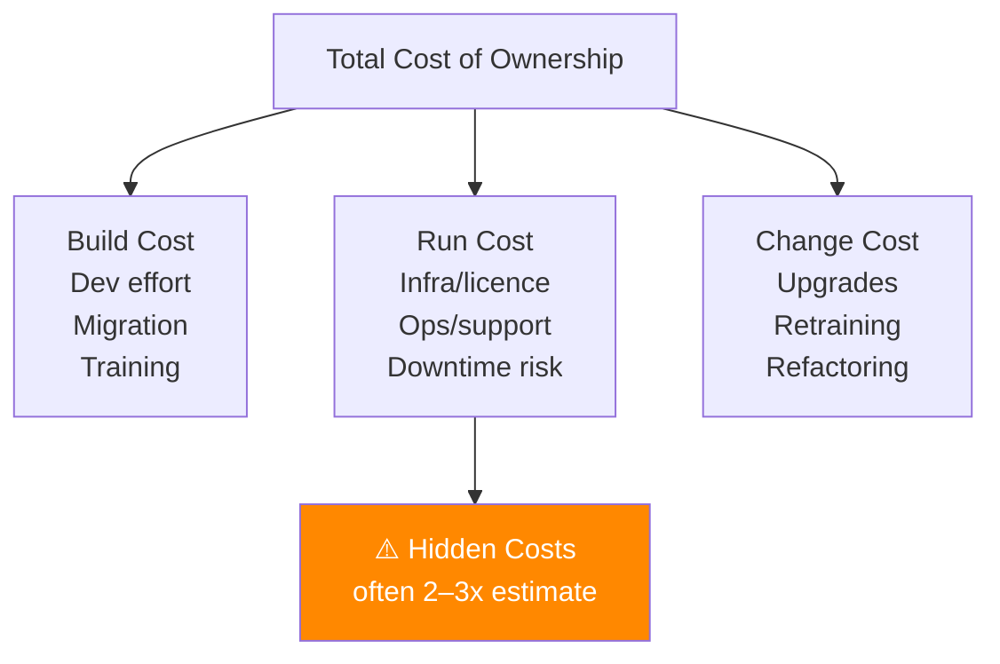
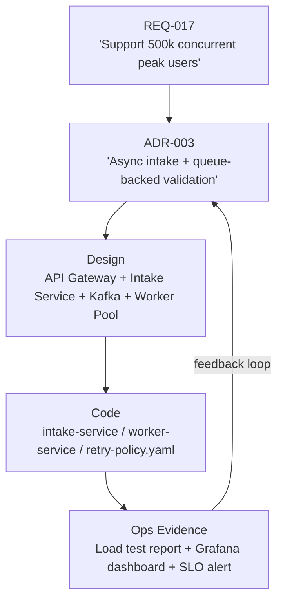
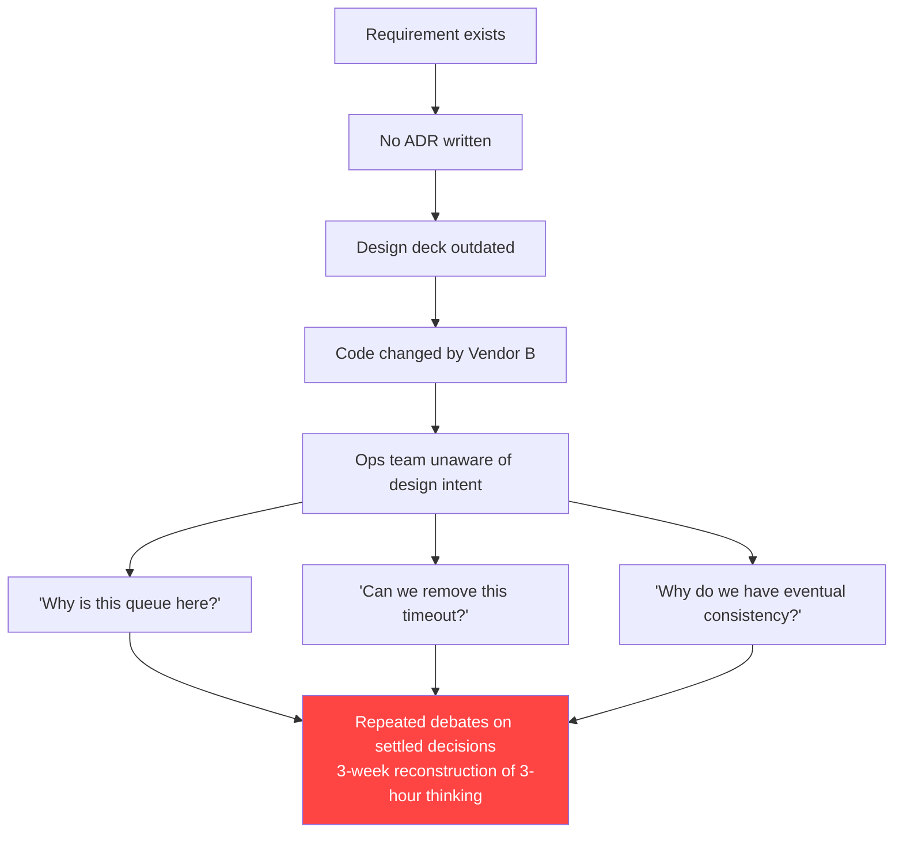
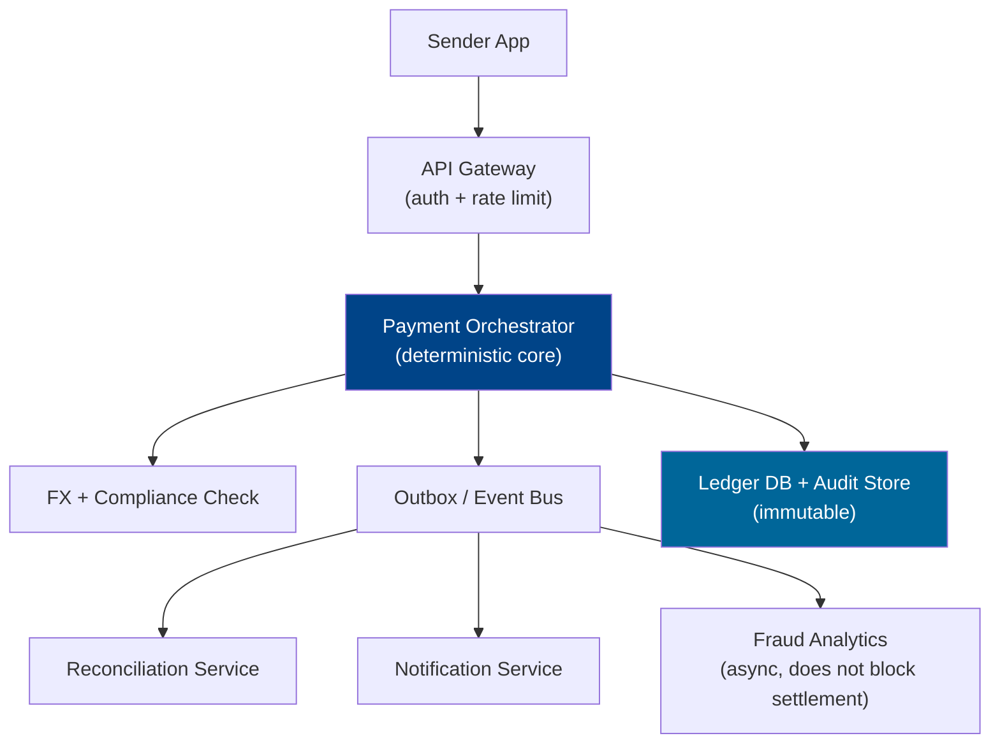
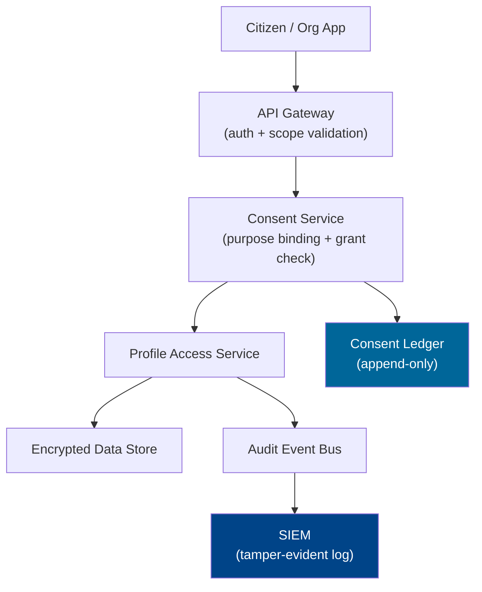
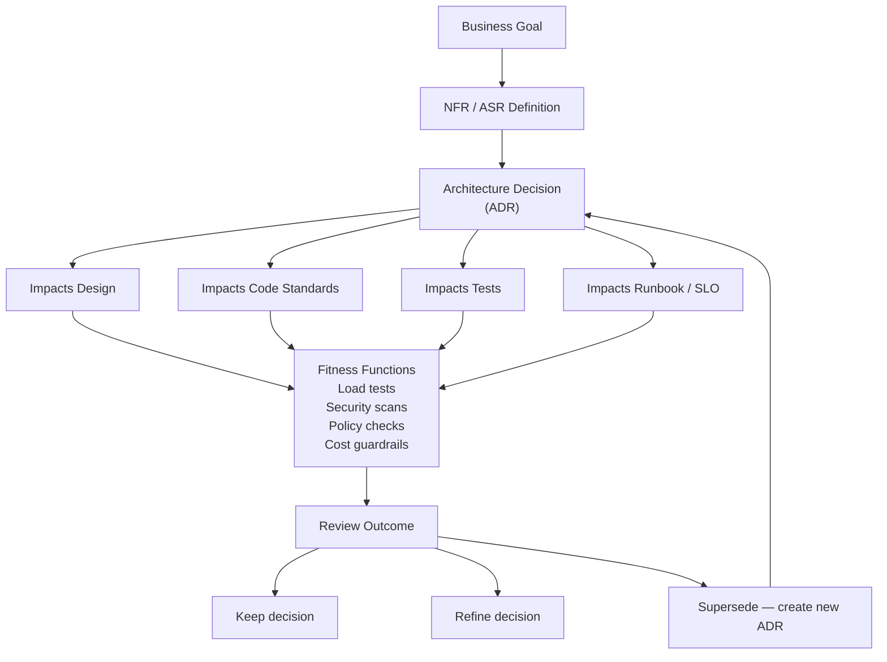

# DOCUMENT 1: TRAINING CONTENT MATERIAL

**ENTERPRISE SOLUTION ARCHITECTURE TRAINING**
Phase: Architectural Foundations & Design Thinking
Day: 1 of 14 | Session: 09:00–13:30 (4.5 Hours) | Break: 11:10–11:20
Topics: Architectural Mindset & Decision Frameworks
Subtopics: NFRs, Trade-offs, Gov-Scale Constraints, Tech Stack Selection & TCO, ADRs, Traceability (Req→Design→Code), Business Goals→Architecture Mapping
Geography Focus: 🇮🇳 India | 🇸🇬 Singapore | Cross-Border Scenarios
Leadership Level: Technology Manager / Enterprise Solution Architect
Difficulty: Senior/Enterprise SA Level
Copilot Integration: Active — Prompts embedded throughout

---

## SECTION 0: SESSION OPEN (09:00–09:05) — 5 MINUTES

**TRAINER ENERGY SETTER**

Open with this statement:

> "India moved from demonetisation queues in 2016 to 10 billion UPI transactions a month by 2023. That did not happen because somebody wrote elegant code. It happened because somebody made brutal architecture decisions under national-scale constraints — and documented them well enough that the next team could build on them without starting over."

News Hook — Search this before class:
"DBS outage 2023 MAS TRM root cause architecture lessons"

Today's Big Question:
"How do we make architecture decisions that survive scale, regulation, outages, and board scrutiny — not just sprint demos?"

Agenda Flash for the day:
- Move from coder thinking to architect thinking using NFRs and trade-offs
- Learn to justify tech stack choices with TCO, constraints, and ADRs
- Practice translating business goals into traceable architecture decisions

---

## SECTION 1: RECAP RITUAL (09:05–09:15) — 10 MINUTES

**🔁 RECAP RITUAL: Day 0 → Day 1 Bridge**

**Part A: Concept Flashback (2–3 minutes)**

Trainer narrates the following story naturally — do not read it verbatim, paraphrase it:

"Before entering this room, you completed a baseline assessment that exposed one uncomfortable truth: most senior engineers can describe systems in detail, but far fewer can defend the decisions behind them. Yesterday's real lesson was not about assessment scores. It was about identifying where your thinking is still implementation-first rather than architecture-first. Today we start correcting that by moving from code choices to decision frameworks — and we will use real-world failures from India and Singapore to make it stick."

**Part B: Rapid-Fire Quiz (5–7 minutes)**

Trainer picks candidates randomly. No hints. No explanations during rapid-fire — collect answers and debrief at the end.

| #    | Question                                                                      | Expected Answer                                                                                  |
| ---- | ----------------------------------------------------------------------------- | ------------------------------------------------------------------------------------------------ |
| RF-1 | What is the difference between a functional requirement and an NFR?           | Functional says what the system does; NFR says how well and under what constraints it must do it |
| RF-2 | What is the first red flag in a senior engineer-to-architect transition?      | Choosing technology before understanding constraints                                             |
| RF-3 | What does TCO stand for in an architecture evaluation?                        | Total Cost of Ownership                                                                          |
| RF-4 | Why do architects formally document decisions?                                | For traceability, accountability, and future trade-off clarity                                   |
| RF-5 | At government scale, which matters more: elegant code or operational fitness? | Operational fitness aligned to business and regulatory reality                                   |

Trainer Note: Award a whiteboard point for each correct answer. Run a scoreboard for healthy competition. If fewer than 3 out of 5 are correct, slow the pace of Block 1 — the group needs more grounding.

**Part C: Bridge Statement (30 seconds)**

"The assessment showed where thinking is weak. Today we build the decision muscle that separates a senior developer from an enterprise architect."

---

## SECTION 2: BLOCK 1 — CORE CONCEPT TEACHING (09:15–10:15) — 60 MINUTES

### CONCEPT 1: NFRs and Trade-offs at Government Scale

**THE PROBLEM STATEMENT**

**Real World Problem: GST Midnight Rollout — Functional Success, Architectural Failure Windows**
Geography: 🇮🇳 India | Domain: Government / Enterprise

July 2017. GST launched at national scale with a hard, politically immovable deadline. Multiple taxpayer workflows — return filings, invoice uploads, state-central reconciliation — had to work from day one. The public conversation focused on whether features existed. The real architectural question was whether the platform could survive filing spikes, changing form structures, integration variability across state systems, and midnight policy-driven cutover.

In most programmes under this kind of pressure, teams optimise for functional completeness: all screens present, all APIs available, all workflows mapped. But under GST-like conditions, the first system killer is almost never missing functionality. It is weak NFR definition — no performance envelope, vague availability targets, no capacity planning, no graceful degradation specification, no audit architecture, and no traceable design rationale connecting business requirements to implementation choices.

The pain this creates is measurable. Filing surges produce severe latency spikes, timeout chains, and taxpayer backlogs at the worst possible moment. Statutory deadlines create compliance risk. And when the system is technically "available" but practically unusable, the reputational damage is disproportionate because public trust in digital government is fragile and hard to rebuild.

The question on the table: "If you were the Chief Architect at GSTN, how would you turn vague stakeholder expectations into enforceable, measurable architectural NFRs?"

---

**MENTAL MODEL: "The Flyover, Not the Car"**

Layer 1 — Analogy:
In Bengaluru or Mumbai, people obsess over the car model — the brand, the engine, the interior. But traffic collapses because the flyover design, choke points, and lane planning were wrong. The car was fine. The infrastructure around it failed. In software architecture, developers often debate frameworks and libraries — the car — while the real system failure comes from throughput ceilings, missing failure isolation, and poor load distribution — the flyover.

Layer 2 — Technical Definition (Architect Grade):
Non-functional requirements define the measurable operational characteristics and constraints under which a system must satisfy its functional objectives. These include latency targets, throughput envelopes, availability SLAs, durability and recoverability guarantees, security boundaries, observability depth, compliance obligations, and cost thresholds.

Layer 3 — Under the Hood:
NFRs drive every significant structural decision. They determine capacity models, data partitioning strategy, consistency model selection, retry and timeout budget design, RTO and RPO targets, network zone architecture, security controls, runbook design, and FinOps thresholds. Trade-offs emerge naturally from NFRs because strong guarantees in one dimension — say, strong consistency — almost always increase cost, latency, complexity, or operational toil in another.

Certification Link: AZ-305 — Design identity, governance, monitoring, and business continuity solutions. AWS SAP — Well-Architected trade-off analysis. TOGAF ADM Phase B — Business Architecture and constraint modelling.

---

**VISUAL ARCHITECTURE DIAGRAMS**

Diagram 1: System Context — Poor NFR Thinking



Diagram 2: Before vs After — NFR-Driven Architecture



Diagram 3: Failure Mode — No NFR Architecture



---

**ARCHITECTURE DECISION RECORD**

ADR-001: Define NFR Baseline Before Technology Selection

| Field                | Detail                                                                                                                                                                                                               |
| -------------------- | -------------------------------------------------------------------------------------------------------------------------------------------------------------------------------------------------------------------- |
| Date                 | 2017-06-01 (simulated, aligned to GST programme)                                                                                                                                                                     |
| Status               | Accepted                                                                                                                                                                                                             |
| Context              | National tax platform required a hard launch under a legal deadline with uncertain concurrency profiles and changing workflow definitions across 29 states                                                           |
| Decision             | Establish a mandatory NFR baseline covering p95 latency targets, peak concurrency model, RTO/RPO, audit immutability, rate-limiting thresholds, and supportability SLIs — before finalising any technology component |
| Rationale            | Technology-first discussions were creating false confidence. NFR-first sequencing forces architecture to align to operational reality before commitments are made                                                    |
| Positive Consequence | Better traceability from risk to design; reduced rework in testing and operations phases                                                                                                                             |
| Trade-off            | Slower early design conversations; requires performance, security, and operations teams in earlier review cycles                                                                                                     |
| Compliance Note      | Supports auditability and incident accountability expectations under CERT-In, MeitY programme governance, and analogous MAS TRM control thinking in Singapore                                                        |

---

### CONCEPT 2: Tech Stack Selection Framework and TCO

**THE PROBLEM STATEMENT**

**Real World Problem: DBS Technology Governance — Premium Stack, Operational Fitness?**
Geography: 🇸🇬 Singapore | Domain: Banking

In banking, architecture teams often justify technology choices using capability language: cloud-native, real-time, event-driven, AI-ready. These are not wrong descriptors — but they are incomplete ones. A bank like DBS operates under continuous MAS scrutiny, elevated customer trust expectations, and systemic importance designations. The architecture question is never just "Can this stack do what we need?" It is always "Can we run it safely, patch it responsibly, observe it clearly, govern it under audit, and recover it under pressure with the team we currently have?"

A fashionable stack with weak internal capability can become expensive technical theatre. Licence cost is only one line item in the evaluation. True TCO includes people capability and hiring cost, vendor support contracts, platform operational complexity, performance tuning effort, migration cost when the relationship ends, vendor lock-in exposure, compliance tooling requirements, and the blast radius of downtime events. All of these need to be on the table before a choice is made.

The pain this creates: outage costs are measured in customer trust erosion, regulator attention, and transaction revenue loss. MAS TRM places heavy emphasis on resilience and risk governance. Hidden TCO from operational complexity and specialist dependency regularly exceeds original licence estimates by two to three times over a five-year horizon.

The question on the table: "If two stacks both meet functional requirements, how do you choose the one the organisation can actually sustain safely?"

---

**MENTAL MODEL: "Buying a Condo vs Renting the Penthouse"**

Layer 1 — Analogy:
In Singapore, the expensive apartment is never just about the purchase price. Maintenance fees, sinking fund obligations, location liquidity risk, proximity to MRT, and long-term affordability across your career arc all matter. You might rent the penthouse for a year, but you would never buy one on a single engineer's salary without stress-testing the numbers. Technology stack decisions deserve the same rigour.

Layer 2 — Technical Definition (Architect Grade):
Technology stack selection is a multi-criteria decision process that evaluates functional fit, NFR fit, lifecycle cost across build/run/change phases, organisational capability, regulatory suitability, portability risk, and operational sustainability over a defined planning horizon — typically three to five years.

Layer 3 — Under the Hood:
A rigorous selection framework uses weighted criteria scoring, scenario-based evaluation, cost modelling across acquisition, implementation, operations, and exit, sensitivity analysis for key assumptions, and explicit documentation of what happens if those assumptions turn out to be wrong. The output is an ADR backed by evidence — not a vendor preference backed by a sales deck.

Certification Link: AWS SAP — Cost optimisation and design trade-off analysis. AZ-305 — Solution design and cost architecture. TOGAF — Architecture Governance and Opportunities and Solutions phases.

---

**VISUAL ARCHITECTURE DIAGRAMS**

Diagram 4: Technology Evaluation Flow



Diagram 5: TCO Component Breakdown



---

**ARCHITECTURE DECISION RECORD**

ADR-002: Use Weighted Technology Evaluation Matrix for Stack Selection

| Field                | Detail                                                                                                                                                                                         |
| -------------------- | ---------------------------------------------------------------------------------------------------------------------------------------------------------------------------------------------- |
| Date                 | 2025-06-11                                                                                                                                                                                     |
| Status               | Accepted                                                                                                                                                                                       |
| Context              | Platform team must choose service runtime, persistence layer, and integration stack for a regulated cross-border platform serving India and Singapore under DPDP Act 2023 and MAS TRM          |
| Decision             | All major technology choices require weighted scoring across performance, scalability, compliance, operability, team capability, vendor risk, and 3-year TCO before any selection is finalised |
| Rationale            | Prevents fashion-driven selection, creates board-defensible rationale, and surfaces hidden cost assumptions early                                                                              |
| Positive Consequence | Better procurement discussions, stronger ARB presentations, and reduced vendor relationship risk                                                                                               |
| Trade-off            | Requires accurate skills and cost data, which may not always be available early                                                                                                                |
| Compliance Note      | Strengthens governance evidence under MAS TRM, internal audit, vendor review, and public-sector procurement scrutiny in both India and Singapore                                               |

---

### CONCEPT 3: ADRs and Requirement-to-Code Traceability

**THE PROBLEM STATEMENT**

**Real World Problem: CoWIN Scale-Up — Fast Decisions, Future Organisational Amnesia**
Geography: 🇮🇳 India | Domain: Crisis / Government

During COVID-era platform scale-up, systems worldwide made life-saving architecture decisions under extraordinary speed: queue introduction, caching layers, throttling controls, read replicas, request prioritisation, retry policies, and regional data distribution. The danger in crisis architecture is not only that wrong decisions get made under pressure. It is that decisions — good and bad — go undocumented.

Six months after launch, when teams rotate, new vendors arrive, traffic patterns change, or an auditor asks why a particular control was chosen or why a specific data retention period was implemented, nobody in the room remembers. The original architect has moved on. The Confluence page was never updated. The Slack thread is inaccessible. And now the team is spending three weeks reconstructing what took three hours to decide in the first place.

Undocumented architecture creates organisational amnesia. Code exists. Diagrams may exist in a stale PowerPoint. But the reasoning disappears. Teams then accidentally reverse essential constraints, remove safeguards that were critical, or duplicate mistakes that were already learned and paid for.

The question on the table: "How do we make architecture rationale survive people changes, delivery pressure, and the passage of time?"

---

**MENTAL MODEL: "Temple Inscriptions vs WhatsApp Memory"**

Layer 1 — Analogy:
If the governance rules of a town are passed only by word of mouth across generations, they mutate with each retelling until nobody agrees on the original intent. Inscribed rules endure. An ADR is an architecture inscription: concise, versioned, durable, and reviewable by anyone who comes after.

Layer 2 — Technical Definition (Architect Grade):
An Architecture Decision Record is a lightweight, version-controlled document that captures context, decision, rationale, alternatives considered, consequences, and current status for a significant architectural choice. Traceability is the discipline of linking that decision forward to the business driver that created it, the requirement it satisfies, the components it affects, the controls it introduces, and the operational evidence that validates it.

Layer 3 — Under the Hood:
Good traceability maps requirement IDs to ADRs, ADRs to services and modules, ADRs to security controls and runbooks, and eventually to observable signals in production. This supports impact analysis when requirements change, auditability when decisions are questioned, change governance when new components are introduced, and safer modernisation when legacy systems are being replaced.

Certification Link: TOGAF governance and requirements management. Azure design governance and change control. AWS Well-Architected documentation discipline.

---

**VISUAL ARCHITECTURE DIAGRAMS**

Diagram 6: Requirement-to-Evidence Traceability Chain



Diagram 7: The Cost of No Traceability



---

**ARCHITECTURE DECISION RECORD**

ADR-003: Standardise ADR Template with Requirement Traceability

| Field                | Detail                                                                                                                                                                                                            |
| -------------------- | ----------------------------------------------------------------------------------------------------------------------------------------------------------------------------------------------------------------- |
| Date                 | 2025-06-11                                                                                                                                                                                                        |
| Status               | Accepted                                                                                                                                                                                                          |
| Context              | Teams working across multiple vendors, phases, and compliance environments need a stable method to preserve decision rationale and connect it to implementation evidence                                          |
| Decision             | Every significant architectural choice must be recorded using a standard ADR format that explicitly links to requirement IDs, impacted components, introduced controls, relevant tests, and rollback implications |
| Rationale            | Lightweight enough for consistent adoption; rigorous enough for change governance and audit scrutiny                                                                                                              |
| Positive Consequence | Reduces design drift, shortens review friction, and makes incident forensics faster                                                                                                                               |
| Trade-off            | Adds documentation overhead if team discipline is inconsistent                                                                                                                                                    |
| Compliance Note      | Supports audit evidence under DPDP Act governance, CERT-In incident review obligations, MAS TRM documentation expectations, and PDPA accountability norms in Singapore                                            |

---

## SECTION 3: CHECKPOINT 1 (10:15–10:25) — 10 MINUTES

**🎯 CHECKPOINT 1: Depth Probe — NFRs, TCO, ADRs**

**Question 1 — Recall**

Ask this as a senior architect would:

"Tell me the difference between a system requirement and an architecture-significant requirement, and explain why that distinction matters when you're making platform decisions."

A strong answer will include: architecture-significant requirements materially affect structure and technology selection; they typically relate to scale, security, availability, compliance, or latency; they drive decisions rather than just populating backlog items.

Red flags: says all requirements are equal; treats NFRs as optional or post-design concerns.

Follow-up probe if they answer well: "Which ASRs would force you to reject a preferred technology stack?"

Copilot Prompt to run live: "Explain the difference between functional requirements, non-functional requirements, and architecture-significant requirements for a government digital platform serving 10 million users."

---

**Question 2 — Scenario**

"You are the Lead Architect at GovTech Singapore building a citizen service API. The product owner says: 'Just make it fast and secure.' What exact clarification questions do you ask before accepting that design brief?"

A strong answer will include: specific latency target, percentile, workload model, and concurrency assumptions; auth model, identity assurance level, audit requirements, encryption standards, and data residency; uptime target, RTO/RPO, support hours, and regulatory obligations.

Red flags: accepts "fast" and "secure" as sufficient guidance; proposes no measurable thresholds.

Follow-up probe: "What if the service must also support third-party commercial banks as consumers?"

Copilot Prompt to run live: "Generate 15 architecture clarification questions for a citizen API platform in Singapore subject to PDPA and MAS-style security expectations."

---

**Question 3 — Trade-off**

"Compare managed PaaS versus self-managed Kubernetes, specifically for a regulated cross-border government-adjacent platform spanning India and Singapore. I want a proper trade-off analysis, not a features list."

A strong answer will include: PaaS reduces operational toil and accelerates delivery but may constrain security controls and customisation; Kubernetes improves portability and fine-grained control but increases complexity and skills cost significantly; the correct choice depends on compliance control requirements, team maturity, workload profile, and 3-year TCO — not on trend preference.

Red flags: "Kubernetes is always better for serious platforms"; ignores TCO and platform team capability.

Follow-up probe: "How would your answer change if procurement rules lock you to a single cloud provider?"

Copilot Prompt to run live: "Compare Azure App Service, AKS, and self-managed Kubernetes for a regulated fintech platform with India and Singapore compliance needs. Include TCO considerations."

---

**Question 4 — Flaw Finder**

Present this flawed design description and ask the group to find three architectural flaws:

"The system uses a single shared relational database, performs PDF generation synchronously inside the user submission flow, and writes application logs to the same database as transactional data."

A strong answer will include: shared database creates read/write contention and increases blast radius; synchronous document generation increases p95 latency and couples failure paths; co-located logs and transaction data creates compliance, performance, and forensic separation problems.

Red flags: comments only on coding style; misses operational and compliance-level flaws entirely.

Follow-up probe: "Which of the three would you fix first with a single sprint?"

Copilot Prompt to run live: "Review this architecture description and identify scalability, resilience, and compliance flaws for a high-volume tax submission platform."

---

**Question 5 — Whiteboard**

"In two minutes, sketch a minimum viable architecture for a citizen benefits disbursement portal. I want to see explicit NFR controls for scale, audit, and resilience — not just boxes and arrows."

A strong answer will include: ingress/API layer, async processing path, durable store, independent audit trail, and basic observability signal. At least one explicit NFR-to-component mapping should be visible on the sketch.

Red flags: draws only screens and a database; no resilience or compliance thinking present.

Follow-up probe: "Where specifically would you place rate limiting and why?"

Copilot Prompt to run live: "Give me a review checklist for a whiteboard architecture covering scale, audit, and resilience for a government citizen portal."

---

## SECTION 4: BLOCK 2 — ADVANCED CONCEPTS + USE CASES (10:25–11:10) — 45 MINUTES

**USE CASE 1: UPI-PayNow Cross-Border Corridor — Choosing for Operability, Not Fashion**

Geography: 🌏 Cross-Border | Domain: Banking / Government

A cross-border real-time payment corridor between India and Singapore must bridge differing domestic rails, FX processing, fraud controls, support models, and regulatory expectations from two separate central banks. The business requirement sounds clean: instant, 24x7, low-cost payments. What the architect actually hears is: hard availability expectations, immutable audit trails for regulatory examination, fraud analytics with near-real-time detection, reconciliation integrity that survives partial failures, and a regulator-grade incident trail that both RBI and MAS can inspect.

The temptation in such programmes is to over-engineer with maximum novelty — event mesh everywhere, polyglot persistence for each microservice, service mesh from day one, multiple workflow engines running in parallel. But cross-border payments punish unnecessary moving parts severely. Every additional component is another failure mode, another reconciliation edge case, another runbook to write. The better design is not the most impressive diagram. It is the architecture with the smallest blast radius, the cleanest reconciliation path, and the most supportable operational model across two jurisdictions.

Scale parameters for this scenario:

| Parameter             | Value                              |
| --------------------- | ---------------------------------- |
| Concurrent Users      | 1.5 million                        |
| Peak Transactions/sec | 8,000                              |
| Data Volume           | 25 TB/year operational + audit     |
| Regulatory Deadline   | 9-month go-live                    |
| Budget Constraint     | 18% of total transformation budget |

Solution Architecture:



Pattern applied: Transactional Core with Event-Carried Side Effects. The money movement path is deterministic and synchronous. All downstream enrichment — notifications, fraud scoring, reconciliation — is asynchronous and does not block settlement.

Why not a fully choreographed saga: harder reconciliation debugging and difficult incident forensics across two regulatory jurisdictions.

Why not a shared monolith: too much release coupling, excessive blast radius, and insufficient separation for dual-regulator audit.

Crime and loophole angle: Poor idempotency design and weak reconciliation logic can enable duplicate settlement attacks, replay abuse during retry storms, or delayed fraud detection windows that allow smurfing patterns to go unnoticed.

Results: Lower operational complexity with a deterministic, auditable core. Cleaner explanation path for both RBI and MAS during regulatory review. Reduced duplicate-processing risk.

---

**USE CASE 2: MyInfo-Style Citizen Data Access — Traceability as a Trust Control**

Geography: 🇸🇬 Singapore | Domain: Government

A government platform exposes citizen profile data — identity, address, income, CPF contributions — to approved relying parties such as banks, insurers, and employers. The citizen experience must be smooth and fast, but public trust in the system depends entirely on a different dimension: knowing who accessed what, under which consent grant, for which declared purpose, and what system enforced the policy at the moment of access.

Teams often focus engineering effort on API response design, OAuth 2.0 flow implementation, and page load times. They underinvest in the architecture of accountability: the consent model decision, the token scoping rationale, the audit schema design, the log retention policy, and the non-repudiation architecture. When a data access dispute occurs, the quality of your architecture is judged not by the elegance of your API design but by the quality of evidence you can produce. Could you reconstruct the complete decision path from requirement to control to runtime access event?

Scale parameters:

| Parameter           | Value                              |
| ------------------- | ---------------------------------- |
| Concurrent Users    | 300,000                            |
| Transactions/sec    | 2,500                              |
| Data Volume         | 8 TB/year logs and consent records |
| Regulatory Deadline | 6 months                           |
| Budget Constraint   | S$4.5 million                      |

Solution Architecture:



Pattern applied: Policy Enforcement Point with Immutable Audit Trail. Every access decision passes through explicit consent validation before data is returned.

Why not direct database access via a shared service account: breaks least-privilege principle and makes per-citizen access accounting impossible.

Why not logging inside the application layer only: produces weak evidentiary separation; a compromised application could suppress its own access logs.

Crime and loophole angle: Missing purpose-binding at the token level and weak scope enforcement can enable silent over-access by approved parties — or internal misuse that looks legitimate in system logs.

Results: Clear accountability for every access event. Faster incident forensics. Stronger PDPA-aligned governance with defensible evidence trail.

---

## SECTION 5: BREAK (11:10–11:20) — STRICT 10 MINUTES

Display this on screen during the break:

**10-Minute Break**

A thought to carry back to your seat:

"If your system meets every single feature requirement but misses its peak-day latency target, is that a software defect or an architecture failure? And who owns it?"

Optional Copilot Prompt to try on your phone during the break:

"List the top 10 non-functional requirements for a government-scale digital payments platform in India and Singapore, with specific measurable examples for each."

Session resumes at 11:20 sharp.

---

## SECTION 6: BLOCK 3 — ARCHITECTURE PATTERNS + CHAOS SCENARIOS (11:20–12:00) — 40 MINUTES

### A. ARCHITECTURE PATTERNS DEEP DIVE

**Pattern: Architecture Fitness Function + ADR Governance Loop**

This pattern operationalises the connection between documented decisions and measurable system behaviour. Instead of treating ADRs as static documents, you treat them as the specification for automated and manual validation checks — fitness functions — that confirm the architecture is still behaving according to its stated rationale.



When to use this pattern:
- Multiple teams or vendors are involved and design drift is a real risk
- Regulatory evidence is required and decisions need to be linked to observable system behaviour
- NFRs are non-trivial and failure to meet them has contractual or regulatory consequences
- The system has a multi-year lifecycle and the team will inevitably rotate

When not to rely on this pattern alone:
- The team lacks the discipline to maintain living documentation
- Leadership wants delivery speed but is unwilling to fund governance overhead
- Decisions are genuinely trivial and entirely local to a single module with no downstream impact

Implementation considerations on Azure Free Tier:
Use a GitHub repository for ADR markdown files with a clear naming convention. Use GitHub Actions PR templates to enforce that every non-trivial change references an ADR. Use lightweight k6 performance assertions and markdown evidence links. Keep observability within Azure Monitor free tier limits by being selective about what you instrument first.

Java 17 concept-level snippet — why records work for decision models:

```java
// WHY: record keeps the ADR model immutable by default. Architecture decisions,
// once accepted, should be stable facts — not mutable bags of properties
// that drift silently across layers of the codebase.
public record ArchitectureDecision(
        String adrId,
        String title,
        String status,
        String relatedRequirement,
        String validationEvidence) {
}
```

Python 3.10 concept-level snippet — why dataclasses with slots for fitness checks:

```python
from dataclasses import dataclass

# WHY: __slots__ reduces memory overhead for objects we create frequently
# during pipeline validation runs — important at governance-pipeline scale.
@dataclass(slots=True)
class FitnessCheck:
    adr_id: str
    check_name: str
    passed: bool
    evidence_path: str
```

---

### B. CHAOS & PRESSURE SIMULATION

**🔥 CHAOS SCENARIO: Budget Day Benefits Portal Meltdown**

Severity: P0 | Simulated Time: 09:12 IST | Geography: 🇮🇳 India

Trainer reads this aloud before discussion:

"It is Union Budget day. A citizen welfare benefits portal opens a new subsidy enrollment window at precisely 09:00. By 09:12, p95 latency has jumped from 420 milliseconds to 11.8 seconds. Error rate is now sitting at 19 percent. The Minister's office is calling. TV channels are showing spinning wheels. The Operations team Slack channel is flooding: DB CPU at 97 percent, thread pool exhausted, PDF generator timeout, cache miss storm. At 09:14, a journalist posts: 'Digital India or Digital Queue?' The CTO wants a status update in 90 seconds."

Give candidates 3 minutes of silent thinking time before opening the floor.

Blast Radius Analysis:

| Dimension         | Detail                                                                                                 |
| ----------------- | ------------------------------------------------------------------------------------------------------ |
| Directly Affected | Enrollment API, synchronous document generation, primary database                                      |
| Cascade Risk      | Notification service, audit writes, admin dashboard — all will fail within 15 minutes if not contained |
| Data Risk         | Incomplete application states, audit trail gaps, PII exposure in verbose retry log output              |
| Financial Impact  | ₹7–12 lakh equivalent per minute in operational and reputational cost                                  |

Wrong Approaches — show these first and ask the group to identify why they are wrong:

Wrong Approach 1: Restart every pod immediately.
Why it is wrong: Cold starts make the queue backlog worse and remove the diagnostic data needed to understand root cause.

Wrong Approach 2: Disable all application logging to improve throughput.
Why it is wrong: Destroys forensic visibility and likely violates accountability obligations under public-sector audit requirements.

Correct Response Architecture:

Immediate actions — 0 to 5 minutes:
Freeze non-essential background workloads. Apply emergency rate limiting on new session creation. Disable the synchronous PDF generation path and switch to an async acknowledgment flow. Protect the audit write channel from being starved.

Short-term containment — 5 to 30 minutes:
Introduce a queue-backed document generation path. Isolate read and reporting traffic from the write path. Add temporary cache warming for the most common data access patterns and apply admission control at the API gateway.

Recovery — 30 minutes to 2 hours:
Restore degraded user flow first — acknowledgment over completeness. Then backfill outstanding documents and reconcile incomplete application states.

Post-incident architecture changes:
Define hard NFRs with specific peak-day load profiles. Write an ADR for async document generation — this decision should never have been undocumented. Build a k6 load test that models budget-day traffic. Separate the audit write path onto a dedicated channel with its own resource allocation. Add SLO breach alerts before the next high-traffic event.

Post-Mortem Summary:

| Field                     | Detail                                                                                                  |
| ------------------------- | ------------------------------------------------------------------------------------------------------- |
| Detection                 | 09:05                                                                                                   |
| Escalation                | 09:12                                                                                                   |
| Degraded Service Restored | 10:02                                                                                                   |
| Root Cause                | Synchronous heavy document path embedded inside the hot transaction flow with shared database resources |
| Contributing Factor 1     | No peak-day load model existed — budget day traffic was never modelled                                  |
| Contributing Factor 2     | Shared database contention with background reporting jobs consuming write throughput                    |
| Contributing Factor 3     | No architecture traceability for earlier warning signs in performance test history                      |
| Action Item 1             | ADR for async document architecture — Owner: Chief Architect — due in 7 days                            |
| Action Item 2             | k6 peak-profile fitness test suite — Owner: SRE Lead — due in 10 days                                   |
| Action Item 3             | Audit isolation design — Owner: Security Architect — due in 14 days                                     |

---

## SECTION 7: CHECKPOINT 2 (12:00–12:10) — 10 MINUTES

**🎯 CHECKPOINT 2: Scenario Debate — Decision Frameworks Under Pressure**

**Question 1 — Pattern Application Debate**

"Two architects are disagreeing. Architect A wants PaaS-first because it reduces operational overhead and gets to market faster. Architect B wants Kubernetes now because it gives future portability and flexibility. This is for a regulated India-Singapore fintech corridor. Both of you take a side and argue it properly — not from personal preference."

A strong answer will start from workload characteristics, team skills, control requirements, portability risk, and TCO — not from tribal preference. It will acknowledge that future flexibility has a present cost that must be justified. It may propose a phased evolution if uncertainty is genuinely high.

Red flags: arguing from personal preference alone; ignoring operational maturity; treating "flexibility" as a free option.

Follow-up probe: "What ADR would you write today to prevent revisiting this debate every sprint?"

Copilot Prompt to run live — ask the group to critique the output:
"Debate PaaS-first versus Kubernetes-first for a regulated fintech platform with India DPDP Act 2023 and Singapore MAS TRM considerations. Provide balanced, evidence-based arguments for both positions."

---

**Question 2 — Management Escalation**

"The CTO corners you in the corridor and asks: 'Why are you slowing my delivery team down with ADR workshops and NFR sessions? I need features, not documents.' You have 90 seconds. Respond in board language, not engineer language."

A strong answer will frame ADRs and NFR workshops in business impact terms: they reduce rework cost, reduce audit and regulatory exposure, reduce the cost and duration of future incidents, and make vendor management cleaner. They do not slow delivery — they accelerate the right kind of delivery.

Red flags: saying "best practice" without quantifying business impact; being unable to translate governance value into cost and risk avoided.

Follow-up probe: "Give me the 30-second version for the CFO who only cares about budget."

Copilot Prompt to run live:
"Rewrite this architecture governance rationale as a short executive note for a CTO focused on risk reduction, delivery speed, and cost predictability."

---

**Question 3 — Cross-Border Consideration**

"If a single digital platform serves both Indian investors and Singapore-regulated products, which architecture decision categories absolutely must consider both jurisdictions from the very first design session — not as an afterthought?"

A strong answer will cover: data residency and localisation requirements, privacy and consent obligations under DPDP Act 2023 and PDPA Singapore, breach notification timelines and processes, identity assurance and authentication standards, audit log retention and format, vendor hosting restrictions, incident communication obligations to both regulators, and encryption standards.

Red flags: treating compliance as a post-design checklist; assuming that one country's rules can simply be copied and applied to the other.

Follow-up probe: "What if business wants a single shared data lake for analytics across both geographies?"

Copilot Prompt to run live:
"List architecture decision categories that must explicitly consider both India's DPDP Act 2023 and Singapore's PDPA and MAS TRM for a shared digital investment platform."

---

**Question 4 — Copilot Validation Exercise**

Run this Copilot prompt live and critique the output as a group:

"Generate a complete architecture for a cross-border fintech platform connecting India and Singapore, including technology stack, database choices, deployment model, and security controls."

Ask the group: What did Copilot get right? What is missing? What assumptions did it make without stating them? What would a principal architect add that Copilot did not include?

Teaching point: Copilot produces plausible-sounding outputs. The architect's job is to evaluate whether those outputs are contextually appropriate, constraint-aware, and compliance-ready — or just technically coherent in isolation.

---

## SECTION 8: BATTLE DRILL — HANDS-ON EXERCISE (12:10–12:40) — 30 MINUTES

**⚡ BATTLE DRILL 1: From Business Goal to First ADR Pack**

Time: 12:10–12:40 | Hard stop at 12:40 | Format: Pairs

Scenario Brief:

A new cross-border platform called Nivesh Gateway must allow Indian retail investors to access regulated Singapore investment products. The launch target is 9 months. First release must support investor onboarding, KYC initiation, portfolio visibility, and funding request initiation. The board has given you the following requirements: low latency, secure, compliant, scalable, and cost-effective. In architectural terms, they have given you almost no useful information. Your job is to turn that into something actionable.

Your Mission — produce the following in 30 minutes:

- A one-page architecture decision flow diagram showing how business goals connect to architecture decisions
- Top 3 architecture-significant requirements with measurable thresholds
- Top 3 ADRs using the template format from today's session
- An executive summary in 3 bullets written for a CTO and CFO who do not read technical documents

Tools available: whiteboard or paper, Microsoft Copilot under the rules below, Azure Portal read-only browsing, and your personal session notes.

Copilot Rules for this drill:
You may use Copilot to validate your approach after you have drafted it yourself. You may not ask Copilot to generate the architecture directly. Your Copilot prompts will be shown and evaluated as part of your score.

Evaluation Rubric:

| Dimension                           | Score   |
| ----------------------------------- | ------- |
| Architecture Completeness           | /10     |
| Non-Functional Requirements         | /10     |
| Trade-off Articulation              | /10     |
| Scalability and Resilience Thinking | /10     |
| Security Posture and Compliance     | /10     |
| Copilot Usage Quality               | /5      |
| Communication Clarity               | /5      |
| **Total**                           | **/60** |

Feedback Template for trainer use after presentations:

What worked well in this submission:
What is missing compared to a principal architect-level submission:
What a principal architect would add that this submission did not include:
Certification alignment: this exercise maps to AZ-305 design governance domain, AWS SAP trade-off analysis, and TOGAF requirements and architecture governance.

---

## SECTION 9: DOCUMENTATION TEMPLATES + PROFESSIONAL COMMUNICATION

### ⬆️ LEVELLING UP: FROM TECHNOLOGIST TO TECHNOLOGY MANAGER

**Technology Evaluation Matrix — Template TYPE 4**

Use this template when your team needs to make a technology selection decision that will be reviewed by leadership, procurement, or an Architecture Review Board. Fill in actual evidence, not opinions.

| Criteria                  | Weight   | Option A: PaaS Runtime | Option B: AKS | Option C: VM-based | Notes                           |
| ------------------------- | -------- | ---------------------- | ------------- | ------------------ | ------------------------------- |
| Performance               | 20%      | 8/10                   | 9/10          | 6/10               | Validated by PoC load test      |
| Scalability               | 15%      | 8/10                   | 9/10          | 5/10               |                                 |
| 3-Year TCO                | 20%      | 8/10                   | 6/10          | 7/10               | Includes skills and support     |
| Compliance (DPDP/MAS TRM) | 15%      | 8/10                   | 8/10          | 6/10               | MAS TRM audit controls assessed |
| Operability               | 15%      | 9/10                   | 6/10          | 5/10               | Team toil assessed              |
| Team Capability           | 10%      | 9/10                   | 5/10          | 7/10               | Skills survey conducted         |
| Vendor Risk               | 5%       | 6/10                   | 8/10          | 8/10               |                                 |
| **Weighted Score**        | **100%** | **8.15**               | **7.45**      | **6.05**           |                                 |
| **Recommendation**        |          | **✅ Recommended**      |               |                    |                                 |

---

**Architecture Recommendation Email Template**

Subject: Architecture Recommendation — Technology Stack Decision — Nivesh Gateway — Action Required

Dear [CTO Name],

Recommendation in one line:
Adopt an NFR-first, ADR-governed architecture process before committing to the final application runtime and data platform for Nivesh Gateway.

Why this matters now:
We are at the highest-leverage decision point in the programme. Choices made in the next two weeks will determine our cost posture, resilience capability, and compliance readiness for the next nine months. Without explicit NFRs and documented ADRs, delivery will appear faster initially but will slow sharply through rework cycles, audit friction, and incident recovery.

Options evaluated:

Option A — Start coding with provisional stack choices — Score: 5.5/10. Fast to start, expensive to correct later. High rework probability under regulatory scrutiny.

Option B — Run a structured 1-week decision framing exercise with NFR baseline and ADR pack — Score: 8.8/10. Recommended. Adds 5 days upfront; saves 6–10 weeks downstream.

Risks if we proceed without Option B:
Platform sprawl and conflicting vendor choices that cannot be reconciled without costly rework. Compliance gaps discovered during testing or first regulator review. Poor traceability from business driver to implementation, creating audit exposure.

I am requesting:
Approval to proceed with Option B. A 30-minute alignment call by this Friday. The detailed decision matrix and evaluation evidence is attached.

Regards,
[Your Name] | Solution Architect | [Organisation]

---

**Incident Notification Email Template**

Subject: SEVERITY P1 — Nivesh Gateway Benefits Portal — Service Degradation — [Date Time IST/SGT] — Update 1

To: CTO, CIO, Business Heads
CC: Delivery Manager, PMO, Vendor Manager

Status as of [09:35 IST]: 🔴 ACTIVE INCIDENT

Impact:
250,000 users experiencing submission failures. Enrollment API returning errors for 19% of requests. No financial transactions were completed during the affected window — no money movement risk.

Preliminary cause:
Synchronous document generation in the hot submission path combined with database resource contention from co-located reporting jobs. Root cause analysis is ongoing.

Actions underway:
Disabling synchronous PDF path and routing to async acknowledgment — Owner: Platform Lead — ETA 09:45. Isolating reporting workloads from transaction database — Owner: DBA — ETA 10:00. Applying rate limiting at gateway to protect audit channel — Owner: SRE — ETA 09:40.

Next update: 10:15 IST or earlier if status changes.

Point of contact: [Name] | [Mobile] | [Teams handle]

[Your Name] | [Role] | [Organisation]

---

## SECTION 10: MICROSOFT COPILOT INTEGRATION

**🤖 COPILOT INTEGRATION POINT 1 — During NFR Teaching**

When to use: During the NFR definition section of Block 1.

Trainer action: Open Microsoft Copilot at copilot.microsoft.com or within Microsoft 365.

Prompt to run:

"Act as an enterprise solution architect. For a government-scale digital payments platform in India serving 50 million active users, list 12 non-functional requirements with measurable thresholds, and identify which of those are architecture-significant requirements that would drive structural decisions."

Expected output: A structured list with latency, throughput, availability, and compliance NFRs, several of which are flagged as architecture-significant.

Critique exercise — ask the class: What did Copilot get right? What is missing? What thresholds seem unrealistic for the Indian context? What regulatory context did it miss?

Teaching point: AI can draft plausible requirement lists quickly. Architects validate whether those thresholds reflect the actual operational context, team capability, and regulatory environment — Copilot cannot do that validation for you.

---

**🤖 COPILOT INTEGRATION POINT 2 — During ADR Teaching**

Prompt to run:

"Generate an Architecture Decision Record for introducing asynchronous document generation into a high-volume Indian government citizen portal. Include context, decision, alternatives considered, consequences, and compliance notes for both India and Singapore."

Run it live. Show the output. Then ask: What is generic? What evidence is missing that a real ADR would require? What compliance specifics did it get right or wrong?

Teaching point: Copilot produces a usable first draft in under 60 seconds. The architect's job is to fill it with specific evidence, real measurements, and accountable ownership — that part cannot be automated.

---

**🤖 COPILOT INTEGRATION POINT 3 — After Battle Drill**

Prompt to run after groups present their work:

"Review this architecture decision pack for a cross-border India-Singapore fintech onboarding platform. Identify: security vulnerabilities, scalability bottlenecks, compliance gaps under DPDP Act 2023 and Singapore PDPA, and cost optimisation opportunities. Architecture description: [paste candidate output]"

Ask the group: Did Copilot find things you missed? Did it flag anything incorrectly? Would you send this Copilot review to a CTO as your own quality assurance?

---

**🤖 COPILOT INTEGRATION POINT 4 — Research Acceleration for Assignment**

Prompt to share with candidates for their evening assignment:

"Summarise the key architectural lessons from the DBS outage of November 2023 and the CoWIN platform scaling challenge for a solution architect preparing for the Azure Solutions Architect Expert certification. Focus specifically on NFR definition, resilience design, and observability gap lessons."

---

**Architect's Guide to Copilot — Share with Class**

Use Copilot for: first-draft documents that you then refine and own; exploring architectural options you have not yet considered; explaining a concept to a non-technical stakeholder; generating boilerplate code that you can explain line by line; preparing for the questions a CTO or ARB panel is likely to ask you.

Do not use Copilot for: making architecture decisions — that accountability stays with you; compliance verification — always verify against the official regulatory text; generating code you cannot explain or defend completely; replacing deep thinking with fast-looking answers.

The rule: A good architect uses Copilot like a fast, well-read junior researcher. You direct the inquiry, you verify the output, you own the conclusion.

Prompt engineering for architects — always include these six elements in order:
Role → Context → Task → Format → Constraints → Validation ask

---

## SECTION 11: DAILY ASSIGNMENT (12:50–12:55) — 5 MINUTES BRIEF

**📋 ARCHITECTURE KATA: Day 1 — Decision Framing Pack**

Estimated effort: 90–120 minutes | Due: Before Day 2 begins

Scenario:

A Singapore-based wealth management platform is partnering with an Indian financial services distributor to launch a cross-border investor onboarding and portfolio visibility portal. MVP delivery target is 6 months. Expected traffic: 250,000 users on day one, scaling to 2 million within 12 months. Data handled includes KYC documents, investment preferences, contact details, transaction history, and audit trails. Regulatory context spans DPDP Act 2023, PDPA Singapore, and MAS-style operational resilience expectations. Budget is constrained. Leadership wants cloud-first but has expressed concern about vendor lock-in. The board wants a recommendation in two weeks.

Deliverables — submit as a PDF or shared document:

1. Architecture diagram showing the overall system context and key components
2. Top 5 ADRs using the template from today's session
3. NFR document with measurable thresholds for performance, availability, security, compliance, and cost
4. Risk register with a minimum of 5 identified risks
5. Executive summary — maximum one page, written for a non-technical CXO audience
6. Technology evaluation matrix for the top platform decision you need to make

Aspect focus for today: NFR definition quality, cost and compliance awareness, and decision traceability.

Self-evaluation checklist before submitting:

- Did I address the regulatory context across both DPDP Act 2023 and PDPA Singapore?
- Did I document the why behind every major decision, not just the what?
- Did I consider failure modes and their blast radius?
- Is my executive summary genuinely readable by a non-technical CFO or CTO?
- Did I use the correct document template formats from today's session?
- Did I use Copilot to review my work and then explicitly improve it based on the critique?

Copilot Challenge — use this prompt to get a structured second opinion on your work:

"Review my architecture for a cross-border India-Singapore investment onboarding platform. Evaluate NFR coverage quality, compliance gaps under DPDP Act 2023 and Singapore PDPA, cost risks, and missing ADRs. Suggest specific improvements but do not redesign from scratch — I want critique, not replacement."

Document what Copilot agreed with, what it added that you had missed, and what you chose to reject and why.

---

## SECTION 12: FOOD FOR THOUGHT + NEXT DAY PREVIEW (12:55–13:00) — 5 MINUTES

**🧠 ARCHITECT'S MEDITATION: Day 1**

Three provocations — no right answer, discuss with a peer tonight:

One: If two architectures both satisfy all current requirements, is the cheaper one always the better choice — or is preserving future option value worth paying a premium for? How do you decide where that premium is justified?

Two: At what specific point does "move fast and iterate" cross the line into creating technical debt that future teams will inherit without the context to manage it safely?

Three: When architecture choices directly affect whether a citizen can access welfare payments, subsidy disbursements, or financial services, how much ethical responsibility sits with the individual architect — not just the business owner or programme director?

Read tonight:

Search for "GSTN architecture scaling lessons India" for a view of what government-scale infrastructure design looks like in practice.

Search for "MAS Technology Risk Management Guidelines architecture resilience" to understand how Singapore regulates operational risk in financial systems.

Search for "architecture decision records examples microservices real projects" to see how ADRs look in production codebases.

Book reference: Fundamentals of Software Architecture by Mark Richards and Neal Ford — read the chapter on Architecture Characteristics and how they drive structural decisions.

Anti-pattern to research tonight:

"Framework-First Architecture" — research what this anti-pattern looks like in practice, where it comes from, and where you have personally seen it cause problems. Come prepared to share one example tomorrow.

Tomorrow's teaser:

"A system with no clear bounded contexts is just a distributed monolith waiting for budget approval to become your next incident."

Day 2 will explore Domain-Driven Design, API-First architecture, and how Singapore built the MyInfo consent layer using bounded context thinking.

Come prepared to answer: "Where should domain boundaries exist in a cross-border financial platform — and who owns the decision?"

---