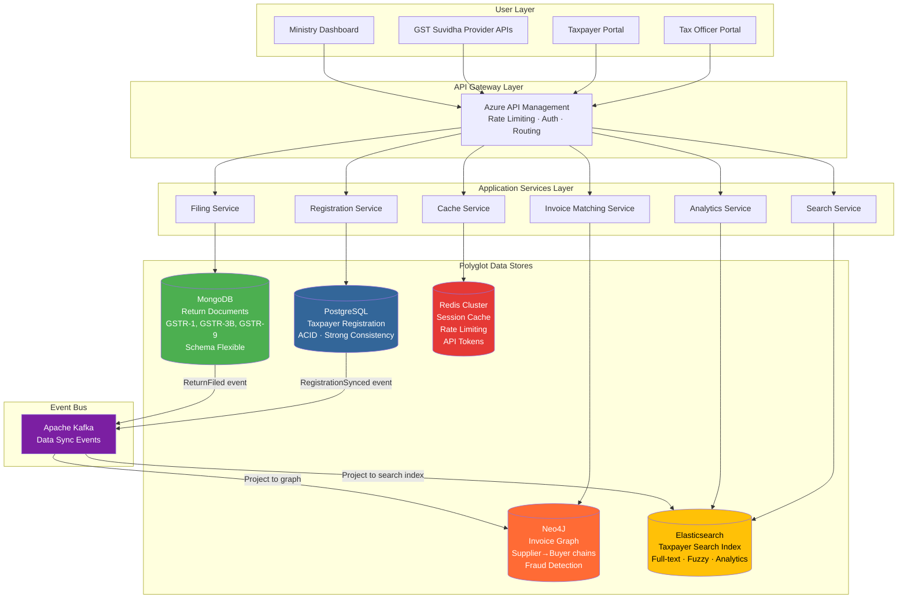
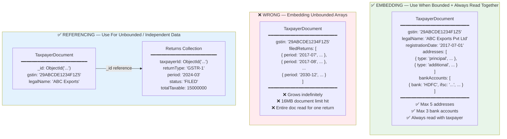
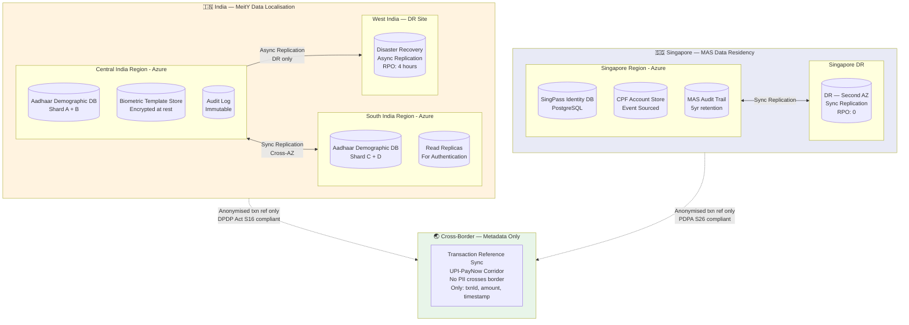
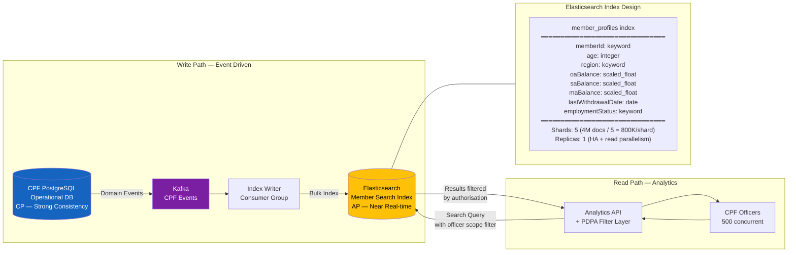
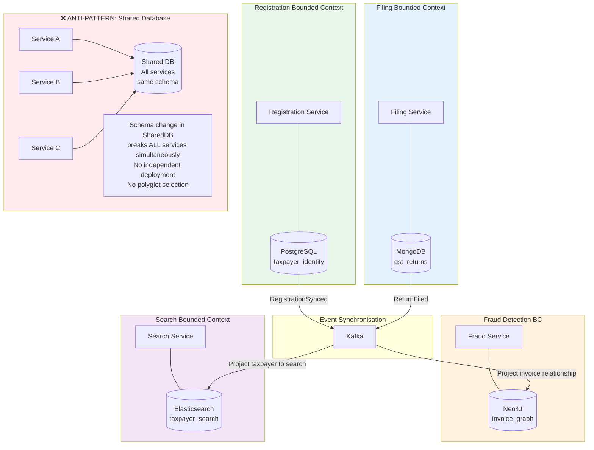

# DOCUMENT 1 — TRAINING CONTENT MATERIAL

---

## ENTERPRISE SOLUTION ARCHITECTURE TRAINING
**Phase:** Architectural Foundations & Design Thinking
**Day:** 4 of 14 | **Date:** Jun 16, 2026 | **Session:** 09:00–13:30 (4.5 Hours) | **Break:** 11:10–11:20
**Topics:** Data Architecture, NoSQL & Search
**Subtopics:** Polyglot Persistence: MongoDB, Redis, Neo4J, DynamoDB Use Cases | Sharding, Partitioning & Geo-Unit Design for Global Scale | Search Architecture & Data Consistency Models (Strong vs. Eventual) | Case Study: Scaling a citizen data platform across regions
**Geography Focus:** 🇮🇳 India (Primary) | 🇸🇬 Singapore (Secondary) | 🌏 Cross-Border
**Leadership Level:** Technology Manager / Enterprise Solution Architect
**Difficulty:** Senior/Enterprise SA Level
**Copilot Integration:** Active — Prompts embedded throughout

---

## ADAPTED SESSION TIMETABLE: 09:00–13:30

| Time        | Block                                                                               |
| ----------- | ----------------------------------------------------------------------------------- |
| 09:00–09:05 | Session Open: Trainer Energy Setter + Agenda Flash                                  |
| 09:05–09:15 | Recap Ritual: Day 3 → Day 4 Bridge                                                  |
| 09:15–10:15 | Block 1: Core Concept Teaching — Polyglot Persistence + CAP in Data Stores (60 min) |
| 10:15–10:25 | Checkpoint 1: Q&A + Whiteboard Challenge                                            |
| 10:25–11:10 | Block 2: Sharding, Partitioning, Geo-Unit Design + Search Architecture (45 min)     |
| 11:10–11:20 | Break — 10 Minutes (Strict)                                                         |
| 11:20–12:00 | Block 3: Architecture Patterns + Chaos Scenarios (40 min)                           |
| 12:00–12:10 | Checkpoint 2: Scenario Debate                                                       |
| 12:10–12:50 | Battle Drill: Hands-On Exercise (40 min — End of Class)                             |
| 12:50–13:05 | Exercise Review + Feedback (15 min)                                                 |
| 13:05–13:15 | Daily Assignment Brief (10 min)                                                     |
| 13:15–13:30 | Food for Thought + Next Day Preview (15 min)                                        |

---

# SECTION 0: SESSION OPEN (09:00–09:05)

### TRAINER ENERGY SETTER

---

🎙️ OPEN WITH:

"Aadhaar stores biometric and demographic data for 1.38 billion Indians. That is not the impressive part. The impressive part is this: every Aadhaar authentication — fingerprint, iris, OTP — must complete in under 1 second. Not 1 second average. 1 second at the 99th percentile. During a peak day — say, a government subsidy distribution window — Aadhaar processes 100 million authentications. 100 million times, in a single day, the system must locate one specific record in a 1.38 billion row dataset and verify biometric data in under one second. If you design that on a single PostgreSQL instance — you will fail. If you design it naively on distributed NoSQL — you will fail differently but just as catastrophically. Today we learn how the architects who built systems like Aadhaar, CPF, and GSTN think about data — not as rows and columns, but as access patterns. Because in distributed data architecture, the access pattern IS the schema."

📰 NEWS HOOK (Search this):

"UIDAI Aadhaar authentication architecture 100 million transactions data design"

❓ TODAY'S BIG QUESTION:

"When a government platform must store 1.38 billion records and answer complex queries in under 2 seconds — how do you choose which database, design which partition strategy, and still comply with data residency laws in two countries simultaneously?"

📋 AGENDA FLASH:
- Why polyglot persistence is not about using every database — it is about matching each access pattern to the right engine
- How sharding and partitioning decisions made today become the constraints you cannot escape in three years
- Why Elasticsearch for government citizen search is simultaneously the best and most dangerous architectural choice you can make

---

# SECTION 1: RECAP RITUAL (09:05–09:15)

### 🔁 RECAP RITUAL: Day 3 → Day 4 Bridge

---

**Part A: Concept Flashback (2–3 minutes)**

---

Trainer reads or paraphrases:

"Yesterday we built systems that communicate through events — immutable records of things that happened, stored in Kafka partitions ordered by a carefully chosen key. We built a remittance saga that knew, at every step, exactly what had happened before and exactly what to undo if something went wrong. We learned that the event log is not just a message queue — it is a time machine. You can replay it and reconstruct the exact state of any aggregate at any point in history. But here is the question nobody asked yesterday: where do those events live when you have 660 billion of them? How do you answer 'what was this account's balance on March 15, 2019?' when replaying 40 years of events takes longer than the regulatory deadline for the answer? Today, the event log meets the data store — and we learn how architects decide not just WHAT to store, but WHERE, in WHAT shape, and partitioned HOW."

---

**Part B: Rapid-Fire Quiz (5–7 minutes)**

---

RF-1: What is the difference between AP and CP in CAP theorem — give one real example of each from yesterday's content.
→ Expected: AP: UPI transaction status display — slightly stale data acceptable, availability prioritised. CP: UPI payment debit decision — consistency mandatory, availability sacrificed during partition. Any equivalent answer from yesterday's CAP matrix acceptable.

RF-2: In the Saga pattern — what is the specific name for the transaction that undoes a completed step when a later step fails?
→ Expected: Compensating transaction. Must be idempotent — processing twice must produce same result as processing once.

RF-3: You have 8 Kafka partitions and 12 consumer instances in one consumer group. How many consumers are actively processing messages?
→ Expected: 8 — one consumer per partition maximum. The remaining 4 are idle standby. Adding partitions beyond consumer count wastes resources. Never useful to have more consumers than partitions.

RF-4: What is the Dual Write Problem and what are its two standard solutions?
→ Expected: Writing to a database AND publishing an event in the same operation without an atomic transaction — if the write succeeds but the publish fails (or vice versa), system state and event log diverge. Solutions: Outbox Pattern (write event to DB table in same transaction, separate process publishes) or Event Sourcing (event IS the write — no dual write).

RF-5: An Event Sourced aggregate has 50,000 events. Reconstituting it from the full event history takes 8 seconds. What architectural pattern solves this and describe it in one sentence?
→ Expected: Snapshot pattern — periodically persist the aggregate's current state alongside a pointer to the event offset at that point. On reconstitution: load snapshot, replay only events AFTER the snapshot offset. Dramatically reduces replay time.

---

💡 TRAINER NOTE: RF-5 is the bridge to today — the snapshot concept directly introduces the idea that you cannot always rely on raw event replay at scale. You need materialised views, projections, and specialised read stores. That is today's entire topic.

---

**Part C: Bridge Statement**

Yesterday's events need a home. Today we design that home — and we learn that the home you choose determines everything: how fast you can read, how easily you can scale, and whether a regulator can audit you in 2029.

---

# SECTION 2: BLOCK 1 — CORE CONCEPT TEACHING (09:15–10:15)

---

## CONCEPT 1: Polyglot Persistence — The Right Database for the Right Access Pattern

---

### A1. THE PROBLEM STATEMENT

---

🚨 REAL WORLD PROBLEM: GSTN's One-Database-to-Rule-Them-All Disaster

GEOGRAPHY: 🇮🇳 India
DOMAIN: Government / Enterprise / Data Architecture

THE SITUATION:

When GSTN launched in July 2017, the original architecture used Oracle as the single database for everything: taxpayer registration records, return filing data, invoice matching, compliance analytics, and the real-time dashboard shown to the finance ministry. Oracle was chosen because it was proven, the team knew it, and the procurement was straightforward through NIC.

By 2018, the strain was visible in four dimensions simultaneously. First: the compliance analytics queries — "show me all businesses in Maharashtra with turnover > ₹5 crore that have not filed GSTR-3B for the past 3 months" — ran for 45 minutes and timed out, because they were running against the same Oracle instance that was processing live return filings. The analytical queries competed with transactional writes for I/O. Second: the invoice matching — which required graph-like traversal to match a supplier's GSTR-1 against every buyer's GSTR-2 across 13 million registered taxpayers — was being done with 14-table JOINs in Oracle, each taking minutes. Third: the search functionality — "find taxpayer by name, approximate spelling" — was done with LIKE '%keyword%' queries on an unindexed Oracle column, which performed a full table scan on 13 million rows every time a tax officer searched. Fourth: session state for 50,000 concurrent GST portal users was stored in Oracle, making the session table a hotspot.

These four access patterns — transactional writes, graph traversal, full-text search, and session caching — each require a fundamentally different data engine. Putting them all in Oracle is like using a screwdriver to hammer a nail, cut a wire, measure a length, and pry open a lid. Each task is possible. None is efficient.

THE PAIN:
- Compliance analytics SLA: 45-minute queries vs. 30-second requirement — ₹200 crore GST fraud undetected per quarter due to slow analytics
- Invoice matching: supplier-buyer chain reconciliation taking 4 hours per batch — fraud using circular invoicing chains went undetected for months
- Search: tax officer searches taking 12 seconds on LIKE queries — rejected by field officers, reverting to paper records
- Oracle licence cost: ₹85 crore annually for a configuration that served none of the four access patterns well

THE QUESTION ON THE TABLE:

"You have been brought in as the Chief Data Architect for GSTN 2.0. You have a ₹120 crore data infrastructure budget and 18 months. How do you decompose this one Oracle instance into a polyglot persistence architecture that serves all four access patterns optimally?"

---

### A2. MENTAL MODEL — Polyglot Persistence

---

🏠 LAYER 1 — ANALOGY:

A professional kitchen has specialised equipment for specific tasks. You have an oven for baking, a stovetop for sautéing, a deep fryer for frying, a blender for pureeing, and a cold storage for preservation. Each is optimised for its task. A skilled chef does not bake in the deep fryer or fry in the oven. You could — technically — cook everything on a single campfire. It would work. Nothing would be good. Polyglot persistence is the professional kitchen. You use MongoDB for document storage (the oven — great for structured documents), Redis for session caching (the refrigerator — fast retrieval, time-bounded), Neo4J for graph traversal (the speciality smoker — designed for complex relationships), and Elasticsearch for full-text search (the food processor — optimised for finding things fast). The art is knowing which ingredient goes in which appliance.

🏗️ LAYER 2 — TECHNICAL DEFINITION (Architect Grade):

Polyglot Persistence (Martin Fowler, 2011) is the practice of using multiple data storage technologies within a single application, each selected based on the access pattern it best serves. The selection framework: (1) Data Model fit — document, key-value, graph, wide-column, time-series; (2) Query pattern — point lookup, range scan, full-text, graph traversal, aggregation; (3) Consistency requirement — strong, eventual, causal; (4) Scale requirement — read-heavy, write-heavy, mixed; (5) Operational maturity of the team. The anti-pattern: using one database for all patterns because "the team knows it" — this produces a system that is mediocre at everything and excellent at nothing.

⚙️ LAYER 3 — UNDER THE HOOD:

Each database engine makes fundamentally different trade-offs in its storage engine design. PostgreSQL uses a B-tree index for ordered data and MVCC for concurrent reads — excellent for transactional workloads with complex queries. MongoDB uses a WiredTiger storage engine with document-level locking — optimised for large documents with variable schema. Redis uses an in-memory data structure server with optional AOF/RDB persistence — sub-millisecond latency for key-value lookups. Elasticsearch uses an inverted index (Lucene) — optimised for full-text search and aggregations across millions of documents. Neo4J uses a native graph storage engine with pointer-based adjacency — constant-time traversal regardless of graph size, unlike relational JOIN cost which grows with data volume. Selecting the wrong engine for an access pattern means paying a performance tax on every single query for the lifetime of the system.

🔗 CERTIFICATION LINK:

Azure Solutions Architect Expert — Design data storage solutions. Maps to the "Select an appropriate data storage solution" exam domain. Also relevant to AWS SAP: Database selection for specific workloads. TOGAF: Information Architecture domain — data entity classification and storage strategy.

---

### A3. VISUAL ARCHITECTURE DIAGRAMS

---

**Diagram 1: The Four Access Patterns — Database Selection Matrix**

```
ACCESS PATTERN TAXONOMY FOR GOVERNMENT PLATFORMS

┌─────────────────────────────────────────────────────────────────────────┐
│  PATTERN 1: TRANSACTIONAL (OLTP)                                        │
│  "Record this GST return filing with ACID guarantees"                   │
│                                                                         │
│  Characteristics: Strong consistency, complex queries, foreign keys,    │
│                   concurrent reads/writes, sub-100ms response           │
│                                                                         │
│  Best Engine:  PostgreSQL / Oracle / Azure SQL                          │
│  Why:          MVCC for concurrent access, B-tree indexes,              │
│                ACID transactions, mature tooling                        │
│  Not:          MongoDB (eventual consistency default),                  │
│                Redis (no complex queries), Cassandra (no ACID)          │
├─────────────────────────────────────────────────────────────────────────┤
│  PATTERN 2: DOCUMENT / FLEXIBLE SCHEMA                                  │
│  "Store each taxpayer's return as a self-contained document             │
│   with varying fields per return type (GSTR-1 vs GSTR-3B)"            │
│                                                                         │
│  Characteristics: Variable schema, nested structures, document-level    │
│                   ops, eventual consistency acceptable                  │
│                                                                         │
│  Best Engine:  MongoDB / Azure Cosmos DB / DynamoDB                     │
│  Why:          Schema flexibility, horizontal scale, document model     │
│                maps naturally to JSON API payloads                      │
│  Not:          PostgreSQL (rigid schema), Redis (no query language)     │
├─────────────────────────────────────────────────────────────────────────┤
│  PATTERN 3: GRAPH TRAVERSAL                                             │
│  "Find all suppliers in a circular invoicing chain involving            │
│   company X within 4 degrees of separation"                            │
│                                                                         │
│  Characteristics: Relationship-first queries, variable-depth            │
│                   traversal, connected data, fraud detection           │
│                                                                         │
│  Best Engine:  Neo4J / Amazon Neptune / Azure Cosmos DB (Gremlin)       │
│  Why:          Native graph storage — O(1) edge traversal              │
│                vs. O(n log n) SQL JOIN cost at depth                   │
│  Not:          Any relational DB (JOIN cost explodes at depth 3+)      │
├─────────────────────────────────────────────────────────────────────────┤
│  PATTERN 4: FULL-TEXT SEARCH + ANALYTICS                                │
│  "Find all taxpayers named 'Sharma' in Karnataka with                   │
│   turnover > ₹1 crore, fuzzy match on name spelling"                  │
│                                                                         │
│  Characteristics: Text relevance scoring, fuzzy matching, faceted       │
│                   search, aggregations, near-real-time index           │
│                                                                         │
│  Best Engine:  Elasticsearch / Azure Cognitive Search / OpenSearch      │
│  Why:          Inverted index, BM25 relevance, aggregation pipeline    │
│  Not:          Any SQL DB with LIKE queries (full table scan)           │
├─────────────────────────────────────────────────────────────────────────┤
│  PATTERN 5: CACHE / SESSION / RATE LIMIT                                │
│  "Store user session for 50,000 concurrent GST portal users.            │
│   Check if this taxpayer has exceeded API rate limit."                 │
│                                                                         │
│  Characteristics: Sub-millisecond reads, time-to-live, atomic          │
│                   counters, pub/sub, no persistence requirement         │
│                                                                         │
│  Best Engine:  Redis / Azure Cache for Redis / Memcached                │
│  Why:          In-memory, O(1) hash lookups, native TTL, atomic        │
│                INCR for rate limiting, SETEX for sessions              │
│  Not:          Any disk-based DB (100× slower for this pattern)        │
└─────────────────────────────────────────────────────────────────────────┘
```

**Diagram 2: GSTN Polyglot Architecture — Target State**



**Diagram 3: Access Pattern to Database Mapping — Decision Flow**

```
HOW TO SELECT A DATABASE — THE ARCHITECT'S DECISION TREE

Start: What is your PRIMARY access pattern?
                │
    ┌───────────┼────────────────────────────┐
    ▼           ▼                            ▼
"I need to   "I need to find               "I need to
 store and    things by                     traverse
 retrieve by  content/text"                 relationships"
 a known key"     │                             │
    │         Elasticsearch               Neo4J / Neptune
    │         / Azure Search                   │
    ▼              │                    "How deep?"
"What shape      "Volume?"               │        │
 is the data?"     │        │           < 3     ≥ 3
    │          < 1B docs  ≥ 1B docs    hops    hops
    │          Azure      OpenSearch     │        │
    │          Cognitive  self-managed  SQL    MUST be
    │          Search     on VMs        OK     Graph DB
    │
    ├──── "It is a flat key→value"
    │         Redis (if < 1GB hot data, TTL needed)
    │         DynamoDB (if large scale, persistent)
    │
    ├──── "It is a document (JSON, nested)"
    │         MongoDB (if flexible schema + queries)
    │         Cosmos DB (if global distribution needed)
    │
    ├──── "It is relational (foreign keys, JOINs)"
    │         PostgreSQL (open source, feature-rich)
    │         Azure SQL (managed, compliance docs)
    │
    └──── "It is time-series (metrics, events, IoT)"
              InfluxDB / Azure Data Explorer
              TimescaleDB (PostgreSQL extension)
```

**Diagram 4: Data Consistency Spectrum**

```mermaid
graph LR
    subgraph Strong["Strong Consistency ← CP"]
        SC1[PostgreSQL<br/>SERIALIZABLE]
        SC2[Azure SQL<br/>READ COMMITTED]
        SC3[Spanner<br/>EXTERNAL]
    end

    subgraph Causal["Causal Consistency"]
        CC1[MongoDB<br/>Majority Read]
        CC2[DynamoDB<br/>Transactional]
    end

    subgraph Eventual["Eventual Consistency ← AP"]
        EC1[Cassandra<br/>ONE]
        EC2[DynamoDB<br/>Eventually Consistent]
        EC3[Elasticsearch<br/>near-real-time]
        EC4[Redis<br/>Cluster async replication]
    end

    Strong -->|"latency ↑"| Causal
    Causal -->|"availability ↑"| Eventual

    style SC1 fill:#1565C0,color:#fff
    style SC2 fill:#1565C0,color:#fff
    style SC3 fill:#1565C0,color:#fff
    style CC1 fill:#6A1B9A,color:#fff
    style CC2 fill:#6A1B9A,color:#fff
    style EC1 fill:#2E7D32,color:#fff
    style EC2 fill:#2E7D32,color:#fff
    style EC3 fill:#2E7D32,color:#fff
    style EC4 fill:#2E7D32,color:#fff
```



---

### A4. ARCHITECTURE DECISION RECORD

---

ADR-004: Adopt Polyglot Persistence for GSTN 2.0 Data Architecture

DATE: Simulated — Jan 2020, GSTN 2.0 design phase
STATUS: Accepted

CONTEXT:
GSTN's single Oracle instance serves four fundamentally different access patterns: OLTP filing, document storage, graph-based invoice matching, and full-text search. Each pattern has distinct performance, scale, and consistency requirements that a single RDBMS cannot satisfy simultaneously within SLA.

DECISION:
Replace single Oracle instance with a polyglot persistence architecture: PostgreSQL for taxpayer registration (ACID, relational), MongoDB for return document storage (schema-flexible, horizontal scale), Neo4J for invoice relationship graph (fraud chain detection), Elasticsearch for taxpayer search and compliance analytics, Redis for session management and rate limiting. Kafka as the data synchronisation event bus between stores.

RATIONALE:
Each database engine is optimised for its specific access pattern's data structure and query type. The operational cost of running five specialised databases is justified by: (1) 10–100× query performance improvement per pattern, (2) independent scaling of each store, (3) reduced total hardware cost versus over-provisioning Oracle for peak load of each pattern simultaneously.

CONSEQUENCES:
- ✅ Compliance analytics from Oracle 45 minutes → Elasticsearch aggregation < 30 seconds
- ✅ Invoice fraud graph traversal from SQL JOIN 4 hours → Neo4J traversal < 2 seconds
- ✅ Taxpayer search from LIKE query 12 seconds → Elasticsearch < 200ms
- ⚠️ Data synchronisation via Kafka introduces eventual consistency between stores — search index may lag primary by 2–5 seconds
- ⚠️ Operational team must maintain expertise across 5 database technologies
- ⚠️ Cross-store queries (e.g., join return data from MongoDB with graph data from Neo4J) require application-layer aggregation
- 🔄 All new features must explicitly declare which store they read from and write to

COMPLIANCE NOTE:
DPDP Act 2023, Section 8: Data fiduciaries must maintain data inventory and classification. Polyglot architecture requires explicit data classification per store: PostgreSQL holds PII (taxpayer identity), MongoDB holds financial data, Neo4J holds relationship metadata. Each store's access controls and audit logging must be configured independently. MeitY data localisation requirements apply to each store independently — all must reside in India-region data centres.

---

## CONCEPT 2: MongoDB Deep Dive — Document Design for Government Scale

---

### A1. THE PROBLEM STATEMENT (abbreviated)

The Aadhaar demographic database must store 1.38 billion records. Each record has a fixed core (name, DOB, gender, address) but variable optional fields (multiple addresses across lifetime, multiple phone numbers, KYC update history). A relational schema forces every optional field to either be nullable (wasting storage) or stored in a child table (requiring JOINs). At 1.38 billion rows, the JOIN cost for retrieving a full demographic profile becomes significant. MongoDB's document model stores the complete profile as one document — one read operation, no JOIN, no nullable column overhead.

---

### A2. MENTAL MODEL — Document Design Thinking

🏠 LAYER 1 — ANALOGY:

Think of a hospital patient folder — a physical manila folder with all the patient's records inside: the intake form, the doctor's notes, the lab results, the prescriptions. Everything related to this patient is in one folder. When a doctor needs to treat a patient, they get ONE folder — not five different filing cabinets. MongoDB is that folder system. The patient is the document root. The lab results are nested arrays. The prescriptions are embedded sub-documents. One read operation → complete patient picture. The alternative — SQL — is five filing cabinets where the clerk must run between them to assemble your complete record. Fast enough for 10,000 patients. Unacceptable for 1.38 billion.

🏗️ LAYER 2 — TECHNICAL DEFINITION (Architect Grade):

MongoDB stores data as BSON documents (Binary JSON) in collections. Documents within a collection can have different fields — schema flexibility. WiredTiger storage engine provides document-level concurrency control (not table-level locking). Indexes are defined per collection and support compound, text, geospatial, and TTL index types. Aggregation Pipeline provides server-side computation: $match, $group, $sort, $lookup (JOIN equivalent), $unwind (array flattening) — avoiding client-side data processing. Replica Sets provide high availability with automatic failover. Sharded Clusters provide horizontal scalability beyond single-node capacity.

⚙️ LAYER 3 — UNDER THE HOOD:

The critical MongoDB design decision for government scale is the embedding vs. referencing choice. Embedding: store related data inside the parent document — one read, no JOIN, fast. Use when: the nested data is always read with the parent, the nested array has bounded size (< 100 elements), the nested data changes only when the parent changes. Referencing: store related data in a separate collection with a reference ID — requires two reads or $lookup. Use when: the nested data is large (thousands of elements), the nested data is shared across multiple parent documents, the nested data changes independently of the parent. Getting this wrong — embedding an unbounded array — produces documents that grow without limit, exceed MongoDB's 16MB document size limit, and degrade read performance.

---

**Diagram 5: MongoDB Document Design — Embedding vs. Referencing**



**Diagram 6: Aggregation Pipeline for Compliance Analytics**

```
MONGODB AGGREGATION PIPELINE
"Find top 10 states by GST collection this quarter,
 excluding zero-return filers"

Pipeline Stage 1: $match
┌─────────────────────────────────────────┐
│  { period: { $gte: "2024-Q1" },         │
│    status: "FILED",                     │
│    totalTax: { $gt: 0 } }               │
│  → Filters 13M returns to ~8M           │
│  → Uses compound index: (period, status)│
└──────────────────────┬──────────────────┘
                       │
Pipeline Stage 2: $group
┌─────────────────────────────────────────┐
│  _id: "$state",                         │
│  totalCollection: { $sum: "$totalTax" },│
│  filingCount: { $sum: 1 }               │
│  → Groups 8M returns by 29 states      │
└──────────────────────┬──────────────────┘
                       │
Pipeline Stage 3: $sort
┌─────────────────────────────────────────┐
│  { totalCollection: -1 }                │
│  → Descending by tax collection         │
└──────────────────────┬──────────────────┘
                       │
Pipeline Stage 4: $limit
┌─────────────────────────────────────────┐
│  10                                     │
│  → Top 10 states only                  │
└──────────────────────┬──────────────────┘
                       │
                       ▼
Result: [{state: "Maharashtra", total: ₹4.2T, count: 892000},
         {state: "Karnataka",   total: ₹2.8T, count: 650000}, ...]

Execution time: ~800ms with index
WITHOUT index: 45 minutes (full collection scan — the original GSTN problem)
```

---

# SECTION 3: CHECKPOINT 1 (10:15–10:25)

### 🎯 CHECKPOINT 1: Depth Probe — Polyglot Persistence & Data Design

---

**Q1 — TYPE: RECALL**

QUESTION:
"A team is designing a citizen services platform. They propose using MongoDB for everything — registration data, session management, full-text search, and relationship traversal. You are in the architecture review. What are the three specific scenarios where MongoDB is the wrong choice, and what would you replace it with for each?"

STRONG ANSWER CONTAINS:
- Session management: MongoDB adds 5–20ms latency per session read. Redis provides sub-millisecond session lookup. Replace with Redis for sessions
- Full-text search: MongoDB Atlas Search exists but is significantly more expensive and less feature-rich than Elasticsearch for complex relevance scoring, fuzzy matching, and aggregations. For government-scale search across 100M+ documents — Elasticsearch
- Relationship traversal: MongoDB $lookup can simulate joins but at depth 3+ the aggregation pipeline becomes expensive. For fraud graph traversal (circular invoice chains, money mule networks) — Neo4J

RED FLAGS:
- Says MongoDB can do everything adequately
- Does not acknowledge MongoDB Atlas Search as a partial solution (it exists — but has limitations)

FOLLOW-UP PROBE:
"The team argues MongoDB supports transactions now (since 4.0 — multi-document ACID). Does this change your recommendation for the session management use case? Why or why not?"

---

**Q2 — TYPE: SCENARIO**

QUESTION:
"You are the Data Architect at SingPass — Singapore's national identity platform with 4 million users. A new feature request: 'When a user logs in from an unrecognised device for the first time, check if any other SingPass account has logged in from the same device in the last 30 days.' This must complete in under 100ms at peak load of 50,000 logins per hour. What data store do you use, what is your data model, and what is your indexing strategy?"

STRONG ANSWER CONTAINS:
- Redis with a sorted set or hash — device fingerprint as key, sorted set of (userId, timestamp) as value. TTL: 30 days. Sub-millisecond lookup
- Alternative: DynamoDB with deviceId as partition key — consistent < 10ms reads at any scale, automatic TTL for 30-day window
- NOT PostgreSQL or MongoDB — the 100ms SLA and 50,000/hour volume (13.8 TPS) is achievable with both, but the 30-day TTL and key-value access pattern is native to Redis/DynamoDB, not relational
- Security note: device fingerprint is biometric-adjacent data — PDPA classification as personal data, must be encrypted at rest

RED FLAGS:
- Suggests PostgreSQL with a compound index — technically possible but operationally fragile for this pattern
- Does not mention TTL mechanism for 30-day window cleanup

FOLLOW-UP PROBE:
"The security team says the device fingerprint data must be deleted exactly 30 days after last use — not 30 days after first use. How does your TTL strategy change?"

🤖 COPILOT PROMPT (Show live):
"Design the data model and Redis data structure for a device fingerprint tracking system that must: identify if a device has been used by multiple SingPass accounts in the last 30 days, respond in under 100ms, and automatically expire device records after 30 days of inactivity. Include the Redis commands for write and query operations."

---

**Q3 — TYPE: TRADE-OFF**

QUESTION:
"Compare Neo4J versus a graph modelled in PostgreSQL using adjacency lists for detecting circular invoice chains (GST fraud) in the GSTN dataset with 13 million taxpayers and 500 million invoice relationships. At what depth does PostgreSQL become impractical, and what is the specific technical reason?"

STRONG ANSWER CONTAINS:
- PostgreSQL adjacency list: each hop requires a recursive CTE (WITH RECURSIVE). At depth N: N recursive joins, each scanning the invoice relationship table. O(E^N) where E is average edges per node. At depth 4: potentially 500M^4 combinations — impractical
- Neo4J native graph: pointer-based adjacency — each node stores direct pointers to neighbour nodes. Traversal follows pointers in O(1) per hop regardless of graph size. Depth-4 traversal: 4 pointer follows. Near-constant time
- Break-even: typically depth 2–3. At depth 1–2: PostgreSQL is competitive. At depth 3+: Neo4J is 100–1000× faster
- Government relevance: circular invoicing fraud typically operates in chains of 4–6 degrees. PostgreSQL cannot detect this in reasonable time.

RED FLAGS:
- Claims PostgreSQL is "good enough" without acknowledging the depth problem
- Cannot explain the technical reason (pointer-based vs. JOIN-based traversal)

---

**Q4 — TYPE: FLAW FINDER**

QUESTION:
"Review this MongoDB schema design and find at least 3 data architecture flaws:"

```
SCHEMA DESCRIPTION:

Collection: taxpayers
Document structure:
{
  _id: ObjectId,
  gstin: "29ABCDE1234F1Z5",
  legalName: "ABC Exports",
  filedReturns: [
    { period: "2017-07", type: "GSTR-1", invoices: [...all 5000 invoices...] },
    { period: "2017-08", type: "GSTR-1", invoices: [...all 4800 invoices...] },
    ... (7 years of returns, monthly)
  ],
  sessionToken: "eyJhbGci...",
  sessionExpiry: ISODate("2026-06-16T11:00:00Z"),
  lastSearchedByOfficer: "officer-id-001"
}
```

STRONG ANSWER CONTAINS:
- Flaw 1: Unbounded embedded array — `filedReturns` grows forever. 7 years × 12 months × 5,000 invoices per return = 420,000 embedded invoice documents. MongoDB 16MB document limit will be exceeded. Every read of taxpayer profile loads all 7 years of returns
- Flaw 2: Session token in taxpayer document — session data has different lifecycle (hours), access pattern (per-request lookup by token), and TTL requirements than taxpayer data (permanent). Session belongs in Redis with TTL, not MongoDB
- Flaw 3: Mixing operational and audit data — `lastSearchedByOfficer` is audit data. It changes on every officer search, causing write amplification to the taxpayer document. Audit trail belongs in a separate append-only collection or Kafka audit topic
- Flaw 4 (bonus): Invoices embedded inside returns — at 5,000 invoices per return, this is a double-nested unbounded array inside an already unbounded array. Catastrophic document growth

---

**Q5 — TYPE: WHITEBOARD**

QUESTION:
"2 minutes. Draw the data architecture for the SingPass MyInfo platform. Show: which database stores citizen identity (core data), which stores consent grants, which handles session management for 4 million concurrent users, and which powers the search functionality for government officers. Label your consistency model for each store."

STRONG ANSWER CONTAINS:
- PostgreSQL (strong consistency, CP): core citizen identity — name, NRIC, address — relational, ACID required
- MongoDB (eventual consistency, AP): consent grant documents — variable schema per application, document model fits
- Redis (eventual consistency, AP): session tokens — TTL, sub-millisecond, key-value
- Elasticsearch (eventual consistency, AP): officer search — full-text, fuzzy match on name, aggregations

🤖 COPILOT PROMPT (Show live):
"Design the polyglot persistence architecture for Singapore's SingPass MyInfo platform serving 4 million users. For each data category (identity, consent, session, search), specify the database type, consistency model, and justification. Include PDPA Singapore compliance considerations for each data store."

---

# SECTION 4: BLOCK 2 — ADVANCED CONCEPTS + USE CASES (10:25–11:10)

---

## Sharding, Partitioning & Geo-Unit Design

---

### THE PROBLEM STATEMENT (Block 2 opener)

There are two types of architects: those who have been bitten by a bad sharding decision, and those who will be. A sharding key chosen incorrectly in 2020 becomes an unresolvable constraint in 2025 when your data volume has grown 10× and your hot shard is handling 80% of all traffic while the other shards sit idle. We call this a hot partition — and it is the most common production emergency in distributed data systems serving geographically concentrated populations like India.

---

### USE CASE 1: Aadhaar Biometric Database — Sharding 1.38 Billion Records

GEOGRAPHY: 🇮🇳 India
DOMAIN: Government / Identity / Data Architecture

PROBLEM NARRATIVE:

The UIDAI (Unique Identification Authority of India) Aadhaar database stores demographic and biometric data for 1.38 billion enrolled citizens. Every authentication request — fingerprint scan at a ration shop, iris scan at an airport, OTP from a bank — must be resolved to the correct record in under 1 second at the 99th percentile. The database cannot be a single node — it must be distributed. But distribution requires a sharding key — and the choice of sharding key for 1.38 billion records with specific geographic access patterns is a decision that cannot be changed without a full data migration.

The naive sharding approach — shard by the first digit of the Aadhaar number — would create 10 shards. But Aadhaar numbers are assigned sequentially by geography: numbers starting with 1–2 were assigned primarily in North India, 3–4 in West India, 5–6 in South India, etc. Result: authentication requests from different regions hit different shards disproportionately. During agricultural subsidy distribution windows in Punjab (North India), shards 1 and 2 receive 6× normal load while shards 5–9 are at 20% utilisation. This is a hot shard problem.

SCALE PARAMETERS:
- Total Records: 1.38 billion
- Peak Authentication Rate: 100 million per day (budget subsidy days)
- Per-Authentication Latency SLA: < 1 second at P99
- Data Size: approximately 2.5TB (demographic) + 8TB (biometric templates)
- Geographic Distribution: Heavily skewed — UP, Maharashtra, Bihar represent 38% of population
- Regulatory: UIDAI Act — data must reside in India. No cross-border replication.

**Diagram 7: Aadhaar Sharding Strategy — Naive vs. Correct**

```
NAIVE SHARDING (First-digit of Aadhaar number):

Shard 1 (starts with 1-2): North India assigned numbers
┌────────────────────────────────────────────────────┐
│  UP: 230M records │ Bihar: 125M records │          │
│  ████████████████████████████ 80% load during      │
│  subsidy season — HOT SHARD                        │
└────────────────────────────────────────────────────┘

Shard 5 (starts with 5-6): South India assigned numbers
┌────────────────────────────────────────────────────┐
│  TN: 75M │ Karnataka: 65M │ Kerala: 34M            │
│  ███████ 20% load — COLD SHARD                     │
└────────────────────────────────────────────────────┘

RESULT: Geographic events (election day in UP, harvest subsidy in Punjab)
        cause 6× load spike on one shard. Shard 1 becomes the bottleneck.
        Other shards sit idle. Cannot rebalance without full data migration.

─────────────────────────────────────────────────────────────────────────

CORRECT SHARDING (Consistent Hashing on Aadhaar number):

Hash Ring with 256 virtual nodes:

         0
        /|\
      /  |  \
   192   |   64
     \   |   /
      \  |  /
       128

Each physical shard owns a range of hash values.
Aadhaar number is HASHED before routing to shard.
Hash distributes numbers uniformly — no geographic clustering.

Physical Shard A: hash(aadhaar) in [0, 63]
Physical Shard B: hash(aadhaar) in [64, 127]
Physical Shard C: hash(aadhaar) in [128, 191]
Physical Shard D: hash(aadhaar) in [192, 255]

Result: Authentication requests for UP citizens distributed
        across ALL shards — no geographic hot spot.
        UP citizen with Aadhaar starting "1" → hash → Shard C
        UP citizen with Aadhaar starting "1" → hash → Shard A
        Load: ~25% per shard regardless of season or event.
```

**Diagram 8: Geo-Unit Design for Data Residency**



---

### USE CASE 2: Singapore CPF Search — Elasticsearch for Government Analytics

GEOGRAPHY: 🇸🇬 Singapore
DOMAIN: Government / Analytics / Search

PROBLEM NARRATIVE:

The CPF Board's operations team needs to run complex member queries for policy analysis and outreach programmes. A typical query: "Find all CPF members aged 55–60, residing in the Central region, with Ordinary Account balance between S$100,000 and S$500,000, who have not made a CPF withdrawal in the last 24 months, sorted by account balance descending." This is not a simple lookup — it is a multi-dimensional analytics query across 4 million member records. Running this directly against the CPF PostgreSQL operational database adds query load to the system that processes contribution transactions — a classic OLTP/OLAP interference problem.

The CPF Board chose to maintain an Elasticsearch index — a separate read-only projection of member data, updated near-real-time from the event stream (CPF contribution events, withdrawal events, address change events). All complex analytics queries run against Elasticsearch, leaving PostgreSQL to serve transactional operations exclusively.

SCALE PARAMETERS:
- Member Records in Index: 4 million
- Update Frequency: Near-real-time (event-driven, < 5-second lag from event to index update)
- Complex Query Response SLA: < 2 seconds for any analytics query
- Concurrent Analytics Users: 500 (CPF operations officers)
- PDPA Constraint: Search results must be filtered by the officer's authorisation scope — not all officers can see all member data

**Diagram 9: CPF Elasticsearch Architecture**



**Diagram 10: Elasticsearch Query — Complex Multi-Dimensional Filter**

```
ELASTICSEARCH QUERY: "CPF members for retirement outreach programme"

POST /member_profiles/_search
{
  "query": {
    "bool": {
      "must": [
        { "range": { "age": { "gte": 55, "lte": 60 }}},
        { "term": { "region": "CENTRAL" }},
        { "range": { "oaBalance": { "gte": 100000, "lte": 500000 }}},
        { "range": {
            "lastWithdrawalDate": {
              "lte": "now-24M"              ← No withdrawal in 24 months
            }
        }}
      ],
      "filter": [
        { "term": { "officerScope": "CPF_OPERATIONS" }}  ← PDPA filter
      ]
    }
  },
  "sort": [{ "oaBalance": { "order": "desc" }}],
  "size": 100,
  "_source": ["memberId", "age", "region", "oaBalance"]
                              ↑
                    Source filtering — return only needed fields
                    PDPA data minimisation: do not return name/NRIC
                    unless officer has specific authorisation

EXECUTION PLAN:
                    4M documents in index
                         │
          ┌──────────────┼──────────────┐
          │              │              │
          ▼              ▼              ▼
     Shard 1          Shard 2      Shard 3-5
     Age filter       Age filter   Age filter
     → 180K docs      → 175K docs  → ~500K total
          │              │              │
          └──────────────┼──────────────┘
                         │
                    Region filter
                    → 180K central region
                         │
                    Balance filter
                    → 45K in range
                         │
                    Withdrawal date filter
                    → 12K not withdrawn
                         │
                    PDPA scope filter
                    → 12K (all in scope)
                         │
                    Sort + limit 100
                         │
               Result: 100 members in 340ms

SAME QUERY ON POSTGRESQL:
  SELECT memberId, age, region, oa_balance
  FROM members
  WHERE age BETWEEN 55 AND 60
  AND region = 'CENTRAL'
  AND oa_balance BETWEEN 100000 AND 500000
  AND last_withdrawal_date < NOW() - INTERVAL '24 months'
  ORDER BY oa_balance DESC
  LIMIT 100;

  Execution time: 4.2 minutes (sequential scan, no composite index
                 that covers all 4 conditions simultaneously)
```

---

🤖 COPILOT LIVE DEMO

WHEN: After presenting the Elasticsearch query example

TRAINER ACTION: Open Microsoft Copilot

PROMPT TO RUN:
"Design an Elasticsearch index mapping for a government citizen analytics platform with 4 million records. The index must support: age range queries, geographic region filters, financial balance range queries, date range queries for last activity, and PDPA-compliant field-level access control. Include shard count recommendation, index lifecycle management policy for 5-year retention, and specific field data types for each attribute."

CRITIQUE EXERCISE: Did Copilot recommend the correct data types? (scaled_float for monetary values to avoid floating-point precision issues — critical for financial data). Did it address the PDPA field-level access control? Did it mention Index Lifecycle Management for 5-year retention? What did it miss about government-specific compliance requirements?

---

# SECTION 5: BREAK (11:10–11:20)

---

While you rest — A thought to carry:

"Elasticsearch is the most powerful search tool you will ever use. It is also the easiest way to accidentally expose every citizen's financial record to every user of your application. We cover exactly how this happens — and how to prevent it — in the next block."

🤖 OPTIONAL COPILOT PROMPT (try on your phone):
"What are the top 5 security vulnerabilities in Elasticsearch deployments in government and financial services? How does each vulnerability manifest and what is the architectural mitigation?"

Session resumes: 11:20 sharp

---

# SECTION 6: BLOCK 3 — ARCHITECTURE PATTERNS + CHAOS SCENARIOS (11:20–12:00)

---

## A. ARCHITECTURE PATTERNS DEEP DIVE

---

### Pattern 1: Database-per-Service with Event-Driven Sync

This pattern is the operational contract of polyglot persistence in a microservices architecture. Each service owns its database exclusively. No shared database. Data from one service's database appears in another service's query model only through events.

**Diagram 11: Database-per-Service Pattern**



### Pattern 2: CQRS with Polyglot Read Models

```
CQRS + POLYGLOT: Different Read Models for Different Consumers

WRITE SIDE (Single source of truth):
┌─────────────────────────────────────────────────────┐
│  GSTN Filing Service                                │
│  Command Handler                                    │
│         │                                           │
│         ▼                                           │
│  ┌─────────────────────────────────────────────┐   │
│  │  GSTReturn Aggregate (Event Sourced)        │   │
│  └──────────────┬──────────────────────────────┘   │
│                 │                                   │
│  ┌──────────────▼──────────────────────────────┐   │
│  │  MongoDB (Write Store)                      │   │
│  │  Single return document per GSTIN+period    │   │
│  └──────────────┬──────────────────────────────┘   │
└─────────────────┼───────────────────────────────────┘
                  │ ReturnFiled event → Kafka
                  │
       ┌──────────┼──────────────────────────┐
       │          │                          │
       ▼          ▼                          ▼
┌──────────┐ ┌──────────────────┐  ┌────────────────────┐
│ READ     │ │ READ MODEL 2:    │  │ READ MODEL 3:      │
│ MODEL 1: │ │ Elasticsearch    │  │ Neo4J              │
│ Redis    │ │ Full-text search │  │ Invoice graph      │
│ Cache    │ │ Analytics        │  │ Fraud detection    │
│          │ │                  │  │                    │
│ USED BY: │ │ USED BY:         │  │ USED BY:           │
│ Taxpayer │ │ Tax officers,    │  │ GSTN fraud team,   │
│ portal   │ │ Ministry reports,│  │ IT department,     │
│ "My      │ │ compliance       │  │ automated fraud    │
│ returns" │ │ dashboards       │  │ scoring pipeline   │
└──────────┘ └──────────────────┘  └────────────────────┘
```

---

## B. CHAOS & PRESSURE SIMULATION

---

🔥 CHAOS SCENARIO: The Elasticsearch Hot Shard — Budget Day Data Explosion

SEVERITY: P1 | TIME: 11:00 IST, February 1 (Union Budget Day) | GEOGRAPHY: 🇮🇳 India

THE INCIDENT (Trainer reads aloud):

"It is 11:00 AM on February 1 — Union Budget Day. The Finance Minister has just announced a major change to GST slabs. Every tax officer, every GST Suvidha Provider, every large enterprise is simultaneously hitting the GSTN Elasticsearch cluster to search for taxpayers in the newly affected categories. Your search cluster — sized for normal operating load — is receiving 8,000 search requests per second instead of the usual 400. At 11:07, your monitoring fires: Elasticsearch shard 3 CPU at 98%. All other shards at 45%. Response time for all searches degraded to 12 seconds. Some searches are timing out.

You check the index and discover the problem: your index was sharded by the first character of the GSTIN's state code. Maharashtra GSTINs all start with '27' — and today's budget announcement primarily affects Maharashtra's textile sector. Every search filtering by state code '27' routes to shard 3. Your hot shard is carrying 60% of all search traffic. The other 4 shards handle 10% each.

Your CEO is on a live TV channel. The anchor asks: 'Can the GST system handle the changes announced today?' The CEO says: 'Absolutely.' Your Slack has 47 unread messages."

⏱️ TRAINER: 3 minutes silent thinking. Then open the floor.

**Diagram 12: Hot Shard Failure Mode**

```
BEFORE BUDGET DAY (Normal load):

Shard 0 (State 01-10):  ████████░░░░░░░░░░░░  40% CPU
Shard 1 (State 11-20):  ████████░░░░░░░░░░░░  40% CPU
Shard 2 (State 21-27):  ████████░░░░░░░░░░░░  40% CPU
Shard 3 (State 27-30):  ████████░░░░░░░░░░░░  40% CPU  ← Maharashtra here
Shard 4 (State 31-38):  ████████░░░░░░░░░░░░  40% CPU

DURING BUDGET DAY (Maharashtra textile sector queries):

Shard 0 (State 01-10):  ████████░░░░░░░░░░░░  40% CPU
Shard 1 (State 11-20):  ████████░░░░░░░░░░░░  40% CPU
Shard 2 (State 21-27):  ████████░░░░░░░░░░░░  40% CPU
Shard 3 (State 27-30):  ████████████████████  98% CPU  💥 HOT SHARD
Shard 4 (State 31-38):  ████████░░░░░░░░░░░░  40% CPU

Shard 3 receives 60% of all Budget Day traffic.
All 4,400 TPS Maharashtra queries → ONE shard.
Response time: 400ms → 12,000ms.
Timeout rate: 23%.

ROOT CAUSE: Sharding by state code = geographic data skew.
            High-activity states (Maharashtra, Karnataka, UP) 
            create hot shards on high-traffic days.
```

BLAST RADIUS ANALYSIS:

Directly Affected: All GSTN search functionality — tax officer queries, GSP batch searches, ministry analytics dashboard

Cascade Risk: If Elasticsearch cluster OOM-kills nodes due to CPU+heap pressure — full cluster restart required. During restart: search unavailable for 5–15 minutes. Filing service (MongoDB) unaffected — demonstrating polyglot isolation value.

Financial Impact: 23% search timeout rate × 50,000 tax officers × average 4 searches/hour = 46,000 failed searches per hour. Each failed search estimated 30 minutes of officer productivity lost. ₹18 crore in productivity impact per hour.

WRONG APPROACHES:

❌ WRONG APPROACH 1: Immediately add more Elasticsearch nodes.
WHY WRONG: New nodes do not automatically receive the existing shards. Elasticsearch shard rebalancing takes 20–60 minutes. You do not have that time. The hot shard is still hot while rebalancing runs.

❌ WRONG APPROACH 2: Increase the replica count for shard 3 specifically.
WHY WRONG: Replicas improve READ throughput for uniformly distributed reads. But if all queries contain `state_code: "27"` as a filter, they all route to the primary shard for shard 3 — replicas do not help with this type of data skew.

CORRECT RESPONSE ARCHITECTURE:

IMMEDIATE (0–5 min):
- Enable query caching for the top 10 most common Budget Day queries — these are predictable (GST slab changes create a finite set of query patterns). Cache at the API gateway layer with 30-second TTL
- Rate limit GSP batch search requests to 50 requests/second per GSP — prioritise tax officer interactive searches
- Set `routing.allocation.exclude._ip` to temporarily move non-critical replicas off the hot data node, freeing its heap for query processing

SHORT-TERM (5–30 min):
- Force Elasticsearch to split shard 3 manually (split index API — available in ES 6.x+): split into 4 sub-shards. Rebalances data within 10–15 minutes
- Add 2 Elasticsearch data nodes — once shard split completes, shards auto-rebalance to new nodes

POST-INCIDENT:
- Architecture change: reindex with hash-based routing (not state-code-based) — similar to the Aadhaar lesson. Use `_routing` set to `hash(gstin)` — distributes documents uniformly regardless of geographic events
- Implement search query analytics: track which query patterns emerge on budget/GST change days. Pre-warm caches before known high-traffic events.

POST-MORTEM TEMPLATE:

TIMELINE:
- 11:00 — Budget Day announcements cause 20× search traffic spike for Maharashtra queries
- 11:07 — Elasticsearch shard 3 CPU at 98%; search latency degraded to 12 seconds
- 11:09 — Incident commander assigned; query caching enabled at API gateway
- 11:14 — GSP rate limiting applied; tax officer search latency recovered to 2.1 seconds
- 11:22 — Shard split initiated on shard 3
- 11:38 — Shard split complete; traffic distributed across 8 shards; latency 380ms
- 12:05 — Two additional data nodes online; full capacity restored

ROOT CAUSE (5-Why):
- Why 1: Search degraded on Budget Day
- Why 2: Shard 3 CPU at 98% — hot shard
- Why 3: All Maharashtra queries routed to shard 3
- Why 4: Index sharded by state code prefix — geographic skew
- Why 5: Sharding key selected for data organisation convenience, not for load distribution — no load analysis performed at index design time

ACTION ITEMS:

| Item                                     | Owner           | Priority | Due Date |
| ---------------------------------------- | --------------- | -------- | -------- |
| Reindex with hash-based routing          | Search Platform | P0       | 7 days   |
| Pre-warm cache script for Budget Day     | API Team        | P1       | 14 days  |
| GSP rate limiting as permanent policy    | API Gateway     | P1       | 3 days   |
| Load test with geographic skew scenarios | Perf Eng        | P1       | 21 days  |

---

# SECTION 7: CHECKPOINT 2 (12:00–12:10)

### 🎯 CHECKPOINT 2: Scenario Debate — Data Architecture

---

**Q1 — TYPE: PATTERN APPLICATION DEBATE**

"Two architects are designing the data layer for a new Singapore government social services platform. Architect A: 'Use DynamoDB for everything — it scales infinitely, it is fully managed, and we do not need to worry about sharding.' Architect B: 'DynamoDB is wrong for complex queries — we need PostgreSQL for relational data and Elasticsearch for search.' Pair up. Argue both positions for 4 minutes."

Expected resolution: DynamoDB excels at single-table design with known access patterns (point lookups by partition key). It struggles with ad-hoc queries, complex aggregations, and multi-dimensional filters without expensive scans. For a social services platform: DynamoDB for citizen entitlement records (partition key: citizenId, fast lookup), PostgreSQL for case management (complex queries, relationships), Elasticsearch for social worker search (multi-dimensional citizen search). Neither architect is fully right. The answer is: identify the access patterns first, then choose the database.

---

**Q2 — TYPE: MANAGEMENT ESCALATION**

"The CTO asks you to justify a ₹85 crore annual data infrastructure spend for a polyglot architecture versus ₹35 crore for a single Oracle instance. You have 5 minutes. Build the business case."

Strong answer structure:
- Frame in business outcomes, not technology: Oracle at ₹35 crore produces 45-minute analytics queries, 4-hour fraud detection runs, 12-second search latency — each with quantifiable business cost (₹200 crore undetected fraud per quarter, 30 minutes officer productivity per failed search)
- The additional ₹50 crore is not a cost — it is a revenue protection and fraud prevention investment
- ROI calculation: if polyglot architecture detects even 10% more GST fraud through faster graph analysis — at ₹200 crore fraud per quarter, that is ₹80 crore/quarter recovered. Polyglot infrastructure pays for itself in 8 months
- Risk frame: Oracle single-instance is a single point of failure. Polyglot architecture isolates failures — search outage does not affect filing.

---

**Q3 — TYPE: CROSS-BORDER CONSIDERATION**

"The UPI-PayNow cross-border corridor produces transaction data that both India and Singapore need for analytics. India's DPDP Act prohibits certain personal data from leaving India. Singapore's PDPA restricts cross-border transfer of personal data. How do you design a data architecture that allows both countries to run analytics on cross-border transaction patterns without violating either regulation?"

Strong answer:
- Anonymisation: strip PII (sender name, NRIC/Aadhaar) before any cross-border data flow. Transaction reference, amount, timestamp, and anonymised category can cross borders
- Federated analytics: each country runs analytics on its own data. Only aggregated, anonymised results are shared — not individual records
- Differential privacy: add mathematically-guaranteed noise to individual records before sharing aggregate statistics — makes re-identification impossible while preserving analytical value
- Architecture: India analytics cluster → aggregate query results → encrypted API → Singapore analytics cluster. No raw personal data crosses the border. Both countries run their own Elasticsearch indices on their own citizens' data.

🤖 COPILOT VALIDATION — Run Live:

"Design a cross-border data analytics architecture for the India-Singapore UPI-PayNow payment corridor that complies with India's DPDP Act 2023 and Singapore's PDPA. Specifically: how do you share transaction analytics insights between both countries' financial regulators without transferring personal data across the border? Include specific technical mechanisms."

---

# SECTION 8: BATTLE DRILL — HANDS-ON EXERCISE (12:10–12:50)

### ⚡ BATTLE DRILL 4: Design the Citizen Data Platform

TIME: 12:10–12:50 (40 minutes)
FORMAT: Teams of 3

---

SCENARIO BRIEF:

You are the Chief Data Architect for India's proposed National Citizen Services Platform (NCSP) — a unified digital identity and services layer that consolidates Aadhaar identity, GSTN tax records, DigiLocker document store, CoWIN vaccination records, and PMJAY health insurance eligibility into one platform. The platform serves 1.38 billion citizens. It must answer complex eligibility queries (e.g., "Is this citizen eligible for the PM-KISAN agricultural subsidy?" — which requires cross-referencing land records, Aadhaar identity, bank account linkage, and agricultural activity status) in under 3 seconds. It must support full-text search for government officers. It must maintain a 10-year immutable audit trail of every data access. It must comply with DPDP Act 2023 including data localisation and the right to erasure.

YOUR MISSION — 40 minutes to produce:

□ Polyglot Data Architecture Diagram: Show every database in the system, what data each stores, which service owns it, and the consistency model. Minimum 4 different database types. Show data flows between stores.

□ Sharding Strategy Document: For the citizen identity store (1.38 billion records) — specify your sharding key, justify it with load distribution analysis, and describe the hot partition risk mitigation.

□ Search Architecture Design: Design the Elasticsearch index for citizen search. Include: field mapping, shard count justification, DPDP-compliant field-level access control, and the query structure for the PM-KISAN eligibility check.

□ Data Residency Compliance Map: Show which data categories are stored in which Azure region. Map each store to the DPDP Act 2023 section that mandates its residency requirement. Include your right-to-erasure implementation strategy.

TOOLS AVAILABLE:
□ Whiteboard / Paper
□ Microsoft Copilot (validate after drafting)
□ Personal notes from today's session

🤖 COPILOT RULES FOR THIS DRILL:
- After designing your sharding strategy: ask Copilot to identify hot partition risks you may have missed
- After designing your Elasticsearch index: ask Copilot to check for DPDP Act compliance gaps
- Do NOT ask Copilot to design the architecture before you have drawn it yourself

EVALUATION RUBRIC:

| Criterion                                                             | Score |
| --------------------------------------------------------------------- | ----- |
| Polyglot Selection (4+ database types with justified access patterns) | /10   |
| Sharding Strategy (key selection, hot partition analysis, mitigation) | /10   |
| Search Architecture (index design, field mapping, DPDP compliance)    | /10   |
| Data Residency Compliance (DPDP mapping, erasure strategy)            | /10   |
| Failure Mode Analysis (what happens when each store goes down)        | /10   |
| Copilot Usage Quality                                                 | /5    |
| Communication Clarity                                                 | /5    |
| TOTAL                                                                 | /60   |

FEEDBACK TEMPLATE:

WHAT WORKED: _______________________________________________________________

WHAT'S MISSING: ___________________________________________________________

WHAT A PRINCIPAL ARCHITECT WOULD ADD: ______________________________________

CERTIFICATION ALIGNMENT: Azure Solutions Architect Expert — Design data storage solutions. Specifically: "Recommend a data storage solution" and "Design for data protection and compliance."

---

# SECTION 9: DOCUMENTATION TEMPLATES + PROFESSIONAL COMMUNICATION

### ⬆️ LEVELLING UP: DATA ARCHITECTURE DOCUMENT + SOLUTION ARCHITECTURE DOCUMENT

Today's template — the Solution Architecture Document (SAD) executive summary, applied to the NCSP data platform:

---

TEMPLATE: SOLUTION ARCHITECTURE DOCUMENT (SAD) — Data Architecture Section

Title: National Citizen Services Platform — Data Architecture Design
Version: 1.0 | Classification: RESTRICTED
Author: Chief Data Architect, NIC | Reviewed By: UIDAI Technical Committee
Approved By: MeitY Secretary | Date: Jun 16, 2026

SECTION 1: EXECUTIVE SUMMARY

The National Citizen Services Platform requires a data architecture capable of storing, querying, and auditing records for 1.38 billion citizens across five government domains. A single-database approach was evaluated and rejected: no single database engine serves the access pattern diversity of the platform at the required scale and performance SLAs.

The proposed polyglot persistence architecture uses five specialised data engines — PostgreSQL for identity (transactional, strong consistency), MongoDB for document records (flexible schema, horizontal scale), Elasticsearch for search and analytics (full-text, multi-dimensional), Neo4J for relationship graphs (subsidy eligibility traversal, fraud detection), and Redis for session management (sub-millisecond, TTL-based). Data synchronisation between stores is event-driven via Apache Kafka, ensuring each engine is updated in near-real-time without direct coupling between services.

Expected business outcomes: eligibility query response time < 3 seconds (vs. 45+ minutes on single Oracle), fraud detection cycle < 2 seconds (vs. hours on relational JOINs), DPDP Act 2023 compliance through data classification per store, and a 10-year immutable audit trail through append-only Kafka audit topic. Total infrastructure investment: ₹285 crore over 3 years, projected ROI through subsidy fraud detection of ₹1,200 crore over the same period.

SECTION 5: NON-FUNCTIONAL REQUIREMENTS (NFRs)

| NFR                          | Requirement                | Database                 | Mechanism                                                  |
| ---------------------------- | -------------------------- | ------------------------ | ---------------------------------------------------------- |
| Citizen identity lookup      | < 100ms P99                | PostgreSQL + Redis cache | B-tree index on Aadhaar hash + Redis L1 cache              |
| Complex eligibility query    | < 3 seconds                | Elasticsearch            | Multi-dimensional filter + pre-computed eligibility index  |
| Fraud graph traversal        | < 2 seconds at depth 6     | Neo4J                    | Native graph pointer traversal                             |
| Audit trail write            | < 50ms                     | Kafka (append)           | Async append — non-blocking for primary flow               |
| Data erasure (DPDP S17)      | Within 72 hours of request | All stores               | Erasure orchestrator service — cascading delete with audit |
| Data localisation (DPDP S16) | India region only          | All stores               | Azure Central India + South India only                     |

SECTION 6: RISK REGISTER

| Risk                                          | Likelihood | Impact | Mitigation                                                                  |
| --------------------------------------------- | ---------- | ------ | --------------------------------------------------------------------------- |
| Elasticsearch hot shard on state-level events | High       | High   | Hash-based routing; query caching for known event patterns                  |
| MongoDB document size limit breach            | Medium     | High   | Enforce document size monitoring; reference pattern for unbounded arrays    |
| Kafka consumer lag during data sync           | Medium     | Medium | KEDA auto-scaling; lag alerting at 10,000 message threshold                 |
| Right-to-erasure cascading across 5 stores    | Low        | High   | Erasure orchestrator with saga pattern; idempotent delete operations        |
| Cross-store data inconsistency                | High       | Medium | Acceptable (eventual consistency); UI shows "data updated within 5 seconds" |

---

Weekly Architecture Health Report — Data Layer:

ARCHITECTURE HEALTH REPORT — Week 24, June 2026
Prepared by: Chief Data Architect | For: CTO, MeitY

TRAFFIC LIGHT SUMMARY:

PostgreSQL (Identity): 🟢 GREEN — P99 latency 82ms, replication lag 0ms
MongoDB (Returns): 🟡 AMBER — Document growth rate exceeding projection by 15% in 3 states
Elasticsearch (Search): 🔴 RED — Shard imbalance post-Budget Day; reindexing in progress
Neo4J (Graph): 🟢 GREEN — Fraud detection cycles averaging 1.4 seconds
Redis (Cache): 🟢 GREEN — Hit rate 94%, no eviction pressure

KEY METRICS THIS WEEK:
- Total Citizen Records: 1,382,419,004
- Elasticsearch Search P95: 1,840ms (SLA: 2,000ms — AMBER trending RED)
- MongoDB Average Document Size: 184KB (limit: 16MB — healthy)
- Neo4J Fraud Graphs Traversed: 2.4M this week; 847 suspicious chains flagged

TOP 3 RISKS REQUIRING ATTENTION:

1. Elasticsearch Shard Rebalancing — Impact: Search degradation risk during rebalancing window. Recommended: Schedule reindex during weekend 02:00–06:00 IST window. Decision needed by Jun 19.

2. MongoDB Document Growth in Maharashtra/Karnataka/UP — At current rate, document size limit will be approached in 18 months for high-volume filers. Recommended: Migrate return history to reference pattern now, before emergency migration is required. Requires ₹2.2 crore engineering investment.

3. Redis Memory Utilisation at 78% — Two months from requiring capacity expansion. Recommended: Approve ₹45 lakh Redis cluster expansion. Action required by Aug 1.

DECISIONS NEEDED FROM LEADERSHIP:
1. Approve Elasticsearch reindexing weekend window (Jun 20–21) — Operations impact: 30-minute search degradation during switchover. Alternatives: delay 4 weeks (risk: another Budget-type event) or accept 30-minute window. Recommendation: approve Jun 20–21.

---

# SECTION 10: MICROSOFT COPILOT INTEGRATION

### 🤖 COPILOT PROMPT BANK — DAY 4

**TYPE 1: CONCEPT VALIDATION (During Polyglot teaching)**

WHEN: After presenting the database selection matrix

PROMPT TO RUN:
"For a government citizen services platform serving 1.38 billion citizens in India, recommend the appropriate database technology for each of these five use cases: (1) storing citizen identity records with ACID requirements, (2) storing tax return documents with variable schema, (3) detecting circular invoice fraud chains at depth 4-6, (4) full-text citizen search with fuzzy name matching, (5) managing session tokens for 50,000 concurrent users. For each recommendation, explain why the alternative databases would fail at this use case."

CRITIQUE EXERCISE: Did Copilot correctly identify Neo4J for the graph traversal use case and explain the JOIN depth problem? Did it address the MongoDB 16MB document limit for the return documents? Did it mention DPDP Act 2023 data localisation requirements?

---

**TYPE 2: DOCUMENT GENERATION (During SAD template teaching)**

COPILOT PROMPT:
"Act as a Chief Data Architect for India's MeitY. Generate the data architecture section of a Solution Architecture Document for a national citizen services platform that must store 1.38 billion records across PostgreSQL, MongoDB, Elasticsearch, Neo4J, and Redis. Include: NFR table, sharding strategy justification, DPDP Act 2023 compliance mapping, and a risk register with top 5 data architecture risks."

TRAINER INSTRUCTIONS: Run live. Ask the class to identify what Copilot missed — specifically: the right-to-erasure implementation across five different databases (a uniquely complex DPDP requirement), and the data lineage tracking requirement for DPDP Section 8.

---

**TYPE 3: ARCHITECTURE REVIEW (After Battle Drill)**

COPILOT REVIEW PROMPT:
"Review this citizen data platform architecture for a government system serving 1.38 billion Indian citizens. Identify: (1) hot partition risks in the sharding strategy, (2) DPDP Act 2023 compliance gaps specifically for data erasure and data localisation, (3) Elasticsearch security vulnerabilities that could expose citizen data, (4) missing failure isolation between data stores. Architecture: [candidate's architecture pasted]"

---

**TYPE 4: RESEARCH ACCELERATION (For daily assignment)**

COPILOT RESEARCH PROMPT:
"Summarise the key data architecture lessons from India's Aadhaar biometric database design, Singapore's CPF digital transformation data platform, and the GSTN invoice matching system. Focus on: sharding strategy decisions, polyglot persistence choices, and compliance with data localisation regulations. Relevant to Azure Solutions Architect Expert exam domain: Design data storage solutions."

---

# SECTION 11: DAILY ASSIGNMENT (13:05–13:15)

### 📋 ARCHITECTURE KATA: Day 4 — Design the DigiLocker Polyglot Data Platform

---

DAILY ASSIGNMENT: Day 4
Estimated Effort: 90–120 minutes | Due: Before Day 5 starts (Jun 17, 09:00)

SCENARIO:
You are the Data Architect for DigiLocker 2.0 — India's national document storage platform that currently stores 6.5 billion documents for 250 million users. The current architecture uses a single PostgreSQL cluster that is approaching capacity limits. MeitY has mandated that the new architecture must: support 500 million users by 2028, allow citizens to store and retrieve documents in under 500ms, enable government officers to search for citizens and their documents using fuzzy name matching and document type filters in under 2 seconds, support real-time fraud detection (detecting citizens using multiple Aadhaar numbers across documents), maintain a tamper-proof audit trail of every document access under DPDP Act 2023, and implement the right to erasure within 24 hours of a citizen's request.

DELIVERABLES:

□ 1. Polyglot Data Architecture Diagram: All databases, services, data flows, consistency models. Minimum 4 database types. Use both ASCII and a descriptive diagram showing data ownership per service.

□ 2. MongoDB Schema Design: Design the document store schema for citizen documents. Show embedding vs. referencing decisions. Justify document size management strategy. Include compound index design for the 3 most common query patterns.

□ 3. Elasticsearch Index Design: Design the citizen search index. Include field mapping with data types, shard count justification for 500M records, the fraud detection query (multi-Aadhaar detection), and DPDP-compliant field-level access control configuration.

□ 4. Sharding Strategy ADR: One ADR for the document storage sharding key decision. Include: options evaluated, hot partition risk analysis for each option, chosen approach, compliance consequences under DPDP Act.

□ 5. Right-to-Erasure Implementation: Design the erasure flow across all 5 database stores. Show the saga-based erasure orchestration. Include: what gets deleted, what gets anonymised (retained for audit), and the 24-hour SLA enforcement mechanism.

□ 6. DPDP Act 2023 Compliance Checklist: Map each database store to the specific DPDP Act sections it must satisfy (Sections 4, 8, 9, 16, 17). Identify gaps and mitigation for each.

ASPECT FOCUS FOR TODAY: Data Architecture, Sharding, Search, Compliance

SELF-EVALUATION CHECKLIST:

Before submitting, verify:
□ Does each database in my diagram have a clearly stated access pattern justification?
□ Does my MongoDB schema avoid unbounded embedded arrays?
□ Is my Elasticsearch shard count based on data volume math (target < 50GB per shard)?
□ Does my sharding ADR address hot partition risk for geographic event days (election, budget)?
□ Does my erasure flow handle the audit trail correctly (retain anonymised record, delete PII)?
□ Did I map every database decision to a specific DPDP Act section?

COPILOT CHALLENGE:
"Review this MongoDB schema design for a government document storage platform serving 500 million users. Check for: unbounded embedded arrays that will exceed the 16MB document limit, missing compound indexes for the stated query patterns, schema design that will cause hot document issues at scale, and DPDP Act 2023 compliance gaps. Schema: [paste your design]"

---

# SECTION 12: FOOD FOR THOUGHT + NEXT DAY PREVIEW (13:15–13:30)

### 🧠 ARCHITECT'S MEDITATION: Day 4

---

💭 PROVOCATIONS (No right answer — discuss with a peer tonight):

1. The DPDP Act 2023 gives Indian citizens the right to erasure — the right to demand that a data fiduciary delete all their personal data. But if you have implemented Event Sourcing (as we did yesterday), the event log is immutable and append-only. A citizen's name and Aadhaar number appear in 40 years of historical events. You cannot delete from an immutable log. The right to erasure and Event Sourcing are architecturally incompatible — unless you design for this from day one. How do you reconcile them? (Hint: encryption with key deletion — "crypto-shredding." Research it tonight.)

2. Elasticsearch's power is that it indexes everything by default. Its danger is the same: it indexes everything by default. In a citizen services platform, a misconfigured Elasticsearch index that makes all fields queryable means a junior developer can write a query that retrieves every citizen with income above ₹1 crore, cross-referenced with their home district. Without intending to, you have built a surveillance tool. Who is responsible for this — the developer who wrote the query, the architect who designed the open index, or the organisation that deployed it? How does your architecture prevent it structurally?

3. India and Singapore are discussing making Aadhaar and SingPass interoperable — a traveller could authenticate in Singapore using their Aadhaar, and vice versa. The technical feasibility is clear. But Aadhaar is stored exclusively in India (DPDP Act), SingPass is stored exclusively in Singapore (PDPA). Neither country's law permits the underlying biometric data to cross borders. What authentication architecture allows cross-border identity verification without the biometric data ever leaving its country of origin?

READ TONIGHT:

🔍 Search: "Aadhaar database architecture sharding design UIDAI"
🔍 Search: "Elasticsearch security misconfiguration government data breach"
🔍 Search: "DPDP Act 2023 right to erasure event sourcing crypto-shredding"
📖 Book Reference: "Designing Data-Intensive Applications" by Martin Kleppmann — Chapter 6: "Partitioning" — the definitive text on sharding strategies and hot partition avoidance

ANTI-PATTERN TO RESEARCH:

🚫 "The Overfitted Index" — Research what happens when an Elasticsearch index has too many fields, too many shards, or too many replicas. What is "mapping explosion" and what government data platforms have suffered from it?

TOMORROW'S TEASER:

👀 Day 5 Preview: Security, Zero Trust & Emerging Tech

"Tomorrow we ask the question every architect avoids until it is too late: what if your biggest security threat is not an external hacker — but your own architecture? We design Zero Trust from first principles, then break it in ways that will make you rethink every API gateway configuration you have ever approved."

We will explore: Zero Trust Architecture, API Gateway Security, Keycloak/RBAC, mTLS, Secret Management, IoT/Blockchain/Edge integration patterns

🎯 Come prepared to answer:
"Your Kubernetes cluster has 40 microservices. All 40 communicate with each other over the internal network. You have no service mesh. You have no mTLS. How many trust boundaries exist in this system — and how many of them are invisible to you right now?"

---