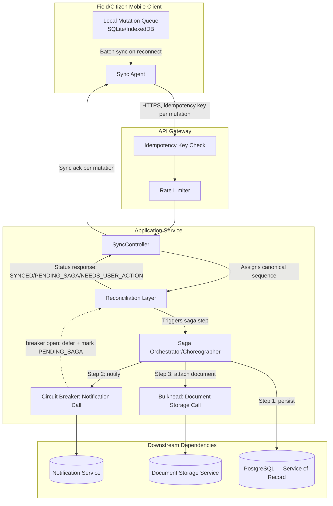
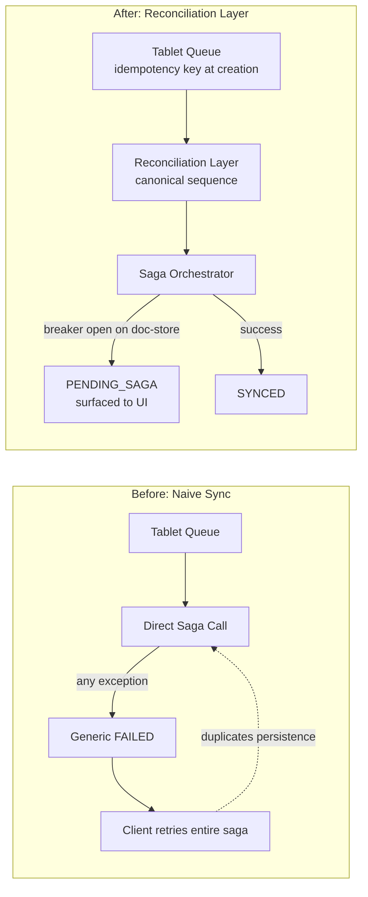
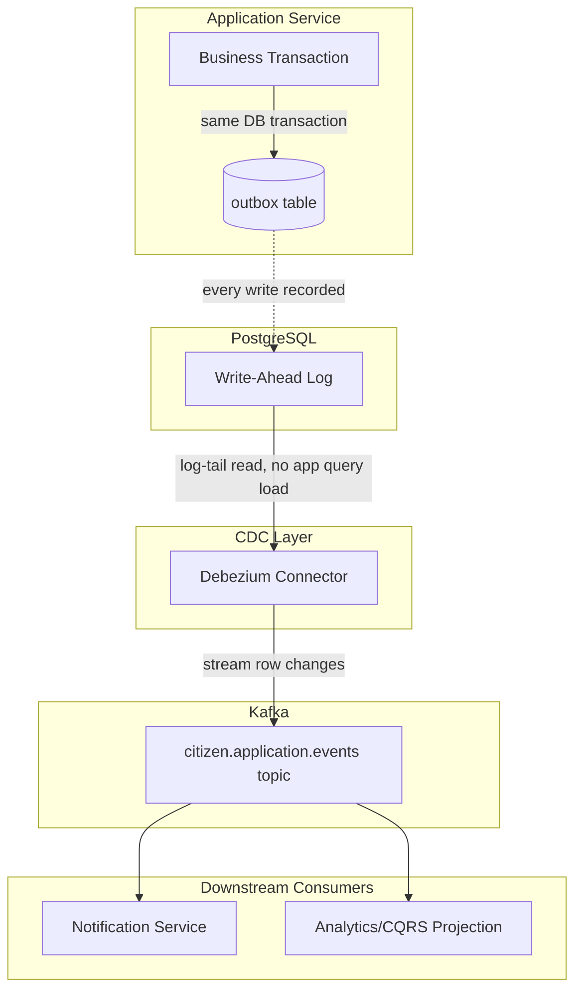
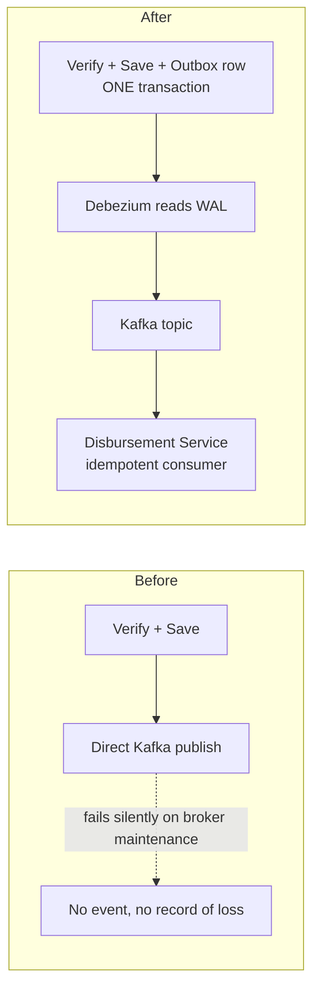
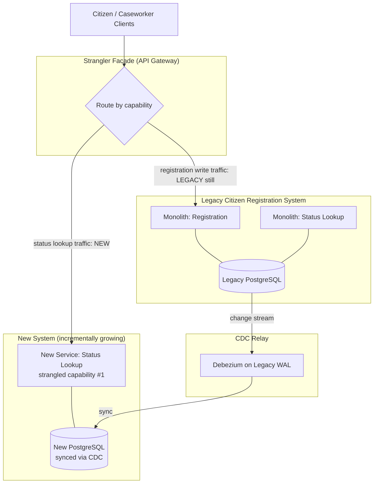
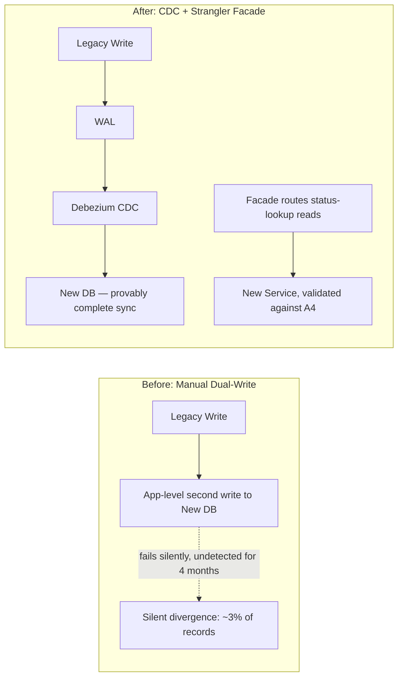
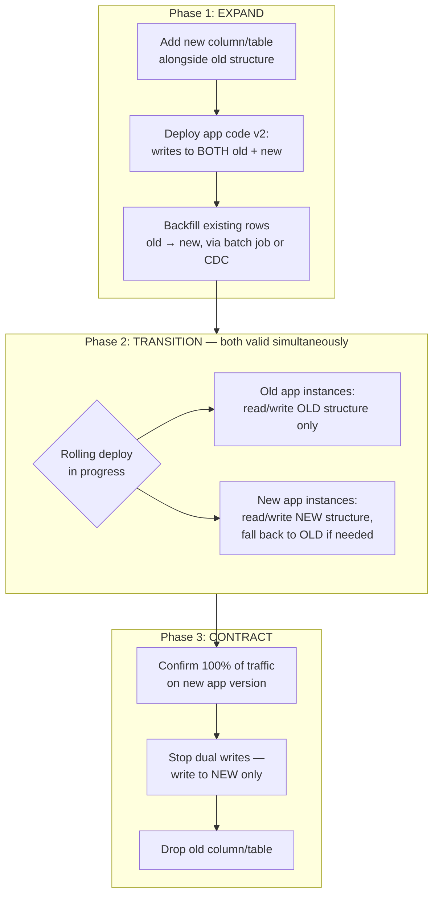
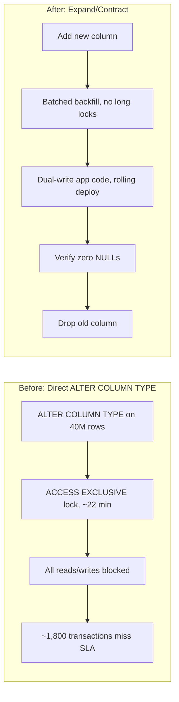

# Senior Engineer to Solution Architect Program
## Day 7 — Theory Document
### Module: Microservices, AI & Modernization
### Theme: Mobile-First Resilience, Transactional Integrity & Legacy Migration Foundations

---

## How to Use This Document

This is the trainer's master reference for Day 7. It is self-contained: a qualified trainer can deliver the full 6–8 hour session from this document alone, without needing Day 6's material open. Where Day 7 builds directly on Day 6 output, a recap is provided below so no context is lost.

**Day 7 covers four topic blocks**, in delivery sequence:

| # | Topic Block | Scheduled Duration |
|---|---|---|
| 1 | Integration Lab Theory: Mobile-Optimised Microservice (Offline Sync + Saga + Resilience) | 2.0 hrs |
| 2 | Idempotency and Event-Driven Transaction Patterns — Deep Dive (Outbox Pattern, CDC) | 1.0 hr |
| 3 | Migration Strategies: Strangler Fig, CDC, Parallel Run | 1.0 hr |
| 4 | Database Migration: Schema Evolution & Downtime Minimisation | 1.0 hr |

**Trainer's Note on pacing:** the curriculum table allocates 5.0 hrs of core content against a 6–8 hr workshop day. Use the additional time for: (a) extending the in-class demonstration of the integration lab (Topic 1) with live failure injection and audience prediction exercises, (b) running the Topic 3 case study as a full small-group exercise rather than a walkthrough, and (c) allowing extra time for the Topic 4 schema-evolution exercise, which experienced engineers often want to argue about at length — that argument is pedagogically valuable, let it run.

> **Architect's Note:** Day 7 is where the cohort starts feeling the cost of architectural decisions made on Day 1–6. The mobile microservice from Day 6 will, today, reveal exactly where "good enough for the demo" breaks down under reliability scrutiny (Topic 1–2), and the legacy citizen registration system introduced today exists specifically to be a believable, flawed system that participants will spend Day 7 and Day 8 dismantling safely. Frame the day this way to the cohort at the start: *"Today is about making promises your system can actually keep — to your data, and to the system you're replacing."*

---

## Day 6 Recap — Starting State for Today

Day 7's lab is a direct continuation of Day 6. Participants should arrive with a working (if rough) Spring Boot 3.x microservice with the following already implemented:

- **Mobile-first / offline-first architecture**: a local-storage sync model where a mobile or field client queues mutations locally and synchronises with the backend `SyncController` when connectivity is available, using a `last-write-wins` or vector-clock-lite conflict strategy.
- **Saga pattern**: a choreography-based saga across at least two services (e.g., `ApplicationService` and `NotificationService`) for a multi-step citizen-application-style workflow, using **idempotency keys** (a unique value, supplied by the client or generated at the gateway, that lets a receiver safely process a duplicate request exactly once) on each saga step.
- **Resilience patterns**: a circuit breaker (Resilience4j) and a rate limiter wrapping at least one outbound call, with a bulkhead isolating a slow downstream dependency.

If your cohort's Day 6 lab diverged from this, the code in Topic 1 below is written to be a drop-in replacement skeleton — the trainer can either reconcile it with whatever the group actually built, or have the group adopt this skeleton as the Day 7 starting point. Either is pedagogically fine; what matters is that everyone starts Topic 2 (Outbox/CDC) from the same code shape.

**Abbreviations used today (expanded on first use in body text):** NFR, SLA, SLO, SLI, ADR, CDC, CQRS, RPO, RTO, ACID, BASE, DLQ, TCO, mTLS.

---

# Topic 1: Integration Theory — The Mobile-Optimised Microservice (Offline Sync + Saga + Resilience)

## Section A: Concept Foundation

### 1. Learning Objectives

By the end of this block, participants will be able to:
1. **Analyze** the failure interactions between offline sync, saga choreography, and resilience patterns when combined in a single service.
2. **Design** a unified reconciliation strategy for a service that must tolerate offline mutation queues, partial saga completion, and downstream circuit-breaker trips simultaneously.
3. **Evaluate** the trade-offs between client-side and server-side conflict resolution when a saga step depends on data that may have been mutated offline.
4. **Create** a consolidated high-level design that integrates all three patterns into one coherent service boundary, with explicit annotations of where each pattern's failure mode is contained.

### 2. Concept Explanation

**Analogy:** Think of a courier who collects parcels from villages with no phone signal (offline sync), must hand each parcel through a three-stage customs process where any stage can be reversed (saga), and whose delivery van sometimes breaks down on a particular route (circuit breaker / bulkhead). Each problem has a well-known individual solution — the courier keeps a paper manifest, customs has a compensating-reversal process, and the depot reroutes around a broken van. The interesting architectural problem is not any one of these; it's what happens when the courier's paper manifest says a parcel was delivered, but the saga that was supposed to register that delivery never completed because the depot's van broke down mid-route. Reconciling those three independent truths is the actual engineering problem.

**What is it?** The **Integrated Mobile-Resilient Microservice** is not a new pattern — it is the deliberate composition of three previously independent patterns (offline-first sync, saga-based distributed transactions, and resilience engineering) into a single service boundary, with an explicit reconciliation layer that resolves the cases where their individual guarantees conflict.

**Why does it matter?** In isolation, each pattern has been taught (Day 6) and tested under unit-level conditions. In production, a field-inspection or citizen-application service experiences all three failure classes *concurrently and randomly ordered* — a citizen's phone goes offline mid-form, the saga step that should fire on reconnection finds a downstream service breaker open, and the retry of that saga step arrives at the server in a different order than the offline queue assumed. Architects who design these patterns separately, without a reconciliation layer, ship services that work in the demo and fail in week three of production with data that is locally consistent but globally wrong.

**When to use it?** Any service where (a) clients operate in genuinely unreliable network conditions (field staff, rural citizen access points, cross-border roaming) **and** (b) the operation being performed has more than one step with independent failure semantics **and** (c) downstream dependencies are themselves unreliable enough to warrant circuit breakers. If only one of these three conditions holds, the relevant single pattern (Day 6 material) is sufficient and this integration layer is unnecessary complexity.

**When NOT to use it?** Do not introduce this integration layer for services with a stable client network (back-office admin tools), single-step operations (simple CRUD with no cross-service saga), or where the downstream dependency has a contractually guaranteed SLA (service level agreement — a measurable commitment on a quality attribute such as latency or availability) high enough that circuit breakers are defensive theatre rather than a real requirement.

> **Anti-Pattern Warning:** A common mistake is to implement offline sync, saga, and resilience as three separate code modules with no shared state model, and to discover the conflicts only in production incident review. If your design review cannot answer "what happens to an offline-queued mutation whose saga step finds the circuit breaker open on reconnection?" in one sentence, the integration layer is missing.

### 3. Sub-Topic Deep Dive: The Reconciliation Layer

The reconciliation layer is the architectural artifact that makes the composition safe. It has three responsibilities:

- **Ordering arbitration**: when offline-queued mutations arrive out of original chronological order (because sync batches, not individual mutations, are what actually transmit), the reconciliation layer assigns a canonical server-side sequence using a monotonic counter or hybrid logical clock, rather than trusting client timestamps.
- **Saga re-entry safety**: every saga step must be re-enterable using the **idempotency key** carried from the original offline-queued request, so that a sync retry after a circuit-breaker trip does not duplicate a side effect (e.g., does not send a citizen two confirmation SMS messages for one application).
- **Partial-failure surfacing**: rather than silently retrying forever, the reconciliation layer must surface a bounded set of "needs reconciliation" states back to the client UI (e.g., `SYNCED`, `PENDING_SAGA`, `SAGA_COMPENSATED`, `NEEDS_USER_ACTION`) so the offline-first UX doesn't lie to the user about what has actually been durably committed.

This connects to **fitness functions** (automated, repeatable tests that measure whether an architecture characteristic still holds as the system evolves — a term from evolutionary architecture) — a well-designed integration layer should have a fitness function asserting that no saga step can be triggered twice for the same idempotency key, run continuously in CI against a chaos-injected test harness.

---

## Section B: Architecture and Design

### 4. High-Level Design (HLD)



**Annotations — why each decision was made:**
- **Idempotency key check at the gateway, not the service**, so duplicate detection happens before rate-limiter or business logic spend any cycles on a request already known to be a retry — this is a deliberate placement to protect the bulkhead'd downstream resources from retry storms.
- **Reconciliation Layer sits between SyncController and the Saga Orchestrator**, not inside either, because its job (sequencing, re-entry safety, status surfacing) is orthogonal to both sync transport concerns and saga step logic — collapsing it into either would violate single responsibility and make the fitness function above untestable in isolation.
- **Circuit breaker wraps only the Notification call**, not the persistence step, because persistence to the service's own database is the one step that must never be skipped — if Postgres is down, the whole service should correctly report itself unhealthy rather than pretending to succeed.
- **Bulkhead isolates Document Storage** specifically because in past incidents (see case study below) a slow document-storage dependency exhausted the shared thread pool and took down unrelated saga steps.

### 5. Design Rationale and Trade-off Analysis

| Approach | Description | Strength | Weakness |
|---|---|---|---|
| **A. Reconciliation Layer (recommended)** | Explicit module mediating between sync, saga, and resilience state | Single place to test partial-failure semantics; clean fitness-function target | Extra component to design, test, operate |
| **B. Saga-owns-everything** | Saga orchestrator directly manages offline replay and breaker state | Fewer moving parts initially | Saga logic becomes coupled to transport concerns; very hard to test saga business rules in isolation from sync replay bugs |
| **C. Client-side reconciliation** | Client resolves conflicts and replays a "corrected" mutation set | Server stays simple | Trusts an unauthenticated, potentially compromised or buggy client with consistency-critical logic — unacceptable for a citizen-facing government system handling legal records |

**Trade-off:** `Architectural Simplicity vs. Testability of Partial-Failure Semantics` — Approach B is simpler to stand up in a one-day lab but cannot be independently fitness-function-tested, which matters far more once this service is in production for years. Approach A costs roughly 20–30% more initial build time (illustrative estimate, not sourced) but pays for itself the first time a circuit breaker trips during a real sync storm.

**Trade-off:** `Client Trust vs. Server Load` — Approach C reduces server-side computation but is a non-starter for any system bound by data-integrity regulation (e.g., systems subject to India's IT Act provisions on electronic record integrity, or US FISMA control requirements for federal information systems) because it places consistency authority outside the system of record.

> **Trade-off Alert:** Resist the temptation to "simplify for the demo" by collapsing the reconciliation layer into the saga orchestrator. It demos fine. It is the first thing that has to be re-architected six months into production. Tell the cohort this directly — it's a real, common mistake, not a hypothetical one.

---

## Section C: Code Walkthrough

The code below assumes the Day 6 skeleton (Spring Boot 3.x, Java 17, PostgreSQL 15+, Resilience4j). It adds the **Reconciliation Layer** as a discrete, testable component.

```java
// SyncStatus.java
// WHAT: the bounded set of states the reconciliation layer can report.
// WHY: an offline-first UI must never show "success" for a state that
//      is not actually durably committed end-to-end.
package gov.training.paycore.sync;

public enum SyncStatus {
    SYNCED,              // fully persisted, saga complete
    PENDING_SAGA,        // persisted, saga step deferred (e.g., breaker open)
    SAGA_COMPENSATED,    // saga rolled back via compensating transaction
    NEEDS_USER_ACTION    // unrecoverable conflict; cannot auto-resolve
}
```

```java
// ReconciliationLayer.java
// WHAT: mediates between the SyncController (transport) and the
//       SagaOrchestrator (business transaction), assigning canonical
//       ordering and translating saga/breaker outcomes into SyncStatus.
// WHY: keeps saga business logic free of transport/ordering concerns,
//      and keeps sync transport free of business-transaction concerns —
//      each can be unit tested independently.
package gov.training.paycore.sync;

import gov.training.paycore.saga.SagaOrchestrator;
import gov.training.paycore.saga.SagaResult;
import io.github.resilience4j.circuitbreaker.CallNotPermittedException;
import org.springframework.stereotype.Component;

import java.time.Instant;
import java.util.concurrent.atomic.AtomicLong;

@Component
public class ReconciliationLayer {

    // A monotonic counter standing in for a hybrid logical clock.
    // In a multi-instance deployment this MUST be backed by a
    // distributed sequence (e.g., a Postgres SEQUENCE) rather than
    // an in-process AtomicLong — flagged here deliberately as a
    // known simplification for the single-instance lab.
    private final AtomicLong sequenceClock = new AtomicLong(0);

    private final SagaOrchestrator sagaOrchestrator;

    public ReconciliationLayer(SagaOrchestrator sagaOrchestrator) {
        this.sagaOrchestrator = sagaOrchestrator;
    }

    public SyncResult reconcile(MutationEnvelope envelope) {
        long canonicalSeq = sequenceClock.incrementAndGet();
        envelope.assignCanonicalSequence(canonicalSeq, Instant.now());

        try {
            SagaResult result = sagaOrchestrator.execute(
                envelope.toSagaCommand()
            );
            return mapToSyncResult(result, envelope);

        } catch (CallNotPermittedException breakerOpen) {
            // The circuit breaker on a downstream step (e.g. notification)
            // is open. The persistence step has already succeeded inside
            // sagaOrchestrator.execute() before this exception type is
            // possible — so we do NOT treat this as a full failure.
            // We mark PENDING_SAGA and rely on a scheduled retry job
            // (not shown) to re-drive only the deferred step, using the
            // same idempotency key, once the breaker closes.
            return new SyncResult(
                envelope.getIdempotencyKey(),
                SyncStatus.PENDING_SAGA,
                "Downstream notification unavailable; will retry automatically."
            );
        }
    }

    private SyncResult mapToSyncResult(SagaResult result, MutationEnvelope envelope) {
        return switch (result.outcome()) {
            case COMPLETED -> new SyncResult(envelope.getIdempotencyKey(), SyncStatus.SYNCED, null);
            case COMPENSATED -> new SyncResult(envelope.getIdempotencyKey(), SyncStatus.SAGA_COMPENSATED, result.reason());
            case UNRECOVERABLE_CONFLICT -> new SyncResult(envelope.getIdempotencyKey(), SyncStatus.NEEDS_USER_ACTION, result.reason());
        };
    }
}
```

```java
// NEGATIVE EXAMPLE — what happens without this layer.
// WHAT: a naive sync handler that calls the saga directly and treats
//       any exception as a hard failure to be retried with full backoff.
// WHY SHOWN: to make the failure mode visible before introducing the fix.
package gov.training.paycore.sync.antipattern;

import gov.training.paycore.saga.SagaOrchestrator;
import org.springframework.stereotype.Component;

@Component
public class NaiveSyncHandler {

    private final SagaOrchestrator sagaOrchestrator;

    public NaiveSyncHandler(SagaOrchestrator sagaOrchestrator) {
        this.sagaOrchestrator = sagaOrchestrator;
    }

    // PROBLEM 1: no canonical sequence assignment — if two devices sync
    // out of original order, "last write wins" becomes "last to arrive
    // over a flaky connection wins", which is not the same thing.
    //
    // PROBLEM 2: CallNotPermittedException (breaker open) is caught by
    // a generic catch-all and the WHOLE mutation — including the part
    // that already persisted successfully — is reported as FAILED to
    // the client, which then retries the ENTIRE saga from the client
    // side, re-running the persistence step a second time. Without an
    // idempotency key check at this layer, this duplicates the record.
    public String sync(Object rawMutation) {
        try {
            sagaOrchestrator.execute(rawMutation);
            return "OK";
        } catch (Exception e) {
            return "FAILED"; // client will blindly retry the whole thing
        }
    }
}
```

> **Production Insight:** the negative example above is not a strawman — it is, almost verbatim, the shape of code teams write under their first sprint's time pressure when offline sync and saga are built by different people in different weeks without a shared design review. The fix is not "write better exception handling"; it is recognizing that sync, saga, and resilience need one shared status vocabulary (`SyncStatus`) decided before any code is written.

---

## Section D: Real-World Case Study

**Context:** A (hypothetical, illustrative) Indian state government's agricultural subsidy field-verification program issues tablets to ~4,000 field officers who visit farms with no reliable mobile network and submit verification forms that trigger a three-step saga: (1) persist verification record, (2) notify the subsidy disbursement service, (3) attach photographic evidence to a document store.

**Initial (flawed) architecture:** Built following the "naive sync handler" pattern above — offline queue on the tablet, direct saga call on reconnect, generic retry-on-any-failure. No reconciliation layer, no canonical sequencing, no idempotency keys propagated from the offline queue.

**Quantifiable impact (illustrative figures):**
- During a network outage affecting one district for 36 hours, approximately 1,200 field verifications queued offline.
- On mass reconnection, the document-storage dependency (a third-party service with a contractual p99 latency of 2s, frequently breaching it under the resulting load spike) caused saga step 3 timeouts.
- Because there was no idempotency key check, ~340 of the 1,200 verifications were submitted twice by the naive client retry logic, creating duplicate disbursement notifications — an estimated INR 8.5 lakh (~USD 10,200, illustrative) in duplicate subsidy authorisations before manual reconciliation caught it.
- Mean time to detect the duplication: 11 days (it surfaced via a citizen complaint about a double-debited record, not via internal monitoring — there was no fitness function asserting "no saga step fires twice per idempotency key").

**Remediation applied:**
1. Introduced the Reconciliation Layer exactly as designed in Section B/C above, with canonical sequencing backed by a Postgres sequence (since the service was multi-instance).
2. Propagated idempotency keys from the tablet's local queue (generated at form-creation time on-device, not at sync time) through the gateway, reconciliation layer, and saga orchestrator.
3. Added a circuit breaker specifically around the document-storage call (previously only the notification call had one), with a `PENDING_SAGA` status surfaced to the field officer's UI so they could see "verification saved, photo upload pending" instead of a misleading generic error.
4. Added the fitness function described in Section A as a continuously running integration test in CI, plus a production alert if any idempotency key is observed processing a persistence step more than once.



**Lessons learned:** the architectural principle reinforced is that **resilience patterns and transactional patterns must share a failure vocabulary** — a circuit breaker trip is not the same kind of failure as an unrecoverable saga conflict, and collapsing both into a single "FAILED" status at the client boundary destroys the information needed to recover correctly.

---

## Section E: Engagement and Assessment

### Food for Thought

> Your reconciliation layer's canonical sequence currently relies on server arrival order. Suppose two field officers visit the *same farm* offline, on the same day, and both submissions eventually sync — one records "verified, eligible," the other "verified, ineligible due to boundary dispute." Server arrival order picks a winner arbitrarily. Is "arrival order" ever a legitimate consistency model for a government record with legal consequences, or does this scenario actually require a different conflict-resolution strategy entirely? Research **CRDTs (Conflict-free Replicated Data Types)** and consider whether they would help or simply relocate the same ambiguity. Suggested prompt for Copilot/ChatGPT: *"Explain how a CRDT-based conflict resolution strategy would behave differently from last-write-wins arrival order for two concurrent offline mutations to the same record, where one mutation has externally significant legal consequences."*

### Questionnaire — Topic 1

1. **(Conceptual)** What is the single architectural responsibility of the reconciliation layer that neither the saga orchestrator nor the sync controller should own?
2. **(Conceptual)** Why is an idempotency key generated at form-creation time on the client preferable to one generated at sync time?
3. **(Conceptual)** Explain why the circuit breaker in the HLD wraps only the notification call and not the persistence step.
4. **(Application)** Given a saga with four steps, where step 3 has a circuit breaker, write the `SyncStatus` your reconciliation layer should return if steps 1–2 succeed and step 3's breaker is open.
5. **(Application)** Modify the `ReconciliationLayer.reconcile()` method to also catch a `BulkheadFullException` from the document-storage call and map it to an appropriate `SyncStatus`.
6. **(Application)** A field officer's tablet has been offline for 5 days and has 40 queued mutations. Describe the sync batch design that avoids overwhelming the rate limiter on reconnect.
7. **(Analysis)** Compare Approach A (Reconciliation Layer) and Approach B (Saga-owns-everything) from Section B in terms of unit-testability of the fitness function described in Section A. Which approach makes that fitness function impossible to write cleanly, and why?
8. **(Analysis)** The case study's duplicate-disbursement incident took 11 days to detect because no fitness function existed. Propose two different signals (one synthetic/test-based, one production-monitoring-based) that would have caught it in under 24 hours.
9. **(Scenario)** Your client trusts the server completely (Approach C is tempting for performance). The system handles land-record updates with legal force in a jurisdiction with strict data-integrity regulation. Argue, using the trade-off in Section B, why Approach C should be rejected regardless of latency benefits.
10. **(Scenario)** You are asked to add a fourth pattern — multi-region active-active replication — to this same service. Identify which existing component (reconciliation layer, saga orchestrator, or sync controller) is the natural place to extend, and what new failure mode this addition introduces that the current design does not yet handle.

#### Answer Key

1. Mediating between transport-layer sync state and saga business-transaction state by assigning canonical ordering and translating saga/breaker outcomes into a shared status vocabulary — neither sync transport nor saga business logic should be responsible for this translation.
2. Because a key generated at sync time cannot distinguish "the same logical mutation retried after a sync failure" from "a genuinely new mutation created after the first one" if both happen to sync in the same batch — creation-time keys preserve the original intent regardless of how many times sync is attempted.
3. Because persistence to the service's own system of record must never be skipped or treated as optional — if that step fails, the service should correctly report itself unhealthy rather than appearing to succeed while a downstream notification silently fails.
4. `PENDING_SAGA` — steps 1–2 (including persistence) succeeded; only the breaker-protected step is deferred, so the mutation is not lost and should not be reported as failed.
5. Should add a `catch (BulkheadFullException e)` block returning a `SyncResult` with `SyncStatus.PENDING_SAGA` and a message indicating the storage step is deferred, structurally identical to the `CallNotPermittedException` handling.
6. Batch mutations into smaller groups (e.g., chunks of 5–10) submitted with a delay or backoff between chunks, respecting the gateway's rate limiter configuration, rather than submitting all 40 in one burst.
7. Approach B makes it nearly impossible to write the fitness function cleanly in isolation, because the saga orchestrator's business logic and the transport-level replay/breaker logic are coupled in the same module — a test asserting "no idempotency key processes persistence twice" would need to mock or exercise both transport and business concerns simultaneously, producing a brittle, slow test.
8. Synthetic: a CI-run chaos test that deliberately trips a circuit breaker mid-saga and asserts the persistence step's idempotency key is observed exactly once in the test database. Production: an alert rule on a metric counting `persistence_step_executions` grouped by idempotency key, firing if any key's count exceeds 1.
9. Approach C places consistency authority on an unauthenticated, potentially buggy or compromised client, which is unacceptable when records carry legal force — the client cannot be the final arbiter of truth for a government record subject to integrity regulation, regardless of the latency it would save; the relevant trade-off is correctness/auditability vs. raw performance, and in regulated legal-record contexts correctness dominates.
10. The reconciliation layer is the natural extension point, since it already owns ordering/sequencing arbitration; the new failure mode is cross-region sequence divergence (two regions assigning conflicting canonical sequences to concurrent mutations), which the current single-sequence design does not handle and would require either a distributed consensus mechanism or a CRDT-based approach (tying back to the Food for Thought prompt above).

---

# Topic 2: Idempotency and Event-Driven Transaction Patterns — Deep Dive (Outbox Pattern, CDC)

## Section A: Concept Foundation

### 1. Learning Objectives

By the end of this block, participants will be able to:
1. **Analyze** the dual-write problem and why it cannot be solved by retries alone.
2. **Design** an outbox-pattern implementation that guarantees at-least-once event delivery aligned with a local database transaction.
3. **Evaluate** the trade-offs between application-level outbox polling and log-based Change Data Capture (CDC) for outbox relay.
4. **Create** a reliable event-publishing component for the Day 6/Topic 1 saga service that survives a broker outage without losing or duplicating business state.

### 2. Concept Explanation

**Analogy:** Imagine a clerk who must (a) stamp a passport application as "received" in the office ledger and (b) hand a carbon-copy slip to a courier to notify the central registry. If the office power cuts out *between* (a) and (b), the ledger says "received" but the registry never hears about it — or if the clerk hands the slip first and then the power cuts before the ledger stamp, the registry thinks it's received but the office has no record. There is no way to make two physically separate actions atomic by sheer willpower; you need either one ledger that does both, or a reliable mechanism that guarantees the second action eventually happens if and only if the first one did.

**What is it?** The **dual-write problem** is the fundamental issue of writing to a database and publishing a message to a broker (e.g., Kafka) as two separate operations that cannot share a single atomic transaction across two different systems. The **Outbox Pattern** solves this by writing the event to an `outbox` table **inside the same local database transaction** as the business write, then relying on a separate relay mechanism to read the outbox table and publish to the broker, deleting or marking the row as published only after confirmed delivery. **Change Data Capture (CDC)** is one such relay mechanism — instead of an application polling the outbox table, a CDC tool (e.g., Debezium) reads the database's transaction log directly and streams row changes to the broker, removing the polling component entirely.

**Why does it matter?** Without this pattern, the case-study failure mode from Topic 1 (duplicate notifications) is actually the *better* failure mode — the worse one is **silent message loss**: a business write succeeds, the broker publish fails (network blip, broker unavailable), and nothing downstream ever learns the event happened. For regulated systems (BFSI payment platforms, government disbursement systems), silent loss of a financial or legal event is a compliance and audit failure, not just a UX annoyance.

**When to use it?** Any time a local transactional write must reliably produce a downstream event, and the cost of a missed or duplicated event is unacceptable — payment confirmations, disbursement triggers, audit log entries, anything feeding a CQRS read-model projection (Command Query Responsibility Segregation — separating the model that handles writes from the model that serves reads, covered Day 4).

**When NOT to use it?** For purely advisory, best-effort notifications where occasional loss is tolerable (e.g., a "your session is about to expire" UI toast), the operational overhead of an outbox table and relay process is unjustified. Also reconsider if your platform already has a transactional outbox built into a managed service you're using (some managed event-streaming platforms provide this natively) — don't reinvent it.

> **Anti-Pattern Warning:** "We'll just retry the broker publish with exponential backoff" is not a fix for the dual-write problem — it reduces the *frequency* of loss but does not eliminate it, and worse, gives teams false confidence that the problem is "handled" when in fact a sufficiently long broker outage still causes silent loss, because the retry logic itself lives in application memory and is lost on a crash or deploy.

### 3. Sub-Topic Deep Dive: Outbox Table Design

The outbox table is itself a small piece of schema design with real consequences:

```sql
CREATE TABLE outbox (
    id              UUID PRIMARY KEY DEFAULT gen_random_uuid(),
    aggregate_type  VARCHAR(255) NOT NULL,   -- e.g. 'CitizenApplication'
    aggregate_id    VARCHAR(255) NOT NULL,   -- the business entity's id
    event_type      VARCHAR(255) NOT NULL,   -- e.g. 'ApplicationVerified'
    payload         JSONB NOT NULL,
    idempotency_key VARCHAR(255) NOT NULL,   -- ties back to Topic 1
    created_at      TIMESTAMPTZ NOT NULL DEFAULT now(),
    published_at    TIMESTAMPTZ NULL          -- NULL = not yet relayed
);
CREATE INDEX idx_outbox_unpublished ON outbox (created_at) WHERE published_at IS NULL;
```

Key design decisions: the `idempotency_key` column is carried through from Topic 1's mutation envelope, so a downstream consumer can deduplicate even if the relay mechanism itself delivers a row more than once (CDC/at-least-once delivery is not exactly-once — the consumer side still needs idempotent processing). The partial index on unpublished rows keeps the polling query (if using application-level polling rather than CDC) fast as the table grows, since published rows can be archived or deleted by a separate housekeeping job.

### 4. Sub-Topic Deep Dive: CDC vs. Application-Level Polling

| Aspect | Application-Level Polling | Log-Based CDC (e.g., Debezium) |
|---|---|---|
| Coupling | Polling code lives in the application | Decoupled — reads DB transaction log directly |
| Latency | Bound by poll interval (seconds typically) | Near real-time (sub-second, log-tail based) |
| Load on DB | Repeated `SELECT ... WHERE published_at IS NULL` | Reads write-ahead log; negligible query load |
| Operational complexity | Lower — no extra infrastructure | Higher — requires a CDC connector + Kafka Connect (or similar) deployment |
| Failure isolation | Polling job crash = application incident | CDC connector crash = separate infrastructure incident, application unaffected |

This relationship connects directly to Day 4's event sourcing/CQRS material: a CDC-fed outbox is, in effect, a lightweight event-sourcing mechanism for *just* the outgoing-event slice of the system, without committing the whole service to full event sourcing.

---

## Section B: Architecture and Design

### 5. High-Level Design (HLD)



**Annotations:**
- **Outbox row written in the same transaction as the business entity write** — this is the entire point of the pattern; if this single annotation is the only thing the cohort remembers from this section, the pattern has been taught correctly.
- **Debezium reads the WAL, not the outbox table via SQL** — this is what makes CDC relay strictly lower-load than polling, and is why it scales to high write volumes without adding read pressure on the primary database.
- **Consumers (Notification, CQRS projection) deduplicate using the idempotency key**, not assuming Kafka delivers exactly once — Kafka's delivery guarantee here is at-least-once; exactly-once *processing* is an application-level responsibility achieved via idempotent consumers, not a broker guarantee to lean on uncritically.

### 6. Design Rationale and Trade-off Analysis

| Approach | Strength | Weakness |
|---|---|---|
| **Dual write (no outbox)** | Simplest code | Silent message loss under partial failure — rejected outright for any regulated event |
| **Application-level outbox polling** | No new infra; easy to reason about | Polling latency; polling job becomes a new single point of failure for event delivery freshness |
| **CDC-based outbox (recommended for this lab)** | Near-real-time; zero added DB query load; decoupled failure domain | Requires operating a CDC connector; schema changes to the outbox table need care (CDC tools are sensitive to DDL changes) |

**Trade-off:** `Operational Simplicity vs. Delivery Latency and DB Load` — for a lab/teaching context, application-level polling is acceptable and faster to build live; for the production-grade discussion, CDC is the architecturally correct recommendation at any meaningful write volume. Present both; build the polling version live (faster to demo in the time available), but be explicit that CDC is the production answer.

> **Architect's Note:** This is a good moment to introduce the distinction between **RPO (Recovery Point Objective — the maximum acceptable amount of data loss measured in time) and event-delivery guarantees**. The outbox pattern is not a backup/DR mechanism; it guarantees an event *will eventually be delivered* given the business write succeeded, which is a different property from RPO/RTO (Recovery Time Objective — the maximum acceptable time to restore service), which concern disaster recovery, not steady-state delivery reliability.

---

## Section C: Code Walkthrough

```java
// OutboxEvent.java — JPA entity for the outbox table.
package gov.training.paycore.outbox;

import jakarta.persistence.*;
import java.time.Instant;
import java.util.UUID;

@Entity
@Table(name = "outbox")
public class OutboxEvent {

    @Id
    @GeneratedValue
    private UUID id;

    private String aggregateType;
    private String aggregateId;
    private String eventType;

    @Column(columnDefinition = "jsonb")
    private String payload; // serialized JSON; kept as String for portability

    private String idempotencyKey;
    private Instant createdAt = Instant.now();
    private Instant publishedAt; // null until relayed

    // Constructors, getters, setters omitted for brevity in this excerpt —
    // full file is provided in the Lab Document with no omissions.
    protected OutboxEvent() {}

    public OutboxEvent(String aggregateType, String aggregateId, String eventType,
                        String payload, String idempotencyKey) {
        this.aggregateType = aggregateType;
        this.aggregateId = aggregateId;
        this.eventType = eventType;
        this.payload = payload;
        this.idempotencyKey = idempotencyKey;
    }

    public UUID getId() { return id; }
    public Instant getPublishedAt() { return publishedAt; }
    public void markPublished() { this.publishedAt = Instant.now(); }
    public String getPayload() { return payload; }
    public String getEventType() { return eventType; }
    public String getIdempotencyKey() { return idempotencyKey; }
}
```

```java
// ApplicationVerificationService.java
// WHAT: the business service writing both the entity AND the outbox row
//       in one @Transactional boundary.
// WHY: this single transaction is what makes the dual-write problem
//      disappear — both writes commit, or neither does.
package gov.training.paycore.application;

import gov.training.paycore.outbox.OutboxEvent;
import gov.training.paycore.outbox.OutboxRepository;
import org.springframework.stereotype.Service;
import org.springframework.transaction.annotation.Transactional;
import com.fasterxml.jackson.databind.ObjectMapper;

@Service
public class ApplicationVerificationService {

    private final ApplicationRepository applicationRepository;
    private final OutboxRepository outboxRepository;
    private final ObjectMapper objectMapper;

    public ApplicationVerificationService(ApplicationRepository applicationRepository,
                                           OutboxRepository outboxRepository,
                                           ObjectMapper objectMapper) {
        this.applicationRepository = applicationRepository;
        this.outboxRepository = outboxRepository;
        this.objectMapper = objectMapper;
    }

    @Transactional // single local transaction spans BOTH writes below
    public void verify(CitizenApplication application, String idempotencyKey) {
        application.markVerified();
        applicationRepository.save(application);

        try {
            String payload = objectMapper.writeValueAsString(
                new ApplicationVerifiedEvent(application.getId(), application.getVerifiedAt())
            );
            outboxRepository.save(new OutboxEvent(
                "CitizenApplication",
                application.getId().toString(),
                "ApplicationVerified",
                payload,
                idempotencyKey
            ));
        } catch (Exception e) {
            // Serialization failure must roll back the WHOLE transaction —
            // we never want a persisted "verified" application with no
            // corresponding outbox event. This is why this code runs
            // INSIDE the @Transactional boundary, not after it.
            throw new IllegalStateException("Failed to serialize outbox event", e);
        }
    }
}
```

```java
// OutboxPollingRelay.java
// WHAT: a scheduled job that polls unpublished outbox rows and
//       publishes them to Kafka — the application-level alternative
//       to CDC, shown here because it is what we build live in the lab
//       (faster to demo); the Lab Document also shows the Debezium/CDC
//       configuration as the production-recommended alternative.
package gov.training.paycore.outbox;

import org.apache.kafka.clients.producer.KafkaProducer;
import org.apache.kafka.clients.producer.ProducerRecord;
import org.springframework.scheduling.annotation.Scheduled;
import org.springframework.stereotype.Component;

import java.util.List;

@Component
public class OutboxPollingRelay {

    private final OutboxRepository outboxRepository;
    private final KafkaProducer<String, String> kafkaProducer;
    private static final String TOPIC = "citizen.application.events";

    public OutboxPollingRelay(OutboxRepository outboxRepository,
                               KafkaProducer<String, String> kafkaProducer) {
        this.outboxRepository = outboxRepository;
        this.kafkaProducer = kafkaProducer;
    }

    @Scheduled(fixedDelay = 2000) // 2s poll interval — illustrative for the lab
    public void relayUnpublished() {
        List<OutboxEvent> unpublished = outboxRepository.findByPublishedAtIsNull();
        for (OutboxEvent event : unpublished) {
            try {
                kafkaProducer.send(new ProducerRecord<>(
                    TOPIC, event.getAggregateId(), event.getPayload()
                )).get(); // synchronous send for simplicity in the lab;
                          // production code would batch and handle async
                          // callbacks with retry/backoff
                event.markPublished();
                outboxRepository.save(event);
            } catch (Exception e) {
                // Deliberately do NOT mark published on failure — the row
                // remains unpublished and will be retried next poll cycle.
                // This is what makes the relay safe to crash and restart:
                // no in-memory state is required to resume correctly.
            }
        }
    }
}
```

```java
// NEGATIVE EXAMPLE — the dual-write problem, uncorrected.
package gov.training.paycore.application.antipattern;

import org.springframework.stereotype.Service;
import org.springframework.transaction.annotation.Transactional;

@Service
public class NaiveVerificationService {

    private final ApplicationRepository applicationRepository;
    private final KafkaProducerWrapper kafkaProducerWrapper;

    public NaiveVerificationService(ApplicationRepository applicationRepository,
                                     KafkaProducerWrapper kafkaProducerWrapper) {
        this.applicationRepository = applicationRepository;
        this.kafkaProducerWrapper = kafkaProducerWrapper;
    }

    @Transactional
    public void verify(CitizenApplication application) {
        application.markVerified();
        applicationRepository.save(application); // commits here, in this transaction

        // PROBLEM: this call happens to a DIFFERENT system (Kafka), which
        // has no awareness of the database transaction above. If the
        // process crashes between the line above and the line below —
        // or if this call simply times out — the application is
        // permanently marked "verified" in the database with NO event
        // ever published. Nothing downstream will ever know. There is
        // no retry, no outbox row, no record that an event was even owed.
        kafkaProducerWrapper.publish("ApplicationVerified", application.getId());
    }
}
```

---

## Section D: Real-World Case Study

**Context:** A (hypothetical, illustrative) US state benefits-disbursement platform processes unemployment-benefit eligibility verifications. On verification, the system must publish an event that triggers the disbursement service to release a payment.

**Initial (flawed) architecture:** The naive dual-write pattern shown above — verification persisted to PostgreSQL, then a direct Kafka publish call, no outbox.

**Quantifiable impact (illustrative figures):** During a planned Kafka broker maintenance window that overran by 40 minutes, 2,150 verifications were marked "verified" in the database while the corresponding Kafka publish calls failed silently (caught by a broad exception handler that only logged a warning). No disbursement events were ever generated for these 2,150 records. The gap was discovered 6 days later when claimants began calling a support line asking why an approved claim had not been paid — at an estimated processing/support cost of USD 35 per inbound call (illustrative) across roughly 600 calls before the root cause was identified, plus reputational cost to the agency.

**Remediation applied:** Outbox pattern introduced exactly as in Section B/C, with CDC (Debezium) selected over application polling for production due to the platform's high write volume (the agency processes on the order of tens of thousands of verifications per day during peak claim periods) — polling at a frequency low enough to avoid DB load would have introduced unacceptable disbursement latency, while CDC's log-tail approach removed that trade-off entirely.



**Lessons learned:** a broad `catch (Exception e) { log.warn(...) }` around a cross-system call is functionally equivalent to having no error handling at all if nothing downstream actually retries or surfaces the failure — the principle reinforced is that **event delivery reliability must be guaranteed by data, not by hoping the exception handler's log line gets read.**

---

## Section E: Engagement and Assessment

### Food for Thought

> The outbox pattern guarantees *at-least-once* delivery, not *exactly-once*. Your downstream disbursement service must therefore be an idempotent consumer. But the idempotency key approach from Topic 1 assumes the consumer can always check "have I seen this key before?" — what happens when that consumer's own "seen keys" store needs to be cleaned up after some retention period, and a *very* late, very delayed message arrives after the key was purged? Is this a real risk for your system, or a theoretical one bounded by Kafka's own retention settings? Suggested research prompt: *"Explain how Kafka topic retention interacts with idempotent-consumer deduplication windows, and what failure mode occurs if a message is delayed longer than the consumer's deduplication store retention."*

### Questionnaire — Topic 2

1. **(Conceptual)** State the dual-write problem in one sentence without using the word "outbox."
2. **(Conceptual)** Why does exponential backoff retry on the broker publish call NOT solve the dual-write problem?
3. **(Conceptual)** Why must the outbox row write and the business entity write occur inside the same `@Transactional` boundary?
4. **(Application)** Rewrite `NaiveVerificationService.verify()` to use the outbox pattern, following the structure of `ApplicationVerificationService`.
5. **(Application)** The `OutboxPollingRelay` does not mark a row published if the Kafka send fails. Explain, in terms of the relay's restart behaviour, why this is sufficient to guarantee no event is permanently lost — without claiming it guarantees no duplicate delivery.
6. **(Application)** Add a housekeeping job (describe it; code optional) that archives outbox rows with `published_at` older than 7 days.
7. **(Analysis)** Compare CDC and application-level polling specifically on the dimension of "DB query load at 50,000 writes/day" — which approach degrades and why?
8. **(Analysis)** The case study's broad `catch (Exception e) { log.warn(...) }` was the proximate cause of the 6-day detection delay. Propose a monitoring signal that would have caught this within minutes rather than days.
9. **(Scenario)** Your team proposes skipping the outbox table entirely and instead writing directly to Kafka with `acks=all` and infinite retries inside the application, arguing this is "good enough." Using the case study, explain specifically why `acks=all` with application-level infinite retries does not solve the *same* failure mode that took down the case-study system.
10. **(Scenario)** You're asked to add a second consumer (an analytics CQRS projection, per Day 4) to the same Kafka topic. What property of the outbox/CDC design makes this safe to add without any change to the publishing side?

#### Answer Key

1. A business database write and a message-broker publish cannot be made atomic as two separate operations, so one can succeed while the other fails.
2. Because retries operating in application memory are themselves lost on a process crash or restart, and a sufficiently long outage still exceeds any finite retry budget — it reduces frequency of loss, not the existence of the failure mode.
3. So that either both writes commit or neither does — if they were in separate transactions, a crash between them would leave the business state "verified" with no corresponding event, exactly the dual-write problem.
4. The rewrite should mirror `ApplicationVerificationService`: persist the entity, then persist an `OutboxEvent` row with serialized payload and idempotency key, both inside one `@Transactional` method, removing the direct `kafkaProducerWrapper.publish(...)` call entirely.
5. Because the row remains in the "unpublished" state on failure, the next poll cycle will pick it up again automatically — no in-memory retry state is needed, so a relay crash and restart simply resumes from the same unpublished rows; this guarantees eventual delivery (at-least-once) but does allow the same row to be sent more than once if a send partially succeeds before a crash, which is why downstream consumers must still be idempotent.
6. A scheduled job (e.g., daily) that runs `DELETE FROM outbox WHERE published_at < now() - interval '7 days'`, possibly archiving to cold storage first for audit purposes before deletion, keeping the unpublished-row index small and the table from growing unbounded.
7. Application-level polling degrades because the polling query frequency (or row volume scanned per poll) scales with write volume, adding read load to the primary database proportional to throughput; CDC reads the write-ahead log regardless of volume and does not add comparable query load, so it does not degrade the same way.
8. A metric/alert counting `outbox rows with published_at IS NULL older than N minutes` exceeding a threshold — directly measuring relay backlog rather than relying on an exception log line that may not be monitored.
9. `acks=all` with infinite retries strengthens delivery *once the publish call is actually made*, but does nothing for the case where the application process crashes or the call never gets made at all (e.g., between the DB commit and the publish call) — it does not address the gap between two independently-committed operations, which is the actual dual-write problem; it only makes the broker-side delivery itself more robust.
10. The publishing side's job ends at "reliably get the event onto the Kafka topic" — it has no knowledge of or dependency on how many consumers read that topic, so adding a new consumer (the analytics projection) requires zero change to the outbox table, the business service, or the relay; this decoupling is precisely the benefit of moving from direct point-to-point calls to a broker-mediated event stream.

---

# Topic 3: Migration Strategies — Strangler Fig, CDC, Parallel Run

## Section A: Concept Foundation

### 1. Learning Objectives

By the end of this block, participants will be able to:
1. **Analyze** a legacy monolith to identify candidate seams for incremental strangulation.
2. **Design** a routing layer that incrementally redirects traffic from a legacy system to a new service without a big-bang cutover.
3. **Evaluate** the trade-offs between Strangler Fig, CDC-based dual-running, and full Parallel Run for a given legacy system's risk profile.
4. **Create** a migration plan selecting and justifying the appropriate strategy (or combination) for the legacy citizen-registration system introduced today.

### 2. Concept Explanation

**Analogy:** A strangler fig tree grows around a host tree, gradually extending its own root and branch structure, taking over the host's function bit by bit, until eventually the host can be removed entirely while the fig continues standing in its place — using the host's own structure as scaffolding throughout. This is precisely the metaphor Martin Fowler borrowed to name the pattern: a new system grows up *around* a legacy system, taking over one capability at a time, until the legacy system can finally be decommissioned.

**What is it?**
- **Strangler Fig**: an incremental migration strategy where a routing facade (often an API gateway or reverse proxy) sits in front of the legacy system, and individual capabilities are re-implemented in a new system one at a time; the facade routes each capability's traffic to whichever system currently owns it, until none route to the legacy system.
- **CDC-based dual-running**: using Change Data Capture (introduced in Topic 2) to keep a new system's data store synchronised with the legacy system's database in near-real-time, allowing the new system to be validated against live production data *before* it takes over write traffic.
- **Parallel Run**: running both the legacy and new systems against the same input simultaneously (often via traffic mirroring/shadowing) and comparing outputs, without yet relying on the new system's output for any real decision — purely for validation.

**Why does it matter?** Government and BFSI legacy systems frequently cannot tolerate a big-bang cutover: the cost of being wrong (a citizen registration system failing nationwide, or a payment platform misprocessing transactions) is too high, and the legacy system is too poorly understood (often undocumented, built by vendors no longer under contract) to risk a full rewrite-and-switch. These three patterns, used in combination, let an architect de-risk migration into small, reversible steps.

**When to use it?** Strangler Fig is the default choice whenever the legacy system has identifiable, separable capabilities (modules, endpoints, business functions) and a routing layer can be inserted in front of it. CDC dual-running is the right addition whenever the new system needs to be validated against real production data volume and shape before being trusted with write traffic. Parallel Run is appropriate when the *correctness* of the new system's logic (not just its data) is the primary risk — e.g., a new tax-calculation engine replacing an old one, where you need to prove the new engine produces identical outputs before trusting it.

**When NOT to use it?** If the legacy system is small enough, well-documented enough, and low-risk enough to tolerate a scheduled maintenance-window cutover with a tested rollback plan, a full incremental strangler approach adds migration timeline and cost without proportional risk reduction — a simpler "replace and cut over in a maintenance window" may be the right call, and an architect should be honest about this rather than defaulting to the more sophisticated-sounding pattern out of habit.

> **Anti-Pattern Warning:** A common failure mode is "strangler fig in name only" — teams build the new system, then do a single cutover of *all* traffic at once "once it's ready," having never actually exercised the incremental routing facade. This captures none of the risk-reduction benefit of the pattern while incurring all of its build cost. The facade must be used incrementally, capability by capability, for the pattern to deliver its actual value.

### 3. Sub-Topic Deep Dive: Selecting Seams for Strangulation

Not all legacy capabilities are equally easy to strangle first. A useful heuristic, adapted from Domain-Driven Design's bounded-context analysis (Day 2): prioritise capabilities that are (a) **read-heavy rather than write-heavy** (lower risk to get the new implementation slightly wrong while learning), (b) **loosely coupled to other legacy modules** (don't require simultaneously re-implementing three other things), and (c) **high business value or high pain** (so the migration investment is visible and justified early, building organisational confidence to continue). A common government-system seam: separate the *citizen-facing read API* (e.g., "check my registration status") from the *back-office write workflow* (the actual registration processing) — the former is almost always strangled first.

### 4. Sub-Topic Deep Dive: Risk Profiles and Strategy Combination

| Risk Dimension | Strangler Fig alone | + CDC dual-running | + Parallel Run |
|---|---|---|---|
| Data correctness under load | Not directly addressed | Directly addressed (validates against real data volume) | Not addressed (focuses on output logic, not data sync) |
| Business logic correctness | Not directly addressed | Not directly addressed | Directly addressed |
| Rollback safety | High (facade can route back instantly) | High (legacy remains system of record until cutover) | Highest (legacy never stops being authoritative during the run) |
| Implementation cost | Lowest | Medium | Highest (requires output comparison tooling) |

This table is the core decision artifact for the case study and lab exercise below — the architect's job is to select the combination proportional to actual risk, not to apply all three reflexively.

---

## Section B: Architecture and Design

### 5. High-Level Design (HLD)



**Annotations:**
- **Status lookup is the first strangled capability**, per the read-heavy/loosely-coupled heuristic from Section A — registration *writes* remain on the legacy system until the new system has proven itself on reads.
- **CDC relay keeps New PostgreSQL synchronised from Legacy PostgreSQL**, not the other way around, because the legacy system remains the system of record (authoritative source of truth) until an explicit cutover decision is made — this is a one-directional dependency by design, not an oversight.
- **The Facade is the single most important component to get right** — every subsequent capability strangled is just "add another routing rule here." If this component is fragile or hard to change safely, the entire migration timeline inflates.

### 6. Design Rationale and Trade-off Analysis

| Approach | Strength | Weakness |
|---|---|---|
| **Strangler Fig + CDC (recommended, shown above)** | Incremental, reversible, validated against live data | Slower overall timeline than a rewrite-and-cutover |
| **Big-bang rewrite + cutover** | Fastest if it works | All risk concentrated into one cutover event; catastrophic if wrong; not appropriate for a citizen-facing legal-record system |
| **Strangler Fig without CDC (manual dual writes)** | Avoids CDC infrastructure | Application code must manually write to both legacy and new stores, reintroducing a dual-write problem (Topic 2) inside the migration itself |

**Trade-off:** `Migration Timeline vs. Risk Concentration` — the recommended approach trades a longer calendar timeline for risk that is spread across many small, reversible steps rather than concentrated into one irreversible event. For a government citizen-registration system, this trade-off is not really a debate — the cost of a failed big-bang cutover (national outage, legal record corruption) dominates any timeline savings. Make this explicit to the cohort: this is one of the few trade-offs in the entire program where the "more sophisticated" answer is close to non-negotiable for this class of system.

> **Trade-off Alert:** Note the inner trade-off flagged in the comparison table — "Strangler Fig without CDC" reintroduces exactly the dual-write problem taught in Topic 2, just at the migration-infrastructure layer instead of the application layer. This is a deliberate connection point: ask the cohort directly, "where have we seen this exact problem already today?" before revealing the answer.

---

## Section C: Code Walkthrough

```java
// StranglerRoutingFilter.java
// WHAT: a gateway-level filter that routes by capability path,
//       sending status-lookup traffic to the new service and
//       everything else to the legacy system.
// WHY: this is the entire mechanism of the strangler pattern — a
//      single, centrally-controlled routing decision, not scattered
//      conditionals in client code.
package gov.training.paycore.migration.gateway;

import org.springframework.cloud.gateway.filter.GatewayFilterChain;
import org.springframework.cloud.gateway.filter.GlobalFilter;
import org.springframework.core.Ordered;
import org.springframework.stereotype.Component;
import org.springframework.web.server.ServerWebExchange;
import reactor.core.publisher.Mono;

import java.net.URI;

@Component
public class StranglerRoutingFilter implements GlobalFilter, Ordered {

    private static final String NEW_SYSTEM_BASE = "http://new-registration-service:8081";
    private static final String LEGACY_SYSTEM_BASE = "http://legacy-registration-monolith:8080";

    // STRANGLED CAPABILITIES LIST — this is the single source of truth
    // for migration progress. Growing this list IS the migration.
    private static final java.util.Set<String> STRANGLED_PATHS = java.util.Set.of(
        "/api/v1/registration/status"
        // Day 8's lab will add more entries here as capabilities migrate.
    );

    @Override
    public Mono<Void> filter(ServerWebExchange exchange, GatewayFilterChain chain) {
        String path = exchange.getRequest().getURI().getPath();
        String targetBase = STRANGLED_PATHS.contains(path) ? NEW_SYSTEM_BASE : LEGACY_SYSTEM_BASE;

        URI newUri = URI.create(targetBase + path);
        exchange.getAttributes().put(
            org.springframework.cloud.gateway.support.ServerWebExchangeUtils.GATEWAY_REQUEST_URL_ATTR,
            newUri
        );
        return chain.filter(exchange);
    }

    @Override
    public int getOrder() {
        return -1; // run early, before other routing decisions
    }
}
```

```yaml
# debezium-legacy-connector.json (registered via Kafka Connect REST API)
# WHAT: CDC connector configuration capturing changes from the legacy
#       PostgreSQL database's registration tables.
# WHY: this is what feeds the New System's database without requiring
#      any change to the legacy monolith's code — a critical property,
#      since the legacy codebase is, per our case study below,
#      effectively unmaintained.
{
  "name": "legacy-registration-connector",
  "config": {
    "connector.class": "io.debezium.connector.postgresql.PostgresConnector",
    "database.hostname": "legacy-postgres",
    "database.port": "5432",
    "database.user": "cdc_reader",
    "database.password": "${env:CDC_READER_PASSWORD}",
    "database.dbname": "legacy_registration_db",
    "table.include.list": "public.registrations,public.registration_status",
    "plugin.name": "pgoutput",
    "topic.prefix": "legacy.registration",
    "publication.autocreate.mode": "filtered"
  }
}
```

```java
// NEGATIVE EXAMPLE — manual dual-write migration shim.
// WHAT: instead of CDC, the team writes application code that
//       writes to BOTH legacy and new databases on every registration
//       status update, reasoning "it's just one extra write."
// WHY SHOWN: to make visible that this reintroduces the dual-write
//       problem from Topic 2, now inside migration code that is
//       itself meant to be temporary and low-risk.
package gov.training.paycore.migration.antipattern;

public class DualWriteMigrationShim {

    private final LegacyStatusRepository legacyRepo;
    private final NewStatusRepository newRepo;

    public DualWriteMigrationShim(LegacyStatusRepository legacyRepo, NewStatusRepository newRepo) {
        this.legacyRepo = legacyRepo;
        this.newRepo = newRepo;
    }

    public void updateStatus(String registrationId, String status) {
        legacyRepo.updateStatus(registrationId, status); // succeeds
        // PROBLEM: if the process crashes or this call fails right here,
        // the legacy system (still the system of record) has the new
        // status, but the new system being validated does NOT — and
        // there is no outbox, no CDC, no record that this divergence
        // occurred. Over weeks of migration, these silent gaps
        // accumulate, and the eventual cutover decision is made on the
        // false assumption that the new system has been validated
        // against complete, accurate data.
        newRepo.updateStatus(registrationId, status); // may never run
    }
}
```

---

## Section D: Real-World Case Study

**Context:** A (hypothetical, illustrative) Singapore statutory board's citizen-registration system — a 15-year-old monolith handling residency status changes — needs modernisation. The original vendor's support contract lapsed three years prior; only two engineers on the current team can confidently read the legacy codebase.

**Initial approach attempted:** The team, under delivery pressure, attempted a manual dual-write migration shim (as in the negative example) to populate a new system's database while building out the new registration-status microservice, planning a big-bang cutover once "the new system looked complete."

**Quantifiable impact (illustrative figures):** Over a 4-month parallel-build period, an estimated 3% of status updates (illustrative, based on intermittent network blips and two unplanned legacy-side outages) were written to the legacy system but never reached the new system's database, due to the unprotected second write in the dual-write shim. This was not discovered until a pre-cutover audit comparing record counts found a discrepancy of approximately 2,800 records out of roughly 93,000 total — at which point the team had to halt the planned cutover, with an estimated SGD 180,000 (illustrative) in additional reconciliation engineering effort and a 6-week schedule slip.

**Remediation applied:** Replaced the manual dual-write shim with the Debezium CDC connector shown in Section C, reading directly from the legacy database's write-ahead log with zero changes to the legacy application code. The strangler facade was introduced at the same time, allowing the *status lookup* capability (read-only, lowest risk) to be the first to actually route to the new system — rather than waiting for a full cutover, the team got real production validation within weeks instead of waiting four months to discover a data-completeness problem.



**Lessons learned:** the principle reinforced is the same one from Topic 2, now applied at the migration-infrastructure layer: **any mechanism that requires an application to remember to perform two writes reliably will eventually fail to do so, silently, under exactly the conditions (crashes, network blips) you cannot control for.** CDC removes the requirement to remember entirely by reading from a source that is guaranteed to reflect every committed write — the database's own transaction log.

---

## Section E: Engagement and Assessment

### Food for Thought

> The strangler facade in Section B routes by URL path. What happens when a single business capability spans *multiple* legacy endpoints that must remain transactionally consistent with each other — e.g., "update registration status" also triggers a side effect in a separate legacy module that issues a physical ID card, and these two were always atomic inside the legacy monolith's single database transaction? Strangling one without the other risks breaking that atomicity. Research how teams handle "transactional seams" that don't align cleanly with capability boundaries during strangler migrations. Suggested prompt: *"What strategies exist for strangler fig migrations when two legacy capabilities are transactionally coupled inside the same database transaction, but need to be migrated to different new services at different times?"*

### Questionnaire — Topic 3

1. **(Conceptual)** In one sentence, what is the strangler fig pattern actually strangling?
2. **(Conceptual)** Why does the recommended HLD keep the CDC sync direction one-way (legacy → new) rather than bidirectional during migration?
3. **(Conceptual)** Name the heuristic criteria used to select which legacy capability to strangle first, and explain why "read-heavy" is one of them.
4. **(Application)** Extend the `STRANGLED_PATHS` set in `StranglerRoutingFilter` to add a second capability, `/api/v1/registration/history`, and explain what must be true of the new service before this addition is safe.
5. **(Application)** Write the Debezium connector config change needed to also capture changes from a `registration_audit_log` legacy table.
6. **(Application)** Describe, without code, how you would implement a Parallel Run validation for a new tax-calculation engine replacing a legacy one, including what "success" means before trusting the new engine.
7. **(Analysis)** Using the risk-profile table in Section A, justify why Parallel Run is the wrong primary tool for the case study's data-completeness problem, even though it is a legitimate migration pattern in general.
8. **(Analysis)** Compare the cost of detecting the case study's ~3% data divergence under the manual dual-write shim versus under the CDC approach — what specifically about CDC makes earlier detection structurally more likely, not just luckier?
9. **(Scenario)** Your legacy system has no usable transaction log access (a constraint some older or vendor-locked databases impose) — CDC is not available. Propose an alternative to the manual dual-write shim that avoids its specific failure mode, even without CDC.
10. **(Scenario)** Leadership wants to skip the facade and "just migrate everything in a 6-hour weekend maintenance window" to save migration timeline for this citizen-registration system. Using the trade-off analysis in Section B, write the argument you would make against this, addressing the specific risk being traded away.

#### Answer Key

1. The legacy system's ownership of individual business capabilities — one capability at a time is taken over by the new system, until none remain with the legacy system, which can then be decommissioned.
2. Because the legacy system remains the authoritative system of record until an explicit, deliberate cutover decision is made; a bidirectional sync during migration would create exactly the ambiguity about "which system is authoritative" that the migration is trying to safely resolve in stages.
3. Read-heavy, loosely coupled, and high business value/pain; read-heavy is prioritised because getting a read-only capability's new implementation slightly wrong during the learning phase carries far lower risk than getting a write capability wrong, since reads don't mutate the system of record.
4. Add `/api/v1/registration/history` to the set; before this is safe, the new history-lookup service must already be validated against complete, CDC-synced data (per the case study's lesson) and ideally have run in a shadow/parallel-read mode being compared against legacy responses before being trusted to serve real traffic.
5. Add `"registration_audit_log"` to the comma-separated `table.include.list` value in the connector config (e.g., `"public.registrations,public.registration_status,public.registration_audit_log"`).
6. Run both engines against the same input tax scenarios in production (via mirrored/shadowed traffic), log both outputs without using the new engine's result for any real decision, and define "success" as a sustained period (e.g., several full tax cycles) with zero or only fully-explained, approved discrepancies between old and new outputs before any cutover is considered.
7. Parallel Run addresses business-logic correctness (do two systems compute the same output for the same input), not data-completeness/sync correctness (did every write reach both systems) — the case study's problem was data divergence due to a missed write, which Parallel Run's output-comparison approach would not have caught, since it doesn't validate that the underlying datasets are complete and identical.
8. Under the manual shim, divergence is invisible until an explicit audit is run, because no mechanism continuously confirms write completeness — detection depends on someone remembering to check. Under CDC, the relay reads directly from the legacy WAL, which is a complete, ordered record of every committed write by construction; any gap between legacy and new database state becomes a property that can be continuously and automatically monitored (e.g., lag metrics, consumer offset tracking), making early detection a structural property of the architecture rather than a matter of audit diligence or luck.
9. Use the application-level outbox pattern from Topic 2 within the legacy system if any code change to the legacy system is feasible (writing migration events to an outbox table inside the same transaction as the legacy write, then relaying those reliably) — this avoids the manual shim's silent-failure mode by making the "second write" reliable via the same transactional guarantee taught in Topic 2, rather than an unprotected direct call.
10. The argument should center on risk concentration: a single 6-hour cutover window concentrates 100% of migration risk into one irreversible event for a citizen-facing legal-record system, where any unforeseen issue (data mismatch, performance problem, an edge case missed in testing) becomes a live incident with no graceful rollback path once citizen traffic is flowing against the new system; the incremental approach's longer timeline is the cost of converting that single catastrophic-failure risk into many small, independently reversible decisions — for this class of system, that trade is justified regardless of the schedule pressure.

---

# Topic 4: Database Migration — Schema Evolution & Downtime Minimisation

## Section A: Concept Foundation

### 1. Learning Objectives

By the end of this block, participants will be able to:
1. **Analyze** a proposed schema change to identify whether it is backward-compatible with currently deployed application code.
2. **Design** an expand/contract migration sequence for a breaking schema change with zero downtime.
3. **Evaluate** the trade-offs between shadow tables, dual writes, and online schema-change tooling for large tables.
4. **Create** a zero-downtime migration plan for a specific breaking change to the legacy citizen-registration schema introduced in Topic 3.

### 2. Concept Explanation

**Analogy:** Renovating a load-bearing wall in a house that must remain occupied and functional throughout the renovation. You cannot simply knock the wall down and rebuild it — you first install temporary supports (expand), do the structural work while both old and new supports coexist, confirm the new structure holds the load correctly, and only then remove the temporary supports (contract). At no point is the house without structural support, even though the underlying structure has fully changed.

**What is it?** **Schema evolution** is the practice of changing a database schema over the lifetime of a system without requiring the application and database to be upgraded in lockstep — which matters because in any system with more than one running instance (as virtually all production systems have), there is always a window where old and new application code run simultaneously against the database during a rolling deployment. The **expand/contract pattern** (also called "parallel change") is the dominant technique: **expand** the schema additively (add new columns/tables alongside old ones, without removing anything), migrate data and application code to use the new structure while both old and new remain valid, then **contract** by removing the old structure only once nothing references it anymore.

**Why does it matter?** A schema change that is not backward-compatible — e.g., renaming a column, or changing a column's type — deployed at the same instant as new application code requires either (a) genuine downtime (stop all traffic, migrate, restart) or (b) a guaranteed atomic, instantaneous, simultaneous deployment of schema and code across every running instance, which is not realistically achievable in a rolling-deployment environment. For citizen-facing government systems and BFSI platforms with SLA-bound uptime commitments, option (a) is frequently unacceptable, and option (b) is not actually achievable — which leaves expand/contract as the only real answer for many changes.

**When to use it?** Any breaking schema change (column rename, type change, NOT NULL constraint addition to a previously nullable column, splitting one table into two, merging two tables) in a system that has an uptime SLA, runs multiple instances, or deploys via rolling updates rather than full-stop maintenance windows.

**When NOT to use it?** A purely additive change (adding a new nullable column, adding a new table with no foreign key dependency on existing code paths) does not need the full expand/contract ceremony — it is, by definition, already backward-compatible, since old code simply ignores columns/tables it doesn't know about. Applying the full pattern to every single migration regardless of whether it's breaking is needless process overhead; the skill is correctly classifying which migrations actually need it.

> **Anti-Pattern Warning:** The most common real-world failure is a team correctly identifying a change as breaking, correctly planning an expand/contract sequence — and then, under time pressure, collapsing the "expand" and "contract" phases into a single deployment "to save a sprint," reintroducing exactly the lockstep-deployment assumption the pattern exists to avoid.

### 3. Sub-Topic Deep Dive: Shadow Tables and Dual Writes for Large-Table Changes

For very large tables (BFSI transaction history, government registries with tens of millions of rows), even an additive `ALTER TABLE ADD COLUMN` can cause unacceptable lock contention on some database engines/versions, and a full restructure (e.g., changing a primary key strategy) is infeasible to do in-place. The **shadow table** technique creates a new table with the target schema, then uses **dual writes** (application writes to both old and new tables during a transition window) or **CDC-based backfill** (preferred, per Topic 2/3's lesson about the fragility of manual dual writes) to populate it from existing data, before cutting reads over and finally dropping the old table.

> **Production Insight:** Note the direct callback here — "dual writes" for schema migration carries the exact same silent-failure risk taught in Topic 2 (dual-write problem) and reinforced in Topic 3 (manual dual-write migration shim case study). If your cohort is engaged, ask them directly: "given everything we covered today, what would you recommend instead of manual dual writes for populating a shadow table?" — the answer (CDC-based backfill, or an outbox-style reliable mechanism) should now come from the room, not from the trainer.

### 4. Sub-Topic Deep Dive: Online Schema-Change Tooling

For PostgreSQL specifically, native `ALTER TABLE` operations vary significantly in locking behaviour: adding a column with a constant default is a fast metadata-only change in modern PostgreSQL versions, while adding a `NOT NULL` constraint or changing a column type historically requires a full table rewrite and an exclusive lock for the duration. Tools and techniques exist to minimise this (e.g., adding a `CHECK` constraint as `NOT VALID` first, validating it concurrently, then converting), but the architect's first responsibility is simply *knowing which category a given change falls into* before promising a downtime estimate to stakeholders.

---

## Section B: Architecture and Design

### 5. High-Level Design (HLD)



**Annotations:**
- **The "Transition" phase is where rolling deployment risk actually lives** — old and new application instances run concurrently against the same database for the entire duration of a rolling deploy, which is why the schema must tolerate *both* versions reading/writing correctly during this window, not just the final state.
- **Backfill is explicitly called out as "via batch job or CDC"**, not "via application dual writes," directly applying the Topic 2/3 lesson about dual-write fragility to this new context.
- **Contract phase requires confirming 100% rollout** before dropping anything — this is the step most often rushed under schedule pressure, and the one most likely to cause an outage if rushed, because it is irreversible the moment the old column is dropped.

### 6. Design Rationale and Trade-off Analysis

| Approach | Strength | Weakness |
|---|---|---|
| **Expand/Contract (recommended)** | Zero downtime; rollback possible at every phase until final contract step | Longer overall migration timeline; requires application code to handle both schema versions temporarily |
| **Maintenance window cutover** | Simpler application code (no dual-version handling needed) | Real downtime; unacceptable for SLA-bound citizen-facing or payment systems |
| **In-place ALTER with native locking** (no expand/contract) | Fastest if the table is small or the change is metadata-only | Risk of long-held locks blocking all reads/writes on large tables; effectively causes downtime even without an announced maintenance window |

**Trade-off:** `Migration Timeline vs. Zero-Downtime Guarantee` — directly parallel to Topic 3's migration-strategy trade-off, reinforcing that this is a recurring theme of the day: architects routinely trade calendar time for risk reduction when the cost of being wrong is high enough.

**Trade-off:** `Application Code Complexity (handling two schema versions temporarily) vs. Operational Risk` — expand/contract requires writing application code that is, for a window of time, more complex than the "final" desired code (it must handle both old and new schema shapes). This is a deliberate, temporary cost accepted in exchange for never requiring synchronized schema-and-code deployment.

---

## Section C: Code Walkthrough

```sql
-- PHASE 1: EXPAND
-- WHAT: adding a new, correctly-typed column alongside the old one,
--       for a breaking change: legacy 'phone_number' column is a
--       free-text VARCHAR with inconsistent formatting; we are
--       migrating to a normalised 'phone_number_e164' column.
-- WHY: additive change only — old application code is completely
--      unaffected, since it never queries a column it doesn't know
--      about.
ALTER TABLE registrations
    ADD COLUMN phone_number_e164 VARCHAR(20) NULL;

-- Backfill existing rows in batches to avoid a single long-running
-- transaction locking the whole table. WHY batches: a single
-- UPDATE over millions of rows holds locks and bloats the
-- write-ahead log; batching keeps each transaction small.
-- (Illustrative batch loop; production code would use a proper
-- batch-processing job, not a raw psql loop.)
DO $$
DECLARE
    batch_size INT := 5000;
    rows_updated INT;
BEGIN
    LOOP
        UPDATE registrations
        SET phone_number_e164 = normalize_phone_number(phone_number)
        WHERE phone_number_e164 IS NULL
          AND id IN (
              SELECT id FROM registrations
              WHERE phone_number_e164 IS NULL
              LIMIT batch_size
          );
        GET DIAGNOSTICS rows_updated = ROW_COUNT;
        EXIT WHEN rows_updated = 0;
        COMMIT;
    END LOOP;
END $$;
```

```java
// PHASE 2: TRANSITION — application code v2.
// WHAT: writes to BOTH columns during the transition window, reads
//       preferring the new column but falling back to the old one.
// WHY: this is what allows old and new application instances to
//      coexist correctly during a rolling deploy — neither version
//      depends on the other having already run.
package gov.training.paycore.migration.schema;

import org.springframework.stereotype.Service;

@Service
public class RegistrationPhoneService {

    public void updatePhoneNumber(Registration registration, String rawPhoneNumber) {
        String normalized = PhoneNormalizer.toE164(rawPhoneNumber);
        // WRITE TO BOTH — required during the transition window so
        // that an OLD application instance (still reading only the
        // legacy column) sees a consistent value too.
        registration.setPhoneNumber(rawPhoneNumber);          // legacy column
        registration.setPhoneNumberE164(normalized);          // new column
        registrationRepository.save(registration);
    }

    public String readPhoneNumber(Registration registration) {
        // PREFER new column; fall back to legacy for rows not yet
        // backfilled or written by an older app version mid-rollout.
        return registration.getPhoneNumberE164() != null
            ? registration.getPhoneNumberE164()
            : PhoneNormalizer.toE164(registration.getPhoneNumber());
    }

    private final RegistrationRepository registrationRepository;
    public RegistrationPhoneService(RegistrationRepository registrationRepository) {
        this.registrationRepository = registrationRepository;
    }
}
```

```sql
-- PHASE 3: CONTRACT — run ONLY after confirming 100% of application
-- instances are on the version that no longer reads the legacy column,
-- and a final backfill pass confirms zero remaining NULLs in the new
-- column for active records.
-- WHY this check matters: dropping the column is irreversible without
-- a backup restore — this is the one step in the whole pattern with
-- no graceful rollback, so it must be the most conservatively gated.
SELECT count(*) FROM registrations WHERE phone_number_e164 IS NULL;
-- Expect 0 (or only rows that are legitimately soft-deleted/archived —
-- decide and verify this explicitly before proceeding).

ALTER TABLE registrations DROP COLUMN phone_number;
```

```sql
-- NEGATIVE EXAMPLE — collapsing expand and contract into one deploy.
-- WHAT: a team renames the column directly, deploying new application
--       code at "the same time" as the schema change.
-- WHY SHOWN: to make the rolling-deployment failure visible.
ALTER TABLE registrations RENAME COLUMN phone_number TO phone_number_e164;
-- PROBLEM: the instant this DDL commits, EVERY application instance
-- still running the OLD code — which exists for the entire duration
-- of a rolling deployment, typically minutes, sometimes longer under
-- load — starts throwing "column phone_number does not exist" errors
-- on every read and write touching this column. There is no version
-- of "deploy code and schema at the exact same instant across N
-- instances" that avoids this in a standard rolling-deployment model.
-- This is, in effect, downtime, even though no maintenance window
-- was ever announced.
```

---

## Section D: Real-World Case Study

**Context:** A (hypothetical, illustrative) Indian public-sector payments reconciliation platform (BFSI-adjacent, processing inter-bank settlement records) needs to change a `settlement_amount` column from a `FLOAT` type (a known anti-pattern for monetary values, inherited from the original 2014-era schema) to a `NUMERIC(15,2)` fixed-point type, to eliminate floating-point rounding discrepancies that had been causing small reconciliation mismatches.

**Initial (flawed) approach attempted:** Under pressure to fix the rounding bug quickly, an engineer ran a direct `ALTER TABLE settlements ALTER COLUMN settlement_amount TYPE NUMERIC(15,2)` against the production table (approximately 40 million rows) during business hours, reasoning that "it's just a type change, PostgreSQL handles it."

**Quantifiable impact (illustrative figures):** The `ALTER COLUMN TYPE` operation triggered a full table rewrite requiring an `ACCESS EXCLUSIVE` lock for the operation's duration — approximately 22 minutes (illustrative, scaled to table size) — during which every read and write to the settlements table blocked. Inbound settlement processing queued and then began timing out; the platform's SLA (99.9% availability, equating to roughly 43 minutes of allowed downtime per month) consumed roughly half of that month's entire error budget in this single incident. Approximately 1,800 settlement transactions queued past their processing SLA threshold, requiring manual reprocessing the following business day.

**Remediation applied (for the next similar change):** Adopted the expand/contract pattern exactly as in Section B/C — expanded with a new `settlement_amount_numeric` column, backfilled in 5,000-row batches as shown, ran application code writing to both columns through a full rolling-deployment cycle plus an additional monitoring period, verified zero NULLs in the new column, and only then contracted by dropping the old column — with the entire migration spread over roughly two weeks of calendar time but with zero measurable downtime or SLA impact.



**Lessons learned:** the principle reinforced is that **"it's just a type change" is a sentence that should trigger an architect's scrutiny, not reassurance** — the correct question is never "is this change simple to write," it is "what locking behaviour does this specific change, on this specific table size, on this specific database engine version, actually require," and SLA error-budget consumption should be calculated *before* running a schema change against a production table of meaningful size, not discovered afterward.

---

## Section E: Engagement and Assessment

### Food for Thought

> The expand/contract pattern, as taught today, assumes the application code itself can be deployed in a rolling fashion that tolerates a transition window measured in minutes to hours. What changes about this entire pattern if your system's "application code" is not a service you control the deployment of, but a third-party government department's client application that integrates with your API and which you cannot force to upgrade on your timeline — meaning the "transition window" might realistically be measured in *months*, not minutes? Consider how API versioning (Day 2's topic) and schema evolution intersect when the client side of a contract is outside your control. Suggested prompt: *"How should an expand/contract database migration strategy change when the consuming application cannot be forced to upgrade within a known short timeframe, and may continue depending on the old schema shape for months?"*

### Questionnaire — Topic 4

1. **(Conceptual)** Define "expand/contract" without using the words "phase" or "step."
2. **(Conceptual)** Why is adding a nullable column with no default considered safe without the full expand/contract ceremony, while adding a `NOT NULL` constraint to an existing column is not?
3. **(Conceptual)** Explain why the contract phase is described as "the one step with no graceful rollback."
4. **(Application)** Using the batched backfill SQL pattern shown, explain why `COMMIT` is called inside the loop rather than once at the end.
5. **(Application)** Modify `RegistrationPhoneService.updatePhoneNumber()` so that if writing to the new column fails, the legacy column write still succeeds (i.e., the new-column write failure should not block the legacy write that old application instances depend on).
6. **(Application)** Write the verification query you would run before the contract phase to confirm it's safe to drop `phone_number`, accounting for legitimately archived/soft-deleted rows.
7. **(Analysis)** Compare the case study's direct `ALTER COLUMN TYPE` approach against the expand/contract remediation specifically on the dimension of "SLA error-budget consumption" — quantify, using the illustrative figures given, roughly what fraction of monthly error budget the direct approach consumed.
8. **(Analysis)** A colleague argues that since the case study's table has only 40 million rows (not "that large"), the expand/contract ceremony was overkill and a maintenance window would have been simpler. Using the SLA figures given, argue for or against this position.
9. **(Scenario)** You're migrating a column on a table with 2 billion rows, where even the batched backfill in Section C would take an estimated 3 weeks running continuously. Propose how CDC (Topic 2/3) could be adapted to backfill a shadow table for this case instead of an application-level batch loop.
10. **(Scenario)** Your rolling deployment for the "transition phase" application code typically completes in 10 minutes, but a single client integration (a legacy department system from Topic 3's case study) caches schema assumptions for up to 48 hours. What does this imply about how long you must wait before safely proceeding to the contract phase, and which earlier concept in today's session does this connect to?

#### Answer Key

1. A migration technique where a schema change is made additively first, both old and new structures are kept simultaneously valid while application code transitions, and only afterward is the old structure removed.
2. A new nullable column with no default is, by construction, invisible and harmless to code that doesn't reference it — old code continues working unchanged; adding `NOT NULL` to an existing column requires every existing row to already satisfy the constraint and requires every code path that writes that column (including old, not-yet-upgraded instances) to always supply a value, which old code may not do, making it a breaking change.
3. Because dropping a column or table is not reversible by redeploying old application code — the data is gone; every other phase (adding a column, dual-writing, backfilling) can be paused, reversed, or extended without data loss, but contract is a one-way door.
4. To keep each transaction small and short-lived, avoiding a single long-running transaction that would hold locks and grow the write-ahead log across the entire backfill — committing per batch releases locks incrementally and allows other operations to interleave.
5. Wrap the new-column write in its own try/catch (or reorder so the legacy write happens first and unconditionally, with the new-column write attempted afterward and any failure logged/queued for retry rather than thrown) — the key change is ensuring the legacy write's success does not depend on the new-column write's success.
6. A query such as `SELECT count(*) FROM registrations WHERE phone_number_e164 IS NULL AND status != 'ARCHIVED'` (or equivalent), explicitly excluding rows where a NULL is expected and acceptable, rather than naively requiring zero NULLs across the entire table regardless of row state.
7. The incident consumed roughly 22 minutes against a monthly error budget of approximately 43 minutes (99.9% SLA), which is roughly 50% of the entire month's allowed downtime budget in a single avoidable incident.
8. Against the position: row count is not the only factor determining lock duration and impact — a `TYPE` change on a column requiring a full table rewrite caused an `ACCESS EXCLUSIVE` lock regardless of whether 40 million rows is considered "large" in absolute terms across all systems; more importantly, the SLA impact (roughly 50% of monthly error budget) was real and quantified regardless of how the table size is qualitatively judged, which is itself the argument for treating the decision based on measured lock behaviour and SLA math rather than a subjective sense of table size.
9. Use a CDC connector (as in Topic 2/3) to stream changes from the source table into the shadow table continuously and incrementally, rather than a single application-level batch sweep — this converts a one-time 3-week batch job into an ongoing, low-overhead sync that can run indefinitely in the background, with the shadow table considered "caught up" once CDC lag drops to near-zero, avoiding both the long-running batch job and any large-table lock contention from a bulk `UPDATE`.
10. It implies you must wait at least 48 hours (the longest known client-side caching window) before proceeding to contract, not just until your own rolling deployment completes — the transition window's true minimum duration is bounded by the slowest consumer you cannot control, not by your own deployment speed; this connects directly to Topic 3's lesson and the Food for Thought above about migrations where the "application code" side of the contract is a third party outside your deployment control.

---

# Day 7 Closing Summary

## What Was Covered
Today connected four previously-separate concerns into a coherent picture of **reliability under change**: combining offline sync, saga, and resilience patterns (Topic 1); guaranteeing event delivery across the dual-write boundary (Topic 2); migrating a legacy system incrementally and safely (Topic 3); and evolving a schema without downtime (Topic 4). The recurring thread, made explicit at three separate points today, is that **any mechanism requiring an application to reliably perform two separate actions as if they were one will eventually fail silently** — the outbox pattern, CDC-based migration sync, and CDC-based shadow-table backfill are all the same underlying answer applied to three different surfaces of the same problem.

## Forward References
- **Day 8** continues the legacy modernization track: infrastructure/storage sizing for migrated workloads, and an accelerated migration-planning workshop that will use the citizen-registration system introduced in Topic 3 as its working example — keep that system's code and migration plan from today available.
- **Day 9**'s observability content (Prometheus/Grafana, Jaeger tracing) is the natural place to operationalise the monitoring signals proposed in today's Analysis questions (e.g., outbox backlog age, idempotency-key duplicate detection) — flag this connection to the cohort if time allows.

## Glossary of Abbreviations Introduced Today
- **NFR** — Non-Functional Requirement
- **SLA / SLO / SLI** — Service Level Agreement / Objective / Indicator
- **ADR** — Architecture Decision Record
- **CDC** — Change Data Capture
- **CQRS** — Command Query Responsibility Segregation
- **RPO / RTO** — Recovery Point Objective / Recovery Time Objective
- **DLQ** — Dead-Letter Queue
- **TCO** — Total Cost of Ownership
- **mTLS** — Mutual Transport Layer Security
