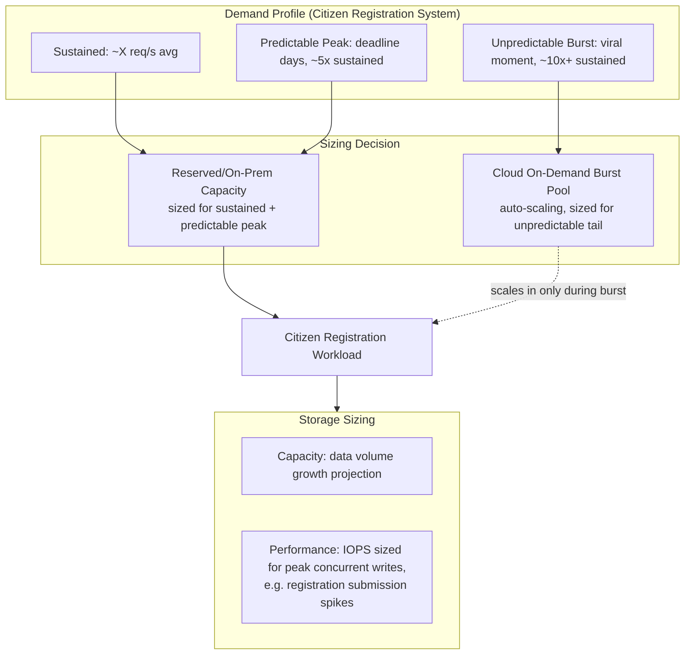
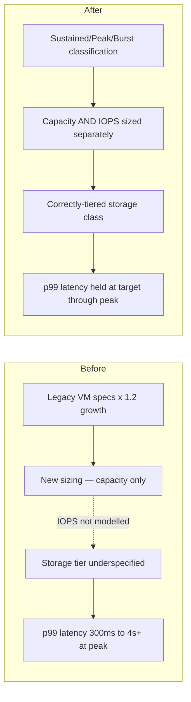
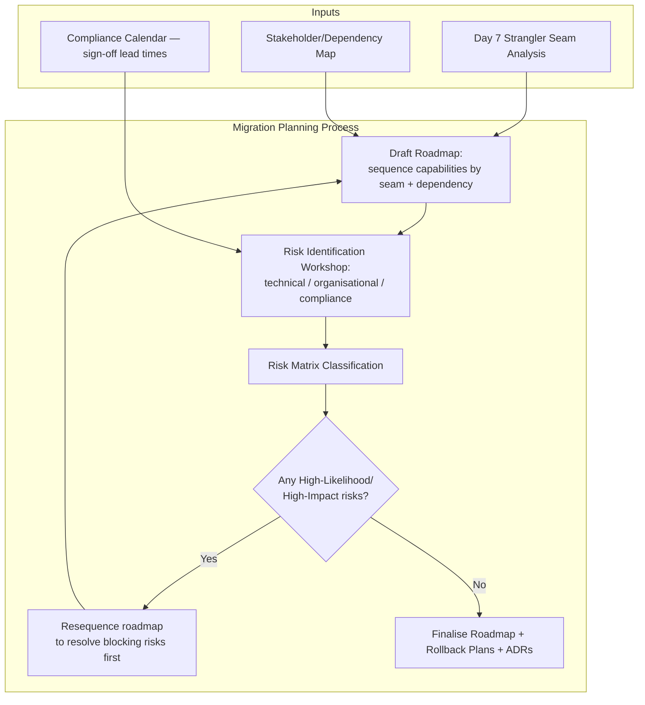
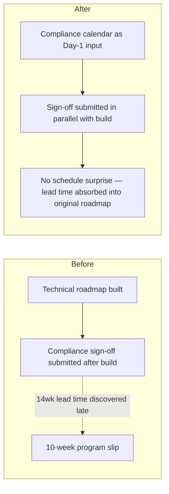
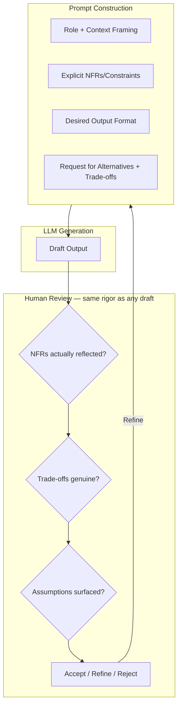
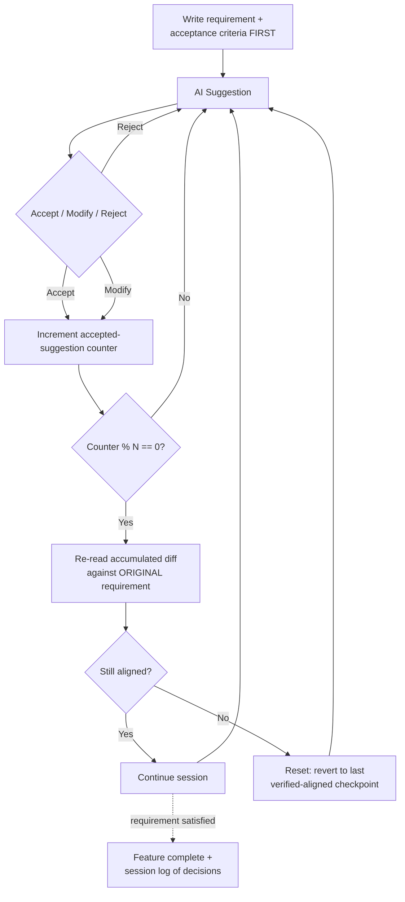
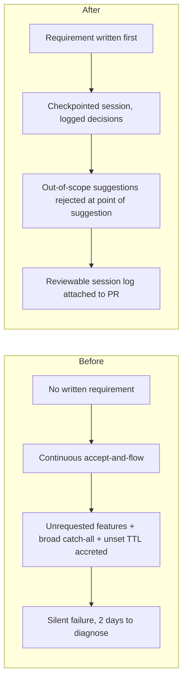
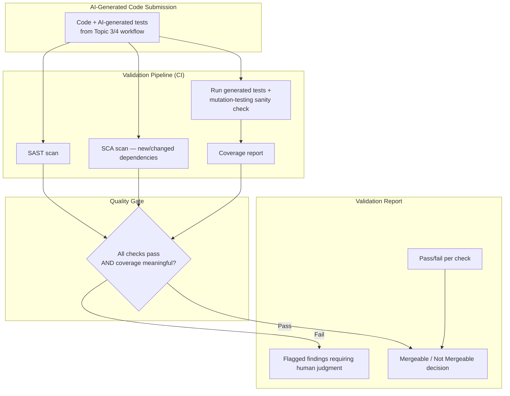
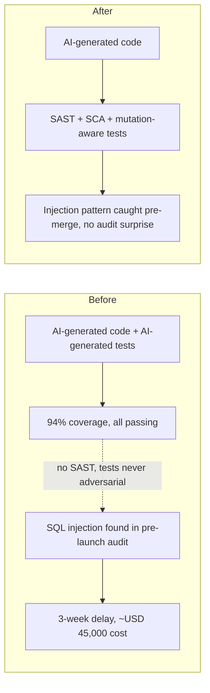

# Senior Engineer to Solution Architect Program
## Day 8 — Theory Document
### Module: Microservices, AI & Modernization
### Theme: Sizing & Risk for Modernization, and AI-Assisted Development Done Responsibly

---

## How to Use This Document

This is the trainer's master reference for Day 8, self-contained for delivery without Day 7's document open. Where today builds on Day 7, a brief recap is given below.

**Day 8 covers five topic blocks**, in delivery sequence:

| # | Topic Block | Scheduled Duration |
|---|---|---|
| 1 | Infrastructure & Storage Sizing: Cost/Performance Trade-offs | 1.0 hr |
| 2 | Accelerated Migration Planning Workshop with Risk Assessment | 1.0 hr |
| 3 | Prompt Engineering Templates for Architecture, Code, Tests | 1.0 hr |
| 4 | Vibe Coding with AI: GitHub Copilot, GPT-4/5 Iterative Refinement | 1.0 hr |
| 5 | Code Validation: Static Analysis, Unit Test Gen, Security Scanning of AI Output | 1.0 hr |

**Trainer's Note on pacing:** 5.0 scheduled hours against a 6–8 hr day. Topics 1–2 close out the Legacy Modernization & Migration Playbook module started Day 7; Topics 3–5 open an entirely new module (AI-Assisted Development & Validation) and can run as a connected sequence — prompt engineering produces output, vibe coding iterates on it, validation gates it before it's trusted. Use spare time to let Topic 2's risk-matrix workshop run as a real small-group exercise (it's designed for that) and to extend Topic 5's validation checklist with one extra AI-generated code sample brought live in the room.

> **Architect's Note:** Frame the shift at the midpoint of today explicitly to the cohort: Topics 1–2 are about *de-risking decisions you've already made* (the migration is happening; how do you size it and plan it safely). Topics 3–5 are about a *new kind of decision* — how much you can trust output you didn't write yourself, and what evidence you need before that output enters a production system. The skill in both halves is the same architectural instinct: never accept a claim of correctness or cost without a way to verify it.

---

## Day 7 Recap — Starting State for Today

Topics 1–2 today assume the legacy citizen-registration system and its strangler-facade migration plan from Day 7 are still the working example. Specifically: the facade routes the `status` capability to a new service already, CDC streams legacy database changes to the new system's store, and the cohort has *not yet* built a full migration roadmap or sized the infrastructure for the target state — that's today's work.

Topics 3–5 are freestanding and do not require Day 7 context, but the PayCore/citizen-registration codebase remains the running example for continuity, since the cohort already knows its shape.

**Abbreviations used today (expanded on first use in body text):** TCO, RTO, RPO, IOPS, ADR, RACI, SAST, DAST, SCA, CWE, LLM, RAG.

---

# Topic 1: Infrastructure & Storage Sizing — Cost/Performance Trade-offs

## Section A: Concept Foundation

### 1. Learning Objectives

By the end of this block, participants will be able to:
1. **Analyze** a migrated workload's resource consumption profile to derive compute, memory, and storage sizing requirements.
2. **Design** a sizing model that distinguishes peak, sustained, and burst capacity needs for a citizen-facing government workload.
3. **Evaluate** the trade-offs between on-prem, cloud reserved capacity, and cloud on-demand pricing for a given workload's variability profile.
4. **Create** a 5-year TCO (Total Cost of Ownership) comparison for two infrastructure sizing options for the migrated citizen-registration system.

### 2. Concept Explanation

**Analogy:** Sizing infrastructure for a migrated workload is like provisioning a kitchen for a restaurant that used to serve a fixed lunch menu to a known crowd, but is now also taking unpredictable delivery-app orders that spike sharply at dinner. If you size the kitchen for the old lunch crowd, dinner spikes fail. If you size it for the worst-ever dinner spike, you've paid for idle capacity every lunch. The actual job is characterising the *shape* of demand, not picking a single number.

**What is it?** **Infrastructure sizing** is the discipline of translating a workload's actual or projected resource consumption — compute (vCPU), memory, storage capacity, and storage performance (IOPS — Input/Output Operations Per Second, a measure of storage throughput) — into a provisioning decision, balanced against cost. For a migration specifically, sizing is complicated by the fact that the legacy system's resource consumption (often over-provisioned, poorly instrumented, or simply unknown because nobody who built it remains) is rarely a reliable baseline for the new system's actual needs.

**Why does it matter?** Under-sizing causes the exact SLA-violating outages discussed in Day 7 (e.g., the settlement-platform lock contention case study). Over-sizing is a silent, recurring cost that compounds for the lifetime of the system — a government program that over-provisions cloud capacity by 40% (illustrative) is paying that premium every month for years, money that could fund other modernization work.

**When to use it?** Any time a workload changes its operating environment significantly enough that historical resource consumption is not a safe predictor of future need — migrations, major architectural changes (e.g., moving from a monolith to microservices, which typically *increases* total resource consumption due to per-service overhead even as it improves other qualities), or significant traffic growth projections.

**When NOT to use it?** Don't build an elaborate sizing model for a workload with stable, well-understood, already-instrumented resource consumption and no planned architectural change — in that case, simply extrapolate current utilization with a reasonable growth margin. Sizing rigor should be proportional to uncertainty, not applied uniformly out of process habit.

> **Anti-Pattern Warning:** "Just match what the legacy system currently uses" is a common but unreliable sizing heuristic — legacy systems are frequently over-provisioned out of historical caution, under-instrumented (so nobody actually knows true peak utilization), or running on hardware whose performance characteristics don't map cleanly to cloud-equivalent units. Treat the legacy footprint as one data point, not the answer.

### 3. Sub-Topic Deep Dive: Peak, Sustained, and Burst Profiles

A government citizen-registration system typically has three distinct demand shapes that must be sized differently:
- **Sustained load**: ordinary daily traffic — registration status checks, routine updates. Size compute/storage for this using average utilization plus a moderate safety margin.
- **Predictable peak**: known high-demand periods — e.g., a subsidy application deadline day, a new policy announcement driving a surge in status checks. Size for this using historical peak data or, for new programs, comparable-program estimates, and prefer **auto-scaling** (covered Day 10) over static over-provisioning where the platform supports it.
- **Unpredictable burst**: a viral social-media moment, a press event referencing the portal, a citizen-facing outage in a competing service driving traffic elsewhere. This is the hardest to size for statically; it's the primary justification for cloud on-demand burst capacity even in an otherwise on-prem or reserved-capacity-dominant deployment.

### 4. Sub-Topic Deep Dive: TCO Modelling Components

A defensible TCO comparison must include components teams routinely forget when comparing cloud vs. on-prem:

| Cost Component | On-Prem | Cloud |
|---|---|---|
| Compute/storage hardware | Capital expense, depreciated over ~5 years | Operating expense, pay-as-you-go or reserved |
| Power, cooling, data-centre floor space | Often hidden in a separate facilities budget — must be allocated | Included in unit pricing |
| Staff to operate (patching, hardware failure response) | Dedicated ops headcount | Largely absorbed by cloud provider, though platform-ops headcount still needed |
| Network egress | Typically a fixed/sunk cost | Can be a meaningfully variable cost, especially for cross-region replication (relevant to Day 4/5's geo-partitioning) |
| Compliance/data residency controls | Direct control, but cost of building/auditing it yourself | May require a specific region/sovereign-cloud offering, sometimes at a price premium |

> **Trade-off Alert:** `Capital Predictability vs. Operational Flexibility` — on-prem and cloud-reserved capacity both trade flexibility for predictable, often lower *unit* cost at steady utilization; on-demand cloud trades a higher unit cost for the ability to absorb burst load (Sub-Topic 3 above) without pre-commitment. Most real sizing decisions for a government system land on a hybrid: reserved/on-prem capacity sized to sustained + predictable-peak load, with on-demand cloud burst capacity layered on top for the unpredictable tail — directly connecting to Day 10's hybrid Terraform provisioning content.

---

## Section B: Architecture and Design

### 5. High-Level Design (HLD)



**Annotations:**
- **Reserved capacity sized to sustained + predictable peak, not unpredictable burst** — this is the central sizing decision; sizing reserved capacity to cover the unpredictable tail means paying for that headroom every single day it isn't needed, which for most government budget cycles is indefensible compared to burst-pricing alternatives.
- **Storage capacity and storage performance are sized separately** — a common sizing mistake is to size storage purely by capacity (GB needed) and ignore IOPS, then discover during a registration deadline day that the storage tier's IOPS ceiling, not CPU or memory, is the actual bottleneck.

### 6. Design Rationale and Trade-off Analysis

| Approach | Strength | Weakness |
|---|---|---|
| **Hybrid: reserved + on-demand burst (recommended)** | Lowest steady-state unit cost with burst resilience | Requires accurate classification of demand into sustained/peak/burst — getting this wrong undersizes or oversizes one tier |
| **Pure on-prem, sized for worst-case peak** | Maximum control, no recurring cloud spend | Pays for worst-case capacity 365 days/year; capital-intensive; slow to add capacity if projections were wrong |
| **Pure cloud on-demand, no reserved commitment** | Maximum flexibility, fastest to deploy | Highest unit cost at sustained load; for a 24/7 citizen service with predictable sustained traffic, this overpays relative to reserved pricing |

**Trade-off:** `Unit Cost at Steady State vs. Cost of Wrong Projections` — committing to reserved/on-prem capacity gets cheaper per-unit pricing but is expensive to unwind if the sizing projection turns out wrong (over- or under-estimated); pure on-demand costs more per unit but is trivially adjustable. The hybrid recommended approach minimizes this risk by only committing the *confidently predictable* portion of demand to the cheaper, less flexible tier.

---

## Section C: Code Walkthrough

Sizing is as much a calculation discipline as a coding one. The "code" here is the sizing/TCO model itself — shown as a small, runnable utility that the trainer should have participants extend with their own workload numbers.

```python
# tco_model.py
# WHAT: a minimal 5-year TCO comparison model for two infrastructure
#       sizing options, parameterised so it can be re-run for any
#       workload's numbers.
# WHY: making the TCO calculation an actual runnable artifact, rather
#      than a spreadsheet nobody re-validates, lets the cohort treat
#      sizing assumptions as testable inputs they can sensitivity-test.

from dataclasses import dataclass

@dataclass
class TcoInputs:
    years: int = 5
    # On-prem / reserved option
    onprem_capex_year0: float = 0.0       # one-time hardware cost
    onprem_annual_opex: float = 0.0       # power, cooling, ops staff allocation
    # Cloud on-demand burst option
    cloud_reserved_monthly: float = 0.0   # reserved capacity monthly cost
    cloud_burst_monthly_avg: float = 0.0  # expected average burst spend/month
    cloud_egress_annual: float = 0.0      # cross-region/replication egress

def five_year_tco(inputs: TcoInputs) -> dict:
    onprem_total = inputs.onprem_capex_year0 + (inputs.onprem_annual_opex * inputs.years)
    cloud_total = (
        (inputs.cloud_reserved_monthly + inputs.cloud_burst_monthly_avg) * 12 * inputs.years
        + inputs.cloud_egress_annual * inputs.years
    )
    return {
        "onprem_5yr_total": round(onprem_total, 2),
        "cloud_5yr_total": round(cloud_total, 2),
        "cheaper_option": "onprem" if onprem_total < cloud_total else "cloud",
        "difference": round(abs(onprem_total - cloud_total), 2),
    }

if __name__ == "__main__":
    # Illustrative numbers for the citizen-registration migrated workload —
    # NOT sourced figures; replace with real procurement quotes in practice.
    example = TcoInputs(
        onprem_capex_year0=4_200_000,      # INR, illustrative hardware refresh
        onprem_annual_opex=650_000,        # INR, illustrative power/cooling/staff
        cloud_reserved_monthly=180_000,    # INR, illustrative reserved instance cost
        cloud_burst_monthly_avg=45_000,    # INR, illustrative average burst spend
        cloud_egress_annual=120_000,       # INR, illustrative cross-region egress
    )
    result = five_year_tco(example)
    print(result)
```

```python
# NEGATIVE EXAMPLE — sizing by legacy-footprint matching alone.
# WHAT: a "sizing model" that just multiplies the legacy system's
#       current VM specs by a flat growth factor.
# WHY SHOWN: to make visible exactly what this approach silently
#       ignores.
def naive_sizing(legacy_vcpu: int, legacy_ram_gb: int, growth_factor: float = 1.2):
    # PROBLEM 1: assumes legacy resource consumption was ever correctly
    # sized in the first place — many legacy systems are sized by
    # whatever VM tier was available when first provisioned, not by
    # actual measured demand.
    # PROBLEM 2: applies a single flat growth factor to both CPU and
    # RAM uniformly, ignoring that a microservices re-architecture
    # (Day 6-7's migration work) typically shifts the ratio of CPU to
    # RAM need — more services means more per-process overhead, which
    # this model has no way to express.
    # PROBLEM 3: says nothing about storage IOPS at all.
    return {
        "vcpu": legacy_vcpu * growth_factor,
        "ram_gb": legacy_ram_gb * growth_factor,
    }
```

---

## Section D: Real-World Case Study

**Context:** A (hypothetical, illustrative) Singapore statutory board migrating the citizen-registration system's compute layer to a managed Kubernetes platform sized infrastructure by applying a flat 20% growth factor to the legacy monolith's VM specifications (the naive approach above), without separately modelling storage IOPS.

**Quantifiable impact (illustrative figures):** During the first registration-deadline peak after go-live, p99 write latency on registration submissions degraded from a target of 300ms to over 4 seconds. Root-cause analysis found the managed Kubernetes platform's default storage class was provisioned for a fixed IOPS tier sized to the legacy footprint's *capacity* (GB), not its *peak write throughput* — the legacy monolith had, unknown to the migration team, been running on storage hardware with substantially higher IOPS headroom than the new tier's default, masking an underlying storage-performance requirement nobody had measured. Remediation required an emergency storage-tier upgrade mid-peak-period, at an estimated 35% cost premium (illustrative) over what a correctly-sized tier selected in advance would have cost, plus the reputational cost of the degraded citizen experience during the program's highest-visibility week.

**Remediation applied going forward:** Adopted the sustained/peak/burst demand classification from Section A, explicitly modelled storage IOPS as a separate sizing dimension from capacity (per Sub-Topic 4), and built the TCO/sizing comparison as a runnable, version-controlled model (as in Section C) rather than a one-time spreadsheet calculation, so it could be re-validated against real production telemetry after go-live rather than treated as a fixed, unrevisited estimate.



**Lessons learned:** the principle reinforced is that **"capacity" and "performance" are different sizing dimensions that must be modelled independently** — a storage tier can have abundant GB headroom and still be the system's actual bottleneck under load if its IOPS ceiling was never separately checked against peak concurrent write demand.

---

## Section E: Engagement and Assessment

### Food for Thought

> Your TCO model in Section C treats cloud egress as a fixed annual estimate. But Day 4/5 taught geo-partitioning and multi-region data-locality requirements — if a future regulatory change requires citizen data to be regionally partitioned with cross-region replication for disaster recovery, how does that change which line item in your TCO model becomes the dominant, hardest-to-predict cost? Suggested research prompt: *"How does cross-region data replication for disaster recovery typically affect cloud egress costs at scale, and what pricing models exist to make this cost more predictable?"*

### Questionnaire — Topic 1

1. **(Conceptual)** Define IOPS and explain why it must be sized separately from storage capacity.
2. **(Conceptual)** Why is "match the legacy system's current resource footprint" an unreliable sizing baseline?
3. **(Conceptual)** Name the three demand-shape categories used to classify workload sizing needs and give one sentence on why each needs a different sizing strategy.
4. **(Application)** Using `five_year_tco()`, compute the cheaper option if `onprem_capex_year0=3,000,000`, `onprem_annual_opex=500,000`, `cloud_reserved_monthly=150,000`, `cloud_burst_monthly_avg=30,000`, `cloud_egress_annual=80,000`, over 5 years.
5. **(Application)** Extend `naive_sizing()` to accept and apply separate growth factors for CPU and RAM, addressing Problem 2 from the negative example.
6. **(Application)** Sketch the additional input field(s) `TcoInputs` would need to model the regulatory cross-region replication scenario from the Food for Thought prompt.
7. **(Analysis)** Compare the hybrid sizing approach against pure on-prem specifically on the dimension of "cost of a wrong projection" — which approach is more expensive to correct, and why?
8. **(Analysis)** The case study's incident was caused by an unmodelled dimension (IOPS), not an underestimated dimension (capacity was fine). Explain why "we sized for X% growth" is an incomplete sizing statement without specifying which dimension(s) that growth factor applies to.
9. **(Scenario)** Your finance department insists on capital budgeting (on-prem) for predictability and will not approve any "uncapped" cloud spend. Propose a hybrid architecture that satisfies this constraint while still providing burst-capacity resilience, and explain what cost ceiling mechanism you'd put on the cloud portion.
10. **(Scenario)** Six months after go-live, production telemetry shows actual sustained load is 30% lower than projected, but burst frequency is 3x higher than projected. Using the sizing categories from Section A, describe which part of your infrastructure commitment you would revisit first, and why.

#### Answer Key

1. IOPS measures storage throughput (operations per second), distinct from storage capacity (total GB); a tier can have abundant capacity but a low IOPS ceiling, making it the actual bottleneck under concurrent write load even when capacity is far from full.
2. Because legacy footprints are frequently over-provisioned out of historical caution, under-instrumented (true peak utilization often unmeasured), and may run on hardware whose performance characteristics don't map cleanly to the new environment's units — it's one data point, not a validated requirement.
3. Sustained (steady daily average — size with reserved/on-prem capacity plus modest margin), predictable peak (known high-demand periods — size with auto-scaling or pre-planned reserved headroom), unpredictable burst (viral/unplanned spikes — size with on-demand cloud capacity rather than static pre-commitment).
4. onprem_total = 3,000,000 + 500,000×5 = 5,500,000; cloud_total = (150,000+30,000)×12×5 + 80,000×5 = 10,800,000 + 400,000 = 11,200,000; cheaper option is on-prem, difference = 5,700,000.
5. Add a second parameter (e.g., `cpu_growth_factor`, `ram_growth_factor`) and apply each independently to `legacy_vcpu` and `legacy_ram_gb` respectively instead of a single shared `growth_factor`, allowing the model to express, for example, higher CPU growth from per-service overhead without forcing the same multiplier onto RAM.
6. A field for projected cross-region replication volume (GB/month) and a separate egress unit-cost field per region pair, since replication egress cost typically scales with both data volume and the specific region pair's pricing, which a single flat `cloud_egress_annual` estimate cannot represent if the regulatory requirement changes the number of replicated regions.
7. Pure on-prem is more expensive to correct, because its capital commitment (hardware purchase) is sunk and slow to unwind — adding capacity requires a new procurement cycle, while reducing it leaves stranded capital; the hybrid approach's cloud-burst portion can be adjusted immediately with no sunk cost, so only the smaller reserved/on-prem portion carries correction risk.
8. Because a single growth percentage applied uniformly assumes all resource dimensions (CPU, RAM, storage capacity, storage IOPS, network throughput) grow at the same rate, which is rarely true — a re-architecture can increase CPU/RAM needs from per-service overhead while leaving storage IOPS needs roughly flat, or vice versa; a sizing statement must specify which dimension(s) a growth factor was actually validated against.
9. Propose sizing the on-prem/reserved capacity for sustained + predictable peak (satisfying the capital-budgeting requirement for the bulk of spend) while implementing the cloud burst pool with a hard spend cap or auto-scaling maximum instance count, accepting that burst capacity may be exhausted/throttled past that ceiling rather than allowing uncapped spend — this gives finance a predictable worst-case cloud bill while still providing burst resilience up to the capped limit.
10. Revisit the reserved/on-prem sustained-load commitment first, since it's overprovisioned relative to actual measured demand (30% lower than projected) and represents ongoing unnecessary cost; the burst capacity being 3x higher-frequency than projected is actually being handled correctly by design (on-demand cloud burst is meant to absorb exactly this kind of variability) and doesn't necessarily need architectural change, only continued monitoring to confirm the burst pool's scaling ceiling is still adequate.

---

# Topic 2: Accelerated Migration Planning Workshop with Risk Assessment

## Section A: Concept Foundation

### 1. Learning Objectives

By the end of this block, participants will be able to:
1. **Analyze** a legacy migration scope to identify and categorise risks across technical, organisational, and compliance dimensions.
2. **Design** a migration roadmap sequencing capability-by-capability strangulation (Day 7) against dependency and risk constraints.
3. **Evaluate** competing migration plans using a structured risk matrix (likelihood x impact).
4. **Create** a complete migration plan artifact set — roadmap, risk matrix, rollback plan, and supporting ADRs — for the citizen-registration system.

### 2. Concept Explanation

**Analogy:** Planning a building renovation while the building stays occupied is not just a technical sequencing problem ("do the wiring before the drywall") — it's also a risk-management problem ("what do we do if we discover asbestos behind that wall," "who has authority to halt work if a tenant complains," "what's our plan if the contractor we hired turns out to be unreliable three weeks in"). A migration roadmap without an accompanying risk plan is just a sequence of hopeful assumptions.

**What is it?** A **migration plan** combines a **roadmap** (the sequence and timing of capability strangulation, per Day 7's seam-selection heuristics) with a **risk matrix** (a structured assessment of what could go wrong, organised by likelihood and impact) and a **rollback plan** for each major migration step, all traced back to **ADRs** (Architecture Decision Records, introduced Day 1) documenting why each sequencing and risk-mitigation decision was made.

**Why does it matter?** Migrations fail less often because of bad code and more often because of un-anticipated organisational or compliance risk — a dependency on a third-party department's legacy integration that nobody mapped, a compliance sign-off that takes eight weeks longer than assumed, a key engineer who understands the legacy system leaving mid-migration. A roadmap that only sequences technical work is incomplete.

**When to use it?** Any migration with: multiple stakeholder teams, regulatory or compliance gates, irreversible steps (Day 7's "contract" phases), or a timeline spanning months — i.e., essentially any real government or BFSI legacy migration, as opposed to a small, single-team, fully-reversible technical change.

**When NOT to use it?** A trivial, fully-reversible, single-team technical migration with no compliance gate doesn't need a formal risk matrix and multi-document plan — lightweight tracking (a shared doc, a few tickets) is proportionate. As with Topic 1, rigor should scale with actual risk, not be applied as box-checking ceremony.

> **Anti-Pattern Warning:** A risk matrix produced once at project kickoff and never revisited is a common failure — risk profiles change as a migration progresses (early risks like "we don't understand the legacy system" resolve, while new risks like "the new system hasn't been load-tested at full cutover scale" emerge). The risk matrix is a living artifact, not a kickoff deliverable to file away.

### 3. Sub-Topic Deep Dive: Risk Categorisation

A useful three-way categorisation for government/BFSI migrations:
- **Technical risk**: data-loss potential, performance regressions, integration breakage (the categories covered in Day 7's case studies).
- **Organisational risk**: key-person dependency (the "only two engineers can read the legacy code" situation from Day 7's case study), cross-team coordination failures, unclear decision authority during incidents.
- **Compliance/regulatory risk**: data-residency violations during a transitional dual-store period, audit trail gaps if CDC sync has any unmonitored downtime, sign-off delays from a regulator (e.g., RBI for a BFSI system, or a government audit body) that aren't accounted for in the timeline.

### 4. Sub-Topic Deep Dive: The Risk Matrix as a Decision Tool

A risk matrix is only useful if it drives actual sequencing decisions, not just documentation. The standard construction:

| Likelihood ↓ / Impact → | Low Impact | Medium Impact | High Impact |
|---|---|---|---|
| **High Likelihood** | Monitor | Mitigate before proceeding | **Block — must resolve first** |
| **Medium Likelihood** | Accept | Monitor | Mitigate before proceeding |
| **Low Likelihood** | Accept | Accept | Monitor closely |

> **Architect's Note:** The "Block" cell is the one cohorts most often argue about in the workshop — push them to actually classify their identified risks into these cells rather than leaving everything as a flat list. A flat risk list lets a team feel like they've "done risk assessment" without it ever changing a single sequencing decision, which defeats the entire purpose.

---

## Section B: Architecture and Design

### 5. High-Level Design (HLD)



**Annotations:**
- **The risk matrix classification feeds back into the roadmap (the loop from P4 to P1)** — this loop is the entire point of the diagram; a roadmap is not "done" until it has survived at least one risk-driven resequencing pass.
- **Compliance calendar is a first-class input, not an afterthought** — sign-off lead times (which an engineering team often has no direct control over) frequently become the actual critical path of a government migration, more so than engineering effort itself.

### 6. Design Rationale and Trade-off Analysis

| Approach | Strength | Weakness |
|---|---|---|
| **Risk-driven iterative resequencing (recommended)** | Roadmap reflects actual risk, not just technical convenience | Takes longer to finalize a plan; requires genuine cross-functional workshop time |
| **Technical-dependency-only sequencing** | Fast to produce; engineers can do it alone | Ignores organisational/compliance risk entirely until it surfaces as a surprise mid-migration |
| **Risk matrix as documentation only (no resequencing loop)** | Satisfies a governance checkbox quickly | Captures risks on paper without ever changing the plan — Section A's anti-pattern |

**Trade-off:** `Planning Speed vs. Plan Robustness` — the recommended approach costs real workshop time upfront (this is *literally* the hands-on assignment for this topic block) in exchange for a roadmap that has already absorbed the resequencing a less rigorous plan would otherwise discover mid-execution, at much higher cost.

---

## Section C: Code Walkthrough

This topic's primary artifacts are planning documents, not running code — shown here as structured templates the cohort fills in live, which is the actual deliverable of the "hands-on" workshop.

```markdown
<!-- ADR Template — for a migration sequencing decision -->
# ADR-0012: Sequence Status-Lookup Capability Before Registration-Write Capability

## Status
Accepted

## Context
The citizen-registration legacy system (Day 7) has two strangulation
candidates: status-lookup (read-only) and registration-write
(read-write, transactionally coupled to a physical ID card issuance
side effect in the legacy monolith — see Day 7 Food for Thought).

## Decision
Strangle status-lookup first.

## Consequences
- Positive: lowest-risk capability validated first; builds confidence
  and CDC-sync track record before attempting the higher-risk,
  transactionally-coupled write capability.
- Negative: registration-write capability's migration is delayed,
  meaning the legacy monolith's write path — the part with the most
  unmaintained, hardest-to-read code — remains in production longer
  than ideal.
- Risk introduced: extends the window during which the legacy
  monolith's key-person dependency (Day 7 case study: only two
  engineers can read it) remains a live organisational risk.
```

```markdown
<!-- Risk Matrix entry template (one row per identified risk) -->
| ID | Risk Description | Category | Likelihood | Impact | Matrix Cell | Mitigation | Owner |
|----|---|---|---|---|---|---|---|
| R-04 | CDC connector lag exceeds 5 min during peak load, causing new system to serve stale status data | Technical | Medium | Medium | Monitor | Add CDC lag alerting (Day 9 observability); define acceptable staleness SLA | Platform team |
| R-07 | Compliance sign-off for cross-border data handling (if hosting shifts) takes 10 weeks, not the assumed 3 | Compliance | High | High | **Block** | Submit sign-off request now, in parallel with technical work, not sequenced after it | Program lead |
| R-09 | Only 2 engineers understand legacy registration-write module | Organisational | High | High | **Block** | Mandate paired knowledge-transfer sessions before write-capability strangulation begins | Eng manager |
```

```markdown
<!-- Rollback Plan template — per migration step -->
# Rollback Plan: Status-Lookup Capability Cutover

## Trigger conditions for rollback
- New service error rate exceeds 2% for 10 consecutive minutes
- CDC lag exceeds defined staleness SLA (see R-04 above) for 15 minutes

## Rollback mechanism
Strangler facade routing rule (Day 7, `StranglerRoutingFilter`) reverts
`/api/v1/registration/status` from the new service back to the legacy
system — a single configuration change, no data migration to undo,
since the legacy system was never stopped during this capability's
transition window.

## Rollback owner and decision authority
On-call platform engineer can trigger immediately on the automated
trigger conditions above; any other rollback requires program-lead
sign-off (RACI — Responsible, Accountable, Consulted, Informed —
matrix referenced in full plan, not reproduced here).
```

> **Production Insight:** Note that the rollback plan above is trivially cheap specifically *because* of how Day 7's strangler facade was designed — routing reversion is a config change, not a data-undo operation. This is a deliberate callback: ask the cohort to identify which Day 7 design decision is what makes this rollback plan this simple, reinforcing that good migration architecture (Day 7) is what makes good migration planning (today) tractable, not the other way around.

---

## Section D: Real-World Case Study

**Context:** A (hypothetical, illustrative) US federal agency modernization program produced a technically rigorous migration roadmap (correctly sequenced by Day 7's seam heuristics) but skipped the organisational and compliance risk categories from Sub-Topic 3, treating the roadmap as purely an engineering artifact.

**Quantifiable impact (illustrative figures):** Three months into execution, the program discovered that the compliance sign-off for handling personally identifiable information in the new system's data store (a FedRAMP — Federal Risk and Authorization Management Program — authorization step) had an actual lead time of approximately 14 weeks, not the 4 weeks the engineering team had assumed based on a previous, smaller project. Because this sign-off had been sequenced *after* the technical build rather than submitted in parallel with it (per the anti-pattern of compliance-as-afterthought), the entire program's go-live slipped by roughly 10 weeks, with an estimated USD 600,000 (illustrative) in extended contractor costs during the delay.

**Remediation applied:** Restructured the planning process to follow Section B's HLD explicitly — compliance calendar as a first-class input to the initial roadmap draft, not a step sequenced after technical planning — and added the FedRAMP sign-off lead time as a high-likelihood, high-impact ("Block") risk-matrix entry for all subsequent migration phases in the program, triggering parallel submission of compliance requests at the earliest point each phase's data-handling scope was known, rather than waiting for technical completion.



**Lessons learned:** the principle reinforced is that **engineering risk and compliance risk operate on different, often unrelated timelines**, and a roadmap that sequences them as if compliance is just "another task in the engineering backlog" will reliably underestimate it — compliance lead times must be sourced from people who actually own that process, not assumed by engineers extrapolating from unrelated past projects.

---

## Section E: Engagement and Assessment

### Food for Thought

> The risk matrix in Section C marks "only 2 engineers understand the legacy write module" as a Block-level organisational risk. Suppose the mitigation (paired knowledge-transfer sessions) succeeds, and now 4 engineers understand it — but all 4 are on the same delivery team, and that team's manager is reorganised into a different department mid-migration. Has the original risk actually been mitigated, or has it just been resized? What would a *durable* mitigation for key-person/key-team risk look like, beyond simply increasing the headcount of people who know something? Suggested prompt: *"What organisational practices, beyond cross-training more individuals, create durable resilience against key-person risk in a long-running technical migration?"*

### Questionnaire — Topic 2

1. **(Conceptual)** Name the three risk categories used in this topic's framework and give one example of each that is NOT from the case study.
2. **(Conceptual)** Why is a risk matrix produced once at kickoff and never revisited considered an anti-pattern?
3. **(Conceptual)** In the risk matrix construction, what should happen to a roadmap when a risk is classified into the "high likelihood / high impact" cell?
4. **(Application)** Using the risk matrix template, add a new row for the risk "the new status-lookup service has not been load-tested above 2x normal peak traffic," assigning a likelihood, impact, and matrix cell with justification.
5. **(Application)** Write a rollback-plan trigger condition for the registration-write capability (not status-lookup) that accounts for its transactional coupling to physical ID card issuance (per Day 7's Food for Thought).
6. **(Application)** Draft the ADR "Consequences" section for a decision to delay registration-write strangulation by one additional sprint specifically to run more knowledge-transfer sessions (per R-09's mitigation).
7. **(Analysis)** Compare "risk-driven iterative resequencing" against "technical-dependency-only sequencing" on the specific dimension of how each would have handled the case study's FedRAMP discovery — would technical-dependency-only sequencing have caught it earlier, later, or about the same time, and why?
8. **(Analysis)** The case study's lead-time estimate (4 weeks assumed, 14 weeks actual) came from extrapolating a previous, smaller project. Identify what made that extrapolation unreliable and propose a better source for this specific estimate.
9. **(Scenario)** Your program sponsor wants to skip the risk-matrix workshop entirely "to save two days of calendar time" given a tight deadline. Using the case study's 10-week slip, construct the argument for why skipping this workshop is more likely to cost calendar time than it saves.
10. **(Scenario)** Building on the Food for Thought: propose one concrete addition to the risk-matrix framework itself (not just a mitigation for one risk) that would better capture risks like "mitigation succeeded but is fragile to organisational change," which the current Likelihood x Impact structure doesn't explicitly surface.

#### Answer Key

1. Technical (e.g., data-loss potential during a cutover), organisational (e.g., unclear decision authority for who can trigger a rollback during an incident), compliance/regulatory (e.g., data-residency rules during a transitional dual-store period) — any non-case-study example fitting each category is acceptable.
2. Because risk profiles change as a migration progresses — early risks resolve and new ones emerge — so a static, kickoff-only matrix stops reflecting reality and stops being able to drive any actual sequencing decisions partway through execution.
3. The roadmap should be resequenced to resolve that risk before the affected migration step proceeds — per Section B's HLD, this is the "Block" classification, which feeds back into replanning rather than simply being logged and carried forward unresolved.
4. Example: likelihood Medium (load testing gaps are common but not universal), impact High (an under-tested service failing during a real peak directly affects citizens), matrix cell "Mitigate before proceeding" — justification: the risk is plausible and consequential enough to require action (running the load test) before relying on the service at full cutover scale, but not certain enough to fully block all other migration work.
5. Example: "Rollback if registration-write success rate drops below 99% for any 5-minute window, OR if any registration is recorded as written without a corresponding ID-card-issuance event being triggered within an expected time window" — the second condition specifically addresses the transactional coupling, since a plain error-rate trigger alone wouldn't catch a case where the write succeeds but the coupled side effect silently fails.
6. Example: "Positive: additional knowledge-transfer sessions reduce key-person risk (R-09) before the highest-risk capability is strangled. Negative: one-sprint delay to the overall roadmap, extending the window the legacy write module remains in production. Risk introduced: none new; this decision is itself a mitigation for an already-identified Block-level risk."
7. Technical-dependency-only sequencing would have caught the FedRAMP issue about the same time or later, not earlier — because compliance lead time is, by definition, not a technical dependency, a sequencing approach that only considers technical dependencies has no mechanism to surface it at all until it's encountered as a blocking gate near go-live, which is exactly what happened in the case study; the recommended risk-driven approach is what changes the discovery timing, not a difference in technical sequencing logic itself.
8. The extrapolation assumed lead time scales similarly with program size/scope across the agency's projects, when in fact compliance lead times are often driven by factors unrelated to engineering scope (reviewer workload, specific authorization type, current backlog at the compliance body) — a better source would be direct, current confirmation from the compliance/authorization office itself for this specific program's scope, rather than inference from an unrelated past project.
9. The case study shows that skipping equivalent upfront risk identification (specifically, compliance risk) led to a 10-week slip discovered three months in — against which a 2-day workshop is a small fraction of the cost; the argument should highlight that the workshop's purpose is precisely to surface this category of risk before it becomes a late, expensive surprise, and that "saving" the 2 days carries a demonstrated risk of losing far more calendar time later.
10. One reasonable proposal: add a "mitigation durability" or "mitigation fragility" tag to matrix entries that have been moved out of a Block/Mitigate cell due to a completed mitigation, with a defined re-review trigger (e.g., "re-assess this risk's classification if the responsible team's structure changes") — making the matrix explicitly track not just current risk level but the stability of whatever brought that level down, rather than treating a mitigated risk as permanently resolved.

---

# Topic 3: Prompt Engineering Templates for Architecture, Code, Tests

## Section A: Concept Foundation

### 1. Learning Objectives

By the end of this block, participants will be able to:
1. **Analyze** the difference between a prompt that produces usable architectural output and one that produces plausible-sounding but unreliable output.
2. **Design** reusable prompt templates for three distinct artifact types: architecture diagrams, code skeletons, and unit tests.
3. **Evaluate** AI-generated architectural output against the same rigor standard (NFRs, trade-offs, ADRs) applied to human-produced output throughout this program.
4. **Create** a critique-and-refine workflow that treats the first AI output as a draft, not a deliverable.

### 2. Concept Explanation

**Analogy:** A prompt is a brief given to a very fast, very well-read, occasionally overconfident junior architect who has never seen your specific system, your specific compliance constraints, or your specific production incidents. A vague brief ("design me a microservice") gets a generic, textbook answer. A brief that includes the actual NFRs, the actual constraints, and an explicit request to show trade-offs gets something genuinely useful — but it still needs the same review rigor you'd give any junior architect's first draft.

**What is it?** **Prompt engineering** for architecture, code, and test generation is the practice of structuring requests to a large language model (LLM) so that its output is specific, verifiable, and aligned with the actual constraints of the system being built — as opposed to generic best-practice output that happens to be syntactically plausible. A good architectural prompt template typically supplies: role/context framing, explicit NFRs and constraints, the desired output format (e.g., "Mermaid diagram plus a trade-off table"), and an explicit instruction to surface assumptions and alternatives rather than presenting one confident answer.

**Why does it matter?** Senior engineers transitioning to architect roles are often the people in an organisation best positioned to use AI assistance well — they have the judgment to evaluate output critically — but only if they prompt with enough specificity that the output is actually evaluable against real constraints, and only if they treat the output with the same scrutiny they'd apply to a colleague's draft ADR.

**When to use it?** Early-stage architectural exploration (generating candidate HLDs to critique, not to adopt verbatim), boilerplate code skeleton generation (the repetitive, well-understood scaffolding that consumes time without much architectural judgment), and test-case brainstorming (especially edge cases a human reviewer might not think of first).

**When NOT to use it?** Final architectural decisions with legal, safety, or compliance consequences should never be "generated" — they should be made by a qualified architect, informed by AI-assisted exploration, and documented in an ADR with human-owned rationale. Section E of Topic 5 covers exactly where the line is drawn for code; the same principle applies to architecture.

> **Anti-Pattern Warning:** "I asked the AI to design it and it looked reasonable" is not an architectural process — it is the abdication of the trade-off analysis (Section B, every Theory Document this program) that is the actual job of a solution architect. AI-generated output enters this program's process at the same stage and under the same scrutiny as a junior team member's first draft, never later in the process than that.

### 3. Sub-Topic Deep Dive: The Three Template Types

- **Architecture diagram prompts**: must specify the system's actual NFRs and constraints (not generic ones), request explicit alternatives and trade-offs (not a single answer), and request the output in the program's standard format (Mermaid, annotated).
- **Code skeleton prompts**: most effective when scoped narrowly (one class, one well-defined responsibility) with the target tech stack and any team conventions stated explicitly, and an explicit request to flag where business-logic decisions were assumed rather than specified.
- **Unit test prompts**: most effective when given the actual code (not a description of it) and asked explicitly for edge cases, boundary conditions, and failure-mode coverage — generic "write tests for this" prompts tend to produce only happy-path coverage.

### 4. Sub-Topic Deep Dive: Reviewing AI Output — A Checklist

Before accepting any AI-generated architectural or code artifact:
- Does it correctly reflect the NFRs and constraints actually supplied, or has it silently substituted generic best practices where a specific constraint should have applied?
- Are the trade-offs presented genuine alternatives with real weaknesses, or is one option a strawman to make another look better (a known LLM tendency when asked to "compare options")?
- For code: does it compile/run, and have the assumptions it silently made (Sub-Topic 3) been explicitly surfaced and validated against actual requirements?

---

## Section B: Architecture and Design

### 5. High-Level Design (HLD)



**Annotations:**
- **The Review stage is structurally identical to reviewing a human colleague's draft** — this is a deliberate design choice in the diagram: there is no special "trust the AI" fast path; the same three questions (NFR fidelity, trade-off genuineness, assumption surfacing) apply regardless of who or what produced the draft.
- **The Refine loop returns to Input, not to Review** — refining a prompt based on what went wrong is usually more effective than asking the same underspecified prompt again and hoping for a better roll; this connects to Topic 4's iterative-refinement workflow.

### 6. Design Rationale and Trade-off Analysis

| Approach | Strength | Weakness |
|---|---|---|
| **Structured template with explicit constraints (recommended)** | Output is specific and evaluable against real requirements | Requires upfront effort to articulate constraints clearly — more effort than a one-line prompt |
| **Minimal/generic prompting ("design a microservice for X")** | Fast to write | Produces generic, textbook output disconnected from actual system constraints; reviewer effort shifts to "figure out what's wrong" rather than "verify what's right" |
| **Iterative conversational refinement with no template** | Flexible, can correct course mid-conversation | Without an initial structured brief, early turns waste cycles re-deriving context that a template would have supplied upfront |

**Trade-off:** `Upfront Prompt-Crafting Effort vs. Review Effort` — a well-constructed prompt costs more time to write but produces output requiring less corrective review; a lazy prompt is faster to send but shifts cost onto the review stage, often with a worse outcome since reviewers tend to under-scrutinize confident-sounding generic output (a documented risk with LLM-assisted review generally).

---

## Section C: Code Walkthrough

```text
ARCHITECTURE DIAGRAM PROMPT TEMPLATE
=====================================
Role: You are a solution architect reviewing options for [COMPONENT].

Context: [1-2 sentence system description]. This component must
satisfy the following NFRs: [list actual NFRs, e.g., "p99 latency
under 300ms," "must support offline-first mobile clients per Day 6/7
patterns," "must comply with [specific regulation]"].

Constraints: Technology stack is limited to [actual stack]. This
component integrates with [actual upstream/downstream dependencies].

Task: Propose TWO architecturally distinct approaches (not just
variations on one approach) for [COMPONENT]. For each, provide:
1. A Mermaid flowchart diagram of the design.
2. The specific NFRs each approach satisfies well and which it
   satisfies poorly.
3. One concrete failure scenario where this approach would struggle.

Do not present one approach as strictly better — present genuine
trade-offs and let me decide based on which NFR matters more for
this specific system.
```

```text
CODE SKELETON PROMPT TEMPLATE
=====================================
Role: You are implementing one class in a Java 17 / Spring Boot 3.x
codebase following [team convention, e.g., "constructor injection,
no field injection; all public methods documented with WHAT/WHY"].

Task: Generate a skeleton for [SINGLE CLASS NAME] with responsibility
limited to [ONE SENTENCE RESPONSIBILITY — narrow scope deliberately].

Explicitly list, as comments, every assumption you make about
business logic that wasn't specified in this prompt (e.g., default
values, error-handling choices, validation rules) — I will review
and confirm or correct each one before this code is used.

Do not implement business logic you're inferring rather than being
told — stub it with a TODO and the assumption comment instead.
```

```text
UNIT TEST GENERATION PROMPT TEMPLATE
=====================================
Role: You are writing JUnit 5 tests for the following class: [PASTE
ACTUAL CODE — not a description of the class].

Task: Generate tests covering:
1. The happy path for each public method.
2. At least 2 boundary/edge cases per method (e.g., null inputs,
   empty collections, max/min values relevant to this domain).
3. At least 1 failure-mode test per method that has an external
   dependency (e.g., what happens if [DEPENDENCY] throws or times out).

For each test, add a one-line comment stating WHAT scenario it
verifies and WHY that scenario matters for this specific class
(not a generic justification).
```

```java
// NEGATIVE EXAMPLE — what an underspecified prompt tends to produce.
// Prompt used: "write a service to verify a citizen application"
// WHAT'S WRONG: no NFRs supplied, no mention of the idempotency-key
// and saga patterns this codebase actually requires (Day 6/7), no
// stated tech-stack convention — the LLM fills every gap with the
// most generic, textbook-plausible answer it can produce.
package gov.training.paycore.application.generic;

public class ApplicationVerificationService {
    public void verify(Long applicationId) {
        // PROBLEM: no idempotency key parameter at all — this code,
        // if accepted without review, would silently reintroduce the
        // exact duplicate-processing risk taught on Day 7, Topic 1,
        // because the prompt never told the model this system has
        // that requirement. The model didn't fail; the prompt did.
        System.out.println("Verifying application " + applicationId);
        // ... generic, assumption-free implementation continues
    }
}
```

---

## Section D: Real-World Case Study

**Context:** A (hypothetical, illustrative) Indian BFSI fintech's engineering team, newly given GenAI tooling access, used minimal prompts ("generate a Spring Boot REST controller for loan application status") to rapidly scaffold several services ahead of an audit deadline.

**Quantifiable impact (illustrative figures):** A post-deployment security review found that 6 of 14 AI-generated controller endpoints (illustrative count) lacked any input validation annotations, because the generic prompts never specified the team's actual validation conventions or the regulatory requirement (under data-protection obligations applicable to financial data) that all citizen-facing financial endpoints validate and sanitise input before processing. Remediating this post-hoc, after code review flagged the gap, cost an estimated 3 engineer-weeks (illustrative) — likely less time than would have been spent writing the validation conventions into a reusable prompt template once, which would have applied correctly across all 14 endpoints from the start.

**Remediation applied:** Built the three template types from Section C as a shared, version-controlled prompt library, each one embedding the team's actual validation, idempotency, and error-handling conventions explicitly, so every subsequent AI-assisted scaffolding request inherited these constraints automatically rather than depending on each engineer remembering to restate them.

```mermaid
flowchart LR
    subgraph Before
        B1[Minimal prompt: "generate a controller"] --> B2[Generic output, no validation conventions]
        B2 --> B3[6/14 endpoints missing input validation]
        B3 --> B4[3 engineer-weeks remediation]
    end
    subgraph After
        A1[Shared prompt template w/ embedded conventions] --> A2[Validation conventions inherited automatically]
        A2 --> A3[Consistent output across all endpoints]
    end
```

**Lessons learned:** the principle reinforced is that **a reusable, constraint-rich prompt template is itself a piece of team infrastructure**, with the same "write once, reuse correctly" value as a shared library or coding standard — treating each prompt as a one-off, freshly-typed request is equivalent to re-deriving your team's conventions from scratch every single time, with predictable gaps.

---

## Section E: Engagement and Assessment

### Food for Thought

> The Section C templates ask the model to "explicitly list assumptions it makes." This depends on the model accurately recognising when it's making a business-logic assumption versus when it considers something settled common practice. Where might that self-recognition fail — i.e., what kind of assumption is a model least likely to flag as an assumption, precisely because it's *so* common in training data that it doesn't feel like a choice? Suggested research prompt: *"What categories of implicit business-logic assumptions are large language models least likely to flag explicitly when generating code, and why?"*

### Questionnaire — Topic 3

1. **(Conceptual)** What four components does a well-structured architecture-diagram prompt template supply, per Section C?
2. **(Conceptual)** Why does the unit-test template require pasting actual code rather than describing the class?
3. **(Conceptual)** Explain, in one sentence, why the Review stage in Section B's HLD is described as "structurally identical" regardless of whether a human or an LLM produced the draft.
4. **(Application)** Using the code-skeleton template, write a prompt for a `RegistrationStatusCache` class that wraps a Redis lookup with a fallback to the primary database, including the assumption-flagging instruction.
5. **(Application)** Identify the missing element in this prompt: "Write a Kafka consumer for application-verified events." Rewrite it using the architecture-diagram or code-skeleton template structure as appropriate.
6. **(Application)** Given the generic negative-example code in Section C, write the single added line of context to the original prompt that would most directly have prevented the missing-idempotency-key problem.
7. **(Analysis)** Compare "structured template" against "iterative conversational refinement with no template" specifically on cost distribution — where does each approach spend its effort (upfront vs. review), and which is more expensive in the case-study's specific failure mode?
8. **(Analysis)** The case study found 6 of 14 endpoints had the same defect. Explain, using Sub-Topic 4's review checklist, which checklist question would have caught this defect during review even without fixing the prompt template first.
9. **(Scenario)** A junior engineer says "the AI's trade-off comparison showed Option A is clearly better, so I went with it." Using Section A's "When NOT to use it" guidance and the anti-pattern warning, write the feedback you would give this engineer.
10. **(Scenario)** Your prompt library (Section D's remediation) embeds today's validation conventions. Six months later, the team's validation convention changes. What does this imply about how prompt templates should be governed/versioned, and what existing program artifact (from any prior day) is the natural model for this governance?

#### Answer Key

1. Role/context framing, explicit NFRs and constraints, desired output format, and an explicit request for alternatives and trade-offs.
2. Because the model needs the actual implementation details (method signatures, dependencies, existing logic) to generate meaningful boundary and failure-mode tests; a description risks the model testing its own assumption about what the class probably does rather than what it actually does.
3. Because the same three review questions (NFR fidelity, trade-off genuineness, assumption surfacing) must be applied regardless of the draft's origin — the program does not grant AI-generated output a lower or different bar of scrutiny than a human colleague's draft.
4. A prompt following the template structure, specifying the single responsibility ("wraps a Redis lookup with fallback to primary DB on cache miss or Redis unavailability"), the team's actual conventions, and explicitly instructing the model to flag assumptions (e.g., TTL value, what counts as "Redis unavailable" for fallback purposes) as TODO comments rather than silently choosing values.
5. Missing elements: no NFRs/constraints, no mention of the idempotency-key/outbox patterns this codebase requires (Day 7), no specification of consumer-group or deduplication behaviour. Rewrite using the code-skeleton template: specify the single responsibility, the actual idempotent-consumer requirement from Day 7's Topic 2, and an explicit instruction to flag any deduplication-strategy assumptions.
6. Adding a line such as: "This system requires an idempotency key parameter on every verification call, per our saga/outbox architecture (Day 7) — include it as a required parameter and use it for deduplication" would most directly target the specific missing element.
7. Structured templates spend effort upfront (prompt construction); iterative conversational refinement with no template spends effort distributed across multiple review/correction cycles. In the case study's specific failure mode (a systemic gap repeated across 14 similar endpoints), the no-template approach is more expensive overall, because the missing convention would have to be independently caught and corrected in each of the 14 review cycles rather than fixed once in a reusable template.
8. The question "does it correctly reflect the NFRs and constraints actually supplied, or has it silently substituted generic best practices where a specific constraint should have applied?" — applied during review, this question would prompt a reviewer to check specifically for the regulatory input-validation requirement, regardless of whether the prompt template had already been fixed.
9. Feedback should reinforce that "the AI said Option A is clearly better" is not, by itself, an architectural decision — the engineer's job was to verify whether the trade-off comparison was genuine (per Sub-Topic 4's checklist) or one in which an option may have been presented as a strawman, and to independently confirm the comparison reflects this specific system's actual NFRs before accepting the recommendation; AI-assisted exploration should inform, not replace, the engineer's own trade-off judgment, per Section A's "When NOT to use it" guidance.
10. It implies prompt templates need the same version control, change-tracking, and decision-rationale discipline as code or ADRs — when a convention changes, the template must be updated and the change traceable; the natural model for this governance is the ADR (Architecture Decision Record) practice from Day 1, since "we changed our validation convention, and here's why" is itself an architectural decision worth recording, just as much as a database choice or sequencing decision was.

---

# Topic 4: Vibe Coding with AI — GitHub Copilot, Iterative Refinement

## Section A: Concept Foundation

### 1. Learning Objectives

By the end of this block, participants will be able to:
1. **Analyze** the difference between iterative AI-assisted refinement and uncritical acceptance of successive AI suggestions ("vibe coding" in its undisciplined sense).
2. **Design** an iterative refinement workflow with explicit checkpoints where architectural judgment, not AI suggestion, drives the next step.
3. **Evaluate** when an AI pair-programming session has drifted from the original requirement and needs to be reset rather than continued.
4. **Create** a small feature using inline AI assistance, with a documented record of what was accepted, what was modified, and why.

### 2. Concept Explanation

**Analogy:** Inline AI coding assistance (Copilot-style suggestions, conversational iterative refinement) is like having an extremely fast-typing pair-programming partner who has read an enormous amount of code but has zero memory of your last design review, zero awareness of your team's specific incident history, and a strong tendency to keep agreeably building on whatever direction the conversation is already heading — including a direction that quietly drifted away from the actual requirement several turns ago. A good pairing partner (human or AI) needs the other person in the pair to periodically stop and ask "wait, is this still solving the actual problem?"

**What is it?** **"Vibe coding"** — building software through a continuous, low-friction loop of AI suggestion and developer acceptance, often without a full specification written upfront — is a real and useful development mode for prototyping and exploration, but it carries a specific, well-documented risk: **iterative drift**, where each individual accept/reject decision seems locally reasonable, but the cumulative trajectory across many small iterations ends up somewhere meaningfully different from the original requirement, with no single point where anyone explicitly decided to go there.

**Why does it matter?** For senior engineers used to writing code deliberately, vibe coding's speed is genuinely valuable — but the same engineers, precisely because the tool is fast and the suggestions are often good, can find themselves reviewing less critically per-suggestion than they would review a single large diff, simply because each individual suggestion is small. The aggregate effect of many under-reviewed small acceptances is the same risk as one large under-reviewed change, just distributed.

**When to use it?** Prototyping, exploring an unfamiliar library or API's usage patterns, generating boilerplate (directly building on Topic 3's templates), and iterating on a feature where requirements are still being clarified through the act of building a first version.

**When NOT to use it?** Security-sensitive code paths, anything touching the patterns this program has spent two days establishing as failure-prone if done carelessly (idempotency, saga steps, schema migrations) should not be vibe-coded through rapid accept-and-continue cycles — these deserve the same deliberate, template-driven approach from Topic 3, with explicit checkpoints, not continuous flow.

> **Anti-Pattern Warning:** "It felt right as I was building it" is not a substitute for verifying the final result against the original requirement. The specific failure mode to watch for is a developer who can no longer clearly articulate, at the end of a long AI-assisted session, what the original requirement was versus what they ended up building — if that articulation is hard, drift has likely occurred.

### 3. Sub-Topic Deep Dive: Designing Checkpoints

A disciplined vibe-coding workflow inserts deliberate stop points:
- **Before starting**: write the requirement and acceptance criteria down first, even briefly — this is the anchor that later checkpoints compare against.
- **Every N accepted suggestions (a practical rule of thumb, e.g., every 5-10)**: pause and re-read the accumulated diff against the original requirement, not just against "does this look like reasonable code."
- **Before any suggestion touching a previously-completed, working piece of the code**: this is often where drift starts — an AI suggestion that "improves" something that wasn't actually part of the current task.

### 4. Sub-Topic Deep Dive: Domain-Specific Context Injection

Iterative refinement quality improves significantly when domain-specific context (the same conventions from Topic 3's templates — idempotency requirements, the saga/outbox architecture, team conventions) is kept present in the AI tool's context throughout the session, not supplied once and then lost as the conversation or suggestion history scrolls past it. Many inline tools support persistent context files (e.g., a repository-level instructions file) specifically to address this — the architectural equivalent of keeping the requirements document open on a second monitor throughout a pairing session.

---

## Section B: Architecture and Design

### 5. High-Level Design (HLD)



**Annotations:**
- **The requirement is written before the loop begins, not inferred from the session afterward** — this is the single most important annotation in this diagram; without a written anchor, "still aligned?" at the checkpoint has nothing concrete to compare against and becomes a vague gut-check instead of a real verification.
- **Reject loops directly back to a new suggestion, but Reset goes back to a checkpoint, not to Start** — rejecting one bad suggestion is cheap and immediate; recovering from detected drift requires returning to the last point that was actually verified, which may mean discarding several accepted suggestions, not just the most recent one.

### 6. Design Rationale and Trade-off Analysis

| Approach | Strength | Weakness |
|---|---|---|
| **Checkpointed iterative refinement (recommended)** | Catches drift early, before it compounds; preserves speed benefit between checkpoints | Checkpoints interrupt flow; requires discipline to actually pause rather than skip the review |
| **Continuous accept-and-flow, no checkpoints** | Maximum speed, no interruption | Drift compounds silently; the case study below shows the typical cost |
| **No AI assistance, fully manual** | No drift risk from this specific failure mode | Forgoes the genuine productivity benefit Topic 3/4 are teaching how to capture safely |

**Trade-off:** `Development Speed vs. Drift Detection Latency` — checkpointing trades a small, regular speed cost (the pause-and-review moments) for catching misalignment early rather than at the end of a session, when unwinding accumulated drift is far more expensive. This is structurally the same trade-off pattern as Day 7's "fitness functions running continuously vs. discovering a violation in production" — catching a deviation early is cheaper than catching it late, in both contexts.

---

## Section C: Code Walkthrough

```text
SESSION LOG TEMPLATE — the "documented record" deliverable for this topic
=====================================
Requirement (written BEFORE starting):
"Add a `RegistrationStatusCache` that serves status lookups from Redis
with a 60-second TTL, falling back to the primary database on cache
miss, returning the same SyncStatus enum values used elsewhere in the
codebase (Day 7, Topic 1)."

Acceptance criteria:
- Cache hit returns in under 10ms (local dev measurement, illustrative).
- Cache miss falls through to DB without throwing.
- Returned status values match the existing SyncStatus enum exactly.

--- Session entries (illustrative excerpt) ---

[Suggestion 1] AI proposed cache key format: "status:{registrationId}"
  Decision: ACCEPTED — matches existing key-naming convention in repo.

[Suggestion 2] AI proposed TTL of 300 seconds (default suggestion,
  not 60 as specified in requirement).
  Decision: MODIFIED — corrected to 60s per requirement. Logged as
  a reminder that default suggestions don't automatically reflect
  stated requirements; this is exactly Topic 3's "silently substituted
  generic best practice" risk, recurring inside an iterative session.

[Suggestion 3] AI proposed adding a cache-warming background job
  "to improve performance" — NOT part of original requirement.
  Decision: REJECTED — out of scope; flagged as a possible separate
  future story rather than accepted inline, to avoid scope drift.

[Checkpoint @ 5 accepted suggestions] Re-read diff against
  requirement: aligned. Continue.

[Suggestion 9] AI proposed changing the fallback's exception handling
  to a broad catch-all "for safety."
  Decision: REJECTED — directly conflicts with Day 7's lesson on
  broad exception handlers masking real failures (Topic 2 case study).
  This rejection exists BECAUSE of cross-day pattern recognition,
  not because the suggestion looked syntactically wrong.

[Final review] Diff matches acceptance criteria. Feature complete.
```

```java
// Resulting code from the disciplined session above.
package gov.training.paycore.application;

import gov.training.paycore.sync.SyncStatus;
import org.springframework.data.redis.core.StringRedisTemplate;
import org.springframework.stereotype.Component;

import java.time.Duration;

@Component
public class RegistrationStatusCache {

    private static final Duration TTL = Duration.ofSeconds(60); // per requirement, NOT the AI's default suggestion of 300s
    private final StringRedisTemplate redisTemplate;
    private final RegistrationStatusRepository fallbackRepository;

    public RegistrationStatusCache(StringRedisTemplate redisTemplate,
                                    RegistrationStatusRepository fallbackRepository) {
        this.redisTemplate = redisTemplate;
        this.fallbackRepository = fallbackRepository;
    }

    public SyncStatus getStatus(String registrationId) {
        String key = "status:" + registrationId;
        String cached = redisTemplate.opsForValue().get(key);
        if (cached != null) {
            return SyncStatus.valueOf(cached);
        }
        // Cache miss falls through to DB — NOT wrapped in a broad
        // catch-all, per the Suggestion 9 rejection above; a genuine
        // failure here should propagate, not be silently swallowed.
        SyncStatus fromDb = fallbackRepository.findStatus(registrationId);
        redisTemplate.opsForValue().set(key, fromDb.name(), TTL);
        return fromDb;
    }
}
```

```java
// NEGATIVE EXAMPLE — continuous accept-and-flow, no checkpoints,
// reconstructed to show where the same session could have ended up
// without the discipline above.
package gov.training.paycore.application.antipattern;

public class RegistrationStatusCacheDrifted {
    // PROBLEM 1: TTL silently left at the AI's default 300s — never
    // checked against the original 60s requirement, because no
    // checkpoint ever re-read the diff against it.
    // PROBLEM 2: cache-warming background job WAS accepted (no
    // scope-discipline to reject it), adding unrequested complexity
    // and a new operational concern (a background job that now needs
    // its own monitoring) nobody explicitly decided to take on.
    // PROBLEM 3: broad catch-all exception handling WAS accepted,
    // silently masking the exact failure mode Day 7 spent an entire
    // case study teaching the cohort to recognise and avoid.
    // None of these three problems would show up in a quick glance —
    // each individual suggestion, reviewed in isolation, looked
    // reasonable. The drift is only visible when compared against
    // the ORIGINAL written requirement, which this session never had.
}
```

---

## Section D: Real-World Case Study

**Context:** A (hypothetical, illustrative) US state agency's small modernization team adopted inline AI pair-programming tooling and, under deadline pressure, skipped writing requirements/acceptance criteria upfront for a "quick" feature: a citizen notification-preferences endpoint.

**Quantifiable impact (illustrative figures):** Over a single multi-hour pairing session with continuous accept-and-flow (no checkpoints), the feature accreted: an unrequested email-template rendering capability "since we're already touching notifications," a broad exception handler around the entire endpoint, and a caching layer with no TTL specified at all (defaulting to indefinite caching). None of this was maliciously introduced — each suggestion, reviewed in isolation mid-flow, seemed like a reasonable extension. The endpoint shipped, and three weeks later a citizen's notification-preference change silently failed to take effect because of the indefinite cache, with the broad exception handler ensuring the failure produced no error log at all. Estimated diagnostic time before the indefinite-cache root cause was found: 2 engineer-days (illustrative), longer than the original feature took to build.

**Remediation applied:** Adopted the checkpointed workflow from Section B, with the session-log template from Section C made a mandatory artifact attached to the pull request for any AI-pair-programmed feature, specifically so reviewers could see not just the final code but which suggestions were accepted, modified, or rejected and why — turning the iterative session itself into an auditable trail rather than a black box that produced a diff.



**Lessons learned:** the principle reinforced is that **the cost of drift is paid at diagnosis time, not at acceptance time** — each accepted suggestion felt free in the moment, but the accumulated, unverified deviation from the actual requirement produced a debugging cost (2 engineer-days) far exceeding whatever speed was gained by skipping checkpoints.

---

## Section E: Engagement and Assessment

### Food for Thought

> The session-log template in Section C captures accept/modify/reject decisions, but it relies on the developer remembering, in the moment, to write down *why* they rejected something — which is exactly the kind of disciplined overhead that's easiest to skip precisely when you're moving fast (the situation vibe coding is meant for). Is there a way to get the benefit of this audit trail without relying on the developer's in-flow discipline to produce it? Consider what would have to change about the tooling itself, not the developer's habits. Suggested prompt: *"What tooling approaches could automatically capture an audit trail of AI pair-programming accept/reject decisions without relying on the developer manually logging each one?"*

### Questionnaire — Topic 4

1. **(Conceptual)** Define "iterative drift" in the context of AI-assisted coding, without using the word "vibe."
2. **(Conceptual)** Why is "the requirement is written before the loop begins" identified as the most important element of the HLD in Section B?
3. **(Conceptual)** Give one example, from Section A, of code that should NOT be developed via continuous accept-and-flow vibe coding, and explain why.
4. **(Application)** Using the session-log template, write a plausible Suggestion entry where an AI proposes adding retry logic to the cache fallback call, and decide accept/modify/reject with justification.
5. **(Application)** Modify the checkpoint frequency in the Section B HLD's `Counter % N` logic to trigger after every single suggestion instead of every N — what is the main cost of this change, in terms of the Section B trade-off table?
6. **(Application)** The negative example accepted an "unrequested email-template rendering capability." Write the one-line rejection justification that should have appeared in a session log, modeled on the Suggestion 3 entry in Section C.
7. **(Analysis)** Compare checkpointed iterative refinement against continuous accept-and-flow specifically on where each pays its cost (in time spent) — checkpointing pays during the session; flow-state pays at what later point, per the case study?
8. **(Analysis)** Explain why "each individual suggestion, reviewed in isolation, looked reasonable" is presented as the core danger of iterative drift rather than any single suggestion being obviously wrong.
9. **(Scenario)** A team lead argues that requiring a written requirement before any AI-pairing session defeats the purpose of "vibe coding" as a fast, exploratory mode. Reconcile this objection with Section A's "When to use it" guidance — is the team lead's concern valid for all vibe-coding use cases, or only some?
10. **(Scenario)** Building on the Food for Thought: propose one specific tooling capability (not a process change) that would reduce reliance on developer-logged session entries, and explain what it would need to capture automatically to be useful for the same review purpose as the manual log.

#### Answer Key

1. Iterative drift is the cumulative divergence of an AI-assisted coding session from its original requirement, arising from a sequence of individually-reasonable-seeming accept/modify/reject decisions whose aggregate trajectory ends up somewhere meaningfully different from the intended target, without any single decision point where that divergence was obvious.
2. Because every later checkpoint's "are we still aligned?" question depends on having a concrete, written anchor to compare against — without it, alignment checks become subjective impressions rather than verifiable comparisons, undermining the entire mechanism the HLD relies on to catch drift.
3. Security-sensitive code paths or the program's previously-established failure-prone patterns (idempotency, saga steps, schema migrations) — because these require the same deliberate, checkpoint-driven scrutiny Topic 3 established for architectural decisions, and the speed/low-friction nature of continuous flow is specifically what increases the risk of an under-reviewed mistake in exactly the areas where mistakes are costliest.
4. Example: "[Suggestion N] AI proposed adding exponential-backoff retry (3 attempts) to the Redis fallback DB call. Decision: ACCEPTED — DB read failures are a legitimate transient-failure case distinct from the broad-catch-all rejected in Suggestion 9; this retry is scoped specifically to the DB call, not a blanket exception suppression, so it doesn't conflict with the Day 7 lesson."
5. Checkpointing after every suggestion maximizes drift-detection responsiveness (catches misalignment immediately) but pushes the trade-off table's "checkpoints interrupt flow" cost to its extreme — effectively eliminating the speed benefit that was the entire reason to use continuous AI assistance in the first place, since every suggestion now requires a full requirement re-read rather than a quick accept/reject.
6. Example: "Decision: REJECTED — email-template rendering is not part of the stated requirement (notification-preferences endpoint only); flagged as a possible separate future story rather than accepted inline, to avoid scope drift," directly mirroring the Suggestion 3 pattern from Section C.
7. Checkpointing pays its cost during the session, as small, regular pauses; continuous accept-and-flow defers its cost to diagnosis time after the defect surfaces in production — per the case study, this was 2 engineer-days of debugging, a cost paid weeks after the original "free" speed was gained.
8. Because if any single suggestion were obviously wrong, ordinary per-suggestion review would catch it immediately — the actual risk is specifically that no individual decision triggers suspicion, so the only way to catch the cumulative deviation is to periodically compare the accumulated state against the original requirement, which is precisely the checkpoint mechanism Section B introduces.
9. The concern is valid only for the "When to use it" cases (prototyping, exploring unfamiliar APIs, requirements still being clarified through building) where a written requirement may not exist yet and isn't expected to; it is not valid for the "When NOT to use it" cases (security-sensitive paths, previously-established failure-prone patterns), where Section A explicitly argues a written, checkpoint-driven approach is required regardless of how it affects flow — the reconciliation is that vibe coding's appropriate scope and the need for upfront requirements are not in tension once the use case is correctly classified.
10. One reasonable proposal: an IDE/tooling capability that automatically records every suggestion shown, the developer's accept/modify/reject action, and a diff of any modification, timestamped and attached to the eventual commit/PR — without requiring the developer to manually write justification text; to be useful for the same review purpose as the manual log, it would still need some mechanism (even a simple modal prompt) for capturing the *why* behind a reject/modify decision, since the action alone (without reasoning) gives a reviewer the what but not the judgment behind it.

---

# Topic 5: Code Validation — Static Analysis, Unit Test Generation, Security Scanning of AI Output

## Section A: Concept Foundation

### 1. Learning Objectives

By the end of this block, participants will be able to:
1. **Analyze** AI-generated code against a validation checklist spanning correctness, security, and maintainability.
2. **Design** a validation pipeline integrating static analysis (SAST), software composition analysis (SCA), and automated test generation specifically for AI-assisted output.
3. **Evaluate** whether AI-generated code's test coverage is meaningful (tests actual behaviour) versus superficial (tests that pass trivially without verifying anything substantive).
4. **Create** a validated, AI-augmented component with a documented validation report before it is considered mergeable.

### 2. Concept Explanation

**Analogy:** Accepting AI-generated code without validation is like accepting a contractor's work without inspection because the wall "looks straight" — straightness is one quality attribute, and not even the one most likely to cause a structural failure later. Validation tools are the inspector's instruments: a level, a stud finder, a moisture meter — each checking something the eye alone won't reliably catch.

**What is it?** **SAST** (Static Application Security Testing — analyzing source code without executing it, to find security vulnerabilities and code-quality issues) and **SCA** (Software Composition Analysis — scanning a project's dependencies for known vulnerabilities, e.g., against the CVE/NVD databases) are the two automated scanning categories most relevant to validating AI-generated code, alongside automated unit-test generation aimed at catching behavioural defects. For AI-generated code specifically, these tools matter more, not less, than for human-written code, because AI output can introduce subtly incorrect patterns that are syntactically clean and superficially idiomatic — exactly the kind of issue a human skim-review is least likely to catch and a tool is well-suited to.

**Why does it matter?** AI code-generation tools are trained on a vast corpus that includes both excellent and flawed code, and they have no inherent mechanism to know which patterns in their training data were security best practices versus common-but-flawed idioms that happened to appear frequently. A generated SQL query construction, for instance, may follow a syntactically common pattern that is also a textbook SQL-injection vulnerability — common in training data precisely because it's a common (if bad) real-world pattern.

**When to use it?** Every piece of AI-generated code intended for production, without exception — this is the one place in this topic block where "when to use it" has no real nuance. The nuance is in *which* tools and how much scrutiny, scaled to the code's risk profile (a public-facing financial transaction endpoint deserves more scrutiny than an internal admin reporting script).

**When NOT to use it?** There is no legitimate "skip validation" case for AI-generated production code. The only legitimate scaling-down is for genuinely throwaway exploratory code that will never be merged or deployed — and even then, a habit of validating consistently is what prevents "this was just a quick prototype" code from accidentally making it to production unreviewed, a well-documented general software engineering failure mode independent of AI involvement.

> **Anti-Pattern Warning:** "The AI wrote it, so it's probably fine, it's a sophisticated model" is precisely the overconfidence this entire program has spent two days warning against, now applied to a new artifact source. The validation bar for AI-generated code should never be lower than for human-generated code — if anything, given the subtlety risk described above, an argument exists for it being higher until your team has enough track record with a specific tool/workflow to calibrate otherwise.

### 3. Sub-Topic Deep Dive: SAST, DAST, and SCA — Where Each Fits

| Tool Category | What It Checks | When It Runs | Relevant to AI-generated code because... |
|---|---|---|---|
| **SAST** | Source code patterns: injection risks, insecure crypto usage, hardcoded secrets | Pre-merge, in CI | Catches insecure idioms the model may reproduce from flawed training examples |
| **SCA** | Third-party dependency vulnerabilities (CVE matching) | Pre-merge and continuously | AI tools frequently suggest adding a dependency to solve a problem — that dependency's own vulnerability profile is never the model's concern, only the reviewer's |
| **DAST** (Dynamic Application Security Testing — testing a running application by attacking it, covered in depth Day 11) | Runtime behaviour against actual attack patterns | Post-deployment, staging | Catches issues that only manifest in execution, complementing SAST's static-only view |

### 4. Sub-Topic Deep Dive: Meaningful vs. Superficial Generated Tests

Automated test generation (including AI-generated tests, directly following from Topic 3's test-prompt template) risks producing tests that pass trivially — e.g., a generated test that calls a method and asserts only that it doesn't throw, without asserting on the actual returned value or side effect. A validation checklist for generated tests should explicitly ask: does this test fail if I deliberately introduce a plausible bug into the method it covers? (a manual "mutation testing" sanity check, formalised by actual mutation-testing tools in mature pipelines) — if a test still passes after a real bug is introduced, it wasn't meaningfully testing anything.

---

## Section B: Architecture and Design

### 5. High-Level Design (HLD)



**Annotations:**
- **Mutation-testing sanity check is part of the pipeline, not an optional manual step** — this directly operationalises Sub-Topic 4's "does this test fail if I introduce a real bug" question, turning a manual review heuristic into an automated gate.
- **The Quality Gate produces a Validation Report as an artifact, not just a pass/fail CI status** — for AI-assisted code specifically, the report (which findings were flagged, which required human judgment) is itself valuable documentation, directly analogous to Topic 4's session log — both exist to make an AI-assisted process auditable rather than opaque.

### 6. Design Rationale and Trade-off Analysis

| Approach | Strength | Weakness |
|---|---|---|
| **Full pipeline: SAST + SCA + mutation-aware test validation (recommended)** | Catches both security and behavioural-correctness gaps specific to AI-generated risk patterns | Adds CI time and tooling complexity; requires initial setup investment |
| **SAST + SCA only, trust generated test coverage at face value** | Lighter pipeline | Misses the superficial-test risk from Sub-Topic 4 — high coverage percentage can mask tests that don't actually verify behaviour |
| **Manual code review only, no automated scanning** | No new tooling needed | Relies entirely on human reviewers catching subtle, syntactically-clean AI-introduced issues — exactly the category of issue Section A identifies humans as least likely to catch reliably |

**Trade-off:** `CI Pipeline Time/Complexity vs. Defect Escape Rate` — the recommended full pipeline costs more CI time per change; for AI-generated code specifically, given the documented risk of subtle, plausible-looking defects, this cost is justified by a correspondingly lower rate of defects escaping into production code review undetected.

---

## Section C: Code Walkthrough

```yaml
# .github/workflows/ai-code-validation.yml
# WHAT: a CI pipeline gating AI-assisted contributions specifically.
# WHY: encodes the HLD above as an enforced, automated gate rather
#      than a checklist someone might skip under deadline pressure.
name: AI-Generated Code Validation

on:
  pull_request:
    types: [opened, synchronize]

jobs:
  validate:
    runs-on: ubuntu-latest
    steps:
      - uses: actions/checkout@v4

      - name: SAST scan (SonarQube/SonarCloud)
        run: |
          # Illustrative invocation; actual CLI/auth config omitted
          sonar-scanner -Dsonar.projectKey=paycore-registration

      - name: SCA scan (dependency-check)
        run: |
          dependency-check --project paycore-registration --scan ./pom.xml

      - name: Run tests with mutation-testing sanity check (PIT)
        run: |
          mvn org.pitest:pitest-maven:mutationCoverage

      - name: Enforce minimum mutation score threshold
        run: |
          # Mutation score, not raw line coverage, is the gate —
          # directly operationalising Sub-Topic 4's "does the test
          # actually fail on a real bug" question.
          python3 check_mutation_threshold.py --min-score 70
```

```java
// MutationAwareTestExample.java
// WHAT: contrasting a superficial generated test with a meaningful one
//       for the same method, to make Sub-Topic 4's distinction concrete.
package gov.training.paycore.application;

import org.junit.jupiter.api.Test;
import static org.junit.jupiter.api.Assertions.*;

class RegistrationStatusCacheTest {

    // SUPERFICIAL — would survive even if getStatus() returned the
    // WRONG status, as long as it returned SOMETHING and didn't throw.
    // This is exactly the kind of test a minimal "write tests for
    // this" prompt (Topic 3's anti-pattern) tends to produce.
    @Test
    void getStatus_superficial_doesNotThrow() {
        RegistrationStatusCache cache = new RegistrationStatusCache(mockRedis(), mockRepo());
        assertDoesNotThrow(() -> cache.getStatus("reg-123"));
    }

    // MEANINGFUL — actually asserts on the returned value AND verifies
    // the cache was populated after a miss, which WOULD fail if a
    // mutation testing tool flipped the cache-write logic or the
    // returned status value.
    @Test
    void getStatus_cacheMiss_fallsBackToDbAndPopulatesCache() {
        var mockRedis = mockRedisReturningNull();
        var mockRepo = mockRepoReturning(SyncStatus.SYNCED);
        RegistrationStatusCache cache = new RegistrationStatusCache(mockRedis, mockRepo);

        SyncStatus result = cache.getStatus("reg-123");

        assertEquals(SyncStatus.SYNCED, result);
        verify(mockRedis).opsForValue().set(eq("status:reg-123"), eq("SYNCED"), any());
    }

    // Mock helper methods omitted for brevity in this excerpt.
}
```

```java
// NEGATIVE EXAMPLE — accepting AI-generated code on the strength of
// a passing test suite alone, without SAST/SCA.
package gov.training.paycore.application.antipattern;

import java.sql.*;

public class RegistrationLookupRepository {
    // PROBLEM: string-concatenated SQL — a classic SQL-injection
    // pattern. This compiles, runs, and would pass a superficial
    // generated test ("returns a result for a valid ID") with flying
    // colours, because the test never supplies a malicious input.
    // Only a SAST scan reliably flags this pattern at the source-code
    // level, regardless of what the test suite says.
    public ResultSet findByRawId(Connection conn, String rawId) throws SQLException {
        Statement stmt = conn.createStatement();
        return stmt.executeQuery("SELECT * FROM registrations WHERE id = " + rawId);
    }
}
```

---

## Section D: Real-World Case Study

**Context:** A (hypothetical, illustrative) Singapore fintech startup integrated an AI code-generation tool into its workflow and relied on the tool's own generated unit tests, all passing, as its primary signal of code quality, without a separate SAST/SCA pipeline.

**Quantifiable impact (illustrative figures):** A pre-launch third-party security audit found a SQL-injection vulnerability in a transaction-history lookup endpoint, structurally identical to the negative example above, present in AI-generated code that had 94% test coverage (illustrative) — every generated test was of the "superficial" category from Sub-Topic 4, never supplying adversarial input. The audit finding delayed launch by approximately 3 weeks (illustrative) for remediation and a follow-up audit cycle, at an estimated cost of USD 45,000 (illustrative, audit + delay + re-test) plus the schedule risk of a customer-facing launch date slip.

**Remediation applied:** Implemented the full validation pipeline from Section B/C, with SAST scanning specifically added as a non-negotiable pre-merge gate for all AI-generated code regardless of test coverage percentage, and the mutation-score threshold enforced so that high coverage numbers could no longer substitute for actually meaningful test assertions.



**Lessons learned:** the principle reinforced is that **test coverage percentage and test meaningfulness are different metrics**, and a high coverage number on AI-generated tests can create false confidence precisely because the same tool that wrote the vulnerable code also wrote the tests that didn't catch it — an independent validation layer (SAST), not more of the same kind of test, is what closes this specific gap.

---

## Section E: Engagement and Assessment

### Food for Thought

> The validation pipeline in Section B treats SAST, SCA, and mutation-aware testing as the gate. But all three tools were themselves built and trained/tuned on existing code corpora and vulnerability databases — what happens when an AI code-generation tool produces a genuinely novel pattern (not present in SAST's rule set, not a known CVE, not yet a recognised anti-pattern) that is nonetheless flawed? Is there a validation approach for "unknown unknowns" specifically, or does this category of risk only get caught the same way novel human-introduced bugs eventually get caught — production incidents and after-the-fact pattern recognition? Suggested prompt: *"What approaches exist for validating AI-generated code against risks that aren't yet captured by existing static-analysis rule sets or known vulnerability databases?"*

### Questionnaire — Topic 5

1. **(Conceptual)** Define SAST and SCA and state which kind of risk each is best suited to catch.
2. **(Conceptual)** Why does Section A argue the validation bar for AI-generated code should be at least as high as for human-generated code, "if anything, higher"?
3. **(Conceptual)** What distinguishes a "meaningful" generated test from a "superficial" one, per Sub-Topic 4?
4. **(Application)** Using the mutation-testing sanity-check heuristic, explain why `getStatus_superficial_doesNotThrow()` would still pass even if the cache-fallback logic were broken to always return `SyncStatus.SYNCED` regardless of actual status.
5. **(Application)** Rewrite `findByRawId()` to use a parameterised query instead of string concatenation, removing the SQL-injection pattern.
6. **(Application)** Add a CI pipeline step (describe it; YAML optional) that fails the build if any newly-added dependency has a known critical-severity CVE.
7. **(Analysis)** Compare "SAST + SCA only, trust generated coverage at face value" against the full recommended pipeline specifically on the case study's actual failure mode — would SAST alone, without the mutation-score gate, have caught the SQL injection? Justify your answer.
8. **(Analysis)** The case study's 94% coverage created "false confidence." Explain mechanistically why a high coverage percentage and a low rate of meaningful assertions can coexist in the same test suite.
9. **(Scenario)** Your CTO argues that since the AI tool generating code is a "leading model," its outputs should require lighter validation than a junior engineer's code, to move faster. Using Section A's reasoning about subtlety and training-data risk, write the counter-argument.
10. **(Scenario)** Building on the Food for Thought: your validation pipeline has SAST, SCA, and mutation testing fully in place, and all checks pass — but you still want some safeguard against genuinely novel flaws no current tool would catch. Propose one additional, practical safeguard (not "wait for it to fail in production") that fits within this program's established patterns from Day 7-8.

#### Answer Key

1. SAST analyzes source code statically for security and quality issues (e.g., injection patterns, insecure crypto); SCA scans third-party dependencies for known vulnerabilities (CVE matching). SAST is best suited to catching flawed code patterns the model itself wrote; SCA is best suited to catching risk introduced by a dependency the model suggested adding.
2. Because AI-generated code can introduce subtly incorrect patterns that are syntactically clean and superficially idiomatic, drawn from training data that includes both good and flawed real-world examples with no inherent signal distinguishing them — this is exactly the category of issue a human skim-review is least equipped to catch, justifying tool-based scrutiny at least as rigorous as for human code.
3. A meaningful test asserts on actual returned values or side effects and would fail if a real bug were introduced into the method it covers; a superficial test (e.g., only asserting "does not throw") would continue passing even if the underlying logic were broken, providing no real verification.
4. Because the test only asserts `assertDoesNotThrow(...)` — it never checks what status value was actually returned, so a broken implementation that always returns `SyncStatus.SYNCED` regardless of the real status would still not throw, and the test would pass despite the logic being completely wrong.
5. Replace the `Statement`/string-concatenation approach with a `PreparedStatement` using a placeholder (e.g., `"SELECT * FROM registrations WHERE id = ?"`) and bind `rawId` as a parameter via `setString(1, rawId)`, which prevents the input from being interpreted as SQL syntax.
6. A step running the SCA tool (e.g., `dependency-check` or equivalent) configured to fail the build (non-zero exit code) if any scanned dependency has a CVE classified at critical severity, run specifically against the diff's newly added or changed dependencies in `pom.xml`/equivalent manifest.
7. SAST alone, without the mutation-score gate, would likely have caught the SQL injection, since SAST's specific purpose is detecting source-code-level injection patterns regardless of test coverage — the case study's failure was the absence of SAST entirely (reliance on test coverage as the sole signal), not a gap in the mutation-testing gate specifically; this distinguishes "no SAST" as the case study's root cause from "no mutation testing," which is a separate, real gap but not what let this particular defect through undetected.
8. Coverage percentage measures which lines/branches were executed by the test suite, not what was asserted about the outcomes of that execution — a test can execute every line of a method (achieving high coverage) while only checking for the absence of an exception, never verifying the actual computed result, allowing high coverage and low assertion meaningfulness to coexist in the same suite.
9. The counter-argument should note that "leading model" describes general capability, not immunity from the specific, well-documented risk Section A identifies: subtly flawed patterns that are syntactically clean and idiomatic precisely because they're common in training data, a risk that exists independent of how capable the model is generally, and which the model has no inherent mechanism to self-detect; validation rigor should be calibrated to the risk profile of the code being generated, not to a belief in the generating tool's general sophistication.
10. One practical safeguard fitting this program's established patterns: require the same session-log/validation-report discipline from Topic 4/Section B for any AI-generated component touching a high-risk pattern this program has flagged (idempotency, saga, schema migration, security-sensitive paths), specifically including a human architect's explicit sign-off statement in the validation report — not because this catches unknown-unknown flaws directly, but because it ensures a human with full context, not just automated tooling, has deliberately reviewed the highest-risk components, providing a second, differently-shaped detection mechanism alongside the automated pipeline.

---

# Day 8 Closing Summary

## What Was Covered
The day split into two halves with a shared underlying lesson. Topics 1–2 closed the Legacy Modernization & Migration Playbook module: sizing infrastructure by demand shape rather than legacy-footprint mirroring, and planning migrations with risk categories (technical, organisational, compliance) that feed back into resequencing rather than sitting as static documentation. Topics 3–5 opened the AI-Assisted Development & Validation module: structured prompting to get evaluable rather than generic output, checkpointed iterative refinement to catch drift before it compounds, and automated validation (SAST/SCA/mutation-aware testing) because AI-generated code's defects are often too subtle for a confident skim-review to catch reliably.

The connecting thread across all five topics: **confidence without verification is the recurring failure mode** — confident sizing assumptions, confident migration timelines, confident AI output, confident-looking test coverage. Every topic's case study is, structurally, the same lesson: build the verification mechanism (TCO model, risk matrix, prompt template, session log, validation pipeline) before trusting the output it's meant to check.

## Forward References
- **Day 9** continues directly: Topic 9's "Hands-on: AI-Augmented Coding Lab with Validation Checklist" is the practical capstone of today's AI-assisted development theory — the validation report format introduced in Topic 5 should be ready to reuse.
- Day 9's Observability content (Prometheus/Grafana, Jaeger) is also the natural home for operationalising today's CDC-lag and mutation-score thresholds as continuously monitored signals, not one-time CI gates.

## Glossary of Abbreviations Introduced Today
- **TCO** — Total Cost of Ownership
- **IOPS** — Input/Output Operations Per Second
- **RTO / RPO** — Recovery Time Objective / Recovery Point Objective
- **ADR** — Architecture Decision Record
- **RACI** — Responsible, Accountable, Consulted, Informed
- **SAST / DAST / SCA** — Static / Dynamic Application Security Testing / Software Composition Analysis
- **CWE** — Common Weakness Enumeration
- **LLM** — Large Language Model
- **RAG** — Retrieval-Augmented Generation
