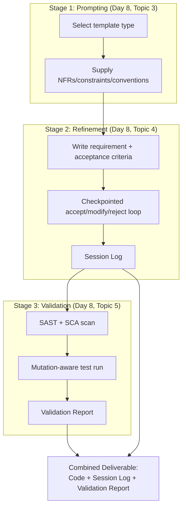
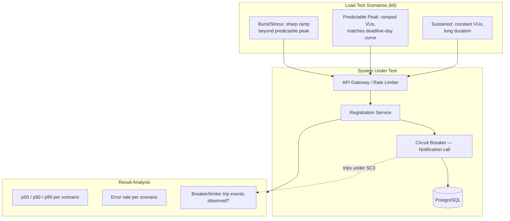
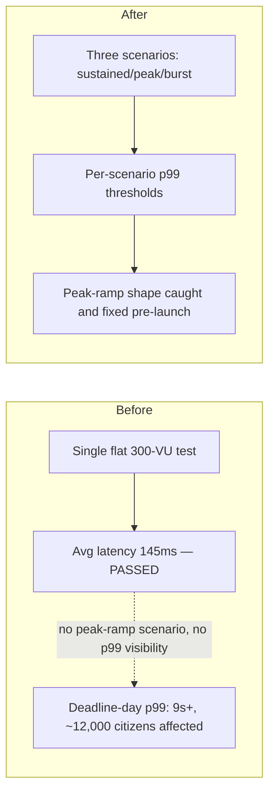
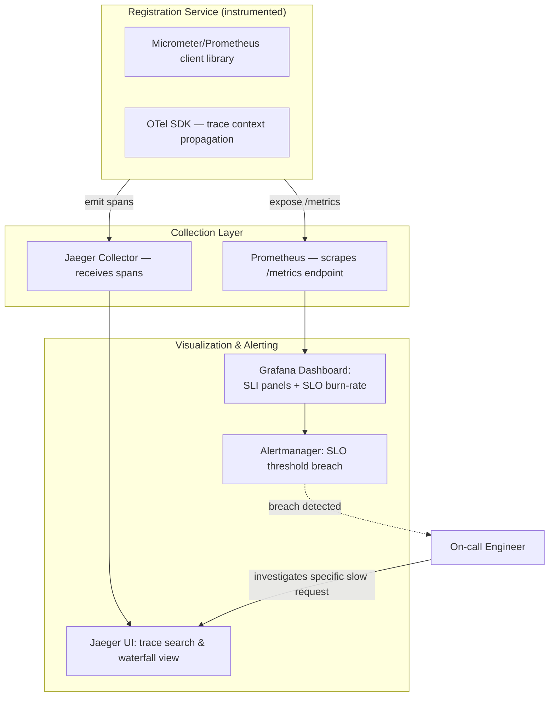
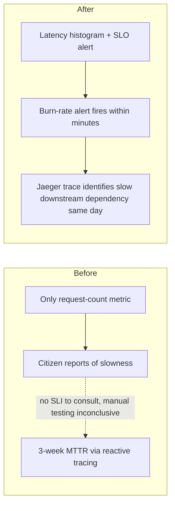
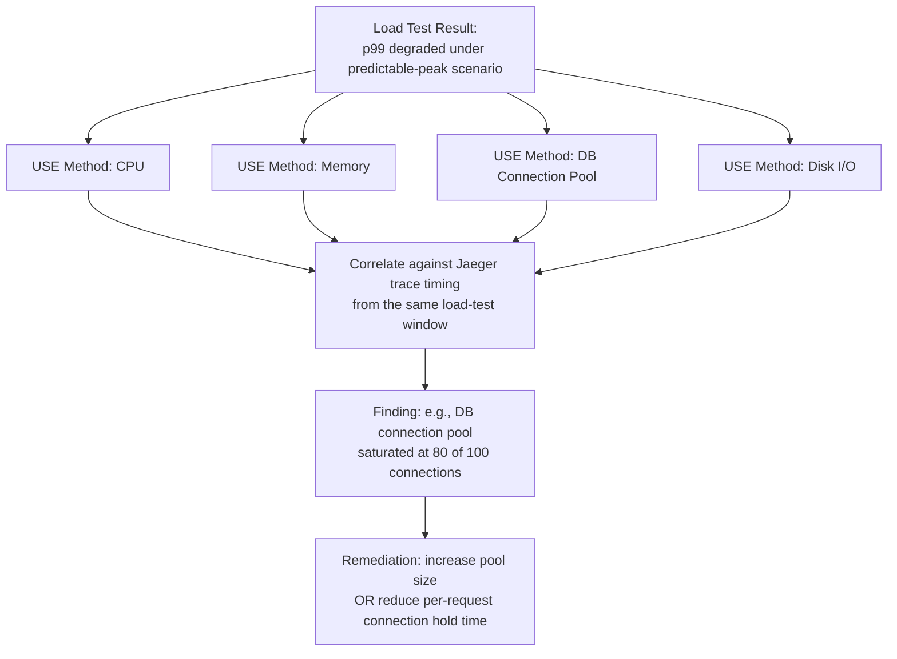
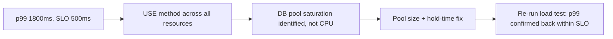
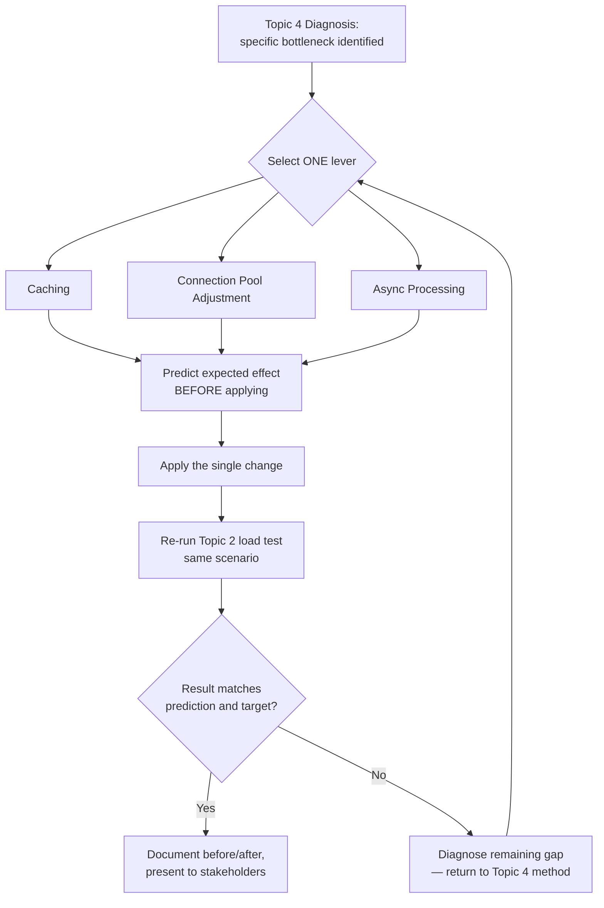
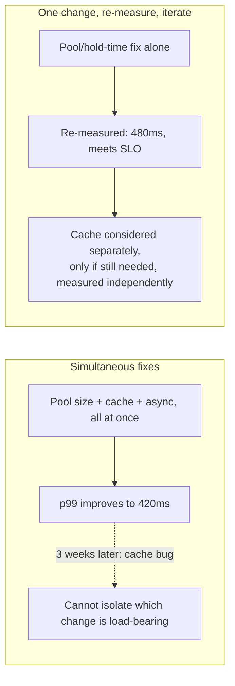

# Senior Engineer to Solution Architect Program
## Day 9 — Theory Document
### Module: Microservices, AI & Modernization → Performance Engineering & Observability
### Theme: Closing the AI-Assisted Development Loop, and Proving the System Performs Under Load

---

## How to Use This Document

This is the trainer's master reference for Day 9, self-contained for delivery without Day 8's document open. Where today builds on Day 7/8, brief recaps are given below.

**Day 9 covers five topic blocks**, in delivery sequence:

| # | Topic Block | Scheduled Duration |
|---|---|---|
| 1 | AI-Augmented Coding: End-to-End Workflow with Validation Checklist | 1.0 hr |
| 2 | Load/Stress Testing: JMeter, Gatling, k6 Scenario Design | 1.5 hrs |
| 3 | Observability Stack: Prometheus/Grafana Metrics, Distributed Tracing (Jaeger) | 1.5 hrs |
| 4 | Bottleneck Analysis & Infrastructure Sizing Validation | 0.5 hr |
| 5 | Performance Tuning a Simulated High-Traffic Service | 0.5 hr |

**Trainer's Note on pacing:** 5.0 scheduled hours against a 6–8 hr day. Topic 1 closes the AI-Assisted Development module from Day 8; Topics 2–5 form a single connected arc — design a load test, instrument the system being tested, use that instrumentation to find the bottleneck the load test revealed, then tune it — and should be taught as a continuous narrative rather than four disconnected topics. Use spare time to extend Topic 5's group activity with a second tuning round once the first round's fix is measured, so the cohort experiences the iterate-and-remeasure discipline directly rather than just hearing about it.

> **Architect's Note:** Today is the day the cohort finally gets to *prove* claims they've been making since Day 1 — every NFR, every SLA number, every sizing assumption (Day 8, Topic 1) has so far been asserted in diagrams and ADRs. Today, load testing and observability are the instruments that turn "we designed for 300ms p99 latency" from a design intention into a measured fact. Frame this explicitly: architecture without measurement is just a hypothesis.

---

## Day 7/8 Recap — Starting State for Today

- **From Day 7**: the citizen-registration service has circuit breakers and bulkheads (Resilience4j) wrapping its notification and document-storage calls, and a reconciliation layer with defined `SyncStatus` states.
- **From Day 8, Topic 1**: a sizing model (sustained/predictable-peak/unpredictable-burst classification, with a runnable TCO/sizing utility) exists for this workload, but it has not yet been validated against real measured load — that validation is today's Topic 4's explicit subject.
- **From Day 8, Topics 3–5**: an AI-assisted development workflow (structured prompts, checkpointed refinement, validation pipeline with SAST/SCA/mutation testing) is in place; today's Topic 1 is the capstone exercise applying that full workflow end-to-end to one component.

**Abbreviations used today (expanded on first use in body text):** SLI, SLO, RPS, p50/p90/p99, APM, OTel, MTTR, USE (Utilization/Saturation/Errors).

---

# Topic 1: AI-Augmented Coding — End-to-End Workflow with Validation Checklist

## Section A: Concept Foundation

### 1. Learning Objectives

By the end of this block, participants will be able to:
1. **Analyze** an end-to-end AI-assisted development task to identify which Day 8 practice (structured prompting, checkpointed refinement, or automated validation) applies at each stage.
2. **Design** a single coherent workflow chaining prompt template selection, iterative refinement with checkpoints, and a validation pipeline into one repeatable process.
3. **Evaluate** a completed AI-augmented component against a consolidated checklist spanning all three Day 8 practices.
4. **Create** a validated component and its accompanying validation report as a single combined deliverable.

### 2. Concept Explanation

**Analogy:** Day 8 taught three separate skills — writing a good brief (prompting), supervising the work as it happens (checkpointed refinement), and inspecting the finished work (validation). A skilled general contractor doesn't treat these as three unrelated activities performed by three different people who never talk to each other; they're three checkpoints in one continuous process of getting a job done reliably. Today's exercise is about experiencing that continuity directly, not just knowing the three pieces individually.

**What is it?** The **end-to-end AI-augmented workflow** is the integration of Day 8's three practices into a single pipeline: (1) construct a request using the appropriate structured template (architecture, code, or test, per Topic 3), (2) execute it with checkpointed iterative refinement (per Topic 4), producing a session log, and (3) run the resulting artifact through automated validation (per Topic 5), producing a validation report. The deliverable is not just working code — it's working code plus the two audit artifacts (session log, validation report) that make the process defensible to a reviewer who wasn't in the room.

**Why does it matter?** Each Day 8 practice in isolation reduces one category of risk. Used together, they compound: a well-structured prompt reduces the *frequency* of problematic suggestions; checkpointed refinement catches drift if a problem appears anyway; validation catches what both upstream steps missed. No single layer is sufficient alone — Day 8's three case studies each show a different layer's absence causing a real, costed incident.

**When to use it?** Any AI-assisted development task intended for production code, scaled in formality to the component's risk profile (per Day 8 Topic 5's risk-proportional scrutiny principle) — a low-risk internal tool might use a lighter version of all three steps; a payment or citizen-identity-adjacent component should use the full version, exactly as specified.

**When NOT to use it?** Throwaway exploration that will never be merged doesn't need the full session-log/validation-report ceremony — but per Day 8 Topic 5's anti-pattern warning, be honest about whether something genuinely stays throwaway.

> **Anti-Pattern Warning:** Treating Day 8's three practices as separate "modules to apply when relevant" rather than a connected pipeline is itself a failure mode — a team that prompts well, refines well, but skips validation because "the prompting and refinement were so disciplined this time" is making exactly the overconfidence error Topic 5 warned against, just one step removed.

### 3. Sub-Topic Deep Dive: The Consolidated Checklist

A single end-to-end checklist, merging the three Day 8 review questions:

- **Prompting**: Were NFRs/constraints/conventions explicitly supplied? Were alternatives and trade-offs genuinely requested (architecture) or were assumptions explicitly flagged (code)?
- **Refinement**: Was a requirement written before the session began? Were checkpoints actually exercised, not skipped? Is there a session log showing accept/modify/reject decisions with justification?
- **Validation**: Did SAST/SCA run clean? Is test coverage meaningful (mutation-aware), not just numerically high? Has a human explicitly signed off on any high-risk pattern this program has flagged (idempotency, saga, schema migration, security-sensitive code)?

### 4. Sub-Topic Deep Dive: What "Done" Means for This Exercise

The exercise's definition of done is intentionally artifact-based, not vibes-based: a merged (or merge-ready) component, its session log, and its validation report, all three present and internally consistent — i.e., the validation report's findings should be explicable by, and traceable to, decisions visible in the session log, not a disconnected pass/fail stamp bolted onto unrelated code.

---

## Section B: Architecture and Design

### 5. High-Level Design (HLD)



**Annotations:**
- **Each stage's artifact (template choice, session log, validation report) feeds the final deliverable directly**, not just the code — this is the structural embodiment of Sub-Topic 4's "done means three things present and consistent," not one.
- **No stage is optional or reorderable** — this is a deliberate departure from a "pick and choose which Day 8 practice feels relevant" approach, addressing this topic's anti-pattern warning directly in the diagram's structure.

### 6. Design Rationale and Trade-off Analysis

| Approach | Strength | Weakness |
|---|---|---|
| **Full three-stage pipeline (recommended)** | Compounds risk reduction across all three layers; produces a defensible audit trail | Most time-intensive per component |
| **Validation only, skip structured prompting/checkpointing** | Fastest to start coding | Misses upstream risk reduction; validation becomes the only safety net, catching problems later and more expensively than upstream practices would have |
| **Prompting + refinement, skip validation** | Feels thorough during development | Exactly Day 8 Topic 5's case study failure mode — confident process upstream, no independent check downstream |

**Trade-off:** `Process Overhead vs. Compounded Risk Reduction` — directly continuing Day 8's recurring theme; today's exercise exists specifically so the cohort feels this trade-off in their own hands rather than only reading about it in three separate case studies.

---

## Section C: Code Walkthrough

```text
END-TO-END EXERCISE BRIEF (what the cohort builds today)
=====================================
Component: RegistrationDeadlineNotifier — a small service that checks
approaching registration deadlines and triggers a reminder notification,
using the idempotency-key and outbox patterns from Day 7.

Stage 1 (Prompting): Use the CODE SKELETON template (Day 8, Topic 3)
with these explicit constraints supplied:
- Must use the outbox pattern (Day 7, Topic 2) for the reminder event —
  NOT a direct notification-service call.
- Must accept an idempotency key per check run, since this job may be
  retried by a scheduler.
- Team convention: constructor injection, WHAT/WHY comments.

Stage 2 (Refinement): Requirement written first (per Day 8, Topic 4):
"Given a registration with a deadline within 48 hours and no existing
reminder outbox event for it, create exactly one ApplicationReminder
outbox event." Checkpoint every 5 accepted suggestions.

Stage 3 (Validation): Run SAST/SCA; verify generated tests are
mutation-aware (Day 8, Topic 5) — specifically, confirm a test exists
that would FAIL if the "no existing reminder" check were removed
(i.e., a test proving duplicate reminders are actually prevented).
```

```java
// RegistrationDeadlineNotifier.java
// Representative output of a correctly-run Stage 1+2 — shown here as
// the reference artifact the trainer compares the cohort's own
// session output against, not as code to be copied verbatim.
package gov.training.paycore.notification;

import gov.training.paycore.outbox.OutboxEvent;
import gov.training.paycore.outbox.OutboxRepository;
import org.springframework.stereotype.Service;
import org.springframework.transaction.annotation.Transactional;

import java.time.Instant;
import java.time.Duration;
import java.util.List;

@Service
public class RegistrationDeadlineNotifier {

    private final RegistrationRepository registrationRepository;
    private final OutboxRepository outboxRepository;

    public RegistrationDeadlineNotifier(RegistrationRepository registrationRepository,
                                         OutboxRepository outboxRepository) {
        this.registrationRepository = registrationRepository;
        this.outboxRepository = outboxRepository;
    }

    @Transactional
    public void checkAndNotify(String runIdempotencyKey) {
        List<Registration> approaching = registrationRepository
            .findWithDeadlineWithin(Duration.ofHours(48));

        for (Registration registration : approaching) {
            // WHY this check exists: prevents duplicate reminders if
            // this job is retried (per the idempotency requirement
            // explicitly supplied in the Stage 1 prompt) — this is
            // the exact behaviour the Stage 3 mutation-aware test
            // must verify actually holds.
            boolean alreadyReminded = outboxRepository
                .existsByAggregateIdAndEventType(registration.getId().toString(), "ApplicationReminder");
            if (alreadyReminded) {
                continue;
            }
            outboxRepository.save(new OutboxEvent(
                "Registration",
                registration.getId().toString(),
                "ApplicationReminder",
                "{\"registrationId\":\"" + registration.getId() + "\",\"deadline\":\"" + registration.getDeadline() + "\"}",
                runIdempotencyKey + ":" + registration.getId()
            ));
        }
    }
}
```

```java
// The mutation-aware test Stage 3 requires — proving the dedup check matters.
@Test
void checkAndNotify_skipsRegistrationsAlreadyReminded() {
    Registration reg = registrationApproachingDeadline();
    when(outboxRepository.existsByAggregateIdAndEventType(reg.getId().toString(), "ApplicationReminder"))
        .thenReturn(true); // simulate: already reminded

    notifier.checkAndNotify("run-key-1");

    // This assertion is what makes the test meaningful, not superficial
    // (Day 8, Topic 5, Sub-Topic 4): it would FAIL if the dedup check
    // were removed or broken, since a save() call would then occur.
    verify(outboxRepository, never()).save(any());
}
```

---

## Section D: Real-World Case Study

**Context:** Rather than a new incident narrative, this topic's "case study" is the cohort's own Day 8 case studies, applied in sequence to one artifact — the trainer should use this section as a live retrospective rather than a new scenario.

**Illustrative walkthrough:** A cohort team builds `RegistrationDeadlineNotifier` using only Stage 1 and Stage 2 (skipping validation, "since the prompting and refinement felt thorough"). The resulting code, reviewed live, is found to have the deduplication check correctly implemented — but its generated test (analogous to Day 8 Topic 5's superficial-test pattern) only asserts `assertDoesNotThrow(...)`, never verifying that `save()` was actually skipped on a duplicate. Without Stage 3's mutation-aware validation, this gap would not have been caught, and a future refactor that accidentally broke the dedup check would pass CI silently — precisely Day 8 Topic 5's case study, now reproduced live in the room rather than read about.

```mermaid
flowchart LR
    subgraph Skipped["Stage 3 Skipped"]
        X1[Dedup logic correct today] --> X2[Superficial test: assertDoesNotThrow only]
        X2 -.->|future refactor breaks dedup, undetected| X3[Silent duplicate reminders in production]
    end
    subgraph Applied["Stage 3 Applied"]
        Y1[Mutation-aware test: verify save\(\) never called on duplicate] --> Y2[Future refactor breaking dedup FAILS CI immediately]
    end
```

**Lessons learned:** the principle reinforced is the same one from Day 8, now experienced directly: **a process that looks complete because two of three layers were followed carefully is still missing whatever only the third layer would have caught** — this is the most effective way to teach Day 8's "compounding risk reduction" trade-off, by letting the cohort discover the gap in their own output rather than reading about someone else's.

---

## Section E: Engagement and Assessment

### Food for Thought

> Today's exercise produces a session log and a validation report as artifacts alongside the code. In a real engineering organisation, who should be required to read these before approving a merge — the same reviewer who'd review the code anyway, or someone different, given that evaluating "was this prompt well-constructed" and "was this checkpoint discipline followed" might be a different skill than evaluating the code itself? Suggested prompt: *"What review skills are needed to evaluate an AI-pair-programming session log and validation report, versus the skills needed to review the resulting code itself, and should the same reviewer do both?"*

### Questionnaire — Topic 1

1. **(Conceptual)** Name the three Day 8 practices this topic integrates, in their correct pipeline order.
2. **(Conceptual)** What does "done" mean for this exercise's deliverable, per Sub-Topic 4?
3. **(Conceptual)** Why is "prompting + refinement, skip validation" specifically called out as Day 8 Topic 5's case-study failure mode recurring, not a new risk?
4. **(Application)** Using the exercise brief, write the one-line addition to the Stage 1 prompt that would be needed if the notifier also had to respect a per-citizen notification-frequency cap (e.g., no more than one reminder per citizen per day across all their registrations).
5. **(Application)** Write a mutation-aware test (different from the one shown) that verifies `checkAndNotify` does NOT create a reminder for a registration whose deadline is more than 48 hours away.
6. **(Application)** Identify which specific line in `RegistrationDeadlineNotifier.checkAndNotify()` a mutation-testing tool would most usefully target by negation (e.g., flipping a boolean check), and explain why that line is the highest-value mutation target.
7. **(Analysis)** Compare "validation only" against "full three-stage pipeline" specifically on where each catches the illustrative walkthrough's superficial-test gap — does validation-only catch it at all, and if so, at what relative cost compared to catching it via better Stage 1 prompting?
8. **(Analysis)** Using the Section B trade-off, explain why "most time-intensive per component" is presented as a real cost, not dismissed — i.e., when might a team legitimately decide the full pipeline isn't worth it for a specific component, without contradicting Day 8's lessons?
9. **(Scenario)** A reviewer approves a merge after reading only the validation report (all checks green) and not the session log. Using the Food for Thought, identify what category of problem this reviewer could miss that the validation report alone wouldn't surface.
10. **(Scenario)** Your organisation wants to make this three-stage pipeline mandatory for all AI-assisted contributions, but a team argues it's disproportionate for low-risk internal tooling. Using Day 8 Topic 5's risk-proportional scrutiny principle, propose a concrete, non-arbitrary rule for which components require the full pipeline versus a lighter version.

#### Answer Key

1. Structured prompting (Day 8, Topic 3), checkpointed iterative refinement (Day 8, Topic 4), automated validation (Day 8, Topic 5) — in that order, since each stage's output (template choice, session log) feeds the next.
2. A merged or merge-ready component together with its session log and validation report, all three present and internally consistent — not code alone, and not a disconnected pass/fail stamp unconnected to the session's actual decisions.
3. Because Day 8 Topic 5's entire case study was a team building code with apparently disciplined upstream process but no independent downstream check, and high test coverage masking a real defect — skipping Stage 3 here reproduces exactly that structural gap, just with a different component.
4. Add to the Stage 1 prompt: "Additionally, before creating a reminder event, check whether this citizen has already received any reminder (across all their registrations) within the current day, and skip if so" — explicitly supplying the new constraint rather than letting the model infer or omit it.
5. Example: a test supplying a registration with `deadline = now + 72 hours` (outside the 48-hour window), asserting `verify(outboxRepository, never()).save(any())` — meaningful because it would fail if the 48-hour window check were removed or widened incorrectly.
6. The `findWithDeadlineWithin(Duration.ofHours(48))` boundary or the `if (alreadyReminded)` check are the highest-value targets, because mutating either (e.g., changing 48 to a different value, or inverting the boolean) would silently change real business behaviour (which registrations get reminders, whether duplicates are prevented) in a way a superficial test would not catch — these are exactly the lines Sub-Topic 4's "would this test fail on a real bug" question targets.
7. Validation-only does catch the superficial-test gap, since Stage 3's mutation-aware testing is specifically designed to catch exactly this; however, it catches it later (after code and tests are already written) and at higher relative cost than better Stage 1 prompting would have, because Stage 1 prevention (e.g., explicitly instructing the model to write assertion-based, not just non-throwing, tests) would have avoided generating the superficial test in the first place rather than catching it after the fact.
8. A team might legitimately decide the full pipeline isn't proportionate for a component with low risk profile and no compliance/security sensitivity (e.g., an internal reporting dashboard with no citizen data) — this doesn't contradict Day 8, since Topic 5 explicitly scaled scrutiny to risk profile; the cost becomes disproportionate specifically when applied uniformly regardless of risk, not when consciously scaled down for a genuinely low-risk case.
9. The reviewer could miss problems with the *process* that produced the code — e.g., out-of-scope suggestions that were accepted without documented justification, or checkpoints that were skipped — since the validation report only reflects the final artifact's properties (SAST/SCA/test results), not whether the development process itself exhibited the drift or scope-creep risks Day 8 Topic 4 covered; a clean validation report can coexist with a poorly-disciplined session.
10. One concrete rule: require the full pipeline for any component that touches an externally-facing endpoint, handles personal/financial/citizen data, or implements any of the program's previously-flagged high-risk patterns (idempotency, saga, schema migration, security-sensitive code per Day 7-8); permit a lighter version (Stage 3 validation only, or Stage 3 plus a brief written requirement without full checkpoint logging) for internal-only tooling with no such characteristics — making the distinction based on concrete, checkable properties of the component rather than a subjective sense of importance.

---

# Topic 2: Load/Stress Testing — JMeter, Gatling, k6 Scenario Design

## Section A: Concept Foundation

### 1. Learning Objectives

By the end of this block, participants will be able to:
1. **Analyze** a citizen-facing workload's traffic shape to derive a realistic load-test scenario distinct from a synthetic worst-case scenario.
2. **Design** a k6 load-test script modelling sustained, predictable-peak, and burst profiles (Day 8, Topic 1's demand classification).
3. **Evaluate** load-test results using percentile distributions (p50/p90/p99) rather than averages alone.
4. **Create** a load-test report identifying whether the system meets its stated NFR latency/throughput targets under each demand profile.

### 2. Concept Explanation

**Analogy:** Testing a bridge's load capacity by driving one car across it tells you almost nothing about whether it can handle rush-hour traffic. Load testing is the deliberate, controlled recreation of rush hour — and the question that matters is not "does it survive the average car" but "what happens to the slowest cars (the tail) when the bridge is under its heaviest realistic load."

**What is it?** **Load testing** simulates expected concurrent usage to validate a system meets its performance NFRs under realistic conditions; **stress testing** deliberately exceeds expected load to find the breaking point and observe failure behaviour (does it degrade gracefully — e.g., via the rate limiters and circuit breakers from Day 6/7 — or does it fail catastrophically). **k6**, **Gatling**, and **JMeter** are tools for scripting and executing these tests, differing mainly in scripting language/model (k6: JavaScript, code-first; Gatling: Scala DSL; JMeter: GUI-first with XML test plans) rather than in fundamental capability.

**Why does it matter?** Day 8's sizing model (Topic 1) and the resilience patterns from Day 6/7 (circuit breakers, bulkheads, rate limiters) are *predictions and design intentions* until a load test actually exercises them under realistic concurrent load. A system can have a theoretically correct circuit breaker configuration that has never actually been observed tripping under real concurrent failure conditions — load/stress testing is what turns "should work" into "observed working."

**When to use it?** Before any major release, after any significant architectural change (especially the kind of migration work from Day 7-8), and periodically in steady state to catch performance regressions introduced by unrelated code changes (performance regression testing, ideally automated into CI for critical paths).

**When NOT to use it?** Running a full-scale stress test against a shared staging environment other teams depend on, without coordination, is not "skip load testing" but "do it irresponsibly" — the When NOT TO here is about scope and isolation, not about skipping the practice; there is no legitimate reason to skip load testing entirely for a production-bound citizen-facing or payment system.

> **Anti-Pattern Warning:** Reporting load-test results as a single average latency number is close to useless for any NFR with a percentile-based SLO (Service Level Objective) — Sub-Topic 4 below makes this concrete, but flag it early: "average latency was 120ms" can be entirely consistent with "1% of citizens experienced an 8-second wait," and an SLO defined around p99 cares specifically about that 1%, not the average.

### 3. Sub-Topic Deep Dive: Designing Realistic Load Profiles

Directly reusing Day 8 Topic 1's demand classification for test scenario design:
- **Sustained-load scenario**: constant virtual-user count matching average daily traffic, run long enough to observe steady-state behaviour (memory leaks, connection-pool exhaustion over time — issues invisible in a short burst test).
- **Predictable-peak scenario**: ramped virtual-user count matching a known peak pattern (e.g., a deadline-day traffic curve), testing whether the system's auto-scaling (Day 10) and the sizing model's peak provisioning actually hold.
- **Burst/stress scenario**: a sharp, short ramp well beyond predictable peak, specifically to observe degradation behaviour — does the circuit breaker trip as designed, does the rate limiter shed load gracefully, or does the system fail in some uncontrolled way the team hasn't anticipated.

### 4. Sub-Topic Deep Dive: Percentiles, Not Averages

| Metric | What It Tells You | What It Hides |
|---|---|---|
| **Average (mean) latency** | Overall central tendency | Can be dominated by the bulk of fast requests while hiding a meaningful slow tail |
| **p50 (median)** | Typical request experience | Nothing about tail behaviour at all |
| **p90** | 90% of requests are at least this fast | The worst 10% — for a high-traffic government portal, 10% of a deadline-day's traffic can be tens of thousands of citizens |
| **p99** | 99% of requests are at least this fast | Still hides the worst 1% — relevant if that 1% includes, e.g., users on poor mobile connections (Day 6's mobile-first audience) who are disproportionately likely to be in the tail |

> **Trade-off Alert:** `Reporting Simplicity vs. NFR Fidelity` — averages are simpler to report and explain to non-technical stakeholders, but most real SLOs (and certainly any SLO inherited from Day 1-2's NFR work) are defined in percentile terms specifically because percentiles are what citizens actually experience individually — nobody experiences "the average," each citizen experiences their own single request's latency, which is why the tail matters disproportionately to user-perceived quality.

---

## Section B: Architecture and Design

### 5. High-Level Design (HLD)



**Annotations:**
- **Each scenario targets the system through the same entry point (API Gateway)**, exercising the rate limiter and downstream resilience patterns exactly as production traffic would, rather than bypassing them to hit the service directly — testing the *actual* production path, not a simplified stand-in.
- **The burst scenario explicitly expects the circuit breaker to trip** — this is a designed, anticipated result, not a test failure; a stress test that never triggers any defensive mechanism hasn't actually tested whether those mechanisms work.

### 6. Design Rationale and Trade-off Analysis

| Approach | Strength | Weakness |
|---|---|---|
| **Three-scenario design matching Day 8's demand classes (recommended)** | Directly validates the sizing model's assumptions per demand class | Requires accurate historical/projected traffic shape data to build realistic scenarios |
| **Single "high load" scenario only** | Simpler to build | Conflates sustained-load steady-state issues (e.g., slow memory leaks) with burst-specific failure modes, making root-causing a finding harder |
| **Synthetic worst-case-only stress test, no sustained scenario** | Quickly finds the absolute breaking point | Tells you nothing about everyday performance at realistic load — the breaking point and the daily experience are different, equally important questions |

**Trade-off:** `Test Design Effort vs. Diagnostic Clarity` — building three distinct scenarios costs more upfront design effort than one generic load test, but pays off directly in Topic 4's bottleneck-analysis work, since a finding from a clearly-scoped scenario ("p99 degrades specifically under burst, not sustained load") is immediately more actionable than a finding from an undifferentiated test.

---

## Section C: Code Walkthrough

```javascript
// k6 load test script: three scenarios in one file.
// WHAT: models sustained, predictable-peak, and burst profiles against
//       the registration-status endpoint (Day 7's strangled capability).
// WHY: k6's scenario configuration lets all three run as clearly
//      labelled, separately-analysable phases within one test run.
import http from 'k6/http';
import { check } from 'k6';

export const options = {
  scenarios: {
    sustained: {
      executor: 'constant-vus',
      vus: 50,                 // illustrative: matches average daily concurrent users
      duration: '10m',
      exec: 'statusCheck',
      startTime: '0s',
    },
    predictable_peak: {
      executor: 'ramping-vus',
      startVUs: 50,
      stages: [
        { duration: '2m', target: 250 },  // illustrative: deadline-day ramp, ~5x sustained
        { duration: '5m', target: 250 },
        { duration: '2m', target: 50 },
      ],
      exec: 'statusCheck',
      startTime: '10m',         // runs after the sustained scenario completes
    },
    burst_stress: {
      executor: 'ramping-vus',
      startVUs: 50,
      stages: [
        { duration: '30s', target: 600 }, // illustrative: ~12x sustained, sharp ramp
        { duration: '2m', target: 600 },
        { duration: '30s', target: 50 },
      ],
      exec: 'statusCheck',
      startTime: '19m',
    },
  },
  thresholds: {
    // WHY thresholds are scenario-scoped, not global: a global p99
    // threshold would be meaningless when burst is DESIGNED to push
    // the system past normal operating bounds.
    'http_req_duration{scenario:sustained}': ['p(99)<300'],       // NFR target
    'http_req_duration{scenario:predictable_peak}': ['p(99)<500'],
    'http_req_failed{scenario:sustained}': ['rate<0.01'],
  },
};

export function statusCheck() {
  const res = http.get('https://staging.example.gov/api/v1/registration/status?id=demo-123');
  check(res, {
    'status is 200 or 429': (r) => r.status === 200 || r.status === 429, // 429 = rate limiter working as designed
  });
}
```

```text
NEGATIVE EXAMPLE — single undifferentiated scenario, average-only reporting
=====================================
k6 run --vus 300 --duration 5m load-test.js

Result reported to stakeholders: "Average response time: 145ms. Test passed."

PROBLEM 1: 300 constant VUs for 5 minutes is neither a realistic
sustained load (it's far above average daily traffic) nor a realistic
burst (5 minutes flat, no ramp, doesn't model how traffic actually
arrives) — it tests a load shape that doesn't correspond to any real
demand profile from Day 8's classification.

PROBLEM 2: "Average response time: 145ms" tells stakeholders nothing
about the p99 tail. A system where 95% of requests return in 50ms and
5% take 3 seconds could report this same ~145ms average, while
failing any p99-based SLO badly — and nobody reading this report would
know.
```

---

## Section D: Real-World Case Study

**Context:** A (hypothetical, illustrative) Indian state's online subsidy-application portal ran a pre-launch load test using the negative-example pattern above — a single 300-VU, 5-minute flat test, average-latency-only reporting — and reported "passed" to program leadership ahead of a public launch timed to a subsidy-application deadline.

**Quantifiable impact (illustrative figures):** On the actual deadline day, real traffic followed a sharp ramp (the predictable-peak pattern the pre-launch test never modelled) from roughly 40 concurrent users to over 2,000 within 15 minutes as the deadline approached. p99 latency, never previously measured, degraded to over 9 seconds during the peak window — far outside any NFR target — while the average remained misleadingly close to the pre-launch baseline, because the bulk of requests (citizens checking outside the peak window) were still fast. An estimated 12,000 citizens (illustrative) experienced timeouts or abandoned the application during the worst 20-minute window, generating a wave of grievance-portal complaints and a formal review.

**Remediation applied:** Replaced the single undifferentiated test with the three-scenario k6 design from Section C, with thresholds defined per scenario and per percentile, specifically including a predictable-peak scenario modelling the actual deadline-day ramp shape observed from the incident — turning what had been an unmodelled, unmeasured traffic pattern into an explicit, repeatable test scenario for every subsequent release.



**Lessons learned:** the principle reinforced is that **a load test's value is entirely bounded by how well its scenario matches real traffic shape, and how honestly its results are reported** — a technically-passing test against the wrong scenario, reported with a metric (average) that hides the relevant failure, is worse than no test at all, because it actively created false confidence that delayed a real fix until citizens experienced the consequence directly.

---

## Section E: Engagement and Assessment

### Food for Thought

> The case study's actual deadline-day ramp (40 to 2,000 users in 15 minutes) was only known *after* the incident. Your predictable-peak scenario for the *next* deadline is only as realistic as your projection of that ramp shape — and you won't have a second real incident to calibrate against if your projection is wrong in a different way. What data sources, besides "what happened last time," could make a peak-ramp projection more robust for a brand-new citizen service with no prior deadline-day history at all? Suggested prompt: *"What methods exist for projecting realistic traffic ramp shapes for a new public-facing service with no historical traffic data, and how reliable are they typically?"*

### Questionnaire — Topic 2

1. **(Conceptual)** Distinguish load testing from stress testing in one sentence each.
2. **(Conceptual)** Why is a single average latency number described as "close to useless" for a percentile-based SLO?
3. **(Conceptual)** Why does the recommended k6 script route all three scenarios through the API Gateway rather than hitting the registration service directly?
4. **(Application)** Using the k6 script structure, add a fourth scenario modelling a "slow Monday morning ramp" (gradual increase from 20 to 80 VUs over 30 minutes, sustained for 1 hour).
5. **(Application)** The burst scenario's check accepts both `200` and `429` as success. Explain why a `429` (rate-limited) response is correctly treated as a passing outcome here rather than a failure.
6. **(Application)** Write the threshold line that would enforce a p90 (not p99) latency target of 400ms specifically for the `predictable_peak` scenario.
7. **(Analysis)** Compare the case study's pre-launch test against the Section C recommended design specifically on the dimension of "would either design have revealed the 9-second p99 before launch" — justify precisely which design element makes the difference.
8. **(Analysis)** The case study notes the average latency "remained misleadingly close to the pre-launch baseline" even during the bad peak window. Explain mechanistically how a severely degraded p99 can coexist with a roughly stable average.
9. **(Scenario)** Program leadership wants a single "pass/fail" headline number for a load-test report, resisting percentile detail as "too technical for a leadership summary." Propose a headline metric that preserves percentile fidelity while still being a single digestible number.
10. **(Scenario)** You're load-testing a brand-new service with genuinely zero historical traffic data (no prior incident to calibrate against, unlike the case study's later remediation). Using the Food for Thought, describe the load-test design strategy you'd use in the absence of any real ramp-shape data.

#### Answer Key

1. Load testing simulates expected concurrent usage to validate the system meets performance NFRs under realistic conditions; stress testing deliberately exceeds expected load to find the breaking point and observe failure/degradation behaviour.
2. Because an average can be dominated by the bulk of fast requests while completely hiding a meaningful slow tail — a percentile-based SLO (e.g., p99) is specifically concerned with that tail, which an average by construction does not isolate or report.
3. Because production traffic also passes through the API Gateway, including its rate limiter — testing against the actual entry point exercises the real production path (and its defensive mechanisms) rather than a simplified stand-in that wouldn't reveal whether the rate limiter or other gateway-level behaviour functions correctly under load.
4. Add a scenario block using `executor: 'ramping-vus'` with `stages: [{ duration: '30m', target: 80 }, { duration: '1h', target: 80 }]`, starting from `startVUs: 20`, with its own `exec` and `startTime` so it runs as a clearly separated, analysable phase.
5. Because the rate limiter returning `429` under burst load is the defensive mechanism working exactly as designed (shedding load gracefully rather than allowing unbounded concurrent requests to overwhelm downstream services) — a stress test's purpose includes confirming this mechanism activates, so observing it is a successful test outcome, not a defect.
6. `'http_req_duration{scenario:predictable_peak}': ['p(90)<400']`, mirroring the existing threshold syntax but changing the percentile function and target value.
7. The case study's pre-launch design (flat 300-VU, no ramp, average-only reporting) would not have revealed the 9-second p99, both because it never modelled a ramp shape resembling the actual deadline-day traffic at all, and because even if it had, average-only reporting would have hidden the tail degradation; Section C's design reveals it specifically because it includes a ramped predictable-peak scenario with explicit p99 thresholds, both elements being necessary — a ramp scenario with only average reporting would likely still have missed it.
8. A severely degraded p99 affects only the worst-performing fraction of requests (by definition, the tail); if the bulk of requests (the 90-99% making up most of the average's weight) remain fast, the average — being a weighted measure across all requests — moves only modestly even while a small but significant fraction experiences severe degradation, which is exactly why percentile metrics exist as a separate, necessary lens.
9. Propose a single metric such as "percentage of requests meeting the stated p99 SLO target across all tested scenarios" (e.g., "98.7% of scenarios met their latency SLO") — this compresses percentile-based results into one number for a leadership summary while remaining traceable back to the underlying percentile data for anyone who wants to drill in, unlike a plain average which discards that fidelity entirely.
10. In the absence of historical data, combine multiple weaker signals rather than relying on any single source: comparable-program traffic patterns (similar government services' historical deadline-day ramps), conservative theoretical worst-case modelling (e.g., assume a meaningful percentage of the total eligible population attempts access within the final hour before a deadline), and a staged rollout/soft-launch approach that gathers real initial data before the highest-stakes traffic event, treating the first real measured event itself as the calibration source for subsequent, better-informed scenario design — explicitly acknowledging, as the Food for Thought suggests, that all of these are lower-confidence than real prior history and should be paired with strong real-time monitoring (Topic 3) and load-shedding (rate limiting) as a safety net for whatever the projection gets wrong.

---

# Topic 3: Observability Stack — Prometheus/Grafana Metrics, Distributed Tracing (Jaeger)

## Section A: Concept Foundation

### 1. Learning Objectives

By the end of this block, participants will be able to:
1. **Analyze** a microservice's health and behaviour using the three observability pillars: metrics, traces, and logs (logs covered in depth Day 11's ELK content).
2. **Design** an SLI/SLO definition for the registration-status capability, backed by concrete Prometheus metrics.
3. **Evaluate** a distributed trace to identify which service in a multi-hop call chain contributes most to end-to-end latency.
4. **Create** a Grafana dashboard surfacing the SLIs defined, with alerting thresholds tied to the SLO.

### 2. Concept Explanation

**Analogy:** Metrics are like a car's dashboard gauges — speed, fuel, engine temperature — telling you the aggregate state of things at a glance. Distributed tracing is like a flight recorder for one specific journey — exactly which roads were taken, how long each leg took, and where the trip slowed down. You need the dashboard running continuously to know something's wrong; you need the flight recorder for a specific trip to know *why*.

**What is it?** **SLI** (Service Level Indicator — a specific, measured metric, e.g., "p99 latency of the status-check endpoint") and **SLO** (Service Level Objective — a target value for an SLI over a time window, e.g., "p99 latency under 300ms for 99.9% of 5-minute windows in a rolling 30-day period") are the formal vocabulary connecting Topic 2's load-test findings to ongoing production monitoring. **Prometheus** is a metrics collection and storage system using a pull-based scrape model; **Grafana** visualises Prometheus (and other) data sources as dashboards; **Jaeger** implements **distributed tracing**, propagating a trace context across service boundaries (e.g., via **OTel** — OpenTelemetry, a vendor-neutral instrumentation standard) so a single request's full journey across multiple microservices can be reconstructed and visualised.

**Why does it matter?** Day 7's saga/reconciliation layer, Day 6's resilience patterns, and today's load tests all produce behaviour that is invisible without instrumentation — a circuit breaker tripping in production with no metric exposing its state is, for operational purposes, indistinguishable from a circuit breaker that doesn't exist. Observability is what makes a distributed system's actual runtime behaviour knowable rather than merely designed-and-hoped-for.

**When to use it?** Every production microservice, without the "when not to" carve-outs that applied to some earlier topics — minimal viable observability (basic request-count, error-rate, and latency metrics; at minimum) should be considered a non-negotiable baseline, scaled up to full distributed tracing for any service participating in multi-hop call chains (which, per Day 6/7's saga and integration patterns, describes most of this program's example system).

**When NOT to use it?** The "when not to" question here is about *depth*, not adoption — a simple, single-hop internal tool may not need full distributed tracing if it never calls another service, but it should still expose basic metrics; full tracing instrumentation effort should scale with how many hops a request actually traverses.

> **Anti-Pattern Warning:** Defining an SLO before establishing any SLI measurement is backwards and common — teams commit to "99.9% of requests under 300ms" in a document, then discover months later they have no actual metric exposing this number, making the SLO an aspiration with no way to know if it's being met or violated.

### 3. Sub-Topic Deep Dive: The Three Pillars and Their Distinct Questions

| Pillar | Question It Answers | Example for the Registration System |
|---|---|---|
| **Metrics** | "Is something wrong, in aggregate, right now?" | p99 latency on `/status` over the last 5 minutes |
| **Traces** | "For this specific slow request, where did the time go?" | A single trace showing 280ms of a 310ms total spent inside the downstream notification call |
| **Logs** (Day 11) | "What exactly happened, in detail, at this specific point?" | The exact exception stack trace when a saga step failed |

### 4. Sub-Topic Deep Dive: Defining the SLI/SLO for Registration Status

Following directly from Day 8's sizing work and Topic 2's load-test thresholds:
- **SLI**: p99 latency of `GET /api/v1/registration/status`, measured via a Prometheus histogram metric.
- **SLO**: p99 < 300ms for 99.9% of rolling 5-minute windows over a 30-day period — directly reusing the same 300ms target Topic 2's load test thresholds were checking against, closing the loop between pre-release testing and production monitoring.
- **Error budget**: the 0.1% of windows allowed to violate the SLO is the team's error budget (directly connecting to Day 7's schema-migration case study, where error-budget consumption was the actual cost metric for an incident) — spent deliberately on planned risk (a migration cutover) or consumed accidentally by an incident, but tracked the same way either way.

---

## Section B: Architecture and Design

### 5. High-Level Design (HLD)



**Annotations:**
- **Grafana surfaces the aggregate (metrics); Jaeger is reached only after an alert fires**, reflecting Sub-Topic 3's distinct questions — the dashboard tells the on-call engineer *that* something's wrong, the trace tells them *why*, and the workflow arrow explicitly shows this handoff rather than treating both tools as redundant views of the same thing.
- **Alertmanager threshold is tied to the SLO, not an arbitrary number** — directly operationalising Sub-Topic 4's SLI/SLO definition, so the alert that fires has a documented, deliberate meaning ("we are at risk of breaching our committed objective") rather than being a number someone picked because it "seemed reasonable."

### 6. Design Rationale and Trade-off Analysis

| Approach | Strength | Weakness |
|---|---|---|
| **Full three-pillar instrumentation, SLO-tied alerting (recommended)** | Alerts have clear, documented meaning; fast root-cause via traces | Instrumentation effort across every service; requires SLI/SLO definition discipline |
| **Metrics only, no tracing** | Simpler to operate; sufficient for single-hop services | For multi-hop sagas (Day 6/7), a metric showing "latency is high" gives no way to find which hop is responsible without tracing |
| **Arbitrary alert thresholds, no formal SLO** | Fast to set up initially | Alerts proliferate without clear severity or business meaning, leading to alert fatigue — on-call engineers learn to ignore alerts that don't map to a real, committed objective |

**Trade-off:** `Instrumentation Effort vs. Mean Time to Root Cause` — tracing instrumentation has a real upfront cost (code changes, context-propagation setup across every service boundary) but directly reduces MTTR (Mean Time to Resolution/Repair) for the multi-hop failure scenarios this program has emphasised since Day 6 — the saga and reconciliation patterns specifically create the kind of multi-hop complexity where "which service is slow" is otherwise a guessing exercise.

---

## Section C: Code Walkthrough

```java
// MetricsConfig.java — exposing the SLI as a Prometheus histogram.
package gov.training.paycore.observability;

import io.micrometer.core.instrument.MeterRegistry;
import io.micrometer.core.instrument.Timer;
import org.springframework.stereotype.Component;

@Component
public class StatusCheckMetrics {

    private final Timer statusCheckTimer;

    public StatusCheckMetrics(MeterRegistry registry) {
        // WHY a histogram-backed Timer, not a simple counter: percentile
        // calculation (Topic 2's p99) requires the distribution of
        // observed durations, not just a count or a running average.
        this.statusCheckTimer = Timer.builder("registration_status_check_duration")
            .description("Latency of the registration status check endpoint")
            .publishPercentileHistogram()
            .sla(java.time.Duration.ofMillis(300)) // ties the metric directly to the SLO target
            .register(registry);
    }

    public Timer getStatusCheckTimer() {
        return statusCheckTimer;
    }
}
```

```java
// RegistrationStatusController.java — instrumented endpoint.
package gov.training.paycore.application;

import gov.training.paycore.observability.StatusCheckMetrics;
import io.opentelemetry.api.trace.Span;
import io.opentelemetry.api.trace.Tracer;
import org.springframework.web.bind.annotation.*;

@RestController
public class RegistrationStatusController {

    private final RegistrationStatusCache statusCache;
    private final StatusCheckMetrics metrics;
    private final Tracer tracer; // OTel tracer, auto-configured by the SDK

    public RegistrationStatusController(RegistrationStatusCache statusCache,
                                         StatusCheckMetrics metrics,
                                         Tracer tracer) {
        this.statusCache = statusCache;
        this.metrics = metrics;
        this.tracer = tracer;
    }

    @GetMapping("/api/v1/registration/status")
    public StatusResponse getStatus(@RequestParam String id) {
        Span span = tracer.spanBuilder("registration-status-lookup").startSpan();
        try (var scope = span.makeCurrent()) {
            // WHY wrapped in a Timer.record: every call's duration feeds
            // the SLI histogram automatically, with zero per-call manual
            // calculation — the metric IS the measurement infrastructure
            // for the SLO defined in Section A.
            return metrics.getStatusCheckTimer().recordCallable(() -> {
                span.setAttribute("registration.id", id);
                var status = statusCache.getStatus(id);
                span.setAttribute("status.result", status.name());
                return new StatusResponse(id, status);
            });
        } finally {
            span.end();
        }
    }
}
```

```yaml
# prometheus-alert-rules.yml
# WHAT: alert rule tied directly to the SLO defined in Section A,
#       using error-budget burn-rate logic rather than a raw threshold.
groups:
  - name: registration-status-slo
    rules:
      - alert: RegistrationStatusSLOBurnRateHigh
        expr: |
          histogram_quantile(0.99,
            sum(rate(registration_status_check_duration_seconds_bucket[5m])) by (le)
          ) > 0.3
        for: 5m
        labels:
          severity: page
        annotations:
          summary: "Registration status p99 latency exceeds 300ms SLO target"
          description: "p99 has exceeded the 300ms SLO for 5+ minutes — error budget is being consumed."
```

```java
// NEGATIVE EXAMPLE — metric exists but is structured uselessly.
package gov.training.paycore.observability.antipattern;

import io.micrometer.core.instrument.Counter;
import io.micrometer.core.instrument.MeterRegistry;

public class NaiveMetrics {
    // PROBLEM: a counter of total requests tells you volume, not
    // latency distribution — there is no way to derive p99 from a
    // count alone. A team that adds "we have a metric for that
    // endpoint" based on this would still have no actual SLI for
    // their latency SLO, reproducing the Section A anti-pattern.
    public NaiveMetrics(MeterRegistry registry) {
        Counter requestCounter = Counter.builder("registration_status_requests_total")
            .register(registry);
        // requestCounter.increment() called per request, elsewhere —
        // useful for traffic volume, useless for the latency SLO.
    }
}
```

---

## Section D: Real-World Case Study

**Context:** A (hypothetical, illustrative) US municipal services platform had a documented SLO ("p99 latency under 300ms") for its citizen request-tracking API, written into a public transparency commitment, but had only request-count metrics (the negative-example pattern) in production — no latency histogram, no tracing.

**Quantifiable impact (illustrative figures):** Citizens began reporting slow page loads via support channels over several weeks. With no latency SLI to consult, the engineering team's initial response was to manually reproduce the issue by hand-testing the endpoint themselves — which, performed outside real peak-traffic conditions, appeared fast and led to an initial (incorrect) conclusion that the reports were anecdotal or client-side. The actual root cause — a downstream dependency the request-tracking service called, itself experiencing intermittent slowness only under concurrent load — was found only after ad-hoc tracing instrumentation was added reactively, three weeks after the first citizen reports, an estimated 3-week MTTR (illustrative) for an issue that, with the Section B/C instrumentation already in place, would likely have been visible on a dashboard within minutes of onset and root-caused via a trace waterfall within the same day.

**Remediation applied:** Implemented the full Section B/C stack — Prometheus histogram-backed SLI tied to the documented SLO, Jaeger tracing across all multi-hop calls, and an SLO-burn-rate alert rule (per the YAML above) — converting the public transparency commitment from an unmeasured aspiration into an actively monitored, alertable target.



**Lessons learned:** the principle reinforced is that **a published SLO with no corresponding SLI is a promise the team has no way to know it's keeping or breaking** — Sub-Topic 4's discipline of defining the SLI and the measurement infrastructure *together* with the SLO, not as a documentation exercise to revisit later, is what separates a real operational commitment from an aspirational one.

---

## Section E: Engagement and Assessment

### Food for Thought

> The alert rule in Section C fires when the SLO is already being breached (`for: 5m` after the threshold is crossed). Error-budget burn-rate alerting in mature SRE practice often uses *multiple* burn-rate thresholds — a fast-burn alert (page immediately if budget is being consumed at a rate that would exhaust it in hours) and a slow-burn alert (notify, don't page, if budget is being consumed at a rate that would exhaust it over weeks). What's lost if you only implement the single threshold shown in Section C, and why might a slow, steady SLO degradation be just as important to catch as a sudden spike? Suggested prompt: *"Explain multi-window, multi-burn-rate alerting for SLOs and why a single fixed threshold alert is insufficient for catching both fast and slow error-budget consumption."*

### Questionnaire — Topic 3

1. **(Conceptual)** Define SLI and SLO and explain the relationship between them.
2. **(Conceptual)** Why does Section A describe metrics and traces as answering "distinct questions" rather than being redundant with each other?
3. **(Conceptual)** Why is `publishPercentileHistogram()` necessary on the Timer in `StatusCheckMetrics`, rather than a plain counter?
4. **(Application)** Using the Prometheus alert rule structure shown, write a second alert rule for an error-rate SLO ("error rate must stay under 1% over rolling 5-minute windows").
5. **(Application)** Add a span attribute to `RegistrationStatusController.getStatus()` that records whether the result came from cache or from the database fallback (Day 7's `RegistrationStatusCache`), and explain why this attribute would help root-cause a future slow-trace investigation.
6. **(Application)** Identify what's structurally wrong with `NaiveMetrics` and rewrite it to support deriving p99, without changing its class name.
7. **(Analysis)** Compare "metrics only, no tracing" against the full three-pillar approach specifically on the case study's actual root cause (a downstream dependency's intermittent slowness under concurrent load) — would metrics alone have revealed *which* service was responsible?
8. **(Analysis)** The case study's manual reproduction attempt "outside real peak-traffic conditions" appeared fast and led to an incorrect conclusion. Explain why this is consistent with, not contradictory to, the downstream dependency's described failure mode.
9. **(Scenario)** Your team has burn-rate alerting at a single threshold (Section C's version). Using the Food for Thought, describe a realistic scenario where this single-threshold approach would fail to alert on a real SLO violation in time to prevent significant error-budget consumption.
10. **(Scenario)** A new microservice is being added that only ever receives traffic from one other internal service (no citizen-facing path, single-hop). Using Section A's "When NOT to" guidance, justify what minimum observability this service still needs, and what it can reasonably skip.

#### Answer Key

1. SLI is a specific, measured metric (e.g., p99 latency of an endpoint); SLO is a target value for that SLI over a defined time window (e.g., p99 < 300ms for 99.9% of 5-minute windows over 30 days) — the SLO is the commitment, the SLI is the measurement that determines whether the commitment is being met.
2. Because metrics answer "is something wrong, in aggregate, right now" while traces answer "for this specific slow request, where did the time go" — an aggregate signal cannot localize a problem to a specific service in a multi-hop chain, and a single trace cannot tell you whether the system is healthy in aggregate; each is necessary for a different diagnostic step.
3. Because deriving a percentile (like p99) requires the actual distribution of observed durations, not just a total count or sum — a percentile histogram retains bucketed distribution data that `histogram_quantile()`-style queries can use to calculate percentiles, which a plain counter cannot support at all.
4. Example: an alert with `expr: sum(rate(http_requests_total{status=~"5.."}[5m])) / sum(rate(http_requests_total[5m])) > 0.01`, `for: 5m`, with appropriate labels/annotations describing the error-rate SLO breach, mirroring the latency rule's structure but targeting error ratio instead of latency quantile.
5. Add `span.setAttribute("status.source", "cache")` or `"database"` depending on which path was taken inside `getStatus()`; this helps because a future slow trace could then immediately show whether the slowness originated from a cache miss falling through to the database (pointing investigation toward DB performance) versus a cache hit that was still slow (pointing toward Redis itself), narrowing root-cause investigation without needing to guess.
6. The structural problem is that `Counter` only tracks a running total, with no per-observation duration data, making percentile derivation impossible; the fix is to replace `Counter` with a `Timer` (as in `StatusCheckMetrics`) configured with `publishPercentileHistogram()`, recording each request's actual duration rather than just incrementing a count.
7. Metrics alone (even with per-service request-count and basic latency metrics on each service) could potentially reveal *that* the request-tracking service's own latency was elevated, but without distributed tracing connecting the request-tracking service's slow calls to the specific downstream dependency causing them, metrics alone would likely show "this service is slow" without pinpointing *which downstream call* is responsible — tracing's span-based breakdown is specifically what attributes time to a specific hop, which aggregate per-service metrics do not do on their own.
8. Because the downstream dependency's slowness was described as "intermittent... only under concurrent load" — a manual, single-request reproduction performed outside real peak-traffic conditions would not generate the concurrent load needed to trigger the dependency's slow behaviour, so the test appearing fast is exactly the expected (if misleading) result of testing under conditions that don't match when the actual problem occurs.
9. A realistic scenario: a slow, steady SLO degradation — e.g., gradually increasing latency over several days due to a slow memory leak or gradually growing dataset — could remain just under the single fixed threshold for an extended period while still steadily consuming error budget, only crossing the threshold (and alerting) once the budget is already substantially depleted; a slow-burn alert tuned to detect a lower-but-sustained consumption rate would have caught this days earlier than a single fixed threshold tuned primarily for sudden spikes.
10. At minimum, this single-hop internal service should still expose basic request-count, error-rate, and latency metrics (the non-negotiable baseline per Section A) so its health is visible on a dashboard; it can reasonably skip full distributed tracing instrumentation specifically because it has no multi-hop call chain to localize latency within — tracing's main value (attributing time across hops) doesn't apply when there's only one hop to begin with, though it should still propagate any trace context it receives from its caller rather than breaking the chain for systems that do call across multiple hops.

---

# Topic 4: Bottleneck Analysis & Infrastructure Sizing Validation

## Section A: Concept Foundation

### 1. Learning Objectives

By the end of this block, participants will be able to:
1. **Analyze** a load-test report (Topic 2) and observability data (Topic 3) jointly to identify the specific resource dimension causing a performance bottleneck.
2. **Design** a profiling approach correlating CPU, memory, and I/O metrics against the latency degradation observed under load.
3. **Evaluate** Day 8's sizing model against real measured behaviour, identifying where the model's assumptions held or failed.
4. **Create** a bottleneck-analysis report proposing a specific, evidence-based scaling or tuning remediation.

### 2. Concept Explanation

**Analogy:** A doctor diagnosing fatigue doesn't just note "patient is tired" — they check distinct systems (blood, heart, thyroid) because "tired" has many possible root causes that look identical from the symptom alone. "The service is slow under load" is exactly this kind of symptom — the bottleneck could be CPU-bound, memory-bound, I/O-bound, or contention-bound (e.g., lock waits, connection-pool exhaustion), and each requires a different fix.

**What is it?** **Bottleneck analysis** is the systematic correlation of resource-utilization metrics (CPU, memory, disk/network I/O) against the latency/throughput degradation observed in a load test, to identify which specific resource is the limiting factor — directly closing the loop on Day 8 Topic 1's sizing model by checking whether its assumptions (which dimension would matter most) actually matched reality.

**Why does it matter?** Without correlated profiling, teams tend to guess at remediation — "let's add more CPU" when the actual bottleneck is database connection-pool exhaustion wastes money and doesn't fix the problem (directly recalling Day 8 Topic 1's lesson that capacity and performance are different sizing dimensions, and that over-provisioning the wrong dimension is a real, recurring cost).

**When to use it?** Whenever a load test (Topic 2) reveals a latency or error-rate target being missed — bottleneck analysis is the diagnostic step between "we found a problem" and "we know what to fix."

**When NOT to use it?** If a load test passes cleanly against all defined SLOs, there's no bottleneck to analyze yet — proactive profiling for its own sake (without a measured symptom to investigate) is reasonable as periodic health-checking but isn't the same activity as this topic's reactive, evidence-driven analysis.

### 3. Sub-Topic Deep Dive: The USE Method

A practical framework for systematic bottleneck analysis: for each resource (CPU, memory, disk I/O, network), check **U**tilization (how busy is it), **S**aturation (how much queued work is waiting beyond what it can currently handle), and **E**rrors (is the resource itself reporting errors, e.g., disk I/O errors). A resource at high utilization but low saturation may have headroom left; a resource at high saturation, even with moderate utilization, indicates queueing — exactly the kind of distinction a single "CPU is at 60%" metric, viewed alone, would miss.

### 4. Sub-Topic Deep Dive: Validating the Sizing Model

Directly reusing Day 8 Topic 1's sizing categories: did the sustained-load test confirm the reserved/on-prem capacity sizing was adequate? Did the predictable-peak scenario reveal the auto-scaling configuration (Day 10) actually kicks in fast enough, or does the gap between detecting peak load and provisioning new capacity itself become a bottleneck window? This is the explicit feedback loop closing Day 8's "size first" work against Day 9's "measure and validate" work.

---

## Section B: Architecture and Design

### 5. High-Level Design (HLD)



**Annotations:**
- **All four USE checks run in parallel against the same load-test window**, not sequentially guessed one at a time — this avoids the common anti-pattern of fixating on the first plausible-looking metric (often CPU, since it's the most visible dashboard panel) before checking the others.
- **Correlation against Jaeger trace timing** ties this topic directly back to Topic 3 — the trace shows *where* time was spent; the USE-method resource data shows *why* that specific span was slow.

### 6. Design Rationale and Trade-off Analysis

| Approach | Strength | Weakness |
|---|---|---|
| **USE method across all resources + trace correlation (recommended)** | Systematic; avoids fixating on one visible metric prematurely | Takes longer than checking the obvious first guess |
| **CPU-first guess-and-check** | Fast if CPU happens to be the actual bottleneck | Wastes remediation effort/cost if the real bottleneck (e.g., connection pool) is elsewhere — exactly Day 8 Topic 1's "wrong dimension" risk |

**Trade-off:** `Diagnostic Thoroughness vs. Speed to (Possibly Wrong) Action` — this is a smaller-scale instance of the same trade-off pattern seen throughout this program: a slightly slower, systematic process avoids a faster but potentially misdirected and costly fix.

---

## Section C: Code Walkthrough

```promql
# PromQL queries — the practical "code" of bottleneck analysis.

# CPU utilization for the registration service during the load test window
avg(rate(container_cpu_usage_seconds_total{service="registration-service"}[1m]))

# DB connection pool saturation — the SPECIFIC metric that would have
# caught the case study's bottleneck below; utilization alone (CPU)
# would NOT surface this.
hikaricp_connections_active{pool="registration-db-pool"}
  / hikaricp_connections_max{pool="registration-db-pool"}

# Queueing/saturation signal: requests waiting for a connection
hikaricp_connections_pending{pool="registration-db-pool"}
```

```text
BOTTLENECK ANALYSIS REPORT TEMPLATE (the topic's actual deliverable)
=====================================
Load Test Reference: predictable_peak scenario, run 2026-06-15
Observed: p99 latency 1,800ms vs 500ms SLO target (Topic 2 threshold)

USE Method Findings:
- CPU: 45% utilization, low saturation — NOT the bottleneck
- Memory: 60% utilization, stable, no GC pressure spikes — NOT the bottleneck
- DB Connection Pool: 98/100 connections active, pending queue
  depth peaking at 40 during the peak window — BOTTLENECK IDENTIFIED
- Disk I/O: nominal — NOT the bottleneck

Trace Correlation: Jaeger traces from the same window show the
"acquire DB connection" span, not the actual query execution span,
accounting for ~1,400ms of the 1,800ms total — confirming the pool,
not query performance, as the bottleneck.

Sizing Model Validation (Day 8, Topic 1): the original sizing model
sized compute (CPU/RAM) for predictable peak correctly, but did not
separately size the DB connection pool as a distinct capacity
dimension — directly reinforcing Day 8's lesson that capacity and
performance dimensions must be sized independently, now confirmed
against real data rather than a prior case study's illustrative figures.

Proposed Remediation: increase HikariCP max pool size from 100 to 180
(sized against peak concurrent VUs from the load test, with headroom),
AND reduce average connection hold time by moving the notification
call (Day 7's circuit-breaker-wrapped step) off the same transaction
where it doesn't need to hold a DB connection for its duration.
```

---

## Section D: Real-World Case Study

**Context:** This topic's case study is the bottleneck-analysis report itself, illustrated above — a (hypothetical, illustrative) scenario directly extending Day 8 Topic 1's sizing case study, where the original sizing model correctly addressed compute but never modelled connection-pool capacity as its own dimension.

**Quantifiable impact:** As shown in the report template — p99 latency 3.6x over SLO target during predictable peak, root-caused to connection-pool saturation rather than compute, which a CPU-first guess-and-check approach (the less rigorous alternative in Section B) would likely have missed initially, potentially leading to a wasted compute scale-up before eventually finding the actual cause.

**Remediation applied:** As shown in the report — pool size increase plus a structural fix (reducing per-request connection hold time), validated by re-running the same Topic 2 load-test scenario and confirming p99 returns within the SLO target, closing the loop with a remeasurement rather than assuming the fix worked.



**Lessons learned:** the principle reinforced is that **a remediation is not complete until it's re-measured against the same test that revealed the problem** — fixing a suspected bottleneck without re-running the load test is just a new, unverified guess, the same epistemic error as the original sizing model's unvalidated assumption.

---

## Section E: Engagement and Assessment

### Food for Thought

> The bottleneck-analysis report identifies the connection pool as the bottleneck "during predictable peak." Suppose, after the fix, the next bottleneck-analysis exercise (run against the burst/stress scenario instead) finds a *different* bottleneck entirely. Is bottleneck analysis ever something a team can consider "finished" for a given service, or is it structurally always relative to a specific tested scenario and current sizing? What does this imply about how often this analysis should be repeated as the system evolves? Suggested prompt: *"How should the frequency of bottleneck analysis and load testing change as a microservice's traffic patterns and codebase evolve over time?"*

### Questionnaire — Topic 4

1. **(Conceptual)** Define Utilization, Saturation, and Errors as used in the USE method.
2. **(Conceptual)** Why is "CPU-first guess-and-check" identified as a risky default rather than a reasonable first step?
3. **(Conceptual)** What specific Day 8 lesson does this topic's case study reinforce, and how?
4. **(Application)** Using the PromQL pattern shown, write a query for measuring memory saturation (not utilization) for the registration service — describe what metric would represent "saturation" for memory specifically.
5. **(Application)** The case study found 1,400ms of 1,800ms total latency was spent in "acquire DB connection." Explain how this trace-correlation finding rules out query performance as a contributing bottleneck.
6. **(Application)** Propose one additional remediation option (besides increasing pool size and reducing hold time) for connection-pool saturation specifically.
7. **(Analysis)** Compare "USE method across all resources" against "CPU-first guess-and-check" on expected cost when the actual bottleneck is NOT CPU — quantify the difference qualitatively using the case study.
8. **(Analysis)** Explain why re-running the same load-test scenario after a fix is described as necessary, not optional, referencing the "epistemic error" language from Section D.
9. **(Scenario)** A team fixes a CPU bottleneck correctly (verified by re-test) but six months later faces a new latency SLO violation under a higher predictable-peak load. Using the Food for Thought, explain why this is not evidence the original fix was wrong.
10. **(Scenario)** Your load test (Topic 2) and bottleneck analysis (this topic) are currently run only before major releases. Propose a trigger-based policy for when bottleneck analysis should also run outside of release cycles.

#### Answer Key

1. Utilization: how busy a resource currently is (e.g., percentage of CPU or connections in use); Saturation: how much work is queued waiting beyond what the resource can currently handle (e.g., requests waiting for a free connection); Errors: whether the resource itself is reporting failures (e.g., disk I/O errors).
2. Because CPU is typically the most visible dashboard metric, leading teams to fixate on it first even when the actual bottleneck lies elsewhere (e.g., connection pools, memory, I/O) — fixing the wrong dimension wastes remediation effort and cost without resolving the actual problem.
3. Day 8 Topic 1's lesson that capacity and performance must be sized as independent dimensions — the case study shows a sizing model that correctly addressed compute capacity but never separately modelled connection-pool capacity as its own dimension, reinforcing the same principle now against real measured data.
4. Example: a query approximating memory saturation could use a metric like `jvm_gc_pause_seconds_count` rate increasing sharply (indicating the JVM is under enough memory pressure to trigger frequent garbage collection) or an explicit queue-depth/pending-allocation metric if exposed; saturation for memory is represented by signals indicating the system is struggling to satisfy memory demand (e.g., GC pressure, swapping), not simply the percentage of memory currently allocated.
5. If the bulk of total latency (1,400 of 1,800ms) is attributed to the "acquire DB connection" span specifically, and not to the query-execution span itself, this means the database engine's actual query processing was fast — the delay occurred while waiting for a connection to become available, which is a pool-capacity/saturation issue, not a query-performance (indexing, query plan) issue.
6. One reasonable option: implement connection-pool-aware backpressure or queuing with a bounded wait time and a clear `503`/retry-after response to callers once the queue exceeds a threshold, rather than letting requests queue indefinitely for a connection — directly connecting to Day 6's resilience/rate-limiting patterns as an additional lever beyond simply resizing the pool.
7. When the actual bottleneck is not CPU, CPU-first guess-and-check would likely lead to a scale-up of compute resources that does not resolve the problem (since CPU was at 45% utilization, well within headroom, in the case study) — this wastes the cost of the scale-up entirely and delays the actual fix until a more systematic check (USE across all resources) is eventually performed, whereas the recommended approach reaches the correct finding in one pass.
8. Because without re-measurement, "the fix worked" is an unverified assumption with the same epistemic status as the original sizing model's unvalidated assumption that caused the bottleneck in the first place — Day 8 and Day 9 have both emphasised that claims about system behaviour require measurement to become facts rather than hypotheses, and a remediation's success is exactly this kind of claim.
9. Per the Food for Thought, bottleneck analysis findings are relative to a specific tested scenario and the sizing/configuration current at the time of testing — a new, higher predictable-peak load is effectively a new scenario the system has not been validated against, so a new bottleneck emerging under new conditions does not retroactively invalidate a fix that was correctly verified against the conditions it was tested under; it simply means the system has grown beyond its last validated envelope and needs a fresh analysis cycle, which is an expected, recurring need rather than a sign of past failure.
10. A reasonable trigger-based policy: run bottleneck analysis (paired with a load test) whenever sustained traffic grows by a defined percentage (e.g., 20%) beyond the levels last validated, whenever a significant architectural change is deployed (per Day 6-8's migration and integration patterns), or on a fixed periodic cadence (e.g., quarterly) regardless of other triggers, as a safety net for gradual drift that no single trigger event would catch.

---

# Topic 5: Performance Tuning a Simulated High-Traffic Service

## Section A: Concept Foundation

### 1. Learning Objectives

By the end of this block, participants will be able to:
1. **Analyze** a diagnosed bottleneck (Topic 4) to select the correct tuning lever from caching, connection pooling, or async processing.
2. **Design** a collaborative tuning approach that applies a fix, re-measures, and iterates rather than applying multiple changes simultaneously.
3. **Evaluate** a tuning result against the original latency/throughput targets, not against "did it get faster."
4. **Create** a documented before/after performance comparison for a tuned high-traffic service, presentable to a stakeholder audience.

### 2. Concept Explanation

**Analogy:** Tuning a system after diagnosing a bottleneck is like a doctor prescribing a single, specific treatment for a diagnosed condition and then re-checking the patient — not prescribing five different medications simultaneously "to be thorough" and hoping the patient improves, with no way to know which one (if any) actually worked, or whether one counteracted another.

**What is it?** **Performance tuning** is the application of a specific remediation — caching, connection pooling adjustment, asynchronous processing, or another lever — targeted at the specific bottleneck identified in Topic 4's diagnosis, followed by re-measurement against the same load-test scenario (Topic 2) used to surface the original problem. The discipline is in the word "targeted": tuning is not a grab-bag of generally-good-practice changes applied simultaneously.

**Why does it matter?** Applying multiple simultaneous changes after a diagnosis makes it impossible to attribute the resulting improvement (or lack of one) to any specific change — if three changes are made and latency improves, which one mattered? If a later regression appears, which change caused it? Today's group activity is explicitly structured to prevent this by tying each change back to Topic 4's specific finding.

**When to use it?** Immediately following a Topic-4-style diagnosis, with the fix scoped specifically to the diagnosed bottleneck. Also appropriate proactively for known high-traffic endpoints even without an active incident, as a continuous-improvement practice — but even then, one change at a time, re-measured.

**When NOT to use it?** Don't tune a component with no current measured bottleneck "preemptively" using guessed-at levers — this is the CPU-first guess-and-check anti-pattern from Topic 4, now applied to remediation instead of diagnosis. Tuning without a diagnosis is exactly the unverified-assumption pattern this entire day has been built to discourage.

> **Anti-Pattern Warning:** "We made it faster" without a specific before/after measurement against the original target is not a validated tuning result — it's an impression. Day 9's entire arc (load test → observe → diagnose → tune) only closes the loop if the tuning step ends in the same kind of measurement that started it.

### 3. Sub-Topic Deep Dive: The Three Standard Levers

- **Caching**: appropriate when the bottleneck is repeated, expensive computation or lookup of data that doesn't change on every request (directly building on the `RegistrationStatusCache` from Day 7) — the tuning question is not "should we cache" but "is this specific bottleneck a repeated-read problem caching actually addresses."
- **Connection pooling adjustment**: appropriate when Topic 4's diagnosis specifically identifies pool saturation (as in the Topic 4 case study) — sizing the pool correctly, or reducing per-request hold time, directly targets this.
- **Async/non-blocking processing**: appropriate when the bottleneck is a thread sitting idle waiting on a slow I/O operation (e.g., a downstream call) rather than doing useful work — converting that wait into a non-blocking operation frees the thread for other requests during the wait, improving throughput without necessarily reducing the individual operation's own latency.

### 4. Sub-Topic Deep Dive: One Change, Re-measure, Iterate

The group activity's structure deliberately enforces: state the diagnosed bottleneck → propose ONE lever → predict the expected effect → apply it → re-run the Topic 2 load test → compare actual result against prediction → only then consider a second change if targets are still unmet. This sequence is what makes the activity's "present your results" requirement meaningful — a group can show a causal chain, not just a final number.

---

## Section B: Architecture and Design

### 5. High-Level Design (HLD)



**Annotations:**
- **Prediction happens before application, not after** — stating an expected effect in advance ("we expect p99 to drop to roughly X after increasing pool size to Y") is what turns the re-measurement into an actual test of understanding, rather than just an observation of whatever happened.
- **"No" loops back to diagnosis (Topic 4 method), not directly to a different lever** — if the first lever didn't produce the predicted effect, the more likely explanation is an incomplete or incorrect diagnosis, not simply "try a different fix and hope."

### 6. Design Rationale and Trade-off Analysis

| Approach | Strength | Weakness |
|---|---|---|
| **One change, re-measure, iterate (recommended)** | Clear causal attribution; failed predictions surface diagnosis gaps | Slower to reach a "fixed" state if multiple real bottlenecks exist sequentially |
| **Apply all plausible fixes simultaneously** | Potentially faster wall-clock time to a working state | No attribution; cannot learn which change mattered; risk of changes interacting unpredictably |
| **Tune by general best-practice checklist, no diagnosis link** | Fast, requires no Topic 4 work | Disconnected from the actual measured bottleneck; the Topic 4 case study's CPU-first risk, applied to remediation |

**Trade-off:** `Speed to a Working State vs. Causal Attribution and Learning` — applying multiple fixes at once might resolve an immediate incident faster, but at the cost of the team not actually learning which intervention worked, which directly undermines the ability to predict and prevent recurrence. For a training exercise specifically, attribution is the actual pedagogical goal, so the recommended approach is non-negotiable in this context even though a real production incident under severe time pressure might reasonably accept a faster, less attributable fix and do the attribution analysis afterward.

---

## Section C: Code Walkthrough

```text
GROUP ACTIVITY WORKSHEET — Performance Tuning Round
=====================================
Diagnosed bottleneck (from Topic 4): DB connection pool saturation
during predictable-peak load; p99 1800ms vs. 500ms SLO target.

Selected lever: Connection pool adjustment (increase HikariCP max
pool size 100 → 180) AND reduce per-request hold time by moving the
notification call out of the transactional boundary that holds the
DB connection.

Prediction (write BEFORE applying): p99 should drop to approximately
400-600ms, since the saturation analysis showed requests were
queuing for an average of ~1400ms waiting for a connection; removing
that wait should recover most of it, though some genuine query-time
latency remains.

[Apply change — code below]

Re-measurement (Topic 2 load test, same scenario, same VU ramp profile):
p99 = 480ms.

Result vs. prediction: WITHIN predicted range. Result vs. original
SLO target (500ms): MET.

Conclusion: bottleneck resolved for the predictable-peak scenario
specifically tested. Per Topic 4's Food for Thought, this result does
NOT generalise to the burst/stress scenario without separately
re-testing that scenario too.
```

```java
// BEFORE — notification call inside the same transaction holding
// the DB connection for its full duration (the root cause identified
// in Topic 4).
@Transactional
public void verify(CitizenApplication application, String idempotencyKey) {
    application.markVerified();
    applicationRepository.save(application);
    notificationClient.sendVerificationConfirmation(application); // holds DB connection idle during this call
    outboxRepository.save(buildOutboxEvent(application, idempotencyKey));
}
```

```java
// AFTER — notification call removed from the transactional boundary;
// the outbox pattern (Day 7, Topic 2) already exists specifically so
// that reliable notification doesn't require holding this transaction
// open for an external call's duration.
@Transactional
public void verify(CitizenApplication application, String idempotencyKey) {
    application.markVerified();
    applicationRepository.save(application);
    // WHY this is safe to move out: the outbox event, not a direct
    // call, is the reliable mechanism for triggering notification —
    // the relay (Day 7) handles actual delivery asynchronously,
    // entirely outside this transaction's connection hold time.
    outboxRepository.save(buildOutboxEvent(application, idempotencyKey));
}
// notificationClient.sendVerificationConfirmation(...) no longer
// called here at all — the outbox relay triggers it downstream.
```

```java
// HikariCP pool size change — application.yml equivalent shown as
// code comment for clarity in this excerpt.
// spring.datasource.hikari.maximum-pool-size: 180  (was 100)
// WHY 180, not an arbitrarily larger number: sized against the
// load test's actual peak concurrent virtual users (Topic 2), with
// headroom — not guessed; oversizing the pool has its own cost
// (each connection holds DB-side resources too).
```

> **Production Insight:** Notice that the most effective lever here wasn't simply "make the pool bigger" — it was recognizing that the *real* root cause was an unnecessary connection hold during an external call, a structural fix that reduces resource consumption rather than just buying more of it. When a tuning exercise's first instinct is "just add more capacity," ask the cohort whether the diagnosis (Topic 4) actually supports treating this as a capacity problem versus a hold-time/structural problem — this case is deliberately both, to make that distinction concrete.

---

## Section D: Real-World Case Study

**Context:** This topic's case study is the group activity's own result, generalised: a (hypothetical, illustrative) Indian payments platform facing the same connection-pool-saturation diagnosis applied the "apply all plausible fixes simultaneously" anti-pattern from Section B under incident pressure — simultaneously increasing pool size, adding a cache layer, and converting the notification call to async, all in one deployment.

**Quantifiable impact (illustrative figures):** p99 latency did improve, from 1800ms to 420ms — but three weeks later, a separate incident (cache invalidation bug causing stale status data to be served) emerged from the simultaneously-added cache layer, and the team had no clean way to isolate whether the original pool/hold-time fix alone would have been sufficient, since it had never been measured in isolation. Diagnosing the new cache-related incident took longer than necessary because the team's documentation only showed "we made these three changes," not which one was load-bearing for the original fix.

**Remediation applied going forward:** Adopted the one-change/re-measure/iterate discipline from Section B explicitly, with the worksheet template from Section C made a required artifact for any tuning exercise, specifically so that future incidents involving any one of multiple simultaneously-deployed changes could be traced back to a documented, isolated measurement of that specific change's effect.



**Lessons learned:** the principle reinforced is that **a faster system and a *understood* system are not the same achievement**, and only the second one supports confident incident response later — the platform got lucky that simultaneous changes didn't interact destructively the first time, but luck is not a repeatable engineering practice.

---

## Section E: Engagement and Assessment

### Food for Thought

> The worksheet in Section C predicts p99 "approximately 400-600ms" before applying the fix, and the actual result (480ms) falls within that range — treated as a validated prediction. But what if the result had been, say, 350ms — still meeting the SLO, but notably better than predicted? Is an unexpectedly-good result something to simply accept gratefully, or does it suggest the original diagnosis (Topic 4) was itself slightly incomplete in a way worth understanding, even though the outcome was positive? Suggested prompt: *"When a performance fix produces a better result than predicted, what does this imply about the completeness of the original diagnosis, and is it worth investigating even when the outcome is positive?"*

### Questionnaire — Topic 5

1. **(Conceptual)** Name the three standard tuning levers covered in Sub-Topic 3 and state which specific bottleneck signature (from Topic 4) each is most appropriate for.
2. **(Conceptual)** Why must a prediction be written before applying a tuning change, not after?
3. **(Conceptual)** Explain why "we made it faster" is insufficient as a validated tuning result.
4. **(Application)** Using the BEFORE/AFTER code shown, explain specifically why moving the notification call out of the `@Transactional` boundary reduces DB connection hold time, referencing the outbox pattern's role in making this safe.
5. **(Application)** The worksheet predicted "400-600ms" and measured "480ms." Write what the worksheet's "Result vs. prediction" line should say if the measured result had instead been 650ms, and what the HLD's decision diamond should do next.
6. **(Application)** Propose a specific async-processing tuning change (not caching or pooling) for a hypothetical bottleneck where a thread is blocked waiting on a slow third-party document-storage call.
7. **(Analysis)** Compare "one change, re-measure, iterate" against "apply all plausible fixes simultaneously" specifically on the case study's actual failure mode — would the recommended approach have prevented the cache-invalidation bug from ever occurring, or just changed how it was diagnosed?
8. **(Analysis)** Using Section B's trade-off, construct a legitimate scenario (not the case study) where a team might reasonably choose "apply multiple fixes simultaneously" despite the attribution cost, and explain what they'd need to do afterward to recover the lost attribution.
9. **(Scenario)** A stakeholder asks your group to "just make it faster" without reference to the original SLO target. Using Section A's "Evaluate" learning objective, explain why you should resist presenting results purely in terms of percentage improvement.
10. **(Scenario)** Building on the Food for Thought: your group's fix produces a result notably better than predicted. Propose a specific next step that treats this as useful information rather than simply a fortunate outcome.

#### Answer Key

1. Caching — for repeated, expensive computation/lookup of data that doesn't change every request; Connection pooling adjustment — for diagnosed pool saturation specifically (queuing for a finite resource); Async/non-blocking processing — for a thread blocked idle waiting on slow I/O rather than doing useful work.
2. Because a prediction made after seeing the result is not a test of understanding — it's a post-hoc rationalisation that will always seem to fit; writing the prediction first creates a genuine, falsifiable check on whether the diagnosis and proposed fix are actually correctly understood, not just plausible-sounding.
3. Because "faster" alone says nothing about whether the system now meets its actual target (the SLO/NFR established earlier in the program) or about what specifically caused the improvement — a validated result requires both a before/after measurement against the same test and a clear attribution to a specific, documented change.
4. The outbox pattern (Day 7, Topic 2) provides a reliable mechanism — a database row written in the same transaction as the business write — for guaranteeing the notification eventually happens, without requiring the transaction to stay open for the external call's full duration; because delivery is handled by a separate relay process reading the outbox afterward, the transaction can commit and release its DB connection immediately after the local writes, rather than holding the connection idle while waiting on an external network call.
5. The worksheet should state: "Result vs. prediction: ABOVE predicted range — investigate whether the diagnosis missed an additional contributing factor, or whether the prediction's estimate was too conservative"; per the HLD, since 650ms still fails the 500ms SLO target, the decision diamond should route to "No" and back to Topic 4-style diagnosis to identify what's still causing the shortfall, even though the result improved from the original 1800ms.
6. Convert the document-storage call to a non-blocking/asynchronous client call (e.g., using a reactive HTTP client or `CompletableFuture`-based call) so the request-handling thread is freed to process other requests while waiting for the document-storage response, rather than sitting blocked; the response is handled via a callback/continuation once the slow call completes.
7. The recommended approach would not have prevented the cache-invalidation bug from existing as a latent risk in the cache implementation itself — that's a separate defect. What it would have changed is whether the cache was introduced at all at that point (since the pool/hold-time fix alone met the SLO target, per the actual case study result, the cache may not have been necessary yet) and, if introduced later, whether its effect could be isolated and attributed cleanly when its own defect surfaced — turning an entangled, harder-to-diagnose incident into a more clearly scoped one.
8. Example: a severe, ongoing customer-impacting incident where engineering leadership accepts the attribution cost in exchange for faster mitigation; afterward, the team should run isolated, controlled re-tests of each individual change in a non-production environment (or via feature-flagging changes independently in production if safe) to retroactively establish which change(s) were actually load-bearing, recovering the attribution that the simultaneous deployment sacrificed.
9. Percentage improvement alone has no connection to whether the system now meets the actual NFR/SLO it was designed against — a system could show a large percentage improvement while still violating its SLO target (as nearly happened in the 650ms scenario above), or a small percentage improvement that's entirely sufficient if the original gap to target was small; results should always be presented against the original measurable target, consistent with this entire day's emphasis on measurement over impression.
10. A reasonable next step: revisit the original Topic 4 diagnosis with the unexpectedly-good result as new evidence, checking whether an additional factor (not identified in the original USE-method pass) was also contributing to the original bottleneck and got incidentally resolved by the same fix — documenting this explicitly rather than simply accepting the better-than-expected number, since understanding why the prediction undershot improves the accuracy of future predictions using the same diagnostic method.

---

# Day 9 Closing Summary

## What Was Covered
Today closed one loop and opened another. Topic 1 closed Day 8's AI-assisted development module by chaining its three practices (structured prompting, checkpointed refinement, automated validation) into one coherent, auditable pipeline — demonstrating that each practice alone reduces one risk category, but only the combination catches what any single layer misses. Topics 2–5 opened and completed a full measurement loop: design a realistic load test, instrument the system so its behaviour under that load is observable, diagnose the specific bottleneck the observation reveals, and tune it with a single targeted change, re-measured against the same test that surfaced the problem.

The connecting thread across both halves of the day: **every claim this program has made since Day 1 — NFRs, SLAs, sizing assumptions, AI-output trustworthiness — is a hypothesis until something measures it.** Today supplied the measurement instruments for both halves: validation reports for AI-assisted code, and load-test/observability data for system performance.

## Forward References
- **Day 10** shifts to containerization, IaC, and shift-left security — the HikariCP and outbox-relay tuning work from today's Topic 5 will be deployed and scaled via Kubernetes HPA (Horizontal Pod Autoscaler), giving the cohort their first chance to see today's sizing and tuning decisions expressed as infrastructure configuration rather than application code.
- **Day 11–12** return to today's observability stack in depth (ELK, advanced Kibana dashboards, SLO-based alerting and runbooks) — the Prometheus alert rule and SLI/SLO definitions from today's Topic 3 are the foundation that work builds on directly.

## Glossary of Abbreviations Introduced Today
- **SLI / SLO / SLA** — Service Level Indicator / Objective / Agreement
- **RPS** — Requests Per Second
- **p50 / p90 / p99** — 50th / 90th / 99th percentile latency
- **APM** — Application Performance Monitoring
- **OTel** — OpenTelemetry
- **MTTR** — Mean Time To Recovery/Repair
- **USE** — Utilization, Saturation, Errors (a systems-performance diagnostic method)
