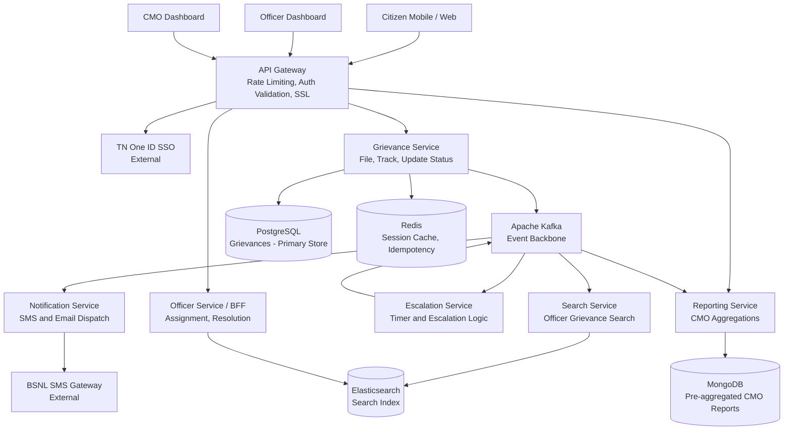
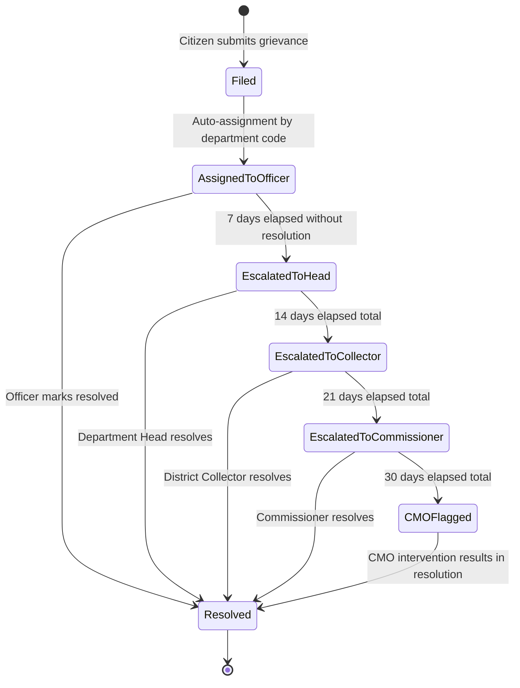

# Pre-Assessment Test
## Senior Engineer → Solution Architect Accelerated Program
### June 2026 Cohort | Batch: 20–25 Participants

---

# Answer Sheet and Evaluator Guide

## Evaluator Access Only — Do Not Distribute to Candidates

---

## Section A — Answer Key

**A1. Answer: B**

Financial transaction ledgers require strong consistency. A debit must be immediately visible to all reads. Eventual consistency in a payment ledger creates a window where a balance can be read as higher than it actually is, enabling overdraft or double-spend scenarios. Options A, C, and D do not provide sufficient guarantees for financial integrity.

**A2. Answer: B**

Thread pool exhaustion through cascading failure is the accurate description. When DoctorProfileService takes eight seconds to respond, each calling thread in AppointmentService waits eight seconds before completing. With a fixed thread pool, all threads become occupied waiting for slow responses. New incoming requests cannot be served. AppointmentService becomes unresponsive even though its own code is healthy. This is the core problem that bulkhead and circuit breaker patterns solve.

**A3. Answer: B**

This is precise Kubernetes behaviour. A liveness failure causes the kubelet to kill and restart the container. A readiness failure causes the pod to be removed from the Service endpoint list so it stops receiving traffic, but the pod is not restarted. The distinction matters because a pod might be temporarily unable to serve traffic during startup without needing a restart.

**A4. Answer: B**

This is the precise definition of SAGA. Option A describes two-phase commit, which SAGA explicitly avoids. Option C is incorrect because SAGA works perfectly well with orchestrators such as Temporal and Camunda. Option D is incorrect because SAGA provides eventual consistency through compensation, not strong consistency.

**A5. Answer: C**

Workspace separation with mandatory plan review gates is the most direct prevention mechanism. Terraform modules organise code but do not prevent applying to the wrong environment. Remote state enables team collaboration but does not prevent a misconfigured variable. The root cause is that apply was permitted without a human reviewing the plan output showing which resources would be affected.

**A6. Answer: C**

The sole purpose of an idempotency key is to make retries safe. When a network timeout occurs after a payment is processed but before the response is returned, the client cannot know whether the payment succeeded. The idempotency key allows the server to detect the retry and return the stored result without processing the payment a second time.

**A7. Answer: B**

SLI is the actual measured value from monitoring systems. SLO is the internal engineering target, deliberately stricter than the SLA to create a buffer. SLA is the contractual commitment with financial or legal consequences for breach. The distinction between SLO and SLA is the error budget — the space between them is what the team consumes before facing contractual consequences.

**A8. Answer: B**

The Aggregate Root as the single entry point enforcing business invariants is the precise DDD definition. All operations on the aggregate, including operations on child entities, go through the Aggregate Root. This ensures business rules are consistently enforced and the aggregate's internal state cannot be modified from outside in ways that violate its invariants.

**A9. Answer: B**

Strangler Fig with Change Data Capture is the correct risk-minimal zero-downtime approach for live government systems. Big bang migration carries extreme risk — a failed Sunday night cut-over leaves the system unavailable for citizens. Direct cut-over still requires a downtime window at the point of switch. Option D is not a migration strategy but an indefinite parallel operation.

**A10. Answer: C**

SQL Injection via string concatenation. This is OWASP A03:2021 Injection. The user-controlled parameter is embedded directly into a SQL string without parameterisation or sanitisation. An attacker can inject SQL syntax to read, modify, or delete data beyond their authorisation.

---

## Section B — Answer Rubric

### B1 — Horizontal vs Vertical Scaling

**Full credit requires all of the following:**

Vertical scaling means increasing the resources of the existing machine — more CPU cores, more RAM, faster storage. It has a hard upper limit determined by available hardware and creates a single point of failure. Horizontal scaling means adding more instances of the service and distributing load across them. It has no practical upper limit and instances can be replaced individually without total service failure.

For a stateless login service, horizontal scaling is clearly preferable. The enabling characteristic is statelessness — because no session or user-specific state is stored in the service instance, any instance can handle any request. Kubernetes HPA automates horizontal scaling in response to load. Vertical scaling would require migrating to a larger machine, which introduces downtime or complexity.

| Score | Criteria                                                                                                                                                                        |
| ----- | ------------------------------------------------------------------------------------------------------------------------------------------------------------------------------- |
| 5     | Both concepts correctly and precisely defined. Correct choice made. Statelessness explicitly and correctly identified as the enabling property with a clear causal explanation. |
| 4     | Both concepts defined. Correct choice with reasonable justification. Statelessness mentioned but not fully connected to the argument.                                           |
| 3     | Correct choice with partial justification. Definitions incomplete.                                                                                                              |
| 2     | Correct choice but weak or imprecise justification.                                                                                                                             |
| 1     | Some understanding shown but incorrect choice or significant conceptual confusion.                                                                                              |
| 0     | Wrong choice, no understanding demonstrated, or no attempt.                                                                                                                     |

---

### B2 — Challenging the 99.999% SLA

**Full credit requires all of the following:**

The immediate response is not to agree. The first obligation is to understand whether the requirement is a genuine business need or an aspirational statement, and whether it is actually achievable within the constraints.

Questions to ask: What is the actual business impact per minute of downtime — is this quantified? What is the budget allocated for achieving this SLA, given that 99.999% requires active-active multi-region deployments, automated failover, and significant redundancy investment? Is this a contractual SLA with financial penalties, or an internal goal? What do the dependency SLAs look like — specifically the NIC data centre, BSNL SMS gateway, and Tamil Nadu One ID system?

The critical insight for government context: If any dependency has a lower SLA, the composite system SLA cannot exceed the weakest dependency. If NIC data centre guarantees 99.5% availability, designing the application for 99.999% does not make the overall service available at 99.999%. The dependency ceiling must be identified before design begins.

| Score | Criteria                                                                                                                                   |
| ----- | ------------------------------------------------------------------------------------------------------------------------------------------ |
| 5     | Correctly pushes back. Asks at least three substantive and specific questions. Identifies the dependency chain ceiling problem explicitly. |
| 4     | Pushes back. Asks two to three meaningful questions. Dependency insight may be implicit rather than explicit.                              |
| 3     | Pushes back but questions are shallow or generic. No dependency insight.                                                                   |
| 2     | Accepts SLA and starts discussing how to design for it.                                                                                    |
| 0     | Immediately agrees and begins describing active-active multi-region architecture.                                                          |

---

### B3 — Eventual Consistency

**Full credit requires all of the following:**

Eventual consistency means that after a write completes, different replicas of the data may temporarily return different values. Given sufficient time with no new writes, all replicas will converge to the same value. The period of inconsistency is bounded, typically milliseconds to seconds.

Acceptable in government context: Citizen address updates replicated across ministry portals. A citizen updates their address in Aadhaar. Different ministry systems cache this data and may show the old address for up to five minutes. This is acceptable because the address does not change again within that window, the eventual state is correct, and no financial or legal decision is made on the stale read within that five-minute period.

Not acceptable: GST return filing status or pension payment disbursement. If a pension payment debit is recorded but a read immediately after returns the pre-debit balance due to replica lag, a second payment could be initiated for the same beneficiary. The financial consequence of a stale read — a duplicate payment or an overdraft — is not acceptable.

| Score | Criteria                                                                                                                                                                 |
| ----- | ------------------------------------------------------------------------------------------------------------------------------------------------------------------------ |
| 5     | Correct definition with bounded staleness mentioned. Both examples correct. Justification explicitly references the business consequence of the stale read in each case. |
| 4     | Correct definition. Both examples correct. Justification present but not tied to specific business consequence.                                                          |
| 3     | Correct definition. Examples given without adequate justification.                                                                                                       |
| 2     | Vague definition. One correct example.                                                                                                                                   |
| 1     | Confuses eventual consistency with eventual failure or data loss.                                                                                                        |
| 0     | Cannot define the term.                                                                                                                                                  |

---

### B4 — Authentication vs Authorisation

**Full credit requires all of the following:**

Authentication answers the question of who you are. It is the process of verifying an identity claim — typically through credentials, certificates, or tokens. Authorisation answers the question of what you are allowed to do. It is the process of determining whether an authenticated identity has permission to perform a specific action on a specific resource.

In the multi-ministry context, the mechanism that primarily enforces the boundary is authorisation, not authentication. A Ministry A officer is successfully authenticated — the system knows exactly who they are. The problem is not identity verification. The problem is access control. Role-Based Access Control enforces this: the officer's JWT token contains a role claim such as MINISTRY_A_OFFICER. When the officer calls an API for Ministry B citizen records, the API checks the role claim against the required permission for that resource. The role does not match, and the request is rejected.

Authentication failure returns HTTP 401 Unauthorized — the system does not know who is making the request. Authorisation failure returns HTTP 403 Forbidden — the system knows who is making the request but they do not have permission.

| Score | Criteria                                                                                                                                                                                                |
| ----- | ------------------------------------------------------------------------------------------------------------------------------------------------------------------------------------------------------- |
| 5     | Both correctly and precisely defined. Authorisation correctly identified as the primary enforcement mechanism. RBAC or equivalent explained. Both HTTP status codes correctly stated and distinguished. |
| 4     | Both correctly defined. Correct mechanism identified. Status codes mentioned but one incorrect or missing.                                                                                              |
| 3     | Both correctly defined. Correct mechanism identified but implementation detail absent.                                                                                                                  |
| 2     | Only one correctly defined. Some confusion between the concepts.                                                                                                                                        |
| 1     | Conflates the two concepts.                                                                                                                                                                             |

---

## Section C — System Design Rubric

### C1 — Architecture Overview (15 points)

**Expected Architecture**

The following Mermaid diagram represents a strong reference answer. Candidates will not produce this exact diagram but should cover the core components and relationships.



**Written description must cover the following points to earn full marks.**

Services and responsibilities: GrievanceService handles all grievance lifecycle operations. OfficerService or BFF handles officer-specific queries and assignment workflows. NotificationService dispatches SMS via BSNL gateway and email, decoupled from the main grievance flow. EscalationService manages durable timers and escalation logic. ReportingService maintains pre-aggregated CMO dashboards. SearchService provides full-text grievance search for officers.

Synchronous vs asynchronous: Citizen filing a grievance is synchronous because the citizen needs an immediate confirmation and grievanceId. Officer login and session management is synchronous because authentication must complete before any other action. Notification dispatch is asynchronous via Kafka because notification delivery latency is irrelevant to the citizen's filing experience and BSNL gateway may be slow. Escalation triggering is asynchronous because escalation is a background operational process. CMO reporting is asynchronous because dashboards are pre-computed, not real-time query results.

Database choices: PostgreSQL for GrievanceService because grievances are structured relational data requiring ACID transactions and supporting seven-year retention with query capability. Redis for session management and idempotency key storage because both require fast key-value lookup with TTL expiry. Elasticsearch for the officer search index because officers need full-text search across description fields which relational databases handle poorly at scale. MongoDB for pre-aggregated CMO reports because the document model suits hierarchical aggregations by district, department, and week without requiring complex joins.

2G mobile constraint: Mandatory pagination on all list endpoints — no unbounded response sets. Sparse fieldsets so clients request only the fields a screen requires. Gzip compression enforced on all responses. A mobile BFF layer that aggregates data from multiple services into a single response, reducing the number of round trips a mobile client must make. Maximum response payload target of eight kilobytes per screen. Offline grievance drafting with sync-on-connection capability.

| Score | Criteria                                                                                                                                                                                                                                 |
| ----- | ---------------------------------------------------------------------------------------------------------------------------------------------------------------------------------------------------------------------------------------- |
| 13–15 | All major services present with correct responsibilities. Synchronous and asynchronous choices justified per service. Database choices appropriate and justified. 2G constraint addressed with at least three specific design decisions. |
| 10–12 | Most services present. Communication choices made with partial justification. Some database justification. 2G mentioned but addressed superficially.                                                                                     |
| 7–9   | Core services present. Limited justification for choices. 2G mentioned without specific design responses.                                                                                                                                |
| 4–6   | Partial service list. No meaningful justification for technology or communication choices.                                                                                                                                               |
| 1–3   | Monolith proposed or severely incomplete structure.                                                                                                                                                                                      |
| 0     | Not attempted.                                                                                                                                                                                                                           |

---

### C2 — Escalation Workflow Design (10 points)

**Timer technology:** A workflow engine such as Camunda or Temporal is the correct answer. Database-backed scheduled jobs using a framework like Quartz are also acceptable. The critical insight is that an in-memory timer — Thread.sleep, ScheduledExecutorService, or an in-memory cache TTL — does not survive a server restart. If the server restarts on day three of a seven-day escalation window, the timer is lost and the escalation never fires. The timer state must be persisted durably outside the application process.

**Escalation flow diagram:**



**Data fields for CMO escalation reporting:** grievanceId, districtCode, departmentCode, filedAt timestamp, currentStatus, currentEscalationLevel, escalationTimestamps at each level, resolvedAt timestamp, resolvingActorLevel (which escalation level ultimately resolved it), totalResolutionDays, wasEscalationRequired (boolean derived field).

| Score | Criteria                                                                                                                                                                                                                                             |
| ----- | ---------------------------------------------------------------------------------------------------------------------------------------------------------------------------------------------------------------------------------------------------- |
| 9–10  | Persistent timer technology correctly identified with clear explanation of why in-memory fails. State diagram present with minimum three escalation levels and correct actors. CMO reporting fields comprehensive and include escalation timestamps. |
| 7–8   | Persistent timer identified. State diagram present and mostly correct. Reporting fields present but incomplete.                                                                                                                                      |
| 5–6   | Scheduled job mentioned without addressing restart survivability. Escalation flow described in text without diagram or with incomplete diagram.                                                                                                      |
| 3–4   | In-memory timer proposed without recognising the restart problem. Escalation flow partial.                                                                                                                                                           |
| 1–2   | Vague timer approach. No structured escalation flow.                                                                                                                                                                                                 |

---

### C3 — Identify Your Own Gaps (10 points)

Award marks for intellectual honesty and the quality of identified gaps. Accept any well-reasoned gap. The following are examples of strong gaps.

Data residency and sovereignty: The hybrid NIC plus AWS architecture has not defined which data can leave the NIC data centre and be processed or stored in AWS. Citizen grievance data may be classified as sensitive personal information under the DPDP Act. The architecture must explicitly define what is permitted to reside in AWS and what must remain on-premise. Without this, the hybrid strategy may be illegal.

Disaster recovery and backup: The seven-year data retention requirement has not been matched with a defined backup and recovery strategy. What is the RPO — how much data loss is acceptable? What is the RTO — how long can the system be offline after a failure? Without defined RPO and RTO, the architecture cannot be validated for the 99.5% availability SLA.

Offline conflict resolution: The 2G mobile offline filing capability has been stated but the conflict resolution strategy when the client syncs has not been designed. What happens if a citizen files a grievance offline, then the same citizen files the same grievance through another channel while offline, and both sync simultaneously? The duplicate detection and conflict resolution logic is absent from the design.

BSNL SMS gateway failure: There is no fallback notification channel if the BSNL SMS gateway is unavailable. The notification service architecture assumes the gateway is always reachable. During a post-disaster scenario — precisely when notification volumes are highest — telecommunications infrastructure may be degraded.

Officer load balancing and assignment: The architecture assigns grievances to departments but has not defined how they are assigned within a department to specific officers, how workload is balanced, or how absence and handover are handled. Without this, all grievances may stack against unavailable officers.

| Score | Criteria                                                                                                                                                              |
| ----- | --------------------------------------------------------------------------------------------------------------------------------------------------------------------- |
| 9–10  | Three genuine, non-trivial gaps identified. Each gap includes a clear explanation of the specific risk in this government context and a credible proposed mitigation. |
| 7–8   | Three gaps identified. Two are non-trivial with good risk explanation. One mitigation may be thin.                                                                    |
| 5–6   | Two meaningful gaps with explanation. Third gap is trivial or missing.                                                                                                |
| 3–4   | One or two gaps identified but explanations are vague or generic.                                                                                                     |
| 1–2   | Gaps identified but they are trivial implementation details rather than architectural risks.                                                                          |
| 0     | Claims no gaps exist. Not attempted.                                                                                                                                  |

---

## Section D — Code Review Answer Key

### D1a — Security Vulnerabilities (8 points)

Two points per vulnerability. A minimum of four are present. Award 1 point if the vulnerability is correctly named but the impact explanation is inadequate.

**Vulnerability 1 — SQL Injection (OWASP A03:2021 Injection)**
Location: searchCitizens method. The query string variable is built by directly concatenating user input into a SQL string. An attacker submits a search query containing SQL syntax — for example, a single quote followed by DROP TABLE commands — and the database executes it. In a government system with 7.8 crore citizen records, this allows an attacker to read all citizen data, modify records, or destroy the database entirely.

**Vulnerability 2 — PII Logging (OWASP A09:2021 Security Logging and Monitoring Failures)**
Location: getCitizen method. The Aadhaar number is written to the audit log. This violates the UIDAI Act prohibition on storing or transmitting raw Aadhaar numbers in logs. Additionally, it creates a data exposure risk — any person with access to the logging system, which may include all developers and operations staff, can retrieve Aadhaar numbers for any citizen whose record was accessed.

**Vulnerability 3 — Missing Authentication and Authorisation (OWASP A01:2021 Broken Access Control)**
Location: All four endpoints. No authentication annotation such as @PreAuthorize or security configuration is present. Any caller, including unauthenticated external users if the endpoint is exposed through the API gateway, can read, search, update, or delete any citizen record. This is a complete absence of access control.

**Vulnerability 4 — Insecure Direct Object Reference (OWASP A01:2021 Broken Access Control)**
Location: updateAddress and deleteCitizen methods. The citizen ID is taken directly from the path without verifying that the authenticated user has permission to modify that specific citizen's record. An authenticated Ministry A officer could modify the address of a citizen belonging to a case managed by Ministry B simply by changing the ID in the URL.

**Vulnerability 5 — Unrestricted Destructive Operation**
Location: deleteCitizen method. There is no role check restricting who can call this endpoint. There is no soft-delete implementation — the record is permanently destroyed. There is no audit trail recording who deleted the record and when. In a government system where citizen records may be required for legal proceedings or audit, permanent deletion without authorisation control and audit trail is a critical design failure.

**Vulnerability 6 — Missing Input Validation (OWASP A03:2021)**
Location: updateAddress method. The AddressRequest body has no @Valid annotation and no validation constraints. Null fields, excessively long strings, or malformed data are accepted without rejection, potentially causing data corruption or downstream processing failures.

---

### D1b — Aadhaar in ELK (2 points)

Full credit requires both points. The ELK stack creates a non-IAM-governed side channel for accessing Aadhaar numbers. While the application enforces authorisation through JWT roles and RBAC, the log store in Elasticsearch is typically accessible to all members of the operations and development teams through Kibana — often with broader access than the application itself. A developer who cannot access the citizen API due to role restrictions can open Kibana, search for log entries from the getCitizen endpoint, and retrieve Aadhaar numbers for any citizen whose record was accessed. This bypasses all application-layer access controls. Additionally, log exports for audit reporting may result in Aadhaar numbers appearing in CSV files stored outside any secure system.

---

### D1c — Endpoint 3 Checklist (2 points)

Award one mark for any two of the following, and one additional mark if IDOR or audit trail is present since these are the most critical.

No check that the authenticated caller is permitted to update this specific citizen's record — the endpoint is vulnerable to Insecure Direct Object Reference. No audit trail recording who made the change, what the previous address was, and what the new address is. No input validation on the AddressRequest — null and malformed addresses are accepted. No optimistic locking or version check — concurrent updates may silently overwrite each other. The response returns a generic string rather than the updated resource, making it impossible for the caller to confirm what was actually stored.

---

### D2a — Kafka Consumer Bottleneck (2 points)

The certificateService.generate call takes three to five seconds and runs synchronously inside the consumer method. Kafka consumers have a maximum processing time per poll cycle governed by max.poll.interval.ms. More practically, with two million events per day arriving at approximately 23 events per second, and each event taking five seconds to process, a single consumer thread can process only 12 events per second — roughly half the incoming rate. Consumer group lag grows at approximately 11 events per second, compounding indefinitely. The certificate generation must be moved to an asynchronous step — the consumer saves the event and publishes a CertificateGenerationRequested event, which a separate dedicated service handles without blocking the ingestion consumer.

---

### D2b — Silent Exception Swallowing (2 points)

First consequence: Events that fail processing are permanently lost. If repository.save throws because the database is temporarily unavailable, the exception is caught, logged at error level, and the method returns normally. Kafka interprets this as successful processing and commits the offset. The vaccination event is never retried and never stored. The citizen has no vaccination record. This is silent, undetected data loss in a nationally critical health system.

Second consequence: There is no dead letter queue. In a properly designed Kafka consumer, persistent failures after retries are routed to a DLQ topic where operations teams can investigate and replay messages after fixing the root cause. Without a DLQ, failed events vanish. There is no recovery path and no operational visibility into how many events were lost or why.

---

### D2c — Missing Idempotency Scenario (2 points)

A network partition occurs between the Kafka broker and the consumer after repository.save succeeds and emailService.send dispatches the certificate, but before the consumer commits its offset to Kafka. The consumer group coordinator detects the consumer as timed out and rebalances the partition to another consumer instance. The new consumer re-reads the uncommitted message and processes it again. The citizen receives two vaccination certificates by email, and the database has two vaccination records for the same dose. If the citizen uses the vaccination certificate for international travel, two different certificate numbers exist for the same dose event, which may cause verification failures at border control or raise flags in the health system indicating a duplicate administration.

---

### D2d — Additional Issue (2 points)

Accept any issue not covered in D2a, D2b, or D2c. Strong answers include the following.

PII in log statement: event.getAadhaar() is written to the application log at INFO level, creating the same ELK side-channel exposure identified in D1b.

Missing transaction boundary: repository.save and emailService.send are not in a single atomic operation. The save can succeed and the email can fail, leaving the citizen with a database record but no certificate and no indication of the failure. The inverse — email sent without save — is also possible if the order were reversed.

emailService is not declared or injected: The field emailService appears in the method but is never declared as a class field with @Autowired or constructor injection. This is a compilation error.

---

### D3 — Pattern Identification

This question was removed from the 90-minute version to maintain time balance. If the evaluator includes it as a bonus, award two points for naming Event Sourcing and CQRS correctly.

---

## Section E — Code Writing Answer Key

### E1 — Idempotent REST Endpoint (15 points)

**Reference Implementation — Java Spring Boot**

```java
@RestController
@RequestMapping("/api/grievances")
public class GrievanceController {

    private static final Set<String> VALID_DEPARTMENTS =
        Set.of("WATER", "ROADS", "HEALTH", "REVENUE", "ELECTRICITY");

    // Production replacement: RedisTemplate with 24-hour TTL
    // redisTemplate.opsForValue()
    //     .set(key, response, 24, TimeUnit.HOURS);
    private final Map<String, GrievanceResponse> idempotencyStore =
        new ConcurrentHashMap<>();

    @Autowired
    private GrievanceService grievanceService;

    @PostMapping
    public ResponseEntity<?> submitGrievance(
            @RequestHeader(value = "Idempotency-Key",
                           required = false) String idempotencyKey,
            @RequestBody @Valid GrievanceRequest request) {

        if (idempotencyKey == null || idempotencyKey.isBlank()) {
            return ResponseEntity
                .status(HttpStatus.BAD_REQUEST)
                .body(Map.of(
                    "error", "Idempotency-Key header is required",
                    "code",  "MISSING_IDEMPOTENCY_KEY"
                ));
        }

        if (!VALID_DEPARTMENTS.contains(request.getDepartmentCode())) {
            return ResponseEntity
                .status(HttpStatus.BAD_REQUEST)
                .body(Map.of(
                    "error",       "Invalid department code",
                    "validValues", VALID_DEPARTMENTS
                ));
        }

        GrievanceResponse existing = idempotencyStore.get(idempotencyKey);
        if (existing != null) {
            return ResponseEntity
                .status(HttpStatus.OK)
                .header("Idempotent-Replayed", "true")
                .body(existing);
        }

        try {
            GrievanceResponse response =
                grievanceService.create(request);
            idempotencyStore.put(idempotencyKey, response);
            return ResponseEntity
                .status(HttpStatus.CREATED)
                .body(response);
        } catch (Exception e) {
            return ResponseEntity
                .status(HttpStatus.INTERNAL_SERVER_ERROR)
                .body(Map.of("error", "Grievance submission failed",
                             "detail", e.getMessage()));
        }
    }
}

@Data
public class GrievanceRequest {

    @NotBlank(message = "citizenId is required")
    private String citizenId;

    @NotBlank(message = "departmentCode is required")
    private String departmentCode;

    @NotBlank(message = "description is required")
    @Size(max = 1000,
          message = "description must not exceed 1000 characters")
    private String description;

    @NotBlank(message = "locationCode is required")
    private String locationCode;
}
```

| Criteria                                                         | Points |
| ---------------------------------------------------------------- | ------ |
| Idempotency-Key header checked — 400 returned if absent or blank | 2      |
| Idempotency store lookup performed before processing             | 2      |
| Existing response returned without reprocessing on key match     | 2      |
| New response stored after processing                             | 1      |
| Redis replacement commented or noted                             | 1      |
| Department code validation against valid set                     | 2      |
| Description not blank and max 1000 characters enforced           | 2      |
| HTTP 201 for new, HTTP 200 for replay — correctly distinguished  | 1.5    |
| HTTP 400 for validation failures with structured error body      | 1      |
| Exception handling with structured error response                | 0.5    |

---

### E2 — SQL Query and Index Analysis (10 points)

**E2a — Root Cause (2 points)**

The query filters on district_code and created_at but neither column has an index. The database performs a sequential scan of all 50 million rows, evaluating each row against the WHERE clause predicates before filtering, joining, and aggregating. At typical disk read rates, scanning 50 million rows takes tens of seconds. Additionally, the JOIN to departments without an index on grievances.department_id forces an additional lookup per qualifying row.

**E2b — Index Statements (4 points)**

```sql
CREATE INDEX idx_grievances_district_date_covering
ON grievances (district_code, created_at, department_id, status, resolved_at);
```

Justification: district_code is placed first because it is an equality predicate and eliminates all rows outside the target district before the date range is evaluated. created_at is placed second because it is a range predicate and benefits from being in a B-tree index at the position immediately after the equality predicate. department_id, status, and resolved_at are included as covering columns so the query can be satisfied entirely from the index without fetching rows from the heap. This eliminates the table access for every qualifying row.

Award 3 points if the composite index is correct with good justification. Award 4 if the covering columns are included and the reasoning for column order references equality before range predicates.

**E2c — CMO Dashboard Architecture (4 points)**

The CMO query aggregates across all 50 million rows with no district filter. An index cannot help a full-table aggregation — the database still processes every row. Running this every 15 minutes on the live transaction table would exhaust I/O capacity.

The architectural solution is pre-aggregation. A background process — implemented as a Kafka consumer subscribing to grievance status change events, or as a scheduled job running every 14 minutes — computes the aggregations incrementally and writes results to a small reporting table or MongoDB document collection. The CMO dashboard queries the pre-aggregated store, which returns in under 100 milliseconds regardless of the size of the underlying grievances table. This is the read model in a CQRS pattern applied to the reporting use case.

Award 4 points for pre-aggregation with Kafka-driven or scheduled incremental updates and a query against the small result store. Award 2 points for identifying that the query cannot run against the primary table without a more specific solution. Award 1 point for suggesting a materialised view without explaining how it stays current within 15 minutes.

---

## Section F — Essay Rubric

### F1 — Explaining SAGA to a Non-Technical Stakeholder (20 points)

| Dimension                                        | Points | Evaluator Criteria                                                                                                                                                                                                                                                                                                                                                                                                                                                                           |
| ------------------------------------------------ | ------ | -------------------------------------------------------------------------------------------------------------------------------------------------------------------------------------------------------------------------------------------------------------------------------------------------------------------------------------------------------------------------------------------------------------------------------------------------------------------------------------------- |
| Tone and acknowledgement                         | 3      | Does not dismiss. Validates the concern. No condescension. Uses respectful language. Demonstrates that the officer's question is the right one to ask.                                                                                                                                                                                                                                                                                                                                       |
| Explanation of why traditional transactions fail | 5      | Correctly explains that database transactions only work within a single database. Explains that pension disbursement spans four separate systems owned by different teams with separate databases. Explains that no single transaction can span across them. Avoids jargon or immediately explains any technical term used.                                                                                                                                                                  |
| Analogy quality                                  | 4      | The analogy must capture the compensation concept — that if a step fails, there is a defined reversal for each completed step. A money order or postal order analogy works well: the post office deducts from the sender, holds the funds, and if the recipient cannot collect, there is a defined process to return the funds — the money does not simply disappear or remain debited. Weak analogies that capture only sequential steps without the compensation concept receive 2 points. |
| Honesty about complexity                         | 4      | Acknowledges that SAGA adds engineering complexity. Explains what the team does to manage it: defining compensating transactions for each step in advance, writing integration tests for failure scenarios, using a workflow engine to make the state visible and auditable, and building monitoring so the team can see when a saga is stuck. Does not oversell SAGA as risk-free.                                                                                                          |
| Recommendation clarity                           | 4      | Ends with a clear recommendation to proceed with SAGA. States what the alternative would require — a shared database across all four services, which creates worse coupling and worse operational risk. Delivers the recommendation with confidence rather than hedging.                                                                                                                                                                                                                     |

**Strong answer indicators:** The candidate treats the officer as an intelligent adult who can understand a good analogy. They do not simplify to the point of inaccuracy. They do not overwhelm with jargon. They acknowledge uncertainty where it exists and explain the mitigations honestly.

**Weak answer indicators:** The candidate talks down to the officer. The candidate uses technical terms without explanation. The candidate is vague about the complexity to avoid the difficult parts. The candidate fails to recommend clearly at the end.

---

## Section G — Situational Judgement Rubric

### G1 — Production Incident at 11:45 PM

**Best answer: B — Immediate rollback**

| Choice | Score | Evaluator Reasoning                                                                                                                                                                                                                                                                                                                                                                                                                                                                                                                  |
| ------ | ----- | ------------------------------------------------------------------------------------------------------------------------------------------------------------------------------------------------------------------------------------------------------------------------------------------------------------------------------------------------------------------------------------------------------------------------------------------------------------------------------------------------------------------------------------ |
| B      | 5     | Correct. Four thousand active citizens experiencing a 12% error rate in a pension system constitutes a live service-impacting incident. The evidence — a deployment six hours ago correlated with the error rate — is sufficient to justify rollback without full root cause analysis. Rollback is the fastest path to service restoration. Root cause investigation is a next-day activity conducted with the full team on a healthy system. This reflects standard incident response for a deployment-correlated production issue. |
| D      | 3     | Pod restart is a reasonable first action but less targeted than rollback. Connection pool issues may not be resolved by pod restart alone, and restarting adds delay while citizens continue to experience errors. Monitoring for 30 minutes before deciding extends citizen impact unnecessarily when a clear rollback path exists.                                                                                                                                                                                                 |
| C      | 1     | Deploying a hotfix to a production system that is already in a degraded state introduces a second change into an unknown failure mode. This risks compounding the incident. The cause is not confirmed — increasing the pool size assumes the diagnosis is correct when it has not been verified.                                                                                                                                                                                                                                    |
| A      | 0     | Allowing four thousand pensioners to experience errors until morning because the full team is not available is not an acceptable incident response for a government citizen service. No credit.                                                                                                                                                                                                                                                                                                                                      |

Evaluate justification quality independently. A candidate who selects B but provides shallow justification scores 3. A candidate who selects D with an exceptionally well-reasoned justification about uncertainty in diagnosis may score 4.

---

### G2 — Production Credentials in Code

**Best answer: B — Formal escalation**

| Choice | Score | Evaluator Reasoning                                                                                                                                                                                                                                                                                                                                                                                                                                                                                                                                                                                                 |
| ------ | ----- | ------------------------------------------------------------------------------------------------------------------------------------------------------------------------------------------------------------------------------------------------------------------------------------------------------------------------------------------------------------------------------------------------------------------------------------------------------------------------------------------------------------------------------------------------------------------------------------------------------------------- |
| B      | 5     | Correct. Credentials committed to a repository — even a private one — must be treated as compromised. Private repositories have been breached historically. Git history persists even after the credential is removed from the current version of the file. The credentials must be rotated immediately to invalidate the exposed values. Formal escalation is required because the security team must be aware to assess whether the credentials were accessed. Organisational seniority is irrelevant to security obligations. The candidate demonstrates that they understand their professional responsibility. |
| C      | 2     | Fixing the code by removing the credentials is necessary but insufficient. The credentials remain in git history and are still compromised. The security team needs to know in order to rotate them and assess access logs. Doing this quietly without informing the security team leaves a potential breach uninvestigated.                                                                                                                                                                                                                                                                                        |
| D      | 1     | Raising it a second time is appropriate. Letting it go if the colleague refuses is not. The candidate's obligation does not end because the colleague is unpersuaded. Formal escalation is required.                                                                                                                                                                                                                                                                                                                                                                                                                |
| A      | 0     | Private repositories have been breached in real incidents. Accepting this explanation demonstrates a fundamental misunderstanding of credential security. No credit.                                                                                                                                                                                                                                                                                                                                                                                                                                                |

Flag candidates who select A with a note to the programme manager. This is a security mindset concern that should be noted before Day 1.

---

## Master Scorecard

**Candidate Name:** ________________________________

**Employee ID:** ________________________________

**Current Role:** ________________________________

**Organisation:** ________________________________

**Assessment Date:** ________________________________

**Evaluator:** ________________________________

| Section   | Description                                | Max Points | Raw Score | Percentage |
| --------- | ------------------------------------------ | ---------- | --------- | ---------- |
| A         | Multiple Choice — Core Technical Knowledge | 20         |           |            |
| B         | Conceptual Short Answer                    | 20         |           |            |
| C         | System Design Scenario                     | 35         |           |            |
| D         | Code Reading and Review                    | 20         |           |            |
| E         | Code Writing                               | 25         |           |            |
| F         | Trade-off and Research Essay               | 20         |           |            |
| G         | Situational Judgement                      | 10         |           |            |
| **Total** |                                            | **150**    |           |            |

---

## Competency Dimension Matrix

| Competency                    | Sections | Max | Score | Percentage | Level                                    |
| ----------------------------- | -------- | --- | ----- | ---------- | ---------------------------------------- |
| Technical Knowledge           | A + D    | 40  |       |            | Novice / Developing / Competent / Expert |
| Design and Architecture       | C        | 35  |       |            | Novice / Developing / Competent / Expert |
| Implementation Skill          | E        | 25  |       |            | Novice / Developing / Competent / Expert |
| Conceptual Clarity            | B        | 20  |       |            | Novice / Developing / Competent / Expert |
| Communication and Research    | F        | 20  |       |            | Novice / Developing / Competent / Expert |
| Judgement and Decision-Making | G        | 10  |       |            | Novice / Developing / Competent / Expert |

**Competency Level Scale**

Novice: Below 50%. Foundational conceptual gaps present. Pre-reading completion is mandatory before Day 1 attendance.

Developing: 50 to 69%. Some gaps in understanding. Focused pre-reading on specific sections is required before Day 1.

Competent: 70 to 84%. Ready for the program with standard preparation. Will keep pace with the cohort.

Expert: 85 to 100%. Can contribute at a peer level in course discussions and may support peer review activities.

---

## Candidate Evaluation Report

**Programme:** Senior Engineer to Solution Architect Accelerated Program

**Cohort:** June 2026

**Candidate Name:** ________________________________

**Assessment Date:** ________________________________

**Evaluator:** ________________________________

**Report Date:** ________________________________

---

**Overall Result**

Total Score: _______ out of 150 — _______ percent

| Band          | Score Range   | Recommendation                            |
| ------------- | ------------- | ----------------------------------------- |
| Distinguished | 128 and above | Enrol — Peer Contributor Track            |
| Proficient    | 105 to 127    | Enrol — Standard Track                    |
| Adequate      | 90 to 104     | Enrol — Enhanced Support Track            |
| Developing    | 75 to 89      | Conditional Enrolment — Pre-work Required |
| Not Ready     | Below 75      | Defer — Foundational Development Required |

**This candidate falls in band:** ________________________________

**Recommendation:** ________________________________

---

**Section Results**

| Section                        | Max | Score | Percentage | Evaluator Notes |
| ------------------------------ | --- | ----- | ---------- | --------------- |
| A — Core Technical Knowledge   | 20  |       |            |                 |
| B — Conceptual Clarity         | 20  |       |            |                 |
| C — System Design              | 35  |       |            |                 |
| D — Code Comprehension         | 20  |       |            |                 |
| E — Code Writing               | 25  |       |            |                 |
| F — Communication and Research | 20  |       |            |                 |
| G — Situational Judgement      | 10  |       |            |                 |

---

**Competency Profile**

| Competency                 | Score | Level | Key Observation |
| -------------------------- | ----- | ----- | --------------- |
| Technical Knowledge        |       |       |                 |
| Design and Architecture    |       |       |                 |
| Implementation Skill       |       |       |                 |
| Conceptual Clarity         |       |       |                 |
| Communication and Research |       |       |                 |
| Judgement                  |       |       |                 |

---

**Identified Strengths**

Strength 1:

Strength 2:

Strength 3:

---

**Identified Gaps and Development Areas**

Critical gaps to address before Day 1:

Gap 1 — Description:
Recommended resource:

Gap 2 — Description:
Recommended resource:

Significant gaps to address during the program:

Gap 1:

Gap 2:

---

**Security Mindset Assessment**

Based on Section D1 and Section G2 responses:

- Strong — Proactively identifies security issues without prompting
- Adequate — Identifies obvious security issues when explicitly asked
- Developing — Misses significant security issues in code review
- Concerning — Demonstrated poor security judgement (notify Programme Manager before Day 1)

Evaluator notes on security posture:

---

**Communication and Stakeholder Readiness**

Based on Section F response:

- Ready to present to both technical and non-technical stakeholders
- Ready for technical stakeholders only — needs coaching for non-technical audiences
- Needs significant coaching before being placed in stakeholder-facing architect role

Evaluator notes on communication:

---

**Facilitator Guidance (Private — Facilitator Use Only)**

Suggested cohort grouping: ________________________________

Additional check-ins recommended: Yes / No

If yes, recommended frequency: ________________________________

Special observations for facilitator:

---

**Conditional Enrolment Requirements**

Complete this section only if the recommendation is Conditional Enrolment or Defer.

Required actions before enrolment is confirmed:

Action 1:
Deadline:

Action 2:
Deadline:

Re-assessment required on sections: ________________________________

Re-assessment deadline: ________________________________

---

**Evaluator Sign-Off**

Evaluator Name: ________________________________

Designation: ________________________________

Signature: ________________________________

Date: ________________________________

Second Evaluator (required for all scores between 75 and 95):

Second Evaluator Name: ________________________________

Second Evaluator Signature: ________________________________

---

## Batch Summary

**Programme Coordinator View**

Cohort: June 2026
Assessment Date: ________________________________
Total Candidates Assessed: _______ of target 20 to 25

**Distribution by Band**

| Band                        | Count | Percentage |
| --------------------------- | ----- | ---------- |
| Distinguished 128 and above |       |            |
| Proficient 105 to 127       |       |            |
| Adequate 90 to 104          |       |            |
| Developing 75 to 89         |       |            |
| Not Ready below 75          |       |            |

**Batch Competency Gaps**

Sections where the batch average falls below 60 percent require facilitator adjustment on Day 1.

| Section                 | Batch Average | Gap Identified | Facilitator Action                     |
| ----------------------- | ------------- | -------------- | -------------------------------------- |
| A — Technical Knowledge |               | Yes / No       | Extend Day 1 fundamentals coverage     |
| B — Conceptual Clarity  |               | Yes / No       | Add concept clarification exercises    |
| C — System Design       |               | Yes / No       | Extend Day 1 design workshop           |
| D — Code Review         |               | Yes / No       | Add code review lab on Day 1 afternoon |
| E — Code Writing        |               | Yes / No       | Add pair programming warm-up           |
| F — Communication       |               | Yes / No       | Add stakeholder communication session  |
| G — Judgement           |               | Yes / No       | Add ethical decision-making discussion |

**Security Mindset Flags**

Number of candidates flagged as Concerning: _______

Names and scores (notify Programme Manager before Day 1):

**Deferred Candidates**

Count: _______

Names and total scores:

Recommended deferral period: Three months with mandatory LMS module completion before re-assessment.

---

*Assessment Document Version 1.0*
*Senior Engineer to Solution Architect Accelerated Program — June 2026*
*The Answer Key, Rubric, Scorecard, and Report Template sections are for evaluator use only and must not be distributed to candidates*