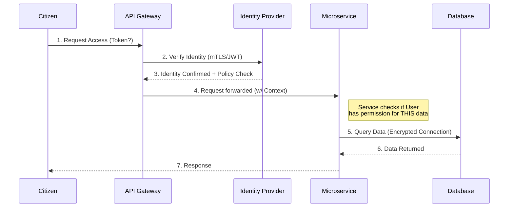

# 📚 Pre-Read Document: Senior Engineer → Solution Architect
**Program Focus:** Government-Scale Digital Transformation
**Target Audience:** Mid-Level Engineers transitioning to Solution Architects
**Purpose:** This document bridges the knowledge gap between engineering execution and architectural strategy, specifically tailored for the constraints and scale of government projects.

---

## 1. Introduction & The Government Context

Welcome to the "Senior Engineer → Solution Architect" program. Before we dive into the technical curriculum, it is crucial to understand the environment in which we operate. Unlike startups or agile corporates, **Government Scale Projects** operate under unique constraints:

*   **Scale:** Millions of concurrent citizens (traffic spikes during tax season, disasters, or elections).
*   **Longevity:** Systems must last 10–15 years, requiring technology-agnostic design.
*   **Interoperability:** No system is an island; you must integrate with legacy mainframes, third-party identity providers, and cross-departmental data exchanges.
*   **Compliance:** Strict adherence to data sovereignty, accessibility (WCAG), and security standards (Zero Trust).

### 🧠 The Architectural Mindset Shift
As an engineer, you ask: *"How do I build this feature?"*
As an architect, you must ask: *"Should we build this feature? What happens if it fails at 2 PM on a holiday? How do I replace this in 5 years?"*

---

## 2. Phase 1: Architectural Foundations & Design Thinking

This phase moves away from code syntax and towards structural decision-making.

### 🔍 Terms to Google
To prepare for Day 1 & 2, please research the following terms in the context of **Enterprise Architecture**:
*   `Non-Functional Requirements (NFRs) vs Functional Requirements`
*   `Architecture Decision Records (ADR) template`
*   `Total Cost of Ownership (TCO) in Cloud`
*   `Domain-Driven Design (DDD) Bounded Contexts`
*   `CAP Theorem and PACELC`
*   `OpenAPI Specification (Swagger)`
*   `Interoperability in e-Government`

### 📐 Architecture Diagram: The "Hidden" Layers
In government projects, the application code is often the smallest part. The complexity lies in the "Glue" and "Infrastructure."

```mermaid
graph TD
    subgraph "Presentation Layer"
        WEB[Citizen Web Portal]
        MOB[Mobile App]
    end

    subgraph "API Gateway & Security (The Shield)"
        GW[API Gateway]
        IDP[Identity Provider (Keycloak/SAML)]
        WAF[Web Application Firewall]
    end

    subgraph "Application Layer (Bounded Contexts)"
        CORE[Core Domain Service]
        INT[Integration Adapter]
    end

    subgraph "Data Layer"
        DB[(Primary DB)]
        CACHE[(Redis Cache)]
        ES[(Elasticsearch)]
    end

    subgraph "External Legacy (The Swamp)"
        MAIN[Legacy Mainframe]
        EXT[3rd Party Systems]
    end

    WEB --> GW
    MOB --> GW
    GW --> IDP
    GW --> CORE
    CORE --> DB
    CORE --> CACHE
    CORE --> INT
    INT --> MAIN
    INT --> EXT
```

### 🏛️ Use Case: The National Health Portal
**Scenario:** A citizen logs in to view their vaccination history.
**Architectural Challenge:** The frontend is modern, but the vaccination data sits on a 20-year-old mainframe that goes down for maintenance every night.

**Solution Pattern:**
1.  **CQRS (Command Query Responsibility Segregation):** Separate the "Read" (View Record) from the "Write" (Update Record).
2.  **Event Sourcing:** When the mainframe is updated, emit an event to a modern database so citizens can query the "Read" DB instantly without hitting the legacy system.

---

## 3. Phase 2: Microservices, AI & Modernization

This phase addresses how to break monoliths and introduce intelligence without breaking the bank or the system.

### 🔍 Terms to Google
*   `Strangler Fig Pattern`
*   `Saga Pattern for Distributed Transactions`
*   `Idempotency in APIs`
*   `Circuit Breaker Pattern`
*   `Change Data Capture (CDC)`
*   `Prompt Engineering for Code Generation`
*   `Reactive Architecture`

### 📊 ASCII Diagram: The Strangler Fig Pattern
Government systems cannot be rewritten in one "Big Bang." We use the Strangler Fig pattern to slowly replace functionality.

```text
[ Legacy Monolith System ]
|                       |
| (1) New Feature       |  <-- Route new traffic to new Microservice
|     goes to           |
|     [ Service A ]     |
|                       |
| (2) Strangle          |  <-- Gradually migrate existing features
|     existing route    |      from Monolith to Service B
|     /api/users   ---> [ Service B ]
|                       |
| (3) Eventually...     |
|     Monolith is       |  <-- Monolith is deprecated
|     turned OFF        |
-------------------------
```

### 🏛️ Use Case: Tax Filing Modernization
**Scenario:** The tax filing system currently handles 100,000 users but crashes when 1 million users file on deadline day.

**Architectural Strategy:**
1.  **Mobile-First with Offline Sync:** Allow citizens to fill forms offline on mobile apps. Sync only when connectivity is restored.
2.  **Event-Driven Back-End:** Use a message broker (Kafka) to queue submissions. The backend processes them at a sustainable rate (Rate Limiting).
3.  **AI-Assisted Validation:** Before submission, an AI agent validates the form locally to reduce server-side validation errors.

---

## 4. Phase 3: DevSecOps, Deployment & Excellence

"Moving fast" in government means "Moving safely." Security is not an afterthought; it is the first class citizen.

### 🔍 Terms to Google
*   `Zero Trust Architecture (ZTA)`
*   `Infrastructure as Code (IaC) Terraform vs Ansible`
*   `Kubernetes Pods, Services, and Ingress`
*   `Service Mesh Istio architecture`
*   `Shift Left Security`
*   `SAST vs DAST`
*   `SLI, SLO, and SLA definitions`
*   `ELK Stack (Elasticsearch, Logstash, Kibana)`

### 📐 Architecture Diagram: Zero Trust Flow
Traditional security relied on a "Castle and Moat" (trusted internal network). Zero Trust assumes the network is hostile.



### 🏛️ Use Case: Secure Criminal Justice System
**Scenario:** Police officers, judges, and lawyers access a shared case management system.
**Constraints:** Highly sensitive data. Audit logs are legal requirements.

**Architectural Strategy:**
1.  **Service Mesh (Istio):** Enforce strict mTLS (mutual TLS) between services. Even if a hacker penetrates the network, they cannot sniff traffic between services.
2.  **Immutable Infrastructure:** Servers are not patched; they are destroyed and rebuilt with new images (IaC) to prevent configuration drift.
3.  **Audit Logs via ELK:** Every read/write operation is shipped to a tamper-proof log stack.

---

## 5. Essential Reading & Checklist

To ensure you are ready for Day 1, please complete the following:

### ✅ Pre-Requisites Checklist
- [ ] **GitHub Account:** Ensure you have access to GitHub Copilot or similar AI tools (we will use these in the "Vibe Coding" session).
- [ ] **Docker Desktop:** Installed and running locally.
- [ ] **Tools:** Postman (for API testing) and Visual Studio Code.

### 📖 Recommended "Lite" Reading
*   **Book:** *Building Evolutionary Architectures* (Ford, Parsons, Kua) – Read the introduction on Fitness Functions.
*   **Whitepaper:** *The Twelve-Factor App* (Foundational for Cloud-Native Gov systems).
*   **Article:** "Microservices Patterns" by Chris Richardson (specifically the Saga Pattern).

### 🧩 Knowledge Gap Filler: The "Why" behind the Course
Why are we learning this?
1.  **ADRs (Architecture Decision Records):** In government, you must justify *why* you chose MongoDB over Oracle. ADRs are your legal defense for your technical choices.
2.  **Polyglot Persistence:** We don't use one database for everything. We use Graph DBs for fraud detection (relationships) and Document DBs for citizen profiles (flexibility).
3.  **Shift-Left Security:** Fixing a bug in production costs 100x more than fixing it in design. In government, a security breach can mean national vulnerability.

---

**Note for Participants:**
Come prepared with a "Problem Statement" from your current or past project. We will use these real-world problems as inputs for our Design Thinking and Capstone sessions.